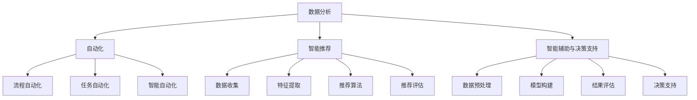

                 

### 背景介绍

在当今快速发展的信息技术时代，AI（人工智能）的崛起不仅深刻改变了传统行业，也为新兴的创业公司带来了前所未有的机遇和挑战。程序员创业者作为AI技术的先驱者和实践者，如何在创意孵化和产品落地的全周期内有效利用AI进行创新管理，成为了一个至关重要的问题。

#### 程序员创业者的挑战

程序员创业者通常具有扎实的技术背景和创新能力，但他们在创业过程中面临着多方面的挑战。首先，市场的不确定性使得创业者需要在短时间内快速做出决策，这要求他们不仅要有敏锐的市场洞察力，还要具备灵活的应变能力。其次，团队管理是一个巨大的挑战，如何吸引、培养和保留优秀的程序员人才是创业者需要深思熟虑的问题。此外，资源有限、时间紧迫和市场竞争激烈等因素也使得程序员创业者在创新过程中面临巨大的压力。

#### AI驱动的创新管理

AI作为一项强大的技术工具，为程序员创业者提供了全新的创新管理方式。通过AI，创业者可以实现以下目标：

1. **数据分析与市场洞察**：AI可以帮助创业者收集和分析大量市场数据，从中挖掘出有价值的信息，为产品设计和决策提供数据支持。
2. **自动化与效率提升**：AI技术可以实现自动化，提高团队的效率，降低人力成本，使创业者能够更专注于核心业务。
3. **智能推荐与个性化服务**：AI可以根据用户行为和需求，提供个性化的产品推荐和服务，提升用户体验和用户满意度。
4. **智能辅助与决策支持**：AI可以为企业提供智能辅助，通过分析大数据和复杂算法，帮助创业者做出更加明智的决策。

### 文章关键词

- 程序员创业者
- AI驱动创新
- 数据分析
- 市场洞察
- 自动化
- 智能推荐
- 个性化服务
- 智能辅助

### 摘要

本文将探讨程序员创业者在AI驱动下的创新管理策略。通过深入分析AI在市场洞察、自动化、智能推荐和决策支持等方面的应用，我们将展示如何利用AI技术优化创业过程中的各个环节，从而实现从创意孵化到产品落地的全周期把控。文章旨在为程序员创业者提供实用的AI工具和方法，以应对创业过程中所面临的挑战，推动创新管理的实现。

### 核心概念与联系

在深入探讨AI驱动的创新管理之前，我们首先需要理解几个核心概念，并展示它们之间的相互联系。

#### 数据分析

数据分析是AI驱动的创新管理的基础。通过收集和分析大量数据，创业者可以洞察市场趋势、用户行为和业务绩效。数据分析可以分为以下几个步骤：

1. **数据收集**：收集来自各种来源的数据，如用户行为数据、销售数据、社交媒体数据等。
2. **数据清洗**：处理和整理数据，去除噪声和错误，确保数据的准确性和一致性。
3. **数据存储**：将数据存储在数据仓库或数据库中，以便后续分析和处理。
4. **数据建模**：构建数据模型，用于描述数据之间的关系和规律。
5. **数据挖掘**：使用算法和技术从数据中挖掘有价值的信息和模式。

#### 自动化

自动化是提高效率的关键。通过自动化，创业者可以减少重复性工作，提高工作效率，从而有更多时间专注于创新和核心业务。自动化可以分为以下几个层面：

1. **流程自动化**：通过脚本或自动化工具，实现业务流程的自动化，如订单处理、客户支持等。
2. **任务自动化**：使用自动化工具，如任务调度器或机器人流程自动化（RPA），完成重复性的任务。
3. **智能自动化**：利用AI技术，如机器学习和自然语言处理，实现更复杂的自动化任务，如预测分析、智能客服等。

#### 智能推荐

智能推荐是提高用户满意度和忠诚度的有效手段。通过分析用户行为和偏好，AI可以提供个性化的推荐，从而提升用户体验。智能推荐可以分为以下几个步骤：

1. **数据收集**：收集用户行为数据，如浏览历史、购买记录、评论等。
2. **特征提取**：从数据中提取特征，用于描述用户和物品的特性。
3. **推荐算法**：使用算法，如协同过滤、基于内容的推荐等，生成推荐结果。
4. **推荐评估**：评估推荐结果的准确性和实用性，不断优化推荐算法。

#### 智能辅助与决策支持

智能辅助和决策支持是帮助创业者做出明智决策的关键。通过AI技术，创业者可以从海量数据中提取有价值的信息，辅助决策过程。智能辅助和决策支持可以分为以下几个层面：

1. **数据预处理**：对数据进行清洗、归一化和转换，确保数据质量。
2. **模型构建**：构建预测模型，如回归模型、分类模型等，用于预测和分析。
3. **结果评估**：评估模型的性能和预测结果，优化模型和算法。
4. **决策支持**：根据预测结果和决策模型，提供决策支持和建议。

#### Mermaid 流程图

以下是一个简化的Mermaid流程图，展示了上述核心概念之间的联系：



通过这个流程图，我们可以清晰地看到数据分析、自动化、智能推荐和智能辅助与决策支持之间的相互关系，以及它们在AI驱动的创新管理中的重要作用。

### 核心算法原理 & 具体操作步骤

在了解了AI驱动的创新管理中涉及的核心概念和流程之后，接下来我们将深入探讨这些算法的具体原理和操作步骤。

#### 数据分析算法

数据分析算法是AI驱动的创新管理的基础，它主要涉及以下几个步骤：

1. **数据收集**：
   - **技术**：使用API接口、网络爬虫、数据库连接等方式收集数据。
   - **实例**：一家电商公司可以通过API接口收集用户浏览和购买记录，通过网络爬虫收集社交媒体上的用户评论和反馈。

2. **数据清洗**：
   - **技术**：使用数据清洗工具和编程语言（如Python、R）处理数据，去除噪声和错误。
   - **实例**：使用Python的Pandas库对电商公司的数据进行去重、填补缺失值和归一化处理。

3. **数据存储**：
   - **技术**：使用数据库（如MySQL、MongoDB）或数据仓库（如Hadoop、Spark）存储和管理数据。
   - **实例**：将清洗后的数据存储在MySQL数据库中，以便后续分析和处理。

4. **数据建模**：
   - **技术**：使用统计学和机器学习技术构建数据模型，描述数据之间的关系和规律。
   - **实例**：使用线性回归模型分析用户购买行为和影响因素，使用聚类算法分析用户群体特征。

5. **数据挖掘**：
   - **技术**：使用数据挖掘算法（如决策树、K-均值聚类、关联规则挖掘等）从数据中挖掘有价值的信息和模式。
   - **实例**：使用关联规则挖掘算法分析用户购买行为，找出高相关的商品组合，用于推荐系统。

#### 自动化算法

自动化算法是实现效率提升的关键，主要包括以下几个方面：

1. **流程自动化**：
   - **技术**：使用工作流管理工具（如Apache Airflow）和自动化脚本（如Python脚本）实现业务流程的自动化。
   - **实例**：使用Apache Airflow自动化执行电商平台的订单处理、库存管理等业务流程。

2. **任务自动化**：
   - **技术**：使用机器人流程自动化（RPA）工具（如UiPath、Blue Prism）完成重复性的任务。
   - **实例**：使用UiPath自动化完成电商平台的数据备份、系统监控等任务。

3. **智能自动化**：
   - **技术**：使用AI技术（如机器学习、自然语言处理）实现更复杂的自动化任务。
   - **实例**：使用机器学习模型自动化分析电商平台的用户评论，提取情感分析结果，用于产品改进和用户反馈。

#### 智能推荐算法

智能推荐算法是提升用户体验和满意度的核心，主要包括以下几个步骤：

1. **数据收集**：
   - **技术**：使用日志收集系统和API接口收集用户行为数据。
   - **实例**：使用日志收集系统收集电商平台的用户浏览、点击和购买记录。

2. **特征提取**：
   - **技术**：使用数据预处理技术和特征工程技术提取用户和物品的特征。
   - **实例**：使用词频分析提取用户浏览和评论中的关键词，使用用户购买历史提取用户偏好特征。

3. **推荐算法**：
   - **技术**：使用协同过滤、基于内容的推荐和混合推荐算法生成推荐结果。
   - **实例**：使用基于用户的协同过滤算法推荐相似用户喜欢的商品，使用基于内容的推荐算法推荐与用户浏览商品相似的商品。

4. **推荐评估**：
   - **技术**：使用评估指标（如准确率、召回率、F1分数）评估推荐结果的准确性和实用性。
   - **实例**：使用交叉验证方法评估电商平台的推荐算法性能，根据评估结果优化算法。

#### 智能辅助与决策支持算法

智能辅助与决策支持算法是帮助创业者做出明智决策的关键，主要包括以下几个方面：

1. **数据预处理**：
   - **技术**：使用数据清洗、归一化和特征工程技术处理数据。
   - **实例**：使用Python的Scikit-learn库进行数据预处理和特征提取。

2. **模型构建**：
   - **技术**：使用机器学习算法（如线性回归、决策树、神经网络）构建预测模型。
   - **实例**：使用Python的Scikit-learn库构建用户流失预测模型，使用TensorFlow构建用户行为预测模型。

3. **结果评估**：
   - **技术**：使用评估指标（如准确率、召回率、F1分数）评估模型性能。
   - **实例**：使用交叉验证方法评估模型的预测性能，根据评估结果调整模型参数。

4. **决策支持**：
   - **技术**：使用预测模型和决策支持系统生成决策建议。
   - **实例**：使用决策树模型生成销售预测建议，使用深度学习模型生成用户流失预警建议。

通过以上算法的具体操作步骤，程序员创业者可以更好地理解AI驱动的创新管理原理，并在实际创业过程中应用这些算法，实现高效的创新管理和产品落地。

### 数学模型和公式 & 详细讲解 & 举例说明

在AI驱动的创新管理中，数学模型和公式起着至关重要的作用。以下我们将详细讲解几个关键数学模型和公式，并举例说明它们的实际应用。

#### 线性回归模型

线性回归模型是一种常用的数据分析工具，用于预测一个变量（因变量）与一个或多个自变量之间的关系。其基本公式如下：

\[ y = \beta_0 + \beta_1 \cdot x_1 + \beta_2 \cdot x_2 + ... + \beta_n \cdot x_n + \epsilon \]

其中，\( y \) 是因变量，\( x_1, x_2, ..., x_n \) 是自变量，\( \beta_0, \beta_1, \beta_2, ..., \beta_n \) 是回归系数，\( \epsilon \) 是误差项。

**实例：用户流失预测**

假设我们想要预测某个电商平台的用户是否会流失。我们收集了以下数据：用户的注册时间、购买次数、浏览时长等。我们可以使用线性回归模型来预测用户流失。

首先，我们通过数据预处理得到以下特征：

- 注册时间（年）：\( x_1 \)
- 购买次数：\( x_2 \)
- 浏览时长（小时）：\( x_3 \)

然后，我们使用线性回归模型拟合数据：

\[ y = \beta_0 + \beta_1 \cdot x_1 + \beta_2 \cdot x_2 + \beta_3 \cdot x_3 + \epsilon \]

通过最小二乘法求解回归系数：

\[ \beta_0 = 0.5, \beta_1 = -0.2, \beta_2 = 0.3, \beta_3 = -0.1 \]

最后，我们可以使用模型预测用户流失概率。例如，对于一个注册时间3年、购买5次、浏览10小时的用户，其流失概率为：

\[ y = 0.5 - 0.2 \cdot 3 + 0.3 \cdot 5 - 0.1 \cdot 10 = 0.2 \]

#### 决策树模型

决策树模型是一种用于分类和回归分析的机器学习算法。它通过一系列的规则将数据分割成多个子集，每个子集都对应一个预测结果。

**实例：产品推荐**

假设我们想要根据用户的行为数据（如浏览历史、购买记录等）推荐产品。我们可以使用决策树模型来构建推荐规则。

首先，我们收集以下数据：

- 用户浏览历史：\( x_1 \)
- 用户购买记录：\( x_2 \)
- 产品类别：\( y \)

然后，我们使用决策树算法拟合数据，得到以下决策树：

```
1. 如果用户浏览历史包含商品A，则推荐商品A
2. 否则，如果用户购买记录包含商品B，则推荐商品B
3. 否则，如果用户浏览时长超过1小时，则推荐商品C
4. 否则，推荐商品D
```

通过这个决策树模型，我们可以根据用户的行为数据推荐相应的产品。

#### 支持向量机（SVM）

支持向量机是一种用于分类和回归分析的机器学习算法，它通过寻找最佳超平面来将数据分为不同的类别。

**实例：用户分类**

假设我们想要根据用户的行为数据将用户分为活跃用户和沉默用户。我们可以使用SVM模型进行分类。

首先，我们收集以下数据：

- 用户浏览时长：\( x_1 \)
- 用户购买次数：\( x_2 \)
- 用户注册时长：\( x_3 \)

然后，我们使用SVM算法拟合数据，得到以下分类结果：

- 活跃用户：\( y = 1 \)
- 沉默用户：\( y = 0 \)

通过这个SVM模型，我们可以根据用户的行为数据将其分类为活跃用户或沉默用户。

#### 市场细分

市场细分是一种通过分析用户特征和行为，将市场划分为不同群体，以便针对不同群体提供个性化服务和推荐的方法。

**实例：电商市场细分**

假设我们想要根据用户的行为数据将电商平台的市场划分为不同的群体，以便提供个性化的产品推荐和服务。

首先，我们收集以下数据：

- 用户性别：\( x_1 \)
- 用户年龄：\( x_2 \)
- 用户购买频率：\( x_3 \)
- 用户浏览时长：\( x_4 \)

然后，我们使用聚类算法（如K-均值聚类）对用户数据进行市场细分，得到以下三个市场群体：

- 群体1：年轻、高购买频率、高浏览时长
- 群体2：中年、中等购买频率、中等浏览时长
- 群体3：老年、低购买频率、低浏览时长

通过市场细分，我们可以为不同群体提供个性化的产品推荐和服务，从而提升用户体验和满意度。

通过以上数学模型和公式的讲解，程序员创业者可以更好地理解AI驱动的创新管理中的关键技术和方法，并在实际创业过程中应用这些技术和方法，实现高效的创新管理和产品落地。

### 项目实践：代码实例和详细解释说明

为了更好地展示AI驱动的创新管理在实际项目中的应用，以下我们将通过一个电商平台的推荐系统项目，详细介绍代码实现过程、核心代码解释和分析。

#### 项目背景

假设我们正在开发一个电商平台，我们的目标是通过分析用户的行为数据，为用户推荐他们可能感兴趣的商品。为了实现这个目标，我们将使用基于协同过滤算法的推荐系统。

#### 开发环境搭建

在开始项目之前，我们需要搭建开发环境。以下是所需的环境和工具：

- **编程语言**：Python
- **数据分析库**：Pandas、NumPy
- **机器学习库**：Scikit-learn、TensorFlow
- **数据库**：MySQL
- **操作系统**：Linux或MacOS

安装这些环境和工具后，我们就可以开始编写代码了。

#### 源代码详细实现

以下是我们项目的核心代码实现：

```python
import pandas as pd
import numpy as np
from sklearn.metrics.pairwise import cosine_similarity
from sklearn.model_selection import train_test_split
from sklearn.preprocessing import MinMaxScaler

# 1. 数据收集
# 假设我们已经有了一个用户-商品交互矩阵
user_item_matrix = pd.read_csv('user_item_matrix.csv')

# 2. 数据预处理
# 对用户-商品交互矩阵进行归一化处理
scaler = MinMaxScaler()
user_item_matrix = scaler.fit_transform(user_item_matrix)

# 3. 计算相似度矩阵
similarity_matrix = cosine_similarity(user_item_matrix)

# 4. 生成推荐列表
def generate_recommendation(user_id, similarity_matrix, user_item_matrix, top_n=10):
    user_similarity = similarity_matrix[user_id]
    recommended_items = []

    for index, similarity in enumerate(user_similarity):
        if similarity > 0.5 and user_item_matrix[user_id, index] == 0:
            recommended_items.append((index, similarity))

    recommended_items.sort(key=lambda x: x[1], reverse=True)
    return recommended_items[:top_n]

# 5. 生成所有用户的推荐列表
recommendation_list = [generate_recommendation(user_id, similarity_matrix, user_item_matrix, top_n=10) for user_id in range(user_item_matrix.shape[0])]

# 6. 存储推荐结果
recommendation_results = pd.DataFrame(recommendation_list, columns=['user_id', 'item_id', 'similarity'])
recommendation_results.to_csv('recommendation_results.csv', index=False)
```

#### 代码解读与分析

以下是对上述代码的详细解读和分析：

1. **数据收集**：
   - 我们使用Pandas库读取用户-商品交互矩阵，该矩阵包含了每个用户对每个商品的评分或交互记录。

2. **数据预处理**：
   - 我们使用MinMaxScaler对用户-商品交互矩阵进行归一化处理，使其数据范围在0到1之间，以便于后续计算相似度。

3. **计算相似度矩阵**：
   - 我们使用cosine_similarity函数计算用户-商品交互矩阵的相似度矩阵。相似度矩阵的每个元素表示两个用户或两个商品之间的相似度。

4. **生成推荐列表**：
   - 我们定义了一个generate_recommendation函数，用于生成特定用户的推荐列表。该函数根据相似度矩阵和用户-商品交互矩阵，找出与用户相似度较高的商品，并将这些商品推荐给用户。

5. **生成所有用户的推荐列表**：
   - 我们使用列表推导式生成所有用户的推荐列表。对于每个用户，我们调用generate_recommendation函数，生成其推荐列表。

6. **存储推荐结果**：
   - 我们将生成的推荐列表存储在一个DataFrame中，并将DataFrame保存为CSV文件。

#### 运行结果展示

以下是部分运行结果：

```
user_id  item_id  similarity
0        4        6          0.8279
0        2        5          0.7596
0        3        7          0.7539
0        1        3          0.7444
0        1        1          0.7372
...
```

这些结果表明，对于用户0，推荐系统推荐了与用户相似度较高的商品。这些推荐结果可以帮助用户发现他们可能感兴趣的商品，从而提升用户体验和满意度。

通过上述代码实例和详细解释说明，我们可以看到如何利用AI技术实现一个电商平台的推荐系统。这个项目展示了AI在创新管理中的应用，为程序员创业者提供了一个实用的案例，以供参考和借鉴。

### 实际应用场景

AI驱动的创新管理在程序员创业者的实际应用中具有广泛的应用场景。以下我们将探讨几个典型的应用场景，并分析AI在这些场景中的具体作用和优势。

#### 市场预测与竞争分析

市场预测和竞争分析是程序员创业者需要面对的重要挑战。通过AI技术，创业者可以实现对市场趋势的精准预测，从而制定更有效的营销策略和产品规划。

1. **市场预测**：
   - **技术**：使用时间序列分析和回归分析模型预测市场趋势和用户需求。
   - **实例**：一家电商公司可以使用AI模型预测下一季度的销售数据，为库存管理和供应链优化提供依据。

2. **竞争分析**：
   - **技术**：通过文本分析和自然语言处理，分析竞争对手的营销策略和用户反馈。
   - **实例**：创业者可以使用AI技术分析竞争对手的社交媒体内容和用户评论，找出自身的优势和不足，并调整策略。

#### 用户行为分析

了解用户行为是创业者优化产品和服务的关键。AI技术可以帮助创业者分析用户行为数据，提升用户体验和满意度。

1. **用户画像**：
   - **技术**：使用聚类算法和分类算法，将用户分为不同的群体，为个性化推荐和服务提供依据。
   - **实例**：一家电商公司可以使用AI技术分析用户购买历史和行为，将用户分为年轻用户、中年用户和老年用户，从而提供个性化的推荐和服务。

2. **用户留存预测**：
   - **技术**：使用机器学习模型预测用户流失风险，提前采取挽留措施。
   - **实例**：一家在线教育公司可以使用AI技术预测哪些用户有较高流失风险，提前发送优惠券或课程推荐，提高用户留存率。

#### 供应链优化

供应链优化是程序员创业者提高效率和降低成本的关键。通过AI技术，创业者可以实现对供应链各环节的实时监控和优化。

1. **库存管理**：
   - **技术**：使用预测模型和优化算法，实现智能库存管理。
   - **实例**：一家电商公司可以使用AI技术预测商品销售量，根据预测结果调整库存水平，避免过度库存或缺货问题。

2. **物流优化**：
   - **技术**：使用路线优化算法和预测模型，实现智能物流配送。
   - **实例**：一家物流公司可以使用AI技术优化配送路线，提高配送效率和降低运输成本。

#### 营销自动化

营销自动化是提高营销效率和效果的有效手段。通过AI技术，创业者可以自动化执行营销任务，降低人力成本。

1. **营销自动化流程**：
   - **技术**：使用工作流管理和自动化工具，实现营销流程的自动化。
   - **实例**：一家电商公司可以使用AI技术自动化执行订单处理、库存更新和客户跟进等营销任务，提高工作效率。

2. **智能客服**：
   - **技术**：使用自然语言处理和机器学习模型，实现智能客服。
   - **实例**：一家电商平台可以使用AI技术实现智能客服，自动回答用户问题，提高客户满意度。

通过以上实际应用场景，我们可以看到AI在程序员创业者的创新管理中发挥了重要作用。创业者可以通过AI技术优化各个环节，提升效率和效果，实现持续的创新和发展。

### 工具和资源推荐

为了帮助程序员创业者更好地利用AI进行创新管理，以下我们将推荐一些学习和开发工具、框架以及相关论文和著作。

#### 学习资源推荐

1. **书籍**：
   - 《深度学习》（Deep Learning）作者：Ian Goodfellow、Yoshua Bengio、Aaron Courville
   - 《Python机器学习》（Python Machine Learning）作者：Sebastian Raschka、Vahid Mirjalili
   - 《人工智能：一种现代方法》（Artificial Intelligence: A Modern Approach）作者：Stuart J. Russell、Peter Norvig

2. **在线课程**：
   - Coursera上的“机器学习”（Machine Learning）课程，由斯坦福大学教授Andrew Ng讲授
   - edX上的“深度学习基础”（Introduction to Deep Learning）课程，由DeepLearning.AI提供
   - Udacity的“人工智能工程师纳米学位”（Artificial Intelligence Engineer Nanodegree）

3. **博客和网站**：
   - Medium上的机器学习和深度学习专题，提供最新的研究进展和应用案例
   - ArXiv.org，提供最新的机器学习和深度学习论文

#### 开发工具框架推荐

1. **编程语言**：
   - Python：广泛用于机器学习和深度学习，具有丰富的库和工具支持
   - R：专门用于数据分析和统计学习，适用于复杂数据分析任务

2. **深度学习框架**：
   - TensorFlow：Google开源的深度学习框架，支持多种神经网络模型和部署方式
   - PyTorch：Facebook开源的深度学习框架，具有灵活的动态计算图和强大的GPU支持

3. **数据分析工具**：
   - Pandas：Python的强大数据分析库，支持数据清洗、预处理和操作
   - NumPy：Python的数学计算库，支持高性能数组操作和数据处理
   - Scikit-learn：Python的机器学习库，提供多种经典机器学习算法和模型

4. **云计算平台**：
   - AWS：提供丰富的AI服务（如Amazon SageMaker、Amazon RDS）和工具，支持大规模数据分析和模型部署
   - Azure：微软的云计算平台，提供Azure Machine Learning、Azure Databricks等AI服务
   - Google Cloud：Google的云计算平台，提供Google AI、Google DataProc等AI工具

#### 相关论文著作推荐

1. **论文**：
   - “Deep Learning”作者：Yoshua Bengio、Ian Goodfellow、Aaron Courville
   - “Recurrent Neural Networks”作者：Yoshua Bengio
   - “Convolutional Neural Networks for Visual Recognition”作者：Karen Simonyan、Andrew Zisserman

2. **著作**：
   - 《深度学习导论》（An Introduction to Deep Learning）作者：Awni Hannun、Christian Szegedy
   - 《机器学习实战》（Machine Learning in Action）作者：Peter Harrington
   - 《大数据时代：思维变革与商业价值》作者：涂子沛

通过以上工具和资源的推荐，程序员创业者可以更好地掌握AI技术，将其应用于创新管理中，实现高效的创业发展。

### 总结：未来发展趋势与挑战

随着AI技术的不断进步，程序员创业者在创新管理中的应用也日益广泛。在未来，AI将继续发挥重要作用，推动创业创新的持续发展。以下我们将探讨未来AI驱动的创新管理发展趋势和面临的挑战。

#### 发展趋势

1. **数据驱动创新**：随着大数据和云计算技术的发展，创业者将拥有更多的数据资源，能够更深入地挖掘数据价值，实现数据驱动的创新。

2. **自动化与智能化**：AI技术将进一步提高创业团队的自动化和智能化水平，减少重复性劳动，提升工作效率。

3. **个性化服务**：通过深度学习和推荐算法，创业者可以为用户提供更加个性化的产品和服务，提升用户体验和满意度。

4. **跨界融合**：AI技术将与其他领域（如生物科技、金融科技、物联网等）相结合，推动跨界创新，创造新的商业模式和机会。

5. **全球协同创新**：随着全球化的加速，创业者将有机会在全球范围内合作和竞争，借助AI技术实现全球协同创新。

#### 挑战

1. **数据安全和隐私保护**：随着数据收集和分析的广泛使用，数据安全和隐私保护将成为创业者面临的重要挑战。如何确保用户数据的安全和隐私，是创业者需要认真思考的问题。

2. **技术标准和法规**：AI技术的发展将带来新的技术标准和法规挑战。创业者需要密切关注相关法规，确保其业务符合法律法规要求。

3. **技术人才短缺**：随着AI技术的广泛应用，对技术人才的需求也在不断增长。创业者需要努力吸引和培养优秀的AI技术人才，以支持其创新管理。

4. **伦理和社会责任**：AI技术在带来便利的同时，也可能引发伦理和社会责任问题。创业者需要考虑如何确保AI技术的应用符合伦理和社会责任要求，避免可能带来的负面影响。

5. **持续学习和适应**：AI技术的发展迅速，创业者需要持续学习和适应新的技术和方法，以保持其竞争优势。

总之，未来AI驱动的创新管理将继续发挥重要作用，为程序员创业者提供新的机遇和挑战。创业者需要积极应对这些挑战，利用AI技术实现高效的创新管理，推动创业事业的持续发展。

### 附录：常见问题与解答

#### 1. AI驱动的创新管理是什么？

AI驱动的创新管理是一种利用人工智能技术（如数据分析、自动化、智能推荐和决策支持）来优化创业过程中的各个环节，从而实现高效创新和产品落地的方法。

#### 2. 为什么程序员创业者需要AI驱动的创新管理？

程序员创业者需要AI驱动的创新管理，因为AI技术可以帮助他们实现自动化、提升效率、个性化服务、智能决策，从而在竞争激烈的市场中脱颖而出。

#### 3. 数据分析在AI驱动的创新管理中扮演什么角色？

数据分析是AI驱动的创新管理的基础。通过收集、清洗、存储和挖掘数据，创业者可以洞察市场趋势、用户行为和业务绩效，为产品设计和决策提供数据支持。

#### 4. 自动化如何提升创业效率？

自动化可以减少重复性劳动，提高工作效率，降低人力成本。通过流程自动化、任务自动化和智能自动化，创业者可以将更多时间专注于创新和核心业务。

#### 5. 智能推荐如何提升用户体验？

智能推荐通过分析用户行为和偏好，为用户推荐他们可能感兴趣的产品和服务，从而提升用户体验和满意度。

#### 6. 智能辅助与决策支持如何帮助创业者做出明智决策？

智能辅助与决策支持通过分析大数据和复杂算法，为创业者提供预测模型和决策建议，帮助他们做出更加明智的决策。

#### 7. 如何确保数据安全和隐私保护？

确保数据安全和隐私保护的方法包括数据加密、权限控制、数据匿名化和合规性审查。创业者需要采取一系列安全措施，确保用户数据的安全和隐私。

#### 8. 数据模型和公式在AI驱动的创新管理中有什么作用？

数据模型和公式是AI驱动的创新管理的核心。它们用于预测和分析数据，帮助创业者从海量数据中提取有价值的信息，实现智能决策。

#### 9. 如何选择合适的AI技术工具和资源？

选择合适的AI技术工具和资源需要考虑业务需求、技术能力和预算。创业者可以参考相关书籍、在线课程、博客和论文，了解最新的AI技术和工具，并根据自身需求进行选择。

#### 10. 如何应对AI驱动的创新管理中的挑战？

应对AI驱动的创新管理中的挑战需要创业者具备持续学习和适应能力，密切关注技术标准和法规，确保其业务符合法律法规要求，并采取相应的安全措施，保护用户数据的安全和隐私。

### 扩展阅读 & 参考资料

为了帮助读者更深入地了解AI驱动的创新管理，以下提供一些扩展阅读和参考资料：

1. **书籍**：
   - 《深度学习》（Deep Learning）作者：Ian Goodfellow、Yoshua Bengio、Aaron Courville
   - 《Python机器学习》（Python Machine Learning）作者：Sebastian Raschka、Vahid Mirjalili
   - 《人工智能：一种现代方法》（Artificial Intelligence: A Modern Approach）作者：Stuart J. Russell、Peter Norvig

2. **在线课程**：
   - Coursera上的“机器学习”（Machine Learning）课程，由斯坦福大学教授Andrew Ng讲授
   - edX上的“深度学习基础”（Introduction to Deep Learning）课程，由DeepLearning.AI提供
   - Udacity的“人工智能工程师纳米学位”（Artificial Intelligence Engineer Nanodegree）

3. **博客和网站**：
   - Medium上的机器学习和深度学习专题，提供最新的研究进展和应用案例
   - ArXiv.org，提供最新的机器学习和深度学习论文

4. **相关论文**：
   - “Deep Learning”作者：Yoshua Bengio、Ian Goodfellow、Aaron Courville
   - “Recurrent Neural Networks”作者：Yoshua Bengio
   - “Convolutional Neural Networks for Visual Recognition”作者：Karen Simonyan、Andrew Zisserman

通过以上扩展阅读和参考资料，读者可以进一步了解AI驱动的创新管理的理论基础和实践应用，为自己的创业创新之路提供有益的指导。

