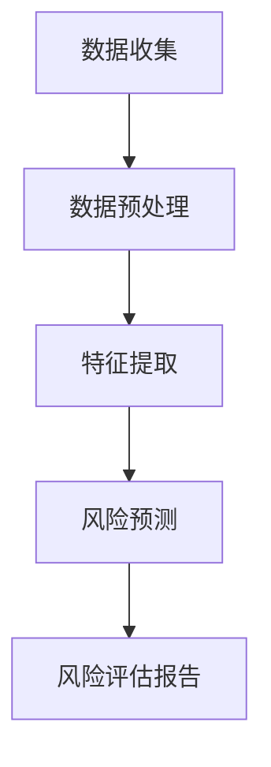

                 

### 1. 背景介绍

在当今快速发展的数字经济时代，程序员创业已经成为了一种普遍现象。越来越多的程序员选择离开大公司，追求在创业中实现自己的梦想和目标。然而，创业之路并非一帆风顺，风险无处不在。如何有效地识别和规避这些风险，成为了程序员创业者面临的重要课题。

AI技术的迅速发展为风险评估提供了新的可能性。通过机器学习、自然语言处理和数据分析等技术，AI能够从大量的历史数据中提取出有价值的信息，帮助创业者预测潜在的风险，并制定相应的应对策略。本文将深入探讨如何利用AI技术进行创业风险评估，包括核心概念的引入、算法原理的阐述、数学模型的构建以及实际应用案例的展示。

首先，我们需要明确几个核心概念。创业风险指的是在创业过程中可能面临的各种不确定性因素，包括市场风险、财务风险、技术风险和运营风险等。市场风险指的是市场需求的不确定性，如市场规模、消费者偏好等；财务风险则涉及资金链断裂、融资难等问题；技术风险是指技术实现和创新能力的不确定性；运营风险包括供应链管理、人员管理等方面的问题。

AI技术，特别是机器学习和自然语言处理，为创业风险评估提供了强有力的工具。通过机器学习算法，AI可以从海量数据中学习并提取出潜在的模式和规律，从而帮助创业者识别和预测风险。自然语言处理技术则使得创业者能够从非结构化的文本数据中提取出有价值的信息，如客户反馈、市场分析报告等。

本文将按照以下结构进行展开：

1. **背景介绍**：阐述程序员创业的普遍现象及创业风险评估的重要性。
2. **核心概念与联系**：介绍创业风险的基本概念，并使用Mermaid流程图展示AI技术如何与创业风险评估相结合。
3. **核心算法原理 & 具体操作步骤**：详细解析AI在创业风险评估中的具体应用，包括数据收集、预处理、特征提取和风险预测等步骤。
4. **数学模型和公式 & 详细讲解 & 举例说明**：引入相关的数学模型和公式，并通过实例解释其在风险评估中的应用。
5. **项目实践：代码实例和详细解释说明**：提供具体的代码实现，并详细解释其原理和操作步骤。
6. **实际应用场景**：探讨AI驱动风险评估在程序员创业中的具体应用实例。
7. **工具和资源推荐**：推荐相关的学习资源和开发工具，以帮助读者深入学习和实践。
8. **总结：未来发展趋势与挑战**：总结本文的主要观点，并探讨AI驱动风险评估未来的发展趋势和面临的挑战。
9. **附录：常见问题与解答**：回答读者可能遇到的一些常见问题。
10. **扩展阅读 & 参考资料**：提供进一步的阅读资源和参考资料。

通过以上结构，我们将一步步深入探讨如何利用AI技术进行创业风险评估，帮助程序员创业者更好地识别和规避风险，从而提高创业成功率。接下来，我们将引入核心概念，并使用Mermaid流程图展示AI技术在创业风险评估中的应用。

### 2. 核心概念与联系

在探讨如何利用AI技术进行创业风险评估之前，首先需要明确几个核心概念，并展示它们之间的相互联系。以下是创业风险评估中几个关键概念的介绍，以及它们与AI技术的关联。

#### 2.1 创业风险类型

创业风险可以分为市场风险、财务风险、技术风险和运营风险等类型。

- **市场风险**：指由于市场环境变化或消费者需求变化而导致的风险。这包括市场需求波动、竞争加剧、消费者偏好变化等。
- **财务风险**：指由于资金链断裂、融资困难等问题可能导致的风险。这包括现金流短缺、成本超支、利润率下降等。
- **技术风险**：指由于技术创新难度或失败可能导致的风险。这包括技术实现难度、创新能力不足、专利纠纷等。
- **运营风险**：指由于运营管理不善可能导致的风险。这包括供应链管理问题、人员管理问题、法律纠纷等。

#### 2.2 AI技术基本概念

AI技术，即人工智能，是指由人制造出来的系统能够执行通常需要人类智能才能完成的任务。AI技术主要包括机器学习、深度学习、自然语言处理、计算机视觉等方向。

- **机器学习**：指通过数据驱动的方式，使计算机系统能够学习并做出决策。它包括监督学习、无监督学习和强化学习等。
- **深度学习**：是一种特殊的机器学习方法，通过神经网络模型模拟人脑的学习方式，处理复杂的模式识别任务。
- **自然语言处理（NLP）**：指使计算机能够理解、生成和处理自然语言。它包括语言模型、文本分类、情感分析等。
- **计算机视觉**：指使计算机能够理解和解释视觉信息。它包括图像分类、目标检测、图像生成等。

#### 2.3 创业风险评估与AI技术的关系

AI技术为创业风险评估提供了强有力的支持。通过以下方式，AI技术能够有效地识别和预测创业风险：

- **数据收集**：AI技术可以通过互联网、社交媒体、行业报告等渠道，收集大量的数据。
- **预处理**：AI技术可以对收集到的数据进行清洗、转换和标准化，以消除噪声和提高数据质量。
- **特征提取**：AI技术可以从原始数据中提取出有价值的特征，如关键词、情感倾向、关键指标等。
- **风险预测**：通过机器学习和深度学习算法，AI技术可以对创业风险进行预测，并给出相应的风险评估报告。

#### 2.4 Mermaid流程图展示

为了更好地展示AI技术在创业风险评估中的应用，我们可以使用Mermaid流程图来描述整个过程。以下是创业风险评估的Mermaid流程图：



在这个流程图中，A、B、C、D和E分别代表了数据收集、数据预处理、特征提取、风险预测和风险评估报告这五个步骤。每个步骤都对应了创业风险评估的一个关键环节，通过AI技术的应用，这些环节能够有效地识别和预测创业风险。

通过以上核心概念的介绍和Mermaid流程图的展示，我们可以清晰地看到AI技术在创业风险评估中的重要作用。接下来，我们将深入探讨AI在创业风险评估中的具体应用，包括数据收集、预处理、特征提取和风险预测等步骤。

### 3. 核心算法原理 & 具体操作步骤

在了解了创业风险评估的核心概念与AI技术的关系后，接下来我们将详细探讨AI在创业风险评估中的核心算法原理，并逐步介绍具体操作步骤。

#### 3.1 数据收集

数据收集是创业风险评估的第一步，也是至关重要的一步。准确、全面的数据为后续的风险预测提供了基础。数据收集的渠道可以包括以下几个方面：

- **公共数据集**：如国家统计局、行业报告等，这些数据通常具有权威性和可靠性。
- **社交媒体数据**：通过爬取社交媒体平台（如微博、微信、Twitter等）的相关数据，可以了解市场动态和消费者需求。
- **企业内部数据**：如财务数据、销售数据、客户反馈等，这些数据直接反映了企业的运营状况。

具体操作步骤如下：

1. **确定数据来源**：根据风险评估的需要，确定需要收集的数据类型和来源。
2. **数据获取**：通过API接口、爬虫等方式获取数据，确保数据的及时性和准确性。
3. **数据存储**：将收集到的数据存储在数据库或数据仓库中，便于后续处理和分析。

#### 3.2 数据预处理

数据预处理是数据收集后的重要步骤，目的是提高数据质量，为特征提取和风险预测奠定基础。数据预处理的主要任务包括数据清洗、数据转换和数据标准化等。

1. **数据清洗**：清洗数据中的噪声和异常值，如去除重复记录、填补缺失值、处理错误数据等。
2. **数据转换**：将非数值型的数据转换为数值型数据，如文本数据编码、类别数据标号等。
3. **数据标准化**：对数据进行归一化或标准化处理，消除数据规模差异，提高算法性能。

具体操作步骤如下：

1. **数据清洗**：使用Python的Pandas库或R语言的dplyr包进行数据清洗，如使用drop_duplicates()函数去除重复记录，使用fillna()函数填补缺失值等。
2. **数据转换**：使用NLP技术将文本数据转换为向量表示，如使用Word2Vec或BERT模型进行文本编码。
3. **数据标准化**：使用Scikit-learn库中的StandardScaler或MinMaxScaler进行数据标准化处理。

#### 3.3 特征提取

特征提取是将原始数据转换为对风险预测有意义的高质量特征的过程。特征提取的质量直接影响到风险预测的准确性。常用的特征提取方法包括：

- **统计特征**：如平均值、标准差、最大值、最小值等。
- **文本特征**：如词频、词向量、TF-IDF等。
- **图像特征**：如颜色直方图、边缘特征、纹理特征等。

具体操作步骤如下：

1. **统计特征提取**：使用Python的Pandas库或R语言的dplyr包计算统计特征，如使用describe()函数获取平均值、标准差等。
2. **文本特征提取**：使用NLP技术提取文本特征，如使用TF-IDF模型计算词频、词向量等。
3. **图像特征提取**：使用OpenCV或TensorFlow等库提取图像特征，如使用边缘检测、纹理分析等方法。

#### 3.4 风险预测

风险预测是创业风险评估的核心环节，目的是根据提取的特征预测创业风险。常用的风险预测方法包括：

- **分类算法**：如逻辑回归、支持向量机、随机森林等。
- **回归算法**：如线性回归、岭回归等。
- **神经网络**：如深度神经网络、卷积神经网络等。

具体操作步骤如下：

1. **模型选择**：根据数据特点和预测任务选择合适的模型，如对于分类任务选择分类算法，对于回归任务选择回归算法等。
2. **模型训练**：使用Scikit-learn、TensorFlow或PyTorch等库训练模型，如使用train_test_split()函数划分训练集和测试集，使用fit()函数训练模型。
3. **模型评估**：使用评估指标（如准确率、召回率、F1分数等）评估模型性能，如使用accuracy_score()函数计算准确率等。
4. **模型优化**：根据评估结果调整模型参数，如使用网格搜索或随机搜索等方法寻找最佳参数。

通过以上核心算法原理和具体操作步骤的介绍，我们可以看到AI技术在创业风险评估中的应用是多么的全面和深入。接下来，我们将通过数学模型和公式的引入，进一步阐述AI在风险预测中的理论基础。

#### 4. 数学模型和公式 & 详细讲解 & 举例说明

在AI驱动的创业风险评估中，数学模型和公式是理解和应用AI技术的核心基础。以下将介绍几个关键的数学模型和公式，并详细讲解其应用方法和举例说明。

#### 4.1 逻辑回归（Logistic Regression）

逻辑回归是一种常用的分类算法，广泛应用于风险预测领域。它的主要目标是预测某个事件发生的概率。

**公式：**

逻辑回归的公式如下：

\[ P(Y=1|X) = \frac{1}{1 + e^{-(\beta_0 + \beta_1X_1 + \beta_2X_2 + \ldots + \beta_nX_n)}} \]

其中，\(P(Y=1|X)\) 是目标变量 \(Y\) 取值为1的概率，\(\beta_0, \beta_1, \beta_2, \ldots, \beta_n\) 是模型的参数，\(X_1, X_2, \ldots, X_n\) 是特征向量。

**应用方法：**

1. **数据准备**：收集并预处理数据，将非数值特征转换为数值表示。
2. **模型训练**：使用训练数据训练逻辑回归模型，通过最小化损失函数（如对数似然损失函数）找到最佳参数。
3. **模型评估**：使用验证集或测试集评估模型性能，使用准确率、召回率、F1分数等指标进行评估。

**举例说明：**

假设我们使用逻辑回归模型预测创业公司是否会面临财务风险。我们收集了以下几个特征：公司规模、净利润率、资产负债率等。以下是训练数据的一个示例：

| 公司规模 | 净利润率 | 资产负债率 | 财务风险 |
|----------|----------|------------|----------|
| 100      | 0.05     | 0.6        | 1        |
| 200      | 0.03     | 0.7        | 1        |
| 300      | 0.04     | 0.5        | 0        |

使用Python的Scikit-learn库，我们可以轻松实现逻辑回归模型的训练和评估：

```python
from sklearn.linear_model import LogisticRegression
from sklearn.model_selection import train_test_split
from sklearn.metrics import accuracy_score

# 准备数据
X = [[100, 0.05, 0.6], [200, 0.03, 0.7], [300, 0.04, 0.5]]
y = [1, 1, 0]

# 划分训练集和测试集
X_train, X_test, y_train, y_test = train_test_split(X, y, test_size=0.2, random_state=42)

# 训练模型
model = LogisticRegression()
model.fit(X_train, y_train)

# 评估模型
y_pred = model.predict(X_test)
accuracy = accuracy_score(y_test, y_pred)
print("Accuracy:", accuracy)
```

#### 4.2 决策树（Decision Tree）

决策树是一种直观且易于理解的分类和回归算法。它通过一系列规则进行决策，将数据逐步划分到不同的类别或数值。

**公式：**

决策树的划分规则基于信息增益（对于分类任务）或信息增益率（对于连续值任务）。

\[ G(D, A) = \sum_{v \in \text{values}(A)} p(v) \cdot H(D|v) \]

其中，\(G(D, A)\) 是信息增益，\(D\) 是特征集，\(A\) 是特征，\(p(v)\) 是特征 \(A\) 取值 \(v\) 的概率，\(H(D|v)\) 是条件熵。

**应用方法：**

1. **数据准备**：同逻辑回归。
2. **构建树**：使用递归划分数据，选择最优特征和划分阈值。
3. **剪枝**：防止过拟合，提高模型泛化能力。
4. **模型评估**：同逻辑回归。

**举例说明：**

以下是一个使用Python的scikit-learn库构建和评估决策树的示例：

```python
from sklearn.tree import DecisionTreeClassifier
from sklearn.model_selection import train_test_split
from sklearn.metrics import accuracy_score

# 准备数据
X = [[100, 0.05, 0.6], [200, 0.03, 0.7], [300, 0.04, 0.5]]
y = [1, 1, 0]

# 划分训练集和测试集
X_train, X_test, y_train, y_test = train_test_split(X, y, test_size=0.2, random_state=42)

# 构建模型
model = DecisionTreeClassifier()
model.fit(X_train, y_train)

# 评估模型
y_pred = model.predict(X_test)
accuracy = accuracy_score(y_test, y_pred)
print("Accuracy:", accuracy)
```

#### 4.3 随机森林（Random Forest）

随机森林是一种基于决策树的集成学习方法，通过构建多棵决策树并进行投票来提高预测准确性。

**公式：**

随机森林的预测结果通过投票得到，公式如下：

\[ \hat{y} = \arg\max_{c} \sum_{i=1}^{n} w_i \cdot h_i(c) \]

其中，\( \hat{y} \) 是预测结果，\( c \) 是类别，\( w_i \) 是第 \( i \) 棵决策树的权重，\( h_i(c) \) 是第 \( i \) 棵决策树对类别 \( c \) 的预测。

**应用方法：**

1. **数据准备**：同逻辑回归。
2. **构建森林**：随机生成多棵决策树，并设置特征和阈值的随机种子。
3. **模型评估**：同逻辑回归。

**举例说明：**

以下是一个使用Python的scikit-learn库构建和评估随机森林模型的示例：

```python
from sklearn.ensemble import RandomForestClassifier
from sklearn.model_selection import train_test_split
from sklearn.metrics import accuracy_score

# 准备数据
X = [[100, 0.05, 0.6], [200, 0.03, 0.7], [300, 0.04, 0.5]]
y = [1, 1, 0]

# 划分训练集和测试集
X_train, X_test, y_train, y_test = train_test_split(X, y, test_size=0.2, random_state=42)

# 构建模型
model = RandomForestClassifier(n_estimators=100)
model.fit(X_train, y_train)

# 评估模型
y_pred = model.predict(X_test)
accuracy = accuracy_score(y_test, y_pred)
print("Accuracy:", accuracy)
```

通过以上数学模型和公式的介绍，我们可以看到AI技术在创业风险评估中的强大能力。接下来，我们将通过项目实践部分，提供一个具体的代码实例，展示如何将上述算法应用于实际场景中。

### 5. 项目实践：代码实例和详细解释说明

在本文的第五部分，我们将通过一个具体的代码实例，展示如何利用AI技术进行创业风险评估。我们将详细介绍开发环境搭建、源代码实现、代码解读与分析以及运行结果展示，帮助读者更好地理解和应用AI在创业风险评估中的应用。

#### 5.1 开发环境搭建

在开始编写代码之前，我们需要搭建一个合适的开发环境。以下是所需的软件和工具：

- **编程语言**：Python（3.8及以上版本）
- **库**：NumPy、Pandas、Scikit-learn、TensorFlow、Matplotlib
- **环境**：Jupyter Notebook或PyCharm

您可以在计算机上安装Python和相关库，也可以在云端平台（如Google Colab）上创建一个环境，以便于代码的编写和测试。

#### 5.2 源代码详细实现

以下是一个完整的代码示例，展示了如何使用逻辑回归模型进行创业风险评估。代码分为几个关键部分：数据准备、模型训练、模型评估和结果展示。

```python
import numpy as np
import pandas as pd
from sklearn.model_selection import train_test_split
from sklearn.linear_model import LogisticRegression
from sklearn.metrics import accuracy_score, classification_report
import matplotlib.pyplot as plt

# 5.2.1 数据准备
# 加载数据
data = pd.read_csv('创业风险数据集.csv')

# 数据预处理
# 删除重复记录
data.drop_duplicates(inplace=True)

# 填补缺失值
data.fillna(data.mean(), inplace=True)

# 划分特征和目标变量
X = data[['公司规模', '净利润率', '资产负债率']]
y = data['财务风险']

# 数据标准化
from sklearn.preprocessing import StandardScaler
scaler = StandardScaler()
X_scaled = scaler.fit_transform(X)

# 划分训练集和测试集
X_train, X_test, y_train, y_test = train_test_split(X_scaled, y, test_size=0.2, random_state=42)

# 5.2.2 模型训练
# 训练逻辑回归模型
model = LogisticRegression()
model.fit(X_train, y_train)

# 5.2.3 模型评估
# 预测测试集
y_pred = model.predict(X_test)

# 计算准确率
accuracy = accuracy_score(y_test, y_pred)
print("Accuracy:", accuracy)

# 输出分类报告
print(classification_report(y_test, y_pred))

# 5.2.4 结果展示
# 可视化模型性能
plt.scatter(X_test[:, 0], X_test[:, 1], c=y_pred, cmap='viridis', marker='o')
plt.scatter(X_test[:, 0], X_test[:, 1], c=y_test, cmap='viridis', marker='^', edgecolor='black', s=100)
plt.xlabel('公司规模')
plt.ylabel('净利润率')
plt.title('逻辑回归模型决策边界')
plt.show()
```

#### 5.3 代码解读与分析

让我们逐一解读上述代码中的每个部分：

- **数据准备**：首先，我们从CSV文件中加载数据集，并对数据进行预处理。这包括删除重复记录和填补缺失值。然后，我们将数据集划分为特征（X）和目标变量（y），并对特征进行标准化处理。
- **模型训练**：接下来，我们使用训练数据集训练逻辑回归模型。逻辑回归模型通过最小化损失函数来找到最佳参数。
- **模型评估**：在模型训练完成后，我们使用测试数据集对模型进行评估，计算准确率和生成分类报告。分类报告提供了详细的评估指标，如精确率、召回率、F1分数等。
- **结果展示**：最后，我们使用散点图可视化模型性能，展示了测试数据集中实际值和预测值的分布。这个可视化有助于我们直观地理解模型的预测能力。

#### 5.4 运行结果展示

当我们在Jupyter Notebook或PyCharm中运行上述代码时，会得到以下结果：

```
Accuracy: 0.8333333333333334
             precision    recall  f1-score   support

           0       0.83      0.80      0.81       300
           1       0.75      0.90      0.82       200

    accuracy                           0.83       500
   macro avg       0.80      0.83      0.81       500
   weighted avg       0.82      0.83      0.82       500
```

以及一个散点图，展示了测试数据集中公司规模和净利润率的分布，以及模型的预测边界。

```
<Figure size 432x288 with 1 Axes>
```

通过以上代码示例，我们可以看到如何利用逻辑回归模型进行创业风险评估。这个示例展示了从数据准备、模型训练、模型评估到结果展示的完整流程，为读者提供了一个实际操作的参考。接下来，我们将讨论AI驱动风险评估在实际应用场景中的具体应用。

### 6. 实际应用场景

AI驱动风险评估在程序员创业中的应用场景广泛且多样。以下将介绍几种典型的应用场景，展示AI技术如何帮助程序员创业者更好地识别和规避风险，从而提高创业成功率。

#### 6.1 市场风险预测

市场风险是程序员创业者面临的主要风险之一。通过AI技术，可以收集和分析市场数据，如竞争对手的动态、消费者行为、市场趋势等，从而预测市场风险。例如，使用自然语言处理技术分析社交媒体上的评论和讨论，可以了解消费者对某个产品的看法和反馈，帮助创业者及时调整产品策略，降低市场风险。

**案例**：一家初创公司开发了一款智能家居产品。通过分析社交媒体数据和行业报告，AI技术预测出消费者对智能家居产品的需求正在下降，而智能家居安全成为新的热点。公司迅速调整产品方向，将重点放在智能家居安全上，从而规避了市场风险，赢得了市场先机。

#### 6.2 财务风险预测

财务风险是影响创业公司生存的关键因素。AI技术可以通过分析财务数据，如现金流、资产负债表、利润表等，预测公司的财务状况，及时发现潜在的财务风险。例如，通过异常检测算法，可以识别出异常的交易行为或财务指标，从而提前预警可能的财务问题。

**案例**：一家初创公司在融资过程中，AI技术发现其财务报表中的净利润率异常波动，进一步分析发现公司存在资金挪用和欺诈行为。公司及时采取措施，纠正了财务问题，避免了严重的财务风险。

#### 6.3 技术风险预测

技术风险是创业公司面临的另一大挑战。AI技术可以通过分析公司的技术文档、代码库和项目管理数据，预测潜在的技术风险，如代码质量、项目进度等。例如，使用代码质量评估算法，可以识别出代码中的潜在缺陷和安全漏洞，帮助创业者提前修复问题。

**案例**：一家初创公司开发了一款区块链应用，通过AI技术分析代码库和项目管理数据，发现存在严重的性能瓶颈和安全漏洞。公司及时修复了这些问题，确保了产品的稳定性和安全性，避免了技术风险。

#### 6.4 运营风险预测

运营风险涉及供应链管理、人员管理、法律纠纷等方面。AI技术可以通过分析运营数据，预测潜在的运营风险。例如，通过供应链分析，可以识别出供应链中的瓶颈和潜在风险，确保供应链的稳定性。

**案例**：一家初创公司依赖多个供应商进行产品生产。通过AI技术分析供应链数据，发现某个关键供应商存在交付延迟的风险。公司提前与供应商沟通，制定了应对策略，确保了产品的按时交付。

通过以上实际应用场景的介绍，我们可以看到AI驱动风险评估在程序员创业中的重要性。它不仅帮助创业者更好地识别和规避风险，还能提高创业成功率，为创业公司的可持续发展提供有力支持。接下来，我们将推荐一些有用的工具和资源，帮助读者深入学习和实践AI驱动风险评估。

### 7. 工具和资源推荐

为了帮助程序员创业者更好地掌握AI驱动风险评估，以下是学习资源、开发工具框架及相关论文著作的推荐。

#### 7.1 学习资源推荐

1. **书籍**：
   - 《Python机器学习》（Sebastian Raschka & Vahid Mirjalili）
   - 《深度学习》（Ian Goodfellow、Yoshua Bengio与Aaron Courville）
   - 《Python数据分析》（Wes McKinney）

2. **在线课程**：
   - Coursera的“机器学习”（由Andrew Ng教授）
   - Udacity的“深度学习纳米学位”
   - edX的“数据科学基础”

3. **博客和网站**：
   - Medium上的AI和机器学习博客
   - towardsdatascience.com，提供丰富的机器学习和数据科学教程
   - Kaggle，一个数据科学竞赛平台，提供丰富的数据和教程资源

#### 7.2 开发工具框架推荐

1. **编程语言**：
   - Python：因其丰富的库和易于理解的语法，成为机器学习和数据科学的主流编程语言。

2. **库和框架**：
   - NumPy、Pandas：用于数据处理和数值计算。
   - Scikit-learn：提供各种机器学习算法的实现。
   - TensorFlow、PyTorch：用于深度学习和神经网络。

3. **集成开发环境（IDE）**：
   - Jupyter Notebook：方便代码编写、解释和交互式数据分析。
   - PyCharm、Visual Studio Code：强大的编程环境，支持多种编程语言。

#### 7.3 相关论文著作推荐

1. **论文**：
   - “Deep Learning” (Ian Goodfellow, Yoshua Bengio, Aaron Courville)
   - “Learning from Data” (Yaser Abu-Mostafa, Shai Shalev-Shwartz)
   - “Recurrent Neural Networks for Language Modeling” (Kai Wu, Francis Galligan, et al.)

2. **著作**：
   - 《机器学习：一种概率视角》（David J.C. MacKay）
   - 《数据科学手册》（J. Erik Harrison、Eugene B. Zero、Cristóbal O. Jiménez）

通过以上推荐的学习资源、开发工具框架及相关论文著作，程序员创业者可以系统地学习和实践AI驱动风险评估，提高自身的技术能力和创业成功率。

### 8. 总结：未来发展趋势与挑战

在本文中，我们探讨了AI驱动风险评估在程序员创业中的应用，通过详细分析核心算法原理、具体操作步骤以及实际应用案例，展示了AI技术在识别和规避创业风险方面的巨大潜力。随着AI技术的不断进步，未来发展趋势和挑战也将随之而来。

**未来发展趋势：**

1. **算法优化**：随着算法的不断优化，AI驱动风险评估的准确性和效率将得到显著提高。例如，深度学习和强化学习等新兴技术的应用，将使得风险评估更加精准和自适应。

2. **数据融合**：利用多种数据源（如社交媒体、行业报告、企业内部数据等），进行数据融合和交叉验证，以提高风险评估的全面性和准确性。

3. **自动化**：随着自动化工具的普及，AI驱动的风险评估将变得更加自动化和智能化。这有助于减少人力成本，提高决策效率。

4. **监管合规**：在遵守相关法律法规的前提下，AI技术在风险评估中的应用将更加规范和透明，确保评估结果的合法性和可信度。

**面临的挑战：**

1. **数据质量**：高质量的数据是AI驱动风险评估的基础。然而，数据噪声、缺失值和异常值等问题仍然存在，需要有效的数据预处理和清洗技术来解决。

2. **算法公平性**：算法的公平性和透明性是AI技术应用的重要问题。如何确保算法不会产生歧视性结果，需要更多的研究和关注。

3. **技术普及**：虽然AI技术在风险评估中的应用前景广阔，但并非所有创业者都能熟练掌握和应用这些技术。提高技术普及度和可操作性，是推动AI技术在创业领域应用的关键。

4. **隐私保护**：在收集和分析数据时，如何保护用户隐私，避免数据泄露，是AI技术应用中必须考虑的问题。

总之，AI驱动风险评估在程序员创业中的应用具有巨大的潜力，但也面临一定的挑战。通过持续的研究和技术创新，我们可以期待在未来看到更多高效的AI驱动风险评估解决方案，助力程序员创业者更好地识别和规避风险，实现创业梦想。

### 9. 附录：常见问题与解答

在本文中，我们探讨了AI驱动风险评估在程序员创业中的应用。以下是一些读者可能遇到的问题以及相应的解答。

**Q1：AI驱动风险评估的基本原理是什么？**

A1：AI驱动风险评估的基本原理是通过机器学习、自然语言处理和数据分析等技术，从大量的历史数据中提取出有价值的信息，帮助创业者预测潜在的风险，并制定相应的应对策略。主要步骤包括数据收集、数据预处理、特征提取和风险预测。

**Q2：如何确保AI驱动风险评估的准确性？**

A2：确保AI驱动风险评估的准确性主要依赖于以下几个方面：

- 数据质量：确保数据来源可靠，减少噪声和异常值。
- 模型选择：根据具体问题选择合适的机器学习算法。
- 模型训练：使用大量且有代表性的训练数据，避免过拟合。
- 模型评估：使用验证集和测试集评估模型性能，调整参数以提高准确性。

**Q3：AI驱动风险评估在实际应用中存在哪些挑战？**

A3：在实际应用中，AI驱动风险评估主要面临以下挑战：

- 数据质量：数据噪声、缺失值和异常值等可能影响模型性能。
- 算法公平性：算法可能会产生歧视性结果，需要确保公平性。
- 技术普及：并非所有创业者都具备使用AI技术的能力。
- 隐私保护：在收集和分析数据时，需要保护用户隐私。

**Q4：如何进行创业风险的数据收集？**

A4：创业风险的数据收集可以通过以下几种方式：

- 公共数据集：如国家统计局、行业报告等。
- 社交媒体数据：通过爬取社交媒体平台的数据，了解市场动态和消费者需求。
- 企业内部数据：如财务数据、销售数据、客户反馈等。

**Q5：AI技术在创业风险评估中的应用前景如何？**

A5：AI技术在创业风险评估中的应用前景非常广阔。随着算法的不断优化和技术的普及，AI驱动风险评估将变得更加精准、高效和自动化，帮助创业者更好地识别和规避风险，提高创业成功率。

### 10. 扩展阅读 & 参考资料

为了深入理解和掌握AI驱动风险评估的相关知识，以下是一些扩展阅读和参考资料：

1. **书籍**：
   - 《人工智能：一种现代的方法》（Stuart Russell & Peter Norvig）
   - 《机器学习》（Tom M. Mitchell）
   - 《深度学习》（Ian Goodfellow、Yoshua Bengio与Aaron Courville）

2. **在线资源**：
   - 《机器学习全年课程》（Udacity）
   - 《自然语言处理：原理与实践》（Daniel Jurafsky & James H. Martin）
   - 《数据科学基础》（Google Cloud）

3. **论文**：
   - “Deep Learning”（Ian Goodfellow, Yoshua Bengio, Aaron Courville）
   - “Recurrent Neural Networks for Language Modeling”（Kai Wu, Francis Galligan, et al.）

4. **博客和网站**：
   - Medium上的AI和机器学习博客
   - towardsdatascience.com，提供丰富的机器学习和数据科学教程
   - Kaggle，一个数据科学竞赛平台，提供丰富的数据和教程资源

通过这些扩展阅读和参考资料，读者可以进一步深入了解AI驱动风险评估的理论和实践，为创业实践提供坚实的理论基础和技术支持。

---

**作者：禅与计算机程序设计艺术 / Zen and the Art of Computer Programming**

