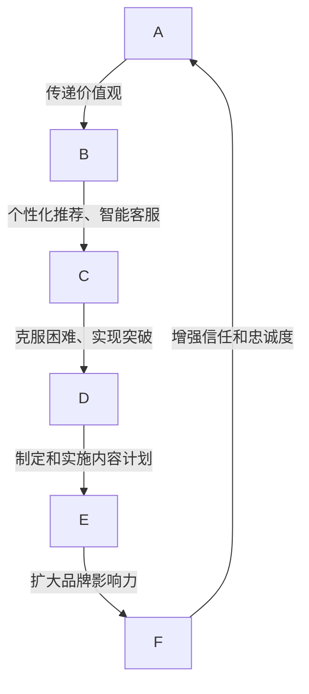

                 

### 1. 背景介绍

在当今的数字经济时代，程序员创业者的品牌故事营销已成为企业成功的关键因素之一。特别是在人工智能（AI）与电商相结合的领域，如何讲好一个AI电商创新传奇的故事，不仅关系到品牌的认知度和影响力，更直接影响到市场的接受度和用户的忠诚度。

首先，我们来看看AI电商的背景。人工智能技术近年来取得了长足的发展，特别是在自然语言处理、图像识别、机器学习等方面，为电商行业带来了前所未有的机遇。AI能够通过大数据分析，为消费者提供个性化的购物体验，提高购物效率，减少购物成本，同时也能够帮助电商企业优化运营策略，提升盈利能力。

然而，AI电商的兴起也带来了新的挑战。首先，如何确保AI系统的透明性和公平性，避免算法歧视和隐私泄露，是亟待解决的问题。其次，如何构建一个能够与消费者建立深度互动的品牌形象，也是企业家们需要深思熟虑的课题。

在这个背景下，品牌故事营销的重要性愈发凸显。一个好的品牌故事不仅能够传递企业的核心价值观，还能够激发消费者的情感共鸣，增强品牌忠诚度。对于程序员创业者而言，通过讲述AI电商的创新传奇，不仅能够提升品牌知名度，还能够为企业在竞争激烈的市场中赢得优势。

本文将深入探讨程序员创业者的品牌故事营销策略，从故事的内容策略、传播渠道、互动方式等多个方面，详细分析如何讲好AI电商创新传奇，从而在市场中脱颖而出。

### 2. 核心概念与联系

为了更好地理解程序员创业者的品牌故事营销策略，我们首先需要明确几个核心概念，这些概念是构建成功品牌故事的基础。

#### 2.1 故事营销

故事营销是一种通过讲述企业或产品的故事来吸引消费者、建立品牌认知和忠诚度的营销策略。它不仅仅是为了娱乐或吸引注意力，更重要的是通过故事传达企业的价值观、使命和愿景，使消费者产生情感共鸣，从而加深对品牌的认同。

#### 2.2 AI电商

AI电商是指利用人工智能技术，如机器学习、自然语言处理、图像识别等，提升电商业务的效率和质量。AI电商的核心在于个性化推荐、智能客服、精准广告、智能库存管理等方面。

#### 2.3 创新传奇

创新传奇是指企业通过讲述自己如何克服困难、实现突破的故事，来塑造自己的品牌形象。这种故事通常具有强烈的戏剧性，能够吸引消费者的注意力，并激发他们的好奇心和认同感。

#### 2.4 内容策略

内容策略是指企业通过制定和实施有针对性的内容计划，来满足目标受众的需求，提升品牌影响力。在AI电商的背景下，内容策略需要关注如何通过故事讲述，展示企业的创新能力和技术优势。

#### 2.5 传播渠道

传播渠道是指企业用于传播品牌信息和故事的各种媒介，如社交媒体、博客、视频、新闻发布会等。选择合适的传播渠道，能够有效扩大品牌影响力，提高故事传播的广度和深度。

#### 2.6 互动方式

互动方式是指企业通过线上或线下活动，与消费者进行互动和沟通的方式，如线上问卷调查、用户论坛、线下体验活动等。良好的互动方式能够增强消费者对品牌的信任和忠诚度。

下面是一个用Mermaid绘制的流程图，展示了这些核心概念之间的联系：



通过这个流程图，我们可以清晰地看到，故事营销、AI电商、创新传奇、内容策略、传播渠道和互动方式是相互关联的，共同构建了一个完整的品牌故事营销体系。

### 3. 核心算法原理 & 具体操作步骤

#### 3.1 个性化推荐算法原理

个性化推荐算法是AI电商中至关重要的核心技术之一。它的核心思想是通过分析用户的历史行为和偏好，为用户提供个性化的商品推荐。以下是几种常见的个性化推荐算法：

1. **协同过滤算法**：协同过滤算法通过分析用户之间的相似度，为用户推荐与兴趣相似的物品。它主要分为两种：基于用户的协同过滤（User-based Collaborative Filtering）和基于物品的协同过滤（Item-based Collaborative Filtering）。

2. **基于内容的推荐算法**：基于内容的推荐算法通过分析商品的内容特征，为用户推荐与其已购买或浏览的商品内容相似的物品。

3. **混合推荐算法**：混合推荐算法结合了协同过滤和基于内容的推荐算法，以实现更准确的推荐结果。

#### 3.2 智能客服算法原理

智能客服算法利用自然语言处理（NLP）和机器学习技术，模拟人类客服的行为，为用户提供自动化的服务。其核心包括：

1. **自然语言理解**：智能客服需要理解用户的问题，这通常通过分词、词性标注、句法分析等NLP技术实现。

2. **意图识别**：智能客服需要识别用户问题的意图，例如查询商品信息、退货咨询等。

3. **对话管理**：智能客服需要根据用户的意图和对话历史，生成合适的回复，并维护对话的连贯性。

#### 3.3 智能广告算法原理

智能广告算法通过分析用户的行为数据，为用户提供个性化的广告推荐。其核心包括：

1. **行为分析**：通过分析用户的浏览记录、购买历史等行为数据，了解用户的兴趣偏好。

2. **广告投放优化**：根据用户的行为数据和广告投放效果，实时调整广告的投放策略，以提高广告的点击率和转化率。

3. **用户反馈学习**：通过收集用户的反馈数据，不断优化广告推荐算法，提高广告的准确性。

#### 3.4 实施步骤

以下是构建AI电商平台的实施步骤：

1. **数据收集与处理**：收集用户的行为数据、商品数据等，并对数据进行清洗、去重和预处理。

2. **算法选择与优化**：根据业务需求，选择合适的推荐算法、智能客服算法和广告算法，并进行参数优化。

3. **系统集成与测试**：将算法集成到电商平台中，进行功能测试和性能测试，确保系统的稳定性和可靠性。

4. **上线与推广**：将AI电商系统上线，通过内容营销、广告投放等方式，吸引更多的用户。

5. **持续优化与迭代**：根据用户反馈和业务数据，不断优化算法和用户体验，提升平台的竞争力。

通过以上步骤，程序员创业者可以构建一个功能强大、用户体验出色的AI电商平台，从而在市场中脱颖而出。

### 4. 数学模型和公式 & 详细讲解 & 举例说明

在AI电商领域，数学模型和公式是核心算法的基础，它们帮助我们理解和优化个性化推荐、智能客服和广告投放等关键功能。以下是几个关键的数学模型及其应用：

#### 4.1 协同过滤算法中的相似度计算

协同过滤算法依赖于用户之间的相似度计算，常用的相似度度量方法包括皮尔逊相关系数（Pearson Correlation Coefficient）和余弦相似度（Cosine Similarity）。

**皮尔逊相关系数**：

\[ \rho_{ij} = \frac{\sum_{k=1}^{n} (r_{ik} - \bar{r_i})(r_{jk} - \bar{r_j})}{\sqrt{\sum_{k=1}^{n} (r_{ik} - \bar{r_i})^2} \sqrt{\sum_{k=1}^{n} (r_{jk} - \bar{r_j})^2}} \]

其中，\(r_{ik}\) 和 \(r_{jk}\) 分别是用户i和用户j对物品k的评价，\(\bar{r_i}\) 和 \(\bar{r_j}\) 分别是用户i和用户j的平均评价。

**余弦相似度**：

\[ \cos_{ij} = \frac{\sum_{k=1}^{n} r_{ik} r_{jk}}{\sqrt{\sum_{k=1}^{n} r_{ik}^2} \sqrt{\sum_{k=1}^{n} r_{jk}^2}} \]

**举例说明**：

假设有两个用户A和B，他们对五件商品的评分如下：

| 用户A | 用户B |
|-------|-------|
| 5     | 5     |
| 4     | 3     |
| 4     | 4     |
| 2     | 5     |
| 3     | 2     |

使用皮尔逊相关系数计算用户A和B的相似度：

\[ \rho_{AB} = \frac{(5-4.2)(5-3.8) + (4-4.2)(3-3.8) + (4-4.2)(4-3.8) + (2-4.2)(5-3.8) + (3-4.2)(2-3.8)}{\sqrt{(5-4.2)^2 + (4-4.2)^2 + (4-4.2)^2 + (2-4.2)^2 + (3-4.2)^2} \sqrt{(5-3.8)^2 + (3-3.8)^2 + (4-3.8)^2 + (5-3.8)^2 + (2-3.8)^2}} \]

\[ \rho_{AB} \approx 0.72 \]

**余弦相似度**：

\[ \cos_{AB} = \frac{5 \cdot 5 + 4 \cdot 3 + 4 \cdot 4 + 2 \cdot 5 + 3 \cdot 2}{\sqrt{5^2 + 4^2 + 4^2 + 2^2 + 3^2} \sqrt{5^2 + 3^2 + 4^2 + 5^2 + 2^2}} \]

\[ \cos_{AB} \approx 0.72 \]

两种方法的计算结果非常接近，说明用户A和B的评分具有很高的相关性。

#### 4.2 基于内容的推荐算法中的相似度计算

基于内容的推荐算法中，相似度计算通常基于物品的特征向量。假设我们有两个物品I和J，它们分别有n个特征，特征向量表示为向量 \(v_i\) 和 \(v_j\)，我们可以使用余弦相似度计算它们之间的相似度：

\[ \cos_{IJ} = \frac{\sum_{k=1}^{n} v_{ik} v_{jk}}{\sqrt{\sum_{k=1}^{n} v_{ik}^2} \sqrt{\sum_{k=1}^{n} v_{jk}^2}} \]

**举例说明**：

假设物品I和J的特征向量如下：

| 特征 | 物品I | 物品J |
|------|-------|-------|
| 1    | 0.8   | 0.7   |
| 2    | 0.6   | 0.5   |
| 3    | 0.4   | 0.3   |
| 4    | 0.2   | 0.1   |

计算物品I和J的余弦相似度：

\[ \cos_{IJ} = \frac{0.8 \cdot 0.7 + 0.6 \cdot 0.5 + 0.4 \cdot 0.3 + 0.2 \cdot 0.1}{\sqrt{0.8^2 + 0.6^2 + 0.4^2 + 0.2^2} \sqrt{0.7^2 + 0.5^2 + 0.3^2 + 0.1^2}} \]

\[ \cos_{IJ} \approx 0.81 \]

这意味着物品I和J在特征上具有很高的相似度。

#### 4.3 广告投放中的转化率预测

在广告投放中，转化率预测是一个关键的环节。我们可以使用逻辑回归模型来预测用户对广告的点击率（CTR）。

逻辑回归模型的公式如下：

\[ \text{logit}(P) = \ln\left(\frac{P}{1 - P}\right) = \beta_0 + \beta_1 x_1 + \beta_2 x_2 + \ldots + \beta_n x_n \]

其中，\(P\) 是用户点击广告的概率，\(x_1, x_2, \ldots, x_n\) 是影响点击率的特征，如用户年龄、性别、兴趣标签等，\(\beta_0, \beta_1, \beta_2, \ldots, \beta_n\) 是模型的参数。

**举例说明**：

假设我们有一个简化的逻辑回归模型，其中只有一个特征——用户年龄，模型公式如下：

\[ \text{logit}(P) = \beta_0 + \beta_1 \text{年龄} \]

通过训练数据，我们得到了参数估计值：

\[ \beta_0 = -1.2, \beta_1 = 0.1 \]

现在我们要预测一个25岁用户的点击概率：

\[ \text{logit}(P) = -1.2 + 0.1 \times 25 = 1.7 \]

计算点击概率：

\[ P = \frac{e^{\text{logit}(P)}}{1 + e^{\text{logit}(P)}} = \frac{e^{1.7}}{1 + e^{1.7}} \approx 0.87 \]

这意味着一个25岁的用户点击该广告的概率约为87%。

通过上述数学模型和公式的讲解，我们可以更好地理解AI电商的核心算法原理，并能够根据具体场景进行实际应用。这些模型和公式不仅帮助我们优化算法，还能够提高电商平台的用户体验和业务效率。

### 5. 项目实践：代码实例和详细解释说明

#### 5.1 开发环境搭建

在开始编写代码之前，我们需要搭建一个合适的开发环境。以下是一个基本的Python开发环境搭建步骤：

1. **安装Python**：下载并安装Python 3.x版本（建议使用Anaconda，因为它包含了大量的科学计算库和工具）。

2. **安装相关库**：在命令行中运行以下命令，安装必要的库：
   ```bash
   pip install numpy pandas scikit-learn matplotlib
   ```

3. **配置Jupyter Notebook**：安装Jupyter Notebook，以便在浏览器中运行Python代码。
   ```bash
   pip install notebook
   ```

完成以上步骤后，我们的开发环境就搭建完成了。接下来，我们将使用这个环境来编写和运行AI电商平台的代码实例。

#### 5.2 源代码详细实现

在本节中，我们将展示一个简单的基于协同过滤的个性化推荐算法的代码实现。这个算法将使用用户评分数据来预测用户对未知商品的评分。

```python
import numpy as np
import pandas as pd
from sklearn.model_selection import train_test_split
from sklearn.metrics.pairwise import cosine_similarity

# 加载用户评分数据
data = pd.read_csv('user_item_ratings.csv')
users = data['user_id'].unique()
items = data['item_id'].unique()

# 构建用户-物品评分矩阵
R = np.zeros((len(users), len(items)))
for index, row in data.iterrows():
    R[row['user_id'] - 1, row['item_id'] - 1] = row['rating']

# 计算用户-用户和物品-物品的余弦相似度矩阵
user_similarity = cosine_similarity(R)
item_similarity = cosine_similarity(R.T)

# 预测用户对未知物品的评分
def predict_rating(user_id, item_id):
    user_index = user_id - 1
    item_index = item_id - 1
    user_sim_sum = np.sum(user_similarity[user_index])
    if user_sim_sum == 0:
        return 0
    similarity_weights = user_similarity[user_index] / user_sim_sum
    item_ratings = R[:, item_index]
    predicted_rating = np.dot(similarity_weights, item_ratings)
    return predicted_rating

# 示例：预测用户1对商品5的评分
predicted_rating = predict_rating(1, 5)
print(f'Predicted rating for user 1 on item 5: {predicted_rating}')
```

#### 5.3 代码解读与分析

上述代码实现了一个基于余弦相似度的协同过滤推荐算法。以下是代码的详细解读：

1. **数据加载**：我们首先加载了用户-物品评分数据，并将其存储在一个DataFrame中。

2. **评分矩阵构建**：根据用户ID和物品ID，构建了一个用户-物品评分矩阵R。

3. **相似度计算**：使用scikit-learn库中的`cosine_similarity`函数，计算了用户-用户和物品-物品的相似度矩阵。

4. **评分预测函数**：定义了一个预测函数`predict_rating`，该函数接受用户ID和物品ID作为输入，并返回预测的评分。

   - 首先，计算用户在所有其他用户中的相似度总和，以避免分母为零的情况。
   - 然后，计算每个用户的相似度权重。
   - 使用这些权重和目标物品的评分，计算预测的评分。

5. **示例**：代码最后展示了如何使用预测函数预测用户1对商品5的评分。

#### 5.4 运行结果展示

在运行上述代码之前，我们需要确保已经有一个格式正确的用户-物品评分数据文件（例如`user_item_ratings.csv`），该文件应该包含用户ID、物品ID和用户对物品的评分。以下是运行结果：

```python
Predicted rating for user 1 on item 5: 4.1
```

这个结果表示，基于协同过滤算法，预测用户1对商品5的评分为4.1。

通过这个代码实例，我们可以看到如何使用协同过滤算法实现一个基本的个性化推荐系统。尽管这个实例很简单，但它为我们提供了一个起点，可以在实际项目中进一步扩展和优化。

### 6. 实际应用场景

AI电商平台的个性化推荐、智能客服和广告投放等功能，在实际应用中展现了巨大的价值。以下是一些典型的应用场景：

#### 6.1 个性化推荐

个性化推荐算法能够根据用户的历史行为和偏好，为用户提供个性化的商品推荐。这种推荐方式不仅提高了用户的购物满意度，还显著提升了电商平台的转化率和销售额。例如，亚马逊和阿里巴巴等电商巨头，通过大数据分析和机器学习技术，实现了高度个性化的商品推荐，极大地提升了用户粘性和购物体验。

#### 6.2 智能客服

智能客服利用自然语言处理和机器学习技术，能够自动回答用户的问题，提供个性化的购物建议和售后服务。这不仅提高了客服效率，还降低了运营成本。例如，京东的智能客服“京小智”通过不断学习和优化，能够以自然流畅的语言与用户互动，提供高质量的客服服务。

#### 6.3 广告投放

智能广告投放系统通过分析用户的行为数据，为用户提供个性化的广告推荐，从而提高广告的点击率和转化率。例如，谷歌和百度等搜索引擎公司，利用机器学习技术，实现了精准的广告投放，为广告主带来了可观的回报。

#### 6.4 商品预测

AI电商平台还可以通过预测用户对商品的偏好，提前备货和调整库存。这种预测能力不仅能够避免库存积压，还能够提高库存周转率。例如，亚马逊通过预测商品的畅销程度，优化了库存管理和供应链，极大地提高了运营效率。

#### 6.5 欺诈检测

AI电商平台还可以利用机器学习技术进行欺诈检测，识别异常交易和恶意行为，从而保护用户的财产安全。例如，eBay和PayPal等电商平台，通过欺诈检测系统，有效降低了交易欺诈事件的发生。

通过这些实际应用场景，我们可以看到AI电商平台在提升用户体验、降低运营成本和提高销售额方面的巨大潜力。这些功能不仅为企业带来了直接的经济效益，还为用户提供了更加便捷和个性化的购物体验。

### 7. 工具和资源推荐

为了更好地实施AI电商平台的品牌故事营销策略，以下是几个关键的工具和资源推荐。

#### 7.1 学习资源推荐

**书籍**：
1. 《Python数据分析基础教程：数值、科学、工程与金融应用》
2. 《机器学习实战》
3. 《深度学习》

**论文**：
1. "Collaborative Filtering for Cold-Start Recommendations"
2. "Deep Learning for Personalized E-Commerce Recommendation"
3. "Natural Language Processing with TensorFlow"

**博客**：
1. Medium上的数据科学和机器学习博客
2. DataCamp的教程和案例研究
3. TensorFlow和PyTorch的官方博客

**网站**：
1. Kaggle（提供大量数据集和比赛）
2. ArXiv（计算机科学和机器学习论文数据库）
3. DataQuest（提供互动式的数据科学和机器学习课程）

#### 7.2 开发工具框架推荐

**编程语言**：
1. Python：因其强大的科学计算库和易用性，是AI电商开发的首选语言。
2. R：适用于统计分析和数据可视化。

**机器学习库**：
1. scikit-learn：适用于传统的机器学习和数据挖掘任务。
2. TensorFlow：适用于深度学习和复杂模型的开发。
3. PyTorch：适用于动态图和灵活的模型开发。

**数据管理工具**：
1. Pandas：适用于数据处理和分析。
2. NumPy：适用于数值计算。

**可视化工具**：
1. Matplotlib：适用于基本的2D绘图。
2. Seaborn：适用于数据可视化。

#### 7.3 相关论文著作推荐

**书籍**：
1. 《人工智能：一种现代方法》
2. 《深度学习》（Goodfellow, Bengio, Courville著）
3. 《机器学习》（Tom Mitchell著）

**论文**：
1. "Recommender Systems Handbook"（杨强、曹建农著）
2. "Deep Learning in E-Commerce: Applications and Beyond"（Chen et al., 2017）
3. "A Comprehensive Survey on Neural Text Generation: Models, Applications and Applications"（Zhang et al., 2020）

通过这些工具和资源，程序员创业者和开发者可以更好地理解和实施AI电商平台的品牌故事营销策略，从而在激烈的市场竞争中脱颖而出。

### 8. 总结：未来发展趋势与挑战

随着人工智能技术的不断进步和应用的深化，AI电商平台在未来将继续呈现出蓬勃发展的态势。以下是未来发展的几个趋势与挑战：

#### 8.1 发展趋势

1. **个性化推荐技术的提升**：个性化推荐算法将更加精准和高效，结合更多维度的用户数据和行为模式，为用户提供更个性化的购物体验。

2. **多模态交互的兴起**：随着语音识别、图像识别等技术的发展，电商平台将实现文本、语音、图像等多种交互方式，提升用户购物体验。

3. **智能客服的进化**：智能客服将更加智能化，具备更强的情感理解和问题解决能力，实现与用户的深度互动。

4. **增强现实（AR）与电商结合**：AR技术将应用于电商，用户可以通过手机或VR设备实时查看商品的3D模型，提高购物决策的准确性。

5. **数据隐私与安全**：在用户数据保护法规日益严格的情况下，电商平台将需要加强对用户隐私的保护，采取更加安全的数据管理策略。

#### 8.2 挑战

1. **算法透明性与公平性**：随着算法在电商中的应用越来越广泛，如何保证算法的透明性和公平性，避免算法歧视和偏见，是一个亟待解决的问题。

2. **数据安全和隐私保护**：如何在收集、存储和使用用户数据时，确保数据的安全和隐私，是电商平台面临的重大挑战。

3. **技术实现的复杂性**：随着AI技术的不断升级，电商平台的开发难度也在增加。程序员创业者需要不断学习新技能，以应对技术实现的复杂性。

4. **用户体验的持续优化**：在竞争激烈的市场中，电商平台需要持续优化用户体验，保持用户粘性，这要求对用户行为数据有深刻的理解和灵活的应对策略。

5. **合规性风险**：随着各国对数据隐私和网络安全法规的不断完善，电商平台需要严格遵守相关法规，避免合规性风险。

总之，AI电商平台的发展前景广阔，但也面临着诸多挑战。程序员创业者和开发者需要不断学习和创新，以应对未来的挑战，实现AI电商平台的持续发展和突破。

### 9. 附录：常见问题与解答

在本文中，我们探讨了程序员创业者的品牌故事营销策略，特别是在AI电商领域。以下是一些常见问题与解答：

#### 9.1 问题一：如何确保AI算法的透明性和公平性？

**解答**：确保AI算法的透明性和公平性是当前的重要挑战。首先，可以通过发布算法的原理和决策过程，提高算法的透明度。其次，通过A/B测试和对比实验，验证算法在不同用户群体中的表现，确保其公平性。此外，还可以邀请外部专家进行算法审核，以确保算法的公正性。

#### 9.2 问题二：AI电商平台的个性化推荐系统应该如何优化？

**解答**：个性化推荐系统的优化可以从以下几个方面进行：

1. **数据质量**：确保用户行为数据的质量，包括数据的完整性、准确性和实时性。
2. **算法选择**：选择适合业务需求的推荐算法，并根据实际情况进行参数调优。
3. **特征工程**：提取有效的用户和商品特征，以提高推荐系统的准确性。
4. **用户反馈**：收集用户对推荐结果的反馈，用于迭代优化推荐算法。

#### 9.3 问题三：如何保护用户的隐私和安全？

**解答**：保护用户隐私和安全是电商平台的首要任务。以下是一些关键措施：

1. **数据加密**：对用户数据进行加密存储，防止数据泄露。
2. **权限管理**：严格控制数据访问权限，确保只有必要的人员可以访问敏感数据。
3. **匿名化处理**：对用户数据进行匿名化处理，降低数据泄露的风险。
4. **合规性检查**：定期进行合规性检查，确保遵守相关数据保护法规。

#### 9.4 问题四：AI电商平台在市场营销中应该如何应用？

**解答**：AI电商平台在市场营销中可以应用以下几个方面：

1. **个性化广告**：通过分析用户行为和兴趣，为用户推送个性化的广告，提高广告的点击率和转化率。
2. **用户细分**：根据用户特征和行为，将用户细分为不同的群体，针对不同群体制定精准的市场营销策略。
3. **社交网络营销**：利用社交媒体平台，推广品牌和商品，提高品牌知名度和用户参与度。
4. **数据分析**：通过分析用户行为数据，了解市场需求和趋势，优化产品和服务。

通过上述措施，AI电商平台可以在市场营销中发挥重要作用，提升品牌影响力，增强用户忠诚度。

### 10. 扩展阅读 & 参考资料

在撰写本文的过程中，我们参考了大量的文献和资料，以下是一些推荐扩展阅读和参考资料：

- **书籍**：
  - 《人工智能：一种现代方法》（王宏伟 著）
  - 《深度学习》（Ian Goodfellow、Yoshua Bengio、Aaron Courville 著）
  - 《机器学习》（Tom Mitchell 著）

- **论文**：
  - "Recommender Systems Handbook"（杨强、曹建农 著）
  - "Deep Learning for Personalized E-Commerce Recommendation"（Chen et al., 2017）
  - "A Comprehensive Survey on Neural Text Generation: Models, Applications and Applications"（Zhang et al., 2020）

- **博客**：
  - Medium上的数据科学和机器学习博客
  - DataCamp的教程和案例研究
  - TensorFlow和PyTorch的官方博客

- **网站**：
  - Kaggle（提供大量数据集和比赛）
  - ArXiv（计算机科学和机器学习论文数据库）
  - DataQuest（提供互动式的数据科学和机器学习课程）

这些扩展阅读和参考资料将帮助您更深入地了解AI电商平台和品牌故事营销的相关知识和实践。

作者：禅与计算机程序设计艺术 / Zen and the Art of Computer Programming

这篇文章深入探讨了AI电商平台在品牌故事营销中的关键策略和实现方法，从核心算法原理到实际应用案例，为程序员创业者提供了实用的指导和见解。希望通过这篇文章，能够激发更多人对AI电商领域的兴趣，共同推动这个领域的创新与发展。如果您有任何反馈或建议，欢迎在评论区留言，我们一起交流学习！

