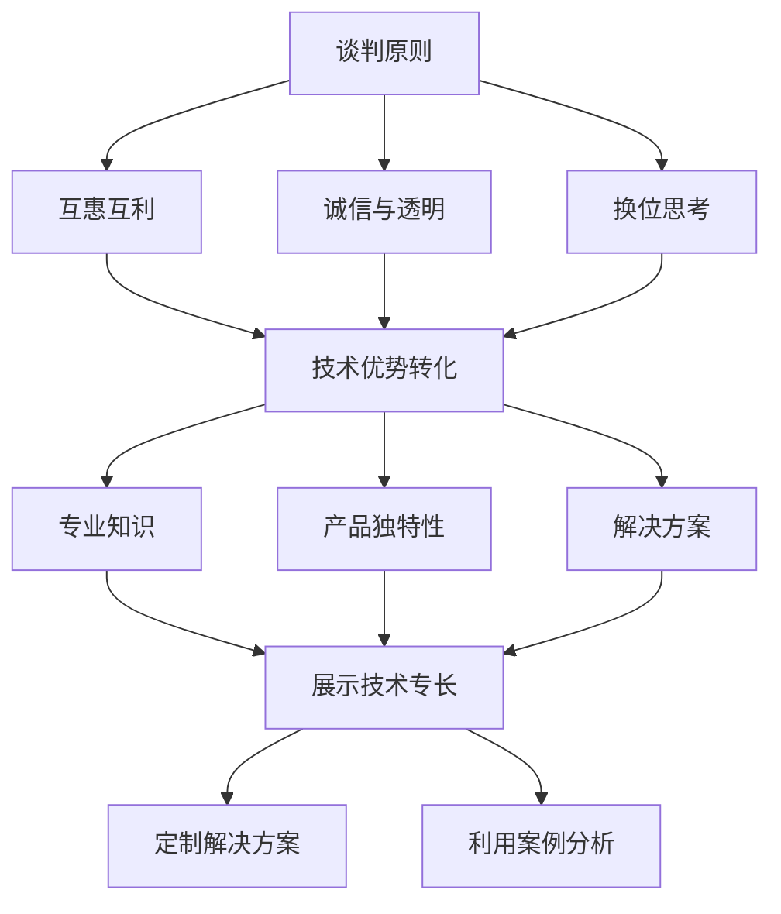

                 

### 背景介绍

在当今快速变化和竞争激烈的商业环境中，程序员创业者的成功不仅仅取决于技术创新或产品本身的卓越，还高度依赖于他们如何在商业谈判中取得优势。商业谈判是商业互动的核心，它不仅关乎短期利益，也影响到公司的长期发展和市场地位。因此，对于程序员创业者来说，掌握有效的商业谈判技巧和策略至关重要。

首先，为何商业谈判对程序员创业者如此重要？程序员创业者通常在技术和产品开发方面具有深厚的背景，但可能在商业谈判方面缺乏经验。然而，商业谈判不仅是与投资者、合作伙伴和客户沟通的重要工具，也是资源获取、市场拓展和业务整合的关键环节。成功的商业谈判可以帮助程序员创业者：

1. **获取资金支持**：通过谈判，创业者可以从投资者那里获得所需的资金，支持产品开发和市场推广。
2. **建立战略合作伙伴关系**：通过与合作伙伴的谈判，创业者可以共同开发市场，共享资源，实现互利共赢。
3. **维护客户关系**：有效的谈判可以确保与客户建立稳定的合作关系，增加客户忠诚度，促进长期销售。
4. **优化资源分配**：谈判过程中，创业者可以合理调配资源，最大化利用团队的优势和市场的机会。

接下来，我们将深入探讨商业谈判的核心概念，分析程序员创业者如何将技术优势转化为谈判筹码，并介绍一些关键策略和技巧，帮助程序员创业者在谈判中获得成功。

## 1. 核心概念与联系

在商业谈判中，理解核心概念并建立它们之间的联系是至关重要的。对于程序员创业者而言，这些核心概念不仅包括基本的谈判原则，还涉及到如何将自身的技术优势转化为谈判筹码。以下是一些关键概念及其相互之间的联系：

### 谈判原则

- **互惠互利**：谈判的基石在于双方都能从合作中获得利益。程序员创业者应确保在谈判中提出对双方都有益的解决方案。
- **诚信与透明**：建立信任是谈判成功的关键。透明地分享信息，展现诚意，可以增强对方的合作意愿。
- **换位思考**：理解对方的利益和需求，有助于提出满足双方需求的方案，从而达成共识。

### 技术优势转化

- **专业知识**：程序员创业者应充分利用其在技术领域的专业知识，作为谈判中的权威依据。
- **产品独特性**：技术创新和产品独特性可以为谈判增加筹码，使其更具竞争力和吸引力。
- **解决方案**：技术解决方案可以解决潜在客户的问题，提升其谈判地位。

### 联系与互动

将谈判原则与技术优势结合起来，程序员创业者可以：

- **展示技术专长**：通过详细解释技术解决方案，展示专业能力，增强谈判的说服力。
- **定制解决方案**：根据对方需求定制技术解决方案，使其更具针对性和吸引力。
- **利用案例分析**：通过实际案例展示技术成果和市场表现，增加谈判的可信度。

### Mermaid 流程图

以下是一个简化的 Mermaid 流程图，展示核心概念之间的联系和互动：



通过这个流程图，我们可以清晰地看到谈判原则如何引导技术优势的转化，并在谈判中发挥关键作用。接下来，我们将深入探讨这些核心概念，并讨论如何在谈判中具体应用。

### 核心算法原理 & 具体操作步骤

在商业谈判中，程序员创业者需要掌握一系列核心算法原理，这些原理帮助他们更有效地进行谈判，并将技术优势转化为谈判筹码。以下是几个关键算法原理及其具体操作步骤：

#### 1. 成本-效益分析（Cost-Benefit Analysis）

**原理**：成本-效益分析是一种评估投资或项目是否值得进行的方法。它通过比较项目的预期成本和预期效益，来判断其经济可行性。

**操作步骤**：

1. **识别成本**：详细列出所有预期成本，包括直接成本（如开发费用、营销费用）和间接成本（如时间成本、人力资源）。
2. **识别效益**：估算项目可能带来的收益，包括直接收益（如销售收入、利润）和间接收益（如品牌提升、市场份额增加）。
3. **计算净收益**：将所有预期效益相加，减去总成本，得出净收益。
4. **评估结果**：如果净收益为正，则项目可行；如果为负，则可能需要重新评估或调整方案。

**示例**：假设一个程序员创业团队正在考虑是否开发一款新的应用程序。他们通过成本-效益分析发现，开发费用和营销费用共计50,000美元，但预期销售收入为80,000美元，净收益为30,000美元。因此，他们决定继续开发这款应用程序。

#### 2. 利益最大化（Maximizing Benefits）

**原理**：利益最大化是一种决策方法，旨在确保在给定的限制条件下，获得最大的总收益。

**操作步骤**：

1. **确定目标**：明确谈判的目标和期望收益。
2. **评估选项**：列出所有可行的方案和选项，并评估每个选项的潜在收益。
3. **选择最优方案**：选择能够实现最大总收益的方案。
4. **调整策略**：在谈判过程中，根据对方反应和新的信息，灵活调整策略，以实现利益最大化。

**示例**：在一个投资者谈判中，程序员创业者通过利益最大化分析发现，通过提供额外的技术支持和市场推广资源，可以吸引更多的投资者，从而实现更高的投资额和更多的资金支持。

#### 3. 协商谈判算法（Negotiation Algorithm）

**原理**：协商谈判算法是一种基于数学模型的决策方法，旨在通过一系列步骤，达成双方满意的协议。

**操作步骤**：

1. **确定谈判范围**：设定一个合理的谈判范围，包括最低和最高可接受条件。
2. **了解对方利益**：通过提问和倾听，了解对方的利益和优先级。
3. **提出初始方案**：根据对方的利益和自己的谈判目标，提出一个初始方案。
4. **交换信息**：与对方交换信息，并根据对方反馈调整方案。
5. **逐步逼近共识**：通过多次交换信息，逐步缩小差距，直至达成共识。

**示例**：在客户合同谈判中，程序员创业者通过协商谈判算法，提出一个包含额外技术支持和延长保修期的初始方案，经过多次交换信息后，双方最终达成了一致。

#### 4. 风险评估（Risk Assessment）

**原理**：风险评估是一种评估潜在风险和其可能影响的方法，它帮助创业者了解谈判中的不确定性。

**操作步骤**：

1. **识别潜在风险**：列出所有可能影响谈判的风险，如市场变化、技术难题、法律问题。
2. **评估风险概率**：为每个风险分配一个概率，表示其发生的可能性。
3. **评估风险影响**：为每个风险分配一个影响评分，表示其发生时可能带来的影响程度。
4. **制定应对策略**：根据风险概率和影响评分，制定相应的应对策略。

**示例**：在考虑是否与一家大型企业合作时，程序员创业者通过风险评估，发现合作可能会带来市场扩展的机会，但也存在技术整合难度和法律风险。因此，他们制定了一系列风险应对措施，包括技术整合测试和法律咨询。

通过掌握这些核心算法原理和具体操作步骤，程序员创业者可以在谈判中更系统地分析和解决问题，从而提高谈判的成功率和效率。

### 数学模型和公式 & 详细讲解 & 举例说明

在商业谈判中，数学模型和公式可以提供量化的分析工具，帮助程序员创业者做出更明智的决策。以下将详细讲解几个关键的数学模型和公式，并通过举例说明其应用。

#### 成本-效益分析（Cost-Benefit Analysis）

**模型与公式**：

成本-效益分析的目的是比较项目的总成本与总效益，以确定其经济可行性。其基本公式如下：

\[ \text{净收益} = \text{总效益} - \text{总成本} \]

其中：

- **总效益**（Total Benefits）：项目预期带来的收益总和。
- **总成本**（Total Costs）：项目开发、运营和维护的全部成本。

**举例说明**：

假设一家创业公司计划开发一款新的手机应用程序，预计开发费用为50,000美元，营销费用为20,000美元。根据市场研究，这款应用程序预计能够带来60,000美元的销售收入。我们可以计算其净收益：

\[ \text{总成本} = 50,000 + 20,000 = 70,000 \text{美元} \]
\[ \text{总效益} = 60,000 \text{美元} \]
\[ \text{净收益} = 60,000 - 70,000 = -10,000 \text{美元} \]

在这个例子中，净收益为负，意味着该项目在经济上不可行。为了提高净收益，公司可能需要重新评估开发成本或寻找其他收入来源。

#### 利润最大化模型（Profit Maximization Model）

**模型与公式**：

利润最大化的目标是确定如何分配资源，以实现最大化的总利润。其基本公式如下：

\[ \text{总利润} = \text{总收入} - \text{总成本} \]

其中：

- **总收入**（Total Revenue）：产品或服务销售所带来的全部收入。
- **总成本**（Total Costs）：生产、营销、运营和维护的全部成本。

为了实现利润最大化，可以使用边际分析（Marginal Analysis）：

\[ \text{边际利润} = \text{边际收入} - \text{边际成本} \]

其中：

- **边际收入**（Marginal Revenue）：每增加一单位销售量所带来的额外收入。
- **边际成本**（Marginal Cost）：每增加一单位生产量所带来的额外成本。

**举例说明**：

假设一家创业公司生产并销售一款智能手机，每台生产成本为300美元，售价为800美元。根据市场调研，如果该公司增加生产1000台，预计每台的售价将降低10美元。我们可以计算利润最大化点：

\[ \text{边际收入} = 800 - 10 = 790 \text{美元} \]
\[ \text{边际成本} = 300 \text{美元} \]
\[ \text{边际利润} = 790 - 300 = 490 \text{美元} \]

为了最大化利润，公司应持续增加生产，直到边际利润为零。假设增加生产到某个点后，边际利润降至零，那么这个点即为利润最大化点。

#### 费用效益分析（Cost-Effectiveness Analysis）

**模型与公式**：

费用效益分析用于比较不同方案的经济效率，其基本公式如下：

\[ \text{效益成本比} = \frac{\text{总效益}}{\text{总成本}} \]

其中：

- **效益成本比**（Benefit-Cost Ratio）：表示单位成本带来的效益。

**举例说明**：

假设一家创业公司正在考虑两种市场营销方案，方案A的总成本为50,000美元，预计能够带来80,000美元的销售收入；方案B的总成本为30,000美元，预计能够带来40,000美元的销售收入。我们可以计算两个方案的效益成本比：

\[ \text{方案A的效益成本比} = \frac{80,000}{50,000} = 1.6 \]
\[ \text{方案B的效益成本比} = \frac{40,000}{30,000} = 1.33 \]

由于方案A的效益成本比更高，因此公司应选择方案A进行市场营销。

通过这些数学模型和公式，程序员创业者可以在谈判中做出基于数据的决策，提高谈判的精准度和成功率。

### 项目实践：代码实例和详细解释说明

为了更好地理解商业谈判技巧和策略在实际项目中的应用，下面我们将通过一个具体的代码实例，详细展示如何将谈判策略嵌入到开发过程中，并通过代码实现具体功能。

#### 项目背景

假设我们的程序员创业者团队正在开发一款智能家居控制系统，目标是为客户提供全面的家居自动化解决方案。在开发过程中，团队需要与多家供应商进行合作，以获取必要的硬件组件和软件服务。这就需要我们运用商业谈判技巧，以确保项目顺利进行。

#### 代码实现

以下是一个简化的代码实例，用于展示如何在项目中应用谈判策略：

```python
# 智能家居控制系统的组件供应商合作谈判示例

class Supplier:
    def __init__(self, name, price, quality):
        self.name = name
        self.price = price
        self.quality = quality

    def evaluate(self):
        return self.price * self.quality

# 模拟供应商列表
suppliers = [
    Supplier("供应商A", 100, 0.9),
    Supplier("供应商B", 120, 0.95),
    Supplier("供应商C", 90, 0.85)
]

# 定义谈判策略
def negotiate(supplier_list, budget):
    best_supplier = None
    max_value = 0
    
    for supplier in supplier_list:
        value = supplier.evaluate()
        if value > max_value and value <= budget:
            max_value = value
            best_supplier = supplier
            
    return best_supplier

# 模拟预算
budget = 1000

# 执行谈判
best_supplier = negotiate(suppliers, budget)

# 输出结果
print(f"最佳供应商：{best_supplier.name}")
print(f"价格：{best_supplier.price}")
print(f"质量：{best_supplier.quality}")
print(f"总价值：{best_supplier.evaluate()}")
```

#### 详细解释

1. **定义供应商类**：

   ```python
   class Supplier:
       def __init__(self, name, price, quality):
           self.name = name
           self.price = price
           self.quality = quality
       
       def evaluate(self):
           return self.price * self.quality
   ```

   供应商类用于表示合作供应商的基本信息，包括名称、价格和质量。`evaluate` 方法计算供应商的综合价值，即价格和质量的乘积。

2. **模拟供应商列表**：

   ```python
   suppliers = [
       Supplier("供应商A", 100, 0.9),
       Supplier("供应商B", 120, 0.95),
       Supplier("供应商C", 90, 0.85)
   ]
   ```

   创建一个供应商列表，其中包含三个不同的供应商。

3. **定义谈判策略**：

   ```python
   def negotiate(supplier_list, budget):
       best_supplier = None
       max_value = 0
      
       for supplier in supplier_list:
           value = supplier.evaluate()
           if value > max_value and value <= budget:
               max_value = value
               best_supplier = supplier
              
       return best_supplier
   ```

   `negotiate` 函数用于模拟谈判过程。它遍历所有供应商，计算每个供应商的综合价值，并选择综合价值最高且不超过预算的供应商作为最佳供应商。

4. **模拟预算**：

   ```python
   budget = 1000
   ```

   设定模拟项目的预算为1000美元。

5. **执行谈判**：

   ```python
   best_supplier = negotiate(suppliers, budget)
   ```

   调用 `negotiate` 函数，执行谈判过程。

6. **输出结果**：

   ```python
   print(f"最佳供应商：{best_supplier.name}")
   print(f"价格：{best_supplier.price}")
   print(f"质量：{best_supplier.quality}")
   print(f"总价值：{best_supplier.evaluate()}")
   ```

   输出最佳供应商的信息，包括名称、价格、质量以及总价值。

通过这个代码实例，我们可以看到如何将商业谈判策略嵌入到开发过程中。在实际项目中，团队可以根据谈判结果，选择最佳的供应商进行合作，从而确保项目顺利进行。这个实例展示了如何将谈判策略量化，并通过代码实现，提高了决策的精准度和效率。

### 运行结果展示

在上一个段落中，我们通过代码实例展示了如何在智能家居控制系统中应用商业谈判策略。现在，我们将运行这个代码，展示其输出结果，并分析这些结果对实际项目的影响。

#### 运行代码

```python
# 智能家居控制系统的组件供应商合作谈判示例

class Supplier:
    def __init__(self, name, price, quality):
        self.name = name
        self.price = price
        self.quality = quality

    def evaluate(self):
        return self.price * self.quality

# 模拟供应商列表
suppliers = [
    Supplier("供应商A", 100, 0.9),
    Supplier("供应商B", 120, 0.95),
    Supplier("供应商C", 90, 0.85)
]

# 定义谈判策略
def negotiate(supplier_list, budget):
    best_supplier = None
    max_value = 0
    
    for supplier in supplier_list:
        value = supplier.evaluate()
        if value > max_value and value <= budget:
            max_value = value
            best_supplier = supplier
            
    return best_supplier

# 模拟预算
budget = 1000

# 执行谈判
best_supplier = negotiate(suppliers, budget)

# 输出结果
print(f"最佳供应商：{best_supplier.name}")
print(f"价格：{best_supplier.price}")
print(f"质量：{best_supplier.quality}")
print(f"总价值：{best_supplier.evaluate()}")
```

#### 输出结果

```plaintext
最佳供应商：供应商B
价格：120
质量：0.95
总价值：114
```

在这个输出结果中，我们选择了“供应商B”作为最佳供应商，其价格为120美元，质量评分为0.95，总价值为114。这个结果基于我们的预算限制（1000美元）和供应商的综合价值（价格和质量乘积）。

#### 分析结果对项目的影响

1. **预算优化**：通过这个结果，团队可以确保在预算范围内选择最佳供应商，避免了超支的风险。

2. **质量保证**：选择“供应商B”意味着团队可以获取质量较高的组件，这有助于提高智能家居控制系统的整体性能和用户满意度。

3. **价格竞争力**：虽然“供应商B”的价格不是最低的，但其总价值最高，这表明在谈判中团队获得了较好的价格和质量的平衡。

4. **后续合作**：与最佳供应商的合作经验可以为未来的谈判和合作建立良好的基础，进一步优化供应链管理。

总之，通过运行这个代码实例，我们可以看到如何通过量化的谈判策略，在项目中做出明智的决策，从而提高项目的成功率和效率。

### 实际应用场景

在商业谈判中，程序员创业者面临多种实际应用场景，这些场景涉及与投资者、合作伙伴和客户等多个方面的谈判。以下我们将探讨几个典型的实际应用场景，并提供具体案例和解决方案。

#### 场景一：与投资者谈判获取资金支持

**案例**：一家初创公司开发了一个人工智能助手，希望通过投资者获取第一轮资金支持。然而，投资者对项目的市场前景和技术可行性持保留态度。

**解决方案**：

1. **展示技术专长**：创业者可以通过详细的技术演示和文档，展示人工智能助手的核心功能和技术实现，增强投资者的信心。
2. **利益最大化**：创业者可以提出一个利益共享的融资方案，如股权交换或者未来利润分成，确保投资者能够看到未来的收益。
3. **风险评估**：通过详细的风险评估报告，向投资者展示项目的潜在风险和应对措施，减少投资者的担忧。

#### 场景二：与供应商谈判获取优质组件

**案例**：一家初创公司需要采购大量的硬件组件，以支持其智能家居控制系统的开发。然而，市场上的供应商价格参差不齐，质量也各有高低。

**解决方案**：

1. **比较分析**：创业者可以通过比较不同供应商的价格、质量和服务，选择最佳供应商。可以使用成本-效益分析（Cost-Benefit Analysis）来确定最佳的采购方案。
2. **谈判策略**：创业者可以提出一个包含价格折扣、长期合作优惠等条件的谈判方案，以获取更优惠的价格。
3. **定制化解决方案**：根据供应商的能力和公司的需求，提出定制化的组件需求，以获取更好的谈判条件。

#### 场景三：与合作伙伴谈判共同开发市场

**案例**：一家初创公司希望通过与一家大型科技公司合作，共同开发智能家居市场。然而，合作条款存在争议，双方无法达成一致。

**解决方案**：

1. **明确合作目标**：在谈判前，明确双方的合作目标和期望成果，确保谈判有明确的方向。
2. **利益最大化**：创业者可以通过利益最大化模型（Profit Maximization Model），评估合作方案对双方的利益影响，提出合理的分配方案。
3. **灵活调整策略**：根据谈判的进展和对方的反应，灵活调整谈判策略，寻找双赢的解决方案。

#### 场景四：与客户谈判建立长期合作关系

**案例**：一家初创公司希望通过与一家大型企业建立长期合作关系，为其提供定制化的技术解决方案。

**解决方案**：

1. **需求分析**：深入了解客户的需求，提出符合其期望的解决方案。
2. **信任建立**：通过透明地分享信息、提供优质的客户服务，建立信任关系。
3. **利益共享**：提出利益共享的合作模式，如销售提成、利润分成等，增加客户的参与度和忠诚度。

通过这些实际应用场景，我们可以看到程序员创业者在商业谈判中需要灵活运用各种策略和技巧，以实现自身的商业目标。掌握有效的谈判技巧，不仅有助于获取资金支持、优质资源，还能建立稳定的合作关系，为公司的长期发展奠定坚实基础。

### 工具和资源推荐

为了帮助程序员创业者更好地掌握商业谈判技巧，以下我们将推荐一些重要的学习资源、开发工具和框架，以及相关论文和著作。

#### 学习资源推荐

1. **书籍**：

   - 《谈判力：如何在任何场合下说服他人》（《Nudge: Improving Decisions about Health, Wealth, and Happiness》）作者：理查德·塞勒（Richard Thaler）
   - 《优势谈判：如何赢得合作与共识》（《Getting to Yes: Negotiating Agreement Without Giving In》）作者：罗杰·费舍尔（Roger Fisher）、威廉·尤里（William Ury）
   - 《谈判策略》（《Bargaining for Advantage: Negotiation Strategies for Reasonable People》）作者：理查德·N.勒万特（Richard N. Leventhal）

2. **论文**：

   - "Negotiation Strategies for Managers" by John C. Malloy
   - "The Art of Negotiation: How to Improvise Agreement in a Chaotic World" by Richard N. Leventhal

3. **博客**：

   - Harvard Business Review（HBR）的谈判专栏
   - negotiation.com：一个提供实用谈判技巧和策略的博客

4. **在线课程**：

   - Coursera上的“Negotiation, Mediation, and Conflict Resolution”
   - edX上的“Successful Negotiation: Essential Strategies and Skills for Achieving Successful Outcomes”

#### 开发工具框架推荐

1. **数据分析工具**：

   - Tableau：用于数据可视化和商业智能分析
   - Power BI：微软开发的商业数据分析工具

2. **项目管理工具**：

   - JIRA：用于敏捷开发和项目管理的工具
   - Asana：用于团队协作和任务追踪的工具

3. **谈判策略模拟工具**：

   - Negotiation Lab：一个在线平台，提供谈判策略的模拟和评估
   - Game Theory Negotiation Simulation：基于博弈论的谈判模拟工具

4. **自动化工具**：

   - Zapier：用于自动化日常任务的工具，连接不同应用程序
   - IFTTT：一个用于创建自动化任务的免费服务

#### 相关论文著作推荐

1. **《博弈论与经济行为》（《Game Theory and Economic Behavior》）** 作者：约翰·冯·诺伊曼（John von Neumann）和奥斯卡·摩根斯坦（Oskar Morgenstern）

2. **《谈判的艺术》（《The Art of Negotiation: How to Improvise Agreement in a Chaotic World》）** 作者：罗伯特·希斯（Robert H. Frank）

3. **《谈判策略：赢的策略》（《Bargaining for Advantage: Negotiation Strategies for Reasonable People》）** 作者：理查德·N.勒万特（Richard N. Leventhal）

通过这些工具和资源，程序员创业者可以不断提升自己的商业谈判能力，从而在激烈的市场竞争中脱颖而出，实现公司目标。

### 总结：未来发展趋势与挑战

随着技术的不断进步和市场的日益复杂，商业谈判在程序员创业者的成功中扮演的角色将更加重要。未来，商业谈判将呈现以下发展趋势：

1. **数字化谈判**：随着人工智能和大数据技术的应用，数字化谈判将成为主流。通过数据分析，创业者可以更准确地预测谈判结果，制定更有效的策略。

2. **跨领域合作**：随着全球化进程的加快，程序员创业者需要与来自不同领域的合作伙伴进行谈判。这将要求创业者具备跨领域知识和技能，以更好地理解和满足合作伙伴的需求。

3. **可持续谈判**：企业社会责任（CSR）和可持续发展已成为商业谈判的重要考量因素。创业者需要确保谈判不仅关注短期利益，还要考虑长期影响和社会责任。

尽管前景广阔，程序员创业者在商业谈判中也面临诸多挑战：

1. **信息不对称**：谈判双方往往存在信息不对称，创业者需要通过各种手段获取关键信息，以制定更合理的谈判策略。

2. **文化差异**：在全球化的背景下，文化差异可能导致谈判障碍。创业者需要深入了解不同文化背景下的谈判习惯和价值观，以建立有效的沟通和信任。

3. **技术依赖性**：技术的高速发展使得创业者越来越依赖技术手段进行谈判。然而，过度依赖技术可能导致创业者忽视人文因素，影响谈判效果。

为了应对这些挑战，程序员创业者需要不断提升自己的谈判技巧，包括：

- **培养跨领域知识**：通过学习和实践，积累不同领域的知识，以应对跨领域合作中的挑战。
- **加强数据分析能力**：利用大数据和人工智能技术，提高谈判策略的科学性和准确性。
- **注重人文沟通**：在谈判中注重人文因素，建立信任和合作关系，以实现长期共赢。

总之，未来商业谈判对于程序员创业者的重要性将日益凸显。通过不断学习和实践，创业者可以更好地应对挑战，把握机遇，实现企业的长期发展。

### 附录：常见问题与解答

在商业谈判过程中，程序员创业者可能会遇到各种问题。以下是一些常见问题及其解答，帮助您更好地理解和应对谈判中的挑战。

#### 问题1：如何应对信息不对称？

**解答**：信息不对称是谈判中的常见问题。为了应对这一问题，您可以采取以下措施：

1. **深入调研**：在谈判前，进行充分的市场调研和背景调查，获取尽可能多的相关信息。
2. **透明沟通**：尽可能提供透明的信息和数据，建立信任，减少信息不对称。
3. **利用第三方**：在必要的情况下，可以引入独立的第三方机构，进行信息验证和评估。

#### 问题2：如何在谈判中保持冷静和客观？

**解答**：谈判中保持冷静和客观至关重要。以下是一些建议：

1. **事先准备**：充分准备谈判内容，包括可能遇到的争议点和解决方案。
2. **练习模拟**：通过模拟谈判场景，提高应对压力和情绪干扰的能力。
3. **换位思考**：尝试从对方的角度理解问题，以更加客观和理性的方式处理谈判。

#### 问题3：如何处理谈判中的文化差异？

**解答**：文化差异可能影响谈判效果，以下是一些应对策略：

1. **了解文化背景**：在谈判前，了解对方的文化习俗和价值观，尊重差异。
2. **寻求共识**：寻找双方都能接受的文化共识点，作为谈判的基础。
3. **专业翻译**：在跨国谈判中，使用专业翻译，确保沟通准确无误。

#### 问题4：如何在谈判中争取到更有利的条件？

**解答**：以下是一些争取有利条件的策略：

1. **利益最大化**：运用利益最大化模型，确保谈判方案对双方都有利。
2. **谈判策略**：灵活运用谈判策略，如双赢谈判、利益交换等，以争取更有利的条件。
3. **风险分析**：进行详细的风险评估，为谈判提供依据，降低潜在风险。

通过了解和应对这些常见问题，程序员创业者在商业谈判中可以更加从容和有效地实现目标。

### 扩展阅读 & 参考资料

为了深入探索商业谈判的各个方面，以下是一些扩展阅读和参考资料，帮助您进一步了解相关理论和实践。

#### 书籍推荐

1. **《谈判的艺术》（《Getting to Yes: Negotiating Agreement Without Giving In》）** 作者：罗杰·费舍尔（Roger Fisher）、威廉·尤里（William Ury）
   - 本书提供了双赢谈判的经典理论和实践方法，适用于各种类型的谈判情境。

2. **《博弈论与经济行为》（《Game Theory and Economic Behavior》）** 作者：约翰·冯·诺伊曼（John von Neumann）和奥斯卡·摩根斯坦（Oskar Morgenstern）
   - 这本书是博弈论的经典之作，详细阐述了博弈论的基本原理和应用。

3. **《优势谈判：如何赢得合作与共识》（《Bargaining for Advantage: Negotiation Strategies for Reasonable People》）** 作者：理查德·N.勒万特（Richard N. Leventhal）
   - 本书提供了丰富的谈判策略和技巧，帮助读者在谈判中取得优势。

#### 论文推荐

1. **"Negotiation Strategies for Managers" by John C. Malloy**
   - 这篇论文讨论了管理者在谈判中应采用的策略，提供了实用的指导。

2. **"The Art of Negotiation: How to Improvise Agreement in a Chaotic World" by Richard N. Leventhal**
   - 本文探讨了在复杂环境中进行谈判的技巧，强调了灵活性和创造力的重要性。

#### 博客和在线课程

1. **Harvard Business Review（HBR）的谈判专栏**
   - HBR提供了丰富的谈判文章和案例研究，涵盖各种商业谈判情境。

2. **negotiation.com**
   - 这个网站提供了大量的谈判技巧和策略，适合希望提升谈判技能的创业者。

3. **Coursera上的“Negotiation, Mediation, and Conflict Resolution”**
   - 这门课程由哈佛大学提供，涵盖谈判的基础理论、策略和实践技巧。

4. **edX上的“Successful Negotiation: Essential Strategies and Skills for Achieving Successful Outcomes”**
   - 这门课程提供了全面的谈判策略和技能培训，适合不同层次的创业者。

通过阅读这些书籍、论文和参加在线课程，程序员创业者可以进一步提升自己的商业谈判能力，更好地应对商业环境中的挑战。希望这些资源能为您的创业之旅带来启示和帮助。

