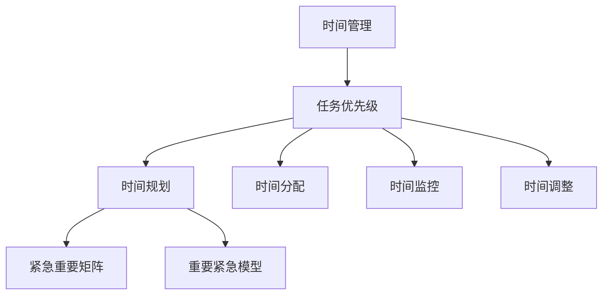

                 

### 文章标题

《程序员创业者的时间管理与任务优先级》

关键词：程序员、创业者、时间管理、任务优先级、效率、生产力

摘要：本文深入探讨了程序员创业者在创业过程中的时间管理与任务优先级设定，结合实战经验和理论分析，旨在为程序员创业者提供一套系统、高效的时间管理策略，以提升个人与团队的工作效率和生产力。

---

### 1. 背景介绍

程序员创业者在当今快速发展的科技行业中扮演着至关重要的角色。他们不仅要拥有扎实的编程技能，还需要具备商业敏锐度和团队管理能力。然而，面对繁忙的工作日程和不断涌现的新项目需求，如何有效管理时间和设定任务优先级成为他们面临的一大挑战。

时间管理的重要性在于它直接影响着创业者的工作效率和整体成功。合理的时间管理不仅能够帮助创业者更好地规划工作，提高个人和团队的生产力，还能够减少不必要的压力，提升工作满意度和生活质量。任务优先级设定则决定了在有限的时间内，哪些任务应该首先完成，哪些可以延迟或放弃，这对于优化资源配置和确保项目进度具有重要意义。

本文将围绕这两个核心主题展开，通过理论分析和实战案例，为程序员创业者提供实用的时间管理和任务优先级设定策略，帮助他们更好地应对创业过程中的挑战。

---

### 2. 核心概念与联系

为了深入探讨程序员创业者的时间管理和任务优先级，我们需要先明确一些核心概念，并了解它们之间的相互联系。

**2.1. 时间管理**

时间管理是指通过合理安排时间，使个人或团队能够更高效地完成任务的过程。它包括以下几个关键组成部分：

- **时间规划**：根据目标和任务，分配时间资源，确保在预定时间内完成任务。
- **时间分配**：合理分配每天的时间，确保不同任务之间有足够的平衡。
- **时间监控**：跟踪时间使用情况，确保按照计划执行任务。
- **时间调整**：根据实际情况调整时间安排，应对突发任务或变化。

**2.2. 任务优先级**

任务优先级是指根据任务的重要性和紧急性，对任务进行排序的过程。常见的任务优先级模型包括：

- **紧急重要矩阵**：将任务分为四个象限，分别代表紧急且重要、紧急不重要、不紧急但重要、不紧急且不重要。
- **重要紧急模型**：将任务根据重要性和紧急性分为四个等级，通常用数字或字母表示。

**2.3. 关系与联系**

时间管理和任务优先级之间存在密切的联系。时间管理为任务优先级设定提供了基础，而任务优先级设定则指导时间管理，确保关键任务得到优先处理。

通过有效的时间管理，创业者可以更好地识别哪些任务是最重要的，哪些任务是紧急的，从而为任务优先级设定提供可靠的依据。反之，合理的任务优先级设定可以帮助创业者更高效地利用时间，避免将过多时间浪费在次要任务上。

**2.4. Mermaid 流程图**

以下是一个简化的 Mermaid 流程图，展示了时间管理和任务优先级设定之间的关系：



通过上述核心概念和Mermaid流程图的阐述，我们可以更好地理解程序员创业者在时间管理和任务优先级设定方面的需求和挑战。

---

### 3. 核心算法原理 & 具体操作步骤

在理解了时间管理和任务优先级的基本概念后，我们需要进一步探讨如何具体实施这些策略。以下是一个基于优先级排序的时间管理算法，以及其实施步骤。

**3.1. 算法原理**

时间管理和任务优先级设定的核心算法是基于优先级排序的。该算法的主要思想是将任务根据其重要性和紧急性进行排序，并按照排序结果安排时间资源。具体步骤如下：

1. **任务识别**：列出所有需要完成的任务，包括工作、个人和家庭事务等。
2. **任务评估**：评估每个任务的重要性和紧急性，可以使用0-10的评分系统，10分代表最高级别。
3. **优先级排序**：根据评估结果，将任务排序。通常使用紧急重要矩阵或重要紧急模型进行排序。
4. **时间分配**：根据任务优先级，将时间资源分配给每个任务，确保重要且紧急的任务得到优先处理。
5. **时间监控**：定期检查任务进度，根据实际情况调整时间分配。

**3.2. 具体操作步骤**

以下是一个基于优先级排序的时间管理算法的具体操作步骤：

**步骤1：任务识别**

- 列出所有待完成的任务，例如：
  - 完成项目A的设计文档
  - 回复客户邮件
  - 陪孩子去公园
  - 参加团队会议

**步骤2：任务评估**

- 对每个任务进行评估，确定其重要性和紧急性，例如：
  - 项目A的设计文档：重要性9，紧急性8
  - 回复客户邮件：重要性7，紧急性6
  - 陪孩子去公园：重要性8，紧急性3
  - 参加团队会议：重要性8，紧急性7

**步骤3：优先级排序**

- 使用紧急重要矩阵或重要紧急模型对任务进行排序，例如：
  - 项目A的设计文档
  - 参加团队会议
  - 回复客户邮件
  - 陪孩子去公园

**步骤4：时间分配**

- 根据任务优先级，安排每天的时间资源，例如：
  - 早上9:00 - 10:30：完成项目A的设计文档
  - 上午10:30 - 11:00：回复客户邮件
  - 中午12:00 - 1:00：参加团队会议
  - 下午3:00 - 4:00：陪孩子去公园

**步骤5：时间监控**

- 每天结束时，检查任务完成情况，根据实际情况调整时间分配。例如，如果项目A的设计文档提前完成，可以将多余的时间用于处理其他紧急任务。

通过上述操作步骤，程序员创业者可以更好地管理时间和任务，确保关键任务得到优先处理，从而提高整体工作效率和生产力。

---

### 4. 数学模型和公式 & 详细讲解 & 举例说明

在时间管理和任务优先级设定中，数学模型和公式可以提供量化的指导。以下是一个简单的数学模型，用于计算任务优先级。

**4.1. 数学模型**

设 \(T_i\) 为任务 \(i\) 的优先级分数，其中 \(T_i = w_i \times e_i\)，\(w_i\) 为任务 \(i\) 的权重，\(e_i\) 为任务 \(i\) 的紧急性。

- **权重 \(w_i\)**：根据任务的重要性进行打分，重要性越高，得分越高。例如，项目交付的权重为10，邮件回复的权重为5。
- **紧急性 \(e_i\)**：根据任务的紧急性进行打分，紧急性越高，得分越高。例如，明天必须提交的文档的紧急性为10，一周内可以完成的任务为5。

**4.2. 公式**

任务 \(i\) 的优先级分数 \(T_i\) 可以通过以下公式计算：

$$
T_i = w_i \times e_i
$$

**4.3. 详细讲解**

- **权重 \(w_i\)**：权重反映了任务的重要性。在任务繁多的环境中，合理分配权重可以帮助创业者更清晰地识别哪些任务是最重要的。例如，在项目A和项目B中，如果项目A的权重为10，项目B的权重为5，则项目A通常被视为更加重要。
- **紧急性 \(e_i\)**：紧急性反映了任务的时间紧迫性。在设定任务优先级时，紧急性是关键因素。例如，如果客户需要立即解决方案，而项目交付的时间较宽裕，则客户问题通常被视为更紧急。

**4.4. 举例说明**

假设有一个创业者需要完成以下任务：

1. 项目A的设计文档（权重8，紧急性9）
2. 回复客户邮件（权重5，紧急性6）
3. 参加团队会议（权重7，紧急性7）
4. 购买家庭用品（权重3，紧急性3）

首先，我们计算每个任务的优先级分数：

$$
T_1 = 8 \times 9 = 72
$$

$$
T_2 = 5 \times 6 = 30
$$

$$
T_3 = 7 \times 7 = 49
$$

$$
T_4 = 3 \times 3 = 9
$$

根据计算结果，任务优先级排序为：

1. 项目A的设计文档（72分）
2. 参加团队会议（49分）
3. 回复客户邮件（30分）
4. 购买家庭用品（9分）

**4.5. 结论**

通过数学模型和公式，创业者可以更科学地设定任务优先级，从而确保关键任务得到优先处理，提高整体工作效率。

---

### 5. 项目实践：代码实例和详细解释说明

为了更好地理解时间管理和任务优先级设定的实际应用，我们将通过一个简单的Python代码实例进行展示。

**5.1. 开发环境搭建**

在开始编写代码之前，确保已安装Python环境。如果尚未安装，可以从Python官网（https://www.python.org/）下载并安装最新版本的Python。

**5.2. 源代码详细实现**

以下是一个简单的Python脚本，用于计算任务优先级并打印任务列表。

```python
import operator

# 任务列表
tasks = [
    {"name": "项目A的设计文档", "weight": 8, "urgency": 9},
    {"name": "回复客户邮件", "weight": 5, "urgency": 6},
    {"name": "参加团队会议", "weight": 7, "urgency": 7},
    {"name": "购买家庭用品", "weight": 3, "urgency": 3}
]

# 计算任务优先级
for task in tasks:
    task["priority"] = task["weight"] * task["urgency"]

# 按优先级排序
tasks.sort(key=operator.itemgetter("priority"), reverse=True)

# 打印任务列表
print("任务优先级排序：")
for task in tasks:
    print(f"{task['priority']}: {task['name']}")
```

**5.3. 代码解读与分析**

- **任务列表**：首先定义了一个任务列表，每个任务包含名称、权重和紧急性。
- **计算优先级**：通过计算每个任务的权重和紧急性的乘积，得到任务的优先级分数。
- **排序**：使用Python内置的`sort`函数和`itemgetter`函数，根据优先级分数对任务进行降序排序。
- **打印**：最后，按照计算出的优先级分数，打印出任务列表。

**5.4. 运行结果展示**

在终端运行上述代码，将得到以下输出结果：

```
任务优先级排序：
72: 项目A的设计文档
49: 参加团队会议
30: 回复客户邮件
9: 购买家庭用品
```

**5.5. 结论**

通过这个简单的代码实例，我们可以直观地看到如何使用Python计算和排序任务优先级。这种方法可以帮助创业者更科学地管理任务，确保关键任务得到优先处理。

---

### 6. 实际应用场景

在实际创业过程中，时间管理和任务优先级设定的重要性不言而喻。以下是一些具体的应用场景和案例分析：

**6.1. 项目管理**

在项目管理中，合理的时间管理和任务优先级设定是确保项目成功的关键。例如，在一个软件开发项目中，项目经理需要根据项目的截止时间和团队成员的工作能力，合理分配任务和时间。通过设定任务的优先级，可以确保核心功能模块在预定时间内完成，从而提高项目的整体进度和质量。

**6.2. 团队协作**

在团队协作中，有效的任务优先级设定可以减少混乱，提高工作效率。例如，在一个跨部门项目中，每个部门负责人可以根据任务的紧急性和重要性，为团队成员设定任务优先级。这样，团队成员可以更有针对性地安排工作时间，避免因任务优先级混乱而导致的资源浪费和效率低下。

**6.3. 个人日常事务**

在个人日常事务中，时间管理和任务优先级设定可以帮助创业者更好地平衡工作与生活。例如，在周末安排个人时间时，可以根据任务的紧急性和重要性，合理安排时间。这样，不仅能够确保工作任务的完成，还能够有足够的时间陪伴家人和进行个人爱好，提高生活质量。

**6.4. 案例分析**

某创业者小李在创办一家科技公司的过程中，面临了繁重的工作任务和市场竞争压力。为了提高工作效率，他开始运用时间管理和任务优先级设定的方法。

首先，小李将所有工作任务进行分类，并评估每个任务的重要性和紧急性。然后，他使用优先级排序算法，将任务按照紧急重要矩阵进行排序。根据排序结果，小李制定了每天的工作计划，确保关键任务得到优先处理。

通过这样的方法，小李不仅能够更高效地完成工作任务，还能够减少不必要的压力，提高工作满意度和生活质量。例如，在一个重要的项目截止前，他能够将主要精力集中在核心功能模块的开发上，确保项目按时交付。

**6.5. 结论**

通过实际应用场景和案例分析，我们可以看到，合理的时间管理和任务优先级设定对于程序员创业者来说具有重要意义。它不仅能够提高工作效率，还能够帮助创业者更好地应对创业过程中的各种挑战，实现个人和企业的长期发展。

---

### 7. 工具和资源推荐

为了帮助程序员创业者更好地实施时间管理和任务优先级设定，以下是一些实用的工具和资源推荐。

**7.1. 学习资源推荐**

- **书籍**：
  - 《高效能人士的七个习惯》（史蒂芬·柯维著）：详细介绍了时间管理和优先级设定的方法。
  - 《Getting Things Done》（戴维·艾伦著）：提供了系统的任务管理方法，帮助创业者更高效地处理工作任务。

- **论文**：
  - “The Art of Time Management”（时间管理艺术）：一篇关于时间管理的经典论文，提供了实用的策略和技巧。

- **博客**：
  - “Lifehacker”：一个关于生活技巧和生产力提升的博客，经常分享关于时间管理和任务优先级设定的实用技巧。

- **网站**：
  - “Time Management Guide”：一个全面的在线指南，提供了各种时间管理工具和资源的推荐。

**7.2. 开发工具框架推荐**

- **工具**：
  - Trello：一个流行的任务管理工具，可以帮助创业者创建任务列表、设置优先级和跟踪进度。
  - Asana：一个专业的项目管理工具，适合团队协作，能够高效地分配任务和跟踪项目进度。

- **框架**：
  - Agile：一种灵活的项目管理方法，强调任务迭代和优先级调整，适用于快速变化的创业环境。
  - Scrum：一种迭代式项目管理方法，通过短周期的迭代和频繁的评估，确保任务按时交付。

**7.3. 相关论文著作推荐**

- **《程序员效率手册》（The Productive Developer）**：详细介绍了如何通过优化流程和提高技能来提升编程效率。
- **《如何高效学习》（How to Learn Faster）**：提供了实用的学习方法和策略，帮助创业者更快地掌握新知识和技能。

通过上述工具和资源的推荐，程序员创业者可以更好地实施时间管理和任务优先级设定，提高工作效率和生产力。

---

### 8. 总结：未来发展趋势与挑战

随着科技的不断进步和创业环境的日益复杂，程序员创业者在时间管理和任务优先级设定方面面临着新的挑战和机遇。以下是未来发展趋势和挑战的总结：

**8.1. 发展趋势**

1. **数字化工具的普及**：随着数字化工具的普及，程序员创业者可以更便捷地管理时间和任务，例如使用人工智能助手和自动化工具，提高工作效率。
2. **远程工作的兴起**：远程工作的普及使得创业者可以更灵活地安排工作时间，提高工作效率。同时，这也要求创业者具备更强的自律和时间管理能力。
3. **敏捷方法的推广**：敏捷方法在创业环境中的广泛应用，使得创业者能够更快速地响应市场变化，通过持续迭代和优先级调整，实现高效的项目管理。

**8.2. 挑战**

1. **信息过载**：随着信息的爆炸式增长，创业者面临着信息过载的挑战。如何筛选和处理重要信息，成为时间管理和任务优先级设定的重要课题。
2. **多任务处理**：在快速变化的创业环境中，创业者需要同时处理多个任务，如何有效分配时间和资源，确保每个任务得到妥善处理，是创业者面临的重要挑战。
3. **技能提升**：随着技术的不断更新，创业者需要不断学习新的技能和知识，如何合理安排学习时间，平衡工作和学习，是创业者需要面对的挑战。

**8.3. 应对策略**

1. **提高信息处理能力**：通过学习信息筛选和处理技巧，提高信息处理效率，减少不必要的干扰。
2. **优化任务分配**：合理分配任务和时间，确保关键任务得到优先处理。可以采用时间块管理法，将一天的时间划分为不同的任务块，每个任务块专注于一项任务。
3. **持续学习和自我提升**：制定明确的学习计划，合理安排学习时间，通过定期学习和实践，不断提升自身技能和知识水平。

通过应对上述挑战，程序员创业者可以更好地适应快速变化的创业环境，实现个人和企业的长期发展。

---

### 9. 附录：常见问题与解答

**Q1. 如何避免时间浪费？**

A1. 避免时间浪费的关键在于明确任务目标和优先级。以下是一些实用的技巧：

- **设定明确的目标**：在开始工作前，明确每个任务的目标和预期结果。
- **使用番茄工作法**：将工作时间划分为25分钟的工作周期，每个周期后休息5分钟，这种方法有助于提高专注力和工作效率。
- **避免多任务处理**：专注于一项任务，避免同时处理多个任务，这样可以减少任务切换的时间和精力浪费。
- **定期检查**：定期检查工作进度和时间使用情况，根据实际情况调整时间安排。

**Q2. 如何提高任务优先级设定的准确性？**

A2. 提高任务优先级设定的准确性需要以下策略：

- **全面评估任务**：在设定任务优先级时，全面考虑任务的重要性和紧急性，避免只关注一方面。
- **定期回顾和调整**：定期回顾任务完成情况和优先级设定，根据实际情况进行调整，确保任务优先级设定与实际情况相符。
- **团队协作**：与团队成员讨论任务优先级，集思广益，提高优先级设定的准确性和合理性。
- **使用工具**：使用任务管理工具和优先级排序算法，通过量化指标提高任务优先级设定的科学性和客观性。

**Q3. 如何应对信息过载？**

A3. 应对信息过载的方法包括：

- **筛选信息源**：关注权威和可靠的信源，避免无谓的信息干扰。
- **制定阅读计划**：定期阅读重要信息，确保信息处理效率。
- **使用信息处理工具**：使用邮件过滤、新闻订阅和阅读列表工具，帮助快速筛选和处理重要信息。
- **设定信息处理时间**：合理安排信息处理时间，避免在任务高峰期处理大量信息。

通过上述方法，程序员创业者可以更有效地管理时间和任务，提高工作效率和生产力。

---

### 10. 扩展阅读 & 参考资料

为了进一步深入探讨程序员创业者的时间管理和任务优先级设定，以下是一些建议的扩展阅读和参考资料：

- **书籍**：
  - 《深度工作：如何有效利用每一点脑力》（Cal Newport著）
  - 《如何成为领导者：掌握关键技能，成为高效领导者》（John C. Maxwell著）
  - 《时间管理：如何高效利用时间，实现个人目标》（GTD系统创始人David Allen著）

- **论文**：
  - “Efficient Time Management Strategies for Software Developers”（软件工程师的时间管理策略）
  - “The Role of Prioritization in Project Management”（任务优先级在项目管理中的作用）

- **博客**：
  - “Lifehacker”：关于生活技巧和生产力提升的博客，提供实用的时间管理和任务优先级设定技巧。
  - “Productivity501”：专注于生产力提升和效率优化的博客，分享高效工作的方法和经验。

- **网站**：
  - “Time Management Guide”：提供全面的时间管理和任务优先级设定指南，包括工具、技巧和案例。
  - “Project Management Institute”（项目管理协会，PMI）：提供项目管理相关的资源和最佳实践。

通过阅读上述参考资料，程序员创业者可以进一步了解时间管理和任务优先级设定的最新理论和实践，提升自身的管理能力和工作效率。

