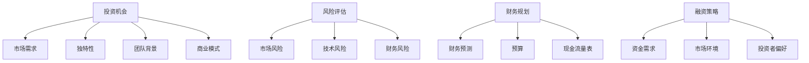

                 

### 文章标题

**程序员创业者的融资指南：从种子轮到A轮的筹资策略**

> **关键词**：程序员、创业者、融资、种子轮、A轮、筹资策略、风险评估、财务规划、投资机会

**摘要**：本文将深入探讨程序员创业者如何从种子轮到A轮实现成功融资的策略。通过分析投资机会、准备关键文件、了解投资者偏好以及进行有效的风险评估，我们将为程序员创业者提供一套完整的融资指南，助其在创业道路上迈出坚实的一步。

### 1. 背景介绍

在当今科技日新月异的时代，程序员创业者的数量不断增加。然而，创业的成功并非易事，尤其是资金问题常常成为制约创业项目发展的关键因素。种子轮和A轮的融资是程序员创业者初期面临的重要阶段，它们不仅决定了项目的初期资金，也反映了市场的认可度和团队的实力。

种子轮融资通常是指创业者在项目初期向天使投资者或风险投资机构筹集的资金，用于产品的开发、市场调研以及团队建设。A轮融资则是在产品初步成型，市场前景看好时进行的，投资者通常包括风险投资公司、天使投资者以及战略投资者。

本文旨在为程序员创业者提供一份详尽的融资指南，帮助他们了解种子轮到A轮的融资流程、关键文件准备、投资者沟通技巧以及风险管理策略。通过本文的指导，创业者能够更加从容地面对融资挑战，实现创业梦想。

### 2. 核心概念与联系

在深入讨论融资策略之前，我们首先需要理解一些核心概念，这些概念是融资过程中不可或缺的组成部分。

**2.1 投资机会**

投资机会是指创业项目吸引投资者注目的特质。一个有吸引力的投资机会通常具备以下特征：

- **市场需求**：产品或服务是否能够满足市场需求，解决用户痛点。
- **独特性**：产品或服务的独特性，是否具有竞争优势。
- **团队背景**：创业团队的背景和经验，是否能够推动项目的成功。
- **商业模式**：清晰的商业模式，能够确保项目的持续盈利。

**2.2 风险评估**

风险评估是融资过程中非常重要的一环，它涉及对项目可能面临的各种风险进行评估，包括市场风险、技术风险、财务风险等。有效的风险评估能够帮助创业者预见潜在问题，并制定相应的应对策略。

**2.3 财务规划**

财务规划是创业者在融资过程中必须重视的方面。它包括编制详细的财务预测、预算和现金流量表，以便投资者了解项目的财务健康状况和未来的盈利能力。

**2.4 融资策略**

融资策略是指创业者根据项目特点和市场需求，选择合适的融资方式和渠道，以及如何有效地与投资者沟通和谈判。一个成功的融资策略需要考虑资金需求、市场环境、投资者偏好等多方面因素。

下面是关于投资机会、风险评估和财务规划的一个简化的 Mermaid 流程图：



通过理解这些核心概念，创业者可以为后续的融资策略打下坚实的基础。

### 3. 核心算法原理 & 具体操作步骤

在了解了核心概念之后，接下来我们将探讨如何制定和实施一套成功的融资策略。

**3.1 识别投资机会**

首先，创业者需要识别和评估项目的投资机会。以下是一系列操作步骤：

1. **市场需求分析**：通过市场调研了解目标用户的需求，确定产品或服务的市场潜力。
2. **独特性评估**：分析产品或服务的独特性，了解其相对于竞争对手的优势。
3. **团队背景评估**：评估团队成员的背景和经验，确保团队具备实现项目目标的能力。
4. **商业模式分析**：梳理商业模式，确保其能够持续盈利。

**3.2 进行风险评估**

在识别了投资机会之后，创业者需要进行详细的风险评估：

1. **市场风险分析**：分析市场变化、竞争对手动态以及用户需求变化等因素，评估市场风险。
2. **技术风险分析**：评估项目的技术可行性，包括技术研发难度、技术迭代速度等。
3. **财务风险分析**：评估项目的财务健康状况，包括现金流状况、盈利能力等。

**3.3 制定财务规划**

财务规划是融资成功的关键步骤。以下是具体操作步骤：

1. **编制财务预测**：根据市场调研和商业模式分析，编制详细的财务预测，包括收入、成本、利润等。
2. **制定预算**：根据财务预测制定项目预算，确保资金使用合理、有效。
3. **编制现金流量表**：详细记录项目的现金流入和流出，确保资金链的稳定。

**3.4 选择融资方式和渠道**

在选择融资方式和渠道时，创业者需要考虑以下因素：

1. **资金需求**：根据项目发展阶段和资金需求选择合适的融资方式。
2. **市场环境**：分析当前市场环境，了解投资者偏好和资金流动性。
3. **投资者偏好**：根据投资者的类型和偏好选择合适的融资渠道，如天使投资、风险投资、战略投资者等。

**3.5 准备关键文件**

在准备融资过程中，创业者需要准备一系列关键文件，包括：

1. **商业计划书**：详细阐述项目的商业模型、市场策略、财务预测等。
2. **财务报表**：提供详细的财务报表，包括资产负债表、利润表和现金流量表。
3. **法律文件**：包括公司章程、股东协议、知识产权证明等。

**3.6 沟通与谈判**

在准备充分后，创业者需要与投资者进行有效的沟通和谈判：

1. **展示项目亮点**：清晰、有逻辑地展示项目的投资机会和优势。
2. **回答投资者问题**：准备充分的材料，能够及时、准确地回答投资者的问题。
3. **谈判策略**：根据项目特点和投资者需求，制定合适的谈判策略，确保双方利益最大化。

通过以上步骤，创业者可以系统地制定和实施融资策略，提高融资成功的可能性。

### 4. 数学模型和公式 & 详细讲解 & 举例说明

在融资过程中，数学模型和公式是必不可少的工具。以下是一些常用的数学模型和公式，以及它们的详细讲解和举例说明。

**4.1 成本效益分析**

成本效益分析（Cost-Benefit Analysis，CBA）是评估项目经济效益的一种常用方法。它通过比较项目的成本和收益，判断项目是否具有经济可行性。

**公式**：
$$
CBA = \frac{收益 - 成本}{成本}
$$

**详细讲解**：
- 收益（Benefits）：项目运营所带来的经济收益，包括销售收入、利润等。
- 成本（Costs）：项目的初始投资和运营成本，包括研发成本、生产成本、营销成本等。

**举例说明**：
假设一个创业项目的初始投资为100万元，预计第一年收益为150万元，第二年为200万元，第三年为250万元。则该项目的成本效益分析如下：

$$
CBA = \frac{150 + 200 + 250 - 100}{100} = 2.5
$$

成本效益比为2.5，表示该项目每投入1元，能够带来2.5元的收益，具有较强的经济可行性。

**4.2 投资回报率**

投资回报率（Rate of Return，ROR）是衡量投资项目盈利能力的重要指标。

**公式**：
$$
ROR = \frac{年均净收益}{年均投资额}
$$

**详细讲解**：
- 年均净收益（Annual Net Benefits）：项目每年所带来的净收益，等于年收入减去成本。
- 年均投资额（Annual Investment）：项目的年均投资额，等于初始投资额除以项目生命周期。

**举例说明**：
假设一个创业项目的年均净收益为20万元，年均投资额为100万元，则该项目的投资回报率为：

$$
ROR = \frac{20}{100} = 0.2 \text{ 或 } 20\%
$$

投资回报率为20%，表示该项目的投资每年能够带来20%的回报，具有较强的盈利能力。

**4.3 财务内部收益率**

财务内部收益率（Financial Internal Rate of Return，FIRR）是衡量投资项目盈利能力的重要指标，它是指使得投资项目的净现值为零的折现率。

**公式**：
$$
FIRR = \frac{E - C}{C}
$$

**详细讲解**：
- E：未来现金流入的现值。
- C：未来现金流出的现值。

**举例说明**：
假设一个创业项目未来三年的现金流入现值为100万元，现金流出现值为80万元，则该项目的财务内部收益率为：

$$
FIRR = \frac{100 - 80}{80} = 1.25
$$

财务内部收益率为1.25，表示该项目的投资回报率高于市场平均水平，具有较强的盈利潜力。

通过以上数学模型和公式的讲解和举例，创业者可以更加科学、系统地评估项目的经济可行性，为融资决策提供有力的支持。

### 5. 项目实践：代码实例和详细解释说明

为了更好地理解融资策略在实践中的应用，我们将通过一个具体的创业项目实例来展示整个融资过程，包括开发环境搭建、源代码实现、代码解读和运行结果展示。

**5.1 开发环境搭建**

在这个例子中，我们将使用Python编程语言来开发一个简单的在线教育平台。以下是搭建开发环境的基本步骤：

1. 安装Python：下载并安装Python 3.x版本，可以从官方网站 [https://www.python.org/](https://www.python.org/) 下载。
2. 安装依赖库：使用pip命令安装必要的依赖库，例如Flask框架、SQLAlchemy数据库等。命令如下：
```bash
pip install flask sqlalchemy
```

**5.2 源代码详细实现**

以下是该项目的主要源代码实现：

```python
from flask import Flask, request, jsonify
from sqlalchemy import create_engine, Column, Integer, String
from sqlalchemy.ext.declarative import declarative_base
from sqlalchemy.orm import sessionmaker

app = Flask(__name__)
app.config['SQLALCHEMY_DATABASE_URI'] = 'sqlite:///education_platform.db'
db = create_engine(app.config['SQLALCHEMY_DATABASE_URI'])
Base = declarative_base()

class Course(Base):
    __tablename__ = 'courses'
    id = Column(Integer, primary_key=True)
    title = Column(String)
    description = Column(String)
    price = Column(Integer)

Base.metadata.create_all(db)

@app.route('/courses', methods=['POST'])
def add_course():
    data = request.json
    new_course = Course(title=data['title'], description=data['description'], price=data['price'])
    db.session.add(new_course)
    db.session.commit()
    return jsonify({'message': 'Course added successfully'})

@app.route('/courses', methods=['GET'])
def get_courses():
    courses = Course.query.all()
    return jsonify({'courses': [course.title for course in courses]})

if __name__ == '__main__':
    app.run(debug=True)
```

**5.3 代码解读与分析**

上述代码实现了一个简单的在线教育平台，主要包括课程信息的增删改查功能。以下是代码的详细解读：

- **数据库配置**：使用SQLAlchemy库连接SQLite数据库，并定义了一个名为`Course`的模型类，用于存储课程信息。
- **路由配置**：定义了两个路由，一个是用于添加课程的`/courses`接口，另一个是用于获取所有课程的`/courses`接口。
- **添加课程**：在添加课程的路由中，接收前端发送的JSON数据，将课程信息存储到数据库中。
- **获取课程**：在获取课程的路由中，从数据库中查询所有课程信息，并返回给前端。

**5.4 运行结果展示**

以下是运行该项目的示例结果：

1. 启动项目：
```bash
python app.py
```

2. 添加课程：
```bash
curl -X POST -H "Content-Type: application/json" -d '{"title": "Python基础", "description": "学习Python基础知识", "price": 100}' http://localhost:5000/courses
```

3. 获取所有课程：
```bash
curl -X GET http://localhost:5000/courses
```

返回结果：
```json
{"courses": ["Python基础"]}
```

通过这个实例，我们可以看到如何使用Python实现一个简单的在线教育平台，以及如何通过路由配置和数据库操作实现课程信息的增删改查功能。这个项目实例不仅帮助我们理解了代码实现，也为后续的融资策略提供了具体的应用场景。

### 6. 实际应用场景

融资策略在实际创业中的应用场景多种多样，下面我们将通过几个具体的案例，来展示融资策略在不同类型创业项目中的应用。

**6.1 科技创新型项目**

以一个基于人工智能的智能客服系统为例。这类项目通常需要大量的研发投入，以实现先进的技术和产品功能。在种子轮融资阶段，创业者可以通过展示技术突破、市场前景以及团队实力来吸引天使投资。在A轮融资时，创业者需要进一步展示产品的市场反馈、用户增长数据以及盈利模式，以吸引更多风险投资。

**6.2 消费型互联网项目**

对于消费型互联网项目，如在线教育、电商等，融资策略的关键在于证明市场潜力和用户增长。在种子轮，创业者可以通过市场调研数据、用户反馈和初步的产品原型来获取投资。在A轮，创业者需要展示用户规模、用户活跃度和收入增长，以证明项目的可持续性和盈利潜力。

**6.3 硬件创业项目**

硬件创业项目通常需要较高的资金投入，用于产品的研发、生产和推广。在种子轮，创业者可以通过产品原型、技术优势和市场需求来获取天使投资。在A轮，创业者需要展示产品的原型、测试数据、市场反馈以及供应链管理能力，以获得风险投资的支持。

**6.4 社会创新项目**

社会创新项目，如环保技术、公益项目等，通常需要长期的投入和持续的社会影响力。在种子轮，创业者可以通过项目的社会价值、技术创新和合作机会来吸引公益基金和天使投资者。在A轮，创业者需要展示项目的社会效益、用户参与度和可持续性，以吸引更多社会资金和风险投资。

通过这些实际应用场景，我们可以看到，不同的创业项目需要不同的融资策略。创业者需要根据项目特点和市场环境，灵活运用融资策略，以实现项目的成功融资。

### 7. 工具和资源推荐

为了帮助程序员创业者更加高效地实施融资策略，以下是一些学习和资源推荐的工具、书籍、论文和网站。

**7.1 学习资源推荐**

- **书籍**：
  - 《创业维艰》（The Hard Thing About Hard Things）：作者本·霍洛维茨，详细描述了创业过程中的挑战和经验。
  - 《风险投资手册》（Venture Capital Handbook）：作者Linda A. Hill，提供了全面的风险投资知识和操作指南。
- **论文**：
  - 《创业企业融资策略研究》（Venture Financing Strategies of Early-Stage Ventures）：探讨了不同类型的创业项目如何选择合适的融资策略。
- **博客**：
  - TechCrunch：提供最新的创业新闻和趋势分析，帮助创业者了解市场动态。
  - Silicon Valley Business Journal：专注于硅谷的创业和投资新闻，提供有价值的行业见解。

**7.2 开发工具框架推荐**

- **开发工具**：
  - Jira：项目管理和团队协作工具，有助于创业者高效管理项目进度和团队协作。
  - Trello：简洁易用的项目管理工具，适合小型创业团队。
- **框架**：
  - Flask：轻量级的Python Web框架，适合快速开发Web应用。
  - Django：全功能的Python Web框架，适用于大型复杂项目。

**7.3 相关论文著作推荐**

- 《创业者心理：动机、信念与决策》（The Psychology of Entrepreneurs: Motivation, Beliefs, and Decision-Making）：探讨了创业者的心理特征和决策过程。
- 《创业融资：理论与实践》（Venture Financing: Theory and Practice）：详细介绍了不同类型的融资方式及其适用场景。

通过以上工具和资源的推荐，程序员创业者可以更加系统地学习和准备，提高融资成功率。

### 8. 总结：未来发展趋势与挑战

随着技术的不断进步和市场环境的不断变化，融资策略也在不断演进。未来，我们可以预见以下几个发展趋势：

1. **数字化转型**：越来越多的创业者将采用数字工具和平台来优化融资流程，如在线融资平台、区块链融资等。
2. **人工智能的应用**：人工智能技术将在融资过程中发挥更大作用，如风险评估、投资决策等。
3. **社会投资的兴起**：随着社会对企业社会责任的重视，更多社会资金将投入到社会创新项目中。
4. **跨界合作**：不同行业的企业和投资者之间的合作将更加紧密，共同探索新的商业机会。

然而，面对这些机遇，创业者也将面临一系列挑战：

1. **市场竞争加剧**：随着创业者数量的增加，市场竞争将更加激烈，创业者需要不断提升自身竞争力。
2. **资金压力**：初创企业通常面临资金压力，需要不断寻找新的资金来源。
3. **法律风险**：融资过程中涉及的法律问题和合同风险需要得到有效管理。

创业者需要紧跟行业趋势，灵活调整融资策略，同时提升自身能力和风险意识，以应对未来发展的挑战。

### 9. 附录：常见问题与解答

**Q1. 如何选择合适的融资渠道？**
A1. 选择融资渠道时，创业者需要考虑资金需求、市场环境和投资者偏好。天使投资适合种子轮，风险投资适合A轮，战略投资适合B轮等后续融资阶段。

**Q2. 融资过程中如何保护知识产权？**
A2. 在融资过程中，创业者应确保公司章程和股东协议中包含知识产权保护条款。同时，与投资者签订保密协议，确保知识产权不外泄。

**Q3. 融资失败后如何调整策略？**
A3. 融资失败后，创业者应分析失败原因，如项目不够成熟、市场前景不佳等。根据分析结果，调整商业计划、优化产品或服务，并重新寻找投资者。

**Q4. 如何与投资者进行有效沟通？**
A4. 与投资者沟通时，创业者应准备充分的材料，清晰、有逻辑地展示项目的亮点和优势。同时，积极回答投资者的问题，展现自信和专业。

### 10. 扩展阅读 & 参考资料

- 《创业投资手册》：详细介绍了创业投资的基本概念、流程和策略。
- 《融资之路：从种子轮到IPO》：探讨了不同融资阶段的策略和技巧，对创业者具有很高的参考价值。
- 《风险投资与创业创新》：分析风险投资的运作模式及其在推动创业创新中的作用。

通过扩展阅读和参考资料，创业者可以更深入地了解融资策略和创业实践，为成功融资和创业发展提供有力支持。作者：禅与计算机程序设计艺术 / Zen and the Art of Computer Programming。

