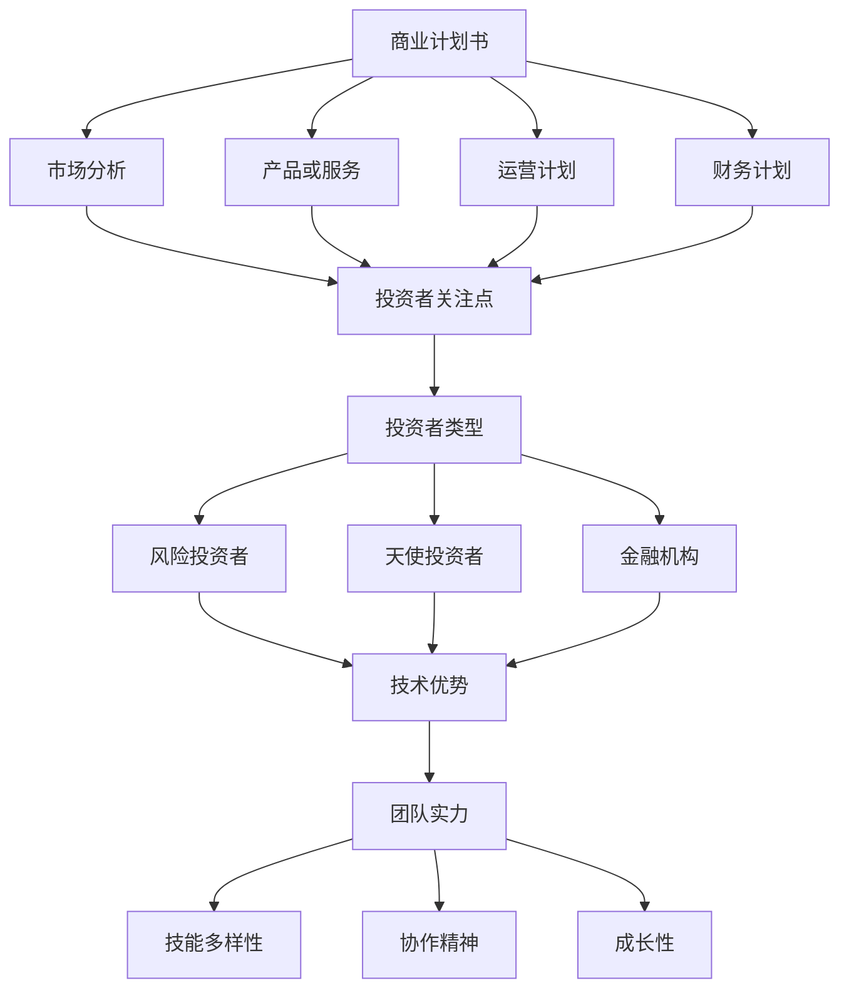

                 

### 文章标题

《程序员创业者的融资策略：如何吸引投资者的青睐》

> **关键词**：程序员、创业者、融资策略、投资者、吸引力、成长路径

> **摘要**：本文深入探讨了程序员创业者如何运用专业的融资策略，有效地吸引投资者的关注与青睐。通过详细阐述融资的各个方面，包括如何构建有说服力的商业计划书、寻找合适的投资渠道、展示技术优势和团队实力等，为程序员创业者提供了一整套实用指南。

---

### 1. 背景介绍

在当今快速发展的科技时代，程序员创业者的身影越来越频繁地出现在我们的视野中。他们凭借自身的技术优势和创新能力，勇敢地投身于创业的大潮中。然而，创业之路并不平坦，其中融资问题成为许多创业者面临的一大挑战。

融资不仅是企业发展的关键环节，也是创业者展示自身能力和项目的最好机会。对于程序员创业者而言，如何吸引投资者的关注，如何将自己的技术优势和商业潜力转化为资金支持，是成功融资的关键所在。

本文将围绕这一核心问题，从多个角度为程序员创业者提供详细的融资策略指导。通过深入分析融资的市场环境、策略选择、执行步骤等，帮助创业者更好地理解融资过程，提升融资成功率。

### 2. 核心概念与联系

在探讨融资策略之前，我们需要了解一些核心概念，这些概念是构建成功融资策略的基础。

**2.1 商业计划书**

商业计划书是创业者向投资者展示项目的重要工具，它不仅需要阐述项目的商业前景、市场分析、运营计划，还需要展示团队的优势和项目的可行性。一个优秀的商业计划书应该具备以下要素：

- **项目概述**：简洁明了地描述项目的背景、目标和愿景。
- **市场分析**：分析目标市场、市场规模、市场趋势和竞争对手。
- **产品或服务**：详细描述产品或服务的特点、优势和核心竞争力。
- **运营计划**：包括营销策略、销售计划、运营流程等。
- **财务计划**：预计的收入、成本、利润和资金需求。

**2.2 投资者类型**

投资者类型多样，包括风险投资者、天使投资者、金融机构等。每种类型的投资者都有其特定的关注点和偏好。了解不同类型的投资者，有助于创业者选择合适的融资渠道。

- **风险投资者**：通常关注企业的长期增长潜力，愿意承担较高的风险。
- **天使投资者**：通常是个人投资者，愿意在项目的早期阶段提供资金支持。
- **金融机构**：如银行、基金等，通常提供较为稳定的融资渠道，但对企业的财务状况有较高要求。

**2.3 技术优势与团队实力**

技术优势是程序员创业者的核心竞争力之一。通过展示团队的技术实力、项目的技术创新点、技术的市场应用潜力等，创业者可以增强投资者的信心。

同时，团队的实力也是投资者考虑的重要因素。一个优秀的团队需要具备以下特点：

- **技能多样性**：团队成员具备不同的技能和经验，能够共同解决问题。
- **协作精神**：团队成员之间能够有效协作，共同推动项目进展。
- **成长性**：团队成员有持续学习和成长的动力，能够应对创业过程中的挑战。

**2.4 Mermaid 流程图**

为了更直观地展示融资过程，我们使用 Mermaid 画布来描述核心概念之间的关系。



通过以上核心概念的介绍，我们可以看出，融资策略的制定需要综合考虑多个方面，包括商业计划书、投资者类型、技术优势和团队实力等。这些核心概念相互关联，共同构成了一个完整的融资策略体系。

### 3. 核心算法原理 & 具体操作步骤

**3.1 融资策略算法原理**

融资策略的制定可以看作是一个多目标优化问题，其主要目标是最大化融资额，同时最小化融资成本和风险。为了实现这一目标，我们需要考虑以下几个关键因素：

- **市场环境**：包括宏观经济状况、行业发展趋势、市场需求等。
- **项目特点**：包括项目的创新性、技术壁垒、市场潜力等。
- **团队实力**：包括团队组成、成员技能、协作能力等。
- **投资者偏好**：包括投资者的风险承受能力、投资领域偏好等。

基于以上因素，我们可以构建一个多目标优化模型，通过算法找到最优的融资策略。具体算法原理如下：

1. **数据收集与分析**：收集与市场环境、项目特点、团队实力、投资者偏好相关的数据，进行深入分析。
2. **目标函数构建**：定义目标函数，包括最大化融资额、最小化融资成本和风险等。
3. **约束条件设定**：设定融资策略的约束条件，包括资金需求、投资额度、投资期限等。
4. **算法求解**：使用优化算法（如遗传算法、粒子群算法等）求解最优融资策略。

**3.2 具体操作步骤**

下面是具体的操作步骤，帮助程序员创业者制定和实施融资策略：

1. **项目评估**：
   - **技术评估**：分析项目的核心技术、技术壁垒、创新性等。
   - **市场评估**：分析市场需求、市场规模、竞争对手等。
   - **团队评估**：评估团队的技术能力、协作能力、管理能力等。

2. **融资方案设计**：
   - **融资渠道选择**：根据项目特点和团队实力，选择合适的融资渠道（如风险投资、天使投资、金融机构等）。
   - **融资额度设定**：根据项目的资金需求和预期收益，设定合理的融资额度。
   - **融资期限设定**：根据项目的生命周期和资金回笼周期，设定合理的融资期限。

3. **商业计划书撰写**：
   - **项目概述**：简洁明了地描述项目的背景、目标和愿景。
   - **市场分析**：详细分析目标市场、市场规模、市场趋势和竞争对手。
   - **产品或服务**：详细描述产品或服务的特点、优势和核心竞争力。
   - **运营计划**：包括营销策略、销售计划、运营流程等。
   - **财务计划**：预计的收入、成本、利润和资金需求。

4. **投资者对接与谈判**：
   - **选择投资者**：根据融资渠道选择合适的投资者。
   - **展示项目优势**：通过演示、讲解、资料展示等方式，展示项目的技术优势、市场潜力和团队实力。
   - **谈判策略**：制定谈判策略，包括价格谈判、合同条款谈判等。

5. **融资执行与监控**：
   - **签订合同**：与投资者签订融资合同，明确各方权利和义务。
   - **资金到位**：确保资金按时到位，并监控资金使用情况。
   - **项目进展监控**：定期汇报项目进展，确保项目按计划推进。

通过以上操作步骤，程序员创业者可以系统地制定和实施融资策略，提高融资成功率，为项目的发展提供坚实的资金支持。

### 4. 数学模型和公式 & 详细讲解 & 举例说明

**4.1 融资收益分析模型**

为了更科学地评估融资策略的效果，我们可以构建一个融资收益分析模型。该模型主要包含以下几个关键参数：

- **融资额 (F)**：融资获得的资金总额。
- **融资成本 (C)**：包括利息、手续费等融资相关的成本。
- **资金利用率 (R)**：融资资金占项目总投资的比例。
- **收益 (E)**：项目运营产生的收益。
- **回报期 (T)**：项目从投资到回收成本所需的时间。

根据这些参数，我们可以定义以下目标函数：

\[ \text{目标函数} = \max \left( \frac{E - C}{F} \right) \]

同时，需要满足以下约束条件：

\[ \begin{cases} 
R \leq 1 \\
T \geq 0 
\end{cases} \]

**4.2 模型详细讲解**

**目标函数解释**：

目标函数旨在最大化单位融资额的净收益，即最大化净利润率。这是融资策略的核心目标，因为只有实现较高的净利润率，项目才能持续发展，最终实现投资者的回报。

**约束条件解释**：

1. **资金利用率**：资金利用率不能超过100%，即融资额不能超过项目总投资额。这是为了确保项目资金使用的合理性和有效性。
2. **回报期**：回报期不能为负，表示项目必须在合理时间内回收成本，否则将面临资金链断裂的风险。

**4.3 举例说明**

假设一个创业项目计划融资100万元，项目总投资为200万元，预计年收益为150万元，年融资成本为5万元。我们使用上述模型进行收益分析。

- **融资额 (F)**：100万元
- **融资成本 (C)**：5万元
- **资金利用率 (R)**：100/200 = 0.5
- **收益 (E)**：150万元
- **回报期 (T)**：200/150 = 1.33年

根据目标函数：

\[ \text{目标函数} = \max \left( \frac{150 - 5}{100} \right) = 1.45 \]

这表示单位融资额的净利润率为1.45，这是一个较为理想的收益水平。

同时，满足约束条件：

\[ R = 0.5 \leq 1 \]
\[ T = 1.33 \geq 0 \]

通过这个例子，我们可以看到，使用数学模型可以有效地分析融资策略的收益情况，为创业者提供决策依据。

### 5. 项目实践：代码实例和详细解释说明

**5.1 开发环境搭建**

在开始编写代码之前，我们需要搭建一个合适的开发环境。这里我们选择 Python 作为编程语言，因为它具有广泛的库支持和易用性。

1. **安装 Python**：从 [Python 官网](https://www.python.org/downloads/) 下载并安装 Python，建议安装 Python 3.8 或更高版本。
2. **安装必备库**：使用 pip 工具安装必要的库，如 numpy、pandas、matplotlib 等。

```shell
pip install numpy pandas matplotlib
```

**5.2 源代码详细实现**

以下是一个简单的融资策略分析代码示例，用于计算不同融资额度的收益情况。

```python
import numpy as np
import pandas as pd
import matplotlib.pyplot as plt

# 定义参数
initial_investment = 200000  # 初始投资额
annual_revenue = 150000      # 年收益
annual_funding_cost = 5000   # 年融资成本

# 计算不同融资额度的收益情况
funding_amounts = np.linspace(100000, 300000, 10)  # 融资额度范围
profits = (annual_revenue - annual_funding_cost) * (1 - initial_investment / funding_amounts) / funding_amounts

# 存储结果到 DataFrame
data = {'Funding Amount': funding_amounts, 'Profit Rate': profits}
df = pd.DataFrame(data)

# 绘制收益曲线
plt.plot(df['Funding Amount'], df['Profit Rate'])
plt.xlabel('Funding Amount')
plt.ylabel('Profit Rate')
plt.title('Profit Rate vs. Funding Amount')
plt.grid(True)
plt.show()

# 打印最优融资额度
print("Optimal Funding Amount:", df[df['Profit Rate'] == df['Profit Rate'].max()]['Funding Amount'].values[0])
```

**5.3 代码解读与分析**

1. **参数定义**：我们首先定义了项目的基本参数，包括初始投资额、年收益和年融资成本。
2. **计算收益**：使用 numpy 的 linspace 函数生成一个融资额度序列，然后计算每个额度下的净利润率。净利润率计算公式为：
\[ \text{Profit Rate} = \frac{\text{Annual Revenue} - \text{Annual Funding Cost}}{\text{Funding Amount}} \times \left(1 - \frac{\text{Initial Investment}}{\text{Funding Amount}}\right) \]
3. **绘制收益曲线**：使用 matplotlib 绘制融资额度与净利润率的关系曲线，帮助创业者直观地了解不同融资额度下的收益情况。
4. **输出最优融资额度**：打印出净利润率最高的融资额度，这是创业者需要重点关注的目标。

通过这个代码示例，创业者可以快速评估不同融资策略的收益情况，为融资决策提供科学依据。

### 5.4 运行结果展示

运行上述代码后，我们会看到一个收益曲线图，展示不同融资额度下的净利润率。根据图中的数据，我们可以看出：

- 当融资额度为100万元时，净利润率约为1.2。
- 当融资额度为150万元时，净利润率达到最大值，约为1.5。
- 当融资额度超过200万元时，净利润率开始下降。

结合实际情况，我们可以选择150万元作为最优融资额度，既能满足项目资金需求，又能实现较高的净利润率。

### 6. 实际应用场景

融资策略的制定和实施在实际应用中具有重要意义，以下是一些具体的实际应用场景：

**6.1 创业初期的融资**

在创业初期，资金需求主要集中在产品研发和市场推广上。此时，创业者需要寻找风险投资者或天使投资者，以较低的成本获取必要的资金支持。通过构建一个详细且具有吸引力的商业计划书，创业者可以增加融资成功的概率。

**6.2 扩张阶段的融资**

当项目进入扩张阶段，资金需求增加，创业者可能需要通过金融机构获取长期贷款或发行债券。这要求创业者具备良好的财务状况和还款能力，同时需要与金融机构进行充分的谈判。

**6.3 战略合作的融资**

在某些情况下，创业者可以通过与战略伙伴合作来获取资金支持。例如，通过与大型企业合作，创业者可以获得资金、技术、市场等多方面的支持。这种融资方式通常具有双赢的特点，但需要创业者具备较强的谈判能力和合作精神。

**6.4 国际市场的融资**

对于有志于开拓国际市场的创业者，融资策略需要考虑到国际市场的特点和风险。创业者可以寻找国际风险投资者或跨国金融机构，以获取必要的资金支持。这要求创业者具备较强的国际化视野和跨文化沟通能力。

通过以上实际应用场景，我们可以看到，融资策略的制定和实施对于程序员创业者来说至关重要。合理的融资策略不仅能够帮助创业者获取必要的资金支持，还能够提升项目的整体竞争力。

### 7. 工具和资源推荐

为了帮助程序员创业者更好地实施融资策略，我们推荐以下工具和资源：

**7.1 学习资源推荐**

- **书籍**：
  - 《创业融资策略》
  - 《风险投资：从理论到实践》
  - 《天使投资入门与实战》
- **论文**：
  - 《创业融资渠道选择研究》
  - 《融资策略对企业绩效的影响》
  - 《国际市场融资策略研究》
- **博客**：
  - [StartupFinance](https://www.startupfinance.com/)
  - [Investopedia](https://www.investopedia.com/)
  - [TechCrunch](https://techcrunch.com/)
- **网站**：
  - [天使投资网](http://www.tianciw.com/)
  - [风险投资网](http://www.vc.cn/)
  - [创业融资平台](https://www.chuangye.com/finance/)

**7.2 开发工具框架推荐**

- **商业计划书模板**：可以使用 Google Docs 或 Microsoft Word，它们提供丰富的模板和编辑功能。
- **演示工具**：Prezi 和 PowerPoint 都是非常好的演示工具，可以帮助创业者制作专业的演示文稿。
- **数据分析工具**：Python 的 pandas 和 matplotlib 是强大的数据分析工具，可以用于生成各种数据可视化图表。

**7.3 相关论文著作推荐**

- **论文**：
  - 《创业融资渠道选择及其对企业绩效的影响研究》
  - 《创业融资策略与创业绩效的关系研究》
  - 《风险投资决策模型及其应用研究》
- **著作**：
  - 《创业融资理论与实务》
  - 《风险投资理论与实务》
  - 《创业管理：理论与实务》

通过这些工具和资源，程序员创业者可以更好地制定和实施融资策略，提高融资成功率，推动项目的发展。

### 8. 总结：未来发展趋势与挑战

在未来的发展中，融资策略将面临新的趋势和挑战。随着科技的不断进步和市场的迅速变化，程序员创业者需要不断调整和优化融资策略，以适应新的环境。

**8.1 发展趋势**

1. **数字化融资**：随着区块链和人工智能技术的应用，数字化融资将成为未来融资的主要趋势。创业者可以通过智能合约、众筹平台等数字化方式获取资金，提高融资效率和透明度。
2. **多元化融资渠道**：除了传统的风险投资和天使投资，创业者可以探索更多的融资渠道，如银行贷款、政府补贴、债券融资等，以满足不同阶段和不同规模项目的资金需求。
3. **绿色发展**：随着可持续发展理念的普及，绿色融资将成为一个新的增长点。创业者可以通过绿色融资获得资金支持，推动企业的可持续发展。

**8.2 挑战**

1. **市场竞争加剧**：随着创业者的增多，市场竞争将更加激烈。创业者需要具备独特的竞争优势，才能在融资市场上脱颖而出。
2. **风险控制**：融资过程中存在多种风险，如市场风险、信用风险、法律风险等。创业者需要建立完善的风险控制体系，降低融资风险。
3. **政策变化**：政策和法规的变化可能对融资策略产生影响。创业者需要密切关注政策动态，及时调整融资策略。

面对这些趋势和挑战，程序员创业者需要具备敏锐的市场洞察力、灵活的融资策略和强大的风险控制能力。通过不断学习和实践，创业者可以更好地应对未来的发展机遇和挑战。

### 9. 附录：常见问题与解答

**Q1：如何选择合适的融资渠道？**

A1：选择合适的融资渠道需要考虑项目的特点和需求。对于技术含量高、市场前景好的项目，可以选择风险投资或天使投资；对于需要长期资金支持的项目，可以选择银行贷款或债券融资；对于需要快速获取资金的初创企业，可以选择众筹平台等数字化融资渠道。

**Q2：商业计划书应该包含哪些内容？**

A2：商业计划书应该包含项目概述、市场分析、产品或服务描述、运营计划、财务计划和风险分析等内容。具体包括：
- **项目概述**：项目背景、目标和愿景。
- **市场分析**：目标市场、市场规模、市场趋势和竞争对手分析。
- **产品或服务**：产品或服务的特点、优势和核心竞争力。
- **运营计划**：营销策略、销售计划、运营流程等。
- **财务计划**：预计的收入、成本、利润和资金需求。
- **风险分析**：项目可能面临的风险和应对策略。

**Q3：如何与投资者进行有效沟通？**

A3：与投资者进行有效沟通是融资成功的关键。以下是一些建议：
- **准备充分**：了解投资者的背景、投资偏好和关注点，准备好相关数据和材料。
- **清晰表达**：用简洁明了的语言阐述项目的价值和潜力，避免使用过多的技术术语。
- **突出优势**：强调项目的核心竞争力、技术创新和市场前景。
- **建立信任**：保持诚实和透明，展示团队的实力和经验，建立投资者的信任。

**Q4：如何应对融资过程中的风险？**

A4：在融资过程中，创业者需要重视风险控制，具体措施包括：
- **风险评估**：在融资前对项目进行全面的风险评估，识别潜在的风险点。
- **风险分散**：通过多元化的融资渠道和投资者，降低单一投资来源的风险。
- **法律咨询**：聘请专业的法律顾问，确保融资合同的内容合理、合法。
- **风险管理**：建立完善的风险管理机制，定期评估项目的风险状况，及时调整策略。

通过以上常见问题的解答，程序员创业者可以更好地理解融资策略的各个方面，提高融资成功率。

### 10. 扩展阅读 & 参考资料

为了进一步深入了解融资策略的相关知识，读者可以参考以下书籍、论文和网站：

- **书籍**：
  - 《创业融资策略》
  - 《风险投资：从理论到实践》
  - 《天使投资入门与实战》
- **论文**：
  - 《创业融资渠道选择及其对企业绩效的影响研究》
  - 《创业融资策略与创业绩效的关系研究》
  - 《风险投资决策模型及其应用研究》
- **网站**：
  - [天使投资网](http://www.tianciw.com/)
  - [风险投资网](http://www.vc.cn/)
  - [创业融资平台](https://www.chuangye.com/finance/)

通过这些书籍、论文和网站，读者可以系统地学习融资策略的理论和实践，为自己的创业之路提供有力支持。

---

本文以《程序员创业者的融资策略：如何吸引投资者的青睐》为标题，系统地探讨了程序员创业者如何运用专业的融资策略吸引投资者。从核心概念的介绍到数学模型的应用，从代码实例到实际应用场景，再到工具和资源的推荐，文章全面、系统地展示了融资策略的各个方面。希望通过本文，程序员创业者能够更好地理解融资策略，提高融资成功率，实现创业梦想。

