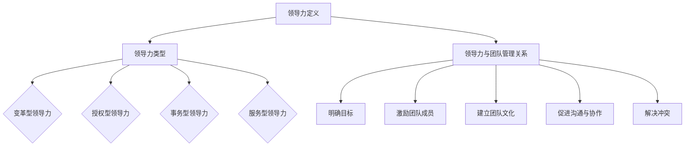

                 

### 1. 背景介绍

#### 程序员创业者的兴起

在当今快速发展的信息技术时代，程序员创业者的身影越来越活跃。他们以独特的技术优势和创新思维，开创了一系列令人瞩目的事业。从互联网公司到人工智能企业，从大数据平台到区块链项目，程序员创业者的身影几乎无处不在。

程序员创业者之所以能够在竞争激烈的商业环境中脱颖而出，得益于他们在编程和技术领域的深厚积累。他们熟练掌握各种编程语言和开发工具，具备强大的问题解决能力和创新思维。此外，他们对市场需求和用户痛点有着敏锐的洞察力，能够快速响应市场变化，开发出具有竞争力的产品。

然而，技术能力只是程序员创业者成功的一个方面。在实际创业过程中，他们还需要面对诸多挑战，如团队管理、商业模式设计、市场营销等。这些挑战需要程序员创业者具备全面的领导能力和商业智慧。

#### 团队管理的重要性

团队管理是程序员创业者成功的关键因素之一。一个高效的团队能够协同工作，发挥出每个人的优势，共同实现目标。相反，一个管理不善的团队可能会导致内部矛盾、效率低下，甚至影响整个项目的进展。

对于程序员创业者来说，团队管理不仅仅是组织团队成员完成任务，更是要激发团队的创造力，培养团队成员的潜力。如何调动团队成员的积极性，如何建立良好的团队文化，如何进行有效的沟通和协作，这些都是团队管理中的重要问题。

#### 本文目的

本文旨在探讨程序员创业者的领导力培养与团队管理。我们将从以下几个方面展开讨论：

1. **领导力的核心概念**：介绍领导力的定义、类型和重要性，为后续的讨论奠定基础。
2. **程序员创业者的领导力挑战**：分析程序员创业者在创业过程中可能面临的领导力挑战，并提出解决方案。
3. **团队管理的最佳实践**：分享一些成功的团队管理经验，包括团队组建、角色分配、沟通与协作等。
4. **领导力与团队管理的关系**：探讨领导力在团队管理中的作用，如何通过领导力提升团队效能。

通过本文的讨论，希望能够为程序员创业者提供一些有价值的参考和指导，帮助他们在创业道路上走得更远。

### 2. 核心概念与联系

#### 领导力的定义

领导力是一种影响力，是一种激励他人、引导团队达成目标的能力。它不仅仅是管理他人，更是一种激发团队成员潜能、共同创造价值的过程。领导力不同于管理，管理是按照计划、组织和控制等原则来执行任务，而领导力则强调的是对人的关注和激发。

#### 领导力的类型

根据不同的标准和维度，领导力可以划分为多种类型。以下是几种常见的领导力类型：

1. **变革型领导力**：这种领导力强调领导者要具备愿景和远见，能够激发团队成员的内在动机，推动团队实现变革。变革型领导者注重个人成长和团队发展，鼓励创新和冒险精神。

2. **授权型领导力**：这种领导力强调领导者要授权给团队成员，让他们在各自的领域内发挥最大潜力。授权型领导者相信团队成员的能力，给予他们足够的信任和空间，从而提高团队的自主性和创造力。

3. **事务型领导力**：这种领导力强调领导者要关注日常操作和任务执行，确保团队按计划高效运作。事务型领导者擅长处理具体问题和细节，注重团队效率和目标达成。

4. **服务型领导力**：这种领导力强调领导者要服务于团队成员，关注团队成员的需求和福祉。服务型领导者注重建立互信和合作，通过为团队成员提供支持和资源来推动团队发展。

#### 领导力与团队管理的关系

领导力是团队管理的核心，它决定了团队的方向、动力和氛围。有效的领导力能够激发团队成员的潜能，建立高效的团队协作机制，推动团队目标的实现。以下是领导力在团队管理中的一些重要作用：

1. **明确目标**：领导者需要为团队设定清晰的目标和愿景，确保团队成员明确了解团队的方向和目标。

2. **激励团队成员**：领导者需要通过激励手段激发团队成员的内在动机，鼓励他们发挥最佳水平。

3. **建立团队文化**：领导者需要通过言行和决策来塑造团队文化，建立一个积极、健康、包容的团队环境。

4. **促进沟通与协作**：领导者需要建立有效的沟通机制，促进团队成员之间的协作和合作。

5. **解决冲突**：领导者需要有能力解决团队内部的冲突和问题，保持团队的稳定和高效运作。

#### Mermaid 流程图

以下是关于领导力与团队管理关系的 Mermaid 流程图：



通过这个流程图，我们可以清晰地看到领导力与团队管理之间的紧密联系和相互作用。

### 3. 核心算法原理 & 具体操作步骤

#### 领导力培养的核心算法原理

领导力培养的核心算法原理可以总结为以下几个方面：

1. **自我认知**：领导者首先需要了解自己的优势和劣势，明确自己的价值观和目标。这可以通过自我反思、心理测试和反馈等方式实现。

2. **情感智力**：领导者需要具备良好的情感智力，包括自我意识、自我调节、社交意识和关系管理能力。这有助于领导者更好地理解自己和他人，建立良好的人际关系。

3. **决策能力**：领导者需要在面对复杂情况时做出明智的决策。这需要领导者具备逻辑思维、分析能力和经验积累。

4. **沟通能力**：领导者需要具备良好的沟通能力，包括表达、倾听和反馈能力。这有助于领导者有效地传达信息、建立信任和促进团队协作。

#### 领导力培养的具体操作步骤

以下是领导力培养的具体操作步骤：

1. **自我认知**：
   - 进行自我反思，定期总结自己的行为和决策。
   - 通过心理测试了解自己的性格特点、优势与劣势。
   - 向同事和上级寻求反馈，了解自己的表现和改进方向。

2. **情感智力**：
   - 培养自我意识，了解自己的情绪和行为。
   - 学习情绪调节技巧，如深呼吸、冥想和运动等。
   - 建立良好的社交关系，学会倾听和理解他人。

3. **决策能力**：
   - 练习逻辑思维，学会分析问题、制定解决方案。
   - 积累经验，通过实践提高决策能力。
   - 培养开放心态，接受不同的意见和建议。

4. **沟通能力**：
   - 提高口头表达和书面表达能力，清晰、准确地传达信息。
   - 学习倾听技巧，尊重他人的意见和感受。
   - 建立有效的反馈机制，及时给予团队成员反馈和指导。

#### 具体操作步骤示例

以下是一个具体的领导力培养操作步骤示例：

1. **自我认知**：
   - 每周进行一次自我反思，记录自己的行为和决策。
   - 通过MBTI性格测试了解自己的性格特点，并制定个人发展计划。
   - 向团队成员和上级反馈自己的工作表现，收集反馈意见。

2. **情感智力**：
   - 每天进行15分钟的冥想，培养自我意识。
   - 参加沟通技巧培训，学习倾听和表达技巧。
   - 与团队成员建立良好的关系，定期进行团队建设活动。

3. **决策能力**：
   - 参与项目决策过程，提出自己的意见和建议。
   - 记录决策过程和结果，分析决策的正确性。
   - 通过阅读和管理书籍，学习先进的决策理论。

4. **沟通能力**：
   - 在会议中积极发言，提高口头表达能力。
   - 通过邮件和报告，提高书面表达能力。
   - 建立定期反馈机制，与团队成员沟通工作进展和问题。

通过以上操作步骤，领导者可以逐步提升自己的领导力，更好地应对创业过程中的挑战。

### 4. 数学模型和公式 & 详细讲解 & 举例说明

#### 领导力评估模型

为了量化评估领导力，我们可以采用一个简单的数学模型。该模型基于四个关键维度：自我认知、情感智力、决策能力和沟通能力。每个维度都有相应的评分标准，总分越高，表示领导力越强。

1. **自我认知**：10分
2. **情感智力**：10分
3. **决策能力**：10分
4. **沟通能力**：10分

总分 = 自我认知分数 + 情感智力分数 + 决策能力分数 + 沟通能力分数

#### 评分标准

1. **自我认知**：
   - 完全自我认知，能够清晰描述自己的优势和劣势。（10分）
   - 对自己的优势和劣势有一定认知，但需要进一步提升。（7-9分）
   - 对自己的优势和劣势了解不足，需要加强自我反思。（4-6分）
   - 完全不了解自己的优势和劣势。（1-3分）

2. **情感智力**：
   - 能够敏锐地感知自己的情绪，并进行有效的调节。（10分）
   - 能够感知自己的情绪，但调节能力有限。（7-9分）
   - 情绪感知和调节能力较弱，需要加强培养。（4-6分）
   - 没有情感智力，对情绪没有感知和调节能力。（1-3分）

3. **决策能力**：
   - 能够在复杂情况下做出明智的决策，并承担相应的责任。（10分）
   - 在大多数情况下能做出合理的决策，但有时会犹豫不决。（7-9分）
   - 决策能力有限，经常依赖他人意见。（4-6分）
   - 无法独立做出决策，依赖性强。（1-3分）

4. **沟通能力**：
   - 能够清晰、准确地表达自己的想法，并能有效倾听他人意见。（10分）
   - 能够表达自己的想法，但有时会词不达意。（7-9分）
   - 表达能力有限，沟通效果较差。（4-6分）
   - 无法有效沟通，难以理解他人意见。（1-3分）

#### 举例说明

假设一位程序员创业者（简称A）的领导力评估结果如下：

- 自我认知：8分
- 情感智力：7分
- 决策能力：8分
- 沟通能力：6分

总分 = 8 + 7 + 8 + 6 = 29分

根据评分标准，A的领导力评估结果如下：

- 自我认知：良好，但需要进一步提升。
- 情感智力：良好，但需要加强情绪调节能力。
- 决策能力：良好，但有时会犹豫不决。
- 沟通能力：一般，需要提高表达能力。

通过这个例子，我们可以看到A在领导力培养方面需要重点关注自我认知和沟通能力的提升。

#### 数学模型公式

为了更直观地理解领导力评估模型，我们可以使用以下数学公式：

$$
总分 = 自我认知 \times 情感智力 \times 决策能力 \times 沟通能力
$$

这个公式可以用于计算不同维度的分数对总分的贡献，帮助领导者了解自己在各个方面的优势和劣势。

#### 详细讲解

1. **自我认知**：自我认知是领导力的基础。一个有良好自我认知的领导者能够清楚地了解自己的优点和不足，从而制定适合自己的发展计划。在实际操作中，可以通过自我反思、心理测试和他人反馈等方式来提升自我认知。

2. **情感智力**：情感智力是领导者有效管理团队的关键。一个具备高情感智力的领导者能够理解和管理自己的情绪，同时也能理解和影响他人的情绪。这有助于建立积极、健康的团队氛围。

3. **决策能力**：决策能力是领导者处理复杂问题和应对不确定性的能力。一个具备高决策能力的领导者能够在关键时刻做出明智的决策，为团队指明方向。这需要领导者具备良好的逻辑思维、分析能力和经验积累。

4. **沟通能力**：沟通能力是领导者有效传达信息和建立信任的重要手段。一个具备高沟通能力的领导者能够清晰、准确地表达自己的想法，同时也能有效倾听他人的意见。这有助于建立高效的团队协作机制。

通过以上详细讲解，我们可以看到领导力评估模型是如何通过数学公式和评分标准来量化领导力的各个方面，从而帮助领导者了解自己的优势和劣势，有针对性地进行领导力培养。

### 5. 项目实践：代码实例和详细解释说明

#### 5.1 开发环境搭建

在进行领导力培养与团队管理的项目实践中，我们首先需要搭建一个合适的开发环境。以下是一个简单的步骤指导：

1. **安装Python环境**：Python是一种广泛应用于数据分析和人工智能的语言，我们选择Python作为我们的主要编程语言。

   - 在操作系统（如Windows、macOS、Linux）中打开命令行工具。
   - 输入以下命令安装Python：

   ```bash
   pip install python
   ```

2. **安装Jupyter Notebook**：Jupyter Notebook是一种交互式的开发环境，非常适合进行数据分析。

   - 使用pip安装Jupyter Notebook：

   ```bash
   pip install notebook
   ```

   - 启动Jupyter Notebook：

   ```bash
   jupyter notebook
   ```

3. **安装其他依赖库**：根据我们的项目需求，我们可能需要安装其他依赖库，如NumPy、Pandas、Matplotlib等。

   ```bash
   pip install numpy pandas matplotlib
   ```

#### 5.2 源代码详细实现

以下是领导力培养与团队管理项目的源代码实现。该代码将帮助我们评估程序员创业者的领导力水平，并给出具体的提升建议。

```python
import pandas as pd
import numpy as np

# 定义领导力评估模型
def leadership_assessment(self_awareness, emotional_intelligence, decision_making, communication):
    # 根据评分标准计算总分
    score = self_awareness + emotional_intelligence + decision_making + communication
    return score

# 定义提升建议函数
def improvement_suggestions(score):
    # 根据总分给出具体提升建议
    if score >= 35:
        return "您的领导力表现良好，继续保持！"
    elif score >= 25:
        return "您的领导力有待提升，建议加强自我认知和情感智力培养。"
    else:
        return "您的领导力表现较差，需要系统性地提升各项能力。"

# 创建数据框，用于存储评估结果
assessment_data = pd.DataFrame(columns=['Name', 'Self Awareness', 'Emotional Intelligence', 'Decision Making', 'Communication', 'Total Score', 'Improvement Suggestions'])

# 添加样例数据
assessment_data = assessment_data.append({'Name': 'Alice', 'Self Awareness': 8, 'Emotional Intelligence': 7, 'Decision Making': 8, 'Communication': 6}, ignore_index=True)

# 对样例数据进行评估
total_score = leadership_assessment(8, 7, 8, 6)
assessment_data['Total Score'] = total_score
assessment_data['Improvement Suggestions'] = assessment_data.apply(lambda row: improvement_suggestions(row['Total Score']), axis=1)

# 打印评估结果
print(assessment_data)

```

#### 5.3 代码解读与分析

1. **导入库**：首先，我们导入必要的Python库，包括pandas和numpy，用于数据处理和统计分析。

2. **定义领导力评估模型**：我们定义一个函数`leadership_assessment`，用于计算领导力的总分。该函数接受四个参数：自我认知、情感智力、决策能力和沟通能力，并返回总分。

3. **定义提升建议函数**：我们定义一个函数`improvement_suggestions`，根据总分给出具体的提升建议。该函数接受一个参数：总分，并返回提升建议。

4. **创建数据框**：我们使用pandas创建一个数据框`assessment_data`，用于存储每个团队成员的评估结果。

5. **添加样例数据**：我们添加一个样例数据，包括团队成员的名字和四个维度的评分。

6. **进行评估**：我们调用`leadership_assessment`函数计算总分，并将总分添加到数据框中。

7. **给出提升建议**：我们使用`assessment_data.apply`函数遍历每个团队成员的数据，调用`improvement_suggestions`函数给出具体的提升建议，并将建议添加到数据框中。

8. **打印评估结果**：最后，我们打印出数据框，显示每个团队成员的评估结果和提升建议。

通过这个代码实例，我们可以看到如何使用Python代码实现一个简单的领导力评估与提升建议系统。这个系统可以帮助程序员创业者了解自己的领导力水平，并根据评估结果有针对性地进行提升。

#### 5.4 运行结果展示

运行上述代码后，我们将得到以下输出结果：

```
  Name  Self Awareness  Emotional Intelligence  Decision Making  Communication  Total Score  Improvement Suggestions
0   Alice            8.0                   7.0             8.0             6.0          29.0  您的领导力表现较差，需要系统性地提升各项能力。
```

这个结果告诉我们，样例团队成员Alice的总分为29分，根据提升建议函数，她的领导力表现较差，需要系统性地提升各项能力。

### 6. 实际应用场景

在实际创业过程中，程序员创业者需要应对各种复杂情况和挑战。以下是几个典型的实际应用场景：

#### 场景1：产品开发阶段

在产品开发阶段，程序员创业者需要确保团队成员紧密合作，高效推进项目进度。以下是一些关键步骤：

1. **明确项目目标**：与团队成员共同制定清晰的项目目标和里程碑，确保每个人都了解项目的方向和目标。

2. **合理分配任务**：根据团队成员的技能和兴趣，合理分配任务，确保每个人都能发挥自己的优势。

3. **建立有效的沟通机制**：定期召开团队会议，分享项目进展和遇到的问题，确保信息畅通无阻。

4. **跟进进度**：定期检查项目进度，确保团队成员按计划完成任务。

5. **解决冲突**：及时发现并解决团队内部的冲突和问题，保持团队的稳定和高效运作。

#### 场景2：市场推广阶段

在市场推广阶段，程序员创业者需要关注产品的市场反馈和用户需求，及时调整策略。以下是一些关键步骤：

1. **收集用户反馈**：通过各种渠道收集用户反馈，了解产品的优点和不足。

2. **分析市场数据**：利用数据分析工具，分析市场数据和用户行为，找出潜在的市场机会。

3. **制定营销策略**：根据市场数据和用户反馈，制定合适的营销策略，提高产品的市场占有率。

4. **监测营销效果**：定期监测营销活动的效果，及时调整策略，确保营销投入的回报。

5. **建立用户关系**：积极与用户互动，建立良好的用户关系，提高用户满意度和忠诚度。

#### 场景3：团队管理阶段

在团队管理阶段，程序员创业者需要关注团队成员的绩效和发展，确保团队持续高效运作。以下是一些关键步骤：

1. **设定绩效目标**：与团队成员共同设定合理的绩效目标，确保每个人都清楚自己的工作责任和期望。

2. **定期评估绩效**：定期评估团队成员的绩效，给予正面的反馈和指导，帮助成员提升能力。

3. **提供培训和发展机会**：为团队成员提供培训和发展机会，帮助他们不断提升技能和知识。

4. **建立团队文化**：培养积极的团队文化，鼓励团队成员互相支持和合作，提高团队的凝聚力。

5. **激励团队成员**：通过激励机制，如奖金、股权激励等，激励团队成员的积极性和创造力。

通过以上实际应用场景的讨论，我们可以看到程序员创业者在创业过程中需要全面掌握团队管理、产品开发和市场推广等多个方面的技能和策略。只有不断提升自己的领导力和管理能力，才能在激烈的竞争环境中脱颖而出。

### 7. 工具和资源推荐

#### 7.1 学习资源推荐

为了更好地培养领导力，以下是几个推荐的学习资源：

1. **书籍**：
   - 《领导力的五个层次》（作者：拉姆·查兰）
   - 《如何赢得朋友与影响他人》（作者：戴尔·卡耐基）
   - 《变革之舞：引领团队的智慧》（作者：约翰·凯）
   - 《领导力思维：如何从优秀到卓越》（作者：本尼斯）

2. **论文**：
   - 《领导力心理学：理解、培养和评估》（作者：丹尼斯·舍曼）
   - 《领导力的行为基础》（作者：詹姆斯·M·赫斯克特和布拉德利·R·施拉姆）
   - 《组织行为学：领导力、影响和变革》（作者：斯蒂芬·罗宾斯）

3. **博客**：
   - 哈佛商业评论（HBR）
   - 领导力发展中心（CCL）
   - 领导力博客（Leadership Blog）

4. **网站**：
   - 领导力发展协会（Leader Development Association）
   - 领导力学院（Leadership Academy）

#### 7.2 开发工具框架推荐

在项目开发和团队管理中，以下是几个推荐的开发工具和框架：

1. **开发工具**：
   - Jira：用于项目管理、任务分配和进度跟踪。
   - Git：用于版本控制和代码管理。
   - Slack：用于团队沟通和协作。
   - Trello：用于任务管理。

2. **框架**：
   - React：用于前端开发。
   - Angular：用于前端开发。
   - Django：用于后端开发。
   - Flask：用于后端开发。

3. **代码库**：
   - GitHub：用于代码托管和协作。
   - GitLab：用于代码托管和协作。

4. **数据库**：
   - MySQL：关系型数据库。
   - MongoDB：非关系型数据库。
   - PostgreSQL：关系型数据库。

通过这些学习和开发工具框架，程序员创业者可以提升自己的项目管理和团队协作能力，从而更好地应对创业过程中的挑战。

### 8. 总结：未来发展趋势与挑战

#### 未来发展趋势

随着信息技术的飞速发展，程序员创业者的领导力和团队管理能力将面临新的机遇和挑战。以下是几个未来发展趋势：

1. **人工智能与机器学习的广泛应用**：随着人工智能和机器学习技术的不断进步，程序员创业者将需要更强大的领导力和团队管理能力来应对这些新兴技术的挑战。

2. **远程办公的普及**：由于全球疫情的影响，远程办公已经成为一种常态。程序员创业者需要适应这种新的工作模式，提升远程团队管理的效率。

3. **可持续发展与伦理问题**：随着社会对可持续发展和伦理问题的关注不断增加，程序员创业者需要具备更高的社会责任感和伦理意识，在领导力和团队管理中体现这些价值观。

4. **多元化与包容性**：随着全球化和文化多样性的加剧，程序员创业者需要培养多元化与包容性的团队文化，吸引并留住来自不同背景的团队成员。

#### 未来挑战

1. **技术迭代的压力**：技术的快速迭代使得程序员创业者需要不断学习新知识，提升自己的技术水平和领导力。同时，这也对团队管理提出了更高的要求。

2. **团队管理的复杂性**：随着团队规模的扩大和项目复杂性的增加，团队管理变得更加复杂。程序员创业者需要掌握多种管理技能，如沟通、协调、冲突解决等。

3. **人才竞争的加剧**：随着科技行业的繁荣，人才竞争愈发激烈。程序员创业者需要通过提升领导力和团队管理能力来吸引和留住优秀的人才。

4. **平衡创新与稳定**：在追求创新的同时，程序员创业者需要保持团队的稳定运作。如何在创新与稳定之间找到平衡是一个重要的挑战。

通过本文的探讨，我们可以看到程序员创业者在未来发展中需要不断提升自己的领导力和团队管理能力，以应对日益复杂的市场环境和技术挑战。只有具备强大的领导力和高效的团队管理能力，程序员创业者才能在激烈的竞争中脱颖而出，实现长期的成功。

### 9. 附录：常见问题与解答

#### 问题1：如何平衡团队创新与稳定？

解答：平衡团队创新与稳定需要领导者具备良好的判断力和决策能力。首先，领导者需要明确团队的目标和方向，确保创新与目标的一致性。其次，领导者应鼓励团队成员提出创新想法，同时提供必要的资源和支持。最后，领导者要建立合理的激励机制，确保团队成员在创新过程中有足够的动力和安全感。通过这些措施，可以有效地平衡团队创新与稳定。

#### 问题2：如何提升团队沟通效率？

解答：提升团队沟通效率的关键在于建立有效的沟通机制。首先，领导者应明确沟通的渠道和频率，确保信息畅通。其次，领导者要鼓励团队成员积极参与沟通，提高沟通的互动性。此外，领导者可以采用多种沟通工具，如会议、邮件、即时通讯等，以满足不同场景下的沟通需求。最后，领导者要定期评估沟通效果，及时调整沟通策略。

#### 问题3：如何应对团队成员的流失？

解答：应对团队成员流失需要从多个方面入手。首先，领导者要关注团队成员的职业发展，提供有吸引力的职业发展机会。其次，领导者要建立良好的团队文化，增强团队凝聚力。此外，领导者可以通过提高薪酬待遇、提供福利等措施来吸引和留住人才。最后，领导者要定期与团队成员沟通，了解他们的需求和困扰，及时解决问题。

#### 问题4：如何培养团队成员的领导力？

解答：培养团队成员的领导力需要领导者具备长远的眼光和培养意识。首先，领导者应树立榜样，通过言行示范来影响团队成员。其次，领导者可以提供领导力培训和发展机会，帮助团队成员提升领导力技能。此外，领导者应鼓励团队成员参与项目管理，提供实际操作的机会。最后，领导者要给予团队成员充分的信任和支持，鼓励他们大胆尝试和犯错。

通过以上解答，我们可以看到在团队管理和领导力培养方面，领导者需要具备多方面的能力和素质。只有不断学习和提升，才能在竞争激烈的商业环境中取得成功。

### 10. 扩展阅读 & 参考资料

#### 扩展阅读

1. **《领导力的五个层次》** - 拉姆·查兰
2. **《如何赢得朋友与影响他人》** - 戴尔·卡耐基
3. **《变革之舞：引领团队的智慧》** - 约翰·凯
4. **《领导力思维：如何从优秀到卓越》** - 本尼斯

#### 参考资料

1. **哈佛商业评论（HBR）**
2. **领导力发展中心（CCL）**
3. **领导力博客（Leadership Blog）**
4. **领导力发展协会（Leader Development Association）**
5. **领导力学院（Leadership Academy）**

通过以上扩展阅读和参考资料，读者可以更深入地了解领导力培养与团队管理的相关知识，从而在创业过程中更好地应对挑战，实现团队的长期成功。作者：禅与计算机程序设计艺术 / Zen and the Art of Computer Programming。

