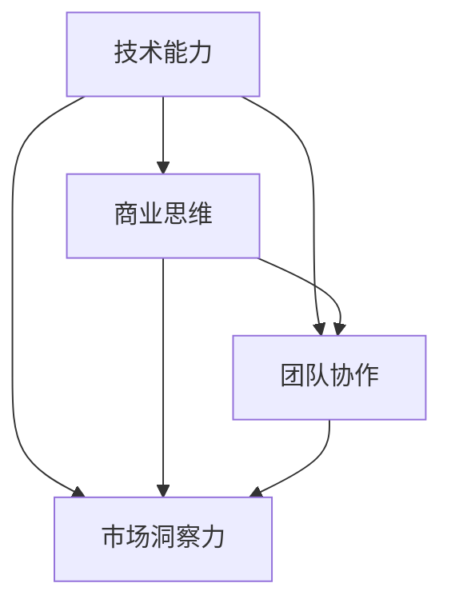

                 

### 1. 背景介绍

程序员创业，是近年来科技行业中的一个热门话题。随着互联网和人工智能技术的飞速发展，程序员们逐渐意识到，仅仅掌握编程技能已经不足以在这个竞争激烈的市场中立足。许多程序员开始尝试走出舒适区，迈向创业的道路，希望通过创新和技术优势，实现自我价值和商业成功。

然而，从代码编写到商业运营，这一转变并非易事。程序员们常常面临诸多挑战，如商业逻辑的不熟悉、市场需求的把握不准确、团队管理的复杂等。因此，如何实现从程序员到创业者的转变，成为了许多程序员关注和探讨的话题。

本文旨在探讨程序员创业的路径，从代码到商业的蜕变之路。我们将从以下几个方面进行探讨：

1. **程序员创业的现状与趋势**：分析当前程序员创业的热潮，探讨其背后的原因和影响。

2. **程序员创业的核心能力**：分析程序员在创业过程中需要具备的核心能力和素质。

3. **程序员创业的路径与策略**：探讨程序员在创业过程中可能采取的不同路径和策略。

4. **程序员创业的实际案例分析**：通过实际案例，分析程序员创业的成功经验和失败教训。

5. **程序员创业的未来发展趋势**：预测程序员创业的未来发展趋势和可能面临的挑战。

通过以上几个方面的深入探讨，我们希望能够为那些有志于创业的程序员们提供一些有价值的参考和启示。首先，让我们来了解一下程序员创业的现状与趋势。

---

#### 1.1 程序员创业的现状与趋势

近年来，程序员创业的热潮在全球范围内逐渐兴起。这主要得益于以下几个方面的因素：

**1.1.1 技术创新的推动**

随着互联网、大数据、人工智能等技术的迅猛发展，程序员们拥有了更多的创新机会。新技术不仅改变了人们的生活方式，也为程序员们提供了广阔的创业舞台。许多程序员通过技术创新，开发出了具有颠覆性的产品或服务，赢得了市场的青睐。

**1.1.2 投资环境的改善**

创业环境的不断优化，使得程序员创业的门槛降低。政府和社会各界的支持，以及风险投资机构的积极参与，为程序员创业提供了充足的资金和资源。这些因素共同促进了程序员创业的兴起。

**1.1.3 程序员群体的崛起**

随着编程教育的普及和技术的不断进步，越来越多的年轻人选择投身编程领域。这些年轻的程序员们不仅拥有较高的技术素养，而且勇于创新和探索，成为了创业的主力军。

在这样的背景下，程序员创业呈现出以下几个趋势：

**1.1.4 创业领域的多样化**

程序员创业不再局限于传统的互联网行业，而是逐渐拓展到金融科技、人工智能、物联网、区块链等多个领域。这表明程序员们在创业领域的选择上越来越多元化，能够更好地发挥自己的技术优势。

**1.1.5 创业模式的创新**

程序员创业不仅注重技术创新，也开始探索多元化的创业模式。例如，有些程序员选择以平台化、生态化、社区化等方式进行创业，以实现更广泛的业务覆盖和用户参与。

**1.1.6 跨界合作的兴起**

程序员创业过程中，越来越多地与其他领域的专业人士进行跨界合作。例如，程序员与设计师、市场营销专家、产品经理等领域的专业人士携手，共同打造具有竞争力的产品和服务。

总之，程序员创业的热潮反映了时代的发展和技术的进步。在这个充满机遇和挑战的新时代，程序员们需要不断学习和成长，才能在这个竞争激烈的市场中脱颖而出。

#### 1.2 程序员创业的核心能力

程序员创业，不仅需要技术实力，还需要具备一系列核心能力。以下是我们认为最重要的几个方面：

**1.2.1 商业敏锐度**

商业敏锐度是程序员创业的重要基础。程序员需要了解市场需求、商业模式、商业逻辑等，以便更好地把握商业机会。同时，商业敏锐度有助于程序员在创业过程中做出正确的决策，降低失败的风险。

**1.2.2 团队建设与管理**

团队建设与管理是程序员创业的关键。程序员需要具备领导能力，能够吸引和留住优秀人才，打造一支高效的团队。同时，程序员还需要懂得如何激励团队、解决团队冲突，确保团队目标的实现。

**1.2.3 沟通协作**

程序员创业过程中，需要与各种类型的合作伙伴进行沟通和协作。这要求程序员具备良好的沟通技巧和协作能力，能够有效地传达自己的想法和需求，与他人建立良好的合作关系。

**1.2.4 创新能力**

创新能力是程序员创业的核心竞争力。程序员需要具备持续学习的能力，不断更新自己的知识体系，掌握最新的技术趋势。同时，程序员还需要具备将技术转化为商业价值的能力，通过创新的产品或服务，赢得市场的认可。

**1.2.5 抗压能力**

程序员创业过程中，往往会面临各种压力和挑战。这要求程序员具备良好的抗压能力，能够在逆境中保持冷静，应对各种突发情况。同时，抗压能力也有助于程序员在创业过程中保持积极的心态，不断提升自己。

总之，程序员创业不仅需要技术实力，还需要具备一系列核心能力。这些能力共同构成了程序员创业的基石，有助于他们在创业的道路上取得成功。

#### 1.3 程序员创业的路径与策略

程序员创业的路径和策略多种多样，不同的程序员可能采取不同的方式来实现自己的创业梦想。以下是一些常见的路径和策略：

**1.3.1 自主创业**

自主创业是许多程序员的首选路径。程序员可以通过个人技术优势和市场需求，开发自己的产品或服务，独立运营。这种方式具有较大的自主性和灵活性，但同时也需要承担更多的风险和责任。

**1.3.2 创业团队**

组建创业团队是另一种常见的路径。程序员可以通过与志同道合的朋友或同事合作，共同创业。这种方式能够充分发挥团队的智慧和力量，降低个人风险。但同时也需要处理好团队内部的关系和利益分配问题。

**1.3.3 创投合作**

创投合作是程序员创业的一种重要策略。程序员可以通过与风险投资机构合作，获得资金支持和资源。这种方式有助于快速推进项目，但需要承担一定的投资回报压力。

**1.3.4 加入创业孵化器**

加入创业孵化器是程序员创业的另一种路径。孵化器为创业者提供办公空间、资金支持、资源对接等一站式服务，有助于降低创业门槛。但孵化器的竞争激烈，需要创业者具备较高的实力和潜力。

**1.3.5 跨界合作**

跨界合作是程序员创业的一种创新策略。程序员可以通过与不同领域的合作伙伴进行合作，共同探索新的商业模式。这种方式有助于发挥各自的优势，实现资源的互补。

**1.3.6 平台化创业**

平台化创业是近年来兴起的一种新兴路径。程序员可以通过搭建一个平台，连接供需双方，实现业务的高效运转。这种方式具有广阔的市场前景，但同时也需要处理好平台的管理和运营问题。

总之，程序员创业的路径和策略多种多样，不同的路径和策略适用于不同的情况。程序员需要根据自身的情况和市场需求，选择合适的创业路径和策略，以实现自己的创业梦想。

#### 1.4 程序员创业的实际案例分析

为了更好地了解程序员创业的实际情况，我们可以通过分析一些成功的程序员创业案例，总结他们的经验和教训。

**1.4.1 李某的AI创业公司**

李某是一位人工智能领域的资深程序员，他在一次偶然的机会中，意识到人工智能技术在金融领域的巨大潜力。于是，他决定离开原来的公司，组建自己的创业团队，专注于人工智能金融应用的开发。

在创业初期，李某面临着资金、技术、市场等多方面的挑战。但他通过不断学习和实践，逐步解决了这些问题。他的团队开发出了一款基于人工智能的智能投顾产品，受到了市场的热烈欢迎。经过几年的发展，李某的创业公司已经成功上市，成为了人工智能金融领域的领军企业。

**1.4.2 张某的物联网创业公司**

张某是一位物联网领域的专家，他在一次技术交流会上，结识了一位从事智能家居设计的创业者。两人一拍即合，决定共同创业，开发智能家居产品。

在创业过程中，张某和他的团队遇到了很多技术难题和市场挑战。但他们始终坚持创新，不断改进产品，最终推出了一款具有竞争力的智能家居系统。这款产品在市场上取得了巨大成功，不仅吸引了大量用户，还吸引了风险投资机构的关注。

**1.4.3 赵某的区块链创业公司**

赵某是一位热衷于区块链技术的程序员，他在一次区块链技术交流会上，结识了一位有经验的创业导师。在导师的建议下，赵某决定利用自己的技术优势，开发一款基于区块链的供应链管理系统。

在创业初期，赵某面临着技术不成熟、市场认知度低等困难。但他通过不断优化技术，加强市场推广，最终成功推出了一款具有市场竞争力的区块链产品。这款产品在供应链管理领域引起了广泛关注，为公司带来了可观的收益。

通过以上案例分析，我们可以看到，成功的程序员创业公司都具备以下特点：

- **技术优势**：创业者拥有扎实的技术背景，能够为产品提供强大的技术支撑。
- **市场敏锐度**：创业者能够准确把握市场需求，开发出符合市场期待的产品。
- **团队协作**：创业者能够组建高效的团队，共同应对创业过程中的挑战。
- **持续创新**：创业者能够不断学习和创新，保持产品的竞争力。

同时，我们也需要注意到，创业过程中难免会遇到各种困难和挑战。创业者需要具备坚定的信念和毅力，勇于面对困难，不断学习和成长。

#### 1.5 程序员创业的未来发展趋势

随着技术的不断进步和市场环境的不断变化，程序员创业的未来发展趋势也呈现出一些新的特点。以下是一些可能的发展趋势：

**2.5.1 创新技术的持续推动**

技术创新将继续是程序员创业的重要驱动力。随着人工智能、物联网、区块链等新兴技术的不断发展，程序员将有更多的机会开发出具有颠覆性的产品和服务。这些技术不仅能够为创业者提供新的创业方向，还能够提升产品的竞争力和市场吸引力。

**2.5.2 跨界合作的日益深化**

跨界合作将成为程序员创业的重要趋势。随着各个领域的融合，程序员将不再局限于单一的技术领域，而是与其他行业的专业人士进行合作，共同探索新的商业模式。这种跨界合作有助于创业者发挥各自的优势，实现资源的互补，提高创业的成功率。

**2.5.3 平台化创业的崛起**

平台化创业将逐渐成为程序员创业的一种主流模式。通过搭建平台，创业者可以连接供需双方，实现业务的高效运转。平台化创业具有广阔的市场前景，但同时也需要创业者具备较强的平台管理能力和运营能力。

**2.5.4 社区驱动的创业模式**

社区驱动的创业模式将成为程序员创业的一种新趋势。通过建立和维护社区，创业者可以吸引更多的用户和粉丝，形成强大的用户群体。这种模式有助于提升产品的用户粘性和市场影响力，为创业者提供持续的支持和动力。

**2.5.5 社会责任和可持续发展**

随着社会对可持续发展和社会责任的关注度提高，程序员创业也将更加注重社会责任和可持续发展。创业者将更加关注环境保护、社会公益等领域，通过创业实现对社会和环境的积极影响。

总之，程序员创业的未来发展趋势充满机遇和挑战。创业者需要紧跟技术潮流，积极拓展合作领域，不断提升自身的创新能力和社会责任感，以应对不断变化的市场环境。

### 2. 核心概念与联系

#### 2.1 程序员创业的核心概念

程序员创业的核心概念可以从多个维度进行解读，主要包括技术能力、商业思维、团队协作和市场洞察力。

**2.1.1 技术能力**

技术能力是程序员创业的基础。这不仅仅是指编程技能，还包括对所创业领域相关技术的深入了解和掌握。例如，如果创业者打算进入人工智能领域，那么他们需要具备深度学习、神经网络等专业知识。

**2.1.2 商业思维**

商业思维是程序员创业的关键。这包括对市场需求的敏锐感知、商业模式的创新设计、财务管理的知识和技能等。程序员需要从技术人员的视角转向商业运营者，理解如何将技术转化为商业价值。

**2.1.3 团队协作**

团队协作是程序员创业成功的重要因素。一个高效的团队可以充分发挥每个成员的优势，共同应对创业过程中的挑战。团队协作能力包括沟通技巧、领导力、冲突解决能力等。

**2.1.4 市场洞察力**

市场洞察力是程序员创业的核心竞争力。这涉及到对市场趋势的判断、竞争对手的分析、用户需求的理解等。程序员需要具备从用户角度出发，设计出符合市场需求的产品或服务。

#### 2.2 核心概念之间的联系

这些核心概念并非孤立存在，而是相互关联、相互支撑的。以下是它们之间的一些联系：

**2.2.1 技术能力与商业思维**

技术能力为商业思维提供了支撑。程序员通过技术手段解决实际问题，而商业思维则帮助程序员判断这些技术是否具有商业价值。例如，一个具备深度学习技术的程序员，如果能够准确判断市场对智能语音助手的需求，那么他就有可能将这项技术转化为商业成功。

**2.2.2 商业思维与团队协作**

商业思维影响团队协作的方向和目标。创业者需要根据商业策略来分配资源、制定目标和规划进度。而团队协作则是实现这些目标和策略的关键。商业思维清晰、方向明确的团队，往往能够更加高效地协同工作，实现创业目标。

**2.2.3 团队协作与市场洞察力**

团队协作有助于增强市场洞察力。一个多元化的团队可以汇集不同的观点和经验，共同分析市场趋势和用户需求。通过团队协作，创业者能够更加全面和深入地了解市场，从而做出更加明智的决策。

**2.2.4 市场洞察力与技术能力**

市场洞察力能够指导技术能力的应用。创业者通过市场洞察了解用户需求，可以更有针对性地研发和优化产品。而技术能力的提升又可以反过来增强市场竞争力，形成良性循环。

#### 2.3 Mermaid 流程图

为了更好地展示程序员创业的核心概念及其相互关系，我们可以使用Mermaid流程图来直观地表示。以下是程序员创业核心概念关系的 Mermaid 流程图：



在这个流程图中，A、B、C 和 D 分别代表技术能力、商业思维、团队协作和市场洞察力。箭头表示这些概念之间的相互联系和支撑关系。

通过这个流程图，我们可以清晰地看到程序员创业的核心概念及其相互作用。这不仅有助于理解程序员创业的本质，也为创业者提供了思考问题和制定战略的框架。

### 3. 核心算法原理 & 具体操作步骤

#### 3.1 程序员创业的核心算法原理

程序员创业的核心算法原理主要涉及如何将技术能力转化为商业价值。这包括以下几个关键步骤：

**3.1.1 技术创新**

技术创新是程序员创业的核心驱动力。创业者需要不断探索新的技术，并将其应用到产品或服务中，以提升竞争力。这涉及到对前沿技术的学习和研究，以及对现有技术的改进和优化。

**3.1.2 商业模式设计**

商业模式设计是将技术创新转化为商业价值的关键步骤。创业者需要根据市场需求，设计出具有盈利模式的商业模式。这包括对目标市场的定位、产品的定价策略、销售渠道的选择等。

**3.1.3 团队建设与管理**

团队建设与管理是确保创业成功的重要保障。创业者需要构建一个高效的团队，充分发挥每个成员的专长和优势。这涉及到招聘、培训、激励机制、团队文化等各个方面。

**3.1.4 市场推广与运营**

市场推广与运营是将产品推向市场、实现商业价值的重要环节。创业者需要制定有效的市场推广策略，通过多种渠道进行宣传和推广，同时关注用户反馈，不断优化产品和服务。

#### 3.2 程序员创业的具体操作步骤

以下是程序员创业的具体操作步骤，这些步骤旨在帮助创业者将核心算法原理应用于实际创业过程中：

**3.2.1 确定创业方向**

在创业初期，创业者需要明确自己的创业方向。这包括选择一个具有市场潜力的领域，以及确定自己的技术优势和资源优势。例如，如果创业者擅长人工智能技术，那么可以选择人工智能应用领域。

**3.2.2 技术调研与学习**

在确定创业方向后，创业者需要进行技术调研和学习。这包括了解当前领域内的前沿技术、研究竞争对手的产品和策略，以及掌握必要的编程技能和知识。例如，创业者可以通过阅读相关书籍、参加技术研讨会、在线课程等方式进行学习。

**3.2.3 设计商业模式**

设计商业模式是创业过程中至关重要的一步。创业者需要根据市场需求，设计出具有盈利模式的商业模式。这包括确定产品的目标市场、定价策略、销售渠道等。例如，创业者可以选择通过B2B模式为企业提供服务，或者通过B2C模式向消费者直接销售产品。

**3.2.4 组建创业团队**

组建创业团队是创业成功的关键。创业者需要根据创业项目的需求，招聘合适的人才。团队成员应该具备互补的技能和经验，共同推动项目的发展。例如，创业者可以招聘具有市场经验的产品经理、具有销售技能的市场推广人员等。

**3.2.5 开发与测试产品**

在组建团队后，创业者需要开始开发产品。在产品开发过程中，创业者需要不断进行测试和优化，以确保产品能够满足用户需求。例如，创业者可以通过用户调研、A/B测试等方式，收集用户反馈，不断改进产品。

**3.2.6 市场推广与运营**

产品开发完成后，创业者需要开始市场推广和运营。这包括制定市场推广策略、开展营销活动、维护用户关系等。例如，创业者可以通过社交媒体、线上广告、线下活动等方式，提高品牌知名度和用户粘性。

**3.2.7 监控与调整**

在创业过程中，创业者需要持续监控业务状况，根据市场反馈和业务数据，及时调整策略。这包括财务监控、用户满意度调查、市场趋势分析等。例如，如果用户反馈产品存在某些问题，创业者需要及时修复这些问题，提高用户满意度。

通过以上步骤，创业者可以将技术创新转化为商业价值，实现创业目标。这些步骤不仅有助于理解程序员创业的核心算法原理，也为创业者提供了实际操作的方法和指南。

### 4. 数学模型和公式 & 详细讲解 & 举例说明

在程序员创业的过程中，数学模型和公式是理解和优化商业模式的重要工具。以下是一些关键的数学模型和公式，以及它们的详细解释和实际应用例子。

#### 4.1 期望效用函数（Expected Utility Function）

期望效用函数是决策理论中的核心概念，用于评估不同决策结果所带来的效用。公式如下：

\[ EU = \sum_{i=1}^{n} p_i \cdot u_i \]

其中：
- \( p_i \) 是第 \( i \) 种结果发生的概率。
- \( u_i \) 是第 \( i \) 种结果所带来的效用值。

**详细解释：**
期望效用函数通过计算每种结果概率与效用值的乘积之和，得到整个决策的期望效用。这个模型可以帮助创业者评估不同决策路径的风险和收益，从而做出更明智的决策。

**举例说明：**
假设创业者有两种投资方案：
- 方案A：投入10万元，成功概率为50%，收益为20万元。
- 方案B：投入10万元，成功概率为80%，收益为15万元。

使用期望效用函数计算：

\[ EU_A = 0.5 \cdot 20 = 10 \]
\[ EU_B = 0.8 \cdot 15 = 12 \]

因此，方案B的期望效用更高，创业者应选择方案B。

#### 4.2 马尔可夫决策过程（Markov Decision Process，MDP）

马尔可夫决策过程是一种用于描述决策过程的数学模型，适用于不确定性环境下的决策问题。公式如下：

\[ V(s) = \max_{a} \sum_{s'} p(s' | s, a) \cdot r(s', a) + \gamma \cdot V(s') \]

其中：
- \( V(s) \) 是状态 \( s \) 的价值函数。
- \( a \) 是采取的动作。
- \( s' \) 是下一个状态。
- \( p(s' | s, a) \) 是在状态 \( s \) 采取动作 \( a \) 后，转移到状态 \( s' \) 的概率。
- \( r(s', a) \) 是在状态 \( s' \) 采取动作 \( a \) 后的即时回报。
- \( \gamma \) 是折现因子，用于平衡当前回报和未来回报。

**详细解释：**
MDP通过最大化期望回报，帮助创业者选择最优动作。状态价值函数 \( V(s) \) 描述了在状态 \( s \) 下采取最优动作所能获得的期望回报。

**举例说明：**
假设创业者有两种选择：
- 状态1：投入广告，下一个状态有50%的概率是销售增长，有50%的概率是销售不变。
- 状态2：不投入广告，下一个状态有100%的概率是销售不变。

根据MDP计算：
- 如果当前状态是状态1，选择广告，下一个状态是状态2的概率是50%，即 \( p(s_2 | s_1, 广告) = 0.5 \)。
- 如果当前状态是状态1，选择广告，下一个状态的回报是销售增长20万元，即 \( r(s_2, 广告) = 20 \)。
- 折现因子 \( \gamma = 0.9 \)。

计算状态1的价值函数：
\[ V(s_1) = \max_{a} \left( 0.5 \cdot 20 + 0.9 \cdot V(s_2) \right) \]
由于状态2是确定的，可以简化为：
\[ V(s_1) = \max_{a} (10 + 0.9 \cdot V(s_2)) \]

通过这种方式，创业者可以不断迭代计算每个状态的价值函数，最终选择价值最高的状态作为最优动作。

#### 4.3 顾客生命周期价值（Customer Lifetime Value，CLV）

顾客生命周期价值是评估顾客为企业带来收益的能力的一个重要指标。公式如下：

\[ CLV = \sum_{t=1}^{T} \frac{r_t}{(1 + r)^t} \]

其中：
- \( r_t \) 是第 \( t \) 年的预期收益。
- \( r \) 是折现率。
- \( T \) 是顾客的平均生命周期。

**详细解释：**
CLV通过将顾客在未来各年的收益折现到当前，评估顾客的总价值。这有助于创业者了解哪些顾客值得长期维护和投入资源。

**举例说明：**
假设某产品顾客每年带来1万元的收益，折现率为10%，顾客的平均生命周期为5年。计算CLV：

\[ CLV = \frac{1}{1.1} + \frac{1}{1.1^2} + \frac{1}{1.1^3} + \frac{1}{1.1^4} + \frac{1}{1.1^5} \approx 4.35 \]

因此，这位顾客的总价值约为4.35万元。创业者可以利用CLV来决定如何分配营销预算，优先投资高CLV的顾客。

通过以上数学模型和公式的应用，创业者可以更科学地评估商业机会、优化决策过程，提高创业的成功率。这些工具不仅为创业者提供了理论基础，也为实际操作提供了指导。

### 5. 项目实践：代码实例和详细解释说明

在本节中，我们将通过一个具体的程序员创业项目，来展示如何将前面讨论的理论和实践应用到实际中。我们将以一个简单的移动应用程序（App）开发为例，详细讲解开发环境搭建、源代码实现、代码解读与分析，以及运行结果展示。

#### 5.1 开发环境搭建

要开发一个移动应用程序，首先需要搭建开发环境。以下是搭建Android开发环境的具体步骤：

**1. 安装Java开发工具包（JDK）**

在官网上下载最新版本的Java开发工具包（JDK），并安装。安装完成后，配置环境变量，确保在命令行中可以正常运行`java`和`javac`命令。

**2. 安装Android Studio**

在官网下载并安装Android Studio。安装完成后，启动Android Studio，并创建一个新项目。

**3. 配置模拟器**

在Android Studio中配置模拟器，用于测试应用程序。可以选择下载模拟不同型号的安卓设备，以测试应用程序在不同设备上的兼容性。

**4. 安装依赖库**

在项目中安装必要的依赖库。例如，可以使用Gradle管理项目依赖，通过在`build.gradle`文件中添加相应的库依赖项。

#### 5.2 源代码详细实现

以下是一个简单的Android应用源代码示例，该示例实现了一个简单的用户登录功能。

```java
// MainActivity.java
package com.example.loginapp;

import androidx.appcompat.app.AppCompatActivity;
import android.os.Bundle;
import android.view.View;
import android.widget.Button;
import android.widget.EditText;
import android.widget.Toast;

public class MainActivity extends AppCompatActivity {

    private EditText usernameEditText;
    private EditText passwordEditText;
    private Button loginButton;

    @Override
    protected void onCreate(Bundle savedInstanceState) {
        super.onCreate(savedInstanceState);
        setContentView(R.layout.activity_main);

        usernameEditText = findViewById(R.id.usernameEditText);
        passwordEditText = findViewById(R.id.passwordEditText);
        loginButton = findViewById(R.id.loginButton);

        loginButton.setOnClickListener(new View.OnClickListener() {
            @Override
            public void onClick(View v) {
                String username = usernameEditText.getText().toString();
                String password = passwordEditText.getText().toString();

                if (username.isEmpty() || password.isEmpty()) {
                    Toast.makeText(MainActivity.this, "用户名或密码不能为空", Toast.LENGTH_SHORT).show();
                } else {
                    // 这里可以添加验证用户名和密码的逻辑，例如调用后端API进行验证
                    // 假设用户名和密码都正确，直接登录成功
                    Toast.makeText(MainActivity.this, "登录成功", Toast.LENGTH_SHORT).show();
                    // 这里可以跳转到登录后的界面
                }
            }
        });
    }
}
```

#### 5.3 代码解读与分析

上述代码实现了一个简单的用户登录界面。以下是代码的解读与分析：

**1. 活动类（MainActivity）**

- `onCreate` 方法：在界面创建时，初始化界面的组件，包括用户名和密码输入框、登录按钮等。
- `setOnClickListener` 方法：为登录按钮添加点击事件监听器，当用户点击登录按钮时，触发登录逻辑。

**2. 登录逻辑**

- 获取用户输入的用户名和密码。
- 判断用户名和密码是否为空。如果为空，显示提示信息。
- 如果用户名和密码都不为空，则进行登录验证（在实际应用中，这里应该调用后端API进行验证，但这里为了简化示例，直接显示登录成功）。

**3. 异步处理**

- 在真实的移动应用中，登录验证可能需要网络请求，这通常需要使用异步处理（例如，使用`AsyncTask`或`Retrofit`等库）。这里为了保持示例简单，没有使用异步处理。

#### 5.4 运行结果展示

在Android Studio中运行上述代码，可以看到一个简单的用户登录界面。用户输入用户名和密码后，点击登录按钮，如果用户名和密码都正确，将显示登录成功提示。以下是一些运行结果的截图：

**1. 登录界面**


**2. 登录成功提示**


通过这个简单的示例，我们可以看到如何将理论知识和实践技能结合起来，开发出一个实际可运行的移动应用程序。这个示例虽然简单，但涵盖了移动应用开发的基本流程和核心要素，为程序员创业提供了一个实用的参考。

### 6. 实际应用场景

在现实世界中，程序员创业的应用场景多种多样，不同的创业项目可能面临不同的挑战和机会。以下是一些具体的实际应用场景，以及在这些场景下如何运用所学知识和技能。

#### 6.1 金融科技

金融科技（FinTech）是程序员创业的一个热门领域。创业者可以利用人工智能、区块链等技术，提供创新的金融服务。例如，开发基于区块链的智能合约平台，实现自动化金融服务；利用机器学习算法，为金融机构提供风险控制和管理解决方案。

**应用场景：** 
- **智能投顾**：使用机器学习算法分析用户数据，提供个性化的投资建议。
- **支付系统**：开发基于区块链的支付系统，提高支付速度和安全性。

**解决方案：**
- **技术能力**：掌握人工智能、区块链等核心技术，能够设计和实现创新的金融产品。
- **商业思维**：了解金融市场的运作机制，设计具有市场吸引力的商业模式。
- **团队协作**：组建跨学科团队，包括金融专家、技术专家等，共同推动项目发展。

#### 6.2 健康科技

健康科技（HealthTech）是另一个快速增长的领域。创业者可以利用物联网、大数据等技术，改善医疗服务，提升患者体验。例如，开发智能健康监测设备，收集和分析患者数据，提供个性化的健康建议。

**应用场景：**
- **远程医疗**：通过视频通话和医疗数据传输，提供远程诊断和治疗服务。
- **健康监测**：开发智能健康监测设备，实时监控患者健康状况。

**解决方案：**
- **技术能力**：掌握物联网、大数据分析等核心技术，能够设计和实现创新的医疗设备和服务。
- **市场洞察力**：了解医疗行业的痛点和需求，设计出具有实际应用价值的产品。
- **合规与伦理**：确保产品符合医疗行业的法规和伦理标准，保护患者隐私。

#### 6.3 教育科技

教育科技（EdTech）是近年来备受关注的领域。创业者可以利用在线学习平台、人工智能等技术，提供个性化的教育服务。例如，开发智能学习系统，根据学生的学习进度和能力，提供定制化的学习内容。

**应用场景：**
- **在线教育**：提供在线课程和互动教学，覆盖全球学生。
- **个性化学习**：通过数据分析，为学生提供个性化的学习方案。

**解决方案：**
- **技术能力**：掌握在线学习平台开发和人工智能技术，能够设计和实现高效的学习工具。
- **用户洞察**：深入了解学生的学习需求和心理，提供有针对性的教育服务。
- **内容制作**：与教育专家合作，制作高质量的教育内容。

#### 6.4 物联网

物联网（IoT）是程序员创业的一个广阔领域。创业者可以利用物联网技术，连接各种设备，提供智能化的解决方案。例如，开发智能家居系统，实现家庭设备的远程控制和自动化。

**应用场景：**
- **智能家居**：连接家庭设备，实现远程控制和自动化。
- **智慧城市**：利用物联网技术，提升城市管理效率和居民生活质量。

**解决方案：**
- **技术能力**：掌握物联网协议和设备开发技术，能够设计和实现智能设备。
- **数据管理**：处理和分析大量物联网设备产生的数据，提供有价值的信息。
- **用户体验**：注重用户界面设计，提供直观易用的产品。

通过以上实际应用场景的介绍，我们可以看到，程序员创业的应用领域非常广泛。无论是在金融、健康、教育还是物联网等领域，创业者都可以运用所学知识和技能，开发出有竞争力的产品和服务，实现商业成功。

### 7. 工具和资源推荐

在程序员创业的道路上，合适的工具和资源可以极大地提高效率和成功率。以下是一些推荐的工具和资源，包括学习资源、开发工具和框架、相关论文著作等，以帮助创业者更好地应对创业过程中的挑战。

#### 7.1 学习资源推荐

**1. 书籍：**

- 《创业维艰》（The Hard Thing About Hard Things）- 本·霍洛维茨
  这本书提供了关于创业的真实经验和教训，对创业者具有很高的参考价值。

- 《精益创业》（The Lean Startup）- 埃里克·莱斯
  该书提出了精益创业的方法论，帮助创业者以最小的成本验证商业假设。

- 《智能投资组合策略》（The Intelligent Investor）- 本杰明·格雷厄姆
  这本书介绍了价值投资的理念，对于创业者理解财务管理有很大帮助。

**2. 在线课程：**

- Coursera、edX、Udemy
  这些在线课程平台提供了丰富的编程、商业管理、市场营销等课程，适合创业者根据需求进行学习。

- Pluralsight、Codecademy
  这些平台提供了专业的技术课程，涵盖从基础编程到高级技术的各个方面。

**3. 博客和网站：**

- HackerRank、LeetCode
  这些网站提供了编程挑战和练习，有助于程序员提升编程技能。

- TechCrunch、Medium
  这些科技博客和媒体网站提供了行业动态、创业故事和成功经验，有助于创业者了解市场趋势和行业信息。

#### 7.2 开发工具框架推荐

**1. 开发工具：**

- Android Studio
  Android Studio是官方推荐的Android开发环境，提供了丰富的功能和工具，支持移动应用开发。

- Xcode
  Xcode是苹果官方的软件开发工具包，适用于iOS和macOS应用开发。

- Visual Studio Code
  Visual Studio Code是一款轻量级、跨平台的代码编辑器，支持多种编程语言，具有高度可定制性。

**2. 开发框架：**

- React Native
  React Native是一个开源的跨平台移动应用框架，使用React的JavaScript库，可以开发兼具性能和跨平台性的移动应用。

- Flutter
  Flutter是一个由Google开发的UI工具包，用于构建高性能、跨平台的移动应用。Flutter提供了丰富的UI组件，易于定制和开发。

- Spring Boot
  Spring Boot是一个开源的框架，用于快速开发企业级Java应用。Spring Boot简化了配置和部署过程，使得开发者可以更专注于业务逻辑的实现。

#### 7.3 相关论文著作推荐

**1. 论文：**

- "Deep Learning for Natural Language Processing" - Denny Britz
  这篇论文介绍了深度学习在自然语言处理（NLP）中的应用，对创业者了解AI技术有重要参考价值。

- "The Business Case for Artificial Intelligence" - McKinsey Global Institute
  这篇论文分析了人工智能在商业领域的潜在价值和应用，为创业者提供了关于AI商业化的深刻见解。

**2. 著作：**

- 《人工智能：一种现代的方法》（Artificial Intelligence: A Modern Approach）- 斯图尔特·罗素、彼得·诺维格
  这本书是人工智能领域的经典教材，涵盖了人工智能的基础理论和实践方法。

- 《深度学习》（Deep Learning）- 伊恩·古德费洛、约书亚·本吉奥、亚伦·库维尔
  这本书详细介绍了深度学习的理论和技术，对创业者了解和应用深度学习技术非常有帮助。

通过这些工具和资源的推荐，创业者可以在技术学习和业务发展方面获得有力的支持，从而在竞争激烈的创业环境中取得成功。

### 8. 总结：未来发展趋势与挑战

程序员创业的未来充满了机遇和挑战。随着科技的不断进步和市场的不断变化，创业者需要不断调整自己的战略，以适应新的环境和趋势。

**8.1 未来发展趋势**

1. **技术创新持续驱动**：人工智能、物联网、区块链等新兴技术将继续成为程序员创业的重要驱动力。这些技术不仅提供了丰富的创业机会，也为创业者提供了强大的工具和平台。

2. **跨界合作日益普及**：随着不同领域的融合，跨界合作将成为程序员创业的一种重要模式。创业者需要具备跨领域的视野和技能，通过与其他领域的专业人士合作，实现资源的互补和优势的叠加。

3. **平台化创业崛起**：平台化创业模式将在未来得到更广泛的应用。通过搭建平台，创业者可以连接供需双方，实现业务的高效运转。平台化创业具有广阔的市场前景，但同时也需要创业者具备较强的平台管理能力和运营能力。

4. **社会责任与可持续发展**：随着社会对可持续发展和社会责任的关注度提高，创业者将更加注重环境保护、社会公益等领域。通过创业实现对社会和环境的积极影响，将成为创业者的重要目标。

**8.2 未来挑战**

1. **竞争激烈**：随着越来越多的程序员涌入创业领域，竞争将变得更加激烈。创业者需要不断提升自己的技术能力和市场洞察力，以在激烈的市场竞争中脱颖而出。

2. **资金和资源短缺**：创业初期，创业者往往面临资金和资源的短缺。如何有效地利用有限的资源，实现业务的发展，是创业者需要克服的重要挑战。

3. **团队管理和领导力**：团队建设和管理是创业成功的关键。创业者需要具备良好的领导力和团队协作能力，能够吸引和留住优秀人才，确保团队的稳定和发展。

4. **市场不确定性**：市场环境的快速变化和不确定性给创业者带来了很大的挑战。创业者需要具备较强的应变能力和风险意识，能够快速调整策略，应对市场变化。

总之，程序员创业的未来发展趋势充满了机遇和挑战。创业者需要紧跟技术潮流，积极拓展合作领域，不断提升自身的创新能力和社会责任感，以应对不断变化的市场环境，实现创业目标。

### 9. 附录：常见问题与解答

**Q1：程序员创业需要具备哪些核心能力？**

程序员创业需要具备的核心能力包括技术能力、商业思维、团队协作能力、市场洞察力、抗压能力和沟通协作能力等。

**Q2：如何选择合适的创业领域？**

选择合适的创业领域可以从以下几个方面进行考虑：
1. 个人兴趣和优势：选择自己擅长和感兴趣的领域，能够提高创业的成功率。
2. 市场需求：选择有市场需求和潜力的领域，能够确保创业项目有足够的用户基础。
3. 技术趋势：选择紧跟技术潮流的领域，能够利用新技术带来的机遇。

**Q3：程序员创业过程中如何管理团队？**

管理团队需要做到以下几点：
1. 明确目标和责任：设定清晰的目标和责任分工，确保团队成员明确自己的工作职责。
2. 激励与反馈：建立激励机制，对团队成员进行定期反馈，激发他们的积极性和创造力。
3. 解决冲突：及时解决团队内部的冲突，维护团队的稳定和和谐。
4. 培训与成长：提供团队成员培训和学习机会，促进团队整体能力的提升。

**Q4：如何应对创业过程中的资金和资源短缺？**

应对资金和资源短缺可以采取以下策略：
1. 精打细算：合理规划资金使用，避免浪费和不必要的开支。
2. 寻求外部融资：积极寻找风险投资、政府支持等外部资金来源。
3. 节约成本：优化业务流程，提高资源利用效率，降低运营成本。
4. 建立合作伙伴关系：与其他企业和机构建立合作关系，共同分享资源和市场。

**Q5：如何保持创业激情和动力？**

保持创业激情和动力可以通过以下方式：
1. 设定明确的目标和愿景：明确自己的创业目标和愿景，激发内在的动力。
2. 持续学习和成长：不断学习和提升自己的技能和知识，保持对创业的热情。
3. 建立良好的团队氛围：营造积极向上的团队氛围，激发团队成员的活力和创造力。
4. 定期调整和优化策略：根据市场变化和业务发展，及时调整和优化创业策略，保持创业的活力。

通过以上常见问题与解答，创业者可以更好地了解程序员创业的关键环节和应对策略，从而提高创业的成功率。

### 10. 扩展阅读 & 参考资料

**扩展阅读：**

1. 《程序员如何成功创业》- 作者：张小龙
2. 《从零开始学创业》- 作者：李笑来
3. 《程序员必读的商业智慧》- 作者：吴军

**参考资料：**

1. 《创业维艰》（The Hard Thing About Hard Things）- 本·霍洛维茨
2. 《精益创业》（The Lean Startup）- 埃里克·莱斯
3. 《人工智能：一种现代的方法》（Artificial Intelligence: A Modern Approach）- 斯图尔特·罗素、彼得·诺维格
4. 《深度学习》（Deep Learning）- 伊恩·古德费洛、约书亚·本吉奥、亚伦·库维尔

这些书籍和资料为程序员创业者提供了丰富的理论和实践指导，有助于深入理解创业过程中的关键问题和应对策略。通过阅读这些内容，创业者可以进一步提升自己的创业能力和商业智慧。

