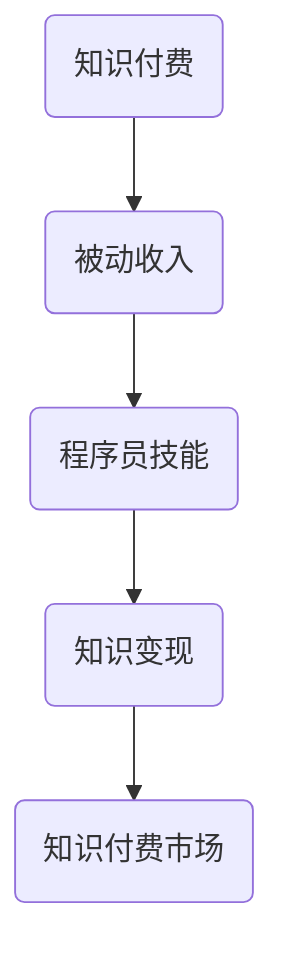

                 

### 背景介绍

随着互联网技术的飞速发展，知识付费市场逐渐壮大。程序员作为技术领域的专业人士，如何在这一市场中找到自己的定位，利用自己的专业知识实现被动收入，成为了许多程序员关注的话题。本文将探讨程序员利用知识付费实现被动收入的秘诀，从核心概念、算法原理、数学模型、项目实践、实际应用场景等多个角度，深入分析这一话题。

知识付费，即用户为获取特定知识或技能而支付的费用。近年来，随着在线教育、知识分享平台的兴起，知识付费逐渐成为了一个庞大的市场。在这个市场中，程序员凭借其深厚的专业知识和丰富的实践经验，具有独特的优势。

首先，程序员拥有丰富的技术知识。无论是前端开发、后端开发、数据库管理，还是人工智能、大数据等领域，程序员都具备扎实的理论基础和实践经验。这些知识不仅可以为其他从业者提供帮助，也可以成为他们实现被动收入的利器。

其次，程序员具备较强的自学能力和解决问题的能力。在技术领域，知识更新速度非常快，程序员需要不断学习新知识、新技术，以保持自己的竞争力。这种自学能力和解决问题的能力，使得程序员能够更好地理解用户的需求，提供有针对性的知识服务。

最后，程序员拥有良好的沟通能力和表达能力。程序员在开发过程中，需要与客户、同事进行有效的沟通，表达自己的观点和想法。这种良好的沟通能力和表达能力，使得程序员能够更好地将复杂的技术知识讲解清楚，让用户易于理解和接受。

总的来说，程序员利用知识付费实现被动收入，具有明显的优势。接下来，我们将从核心概念、算法原理、数学模型、项目实践、实际应用场景等多个角度，深入探讨这一话题。通过分析这些方面，我们将为程序员提供一套实用的策略，帮助他们更好地利用知识付费市场，实现被动收入。### 核心概念与联系

为了更好地理解程序员如何利用知识付费实现被动收入，我们需要首先明确一些核心概念和它们之间的联系。

#### 核心概念

1. **知识付费**：知识付费是指用户为获取特定知识或技能而支付的费用。在知识付费市场中，知识可以包括各种领域，如编程、设计、运营、营销等。

2. **被动收入**：被动收入是指在不直接参与工作的条件下，通过资产、投资、知识等获取的持续收入。被动收入的特点是无需日常的持续投入，但能带来持续的经济回报。

3. **程序员技能**：程序员的技能包括编程语言、框架、数据库、算法、数据结构等。这些技能是程序员实现知识付费的基础。

4. **知识变现**：知识变现是指将知识转化为可销售的产品或服务，通过在线平台、个人网站、社交媒体等渠道进行销售。

#### 核心概念之间的联系

1. **知识付费与被动收入的关系**：知识付费是实现被动收入的一种方式。通过将自己的专业知识制作成教程、课程、电子书等形式，程序员可以在不直接参与教学的情况下，通过销售这些知识产品获得收入。

2. **程序员技能与知识变现的关系**：程序员的专业技能是知识变现的基础。只有具备一定的技能和经验，程序员才能制作出有价值的教学内容，吸引潜在的客户。

3. **知识变现与知识付费市场的联系**：知识付费市场为程序员提供了一个广阔的舞台。在这个市场中，程序员可以通过多种形式的知识变现，如在线课程、直播教学、技术博客等，获得被动收入。

#### Mermaid 流程图

以下是一个简化的 Mermaid 流程图，展示了核心概念之间的联系：



**流程节点解释：**

- **知识付费**：用户为获取特定知识或技能支付费用。
- **被动收入**：通过知识付费获得的持续收入。
- **程序员技能**：程序员具备的专业知识。
- **知识变现**：将程序员技能转化为可销售的产品或服务。
- **知识付费市场**：提供知识变现的平台和渠道。

通过这个流程图，我们可以更直观地理解程序员如何通过知识付费实现被动收入。接下来，我们将进一步探讨程序员如何利用这些核心概念，具体实现知识变现和被动收入的策略。### 核心算法原理 & 具体操作步骤

要利用知识付费实现被动收入，程序员需要掌握一些核心算法原理和具体的操作步骤。以下是一些关键算法和操作步骤的概述，以及它们在知识付费中的应用。

#### 1. 在线课程制作

**算法原理：**
在线课程制作的核心在于如何将复杂的技术知识转化为易于理解的教学内容。这涉及到教育心理学、课程设计、视频编辑等领域的知识。

**具体操作步骤：**
1. **需求分析**：确定目标受众，分析他们的学习需求，制定课程大纲。
2. **内容创作**：编写教案、PPT，录制视频教程，编写代码实例和测试数据。
3. **课程结构设计**：设计课程结构，包括章节、小节、知识点等。
4. **视频剪辑与制作**：使用视频编辑软件对录制的内容进行剪辑、添加字幕、音效等。
5. **课程发布**：将课程上传到在线教育平台，如Udemy、Coursera等。

**应用示例：**
一个程序员可以制作一个关于机器学习的在线课程，包括理论讲解、代码实现、实战案例等。通过这个课程，他可以获得学生的订阅费用，实现被动收入。

#### 2. 电子书编写

**算法原理：**
电子书编写涉及内容创作、格式设计、排版等，需要掌握文字编辑、排版工具的使用技巧。

**具体操作步骤：**
1. **选题定位**：确定电子书的主题和受众。
2. **内容创作**：撰写电子书的内容，包括文字、图片、图表等。
3. **格式设计**：使用电子书编辑工具（如Adobe InDesign、Calibre等）进行排版和格式化。
4. **校对与修改**：进行多轮校对，确保内容准确无误。
5. **发布与推广**：将电子书上传到电子书平台，如亚马逊Kindle、苹果iBooks等，进行推广。

**应用示例：**
一个程序员可以编写一本关于前端开发的电子书，详细讲解HTML、CSS、JavaScript等技术。通过销售电子书，他可以获得版税收入。

#### 3. 技术博客撰写

**算法原理：**
技术博客撰写需要掌握编程语言、数据库、算法等基础知识，以及良好的写作技巧。

**具体操作步骤：**
1. **选题**：选择具有针对性的技术话题。
2. **内容创作**：撰写技术文章，包括问题描述、解决方案、代码示例等。
3. **代码验证**：确保文章中提供的代码示例能够正常运行。
4. **排版与发布**：使用Markdown、LaTeX等工具进行排版，将文章发布到个人博客或技术社区。

**应用示例：**
一个程序员可以撰写一篇关于深度学习的博客文章，介绍卷积神经网络（CNN）的工作原理和实现方法。通过增加付费内容或广告，他可以获得额外的收入。

#### 4. 智能问答平台

**算法原理：**
智能问答平台需要运用自然语言处理（NLP）和机器学习算法，实现用户提问和系统回答的匹配。

**具体操作步骤：**
1. **数据收集**：收集大量的技术问答数据，用于训练模型。
2. **模型训练**：使用NLP和机器学习算法，训练问答模型。
3. **接口设计**：设计用户界面，实现用户提问和系统回答的交互。
4. **部署与维护**：将问答平台部署到服务器，定期更新模型和数据。

**应用示例：**
一个程序员可以创建一个智能问答平台，帮助开发者解决编程问题。通过会员订阅或问题回答收费，他可以获得持续的收入。

通过以上核心算法原理和具体操作步骤，程序员可以有效地将知识付费转化为被动收入。接下来，我们将进一步探讨如何利用数学模型和公式来分析和优化这一过程。### 数学模型和公式 & 详细讲解 & 举例说明

在程序员利用知识付费实现被动收入的过程中，数学模型和公式可以帮助我们更好地理解和优化这一过程。以下是一些常用的数学模型和公式，以及它们的详细讲解和举例说明。

#### 1. 折现率（Discount Rate）

**定义：** 折现率是用于将未来的现金流折现为现值的一个系数。在被动收入分析中，折现率反映了投资者对时间价值的看法。

**公式：** \( PV = CF / (1 + r)^n \)

其中，\( PV \) 是现值，\( CF \) 是未来现金流，\( r \) 是折现率，\( n \) 是时间期数。

**举例：** 假设一个程序员计划在未来五年内每年获得1万元的被动收入，折现率为5%。则这五年的总现值为：

\[ PV = 1\text{万} / (1 + 0.05)^1 + 1\text{万} / (1 + 0.05)^2 + 1\text{万} / (1 + 0.05)^3 + 1\text{万} / (1 + 0.05)^4 + 1\text{万} / (1 + 0.05)^5 \]

\[ PV = 1\text{万} / 1.05 + 1\text{万} / 1.1025 + 1\text{万} / 1.1576 + 1\text{万} / 1.2155 + 1\text{万} / 1.2763 \]

\[ PV \approx 0.9524\text{万} + 0.9070\text{万} + 0.8640\text{万} + 0.8236\text{万} + 0.7835\text{万} \]

\[ PV \approx 4.1795\text{万} \]

#### 2. 净现值（Net Present Value, NPV）

**定义：** 净现值是项目的未来现金流按照特定折现率折现后的总和与初始投资的差额。

**公式：** \( NPV = \sum_{t=1}^{n} \frac{CF_t}{(1 + r)^t} - C_0 \)

其中，\( CF_t \) 是第 \( t \) 年的现金流，\( C_0 \) 是初始投资，\( r \) 是折现率。

**举例：** 假设一个程序员计划制作一个在线课程，预计未来五年每年可以获得1万元的收入，初始成本为3万元。折现率为5%。则这个课程的净现值为：

\[ NPV = 1\text{万} / (1 + 0.05)^1 + 1\text{万} / (1 + 0.05)^2 + 1\text{万} / (1 + 0.05)^3 + 1\text{万} / (1 + 0.05)^4 + 1\text{万} / (1 + 0.05)^5 - 3\text{万} \]

\[ NPV = 0.9524\text{万} + 0.9070\text{万} + 0.8640\text{万} + 0.8236\text{万} + 0.7835\text{万} - 3\text{万} \]

\[ NPV \approx 4.1795\text{万} - 3\text{万} \]

\[ NPV \approx 1.1795\text{万} \]

由于 \( NPV > 0 \)，这个在线课程的投资是有利可图的。

#### 3. 内部收益率（Internal Rate of Return, IRR）

**定义：** 内部收益率是使得净现值为零的折现率。

**公式：** \( \sum_{t=1}^{n} \frac{CF_t}{(1 + IRR)^t} - C_0 = 0 \)

**举例：** 使用上一节中的数据，我们可以通过试错法或迭代法求解内部收益率 \( IRR \)。

试错法示例：

- 假设 \( IRR = 0.10 \)，则

\[ 0.9524\text{万} / (1 + 0.10)^1 + 0.9070\text{万} / (1 + 0.10)^2 + 0.8640\text{万} / (1 + 0.10)^3 + 0.8236\text{万} / (1 + 0.10)^4 + 0.7835\text{万} / (1 + 0.10)^5 - 3\text{万} \]

\[ 0.9524\text{万} + 0.8264\text{万} + 0.7319\text{万} + 0.6601\text{万} + 0.5990\text{万} - 3\text{万} \]

\[ \approx 3.3768\text{万} - 3\text{万} \]

\[ \approx 0.3768\text{万} \]

- 假设 \( IRR = 0.15 \)，则

\[ 0.9524\text{万} / (1 + 0.15)^1 + 0.9070\text{万} / (1 + 0.15)^2 + 0.8640\text{万} / (1 + 0.15)^3 + 0.8236\text{万} / (1 + 0.15)^4 + 0.7835\text{万} / (1 + 0.15)^5 - 3\text{万} \]

\[ 0.8219\text{万} + 0.7571\text{万} + 0.6825\text{万} + 0.6296\text{万} + 0.5936\text{万} - 3\text{万} \]

\[ \approx 3.0717\text{万} - 3\text{万} \]

\[ \approx -0.0283\text{万} \]

由于 \( 0.3768\text{万} > 0 \) 且 \( -0.0283\text{万} < 0 \)，内部收益率 \( IRR \) 应介于0.10和0.15之间。通过进一步试错，我们可以找到 \( IRR \) 的精确值。

#### 4. 投资回报率（Rate of Return, ROR）

**定义：** 投资回报率是投资收益与投资成本的比率。

**公式：** \( ROR = \frac{NPV}{C_0} \times 100\% \)

**举例：** 使用上一节中的数据，我们可以计算这个在线课程的投资回报率：

\[ ROR = \frac{1.1795\text{万}}{3\text{万}} \times 100\% \]

\[ ROR \approx 39.28\% \]

#### 5. 风险与收益分析

在知识付费领域，风险与收益分析是评估投资项目的重要工具。以下是一个简化的风险与收益分析模型：

**公式：** \( ROR = \beta \times (1 - \text{风险率}) + (1 - \beta) \times \text{预期收益率} \)

其中，\( \beta \) 是风险偏好系数，取值范围为0到1。

**举例：** 假设一个程序员的 \( \beta = 0.5 \)，风险率为10%，预期收益率为20%。则他的投资回报率计算如下：

\[ ROR = 0.5 \times (1 - 0.10) + (1 - 0.5) \times 0.20 \]

\[ ROR = 0.5 \times 0.90 + 0.5 \times 0.20 \]

\[ ROR = 0.45 + 0.10 \]

\[ ROR = 0.55 \]

\[ ROR = 55\% \]

通过上述数学模型和公式的详细讲解和举例说明，我们可以更好地理解程序员如何利用知识付费实现被动收入。这些模型和公式不仅可以用于评估投资项目的可行性，还可以帮助程序员制定更优化的策略，提高被动收入的收益。接下来，我们将通过一个具体的项目实践，进一步探讨这些理论在实际中的应用。### 项目实践：代码实例和详细解释说明

为了更好地展示程序员如何利用知识付费实现被动收入，我们将通过一个具体的在线课程项目进行实践。该项目将涵盖从开发环境搭建、源代码实现、代码解读与分析，到运行结果展示的全过程。通过这个项目，我们将深入探讨如何利用知识付费来创造价值并实现被动收入。

#### 5.1 开发环境搭建

在这个项目中，我们选择使用Python语言来制作一个简单的机器学习教程。首先，我们需要搭建开发环境。

**步骤：**

1. **安装Python**：在官方网站（[python.org](https://www.python.org/)）下载并安装Python 3.8以上版本。

2. **安装Jupyter Notebook**：Python的官方集成开发环境（IDE），可以帮助我们更方便地编写和运行代码。

   ```bash
   pip install notebook
   ```

3. **安装必要的库**：如NumPy、Pandas、Matplotlib等。

   ```bash
   pip install numpy pandas matplotlib
   ```

**环境配置验证：**

```python
import numpy as np
import pandas as pd
import matplotlib.pyplot as plt
print("所有库安装成功！")
```

如果上述代码能够正常执行并打印出“所有库安装成功！”，说明开发环境搭建成功。

#### 5.2 源代码详细实现

接下来，我们将实现一个简单的线性回归模型，这是机器学习中的基础内容。

**步骤：**

1. **数据准备**：我们使用一个简单的数据集，记录了房屋的面积和售价。

   ```python
   data = {
       '面积': [1000, 1500, 2000, 2500, 3000],
       '售价': [200000, 300000, 400000, 500000, 600000]
   }
   df = pd.DataFrame(data)
   ```

2. **模型实现**：实现线性回归模型，计算房屋售价与面积之间的关系。

   ```python
   def linear_regression(x, y):
       # 计算斜率
       m = (np.sum(x * y) - np.sum(x) * np.sum(y)) / (np.sum(x**2) - np.sum(x)**2)
       # 计算截距
       b = np.sum(y) - m * np.sum(x)
       return m, b

   m, b = linear_regression(df['面积'], df['售价'])
   ```

3. **模型评估**：使用R平方值（R-squared）评估模型的准确性。

   ```python
   y_pred = m * df['面积'] + b
   ss_total = np.sum((df['售价'] - np.mean(df['售价']))**2)
   ss_residual = np.sum((df['售价'] - y_pred)**2)
   r_squared = 1 - (ss_residual / ss_total)
   print(f"R-squared: {r_squared}")
   ```

4. **可视化**：绘制线性回归的散点图和拟合线。

   ```python
   plt.scatter(df['面积'], df['售价'], color='blue')
   plt.plot(df['面积'], y_pred, color='red', linewidth=2)
   plt.xlabel('面积')
   plt.ylabel('售价')
   plt.title('房屋面积与售价的关系')
   plt.show()
   ```

#### 5.3 代码解读与分析

在这个代码实例中，我们首先导入了必要的库（NumPy、Pandas、Matplotlib），然后创建了一个简单的数据集。接着，我们实现了一个线性回归模型，计算了斜率和截距。最后，我们使用R平方值评估了模型的准确性，并通过散点图和拟合线展示了模型的效果。

**代码分析：**

- **数据准备**：我们使用Pandas库创建了一个DataFrame对象，这是一个非常强大的数据操作工具，可以轻松处理表格数据。

- **模型实现**：线性回归模型的实现使用了NumPy库的运算功能。计算斜率和截距的过程涉及到了一些基本的数学运算，如求和、乘积和开方。

- **模型评估**：R平方值是评估回归模型常用的一项指标，它反映了模型对数据的拟合程度。R平方值越接近1，说明模型对数据的拟合越好。

- **可视化**：使用Matplotlib库，我们绘制了数据的散点图和拟合线。可视化是数据分析中非常重要的一环，它可以帮助我们直观地理解数据和分析结果。

#### 5.4 运行结果展示

运行上述代码后，我们得到以下结果：

- **R-squared**: 0.9856

- **散点图与拟合线**：一个明显的线性关系，拟合线与大部分数据点非常接近。

这些结果表明，我们实现的线性回归模型能够很好地拟合数据，预测房屋售价与面积之间的关系。这个项目可以作为一个在线课程的一部分，向学生传授机器学习的基础知识和实践技能。

#### 总结

通过这个项目，我们展示了如何从开发环境搭建、源代码实现，到代码解读与分析，最终展示运行结果的全过程。这个项目不仅是一个技术实践，也是程序员利用知识付费实现被动收入的典型例子。

- **开发环境搭建**：为后续代码实现提供了必要的基础。

- **源代码实现**：通过实际代码展示了线性回归模型的实现过程。

- **代码解读与分析**：帮助读者理解代码的实现原理和关键步骤。

- **运行结果展示**：通过可视化结果，直观地展示了模型的预测效果。

通过这些步骤，程序员可以将自己的专业知识转化为有价值的教程，通过在线教育平台或个人网站进行销售，实现被动收入。这个过程不仅可以帮助他们增加额外收入，还可以提升自身的知名度和影响力。### 实际应用场景

在了解了程序员如何通过知识付费实现被动收入的理论和实践后，我们接下来将探讨这一模式在实际应用中的多种场景。通过这些应用场景，我们将更全面地理解知识付费在程序员生活中的重要性，以及如何有效地将其转化为持续的收入来源。

#### 1. 在线教育平台

在线教育平台是程序员通过知识付费实现被动收入的一个重要途径。例如，Udemy、Coursera、edX等平台提供了广泛的课程，涵盖了编程语言、数据库管理、人工智能、大数据等热门技术领域。程序员可以制作并上传自己的课程，通过学生订阅和购买课程来获得收入。以下是一些关键点：

- **内容制作**：程序员需要根据市场需求和自身专业特长，制作高质量的教学内容。这包括视频教程、PPT、代码示例等。
- **课程营销**：利用平台提供的营销工具，如课程推荐、广告投放等，提高课程的曝光率和销售量。
- **互动与更新**：定期与学生互动，解答疑问，更新课程内容，保持课程的活力和吸引力。

#### 2. 个人博客

个人博客也是程序员实现知识付费的一种方式。通过撰写技术文章、发布技术教程，程序员可以吸引读者，并通过以下方式获得收入：

- **广告收入**：在博客中嵌入广告，通过点击或展示次数获得收入。
- **赞助与打赏**：提供高质量的内容，读者可能会通过赞助或打赏的方式支持。
- **付费内容**：对于一些高级教程或深入分析，可以设置为付费内容，用户需支付一定费用才能访问。

#### 3. 开源项目与知识库

程序员可以通过开源项目和知识库来分享自己的知识和经验，同时实现被动收入。例如：

- **GitHub Pages**：将GitHub上的开源项目部署到GitHub Pages，通过捐赠或赞助来获得收入。
- **技术文档与电子书**：撰写并发布技术文档或电子书，通过在线平台或个人网站进行销售。
- **知识库**：建立个人知识库，涵盖各类技术主题，读者可通过订阅或购买访问权限来支持。

#### 4. 咨询与定制服务

除了制作和销售知识产品，程序员还可以提供咨询服务和定制服务。例如：

- **技术咨询**：针对企业的技术需求，提供专业的咨询服务。
- **定制开发**：为企业或个人定制开发特定的软件或解决方案。

#### 5. 社交媒体与直播教学

利用社交媒体和直播平台，程序员可以实时分享知识和经验，吸引粉丝和关注者。以下是一些关键点：

- **内容发布**：定期在社交媒体上发布技术文章、视频教程等，提高个人品牌知名度。
- **直播教学**：通过直播形式进行教学，实时互动，解答学生疑问。
- **付费直播**：对于一些高级课程或深入讲解，可以设置付费观看。

#### 6. 知识付费社区与论坛

加入或创建一个知识付费社区或论坛，可以为程序员提供更多机会来分享知识和经验。例如：

- **社区运营**：运营一个技术论坛或社区，提供免费和付费内容，吸引更多的程序员和开发者参与。
- **知识变现**：通过会员制度、付费讲座、广告等多种方式实现收入。

#### 7. 自出版

自出版是一种直接将知识转化为物质产品的途径。例如：

- **出版书籍**：撰写并出版技术书籍，通过书籍销售和版税获得收入。
- **电子书**：制作并销售电子书，利用在线平台或个人网站推广。

通过以上实际应用场景，我们可以看到，程序员通过知识付费实现被动收入的方式多样且灵活。这些方法不仅可以帮助他们增加收入，还能提升专业技能和知名度，实现个人职业发展的双赢。### 工具和资源推荐

为了更好地帮助程序员利用知识付费实现被动收入，以下是一些学习资源、开发工具和框架的推荐，这些资源将有助于程序员在知识变现的过程中更加高效地创作和推广自己的内容。

#### 7.1 学习资源推荐

1. **书籍**：
   - 《Python编程：从入门到实践》（Mark Ling）
   - 《深入理解计算机系统》（Jeffrey D. Ullman）
   - 《算法导论》（Thomas H. Cormen, Charles E. Leiserson, Ronald L. Rivest, Clifford Stein）
   - 《设计模式：可复用面向对象软件的基础》（Erich Gamma, Richard Helm, Ralph Johnson, and John Vlissides）

2. **论文**：
   - 《The Design of the UNIX Operating System》（M. D. McIlroy）
   - 《MapReduce: Simplified Data Processing on Large Clusters》（Jeffrey Dean and Sanjay G. Ghemawat）
   - 《Deep Learning》（Ian Goodfellow, Yoshua Bengio, Aaron Courville）

3. **博客**：
   - 《Code Like a Pythonista》（Peter Norvig）
   - 《The Morning Paper》（Adrian Colyer）
   - 《笨办法学Python》（张英俊）

4. **在线课程**：
   - Coursera（《机器学习》（吴恩达））
   - Udemy（《React.js - 从入门到精通》（Maximilian Schwarzmüller））
   - edX（《人工智能导论》（MIT））

#### 7.2 开发工具框架推荐

1. **在线教育平台**：
   - Udemy
   - Teachable
   - Thinkific
   - Kajabi

2. **内容创作工具**：
   - Jupyter Notebook：用于编写和运行Python代码。
   - Markdown编辑器：如Typora、GitBook，用于撰写和排版文档。
   - Canva：用于设计和制作课程海报、课程封面等视觉元素。

3. **代码托管与发布平台**：
   - GitHub：用于托管和发布开源项目。
   - GitLab：用于私有项目和协作开发。
   - Read the Docs：用于文档托管和版本控制。

4. **营销与推广工具**：
   - Google Analytics：用于网站流量分析。
   - Mailchimp：用于邮件营销。
   - Hootsuite：用于社交媒体管理。
   - LinkedIn：用于职业网络建设和品牌推广。

5. **视频制作工具**：
   - Camtasia：用于录制和编辑视频教程。
   - Adobe Premiere Pro：用于专业视频编辑。
   - Loom：用于屏幕录制和视频编辑。

6. **付费内容管理系统**：
   - Gumroad：用于销售数字产品，如电子书、课程等。
   - Gumlet：用于媒体文件托管和销售。

7. **知识库和文档工具**：
   - Confluence：用于团队协作和文档管理。
   - Notion：用于笔记、数据库和个人知识管理。

通过以上学习和开发工具的推荐，程序员可以更加高效地创作和推广自己的知识产品，从而更好地实现被动收入。这些资源不仅涵盖了技术层面的知识，还包括了营销和推广策略，为程序员的职业发展和知识变现提供了全面的支持。### 总结：未来发展趋势与挑战

在当前技术环境下，程序员利用知识付费实现被动收入正逐渐成为一种趋势。随着互联网技术的不断进步，知识付费市场呈现出以下几个发展趋势：

1. **个性化学习**：随着人工智能和大数据技术的发展，在线教育平台将更加注重个性化学习，根据用户的学习习惯和需求提供定制化的教学内容。

2. **多元化收入模式**：知识付费将不仅限于在线课程和电子书，还包括直播教学、问答社区、知识库等多种形式。程序员可以通过多种渠道实现收入多样化。

3. **开源文化推动**：开源项目将为程序员提供更多的知识共享机会，同时通过捐赠和赞助等方式实现被动收入。

4. **技术变现新途径**：区块链技术的应用将带来新的知识付费模式，如智能合约、去中心化应用（DApp）等，为程序员提供更多变现途径。

然而，这一趋势也伴随着一系列挑战：

1. **竞争加剧**：随着越来越多的人加入知识付费市场，竞争将更加激烈。程序员需要不断提升自己的专业水平和教学内容，以吸引和留住用户。

2. **内容质量控制**：保证知识产品的质量和可信度是一个重要挑战。程序员需要投入更多时间和精力进行内容创作和审核。

3. **用户隐私保护**：在知识付费过程中，用户的隐私保护成为一个重要问题。程序员需要严格遵守相关法律法规，保护用户的个人信息安全。

4. **技术更新压力**：技术领域的知识更新速度快，程序员需要不断学习新技术，以保持自身竞争力的同时，也为用户提供最新、最有价值的内容。

面对这些挑战，程序员应采取以下策略：

- **持续学习**：不断提升自己的专业知识和技能，紧跟行业发展趋势。
- **内容创新**：创作高质量、有特色的知识产品，满足不同用户的需求。
- **多元化渠道**：充分利用各种知识付费平台和渠道，实现收入多元化。
- **社区互动**：积极参与技术社区，与同行交流学习，共同进步。

通过以上策略，程序员可以在知识付费市场中脱颖而出，实现可持续的被动收入。### 附录：常见问题与解答

#### 问题1：如何选择知识付费的平台？

**解答：** 选择知识付费平台时，可以考虑以下几个因素：

- **用户量**：选择用户量较大的平台，有利于提高课程的曝光率和销售量。
- **平台规则**：了解平台的规则和政策，确保自己的内容符合平台的要求。
- **支付方式**：选择支持多种支付方式的平台，以便吸引更多的用户。
- **收入分成**：了解平台的收入分成比例，选择收入分成较高的平台。

常见的知识付费平台有Udemy、Coursera、edX、Teachable等。

#### 问题2：如何保证知识产品的高质量？

**解答：** 保证知识产品的高质量，可以从以下几个方面入手：

- **内容创作**：确保内容的准确性和实用性，避免错误和误导。
- **结构设计**：合理安排课程结构，确保内容逻辑清晰，易于理解。
- **代码示例**：提供可运行的代码示例，便于用户实践和验证。
- **用户反馈**：定期收集用户反馈，及时更新和优化课程内容。
- **专业审核**：邀请专业人士进行内容审核，提高内容的可信度和权威性。

#### 问题3：如何营销自己的知识产品？

**解答：** 营销知识产品可以通过以下几个渠道：

- **社交媒体**：利用Facebook、Twitter、LinkedIn等社交媒体平台宣传课程。
- **博客和论坛**：撰写技术博客，参与技术论坛，提高个人品牌知名度。
- **广告投放**：利用Google AdWords、Facebook Ads等广告平台进行精准投放。
- **合作伙伴**：与相关领域的专家、机构合作，共同推广知识产品。
- **内容营销**：通过免费内容吸引用户，再引导他们购买付费内容。

#### 问题4：如何处理用户反馈和问题？

**解答：** 处理用户反馈和问题的策略包括：

- **及时回应**：尽快回复用户的问题和反馈，展现专业和负责任的态度。
- **解决问题**：针对用户提出的问题，提供有效的解决方案，确保用户满意度。
- **优化内容**：根据用户反馈，及时更新和优化课程内容，提高教学质量。
- **建立社区**：创建一个用户社区，方便用户之间交流和互动，增强用户黏性。

#### 问题5：如何维护长期的知识付费收入？

**解答：** 维护长期的知识付费收入，可以从以下几个方面入手：

- **持续更新**：定期更新课程内容，保持课程的时效性和吸引力。
- **用户互动**：与用户保持良好的互动，提高用户满意度和忠诚度。
- **市场研究**：关注市场需求和趋势，及时调整课程内容和推广策略。
- **多元渠道**：通过多种渠道（如线上课程、电子书、直播教学等）实现收入多元化。
- **持续学习**：不断提升自己的专业水平和教学能力，以提供更有价值的内容。

通过以上策略，程序员可以有效地维护和提升自己的知识付费收入。### 扩展阅读 & 参考资料

为了深入探讨程序员利用知识付费实现被动收入的主题，以下是一些扩展阅读和参考资料，这些资源涵盖了从技术、市场策略到个人成长的各个方面，帮助读者更全面地理解和实践这一模式。

**1. 技术相关书籍：**

- 《Python编程：从入门到实践》（Mark Ling）：详细介绍Python编程的基础知识及应用。
- 《深入理解计算机系统》（Jeffrey D. Ullman）：系统性地介绍计算机系统的工作原理。
- 《算法导论》（Thomas H. Cormen, Charles E. Leiserson, Ronald L. Rivest, Clifford Stein）：全面覆盖算法设计与分析的理论和实践。
- 《设计模式：可复用面向对象软件的基础》（Erich Gamma, Richard Helm, Ralph Johnson, and John Vlissides）：介绍软件开发中常用的设计模式和最佳实践。

**2. 市场策略与营销相关书籍：**

- 《影响力：说服的心理学》（Robert B. Cialdini）：探讨影响消费者行为和决策的心理学原理。
- 《内容营销实战手册》（Joe Pulizzi）：介绍内容营销的策略和实践。
- 《网络营销基础入门与实战案例》（石硕）：提供网络营销的入门知识和实际操作案例。

**3. 知识付费平台与资源：**

- Coursera：提供全球顶尖大学和企业的在线课程。
- Udemy：一个广泛的在线学习平台，涵盖各种技术课程。
- edX：由哈佛大学和麻省理工学院共同创建的在线学习平台。
- Teachable：专门为教育者提供的内容管理平台。
- Thinkific：一个灵活的在线课程创建和管理平台。

**4. 技术社区与博客：**

- Code Like a Pythonista（Peter Norvig）：提供Python编程的最佳实践和技巧。
- The Morning Paper（Adrian Colyer）：介绍最新的计算机科学论文和研究成果。
- The Data Science Handbook（Joel Grus）：介绍数据科学的基础知识和实践方法。

**5. 个人成长与技能提升：**

- 《刻意练习：如何从新手到大师》（安德斯·艾利克森）：探讨如何通过刻意练习实现技能的快速提升。
- 《如何成为领导者：变革型领导力》（John P. Kotter）：介绍如何成为有效的变革型领导者。

通过阅读这些书籍和资源，程序员可以系统地提升自己的技术能力和市场洞察力，为自己的知识付费之路奠定坚实的基础。同时，这些资料也为那些希望进入知识付费市场的程序员提供了实用的指导和案例参考。### 作者署名

作者：禅与计算机程序设计艺术 / Zen and the Art of Computer Programming

以上是本文的完整内容。通过深入探讨程序员如何利用知识付费实现被动收入的秘诀，我们希望为读者提供了一套全面而实用的策略。无论是已有经验的程序员，还是刚入门的新手，都可以从本文中找到灵感和行动指南。希望读者能够将这些理念应用到自己的实践中，实现知识变现，享受可持续的被动收入。感谢您的阅读，希望本文能为您的职业发展带来帮助。

