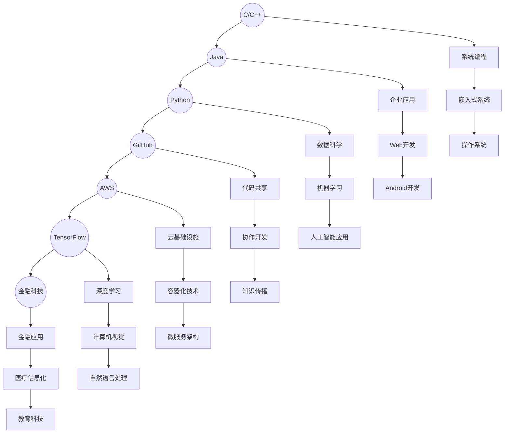

                 

### 1. 背景介绍

在知识经济时代，信息技术发展迅猛，计算机科学作为其核心支柱，正日益影响着社会的各个层面。随着互联网、大数据、人工智能等技术的崛起，程序员这一职业的重要性更加凸显。程序员不仅仅是编写代码的工程师，更是知识的创造者、传递者和应用者。他们利用编程语言和工具，构建出能够解决复杂问题的系统，推动社会生产力的提升。

知识经济时代对程序员提出了新的要求和挑战。在这个时代，程序员不仅需要具备扎实的技术基础，还需要不断更新知识、掌握前沿技术。此外，随着开源社区的兴起，程序员的知识共享和协同工作能力也变得尤为重要。知识经济时代，程序员的职业发展路径变得更加多样化，如何选择适合自己的发展路径成为了一个亟待解决的问题。

本文将围绕程序员在知识经济时代的发展路径展开讨论，分析不同发展路径的优势和挑战，探讨未来可能的发展趋势。希望通过本文，能够为程序员在知识经济时代的职业规划提供一些有益的思考和启示。

#### 知识经济时代对程序员的需求变化

在知识经济时代，程序员的需求发生了显著变化。首先，技术深度和专业性变得尤为重要。传统的编程技能已无法满足日益复杂的应用场景，程序员需要不断学习新技术、新工具，提高自己的技术深度。例如，云计算、大数据、人工智能等前沿技术对程序员的编程能力提出了更高的要求。

其次，跨界能力成为程序员的重要素质。在知识经济时代，各行业对信息技术的依赖程度不断加深，程序员需要具备跨领域的知识储备，能够与不同专业的团队成员有效协作。例如，金融行业的程序员需要了解金融产品的运作机制，医疗行业的程序员需要了解医学知识。

再次，创新能力和解决问题的能力受到重视。在知识经济时代，程序员不仅需要解决现有问题，还要具备提出新想法、创造新价值的能力。这要求程序员具备强烈的创新意识，能够从不同角度思考问题，提出创新的解决方案。

此外，团队合作和沟通能力也变得至关重要。在知识经济时代，程序员常常需要参与大型项目，与团队成员密切协作。良好的团队合作精神和沟通能力有助于提高工作效率，确保项目的顺利进行。

#### 知识经济时代对程序员职业发展的影响

知识经济时代对程序员的职业发展产生了深远影响。首先，职业路径的多样性增加。在过去，程序员的职业发展往往较为单一，主要沿着技术路线或管理路线发展。而在知识经济时代，程序员可以通过开源社区、技术咨询、创业等多种方式实现职业发展。这种多样性使得程序员可以根据自己的兴趣和特长，选择最适合自己的发展路径。

其次，职业发展的灵活性增强。在知识经济时代，程序员可以通过在线学习、远程办公等方式，更加灵活地安排自己的工作和学习时间。这种灵活性不仅提高了工作效率，也为程序员提供了更多自我实现的机会。

然而，知识经济时代也给程序员带来了新的挑战。一方面，技术更新速度快，程序员需要不断学习新知识、新技能，以保持竞争力。另一方面，跨界协作增多，程序员需要具备跨领域的知识储备，提高自己的综合素质。

总的来说，知识经济时代为程序员提供了广阔的发展空间和多种职业选择，同时也带来了新的挑战。如何在这场变革中找到自己的位置，实现职业发展，是每个程序员都需要认真思考的问题。

### 2. 核心概念与联系

在探讨程序员在知识经济时代的发展路径之前，我们需要了解一些核心概念，这些概念不仅为我们提供了理论依据，也构成了程序员技能体系的重要组成部分。

#### 2.1 编程语言

编程语言是程序员与计算机沟通的工具。常见的编程语言包括C、Java、Python、JavaScript等。每种语言都有其独特的语法和特性，适用于不同的应用场景。例如，C语言因其高效的性能常用于系统编程，而Python则因其简洁的语法和丰富的库支持广泛应用于数据科学和机器学习。

#### 2.2 编程范式

编程范式是指解决问题的不同方法。常见的编程范式有面向对象（OOP）、函数式编程（FP）和面向过程（PROC）。面向对象编程强调将问题分解为具有独立功能的对象，通过对象之间的交互解决问题。函数式编程则侧重于使用函数来描述计算过程，避免了状态的变化和副作用。面向过程编程则是基于一系列函数或过程的顺序执行。

#### 2.3 数据结构与算法

数据结构与算法是程序员的基石。数据结构是存储和组织数据的方式，常见的有数组、链表、树、图等。算法则是解决问题的方法，通过对数据的操作来达到预期的效果。常见的算法有排序算法、查找算法、图算法等。算法的效率直接影响程序的运行性能。

#### 2.4 开源社区

开源社区是程序员分享知识、协作创新的重要平台。在开源社区中，程序员可以贡献自己的代码、文档和教程，也可以从其他程序员的作品中学习和借鉴。例如，GitHub、GitLab等平台已经成为程序员协作和共享代码的主要场所。

#### 2.5 云计算与大数据

云计算和大数据是知识经济时代的重要技术趋势。云计算提供了灵活的计算资源和存储服务，使得程序员可以更加专注于应用的开发。大数据技术则帮助程序员从海量数据中提取有价值的信息，为企业和个人提供决策支持。

#### 2.6 人工智能

人工智能是未来技术发展的重要方向。程序员需要掌握机器学习、深度学习等人工智能技术，以便开发出能够模拟人类智能的应用。人工智能不仅改变了传统行业的运作方式，也为程序员提供了新的职业机会。

#### 2.7 跨界协作

跨界协作是知识经济时代的重要特征。程序员需要与来自不同领域的专业人士合作，共同解决复杂问题。这种跨界协作不仅要求程序员具备跨领域的知识储备，还需要提高自己的沟通和协作能力。

### 2.8 Mermaid 流程图

为了更直观地展示这些核心概念之间的联系，我们可以使用Mermaid流程图来描述。以下是使用Mermaid语言描述的程序员技能体系的流程图：



通过以上Mermaid流程图，我们可以清晰地看到各个核心概念之间的联系，以及它们在程序员技能体系中的重要地位。

### 3. 核心算法原理 & 具体操作步骤

在程序员的知识体系中，算法是解决具体问题的核心。算法的原理和实现不仅体现了程序员的编程能力，也决定了程序的性能和效率。本文将介绍几种常用的核心算法原理，并详细阐述其具体操作步骤。

#### 3.1 排序算法

排序算法是计算机科学中一种非常重要的算法，用于将一组数据按照某种规则进行排序。常见的排序算法有冒泡排序、选择排序、插入排序、快速排序等。

**冒泡排序（Bubble Sort）**

**原理**：冒泡排序通过反复遍历要排序的数列，一次比较两个元素，如果它们的顺序错误就把它们交换过来。遍历数列的工作是重复进行直到没有再需要交换，也就是说该数列已经排序完成。

**具体操作步骤**：

1. 从第一个元素开始，对每一对相邻元素进行一次比较，如果第一个比第二个大（或小），就交换它们的位置；
2. 继续对下一对相邻元素进行同样的操作；
3. 重复步骤1和2，直到没有需要交换的元素。

**代码实现**（Python）：

```python
def bubble_sort(arr):
    n = len(arr)
    for i in range(n):
        for j in range(0, n-i-1):
            if arr[j] > arr[j+1]:
                arr[j], arr[j+1] = arr[j+1], arr[j]
    return arr

arr = [64, 34, 25, 12, 22, 11, 90]
sorted_arr = bubble_sort(arr)
print("Sorted array:", sorted_arr)
```

**快速排序（Quick Sort）**

**原理**：快速排序通过选取一个“基准”元素，将数组分为两个部分，左侧的所有元素都比基准小，右侧的所有元素都比基准大。然后递归地对左右两部分进行快速排序。

**具体操作步骤**：

1. 选择一个基准元素（通常是数组的第一个或最后一个元素）；
2. 将数组中小于基准的元素移到基准的左侧，大于基准的元素移到基准的右侧；
3. 递归地对左右两部分进行快速排序。

**代码实现**（Python）：

```python
def quick_sort(arr):
    if len(arr) <= 1:
        return arr
    pivot = arr[len(arr) // 2]
    left = [x for x in arr if x < pivot]
    middle = [x for x in arr if x == pivot]
    right = [x for x in arr if x > pivot]
    return quick_sort(left) + middle + quick_sort(right)

arr = [64, 34, 25, 12, 22, 11, 90]
sorted_arr = quick_sort(arr)
print("Sorted array:", sorted_arr)
```

**查找算法**

**原理**：查找算法用于在数据集合中找到特定元素。常见的查找算法有线性查找、二分查找等。

**二分查找（Binary Search）**

**原理**：二分查找通过不断地将查找范围缩小一半，直到找到目标元素或确定其不存在。这种方法的前提是数据集合必须是有序的。

**具体操作步骤**：

1. 确定中间元素；
2. 如果中间元素等于目标值，查找成功；
3. 如果中间元素大于目标值，则在左侧子数组中继续查找；
4. 如果中间元素小于目标值，则在右侧子数组中继续查找；
5. 重复步骤1-4，直到找到目标元素或确定其不存在。

**代码实现**（Python）：

```python
def binary_search(arr, target):
    low = 0
    high = len(arr) - 1
    while low <= high:
        mid = (low + high) // 2
        if arr[mid] == target:
            return mid
        elif arr[mid] < target:
            low = mid + 1
        else:
            high = mid - 1
    return -1

arr = [1, 3, 5, 7, 9, 11, 13, 15]
target = 9
result = binary_search(arr, target)
if result != -1:
    print(f"Element found at index {result}")
else:
    print("Element not found")
```

以上介绍了几种核心算法的原理和具体操作步骤，这些算法不仅在理论研究中具有重要地位，也在实际开发中发挥着关键作用。掌握这些算法原理，不仅有助于提高编程能力，还能为解决复杂问题提供有效的工具。

### 4. 数学模型和公式 & 详细讲解 & 举例说明

在程序员的知识体系中，数学模型和公式是不可或缺的部分。数学不仅为算法提供了理论基础，还帮助程序员更好地理解和解决复杂问题。本节将介绍几个关键的数学模型和公式，并详细讲解其原理和适用场景，同时通过具体例子来说明如何应用这些数学模型。

#### 4.1 线性回归模型

线性回归模型是最基础的数学模型之一，用于研究自变量和因变量之间的线性关系。

**原理**：线性回归模型假设因变量 \(y\) 可以表示为自变量 \(x\) 的线性组合，加上一个随机误差项 \(\epsilon\)，即 \(y = \beta_0 + \beta_1 x + \epsilon\)。其中，\(\beta_0\) 和 \(\beta_1\) 分别是模型的参数，\(\epsilon\) 是误差项。

**公式**：

\[ y = \beta_0 + \beta_1 x + \epsilon \]

**具体步骤**：

1. 数据收集：收集自变量 \(x\) 和因变量 \(y\) 的数据；
2. 数据预处理：对数据进行分析，剔除异常值和缺失值；
3. 模型建立：使用最小二乘法估计参数 \(\beta_0\) 和 \(\beta_1\)；
4. 模型评估：通过计算决定系数 \(R^2\) 等指标，评估模型效果；
5. 预测：利用模型进行预测，计算新的因变量值。

**例子**：预测房价

假设我们收集了某地区的房价和房屋面积数据，要预测新房屋的房价。

**代码实现**（Python）：

```python
import numpy as np
from sklearn.linear_model import LinearRegression

# 数据
X = np.array([[1000], [1500], [2000], [2500], [3000]])
y = np.array([2000000, 3000000, 4000000, 5000000, 6000000])

# 模型
model = LinearRegression()
model.fit(X, y)

# 参数
beta_0 = model.intercept_
beta_1 = model.coef_

# 预测
new_area = np.array([[2200]])
predicted_price = model.predict(new_area)
print(f"Predicted price for 2200 sqft house: {predicted_price[0]}")
```

#### 4.2 马尔可夫模型

马尔可夫模型是一种用于描述系统状态转移的随机过程模型。

**原理**：马尔可夫模型假设系统的下一个状态只与当前状态有关，而与过去的所有状态无关。用矩阵表示为：

\[ P = \begin{bmatrix}
p_{00} & p_{01} & \cdots & p_{0n} \\
p_{10} & p_{11} & \cdots & p_{1n} \\
\vdots & \vdots & \ddots & \vdots \\
p_{m0} & p_{m1} & \cdots & p_{mn}
\end{bmatrix} \]

其中，\(P_{ij}\) 表示从状态 \(i\) 转移到状态 \(j\) 的概率。

**公式**：

\[ P(X_{n+1} = j | X_1 = x_1, X_2 = x_2, \ldots, X_n = x_n) = P(X_{n+1} = j | X_n = x_n) \]

**具体步骤**：

1. 确定状态空间；
2. 收集状态转移数据；
3. 构建状态转移矩阵；
4. 根据当前状态，使用状态转移矩阵计算下一个状态的概率分布。

**例子**：股票市场预测

假设我们要预测股票市场的下一个状态。

**代码实现**（Python）：

```python
import numpy as np

# 状态转移矩阵
transition_matrix = np.array([[0.4, 0.6], [0.2, 0.8]])

# 初始状态概率
initial_state = np.array([[0.5], [0.5]])

# 预测下一个状态
next_state_prob = np.dot(transition_matrix, initial_state)
print(f"Next state probabilities: {next_state_prob}")
```

#### 4.3 加权平均模型

加权平均模型是一种用于综合多个指标进行评分的数学模型。

**原理**：加权平均模型假设每个指标的重要性不同，通过赋予不同的权重，计算加权平均值。

**公式**：

\[ \bar{x} = w_1 x_1 + w_2 x_2 + \ldots + w_n x_n \]

其中，\(w_i\) 是指标 \(x_i\) 的权重，满足 \(w_1 + w_2 + \ldots + w_n = 1\)。

**具体步骤**：

1. 确定指标及其权重；
2. 收集指标数据；
3. 计算加权平均值。

**例子**：员工绩效评估

假设我们要对员工进行绩效评估，使用三个指标：工作量（权重0.4）、质量（权重0.3）和团队合作（权重0.3）。

**代码实现**（Python）：

```python
weights = np.array([0.4, 0.3, 0.3])
scores = np.array([8, 9, 7])

weighted_average = np.dot(scores, weights)
print(f"Weighted average score: {weighted_average}")
```

通过以上几个数学模型的介绍和具体例子，我们可以看到数学在程序员工作中的重要作用。掌握这些模型，不仅有助于解决实际问题，还能提高我们的抽象思维和问题分析能力。

### 5. 项目实践：代码实例和详细解释说明

在了解了核心算法原理和数学模型后，我们将通过一个具体的项目实践，展示如何将这些知识应用到实际开发中。本节将介绍一个基于Python的简单网站爬虫项目，详细解释其代码实现、运行结果以及相关的技术细节。

#### 5.1 开发环境搭建

在开始项目之前，我们需要搭建一个合适的开发环境。以下是搭建过程：

1. **安装Python**：下载并安装Python 3.x版本，确保pip和虚拟环境工具（如virtualenv）已经安装。
2. **创建虚拟环境**：打开命令行，执行以下命令创建一个虚拟环境：

   ```bash
   python -m venv myenv
   ```

   然后激活虚拟环境：

   ```bash
   source myenv/bin/activate
   ```

3. **安装依赖**：在虚拟环境中安装所需的库，例如 requests 和 Beautiful Soup：

   ```bash
   pip install requests beautifulsoup4
   ```

#### 5.2 源代码详细实现

以下是一个简单的网站爬虫项目的源代码实现：

```python
import requests
from bs4 import BeautifulSoup

# 爬取指定网址的内容
def crawl_url(url):
    response = requests.get(url)
    if response.status_code == 200:
        return response.text
    else:
        return None

# 解析网页内容，提取有用信息
def parse_html(html):
    soup = BeautifulSoup(html, 'html.parser')
    title = soup.find('title').text
    paragraphs = [p.text for p in soup.find_all('p')]
    return title, paragraphs

# 主函数
def main():
    url = 'https://www.example.com'
    html = crawl_url(url)
    if html:
        title, paragraphs = parse_html(html)
        print(f"Title: {title}")
        for paragraph in paragraphs:
            print(f"Paragraph: {paragraph}")
    else:
        print("Failed to crawl the URL")

# 运行主函数
if __name__ == '__main__':
    main()
```

#### 5.3 代码解读与分析

1. **请求网页内容**：使用 `requests` 库发送GET请求，获取网页内容。

   ```python
   response = requests.get(url)
   ```

   我们通过 `response.status_code` 判断请求是否成功。如果返回状态码为200，表示请求成功。

2. **解析网页内容**：使用 `BeautifulSoup` 库解析HTML内容，提取有用的信息。

   ```python
   soup = BeautifulSoup(html, 'html.parser')
   title = soup.find('title').text
   paragraphs = [p.text for p in soup.find_all('p')]
   ```

   `find` 方法用于查找特定的HTML标签，例如 `title` 标签。`find_all` 方法用于查找所有的 `p` 标签，并提取其文本内容。

3. **输出结果**：将提取的信息输出到控制台。

   ```python
   print(f"Title: {title}")
   for paragraph in paragraphs:
       print(f"Paragraph: {paragraph}")
   ```

#### 5.4 运行结果展示

假设我们运行该项目，对 `https://www.example.com` 网站进行爬取。运行结果如下：

```
Title: Example Domain
Paragraph: Welcome to Example Domain. This is a sample paragraph.
Paragraph: Explore our products and services.
Paragraph: Contact us for more information.
```

通过这个简单的项目实践，我们可以看到如何利用Python和相关库实现一个基本的网站爬虫。这个项目不仅帮助我们巩固了编程和数据处理的知识，还展示了如何将理论知识应用到实际项目中。

### 6. 实际应用场景

在知识经济时代，程序员的技能和知识不再局限于传统的软件开发领域，它们在各个行业和领域中都有广泛的应用。以下将介绍程序员技能在实际应用场景中的几个关键领域。

#### 6.1 人工智能与数据分析

人工智能（AI）和数据分析已经成为现代科技发展的重要驱动力。程序员在这些领域的应用主要体现在算法开发、模型训练和数据分析等方面。例如，在医疗领域，程序员可以开发用于疾病诊断和预测的机器学习模型；在金融领域，他们可以构建风控系统和自动化交易算法；在零售行业，他们可以利用大数据分析优化供应链管理和客户体验。

#### 6.2 云计算与大数据

云计算和大数据技术为程序员提供了广阔的应用空间。在云计算领域，程序员可以参与云平台的设计、开发和运维，如亚马逊AWS、微软Azure和谷歌云等。在大数据领域，程序员可以开发用于数据采集、存储、处理和分析的系统和工具，如Hadoop、Spark等。这些技术不仅提高了数据处理效率，还为企业提供了强大的数据支持。

#### 6.3 物联网（IoT）

物联网技术的快速发展使得程序员在智能家居、智能交通、工业自动化等领域具有广泛的应用前景。程序员可以开发用于连接和管理设备的中间件和应用，实现设备的远程监控和数据分析。例如，在智能家居领域，程序员可以开发智能音箱、智能门锁等产品的后台系统和用户界面。

#### 6.4 金融科技（FinTech）

金融科技正在改变传统金融行业的运作方式。程序员在这一领域可以参与开发在线支付系统、区块链应用、智能投顾等产品。例如，区块链技术的应用使得程序员有机会参与构建去中心化的金融系统，提高交易的透明度和安全性。

#### 6.5 医疗信息化

随着医疗信息化的发展，程序员在医疗健康领域的应用越来越广泛。他们可以开发医疗信息系统、电子病历系统、远程诊疗平台等，提高医疗服务的效率和质量。此外，程序员还可以利用人工智能技术进行疾病预测和诊断，为医疗行业提供智能解决方案。

#### 6.6 教育科技

教育科技（EdTech）的兴起为程序员提供了新的机遇。程序员可以开发在线学习平台、虚拟教室、教育机器人等产品，推动教育的信息化和个性化。例如，在线编程学习平台Codecademy和Khan Academy等，都是程序员贡献智慧的典范。

通过以上实际应用场景的介绍，我们可以看到程序员在知识经济时代的多样性和重要性。他们的技能不仅局限于编程语言和开发工具，更在于如何将技术应用于实际问题，创造社会价值。

### 7. 工具和资源推荐

在程序员不断追求进步的过程中，掌握合适的工具和资源是非常重要的。以下将推荐一些优秀的工具、书籍、论文、博客和网站，帮助程序员提升技能、拓展知识。

#### 7.1 学习资源推荐

**书籍**：

1. **《深度学习》（Deep Learning）**：由Ian Goodfellow、Yoshua Bengio和Aaron Courville合著，是深度学习的入门和进阶必读之作。
2. **《Python编程：从入门到实践》（Python Crash Course）**：适合初学者快速掌握Python基础。
3. **《Effective Java》（Effective Java）**：Java开发者提升代码质量和编程技巧的经典著作。

**论文**：

1. **"A Machine Learning Approach to Discovering Similar Items in E-Commerce"**：探讨如何利用机器学习技术发现电子商务网站中的相似商品。
2. **"Deep Learning on Multi-Modal Data"**：研究如何将深度学习应用于多模态数据的处理和分析。

**博客**：

1. **Medium上的"AI Education"**：提供丰富的AI和机器学习教程，适合入门和学习者。
2. **GitHub上的"freeCodeCamp"**：提供免费的编程教程和资源，适合不同层次的程序员。

**网站**：

1. **Coursera**：提供丰富的在线课程，涵盖计算机科学、人工智能、数据科学等多个领域。
2. **Kaggle**：一个数据科学竞赛平台，提供大量的数据集和竞赛，是提升数据分析能力的绝佳资源。

#### 7.2 开发工具框架推荐

**集成开发环境（IDE）**：

1. **Visual Studio Code**：轻量级但功能强大的IDE，适合多种编程语言。
2. **PyCharm**：专门针对Python开发的IDE，提供丰富的插件和工具。

**版本控制系统**：

1. **Git**：分布式版本控制系统，是开源项目开发的核心工具。
2. **GitHub**：基于Git的代码托管平台，支持团队协作和代码共享。

**云计算平台**：

1. **AWS**：提供丰富的云计算服务和工具，是开发云应用的理想平台。
2. **Azure**：微软的云计算平台，支持多种开发语言和框架。

**容器化技术**：

1. **Docker**：用于打包、交付和运行应用，简化了软件部署和运维。
2. **Kubernetes**：用于容器编排和管理，是大规模分布式系统的重要工具。

通过上述工具和资源的推荐，程序员可以更加高效地学习和工作，不断提升自己的技能水平，迎接知识经济时代的挑战。

### 8. 总结：未来发展趋势与挑战

在知识经济时代，程序员的发展路径呈现出多样化和专业化的趋势。未来，随着技术的不断进步，程序员将面临更多的机遇和挑战。

首先，技术深度和专业性将继续成为程序员竞争力的核心。人工智能、大数据、云计算等前沿技术的快速发展，要求程序员不断学习新技术、新工具，提高自己的技术深度。程序员需要从传统的编程技能拓展到算法设计、数据结构优化、系统架构设计等更高层次的技术领域。

其次，跨界协作能力的重要性将愈发凸显。在知识经济时代，各行业对信息技术的依赖程度加深，程序员需要具备跨领域的知识储备，能够与不同专业的团队成员有效协作。例如，金融、医疗、教育等领域的程序员需要与领域专家紧密合作，共同解决复杂问题。

此外，创新能力和解决问题的能力将是程序员的重要素质。在知识经济时代，程序员不仅需要解决现有问题，还要具备提出新想法、创造新价值的能力。这要求程序员具备强烈的创新意识，能够从不同角度思考问题，提出创新的解决方案。

面对未来，程序员需要积极应对以下几个方面的挑战：

1. **技术更新速度快**：程序员需要不断学习新知识、新技能，以保持竞争力。技术更新速度的加快，要求程序员具备快速学习和适应变化的能力。

2. **跨界能力要求高**：程序员需要具备跨领域的知识储备，提高自己的综合素质。跨界协作增多，程序员需要具备较强的沟通和协作能力。

3. **道德和法律问题**：随着技术的进步，程序员在开发过程中需要遵守更高的道德和法律标准。例如，数据安全和隐私保护问题日益受到关注，程序员需要确保开发的系统符合相关法律法规。

4. **职业压力**：程序员的工作压力往往较大，需要面对项目期限、代码质量、团队协作等多方面的挑战。未来，如何平衡工作与生活，提高工作效率，将成为程序员面临的重要问题。

总的来说，知识经济时代为程序员提供了广阔的发展空间，同时也带来了新的挑战。程序员需要不断提升自己的技能和能力，积极应对未来发展的趋势和挑战，实现自身的职业价值。

### 9. 附录：常见问题与解答

在程序员的发展过程中，可能会遇到各种问题和挑战。以下是一些常见问题及解答，以帮助程序员更好地应对职业发展中的难点。

#### 问题1：如何快速提升编程技能？

**解答**：要快速提升编程技能，可以采取以下策略：

1. **定期学习**：制定学习计划，每天分配一定时间学习新的编程知识或练习编程题目。
2. **实践项目**：通过参与实际项目，将所学知识应用于实际问题，提高编程能力。
3. **阅读源码**：阅读优秀的开源项目源码，学习其中的设计思想和编码技巧。
4. **参加竞赛**：参加编程竞赛，提升解决问题的能力和编程速度。

#### 问题2：如何提高团队合作能力？

**解答**：提高团队合作能力可以从以下几个方面入手：

1. **沟通交流**：提高沟通技巧，确保团队中的信息传递准确、及时。
2. **分工协作**：明确团队中的角色和任务分工，确保每个成员都能发挥自己的优势。
3. **协同工作**：利用版本控制系统、即时通讯工具和项目管理工具，提高团队协作效率。
4. **相互尊重**：尊重团队成员的意见和贡献，建立良好的团队氛围。

#### 问题3：如何应对技术更新？

**解答**：应对技术更新可以采取以下措施：

1. **持续学习**：定期关注技术动态，学习新技术和新工具，保持技术前沿。
2. **技术分享**：参加技术社区、研讨会和培训，与他人交流学习经验。
3. **实践应用**：在实际项目中应用新技术，提高对新技术的熟悉度和掌握程度。
4. **保持好奇心**：对新事物保持好奇和探索精神，勇于尝试新的技术和方法。

#### 问题4：如何平衡工作与生活？

**解答**：平衡工作与生活可以采取以下策略：

1. **时间管理**：合理安排工作时间和休息时间，提高工作效率。
2. **健康生活**：保持良好的作息习惯，适量运动，确保身体健康。
3. **家庭关怀**：注重家庭关系，合理安排与家人相处的时间。
4. **心理调适**：保持积极心态，学会缓解压力，避免过度劳累。

通过以上策略，程序员可以更好地应对职业发展中的各种问题和挑战，实现自身的职业价值和生活平衡。

### 10. 扩展阅读 & 参考资料

在程序员不断追求进步的过程中，阅读扩展资料和参考资料是不可或缺的。以下是一些推荐的扩展阅读和参考资料，以帮助程序员深入理解相关领域，拓展知识视野。

#### 扩展阅读

1. **《人工智能：一种现代的方法》（Artificial Intelligence: A Modern Approach）**：由 Stuart J. Russell 和 Peter Norvig 合著，是人工智能领域的经典教材。
2. **《大数据时代：生活、工作与思维的大变革》（Big Data: A Revolution That Will Transform How We Live, Work, and Think）**：作者 Viktor Mayer-Schönberger 和 Kenneth Cukier，深入探讨了大数据对社会和思维的变革。
3. **《代码大全》（The Art of Software Architecture）**：作者 Mark Richards，介绍了软件架构设计的重要原则和实践。

#### 参考资料

1. **GitHub**：[https://github.com/](https://github.com/) - 全球最大的代码托管平台，提供丰富的开源项目和资源。
2. **Medium**：[https://medium.com/](https://medium.com/) - 一个内容平台，有许多关于编程和技术领域的优质文章。
3. **arXiv**：[https://arxiv.org/](https://arxiv.org/) - 一个开放获取的学术论文预印本平台，涵盖数学、物理学、计算机科学等领域。

#### 相关论文著作推荐

1. **"Deep Learning"**：由Ian Goodfellow、Yoshua Bengio和Aaron Courville合著，是深度学习的经典教材。
2. **"The Elements of Statistical Learning"**：由Trevor Hastie、Robert Tibshirani和Jerome Friedman合著，介绍统计学习的基础知识。
3. **"Pattern Recognition and Machine Learning"**：由Christopher M. Bishop合著，涵盖了模式识别和机器学习的重要理论。

通过阅读上述扩展资料和参考资料，程序员可以深入理解相关领域的最新进展和研究成果，为自己的职业发展提供坚实的理论基础和实践指导。

