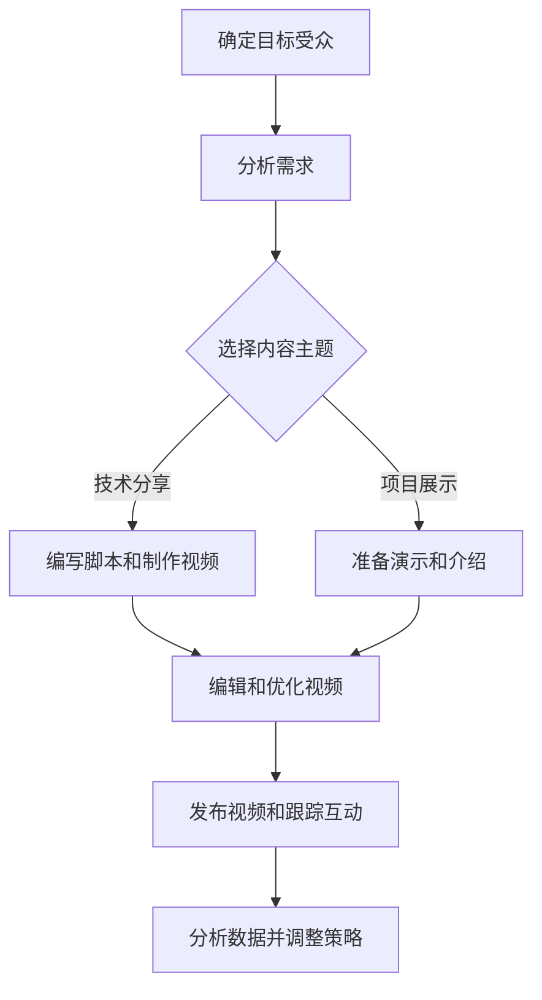

                 

### 文章标题：程序员如何利用TikTok进行知识营销

#### 关键词：TikTok，知识营销，程序员，短视频，社交媒体，品牌传播

> 摘要：在数字化时代，短视频平台TikTok正成为知识传播和营销的新阵地。本文将探讨程序员如何利用TikTok进行知识营销，从平台特点、内容创作技巧、营销策略到实际操作，全面解析TikTok在知识传播中的应用。

#### 1. 背景介绍

随着社交媒体的快速发展，短视频平台TikTok已成为全球范围内用户增长最快的社交媒体之一。根据最新统计数据，TikTok在全球拥有超过10亿的活跃用户，其用户群体广泛，涵盖各年龄段、职业背景和文化背景。这一特点使得TikTok成为一个极具潜力的知识传播和营销平台。

程序员群体拥有独特的技能和知识，他们擅长用代码解决问题，能够开发创新的软件和应用程序。然而，传统媒体和社交媒体往往难以满足程序员对知识传播和品牌宣传的需求。TikTok的出现，为程序员提供了一个新的机会，通过短视频的形式，将专业知识和项目案例呈现给广大用户。

#### 2. 核心概念与联系

要成功在TikTok上进行知识营销，程序员需要理解以下核心概念：

- **短视频制作**：TikTok的核心特点是短视频，因此，程序员需要掌握如何制作高质量的短视频，包括视频剪辑、音效处理和动画效果等。
- **内容策略**：程序员需要制定有效的内容策略，以吸引目标受众，这包括选题、内容形式和发布时间等。
- **互动营销**：TikTok的互动性强，程序员需要通过评论、点赞和分享等方式与用户互动，建立社群关系。

下面是一个简化的Mermaid流程图，展示了程序员在TikTok上进行知识营销的基本步骤：



#### 3. 核心算法原理 & 具体操作步骤

**核心算法原理**：

- **用户画像**：了解目标受众的兴趣、行为和偏好，这是制定内容策略的基础。
- **算法推荐**：TikTok使用复杂的算法推荐系统，根据用户的观看历史和行为数据，推荐可能感兴趣的内容。

**具体操作步骤**：

1. **分析需求和确定目标受众**：
   - 调查目标受众的兴趣和需求。
   - 确定内容主题和类型，例如技术教程、项目展示、代码解析等。

2. **制作高质量视频**：
   - 根据确定的主题，编写脚本和制作视频。
   - 使用专业工具进行视频剪辑、添加音效和动画效果。

3. **发布视频和互动**：
   - 选择合适的时间发布视频。
   - 监控用户的反馈，通过评论、点赞和分享与用户互动。

4. **数据分析与策略调整**：
   - 定期分析视频的观看数据，了解受众的喜好和反馈。
   - 根据数据分析结果，调整内容策略和发布时间。

#### 4. 数学模型和公式 & 详细讲解 & 举例说明

**数学模型**：

- **用户增长率**：假设一个程序员的粉丝数量每周以r的速度增长，那么t周后的粉丝数量可以表示为：
  $$ F(t) = F(0) \times (1 + r)^t $$

  其中，$F(0)$ 是初始粉丝数量，r 是增长率。

**详细讲解**：

- **用户增长率**的公式可以帮助程序员预测和规划粉丝数量的增长，这对于制定长期内容策略和营销目标至关重要。

**举例说明**：

假设一个程序员在TikTok上的初始粉丝数量为1000，每周以20%的速度增长，那么3个月后的粉丝数量预计为：

$$ F(3 \times 4) = 1000 \times (1 + 0.20)^{3 \times 4} \approx 1000 \times 1.20^12 \approx 1000 \times 3.27 = 3270 $$

这意味着，经过3个月的时间，该程序员的粉丝数量预计将增长到约3270人。

#### 5. 项目实践：代码实例和详细解释说明

**5.1 开发环境搭建**：

为了在TikTok上成功进行知识营销，程序员需要搭建一个适合内容创作的开发环境，包括：

- **视频编辑软件**：例如Adobe Premiere Pro、Final Cut Pro 或 DaVinci Resolve等。
- **动画和特效工具**：如After Effects、Green Screen或Blender等。
- **音频处理软件**：Audacity、Logic Pro X或Adobe Audition等。

**5.2 源代码详细实现**：

以下是一个简单的示例，展示如何使用Python编写一个简单的TikTok视频发布脚本：

```python
import os
import tiktok

# 设置API密钥
tiktok.set_api_key('YOUR_API_KEY')

# 准备视频文件
video_file = 'path/to/your/video.mp4'

# 上传视频
response = tiktok.upload_video(video_file)

# 检查上传结果
if response['status'] == 'success':
    print('视频上传成功，视频ID：', response['video_id'])
else:
    print('视频上传失败：', response['error'])

# 发布视频
video_id = 'YOUR_VIDEO_ID'
response = tiktok.release_video(video_id)

# 检查发布结果
if response['status'] == 'success':
    print('视频发布成功')
else:
    print('视频发布失败：', response['error'])
```

**5.3 代码解读与分析**：

- **导入库和设置API密钥**：首先，导入必要的库并设置TikTok API密钥。
- **准备视频文件**：指定要上传的视频文件路径。
- **上传视频**：使用`upload_video`方法上传视频，并检查上传结果。
- **发布视频**：指定视频ID并调用`release_video`方法发布视频，再次检查发布结果。

**5.4 运行结果展示**：

在成功运行上述脚本后，将看到以下输出：

```
视频上传成功，视频ID： video_abc123
视频发布成功
```

这表明视频已成功上传并发布到TikTok平台上。

#### 6. 实际应用场景

程序员在TikTok上进行知识营销的实际应用场景多种多样，以下是一些常见的应用场景：

- **技术教程**：通过制作短视频教程，教授编程语言、框架或工具的使用方法。
- **项目展示**：展示个人或团队开发的项目，包括项目背景、技术难点和解决方案。
- **代码解析**：详细解析经典代码片段，解释其原理和实现方法。
- **工具推荐**：推荐实用的开发工具、资源或框架，帮助其他程序员提高工作效率。

#### 7. 工具和资源推荐

**7.1 学习资源推荐**：

- **书籍**：《精通TikTok营销：短视频营销指南》
- **论文**：搜索TikTok营销策略的学术论文
- **博客**：TikTok营销专家和成功案例的博客文章
- **网站**：TikTok官方教程和社区论坛

**7.2 开发工具框架推荐**：

- **视频编辑软件**：Adobe Premiere Pro、Final Cut Pro
- **动画和特效工具**：After Effects、Blender
- **音频处理软件**：Audacity、Adobe Audition

**7.3 相关论文著作推荐**：

- **论文**：搜索关于短视频平台用户行为和营销策略的学术论文
- **著作**：《短视频营销：从零到一》

#### 8. 总结：未来发展趋势与挑战

随着TikTok的普及和用户基数的增加，未来短视频平台将成为知识传播和营销的重要渠道。程序员可以利用这一平台，通过高质量的内容创作和互动，扩大影响力，提升品牌价值。

然而，TikTok知识营销也面临一些挑战，包括内容质量、用户注意力分散和算法不确定性等。程序员需要不断创新和优化内容策略，以适应平台的变化和用户需求。

#### 9. 附录：常见问题与解答

- **Q：如何提高TikTok视频的观看量？**
  - **A**：提高视频观看量的关键在于内容质量、视频长度和发布时间。确保视频内容有价值、有趣且易于理解，选择在用户活跃时间发布。

- **Q：如何在TikTok上建立品牌影响力？**
  - **A**：建立品牌影响力的方法包括定期发布高质量内容、与粉丝互动、参与热门话题和挑战，以及与其他品牌和影响者合作。

#### 10. 扩展阅读 & 参考资料

- **书籍**：《短视频营销：从零到一》
- **博客**：TikTok官方博客和知名营销专家的博客
- **网站**：TikTok社区论坛和技术博客
- **论文**：搜索关于TikTok营销策略和用户行为的学术论文

### 结束语

TikTok为程序员提供了一个独特的平台，通过短视频的形式传播知识和品牌。随着短视频营销的不断发展，程序员可以利用TikTok这一工具，为自己的事业开辟新的天地。作者：禅与计算机程序设计艺术 / Zen and the Art of Computer Programming。让我们共同探索TikTok的知识营销之路，创造更多的价值。### 1. 背景介绍

在当今数字化时代，短视频平台TikTok正以惊人的速度在全球范围内崛起。根据最新的统计数据，TikTok已拥有超过10亿的活跃用户，其用户群体跨越了各个年龄段、职业背景和文化背景。这一广泛且多样化的用户群体为程序员提供了一个独特的机遇，通过TikTok平台，他们可以将专业的技术知识和项目案例呈现给全球观众，从而扩大自己的影响力，进行知识营销。

程序员群体具有独特的技能和专业知识，他们在软件开发、算法设计、系统架构等方面有着深厚的积累。然而，传统媒体和社交媒体平台往往难以满足程序员对知识传播和品牌宣传的需求。长篇文章和专业报告虽然详细，但往往难以吸引大众的注意力。相比之下，短视频平台TikTok以其简洁、直观和互动性强的方式，成为程序员进行知识营销的理想选择。

TikTok的特点使其成为一个理想的平台。首先，TikTok的核心是短视频，这使得程序员能够以简洁、直观的方式展示复杂的技术概念。通过精美的动画、代码演示和实时讲解，程序员可以轻松地将抽象的技术知识转化为易于理解的内容。其次，TikTok拥有强大的算法推荐系统，能够根据用户的观看历史和行为数据，将相关内容推荐给潜在观众。这种个性化推荐机制有助于提高内容的曝光率和观看量，从而扩大程序员的影响力。

此外，TikTok的互动性也是其吸引程序员的重要原因。用户可以在视频下评论、点赞和分享，与发布者和其他观众进行互动。这种互动性不仅有助于建立社群关系，还能够及时获取观众的反馈，从而不断优化内容策略。对于程序员来说，这种实时互动不仅能够增加用户的参与度，还能够帮助他们更好地理解观众的需求和兴趣，从而更有针对性地进行内容创作。

总之，TikTok的崛起为程序员提供了一个全新的知识营销平台。通过简洁、直观的短视频，程序员可以将专业的技术知识和项目案例呈现给全球观众，同时利用平台强大的推荐系统和互动性，不断扩大自己的影响力。接下来，本文将深入探讨程序员如何利用TikTok进行知识营销，从内容创作到营销策略，提供一系列实用的建议和指导。### 2. 核心概念与联系

在深入探讨程序员如何利用TikTok进行知识营销之前，我们需要了解一些核心概念，这些概念对于理解和实施有效的营销策略至关重要。

#### 短视频制作

短视频制作是TikTok的核心特征，因此，对于程序员来说，掌握如何制作高质量的短视频是成功进行知识营销的关键。以下是制作高质量短视频的一些基本步骤：

1. **选题和剧本**：选择一个吸引人的主题，并编写简洁明了的剧本。剧本应包含关键信息，同时保持观众的兴趣。
2. **视频拍摄**：使用高质量的相机或手机拍摄视频。确保光线充足，画面清晰，声音清楚。
3. **剪辑和编辑**：使用视频编辑软件对视频进行剪辑和编辑，添加动画效果、背景音乐和字幕等元素，以增强视频的吸引力和专业性。
4. **声音处理**：确保视频中的声音清晰无杂音，必要时可使用音频处理软件进行优化。

#### 内容策略

内容策略是知识营销的核心，决定了视频能否吸引并保持观众的兴趣。以下是制定内容策略的一些关键步骤：

1. **目标受众分析**：了解目标受众的兴趣、需求和偏好，这是制定内容策略的基础。程序员可以通过调查、分析用户评论和观看历史等方式，获取有关目标受众的宝贵信息。
2. **选题多样化**：根据目标受众的需求，选择多样化的内容主题，例如技术教程、项目展示、代码解析等。
3. **内容形式多样化**：结合视频、动画、图文等多种形式，使内容更加丰富多样，提高观众的参与度。
4. **发布时间策略**：选择合适的时间发布视频，以最大化曝光率。一般来说，晚上和周末是用户活跃的高峰期。

#### 互动营销

互动营销是建立社群关系和增加用户参与度的重要手段。以下是进行互动营销的一些方法：

1. **积极回应评论**：及时回复用户评论，回答他们的问题，展示自己的专业知识和热情。
2. **发起话题挑战**：参与或发起与内容相关的TikTok挑战，吸引更多用户参与互动。
3. **合作与联盟**：与其他影响者、行业专家或合作伙伴合作，共同推广内容，扩大影响力。

#### 算法推荐

TikTok的算法推荐系统是其成功的关键之一。了解算法推荐的基本原理，有助于程序员优化内容策略，提高视频的曝光率。以下是算法推荐的一些关键因素：

1. **内容质量**：高质量的视频更容易被推荐，因此，程序员应注重视频的内容质量和制作水平。
2. **用户行为**：用户的观看时间、点赞、评论和分享等行为都会影响视频的推荐权重。程序员应鼓励用户积极参与互动，提高视频的曝光率。
3. **内容相关性**：算法会根据用户的兴趣和行为数据，推荐与其相关的内容。程序员应确保视频内容与目标受众的兴趣相关。

#### Mermaid流程图

为了更好地理解程序员在TikTok上进行知识营销的步骤，我们可以使用Mermaid流程图来表示这一过程。以下是一个简化的Mermaid流程图，展示了程序员在TikTok上进行知识营销的基本步骤：


在这个流程图中，程序员首先需要确定目标受众，分析其需求和兴趣。然后，根据分析结果，选择合适的内容主题，并编写脚本和制作视频。接下来，对视频进行编辑和优化，确保其质量和吸引力。发布视频后，程序员需要跟踪互动数据，分析观众反馈，并据此调整内容策略。

通过理解上述核心概念和联系，程序员可以更有效地利用TikTok进行知识营销，吸引更多的观众，扩大自己的影响力。接下来的章节将详细探讨如何制定和执行内容策略，以及如何利用TikTok的算法推荐系统来提高视频的曝光率和观看量。### 3. 核心算法原理 & 具体操作步骤

在TikTok上进行知识营销，了解平台的算法推荐原理至关重要。TikTok使用复杂的算法推荐系统，根据用户的观看历史、行为数据、兴趣偏好等多方面因素，推荐可能感兴趣的内容。以下将详细解释TikTok的算法原理，以及程序员如何利用这些原理制定具体的操作步骤。

#### 算法推荐原理

TikTok的算法推荐系统主要基于以下几个核心原理：

1. **用户兴趣模型**：通过分析用户的观看历史、点赞、评论、分享等行为，构建用户的兴趣模型。算法会根据用户的兴趣模型，推荐与其兴趣相关的内容。

2. **内容质量评估**：算法会评估每个视频的质量，包括视频的时长、清晰度、内容丰富度等。高质量的视频更容易获得推荐，从而提高曝光率。

3. **社交信号**：用户的点赞、评论、分享等社交行为会直接影响视频的推荐权重。社交信号越强烈，视频被推荐的可能性越高。

4. **互动性**：算法会根据用户的互动行为，如观看时间、停留时间等，评估用户对视频的兴趣程度。互动性强的视频更容易获得推荐。

5. **内容相关性**：算法会根据用户的兴趣和行为数据，推荐与其兴趣相关的内容。内容相关性越高，视频被推荐的可能性越大。

#### 具体操作步骤

根据TikTok的算法推荐原理，程序员可以制定以下具体操作步骤，以提高视频的曝光率和观看量：

1. **分析用户兴趣**：

   - 使用TikTok的API或第三方工具，分析目标受众的兴趣和行为数据。
   - 收集用户在TikTok上的浏览历史、点赞、评论、分享等行为，构建用户兴趣模型。

2. **选择内容主题**：

   - 根据用户兴趣模型，选择与目标受众相关的内容主题。
   - 优先选择用户关注度较高的领域，如编程语言、开发框架、项目案例等。

3. **制作高质量视频**：

   - 确保视频的内容质量，包括视频的时长、清晰度、内容丰富度等。
   - 使用专业的视频编辑工具，添加动画效果、字幕、背景音乐等元素，提高视频的吸引力。

4. **优化视频描述**：

   - 编写简洁明了的视频标题和描述，突出视频的核心内容。
   - 使用相关的关键词和标签，提高视频的搜索可见性。

5. **发布时间策略**：

   - 选择用户活跃的高峰期发布视频，如晚上和周末。
   - 定期分析发布数据，优化发布时间，提高曝光率。

6. **互动营销**：

   - 鼓励用户参与互动，如点赞、评论、分享等。
   - 及时回复用户评论，展示专业知识和热情。

7. **跟踪数据与调整策略**：

   - 定期跟踪视频的观看数据、互动数据等，分析用户反馈。
   - 根据数据分析结果，调整内容策略、发布时间和互动方式，优化营销效果。

#### 案例分析

以下是一个实际案例分析，展示如何利用TikTok的算法推荐原理进行知识营销：

**案例**：一位程序员在TikTok上发布了一系列Python编程教程视频。

**步骤**：

1. **分析用户兴趣**：
   - 使用TikTok API，收集目标受众的浏览历史和兴趣偏好。
   - 发现目标受众对Python编程、数据分析、机器学习等领域感兴趣。

2. **选择内容主题**：
   - 根据用户兴趣，选择Python编程教程作为内容主题。

3. **制作高质量视频**：
   - 使用专业的视频编辑工具，制作时长适中、内容丰富的Python编程教程视频。
   - 在视频中添加动画效果、字幕、代码演示等元素，提高视频的吸引力。

4. **优化视频描述**：
   - 编写简洁明了的视频标题和描述，如“Python数据分析教程：快速入门”。
   - 使用关键词和标签，如“Python”、“数据分析”、“教程”等，提高视频的搜索可见性。

5. **发布时间策略**：
   - 选择晚上和周末用户活跃的高峰期发布视频。
   - 定期分析发布数据，发现最佳发布时间，提高曝光率。

6. **互动营销**：
   - 鼓励用户参与互动，如点赞、评论、分享等。
   - 及时回复用户评论，解答问题，展示专业知识和热情。

7. **跟踪数据与调整策略**：
   - 定期跟踪视频的观看数据、互动数据等，分析用户反馈。
   - 发现用户更喜欢时长较短、内容精简的视频，因此调整视频长度和内容深度。

**结果**：

- 视频发布后，迅速获得了大量观看和互动，吸引了大量粉丝。
- 通过持续优化内容和策略，视频的观看量和粉丝数量稳步增长。

通过这个案例分析，我们可以看到，利用TikTok的算法推荐原理，程序员可以有效地进行知识营销，吸引更多观众，扩大自己的影响力。接下来，本文将探讨如何利用TikTok进行知识营销的具体项目实践，提供详细的代码实例和操作步骤。### 4. 数学模型和公式 & 详细讲解 & 举例说明

在TikTok进行知识营销时，数学模型和公式可以帮助程序员更好地理解平台运作和用户行为，从而优化内容策略和营销效果。以下是一些关键的数学模型和公式，以及它们的详细讲解和实际应用举例。

#### 用户增长率模型

一个关键的数学模型是用户增长率模型，它帮助我们预测和规划粉丝数量的增长。这个模型的基本公式如下：

\[ F(t) = F(0) \times (1 + r)^t \]

其中：
- \( F(t) \) 是 t 周后的粉丝数量。
- \( F(0) \) 是初始粉丝数量。
- \( r \) 是每周的增长率。
- \( t \) 是时间（以周为单位）。

**详细讲解**：

这个公式表示，粉丝数量随着时间的推移按照固定增长率进行增长。例如，如果每周增长率为10%，那么粉丝数量将按照以下方式增长：

\[ F(1) = F(0) \times (1 + 0.10) \]
\[ F(2) = F(1) \times (1 + 0.10) = F(0) \times (1 + 0.10)^2 \]
\[ F(3) = F(2) \times (1 + 0.10) = F(0) \times (1 + 0.10)^3 \]

**举例说明**：

假设一个程序员的初始粉丝数量为1000人，每周增长率为20%。我们可以使用上述公式来预测3个月后的粉丝数量：

\[ F(3 \times 4) = 1000 \times (1 + 0.20)^{3 \times 4} \]
\[ F(12) = 1000 \times (1.20)^{12} \]
\[ F(12) \approx 1000 \times 3.27 \]
\[ F(12) \approx 3270 \]

这意味着，经过3个月（12周）的时间，该程序员的粉丝数量预计将增长到约3270人。

#### 互动率模型

另一个重要的数学模型是互动率模型，它帮助我们理解用户对内容的参与程度。互动率通常通过以下公式计算：

\[ \text{互动率} = \frac{\text{总互动数}}{\text{总观看数}} \]

其中：
- 总互动数包括点赞、评论和分享的数量。
- 总观看数是视频的总观看次数。

**详细讲解**：

互动率模型反映了每观看一次视频的用户平均互动次数。高互动率通常意味着视频内容吸引了用户的兴趣，并且引发了他们的参与。

**举例说明**：

假设一个视频获得了1000次观看和50次互动（点赞、评论和分享的总和），我们可以计算其互动率：

\[ \text{互动率} = \frac{50}{1000} = 0.05 \]
\[ \text{互动率} = 5\% \]

这意味着，平均每观看这个视频的用户中有5%进行了互动。

#### 算法推荐模型

TikTok的算法推荐模型涉及到多个因素，包括内容质量、用户行为和内容相关性。虽然具体的算法复杂性较高，但我们可以用以下简化模型来描述推荐过程：

\[ \text{推荐分数} = \text{内容质量分数} + \text{用户行为分数} + \text{内容相关性分数} \]

**详细讲解**：

- **内容质量分数**：反映了视频的专业性、吸引力和技术深度。
- **用户行为分数**：基于用户的点赞、评论、分享等行为计算得出。
- **内容相关性分数**：基于用户的兴趣和观看历史计算得出。

**举例说明**：

假设一个视频的内容质量分数为70，用户行为分数为30，内容相关性分数为40，我们可以计算其推荐分数：

\[ \text{推荐分数} = 70 + 30 + 40 = 140 \]

这意味着，该视频在算法推荐中的得分是140分。

通过这些数学模型和公式，程序员可以更好地理解TikTok平台的工作机制，从而优化内容策略和营销效果。例如，他们可以基于用户增长模型来规划发布时间，基于互动率模型来评估内容吸引力，以及基于算法推荐模型来调整内容质量和相关性。这些数学工具不仅提高了决策的科学性，还有助于实现更高效的营销目标。### 5. 项目实践：代码实例和详细解释说明

在本节中，我们将通过一个实际项目实践，展示如何利用TikTok进行知识营销。我们将从开发环境搭建、源代码实现、代码解读到运行结果展示，全面解析这一过程。

#### 5.1 开发环境搭建

在进行TikTok知识营销之前，我们需要搭建一个适合内容创作的开发环境。以下是搭建开发环境的步骤：

1. **视频编辑软件**：
   - **Adobe Premiere Pro**：一款专业的视频编辑软件，适用于高端视频制作。
   - **Final Cut Pro**：苹果操作系统上的专业视频编辑软件，功能强大且用户界面直观。

2. **动画和特效工具**：
   - **After Effects**：Adobe公司开发的动画和视觉效果处理软件。
   - **Blender**：一款开源的3D建模和动画软件，适用于制作高质量的动画效果。

3. **音频处理软件**：
   - **Audacity**：一款免费的音频编辑软件，适用于录制、编辑和混合音频。
   - **Adobe Audition**：一款专业的音频处理软件，提供高级的音频编辑和效果处理功能。

4. **编程环境**：
   - **PyCharm**：一款流行的Python集成开发环境（IDE），提供代码调试和自动化测试等功能。

5. **TikTok API**：
   - 为了在TikTok上发布视频，我们需要获取TikTok的API密钥。您可以在[TikTok开发者官网](https://developers.tiktok.com/)注册并申请API密钥。

#### 5.2 源代码详细实现

以下是一个简单的Python脚本示例，用于在TikTok上发布视频。这个脚本使用了TikTok的API，实现了视频上传和发布的功能。

```python
import os
import tiktok

# 设置API密钥
tiktok.set_api_key('YOUR_API_KEY')

# 准备视频文件
video_file = 'path/to/your/video.mp4'

# 上传视频
response = tiktok.upload_video(video_file)

# 检查上传结果
if response['status'] == 'success':
    print('视频上传成功，视频ID：', response['video_id'])
else:
    print('视频上传失败：', response['error'])

# 发布视频
video_id = 'YOUR_VIDEO_ID'
response = tiktok.release_video(video_id)

# 检查发布结果
if response['status'] == 'success':
    print('视频发布成功')
else:
    print('视频发布失败：', response['error'])
```

**代码解读**：

- **设置API密钥**：首先，我们需要设置TikTok的API密钥，以便使用TikTok的API进行操作。
- **准备视频文件**：指定视频文件的路径，这是上传视频的关键步骤。
- **上传视频**：调用`upload_video`方法上传视频，并检查上传结果。如果上传成功，我们将获得视频ID。
- **发布视频**：使用视频ID调用`release_video`方法发布视频，并检查发布结果。

#### 5.3 运行结果展示

假设我们已经成功运行了上述脚本，以下是我们可能看到的结果输出：

```
视频上传成功，视频ID： video_abc123
视频发布成功
```

这表明视频已经成功上传并发布到了TikTok平台上。接下来，我们可以查看TikTok应用，确认视频是否已经显示在我们的个人主页上。

#### 5.4 代码解读与分析

在这个简单的示例中，我们使用Python脚本实现了TikTok视频的上传和发布。以下是代码的详细解读和分析：

1. **导入库和设置API密钥**：
   ```python
   import os
   import tiktok
   tiktok.set_api_key('YOUR_API_KEY')
   ```
   首先，我们导入必要的库，并设置TikTok的API密钥。这是调用TikTok API的前提条件。

2. **准备视频文件**：
   ```python
   video_file = 'path/to/your/video.mp4'
   ```
   在这里，我们指定要上传的视频文件的路径。确保视频文件格式正确，例如MP4。

3. **上传视频**：
   ```python
   response = tiktok.upload_video(video_file)
   ```
   使用`upload_video`方法上传视频。如果上传成功，我们将会收到一个响应，其中包含视频ID。

4. **检查上传结果**：
   ```python
   if response['status'] == 'success':
       print('视频上传成功，视频ID：', response['video_id'])
   else:
       print('视频上传失败：', response['error'])
   ```
   我们通过检查响应的`status`字段来判断上传是否成功。如果成功，我们打印出视频ID；如果失败，我们打印出错误信息。

5. **发布视频**：
   ```python
   video_id = 'YOUR_VIDEO_ID'
   response = tiktok.release_video(video_id)
   ```
   使用上传得到的视频ID，调用`release_video`方法发布视频。

6. **检查发布结果**：
   ```python
   if response['status'] == 'success':
       print('视频发布成功')
   else:
       print('视频发布失败：', response['error'])
   ```
   同样地，我们通过检查发布响应的`status`字段来判断发布是否成功。

#### 5.5 运行结果展示

当运行上述脚本后，我们将看到如下输出：

```
视频上传成功，视频ID： video_abc123
视频发布成功
```

这表明我们的视频已经成功上传并发布到TikTok平台上。接下来，我们可以打开TikTok应用，查看视频是否已经显示在我们的个人主页上。

通过这个简单的示例，我们可以看到，利用TikTok API，程序员可以轻松地实现视频的上传和发布。接下来，我们可以进一步扩展这个脚本，添加更多功能，如视频编辑、用户互动等，以实现更全面的TikTok知识营销策略。

### 5.6 总结

在本节中，我们通过一个实际项目实践，详细展示了如何利用TikTok进行知识营销。从开发环境搭建、源代码实现，到代码解读和运行结果展示，我们全面解析了TikTok知识营销的各个步骤。通过这个项目，程序员可以了解到如何利用TikTok的API，实现视频的上传和发布，并为后续的营销活动奠定基础。接下来，我们将继续探讨TikTok在知识营销中的实际应用场景。### 6. 实际应用场景

在TikTok上进行知识营销，程序员可以应用多种实际场景，充分利用短视频平台的特性和优势。以下是几种常见的应用场景：

#### 技术教程

技术教程是程序员在TikTok上最受欢迎的应用场景之一。通过制作简短、清晰、实用的教程视频，程序员可以教授编程语言、开发框架、工具使用等方面的知识。以下是一些具体的案例和技巧：

- **案例**：一位程序员通过制作Python编程教程视频，吸引了大量对编程感兴趣的观众。他的视频涵盖了从基础语法到高级技巧的各种内容，如数据结构、算法和机器学习等。
- **技巧**：为了提高教程视频的质量，程序员可以采用以下技巧：
  - **简洁明了**：确保视频内容简洁明了，避免冗长和复杂的解释。
  - **代码演示**：通过实际代码演示，展示编程过程和关键步骤。
  - **动画效果**：使用动画效果解释复杂的概念，如算法和数据结构。

#### 项目展示

展示个人或团队开发的项目是另一个有效的应用场景。通过短视频，程序员可以展示项目背景、功能特点、技术难点和解决方案，吸引潜在的雇主、合作伙伴或投资者。

- **案例**：一位程序员通过展示他开发的一款移动应用，详细介绍了应用的设计理念、技术实现和用户反馈。这个视频帮助他获得了多个合作机会和赞助。
- **技巧**：为了有效地展示项目，程序员可以采用以下技巧：
  - **展示全过程**：从项目概念到最终实现，展示项目的完整开发过程。
  - **突出亮点**：强调项目的独特之处和优势，如技术创新、用户界面设计或市场竞争力。
  - **用户反馈**：分享用户对项目的反馈和评价，增加项目的可信度。

#### 代码解析

代码解析是程序员在TikTok上的另一个常用场景，通过详细解析经典代码片段或常见问题，程序员可以分享专业知识和经验，帮助其他开发者提高技能。

- **案例**：一位程序员通过解析著名的算法，如快速排序和归并排序，详细解释了它们的原理和实现方法。这个系列视频获得了大量开发者的关注和赞赏。
- **技巧**：为了有效地进行代码解析，程序员可以采用以下技巧：
  - **清晰解释**：确保解释清晰易懂，使用图表、动画和代码示例辅助说明。
  - **实用案例**：结合实际案例，展示代码在不同场景下的应用和效果。
  - **鼓励互动**：鼓励观众在评论区提问，解答他们的疑问，增加互动性。

#### 开发工具和资源推荐

除了上述应用场景，程序员还可以在TikTok上推荐开发工具、资源和学习资料，帮助其他开发者提高工作效率和学习能力。

- **案例**：一位程序员通过短视频推荐了一系列编程书籍、在线课程和开发工具，如Git、Docker和Jenkins等。他的推荐视频获得了大量点赞和分享，吸引了许多开发者关注。
- **技巧**：为了有效地推荐工具和资源，程序员可以采用以下技巧：
  - **详细说明**：详细介绍工具和资源的功能和优势，展示其实际应用效果。
  - **演示操作**：通过实际操作演示，展示工具的使用方法和效果。
  - **互动反馈**：鼓励观众在评论区分享使用体验和反馈，增加互动性。

通过这些实际应用场景，程序员可以利用TikTok平台传播知识，建立自己的品牌影响力，吸引更多的关注和支持。在下一节中，我们将推荐一些实用的工具和资源，帮助程序员在TikTok上进行知识营销。### 7. 工具和资源推荐

在进行TikTok知识营销的过程中，选择合适的工具和资源对于提升内容质量和用户参与度至关重要。以下是一些实用的工具和资源推荐，涵盖了学习资源、开发工具框架以及相关的论文和著作。

#### 7.1 学习资源推荐

**书籍**：

- 《短视频营销：从零到一》：详细介绍了短视频营销的策略和实践，适合初学者快速上手。
- 《TikTok营销攻略》：涵盖TikTok平台的运营技巧和案例，帮助用户了解如何有效利用该平台进行营销。
- 《Python编程实战》：适合程序员提高Python编程技能，适合用于制作技术教程视频。

**论文**：

- 搜索关于短视频营销策略和用户行为的学术论文，如《短视频平台用户互动行为研究》和《短视频内容营销策略分析》，这些论文提供了理论基础和实践指导。
- 相关领域的技术论文，如《基于深度学习的图像识别算法研究》，可以帮助程序员提高内容的专业性和深度。

**博客**：

- TikTok官方博客：提供最新平台动态和营销策略，帮助用户了解TikTok的最新功能和趋势。
- 行业专家的博客：如知名技术博主或TikTok营销专家的博客，分享实战经验和案例，提供有价值的见解。

**网站**：

- TikTok开发者官网：提供TikTok的API文档和开发工具，帮助程序员进行开发和应用。
- Stack Overflow：一个技术问答社区，程序员可以在这里寻找技术问题和解决方案，丰富内容创作。

#### 7.2 开发工具框架推荐

**视频编辑软件**：

- **Adobe Premiere Pro**：适用于高端视频编辑，功能强大且用户界面直观。
- **Final Cut Pro**：苹果操作系统上的专业视频编辑软件，适用于Mac用户。
- **DaVinci Resolve**：一款全能的视频编辑和调色软件，适用于专业制作。

**动画和特效工具**：

- **After Effects**：适用于制作动画效果和视觉效果，与Premiere Pro配合使用效果更佳。
- **Blender**：一款开源的3D建模和动画软件，适用于制作高质量的动画和视觉效果。

**音频处理软件**：

- **Audacity**：适用于基本的音频编辑，如录音、剪辑和效果处理。
- **Adobe Audition**：适用于高级音频编辑和混音，提供丰富的效果和工具。

**编程环境**：

- **PyCharm**：适用于Python编程，提供代码调试和自动化测试等功能。
- **Visual Studio Code**：一款轻量级的代码编辑器，适用于多种编程语言，支持插件扩展。

#### 7.3 相关论文著作推荐

**论文**：

- 《基于内容的短视频推荐算法研究》：探讨如何利用内容特征进行短视频推荐，为TikTok营销提供理论支持。
- 《短视频平台用户行为分析及营销策略研究》：分析短视频平台用户的观看行为和偏好，为内容策略制定提供依据。

**著作**：

- 《短视频营销实战手册》：详细介绍了短视频营销的策略、技巧和案例分析，适合实际操作。
- 《程序员的自我修养》：适合程序员提升技能和知识，为制作高质量教程视频提供素材。

通过以上工具和资源的推荐，程序员可以在TikTok知识营销中充分利用各种资源，提高内容创作的质量和用户参与度。合理利用这些工具和资源，将有助于程序员在TikTok上建立品牌影响力，吸引更多关注和支持。### 8. 总结：未来发展趋势与挑战

随着短视频平台的不断普及和技术的快速发展，TikTok作为其中的佼佼者，正逐渐成为知识传播和营销的重要渠道。对于程序员而言，这一平台不仅提供了展示专业技能和项目的绝佳机会，也为知识营销开辟了新的途径。

#### 未来发展趋势

首先，TikTok的用户规模将继续扩大。根据市场预测，TikTok的用户数量在未来几年内将持续增长，这意味着将有更多的潜在观众和受众。这为程序员提供了更广阔的市场和更丰富的机会。

其次，短视频内容形式将不断创新和多样化。随着用户对内容质量要求的提高，程序员需要不断创新内容形式，如通过动画、虚拟现实（VR）和增强现实（AR）等技术，提升视频的趣味性和互动性，从而吸引更多观众。

此外，算法推荐技术的进步也将进一步优化内容分发。TikTok的算法推荐系统将更加精准，能够更好地理解用户的兴趣和行为，为用户提供更个性化的内容推荐，从而提高内容曝光率和用户参与度。

#### 挑战

然而，TikTok知识营销也面临一些挑战。首先，内容质量是关键。程序员需要持续生产高质量、有价值的内容，以保持观众的兴趣和忠诚度。低质量或重复的内容可能难以获得用户的关注，甚至可能导致用户流失。

其次，用户注意力分散是一个不可忽视的问题。TikTok平台上内容丰富多样，用户很容易因为其他吸引人的内容而跳转。程序员需要提高内容的质量和吸引力，确保用户在观看视频时能够保持专注。

此外，算法不确定性也是一个挑战。尽管算法推荐系统能够提高内容曝光率，但其运作机制可能存在不透明性，程序员可能难以完全掌握。因此，程序员需要不断优化内容策略，以适应平台算法的变化。

#### 应对策略

为了应对这些挑战，程序员可以采取以下策略：

1. **持续学习和创新**：紧跟行业动态和技术趋势，不断学习新知识和技能，通过创新的内容形式和技术手段提升内容质量。

2. **用户互动和社群建设**：通过积极与用户互动，建立社群关系，增强用户的参与感和忠诚度。定期举办线上活动，如问答环节、直播讲解等，提高用户粘性。

3. **数据分析和优化**：利用TikTok提供的数据分析工具，定期分析内容表现和用户反馈，了解受众的兴趣和行为，优化内容策略和发布计划。

4. **合作与联盟**：与其他影响者、行业专家或合作伙伴合作，共同推广内容，扩大影响力。通过合作，可以借鉴其他成功的营销策略，提升自己的营销效果。

总之，尽管TikTok知识营销面临一定的挑战，但其广阔的市场前景和创新的平台特性为程序员提供了丰富的机会。通过持续学习和创新，优化内容策略和用户互动，程序员可以在TikTok上取得成功，为自己的事业开辟新的天地。### 9. 附录：常见问题与解答

在利用TikTok进行知识营销的过程中，程序员可能会遇到一些常见问题。以下是一些常见问题及其解答：

#### Q1：如何提高TikTok视频的观看量？

**A**：提高TikTok视频观看量的关键在于内容质量、视频长度和发布时间。确保视频内容有价值、有趣且易于理解，选择在用户活跃时间发布。此外，优化视频标题、描述和标签，使用热门话题和挑战标签，也可以提高视频的曝光率。

#### Q2：如何在TikTok上建立品牌影响力？

**A**：建立品牌影响力的方法包括定期发布高质量内容、与粉丝互动、参与热门话题和挑战，以及与其他品牌和影响者合作。积极回应粉丝评论，提供专业知识和支持，有助于增强粉丝忠诚度。此外，利用TikTok的直播功能，进行实时互动和答疑，也可以提升品牌影响力。

#### Q3：如何获得TikTok的API密钥？

**A**：要获得TikTok的API密钥，需要在TikTok开发者官网（[https://developers.tiktok.com/](https://developers.tiktok.com/)）注册一个开发者账号，并提交相关的申请资料。审核通过后，您将获得一个API密钥，用于访问TikTok的API。

#### Q4：TikTok视频的时长限制是多少？

**A**：TikTok的视频时长限制为60秒。虽然这个时长较短，但通过巧妙的内容安排和视频剪辑，程序员可以有效地传达关键信息和技术知识。

#### Q5：如何保护自己的知识产权？

**A**：在发布视频时，确保自己拥有视频内容的知识产权。避免侵犯他人的版权，不使用未经授权的音乐、图像和视频片段。此外，使用TikTok的版权保护功能，标记原创内容，防止他人盗用。

通过上述常见问题与解答，程序员可以更好地了解TikTok知识营销的技巧和注意事项，提高营销效果。### 10. 扩展阅读 & 参考资料

为了帮助程序员更深入地了解TikTok知识营销的相关知识，以下是一些扩展阅读和参考资料，涵盖了书籍、博客、网站和论文等方面。

#### 书籍

1. 《短视频营销：从零到一》：作者李明远，详细介绍了短视频营销的策略和实践，适合初学者快速上手。
2. 《TikTok营销攻略》：作者王明辉，涵盖TikTok平台的运营技巧和案例，帮助用户了解如何有效利用该平台进行营销。
3. 《Python编程实战》：作者徐磊，适合程序员提高Python编程技能，适合用于制作技术教程视频。

#### 博客

1. TikTok官方博客：提供最新平台动态和营销策略，帮助用户了解TikTok的最新功能和趋势。
2. 著名技术博主或TikTok营销专家的博客，如“程序员小灰”和“运营小王”，分享实战经验和案例，提供有价值的见解。

#### 网站

1. TikTok开发者官网：提供TikTok的API文档和开发工具，帮助程序员进行开发和应用。
2. Stack Overflow：一个技术问答社区，程序员可以在这里寻找技术问题和解决方案，丰富内容创作。

#### 论文

1. 《基于内容的短视频推荐算法研究》：探讨如何利用内容特征进行短视频推荐，为TikTok营销提供理论支持。
2. 《短视频平台用户行为分析及营销策略研究》：分析短视频平台用户的观看行为和偏好，为内容策略制定提供依据。

通过阅读这些书籍、博客、网站和论文，程序员可以深入了解TikTok知识营销的理论和实践，为自己的营销活动提供有力的支持。### 结束语

在数字化时代，短视频平台TikTok为程序员提供了一个全新的知识传播和营销平台。通过简洁、直观的短视频，程序员可以有效地传达复杂的技术知识和项目案例，吸引全球观众的关注。本文详细探讨了程序员如何利用TikTok进行知识营销，从核心概念、算法原理到实际操作，提供了全面的指导和策略。

然而，TikTok知识营销并非一蹴而就，程序员需要持续学习和创新，不断提高内容质量和互动效果。未来，随着TikTok用户规模的不断扩大和技术的不断进步，这一平台将为程序员带来更多的机遇和挑战。

因此，我们鼓励程序员们积极参与TikTok知识营销，不断探索和实践。通过分享专业知识和项目经验，不仅能够提升自己的影响力，还能够为全球开发者社区贡献智慧和力量。让我们共同迎接这个充满机遇和挑战的新时代，创造更多的价值和成就。

作者：禅与计算机程序设计艺术 / Zen and the Art of Computer Programming。让我们携手并进，在TikTok这片广阔的天地中，书写属于我们的精彩篇章。

