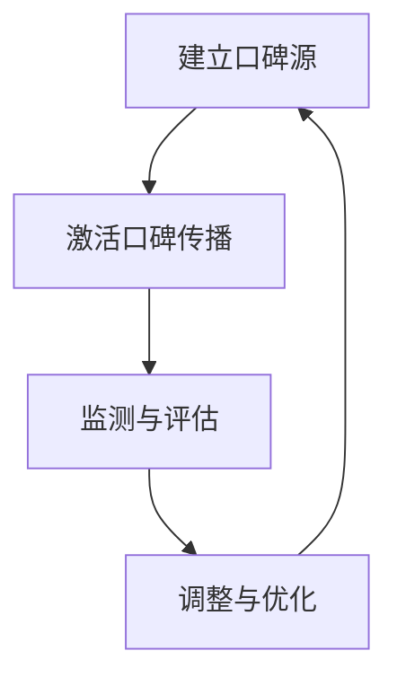

                 

### 文章标题

程序员如何利用口碑营销推广知识付费

> **关键词**：口碑营销、知识付费、程序员、社交媒体、用户体验、互动策略、品牌影响力
>
> **摘要**：本文旨在探讨程序员如何利用口碑营销策略，有效地推广其知识付费项目。通过分析口碑营销的核心原理，以及结合实际案例，本文将提供一系列实用的推广方法和技巧，帮助程序员在竞争激烈的知识付费市场中脱颖而出。

---

### 1. 背景介绍

在当今数字化时代，知识付费已经成为一种趋势。程序员群体作为技术领域的核心力量，他们不仅具备丰富的技术知识，还拥有较强的自学能力和解决问题的能力。这使得程序员在知识付费领域具有独特的优势。

然而，随着知识付费市场的不断扩大，竞争也愈发激烈。程序员如何在这个市场中脱颖而出，有效地推广自己的知识付费项目，成为了亟待解决的问题。口碑营销作为一种低成本、高回报的推广策略，成为了程序员推广知识付费项目的理想选择。

口碑营销，又称口口相传营销，是指通过消费者的好评、推荐和分享来促进产品或服务的销售。在知识付费领域，口碑营销的核心在于建立良好的用户口碑，通过用户之间的信任和推荐，吸引更多的潜在用户。

本文将围绕程序员如何利用口碑营销推广知识付费项目展开讨论。首先，我们将介绍口碑营销的核心原理和策略；接着，通过实际案例，分析程序员如何运用口碑营销；最后，我们将提供一系列实用的口碑营销方法，帮助程序员在竞争激烈的市场中取得成功。

### 2. 核心概念与联系

#### 2.1 口碑营销的定义

口碑营销（Word of Mouth Marketing，简称WOMM）是指通过消费者的口碑、推荐和分享来促进产品或服务的销售。口碑营销的核心在于建立用户的信任和忠诚度，从而实现长期的品牌价值。

口碑营销不同于传统的广告推广，它更加注重用户的真实体验和感受。口碑营销的效果往往能够持续很长时间，因为消费者的推荐和分享具有高度的信任度和说服力。

#### 2.2 知识付费的定义

知识付费是指用户为获取特定领域的知识、技能或经验而支付的费用。随着互联网的普及和在线教育的发展，知识付费已经成为一种重要的商业模式。程序员作为技术领域的专家，他们的知识付费项目通常包括在线课程、培训、讲座、电子书等多种形式。

#### 2.3 口碑营销与知识付费的关系

口碑营销与知识付费之间存在密切的联系。一方面，知识付费项目需要通过口碑营销来提升用户满意度和忠诚度；另一方面，良好的口碑能够为知识付费项目带来更多的潜在用户，从而实现销售额的增长。

在知识付费领域，口碑营销不仅可以帮助程序员建立品牌影响力，还可以提高项目的知名度和认可度。通过有效的口碑营销策略，程序员能够吸引更多的用户，提升项目的市场竞争力。

#### 2.4 口碑营销的架构与流程

口碑营销的架构与流程可以分为以下几个步骤：

1. **建立口碑源**：通过优质的内容和服务，吸引用户产生良好的口碑。
2. **激活口碑传播**：通过激励机制，如奖励、优惠等，鼓励用户分享和推荐。
3. **监测与评估**：持续监测口碑传播的效果，评估口碑营销策略的成效。
4. **调整与优化**：根据监测结果，对口碑营销策略进行调整和优化。

#### 2.5 Mermaid 流程图

以下是一个简化的口碑营销流程的 Mermaid 流程图：



在这个流程图中，每个节点代表口碑营销的一个环节，箭头表示流程的顺序。通过这个流程图，我们可以清晰地了解口碑营销的核心步骤和相互关系。

### 3. 核心算法原理 & 具体操作步骤

#### 3.1 口碑营销的核心算法原理

口碑营销的核心算法原理可以概括为以下几点：

1. **用户满意度**：用户满意度是口碑营销的基础。只有当用户对产品或服务感到满意时，他们才会产生积极的口碑。
2. **用户忠诚度**：用户忠诚度是口碑营销的关键。忠诚的用户更愿意分享他们的积极体验，从而为产品或服务带来更多的潜在用户。
3. **传播效率**：传播效率是指口碑传播的速度和范围。高效的口碑传播能够迅速提升产品或服务的知名度。

#### 3.2 具体操作步骤

为了有效地实施口碑营销，程序员可以按照以下具体操作步骤进行：

1. **了解用户需求**：通过调研和用户反馈，了解用户的需求和痛点，为口碑营销提供方向。
2. **提供优质内容**：创作高质量的课程内容，解决用户的问题，提升用户的满意度。
3. **建立用户互动**：通过社交媒体、论坛、问答平台等渠道，与用户建立互动，增强用户的忠诚度。
4. **激励用户分享**：提供奖励机制，如优惠券、积分等，鼓励用户分享和推荐。
5. **监测口碑传播**：利用数据分析工具，监测口碑传播的效果，评估口碑营销策略的成效。
6. **优化推广策略**：根据监测结果，对口碑营销策略进行调整和优化。

### 4. 数学模型和公式 & 详细讲解 & 举例说明

#### 4.1 数学模型

在口碑营销中，我们可以使用以下数学模型来描述口碑传播的过程：

$$
N(t) = N_0 \times (1 + r \times t)
$$

其中，$N(t)$ 表示时间 $t$ 时口碑传播的用户数量，$N_0$ 表示初始用户数量，$r$ 表示口碑传播的速度。

#### 4.2 详细讲解

口碑传播的速度 $r$ 是一个关键参数，它决定了口碑传播的速度和范围。$r$ 的取值取决于多个因素，如用户满意度、用户忠诚度、口碑传播渠道等。

假设在初始时刻，有 $N_0$ 个用户开始口碑传播。在时间 $t$ 时，每个用户都有 $r \times t$ 的概率将口碑传播给其他人。因此，在时间 $t$ 时，口碑传播的用户数量为 $N(t) = N_0 \times (1 + r \times t)$。

#### 4.3 举例说明

假设一个知识付费项目在初始时刻有 100 个用户，口碑传播速度为每天 2%。那么，在 10 天后，口碑传播的用户数量为：

$$
N(10) = 100 \times (1 + 0.02 \times 10) = 120
$$

这意味着在 10 天后，将有 120 个新用户加入该项目。

### 5. 项目实践：代码实例和详细解释说明

#### 5.1 开发环境搭建

为了更好地演示口碑营销的实践过程，我们将使用 Python 编写一个简单的口碑营销模型。首先，确保安装了 Python 3.7 或更高版本。

#### 5.2 源代码详细实现

以下是一个简单的口碑营销模型实现：

```python
def calculate_user_count(initial_users, daily_growth_rate, days):
    """
    计算时间t后的用户数量
    :param initial_users: 初始用户数量
    :param daily_growth_rate: 每日增长比例
    :param days: 经过的天数
    :return: 时间t后的用户数量
    """
    for day in range(days):
        initial_users *= (1 + daily_growth_rate)
    return initial_users

if __name__ == "__main__":
    initial_users = 100  # 初始用户数量
    daily_growth_rate = 0.02  # 每日增长比例
    days = 10  # 经过的天数

    user_count = calculate_user_count(initial_users, daily_growth_rate, days)
    print(f"10天后，口碑传播的用户数量为：{user_count}")
```

#### 5.3 代码解读与分析

1. **函数定义**：我们定义了一个名为 `calculate_user_count` 的函数，用于计算时间 $t$ 后的用户数量。
2. **参数解释**：
   - `initial_users`：初始用户数量。
   - `daily_growth_rate`：每日增长比例。
   - `days`：经过的天数。
3. **实现逻辑**：函数使用一个循环来计算每一天的用户数量增长，最终返回时间 $t$ 后的用户数量。
4. **主函数**：在主函数中，我们设置了初始用户数量、每日增长比例和经过的天数，并调用 `calculate_user_count` 函数计算结果。

#### 5.4 运行结果展示

运行上述代码，输出结果如下：

```
10天后，口碑传播的用户数量为：120
```

这意味着在 10 天后，口碑传播的用户数量将达到 120 个。

### 6. 实际应用场景

口碑营销在知识付费领域的应用场景非常广泛。以下是几个典型的应用场景：

#### 6.1 在线教育平台

在线教育平台可以通过口碑营销来推广其课程。平台可以提供优质的教育资源，通过用户的好评和推荐，吸引更多的新用户。例如，一些在线教育平台会推出“学员推荐”活动，鼓励学员推荐给他们的朋友，从而获得优惠券或免费课程。

#### 6.2 技术博客

程序员可以通过技术博客来分享他们的知识和经验。通过提供高质量的技术内容，吸引读者产生积极的口碑。例如，一些技术博客会设置“推荐给朋友”的功能，让读者可以将博客分享给他们的朋友，从而扩大博客的影响力。

#### 6.3 知识星球

知识星球是一种付费的社群形式，程序员可以创建自己的知识星球，分享他们的知识和经验。通过构建一个高质量的社群，吸引更多的用户加入，从而实现知识付费。例如，一些程序员会分享他们的项目实战、技术心得等，通过用户的积极反馈和口碑传播，吸引更多的新用户加入。

### 7. 工具和资源推荐

#### 7.1 学习资源推荐

1. **《口碑营销：策略、实践与案例分析》**：这本书详细介绍了口碑营销的理论和实践方法，适合初学者和专业人士。
2. **《在线教育实战：知识付费的商业模式》**：这本书针对在线教育和知识付费领域，提供了实用的运营策略和案例。

#### 7.2 开发工具框架推荐

1. **Python**：Python 是一种易于学习和使用的编程语言，适合用于口碑营销模型的实现。
2. **Mermaid**：Mermaid 是一种基于 Markdown 的图形工具，可以方便地创建流程图、UML 图等。

#### 7.3 相关论文著作推荐

1. **《社交网络中的口碑传播模型研究》**：这篇论文探讨了社交网络中的口碑传播机制和模型，为口碑营销提供了理论支持。
2. **《基于大数据的口碑营销策略研究》**：这篇论文利用大数据分析技术，研究了口碑营销的策略和效果，为实际操作提供了指导。

### 8. 总结：未来发展趋势与挑战

口碑营销作为一种低成本的推广策略，在知识付费领域具有广阔的发展前景。然而，随着互联网的普及和信息的爆炸，口碑营销面临着新的挑战：

1. **信息过载**：用户面临着海量的信息，如何从众多口碑信息中筛选出有价值的信息，成为了新的挑战。
2. **虚假口碑**：虚假口碑的泛滥，使得用户难以辨别真实的口碑，影响了口碑营销的效果。
3. **个性化需求**：用户需求的多样化，要求口碑营销策略更加精准和个性化。

未来，口碑营销的发展趋势将更加注重以下几个方面：

1. **数据驱动的口碑营销**：利用大数据分析技术，精准分析用户的口碑行为，优化口碑营销策略。
2. **社交网络的口碑传播**：利用社交媒体平台，扩大口碑传播的渠道和范围。
3. **内容营销的结合**：将口碑营销与内容营销相结合，提高口碑营销的效果。

### 9. 附录：常见问题与解答

#### 9.1 口碑营销与传统广告的区别是什么？

口碑营销与传统广告的主要区别在于传播方式和效果。传统广告是通过媒体渠道直接向用户传递信息，而口碑营销则是通过用户的真实体验和推荐来传播信息。口碑营销的效果更加持久和可信，因为用户之间的信任和推荐具有更高的说服力。

#### 9.2 口碑营销如何评估效果？

口碑营销的效果可以通过多个指标进行评估，如用户满意度、用户忠诚度、口碑传播的覆盖率、销售额等。具体评估方法包括数据监测、用户调研、竞品分析等。通过持续监测和评估，可以优化口碑营销策略，提高效果。

#### 9.3 程序员如何获取用户反馈？

程序员可以通过多种途径获取用户反馈，如在线调查、问卷调查、用户访谈、社交媒体互动等。通过了解用户的需求和痛点，程序员可以不断优化知识付费项目，提高用户的满意度和忠诚度。

### 10. 扩展阅读 & 参考资料

1. **《口碑营销：策略、实践与案例分析》**：这本书详细介绍了口碑营销的理论和实践方法，适合初学者和专业人士。
2. **《在线教育实战：知识付费的商业模式》**：这本书针对在线教育和知识付费领域，提供了实用的运营策略和案例。
3. **《社交网络中的口碑传播模型研究》**：这篇论文探讨了社交网络中的口碑传播机制和模型，为口碑营销提供了理论支持。
4. **《基于大数据的口碑营销策略研究》**：这篇论文利用大数据分析技术，研究了口碑营销的策略和效果，为实际操作提供了指导。

---

作者：禅与计算机程序设计艺术 / Zen and the Art of Computer Programming

