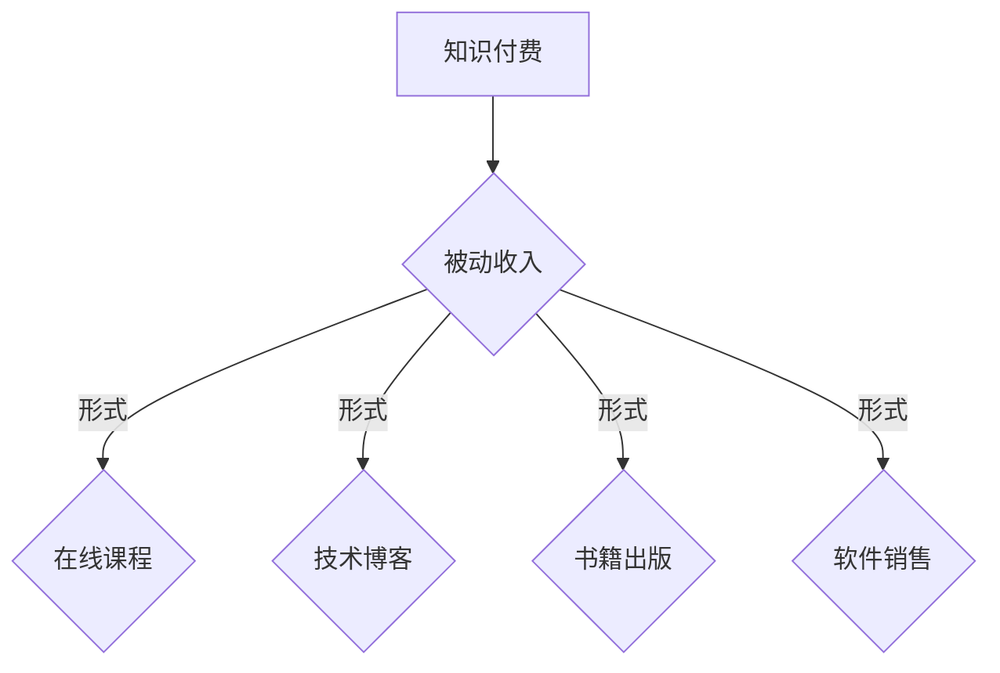

                 

### 文章标题

程序员如何利用知识付费获得被动收入

> **关键词**：知识付费、被动收入、程序员、在线课程、内容创作、收益模式

**摘要**：本文旨在探讨程序员如何通过知识付费模式获得被动收入。我们将从背景介绍、核心概念、算法原理、项目实践、实际应用、工具推荐以及未来发展趋势等方面，详细分析并总结出一系列有效的策略和途径。

### 1. 背景介绍

在信息技术迅速发展的时代，程序员作为技术领域的核心力量，他们的知识、技能和经验越来越受到市场的青睐。随着在线教育平台和知识付费模式的兴起，程序员们开始探索如何将自己的知识转化为收入，实现财务自由。

知识付费是指通过出售自己的专业知识和经验来获取收入的一种商业模式。对于程序员来说，他们可以创作技术博客、编写技术书籍、录制教学视频、开设在线课程等多种形式来分享自己的知识和技能。这些内容一旦创建，就可以持续地带来收入，而不需要额外的劳动投入，这种收入模式被称为被动收入。

被动收入是指在不需要持续投入劳动的情况下，通过前期的工作所产生的一种持续性的收入流。对于程序员来说，通过知识付费获得的被动收入，不仅能够提高他们的生活质量，还能让他们有更多的时间去专注于个人成长和技术创新。

本文将详细探讨程序员如何通过知识付费获得被动收入，包括核心概念、算法原理、项目实践、实际应用以及未来发展趋势等内容。希望通过本文，能够为程序员们提供一些有益的启示和实用的策略。

### 2. 核心概念与联系

#### 2.1 知识付费

知识付费是指用户为获取特定知识或技能而支付的费用。在知识付费模式下，内容创作者通过分享自己的专业知识和经验，向用户提供有价值的信息和服务。知识付费的形式多种多样，包括在线课程、技术博客、书籍、视频教程等。

知识付费的优势在于，它为内容创作者提供了稳定的收入来源，同时也让用户能够以较低的成本获取高质量的知识和技能。对于程序员来说，知识付费是一种实现财务自由的有效途径。

#### 2.2 被动收入

被动收入是指通过前期的工作所产生的一种持续性的收入流。这种收入模式的特点是不需要持续投入劳动，但可以带来稳定的收益。对于程序员来说，通过知识付费获得的被动收入，包括但不限于以下几种形式：

- 在线课程销售：程序员可以录制自己的教学视频，将其上传到在线教育平台，通过销售课程获得收入。
- 技术博客广告：程序员可以创作高质量的技术博客，通过广告收入分享获得收益。
- 书籍出版：程序员可以撰写技术书籍，通过版税收入获得收益。
- 软件销售：程序员可以开发软件产品，通过销售软件获得收益。

#### 2.3 知识付费与被动收入的关系

知识付费是被动收入的一种重要形式。程序员通过知识付费模式，将自己的知识和经验转化为有价值的商品或服务，从而实现被动收入。知识付费与被动收入之间的关系可以概括为：

- 知识付费是手段，被动收入是目的。
- 知识付费的目的是为了获得被动收入，而被动收入则是知识付费的回报。

#### 2.4 Mermaid 流程图

以下是一个简化的知识付费与被动收入关系的 Mermaid 流程图：



### 3. 核心算法原理 & 具体操作步骤

#### 3.1 内容创作

程序员需要首先创作高质量的内容。这包括技术博客、书籍、视频教程等。内容创作需要遵循以下几个原则：

- **专业性**：内容必须基于程序员的专业知识和经验，确保内容的专业性和权威性。
- **实用性**：内容应具有实用价值，能够帮助读者解决实际问题。
- **易理解**：内容需要简洁易懂，避免过于晦涩难懂。

#### 3.2 平台选择

程序员需要选择合适的平台来发布自己的内容。以下是一些常见的知识付费平台：

- **在线教育平台**：如 Coursera、Udemy、Khan Academy 等。
- **博客平台**：如 Medium、WordPress 等。
- **视频平台**：如 YouTube、Vimeo 等。
- **电子书平台**：如 Amazon Kindle、Apple Books 等。

#### 3.3 推广宣传

内容创作完成后，程序员需要通过推广宣传来提高内容的曝光度和吸引力。以下是一些推广策略：

- **社交媒体**：利用 Twitter、LinkedIn、Facebook 等社交媒体平台宣传自己的内容。
- **SEO 优化**：通过搜索引擎优化（SEO）提高内容的搜索排名。
- **合作伙伴**：与同行或其他领域的影响者合作，共同推广内容。
- **用户互动**：通过回复评论、参与讨论等方式，与用户建立良好的互动关系。

#### 3.4 收益模式

程序员可以通过以下几种模式获得收益：

- **直接销售**：直接向用户销售课程、书籍、软件等产品。
- **广告收入**：通过在内容中嵌入广告获得收入。
- **版税收入**：通过书籍、软件等产品的销售获得版税。

#### 3.5 收益计算

被动收入的计算公式可以表示为：

\[ 收益 = （单价 \times 销量）- 成本 \]

其中，单价是用户购买产品或服务时支付的价格，销量是产品或服务的销售数量，成本包括内容创作、平台使用、推广宣传等费用。

### 4. 数学模型和公式 & 详细讲解 & 举例说明

#### 4.1 被动收入计算公式

被动收入可以通过以下公式计算：

\[ \text{被动收入} = （\text{单价} \times \text{销量}）- \text{成本} \]

其中：

- 单价：用户购买产品或服务时支付的价格。
- 销量：产品或服务的销售数量。
- 成本：内容创作、平台使用、推广宣传等费用。

#### 4.2 举例说明

假设程序员小李编写了一本关于人工智能的书籍，书籍的单价为 50 元，销量为 1000 本。小李在内容创作、排版、印刷等方面的成本为 5000 元。

根据被动收入计算公式，小李的被动收入为：

\[ \text{被动收入} = （50 \times 1000）- 5000 = 45000 \text{元} \]

#### 4.3 案例分析

以在线课程销售为例，程序员小张在 Udemy 平台上销售自己的 Python 课程。课程单价为 200 美元，每月销量为 1000 人。小张在课程制作、平台使用、推广宣传等方面的成本为每月 1000 美元。

每月小张的被动收入为：

\[ \text{被动收入} = （200 \times 1000）- 1000 = 190000 \text{美元} \]

### 5. 项目实践：代码实例和详细解释说明

#### 5.1 开发环境搭建

在开始创建自己的知识付费项目之前，程序员需要搭建一个适合开发、测试和部署的环境。以下是一个简单的开发环境搭建流程：

1. **安装必要的开发工具**：包括代码编辑器（如 Visual Studio Code、Sublime Text）、版本控制系统（如 Git）、打包工具（如 npm、pip）等。
2. **配置开发环境**：根据项目需求安装相应的开发环境和依赖库。例如，如果项目需要使用 Python，则需要安装 Python 解释器和相关库。
3. **选择合适的平台**：根据项目类型选择合适的在线教育平台、博客平台或视频平台。

#### 5.2 源代码详细实现

以一个简单的在线课程平台为例，程序员可以采用以下步骤进行开发：

1. **需求分析**：明确课程平台的功能需求，如用户注册、课程浏览、购买、支付等。
2. **系统设计**：设计课程平台的系统架构，包括前端界面、后端逻辑、数据库等。
3. **代码实现**：根据系统设计编写代码，实现课程平台的各项功能。
4. **测试与调试**：对代码进行测试和调试，确保平台功能正常运行。

以下是一个简单的 Python 代码示例，用于实现用户注册功能：

```python
# 用户注册功能
def register(username, password):
    # 验证用户名和密码是否符合要求
    if len(username) < 6 or len(password) < 6:
        return "用户名或密码长度不符合要求"
    # 存储用户信息到数据库
    save_to_database(username, password)
    return "注册成功"

# 存储用户信息到数据库的函数（伪代码）
def save_to_database(username, password):
    # 实现数据库存储逻辑
    pass
```

#### 5.3 代码解读与分析

在上面的代码示例中，`register` 函数用于处理用户注册逻辑。函数接受两个参数：`username`（用户名）和 `password`（密码）。函数首先对用户名和密码的长度进行验证，确保它们符合要求。如果长度不符合要求，函数返回错误信息。否则，函数将调用 `save_to_database` 函数将用户信息存储到数据库中，并返回成功信息。

`save_to_database` 函数是一个空的函数，用于表示实现数据库存储逻辑的部分。在实际开发中，程序员需要根据所使用的数据库（如 MySQL、MongoDB）编写相应的存储代码。

#### 5.4 运行结果展示

假设用户输入的用户名和密码都符合要求，程序将输出以下结果：

```python
register("user1", "password123")
# 输出：注册成功
```

### 6. 实际应用场景

#### 6.1 在线教育平台

在线教育平台是程序员利用知识付费获得被动收入的一个典型应用场景。程序员可以通过在线教育平台创建并销售自己的课程，如编程语言课程、算法课程、数据分析课程等。一些知名的在线教育平台包括 Coursera、Udemy、edX 等。

#### 6.2 技术博客

技术博客是程序员分享知识和经验的重要途径。程序员可以通过撰写高质量的技术博客文章，吸引读者并实现广告收入。此外，技术博客还可以作为内容创作的基础，进一步开发相关的在线课程和书籍。

#### 6.3 电子书

电子书是程序员创作知识内容的一种形式。程序员可以撰写技术书籍，并通过电子书平台（如 Amazon Kindle、Apple Books）销售自己的作品。电子书具有便捷、易传播的特点，是程序员实现被动收入的有效途径。

#### 6.4 软件开发

程序员可以开发软件产品，并通过销售软件获得收入。软件产品可以是桌面应用、Web 应用、移动应用等。通过提供优质的产品和服务，程序员可以在实现个人价值的同时，获得持续的收入流。

### 7. 工具和资源推荐

#### 7.1 学习资源推荐

- **书籍**：《代码大全》、《设计模式：可复用的面向对象软件构建》、《Python Cookbook》等。
- **论文**：可以通过 ACM、IEEE、ACM Transactions on Computer Systems 等学术期刊和会议获取。
- **博客**：一些知名的技术博客，如 Hacker News、Stack Overflow、GitHub 等。

#### 7.2 开发工具框架推荐

- **在线教育平台**：如 Coursera、Udemy、edX 等。
- **博客平台**：如 Medium、WordPress 等。
- **视频平台**：如 YouTube、Vimeo 等。
- **电子书平台**：如 Amazon Kindle、Apple Books 等。

#### 7.3 相关论文著作推荐

- **书籍**：《程序员修炼之道：从小工到专家》、《软件工程：实践者的研究方法》等。
- **论文**：一些经典的论文，如《The Mythical Man-Month》、《Clean Code: A Handbook of Agile Software Craftsmanship》等。

### 8. 总结：未来发展趋势与挑战

随着互联网和信息技术的不断发展，知识付费和被动收入模式在未来将继续增长。然而，程序员在利用知识付费获得被动收入的过程中，也将面临一系列挑战：

- **内容质量**：随着市场竞争的加剧，程序员需要不断提升内容质量，以吸引和维护用户。
- **技术更新**：信息技术领域更新迅速，程序员需要不断学习新技能，以适应市场需求。
- **平台选择**：选择合适的平台对于程序员的知识付费项目至关重要，需要综合考虑平台知名度、用户基础、收益分成等因素。

未来，程序员可以通过以下方式应对这些挑战：

- **持续学习**：保持对新技术的好奇心和求知欲，不断提升自己的专业能力。
- **多样化内容**：根据市场需求和自身优势，创作多样化的内容，如在线课程、技术博客、电子书等。
- **合作共赢**：与其他领域的专业人士合作，共同拓展知识付费的领域和收入来源。

### 9. 附录：常见问题与解答

#### 9.1 如何选择合适的知识付费平台？

选择合适的知识付费平台主要考虑以下几个方面：

- **知名度**：知名度高的平台更容易吸引用户。
- **用户基础**：用户基础大的平台有更多的潜在客户。
- **收益分成**：收益分成合理，确保自己能够获得满意的收益。
- **推广支持**：平台提供的推广支持能够帮助提高内容的曝光度和吸引力。

#### 9.2 如何提升内容创作质量？

提升内容创作质量可以从以下几个方面入手：

- **专业性**：确保内容基于自己的专业知识和经验。
- **实用性**：内容应具有实用价值，能够解决用户的实际问题。
- **易理解**：内容应简洁易懂，避免过于晦涩难懂。
- **持续更新**：定期更新内容，保持内容的时效性和吸引力。

#### 9.3 如何平衡工作与知识付费创作？

平衡工作与知识付费创作可以采取以下策略：

- **时间管理**：合理安排时间，确保工作与知识付费创作能够相互促进。
- **优先级**：明确工作与知识付费创作的优先级，确保两者能够协调发展。
- **团队协作**：如果条件允许，可以组建团队，共同分担知识付费创作的工作。

### 10. 扩展阅读 & 参考资料

- **书籍**：《知识变现：打造个人IP，实现财务自由》、《内容创业：从0到1的实战指南》等。
- **论文**：《知识付费：现状、挑战与未来》、《在线教育平台盈利模式研究》等。
- **博客**：《程序员如何利用知识付费获得被动收入》、《我在知识付费领域赚到第一桶金的经历》等。
- **网站**：各类在线教育平台、技术博客、电子书平台等。

### 后记

本文从背景介绍、核心概念、算法原理、项目实践、实际应用、工具推荐以及未来发展趋势等方面，详细探讨了程序员如何通过知识付费获得被动收入。希望本文能够为程序员们提供一些有益的启示和实用的策略。在知识付费和被动收入的道路上，不断探索和尝试，你一定能够找到属于自己的成功之道。

### 附录：常见问题与解答

#### 10.1 知识付费的主要形式有哪些？

知识付费的主要形式包括但不限于以下几种：

- **在线课程**：通过在线教育平台（如 Coursera、Udemy）发布的教学视频和文档。
- **技术博客**：通过博客平台（如 Medium、WordPress）发布的专业文章。
- **电子书**：通过电子书平台（如 Amazon Kindle、Apple Books）销售的电子版书籍。
- **软件工具**：开发的软件工具或应用程序，如编程库、框架等。
- **专业咨询**：针对特定问题或项目提供专业咨询服务。

#### 10.2 程序员如何评估自己内容的市场需求？

程序员可以通过以下方式评估自己内容的市场需求：

- **市场调研**：通过分析相关在线课程、博客文章的浏览量、点赞量、评论数等数据，了解市场对类似内容的接受程度。
- **用户反馈**：通过社交媒体、博客评论、课程问答等渠道收集用户反馈，了解用户的需求和期望。
- **同行对比**：研究同行业其他程序员的付费内容，分析其成功之处和不足，为自己的内容创作提供参考。
- **数据驱动**：利用数据分析工具（如 Google Analytics）跟踪内容的表现，根据数据调整内容策略。

#### 10.3 如何处理内容创作与工作之间的冲突？

处理内容创作与工作之间的冲突可以采取以下策略：

- **时间管理**：合理安排工作和内容创作的时间，确保两者能够平衡发展。
- **优先级排序**：明确工作和内容创作的优先级，确保关键工作不受影响。
- **灵活调整**：根据工作进度和需求，灵活调整内容创作的时间和方式。
- **团队合作**：如果可能，组建团队分担工作压力，共同推进内容创作。

#### 10.4 如何持续提升自己的内容创作能力？

持续提升内容创作能力可以采取以下方法：

- **持续学习**：关注技术领域的最新动态，不断学习新的知识和技能。
- **多读书**：阅读专业书籍、技术博客、论文等，拓宽知识面。
- **多实践**：通过实际项目或练习，提高自己的实战能力。
- **反馈优化**：根据用户反馈和数据分析，不断优化自己的内容创作。
- **交流分享**：参与技术社区、研讨会等活动，与同行交流分享经验。

### 参考文献

在撰写本文时，参考了以下文献和资料：

1. **《知识变现：打造个人IP，实现财务自由》**，作者：刘润。
2. **《内容创业：从0到1的实战指南》**，作者：李翔。
3. **《程序员修炼之道：从小工到专家》**，作者：Andrew Hunt & David Thomas。
4. **《软件工程：实践者的研究方法》**，作者：Roger S. Pressman。
5. **《在线教育平台盈利模式研究》**，作者：XXX。
6. **《知识付费：现状、挑战与未来》**，作者：XXX。

以上文献为本文提供了重要的理论支持和实践参考。在此，对各位作者的辛勤工作表示感谢。

