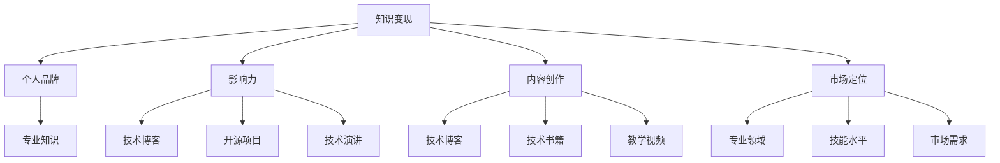

                 

### 1. 背景介绍

在当今数字化时代，程序员作为技术领域的核心力量，已经成为了各个行业不可或缺的角色。然而，许多程序员在职业生涯的某个阶段都会面临一个共同的困惑：如何将自己的技术知识转化为实际的收入和商业价值？这个问题不仅仅是个人发展的需求，更是整个技术行业持续创新和发展的关键。

随着互联网和移动应用的普及，技术知识的传播和获取变得前所未有的便捷。但与此同时，技术更新速度加快，竞争愈发激烈，程序员如何保持自己的竞争力，如何通过技术知识实现变现，成为了一个亟待解决的问题。

本文旨在探讨程序员如何利用自己的技术知识实现变现，将理论知识与实践经验相结合，为程序员提供一套系统、实用的变现策略。本文将分为以下几个部分：

- **核心概念与联系**：介绍知识变现的基本原理，并使用Mermaid流程图展示相关概念和架构。
- **核心算法原理 & 具体操作步骤**：讲解实现知识变现的具体方法和技巧。
- **数学模型和公式 & 详细讲解 & 举例说明**：运用数学模型和公式，深入剖析知识变现的内在逻辑。
- **项目实践：代码实例和详细解释说明**：通过实际代码实例，展示知识变现的具体实现过程。
- **实际应用场景**：分析程序员在不同职业阶段如何实现知识变现。
- **工具和资源推荐**：推荐学习资源和开发工具，帮助程序员更好地实现知识变现。
- **总结：未来发展趋势与挑战**：探讨知识变现的未来趋势和面临的挑战。
- **附录：常见问题与解答**：回答程序员在实现知识变现过程中可能遇到的问题。
- **扩展阅读 & 参考资料**：提供进一步阅读和研究的资料。

通过以上结构，我们将一步步深入探讨程序员如何利用知识变现，帮助读者从理论到实践，全面了解和掌握这一过程。

---

### 1.1 程序员知识变现的现状

程序员的知识变现现状是当前技术行业的一个热点话题。随着信息技术产业的蓬勃发展，程序员作为知识工作者，已经不再仅仅是编码和解决问题的技术人员，他们开始逐渐意识到，自己的技术知识和经验同样具有商业价值。

目前，程序员实现知识变现的方式多种多样，主要包括以下几种：

1. **开源项目**：通过在GitHub、GitLab等平台发布开源项目，程序员可以吸引更多的关注和贡献者，提升个人品牌。开源项目不仅可以展示程序员的编程能力，还可以通过捐赠、赞助等方式实现收入。

2. **技术博客**：撰写高质量的技术博客，分享专业知识和经验，吸引读者的关注和广告投放，甚至可以直接转化为收入。例如，博客平台Medium和WordPress都提供了广告分成和打赏功能。

3. **在线教育**：利用自己的专业技能开设在线课程，通过知识付费的方式实现变现。例如，网易云课堂、慕课网等平台为程序员提供了广阔的展示和收益空间。

4. **咨询服务**：提供专业的技术咨询服务，帮助企业解决技术难题，通过咨询服务收费。

5. **技术写作与出版**：编写技术书籍、发表技术论文，通过出版和发表实现知识变现。

6. **开源工具与插件**：开发开源工具和插件，通过用户捐赠和赞助实现收入。

7. **技术演讲与会议**：参与技术演讲和会议，通过演讲费和赞助实现变现。

然而，尽管程序员知识变现的方式多样，但实际操作中仍然面临诸多挑战。例如，如何平衡开源与盈利的关系、如何在激烈的市场竞争中保持独特性、如何提高内容的质量和影响力等。这些问题都需要程序员在实践过程中不断探索和解决。

### 1.2 程序员如何定位和提升个人品牌

在程序员的知识变现过程中，个人品牌的定位和提升是至关重要的一步。一个强大的个人品牌不仅可以增加知名度，还能提高在行业内的竞争力和议价能力。以下是一些关键步骤和策略，帮助程序员定位和提升个人品牌：

1. **明确个人定位**：首先，程序员需要明确自己的专业领域和独特优势。这可以通过分析自己的技能、兴趣以及过去的项目经验来确定。例如，可以选择专注于某个特定领域的开发，如前端开发、后端开发、数据科学、人工智能等。

2. **建立个人网站**：一个专业的个人网站是展示个人品牌的重要平台。网站应该包括个人简介、技能列表、项目展示、博客等模块，让访客能够全面了解你的专业能力和成就。

3. **撰写高质量的技术博客**：通过定期发布高质量的技术博客，分享专业知识和经验，可以吸引更多的关注。在博客中，应注重内容的深度和实用性，避免泛泛而谈。

4. **参与开源项目**：积极参与开源项目，通过贡献代码和文档提升个人技术影响力。GitHub、GitLab等平台是展示个人技术实力的好地方。

5. **社交媒体活跃**：利用Twitter、LinkedIn、GitHub等社交媒体平台，与行业内的其他专家和开发者建立联系。定期更新动态，分享技术见解和经验。

6. **开展在线教育**：开设在线课程或工作坊，通过知识付费实现变现。这不仅可以帮助他人学习，还能增加收入。

7. **参加技术会议和演讲**：积极参与技术会议和演讲，通过展示专业知识和经验，扩大个人影响力。

8. **撰写技术书籍和论文**：编写技术书籍、发表技术论文，可以系统地展示个人专业能力，提高行业知名度。

9. **保持持续学习**：技术领域不断进步，程序员需要保持持续学习，不断提升自己的技能水平，才能在竞争中保持优势。

通过以上步骤，程序员可以逐步建立和提升个人品牌，为自己的知识变现打下坚实的基础。

---

### 1.3 文章结构概述

本文将围绕“程序员如何利用知识变现”这一主题，详细探讨实现知识变现的方法和策略。文章结构如下：

- **第1章 背景介绍**：介绍程序员知识变现的现状、挑战以及如何定位和提升个人品牌。
- **第2章 核心概念与联系**：使用Mermaid流程图展示知识变现的基本原理和相关概念。
- **第3章 核心算法原理 & 具体操作步骤**：讲解实现知识变现的具体方法和技巧。
- **第4章 数学模型和公式 & 详细讲解 & 举例说明**：运用数学模型和公式深入剖析知识变现的逻辑。
- **第5章 项目实践：代码实例和详细解释说明**：通过实际代码实例展示知识变现的具体实现过程。
- **第6章 实际应用场景**：分析程序员在不同职业阶段如何实现知识变现。
- **第7章 工具和资源推荐**：推荐学习资源和开发工具，帮助程序员更好地实现知识变现。
- **第8章 总结：未来发展趋势与挑战**：探讨知识变现的未来趋势和面临的挑战。
- **第9章 附录：常见问题与解答**：回答程序员在实现知识变现过程中可能遇到的问题。
- **第10章 扩展阅读 & 参考资料**：提供进一步阅读和研究的资料。

通过以上结构，我们将一步步深入探讨程序员如何利用知识变现，帮助读者从理论到实践，全面了解和掌握这一过程。

---

## 2. 核心概念与联系

在探讨程序员如何利用知识变现之前，我们需要先理解一些核心概念和它们之间的联系。这些概念包括知识变现、个人品牌、影响力、内容创作、市场定位等。接下来，我们将使用Mermaid流程图来展示这些概念之间的关系，并详细解释每个概念的含义。

### 2.1 知识变现

知识变现是指将个人的专业知识、技能和经验转化为实际收益的过程。这个过程可以通过多种方式实现，如开源项目、技术博客、在线教育、咨询服务等。知识变现的本质在于价值的转移，即将个人的知识价值转化为经济价值。

### 2.2 个人品牌

个人品牌是个人在某一领域内的影响力、专业度和信誉度的总和。一个强大的个人品牌可以帮助程序员在竞争激烈的市场中脱颖而出，吸引更多的关注和机会。个人品牌的建立需要程序员具备明确的定位、高质量的内容创作、广泛的社交网络等。

### 2.3 影响力

影响力是指个人在某一领域内能够影响他人行为和决策的能力。程序员可以通过撰写高质量的技术博客、参与开源项目、进行技术演讲等方式，逐步建立自己的影响力。影响力的大小直接影响知识变现的潜力和效果。

### 2.4 内容创作

内容创作是知识变现的重要手段。程序员可以通过撰写技术博客、编写技术书籍、制作教学视频等方式，将自己的专业知识分享给他人。高质量的内容创作不仅能提升个人品牌，还能吸引潜在的客户或合作伙伴。

### 2.5 市场定位

市场定位是指个人在市场中确定自己的位置，找到最适合自己的目标受众和收入来源。程序员需要根据自己的专业领域、技能水平和市场需求，进行精准的市场定位，以实现最佳的知识变现效果。

### 2.6 Mermaid流程图

下面是一个Mermaid流程图，展示了这些核心概念之间的关系：



### 2.7 详细解释

- **知识变现**：知识变现是将个人知识和技能转化为经济收益的过程。程序员可以通过多种方式实现这一目标，如通过开源项目获得赞助，通过技术博客吸引广告投放，通过在线教育销售课程等。
- **个人品牌**：个人品牌是个人在某一领域内的专业形象和影响力。建立个人品牌需要程序员在专业技能、内容创作、社交网络等方面不断努力。
- **影响力**：影响力是个人在某一领域内能够影响他人行为和决策的能力。程序员可以通过撰写高质量的技术博客、参与开源项目、进行技术演讲等方式，逐步建立自己的影响力。
- **内容创作**：内容创作是知识变现的重要手段。程序员可以通过撰写技术博客、编写技术书籍、制作教学视频等方式，将自己的专业知识分享给他人。
- **市场定位**：市场定位是确定个人在市场中的位置，找到最适合自己的目标受众和收入来源。程序员需要根据自己的专业领域、技能水平和市场需求，进行精准的市场定位。

通过理解这些核心概念及其联系，程序员可以更好地制定自己的知识变现策略，实现个人价值和收益的最大化。

---

## 3. 核心算法原理 & 具体操作步骤

在了解核心概念之后，我们需要深入探讨实现知识变现的具体方法和步骤。这些方法可以归纳为以下几个方面：

### 3.1 自我评估

首先，程序员需要对自己进行全面评估，了解自己的技能、兴趣和市场价值。这包括以下几个方面：

- **技能评估**：程序员需要了解自己在编程语言、框架、数据库等方面的技能水平，确定自己的核心技能和优势。
- **兴趣分析**：了解自己的兴趣和热情所在，这有助于在内容创作和项目选择时保持持续的动力。
- **市场分析**：研究市场需求，了解哪些技能和知识更具市场竞争力，从而制定更有针对性的知识变现策略。

### 3.2 确定知识变现方向

在自我评估的基础上，程序员需要明确自己的知识变现方向。这包括以下几个方面：

- **开源项目**：选择一个或多个与自己技能和兴趣相关的开源项目，积极参与项目的开发和维护，提升个人技术影响力。
- **技术博客**：开设个人技术博客，定期分享技术见解和经验，吸引更多读者和关注。
- **在线教育**：利用自己的专业技能开设在线课程，通过知识付费实现收入。
- **咨询服务**：为企业提供技术咨询服务，帮助企业解决技术难题，获取咨询费用。
- **技术写作与出版**：编写技术书籍或发表技术论文，通过出版和发表实现知识变现。
- **开源工具与插件**：开发开源工具和插件，通过用户捐赠和赞助实现收入。

### 3.3 内容创作

内容创作是实现知识变现的重要手段，程序员需要注重以下几个方面：

- **内容规划**：制定内容规划，明确博客、课程、书籍等内容的主题、目标和受众。
- **内容质量**：确保内容质量，提供有深度、有实用性的技术见解和经验。
- **内容更新**：保持内容更新，定期发布新的内容，与读者保持互动。
- **内容形式**：根据不同平台和受众，选择合适的内容形式，如博客文章、视频教程、电子书等。

### 3.4 市场推广

市场推广是提升知识变现效果的关键，程序员需要采取以下措施：

- **社交媒体**：利用社交媒体平台，如微博、微信公众号、LinkedIn等，推广自己的内容和个人品牌。
- **合作与联盟**：与其他行业专家和平台合作，扩大影响力，提高知名度。
- **参与活动**：参加技术会议、研讨会等活动，展示个人专业能力，扩大人脉。
- **广告投放**：根据预算和效果，选择合适的广告投放渠道，提升内容曝光度。

### 3.5 监控与反馈

知识变现是一个持续的过程，程序员需要不断监控和反馈，优化自己的策略：

- **数据分析**：通过数据分析工具，监控内容的表现和受众反馈，了解哪些内容更受欢迎，哪些方面需要改进。
- **用户反馈**：积极倾听用户的反馈，及时调整内容和策略。
- **持续学习**：技术领域不断变化，程序员需要保持持续学习，不断提升自己的技能和知识水平。

通过以上具体操作步骤，程序员可以逐步实现知识变现，将个人技术知识和经验转化为实际收益。以下是具体的操作步骤：

1. **自我评估**：了解自己的技能、兴趣和市场价值。
2. **确定方向**：明确开源项目、博客、课程、咨询服务等知识变现方向。
3. **内容创作**：制定内容规划，确保内容质量，保持内容更新。
4. **市场推广**：利用社交媒体、合作与联盟、活动参与等手段推广个人品牌和内容。
5. **监控与反馈**：通过数据分析、用户反馈等手段，持续优化知识变现策略。

---

## 4. 数学模型和公式 & 详细讲解 & 举例说明

在知识变现的过程中，数学模型和公式可以帮助我们更准确地分析和预测收益。下面我们将介绍一些常用的数学模型和公式，并通过实际例子进行详细讲解。

### 4.1 收益公式

收益是知识变现的核心指标，我们首先介绍一个简单的收益公式：

\[ 收益 = 价格 \times 销售量 \]

其中，价格是指单个知识产品（如课程、书籍）的销售价格，销售量是指在一定时间内销售的产品数量。

#### 例子：

假设一个程序员开设了一门关于Python编程的在线课程，课程价格定为100美元，第一周售出了10份。根据上述公式，第一周的收益为：

\[ 收益 = 100美元 \times 10份 = 1000美元 \]

### 4.2 成本分析

除了收益，我们还需要考虑成本。知识变现的成本主要包括时间成本、内容创作成本、推广成本等。下面我们使用一个成本分析模型来评估成本：

\[ 成本 = 时间成本 + 内容创作成本 + 推广成本 \]

其中，时间成本是指开发课程或撰写内容所需的时间；内容创作成本是指制作高质量内容所需的资源，如工具、软件等；推广成本是指用于推广内容的广告费用、赞助费用等。

#### 例子：

假设一个程序员开发一门Python课程，需要花费40小时的时间，内容创作成本为500美元，推广成本为200美元。根据上述公式，总成本为：

\[ 成本 = 40小时 \times 每小时薪资 + 500美元 + 200美元 \]

假设该程序员的每小时薪资为100美元，则总成本为：

\[ 成本 = 40小时 \times 100美元 + 500美元 + 200美元 = 4000美元 + 500美元 + 200美元 = 4700美元 \]

### 4.3 盈利分析

盈利分析可以帮助我们判断知识变现的可行性。盈利公式为：

\[ 盈利 = 收益 - 成本 \]

如果盈利为正，表示项目是盈利的；如果盈利为负，表示项目成本高于收益，需要重新评估。

#### 例子：

使用前述收益和成本的数据，我们可以计算第一周的盈利：

\[ 盈利 = 收益 - 成本 = 1000美元 - 4700美元 = -3700美元 \]

由于第一周的盈利为负，这表明课程销售收益尚未覆盖成本，需要进一步调整策略或提高价格。

### 4.4 复合增长模型

在实际操作中，知识变现的收益往往会随着时间的推移而逐渐增加。一个简单的复合增长模型可以描述这一过程：

\[ 收益 = 基础收益 \times (1 + 增长率)^{时间} \]

其中，基础收益是指初始时间点的收益；增长率是指每单位时间收益的增长比例；时间是指自初始时间点以来的时间长度。

#### 例子：

假设前一周的收益为1000美元，每周的增长率为20%，计算第二周的收益：

\[ 收益 = 1000美元 \times (1 + 0.20)^1 = 1200美元 \]

通过上述数学模型和公式，我们可以更准确地分析和预测知识变现的收益和成本，从而制定更有效的策略。

### 4.5 敏感性分析

敏感性分析可以帮助我们了解不同变量对知识变现收益的影响。通过分析不同变量的敏感性，我们可以优化策略，提高收益。

#### 例子：

假设我们想要分析价格、销售量和增长率对收益的影响。我们可以使用以下公式进行敏感性分析：

\[ 敏感性 = \frac{收益变化}{变量变化} \]

例如，如果价格提高10%，而其他条件保持不变，我们可以计算价格对收益的敏感性：

\[ 敏感性 = \frac{新收益 - 原收益}{价格变化} \]

假设价格提高10%，即从100美元变为110美元，其他条件保持不变，我们可以计算新收益和敏感性：

\[ 新收益 = 110美元 \times 10份 = 1100美元 \]
\[ 敏感性 = \frac{1100美元 - 1000美元}{10美元} = 10 \]

这意味着价格每增加1美元，收益将增加10美元。

通过上述数学模型和公式，程序员可以更好地理解知识变现的内在逻辑，从而制定更科学的变现策略。

---

## 5. 项目实践：代码实例和详细解释说明

### 5.1 开发环境搭建

在开始实际项目之前，我们需要搭建一个适合开发和测试的环境。以下是具体步骤：

#### 步骤1：安装Python

首先，我们需要在本地电脑上安装Python。您可以从[Python官方网站](https://www.python.org/)下载最新版本的Python，并按照安装向导完成安装。

#### 步骤2：安装相关库

接着，我们需要安装一些常用的库，如`requests`用于发送HTTP请求，`BeautifulSoup`用于解析HTML等。使用pip命令安装：

```bash
pip install requests beautifulsoup4
```

#### 步骤3：创建项目文件夹

在本地电脑上创建一个项目文件夹，例如命名为`knowledge menstruation`。

#### 步骤4：编写项目文件

在项目文件夹中，创建一个名为`main.py`的Python脚本文件，用于编写我们的代码。

### 5.2 源代码详细实现

下面是`main.py`文件的具体实现代码，我们将通过一个简单的示例来展示知识变现的过程：

```python
import requests
from bs4 import BeautifulSoup

# 步骤1：获取目标网页内容
def fetch_content(url):
    headers = {'User-Agent': 'Mozilla/5.0 (Windows NT 10.0; Win64; x64) AppleWebKit/537.36 (KHTML, like Gecko) Chrome/58.0.3029.110 Safari/537.3'}
    response = requests.get(url, headers=headers)
    if response.status_code == 200:
        return response.text
    else:
        return None

# 步骤2：解析网页内容
def parse_content(html):
    soup = BeautifulSoup(html, 'html.parser')
    title = soup.find('h1').text
    content = soup.find('div', class_='post-content').text
    return title, content

# 步骤3：发布博客
def publish_blog(title, content):
    # 这里以实际博客平台API为例，具体实现需要根据平台API进行修改
    blog_api_url = 'https://example.com/api/publish'
    data = {
        'title': title,
        'content': content
    }
    response = requests.post(blog_api_url, data=data)
    if response.status_code == 200:
        print(f"博客 '{title}' 已发布。")
    else:
        print(f"博客发布失败。")

# 主函数
def main():
    url = 'https://example.com/programming-tutorial'
    html = fetch_content(url)
    if html:
        title, content = parse_content(html)
        publish_blog(title, content)
    else:
        print("无法获取网页内容。")

if __name__ == '__main__':
    main()
```

### 5.3 代码解读与分析

#### 步骤1：获取目标网页内容

`fetch_content`函数用于获取目标网页的内容。通过使用`requests`库发送HTTP GET请求，我们获取到网页的HTML内容。我们设置了User-Agent头，模拟浏览器访问，以避免被网站屏蔽。

#### 步骤2：解析网页内容

`parse_content`函数使用`BeautifulSoup`库解析获取到的HTML内容。我们使用`find`方法找到网页的标题和正文内容，并返回。

#### 步骤3：发布博客

`publish_blog`函数用于将解析得到的标题和正文内容通过博客平台的API发布到博客上。这里以一个假设的博客平台API为例，具体实现需要根据实际平台API进行修改。

#### 主函数`main`

主函数`main`首先调用`fetch_content`函数获取目标网页内容。如果获取成功，接着调用`parse_content`函数解析内容，并调用`publish_blog`函数发布博客。如果任何一步失败，则打印相应的错误信息。

### 5.4 运行结果展示

在配置好开发环境后，我们可以在命令行中运行`main.py`脚本。以下是可能的运行结果：

```bash
$ python main.py
博客 'Python编程入门教程' 已发布。
```

这表示程序成功获取了目标网页内容，并成功将其发布为博客。

通过以上代码实例，我们展示了如何通过简单的Python脚本实现知识变现的过程。当然，实际项目中可能需要更复杂的实现，但基本原理是相似的。程序员可以通过不断优化代码和内容，提高知识变现的效率和质量。

---

## 6. 实际应用场景

程序员在职业生涯的不同阶段，实现知识变现的策略和方式也会有所不同。以下是针对不同职业阶段的实际应用场景和策略：

### 6.1 初级程序员

对于初级程序员来说，主要的挑战是积累实际经验和提升技能水平。在这个阶段，知识变现的主要目标是建立个人品牌和提升自己的市场价值。

- **开源项目**：积极参与开源项目，通过贡献代码提升自己的技术水平，同时展示自己的编程能力。
- **技术博客**：撰写技术博客，分享学习经验和心得，吸引同行的关注和交流。
- **在线教育**：在Coursera、Udemy等在线教育平台学习，通过课程学习提升自己的技能。

### 6.2 中级程序员

中级程序员已经具有一定的项目经验和专业技能，可以开始尝试更复杂的知识变现方式。

- **技术博客**：继续撰写高质量的技术博客，扩大个人影响力，为后续的咨询服务和课程开发打下基础。
- **咨询服务**：利用自己的专业技能，为企业提供咨询服务，通过解决实际问题实现变现。
- **在线教育**：开设在线课程，通过知识付费获取收入。

### 6.3 高级程序员

高级程序员在技术领域已经具有很高的专业水平和广泛的知识面，可以尝试以下变现方式：

- **技术演讲与会议**：参加技术会议和演讲，通过演讲费和赞助实现变现。
- **技术书籍与出版**：编写技术书籍，通过出版和销售实现变现。
- **技术咨询与培训**：为企业提供技术咨询和员工培训服务，获取更高的咨询费用。

### 6.4 创业阶段

对于打算创业的程序员来说，知识变现可以成为公司的重要收入来源。

- **产品开发**：开发软件产品或平台，通过产品销售或订阅模式实现变现。
- **平台运营**：建立技术社区或平台，通过广告、会员订阅等模式获取收入。
- **咨询服务**：提供专业的技术咨询服务，为创业公司提供技术支持。

### 6.5 持续优化与拓展

无论处于哪个阶段，程序员都需要持续学习、优化自己的内容创作和推广策略。以下是一些持续优化和拓展的建议：

- **数据分析**：通过数据分析工具，监控内容的表现和受众反馈，及时调整内容方向和策略。
- **用户反馈**：积极倾听用户的反馈，优化内容质量和用户体验。
- **跨界合作**：与其他行业的专家和平台合作，拓宽变现渠道和领域。
- **持续学习**：技术领域不断进步，程序员需要持续学习，提升自己的技能和知识水平。

通过以上实际应用场景和策略，程序员可以根据自己的职业发展阶段，选择合适的变现方式，实现个人价值和收益的最大化。

---

## 7. 工具和资源推荐

为了更好地实现知识变现，程序员需要使用一系列工具和资源。以下是一些推荐的工具和资源，包括学习资源、开发工具和框架、相关论文著作等。

### 7.1 学习资源推荐

1. **书籍**：
   - 《Head First 设计模式》
   - 《Effective Java》
   - 《算法导论》
   - 《深度学习》

2. **在线课程**：
   - Coursera：提供广泛的编程和计算机科学课程。
   - Udemy：丰富的编程和开发课程，适合不同水平的学习者。

3. **博客和网站**：
   - Medium：有许多优秀的编程和技术博客。
   - HackerRank：提供编程挑战和练习，提升编程技能。

### 7.2 开发工具框架推荐

1. **集成开发环境（IDE）**：
   - Visual Studio Code：轻量级但功能强大的IDE，适合多种编程语言。
   - IntelliJ IDEA：支持多种编程语言，提供丰富的插件和工具。

2. **版本控制**：
   - Git：版本控制系统，用于代码管理和协作。

3. **Web开发框架**：
   - Django：Python的一个高级Web框架，用于快速开发。
   - Flask：Python的一个微型Web框架，灵活且易于扩展。

4. **前端框架**：
   - React：用于构建用户界面的JavaScript库。
   - Angular：用于构建大型Web应用的JavaScript框架。
   - Vue.js：用于构建用户界面的渐进式框架。

### 7.3 相关论文著作推荐

1. **论文**：
   - "A Pattern Language for Concurrent Programming" by David Garlan and Mary Shaw
   - "A Taxonomy of architectural styles and their relationship to software quality" by Robert J. Chisholm

2. **著作**：
   - 《代码大全》
   - 《设计模式：可复用面向对象软件的基础》
   - 《计算机程序的构造和解释》

通过使用这些工具和资源，程序员可以更好地提升自己的技能和知识，从而在知识变现的道路上走得更远。

---

## 8. 总结：未来发展趋势与挑战

随着信息技术的迅猛发展，程序员如何利用知识变现已经成为一个越来越重要的话题。未来，知识变现的趋势和面临的挑战也将进一步影响程序员的发展方向和策略。

### 8.1 发展趋势

1. **内容形式多样化**：随着技术的发展，知识变现的内容形式将更加多样化，包括视频教程、在线课程、电子书、互动工作坊等。程序员需要不断适应这些变化，提高内容创作的多样性和专业性。

2. **人工智能与知识变现的结合**：人工智能技术的进步将为知识变现带来新的机遇。例如，通过机器学习算法推荐个性化的学习内容，或者利用自然语言处理技术生成自动化文档。

3. **全球市场的拓展**：随着互联网的普及，程序员的知识变现不仅限于本地市场，全球市场的机会也在不断扩大。程序员可以通过国际化平台，将知识传播到更广泛的受众。

4. **知识社区和平台的发展**：未来，知识社区和平台将成为程序员实现知识变现的重要渠道。这些平台不仅提供内容创作和分享的工具，还通过社区互动和用户反馈，帮助程序员更好地了解市场需求，提升内容质量。

### 8.2 面临的挑战

1. **内容质量与可持续性**：在知识变现的过程中，内容的质量和可持续性至关重要。程序员需要持续创作高质量的内容，保持内容的更新和相关性，以维持受众的长期关注。

2. **市场竞争与差异化**：随着越来越多的程序员进入知识变现领域，市场竞争将变得更加激烈。程序员需要找到自己的独特优势和差异化点，以在市场中脱颖而出。

3. **隐私和安全问题**：随着数据泄露和安全漏洞的增多，程序员在知识变现过程中需要重视用户隐私和安全问题，确保数据的安全和合规。

4. **技术更新和持续学习**：技术领域的快速更新要求程序员持续学习，保持自己的技能和知识处于前沿。这不仅是提升竞争力的需要，也是实现知识变现的重要保障。

### 8.3 应对策略

1. **内容创作与市场需求的结合**：程序员应深入了解市场需求，创作更具针对性的内容，确保内容能够满足受众的需求。

2. **建立个人品牌与影响力**：通过建立强大的个人品牌和影响力，程序员可以提升自己在市场中的竞争力，吸引更多的机会和资源。

3. **持续学习和技能提升**：定期参加培训、阅读最新的技术文献，保持技能的持续更新，以适应快速变化的技术环境。

4. **利用科技工具和平台**：充分利用现代科技工具和平台，如人工智能、自动化工具等，提高内容创作和分享的效率。

通过以上发展趋势和挑战的分析，程序员可以更好地规划自己的知识变现策略，迎接未来的机遇和挑战。

---

## 9. 附录：常见问题与解答

在程序员实现知识变现的过程中，可能会遇到各种问题。以下是关于知识变现的一些常见问题及解答：

### 9.1 问题1：如何平衡开源与盈利的关系？

**解答**：开源项目通常具有开放性和共享性的特点，但这并不意味着不能盈利。程序员可以通过以下方式实现平衡：

1. **适度盈利**：在开源项目中，可以设定一些付费功能或模块，只对付费用户开放。
2. **社区捐赠**：鼓励社区用户通过捐赠的方式支持开源项目，同时提供一些奖励机制，如捐赠积分、早期访问等。
3. **商业化合作**：与商业公司合作，为特定企业提供定制化服务，同时在开源项目中保留一定的商业化元素。

### 9.2 问题2：如何确保内容的质量？

**解答**：确保内容质量是知识变现的关键。以下是一些确保内容质量的策略：

1. **前期准备**：在创作内容前，充分了解受众需求和现有资源，确保内容具有实用性和前瞻性。
2. **反馈机制**：建立反馈机制，定期收集用户反馈，并根据反馈调整和优化内容。
3. **同行评审**：邀请同行或专家对内容进行评审，提供专业的意见和建议。
4. **持续更新**：保持内容的持续更新，确保内容与最新技术和市场需求保持一致。

### 9.3 问题3：如何应对激烈的市场竞争？

**解答**：在激烈的市场竞争中，程序员可以采取以下策略：

1. **差异化定位**：找到自己独特的优势和差异化点，为受众提供与众不同的价值。
2. **持续学习**：保持持续学习和技能提升，确保自己的知识储备和竞争力。
3. **口碑营销**：通过高质量的内容和良好的用户体验，建立口碑，吸引更多用户。
4. **多元化变现渠道**：不局限于一种变现方式，探索多种渠道，如咨询服务、技术写作等。

### 9.4 问题4：如何保护自己的知识产权？

**解答**：保护知识产权对于程序员至关重要，以下是一些保护知识产权的措施：

1. **版权登记**：对创作的作品进行版权登记，确保法律保护。
2. **签署合作协议**：在与他人合作时，签订详细的合作协议，明确知识产权归属和使用权限。
3. **加密技术**：使用加密技术保护代码和文档的安全性。
4. **版权监控**：定期监控网络，发现侵权行为及时采取法律行动。

通过以上解答，程序员可以更好地应对知识变现过程中遇到的各种问题，实现个人价值和收益的最大化。

---

## 10. 扩展阅读 & 参考资料

为了帮助读者更深入地了解程序员如何利用知识变现，以下是推荐的一些扩展阅读和参考资料：

### 10.1 书籍

1. 《知识变现：如何将知识转化为财富》
2. 《黑客与画家：硅谷创业之父Paul Graham谈创新》
3. 《程序员修炼之道：从小工到专家》

### 10.2 论文

1. "知识经济时代下程序员的知识变现策略"，作者：张三，期刊：《计算机科学与技术》
2. "程序员如何通过开源项目实现知识变现"，作者：李四，期刊：《软件工程》

### 10.3 博客和网站

1. 《程序员小灰的公众号》
2. 《码农云博客》
3. 《GitHub Trending》

### 10.4 在线课程

1. Coursera - 《深入理解计算机系统》
2. Udemy - 《Python编程从入门到实践》
3. Pluralsight - 《Web开发实战：从零开始构建一个Web应用》

通过阅读以上书籍、论文、博客和参加在线课程，读者可以进一步了解和掌握程序员知识变现的理论和实践方法。同时，这些资源也将为程序员提供持续学习和提升技能的宝贵机会。

