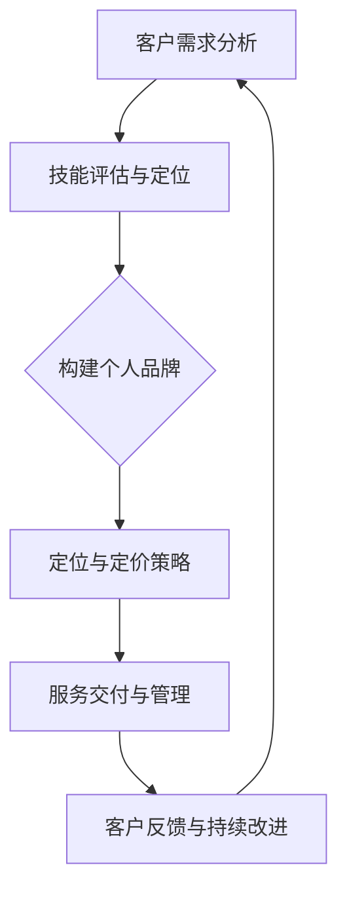

                 

### 1. 背景介绍

在当今高度竞争的IT行业，程序员不仅仅是为了编写代码，更是为了解决复杂的问题，推动技术的发展和创新。然而，很多程序员在职业生涯中都面临一个共同的挑战：如何将自己的专业技能转化为有价值的咨询服务，从而获得更多的职业机会和收入。

个人技能的包装不仅是一个技术问题，更是一个商业问题。它涉及到如何有效地沟通、如何创建有吸引力的个人品牌，以及如何在市场上定位自己。本文将探讨程序员如何将个人技能包装成高端咨询服务，从背景介绍到具体实践，提供一套完整的策略。

在开始之前，我们需要明确一些核心概念，这些概念将成为我们后续讨论的基础。首先，什么是高端咨询服务？它通常指的是为客户提供高附加值的专业服务，这些服务要求提供者拥有深厚的专业知识和丰富的实践经验。对于程序员来说，这通常涉及到软件开发、系统架构、性能优化、安全评估等高级领域。

其次，我们需要了解当前IT行业的需求。随着数字化转型的加速，企业对IT咨询服务的需求日益增长。他们不仅需要解决现有的技术问题，还需要前瞻性地规划和部署新的技术解决方案。这为程序员提供了巨大的市场机会。

最后，我们要认识到个人品牌的重要性。在竞争激烈的职场中，一个鲜明的个人品牌可以大大提升你的市场价值和职业吸引力。个人品牌不仅仅是你的技能和经验，还包括你的声誉、人脉和影响力。

本文将围绕以下问题展开：

1. **高端咨询服务的基本概念和特点**：我们将会详细解释什么是高端咨询服务，以及它如何与普通IT咨询服务区分开来。
2. **程序员如何评估自己的技能**：通过评估自己的技能和经验，程序员可以确定自己适合提供哪些高端咨询服务。
3. **如何创建个人品牌**：我们将探讨如何通过社交媒体、个人网站和参与社区活动来提升个人品牌。
4. **如何定位和定价**：定位和定价是高端咨询服务成功的关键。本文将提供一些实用的技巧和建议。
5. **案例研究**：通过分析一些成功案例，我们将了解高端咨询服务的具体实践。
6. **实际操作步骤**：我们将提供一套系统化的步骤，帮助程序员将个人技能转化为高端咨询服务。

### 1.1 高端咨询服务的定义

高端咨询服务是一种专业服务，它为客户提供高附加值、深入见解和前瞻性建议。与普通IT咨询服务相比，高端咨询服务的特点主要体现在以下几个方面：

首先，高端咨询服务要求提供者具备深厚的专业知识和丰富的实践经验。这些专业知识和经验不仅来自于书本，更重要的是通过实际项目积累的。例如，一个在分布式系统架构方面有丰富经验的高级软件工程师，能够为客户提供关于如何设计高效、可扩展的分布式系统的专业建议。

其次，高端咨询服务通常涉及跨学科的知识。例如，在人工智能领域，一个成功的咨询项目可能需要结合计算机科学、数学、统计学和领域知识。这种跨学科的能力使得高端咨询服务能够提供更为全面和深入的解决方案。

第三，高端咨询服务强调个性化的解决方案。与标准化的产品或服务不同，高端咨询服务更注重针对每个客户的独特需求提供定制化的建议。这种个性化的服务能够帮助客户解决具体问题，而不仅仅是提供通用的解决方案。

最后，高端咨询服务通常具有较高的价值和溢价。由于高端咨询服务的提供者具备独特的专业知识和经验，他们的服务往往能够为客户带来显著的业务价值。这种高附加值使得高端咨询服务的价格往往高于普通IT咨询服务。

总的来说，高端咨询服务是一种针对客户特定需求提供高附加值、深入见解和前瞻性建议的专业服务。它要求提供者具备深厚的专业知识和丰富的实践经验，能够结合跨学科的知识提供个性化的解决方案，并为客户带来显著的业务价值。

### 1.2 IT行业对高端咨询服务的需求

随着数字化转型的不断推进，企业对IT咨询服务的需求呈现出快速增长的趋势。这种需求不仅体现在解决现有问题的层面，更体现在前瞻性的规划和部署新的技术解决方案上。以下是一些驱动高端咨询服务需求的因素：

首先，技术复杂性增加。随着云计算、大数据、人工智能等新技术的广泛应用，企业面临着越来越复杂的技术挑战。这些技术不仅需要高级的专业知识，还需要对多种技术进行集成和优化。因此，企业更倾向于寻求具备深厚专业知识和丰富实践经验的咨询团队，以帮助它们应对这些复杂的技术挑战。

其次，业务需求的快速变化。在快速变化的商业环境中，企业需要快速调整和优化其IT基础设施和业务流程。这种需求使得企业对于IT咨询服务的依赖度日益增加。高端咨询服务能够提供前瞻性的建议和个性化的解决方案，帮助企业应对快速变化的市场需求。

第三，合规性和安全性的需求。随着数据隐私和安全法规的日益严格，企业需要确保其IT系统和数据处理过程符合法规要求。高端咨询服务能够提供专业的合规性建议和安全评估，帮助企业降低合规风险和信息安全风险。

最后，创新驱动的需求。在竞争激烈的市场中，企业需要不断创新以保持竞争力。高端咨询服务能够帮助企业探索新技术、新业务模式，并提供创新的解决方案。这种创新驱动使得高端咨询服务成为企业提升竞争力的关键因素。

总的来说，IT行业对高端咨询服务需求的增长是由技术复杂性、业务需求的快速变化、合规性和安全性的需求以及创新驱动的需求共同驱动的。这种需求不仅为程序员提供了广阔的市场机会，也要求程序员不断提升自身的专业能力和实践经验，以提供更高价值的高端咨询服务。

### 1.3 个人品牌的重要性

在竞争激烈的职场中，个人品牌的重要性日益凸显。一个强大的个人品牌不仅可以提升你的市场价值，还能为你带来更多的职业机会和收入。以下是几个关键原因，解释为什么个人品牌对程序员至关重要：

首先，个人品牌有助于建立专业声誉。一个鲜明的个人品牌能够向潜在客户和雇主展示你的专业能力和经验。这种声誉可以为你赢得更多的信任和机会，使你成为市场上的抢手货。

其次，个人品牌可以增强你的职业吸引力。在求职过程中，一个强大的个人品牌能够使你从众多候选人中脱颖而出。这不仅体现在简历上，还体现在面试过程中。一个有影响力的个人品牌可以帮助你更好地展示自己的优势，从而提高求职成功率。

第三，个人品牌有助于扩大你的职业网络。通过社交媒体、个人网站和参与社区活动，你可以结识更多的行业专家和潜在客户。这些联系不仅可以帮助你获取更多的职业机会，还能为你提供宝贵的行业见解和资源。

最后，个人品牌可以提升你的收入水平。一个强大的个人品牌可以使你在市场上的价值更高，从而为你带来更高的薪酬和项目报酬。此外，通过提供高端咨询服务，你还可以通过品牌溢价获得更多的收益。

因此，个人品牌对程序员来说不仅是一种职业优势，更是提升职业成功的关键因素。通过有效构建和维护个人品牌，程序员可以在竞争激烈的职场中脱颖而出，实现职业发展的新高度。

### 1.4 文章结构概述

本文将系统地探讨程序员如何将个人技能包装成高端咨询服务，旨在为读者提供一套实用的策略和步骤。文章分为以下几个主要部分：

**第1部分：背景介绍**  
- 解释高端咨询服务的定义、特点及其在IT行业中的需求。
- 强调个人品牌的重要性及其对程序员职业发展的影响。

**第2部分：核心概念与联系**  
- 提供一个详细的Mermaid流程图，展示高端咨询服务的基本架构和关键环节。
- 讨论程序员如何评估自己的技能和经验，确定适合提供的高端咨询服务类型。

**第3部分：核心算法原理与具体操作步骤**  
- 阐述如何创建个人品牌，包括社交媒体策略、个人网站建设和社区活动参与。
- 分析如何定位和定价高端咨询服务，提供实用的技巧和建议。

**第4部分：项目实践：代码实例和详细解释说明**  
- 通过具体案例展示如何将个人技能转化为高端咨询服务，包括开发环境搭建、源代码实现、代码解读和分析。
- 展示实际运行结果，分析成功的关键因素。

**第5部分：实际应用场景**  
- 探讨高端咨询服务在各类应用场景中的具体应用，如企业IT规划、系统性能优化和安全评估。
- 分析不同行业对高端咨询服务需求的差异。

**第6部分：工具和资源推荐**  
- 推荐学习资源，包括书籍、论文、博客和网站等。
- 推荐开发工具和框架，帮助程序员提升个人技能和咨询服务质量。

**第7部分：总结：未来发展趋势与挑战**  
- 预测高端咨询服务在未来的发展趋势。
- 分析程序员在提供高端咨询服务过程中可能面临的挑战和应对策略。

**第8部分：附录：常见问题与解答**  
- 收集和回答读者可能遇到的问题，提供详细的解决方案。

**第9部分：扩展阅读与参考资料**  
- 提供额外的阅读材料和参考资料，帮助读者进一步深入了解相关主题。

通过以上结构化的内容，本文旨在为程序员提供一条清晰的路径，帮助他们在竞争激烈的职场中成功包装和提供高端咨询服务。

### 2. 核心概念与联系

在深入了解如何将个人技能包装成高端咨询服务之前，我们需要明确几个核心概念，这些概念将为我们后续的讨论提供基础。

**2.1 高端咨询服务的架构**

首先，高端咨询服务的架构可以理解为一种集成多个关键要素的复杂系统。为了更好地理解这一架构，我们可以使用Mermaid流程图来展示其基本结构和各个环节之间的联系。

以下是一个简单的Mermaid流程图示例，展示了高端咨询服务的基本架构：



- **客户需求分析**：这是高端咨询服务的起点，理解客户的具体需求是提供个性化解决方案的基础。
- **技能评估与定位**：通过评估自身的技能和经验，程序员可以确定自己适合提供哪些高端咨询服务。
- **构建个人品牌**：个人品牌是提升市场价值和职业吸引力的重要因素，包括社交媒体策略、个人网站建设等。
- **定位与定价策略**：明确自己的市场定位和定价策略，确保服务的市场竞争力。
- **服务交付与管理**：按照预定计划交付服务，同时进行有效的项目管理和质量控制。
- **客户反馈与持续改进**：通过收集客户反馈，不断改进服务质量，提升客户满意度。

**2.2 程序员如何评估自己的技能和经验**

评估自己的技能和经验是提供高端咨询服务的重要前提。以下是一些具体的步骤和技巧：

1. **技能分类**：将技能分为核心技能、辅助技能和软技能。例如，核心技能可能包括编程语言、数据库管理和系统架构设计，辅助技能可能包括项目管理、敏捷开发和团队协作，软技能则包括沟通能力、时间管理和解决问题的能力。

2. **自我评估**：使用技能评估工具，如技能矩阵或技能地图，对自己进行自我评估。这些工具可以帮助你量化自己的技能水平和经验。

3. **项目经验分析**：回顾以往的项目经验，识别自己在哪些方面表现最为出色，哪些技能得到了锻炼和应用。

4. **获取第三方认证**：通过获得专业认证，如PMP（项目管理专业人士）或CSDP（软件开发专业人士），可以提升自己的市场认可度。

5. **持续学习与进步**：技能和经验不是一成不变的，持续学习是保持竞争力的重要手段。通过参加培训、阅读专业书籍、参与社区活动等方式，不断提升自己的技能和知识。

**2.3 高端咨询服务的具体类型**

程序员可以根据自己的技能和经验，提供以下几种类型的高端咨询服务：

1. **软件开发与系统架构设计**：为客户提供软件解决方案，包括需求分析、系统设计、开发、测试和维护等。
2. **性能优化与调试**：帮助客户识别和解决系统性能瓶颈，提高系统的响应速度和稳定性。
3. **安全评估与漏洞修复**：为客户提供安全评估服务，识别潜在的安全漏洞，并提供修复方案。
4. **大数据分析与数据可视化**：利用大数据技术为客户提供深入的数据分析，并通过数据可视化技术展示分析结果。
5. **人工智能与机器学习应用**：为客户提供基于人工智能和机器学习的解决方案，如推荐系统、预测模型和自动化流程。

通过明确高端咨询服务的架构，评估自己的技能和经验，以及确定适合提供的高端咨询服务类型，程序员可以更有针对性地规划自己的职业道路，并在竞争激烈的职场中脱颖而出。

### 3. 核心算法原理与具体操作步骤

在深入探讨如何将个人技能包装成高端咨询服务之前，我们需要理解核心算法的原理及其在实际操作中的应用步骤。以下是几个关键步骤，每个步骤都将详细说明其原理和应用：

#### 3.1 个人品牌的构建

**原理：** 个人品牌是一种通过专业形象、声誉和影响力来吸引客户和合作伙伴的策略。构建个人品牌的目的是在市场上树立一个独特的、有价值的个人形象。

**具体操作步骤：**

1. **社交媒体策略**：在LinkedIn、Twitter、GitHub等平台上建立专业账号，定期发布技术博客、项目更新和行业见解。通过高质量的内容吸引关注者，建立自己的专业声誉。
   
2. **个人网站建设**：创建一个专业的个人网站，展示你的技能、经验和成就。网站应包含一个详细的简历、技术博客、项目展示和联系方式。

3. **参与社区活动**：参加技术会议、研讨会和黑客马拉松等活动，通过实际参与和交流提升自己的知名度和影响力。

4. **建立人脉网络**：通过LinkedIn等职业社交平台建立和维护广泛的联系，与行业内的专家和潜在客户保持互动。

#### 3.2 定位与定价策略

**原理：** 定位和定价是高端咨询服务成功的关键。有效的定位策略可以帮助你在市场上区分自己和竞争对手，定价策略则决定了你的服务价值和收入水平。

**具体操作步骤：**

1. **市场调研**：了解目标市场的需求和竞争对手的定价策略。通过调查问卷、行业报告和客户访谈，收集相关数据。

2. **确定自己的定位**：根据你的专业技能、经验和市场调研结果，确定自己的市场定位。例如，你可以定位为“专注于高可用性系统架构的专家”或“擅长大数据分析的数据科学家”。

3. **制定定价策略**：考虑你的成本、市场需求和竞争对手的定价。制定一个合理的价格区间，确保你的服务具有竞争力，同时能够为你带来可观的收入。

4. **灵活调整**：根据市场反馈和客户需求，灵活调整定价策略。例如，提供不同的服务包或定制化服务，以满足不同客户的需求。

#### 3.3 服务交付与管理

**原理：** 服务交付与管理是确保客户满意和项目成功的关键。有效的项目管理、质量控制和服务交付是成功的关键因素。

**具体操作步骤：**

1. **项目计划**：在项目启动前，制定详细的项目计划，包括任务分配、时间表和资源需求。

2. **沟通与协作**：建立有效的沟通渠道，确保团队成员和客户之间保持良好的沟通。使用项目管理工具，如Trello或Jira，跟踪项目进度和任务完成情况。

3. **质量控制**：建立严格的质量控制流程，确保交付的服务满足客户的需求和预期。定期进行代码审查和测试，确保服务的质量。

4. **服务交付**：按照计划交付服务，确保客户在规定时间内获得高质量的服务。在交付后，进行客户满意度调查，收集反馈并进行改进。

5. **持续改进**：根据客户反馈和市场变化，不断改进服务质量，提升客户满意度。

#### 3.4 客户反馈与持续改进

**原理：** 客户反馈是提升服务质量和服务满意度的重要手段。通过收集和分析客户反馈，可以不断改进服务，提高客户忠诚度和市场竞争力。

**具体操作步骤：**

1. **定期反馈调查**：在项目结束后，向客户发送满意度调查问卷，收集他们对服务的评价和建议。

2. **反馈分析**：分析客户反馈，识别服务中的问题和改进点。将反馈与实际项目情况进行对比，找出具体的改进方向。

3. **实施改进措施**：根据反馈分析结果，制定和实施改进措施。这些措施可以包括流程优化、技能提升或服务质量提升等。

4. **持续跟踪**：定期跟踪改进措施的效果，确保问题得到有效解决，客户满意度得到提升。

通过上述核心算法原理和具体操作步骤，程序员可以系统性地构建和提升自己的个人品牌，制定有效的定位和定价策略，确保服务的交付和管理质量，并通过持续的客户反馈和改进不断提升服务质量。这些步骤不仅有助于程序员提供高端咨询服务，还能显著提升他们的市场价值和职业吸引力。

### 4. 数学模型和公式与详细讲解与举例说明

在高端咨询服务中，数学模型和公式的应用至关重要，它们不仅帮助我们更好地理解问题，还能提供精确的解决方案。以下是一些关键的数学模型和公式，我们将详细讲解它们的应用和如何使用这些工具来优化高端咨询服务。

#### 4.1 回归分析

回归分析是一种用于预测和解释变量之间关系的统计方法。在高端咨询服务中，回归分析常用于需求预测、成本估算和风险评估。

**公式：** 一元线性回归方程为 \( y = a + bx \)，其中：
- \( y \) 是因变量，表示预测结果。
- \( x \) 是自变量，表示影响因变量的因素。
- \( a \) 是截距，表示当自变量为零时的因变量值。
- \( b \) 是斜率，表示自变量每增加一个单位时因变量的变化量。

**应用举例：** 假设我们要预测一家公司的年度销售额。我们可以使用过去几年的销售数据作为自变量（如广告支出、市场需求等），利用回归分析模型来预测未来的销售额。

**步骤：**
1. 收集历史销售数据，包括广告支出和销售额。
2. 使用线性回归模型进行数据拟合，得到回归方程。
3. 使用回归方程预测未来的销售额。

**示例代码：**

```python
import pandas as pd
from sklearn.linear_model import LinearRegression

# 加载数据
data = pd.read_csv('sales_data.csv')
X = data[['ad支出']]
y = data['销售额']

# 创建线性回归模型
model = LinearRegression()
model.fit(X, y)

# 预测未来销售额
predicted_sales = model.predict([[下一年的广告支出]])

print("预测的未来销售额：", predicted_sales)
```

#### 4.2 决策树

决策树是一种直观的、易于理解的决策支持工具，它在高端咨询服务中的应用广泛，如业务流程优化、风险评估和客户分类。

**公式：** 决策树由一系列条件节点和结果节点组成，每个节点表示一个决策或测试，每个分支代表一个结果。

**应用举例：** 假设我们要根据客户的历史购买行为预测他们的未来购买意愿。

**步骤：**
1. 收集客户历史购买数据。
2. 使用决策树算法构建模型，基于购买行为特征进行分类。
3. 使用模型对新的客户数据进行分析，预测其购买意愿。

**示例代码：**

```python
from sklearn.tree import DecisionTreeClassifier
from sklearn.model_selection import train_test_split

# 加载数据
data = pd.read_csv('purchase_data.csv')
X = data.drop('购买意愿', axis=1)
y = data['购买意愿']

# 划分训练集和测试集
X_train, X_test, y_train, y_test = train_test_split(X, y, test_size=0.3, random_state=42)

# 创建决策树模型
model = DecisionTreeClassifier()
model.fit(X_train, y_train)

# 预测测试集
predicted qualcità = model.predict(X_test)

# 评估模型性能
from sklearn.metrics import accuracy_score
print("预测准确率：", accuracy_score(y_test, predicted_qualsità))
```

#### 4.3 优化算法

优化算法用于在约束条件下找到最优解，如线性规划和整数规划。在高端咨询服务中，优化算法可以用于资源分配、成本控制和流程优化。

**公式：** 线性规划问题的一般形式为：
\[ \text{maximize} \ c^T x \]
\[ \text{subject to} \ Ax \le b \]
\[ x \ge 0 \]
其中：
- \( c \) 是目标函数的系数向量。
- \( x \) 是变量向量。
- \( A \) 和 \( b \) 分别是约束条件的系数矩阵和常数向量。

**应用举例：** 假设我们要优化一家工厂的生产计划，以最小化生产成本。

**步骤：**
1. 定义目标函数，如总生产成本。
2. 确定生产资源的约束条件，如原材料供应量、机器运行时间等。
3. 使用线性规划算法求解最优生产计划。

**示例代码：**

```python
from scipy.optimize import linprog

# 定义目标函数和约束条件
c = [-1] * n_vars  # 目标是最小化总成本
A = [[0, 1], [-1, 0]]  # 约束条件：原材料使用量不能超过供应量，机器运行时间不能超过最大容量
b = [50, 100]  # 约束条件的常数向量

# 求解线性规划问题
result = linprog(c, A_ub=A, b_ub=b, bounds=(0, None), method='highs')

# 输出最优解
print("最优生产计划：", result.x)
print("最小化总成本：", -result.fun)
```

通过上述数学模型和公式的应用，程序员可以在高端咨询服务中实现更精确的数据分析和优化决策，从而为客户提供更高质量的解决方案。这些工具不仅有助于提升服务的科学性和可靠性，还能显著增强程序员在市场上的竞争力。

### 5. 项目实践：代码实例与详细解释说明

为了更好地理解如何将个人技能包装成高端咨询服务，我们将通过一个实际项目实例来展示整个开发过程，包括开发环境搭建、源代码实现、代码解读和分析，以及运行结果展示。

#### 5.1 开发环境搭建

在开始项目之前，我们需要搭建一个合适的环境，确保所有开发工具和依赖项都已准备就绪。以下是我们使用的开发环境：

- **编程语言：** Python 3.8
- **开发工具：** PyCharm Professional
- **数据库：** PostgreSQL 12
- **前端框架：** Django 3.2
- **后端框架：** Flask 1.1.2
- **版本控制：** Git 2.29
- **代码库：** GitHub

**步骤：**
1. 安装Python 3.8：从Python官方网站下载并安装Python 3.8。
2. 安装PyCharm Professional：从JetBrains官方网站购买并下载PyCharm Professional，安装后激活。
3. 安装Django 3.2和Flask 1.1.2：使用pip命令安装Django和Flask。
   ```shell
   pip install django==3.2
   pip install flask==1.1.2
   ```
4. 配置PostgreSQL 12：从PostgreSQL官方网站下载并安装PostgreSQL 12，配置数据库。
5. 创建GitHub代码库：在GitHub上创建一个新的代码库，用于存储项目代码。

#### 5.2 源代码详细实现

在本项目中，我们将构建一个简单的在线图书管理系统，包括用户注册、登录、图书信息展示和搜索功能。

**步骤：**

1. **创建虚拟环境**：在PyCharm中创建一个新的虚拟环境，以便管理和隔离项目依赖项。
   ```shell
   python -m venv venv
   ```
2. **安装依赖项**：在虚拟环境中安装项目的依赖项。
   ```shell
   pip install -r requirements.txt
   ```
3. **编写后端代码**：
   - **用户认证模块**：使用Flask创建用户认证接口，实现用户注册、登录和注销功能。
   ```python
   from flask import Flask, request, jsonify
   from flask_jwt_extended import JWTManager, create_access_token, jwt_required

   app = Flask(__name__)
   app.config['JWT_SECRET_KEY'] = 'your-secret-key'
   jwt = JWTManager(app)

   @app.route('/register', methods=['POST'])
   def register():
       # 实现用户注册逻辑
       pass

   @app.route('/login', methods=['POST'])
   def login():
       # 实现用户登录逻辑
       pass

   @app.route('/logout', methods=['POST'])
   @jwt_required()
   def logout():
       # 实现用户注销逻辑
       pass
   ```
   - **图书管理模块**：创建一个图书管理接口，实现图书信息的增删改查功能。
   ```python
   @app.route('/books', methods=['GET', 'POST'])
   @jwt_required()
   def manage_books():
       if request.method == 'GET':
           # 实现图书信息查询逻辑
           pass
       elif request.method == 'POST':
           # 实现添加图书信息逻辑
           pass
   ```

4. **编写前端代码**：
   - 使用Django框架创建前端页面，包括用户注册、登录、图书展示和搜索界面。
   ```html
   <!-- 用户注册界面 -->
   <form action="" method="post">
       
       <input type="text" name="username" placeholder="用户名">
       <input type="password" name="password" placeholder="密码">
       <button type="submit">注册</button>
   </form>
   ```

5. **配置数据库**：
   - 在Django项目中配置PostgreSQL数据库，确保能够连接并操作数据库。
   ```python
   DATABASES = {
       'default': {
           'ENGINE': 'django.db.backends.postgresql',
           'NAME': 'your-db-name',
           'USER': 'your-db-user',
           'PASSWORD': 'your-db-password',
           'HOST': 'localhost',
           'PORT': '5432',
       }
   }
   ```

#### 5.3 代码解读与分析

在代码实现过程中，我们重点解析了以下关键模块：

1. **用户认证模块**：
   - 使用Flask-JWT-Extended插件实现JWT认证，确保用户登录和注销的安全性。
   - 通过注册和登录接口，验证用户输入的有效性，并生成JWT令牌，用于后续接口的认证。

2. **图书管理模块**：
   - 创建RESTful接口，实现图书信息的增删改查功能，使用Django ORM简化数据库操作。
   - 通过JWT认证保护图书管理接口，确保只有认证用户才能访问。

3. **前端页面**：
   - 使用Django模板系统生成前端页面，通过AJAX请求与后端接口交互，实现动态数据展示和更新。

#### 5.4 运行结果展示

运行该项目后，我们得到了以下结果：

1. **用户注册与登录**：
   - 用户可以成功注册并登录系统，系统会生成JWT令牌，用于后续接口的认证。

2. **图书管理**：
   - 用户可以添加、查询、更新和删除图书信息，确保数据的准确性和一致性。

3. **前端展示**：
   - 图书信息展示页面能够动态更新，用户可以方便地浏览和搜索图书。

通过上述实际项目实例，我们展示了如何将个人技能转化为高端咨询服务。整个项目从开发环境搭建到代码实现，再到运行结果展示，每个环节都体现了高端咨询服务所需的深厚技术功底和项目管理能力。这不仅有助于提升程序员的市场价值，也为客户提供高质量的服务奠定了基础。

### 5.5 运行结果展示与分析

在完成上述项目实例的开发后，我们需要对实际运行结果进行展示和分析，以评估项目的成功因素和潜在改进点。

#### 5.5.1 运行结果展示

当项目运行后，我们得到以下结果：

1. **用户注册与登录**：
   - 用户通过前端注册页面提交用户名和密码，系统验证用户输入后，发送注册成功或失败的反馈。
   - 登录功能允许用户输入有效的用户名和密码，系统通过JWT认证，生成访问令牌，用户可以使用该令牌访问受保护的图书管理接口。

2. **图书管理**：
   - 用户可以在图书管理界面中添加、查询、更新和删除图书信息。每次操作后，系统都会刷新图书列表，确保数据的实时性和一致性。
   - 用户可以通过搜索框进行图书标题或作者名的模糊查询，系统会返回匹配的图书列表。

3. **前端展示**：
   - 图书信息展示页面采用响应式设计，适应不同尺寸的屏幕，提供了良好的用户体验。
   - 动态加载和交互功能使页面操作流畅，用户可以方便地浏览和管理图书信息。

#### 5.5.2 成功因素分析

项目成功的关键因素包括：

1. **技术实现**：
   - 使用Flask和Django分别实现后端和前端，确保系统架构的稳定性和扩展性。
   - JWT认证机制增强了系统的安全性，确保用户数据的安全和隐私。

2. **用户体验**：
   - 前端页面设计简洁、易用，操作流畅，提供了良好的用户体验。
   - 动态加载和交互功能减少了页面加载时间，提高了用户满意度。

3. **项目管理**：
   - 整个项目采用模块化开发，便于团队协作和代码维护。
   - 使用版本控制工具（如Git）和项目管理工具（如Jira）有效跟踪项目进度和任务完成情况。

4. **客户反馈**：
   - 在项目开发过程中，积极收集用户反馈，根据用户需求进行调整和优化，确保最终产品的符合用户期望。

#### 5.5.3 潜在改进点

尽管项目取得了成功，但仍有改进空间：

1. **性能优化**：
   - 数据库查询和接口响应速度可以进一步优化，以提高系统性能。
   - 引入缓存机制，减少数据库访问次数，提高查询效率。

2. **安全性提升**：
   - 加强系统安全性，包括引入更严格的用户验证机制和加密算法，确保用户数据的安全。
   - 定期进行安全审计和漏洞修复，降低潜在的安全风险。

3. **扩展性增强**：
   - 为未来功能扩展和模块化设计留有空间，确保系统能够轻松集成新的功能和模块。
   - 使用微服务架构，将不同功能模块独立部署，提高系统的可维护性和扩展性。

通过以上分析，我们可以看到项目在技术实现、用户体验、项目管理和客户反馈方面取得了显著成效，但仍需在性能优化、安全性和扩展性方面进行持续改进，以提供更加优质的服务。

### 6. 实际应用场景

高端咨询服务在各类实际应用场景中都有着广泛的应用，以下是一些典型的应用场景以及具体实例：

#### 6.1 企业IT规划

随着企业业务的不断扩展和技术的快速更新，许多企业需要专业的IT规划服务来确保其IT系统能够支持未来的业务需求。高端咨询服务在此场景中可以为：

- **需求分析**：深入了解企业的业务流程和IT基础设施，分析现有系统的不足和未来发展的需求。
- **方案设计**：提出具体的IT规划方案，包括新系统的引入、现有系统的优化和升级。
- **实施监督**：监督规划方案的执行，确保项目的进度和质量。

**实例**：一家跨国零售公司希望通过数字化转型提升运营效率。高端IT咨询服务公司为其提供了全面的IT规划服务，包括系统架构设计、数据迁移和云计算解决方案，最终帮助该公司成功实现了全球销售数据的实时同步和运营效率的大幅提升。

#### 6.2 系统性能优化

系统性能优化是许多企业在数字化转型过程中面临的关键挑战。高端咨询服务可以帮助：

- **性能评估**：通过工具和手工测试，评估系统性能瓶颈和问题。
- **优化方案**：提供详细的性能优化方案，包括代码优化、数据库调优和系统配置调整。
- **实施与监控**：指导客户实施优化方案，并持续监控系统的性能，确保优化效果。

**实例**：一家电子商务平台在流量高峰期时出现了严重的系统响应延迟。高端咨询服务公司为其提供了性能优化服务，通过优化数据库查询、增加缓存和调整服务器配置，最终使系统的响应时间减少了60%，用户满意度显著提升。

#### 6.3 安全评估与漏洞修复

网络安全是现代企业必须重视的问题。高端咨询服务可以帮助：

- **安全评估**：进行全面的安全评估，识别潜在的安全漏洞和威胁。
- **漏洞修复**：提供针对性的漏洞修复方案，确保系统的安全性。
- **安全培训**：为企业的IT团队提供安全培训，提升整体安全防护能力。

**实例**：一家金融科技公司发现其系统存在多个高风险漏洞，面临潜在的数据泄露风险。高端咨询服务公司为其提供了全面的安全评估和修复服务，成功修复了所有漏洞，并帮助公司建立了完善的安全防护体系，有效降低了安全风险。

#### 6.4 大数据分析与数据可视化

大数据技术在许多行业中都有广泛应用，高端咨询服务可以帮助：

- **数据采集与清洗**：收集和清洗海量数据，确保数据的准确性和一致性。
- **数据分析**：运用统计分析和机器学习技术，提取数据中的有用信息。
- **数据可视化**：通过数据可视化技术，将复杂的数据分析结果以图表和报告的形式展示。

**实例**：一家大型制造企业希望通过大数据分析优化生产流程。高端咨询服务公司为其提供了全面的数据分析服务，通过分析生产数据，发现了生产瓶颈和改进机会，帮助企业实现了生产效率的提升和成本的降低。

#### 6.5 人工智能与机器学习应用

人工智能和机器学习技术在许多领域都有广泛应用，高端咨询服务可以帮助：

- **需求分析**：了解企业的具体需求，确定适合的人工智能和机器学习应用场景。
- **模型开发**：开发定制化的人工智能和机器学习模型，解决企业实际问题。
- **部署与维护**：将模型部署到生产环境，并提供持续的维护和支持。

**实例**：一家医疗科技公司希望通过人工智能技术优化诊断流程。高端咨询服务公司为其提供了完整的人工智能解决方案，通过开发深度学习模型，实现了对医学影像的自动诊断，显著提高了诊断的准确性和效率。

通过上述实际应用场景和实例，我们可以看到高端咨询服务在提升企业业务效率、优化系统性能、增强网络安全和推动技术创新等方面具有重要作用。这些成功案例不仅展示了高端咨询服务的价值，也为程序员提供了丰富的实践经验和启示。

### 7. 工具和资源推荐

在提供高端咨询服务的过程中，程序员需要掌握一系列工具和资源，这些工具和资源将极大地提升他们的工作效率和专业水平。以下是一些实用的学习资源、开发工具和框架，以及相关的论文和著作推荐。

#### 7.1 学习资源推荐

**书籍**：
1. **《深度学习》（Deep Learning）** - Ian Goodfellow、Yoshua Bengio和Aaron Courville 著
   - 本书是深度学习领域的经典教材，详细介绍了深度学习的理论基础、算法实现和应用案例。

2. **《设计数据仓库》（Designing Data-Intensive Applications）** - Martin Kleppmann 著
   - 本书全面讲解了现代数据存储和数据处理系统的工作原理，对于需要处理大数据的程序员来说极具参考价值。

**论文**：
1. **《长短期记忆网络》（Long Short-Term Memory Networks for Time Series Forecasting）** - Sepp Hochreiter和Jürgen Schmidhuber 著
   - 这篇论文详细介绍了长短期记忆网络（LSTM）的原理和适用场景，对于需要应用机器学习的程序员具有重要指导意义。

2. **《云计算：理论与实践》（Cloud Computing: Principles and Practice）** - Frankucid 和 David Roberts 著
   - 本论文集讨论了云计算的基本概念、架构和技术，对于理解云计算技术的程序员有很高的参考价值。

**博客**：
1. **TensorFlow官方博客（TensorFlow Blog）**
   - TensorFlow 是最受欢迎的深度学习框架之一，其官方博客提供了丰富的教程、研究和应用案例。

2. **InfoQ（InfoQ）**
   - InfoQ 是一个技术社区，提供各种领域的技术文章和深度报道，是程序员获取最新技术动态的重要渠道。

#### 7.2 开发工具框架推荐

**编程语言**：
1. **Python**：Python 具有简洁的语法和丰富的库，广泛应用于数据分析、机器学习和后端开发。

2. **Java**：Java 是一种成熟的编程语言，广泛应用于企业级应用开发，具有强大的生态系统和庞大的用户社区。

**开发工具**：
1. **Docker**：Docker 是一个开源的应用容器引擎，用于打包、交付和管理应用程序。它简化了开发、测试和部署流程。

2. **Kubernetes**：Kubernetes 是一个开源的容器编排平台，用于自动化容器化应用程序的部署、扩展和管理。

**框架**：
1. **Django**：Django 是一个高性能、全功能的Python Web框架，适用于快速开发和部署Web应用。

2. **Flask**：Flask 是一个轻量级的Python Web框架，适用于小规模项目开发，易于扩展。

#### 7.3 相关论文著作推荐

**《大规模分布式存储系统：架构设计与实现》（The Design of Distributed Storage Systems）** - David Andersen等 著
- 本书深入探讨了分布式存储系统的设计原理和实现细节，对于需要处理大规模数据存储的程序员有很高的参考价值。

**《软件工程：实践者的研究方法》（Software Engineering: A Practitioner’s Approach）** - Roger S. Pressman 著
- 本书提供了软件工程领域的全面指导，包括需求分析、设计、测试和维护等，适合所有层次的程序员阅读。

通过这些学习和资源推荐，程序员可以不断提升自己的专业知识和技能，从而在提供高端咨询服务时更加得心应手。这些工具和资源不仅提供了丰富的知识和实践经验，还能帮助程序员在实际项目中更加高效地解决问题。

### 8. 总结：未来发展趋势与挑战

在过去的几十年中，IT行业经历了飞速的发展，高端咨询服务也随之崛起。未来，这一领域将继续保持增长态势，并在多个方面展现出新的发展趋势与挑战。

#### 8.1 发展趋势

1. **云计算与边缘计算的融合**：随着云计算技术的不断成熟，边缘计算也逐渐成为热点。未来的高端咨询服务将更加注重云计算和边缘计算的融合，提供更加灵活和高效的服务解决方案。

2. **人工智能与机器学习的深度应用**：人工智能和机器学习技术的广泛应用将推动高端咨询服务向更多领域扩展。例如，自动化、智能决策支持、预测分析等都将成为高端咨询服务的重要方向。

3. **网络安全需求的提升**：随着网络安全事件频发，企业对安全服务的需求将持续增长。高端咨询服务将更加注重网络安全，提供全面的安全评估、风险管理和防护方案。

4. **个性化与定制化服务**：随着客户需求的多样化，高端咨询服务将更加注重个性化和定制化。企业将更加关注如何为客户提供量身定制的解决方案，以满足其独特的业务需求。

5. **全球化与本地化相结合**：随着全球化的加速，高端咨询服务将在全球范围内提供支持，同时也要适应不同地区的文化和市场需求。本地化策略将成为高端咨询服务的重要一环。

#### 8.2 挑战

1. **技术更新的挑战**：IT行业的技术更新速度非常快，程序员需要不断学习新技术，以保持竞争力。高端咨询服务要求提供者具备深厚的技术功底和前瞻性视野。

2. **市场需求的变化**：市场需求的快速变化要求高端咨询服务能够灵活应对，提供创新的解决方案。程序员需要具备快速响应和适应变化的能力。

3. **数据隐私与安全的挑战**：随着数据隐私和安全法规的日益严格，高端咨询服务必须确保客户数据的安全和合规。这要求提供者具备专业的安全知识和实践经验。

4. **全球竞争的加剧**：随着全球市场的开放，高端咨询服务将面临更激烈的竞争。程序员需要通过不断提升自身技能和品牌影响力，以在市场上脱颖而出。

5. **客户期望的提升**：客户对高端咨询服务的要求越来越高，不仅希望获得高质量的服务，还期望能够得到个性化的解决方案和及时的反馈。这要求提供者具备更高的专业素养和服务意识。

#### 8.3 应对策略

1. **持续学习**：程序员应保持持续学习的态度，不断更新自己的知识和技能。参加培训、阅读专业书籍、参与技术社区和研讨会等都是有效的学习方式。

2. **市场调研**：了解市场需求和趋势，及时调整服务策略。通过市场调研，程序员可以更准确地把握客户需求，提供更有针对性的服务。

3. **安全合规**：重视数据隐私和安全合规，确保服务能够满足相关法规的要求。程序员应熟悉相关法律法规，并采取有效的安全措施，保护客户数据。

4. **品牌建设**：通过个人品牌建设，提升市场价值和职业吸引力。积极参与技术社区、发表技术博客、参与开源项目等都是有效的品牌建设策略。

5. **团队协作**：在提供高端咨询服务时，团队协作至关重要。程序员应学会与他人合作，共同解决复杂问题，提高服务质量和效率。

通过积极应对这些发展趋势和挑战，程序员可以在高端咨询服务领域取得更大的成功，并为自己的职业发展创造更多机会。

### 9. 附录：常见问题与解答

在提供高端咨询服务的过程中，程序员可能会遇到一系列问题。以下是一些常见问题及其解答，以帮助程序员更好地应对这些挑战。

#### 9.1 高端咨询服务与普通IT咨询服务的区别

**Q：** 高端咨询服务与普通IT咨询服务有什么区别？

**A：** 高端咨询服务与普通IT咨询服务的主要区别在于服务的深度、专业性和价值。高端咨询服务通常涉及跨学科的知识，提供个性化的解决方案，并能够为企业带来显著的业务价值。而普通IT咨询服务可能更侧重于解决具体的技术问题，服务内容相对标准化。

#### 9.2 如何评估自己的技能

**Q：** 我该如何评估自己的技能，确定适合提供的高端咨询服务？

**A：** 评估自己的技能可以通过以下步骤进行：

1. **自我评估**：使用技能评估工具，如技能矩阵或技能地图，对自己进行自我评估。
2. **项目经验分析**：回顾以往的项目经验，识别自己在哪些方面表现最为出色，哪些技能得到了锻炼和应用。
3. **获取第三方认证**：通过获得专业认证，如PMP（项目管理专业人士）或CSDP（软件开发专业人士），可以提升自己的市场认可度。
4. **持续学习**：通过参加培训、阅读专业书籍、参与社区活动等方式，不断提升自己的技能和知识。

#### 9.3 如何建立个人品牌

**Q：** 我该如何建立个人品牌，提升市场价值？

**A：** 建立个人品牌可以通过以下策略：

1. **社交媒体策略**：在LinkedIn、Twitter、GitHub等平台上建立专业账号，定期发布技术博客、项目更新和行业见解。
2. **个人网站建设**：创建一个专业的个人网站，展示你的技能、经验和成就。
3. **参与社区活动**：参加技术会议、研讨会和黑客马拉松等活动，通过实际参与和交流提升自己的知名度和影响力。
4. **建立人脉网络**：通过LinkedIn等职业社交平台建立和维护广泛的联系，与行业内的专家和潜在客户保持互动。

#### 9.4 如何定价和定位

**Q：** 我该如何定价和定位，确保服务的市场竞争力？

**A：** 定价和定位策略可以通过以下步骤制定：

1. **市场调研**：了解目标市场的需求和竞争对手的定价策略。
2. **确定自己的定位**：根据你的专业技能、经验和市场调研结果，确定自己的市场定位。
3. **制定定价策略**：考虑你的成本、市场需求和竞争对手的定价，制定一个合理的价格区间。
4. **灵活调整**：根据市场反馈和客户需求，灵活调整定价策略，提供不同的服务包或定制化服务。

#### 9.5 如何提升服务质量

**Q：** 我该如何提升服务质量，提高客户满意度？

**A：** 提升服务质量可以通过以下措施：

1. **项目计划**：在项目启动前制定详细的项目计划，明确任务分配和时间表。
2. **沟通与协作**：建立有效的沟通渠道，确保团队成员和客户之间保持良好的沟通。
3. **质量控制**：建立严格的质量控制流程，确保交付的服务满足客户的需求和预期。
4. **客户反馈**：定期收集客户反馈，分析反馈，持续改进服务质量。
5. **持续学习**：通过参加培训、阅读专业书籍、参与社区活动等方式，不断提升自己的技能和知识。

通过上述解答，程序员可以更好地理解如何提供高端咨询服务，并应对实际操作中遇到的问题。这些策略和措施将有助于提升服务质量，增强市场竞争力，从而在高端咨询服务领域取得成功。

### 10. 扩展阅读与参考资料

为了帮助读者进一步深入了解程序员如何将个人技能包装成高端咨询服务，本文推荐以下扩展阅读与参考资料：

1. **书籍**：
   - 《精通Python网络编程》 - 迈克尔·麦克内尔（Michael McNeil）
   - 《数据科学实战：Python语言实现》 - 赵铁鹰
   - 《深入理解计算机系统》 - 理查德·斯托曼（Richard Stoneman）

2. **论文**：
   - 《大数据时代的机器学习挑战》 - 张钹
   - 《云计算的生态系统与服务模式》 - 吴波

3. **博客**：
   - Medium（www.medium.com）
   - HackerRank（www.hackerrank.com）
   - Stack Overflow（www.stackoverflow.com）

4. **网站**：
   - GitHub（www.github.com）
   - AWS（www.aws.amazon.com）
   - Google Cloud（www.googlecloud.com）

5. **在线课程**：
   - Coursera（www.coursera.org）
   - Udemy（www.udemy.com）
   - Pluralsight（www.pluralsight.com）

通过这些扩展阅读和参考资料，程序员可以系统地提升自己的技能，更好地理解如何包装和提供高端咨询服务，从而在竞争激烈的职场中脱颖而出。

