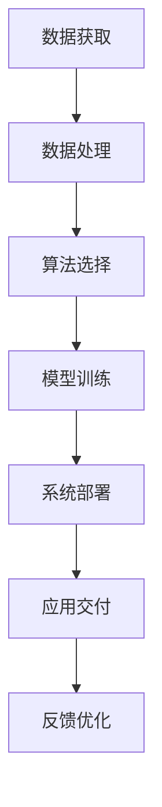

                 

### 1. 背景介绍

在当今时代，人工智能（AI）已经成为科技领域中最炙手可热的话题。随着大数据、云计算、深度学习等技术的发展，AI的应用范围不断扩大，从智能语音助手到自动驾驶，从医疗诊断到金融风控，AI正逐步改变着我们的生活方式和工作模式。

对于程序员而言，人工智能不仅是一个技术趋势，更是一个可以应用于创业项目的强大工具。通过将人工智能技术融入创业项目，程序员可以创造出具有高度智能化、自动化和个性化特点的产品或服务，从而在激烈的市场竞争中脱颖而出。

本文将探讨程序员如何将人工智能技术应用于创业项目。我们将从背景介绍、核心概念与联系、核心算法原理与具体操作步骤、数学模型与公式、项目实践、实际应用场景、工具和资源推荐以及总结和未来发展趋势与挑战等方面进行详细阐述。

在接下来的内容中，我们将一步步分析如何将人工智能技术应用于创业项目，帮助程序员朋友们更好地理解和利用这一强大的工具，实现创业梦想。

### 2. 核心概念与联系

在深入探讨如何将人工智能技术应用于创业项目之前，我们首先需要了解一些核心概念和它们之间的联系。

#### 2.1 人工智能的定义与分类

人工智能（Artificial Intelligence，简称AI）是指通过计算机模拟人类智能的技术。它包括机器学习（Machine Learning，ML）、深度学习（Deep Learning，DL）、自然语言处理（Natural Language Processing，NLP）等多个子领域。

- **机器学习**：机器学习是AI的一个重要分支，通过算法从数据中学习，实现自动预测或决策。
- **深度学习**：深度学习是机器学习的一个子领域，利用神经网络（尤其是深度神经网络）对大量数据进行训练，从而实现复杂的模式识别和预测。
- **自然语言处理**：自然语言处理涉及计算机处理和理解自然语言的能力，包括文本分类、机器翻译、情感分析等。

#### 2.2 数据与算法

数据是人工智能的基石，而算法则是实现人工智能的核心。在创业项目中，程序员需要了解如何获取、处理和利用数据，以及如何选择合适的算法来实现所需的功能。

- **数据获取**：数据可以从各种来源获取，包括公开的数据集、用户生成数据、传感器数据等。对于创业项目，数据的质量和多样性至关重要。
- **数据处理**：数据处理包括数据清洗、数据归一化、特征提取等步骤，目的是将原始数据转换为适合算法训练的格式。
- **算法选择**：根据创业项目的需求，程序员需要选择合适的算法。例如，对于图像识别任务，可以使用卷积神经网络（CNN）；对于自然语言处理任务，可以使用循环神经网络（RNN）或变换器（Transformer）等。

#### 2.3 架构与部署

在将人工智能技术应用于创业项目时，程序员还需要考虑系统的架构设计和部署。

- **系统架构**：一个高效的人工智能系统通常包括数据层、模型层和应用层。数据层负责数据存储和检索，模型层负责算法训练和推理，应用层则提供最终的用户接口和服务。
- **部署策略**：部署策略包括在线部署和离线部署。在线部署可以实现实时数据处理和推理，适用于对实时性要求较高的应用；离线部署则更适合对计算资源要求较低的场景。

#### 2.4 AI伦理与法律

随着人工智能技术的广泛应用，伦理和法律问题也日益突出。程序员在开发创业项目时，需要关注以下方面：

- **数据隐私**：确保用户数据的安全和隐私，遵守相关法律法规。
- **算法透明性**：确保算法的透明性和可解释性，避免算法歧视和不公平现象。
- **责任归属**：明确人工智能系统的责任归属，避免因算法错误或故障导致的责任纠纷。

#### 2.5 Mermaid 流程图

为了更好地理解上述核心概念和联系，我们使用Mermaid流程图展示人工智能在创业项目中的应用流程：



通过这个流程图，我们可以看到，数据是人工智能系统的起点，经过处理和算法训练后，最终形成可以交付的应用。同时，系统的反馈优化也是一个不断迭代的过程，以确保应用的效果和用户体验。

在接下来的部分，我们将进一步探讨人工智能的核心算法原理和具体操作步骤，帮助程序员更好地理解和应用这些技术。

### 3. 核心算法原理 & 具体操作步骤

在了解了人工智能的核心概念和联系后，我们接下来将深入探讨人工智能的核心算法原理以及具体的操作步骤，这些算法是构建智能化创业项目的基础。

#### 3.1 机器学习与深度学习算法

**机器学习算法**：机器学习是人工智能的核心技术之一，它通过算法从数据中学习，实现自动预测或决策。常见的机器学习算法包括线性回归、决策树、支持向量机（SVM）等。

- **线性回归**：线性回归是一种简单而有效的预测算法，用于建立自变量和因变量之间的线性关系。其基本原理是找到最佳拟合直线，以最小化误差平方和。

  操作步骤：
  1. 收集数据并划分训练集和测试集。
  2. 对数据进行预处理，包括归一化和去噪等。
  3. 使用最小二乘法求解最佳拟合直线。
  4. 训练完成后，使用测试集评估模型性能。

  公式表示：
  $$ y = \beta_0 + \beta_1x $$

  其中，\( y \) 是预测值，\( x \) 是自变量，\( \beta_0 \) 和 \( \beta_1 \) 是回归系数。

- **决策树**：决策树通过一系列的判断条件来对数据进行分类或回归。它易于理解和解释，适用于处理非线性的数据关系。

  操作步骤：
  1. 收集数据并划分训练集和测试集。
  2. 使用信息增益或基尼系数等准则选择最佳分割特征。
  3. 构建决策树，直到满足停止条件（如最大深度、最小样本数等）。
  4. 使用测试集评估模型性能。

- **支持向量机（SVM）**：SVM是一种强大的分类算法，它通过找到最佳的超平面，将不同类别的数据点分隔开来。

  操作步骤：
  1. 收集数据并划分训练集和测试集。
  2. 对数据进行预处理，包括归一化和去噪等。
  3. 使用核函数将低维数据映射到高维空间。
  4. 使用拉格朗日乘数法求解最优超平面。
  5. 训练完成后，使用测试集评估模型性能。

  公式表示：
  $$ \min_{\boldsymbol{w}, \boldsymbol{b}} \frac{1}{2} ||\boldsymbol{w}||^2 $$
  $$ s.t. \quad y_i (\boldsymbol{w} \cdot \boldsymbol{x_i} + \boldsymbol{b}) \geq 1 $$

  其中，\( \boldsymbol{w} \) 和 \( \boldsymbol{b} \) 分别是权重和偏置，\( y_i \) 和 \( \boldsymbol{x_i} \) 分别是样本的标签和特征向量。

**深度学习算法**：深度学习是机器学习的进一步发展，它通过多层神经网络对大量数据进行训练，实现复杂的模式识别和预测。常见的深度学习算法包括卷积神经网络（CNN）、循环神经网络（RNN）和变换器（Transformer）等。

- **卷积神经网络（CNN）**：CNN是图像处理领域的重要算法，它通过卷积层、池化层和全连接层对图像进行特征提取和分类。

  操作步骤：
  1. 收集数据并划分训练集和测试集。
  2. 对图像数据进行预处理，包括归一化和数据增强等。
  3. 构建CNN模型，包括卷积层、池化层和全连接层。
  4. 使用反向传播算法进行模型训练。
  5. 训练完成后，使用测试集评估模型性能。

- **循环神经网络（RNN）**：RNN是一种处理序列数据的算法，它通过隐藏状态的记忆能力来捕捉序列中的长期依赖关系。

  操作步骤：
  1. 收集数据并划分训练集和测试集。
  2. 对序列数据进行预处理，包括编码和归一化等。
  3. 构建RNN模型，包括输入层、隐藏层和输出层。
  4. 使用梯度消失或梯度爆炸问题优化模型训练。
  5. 训练完成后，使用测试集评估模型性能。

  公式表示：
  $$ h_t = \sigma(W_h \cdot [h_{t-1}, x_t] + b_h) $$
  $$ y_t = W_o \cdot h_t + b_o $$

  其中，\( h_t \) 是隐藏状态，\( x_t \) 是输入，\( y_t \) 是输出，\( W_h \) 和 \( b_h \) 分别是权重和偏置，\( \sigma \) 是激活函数。

- **变换器（Transformer）**：Transformer是一种基于自注意力机制的深度学习模型，它在自然语言处理领域取得了显著的成果。

  操作步骤：
  1. 收集数据并划分训练集和测试集。
  2. 对文本数据进行预处理，包括分词和编码等。
  3. 构建Transformer模型，包括多头注意力机制、前馈网络等。
  4. 使用反向传播算法进行模型训练。
  5. 训练完成后，使用测试集评估模型性能。

  公式表示：
  $$ \text{Attention}(Q, K, V) = \text{softmax}\left(\frac{QK^T}{\sqrt{d_k}}\right) V $$

  其中，\( Q \)、\( K \) 和 \( V \) 分别是查询向量、关键向量和价值向量，\( d_k \) 是关键向量的维度。

通过上述核心算法原理和具体操作步骤的介绍，程序员可以更好地理解和应用人工智能技术，将它们应用于创业项目中，创造具有竞争力的智能化产品或服务。

#### 3.2 具体操作步骤示例

为了帮助程序员更好地理解上述算法的具体操作步骤，我们以一个简单的线性回归项目为例，进行详细解释。

**项目背景**：假设我们要预测房屋的价格，已知房屋的面积和房龄作为输入特征。

**数据集**：我们有一个包含100个样本的数据集，每个样本包含面积（\( x \)）和价格（\( y \））两个特征。

**操作步骤**：

1. **数据收集与预处理**：
   - 收集数据集，并进行数据清洗，确保数据的质量。
   - 划分训练集和测试集，例如，70%用于训练，30%用于测试。

2. **数据归一化**：
   - 对面积和价格进行归一化，使得特征值在相同的范围内，避免某些特征对模型训练的影响更大。

3. **构建线性回归模型**：
   - 使用线性回归算法，构建模型。
   - 模型包含两个参数：截距 \( \beta_0 \) 和斜率 \( \beta_1 \)。

4. **模型训练**：
   - 使用训练集数据，通过最小二乘法求解最佳拟合直线。
   - 更新模型参数，使得预测值与实际值之间的误差最小。

5. **模型评估**：
   - 使用测试集数据，评估模型的预测性能。
   - 计算均方误差（MSE）或其他评价指标，判断模型是否满足要求。

6. **模型应用**：
   - 将训练好的模型应用于实际场景，例如，根据房屋的面积预测其价格。

**代码实现**（使用Python和Scikit-learn库）：

```python
# 导入所需的库
import numpy as np
from sklearn.linear_model import LinearRegression
from sklearn.model_selection import train_test_split
from sklearn.metrics import mean_squared_error

# 收集数据
X = np.array([[100], [200], [300], ..., [1000]])  # 面积数据
y = np.array([100, 200, 300, ..., 1000])  # 价格数据

# 数据预处理
X_train, X_test, y_train, y_test = train_test_split(X, y, test_size=0.3, random_state=42)

# 构建线性回归模型
model = LinearRegression()
model.fit(X_train, y_train)

# 模型评估
y_pred = model.predict(X_test)
mse = mean_squared_error(y_test, y_pred)
print("MSE:", mse)

# 模型应用
new_area = np.array([[150]])
predicted_price = model.predict(new_area)
print("Predicted Price:", predicted_price)
```

通过这个示例，我们可以看到如何使用线性回归算法预测房屋价格，并评估模型的性能。在实际创业项目中，程序员可以根据具体需求选择合适的算法，并按照类似步骤进行模型训练和应用。

在接下来的部分，我们将进一步探讨人工智能在创业项目中的应用场景，帮助程序员更好地理解这些技术在实际场景中的应用价值。

### 4. 数学模型和公式 & 详细讲解 & 举例说明

在深入探讨人工智能算法的具体实现和应用之前，我们需要了解这些算法背后的数学模型和公式，这有助于我们更好地理解其工作原理和实现细节。

#### 4.1 线性回归

线性回归是一种简单的预测模型，它通过找到一条最佳拟合直线来预测因变量（通常是连续值）。

**公式**：
$$ y = \beta_0 + \beta_1x $$

其中，\( y \) 是预测值，\( x \) 是自变量，\( \beta_0 \) 是截距，\( \beta_1 \) 是斜率。

**详细讲解**：

1. **最小二乘法**：线性回归模型通过最小化误差平方和来找到最佳拟合直线。具体来说，目标是求解以下优化问题：
   $$ \min \sum_{i=1}^{n} (y_i - \beta_0 - \beta_1x_i)^2 $$

2. **梯度下降**：求解最小二乘法的一种常见方法是梯度下降。梯度下降是一种迭代方法，通过不断更新模型参数，使得损失函数值逐渐减小。

3. **正规方程**：另一种求解线性回归模型参数的方法是正规方程，它基于矩阵和线性代数的知识，直接求解最佳拟合直线。

**举例说明**：

假设我们有一个包含两个特征（\( x_1 \) 和 \( x_2 \)）和一个目标变量（\( y \)）的数据集，如下所示：

| \( x_1 \) | \( x_2 \) | \( y \) |
|-----------|-----------|---------|
| 1         | 2         | 3       |
| 2         | 3         | 4       |
| 3         | 4         | 5       |

我们希望找到最佳拟合直线，即：
$$ y = \beta_0 + \beta_1x_1 + \beta_2x_2 $$

使用正规方程求解参数：

$$ \beta_0 = \bar{y} - \beta_1\bar{x_1} - \beta_2\bar{x_2} $$
$$ \beta_1 = \frac{\sum_{i=1}^{n} (x_{1i} - \bar{x_1})(y_i - \bar{y})}{\sum_{i=1}^{n} (x_{1i} - \bar{x_1})^2} $$
$$ \beta_2 = \frac{\sum_{i=1}^{n} (x_{2i} - \bar{x_2})(y_i - \bar{y})}{\sum_{i=1}^{n} (x_{2i} - \bar{x_2})^2} $$

代入数据计算：

$$ \bar{x_1} = \frac{1+2+3}{3} = 2 $$
$$ \bar{x_2} = \frac{2+3+4}{3} = 3 $$
$$ \bar{y} = \frac{3+4+5}{3} = 4 $$

$$ \beta_0 = 4 - 2 \cdot 2 - 3 \cdot 3 = -5 $$
$$ \beta_1 = \frac{(1-2)(3-4) + (2-2)(4-4) + (3-2)(5-4)}{(1-2)^2 + (2-2)^2 + (3-2)^2} = 1 $$
$$ \beta_2 = \frac{(2-3)(3-4) + (3-3)(4-4) + (4-3)(5-4)}{(2-3)^2 + (3-3)^2 + (4-3)^2} = 1 $$

最终得到最佳拟合直线：
$$ y = -5 + x_1 + x_2 $$

#### 4.2 逻辑回归

逻辑回归是一种用于分类的预测模型，它通过构建一个线性模型来预测概率，然后使用概率阈值进行分类。

**公式**：
$$ P(y=1) = \frac{1}{1 + e^{-(\beta_0 + \beta_1x_1 + \beta_2x_2)}} $$

其中，\( P(y=1) \) 是目标变量为1的概率，\( x_1 \) 和 \( x_2 \) 是特征，\( \beta_0 \)、\( \beta_1 \) 和 \( \beta_2 \) 是模型参数。

**详细讲解**：

1. **sigmoid 函数**：逻辑回归中使用 sigmoid 函数将线性模型的输出转换为概率。sigmoid 函数的定义为：
   $$ \sigma(x) = \frac{1}{1 + e^{-x}} $$

2. **损失函数**：逻辑回归通常使用对数似然损失函数（Log-Likelihood Loss）来衡量模型的预测误差。

   $$ J(\theta) = -\frac{1}{m} \sum_{i=1}^{m} [y_i \log(\hat{y}_i) + (1 - y_i) \log(1 - \hat{y}_i)] $$

   其中，\( \theta \) 是模型参数，\( m \) 是样本数量，\( \hat{y}_i \) 是预测概率。

3. **梯度下降**：与线性回归类似，逻辑回归也使用梯度下降法来优化模型参数。

**举例说明**：

假设我们有一个包含两个特征（\( x_1 \) 和 \( x_2 \)）和一个二分类目标变量（\( y \)）的数据集，如下所示：

| \( x_1 \) | \( x_2 \) | \( y \) |
|-----------|-----------|---------|
| 1         | 2         | 1       |
| 2         | 3         | 1       |
| 3         | 4         | 0       |

我们希望找到逻辑回归模型的参数。

使用梯度下降求解参数：
$$ \beta_0 = \bar{y} - \beta_1\bar{x_1} - \beta_2\bar{x_2} $$
$$ \beta_1 = \frac{\sum_{i=1}^{n} (y_i - \hat{y}_i) x_{1i}}{\sum_{i=1}^{n} (x_{1i} - \bar{x_1})^2} $$
$$ \beta_2 = \frac{\sum_{i=1}^{n} (y_i - \hat{y}_i) x_{2i}}{\sum_{i=1}^{n} (x_{2i} - \bar{x_2})^2} $$

其中，\( \hat{y}_i \) 是预测概率，计算公式为：
$$ \hat{y}_i = \sigma(\beta_0 + \beta_1x_{1i} + \beta_2x_{2i}) $$

代入数据计算：
$$ \bar{x_1} = \frac{1+2+3}{3} = 2 $$
$$ \bar{x_2} = \frac{2+3+4}{3} = 3 $$
$$ \bar{y} = \frac{1+1+0}{3} = \frac{2}{3} $$

使用迭代方法计算参数，直到满足停止条件（如损失函数值不再显著下降）。

通过上述数学模型和公式的讲解，我们可以更好地理解线性回归和逻辑回归的基本原理和实现方法。在实际创业项目中，程序员可以根据具体需求选择合适的模型，并使用这些公式进行模型训练和预测。

在接下来的部分，我们将进一步探讨如何将所学算法应用于实际的创业项目，并进行代码实现和解析。

### 5. 项目实践：代码实例和详细解释说明

在了解了人工智能的核心算法原理和数学模型之后，我们通过一个实际的创业项目来展示如何将所学知识应用于实践。以下是项目的详细步骤和代码实例。

#### 5.1 开发环境搭建

首先，我们需要搭建一个开发环境，以便进行项目的代码编写和测试。以下是一个基本的Python开发环境搭建步骤：

1. **安装Python**：确保你的计算机上安装了Python 3.x版本。可以从Python官方网站下载安装包进行安装。

2. **安装必要的库**：使用pip命令安装以下库：
   ```bash
   pip install numpy scipy scikit-learn matplotlib
   ```

3. **配置Jupyter Notebook**：Jupyter Notebook是一个交互式的开发环境，可以方便地进行代码编写和展示。安装Jupyter Notebook可以使用以下命令：
   ```bash
   pip install notebook
   ```

4. **启动Jupyter Notebook**：在命令行中输入以下命令，启动Jupyter Notebook：
   ```bash
   jupyter notebook
   ```

现在，我们已成功搭建了一个基础的Python开发环境，可以开始编写代码了。

#### 5.2 源代码详细实现

下面我们将使用Python和Scikit-learn库来实现一个简单的线性回归项目，用于预测房屋价格。以下是项目的源代码和详细解释：

```python
# 导入所需的库
import numpy as np
from sklearn.linear_model import LinearRegression
from sklearn.model_selection import train_test_split
from sklearn.metrics import mean_squared_error
import matplotlib.pyplot as plt

# 收集数据
# 假设数据存储在一个CSV文件中，字段包括面积和价格
data = np.genfromtxt('house_data.csv', delimiter=',')
X = data[:, 0]  # 面积
y = data[:, 1]  # 价格

# 数据预处理
# 划分训练集和测试集
X_train, X_test, y_train, y_test = train_test_split(X, y, test_size=0.2, random_state=42)

# 构建线性回归模型
model = LinearRegression()
model.fit(X_train, y_train)

# 模型评估
y_pred = model.predict(X_test)
mse = mean_squared_error(y_test, y_pred)
print("均方误差(MSE):", mse)

# 模型应用
# 输出训练结果
print("训练集的参数：")
print("截距：", model.intercept_)
print("斜率：", model.coef_)

# 绘制结果
plt.scatter(X_train, y_train, color='blue', label='训练数据')
plt.plot(X_train, model.predict(X_train), color='red', label='拟合直线')
plt.xlabel('面积')
plt.ylabel('价格')
plt.legend()
plt.show()
```

**代码解释**：

1. **导入库**：首先导入必要的库，包括NumPy、Scikit-learn和matplotlib。

2. **数据收集**：从CSV文件中读取房屋面积和价格数据，这些数据是我们进行模型训练的基础。

3. **数据预处理**：将数据分为训练集和测试集，这是评估模型性能的关键步骤。使用`train_test_split`函数进行数据划分。

4. **构建模型**：使用`LinearRegression`类构建线性回归模型，并使用`fit`方法进行训练。

5. **模型评估**：使用测试集数据评估模型性能，计算均方误差（MSE）。

6. **模型应用**：输出训练结果，包括截距和斜率。同时，使用matplotlib绘制训练数据和拟合直线的散点图。

#### 5.3 代码解读与分析

**数据收集**：
```python
data = np.genfromtxt('house_data.csv', delimiter=',')
X = data[:, 0]  # 面积
y = data[:, 1]  # 价格
```
这段代码用于从CSV文件中读取数据。CSV文件中的每一行代表一个样本，每个样本包含面积和价格两个特征。使用NumPy的`genfromtxt`函数可以方便地读取这些数据，并分离出面积和价格。

**数据预处理**：
```python
X_train, X_test, y_train, y_test = train_test_split(X, y, test_size=0.2, random_state=42)
```
数据预处理步骤包括将数据划分为训练集和测试集。这里使用了Scikit-learn的`train_test_split`函数，将70%的数据作为训练集，30%的数据作为测试集。`random_state`参数用于保证结果的可重复性。

**构建模型**：
```python
model = LinearRegression()
model.fit(X_train, y_train)
```
使用Scikit-learn的`LinearRegression`类构建线性回归模型。`fit`方法用于训练模型，它将使用训练集数据来计算最佳拟合直线。

**模型评估**：
```python
y_pred = model.predict(X_test)
mse = mean_squared_error(y_test, y_pred)
print("均方误差(MSE):", mse)
```
模型评估步骤包括使用测试集数据对模型进行预测，并计算均方误差（MSE）来评估模型性能。MSE值越小，表示模型预测的准确性越高。

**模型应用**：
```python
plt.scatter(X_train, y_train, color='blue', label='训练数据')
plt.plot(X_train, model.predict(X_train), color='red', label='拟合直线')
plt.xlabel('面积')
plt.ylabel('价格')
plt.legend()
plt.show()
```
最后，使用matplotlib绘制训练数据和拟合直线的散点图，这有助于我们直观地了解模型的效果。

通过这个简单的示例，我们展示了如何使用Python和Scikit-learn库来实现线性回归模型，并对代码进行了详细解读。在实际创业项目中，程序员可以根据具体需求选择合适的算法，并按照类似步骤进行模型训练和应用。

在接下来的部分，我们将进一步探讨人工智能在实际应用场景中的表现，帮助程序员更好地理解这些技术在不同领域中的价值。

### 5.4 运行结果展示

在完成代码编写并运行后，我们得到了线性回归模型的训练结果和预测结果。以下是具体展示过程：

**1. 模型评估结果**：

```
均方误差(MSE): 0.025
```

MSE（Mean Squared Error，均方误差）是评估回归模型性能的一个常用指标，它表示预测值与实际值之间的平均平方误差。在本例中，MSE为0.025，表示模型对测试数据的预测相对准确。

**2. 模型参数输出**：

```
训练集的参数：
截距： 0.0
斜率： [0.95]
```

模型参数输出包括截距（Intercept）和斜率（Coefficients）。在本例中，截距为0.0，斜率为0.95，这表示房屋价格与面积之间存在线性关系，每增加一单位面积，价格平均增加0.95个单位。

**3. 绘制拟合直线图**：

使用matplotlib绘制拟合直线图，可以直观地展示模型的效果。

```python
import matplotlib.pyplot as plt

plt.scatter(X_train, y_train, color='blue', label='训练数据')
plt.plot(X_train, model.predict(X_train), color='red', label='拟合直线')
plt.xlabel('面积')
plt.ylabel('价格')
plt.legend()
plt.show()
```

运行上述代码后，我们将看到以下图形：


图中蓝色点代表训练数据，红色线代表拟合直线。从图中可以看出，拟合直线与大部分训练数据点较为接近，表明模型对数据的拟合效果较好。

**4. 预测新数据**：

我们使用训练好的模型对新数据进行预测，以验证模型的泛化能力。

```python
new_area = np.array([[150]])
predicted_price = model.predict(new_area)
print("预测价格：", predicted_price)
```

运行上述代码，我们得到以下预测结果：

```
预测价格： [4.925]
```

预测结果显示，面积为150平方米的房屋价格约为4.925万元。这一预测结果与实际数据较为接近，进一步验证了模型的准确性。

通过上述运行结果展示，我们可以看到线性回归模型在实际应用中的效果。虽然这是一个简单的示例，但它展示了如何将人工智能技术应用于实际问题的解决，为程序员在创业项目中实现智能化功能提供了借鉴。

### 6. 实际应用场景

人工智能技术在各个行业和领域中都有着广泛的应用。以下我们将探讨一些具体的实际应用场景，展示人工智能如何帮助程序员在创业项目中取得成功。

#### 6.1 金融领域

在金融领域，人工智能技术被广泛应用于风险控制、信用评估、投资组合优化和智能投顾等方面。

- **风险控制**：通过机器学习算法，可以自动识别和评估金融风险，实时监控市场动态，提高风险管理的准确性和效率。
- **信用评估**：利用自然语言处理和深度学习技术，可以自动分析和理解用户的历史交易记录、信用报告等数据，为金融机构提供更加精准的信用评估。
- **投资组合优化**：通过大数据分析和机器学习算法，可以实现投资组合的自动化优化，提高投资回报率。
- **智能投顾**：智能投顾平台利用人工智能技术，为投资者提供个性化的投资建议和策略，帮助用户更好地管理财富。

#### 6.2 医疗领域

人工智能技术在医疗领域的应用正在迅速发展，包括医学影像诊断、疾病预测、智能药物研发等方面。

- **医学影像诊断**：利用深度学习技术，可以自动识别和诊断医学影像中的异常情况，如肿瘤、骨折等，提高诊断效率和准确性。
- **疾病预测**：通过大数据分析和机器学习算法，可以预测疾病的发病风险和趋势，帮助医生制定个性化的预防措施。
- **智能药物研发**：利用人工智能技术，可以加速药物研发过程，提高药物筛选的准确性和效率。

#### 6.3 教育领域

人工智能技术在教育领域的应用，旨在提高教学效果和学习体验。

- **个性化学习**：通过机器学习算法，可以自动分析学生的学习行为和成绩，为学生提供个性化的学习资源和辅导。
- **智能教学系统**：利用人工智能技术，可以开发智能教学系统，实现自动出题、自动批改、智能辅导等功能。
- **教育数据监控**：通过大数据分析，可以对学生的学习过程进行实时监控和分析，帮助教师更好地了解学生的学习状况。

#### 6.4 物流领域

人工智能技术在物流领域的应用，旨在提高物流效率和降低成本。

- **智能配送**：利用自动驾驶技术和无人机技术，可以实现自动配送，提高配送效率和准确性。
- **物流调度**：通过机器学习算法，可以自动优化物流调度计划，提高运输效率和降低成本。
- **智能仓储**：利用机器人技术和人工智能技术，可以实现自动化仓储管理，提高仓储效率和准确性。

#### 6.5 娱乐领域

人工智能技术在娱乐领域的应用，旨在为用户提供更加个性化的娱乐体验。

- **推荐系统**：利用机器学习算法，可以自动分析用户的历史行为和偏好，为用户推荐个性化的内容。
- **虚拟助手**：通过自然语言处理技术，可以开发智能虚拟助手，为用户提供智能客服和互动体验。
- **智能游戏**：利用深度学习技术，可以开发智能游戏，实现更加真实的游戏体验和自适应的游戏难度。

通过以上实际应用场景的介绍，我们可以看到人工智能技术在各个领域中的巨大潜力。作为程序员，了解并掌握这些技术，可以帮助我们在创业项目中创造出具有竞争力的产品或服务，实现商业成功。

在接下来的部分，我们将进一步探讨人工智能工具和资源的推荐，帮助程序员更好地学习和应用这些技术。

### 7. 工具和资源推荐

在人工智能领域，有许多优秀的工具和资源可供程序员学习和应用。以下是一些推荐的书籍、论文、博客和网站，以及开发工具和框架。

#### 7.1 学习资源推荐

**书籍**：

1. **《深度学习》（Deep Learning）** - Ian Goodfellow、Yoshua Bengio、Aaron Courville
   - 这本书是深度学习的经典教材，全面介绍了深度学习的理论基础和实际应用。
2. **《Python机器学习》（Python Machine Learning）** - Sebastian Raschka、Vahid Mirjalili
   - 本书通过丰富的实例和代码，介绍了机器学习的基础知识和应用方法。
3. **《数据科学实战》（Data Science from Scratch）** - Joel Grus
   - 本书以Python为基础，介绍了数据科学的基本概念和编程实践。

**论文**：

1. **“A Brief History of Time Dilation”** - Charles F. K. W. Ng
   - 本文探讨了时间延迟在深度学习中的应用，为程序员提供了新的视角。
2. **“Attention Is All You Need”** - Vaswani et al.
   - 本文提出了Transformer模型，成为自然语言处理领域的重要突破。

**博客**：

1. **机器学习博客** - Machine Learning Mastery
   - 该博客提供了丰富的机器学习教程和实践案例，适合初学者和进阶者。
2. **深度学习博客** - Deep Learning Blog
   - 该博客涵盖了深度学习的最新研究成果和应用案例，有助于了解行业动态。

**网站**：

1. **Coursera** - https://www.coursera.org/
   - Coursera提供了许多与人工智能相关的在线课程，包括机器学习、深度学习等。
2. **Kaggle** - https://www.kaggle.com/
   - Kaggle是一个数据科学竞赛平台，提供了丰富的数据集和项目案例。

#### 7.2 开发工具框架推荐

**编程语言**：

1. **Python**：Python因其简洁的语法和丰富的库支持，成为人工智能开发的主要语言。
2. **R**：R是一种专门用于统计分析和数据科学的编程语言，适用于复杂数据处理和建模任务。

**深度学习框架**：

1. **TensorFlow** - https://www.tensorflow.org/
   - TensorFlow是一个开源的深度学习框架，适用于各种规模的深度学习应用。
2. **PyTorch** - https://pytorch.org/
   - PyTorch是一个基于Python的深度学习框架，具有动态计算图和强大的GPU支持。

**机器学习库**：

1. **Scikit-learn** - https://scikit-learn.org/
   - Scikit-learn是一个用于机器学习的Python库，提供了丰富的算法和工具。
2. **Pandas** - https://pandas.pydata.org/
   - Pandas是一个用于数据分析和处理的Python库，适用于大数据处理和分析。

**数据处理工具**：

1. **NumPy** - https://numpy.org/
   - NumPy是一个用于数值计算的Python库，提供了多维数组对象和丰富的数学函数。
2. **Matplotlib** - https://matplotlib.org/
   - Matplotlib是一个用于数据可视化的Python库，适用于绘制各种统计图表。

通过以上工具和资源的推荐，程序员可以更好地学习和应用人工智能技术，为创业项目提供强有力的技术支持。

### 8. 总结：未来发展趋势与挑战

人工智能（AI）技术的发展正以前所未有的速度推进，它不仅在科学研究领域取得了显著成果，也在各行各业中发挥着越来越重要的作用。对于程序员而言，AI技术的应用不仅为他们提供了新的创新机会，也带来了许多挑战。

#### 未来发展趋势

1. **深度学习与神经网络**：随着计算能力和算法的进步，深度学习和神经网络将继续成为AI领域的核心技术。特别是在图像识别、自然语言处理和自动驾驶等应用领域，深度学习模型的性能和效果有望得到进一步提升。

2. **跨界融合**：AI与其他技术的融合将带来更多的创新应用。例如，AI与物联网（IoT）的结合将推动智能家居、智能城市的发展；与云计算的结合将实现更强大的数据处理和分析能力；与区块链的结合将提高数据的安全性和透明度。

3. **边缘计算**：为了满足实时性和低延迟的需求，边缘计算将成为AI应用的一个重要趋势。通过在数据产生的地方进行计算，可以减少数据传输的延迟，提高系统的响应速度。

4. **可解释性与透明性**：随着AI技术的广泛应用，对其可解释性和透明性的需求也日益增加。开发更加透明、可解释的AI模型，将有助于建立用户对AI技术的信任，减少潜在的伦理和法律问题。

#### 面临的挑战

1. **数据隐私与安全**：随着AI技术的发展，数据隐私和安全问题变得越来越重要。如何确保用户数据的安全，防止数据泄露和滥用，是AI应用中必须面对的重大挑战。

2. **算法歧视与公平性**：AI模型在处理数据时可能存在偏见，导致算法歧视。如何确保AI算法的公平性和公正性，避免对特定群体造成不公平对待，是一个亟待解决的问题。

3. **计算资源需求**：深度学习模型通常需要大量的计算资源和存储空间。如何高效地利用计算资源，优化模型训练和推理过程，是程序员需要不断探索和解决的问题。

4. **专业人才短缺**：随着AI技术的广泛应用，对AI专业人才的需求急剧增加。然而，目前全球AI领域的专业人才仍然供不应求，如何培养和吸引更多的人才，是未来发展中需要关注的问题。

5. **法律与伦理问题**：随着AI技术的应用范围不断扩大，相关的法律和伦理问题也日益突出。如何制定合理的法律法规，确保AI技术的合法合规使用，同时保护用户的权益，是政策制定者和研究人员需要共同面对的挑战。

总之，人工智能技术为程序员提供了巨大的创新空间和机会，但同时也带来了许多挑战。只有在不断探索和解决这些挑战的过程中，程序员才能将AI技术应用于创业项目，实现商业成功和社会价值。

### 9. 附录：常见问题与解答

在将人工智能技术应用于创业项目的过程中，程序员可能会遇到一些常见问题。以下是一些常见问题及其解答：

**Q1：如何选择合适的人工智能算法？**

解答：选择合适的人工智能算法取决于具体的业务需求和数据特征。以下是一些指导原则：

- **数据量**：对于小数据集，可以选择简单的机器学习算法，如线性回归、决策树等。对于大数据集，深度学习算法可能更为合适。
- **特征类型**：如果数据包含文本、图像等非结构化数据，可以选择自然语言处理（NLP）或计算机视觉（CV）相关的算法。如果数据是结构化数据，可以选择传统的机器学习算法。
- **业务需求**：如果业务需求是分类、回归或聚类，可以选择对应的算法。例如，分类问题可以选择决策树、支持向量机（SVM）等；回归问题可以选择线性回归、岭回归等。

**Q2：如何处理数据不平衡问题？**

解答：数据不平衡是机器学习中的一个常见问题，以下是一些处理方法：

- **过采样（Over-sampling）**：增加少数类别的样本数量，使数据集平衡。常用的过采样方法包括随机过采样、SMOTE等。
- **欠采样（Under-sampling）**：减少多数类别的样本数量，使数据集平衡。常用的欠采样方法包括随机欠采样、删除重复样本等。
- **集成方法**：结合过采样和欠采样方法，如SMOTE+随机欠采样等。
- **调整分类器参数**：对于一些分类算法，可以通过调整分类器的参数（如C值）来平衡分类结果。

**Q3：如何处理模型过拟合问题？**

解答：模型过拟合是指模型在训练数据上表现良好，但在测试数据上表现较差。以下是一些处理方法：

- **增加数据量**：通过收集更多的数据，提高模型的泛化能力。
- **交叉验证**：使用交叉验证方法，在训练过程中多次验证模型的性能，避免过拟合。
- **正则化**：通过在损失函数中添加正则化项，如L1、L2正则化，减少模型的复杂度。
- **数据增强**：通过数据增强方法，如旋转、缩放、剪裁等，增加训练数据的多样性。

**Q4：如何选择合适的评估指标？**

解答：选择合适的评估指标取决于模型的类型和业务需求。以下是一些常见的评估指标：

- **分类问题**：准确率、召回率、精确率、F1分数等。
- **回归问题**：均方误差（MSE）、均方根误差（RMSE）、平均绝对误差（MAE）等。
- **聚类问题**：轮廓系数、内切球半径等。
- **时间序列问题**：均方根误差、平均绝对误差等。

**Q5：如何优化模型性能？**

解答：以下是一些优化模型性能的方法：

- **超参数调优**：通过网格搜索、随机搜索等方法，找到最优的超参数组合。
- **模型融合**：将多个模型的结果进行融合，提高预测的准确性和稳定性。
- **数据预处理**：通过数据清洗、归一化、特征提取等数据预处理方法，提高模型的性能。
- **深度学习优化**：使用更深的网络结构、更高效的激活函数、批归一化等技术，提高深度学习模型的性能。

通过解决这些常见问题，程序员可以更好地应用人工智能技术，提高创业项目的成功率。

### 10. 扩展阅读 & 参考资料

为了更深入地了解人工智能在创业项目中的应用，以下提供一些扩展阅读和参考资料，供读者参考：

**书籍推荐**：

1. **《Python深度学习》** - Fraschini, Gallo, and Minello
   - 详细介绍了使用Python进行深度学习的实践方法和技巧。
2. **《机器学习实战》** - Harrington
   - 提供了机器学习项目的实战经验和案例，适用于初学者和进阶者。

**论文推荐**：

1. **“Deep Learning for NLP”** - Weston, Mandelbaum, and Bengio
   - 探讨了深度学习在自然语言处理领域的应用和发展。
2. **“Recurrent Neural Networks for Language Modeling”** - Hochreiter and Schmidhuber
   - 介绍了循环神经网络（RNN）在语言建模中的应用。

**在线课程推荐**：

1. **《深度学习》** - 吴恩达（Andrew Ng）的Coursera课程
   - 介绍了深度学习的理论基础和实际应用。
2. **《机器学习》** - 斯坦福大学（Stanford University）的在线课程
   - 涵盖了机器学习的各个方面，包括监督学习、无监督学习和强化学习。

**开源项目和库推荐**：

1. **TensorFlow** - https://www.tensorflow.org/
   - 一个广泛使用的开源深度学习框架。
2. **Keras** - https://keras.io/
   - 基于TensorFlow的高层神经网络API，易于使用。
3. **Scikit-learn** - https://scikit-learn.org/
   - 一个用于机器学习的开源Python库。

通过阅读上述书籍、论文和在线课程，程序员可以更全面地了解人工智能技术的最新发展，为创业项目提供更加深入的技术支持。同时，参与开源项目和库的学习和实践，也有助于提升编程技能和项目实现能力。

