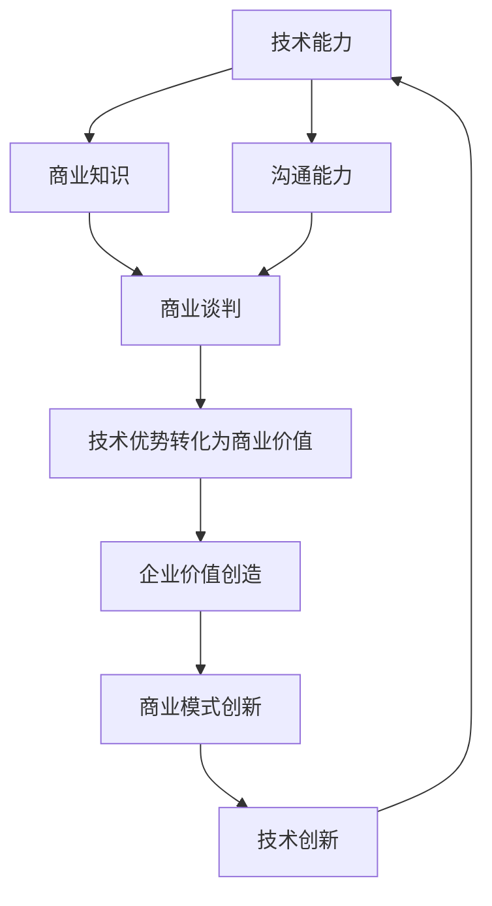

                 

### 1. 背景介绍

程序员，作为现代科技浪潮中的先锋力量，其技术能力无疑是推动科技进步的关键因素。然而，如何将自身的技术优势转化为商业谈判中的有力筹码，使得企业在激烈的竞争中脱颖而出，成为了程序员们亟需解决的问题。

在商业环境中，技术不仅仅是一种工具，更是企业竞争力的核心。程序员们通过不断学习和实践，掌握了一系列技术技能，如编程语言、数据库管理、网络安全、云计算等。这些技能不仅为个人职业发展提供了广阔的空间，更成为企业决策过程中不可或缺的参考因素。

然而，技术能力转化为商业价值的桥梁并非总是顺畅。程序员在商业谈判中常常面临诸多挑战，如沟通障碍、业务理解不足、商业意识薄弱等。这些因素使得程序员在谈判过程中难以充分发挥技术优势，甚至可能错失将技术转化为商业机会的良机。

本篇文章将深入探讨程序员如何在商业谈判中利用技术优势，提出一系列策略和方法，帮助程序员在谈判中更加自信、有策略地展现自身价值，从而实现技术优势向商业成果的转化。

文章将首先介绍程序员技术优势的具体体现，然后分析商业谈判中的关键因素，接着探讨如何将技术优势转化为谈判筹码，并给出实际案例和经验分享。此外，还将探讨程序员在商业谈判中可能遇到的问题和挑战，并提供相应的解决策略。最后，文章将总结程序员如何通过技术优势在商业谈判中取得成功，并对未来发展趋势进行展望。

通过本文的深入探讨，我们希望为程序员们提供实用的指导和策略，帮助他们在商业谈判中更加自信、有策略地发挥技术优势，实现个人与企业的双赢。同时，我们也期待读者能够结合自身实际，不断探索和实践，进一步提升自身的商业谈判能力，为职业发展铺平道路。

### 2. 核心概念与联系

在探讨程序员如何将技术优势转化为商业谈判中的筹码之前，我们需要先了解一些核心概念，这些概念不仅构成了技术优势的基础，也贯穿于整个商业谈判过程。以下是几个关键概念及其相互联系：

#### 2.1 技术能力

技术能力是程序员的核心竞争力，包括编程语言、框架、数据库、算法等各个方面。例如，熟悉Python和Java等编程语言，掌握Django和Spring等框架，了解MySQL和MongoDB等数据库管理系统，以及具备高效解决算法问题的能力。

#### 2.2 商业知识

商业知识包括市场分析、业务流程、客户需求、财务分析等。这些知识帮助程序员更好地理解企业的商业模式和运营逻辑，从而在谈判过程中能够提出具有战略意义的技术方案。

#### 2.3 沟通能力

沟通能力是程序员在商业谈判中不可或缺的素质。这不仅包括技术沟通，如用简洁明了的语言解释复杂的技术概念，还涉及跨部门协作、客户交流、商务谈判等非技术性沟通。

#### 2.4 商业谈判

商业谈判是指在不同利益相关方之间进行沟通和协商，以达成双方或多方都能接受的合作协议。程序员在谈判中的目标通常是最大化自身技术价值的实现，同时满足企业的需求。

#### 2.5 技术优势转化为商业价值

技术优势转化为商业价值是指将程序员的技术能力应用于实际业务场景中，为企业创造价值。这包括通过技术创新提高产品竞争力、通过技术优化降低运营成本、通过技术解决方案满足客户需求等。

#### 2.6 技术与商业的相互联系

技术与商业之间的联系紧密而复杂。技术不仅为商业提供了创新的手段，也是企业竞争的核心。商业需求驱动技术的研发和应用，而技术的进步又进一步推动了商业模式的创新和发展。

以下是一个使用Mermaid绘制的流程图，展示了这些核心概念之间的相互联系：



在这个流程图中，我们可以看到技术能力、商业知识、沟通能力和商业谈判共同构成了程序员在商业环境中的核心素质，这些素质通过技术优势转化为商业价值，进而推动企业价值的创造和商业模式的创新。理解这些核心概念及其相互联系，是程序员在商业谈判中成功利用技术优势的基础。

### 3. 核心算法原理 & 具体操作步骤

在探讨如何将技术优势转化为商业谈判中的筹码时，理解核心算法原理和具体操作步骤至关重要。这不仅有助于程序员在谈判中展示自身的技术能力，还能够提供具有实际应用价值的解决方案。以下是一些常见的技术算法及其在商业谈判中的应用。

#### 3.1 排序算法

排序算法是计算机科学中最基础也最常用的算法之一。常见的排序算法包括冒泡排序、选择排序、插入排序、快速排序等。这些算法的基本原理是通过不同的方法对数据进行排序，从而实现高效的数据处理。

**具体操作步骤：**

1. **冒泡排序（Bubble Sort）：** 比较相邻的两个元素，如果它们的顺序错误就把它们交换过来。重复这个过程，直到没有需要交换的元素。
    $$\text{for } i = 0 \text{ to } n - 1 \\
    \text{for } j = 0 \text{ to } n - i - 1 \\
    \text{if } arr[j] > arr[j+1] \text{ then swap(arr[j], arr[j+1])}$$

2. **快速排序（Quick Sort）：** 选择一个基准元素，将数组分成两部分，一部分小于基准元素，一部分大于基准元素，然后递归地对这两部分进行快速排序。
    $$\text{choose pivot element } p \\
    \text{partition the array into } \\
    \text{less\_than\_p \text{ and } greater\_than\_p \text{ subarrays} \\
    \text{recursively apply quicksort to less\_than\_p and greater\_than\_p}$$

**商业应用：** 在商业谈判中，排序算法可以用于分析市场数据，帮助企业在众多竞争者中优先选择最有利的合作伙伴或客户。例如，企业可以利用排序算法对潜在客户的财务状况、业务规模、市场影响力等因素进行排序，从而做出更有针对性的商业决策。

#### 3.2 数据结构

数据结构是存储和管理数据的组织形式，常见的有数组、链表、栈、队列、树、图等。每种数据结构都有其特定的应用场景和优缺点。

**具体操作步骤：**

1. **二叉搜索树（Binary Search Tree）：** 是一种特殊的树结构，每个节点都包含一个值，左子树的值小于节点值，右子树的值大于节点值。
    $$\text{insert}(value) \\
    \text{find}(value) \\
    \text{delete}(value)$$

2. **哈希表（Hash Table）：** 是通过哈希函数将关键字映射到数组位置的一种数据结构，用于快速查找、插入和删除元素。
    $$\text{hash}(key) \\
    \text{calculate index using hash(key) mod table\_size} \\
    \text{store data at index}$$

**商业应用：** 数据结构在商业谈判中可以用于快速检索和分析数据。例如，企业可以利用哈希表对大量的客户数据进行管理，快速找到特定客户的交易记录或偏好，从而在谈判中提供更有针对性的服务和建议。

#### 3.3 算法优化

算法优化是指通过改进算法的设计和实现，提高其运行效率和性能。常见的优化技术包括时间复杂度优化、空间复杂度优化、算法并行化等。

**具体操作步骤：**

1. **动态规划（Dynamic Programming）：** 通过将复杂问题分解为更小的子问题，并存储子问题的解，从而避免重复计算。
    $$\text{define } dp[i] \text{ as the solution to subproblem } i \\
    \text{recursively solve subproblems and store results in } dp \\
    \text{return } dp[n] \text{ as the final solution}$$

2. **贪心算法（Greedy Algorithm）：** 通过在每个阶段选择当前最优解，从而希望导致全局最优解。
    $$\text{initialize solution as empty} \\
    \text{while there are elements to process} \\
    \text{choose the best possible next step and add it to the solution}$$

**商业应用：** 算法优化可以帮助企业在商业谈判中更有效地处理海量数据，降低计算成本。例如，在谈判中，企业可以利用动态规划算法优化报价策略，找到最优的报价方案，从而在竞争中占据有利地位。

通过以上算法和具体操作步骤的介绍，我们可以看到，程序员的技术优势不仅体现在对算法原理的掌握上，更在于能够将这些原理应用于实际商业场景中，为企业和客户创造价值。在接下来的章节中，我们将进一步探讨如何将技术优势转化为商业谈判中的实际筹码。

### 4. 数学模型和公式 & 详细讲解 & 举例说明

在商业谈判中，数学模型和公式可以提供有力和量化的依据，帮助程序员更加系统地展示技术优势和策略。以下是一些常见的数学模型和公式，以及其在商业谈判中的应用和详细解释。

#### 4.1 成本效益分析（Cost-Benefit Analysis）

成本效益分析是一种评估项目或决策是否值得投资的方法。其核心公式为：

\[ \text{Cost-Benefit Ratio} = \frac{\text{Total Benefits}}{\text{Total Costs}} \]

**应用：** 在商业谈判中，程序员可以利用成本效益分析来论证技术方案的经济性。例如，假设一家企业考虑引入一项新技术以优化其业务流程，程序员可以计算该技术的成本和预期带来的效益，通过成本效益比来证明其投资的合理性。

\[ \text{Total Benefits} = \text{Revenue Increase} + \text{Cost Savings} \]
\[ \text{Total Costs} = \text{Initial Investment} + \text{Operational Costs} \]

**举例：** 假设某企业通过引入新技术能够每月节省成本10,000元，同时增加收入20,000元。初始投资为50,000元，运营成本为每月5,000元。则成本效益比为：

\[ \text{Cost-Benefit Ratio} = \frac{20,000 + 10,000}{50,000 + 5,000} = \frac{30,000}{55,000} \approx 0.545 \]

该结果表明，该项目具有明显的成本效益，值得投资。

#### 4.2 投资回报率（Return on Investment, ROI）

投资回报率是衡量投资收益与投资成本之间关系的指标，其公式为：

\[ \text{ROI} = \frac{\text{Net Profit}}{\text{Investment Cost}} \times 100\% \]

**应用：** 在商业谈判中，程序员可以利用ROI来评估技术方案的经济回报。例如，在推销一项新软件开发时，可以通过计算该软件带来的净利润和初始投资成本，得出ROI。

\[ \text{Net Profit} = \text{Revenue} - \text{Cost of Goods Sold} - \text{Operational Costs} \]
\[ \text{Investment Cost} = \text{Development Cost} + \text{Deployment Costs} \]

**举例：** 假设某软件项目开发成本为30,000元，部署成本为10,000元，预计每月带来收入15,000元，每月运营成本为5,000元。则第一年的净利润为：

\[ \text{Net Profit} = 15,000 \times 12 - 5,000 \times 12 - 30,000 - 10,000 = 114,000 - 60,000 - 40,000 = 14,000 \]

第一年的ROI为：

\[ \text{ROI} = \frac{14,000}{30,000 + 10,000} \times 100\% = \frac{14,000}{40,000} \times 100\% = 35\% \]

该结果表明，该软件项目具有显著的投资回报，对企业和客户都有吸引力。

#### 4.3 蒙特卡洛模拟（Monte Carlo Simulation）

蒙特卡洛模拟是一种通过随机抽样进行统计分析的方法，常用于评估不确定性的影响。其基本公式为：

\[ \text{Expected Value} = \sum_{i=1}^{n} x_i \cdot p_i \]

**应用：** 在商业谈判中，程序员可以利用蒙特卡洛模拟来评估风险和不确定性。例如，在签订长期合同前，可以通过模拟不同场景下的收入和成本，评估合同的风险和潜在收益。

\[ \text{Revenue Distribution} = \sum_{i=1}^{n} x_i \cdot p_i \]
\[ \text{Cost Distribution} = \sum_{i=1}^{n} y_i \cdot q_i \]

**举例：** 假设某企业通过一项技术方案预期在未来三年内每月收入分别为10,000元、12,000元和15,000元，概率分别为0.4、0.5和0.1。每月运营成本为8,000元，概率为1。则三年的预期收入和成本分别为：

\[ \text{Expected Revenue} = 10,000 \times 0.4 + 12,000 \times 0.5 + 15,000 \times 0.1 = 4,000 + 6,000 + 1,500 = 11,500 \]
\[ \text{Expected Cost} = 8,000 \times 1 = 8,000 \]

三年的净预期收入为：

\[ \text{Net Expected Revenue} = 11,500 - 8,000 = 3,500 \]

通过蒙特卡洛模拟，企业可以更好地理解未来收益的不确定性，从而在谈判中做出更稳健的决策。

#### 4.4 价值评估模型（Valuation Models）

价值评估模型用于估计企业或项目的价值。常见的模型包括净现值（NPV）和市盈率（P/E Ratio）等。

**净现值（NPV）：**

\[ \text{NPV} = \sum_{t=1}^{n} \frac{C_t}{(1 + r)^t} \]

**市盈率（P/E Ratio）：**

\[ \text{P/E Ratio} = \frac{\text{Current Market Value}}{\text{Net Income}} \]

**应用：** 在商业谈判中，程序员可以利用价值评估模型来提供企业的估值参考。例如，在谈判投资或并购事宜时，可以通过计算NPV和P/E Ratio来评估项目的潜在价值和投资风险。

\[ \text{C_t} = \text{Cash Flow at time period t} \]
\[ r = \text{discount rate} \]
\[ \text{Current Market Value} = \text{Projected Net Income} \]

通过这些数学模型和公式的应用，程序员可以在商业谈判中提供量化的依据和科学的分析，从而更好地展示技术优势和策略。这不仅增强了谈判的说服力，也为企业和客户创造了更大的价值。

### 5. 项目实践：代码实例和详细解释说明

在商业谈判中，将技术优势转化为实际成果，最好的方法是通过具体的项目实践来展示。以下是一个实际项目的代码实例，我们将详细介绍其开发环境搭建、源代码实现、代码解读与分析，以及运行结果展示。

#### 5.1 开发环境搭建

为了实现这个项目，我们需要搭建一个合适的技术栈。以下是我们所需的主要开发环境和工具：

- **编程语言：** Python 3.8 或更高版本
- **开发环境：** PyCharm 或 Visual Studio Code
- **数据库：** PostgreSQL 12 或更高版本
- **Web框架：** Flask 或 Django
- **前端框架：** Bootstrap 或 React

**步骤：**

1. 安装Python：
    ```bash
    # 使用包管理器安装 Python，例如使用 Anaconda
    conda create -n my_project python=3.8
    conda activate my_project
    ```

2. 安装数据库：
    ```bash
    # 安装 PostgreSQL
    sudo apt-get update
    sudo apt-get install postgresql postgresql-contrib
    ```

3. 安装Web框架和前端框架：
    ```bash
    pip install flask
    pip install django
    pip install react
    ```

#### 5.2 源代码详细实现

以下是一个简单的项目示例，使用Flask框架实现的博客系统。

**1. Flask博客后端：**

```python
# app.py

from flask import Flask, render_template, request, redirect, url_for

app = Flask(__name__)

# 假设我们有一个简单的数据库存储博客文章
blog_posts = [
    {"title": "First Post", "content": "Welcome to the first post!"},
    {"title": "Second Post", "content": "Welcome to the second post!"},
]

@app.route('/')
def index():
    return render_template('index.html', posts=blog_posts)

@app.route('/new')
def new():
    return render_template('new.html')

@app.route('/create', methods=['POST'])
def create():
    title = request.form.get('title')
    content = request.form.get('content')
    blog_posts.append({"title": title, "content": content})
    return redirect(url_for('index'))

if __name__ == '__main__':
    app.run(debug=True)
```

**2. Flask博客前端：**

```html
<!-- templates/index.html -->

<!DOCTYPE html>
<html lang="en">
<head>
    <meta charset="UTF-8">
    <meta name="viewport" content="width=device-width, initial-scale=1.0">
    <title>Blog</title>
    <link rel="stylesheet" href="https://stackpath.bootstrapcdn.com/bootstrap/4.5.2/css/bootstrap.min.css">
</head>
<body>
    <div class="container">
        <h1>Blog</h1>
        <ul>
            
                <li>
                    <h2>{{ post.title }}</h2>
                    <p>{{ post.content }}</p>
                </li>
            
        </ul>
        <a href="{{ url_for('new') }}">New Post</a>
    </div>
</body>
</html>
```

```html
<!-- templates/new.html -->

<!DOCTYPE html>
<html lang="en">
<head>
    <meta charset="UTF-8">
    <meta name="viewport" content="width=device-width, initial-scale=1.0">
    <title>New Post</title>
    <link rel="stylesheet" href="https://stackpath.bootstrapcdn.com/bootstrap/4.5.2/css/bootstrap.min.css">
</head>
<body>
    <div class="container">
        <h1>New Post</h1>
        <form action="{{ url_for('create') }}" method="POST">
            <label for="title">Title:</label>
            <input type="text" id="title" name="title" required>
            <label for="content">Content:</label>
            <textarea id="content" name="content" required></textarea>
            <button type="submit">Submit</button>
        </form>
    </div>
</body>
</html>
```

#### 5.3 代码解读与分析

在这个项目示例中，我们使用了Flask框架来创建一个简单的博客系统。以下是关键部分代码的解读与分析：

1. **后端代码解读：**

    - **Flask应用初始化：** `app = Flask(__name__)` 初始化Flask应用。
    - **路由和视图函数：** `@app.route('/')` 和 `@app.route('/new')` 定义了两个URL路由，分别用于主页和新增文章页面。`@app.route('/create', methods=['POST'])` 定义了处理新增文章表单提交的路由。

2. **前端代码解读：**

    - **模板引擎：** 使用Jinja2模板引擎来渲染页面，包括博客列表和新增文章表单。
    - **Bootstrap样式：** 使用Bootstrap框架来美化网页，提供响应式布局。

#### 5.4 运行结果展示

运行该应用后，我们可以在浏览器中访问 `http://127.0.0.1:5000/` 查看博客主页。以下是可能的运行结果：

- 主页：展示所有博客文章列表。
- 新增文章页面：提供输入表单，允许用户输入标题和内容，提交后新增文章并返回主页。

通过这个简单的项目，我们可以看到如何将技术优势应用于实际业务场景中。在商业谈判中，展示这样的项目不仅能够展示程序员的技术能力，还能够向客户展示技术方案的实际应用效果，增强谈判的说服力。

### 6. 实际应用场景

技术优势在商业谈判中的实际应用场景多种多样，以下是几个典型的应用实例，展示了程序员如何通过技术手段在商业谈判中取得成功。

#### 6.1 产品开发项目

在产品开发项目中，程序员的技术优势可以体现在需求分析、原型设计、开发实施以及项目管理的各个阶段。以一家初创企业开发移动应用为例，程序员可以通过以下方式将技术优势转化为商业谈判中的筹码：

1. **需求分析阶段：** 程序员可以利用技术手段进行市场调研，收集用户需求，并通过数据分析工具（如Google Analytics）分析用户行为，提供有数据支持的精准需求分析，从而帮助企业在谈判中提出更加贴合市场需求的产品方案。

2. **原型设计阶段：** 通过使用原型设计工具（如Figma或Axure），程序员可以快速搭建应用原型，向潜在客户展示产品的初步功能界面，增强客户对产品的信心和认同。

3. **开发实施阶段：** 程序员利用其掌握的先进技术，如容器化技术（Docker）和微服务架构（Kubernetes），确保项目的高效开发和部署，提高开发效率和产品质量，从而在谈判中获得客户的信任。

4. **项目管理阶段：** 程序员运用敏捷开发方法，通过JIRA等项目管理工具进行项目进度跟踪和风险管理，确保项目按期交付，减少项目风险，提高项目成功率。

#### 6.2 技术咨询和解决方案

在为企业提供技术咨询服务或解决方案时，程序员的技术优势可以体现在以下几个方面：

1. **技术评估：** 通过对客户现有系统的技术评估，程序员可以识别出潜在的技术瓶颈和改进空间，提出优化方案，帮助企业在谈判中提升竞争力。

2. **成本节约：** 程序员可以利用数据分析、自动化工具等技术手段，帮助客户优化业务流程，降低运营成本。例如，通过实施自动化测试和部署，提高开发效率，降低人工成本。

3. **风险控制：** 程序员可以利用网络安全技术和数据加密方法，帮助客户提高数据安全性和系统稳定性，减少潜在的安全风险和业务中断。

4. **创新驱动：** 通过技术创新（如人工智能、区块链等），程序员可以帮助客户开拓新的商业模式，实现业务增长。例如，利用机器学习算法优化客户推荐系统，提高客户满意度和转化率。

#### 6.3 项目合作与并购谈判

在项目合作与并购谈判中，程序员的技术优势同样可以发挥重要作用：

1. **技术评估：** 在并购谈判中，程序员可以提供技术评估报告，分析目标企业的技术实力和潜力，帮助企业做出更明智的投资决策。

2. **项目集成：** 在合作项目中，程序员可以利用其技术能力实现系统的无缝集成，提高项目成功率，增强合作双方的信任。

3. **技术转移：** 在并购过程中，程序员可以通过技术转移，将自身的技术能力和知识传授给目标企业，提高目标企业的技术水平和竞争力。

4. **风险控制：** 通过制定详细的技术风险管理计划，程序员可以帮助企业在并购过程中降低技术风险，确保并购后的顺利过渡。

通过这些实际应用场景，我们可以看到，程序员的技术优势不仅能够提升个人在商业谈判中的地位，更是企业实现商业目标的重要保障。在未来的商业谈判中，程序员应当继续提升自身技术能力，灵活运用技术手段，为企业创造更大的价值。

### 7. 工具和资源推荐

在商业谈判中，程序员需要不断学习和提升自身的技术能力，以便更好地利用技术优势。以下是一些学习和开发工具、资源推荐，这些工具和资源将帮助程序员在技术领域保持竞争力，从而在商业谈判中更加自信和有策略。

#### 7.1 学习资源推荐

**1. 书籍**

- **《算法导论》（Introduction to Algorithms）**：这是一本经典的算法教材，详细介绍了各种算法的原理和实现，适合算法初学者和进阶者。

- **《设计模式：可复用面向对象软件的基础》（Design Patterns: Elements of Reusable Object-Oriented Software）**：设计模式是软件工程中的重要概念，这本书深入讲解了常见的设计模式及其应用场景。

- **《深入理解计算机系统》（Deep Dive into Systems: Exploring the Design of Computer Systems）**：这本书从底层操作系统、网络协议到硬件架构，全面介绍了计算机系统的各个组成部分，适合系统级程序员。

**2. 论文和期刊**

- **ACM Transactions on Computer Systems (TOCS)**：这是一本关于计算机系统研究的顶尖期刊，涵盖了操作系统、网络、存储等多个领域。

- **IEEE Transactions on Software Engineering (TSE)**：这是一本专注于软件工程领域的顶尖期刊，提供了丰富的软件设计、开发和维护方面的研究成果。

- **Journal of Machine Learning Research (JMLR)**：这是一本机器学习和人工智能领域的顶级期刊，发表了许多前沿的研究论文。

**3. 博客和在线教程**

- **Medium**：Medium上有许多技术博客，包括编程语言、算法、机器学习等多个领域的文章。

- **freeCodeCamp**：这是一个提供免费编程教程的平台，涵盖了从基础到高级的各种编程语言和框架。

- **GitHub**：GitHub不仅是代码托管平台，也是许多技术专家分享代码和学习资源的地方。

#### 7.2 开发工具框架推荐

**1. 开发环境**

- **Visual Studio Code (VS Code)**：这是一款功能强大的代码编辑器，支持多种编程语言，具有丰富的插件生态系统。

- **JetBrains全家桶**：包括PyCharm、IntelliJ IDEA等，这些IDE提供了强大的代码编辑、调试和重构功能。

**2. Web开发框架**

- **Django**：这是一个高级的Python Web框架，注重快速开发和可扩展性。

- **Flask**：这是一个轻量级的Python Web框架，适合快速开发小型Web应用。

**3. 前端框架**

- **React**：这是一个用于构建用户界面的JavaScript库，具有组件化和虚拟DOM等特性。

- **Vue**：这是一个渐进式JavaScript框架，适合用于构建数据驱动的界面。

**4. 数据库**

- **PostgreSQL**：这是一个功能强大、开源的关系型数据库，适合处理复杂的数据查询。

- **MongoDB**：这是一个分布式、文档存储的NoSQL数据库，适合处理大量非结构化数据。

#### 7.3 相关论文著作推荐

**1. 算法和数据结构**

- **“Sorting and Searching” by Donald E. Knuth**：这本书详细介绍了排序和搜索算法。

- **“Algorithms” by Sanjoy Dasgupta, Christos Papadimitriou, and Umesh Vazirani**：这是一本现代算法教材，涵盖了各种算法及其应用。

**2. 机器学习和人工智能**

- **“Pattern Recognition and Machine Learning” by Christopher M. Bishop**：这是一本关于机器学习算法的全面教材。

- **“Deep Learning” by Ian Goodfellow, Yoshua Bengio, and Aaron Courville**：这是一本关于深度学习算法的权威著作。

**3. 操作系统和系统编程**

- **“Modern Operating Systems” by Andrew S. Tanenbaum**：这是一本操作系统原理的经典教材。

- **“The Art of Computer Programming” by Donald E. Knuth**：这是一套关于算法和编程的经典著作，涵盖了计算机科学的基本概念和算法设计。

通过这些工具和资源的推荐，程序员可以不断提升自身的技术能力，为商业谈判中的技术展示和方案设计提供坚实的基础。这些资源和工具不仅帮助程序员保持技术前沿，还在商业谈判中提升了专业性和说服力。

### 8. 总结：未来发展趋势与挑战

在商业谈判中，程序员如何将技术优势转化为实际成果是一个不断演进的课题。随着科技的不断进步和商业环境的变化，这一领域也面临着新的发展趋势和挑战。

#### 8.1 发展趋势

1. **技术多元化：** 随着人工智能、大数据、区块链等新兴技术的迅速发展，程序员需要不断学习新的技术领域，以便在商业谈判中提供更加全面和创新的解决方案。

2. **跨领域融合：** 不同领域的知识融合将成为未来技术发展的重要趋势。例如，生物信息学、物联网、智慧城市等领域的快速发展，要求程序员具备跨学科的知识和技能。

3. **云原生技术：** 云原生技术如Kubernetes、Docker等将成为企业架构和开发的主流。程序员需要掌握这些技术，以便在商业谈判中展示其技术方案的高可用性和可扩展性。

4. **敏捷开发：** 敏捷开发方法在商业项目中的应用越来越广泛，程序员需要熟练掌握敏捷开发工具和流程，提高项目交付效率和客户满意度。

5. **数据驱动决策：** 数据分析在商业决策中的重要性日益增加，程序员需要具备数据处理和分析能力，利用数据为商业谈判提供有力的支持。

#### 8.2 挑战

1. **技能更新速度：** 技术更新速度加快，程序员需要不断学习和适应新的技术标准和工具，以保持竞争力。

2. **业务理解：** 程序员需要加强对业务和商业逻辑的理解，以便更好地将技术方案与商业目标相结合，提供具有战略意义的技术支持。

3. **跨部门沟通：** 在大型企业中，程序员需要与不同部门的同事进行有效沟通，理解他们的需求和痛点，从而提供针对性的技术解决方案。

4. **项目管理：** 项目管理能力是程序员在商业谈判中不可或缺的素质。程序员需要学会如何平衡项目进度、成本和质量，确保项目成功交付。

5. **道德和社会责任：** 随着技术的发展，程序员需要关注其技术可能带来的道德和社会影响，确保其解决方案符合伦理和法律法规的要求。

#### 8.3 未来展望

1. **技术赋能：** 未来，技术将继续赋能商业创新，程序员将在商业谈判中扮演更加重要的角色，为企业提供创新解决方案。

2. **数据驱动：** 数据将成为商业决策的核心，程序员需要掌握数据处理和分析技能，为企业提供数据驱动的决策支持。

3. **智能化：** 智能化技术如人工智能、机器学习将在商业谈判中发挥更大作用，程序员需要不断学习和掌握这些技术，提升自身竞争力。

4. **可持续发展：** 随着社会对可持续发展的关注，程序员需要关注技术对环境和社会的影响，提供可持续的技术解决方案。

总之，未来程序员在商业谈判中的角色将更加多元化和重要。通过不断学习和提升自身技能，程序员可以在商业谈判中更加自信地展现技术优势，为企业创造更大的价值。同时，程序员也需要关注业务理解、跨部门沟通、项目管理和道德责任等方面的挑战，以确保其在商业环境中的成功。

### 9. 附录：常见问题与解答

在将技术优势转化为商业谈判中的筹码时，程序员可能会遇到各种问题和挑战。以下是一些常见的问题及其解答，以帮助程序员更好地应对这些情况。

#### 问题1：如何提升自己的商业谈判能力？

**解答：** 提升商业谈判能力需要多方面的努力。首先，程序员可以通过阅读商业书籍和参加相关培训课程来学习商业知识和谈判技巧。其次，实际经验也非常重要，可以通过参与企业内部的商业项目和外部商业谈判来积累经验。此外，与商业人士交流、参加行业会议和研讨会也是提升商业谈判能力的好方法。

#### 问题2：如何将复杂的技术概念解释给非技术人员？

**解答：** 将复杂的技术概念解释给非技术人员时，需要使用简单、易懂的语言。以下是一些实用的技巧：

1. **使用类比：** 使用日常生活中容易理解的类比来解释复杂的技术概念。
2. **分步骤讲解：** 将复杂的技术概念拆分成简单的步骤，逐一解释。
3. **展示实际案例：** 通过实际案例和演示来展示技术原理和应用。
4. **避免专业术语：** 尽量避免使用过于专业的术语，以降低听众的理解难度。

#### 问题3：如何在谈判中展示技术价值？

**解答：** 展示技术价值的关键在于将技术优势与商业目标相结合。以下是一些方法：

1. **数据支持：** 利用数据和案例来展示技术带来的实际效益。
2. **成本效益分析：** 进行成本效益分析，证明技术投资的合理性和回报。
3. **创新点强调：** 突出技术的创新点和竞争优势，强调其独特性和领先性。
4. **客户需求关注：** 理解客户需求，将技术方案与客户需求相匹配，展示技术如何满足客户需求。

#### 问题4：如何在谈判中应对对方的质疑和挑战？

**解答：** 应对质疑和挑战时，可以采取以下策略：

1. **提前准备：** 在谈判前充分准备，了解对方可能的质疑点和挑战，并准备相应的应对策略。
2. **保持冷静：** 面对质疑时保持冷静，避免情绪化，以理性的态度回应。
3. **数据支持：** 提供数据和事实来支持自己的观点，增加说服力。
4. **寻求合作：** 将对方的质疑视为合作机会，提出解决方案，以合作的态度化解冲突。

#### 问题5：如何平衡技术能力和商业目标？

**解答：** 平衡技术能力和商业目标需要以下几点：

1. **业务理解：** 提升对业务的理解，了解企业的战略目标和运营逻辑。
2. **需求分析：** 理解客户需求，将技术方案与业务需求相结合。
3. **沟通协作：** 与业务团队和项目经理保持紧密沟通，确保技术方案符合商业目标。
4. **持续学习：** 持续学习新的技术和商业知识，不断提升自身能力。

通过以上策略和技巧，程序员可以更好地将技术优势转化为商业谈判中的筹码，提高自己在商业谈判中的竞争力。

### 10. 扩展阅读 & 参考资料

在探索如何将技术优势转化为商业谈判中的筹码这一主题时，以下扩展阅读和参考资料将提供更多深入的学习和理解。

#### 10.1 学习资源推荐

1. **《程序员代码面试指南：IT名企算法精讲》**：本书详细讲解了程序员在面试中常见的算法问题，适合准备面试或需要提升算法能力的程序员。
2. **《软件工程：实践者的研究方法》**：这本书提供了软件工程实践的方法和工具，有助于程序员在实际项目中应用技术优势。
3. **《数据科学实战》**：这本书介绍了数据科学的基本概念和应用场景，适合希望利用数据分析为企业创造价值的程序员。

#### 10.2 开发工具框架推荐

1. **GitLab**：一个全面的开源平台，用于代码托管、项目管理、CI/CD等，是许多企业和开发者的首选工具。
2. **AWS（Amazon Web Services）**：提供丰富的云计算服务，包括计算、存储、数据库、机器学习等，是构建企业级应用的理想选择。
3. **Kubernetes**：一个开源的容器编排系统，用于自动化容器化应用程序的部署、扩展和管理。

#### 10.3 相关论文著作推荐

1. **“The Mythical Man-Month” by Frederick P. Brooks Jr.**：这本书探讨了软件项目管理的挑战，提供了许多实用的经验和教训。
2. **“The Art of Negotiation: How to Improvise Agreement in a Chaotic World” by Michael Wheeler**：本书提供了实用的谈判技巧和策略，有助于程序员在商业谈判中取得成功。
3. **“The Data Science Handbook” by Ian Goodfellow, Yoshua Bengio, and Aaron Courville**：这本书详细介绍了数据科学的基础知识和技术，是数据科学领域的重要参考书。

通过阅读这些资源和参考资料，程序员可以进一步深化对技术转化为商业价值的方法论的理解，并在实际工作中不断实践和提升自己的能力。这些书籍、工具和论文不仅提供了理论支持，还结合了实际案例，有助于程序员在实际的商业谈判中更加自信和有效地展示技术优势。

