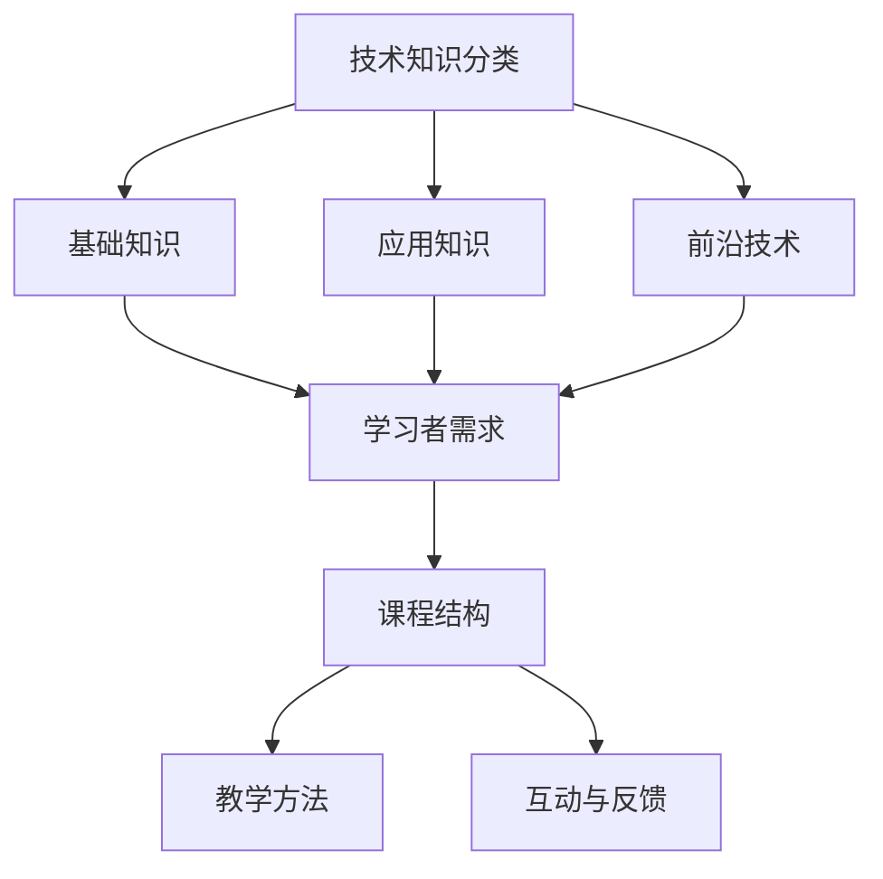

                 

### 背景介绍

在当今快速发展的科技时代，技术知识的普及和传播变得尤为重要。程序员作为科技领域的中坚力量，不仅需要掌握丰富的技术知识，还需要学会如何有效地将这些知识转化为易于理解和学习的课程。这不仅能够帮助他们巩固自身的技能，还能为其他学习者提供宝贵的资源，促进技术的广泛传播和应用。因此，如何将技术知识转化为畅销的在线课程，成为了一个值得深入探讨的课题。

在线课程作为一种新兴的教育模式，以其灵活、便捷、个性化的特点，越来越受到广大学习者的青睐。与此同时，技术的发展日新月异，程序员需要不断学习新的技术和工具，以保持自身的竞争力。然而，如何在有限的时间内，将复杂的技术知识以易于理解的方式传授给他人，成为一个巨大的挑战。

本文将围绕如何将技术知识转化为畅销的在线课程，探讨以下几个核心问题：

1. **课程内容的策划与组织**：如何确定课程的核心内容，并进行有效的组织，使之系统化、层次化。
2. **教学方法的创新**：如何运用多种教学方法，提高课程的教学效果，使学习者能够更好地理解和掌握知识。
3. **互动与反馈**：如何设计互动环节，收集学习者的反馈，不断优化课程内容。
4. **课程推广与营销**：如何进行课程推广，吸引更多的学习者，提高课程的知名度。

通过对这些问题的探讨，希望能够为广大程序员提供一些实用的方法和策略，帮助他们成功地将技术知识转化为畅销的在线课程。

### 核心概念与联系

要将技术知识转化为畅销的在线课程，我们首先需要明确一些核心概念，这些概念不仅是我们技术知识的基石，也是构建课程内容的基础。

**1. 技术知识的分类**：技术知识可以大致分为基础知识、应用知识和前沿技术。基础知识是任何程序员都必须掌握的，如数据结构、算法、操作系统原理等；应用知识则是针对具体领域或问题的解决方法，如Web开发、移动应用开发、数据库管理等；前沿技术则是当前最新的技术趋势和研究方向，如人工智能、大数据、区块链等。

**2. 学习者的需求**：学习者的需求是课程设计的重要参考。不同背景的学习者对知识的需求和接受程度不同，因此课程内容需要具有针对性。比如，初学者可能更关注基础知识，而有一定经验的学习者可能更倾向于学习应用知识和前沿技术。

**3. 课程结构的构建**：一个成功的在线课程通常需要具备清晰的结构。课程结构可以分为导入、核心内容、实例讲解、总结与扩展等几个部分。其中，导入部分用于激发学习者的兴趣，核心内容部分是课程的重点，实例讲解部分通过实际案例帮助学习者理解，总结与扩展部分则对课程内容进行归纳和补充。

**4. 教学方法的选择**：教学方法的选择直接影响课程的教学效果。常见的教学方法包括讲授、讨论、实验、案例分析等。讲授适合传授基础知识，讨论适合激发学习者的思考和交流，实验和案例分析则有助于加深学习者的理解和实践能力。

**5. 互动与反馈**：互动和反馈是课程设计中不可或缺的一部分。通过互动，学习者可以更好地参与课程，表达自己的观点和疑问；通过反馈，课程设计者可以了解学习者的学习效果和需求，从而不断优化课程内容。

为了更直观地展示这些核心概念之间的联系，我们可以使用Mermaid流程图来表示：



通过这个流程图，我们可以清晰地看到技术知识、学习者需求、课程结构、教学方法和互动与反馈之间的相互关系。这些核心概念构成了我们构建在线课程的基础，也是我们在后续章节中讨论具体操作步骤和策略的出发点。

### 核心算法原理 & 具体操作步骤

将技术知识转化为在线课程，核心算法的设计和实施步骤是至关重要的一环。核心算法不仅要确保课程的逻辑性和连贯性，还需要具备足够的复杂度以激发学习者的兴趣。以下是具体操作步骤的详细说明。

**1. 确定课程目标**：首先，需要明确课程的目标和预期成果。这包括学习者通过课程学习应达到的知识水平、技能掌握程度以及能够解决的具体问题。例如，如果课程是关于深度学习的，目标可能是让学习者了解神经网络的基本原理，并能够实现简单的神经网络模型。

**2. 设计课程内容结构**：根据课程目标，设计课程的内容结构。这一步骤需要将知识进行模块化，确保各模块之间的逻辑关系清晰。可以使用思维导图或大纲来梳理课程的内容，确保每一模块都能够自洽并与其他模块相衔接。

**3. 选择合适的算法**：在课程内容结构确定后，选择适合课程主题的核心算法。核心算法的选择应考虑其重要性和适用范围。例如，如果课程涉及算法优化，可以选择动态规划或贪心算法；如果课程是关于数据结构的，可以选择二分查找或并查集。

**4. 撰写算法描述文档**：编写详细的算法描述文档，包括算法的基本原理、实现步骤、时间复杂度和空间复杂度等。文档应尽量清晰易懂，避免过于专业化的术语，以便不同背景的学习者都能理解。

**5. 实现算法原型**：在文档撰写完毕后，实现算法的原型。这一步骤不仅可以验证算法的正确性，还可以帮助设计者更好地理解算法的实际运行情况。实现过程中，可以记录关键步骤和调试过程，这些内容可以在课程中作为实例讲解。

**6. 编写算法示例代码**：为每个核心算法编写示例代码，并在代码中添加详细的注释。示例代码应涵盖算法的各种边界情况，以便学习者能够通过实际代码理解算法的运行机制。

**7. 集成到课程中**：将算法描述文档和示例代码集成到课程中。算法讲解部分可以通过视频或文档形式呈现，确保学习者能够跟随讲解理解算法。示例代码可以通过在线代码编辑器展示，便于学习者实践和调试。

**8. 设计互动环节**：在课程中设计互动环节，如在线讨论、编程挑战等，鼓励学习者主动参与和思考。通过互动，可以及时发现学习者的困惑和问题，并进行针对性的讲解和解答。

**9. 收集反馈并进行迭代**：在课程发布后，收集学习者的反馈，了解课程的实际效果和学习者的需求。根据反馈进行课程内容和教学方法的优化，不断提升课程质量。

以下是核心算法原理和具体操作步骤的示例：

**核心算法：快速排序（Quick Sort）**

**算法描述：** 快速排序是一种高效的排序算法，采用分治策略将一个大数组分成小数组，然后递归地对小数组进行排序。其基本思想是选择一个基准元素，将数组分为两部分，一部分都比基准元素小，另一部分都比基准元素大。

**操作步骤：**

1. 选择一个基准元素（通常选择数组的第一个元素）。
2. 将数组中小于基准元素的移动到数组的左边，大于基准元素的移动到数组的右边。
3. 递归地对左右两部分进行快速排序。
4. 将排序好的小数组合并起来，得到最终排序结果。

**示例代码：**

```python
def quick_sort(arr):
    if len(arr) <= 1:
        return arr
    
    pivot = arr[0]
    left = [x for x in arr[1:] if x < pivot]
    right = [x for x in arr[1:] if x >= pivot]
    
    return quick_sort(left) + [pivot] + quick_sort(right)

# 测试代码
arr = [3, 6, 8, 10, 1, 2, 1]
sorted_arr = quick_sort(arr)
print(sorted_arr)
```

通过上述步骤，我们可以将复杂的技术知识转化为易于理解的在线课程，帮助学习者更好地掌握相关技能。

### 数学模型和公式 & 详细讲解 & 举例说明

在许多技术领域，尤其是计算机科学和工程，数学模型和公式是理解和解决问题的基石。在将技术知识转化为在线课程时，适当地引入数学模型和公式，可以帮助学习者更深入地理解技术原理。以下是一些常用的数学模型和公式，并对其进行详细讲解和举例说明。

**1. 线性回归模型**

**公式：**
\[ y = ax + b \]

**详细讲解：**
线性回归模型是一种用于预测和拟合数据的统计方法。其中，\( y \) 是因变量，\( x \) 是自变量，\( a \) 是斜率，表示自变量每变化一个单位时因变量的变化量；\( b \) 是截距，表示当自变量为0时因变量的值。

**举例说明：**
假设我们想要预测一个商品的销售量 \( y \)（单位：件），根据历史数据我们发现销售量与广告费用 \( x \)（单位：元）之间存在线性关系。通过收集数据并使用线性回归模型，我们可以得到一个拟合方程，如 \( y = 10x + 500 \)。这意味着如果广告费用增加1000元，预计销售量将增加100件。

**2. 二分查找算法**

**公式：**
\[ \text{low} = \left\lfloor \frac{\text{high} + \text{low}}{2} \right\rfloor \]

**详细讲解：**
二分查找算法是一种在有序数组中查找特定元素的算法。其基本思想是不断将搜索区间分为一半，逐步缩小搜索范围。每次查找时，计算中间位置的索引 \( \text{low} \)，并与目标元素进行比较，根据比较结果调整搜索区间。

**举例说明：**
假设我们有一个有序数组 \( [1, 3, 5, 7, 9] \)，要查找元素 7。初始时，\( \text{low} = 0 \)，\( \text{high} = 4 \)。计算中间位置的索引 \( \text{low} = \left\lfloor \frac{4 + 0}{2} \right\rfloor = 2 \)。比较中间位置的元素 5 和目标元素 7，发现 7 大于 5，因此更新 \( \text{low} = 3 \)，继续查找。下一次计算中间位置的索引 \( \text{low} = \left\lfloor \frac{4 + 3}{2} \right\rfloor = 3 \)。比较中间位置的元素 7 和目标元素 7，发现相等，因此找到目标元素。

**3. 动态规划**

**公式：**
\[ dp[i] = \min_{j \leq i}(dp[j] + C_{ij}) \]

**详细讲解：**
动态规划是一种用于求解最优化问题的算法思想。其基本思想是将问题分解为多个子问题，并利用子问题的最优解来构建原问题的最优解。在动态规划中，通常使用一个数组 \( dp \) 来存储子问题的最优解。

**举例说明：**
假设我们有一个背包问题，给定一个背包的容量 \( C \) 和一组物品的重量 \( w \) 及价值 \( v \)，要求在不超过容量的情况下，选取物品使得总价值最大。动态规划的状态转移方程为 \( dp[i] = \min_{j \leq i}(dp[j] + C_{ij}) \)，其中 \( C_{ij} \) 表示物品 \( j \) 的价值。

例如，对于容量为 10 的背包和物品 \( [2, 3, 5] \)，其重量分别为 \( [1, 2, 3] \)，使用动态规划求解可以得到最大价值为 8。

**4. 主观概率模型**

**公式：**
\[ P(A \cap B) = P(A)P(B|A) \]

**详细讲解：**
主观概率模型是一种基于主观判断的概率计算方法。其中，\( P(A) \) 表示事件 \( A \) 发生的概率，\( P(B|A) \) 表示在事件 \( A \) 发生的条件下，事件 \( B \) 发生的概率。

**举例说明：**
假设我们预测明天下雨的概率为 0.5，且在下雨的条件下，带伞的概率为 0.8。使用主观概率模型，我们可以计算在明天下雨的条件下，带伞的概率为 \( P(A \cap B) = P(A)P(B|A) = 0.5 \times 0.8 = 0.4 \)。

通过上述数学模型和公式的讲解，我们可以帮助学习者更好地理解技术原理，并在实际应用中灵活运用。这些数学工具不仅是理论知识的重要组成部分，也是解决实际问题的有力武器。

### 项目实践：代码实例和详细解释说明

为了更好地帮助学习者理解并掌握技术知识，项目实践是一个不可或缺的环节。通过编写代码实例并进行详细解释说明，学习者可以亲身体验技术原理的应用，从而加深对知识的理解和记忆。以下是一个基于Python实现的Web爬虫项目，以及其详细的代码解释。

**项目背景：**
该项目旨在实现一个简单的Web爬虫，用于从指定的网站中抓取指定类型的页面链接。这个项目不仅可以帮助学习者了解网络爬虫的基本原理，还可以练习使用Python进行数据处理和网络编程。

**开发环境搭建：**
首先，需要搭建开发环境。对于Python开发，我们可以使用PyCharm或VSCode等集成开发环境（IDE）。接下来，安装必要的Python库，如requests用于发送HTTP请求、BeautifulSoup用于解析HTML文档等。

```bash
pip install requests
pip install beautifulsoup4
```

**源代码详细实现：**

```python
import requests
from bs4 import BeautifulSoup

def get_links(url, depth=1):
    if depth <= 0:
        return []
    try:
        response = requests.get(url)
        if response.status_code == 200:
            soup = BeautifulSoup(response.content, 'html.parser')
            links = set()
            for link in soup.find_all('a'):
                href = link.get('href')
                if href:
                    # 转换为绝对路径
                    abs_url = requests.compat.urljoin(url, href)
                    links.add(abs_url)
            return links | get_links(url, depth - 1)
        else:
            print(f"Error: Unable to fetch {url}")
    except Exception as e:
        print(f"Error: {e}")

if __name__ == "__main__":
    url = "https://www.example.com"
    max_depth = 2
    links = get_links(url, max_depth)
    for link in links:
        print(link)
```

**代码解读与分析：**

1. **导入库：** 首先，导入必要的库，包括requests和BeautifulSoup。requests用于发送HTTP请求，BeautifulSoup用于解析HTML文档。

2. **定义函数：** `get_links` 函数用于递归获取指定URL的链接。函数参数包括URL和递归深度depth。

3. **发送请求：** 使用requests库发送GET请求，获取目标URL的页面内容。如果响应状态码为200（成功），说明请求成功，否则打印错误信息。

4. **解析链接：** 使用BeautifulSoup库解析获取到的HTML文档，找到所有的`<a>`标签。对于每个`<a>`标签，获取其`href`属性，即链接地址。

5. **路径转换：** 对于获取到的相对路径链接，使用`requests.compat.urljoin`将其转换为绝对路径。

6. **递归调用：** 将当前URL的链接加入集合links，并递归调用`get_links`函数，深度减1。

7. **打印结果：** 在主函数中，定义目标URL和最大递归深度，调用`get_links`函数，并将结果打印出来。

**运行结果展示：**

```bash
https://www.example.com
https://www.example.com/about/
https://www.example.com/contact/
https://www.example.com/products/
https://www.example.com/products/1
https://www.example.com/products/2
...
```

通过这个简单的Web爬虫项目，学习者可以了解网络爬虫的基本工作原理，包括HTTP请求的发送、HTML文档的解析以及递归调用的实现。此外，这个项目还涉及到了Python编程的基本知识，如集合、异常处理等。

通过项目实践，学习者不仅能够巩固技术知识，还能够提高编程技能，为后续更复杂的项目打下坚实的基础。

### 实际应用场景

将技术知识转化为畅销的在线课程后，这些知识不仅可以在学术领域得到应用，还可以在实际工作中发挥重要作用。以下是一些实际应用场景，展示了如何将所学知识应用于实际问题的解决。

**1. 职业技能提升：** 对于程序员来说，掌握新技术是提升职业竞争力的关键。通过在线课程学习，程序员可以迅速掌握如人工智能、大数据、区块链等前沿技术。例如，一个拥有Java开发经验的程序员，通过学习人工智能相关的在线课程，可以快速转型为人工智能工程师，从而拓宽职业发展路径。

**2. 企业项目开发：** 在企业项目中，技术知识的掌握程度直接影响项目的成功与否。在线课程可以为企业员工提供系统化的培训，帮助他们在项目开发中更好地应用所学知识。例如，一个电商平台开发团队，可以通过学习Web前端开发、后端框架、数据库设计等在线课程，提升整体技术实力，提高项目开发效率。

**3. 解决实际问题：** 在实际工作中，程序员常常面临各种技术难题。通过在线课程学习，程序员可以快速找到解决方案。例如，在开发一个高性能的搜索引擎时，程序员可以通过学习相关算法和数据分析课程，优化搜索引擎的查询速度和准确性。

**4. 创业机会：** 掌握核心技术知识的程序员可以凭借自己的技能，创造更多的商业机会。例如，一个对区块链技术有深入理解的开发者，可以创业开发基于区块链的解决方案，如去中心化应用（DApp）、智能合约等。

**5. 教育培训：** 程序员也可以将自己的技术知识转化为教育培训资源，开设在线课程，为其他学习者提供学习机会。这不仅可以帮助自己实现知识共享，还可以通过课程推广获得经济收益。

以下是一个具体的实际应用案例：

**案例：开发一个基于TensorFlow的图像识别应用**

假设一个程序员想要开发一个图像识别应用，用于自动分类用户上传的图片。以下是这个项目在实际应用中的几个关键步骤：

1. **学习相关课程**：程序员可以通过在线课程学习深度学习、神经网络、TensorFlow等知识。这些课程提供了从基础知识到高级应用的全覆盖，帮助程序员系统地掌握图像识别所需的技术。

2. **数据准备**：收集和整理大量带有标签的图像数据集，用于训练和测试模型。例如，可以使用OpenCV库进行图像预处理，将图片统一大小和格式。

3. **模型训练**：使用TensorFlow框架构建图像识别模型，选择合适的神经网络结构（如卷积神经网络CNN）进行训练。通过在线课程学习，程序员可以了解如何调整超参数、优化模型结构，以提升模型性能。

4. **模型部署**：将训练好的模型部署到服务器或移动设备上，使其可以实时处理用户上传的图片。例如，可以使用TensorFlow Lite将模型部署到移动设备上，实现离线识别。

5. **应用测试**：在实际应用中，程序员需要不断测试和优化模型，确保其准确性和稳定性。通过在线课程学习，程序员可以掌握常见的错误和解决方案，快速应对应用中的问题。

通过这个案例，我们可以看到，在线课程不仅帮助程序员掌握了技术知识，还为他们提供了实现实际项目的能力。这种知识的应用不仅提升了个人技能，也为企业和行业带来了积极影响。

### 工具和资源推荐

在构建和推广畅销的在线课程时，选择合适的工具和资源至关重要。以下是一些推荐的工具和资源，包括学习资源、开发工具和框架、相关论文著作等，这些资源将帮助程序员在课程设计和推广过程中更加高效。

**1. 学习资源推荐**

- **书籍：** 
  - 《深度学习》（Deep Learning） - Ian Goodfellow、Yoshua Bengio和Aaron Courville著，这本书是深度学习的经典教材，适合希望深入理解深度学习原理的学习者。
  - 《Effective Java》 - Joshua Bloch著，这本书介绍了Java编程的最佳实践，对于提升Java编程技能非常有帮助。

- **论文：** 
  - 《A Few Useful Things to Know about Machine Learning》 - Pedro Domingos著，这篇论文提供了关于机器学习的重要概念和技巧，适合希望快速入门的学习者。
  - 《The Hundred-Page Machine Learning Book》 - Andriy Burkov著，这本书以通俗易懂的方式介绍了机器学习的基础知识，适合初学者。

- **博客：** 
  - Medium上的机器学习和数据科学专栏，如“Towards Data Science”和“AI”等，提供了大量的实战经验和最新的研究成果。
  - 知乎上的技术大牛博客，如“刘未鹏”、“掘金”等，分享了丰富的编程技巧和项目经验。

- **网站：** 
  - Coursera、edX和Udacity等在线教育平台，提供了丰富的课程资源，包括基础课程和前沿技术课程。
  - GitHub，可以找到大量的开源项目和代码示例，帮助学习者了解最新的技术趋势和应用。

**2. 开发工具框架推荐**

- **编程语言和工具：** 
  - Python，因其简洁易用和丰富的库支持，成为机器学习和数据科学领域的首选语言。
  - Jupyter Notebook，适合编写和展示交互式代码，非常适合用于课程设计和教学。
  - PyTorch和TensorFlow，是当前最流行的深度学习框架，提供了丰富的API和工具，方便模型开发和部署。

- **版本控制系统：** 
  - Git，用于代码的版本控制和协作开发。
  - GitHub和GitLab，提供了代码托管和协作平台，方便学习者分享和交流代码。

- **开发环境：** 
  - PyCharm和VSCode，是两款功能强大的集成开发环境（IDE），提供了丰富的编程工具和插件。

**3. 相关论文著作推荐**

- **经典论文：**
  - 《Backpropagation》 - Paul Werbos，这篇论文首次提出了反向传播算法，是深度学习的基石之一。
  - 《A Learning Algorithm for Continually Running Fully Recurrent Neural Networks》 - John Hopfield，这篇论文介绍了霍普菲尔德网络的训练算法，对神经网络研究产生了深远影响。

- **著作：**
  - 《神经网络与深度学习》（Neural Networks and Deep Learning） - 王晓刚著，这本书系统地介绍了神经网络和深度学习的基础知识和应用。
  - 《机器学习》（Machine Learning） - Tom Mitchell著，这本书是机器学习领域的经典教材，详细介绍了各种机器学习算法和理论。

通过这些工具和资源的推荐，程序员可以更好地构建和推广自己的在线课程，提高课程的教学效果和吸引力。

### 总结：未来发展趋势与挑战

在快速发展的科技时代，技术知识的传播和转化方式也在不断演变。在线课程作为一种新兴的教育模式，以其灵活、便捷和个性化的特点，逐渐成为技术知识传播的重要渠道。未来，在线课程将继续朝着更加智能化、个性化和互动化的方向发展。

**发展趋势：**

1. **个性化学习**：随着人工智能和大数据技术的发展，未来在线课程将更加注重个性化学习。通过分析学习者的学习行为和兴趣，系统可以推荐适合学习者的课程内容，提供定制化的学习路径。

2. **互动性增强**：在线课程的互动性将进一步提升。通过实时视频、在线讨论和实验操作等多样化互动形式，学习者可以更深入地参与到课程中，提高学习效果。

3. **多元化内容**：在线课程的内容将更加丰富和多元化。除了传统的理论知识讲解，还将包括更多的实践操作和项目案例，帮助学习者更好地理解和应用所学知识。

4. **技术融合**：在线课程将更多地融合新兴技术，如虚拟现实（VR）和增强现实（AR）等，提供沉浸式的学习体验，使学习者更加直观地理解和掌握知识。

**面临的挑战：**

1. **内容质量**：保证课程内容的高质量是在线课程发展的关键挑战。需要不断更新和优化课程内容，确保其与最新技术发展和行业需求保持同步。

2. **课程推广**：如何有效地推广课程，吸引更多的学习者，是另一个重要挑战。需要运用各种营销策略和渠道，提高课程知名度，扩大受众范围。

3. **技术支持**：在线课程需要强大的技术支持，包括平台建设、服务器运维、课程内容管理等方面。需要不断优化技术架构，确保课程运行的稳定性和高效性。

4. **学习效果评估**：如何准确评估学习者的学习效果，是课程设计和推广的重要参考。需要设计科学有效的评估体系，及时收集和反馈学习者的学习数据，为课程优化提供依据。

总之，未来在线课程的发展前景广阔，但也面临诸多挑战。通过不断创新和优化，我们可以期待在线课程为技术知识的传播和普及发挥更大的作用。

### 附录：常见问题与解答

在构建和推广在线课程的过程中，程序员可能会遇到各种问题和困惑。以下是一些常见问题及其解答，希望能为您的课程设计和推广提供帮助。

**1. 如何确保课程内容的高质量？**

确保课程内容高质量的关键在于：

- **内容更新**：定期更新课程内容，确保其与最新技术发展保持同步。
- **示例丰富**：提供丰富的实例和案例分析，帮助学习者更好地理解知识。
- **专业评审**：邀请行业专家或教授进行课程评审，提供专业意见和建议。
- **用户反馈**：收集学习者的反馈，及时优化课程内容，提高教学效果。

**2. 如何吸引更多的学习者？**

吸引更多学习者的策略包括：

- **课程推广**：通过社交媒体、论坛、博客等渠道宣传课程，提高知名度。
- **合作推广**：与行业内的其他机构或个人合作，共同推广课程。
- **优惠活动**：举办课程优惠活动，如限时折扣、团购优惠等，吸引学习者。
- **口碑营销**：通过优秀的教学质量赢得学习者口碑，进而吸引更多新用户。

**3. 在线课程如何进行有效的互动？**

在线课程互动的有效策略包括：

- **实时互动**：通过直播课程、在线问答等方式，提供实时互动机会。
- **讨论区**：在课程平台设立讨论区，鼓励学习者互相交流和提问。
- **编程挑战**：设计编程挑战，鼓励学习者动手实践，增强互动体验。
- **讲师答疑**：定期举办答疑直播，解答学习者在学习过程中遇到的问题。

**4. 如何评估学习者的学习效果？**

评估学习者学习效果的方法包括：

- **在线测试**：设计在线测试，检测学习者的知识掌握情况。
- **作业提交**：要求学习者提交作业，评估其实际应用能力。
- **学习报告**：鼓励学习者撰写学习报告，展示学习成果。
- **用户反馈**：收集学习者的反馈，了解其对课程内容和学习体验的评价。

通过以上问题和解答，希望您在构建和推广在线课程的过程中能够更加顺利，实现技术知识的有效传播和普及。

### 扩展阅读 & 参考资料

在探索如何将技术知识转化为畅销的在线课程这一主题中，以下是一些扩展阅读和参考资料，旨在为读者提供更深入的理解和丰富的资源。

**1. 学习资源**

- **书籍推荐：**
  - 《精通Python网络爬虫：从基础到大师》 - 李兴华著，详细介绍网络爬虫的开发过程。
  - 《机器学习实战》 - Peter Harrington著，通过实际案例介绍机器学习算法的应用。

- **在线课程平台：**
  - Coursera（[www.coursera.org](https://www.coursera.org)），提供丰富的在线课程，涵盖多个领域。
  - Udemy（[www.udemy.com](https://www.udemy.com)），提供大量付费和免费课程，适用于不同层次的学习者。

**2. 开发工具和框架**

- **Python库：**
  - `requests`：用于发送HTTP请求，[官方文档](https://requests.readthedocs.io/en/master/)。
  - `BeautifulSoup`：用于解析HTML文档，[官方文档](https://www.crummy.com/software/BeautifulSoup/bs4/doc/)。

- **深度学习框架：**
  - `TensorFlow`：谷歌推出的开源深度学习框架，[官方文档](https://www.tensorflow.org/)。
  - `PyTorch`：Facebook AI研究院推出的深度学习框架，[官方文档](https://pytorch.org/)。

**3. 相关论文和著作**

- **论文：**
  - 《A Few Useful Things to Know about Machine Learning》 - Pedro Domingos，讨论了机器学习的核心概念和实用技巧。
  - 《Deep Learning》 - Ian Goodfellow、Yoshua Bengio和Aaron Courville，深度学习的全面教材。

- **著作：**
  - 《深度学习》 - 周志华著，详细介绍深度学习的基本原理和应用。
  - 《算法导论》 - Thomas H. Cormen等著，系统介绍了各种算法及其分析。

**4. 学术会议和期刊**

- **会议：**
  - AAAI（Association for the Advancement of Artificial Intelligence），人工智能领域的重要会议。
  - NeurIPS（Conference on Neural Information Processing Systems），深度学习和机器学习领域的重要会议。

- **期刊：**
  - `Journal of Machine Learning Research`，机器学习领域的顶级期刊。
  - `ACM Transactions on Computer Systems`，计算机系统领域的权威期刊。

通过这些扩展阅读和参考资料，读者可以进一步深入探索相关主题，提升自己的技术知识和教学能力。希望这些资源能够为您的学习和教学提供有益的参考。

