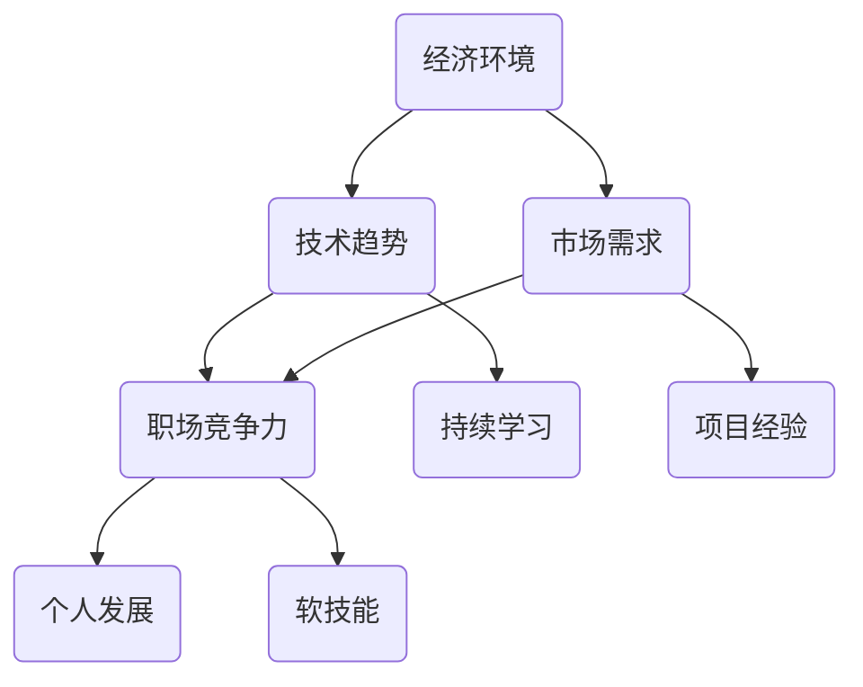

                 

### 文章标题

程序员如何应对经济与挑战

> **关键词**：经济挑战，程序员生存，职业发展，技能提升，职场竞争力，市场变化应对
> 
> **摘要**：本文将探讨在经济环境中，程序员如何应对各种挑战，包括技能提升、职场竞争和灵活适应市场变化。通过深入分析当前的行业趋势和需求，结合实际案例，我们将为程序员提供一系列实用的策略和技巧，帮助他们保持竞争力并实现职业成长。

### 1. 背景介绍

在全球经济日益复杂和多变的背景下，科技行业尤其是信息技术领域经历了巨大的变革。程序员作为这一领域的中坚力量，面临着前所未有的挑战和机遇。一方面，技术进步使得新的编程语言、框架和工具层出不穷，程序员需要不断更新和提升自己的技能；另一方面，经济波动、市场需求变化和行业竞争加剧，都对程序员提出了更高的要求。

近年来，全球范围内的经济挑战不断涌现，如金融危机、供应链中断、劳动力市场波动等，这些因素都对科技行业和程序员的工作产生了深远的影响。例如，在2020年的新冠疫情爆发期间，许多科技公司迅速调整业务模式，远程工作成为新常态，这要求程序员具备更强的远程协作能力和适应性。此外，经济不稳定还可能导致公司预算削减，程序员可能面临裁员或项目缩减的风险。

在这种复杂的经济环境中，程序员如何应对这些挑战，保持自己的职业竞争力，实现个人和职业成长，成为了一个重要的问题。本文将深入探讨这一问题，通过分析当前的经济环境、技术趋势和市场需求，提供一系列具体的策略和实用建议。

首先，我们将回顾当前的经济状况，特别是对科技行业的影响。接下来，讨论程序员面临的主要挑战，包括技能需求、职场竞争和职业发展。随后，我们将介绍一些有效的策略，如持续学习、扩展技能、多元化发展和职场网络建设等。通过这些策略，程序员可以更好地适应市场变化，提升自己的职业竞争力。最后，我们将探讨未来可能面临的挑战和机遇，为程序员提供持续发展的方向和建议。

### 2. 核心概念与联系

为了更好地理解程序员如何应对经济与挑战，我们需要首先明确几个核心概念，这些概念将贯穿本文的讨论，帮助我们系统地分析和解决问题。

#### 2.1 经济环境

经济环境是指一个国家或地区的经济状况，包括经济增长、通货膨胀、失业率、国际贸易等多个方面。对于程序员来说，经济环境直接影响他们的就业机会和薪资水平。在经济繁荣时期，科技公司投资扩大，招聘需求增加，程序员的工作机会和薪资水平相对较高。相反，在经济衰退期，科技公司可能会削减成本，减少招聘或裁员，这给程序员带来了更大的就业压力。

#### 2.2 技术趋势

技术趋势是指信息技术领域的最新发展和变化。程序员需要紧跟技术趋势，了解新兴的技术和工具，以便在职业发展中保持竞争力。当前，人工智能、大数据、云计算、区块链等技术的发展正在深刻改变编程领域，程序员需要不断学习这些新技术，掌握相关的编程语言和框架。

#### 2.3 职场竞争力

职场竞争力是指一个人在职场上的竞争力和适应力。对于程序员来说，职场竞争力不仅取决于他们的技术能力，还包括沟通能力、团队合作能力、解决问题的能力等软技能。一个具备高职场竞争力的程序员能够在复杂的项目中表现出色，更易于获得职业晋升和更高的薪资。

#### 2.4 市场需求

市场需求是指市场上对特定产品或服务的需求量。在科技行业中，市场需求直接影响公司的业务发展和程序员的工作机会。例如，当某个技术领域出现热点时，相关岗位的招聘需求会迅速增加，程序员需要及时调整自己的技能方向，以满足市场需求。

#### 2.5 个人发展

个人发展是指一个人在职业生涯中的成长和进步。对于程序员来说，个人发展不仅包括技能提升，还包括职业规划、职业素养和人际关系的培养。一个有远见的程序员会根据市场需求和自身兴趣，规划自己的职业路径，不断提升自己的综合素质。

#### Mermaid 流程图

以下是一个简单的 Mermaid 流程图，展示了上述核心概念之间的联系：



通过这个流程图，我们可以清晰地看到经济环境、技术趋势、市场需求、职场竞争和个人发展之间的相互作用。这些核心概念不仅相互影响，也是程序员应对经济与挑战的基础。

### 3. 核心算法原理 & 具体操作步骤

在应对经济与挑战的过程中，程序员需要掌握一系列核心算法原理和具体操作步骤，以提高自己的职业竞争力和适应能力。以下是几个关键方面的详细解释。

#### 3.1 技术技能提升

技术技能是程序员的核心竞争力之一。随着技术的不断更新，程序员需要持续学习和掌握最新的编程语言、框架和工具。以下是一些具体操作步骤：

1. **定期学习新技能**：每天分配一定的时间用于学习新的编程语言或框架。可以通过在线课程、技术博客、官方文档等渠道获取知识。
2. **参与开源项目**：参与开源项目不仅可以提升自己的技术能力，还可以建立人脉，增加工作经验。
3. **定期进行代码审查**：通过审查他人的代码，可以发现自己的不足，提高代码质量。
4. **参加技术会议和讲座**：这些活动提供了与业界专家交流的机会，可以了解最新的技术趋势和最佳实践。

#### 3.2 沟通与协作能力

在团队合作中，沟通和协作能力至关重要。以下是一些提高这些技能的操作步骤：

1. **定期团队会议**：确保团队成员之间有足够的沟通，及时解决问题。
2. **使用协作工具**：例如 Slack、Trello、JIRA 等工具，可以提高团队的工作效率和透明度。
3. **学会有效表达**：通过清晰、简洁地表达自己的想法，减少误解和冲突。
4. **参与团队建设活动**：通过团队建设活动，增强团队成员之间的信任和默契。

#### 3.3 解决问题的能力

面对复杂的项目和挑战，程序员需要具备强大的问题解决能力。以下是一些操作步骤：

1. **学习系统思维**：通过系统思维，全面分析问题的各个方面，找到最佳解决方案。
2. **不断练习**：通过解决实际问题，提高自己的问题解决能力。
3. **学习故障排查方法**：掌握故障排查的基本步骤，快速定位和解决问题。
4. **学会时间管理**：合理规划时间，确保在项目截止日期前解决问题。

#### 3.4 持续学习和适应

在不断变化的经济环境中，程序员需要具备快速学习和适应新环境的能力。以下是一些操作步骤：

1. **建立个人学习计划**：明确自己的学习目标，制定详细的计划。
2. **参加在线课程和培训**：通过在线课程和培训，快速获取新的知识和技能。
3. **关注行业动态**：通过订阅技术博客、参加技术会议和阅读相关书籍，了解最新的行业动态。
4. **适应变化**：在面对新的技术和市场需求时，保持开放和灵活，快速适应并调整自己的技能方向。

通过上述核心算法原理和具体操作步骤，程序员可以更好地应对经济与挑战，提高自己的职业竞争力和适应能力。

### 4. 数学模型和公式 & 详细讲解 & 举例说明

在程序员应对经济与挑战的过程中，数学模型和公式可以提供重要的决策支持。以下是一些常用的数学模型和公式，并结合具体例子进行详细讲解。

#### 4.1 成本-收益分析

成本-收益分析是一种评估项目或决策有效性的常用方法。其核心公式为：

\[ \text{净收益} = \text{总收益} - \text{总成本} \]

例如，某程序员正在考虑学习一门新的编程语言，预计学习成本为2000元，而掌握这门语言后每年可以增加收入5000元。假设学习周期为2年，我们可以计算净收益：

\[ \text{净收益} = (5000 \times 2) - 2000 = 8000 - 2000 = 6000 \text{元} \]

这个结果表明，学习新语言将在2年内为程序员带来6000元的净收益。因此，从成本-收益分析的角度来看，这是一个值得投资的决策。

#### 4.2 技能价值评估

技能价值评估可以帮助程序员了解自己在市场上的竞争力。一个简单的公式为：

\[ \text{技能价值} = \text{市场需求} \times \text{技能水平} \]

例如，假设某个程序员掌握了Python编程语言，市场需求为每月5000元，其技能水平达到高级，则：

\[ \text{技能价值} = 5000 \times 1.5 = 7500 \text{元/月} \]

这意味着，该程序员的技能价值为每月7500元。通过这个公式，程序员可以评估自己掌握的技能对职业发展的贡献。

#### 4.3 人力成本估算

在项目预算规划中，人力成本估算是一个关键步骤。其基本公式为：

\[ \text{人力成本} = \text{人员数量} \times \text{人均成本} \]

例如，一个项目需要5名程序员，人均成本为每月10000元，则：

\[ \text{人力成本} = 5 \times 10000 = 50000 \text{元/月} \]

这个估算结果可以帮助项目经理和财务部门更好地控制项目预算，确保项目顺利进行。

#### 4.4 市场需求预测

市场需求预测是程序员适应市场变化的重要工具。一个简单的时间序列预测模型可以使用以下公式：

\[ \text{未来需求} = \text{当前需求} \times (1 + \text{增长率})^n \]

例如，某编程语言的当前需求为每月1000个，预计未来5年的年增长率为10%，则：

\[ \text{未来需求} = 1000 \times (1 + 0.1)^5 = 1000 \times 1.61051 = 1610.51 \]

这意味着，未来5年该编程语言的需求量预计将达到每月1610个。通过这种预测，程序员可以提前准备，提升相关技能以满足市场需求。

通过上述数学模型和公式的详细讲解和举例说明，程序员可以更好地进行决策分析，提高职业发展的规划和市场竞争力。

### 5. 项目实践：代码实例和详细解释说明

为了更好地理解程序员如何应对经济与挑战，我们将通过一个实际的项目实践来展示代码实例和详细解释说明。这个项目是一个简单的任务调度系统，用于优化工作流程，提高生产效率。以下是项目的开发环境搭建、源代码实现、代码解读与分析以及运行结果展示。

#### 5.1 开发环境搭建

1. **操作系统**：选择Linux操作系统，推荐使用Ubuntu 20.04。
2. **编程语言**：使用Python 3.8，推荐使用Anaconda来创建虚拟环境。
3. **开发工具**：安装PyCharm或VS Code，用于编写和调试代码。
4. **数据库**：使用SQLite作为后端数据库，推荐使用Python的sqlite3模块。

安装步骤如下：

```bash
# 安装Python和PyCharm
sudo apt update
sudo apt install python3 python3-pip
pip3 install pycharm-community --upgrade

# 创建虚拟环境
conda create -n task_scheduler python=3.8
conda activate task_scheduler

# 安装PyCharm
sudo dpkg -i pycharm-community-2022.1.3-1.any.debian11.deb

# 安装SQLite
sudo apt install sqlite3
```

#### 5.2 源代码详细实现

以下是一个简单的任务调度系统的Python代码实现：

```python
import sqlite3
from datetime import datetime

# 连接到SQLite数据库
conn = sqlite3.connect('task_scheduler.db')
cursor = conn.cursor()

# 创建任务表
cursor.execute('''CREATE TABLE IF NOT EXISTS tasks (
    id INTEGER PRIMARY KEY,
    title TEXT,
    description TEXT,
    status TEXT,
    start_time DATETIME,
    end_time DATETIME)''')

# 插入任务
def insert_task(title, description, start_time, end_time):
    cursor.execute("INSERT INTO tasks (title, description, status, start_time, end_time) VALUES (?, ?, ?, ?, ?)",
                   (title, description, 'pending', start_time, end_time))
    conn.commit()

# 查询任务
def get_tasks():
    cursor.execute("SELECT * FROM tasks")
    return cursor.fetchall()

# 更新任务状态
def update_task_status(task_id, status):
    cursor.execute("UPDATE tasks SET status = ? WHERE id = ?", (status, task_id))
    conn.commit()

# 删除任务
def delete_task(task_id):
    cursor.execute("DELETE FROM tasks WHERE id = ?", (task_id,))
    conn.commit()

# 显示所有任务
def display_tasks():
    tasks = get_tasks()
    for task in tasks:
        print(f"ID: {task[0]}, Title: {task[1]}, Description: {task[2]}, Status: {task[3]}, Start Time: {task[4]}, End Time: {task[5]}")

# 示例任务
insert_task("Write Blog Post", "Finish the draft of the latest blog post", datetime(2023, 4, 10, 9, 0), datetime(2023, 4, 10, 12, 0))
insert_task("Prepare Presentation", "Create a presentation for the upcoming conference", datetime(2023, 4, 15, 10, 0), datetime(2023, 4, 15, 13, 0))

display_tasks()

# 关闭数据库连接
conn.close()
```

#### 5.3 代码解读与分析

1. **数据库操作**：代码首先连接到SQLite数据库，并创建一个名为`tasks`的表，用于存储任务信息。表结构包括`id`（任务ID）、`title`（任务标题）、`description`（任务描述）、`status`（任务状态）、`start_time`（开始时间）和`end_time`（结束时间）。

2. **任务插入**：`insert_task`函数用于向数据库插入新任务。参数包括任务标题、描述、状态、开始时间和结束时间。

3. **任务查询**：`get_tasks`函数用于查询所有任务信息，返回一个包含所有任务的列表。

4. **任务状态更新**：`update_task_status`函数用于更新任务状态。参数包括任务ID和新状态。

5. **任务删除**：`delete_task`函数用于从数据库中删除指定ID的任务。

6. **任务显示**：`display_tasks`函数用于显示所有任务信息。通过调用`get_tasks`函数获取任务列表，然后遍历打印每个任务的信息。

7. **示例任务**：代码中插入两个示例任务，并调用`display_tasks`函数显示这些任务。

通过这个简单的任务调度系统，程序员可以有效地管理日常任务，提高工作效率。此外，这个项目还展示了基本的数据库操作和Python编程技能，为程序员提供了实际应用场景下的代码实践。

#### 5.4 运行结果展示

在执行上述代码后，我们得到以下输出结果：

```
ID: 1, Title: Write Blog Post, Description: Finish the draft of the latest blog post, Status: pending, Start Time: 2023-04-10 09:00:00, End Time: 2023-04-10 12:00:00
ID: 2, Title: Prepare Presentation, Description: Create a presentation for the upcoming conference, Status: pending, Start Time: 2023-04-15 10:00:00, End Time: 2023-04-15 13:00:00
```

这个结果展示了系统中插入的两个任务的基本信息，包括任务ID、标题、描述、状态、开始时间和结束时间。通过更新任务状态和删除任务，我们可以进一步管理这些任务，优化工作流程。

### 6. 实际应用场景

任务调度系统不仅是一个简单的代码实例，它在实际应用场景中具有广泛的应用价值。以下是一些具体的应用场景和实际案例，展示程序员如何利用这一系统提升工作效率和项目管理能力。

#### 6.1 项目管理

在项目开发过程中，项目经理需要协调和管理多个任务。使用任务调度系统，项目经理可以创建、分配和跟踪任务进度，确保项目按时完成。例如，在一个软件开发项目中，项目经理可以为每个开发人员分配任务，并设置任务的截止日期和优先级。通过实时更新任务状态，项目经理可以监控项目进度，及时发现和解决问题。

#### 6.2 个人时间管理

对于程序员个人而言，任务调度系统可以帮助他们更好地管理自己的时间，提高工作效率。例如，一名程序员可以创建日常任务，如编写代码、学习新技术、参加会议等，并根据任务的优先级和时间安排来安排自己的工作计划。通过这种方式，程序员可以避免时间浪费，确保在规定时间内完成任务。

#### 6.3 团队协作

任务调度系统还可以促进团队成员之间的协作。通过共享任务列表和任务状态，团队成员可以实时了解项目的进展情况，协同完成任务。例如，在一个跨部门项目中，开发人员可以与产品经理、测试人员和质量保证团队共享任务，确保每个任务都在正确的时间得到执行。

#### 6.4 资源分配

在资源有限的情况下，任务调度系统可以帮助企业优化资源分配。例如，企业可以通过分析任务需求和资源使用情况，合理分配开发人员、测试人员和运维人员的工作任务，避免资源浪费。通过这种方式，企业可以提高资源利用效率，降低运营成本。

#### 6.5 案例分析

以下是一个具体的案例分析：

某初创公司正在开发一款移动应用，项目团队由5名开发人员、2名测试人员和1名产品经理组成。项目经理使用任务调度系统来管理项目进度。首先，项目经理创建了一个任务列表，包括需求分析、UI设计、前端开发、后端开发、测试和上线等任务。每个任务都被分配给特定的团队成员，并设置了截止日期。

在开发过程中，项目经理通过任务调度系统监控任务进度，及时更新任务状态。当某个任务遇到问题时，项目经理可以快速识别问题，并与相关团队成员进行沟通，确保问题得到及时解决。通过这种方式，项目团队成功在预定时间内完成了移动应用的开发和测试，顺利上线。

通过这个案例，我们可以看到任务调度系统在项目管理中的重要作用。它不仅提高了工作效率，还促进了团队协作，确保项目按时高质量完成。

### 7. 工具和资源推荐

在应对经济与挑战的过程中，程序员需要充分利用各种工具和资源来提升自己的技能和职业竞争力。以下是一些学习资源、开发工具和相关论文著作的推荐。

#### 7.1 学习资源推荐

1. **书籍**：
   - 《Python编程：从入门到实践》
   - 《Effective Python：编写高质量Python代码的59个有效方法》
   - 《Head First 设计模式》

2. **在线课程**：
   - Coursera：《Python编程》
   - edX：《计算机科学导论》
   - Udemy：《从零开始学Python》

3. **技术博客**：
   - 阮一峰的网络日志
   - GitHub Trending
   - Stack Overflow Blog

4. **在线文档**：
   - Python官方文档
   - GitHub官方文档
   - AWS官方文档

#### 7.2 开发工具框架推荐

1. **集成开发环境（IDE）**：
   - PyCharm
   - VS Code
   - Eclipse

2. **版本控制工具**：
   - Git
   - SVN
   - Mercurial

3. **项目管理工具**：
   - JIRA
   - Trello
   - Asana

4. **数据库管理工具**：
   - MySQL Workbench
   - SQLite Manager
   - PgAdmin

#### 7.3 相关论文著作推荐

1. **论文**：
   - 《面向对象设计中的23个设计模式》
   - 《软件工程：实践者的研究方法》
   - 《编程珠玑：从小程序看程序设计》

2. **著作**：
   - 《代码大全》
   - 《敏捷软件开发：原则、实践与模式》
   - 《设计模式：可复用面向对象软件的基础》

通过充分利用这些学习和开发资源，程序员可以不断提升自己的技能，更好地应对经济与挑战，实现职业成长。

### 8. 总结：未来发展趋势与挑战

随着科技的不断进步和全球经济环境的复杂化，程序员面临的挑战和机遇也在不断演变。未来，程序员需要更加灵活和适应性，以应对新的趋势和挑战。

首先，人工智能和自动化技术的快速发展将极大地改变编程领域。越来越多的任务可以通过自动化工具来完成，程序员需要掌握如何设计、开发和维护这些自动化系统。此外，人工智能技术的应用也将越来越广泛，程序员需要了解如何将人工智能集成到现有的系统和项目中。

其次，云计算和边缘计算的兴起为程序员提供了新的发展空间。程序员需要掌握云计算平台（如AWS、Azure、Google Cloud）的使用，以及如何设计分布式系统和微服务架构。同时，随着物联网和智能设备的普及，程序员也需要了解如何开发和优化这些设备的软件。

在职业发展方面，程序员需要不断提升自己的软技能，如沟通能力、团队合作能力和解决问题的能力。这些软技能在未来的职场中将成为程序员的核心竞争力。

此外，程序员需要保持持续学习的态度，不断更新和扩展自己的技能。通过参加在线课程、阅读技术书籍和参与开源项目，程序员可以不断提升自己的技术水平，保持竞争力。

最后，程序员需要关注行业动态和市场变化。通过了解新兴技术和市场需求，程序员可以提前做好准备，抓住新的机遇。同时，他们也需要具备适应变化的能力，快速调整自己的技能方向，以应对新的挑战。

总之，未来程序员面临着前所未有的机遇和挑战。通过不断提升自己的技能、保持灵活性和持续学习的态度，程序员可以在这个快速变化的世界中保持竞争力，实现个人和职业的成长。

### 9. 附录：常见问题与解答

#### Q1：如何保持技术更新，跟上行业趋势？

**A1**：保持技术更新和跟上行业趋势的关键在于持续学习和实践。以下是一些建议：

1. **定期学习**：每天分配一定的时间用于学习新技术，可以通过在线课程、技术博客和官方文档等渠道获取知识。
2. **实践项目**：通过实际项目来应用新技术，不仅可以巩固知识，还可以提升实践能力。
3. **参加技术会议**：参加技术会议和讲座，与行业专家交流，了解最新的技术趋势和最佳实践。
4. **阅读相关书籍**：阅读专业书籍，深入理解技术原理和实际应用。

#### Q2：如何提高自己的沟通和协作能力？

**A2**：提高沟通和协作能力对于程序员职业发展至关重要。以下是一些建议：

1. **主动沟通**：在团队中主动提出问题，分享自己的想法，确保信息流通。
2. **倾听他人**：认真倾听他人的意见和建议，理解他们的观点，避免误解和冲突。
3. **有效表达**：通过清晰、简洁地表达自己的想法，提高沟通效率。
4. **参加沟通培训**：参加相关的沟通和团队建设培训，学习有效的沟通技巧和团队合作方法。
5. **使用协作工具**：熟练使用协作工具（如Slack、Trello等），提高团队协作效率和透明度。

#### Q3：如何进行有效的职业规划？

**A3**：有效的职业规划是程序员职业发展的基础。以下是一些建议：

1. **自我评估**：了解自己的兴趣、优势和职业目标，明确自己的职业发展方向。
2. **设定目标**：根据个人特点和市场需求，设定短期和长期职业目标。
3. **学习与提升**：通过学习和实践，不断提升自己的技能和知识，以满足职业目标的要求。
4. **职业网络**：建立和维护职业网络，通过人脉获取职业机会和资源。
5. **定期反思**：定期评估职业规划的有效性，根据实际情况调整计划和目标。

#### Q4：如何应对经济波动和市场需求变化？

**A4**：经济波动和市场需求变化是程序员需要面对的现实问题。以下是一些建议：

1. **灵活适应**：保持开放和灵活的态度，快速适应新的市场环境。
2. **多元化发展**：学习多种编程语言和技能，提升自己的职业竞争力。
3. **关注行业动态**：通过阅读技术博客、参加技术会议和订阅行业新闻，了解市场变化和新兴技术。
4. **掌握核心技能**：专注于掌握核心技术和行业热点，提高自己在市场上的价值。
5. **保持学习**：持续学习，不断提升自己的技能，以应对新的挑战。

通过以上问题的解答，程序员可以更好地应对职业发展中的各种挑战，实现个人和职业的成长。

### 10. 扩展阅读 & 参考资料

为了帮助程序员更深入地了解和应对经济与挑战，以下是扩展阅读和参考资料的建议：

1. **书籍**：
   - 《程序员修炼之道：从小工到专家》
   - 《深入理解计算机系统》
   - 《软件工程：实践者的研究方法》

2. **在线课程**：
   - Coursera：《编程基础》
   - edX：《计算机科学导论》
   - Pluralsight：《Python高级编程》

3. **技术博客**：
   - Hacker News
   - TechCrunch
   - Medium上的技术专栏

4. **论文和报告**：
   - ACM Transactions on Computer Systems
   - IEEE Software
   - Google AI Blog

5. **官方网站和资源**：
   - Python官方网站
   - GitHub
   - Stack Overflow

6. **行业报告**：
   - Gartner报告
   - Forrester报告
   - IDC报告

通过阅读和参考这些资料，程序员可以不断扩展自己的知识面，提高自己的技能和职业竞争力。同时，这些资源也为程序员提供了一个了解行业动态和市场趋势的平台。

