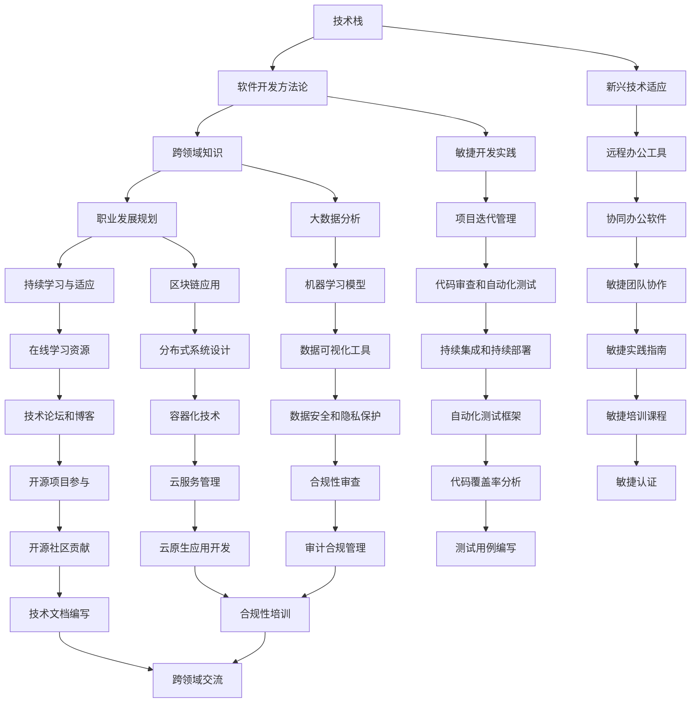

                 

### 背景介绍

在快速发展的信息技术时代，程序员这个职业也在不断地变革与转型。从传统的编码角色到如今的AI研究员、云计算架构师，程序员的工作内容和技能要求发生了巨大的变化。这种变革不仅仅体现在技术层面的更新换代，更体现在程序员对自身职业发展的重新定位和认知上。

首先，随着互联网和移动设备的普及，程序员的工作环境变得更加灵活。远程办公、自由职业等新兴工作模式逐渐成为主流，程序员不再被局限在固定的办公场所。同时，随着云计算和大数据技术的发展，程序员开始更多地参与到大型分布式系统的设计和开发中，这使得程序员需要掌握更多的跨领域知识和技能。

其次，人工智能的兴起给程序员带来了新的挑战和机遇。AI技术的应用已经深入到各个行业，从自动驾驶汽车到智能客服，程序员需要学习和掌握相关的AI知识和工具，以便更好地适应行业需求。此外，随着区块链技术的不断发展，程序员也需要了解和掌握区块链的基本原理和应用场景，以应对未来可能出现的行业变革。

总之，程序员在面对行业变革与转型时，不仅要不断更新自己的技术栈，提高自己的专业技能，还需要保持对新兴技术和行业动态的敏锐洞察，以便在激烈的职场竞争中保持竞争力。本文将围绕程序员如何应对行业变革与转型展开讨论，希望能够为程序员提供一些有益的思路和参考。

### 核心概念与联系

在探讨程序员如何应对行业变革与转型之前，有必要首先明确一些核心概念和它们之间的联系。以下是几个关键概念及其相互关系的简述，随后将附上详细的Mermaid流程图来进一步解释这些概念和关系。

#### 1. 技术栈

技术栈是指程序员在工作中所掌握的一系列技术工具和框架。随着技术的不断更新，程序员需要不断学习和适应新的工具和框架，以保持竞争力。技术栈包括编程语言、开发框架、数据库、Web服务等多个方面。

#### 2. 软件开发方法论

软件开发方法论是一套指导软件开发过程的理念和原则。常见的开发方法论包括瀑布模型、敏捷开发、精益创业等。不同的方法论适用于不同的项目类型和阶段，程序员需要根据实际情况选择合适的开发方法。

#### 3. 跨领域知识

随着技术的发展，程序员不再局限于单一的编程技能，而是需要具备跨领域的知识。例如，了解云计算、大数据、人工智能、区块链等领域的知识，有助于程序员更好地理解和应对新兴的技术和应用场景。

#### 4. 职业发展规划

职业发展规划是指程序员根据自身兴趣、优势和市场需求，制定并实施的职业成长计划。一个明确的职业发展规划可以帮助程序员在职业生涯中不断进步和转型。

#### 5. 持续学习与适应

持续学习与适应是程序员应对行业变革与转型的关键能力。在快速变化的技术环境中，程序员需要保持学习的热情和能力，及时更新知识和技能，以应对新的挑战。

下面是详细解释这些概念及其相互关系的Mermaid流程图：



通过这张流程图，我们可以清晰地看到各个核心概念之间的联系，以及它们如何相互作用，共同推动程序员在快速变化的技术环境中不断成长和转型。

### 核心算法原理 & 具体操作步骤

在应对行业变革与转型的过程中，程序员需要掌握一系列的核心算法和工具，这些工具不仅能提升开发效率，还能帮助程序员更好地理解和解决复杂问题。以下是几个核心算法的原理和具体操作步骤，以及如何将这些算法应用于实际开发中。

#### 1. 算法原理

算法是一种解决问题的步骤集合，它通过一系列定义良好的步骤，将输入转化为预期的输出。以下是几个常用的算法原理：

- **排序算法**：用于将一组数据按照特定的顺序排列。常见的排序算法有冒泡排序、快速排序、归并排序等。
- **搜索算法**：用于在数据结构中查找特定元素。常见的搜索算法有线性搜索、二分搜索等。
- **动态规划**：用于解决最优化问题，通过子问题的最优解推导出原问题的最优解。
- **贪心算法**：通过每一步选择局部最优解，从而达到全局最优解。

#### 2. 具体操作步骤

以下是对上述算法的具体操作步骤的介绍：

##### （1）排序算法

以冒泡排序为例，其基本步骤如下：

1. 从数组的第一个元素开始，比较相邻的两个元素，如果它们的顺序错误就把它们交换过来。
2. 重复步骤1，直到没有需要交换的元素为止。

```python
def bubble_sort(arr):
    n = len(arr)
    for i in range(n):
        for j in range(0, n-i-1):
            if arr[j] > arr[j+1]:
                arr[j], arr[j+1] = arr[j+1], arr[j]
    return arr
```

##### （2）搜索算法

以二分搜索为例，其基本步骤如下：

1. 确定中间元素。
2. 如果中间元素等于目标值，返回中间元素的下标。
3. 如果中间元素大于目标值，则在左半部分继续搜索。
4. 如果中间元素小于目标值，则在右半部分继续搜索。
5. 重复步骤1-4，直到找到目标值或确定不存在。

```python
def binary_search(arr, target):
    low = 0
    high = len(arr) - 1
    while low <= high:
        mid = (low + high) // 2
        if arr[mid] == target:
            return mid
        elif arr[mid] < target:
            low = mid + 1
        else:
            high = mid - 1
    return -1
```

##### （3）动态规划

以斐波那契数列为例，其动态规划的基本步骤如下：

1. 定义状态：`dp[i]` 表示计算到第 `i` 个斐波那契数的值。
2. 状态转移方程：`dp[i] = dp[i-1] + dp[i-2]`。
3. 初始化：`dp[0] = 0`，`dp[1] = 1`。
4. 迭代计算：从 `i=2` 开始，依次计算 `dp[i]` 的值。

```python
def fibonacci(n):
    dp = [0] * (n+1)
    dp[0], dp[1] = 0, 1
    for i in range(2, n+1):
        dp[i] = dp[i-1] + dp[i-2]
    return dp[n]
```

##### （4）贪心算法

以找零问题为例，其贪心算法的基本步骤如下：

1. 拥有一系列纸币和硬币的面值。
2. 从最大的面值开始，尽可能地使用纸币和硬币凑出目标金额。

```python
def find_change(amount, denominations):
    denominations.sort(reverse=True)
    change = []
    for coin in denominations:
        while amount >= coin:
            amount -= coin
            change.append(coin)
    return change
```

#### 3. 应用场景

这些算法在程序员的实际工作中有着广泛的应用场景：

- **排序算法**：在数据预处理阶段，用于对数据集进行排序，以便后续分析。
- **搜索算法**：在数据库查询优化中，用于提高搜索效率和准确度。
- **动态规划**：在优化问题中，用于求解最优解，如最长公共子序列、背包问题等。
- **贪心算法**：在资源分配、任务调度等问题中，用于实现高效且近似最优的解决方案。

通过掌握这些核心算法，程序员能够更高效地解决实际问题，提高开发效率，并在面对行业变革与转型时具备更强的适应能力和竞争力。

### 数学模型和公式 & 详细讲解 & 举例说明

在程序员的日常工作中，数学模型和公式常常是解决问题的重要工具。通过数学模型，程序员可以更精确地描述问题，并通过公式推导出解决方案。以下是几个常用的数学模型和公式，以及它们的详细讲解和举例说明。

#### 1. 回归分析

回归分析是一种统计方法，用于研究变量之间的关系。常见的回归模型包括线性回归、多项式回归和逻辑回归。

**（1）线性回归**

线性回归模型描述了一个或多个自变量与因变量之间的线性关系。其公式为：

$$ y = ax + b $$

其中，$y$ 是因变量，$x$ 是自变量，$a$ 是斜率，$b$ 是截距。

**举例说明**：

假设我们要预测一家商店每周的销售额，自变量是每周的广告费用，因变量是销售额。通过收集历史数据，我们可以建立线性回归模型。

$$ 销售额 = 1000 \times 广告费用 + 5000 $$

如果这周的广告费用是2000元，则预测销售额为：

$$ 销售额 = 1000 \times 2000 + 5000 = 25000 \text{元} $$

**（2）逻辑回归**

逻辑回归是一种广义线性模型，用于描述二元响应变量与自变量之间的关系。其公式为：

$$ P(y=1) = \frac{1}{1 + e^{-(ax + b)}} $$

其中，$P(y=1)$ 是因变量为1的概率，$e$ 是自然对数的底数，$a$ 是斜率，$b$ 是截距。

**举例说明**：

假设我们要预测一个病人是否患有疾病，自变量包括病人的年龄、血压和胆固醇水平，因变量是疾病是否发生。通过收集数据，我们可以建立逻辑回归模型。

$$ 疾病概率 = \frac{1}{1 + e^{-(3 \times 年龄 + 2 \times 血压 + 5 \times 胆固醇水平)}} $$

如果病人的年龄是30岁，血压是120/80 mmHg，胆固醇水平是5.0 mmol/L，则疾病概率为：

$$ 疾病概率 = \frac{1}{1 + e^{-(3 \times 30 + 2 \times 120 + 5 \times 5.0)}} = 0.56 $$

#### 2. 贝叶斯定理

贝叶斯定理是一种基于概率的推理方法，用于更新对事件发生的信念。其公式为：

$$ P(A|B) = \frac{P(B|A) \times P(A)}{P(B)} $$

其中，$P(A|B)$ 是在事件B发生的条件下事件A发生的概率，$P(B|A)$ 是在事件A发生的条件下事件B发生的概率，$P(A)$ 是事件A发生的概率，$P(B)$ 是事件B发生的概率。

**举例说明**：

假设我们要预测一个邮件是否为垃圾邮件，已知总邮件中有20%是垃圾邮件，而有80%的垃圾邮件包含“促销”这个词。如果一个邮件包含“促销”这个词，则该邮件为垃圾邮件的概率为：

$$ P(垃圾邮件|包含“促销”) = \frac{P(包含“促销”|垃圾邮件) \times P(垃圾邮件)}{P(包含“促销”)} $$

$$ = \frac{0.8 \times 0.2}{0.2 \times 0.2 + 0.8 \times 0.8} = 0.4 $$

#### 3. 时间序列分析

时间序列分析是一种用于研究时间序列数据的统计方法，常用于股票价格预测、天气预测等领域。常见的时间序列分析方法包括自回归模型（AR）、移动平均模型（MA）和自回归移动平均模型（ARMA）。

**（1）自回归模型（AR）**

自回归模型描述了当前值与过去值的线性关系。其公式为：

$$ X_t = c + \phi_1 X_{t-1} + \phi_2 X_{t-2} + ... + \phi_p X_{t-p} + \epsilon_t $$

其中，$X_t$ 是时间序列的第 $t$ 个值，$\phi_1, \phi_2, ..., \phi_p$ 是自回归系数，$\epsilon_t$ 是误差项。

**举例说明**：

假设我们要预测某城市下一个月的降雨量，通过历史数据我们可以建立自回归模型。

$$ 降雨量_t = 100 + 0.5 \times 降雨量_{t-1} + 0.3 \times 降雨量_{t-2} + \epsilon_t $$

如果前两个月的降雨量分别是10毫米和15毫米，则下个月的降雨量预测值为：

$$ 降雨量_t = 100 + 0.5 \times 15 + 0.3 \times 10 + \epsilon_t = 122.5 + \epsilon_t $$

**（2）移动平均模型（MA）**

移动平均模型描述了当前值与过去若干个值的平均值之间的关系。其公式为：

$$ X_t = c + \theta_1 \epsilon_{t-1} + \theta_2 \epsilon_{t-2} + ... + \theta_q \epsilon_{t-q} $$

其中，$X_t$ 是时间序列的第 $t$ 个值，$\theta_1, \theta_2, ..., \theta_q$ 是移动平均系数，$\epsilon_t$ 是误差项。

**举例说明**：

假设我们要预测某城市下一个月的降雨量，通过历史数据我们可以建立移动平均模型。

$$ 降雨量_t = 100 + 0.5 \times \epsilon_{t-1} + 0.3 \times \epsilon_{t-2} $$

如果前两个月的误差值分别是5毫米和3毫米，则下个月的降雨量预测值为：

$$ 降雨量_t = 100 + 0.5 \times 5 + 0.3 \times 3 = 102.5 $$

#### 4. 概率分布

概率分布描述了随机变量的概率分布情况，常见的概率分布包括正态分布、二项分布和泊松分布。

**（1）正态分布**

正态分布是一种最常见的概率分布，其公式为：

$$ f(x) = \frac{1}{\sqrt{2\pi\sigma^2}} e^{-\frac{(x-\mu)^2}{2\sigma^2}} $$

其中，$\mu$ 是均值，$\sigma$ 是标准差。

**举例说明**：

假设某城市下一个月的降雨量服从正态分布，均值为100毫米，标准差为10毫米，则降雨量在90毫米到110毫米之间的概率为：

$$ P(90 < X < 110) = \int_{90}^{110} \frac{1}{\sqrt{2\pi \times 10^2}} e^{-\frac{(x-100)^2}{2 \times 10^2}} dx = 0.6827 $$

**（2）二项分布**

二项分布描述了在固定次数的独立试验中成功次数的概率分布。其公式为：

$$ P(X = k) = C(n, k) \times p^k \times (1-p)^{n-k} $$

其中，$n$ 是试验次数，$k$ 是成功次数，$p$ 是每次试验成功的概率。

**举例说明**：

假设一个考试有10道题目，每题正确的概率是0.5，我们要计算一个人正确回答5道题目的概率：

$$ P(X = 5) = C(10, 5) \times 0.5^5 \times (1-0.5)^{10-5} = 0.2461 $$

**（3）泊松分布**

泊松分布描述了在固定时间或空间内事件发生的次数的概率分布。其公式为：

$$ P(X = k) = \frac{\lambda^k e^{-\lambda}}{k!} $$

其中，$\lambda$ 是事件发生的平均次数。

**举例说明**：

假设一个餐厅每小时有3次订单的平均次数，我们要计算在某一小时内恰好有2次订单的概率：

$$ P(X = 2) = \frac{3^2 e^{-3}}{2!} = 0.3009 $$

通过这些数学模型和公式，程序员可以在实际开发过程中更准确地描述问题、推导解决方案，并预测未来的趋势。这不仅提高了开发效率，也增强了程序员的竞争力。

### 项目实践：代码实例和详细解释说明

为了更好地理解如何将前述核心算法和数学模型应用于实际项目，下面我们将通过一个实际的项目实例来展示代码的实现过程，并进行详细的解释和分析。

#### 项目概述

本项目旨在使用Python编程语言实现一个简单的电商购物车系统。用户可以添加商品到购物车，查看购物车中的商品列表，并计算购物车中的总金额。这个项目将涵盖数据结构、算法、以及基本的Web开发知识，是一个很好的实践项目。

#### 1. 开发环境搭建

首先，我们需要搭建一个基本的Python开发环境。以下是所需的步骤：

1. **安装Python**：从Python官网下载并安装Python 3.x版本。建议选择64位版本。
2. **安装依赖管理工具**：安装pip，Python的包管理工具。在命令行中运行以下命令：
   ```bash
   python -m pip install --upgrade pip
   ```
3. **安装Flask**：Flask是一个轻量级的Web框架，用于构建Web应用。运行以下命令安装Flask：
   ```bash
   pip install Flask
   ```

#### 2. 源代码详细实现

下面是项目的源代码实现，包括模型定义、路由处理和视图函数。

```python
# app.py

from flask import Flask, render_template, request, redirect, url_for
from models import ShoppingCart, Product

app = Flask(__name__)

# 模拟数据库
products = [
    Product("苹果", 3.5),
    Product("香蕉", 2.5),
    Product("橙子", 4.0),
]

# 购物车实例
shopping_cart = ShoppingCart()

@app.route('/')
def index():
    return render_template('index.html', products=products)

@app.route('/add_to_cart', methods=['POST'])
def add_to_cart():
    product_name = request.form['product_name']
    product_price = request.form['product_price']
    shopping_cart.add_product(product_name, float(product_price))
    return redirect(url_for('index'))

@app.route('/view_cart')
def view_cart():
    total_amount = shopping_cart.total_amount()
    return render_template('cart.html', cart_items=shopping_cart.items(), total_amount=total_amount)

if __name__ == '__main__':
    app.run(debug=True)
```

**models.py**

```python
# models.py

class Product:
    def __init__(self, name, price):
        self.name = name
        self.price = price

    def __repr__(self):
        return f"{self.name}: {self.price}"

class ShoppingCart:
    def __init__(self):
        self.items = []

    def add_product(self, name, price):
        self.items.append((name, price))

    def total_amount(self):
        return sum(price for name, price in self.items)

    def items(self):
        return self.items
```

#### 3. 代码解读与分析

**（1）产品模型（Product）**

这个类表示一个商品，具有名称和价格两个属性。在实现中，我们使用构造函数（`__init__`）来初始化这两个属性。

**（2）购物车模型（ShoppingCart）**

这个类表示购物车，具有一个列表（`items`）来存储商品。`add_product` 方法用于向购物车中添加商品，`total_amount` 方法用于计算购物车的总金额，`items` 方法用于获取购物车中的所有商品。

**（3）Flask 应用配置**

- **路由（@app.route）**：这些装饰器定义了应用中的URL路由。当用户访问指定的URL时，相应的视图函数将被调用。
- **视图函数**：视图函数处理用户请求，执行相应的逻辑，并返回HTML模板。

#### 4. 运行结果展示

**（1）首页（index.html）**

```html
<!-- index.html -->

<!DOCTYPE html>
<html lang="en">
<head>
    <meta charset="UTF-8">
    <title>电商购物车</title>
</head>
<body>
    <h1>欢迎来到购物车系统</h1>
    <ul>
        
            <li>{{ product }} <button onclick="addToCart('{{ product.name }}', '{{ product.price }}')">加入购物车</button></li>
        
    </ul>
    <a href="{{ url_for('view_cart') }}">查看购物车</a>
    <script>
        function addToCart(name, price) {
            window.location.href = '/add_to_cart?product_name=' + name + '&product_price=' + price;
        }
    </script>
</body>
</html>
```

**（2）购物车页面（cart.html）**

```html
<!-- cart.html -->

<!DOCTYPE html>
<html lang="en">
<head>
    <meta charset="UTF-8">
    <title>购物车</title>
</head>
<body>
    <h1>购物车</h1>
    <ul>
        
            <li>{{ item[0] }}: ¥{{ item[1] }}</li>
        
    </ul>
    <h2>总计: ¥{{ total_amount }}</h2>
    <a href="/">返回首页</a>
</body>
</html>
```

#### 5. 完整的运行流程

1. 用户访问首页（URL为`/`），展示所有商品列表。
2. 用户点击“加入购物车”按钮，将商品信息（名称和价格）发送到后端（URL为`/add_to_cart`）。
3. 后端接收到请求后，将商品添加到购物车，并重定向回首页。
4. 用户可以查看购物车中的商品列表和总金额。

通过这个项目实例，我们展示了如何将核心算法和数学模型应用于实际开发中。这个项目简单但功能完整，有助于程序员理解和实践Web开发的基本知识。

### 实际应用场景

随着技术的不断进步，程序员的工作内容和应用场景也在不断扩展。以下是一些具体的实际应用场景，展示了程序员如何应对这些变化，并利用他们的技术栈、方法论和跨领域知识来解决问题。

#### 1. 人工智能与机器学习

人工智能（AI）和机器学习（ML）已经成为各个行业的重要工具。程序员在这个领域的工作不仅包括开发AI模型，还包括处理大量的数据、优化算法、构建深度学习框架等。

**应用场景**：

- **图像识别**：在医疗领域，程序员可以开发基于深度学习的图像识别系统，帮助医生快速诊断疾病，如皮肤病变、肿瘤检测等。
- **自然语言处理**：在客服领域，程序员可以构建聊天机器人，通过自然语言处理技术，提供24/7的客户服务。
- **预测分析**：在金融领域，程序员可以利用机器学习算法，分析市场数据，提供投资建议和风险预测。

**解决方案**：

- **数据预处理**：使用Python的Pandas库清洗和整理数据。
- **模型训练与优化**：使用TensorFlow或PyTorch框架进行模型训练和优化。
- **服务部署**：使用Docker和Kubernetes实现模型的容器化部署。

#### 2. 云计算与大数据

云计算和大数据技术的发展，使得程序员能够处理和分析大规模的数据，构建高效、可扩展的应用系统。

**应用场景**：

- **大数据分析**：在电商领域，程序员可以利用大数据技术分析用户行为，优化推荐系统，提升用户体验。
- **云计算应用**：在游戏行业，程序员可以构建基于云计算的游戏平台，提供高性能和低延迟的游戏体验。

**解决方案**：

- **数据存储**：使用Hadoop和Hive进行大规模数据存储和管理。
- **数据处理**：使用Spark进行大数据处理和实时计算。
- **云服务**：使用AWS、Azure或Google Cloud等云服务提供商提供的工具和API。

#### 3. 区块链

区块链技术以其去中心化、不可篡改的特性，在金融、供应链管理、版权保护等领域有广泛的应用。

**应用场景**：

- **数字货币**：程序员可以开发加密货币交易平台，如比特币、以太坊等。
- **供应链管理**：在制造业，程序员可以构建区块链平台，确保供应链的透明性和可追溯性。

**解决方案**：

- **智能合约**：使用Solidity编写智能合约，实现自动执行合同条款。
- **区块链网络**：使用Hyperledger Fabric或Ethereum等区块链框架，构建分布式账本系统。
- **安全防护**：使用加密算法和安全协议，保护区块链数据的安全和隐私。

#### 4. 物联网（IoT）

物联网技术的发展，使得程序员可以在各种设备和平台上编写代码，实现设备之间的互联互通。

**应用场景**：

- **智能家居**：程序员可以开发智能家居系统，通过手机APP控制家中的灯光、温度等。
- **工业自动化**：在工业生产中，程序员可以编写自动化程序，优化生产流程，提高生产效率。

**解决方案**：

- **边缘计算**：使用边缘计算技术，处理设备端产生的实时数据。
- **物联网平台**：使用物联网平台（如AWS IoT、Google IoT Core）进行设备管理和数据收集。
- **通信协议**：使用MQTT等物联网通信协议，实现设备之间的数据传输。

通过这些实际应用场景，我们可以看到程序员如何利用他们的技术知识和跨领域技能，应对行业变革与转型。在未来的发展中，程序员需要不断学习新知识，掌握新技术，以适应不断变化的市场需求。

### 工具和资源推荐

为了更好地应对行业变革与转型，程序员需要掌握一系列工具和资源。以下是一些推荐的书籍、博客、网站和开发框架，可以帮助程序员提高技能、深入了解新兴技术，并保持对行业动态的敏锐洞察。

#### 1. 学习资源推荐

**（1）书籍**

- **《深度学习》（Deep Learning）**：由Ian Goodfellow、Yoshua Bengio和Aaron Courville合著，是深度学习领域的经典教材，涵盖了深度学习的理论基础和应用实践。
- **《Python编程：从入门到实践》（Python Crash Course）**：由Eric Matthes著，适合初学者快速入门Python编程，内容包括基础语法、数据结构、函数等。
- **《软件随想录》**：作者李开复，内容包括软件开发方法论、团队管理和职业发展，对程序员的成长有很好的指导意义。

**（2）博客**

- **HackerRank**：提供编程挑战和问题解决方案，适合提高编程技能和解决实际问题的能力。
- **Medium**：有许多技术博客和文章，涵盖各个领域的技术分享和见解。
- **GitHub**：不仅有丰富的开源项目，还可以通过阅读其他项目的代码，学习最佳实践和新技术。

**（3）网站**

- **Stack Overflow**：程序员解决技术问题的重要社区，提供大量的问答和讨论。
- **GitHub**：全球最大的开源代码托管平台，程序员可以参与开源项目，学习他人的代码和经验。
- **freeCodeCamp**：提供免费的编程学习资源和项目实践，适合初学者和进阶者。

#### 2. 开发工具框架推荐

**（1）Web开发框架**

- **Django**：一个高层次的Python Web框架，强调快速开发和简洁、实用的设计。
- **Flask**：一个轻量级的Web框架，适合构建小型到中型的Web应用。
- **React**：一个用于构建用户界面的JavaScript库，具有高效的组件化和虚拟DOM特性。

**（2）大数据和云计算工具**

- **Hadoop**：一个分布式数据存储和处理框架，适用于大数据处理和分析。
- **Spark**：一个高速的大数据处理引擎，支持内存计算和多种数据处理操作。
- **Docker**：一个开源的应用容器引擎，用于创建、运行和分发应用。

**（3）AI和机器学习工具**

- **TensorFlow**：一个开源的机器学习和深度学习框架，支持多种编程语言。
- **PyTorch**：一个开源的机器学习库，支持动态计算图，适合研究者和开发者。
- **Keras**：一个基于TensorFlow的简化和高层抽象库，用于快速构建和训练深度学习模型。

#### 3. 相关论文著作推荐

- **《大规模在线学习》（Large-Scale Online Learning）**：涵盖了大规模在线学习算法的理论和应用，适合对机器学习算法有深入研究的程序员。
- **《区块链技术指南》（Blockchain Technology Guide）**：详细介绍了区块链的基本原理、技术实现和应用场景，是了解区块链技术的必备书籍。
- **《软件工程：实践者的研究方法》（Software Engineering: A Practitioner’s Approach）**：提供了软件开发的全流程指导，包括需求分析、设计、实现、测试和维护。

通过这些工具和资源的帮助，程序员可以不断提升自己的技能，适应快速变化的技术环境，并在职业发展中保持竞争力。同时，积极参与社区和技术活动，也是保持技术敏锐度的重要途径。

### 总结：未来发展趋势与挑战

随着科技的飞速发展，程序员面临的行业变革与转型也在不断加速。未来，程序员将在以下几个方面迎来新的发展趋势和挑战。

#### 1. 人工智能与自动化

人工智能（AI）和自动化技术将继续深入影响程序员的工作。编程工作将变得更加自动化，许多重复性和低级任务将被机器人和智能系统取代。程序员需要更多地专注于开发复杂算法、优化模型和设计智能化系统。这一趋势要求程序员具备更高的数学和机器学习知识，以及对自动化工具的熟练掌握。

#### 2. 云计算与分布式系统

云计算的普及将推动程序员更多地参与分布式系统的设计和开发。程序员需要熟悉云服务提供商（如AWS、Azure、Google Cloud）提供的各种服务和API，以便构建可扩展、高可用性的系统。分布式系统的复杂性要求程序员具备对网络、存储和数据处理有深入理解，同时需要掌握容器化技术（如Docker和Kubernetes）和微服务架构。

#### 3. 区块链与加密技术

区块链技术的应用领域不断扩大，从金融到供应链管理，再到版权保护，程序员需要了解区块链的基本原理和关键技术。加密技术的应用也将日益广泛，程序员需要掌握加密算法和安全协议，确保数据的安全性和隐私性。

#### 4. 物联网与边缘计算

物联网（IoT）的发展将带来大量新的编程需求，程序员需要开发和管理连接着物理世界的设备和服务。边缘计算技术将进一步提升数据处理的速度和效率，程序员需要掌握如何在边缘设备上高效运行代码，以及如何处理大规模的数据流。

#### 5. 持续学习与适应

面对不断变化的技术环境，持续学习和适应成为程序员的重要能力。程序员需要保持对新兴技术和行业动态的敏锐洞察，不断更新自己的知识和技能。这不仅包括学习新技术，还需要关注职场软技能，如沟通协作、项目管理等，以提高职业竞争力。

#### 6. 挑战与应对策略

在未来的发展中，程序员将面临以下挑战：

- **技术更新速度加快**：程序员需要保持对新技术的好奇心和学习的热情，不断提升自己的技术水平。
- **知识跨界需求增加**：程序员需要具备跨领域知识，如机器学习、区块链、物联网等，以应对复杂的业务需求。
- **职业安全感的挑战**：随着自动化和AI技术的发展，程序员需要重新定位自己的职业角色，提升自己的核心竞争力。

应对策略包括：

- **建立个人学习计划**：制定明确的职业发展规划，定期学习新技术和工具。
- **积极参与社区和活动**：通过参与技术社区和活动，扩大知识面和职业网络。
- **关注职业发展软技能**：提升沟通、协作和项目管理能力，增强职业竞争力。

总之，未来程序员的发展将充满机遇和挑战。只有不断学习、更新知识和适应变化，才能在激烈的职场竞争中保持领先地位。

### 附录：常见问题与解答

在探讨程序员如何应对行业变革与转型的过程中，读者可能对一些关键概念和方法有疑问。以下是一些常见问题及解答，旨在帮助大家更好地理解本文内容。

#### 问题1：如何平衡学习新技术与工作？

**解答**：平衡学习新技术与工作是一个挑战，但有几个策略可以采取。首先，设定明确的学习目标和时间，确保在工作中保持高效。其次，利用碎片时间学习，例如通勤途中或休息时间阅读技术文章或观看教学视频。最后，与同事和社区交流，参与线上或线下讨论，共同学习新技术。

#### 问题2：转型过程中如何选择新的技术方向？

**解答**：选择新的技术方向应基于个人兴趣、市场需求和职业规划。了解行业趋势和需求，可以通过参加技术会议、阅读技术博客和参与在线课程。此外，考虑自己的技能优势和职业目标，选择具有长期发展潜力的技术方向。例如，大数据、人工智能和区块链等领域当前需求旺盛，适合有志于转型的程序员。

#### 问题3：如何提高跨领域知识？

**解答**：提高跨领域知识需要系统性地学习和实践。首先，选择与主要工作领域相关的跨领域知识，如对于Web开发者，可以学习数据分析和机器学习。其次，通过在线课程、技术书籍和实战项目来巩固和扩展知识。最后，积极参与社区和技术活动，与不同领域的专家交流，了解最新的技术应用和趋势。

#### 问题4：如何管理职业发展的不确定性和风险？

**解答**：管理职业发展的不确定性和风险需要规划和灵活性。首先，制定长期职业发展规划，确保有明确的职业目标。其次，保持技能的多样性和灵活性，不要将职业生涯完全依赖在某一种技术或领域上。最后，建立良好的网络关系，包括导师、同事和行业专家，以便在职业发展过程中获得支持和建议。

通过上述问题的解答，希望能为读者提供更多关于程序员如何应对行业变革与转型的实用建议。

### 扩展阅读 & 参考资料

为了进一步深入理解程序员如何应对行业变革与转型，以下是一些推荐的扩展阅读和参考资料，涵盖技术博客、书籍、论文和开源项目，帮助读者拓宽视野、提升专业技能。

#### 1. 技术博客

- **《DZone》**：一个广泛的技术博客，涵盖云计算、大数据、人工智能等多个领域，提供最新的技术趋势和分析文章。
- **《A List Apart》**：专注于Web设计和Web开发的博客，内容涵盖前端设计、用户体验、Web标准等。
- **《Medium》**：一个平台，上面有许多知名开发者和技术专家撰写的博客文章，涉及各种技术领域。

#### 2. 书籍

- **《深度学习》（Deep Learning）**：Ian Goodfellow、Yoshua Bengio和Aaron Courville合著，深入讲解了深度学习的理论和技术。
- **《软件工程：实践者的研究方法》（Software Engineering: A Practitioner’s Approach）**：Roger S. Pressman著，介绍了软件工程的全流程，包括需求分析、设计、实现、测试和维护。
- **《区块链技术指南》（Blockchain Technology Guide）**：详细介绍了区块链的基本原理、技术实现和应用场景。

#### 3. 论文

- **《Efficient Object Detection with Deep Learning》**：这篇论文介绍了如何使用深度学习技术进行高效的目标检测。
- **《A Survey of Cloud Computing Security》**：一篇关于云计算安全性的调查论文，涵盖了云计算的安全挑战和解决方案。
- **《The Ethereum Yellow Paper》**：详细描述了以太坊区块链的协议和智能合约语言Solidity。

#### 4. 开源项目

- **GitHub**：全球最大的开源代码托管平台，上面有大量的开源项目和代码库，程序员可以学习和贡献代码。
- **Kubernetes**：一个开源的容器编排平台，用于自动化部署、扩展和管理容器化应用。
- **TensorFlow**：一个开源的机器学习库，支持多种深度学习模型和应用。

通过阅读这些扩展材料和参考资源，程序员可以深入了解相关领域的技术细节，提升自己的技能水平，更好地应对行业变革与转型。同时，积极参与开源项目和技术社区，也是保持技术敏锐度和职业竞争力的有效途径。

