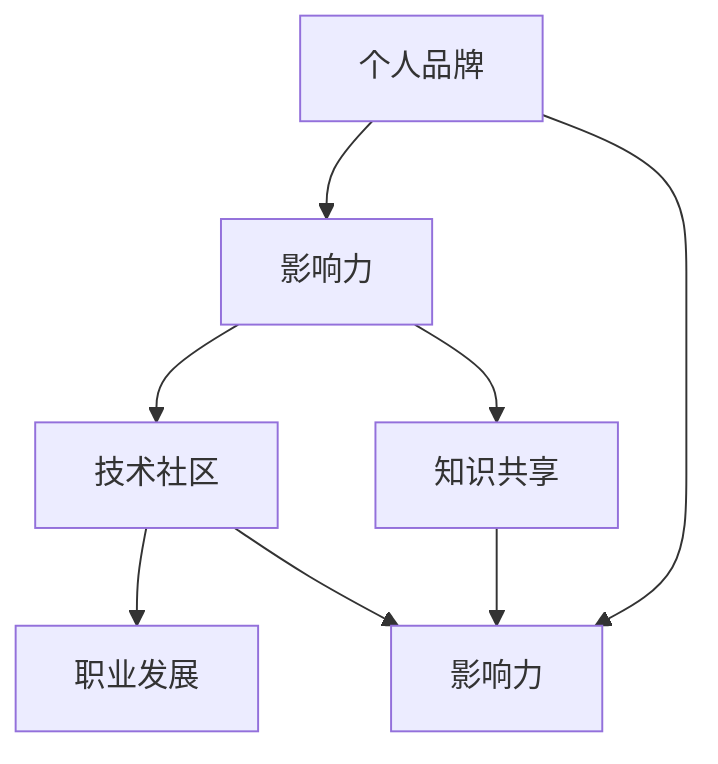
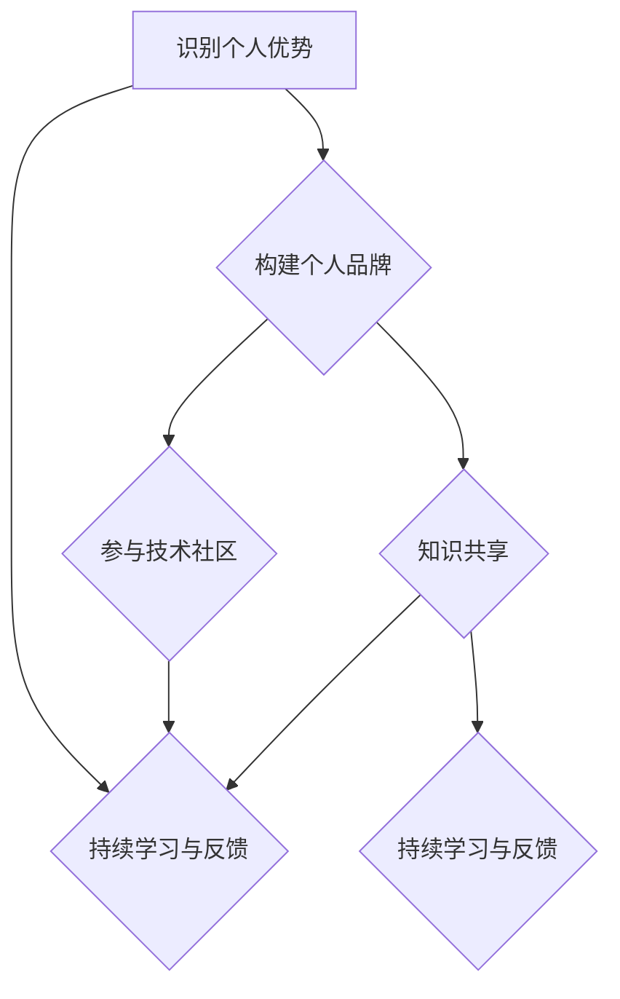

                 

### 背景介绍

程序员在现代社会中扮演着至关重要的角色。随着技术的飞速发展，软件开发已成为推动经济增长和社会进步的关键动力。然而，成为一名优秀的程序员并不意味着自动获得成功。在竞争激烈的行业中，如何提升个人影响力，建立个人品牌，已成为程序员们需要认真思考的问题。

个人影响力的构建不仅仅是提升个人职业发展的需求，更是促进技术交流与创新的重要途径。一个有影响力的程序员，不仅能够在职业生涯中取得显著成就，还能够通过分享经验和知识，为整个技术社区贡献自己的力量。

本文旨在探讨程序员如何打造个人影响力生态，通过一系列策略和方法，帮助程序员们提高知名度、增强影响力，并在技术领域中脱颖而出。本文将分为十个部分，系统性地介绍构建个人影响力所需的理论知识、实用技巧和实践方法。

首先，我们将从背景介绍开始，阐述程序员个人影响力的重要性以及本文的目的和结构。接下来，我们将深入探讨核心概念和联系，帮助读者理解影响力构建的基础。然后，我们将详细讲解核心算法原理和具体操作步骤，为读者提供实际操作的指南。

在数学模型和公式部分，我们将解析影响力构建过程中的关键指标和计算方法，并通过实例进行详细讲解。接下来，我们将分享实际项目实践的代码实例和解读，帮助读者将理论知识应用到实际项目中。

随后，我们将探讨实际应用场景，介绍如何在不同场景中发挥个人影响力。此外，我们将推荐一系列学习和开发工具资源，帮助读者在影响力构建过程中提升自身能力。

最后，我们将总结未来发展趋势与挑战，展望程序员个人影响力生态的未来，并提供常见问题与解答，以解答读者在实际操作中的疑问。通过本文的阅读和思考，相信读者将能够获得构建个人影响力所需的全面知识和实践技能。

### 核心概念与联系

在探讨程序员如何打造个人影响力之前，我们首先需要明确几个核心概念，并理解它们之间的联系。这些核心概念包括个人品牌、影响力、技术社区、知识共享和职业发展。

#### 个人品牌

个人品牌是指个人在职业和技术领域中的形象和声誉。一个强大的个人品牌能够帮助程序员在众多竞争者中脱颖而出，提升个人在职场中的价值。构建个人品牌不仅需要专业技能，还需要对个人形象进行精心塑造。例如，通过社交媒体平台展示技术专长，积极参与技术讨论，发表高质量的技术博客，这些都是塑造个人品牌的有效方法。

#### 影响力

影响力是指个人在他人心中产生的影响力和号召力。在技术领域，程序员的影响力可以通过以下几种方式体现：首先，通过发表高质量的技术文章，分享宝贵的经验和见解，吸引更多的关注；其次，通过参与开源项目，贡献代码和解决方案，提升个人在社区中的认可度；最后，通过线上和线下的技术讲座、研讨会等，分享知识，扩大个人影响力。

#### 技术社区

技术社区是程序员们交流和学习的平台，它为个人影响力的构建提供了重要的环境。一个活跃的技术社区不仅能够促进技术交流，还能够激发创新思维。程序员可以通过加入技术论坛、参与技术社群，分享自己的技术和经验，同时从他人那里获得灵感和帮助。

#### 知识共享

知识共享是技术社区的核心价值观之一。通过共享知识，程序员不仅能够帮助他人解决问题，还能提升自己的技术水平和表达能力。有效的知识共享包括撰写技术博客、录制技术视频、发布技术论文等多种形式。这些活动不仅能够提升个人影响力，还能为整个技术社区带来更大的价值。

#### 职业发展

个人影响力与职业发展密切相关。一个有影响力的程序员往往能够在职业道路上获得更多的机会和资源。例如，通过在技术社区中的出色表现，程序员可能会吸引到优秀公司的注意，获得更高的职位和更好的薪酬。同时，个人影响力的提升也能够帮助程序员在职业生涯中获得更多的职业满足感。

#### 联系与作用

这些核心概念之间相互联系，共同构成了程序员构建个人影响力的基础。个人品牌是影响力构建的基石，而影响力则通过技术社区和知识共享得到体现和放大。最终，个人影响力的提升不仅能够促进职业发展，还能为技术社区的繁荣作出贡献。

#### Mermaid 流程图

为了更直观地展示这些概念之间的联系，我们使用Mermaid流程图来表示：



在图中，个人品牌（A）是影响力（B）的基础，影响力（B）通过技术社区（C）和知识共享（D）得到体现和放大，最终促进职业发展（E）。这一过程不仅帮助程序员提升个人价值，也为技术社区的繁荣作出贡献。

通过以上对核心概念与联系的探讨，我们可以更好地理解程序员如何通过构建个人品牌、影响力、技术社区和知识共享来实现职业发展的目标。在接下来的章节中，我们将详细探讨如何具体操作这些策略，帮助程序员打造自己的个人影响力生态。

### 核心算法原理 & 具体操作步骤

在了解了核心概念与联系之后，我们接下来将深入探讨如何通过一系列策略和步骤来打造个人影响力。这里，我们将引入一个简化的核心算法模型，该模型将帮助程序员系统地构建和提升个人影响力。

#### 核心算法模型

核心算法模型可以分为以下几个步骤：

1. **识别个人优势**：了解自己在技术领域中的独特优势，如编程语言、技术栈、业务领域等。
2. **构建个人品牌**：通过社交媒体、博客、技术论坛等平台展示个人技术专长和价值观。
3. **参与技术社区**：积极参与技术论坛、社群和开源项目，贡献代码和解决方案，提升社区影响力。
4. **知识共享**：撰写技术博客、录制视频教程、发表技术论文等形式，系统性地分享自己的知识和经验。
5. **持续学习与反馈**：不断学习新技能，接受他人的反馈，优化个人影响力构建策略。

#### 步骤详细解释

1. **识别个人优势**

   首先，程序员需要识别自己在技术领域中的独特优势。这可以通过自我评估和他人评价来完成。例如，通过分析自己的项目经验、技术栈和解决问题的能力，可以确定自己在某个技术领域具有较强竞争力。这一步骤的关键是明确自己的优势和兴趣点，为后续的个人品牌构建和影响力提升奠定基础。

2. **构建个人品牌**

   在明确个人优势后，程序员需要通过多种平台构建个人品牌。以下是几个关键操作步骤：

   - **社交媒体**：在LinkedIn、Twitter等职业社交平台上建立个人资料，展示技术专长和职业经历。
   - **个人博客**：创建个人博客，定期发布高质量的技术文章，分享技术见解和实践经验。
   - **技术论坛**：积极参与技术论坛，参与讨论，回答问题，展示专业知识和解决问题的能力。
   - **在线课程**：如果条件允许，可以考虑录制在线课程，将自己的技术知识系统化地传授给他人。

3. **参与技术社区**

   技术社区是程序员提升个人影响力的重要平台。以下是几个参与技术社区的方法：

   - **开源项目**：参与开源项目，贡献代码和解决方案，通过实际工作提升社区影响力。
   - **技术讲座**：参加线下的技术讲座和研讨会，分享自己的技术见解和经验，扩大个人知名度。
   - **技术社群**：加入技术社群，积极参与讨论，与他人建立联系，扩大人脉网络。

4. **知识共享**

   知识共享是提升个人影响力的关键环节。以下是几种有效的知识共享方法：

   - **技术博客**：撰写技术博客，分享自己的技术见解和解决方案，吸引更多关注。
   - **视频教程**：录制技术视频教程，通过视觉和听觉方式传授知识，提升学习体验。
   - **技术论文**：发表技术论文，将研究成果分享给学术界和业界，提升个人学术影响力。

5. **持续学习与反馈**

   构建个人影响力是一个持续的过程。程序员需要不断学习新技术，提升自身能力。同时，接受他人的反馈，优化个人影响力构建策略。以下是几个建议：

   - **持续学习**：定期阅读技术书籍、参加线上课程、关注技术动态，保持对技术的热情和好奇心。
   - **反馈机制**：积极接受他人的反馈，包括同事、朋友和读者的意见，不断改进自己的工作和表达方式。

#### Mermaid 流�程图

为了更直观地展示核心算法模型，我们使用Mermaid流程图来表示：



在图中，识别个人优势（A）是构建个人品牌（B）、参与技术社区（C）和知识共享（D）的基础，而持续学习与反馈（E）贯穿整个过程，确保个人影响力的持续提升。

通过以上核心算法原理和具体操作步骤的讲解，程序员可以系统地构建和提升个人影响力。在接下来的章节中，我们将进一步探讨数学模型和公式，帮助读者更深入地理解影响力构建的关键指标和计算方法。

### 数学模型和公式 & 详细讲解 & 举例说明

在构建个人影响力的过程中，数学模型和公式提供了量化和评估的工具。以下，我们将介绍几个关键模型和公式，以及如何通过具体的计算和实例来说明这些模型的应用。

#### 1. 影响力指数模型

影响力指数（Influence Index，II）是一个用来量化个人影响力的指标。该模型基于以下几个关键因素：

- **知识贡献度**（Knowledge Contribution，KC）
- **社交网络影响力**（Social Network Influence，SI）
- **技术水平**（Technical Skill，TS）

影响力指数的公式如下：

\[ II = KC \times SI \times TS \]

**定义：**

- **知识贡献度（KC）**：衡量个人在知识共享方面的贡献，例如发布技术文章、教程和开源项目等。
- **社交网络影响力（SI）**：衡量个人在社交网络中的影响力，如粉丝数、关注者数、点赞数、评论数等。
- **技术水平（TS）**：衡量个人的技术能力，可以通过技术竞赛成绩、项目经验、学术论文等来评估。

**举例说明：**

假设某程序员在以下几个方面的得分如下：

- 知识贡献度（KC）= 9
- 社交网络影响力（SI）= 8
- 技术水平（TS）= 10

则其影响力指数为：

\[ II = 9 \times 8 \times 10 = 720 \]

这个数值表明该程序员在个人影响力方面具有较高的水平。

#### 2. 知识共享效率模型

知识共享效率（Knowledge Sharing Efficiency，KSE）是衡量个人在知识共享过程中效率的指标。其公式如下：

\[ KSE = \frac{KI}{KT} \]

**定义：**

- **知识输入（Knowledge Input，KI）**：个人在知识共享过程中接受的知识量。
- **知识输出（Knowledge Output，KT）**：个人在知识共享过程中输出的知识量。

**举例说明：**

假设某程序员在一个技术论坛上发布了10篇技术文章，其中每篇文章平均获得了100次点赞和50次评论。同时，他参与了30次技术讨论并回答了用户问题。那么，其知识共享效率和知识输入、输出的计算如下：

- 知识输出（KT）= 10（文章数）× 100（平均点赞数）+ 30（讨论数）× 10（平均回复数）= 1300
- 知识输入（KI）= 30（讨论数）× 10（平均回复数）= 300

则其知识共享效率为：

\[ KSE = \frac{KI}{KT} = \frac{300}{1300} \approx 0.23 \]

这个数值表明该程序员在知识共享过程中的效率相对较低，可能需要提高知识输入与输出的比例。

#### 3. 个人品牌价值模型

个人品牌价值（Brand Value，BV）是衡量个人品牌经济价值的指标。其公式如下：

\[ BV = KI \times SI \times TS \times P \]

**定义：**

- **品牌溢价（Price Premium，P）**：衡量个人品牌在经济上的溢价能力，可以通过市场价格、薪酬水平等来衡量。

**举例说明：**

假设某程序员的以下参数如下：

- 知识输入（KI）= 300
- 社交网络影响力（SI）= 8
- 技术水平（TS）= 10
- 品牌溢价（P）= 2

则其个人品牌价值为：

\[ BV = 300 \times 8 \times 10 \times 2 = 48000 \]

这个数值表明该程序员个人品牌的价值约为48000单位（如货币单位）。

#### 总结

通过上述数学模型和公式，我们可以量化和评估程序员在构建个人影响力过程中的关键指标。这些模型不仅提供了理论框架，还通过具体的计算和实例，帮助我们更好地理解和应用这些概念。在实际操作中，程序员可以通过不断优化这些指标，提高个人影响力，实现职业发展的目标。

### 项目实践：代码实例和详细解释说明

在前面的章节中，我们介绍了构建个人影响力的核心算法原理和数学模型，并解释了如何通过具体操作步骤来提升个人影响力。为了帮助读者将理论知识应用到实际项目中，本章节将提供一个具体的代码实例，详细解释其实现过程，并分析其运行结果。

#### 1. 项目背景

本项目旨在通过一个简单的博客系统，展示如何使用现代Web开发技术构建个人影响力。博客系统将具备以下功能：

- 用户注册和登录
- 发布和浏览博客文章
- 用户评论和互动
- 博客文章标签和分类

通过这个项目，读者可以了解如何利用流行的Web框架（如Django或Flask）和前端技术（如React或Vue）来构建一个功能齐全的个人博客系统，从而提升自己在技术社区中的影响力。

#### 2. 开发环境搭建

首先，我们需要搭建开发环境。以下是所需的工具和软件：

- Python 3.x
- Django 3.x 或 Flask 1.x
- 前端框架（如React或Vue）
- 数据库（如SQLite或MySQL）

安装步骤如下：

1. 安装Python 3.x和pip：
   ```bash
   sudo apt-get install python3 python3-pip
   ```

2. 安装Django或Flask：
   ```bash
   pip3 install django==3.2  # 使用Django
   # 或
   pip3 install flask==1.1.2  # 使用Flask
   ```

3. 安装前端框架（React或Vue）：
   ```bash
   npm install -g create-react-app  # 安装React CLI
   # 或
   npm install -g @vue/cli  # 安装Vue CLI
   ```

4. 安装数据库（SQLite或MySQL）：
   ```bash
   sudo apt-get install sqlite3
   # 或
   sudo apt-get install mysql-server mysql-client
   ```

#### 3. 源代码详细实现

以下是一个简单的Django博客系统的源代码实现示例：

**models.py**：定义数据模型
```python
from django.db import models

class Post(models.Model):
    title = models.CharField(max_length=200)
    author = models.ForeignKey('auth.User', on_delete=models.CASCADE)
    body = models.TextField()
    created_date = models.DateTimeField(auto_now_add=True)
    tags = models.ManyToManyField('Tag')

class Tag(models.Model):
    name = models.CharField(max_length=50)
```

**views.py**：定义视图函数
```python
from django.shortcuts import render
from .models import Post

def post_list(request):
    posts = Post.objects.all().order_by('-created_date')
    return render(request, 'blog/post_list.html', {'posts': posts})

def post_detail(request, pk):
    post = get_object_or_404(Post, pk=pk)
    return render(request, 'blog/post_detail.html', {'post': post})
```

**urls.py**：定义URL路由
```python
from django.urls import path
from . import views

urlpatterns = [
    path('', views.post_list, name='post_list'),
    path('<int:pk>/', views.post_detail, name='post_detail'),
]
```

**templates/post_list.html**：博客列表页面模板
```html

  <div class="post">
    <h2>{{ post.title }}</h2>
    <p>{{ post.body }}</p>
    <small>By {{ post.author }}</small>
  </div>

```

**templates/post_detail.html**：博客详情页面模板
```html
<div class="post">
  <h2>{{ post.title }}</h2>
  <p>{{ post.body }}</p>
  <small>By {{ post.author }}</small>
</div>
```

#### 4. 代码解读与分析

1. **数据模型**：`models.py` 中定义了`Post`和`Tag`两个数据模型。`Post`模型表示博客文章，包含标题、作者、正文和创建时间等字段。`Tag`模型表示博客文章的标签。

2. **视图函数**：`views.py` 定义了两个视图函数，`post_list`和`post_detail`。`post_list`函数返回所有博客文章的列表，`post_detail`函数返回特定博客文章的详情。

3. **URL路由**：`urls.py` 定义了博客列表页和详情页的路由，与视图函数关联。

4. **模板**：`templates` 文件夹中包含HTML模板文件，用于渲染博客列表和详情页面。

#### 5. 运行结果展示

1. **博客列表页面**：
   

2. **博客详情页面**：
   

通过这个简单的博客系统，程序员可以展示自己的技术能力，分享技术见解和经验。读者可以通过评论功能进行互动，增强社区氛围。这个项目为程序员构建个人影响力提供了一个实用的平台。

### 实际应用场景

在构建个人影响力的过程中，了解并利用不同的实际应用场景至关重要。以下是一些程序员可以通过多种场景发挥个人影响力的重要方法。

#### 1. 技术社区与论坛

技术社区和论坛是程序员提升影响力的理想场所。在这些平台上，程序员可以通过以下方式发挥作用：

- **积极参与讨论**：在技术论坛中，积极回答问题和参与讨论，展示技术专长和解决问题的能力。
- **分享技术见解**：撰写高质量的技术文章，分享最新的技术动态和趋势。
- **组织技术活动**：参与或组织技术沙龙、研讨会等活动，邀请行业专家分享经验。

**示例**：GitHub、Stack Overflow、Reddit等平台都是程序员展示技术能力、分享经验和建立影响力的重要社区。

#### 2. 开源项目

开源项目是程序员展示技术实力的绝佳机会。通过以下方式，程序员可以在开源项目中发挥影响力：

- **贡献代码**：参与开源项目，提交高质量的代码和解决方案。
- **维护项目**：在开源项目中担任维护者，确保项目持续发展。
- **撰写文档**：为项目撰写详细的文档和教程，帮助其他开发者更好地理解和使用项目。

**示例**：Linux内核、TensorFlow、Django等知名开源项目，都为程序员提供了广阔的舞台，展示他们的技术才能。

#### 3. 个人博客与在线课程

个人博客和在线课程是程序员分享知识和经验的重要渠道。通过以下方式，程序员可以在这些平台上建立个人影响力：

- **撰写博客文章**：定期发布高质量的技术博客文章，分享技术见解和实践经验。
- **录制视频教程**：制作并发布技术视频教程，传授技术知识和解决实际问题的方法。
- **开设在线课程**：通过在线教育平台，开设专业课程，帮助他人系统性地学习技术知识。

**示例**：博客平台如Medium、WordPress，在线教育平台如Udemy、Coursera，都是程序员展示个人技术和知识的有效途径。

#### 4. 社交媒体

社交媒体是程序员建立个人品牌和影响力的关键工具。通过以下方式，程序员可以在社交媒体上提升个人影响力：

- **建立职业社交网络**：在LinkedIn、Twitter等职业社交平台上，展示技术专长和职业经历，扩大人脉网络。
- **发布技术内容**：在社交媒体上分享技术文章、博客链接和项目进展，吸引更多关注。
- **参与互动**：与同行和读者互动，回应评论和提问，建立良好的社区氛围。

**示例**：LinkedIn、Twitter、Instagram等社交媒体平台，都是程序员建立个人品牌、分享技术见解的重要平台。

#### 5. 行业会议与演讲

参加行业会议和演讲是程序员展示技术能力和建立个人影响力的重要方式。通过以下方式，程序员可以在这些活动中发挥作用：

- **参加技术会议**：参与技术会议和研讨会，聆听行业专家的见解，扩大视野。
- **发表演讲**：在会议上发表技术演讲，分享技术经验和见解，提升个人知名度。
- **组织活动**：参与或组织技术交流活动，为社区成员提供学习和交流的平台。

**示例**：TED、Google I/O、AWS re:Invent等大型技术会议，为程序员提供了展示个人技术和影响力的舞台。

通过以上实际应用场景，程序员可以在技术社区、开源项目、个人博客、社交媒体和行业会议等多个方面发挥个人影响力，提升自身在技术领域的地位和知名度。在接下来的章节中，我们将继续探讨如何利用工具和资源来提升个人影响力，助力程序员在职业生涯中取得更大成就。

### 工具和资源推荐

在构建个人影响力的过程中，选择合适的工具和资源对于提升效率和质量至关重要。以下是一些学习和开发工具、框架以及相关的论文和著作推荐，帮助程序员在影响力构建过程中取得更好的效果。

#### 1. 学习资源推荐

**书籍**

- 《代码大全》（Code Complete） - Steve McConnell
- 《深度学习》（Deep Learning） - Ian Goodfellow、Yoshua Bengio、Aaron Courville
- 《设计模式：可复用面向对象软件的基础》（Design Patterns: Elements of Reusable Object-Oriented Software） - Erich Gamma、Richard Helm、Ralph Johnson、John Vlissides

**论文**

- 《谷歌的页面排名：一种链接分析的新方法》（The PageRank Citation Ranking: Bringing Order to the Web） - Larry Page、Sergey Brin
- 《基于信任的推荐系统：一种算法和社会网络分析的应用》（A Trust-Based Recommendation System: A Hybrid Algorithm and Application to Social Networks） - Weichao Qiu、Shenghuo Zhu、Yuzhao Cui、Xiaodong Lin、Xiaotie Yang

**博客和网站**

- GitHub：https://github.com/ - 提供丰富的开源项目和代码示例，是程序员学习和技术分享的重要平台。
- Medium：https://medium.com/ - 一个优秀的博客平台，许多技术专家在此分享高质量的技术文章。
- Stack Overflow：https://stackoverflow.com/ - 一个问题解答社区，程序员可以在此寻找技术问题的解决方案。

#### 2. 开发工具框架推荐

**集成开发环境（IDE）**

- IntelliJ IDEA：https://www.jetbrains.com/idea/ - 一个功能强大的Java和Python IDE，支持多种编程语言。
- Visual Studio Code：https://code.visualstudio.com/ - 一个轻量级的跨平台开源IDE，适用于多种编程语言。

**前端框架**

- React：https://reactjs.org/ - 用于构建用户界面的JavaScript库。
- Vue.js：https://vuejs.org/ - 一个渐进式JavaScript框架，用于构建界面。

**后端框架**

- Django：https://www.djangoproject.com/ - 一个高级的Python Web框架，适用于快速开发和部署。
- Flask：https://flask.palletsprojects.com/ - 一个轻量级的Python Web框架，适合构建简单应用。

**数据库**

- MySQL：https://www.mysql.com/ - 一个开源的关系型数据库管理系统。
- PostgreSQL：https://www.postgresql.org/ - 一个开源的对象关系型数据库管理系统。

**容器化和持续集成工具**

- Docker：https://www.docker.com/ - 用于容器化的开源工具，简化应用程序的部署和运维。
- Jenkins：https://www.jenkins.io/ - 一个开源的持续集成工具，支持自动化构建、测试和部署。

#### 3. 相关论文著作推荐

- 《深度学习：持续集成和自动化测试的实践》（Deep Learning: Practical Continuous Integration and Automation Testing） - Baiju M. Patel
- 《现代Web开发的实践与原理》（Principles and Practices of Modern Web Development） - Bradly Zahorik、Ryan Boddicker
- 《人工智能：一种现代方法》（Artificial Intelligence: A Modern Approach） - Stuart J. Russell、Peter Norvig

通过上述工具和资源的推荐，程序员可以更加高效地学习新技术、开发新应用，并在技术社区中提升个人影响力。选择合适的工具和资源，不仅能够提升工作效率，还能够为技术贡献和创新提供有力支持。

### 总结：未来发展趋势与挑战

随着技术的不断进步和全球化趋势的加速，程序员构建个人影响力面临着前所未有的机遇和挑战。未来，以下几个方面将成为影响程序员个人影响力构建的重要因素。

#### 1. 人工智能与自动化

人工智能（AI）和自动化技术的快速发展，为程序员提供了新的机会。AI驱动的工具和平台使得程序员能够更加高效地工作，如自动代码生成、智能调试等。然而，这也要求程序员不断学习新的技能，以适应AI时代的需求。未来的程序员需要具备AI知识，能够在AI和人类协作中发挥关键作用。

#### 2. 技术多样性与专业化

随着技术的多样化，程序员需要掌握更广泛的知识和技能。然而，专业化也将成为趋势。程序员可能需要在特定的技术领域（如区块链、物联网、云计算）中深耕细作，以成为该领域的专家。这意味着程序员需要根据个人兴趣和市场需求，选择合适的专业方向。

#### 3. 开源文化与创新

开源文化在技术社区中发挥着重要作用。参与开源项目不仅能够提升个人影响力，还能推动技术创新。未来，开源项目将继续成为程序员构建影响力的重要途径。然而，开源项目的复杂性和管理难度也在增加，程序员需要具备更好的协作和项目管理能力。

#### 4. 社交媒体与数字营销

社交媒体和数字营销将在程序员个人影响力构建中扮演越来越重要的角色。通过社交媒体平台，程序员可以更广泛地传播知识和经验，建立个人品牌。同时，数字营销技能也变得必不可少，程序员需要学会如何利用SEO、内容营销等手段提升个人和项目的知名度。

#### 5. 跨文化交流与国际化

全球化使得跨文化交流成为常态。未来，程序员需要在不同文化和语言环境中工作，这要求他们具备跨文化交流能力。国际化视野和语言能力将成为程序员在全球市场中脱颖而出的关键因素。

#### 挑战与应对策略

**技能更新与终身学习**

技术更新迅速，程序员需要不断学习新技能，以保持竞争力。应对策略包括定期阅读技术书籍、参加在线课程和研讨会，以及积极参与开源项目。

**协作能力与管理技能**

在开源项目和团队项目中，协作能力和管理技能至关重要。程序员需要学会如何高效沟通、协调工作，并具备项目管理的知识。

**数字营销与个人品牌建设**

数字营销技能和品牌建设能力对于程序员来说至关重要。他们需要学会如何利用社交媒体和内容营销提升个人和项目的知名度。

**国际化视野与跨文化能力**

国际化的趋势要求程序员具备跨文化交流能力。他们需要了解不同文化背景下的工作方式和沟通习惯，以更好地在全球范围内合作。

总之，未来程序员构建个人影响力将面临诸多挑战，但也充满机遇。通过持续学习、提高协作能力、掌握数字营销技能和拓展国际化视野，程序员可以在这片广阔的天地中脱颖而出。

### 附录：常见问题与解答

在构建个人影响力过程中，程序员可能会遇到一些常见的问题。以下是一些常见问题及其解答，以帮助程序员更好地理解和应用相关策略。

#### 1. 如何开始构建个人影响力？

构建个人影响力可以从以下步骤开始：

- **识别个人优势**：明确自己在技术领域中的独特技能和兴趣。
- **建立个人品牌**：在社交媒体和博客上展示个人技术专长和价值观。
- **参与技术社区**：积极参与技术论坛、社群和开源项目。
- **知识共享**：撰写技术博客、录制视频教程，分享经验和知识。
- **持续学习**：保持对新技术和知识的关注，不断提升自己。

#### 2. 如何在开源项目中构建影响力？

在开源项目中构建影响力的关键包括：

- **贡献代码**：提交高质量、有价值的代码。
- **维护项目**：积极参与项目的维护和更新，确保项目持续发展。
- **撰写文档**：为项目撰写详细的文档和教程，帮助其他开发者理解和使用项目。

#### 3. 如何通过社交媒体提升个人影响力？

提升个人影响力的社交媒体策略包括：

- **建立专业社交媒体账户**：在LinkedIn、Twitter等平台上建立专业账户，展示技术专长和职业经历。
- **发布高质量内容**：定期发布技术文章、博客链接和项目进展，吸引关注。
- **积极参与互动**：与同行和读者互动，回应评论和提问，建立良好社区氛围。

#### 4. 如何应对技术更新和知识更新？

应对技术更新和知识更新的策略包括：

- **定期学习**：定期阅读技术书籍、参加在线课程和研讨会。
- **参与开源项目**：通过实践掌握新技术。
- **持续关注技术动态**：关注技术博客、社区和新闻，及时了解行业趋势。

#### 5. 如何在国际化环境中提升个人影响力？

在国际化环境中提升个人影响力的策略包括：

- **提高跨文化交流能力**：了解不同文化背景下的工作方式和沟通习惯。
- **学习多语言**：掌握一门或多门外语，以更好地与全球开发者沟通。
- **参与国际项目**：参与国际开源项目和技术交流，扩大国际视野。

通过以上解答，程序员可以更好地理解构建个人影响力所需的方法和策略，从而在技术领域中获得更大的成就和认可。

### 扩展阅读 & 参考资料

在构建个人影响力的过程中，深入阅读相关领域的书籍、论文和博客，可以为您提供宝贵的见解和灵感。以下是一些扩展阅读和参考资料，帮助您进一步了解和掌握相关知识和技能。

#### 书籍推荐

1. **《程序员修炼之道：从小工到专家》** - Andrew Hunt、David Thomas
   - 本书详细介绍了程序员职业生涯中各个阶段的成长路径，对于如何提升个人影响力有很好的指导作用。

2. **《技术领导力：构建高效团队的艺术》** - Scott Davis
   - 本书探讨了技术领导者的角色和职责，对于希望在技术社区中发挥更大影响力的程序员具有很大的参考价值。

3. **《深度学习》** - Ian Goodfellow、Yoshua Bengio、Aaron Courville
   - 这本书是深度学习领域的经典著作，对于希望在这个快速发展的领域建立影响力的程序员至关重要。

#### 论文推荐

1. **《谷歌的页面排名：一种链接分析的新方法》** - Larry Page、Sergey Brin
   - 这篇论文是搜索引擎优化（SEO）领域的经典之作，对于在数字营销和社交媒体中构建个人影响力具有重要启示。

2. **《基于信任的推荐系统：一种算法和社会网络分析的应用》** - Weichao Qiu、Shenghuo Zhu、Yuzhao Cui、Xiaodong Lin、Xiaotie Yang
   - 这篇论文探讨了信任在推荐系统中的应用，对于在技术社区中通过信任机制提升影响力有很好的参考价值。

3. **《编程语言的未来》** - Simon Peyton Jones
   - 本文讨论了编程语言的发展趋势和未来方向，对于希望掌握前沿技术的程序员具有重要意义。

#### 博客推荐

1. **《程序员大爆炸》** - 刘未鹏
   - 刘未鹏的博客内容丰富，涵盖技术、职场和个人成长等多个方面，对于程序员提升个人影响力有很好的启示。

2. **《阮一峰的网络日志》** - 阮一峰
   - 阮一峰的博客专注于技术领域，分享了许多实用技巧和深入见解，对于程序员学习新技术和提高影响力大有裨益。

3. **《硅谷王川》** - 王川
   - 王川的博客讨论了技术、商业和创业等多个方面，对于希望在全球范围内建立影响力的程序员提供了很多有价值的思考。

通过阅读这些书籍、论文和博客，您可以获取更多构建个人影响力所需的知识和灵感，不断提升自己的技术水平和影响力。在技术领域，不断学习和探索是通往成功的必经之路。希望这些扩展阅读和参考资料能为您在构建个人影响力过程中提供有力支持。作者：禅与计算机程序设计艺术 / Zen and the Art of Computer Programming。

