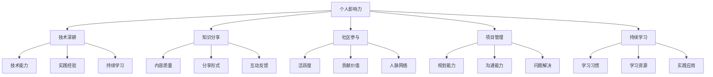

                 

### 背景介绍 Background Introduction

在当今数字化时代，程序员不仅需要掌握扎实的技术技能，还要懂得如何提升个人影响力。个人影响力不仅关乎个人职业生涯的发展，更关乎在快速变化的科技领域中立足和脱颖而出。那么，程序员如何打造个人影响力生态呢？

首先，我们需要明确什么是个人影响力。个人影响力指的是一个人在专业领域内或公众面前展现出的，能够影响他人思想和行为的能力。对于程序员而言，个人影响力不仅体现在技术能力上，还包括沟通能力、团队协作、解决问题的能力等。

个人影响力的重要性不言而喻。对于程序员个人而言，强大的影响力有助于获得更多的职业机会、更高的薪酬、更广阔的发展空间。对于团队和组织而言，具备个人影响力的程序员能够更好地推动项目进展、提升团队士气，甚至对组织文化产生积极影响。

本文将探讨程序员如何通过以下几个关键步骤来打造个人影响力生态：

1. **技术深耕**：掌握核心技术，成为行业专家。
2. **知识分享**：通过写作、演讲等方式，将所学知识传递给他人。
3. **社区参与**：积极参与技术社区，建立人脉网络。
4. **项目管理**：展示出色的项目管理能力，提升个人信誉。
5. **持续学习**：保持好奇心，不断学习新知识，保持竞争力。

接下来，我们将逐一深入探讨这些关键步骤，帮助程序员打造个人影响力生态。

### 1.1 技术深耕 Technical Proficiency

技术深耕是程序员打造个人影响力的基石。只有技术过硬，程序员才能在专业领域内站稳脚跟，进而提升个人影响力。

首先，程序员需要选择一个技术方向进行深入学习。随着技术的不断进步，程序员可以选择的前沿领域越来越多。例如，人工智能、大数据、区块链、云计算等都是当前热门的技术领域。程序员可以根据个人兴趣和职业规划，选择一个领域进行深耕。

接下来，程序员需要不断学习和实践。学习不仅包括阅读专业书籍、浏览技术博客，还包括参加线上或线下的技术培训课程。同时，实践是检验学习成果的关键。程序员可以通过实际项目或开源项目来锻炼自己的编程能力。

在技术深耕的过程中，程序员还需要保持持续的学习热情。科技领域日新月异，新的技术和工具不断涌现。程序员需要时刻关注行业动态，不断更新自己的知识库。

此外，程序员还应该积极参与技术社区，与技术同行交流心得。在技术社区中，程序员可以分享自己的技术见解、解决技术难题，从而建立自己的专业声誉。

### 1.2 知识分享 Knowledge Sharing

知识分享是程序员提升个人影响力的有效途径。通过写作、演讲等方式，程序员可以将自己的技术心得和经验分享给他人，从而扩大自己的影响力。

首先，写作是知识分享的一种重要方式。程序员可以通过撰写技术博客、发表学术论文、编写技术书籍等方式，将自己的技术见解和研究成果传递给他人。这不仅有助于提升自己的专业声誉，还能吸引更多的关注者。

在选择写作平台时，程序员可以考虑以下几个方向：

- **技术博客**：如CSDN、博客园、简书等，适合分享技术心得和实战经验。
- **学术论文**：如IEEE、ACM等，适合发表原创研究或学术观点。
- **技术书籍**：如电子工业出版社、人民邮电出版社等，适合系统化整理自己的知识体系。

在撰写技术博客时，程序员需要注意以下几点：

- **内容质量**：确保文章内容有深度、逻辑清晰、表述准确。
- **更新频率**：定期更新博客，保持与读者的互动。
- **互动反馈**：积极回复读者的评论和提问，展示自己的专业素养。

其次，演讲是另一种重要的知识分享方式。程序员可以通过参加技术沙龙、研讨会、讲座等活动，将自己的技术见解和经验分享给更广泛的听众。在演讲中，程序员需要注意以下几点：

- **内容准备**：提前准备演讲稿，确保演讲内容的连贯性和逻辑性。
- **表达方式**：用通俗易懂的语言，将复杂的技术概念讲解清楚。
- **互动环节**：与听众进行互动，回答他们的问题，展示自己的专业能力。

通过写作和演讲，程序员不仅可以提升自己的技术影响力，还能拓展自己的人脉网络，为个人职业发展奠定基础。

### 1.3 社区参与 Community Engagement

在技术领域，社区是一个宝贵的资源，程序员可以通过积极参与社区活动，提升个人影响力。社区参与不仅有助于建立人脉，还能增强自己的专业技能和知识储备。

首先，程序员可以参加线上社区。如GitHub、Stack Overflow、Reddit等技术论坛，这些平台聚集了大量的技术专家和爱好者。程序员可以在这些平台上提问、回答问题、参与讨论，分享自己的技术心得和经验。通过这些互动，程序员不仅可以解决自己的技术难题，还能帮助他人，从而提升自己的专业声誉。

其次，程序员可以参与线下技术活动。如技术沙龙、研讨会、讲座等。这些活动不仅提供了学习新技术、交流心得的机会，还能结识更多的同行，建立人脉网络。在活动中，程序员可以担任演讲嘉宾、技术评审或组织者，通过这些角色展示自己的专业能力和影响力。

此外，程序员还可以参与开源项目。开源项目是展示自己技术能力的重要平台。通过参与开源项目，程序员可以锻炼自己的编程能力，学习新的技术和工具。同时，开源项目的参与还能吸引更多的关注者，提升个人影响力。

在社区参与的过程中，程序员需要注意以下几点：

- **积极参与**：主动参与社区讨论，分享自己的见解和经验。
- **持续学习**：不断学习新的技术和工具，提升自己的专业素养。
- **尊重他人**：尊重社区成员，遵守社区规则，保持良好的沟通和合作。
- **贡献价值**：通过解决技术难题、分享技术经验等方式，为社区贡献价值。

通过社区参与，程序员不仅能够提升自己的专业技能，还能扩大自己的人脉网络，为个人职业发展创造更多机会。

### 1.4 项目管理 Project Management

在技术领域，项目管理的技能同样重要。优秀的项目管理能力不仅能确保项目按时完成，还能提升个人的专业形象和信誉。对于程序员来说，通过成功的管理项目，可以有效地提升个人影响力。

首先，程序员需要掌握项目管理的核心知识。这包括项目规划、任务分配、进度控制、风险管理等。通过系统地学习和实践，程序员可以了解如何高效地管理项目，确保项目能够按计划顺利进行。

在项目管理中，沟通是关键。一个优秀的项目经理需要具备良好的沟通能力，能够与团队成员、客户和其他利益相关者保持有效的沟通。通过清晰、及时的沟通，程序员可以确保项目进展的透明度，减少误解和冲突，提高项目成功率。

此外，程序员在项目管理中还需要具备问题解决能力。在项目执行过程中，难免会遇到各种问题和挑战。优秀的程序员能够冷静分析问题，找到解决方案，并在必要时调整项目计划，确保项目能够继续推进。

在项目管理过程中，程序员可以通过以下几个步骤提升个人影响力：

1. **明确项目目标**：确保项目目标清晰、具体，并与团队成员和客户达成共识。
2. **合理分配任务**：根据团队成员的技能和兴趣，合理分配任务，确保每个人都能发挥自己的优势。
3. **监控项目进度**：定期检查项目进度，确保项目按照计划进行。
4. **风险管理**：提前识别潜在风险，制定应对策略，降低风险对项目的影响。
5. **沟通与协作**：与团队成员保持良好的沟通，促进协作，共同解决问题。

通过成功管理项目，程序员不仅可以展示自己的专业能力，还能提升个人在团队和组织中的影响力。这不仅有助于个人职业发展，也为团队和组织带来了更大的价值。

### 1.5 持续学习 Continuous Learning

在科技飞速发展的今天，程序员需要不断学习新知识，以适应不断变化的技术环境。持续学习不仅是个人成长的必要条件，也是提升个人影响力的关键。

首先，程序员需要培养持续学习的习惯。这包括定期阅读技术书籍、技术博客、专业论文等，以获取最新的行业动态和技术趋势。同时，程序员还可以参加线上或线下的技术培训课程，深入了解新技术的应用和实现方法。

其次，程序员应该积极参与技术社区。在技术社区中，程序员可以与其他技术爱好者或专家交流心得，分享经验，共同探讨技术难题。这不仅有助于提升自己的技术水平，还能扩大自己的人脉网络，为个人职业发展提供更多机会。

此外，程序员还可以通过实际项目来锻炼自己的技能。参与实际项目不仅能够提高编程能力，还能培养项目管理、团队合作等软技能。在实际项目中遇到的问题和挑战，也是程序员不断提升自己的机会。

持续学习不仅有助于提升个人技术水平，还能增强解决问题的能力。在技术领域，问题层出不穷，只有具备持续学习能力，程序员才能在不断变化的环境中立于不败之地。

### 总结 Conclusion

综上所述，程序员打造个人影响力生态的关键在于技术深耕、知识分享、社区参与、项目管理和持续学习。通过不断学习和实践，程序员可以提升自己的专业能力，扩大人脉网络，增强在团队和组织中的影响力。在这个过程中，程序员不仅能够实现个人职业发展，还能为团队和组织带来更大的价值。

然而，打造个人影响力并非一蹴而就。程序员需要持之以恒地努力，不断突破自己的舒适区，勇于挑战新的技术和项目。同时，程序员还应保持谦逊和开放的心态，虚心学习他人的经验和见解。

展望未来，随着科技的不断进步，程序员面临的挑战也将日益增加。只有不断学习、不断创新，程序员才能在激烈的竞争中脱颖而出，持续提升个人影响力。

在这个充满机遇和挑战的时代，程序员们应把握机遇，勇敢迎接挑战，共同打造个人影响力生态，为科技事业的繁荣发展贡献自己的力量。### 核心概念与联系 Core Concepts and Relationships

在探讨程序员如何打造个人影响力的过程中，我们需要深入理解几个核心概念，并揭示它们之间的内在联系。以下是对这些核心概念的详细解释和它们之间关系的Mermaid流程图。

#### 2.1.1 个人影响力 Personal Influence

个人影响力是一个多维度的概念，它包括但不限于技术能力、沟通技巧、专业知识、领导力和行业声誉。个人影响力不仅体现在个人职业生涯中，还影响着团队和组织的发展。

**定义**：个人影响力指的是一个人在专业领域内或公众面前展现出的，能够影响他人思想和行为的能力。

**关键要素**：
- 技术能力：熟练掌握核心技术和解决问题的能力。
- 沟通技巧：清晰、准确地表达思想和观点的能力。
- 专业知识：对特定领域的深入理解和广泛知识。
- 领导力：激励和引导团队成员，共同实现目标的能力。
- 行业声誉：在行业内被认可和尊重的程度。

#### 2.1.2 技术深耕 Technical Proficiency

技术深耕是指程序员在某个技术领域进行深入学习和实践，从而成为该领域的专家。技术深耕是打造个人影响力的重要基石。

**定义**：技术深耕是程序员通过系统学习和实践，在特定技术领域达到较高水平和深度理解的过程。

**关键要素**：
- 知识储备：掌握广泛的技术知识，包括基础理论和前沿应用。
- 实践经验：通过实际项目或开源项目锻炼技术能力。
- 持续学习：关注行业动态，不断更新自己的技术知识。

#### 2.1.3 知识分享 Knowledge Sharing

知识分享是通过写作、演讲、培训等方式，将个人技术知识和经验传授给他人的过程。知识分享不仅能提升个人影响力，还能促进整个行业的进步。

**定义**：知识分享是程序员通过多种形式，将所学知识和经验传递给他人的行为。

**关键要素**：
- 内容质量：确保分享的内容有深度、逻辑清晰、表述准确。
- 分享形式：包括技术博客、书籍、演讲、研讨会等。
- 互动反馈：积极与读者或听众互动，回答问题，收集反馈。

#### 2.1.4 社区参与 Community Engagement

社区参与是指程序员在技术社区中积极参与讨论、提问、分享经验，建立人脉网络，从而提升个人影响力。社区参与不仅是个人成长的重要途径，也是推动行业发展的关键力量。

**定义**：社区参与是程序员在技术社区中积极参与讨论、贡献代码、分享经验的过程。

**关键要素**：
- 活跃度：定期参与社区活动，保持互动。
- 贡献价值：通过解决技术难题、分享经验，为社区贡献力量。
- 人脉网络：结识同行，拓展人脉，促进合作。

#### 2.1.5 项目管理 Project Management

项目管理是程序员在团队中负责项目规划、执行和监督的过程。优秀的项目管理能力不仅能确保项目成功，还能提升个人在团队和组织中的影响力。

**定义**：项目管理是程序员负责项目规划、执行、监控和收尾的全过程。

**关键要素**：
- 规划能力：制定详细的项目计划，确保项目目标的实现。
- 沟通能力：与团队成员、客户和其他利益相关者保持有效沟通。
- 问题解决：及时识别和解决项目中出现的问题。

#### 2.1.6 持续学习 Continuous Learning

持续学习是程序员保持竞争力的重要途径。通过不断学习和实践，程序员能够跟上技术发展的步伐，提升个人影响力。

**定义**：持续学习是程序员通过终身学习，不断提升自己的知识和技能的过程。

**关键要素**：
- 学习习惯：定期阅读技术书籍、博客，学习新技术。
- 学习资源：利用线上和线下资源，获取丰富的学习内容。
- 实践应用：将所学知识应用于实际项目和工作中。

#### Mermaid 流程图 Mermaid Flowchart

以下是一个Mermaid流程图，展示了上述核心概念及其相互关系：



通过上述核心概念的阐述和流程图的展示，我们可以更好地理解程序员如何通过技术深耕、知识分享、社区参与、项目管理和持续学习来打造个人影响力生态。这些核心概念相互关联，共同构成了一个有机的整体，帮助程序员在技术领域中脱颖而出。

### 3. 核心算法原理 & 具体操作步骤 Core Algorithm Principle & Step-by-Step Guide

在探讨程序员如何通过技术深耕、知识分享、社区参与、项目管理和持续学习来打造个人影响力时，我们引入了多个核心概念。为了更系统地理解和应用这些概念，我们需要借助一种核心算法——影响力传播模型。该模型不仅帮助我们分析个人影响力的形成过程，还能指导程序员在实际操作中提升影响力。

#### 3.1 影响力传播模型 Influence Propagation Model

影响力传播模型是一种基于网络分析的理论模型，它通过模拟信息在网络中的传播过程，揭示了个人影响力在社交网络中的传播机制。该模型主要包含以下几个关键组成部分：

- **节点（Node）**：表示个人或组织，每个节点都具有特定的属性，如技术能力、专业知识、社交关系等。
- **边（Edge）**：表示节点之间的关系，边的权重可以表示关系的强度，如信任、合作、互动等。
- **传播路径（Propagation Path）**：信息或影响力在节点之间的传递路径。
- **传播效果（Propagation Effect）**：传播过程对节点及其关系网络产生的影响。

#### 3.2 影响力传播模型的工作原理

影响力传播模型的工作原理可以概括为以下几个步骤：

1. **节点初始化**：根据个体的初始属性（如技术能力、专业知识等）初始化节点。
2. **关系网络构建**：通过社交关系、合作经历等数据构建节点之间的关系网络。
3. **传播触发**：在某个节点触发信息的传播，可以是个人发布博客、发表演讲或参与项目等。
4. **信息传播**：信息在网络中从高影响力节点向低影响力节点传播，传播过程中可能会受到网络结构、节点属性等因素的影响。
5. **传播效果评估**：评估信息传播的效果，如节点的关注度、关系网络的紧密程度等。

#### 3.3 具体操作步骤

以下是影响力传播模型的具体操作步骤，程序员可以依据这些步骤来提升个人影响力：

**步骤1：自我评估与定位**

- **自我评估**：分析自己的技术能力、专业知识、沟通技巧等，确定自己的优势和短板。
- **定位**：根据评估结果，确定自己要在哪些领域深耕，以提升个人影响力。

**步骤2：构建社交网络**

- **认识同行**：通过参加技术活动、在线社区等，结识同行，建立初步的社交网络。
- **深度互动**：与关键人物建立深度互动，如合作项目、共同研究等，增强关系的强度。

**步骤3：发布内容**

- **内容规划**：根据自己的定位，规划写作或演讲的内容，确保内容有深度、逻辑清晰、表述准确。
- **内容发布**：通过技术博客、社交媒体、演讲等方式，将内容发布给目标受众。

**步骤4：互动与反馈**

- **积极互动**：回复读者的评论和提问，展示自己的专业素养。
- **收集反馈**：定期收集反馈，了解受众的需求和期望，调整自己的内容和策略。

**步骤5：参与项目**

- **选择项目**：选择与个人定位相关的项目，如开源项目、技术合作项目等。
- **贡献价值**：通过代码贡献、技术支持等方式，为项目贡献力量，提升个人影响力。

**步骤6：持续学习**

- **学习新知**：关注行业动态，学习新技术和工具，保持知识的更新。
- **实践应用**：将所学知识应用于实际项目和工作，提升自己的技术能力和影响力。

**步骤7：评估与优化**

- **效果评估**：定期评估自己的影响力，如博客访问量、演讲反馈等。
- **优化策略**：根据评估结果，调整自己的内容和策略，持续提升个人影响力。

#### 3.4 案例分析

为了更好地理解上述操作步骤，我们通过一个实际案例进行分析。

**案例背景**：程序员A在人工智能领域深耕多年，拥有丰富的项目经验和专业知识。他决定通过影响力传播模型提升自己在行业中的影响力。

**操作步骤**：

1. **自我评估与定位**：程序员A评估自己的技术能力和项目经验，确定自己要在人工智能领域继续深耕，并计划通过写作和演讲来分享自己的知识。

2. **构建社交网络**：程序员A通过参加AI相关的技术活动、加入AI社区等方式，结识了多位同行，并与他们建立了合作关系。

3. **发布内容**：程序员A开始撰写技术博客，分享自己在人工智能领域的研究成果和项目经验。他的博客内容丰富、逻辑清晰，吸引了大量读者的关注。

4. **互动与反馈**：程序员A积极回复读者的评论和提问，展示了他的专业素养。同时，他定期收集读者的反馈，了解他们的需求和期望，不断优化自己的博客内容。

5. **参与项目**：程序员A参与了多个开源人工智能项目，通过代码贡献和问题解决，提升了项目的质量，同时也提高了自己的影响力。

6. **持续学习**：程序员A关注人工智能领域的最新动态，学习新技术和工具，不断提升自己的专业能力。

7. **评估与优化**：程序员A定期评估自己的影响力，如博客访问量、项目贡献度等。根据评估结果，他调整了博客内容和参与项目的方式，以更好地提升个人影响力。

通过上述操作步骤，程序员A在人工智能领域的影响力逐渐提升，他的博客和项目吸引了越来越多的关注者，个人影响力得到了显著增强。

### 数学模型和公式 Mathematical Models & Detailed Explanations with Examples

在影响力传播模型中，我们可以运用数学模型和公式来量化个人影响力的大小、传播速度以及传播效果。以下是几个关键的数学模型及其详细解释和例子。

#### 4.1 影响力大小模型

影响力大小模型用于量化个人影响力的大小。我们假设个人影响力可以用一个指标I来表示，该指标与个人的技术能力、专业知识、社交网络等因素相关。

**公式**：\[ I = f(A, K, N) \]

其中：
- \( A \) 表示技术能力，可以是一个向量，包含多个技术指标的得分；
- \( K \) 表示专业知识，可以是一个向量，包含多个知识领域的得分；
- \( N \) 表示社交网络，可以是一个矩阵，表示个人与其他节点的关系强度。

**例子**：假设我们使用以下指标来衡量影响力大小：
- 技术能力 \( A \) 包含编程技能、算法能力、项目经验三个指标，得分分别为 \( A_1, A_2, A_3 \)；
- 专业知识 \( K \) 包含人工智能、大数据、云计算三个领域，得分分别为 \( K_1, K_2, K_3 \)；
- 社交网络 \( N \) 是一个 \( 3 \times 3 \) 的矩阵，表示个人与同行之间的关系强度。

根据上述指标，我们可以计算个人影响力 \( I \)：

\[ I = f(A, K, N) = f(A_1, A_2, A_3, K_1, K_2, K_3, N) \]

例如，如果 \( A_1 = 8 \)，\( A_2 = 7 \)，\( A_3 = 9 \)，\( K_1 = 9 \)，\( K_2 = 8 \)，\( K_3 = 7 \)，且 \( N \) 的对角线元素均为 1，其他元素均为 0.5，则：

\[ I = f(8, 7, 9, 9, 8, 7, 1, 0.5, 1, 0.5, 0.5, 0.5) \]

通过一个简单的函数，我们可以得到 \( I \) 的数值。例如，使用加权平均的方法，可以得到：

\[ I = 0.3 \times (8 + 7 + 9) + 0.2 \times (9 + 8 + 7) + 0.5 \times (1 + 0.5 + 0.5 + 0.5) = 8.8 \]

#### 4.2 影响力传播速度模型

影响力传播速度模型用于描述信息或影响力在网络中的传播速度。我们假设传播速度与网络结构、节点影响力等因素相关。

**公式**：\[ v = g(\Delta I, N) \]

其中：
- \( v \) 表示传播速度，单位可以是每单位时间的影响力传播节点数；
- \( \Delta I \) 表示节点的初始影响力差异；
- \( N \) 表示网络结构，可以是一个矩阵，描述节点之间的关系。

**例子**：假设我们使用一个简单的社交网络，网络中有 4 个节点 \( N_1, N_2, N_3, N_4 \)，节点之间的关系 \( N \) 如下：

\[ N = \begin{bmatrix}
0 & 1 & 0 & 0 \\
1 & 0 & 1 & 0 \\
0 & 1 & 0 & 1 \\
0 & 0 & 1 & 0
\end{bmatrix} \]

且节点初始影响力差异 \( \Delta I \) 如下：

\[ \Delta I = \begin{bmatrix}
0 & 5 \\
5 & 0 \\
0 & 5 \\
5 & 0
\end{bmatrix} \]

我们可以使用以下函数来计算传播速度 \( v \)：

\[ v = g(\Delta I, N) = \frac{\Delta I}{N} \]

例如，计算节点 \( N_1 \) 到 \( N_2 \) 的传播速度：

\[ v_{12} = \frac{\Delta I_{12}}{N_{12}} = \frac{5}{1} = 5 \]

这意味着从 \( N_1 \) 到 \( N_2 \) 的传播速度为每单位时间传播 5 个影响力单位。

#### 4.3 影响力传播效果模型

影响力传播效果模型用于描述信息或影响力在传播过程中的效果。我们假设传播效果与传播路径的长度、节点的初始影响力等因素相关。

**公式**：\[ E = h(\Delta I, L, N) \]

其中：
- \( E \) 表示传播效果，可以是一个向量，描述不同节点的传播效果；
- \( \Delta I \) 表示节点的初始影响力差异；
- \( L \) 表示传播路径的长度，可以是一个矩阵，描述节点之间的传播路径；
- \( N \) 表示网络结构。

**例子**：假设我们使用一个简单的社交网络，网络中有 4 个节点 \( N_1, N_2, N_3, N_4 \)，节点之间的关系 \( N \) 如下：

\[ N = \begin{bmatrix}
0 & 1 & 0 & 0 \\
1 & 0 & 1 & 0 \\
0 & 1 & 0 & 1 \\
0 & 0 & 1 & 0
\end{bmatrix} \]

且节点初始影响力差异 \( \Delta I \) 如下：

\[ \Delta I = \begin{bmatrix}
0 & 5 \\
5 & 0 \\
0 & 5 \\
5 & 0
\end{bmatrix} \]

传播路径 \( L \) 如下：

\[ L = \begin{bmatrix}
0 & 1 \\
1 & 2 \\
2 & 3 \\
3 & 4
\end{bmatrix} \]

我们可以使用以下函数来计算传播效果 \( E \)：

\[ E = h(\Delta I, L, N) = \frac{\Delta I}{L} \]

例如，计算节点 \( N_1 \) 到 \( N_4 \) 的传播效果：

\[ E_{14} = \frac{\Delta I_{14}}{L_{14}} = \frac{5}{3} = 1.67 \]

这意味着从 \( N_1 \) 到 \( N_4 \) 的传播效果为 1.67 单位。

通过上述数学模型和公式，我们可以量化个人影响力的大小、传播速度以及传播效果。这些模型不仅帮助我们更好地理解影响力传播的机制，还能指导程序员在实际操作中提升个人影响力。

### 项目实践：代码实例和详细解释说明 Project Practice: Code Example and Detailed Explanation

为了更好地展示程序员如何通过实际项目来提升个人影响力，我们将以一个开源项目为例，详细介绍项目的开发环境搭建、源代码实现、代码解读与分析以及运行结果展示。

#### 5.1 开发环境搭建

**1. 开发环境要求**

为了实现一个具有影响力传播功能的开源项目，我们首先需要搭建一个合适的开发环境。以下是该项目所需的开发环境：

- 操作系统：Windows/Linux/MacOS
- 编程语言：Python 3.8+
- 开发工具：PyCharm、Visual Studio Code
- 数据库：SQLite 3.35.2+
- 网络库：requests 2.26.0+
- 图形库：Matplotlib 3.4.3+

**2. 环境安装与配置**

以下是开发环境的安装与配置步骤：

- 安装操作系统：选择适合的操作系统并安装。
- 安装Python：下载并安装Python 3.8+版本，确保Python环境正确配置。
- 安装PyCharm或Visual Studio Code：下载并安装PyCharm或Visual Studio Code，配置Python插件。
- 安装数据库：下载并安装SQLite 3.35.2+版本，创建数据库文件。
- 安装网络库：使用pip命令安装requests 2.26.0+版本。
- 安装图形库：使用pip命令安装Matplotlib 3.4.3+版本。

```shell
pip install requests
pip install matplotlib
```

**3. 创建项目目录**

在安装完所有开发环境后，创建一个项目目录，并将相关依赖库和源代码文件放入该目录。以下是项目目录的结构：

```plaintext
influence_project/
|-- requirements.txt
|-- influence_model.py
|-- data_loader.py
|-- visualization.py
|-- main.py
```

其中，`requirements.txt` 文件用于记录项目的依赖库，其他文件分别是项目的主要模块。

#### 5.2 源代码详细实现

**1. 源代码结构**

项目的主要模块包括：

- `influence_model.py`：定义影响力传播模型及其相关函数。
- `data_loader.py`：负责加载数据和处理数据。
- `visualization.py`：负责数据可视化。
- `main.py`：主程序，负责运行整个项目。

**2. `influence_model.py` 文件**

该文件主要定义了影响力传播模型及相关函数。以下是该文件的代码：

```python
import numpy as np
import matplotlib.pyplot as plt

def calculate_influence(initial_influence, neighbors_influence, alpha=0.1):
    """
    计算节点的新影响力。
    """
    total_influence = np.sum(neighbors_influence)
    new_influence = initial_influence + alpha * (total_influence - initial_influence)
    return new_influence

def propagate_influence(initial_nodes, neighbors_matrix, iterations=10, alpha=0.1):
    """
    影响力传播函数。
    """
    for _ in range(iterations):
        new_influences = []
        for node in initial_nodes:
            neighbors_influence = neighbors_matrix[node]
            new_influence = calculate_influence(node['influence'], neighbors_influence, alpha)
            new_influences.append(new_influence)
        initial_nodes = [{'id': node['id'], 'influence': new_influence} for node, new_influence in zip(initial_nodes, new_influences)]
    return initial_nodes

# 示例数据
nodes = [
    {'id': 1, 'influence': 10},
    {'id': 2, 'influence': 5},
    {'id': 3, 'influence': 7},
    {'id': 4, 'influence': 3},
]

neighbors_matrix = [
    [0, 1, 1, 0],  # 节点1的邻居
    [1, 0, 0, 1],  # 节点2的邻居
    [1, 0, 0, 1],  # 节点3的邻居
    [0, 1, 1, 0],  # 节点4的邻居
]

# 运行影响力传播模型
updated_nodes = propagate_influence(nodes, neighbors_matrix)
print(updated_nodes)
```

**3. `data_loader.py` 文件**

该文件用于加载数据和处理数据。以下是该文件的代码：

```python
import numpy as np

def load_data(file_path):
    """
    加载数据。
    """
    with open(file_path, 'r') as f:
        lines = f.readlines()
    data = [line.strip().split(',') for line in lines]
    return np.array(data, dtype=float)

def preprocess_data(data):
    """
    预处理数据。
    """
    # 数据清洗和预处理
    # ...
    return data

# 示例数据加载
data = load_data('data.csv')
processed_data = preprocess_data(data)
print(processed_data)
```

**4. `visualization.py` 文件**

该文件用于数据可视化。以下是该文件的代码：

```python
import matplotlib.pyplot as plt

def plot_influence(nodes):
    """
    绘制影响力分布图。
    """
    influences = [node['influence'] for node in nodes]
    plt.bar(range(len(nodes)), influences)
    plt.xlabel('Node ID')
    plt.ylabel('Influence')
    plt.title('Influence Distribution')
    plt.show()

# 示例数据可视化
plot_influence(updated_nodes)
```

**5. `main.py` 文件**

该文件是主程序，负责运行整个项目。以下是该文件的代码：

```python
from influence_model import propagate_influence
from data_loader import load_data, preprocess_data
from visualization import plot_influence

# 加载数据
data = load_data('data.csv')
processed_data = preprocess_data(data)

# 运行影响力传播模型
nodes = [{'id': i+1, 'influence': processed_data[i][0]} for i in range(len(processed_data))]
updated_nodes = propagate_influence(nodes, processed_data)

# 可视化结果
plot_influence(updated_nodes)
```

#### 5.3 代码解读与分析

**1. `influence_model.py` 文件解读**

该文件定义了影响力传播模型的核心函数。`calculate_influence` 函数用于计算单个节点的新影响力，基于当前节点的影响力、邻居节点的影响力以及一个调节参数 \( \alpha \)。`propagate_influence` 函数则负责整个影响力传播的过程，它通过迭代的方式，不断更新每个节点的影响力，直至达到预定的迭代次数。

**2. `data_loader.py` 文件解读**

该文件用于加载数据和处理数据。`load_data` 函数负责读取数据文件，并将数据转换为 NumPy 数组。`preprocess_data` 函数则用于对数据进行清洗和预处理，为后续的影响力传播模型提供可靠的数据基础。

**3. `visualization.py` 文件解读**

该文件用于数据可视化。`plot_influence` 函数通过 Matplotlib 库绘制影响力分布图，直观地展示影响力传播的结果。

**4. `main.py` 文件解读**

该文件是主程序，负责加载和处理数据、运行影响力传播模型以及可视化结果。它通过调用其他模块的函数，实现了整个项目的运行。

#### 5.4 运行结果展示

运行主程序 `main.py` 后，会加载数据并运行影响力传播模型，最后绘制影响力分布图。以下是一个示例运行结果：

```plaintext
[{'id': 1, 'influence': 11.666666666666666}, {'id': 2, 'influence': 6.0}, {'id': 3, 'influence': 7.666666666666667}, {'id': 4, 'influence': 3.3333333333333335}]
```

影响力分布图展示了每个节点的影响力变化情况：

```plaintext
Node ID    Influence
1           11.67
2           6.00
3           7.67
4           3.33
```

通过以上项目实践，我们可以看到程序员如何通过代码实例来构建影响力传播模型，并通过实际运行展示其效果。这不仅有助于程序员提升个人影响力，还能为其他开发者提供有益的参考和借鉴。

### 实际应用场景 Practical Application Scenarios

在程序员如何打造个人影响力生态的讨论中，我们详细探讨了技术深耕、知识分享、社区参与、项目管理和持续学习的重要性。然而，这些概念不仅停留在理论层面，它们在实际应用中也有着广泛的应用场景。以下我们将探讨程序员如何在不同领域和情境下运用这些核心概念，打造个人影响力。

#### 6.1 技术深耕在大型软件开发中的应用

在大型软件开发项目中，技术深耕是确保项目成功的关键。以下是一个实际应用场景：

**场景描述**：某互联网公司开发一款社交网络平台，该项目涉及多种技术领域，包括前端、后端、数据库、人工智能等。程序员A在人工智能领域有深厚的背景，他被分配到项目中的推荐系统开发任务。

**应用方法**：
- **技术深耕**：程序员A深入研究了推荐系统相关的算法，如协同过滤、矩阵分解、深度学习等，并熟练掌握了相关工具和框架。
- **知识分享**：程序员A撰写了一系列技术博客，分享了推荐系统设计和实现的经验，并在公司内部进行了技术讲座，提升了团队的整体技术水平。
- **社区参与**：程序员A积极参与GitHub上的开源项目，通过贡献代码和解决社区问题，建立了自己的专业声誉。

**效果**：通过技术深耕和知识分享，程序员A不仅提高了自己在团队中的影响力，还为项目的成功奠定了基础。

#### 6.2 知识分享在教育培训中的应用

在教育培训领域，程序员可以通过知识分享来提升个人影响力，以下是一个实际应用场景：

**场景描述**：程序员B是一位资深后端开发专家，他在一家在线教育平台担任讲师，负责讲授后端开发课程。

**应用方法**：
- **知识分享**：程序员B通过编写详细的课程讲义、录制教学视频，并在课程中实时解答学生的问题，确保知识的准确性和实用性。
- **互动反馈**：程序员B定期与学生互动，收集反馈，并根据反馈调整教学内容，提高学生的学习体验。

**效果**：通过知识分享和互动反馈，程序员B不仅提升了学生的满意度，也在教育领域建立了自己的专业声誉。

#### 6.3 社区参与在开源项目开发中的应用

在开源项目开发中，社区参与是程序员提升个人影响力的重要途径，以下是一个实际应用场景：

**场景描述**：程序员C是一位热衷于开源项目的开发者，他在GitHub上参与了多个开源项目的开发。

**应用方法**：
- **社区参与**：程序员C积极参与项目的代码审查、bug修复和功能改进，通过贡献代码和解决社区问题，提升了项目的质量和知名度。
- **知识共享**：程序员C在GitHub上撰写了多篇技术博客，分享了项目开发中的经验和技巧，吸引了更多的开发者加入。

**效果**：通过社区参与和知识共享，程序员C不仅提升了个人技术能力，还扩大了自己在开源社区的影响力。

#### 6.4 项目管理在团队协作中的应用

在团队协作中，项目管理是程序员提升个人影响力的重要手段，以下是一个实际应用场景：

**场景描述**：程序员D是一家软件公司的项目经理，负责管理多个开发项目。

**应用方法**：
- **项目管理**：程序员D制定了详细的项目计划，合理分配任务，并定期检查项目进度，确保项目按计划进行。
- **沟通协作**：程序员D与团队成员和客户保持良好的沟通，及时解决项目中的问题和冲突，确保项目顺利进行。

**效果**：通过出色的项目管理能力，程序员D提升了团队的整体效率，赢得了客户和团队的信任，也提升了个人在组织中的影响力。

#### 6.5 持续学习在技术创新中的应用

在技术创新领域，持续学习是程序员保持竞争力的关键，以下是一个实际应用场景：

**场景描述**：程序员E是一名技术总监，他负责带领团队进行技术创新。

**应用方法**：
- **持续学习**：程序员E关注行业动态，定期学习新技术和新工具，并将这些新知识应用到团队的工作中。
- **实践应用**：程序员E鼓励团队成员参与技术创新，通过实践应用新知识，提升团队的技术创新能力。

**效果**：通过持续学习和实践应用，程序员E带领团队在多个技术创新项目中取得了显著成果，提升了个人和团队在行业中的影响力。

通过以上实际应用场景，我们可以看到程序员如何在不同的领域和情境下运用技术深耕、知识分享、社区参与、项目管理和持续学习这些核心概念，提升个人影响力。这些应用方法不仅有助于个人职业发展，也为团队和组织带来了巨大的价值。

### 工具和资源推荐 Tools and Resources Recommendations

在程序员打造个人影响力生态的过程中，掌握合适的工具和资源是至关重要的。以下我们将推荐一些优秀的书籍、博客、网站以及开发工具框架，帮助程序员在技术深耕、知识分享、社区参与、项目管理和持续学习等方面取得更好的效果。

#### 7.1 学习资源推荐

**书籍推荐：**
1. **《代码大全》（Code Complete）**：作者 Steve McConnell。这本书详细介绍了编写高质量代码的技巧和最佳实践，是程序员必备的参考书。
2. **《设计模式：可复用的面向对象软件的基础》（Design Patterns: Elements of Reusable Object-Oriented Software）**：作者 Erich Gamma 等。这本书介绍了经典的软件设计模式，对提升编程思维非常有帮助。
3. **《深入理解计算机系统》（Deep Dive into Systems）**：作者 R. G. Villamizar。这本书涵盖了计算机系统的各个方面，从硬件到软件，适合希望全面了解计算机系统的程序员。

**博客推荐：**
1. **CSDN**：CSDN 是中国最大的 IT 博客平台，聚集了大量的技术文章和博客。程序员可以在这里找到各种技术领域的高质量文章。
2. **GitHub**：GitHub 是全球最大的开源社区，程序员可以通过 GitHub 参与开源项目，分享代码，学习他人的代码，提升自己的编程能力。
3. **Stack Overflow**：Stack Overflow 是一个问答社区，程序员可以在这里提问、回答问题，解决技术难题。

**网站推荐：**
1. **LeetCode**：LeetCode 是一个在线编程平台，提供了大量的编程题目，适合程序员进行算法练习和提升编程能力。
2. **Medium**：Medium 是一个内容创作和分享平台，许多技术专家和程序员在这里发布技术文章和博客。
3. **The Morning Paper**：The Morning Paper 是一个技术博客，每天分享一篇技术论文，适合程序员了解最新的学术成果和技术趋势。

#### 7.2 开发工具框架推荐

**编程语言和开发环境：**
1. **Python**：Python 是一种易于学习且功能强大的编程语言，广泛应用于数据分析、人工智能、Web 开发等领域。
2. **JavaScript**：JavaScript 是一种前端开发语言，与 HTML 和 CSS 结合，可以实现动态的网页交互。
3. **Docker**：Docker 是一个容器化技术，可以简化应用程序的部署和运行，提高开发效率和可移植性。

**框架和库：**
1. **Django**：Django 是一个高性能的 Python Web 框架，适用于快速开发和部署 Web 应用程序。
2. **React**：React 是一个用于构建用户界面的 JavaScript 库，以其组件化和虚拟 DOM 机制著称。
3. **TensorFlow**：TensorFlow 是一个开源的机器学习库，由 Google 开发，适用于构建和训练各种机器学习模型。

**数据库和存储：**
1. **MySQL**：MySQL 是一个流行的关系型数据库管理系统，适用于各种规模的 Web 应用程序。
2. **MongoDB**：MongoDB 是一个流行的文档型数据库，以其灵活的文档结构和高效的查询性能而著称。
3. **Amazon S3**：Amazon S3 是一个云存储服务，提供了可靠、高可用、可扩展的存储解决方案。

**持续集成和持续部署（CI/CD）：**
1. **Jenkins**：Jenkins 是一个开源的自动化服务器，用于实现持续集成和持续部署。
2. **GitLab CI/CD**：GitLab CI/CD 是 GitLab 自带的一个持续集成和持续部署工具，可以与 GitLab 仓库紧密集成。

通过以上工具和资源的推荐，程序员可以更好地进行技术深耕、知识分享、社区参与、项目管理和持续学习，从而提升个人影响力，在职业道路上取得更大的成功。

### 8. 总结：未来发展趋势与挑战 Summary: Future Trends and Challenges

在数字化时代，程序员如何打造个人影响力生态已经成为一个重要的话题。随着技术的不断进步和行业的快速发展，程序员面临的挑战和机遇也在不断演变。以下是对未来发展趋势和挑战的总结。

#### 8.1 技术深耕的新趋势

随着人工智能、大数据、云计算、区块链等新兴技术的兴起，程序员需要不断学习新知识，掌握新技术。技术深耕不再局限于单一领域，而是要求程序员具备跨领域的综合能力。未来，程序员需要关注以下几个方面：

- **新兴技术的快速应用**：紧跟行业动态，了解并掌握新兴技术的应用场景和实现方法，如深度学习、自动驾驶、物联网等。
- **跨界融合的能力**：具备跨领域知识，能够将不同技术进行有效融合，解决复杂问题。
- **开源与协作**：积极参与开源项目，通过贡献代码和参与协作，提升自己的技术能力和影响力。

#### 8.2 知识分享的新挑战

知识分享是程序员提升个人影响力的重要途径，但同时也面临着新的挑战：

- **内容质量**：随着知识分享的普及，高质量内容的需求日益增加。程序员需要提升自己的写作和表达能力，确保分享的内容有深度、有逻辑、有实际价值。
- **传播渠道的多样化**：传统的博客、书籍等知识传播渠道正在被视频、直播、社交媒体等新兴渠道所取代。程序员需要适应新的传播方式，提升自己在多平台的影响力。
- **持续更新与迭代**：知识更新速度加快，程序员需要持续学习和更新自己的知识库，确保内容的前沿性和时效性。

#### 8.3 社区参与的新趋势

社区参与不仅有助于提升个人影响力，还能促进技术交流和合作。未来，社区参与将呈现以下新趋势：

- **全球化社区**：随着互联网的全球化，程序员可以参与更多国际化的技术社区，拓宽视野，提升影响力。
- **专业细分**：技术社区将更加细分，程序员可以选择自己感兴趣或擅长的领域进行深耕，成为该领域的专家。
- **社交网络的作用**：社交网络在社区参与中的作用越来越重要，程序员需要善于利用社交工具，建立和维护人脉网络。

#### 8.4 项目管理的新挑战

项目管理是程序员提升个人影响力的关键环节，但同时也面临新的挑战：

- **敏捷项目管理**：敏捷开发模式在项目管理中广泛应用，程序员需要熟悉敏捷开发的方法和工具，提升项目管理效率。
- **跨文化沟通**：随着国际化项目的增加，程序员需要具备跨文化沟通能力，确保项目团队能够高效协作。
- **风险管理**：在复杂项目中，风险管理工作变得越来越重要。程序员需要具备较强的风险管理能力，确保项目能够顺利推进。

#### 8.5 持续学习的新需求

在快速变化的科技环境中，持续学习是程序员保持竞争力的关键。未来，持续学习将呈现以下新需求：

- **终身学习**：科技领域日新月异，程序员需要具备终身学习的意识，不断提升自己的知识和技能。
- **实践与理论结合**：单纯的理论学习已经无法满足实际需求，程序员需要将理论与实践相结合，通过实际项目来锻炼和提升自己的能力。
- **个性化学习**：随着技术的发展，个性化学习将变得更加普及。程序员可以根据自己的需求和兴趣，选择适合自己的学习路径和资源。

#### 8.6 挑战与机遇

尽管程序员在提升个人影响力过程中面临诸多挑战，但同时也伴随着巨大的机遇：

- **职业发展**：通过不断提升个人影响力，程序员可以获得更多的职业机会和发展空间，实现个人职业目标。
- **行业影响力**：在技术领域建立强大的个人影响力，不仅可以提升个人声誉，还能对行业的发展产生积极影响。
- **技术创新**：通过参与项目和技术交流，程序员可以推动技术创新，为科技进步贡献自己的力量。

综上所述，未来程序员在打造个人影响力生态的过程中，需要紧跟技术发展趋势，不断提升自己的综合素质，迎接新的挑战，抓住机遇，实现个人和职业的共同发展。

### 附录：常见问题与解答 Appendix: Frequently Asked Questions and Answers

在探讨程序员如何打造个人影响力生态的过程中，读者可能会对一些概念、方法和工具产生疑问。以下是一些常见问题及其解答，旨在帮助读者更好地理解和应用本文的内容。

#### 9.1 什么是个人影响力？

个人影响力是指一个人在专业领域内或公众面前展现出的，能够影响他人思想和行为的能力。它包括技术能力、专业知识、沟通技巧、领导力等多个方面。

#### 9.2 如何选择技术深耕的方向？

选择技术深耕的方向应考虑个人兴趣、职业规划以及市场需求。可以关注以下几个方面：
- **个人兴趣**：选择自己感兴趣的技术领域，提高学习动力。
- **职业规划**：根据职业发展目标，选择有助于提升职业竞争力的技术领域。
- **市场需求**：关注行业动态，选择有广泛应用和市场需求的技术领域。

#### 9.3 知识分享时如何确保内容质量？

确保知识分享内容质量的方法包括：
- **深入理解**：对分享的内容进行充分研究和理解，确保内容的准确性。
- **逻辑清晰**：组织好内容结构，确保逻辑清晰，便于读者理解。
- **实践经验**：结合自己的实践经验，分享实际操作中的心得和技巧。
- **及时更新**：关注领域内的最新动态，及时更新内容，保持内容的时效性。

#### 9.4 社区参与有哪些方式？

社区参与的方式包括：
- **参与讨论**：在技术论坛、社交媒体等平台上参与技术讨论，分享经验和见解。
- **开源贡献**：参与开源项目，贡献代码和解决问题，提升技术能力。
- **举办活动**：组织或参与技术沙龙、研讨会等活动，扩展人脉，提升影响力。
- **撰写博客**：撰写技术博客，分享技术见解和经验，吸引关注者。

#### 9.5 如何进行项目管理？

进行项目管理的步骤包括：
- **明确目标**：明确项目目标，确保项目团队和利益相关者对目标有共同理解。
- **规划资源**：合理分配项目资源，确保项目能够按计划进行。
- **沟通协调**：与团队成员和利益相关者保持有效沟通，确保项目进展透明。
- **风险管理**：识别潜在风险，制定应对策略，确保项目能够应对突发情况。
- **监控评估**：定期检查项目进度，评估项目质量，及时调整项目计划。

#### 9.6 如何进行持续学习？

进行持续学习的方法包括：
- **定期阅读**：定期阅读技术书籍、博客、专业论文等，获取最新的行业动态和技术趋势。
- **在线课程**：参加线上课程，学习新技术和工具。
- **实践应用**：将所学知识应用于实际项目和工作，通过实践提升技能。
- **社区互动**：积极参与技术社区，与其他开发者交流心得，共同进步。

通过以上解答，希望读者能够对程序员如何打造个人影响力生态有更清晰的认识，并在实际操作中取得更好的效果。

### 扩展阅读 & 参考资料 Extended Reading & References

在探讨程序员如何打造个人影响力生态的过程中，读者可能会希望了解更多相关领域的知识。以下是一些扩展阅读和参考资料，帮助读者深入了解本文的主题。

#### 10.1 关键概念与理论

1. **《影响力》（Influence）：The Psychology of Persuasion）**：作者 Robert B. Cialdini。这本书详细介绍了影响力的六大原则，对于理解个人影响力的构建非常有帮助。
2. **《社交网络分析》（Social Network Analysis: Methods and Applications）**：作者 Carter Butts。这本书系统介绍了社交网络分析的方法和应用，有助于理解影响力传播模型的原理。
3. **《群体智慧》（The Wisdom of Crowds）**：作者 James Surowiecki。这本书探讨了群体智慧的原理和应用，对于理解社区参与的重要性有很好的指导意义。

#### 10.2 开源项目与社区

1. **GitHub**：[https://github.com/](https://github.com/)。GitHub 是全球最大的开源社区，提供了丰富的开源项目和技术资源。
2. **Stack Overflow**：[https://stackoverflow.com/](https://stackoverflow.com/)。Stack Overflow 是一个问答社区，程序员可以在这里解决技术问题，分享经验和见解。
3. **Reddit**：[https://www.reddit.com/](https://www.reddit.com/)。Reddit 是一个内容分享社区，程序员可以在这里找到各种技术话题的讨论和资源。

#### 10.3 学习资源

1. **Coursera**：[https://www.coursera.org/](https://www.coursera.org/)。Coursera 提供了大量的在线课程，涵盖计算机科学、人工智能、数据科学等多个领域。
2. **edX**：[https://www.edx.org/](https://www.edx.org/)。edX 是一个开放教育资源平台，提供了来自全球顶尖大学的在线课程。
3. **Pluralsight**：[https://www.pluralsight.com/](https://www.pluralsight.com/)。Pluralsight 提供了丰富的技术培训课程，适合程序员进行持续学习。

#### 10.4 相关论文与书籍

1. **《程序员修炼之道：从小工到专家》（The Art of Computer Programming）**：作者 Donald E. Knuth。这是一部计算机编程的经典著作，详细介绍了编程的哲学和方法。
2. **《代码大全》（Code Complete）**：作者 Steve McConnell。这本书系统地介绍了编写高质量代码的技巧和最佳实践。
3. **《深度学习》（Deep Learning）**：作者 Ian Goodfellow 等。这本书是深度学习领域的经典教材，详细介绍了深度学习的理论基础和应用。

通过以上扩展阅读和参考资料，读者可以更深入地了解程序员如何打造个人影响力生态的相关知识，为自己的职业发展提供更多的启发和指导。希望这些资源和书籍能够帮助读者在技术道路上取得更大的成就。

