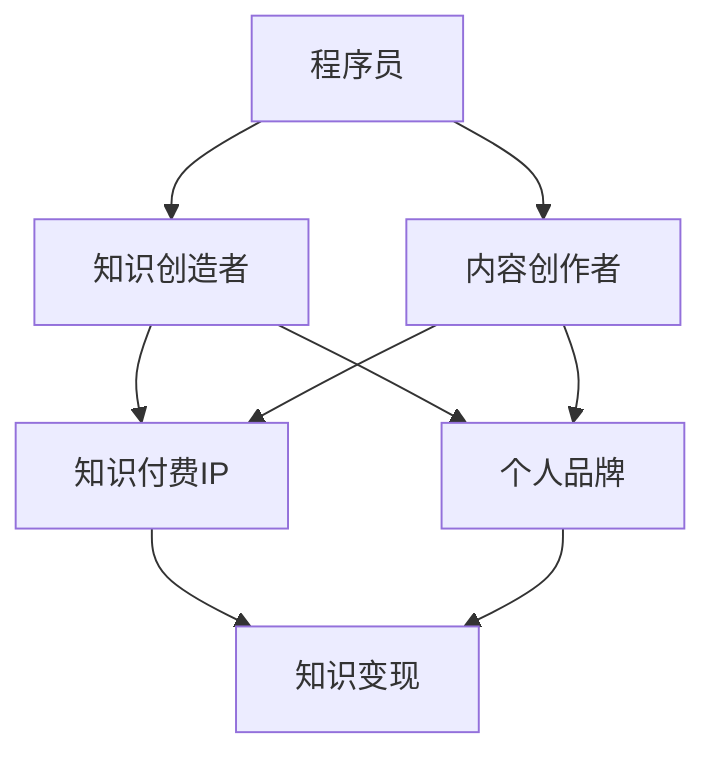

                 

### 文章标题

《程序员如何打造个人知识付费IP》

> **关键词**：程序员、知识付费、IP打造、个人品牌、内容创作

> **摘要**：本文将深入探讨程序员如何通过构建个人知识付费IP，实现从技术专家到知识创富的转变。我们将从背景介绍、核心概念、算法原理、项目实践、应用场景、工具推荐等多个角度，系统性地解答这一问题，为技术人员的知识变现提供实用指南。

### 1. 背景介绍

在信息化时代，技术人才的需求日益增长，而技术人员的价值也得到广泛认可。然而，传统的技术岗位晋升路径往往受到层级限制，技术人员的个人成长和收入增长存在瓶颈。在此背景下，知识付费市场应运而生，为技术人员提供了新的职业发展机遇。

知识付费，即用户为获取有价值的信息、知识和经验而支付的费用，它改变了过去知识传播的单向无偿模式，让知识创造者能够通过内容创作实现收入增长。随着互联网的发展，尤其是社交媒体、直播平台、在线教育平台的兴起，知识付费市场呈现出爆炸式增长。

程序员群体作为技术领域的核心力量，具备扎实的专业知识和丰富的实践经验，具有成为知识付费IP的潜力。然而，如何从技术专家转型为知识付费IP，是许多程序员面临的挑战。

本文将从以下方面展开讨论：

- 核心概念与联系
- 核心算法原理与具体操作步骤
- 数学模型和公式及其应用
- 项目实践：代码实例与详细解释
- 实际应用场景
- 工具和资源推荐
- 未来发展趋势与挑战
- 常见问题与解答

希望通过本文，读者能够获得打造个人知识付费IP的全面指导，实现从技术专家到知识创富者的转变。

### 2. 核心概念与联系

在探讨程序员如何打造个人知识付费IP之前，我们需要明确一些核心概念，并了解它们之间的联系。以下是一个简化的Mermaid流程图，用于展示这些概念及其关系：



#### 2.1 程序员

程序员是指具备计算机编程技能的专业技术人员。他们通过编写、测试、调试和维护代码，实现软件的开发和运行。程序员是知识付费IP的基础，他们的专业技能和经验是内容创作的核心。

#### 2.2 知识创造者

知识创造者是指能够产生有价值知识和信息的人。在程序员群体中，知识创造者不仅拥有技术知识，还具备深入理解行业动态和市场需求的洞察力。他们通过分享自己的知识和经验，帮助他人解决问题，实现个人价值。

#### 2.3 内容创作者

内容创作者是指能够创作高质量内容的人。在知识付费领域，内容创作者通过文字、图片、音频、视频等多种形式，将知识传递给受众。对于程序员来说，内容创作是将自己的技术知识和经验转化为可以传播的内容的重要方式。

#### 2.4 知识付费IP

知识付费IP是指通过提供有价值的知识内容，实现商业化变现的个人品牌或产品。它通常包括独特的知识点、方法论、案例研究等。知识付费IP是程序员个人品牌的延伸，也是实现知识变现的重要载体。

#### 2.5 个人品牌

个人品牌是指个人在特定领域内所建立的专业形象和声誉。对于程序员来说，个人品牌是其专业能力的象征，是吸引受众和实现知识变现的关键因素。通过构建个人品牌，程序员可以提高自己的市场价值和影响力。

#### 2.6 知识变现

知识变现是指通过知识和技能的输出，实现经济价值的转化。在知识付费市场中，知识变现的形式多种多样，包括线上课程、电子书、咨询服务、会员制度等。程序员通过知识变现，不仅可以获得收入，还能增强自己的市场竞争力。

### 3. 核心算法原理与具体操作步骤

打造个人知识付费IP的过程并非一蹴而就，它需要程序员具备一系列的核心算法原理，并遵循一系列具体操作步骤。以下是打造个人知识付费IP的五个关键步骤：

#### 3.1 确定知识领域和受众

第一步是确定自己的知识领域和目标受众。程序员需要根据自己的专业背景和兴趣爱好，选择一个具有市场需求的领域。例如，前端开发、后端架构、云计算、大数据等。同时，要明确目标受众的特点和需求，以便制定合适的内容策略。

#### 3.2 构建内容创作体系

内容创作是知识付费IP的核心。程序员需要构建一个系统化的内容创作体系，包括以下几个方面：

- **知识梳理**：将自己在特定领域内的知识和经验进行梳理，形成系统化的知识体系。
- **内容规划**：根据目标受众的需求，规划内容的形式、主题和发布频率。
- **内容创作**：通过文字、图片、音频、视频等多种形式，创作高质量的内容。
- **内容发布**：选择合适的平台，如微信公众号、知乎、B站、抖音等，进行内容的发布和推广。

#### 3.3 建立个人品牌

个人品牌是知识付费IP的重要组成部分。程序员需要通过以下几个方面建立个人品牌：

- **专业形象**：通过个人形象设计、社交媒体头像和封面等，打造专业形象。
- **内容质量**：确保内容的质量和原创性，树立专业权威的形象。
- **互动互动**：与受众建立良好的互动关系，增强用户粘性。
- **口碑传播**：通过用户口碑传播，提高个人品牌的影响力。

#### 3.4 实现知识变现

知识变现是构建个人知识付费IP的目的。程序员可以通过以下几种方式实现知识变现：

- **线上课程**：开设线上课程，通过直播或录播的形式，传授专业知识。
- **电子书**：编写电子书，分享自己的经验和心得。
- **咨询服务**：提供专业咨询服务，帮助有需求的用户解决问题。
- **会员制度**：建立会员制度，为用户提供更多增值服务，如专属课程、在线问答等。

#### 3.5 持续优化和迭代

构建个人知识付费IP是一个持续的过程。程序员需要不断优化和迭代自己的内容和服务，以适应市场的变化和用户的需求。以下是一些建议：

- **数据分析**：通过数据分析，了解用户行为和需求，优化内容创作策略。
- **用户反馈**：积极收集用户反馈，不断改进内容和服务质量。
- **学习与成长**：保持学习的态度，不断提升自己的专业能力和知识水平。

### 4. 数学模型和公式及其应用

在构建个人知识付费IP的过程中，数学模型和公式可以帮助程序员更科学地评估和优化自己的内容和服务。以下是一些常用的数学模型和公式：

#### 4.1 用户满意度模型

用户满意度（Satisfaction）是衡量知识付费IP成功与否的重要指标。用户满意度模型可以表示为：

\[ S = \frac{E - P}{Q} \]

其中：
- \( E \) 表示用户期望（Expectation）。
- \( P \) 表示实际体验（Performance）。
- \( Q \) 表示质量标准（Quality）。

为了提高用户满意度，程序员需要关注以下方面：

- **提高实际体验**：通过高质量的内容和服务，提升用户的实际体验。
- **调整用户期望**：通过有效的营销和宣传，合理调整用户的期望值。

#### 4.2 转化率模型

转化率（Conversion Rate）是衡量知识付费IP变现能力的重要指标。转化率模型可以表示为：

\[ CR = \frac{转化人数}{访问人数} \]

为了提高转化率，程序员可以采取以下策略：

- **优化内容质量**：通过高质量的内容，提高用户的购买意愿。
- **优化用户体验**：通过简洁明了的界面设计和流畅的购买流程，提高用户的购买体验。
- **营销策略**：通过有效的营销活动，吸引更多的潜在用户。

#### 4.3 成本收益模型

成本收益（Cost-Benefit）模型用于评估知识付费IP的经济效益。成本收益模型可以表示为：

\[ \text{成本收益比} = \frac{\text{总收益}}{\text{总成本}} \]

为了提高成本收益比，程序员需要关注以下方面：

- **降低成本**：通过优化内容创作和运营流程，降低成本。
- **提高收益**：通过拓展销售渠道、增加用户粘性、提高单价等方式，提高收益。

#### 4.4 用户生命周期价值模型

用户生命周期价值（Customer Lifetime Value，CLV）是评估用户对知识付费IP长期贡献的重要指标。用户生命周期价值模型可以表示为：

\[ \text{CLV} = \text{平均订单价值} \times \text{购买频率} \times \text{用户生命周期} \]

为了提高用户生命周期价值，程序员可以采取以下策略：

- **提高平均订单价值**：通过提供更多增值服务，提高用户的平均订单价值。
- **提高购买频率**：通过定期发布高质量内容，增加用户的购买频率。
- **延长用户生命周期**：通过良好的用户体验和持续的内容更新，延长用户的使用周期。

### 5. 项目实践：代码实例和详细解释说明

为了更好地理解如何构建个人知识付费IP，我们将通过一个实际的项目案例来进行分析和讲解。

#### 5.1 开发环境搭建

在这个案例中，我们将使用Python语言来构建一个简单的在线教育平台，该平台提供课程订阅和视频点播功能。以下是开发环境的搭建步骤：

- **Python环境**：安装Python 3.8及以上版本。
- **Web框架**：安装Flask框架，用于构建Web应用。
- **数据库**：安装SQLite数据库，用于存储用户信息和课程数据。

#### 5.2 源代码详细实现

以下是项目的核心代码实现，我们将分模块进行讲解。

```python
# 导入所需库
from flask import Flask, render_template, request, redirect, url_for
import sqlite3

# 初始化Flask应用
app = Flask(__name__)

# 数据库连接
conn = sqlite3.connect('online_education.db')
cursor = conn.cursor()

# 创建表格
cursor.execute('''CREATE TABLE IF NOT EXISTS users (id INTEGER PRIMARY KEY, username TEXT, password TEXT)''')
cursor.execute('''CREATE TABLE IF NOT EXISTS courses (id INTEGER PRIMARY KEY, title TEXT, description TEXT, price REAL)''')
conn.commit()

# 用户注册
@app.route('/register', methods=['GET', 'POST'])
def register():
    if request.method == 'POST':
        username = request.form['username']
        password = request.form['password']
        cursor.execute('INSERT INTO users (username, password) VALUES (?, ?)', (username, password))
        conn.commit()
        return redirect(url_for('login'))
    return render_template('register.html')

# 用户登录
@app.route('/login', methods=['GET', 'POST'])
def login():
    if request.method == 'POST':
        username = request.form['username']
        password = request.form['password']
        cursor.execute('SELECT * FROM users WHERE username=? AND password=?', (username, password))
        user = cursor.fetchone()
        if user:
            return redirect(url_for('home'))
        else:
            return '登录失败，请检查用户名和密码！'
    return render_template('login.html')

# 主页
@app.route('/')
def home():
    return render_template('home.html')

# 查看课程
@app.route('/courses')
def courses():
    cursor.execute('SELECT * FROM courses')
    courses = cursor.fetchall()
    return render_template('courses.html', courses=courses)

# 订阅课程
@app.route('/subscribe', methods=['POST'])
def subscribe():
    course_id = request.form['course_id']
    cursor.execute('INSERT INTO subscriptions (user_id, course_id) VALUES (?, ?)', (1, course_id))
    conn.commit()
    return redirect(url_for('courses'))

# 退出登录
@app.route('/logout')
def logout():
    return redirect(url_for('login'))

# 运行应用
if __name__ == '__main__':
    app.run(debug=True)
```

#### 5.3 代码解读与分析

以下是对上述代码的详细解读和分析：

- **数据库连接**：使用SQLite数据库，连接数据库并创建用户和课程表格。
- **用户注册**：实现用户注册功能，将用户名和密码存储在数据库中。
- **用户登录**：实现用户登录功能，验证用户名和密码是否匹配。
- **主页**：显示主页，提供注册、登录和查看课程等功能。
- **查看课程**：从数据库中查询所有课程信息，并显示在页面上。
- **订阅课程**：实现用户订阅课程功能，将用户ID和课程ID存储在数据库中。
- **退出登录**：实现用户退出登录功能，重定向到登录页面。

#### 5.4 运行结果展示

在本地环境中运行上述代码，将看到以下结果：

- 访问`http://127.0.0.1:5000/`，显示主页，提供注册、登录和查看课程等功能。
- 注册新用户，填写用户名和密码，点击注册按钮后，用户信息存储在数据库中。
- 登录系统，输入用户名和密码，成功后进入主页，可以看到所有课程信息。
- 选择课程，点击订阅按钮，用户订阅的课程信息存储在数据库中。

通过这个项目案例，我们可以看到如何利用Python和Flask框架快速构建一个简单的在线教育平台。这个平台不仅实现了用户注册、登录和课程订阅等功能，还为程序员提供了一个构建知识付费IP的实践案例。

### 6. 实际应用场景

构建个人知识付费IP的实际应用场景多种多样，以下列举几个典型的场景：

#### 6.1 线上教育平台

随着在线教育的兴起，越来越多的程序员选择通过构建个人线上教育平台，传授自己的专业知识和经验。例如，某些程序员专注于前端开发，可以开设JavaScript、React、Vue等前端技术的线上课程；而另一些程序员则专注于后端架构，可以开设Java、Spring、Docker等后端技术的课程。通过线上教育平台，程序员不仅可以实现知识变现，还能提高自己的影响力和个人品牌价值。

#### 6.2 技术博客

技术博客是程序员构建个人知识付费IP的另一个重要渠道。通过撰写高质量的技术博客文章，程序员可以分享自己的技术心得、解决方案和最佳实践。随着博客内容的积累，程序员可以逐渐建立起自己在特定领域的权威地位。在此基础上，程序员可以通过推出付费内容，如技术报告、案例分析、高级教程等，实现知识变现。

#### 6.3 在线问答和咨询服务

一些程序员擅长解决特定领域的技术问题，他们可以通过在线问答和咨询服务，帮助有需要的用户解决技术难题。例如，某些程序员可以提供关于数据库优化、系统架构设计的咨询服务，而另一些程序员则可以提供关于人工智能、大数据分析的技术支持。通过在线问答和咨询服务，程序员不仅可以实现知识变现，还能提高自己的专业技能和知名度。

#### 6.4 技术社区和论坛

程序员还可以通过构建技术社区和论坛，为志同道合的同行提供一个交流和学习的平台。例如，某些程序员可以创建一个关于前端开发的社区，提供技术讨论、问题解答和资源分享；而另一些程序员则可以创建一个关于云计算的论坛，讨论相关技术话题和解决方案。通过技术社区和论坛，程序员不仅可以积累丰富的行业资源，还能提高自己的影响力，进而实现知识变现。

#### 6.5 开源项目和GitHub

GitHub是程序员展示自己技术实力的重要平台。程序员可以通过开源项目和GitHub仓库，展示自己的代码质量和技术水平。同时，一些程序员还可以通过GitHub Pages搭建个人网站，介绍自己的项目和经验。在此基础上，程序员可以通过GitHub仓库的赞助功能，接受用户的赞助和支持，实现知识变现。

### 7. 工具和资源推荐

在构建个人知识付费IP的过程中，程序员需要借助一系列工具和资源来提升内容创作和运营效率。以下是一些推荐的工具和资源：

#### 7.1 学习资源推荐

- **书籍**：
  - 《深度学习》（Deep Learning） - Goodfellow, Bengio, Courville
  - 《代码大全》（The Art of Computer Programming） - Knuth
  - 《Effective Java》 - Bloch
  - 《设计模式：可复用面向对象软件的基础》（Design Patterns: Elements of Reusable Object-Oriented Software） - Gamma, Helm, Johnson, Vlissides

- **论文**：
  - 《神经网络与深度学习》 - Andrew Ng
  - 《数据密集型应用程序系统》 - Martín Abadi, Zhifeng Sun, Simon Kornblith, Samuel R. Thibaux, Qian Zhang
  - 《大规模分布式存储系统：原理解析与架构设计》 - 赵海兴，王道平

- **博客**：
  - [Kdnugget](https://www.kdnuggets.com/)
  - [Medium](https://medium.com/)
  - [GitHub](https://github.com/)

- **网站**：
  - [Stack Overflow](https://stackoverflow.com/)
  - [GitHub](https://github.com/)

#### 7.2 开发工具框架推荐

- **在线教育平台**：
  - [Udemy](https://www.udemy.com/)
  - [Coursera](https://www.coursera.org/)
  - [Khan Academy](https://www.khanacademy.org/)

- **博客平台**：
  - [Hexo](https://hexo.io/)
  - [Jekyll](https://jekyllrb.com/)
  - [Hugo](https://gohugo.io/)

- **视频制作工具**：
  - [Adobe Premiere Pro](https://www.adobe.com/products/premiere.html)
  - [Final Cut Pro](https://www.apple.com/finalcutpro/)
  - [Camtasia](https://www.techsmith.com/camtasia.html)

- **协作工具**：
  - [Trello](https://trello.com/)
  - [Asana](https://www.asana.com/)
  - [Notion](https://www.notion.so/)

#### 7.3 相关论文著作推荐

- **论文**：
  - "Deep Learning: A Brief History and Future Directions" - Y. LeCun, Y. Bengio, G. Hinton
  - "The Unreasonable Effectiveness of Data" - J. D. MacKay
  - "Distributed Systems: Concepts and Design" - George Coulouris, Jean Dollimore, Tim Kindberg, Gordon Blair

- **著作**：
  - 《程序员修炼之道：从小工到专家》 - Andrew Hunt, David Thomas
  - 《软件工程：实践者的研究方法》 - Roger S. Pressman
  - 《敏捷软件开发：原则、实践与模式》 - Robert C. Martin

### 8. 总结：未来发展趋势与挑战

随着知识付费市场的不断扩大，程序员打造个人知识付费IP将迎来更广阔的发展空间。然而，这一过程也伴随着一系列挑战。

#### 8.1 发展趋势

- **内容多样化**：随着用户需求的多样化，程序员需要提供更丰富、更专业的内容，满足不同用户群体的需求。
- **技术赋能**：人工智能、大数据等技术将为程序员的内容创作和推广提供更强有力的支持。
- **平台化发展**：知识付费平台将进一步整合资源，提供一站式服务，降低程序员的内容创作和运营门槛。
- **全球市场拓展**：随着互联网的全球化，程序员的知识付费IP有望覆盖更广泛的国际市场。

#### 8.2 挑战

- **内容质量竞争**：在知识付费市场，内容质量是程序员脱颖而出的关键。程序员需要不断提升自己的专业水平和内容创作能力。
- **营销推广压力**：在激烈的市场竞争中，程序员需要投入更多精力进行营销推广，提高自己的知名度和影响力。
- **法律风险**：知识付费涉及版权、隐私等法律问题，程序员需要了解相关法律法规，确保内容创作和运营合法合规。
- **用户粘性挑战**：程序员需要持续提供高质量的内容和服务，保持用户的粘性和忠诚度。

### 9. 附录：常见问题与解答

#### 9.1 如何选择知识领域？

选择知识领域时，应考虑以下几点：

- **兴趣和擅长**：选择自己感兴趣且擅长的领域，有助于持续创作高质量内容。
- **市场需求**：选择市场需求大、用户多的领域，有助于实现知识变现。
- **竞争状况**：选择竞争相对较小的领域，有助于在市场中脱颖而出。

#### 9.2 如何提高内容创作质量？

提高内容创作质量的方法包括：

- **深入研究和学习**：不断提升自己的专业知识和技能，为内容创作提供扎实的理论基础。
- **用户反馈**：积极收集用户反馈，不断改进内容和表达方式。
- **借鉴优秀作品**：学习和借鉴其他优秀内容创作者的作品，吸取经验和教训。
- **持续创新**：不断尝试新的内容形式和表达方式，保持内容的创新性和吸引力。

#### 9.3 如何进行营销推广？

进行营销推广的方法包括：

- **社交媒体**：利用微博、知乎、B站等社交媒体平台，发布高质量内容，吸引关注和互动。
- **合作推广**：与其他领域的内容创作者或知名人士合作，扩大影响力。
- **广告投放**：在合适的时间和地点进行广告投放，提高曝光度。
- **线上线下活动**：举办线上线下活动，增加与用户的互动和粘性。

### 10. 扩展阅读 & 参考资料

为了深入了解程序员如何打造个人知识付费IP，以下是一些建议的扩展阅读和参考资料：

- **书籍**：
  - 《知识变现：如何将你的知识和经验转化为财富》 - 张辉
  - 《知识经济：未来的商业趋势》 - 费舍尔

- **论文**：
  - “The Economics of Knowledge Markets” - A. M. Ruggero, M. A. Rogers
  - “Knowledge Management and Competitive Advantage” - I. Nonaka, H. Takeuchi

- **博客**：
  - [张辉的博客](https://www.zhiphu.com/)
  - [知识变现实践者](https://www.knowledgemoney.com/)

- **网站**：
  - [知群学院](https://www.zhiqtc.com/)
  - [极客时间](https://time.geektime.cn/)

通过阅读这些资料，读者可以更全面地了解知识付费市场的动态和趋势，为自己的个人知识付费IP打造提供有益的启示。

