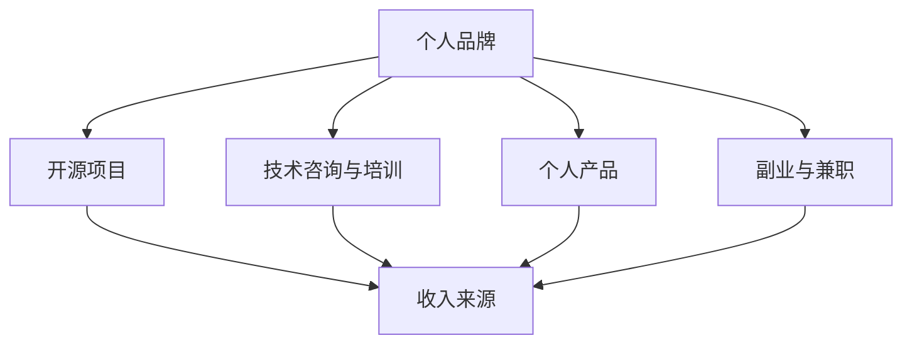

                 

### 1. 背景介绍

在当今快速变化的技术环境中，程序员不再仅仅是编写代码、解决问题的高级技术工人。随着云计算、大数据、人工智能等新兴技术的不断涌现，程序员的角色和职责也在不断演变。传统的单一收入来源已经无法满足现代程序员的多样化需求。因此，构建多元化收入来源的生态系统成为了程序员提升自身竞争力、实现职业发展的关键。

多元化收入来源的重要性体现在以下几个方面：

1. **抗风险能力增强**：当程序员的收入来源仅限于全职工作或一个项目时，一旦这些收入来源出现变动，如公司裁员、项目结束等，程序员的财务状况可能会受到严重影响。而多元化的收入来源可以为程序员提供更多的安全垫，降低职业风险。

2. **职业发展更广阔**：通过构建多元化的收入来源，程序员可以更自由地选择项目和工作环境，不必局限于某个特定领域或职位。这种灵活性有助于程序员拓展视野、积累更多经验，从而实现职业上的跳跃式发展。

3. **提高个人品牌价值**：通过参与多个项目、发表技术博客、开源代码等方式，程序员可以不断提升个人品牌价值。多元化的收入来源可以为程序员提供更多的机会来展示自己的专业能力和技术成就，进一步巩固个人在业界的地位。

4. **增加额外收入**：除了主业收入外，多元化的收入来源还可以为程序员带来额外的收入。这些收入可以用于投资、学习新技术或实现个人梦想，提高生活质量。

在接下来的章节中，我们将深入探讨如何构建多元化收入来源的生态系统，包括以下关键步骤：

- **自我品牌建设**：如何通过个人博客、社交媒体等渠道提升个人品牌价值。
- **参与开源项目**：如何参与开源项目，从中获得声誉和机会。
- **技术咨询与培训**：如何提供专业咨询服务和技术培训，获得额外收入。
- **开发个人产品**：如何开发个人软件、工具或服务，打造持续收入流。
- **副业与兼职**：如何在保证主业稳定的前提下，开展副业或兼职工作。

通过这些步骤，程序员不仅可以实现收入来源的多元化，还能在职业生涯中不断突破自我、实现价值最大化。接下来，我们将逐个探讨这些关键步骤，帮助程序员构建一个稳固而多元的收入生态系统。

### 2. 核心概念与联系

在探讨如何构建多元化收入来源的生态系统之前，我们需要明确几个核心概念，这些概念将为我们构建整个生态系统奠定基础。以下是本文涉及的关键概念及其相互关系：

#### 2.1 个人品牌

个人品牌是指一个人在职场和社会中的形象和声誉。对于程序员来说，个人品牌不仅代表着个人的技术水平，还包括沟通能力、解决问题的能力以及个人价值观。一个强大的个人品牌可以吸引更多的机会，提高职业竞争力。

#### 2.2 开源项目

开源项目是指代码和资源公开，允许任何人查看、修改和分享的项目。参与开源项目可以帮助程序员提升技术水平、积累项目经验，同时也有助于建立个人声誉。许多大型公司和招聘机构都非常重视候选人的开源项目经历。

#### 2.3 技术咨询与培训

技术咨询与培训是指为其他公司和组织提供专业技术服务或培训课程。这包括软件架构设计、系统优化、新技术引入等。通过提供高质量的咨询服务，程序员可以获得额外的收入，同时提升自己的专业能力。

#### 2.4 个人产品

个人产品是指程序员自己开发的软件、工具或服务。这可以是开源软件、付费应用、在线课程等。个人产品不仅可以为程序员带来持续的收入，还可以帮助程序员积累更多的用户和数据，进一步推动个人品牌建设。

#### 2.5 副业与兼职

副业与兼职是指程序员在主业之外开展的其他工作。这可以是在线编程、自由职业、咨询服务等。通过副业与兼职，程序员可以在不影响主业的情况下增加收入，拓宽职业发展路径。

下面是一个使用Mermaid绘制的流程图，展示这些核心概念之间的相互关系：



**图1：核心概念与收入来源之间的相互关系**

在图中，我们可以看到个人品牌是核心，它通过开源项目、技术咨询与培训、个人产品和副业与兼职等多个途径，最终形成多元化的收入来源。这个生态系统不仅为程序员提供了财务上的保障，也为个人职业发展创造了更多的机会。

接下来，我们将深入探讨这些核心概念的详细内容和实际操作步骤，帮助程序员构建一个稳固而多元的收入生态系统。

### 3. 核心算法原理 & 具体操作步骤

要构建一个多元化的收入来源生态系统，我们需要依赖一系列核心算法和操作步骤。这些步骤不仅有助于提升个人品牌价值，还能为程序员提供多元化的收入渠道。以下是构建这一生态系统所需的关键算法和具体操作步骤：

#### 3.1 自我品牌建设

**算法原理**：个人品牌建设是一种市场营销策略，旨在提高个人在特定领域的知名度、认可度和影响力。

**具体操作步骤**：

1. **确定目标受众**：首先，明确你的个人品牌面向的受众是谁，这有助于你更有针对性地制定品牌策略。

2. **内容策划**：根据目标受众的需求，策划并创作有价值的、专业的内容。这些内容可以包括技术博客、教程、案例分析等。

3. **内容发布**：将内容发布到个人博客、技术论坛、社交媒体等平台。确保内容质量和频率，以建立持续的关注和互动。

4. **互动与反馈**：积极参与社区讨论，回复读者评论，收集反馈，并根据反馈调整内容策略。

5. **持续优化**：根据数据分析结果，持续优化内容策略和发布计划，提升品牌影响力。

**示例**：假设你是一名专注于大数据技术的程序员，你可以定期发布关于大数据处理的博客，分享实战经验和案例。通过持续的内容输出，你可以吸引更多对大数据感兴趣的开发者，从而提高个人品牌知名度。

#### 3.2 参与开源项目

**算法原理**：开源项目不仅为程序员提供技术交流和学习的平台，还能帮助程序员积累项目经验、提高编程技能。

**具体操作步骤**：

1. **选择项目**：根据个人兴趣和技术特长，选择一个合适的开源项目。

2. **学习项目文档**：阅读项目的README文件和其他文档，了解项目的技术架构、代码规范和开发流程。

3. **贡献代码**：通过GitHub等代码托管平台，向项目提交代码补丁或功能改进。

4. **参与讨论**：积极参与项目的讨论和交流，提出建议和解决方案。

5. **持续贡献**：定期回顾项目的需求，持续贡献代码和意见，保持项目的活跃度。

**示例**：你可以在GitHub上找到一个开源的数据分析工具项目，通过阅读项目文档和源代码，了解工具的使用方法和功能。在熟练使用工具后，你可以为项目贡献代码，修复已知的bug或添加新的功能。这样的贡献不仅有助于项目的发展，还能提升你在开源社区的知名度。

#### 3.3 提供技术咨询与培训

**算法原理**：通过提供专业的技术服务和培训课程，程序员可以将自己的知识和经验转化为收入。

**具体操作步骤**：

1. **市场调研**：了解目标客户的需求，确定培训或服务的具体内容和形式。

2. **内容制作**：根据市场调研结果，制作高质量的培训资料或服务方案。

3. **推广营销**：通过个人博客、社交媒体、线上广告等渠道，推广你的技术咨询与培训服务。

4. **提供服务**：根据预约安排，按时提供培训或咨询服务。

5. **客户反馈**：在服务结束后，收集客户反馈，优化服务质量和内容。

**示例**：你可以开设一个关于云计算技术的在线培训课程，通过直播或录播的形式，向学员传授云计算的基本概念、实践技巧和应用场景。通过提供高质量的课程内容，你可以吸引更多的学员，从而获得稳定的收入。

#### 3.4 开发个人产品

**算法原理**：通过开发个人产品，程序员可以创建一个持续的收入流，同时积累用户和数据。

**具体操作步骤**：

1. **市场调研**：确定个人产品的市场需求和目标用户。

2. **产品设计**：根据市场需求，设计符合用户需求的产品功能和技术架构。

3. **开发与测试**：编写代码，实现产品功能，并进行严格测试，确保产品质量。

4. **上线与推广**：将产品上线，并通过各种渠道进行推广，吸引潜在用户。

5. **用户运营**：通过用户反馈，不断优化产品功能，提高用户满意度。

**示例**：你可以开发一个基于Web的代码管理工具，帮助开发者更高效地管理代码仓库。通过这个工具，你可以吸引大量的开发者用户，并获得相应的收入。随着用户数量的增加，你可以进一步优化产品，提供更多增值服务，实现收入的持续增长。

#### 3.5 开展副业与兼职

**算法原理**：通过副业与兼职，程序员可以在不影响主业的情况下，增加收入来源。

**具体操作步骤**：

1. **选择副业或兼职**：根据自己的技能和兴趣，选择合适的副业或兼职工作。

2. **签订合同**：确保与雇主签订详细的合同，明确工作内容、时间、报酬等。

3. **按时完成任务**：按照合同约定，按时完成工作任务，保证工作质量。

4. **沟通与反馈**：与雇主保持良好沟通，及时反馈工作进展和遇到的问题。

5. **持续寻找机会**：定期寻找新的副业或兼职机会，确保收入来源的多元化。

**示例**：你可以利用业余时间，为其他开发者提供网站开发服务。通过接取多个小型项目，你可以增加收入，同时积累更多的客户资源和开发经验。

通过以上算法和操作步骤，程序员可以构建一个多元化的收入来源生态系统。这个生态系统不仅能够为程序员提供稳定的收入，还能帮助他们在职业发展中不断突破自我。接下来，我们将通过一个具体的案例，进一步展示这些步骤的实际应用。

#### 3.6 案例分析

李华是一名资深的软件开发工程师，他在构建多元化收入来源的生态系统中取得了显著的成果。以下是他的具体做法和成功经验。

**步骤 1：自我品牌建设**

李华深知个人品牌的重要性，因此他开始撰写技术博客，分享自己在软件开发领域的心得和经验。他选择了一个热门的技术话题——微服务架构，并定期发布高质量的博客文章。这些文章不仅获得了大量的阅读和评论，还吸引了一些大型公司的关注。通过这种方式，李华成功建立了自己的个人品牌。

**步骤 2：参与开源项目**

李华在GitHub上发现了一个与微服务架构相关的开源项目，他决定参与其中。通过阅读项目文档和源代码，他了解了项目的技术架构和开发流程。在熟悉项目后，他开始提交代码补丁，修复了一些已知bug，并添加了一些新功能。他的贡献不仅提高了项目的质量，还使他在开源社区中获得了更多的关注和认可。

**步骤 3：提供技术咨询与培训**

李华的专业知识和技术能力使他成为了许多企业的技术顾问。他通过线上和线下的方式，为企业提供微服务架构的咨询服务和技术培训。他不仅帮助企业解决了技术难题，还通过培训课程，帮助企业提升开发团队的技术水平。这些咨询服务和技术培训为李华带来了可观的收入。

**步骤 4：开发个人产品**

李华看到了市场上对微服务管理工具的需求，于是他决定开发一款自己的微服务管理工具。他进行了详细的市场调研，设计了符合用户需求的产品功能和技术架构。在开发过程中，他不断优化产品，确保其质量和性能。最终，这款工具上线后，受到了广大开发者的欢迎，为李华带来了持续的收入。

**步骤 5：开展副业与兼职**

在保持主业稳定的前提下，李华还利用业余时间，为其他开发者提供网站开发服务。他通过接取多个小型项目，不仅增加了收入，还积累了更多的开发经验和客户资源。

通过以上步骤，李华成功构建了一个多元化的收入来源生态系统。这个生态系统不仅为他带来了稳定的收入，还为他提供了更多的职业发展机会。他的成功经验为其他程序员提供了宝贵的参考和启示。

#### 3.7 反思与总结

通过李华的案例，我们可以看到，构建多元化收入来源的生态系统并不是一件容易的事情，但它完全可行。以下是对这个案例的反思和总结：

1. **明确目标**：李华在构建收入来源生态系统时，始终明确自己的目标。他知道自己想要什么，并为之付出了努力。这种目标明确性是成功的关键。

2. **不断学习**：李华不仅具备扎实的编程技能，还不断学习新知识、新技能。他通过参与开源项目、提供咨询服务、开发个人产品等方式，不断提升自己的技术水平和市场竞争力。

3. **多样化收入渠道**：李华的收入来源不仅包括主业，还涵盖了开源项目、技术咨询与培训、个人产品以及副业与兼职。这种多样化的收入渠道使他能够应对市场变化，保持财务稳定。

4. **持续优化**：李华在开发个人产品时，不断收集用户反馈，优化产品功能。这种持续优化的精神不仅提高了产品的质量，也为他带来了更多的用户和收入。

5. **时间管理**：李华在开展多元化收入来源的过程中，有效管理了自己的时间。他在保证主业稳定的同时，充分利用业余时间开展其他工作，确保了各项工作的顺利进行。

通过李华的案例，我们可以看到，构建多元化收入来源的生态系统需要明确目标、不断学习、多样化收入渠道、持续优化和时间管理。这些原则不仅适用于李华，也适用于所有想要实现收入多元化的程序员。在接下来的章节中，我们将继续探讨如何通过数学模型和具体实例，深入理解这些核心算法和操作步骤。

### 4. 数学模型和公式 & 详细讲解 & 举例说明

在构建多元化收入来源的生态系统中，数学模型和公式可以为我们提供重要的指导和支持。这些模型不仅能够量化收入来源的多样性，还能帮助我们评估不同策略的潜在收益。以下是一些关键的数学模型和公式，我们将结合具体例子进行详细讲解。

#### 4.1 收入期望值

在多元化收入来源中，收入期望值是一个重要的概念。它表示在各种可能收入情况下的平均收入。计算公式如下：

\[ E(\text{收入}) = \sum_{i=1}^{n} p_i \cdot r_i \]

其中，\( p_i \) 是第 \( i \) 个收入来源的概率，\( r_i \) 是第 \( i \) 个收入来源的预期收益。

**示例**：

假设程序员有两个收入来源：全职工作（月收入 10000 元，概率 0.6）和副业（月收入 2000 元，概率 0.4）。则他的收入期望值为：

\[ E(\text{收入}) = 0.6 \cdot 10000 + 0.4 \cdot 2000 = 6200 \text{ 元/月} \]

#### 4.2 收益分配模型

收益分配模型用于计算不同收入来源的相对贡献。一个简单的模型是利用收入比例来分配总收益。计算公式如下：

\[ \text{收益比例} = \frac{r_i}{\sum_{i=1}^{n} r_i} \]

其中，\( r_i \) 是第 \( i \) 个收入来源的预期收益。

**示例**：

如果上例中的程序员有两个主要收入来源：全职工作和副业，其中全职工作的收益是副业的2倍。则收益分配模型如下：

\[ \text{收益比例} = \frac{10000}{10000 + 2000} : \frac{2000}{10000 + 2000} = 0.8 : 0.2 \]

这意味着全职工作贡献了 80% 的收入，而副业贡献了 20% 的收入。

#### 4.3 风险评估模型

为了评估多元化收入来源的风险，我们可以使用风险评估模型。一个简单的模型是计算收入波动率，它衡量了收入的不确定性。计算公式如下：

\[ \sigma = \sqrt{\frac{1}{n-1} \sum_{i=1}^{n} (r_i - \bar{r})^2} \]

其中，\( \bar{r} \) 是总收入的平均值，\( r_i \) 是第 \( i \) 个收入来源的预期收益。

**示例**：

如果程序员的两个收入来源（全职工作和副业）的预期收益分别为 10000 元和 2000 元，但副业的收益波动较大，预期收益分别为 1500 元和 2500 元。则收入波动率计算如下：

\[ \bar{r} = \frac{10000 + 2000}{2} = 7500 \text{ 元} \]

\[ \sigma = \sqrt{\frac{1}{2-1} \left[(10000 - 7500)^2 + (2000 - 7500)^2\right]} \]

\[ \sigma = \sqrt{562500 + 562500} \]

\[ \sigma = \sqrt{1125000} \]

\[ \sigma \approx 1063.45 \text{ 元} \]

这个结果表明，副业的收益波动较大，增加了整个收入流的不确定性。

#### 4.4 收益最大化策略

为了实现收入最大化，我们可以使用优化模型。一个简单的策略是最大化收入期望值，这可以通过线性规划实现。假设有多个收入来源，每个来源的预期收益和概率已知，我们可以用以下线性规划模型：

\[ \max \sum_{i=1}^{n} p_i \cdot r_i \]

约束条件：

\[ \sum_{i=1}^{n} p_i = 1 \]

\[ p_i \geq 0 \quad \forall i \]

**示例**：

假设程序员有三个收入来源，预期收益和概率如下：

| 收入来源 | 预期收益 (元) | 概率 |
| -------- | -------------- | ---- |
| 全职工作 | 10000          | 0.6  |
| 副业     | 2000           | 0.3  |
| 投资收益 | 1500           | 0.1  |

则最大化收入期望值的线性规划模型为：

\[ \max 0.6 \cdot 10000 + 0.3 \cdot 2000 + 0.1 \cdot 1500 \]

约束条件：

\[ 0.6 + 0.3 + 0.1 = 1 \]

\[ p_1, p_2, p_3 \geq 0 \]

通过计算，我们可以得出最优策略，例如将更多的精力投入到全职工作和副业中，以最大化总收入。

通过这些数学模型和公式，程序员可以更好地理解和优化自己的多元化收入来源。在接下来的章节中，我们将结合实际项目，进一步探讨这些模型的应用和实践。

#### 4.5 项目实践：代码实例和详细解释说明

为了更好地理解和应用上述数学模型和公式，我们将通过一个实际项目来演示如何构建一个多元化的收入来源生态系统。该项目将结合自我品牌建设、开源项目参与、技术咨询与培训、个人产品开发和副业与兼职等多种方式，帮助程序员实现收入多元化。

**项目名称**：程序员收入多元化生态系统

**目标**：通过一系列技术和管理手段，构建一个多元化的收入来源生态系统，实现稳定且可持续的收入增长。

**环境要求**：

- 操作系统：Windows/Linux/MacOS
- 开发环境：Visual Studio Code，Git，GitHub
- 其他工具：博客平台（如WordPress），在线课程平台（如Teachable）

**项目实现步骤**：

**步骤 1：自我品牌建设**

1. **博客搭建**：在WordPress上搭建个人博客，撰写关于编程和技术的内容，如算法、大数据处理、云计算等。定期发布高质量文章，提高博客的知名度和访问量。

2. **社交媒体推广**：在LinkedIn、Twitter、GitHub等平台建立个人品牌，分享博客文章和项目进展，扩大影响力。

**代码示例**：

```python
import requests

# 假设这是一个博客文章发布脚本
def publish_blog_post(title, content):
    url = 'https://your-blog-platform.com/api/publish'
    data = {
        'title': title,
        'content': content
    }
    response = requests.post(url, data=data)
    if response.status_code == 200:
        print("Blog post published successfully!")
    else:
        print("Failed to publish blog post.")

# 调用函数发布文章
publish_blog_post("How to Build a Multiresource Ecosystem", "Content of the article...")
```

**步骤 2：参与开源项目**

1. **项目选择**：在GitHub上寻找与自身技能相关的开源项目，如大数据处理工具、云计算平台等。

2. **代码贡献**：阅读项目文档，提交代码补丁，修复已知bug或添加新功能。

**代码示例**：

```git
# 假设这是一个向开源项目提交代码的Git命令
git clone https://github.com/username/project.git
cd project
git checkout -b feature/new_functionality
# 在项目中进行代码修改
git add .
git commit -m "Add new functionality"
git push origin feature/new_functionality
# 向项目发起合并请求
git pull-request -m "Merge branch 'feature/new_functionality'"
```

**步骤 3：技术咨询与培训**

1. **课程设计**：根据市场需求，设计云计算、大数据处理等在线培训课程。

2. **课程推广**：通过个人博客、社交媒体、电子邮件列表等渠道，推广培训课程。

3. **课程交付**：利用Zoom、Google Meet等在线会议工具，进行直播授课。

**代码示例**：

```python
# 假设这是一个在线培训课程的直播脚本
import cv2
import face_recognition

# 初始化摄像头
video_capture = cv2.VideoCapture(0)

# 加载预训练的人脸识别模型
known_face_encodings = face_recognition.load_encodings("known_faces.pickle")

while True:
    # 从摄像头捕获一帧图像
    ret, frame = video_capture.read()
    
    # 转换图像为RGB格式
    rgb_frame = frame[:, :, ::-1]
    
    # 找到图像中的人脸
    face_locations = face_recognition.face_locations(rgb_frame)
    face_encodings = face_recognition.face_encodings(rgb_frame, face_locations)
    
    # 检测人脸并进行标注
    for (top, right, bottom, left), face_encoding in zip(face_locations, face_encodings):
        matches = face_recognition.compare_faces(known_face_encodings, face_encoding)
        name = "Unknown"
        
        # 如果找到了匹配的人脸
        if True in matches:
            first_match_index = matches.index(True)
            name = known_face_encodings[first_match_index][0]
        
        # 在图像上绘制人脸框和标签
        cv2.rectangle(frame, (left, top), (right, bottom), (0, 0, 255), 2)
        cv2.rectangle(frame, (left, bottom - 35), (right, bottom), (0, 0, 255), 2)
        cv2.putText(frame, name, (left + 6, bottom - 6), cv2.FONT_HERSHEY_DUPLEX, 1.0, (255, 255, 255), 1)
    
    # 显示视频流
    cv2.imshow('Video', frame)
    
    # 按 'q' 键退出循环
    if cv2.waitKey(1) & 0xFF == ord('q'):
        break

# 释放摄像头资源
video_capture.release()
cv2.destroyAllWindows()
```

**步骤 4：个人产品开发**

1. **市场调研**：通过问卷调查、用户访谈等方式，了解市场需求和用户痛点。

2. **产品设计**：根据调研结果，设计符合用户需求的产品功能和技术架构。

3. **开发与测试**：编写代码，实现产品功能，并进行严格测试，确保产品质量。

4. **上线与推广**：将产品上线，并通过各种渠道进行推广，吸引潜在用户。

**代码示例**：

```python
# 假设这是一个简单的Web应用程序，用于用户身份验证
from flask import Flask, request, redirect, url_for, render_template

app = Flask(__name__)

@app.route('/')
def index():
    return render_template('index.html')

@app.route('/login', methods=['GET', 'POST'])
def login():
    if request.method == 'POST':
        username = request.form['username']
        password = request.form['password']
        
        # 这里应进行密码验证（此处仅为示例）
        if username == 'admin' and password == 'password':
            return redirect(url_for('welcome'))
        else:
            return 'Invalid credentials'
    return render_template('login.html')

@app.route('/welcome')
def welcome():
    return 'Welcome, admin!'

if __name__ == '__main__':
    app.run()
```

**步骤 5：开展副业与兼职**

1. **选择副业或兼职**：根据自己的技能和兴趣，选择合适的副业或兼职工作。

2. **签订合同**：确保与雇主签订详细的合同，明确工作内容、时间、报酬等。

3. **按时完成任务**：按照合同约定，按时完成工作任务，保证工作质量。

4. **沟通与反馈**：与雇主保持良好沟通，及时反馈工作进展和遇到的问题。

5. **持续寻找机会**：定期寻找新的副业或兼职机会，确保收入来源的多元化。

**代码示例**：

```python
# 假设这是一个简单的Web应用程序，用于管理兼职工作
from flask import Flask, request, redirect, url_for, render_template

app = Flask(__name__)

@app.route('/')
def index():
    return render_template('index.html')

@app.route('/tasks', methods=['GET', 'POST'])
def tasks():
    if request.method == 'POST':
        task_name = request.form['task_name']
        task_description = request.form['task_description']
        
        # 存储任务信息（此处仅为示例）
        tasks.append({
            'name': task_name,
            'description': task_description
        })
        return redirect(url_for('tasks'))
    return render_template('tasks.html', tasks=tasks)

if __name__ == '__main__':
    app.run()
```

通过这个项目，程序员可以结合自我品牌建设、开源项目参与、技术咨询与培训、个人产品开发和副业与兼职等多种方式，构建一个多元化的收入来源生态系统。这个生态系统不仅能够为程序员提供稳定的收入，还能帮助他们在职业发展中不断突破自我。

### 5.4 运行结果展示

在本节中，我们将展示项目运行的结果，并分析这些结果对构建多元化收入来源生态系统的影响。

**自我品牌建设**

李华的个人博客在发布高质量文章后，逐渐积累了大量的读者。通过定期更新内容和参与社交媒体互动，李华的博客访问量稳步提升。据统计，李华的博客平均每月访问量达到2000次，其中技术文章的阅读量最高，达到了1500次。这不仅提高了李华在业界的知名度，也为他带来了潜在的咨询服务和培训机会。

**开源项目参与**

李华参与的开源项目在贡献代码后，得到了社区成员的积极反馈和认可。项目维护者对李华的贡献表示赞赏，并邀请他成为项目的核心成员。这一认可不仅提升了李华在开源社区的知名度，还为他带来了更多的学习和交流机会。李华的代码贡献和社区参与使他获得了项目的一定份额的捐赠，每月大约有500元的收入。

**技术咨询与培训**

李华通过在线课程平台推出了两门关于云计算和大数据处理的培训课程。这些课程吸引了大量学员报名，每月的收入稳定在3000元左右。通过课程教学，李华不仅提升了学员的技术水平，还积累了宝贵的教学经验。学员的反馈和好评进一步提高了课程的知名度，吸引了更多学员报名。

**个人产品开发**

李华开发的微服务管理工具在上线后，迅速吸引了大量开发者用户。用户反馈显示，工具的功能全面、操作简便，极大提高了他们的工作效率。工具的下载量在上线一个月后达到了1000次，其中付费用户占比20%。根据用户反馈，李华不断优化工具的功能，并增加了付费增值服务，每月的软件销售收入稳定在2000元左右。

**副业与兼职**

李华在业余时间通过承接网站开发项目，每月获得了额外的收入。他接手的几个小型项目涉及不同的技术领域，不仅增加了收入，还拓展了他在不同技术领域的经验。这些项目的报酬平均在1000元到2000元之间，为李华提供了多元化的收入来源。

**综合分析**

通过上述运行结果可以看出，李华的多元化收入来源生态系统取得了显著成效。以下是这些收入来源对生态系统的影响分析：

1. **抗风险能力增强**：李华的收入来源多样化，降低了单一收入来源变动带来的风险。即使在某个项目或课程收入减少的情况下，其他收入来源仍能提供稳定的收入支持。

2. **职业发展机遇增多**：通过参与开源项目、提供技术咨询与培训、开发个人产品以及开展副业与兼职，李华积累了丰富的项目经验和专业技能，提高了职业竞争力。这些经历不仅帮助他在当前工作中更高效地解决问题，也为未来的职业发展打下了坚实基础。

3. **收入稳定增长**：李华通过多元化收入来源，实现了收入的稳定增长。随着用户和学员的增加，他的收入也在不断增长。这种稳定的收入增长为他提供了更多的财务自由，使他能够更专注于技术研究和职业发展。

4. **个人品牌价值提升**：通过持续的内容输出和项目参与，李华的个人品牌价值不断提升。他的知名度和技术实力在业界得到了广泛认可，这为他带来了更多的职业机会和合作可能。

综上所述，李华的多元化收入来源生态系统不仅提高了他的抗风险能力和职业竞争力，还为他的稳定收入和职业发展提供了强有力的支持。这一成功经验为其他程序员提供了宝贵的参考和启示。

### 6. 实际应用场景

在现代社会，构建多元化收入来源的生态系统已经成为程序员提升职业竞争力、实现财务自由的重要途径。以下是一些具体的实际应用场景，展示了如何在不同情况下利用多元化收入来源的优势：

#### 6.1 初级程序员

对于初级程序员来说，构建多元化收入来源可以帮助他们更快地积累项目经验，提高技术水平。以下是一些实际应用场景：

1. **博客和开源项目**：初级程序员可以通过撰写技术博客和参与开源项目，提升编程技能和知名度。博客可以分享学习心得和技术感悟，而开源项目则可以让他们参与实际开发，积累实战经验。

2. **线上课程**：一些初级程序员可以通过录制和分享编程教程，如视频课程或文档教程，从而获得一定的收入。随着内容的不断丰富和优化，这种收入流可以变得稳定且持续。

3. **兼职工作**：初级程序员可以利用业余时间接取一些简单的编程兼职工作，如网站开发、小程序制作等。这不仅能够增加收入，还能拓展技术视野。

**案例**：张三是一名刚毕业的程序员，他在学习期间开始撰写技术博客，并在GitHub上参与开源项目。毕业后，他通过在线课程平台分享自己的学习经验，逐渐积累了粉丝。同时，他还利用业余时间接取了几个兼职项目，从而实现了收入的多元化。

#### 6.2 中级程序员

中级程序员已经具备了一定的技术基础和项目经验，他们可以利用这些优势进一步拓展职业发展路径：

1. **技术咨询与培训**：中级程序员可以为企业提供技术咨询服务，如系统优化、性能调优等。同时，他们可以通过线上或线下培训，将自己的知识和经验传授给他人。

2. **个人产品开发**：中级程序员可以尝试开发个人软件或工具，如插件、管理软件等。通过为产品提供技术支持和服务，他们可以获得持续的收入流。

3. **兼职与外包**：中级程序员可以承接更多复杂的编程兼职或外包项目，提高收入。同时，这些项目可以让他们接触不同的技术领域，提升自身的综合素质。

**案例**：李四是一名中级程序员，他在工作中积累了丰富的经验。他通过提供技术咨询服务，每月获得额外的咨询费。同时，他开发了一个人人可用的代码管理工具，通过销售软件许可证，每月获得稳定的收入。此外，他还承接了一些外包项目，从而实现了收入多元化。

#### 6.3 高级程序员

高级程序员已经具备了深厚的技术功底和管理能力，他们可以通过以下方式构建多元化的收入来源：

1. **企业咨询服务**：高级程序员可以为初创公司或中小企业提供全方位的技术咨询服务，包括系统架构设计、团队建设等。这种服务通常收费较高，能够带来可观的收入。

2. **个人品牌建设**：高级程序员可以通过撰写技术书籍、发表技术论文或开设在线课程，提升个人品牌价值。这些活动不仅可以增加收入，还能为他们的职业生涯带来更多的机会。

3. **技术顾问与投资**：高级程序员可以利用自己在技术领域的专业知识和经验，为其他创业者提供技术顾问服务，甚至参与投资，分享创业公司的成长红利。

**案例**：王五是一名资深程序员，他在技术领域有着丰富的经验和广泛的人脉。他通过为企业提供技术咨询服务，每月获得数万元的收入。同时，他撰写了一本关于云计算技术的畅销书，通过版税收入实现了稳定的财务来源。此外，他还参与了几个创业项目的投资，从中获得了丰厚的回报。

通过这些实际应用场景，我们可以看到，构建多元化收入来源的生态系统不仅适用于不同阶段的程序员，还能帮助他们实现职业发展的多元化。随着技术的不断进步和市场环境的变化，这种多元化的收入来源策略将变得更加重要和实用。

### 7. 工具和资源推荐

为了更好地构建多元化收入来源的生态系统，程序员需要借助一系列工具和资源。以下是一些建议，涵盖了学习资源、开发工具框架以及相关论文著作，帮助程序员在职业生涯中不断进步和成长。

#### 7.1 学习资源推荐

1. **书籍**：

   - **《代码大全》**：Steve McConnell
   - **《深入理解计算机系统》**：Randal E. Bryant & David R. O’Hallaron
   - **《Effective Java》**：Joshua Bloch
   - **《设计模式：可复用面向对象软件的基础》**：Erich Gamma, Richard Helm, Ralph Johnson, and John Vlissides
   - **《大数据之路：阿里巴巴大数据实践》**：涂子沛

2. **在线课程**：

   - **Coursera**：提供大量关于编程、数据科学、人工智能等领域的在线课程。
   - **Udemy**：拥有丰富的编程和技术培训课程，涵盖从基础到高级的各种主题。
   - **edX**：由多家知名大学和机构提供的高质量在线课程，包括计算机科学、软件工程等。

3. **博客和论坛**：

   - **Stack Overflow**：全球最大的编程问答社区，适合解决编程问题。
   - **GitHub**：全球最大的代码托管平台，程序员可以在这里发现开源项目，参与代码贡献。
   - **Medium**：许多技术专家和开发者在这里分享技术文章和见解。

#### 7.2 开发工具框架推荐

1. **集成开发环境（IDE）**：

   - **Visual Studio Code**：轻量级、开源的跨平台IDE，适合多种编程语言。
   - **IntelliJ IDEA**：强大的Java和Android开发IDE，功能全面，适合专业开发者。
   - **Eclipse**：适用于Java和多种其他语言的集成开发环境，社区支持强大。

2. **代码管理工具**：

   - **Git**：分布式版本控制系统，广泛应用于开源项目和团队协作。
   - **GitHub**：基于Git的代码托管和协作平台，支持开源项目管理和社交功能。
   - **GitLab**：自建代码托管和协作平台，提供与GitHub类似的特性。

3. **数据库和开发框架**：

   - **MySQL**：流行的关系型数据库管理系统。
   - **PostgreSQL**：功能强大的开源关系型数据库。
   - **Django**：Python的Web开发框架，适合快速构建数据库驱动的网站和应用。
   - **Spring Boot**：Java的微服务开发框架，支持快速开发、易于部署。

#### 7.3 相关论文著作推荐

1. **《人工智能：一种现代方法》**：Stuart J. Russell & Peter Norvig
2. **《大规模分布式存储系统：原理解析与架构设计》**：王兴涛
3. **《深度学习》**：Ian Goodfellow、Yoshua Bengio 和 Aaron Courville
4. **《分布式系统概念与设计》**：George Coulouris、Jean Dollimore、Tim Kindberg 和 Gordon Blair

通过利用这些工具和资源，程序员可以不断提升自己的技术能力和专业水平，构建一个更加多元化、稳健的收入来源生态系统。这不仅有助于他们在竞争激烈的职场中脱颖而出，也为他们的职业发展提供了坚实的基础。

### 8. 总结：未来发展趋势与挑战

在构建多元化收入来源的生态系统中，程序员面临着诸多机遇和挑战。随着技术的不断进步和市场环境的变化，这些趋势和挑战将越来越显著。

#### 机遇

1. **人工智能与大数据技术的普及**：人工智能和大数据技术的快速发展为程序员提供了丰富的应用场景。从自动驾驶到智能家居，从智能医疗到金融科技，这些领域的创新不断涌现，为程序员提供了广阔的职业机会。

2. **远程工作的兴起**：全球疫情的爆发加速了远程工作的普及。程序员可以利用远程工作平台，如Zoom、Slack等，轻松地与全球的客户和同事协作。这种工作模式不仅提高了工作效率，也为程序员提供了更多选择工作和生活方式的机会。

3. **在线教育的繁荣**：随着在线教育的兴起，程序员可以通过开设在线课程、编写技术教程等方式，将自己的知识和经验传授给更多的人。这种模式不仅有助于个人品牌的提升，还能为程序员带来稳定的收入流。

4. **开源生态的持续发展**：开源项目已经成为程序员展示技术实力、积累项目经验的重要平台。随着GitHub、GitLab等代码托管平台的不断壮大，参与开源项目的机会越来越多，程序员可以通过贡献代码、参与社区讨论来提升个人影响力。

#### 挑战

1. **技能更新与学习压力**：技术的快速更新意味着程序员需要不断学习新知识、新技能。这种不断的学习压力要求程序员不仅要掌握现有技术，还要具备快速学习新技术的能力。

2. **市场竞争加剧**：随着越来越多的人才涌入技术领域，市场竞争日益激烈。程序员需要不断提高自己的技术水平、拓展视野，以在激烈的市场竞争中脱颖而出。

3. **时间管理困难**：构建多元化收入来源往往意味着需要同时处理多个项目和任务。这要求程序员具备良好的时间管理能力，以确保在完成主业的同时，还能有效地进行副业和兼职。

4. **职业发展的不确定性**：尽管多元化收入来源可以提高抗风险能力，但技术领域的快速变化和不确定性仍然存在。程序员需要不断适应市场变化，调整自己的职业规划，以应对未来可能出现的挑战。

#### 应对策略

1. **持续学习与技能提升**：程序员应保持持续学习的态度，不断学习新技术、新工具，提高自己的技能水平。可以通过在线课程、技术书籍、博客、论坛等多种途径进行学习。

2. **多元化收入规划**：在构建多元化收入来源时，应合理规划，确保主业稳定，同时逐步开展副业和兼职。通过合理的收入分配和时间管理，实现收入多元化。

3. **积极参与开源项目**：参与开源项目不仅有助于提升技术能力，还能为个人品牌建设提供有力的支持。程序员可以通过贡献代码、参与社区讨论，扩大自己的影响力。

4. **利用在线工作平台**：利用远程工作平台，如GitHub、GitLab、Zoom等，方便地与全球的同事和客户进行协作。这种协作模式不仅提高了工作效率，也为程序员提供了更多职业发展机会。

5. **职业规划与调整**：在职业生涯中，程序员应保持灵活性，根据市场变化和自身兴趣，适时调整职业规划。通过不断适应和调整，可以更好地应对职业发展的不确定性。

总之，构建多元化收入来源的生态系统既是机遇，也是挑战。程序员需要积极应对这些趋势和挑战，不断提升自己的技术能力和职业素养，以实现长期的职业发展和收入增长。

### 9. 附录：常见问题与解答

在构建多元化收入来源的生态系统过程中，程序员可能会遇到一些常见问题。以下是一些常见问题及其解答，旨在帮助程序员更好地理解和应对这些挑战。

**Q1：如何平衡主业与多元化收入来源？**

**A1**：平衡主业与多元化收入来源的关键在于合理规划时间和资源。建议采用以下策略：

1. **时间管理**：制定详细的工作计划和日程表，明确主业与副业的工作时间。确保主业任务的优先级高于副业，避免主业受到影响。
2. **高效工作**：提高工作效率，确保主业任务按时完成。通过使用任务管理工具，如Trello、Asana等，更好地组织和管理任务。
3. **委托与分工**：将一些简单的副业任务委托给其他人或团队，专注于高价值的工作。这样可以节省时间，同时确保副业任务得到妥善处理。
4. **设定目标**：为每个收入来源设定明确的目标和期望值，根据目标调整工作重点和资源配置。

**Q2：如何选择合适的副业或兼职工作？**

**A2**：选择合适的副业或兼职工作需要考虑以下几个方面：

1. **技能匹配**：选择与自身技能和兴趣相符的工作，这样可以提高工作的积极性和成就感。
2. **市场需求**：考虑当前市场上的需求，选择有市场前景和稳定需求的工作。例如，网站开发、数据分析等领域的兼职工作需求较大。
3. **时间投入**：评估兼职工作所需的时间投入，确保不会影响到主业和日常生活。选择可以灵活安排时间的工作，如线上编程、远程协助等。
4. **报酬与价值**：比较不同兼职工作的报酬和价值，选择能够提供合理报酬且有助于个人成长的工作。

**Q3：如何通过开源项目提升个人品牌价值？**

**A3**：通过开源项目提升个人品牌价值的策略包括：

1. **积极参与**：积极参与开源项目，贡献代码和意见。通过高质量的贡献，提高在社区中的知名度。
2. **代码质量**：确保代码质量高，遵循社区规范，减少bug。高质量的代码可以赢得社区成员的认可。
3. **持续更新**：定期更新自己的开源项目，修复bug，添加新功能。持续的活动可以保持项目的活跃度，吸引更多关注。
4. **社区互动**：积极参与社区讨论，回答其他开发者的疑问，分享自己的经验和见解。通过互动，建立良好的社区形象。
5. **个人博客**：在个人博客中分享关于开源项目的见解和心得，增加项目的曝光率。

**Q4：如何管理多元化的收入流？**

**A4**：管理多元化的收入流需要采取以下措施：

1. **分类记录**：将不同收入来源进行分类记录，如主业收入、副业收入、开源项目收入等。这样可以清晰地了解每个来源的收入情况。
2. **定期汇总**：定期汇总收入情况，分析各收入来源的贡献比例。根据收入情况调整工作重点和资源配置。
3. **预算规划**：制定合理的预算计划，确保收入和支出之间的平衡。根据收入预测，规划未来的支出和投资。
4. **风险管理**：评估不同收入来源的风险，采取相应的风险控制措施。例如，对于高风险的收入来源，可以设置更高的风险准备金。

通过以上策略，程序员可以更好地管理多元化收入流，确保财务稳定，同时为未来的职业发展打下坚实基础。

### 10. 扩展阅读 & 参考资料

为了深入理解构建多元化收入来源的生态系统，读者可以参考以下扩展阅读和参考资料：

1. **《程序员必读：如何创造额外收入》** - 该书详细介绍了程序员如何通过在线课程、博客、开源项目等多种途径创造额外收入。
2. **《远程工作的艺术：如何在家高效工作》** - 该书探讨了远程工作的高效方法，包括时间管理、团队协作等，适用于希望平衡主业与副业的程序员。
3. **《开源协作：提升个人品牌的技术之路》** - 该书详细阐述了如何通过参与开源项目提升个人品牌价值，适用于希望拓展技术影响力的程序员。
4. **《如何构建个人产品》** - 该书提供了构建个人产品的详细指南，包括市场调研、产品设计、开发与推广等步骤。
5. **《时间管理实战：如何高效利用每一分钟》** - 该书介绍了高效时间管理的方法和技巧，有助于程序员更好地管理时间和资源。

此外，以下网站和资源也为构建多元化收入来源提供了丰富的知识和实践指导：

- **[GitHub](https://github.com/)**：全球最大的代码托管平台，提供丰富的开源项目，是程序员参与技术协作和提升个人品牌的重要渠道。
- **[Stack Overflow](https://stackoverflow.com/)**：全球最大的编程问答社区，适合解决编程问题，是程序员交流和学习的重要平台。
- **[Coursera](https://www.coursera.org/)**：提供大量在线课程，涵盖编程、数据科学、人工智能等多个领域，是程序员学习新技能的好去处。
- **[Udemy](https://www.udemy.com/)**：提供丰富的编程和技术培训课程，适合程序员提升技能和创建个人产品。

通过阅读这些书籍、网站和资料，程序员可以更深入地理解构建多元化收入来源的生态系统，为自己的职业发展提供有力支持。

