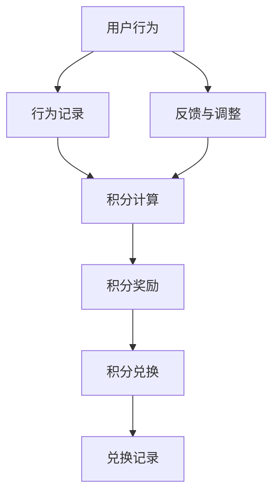
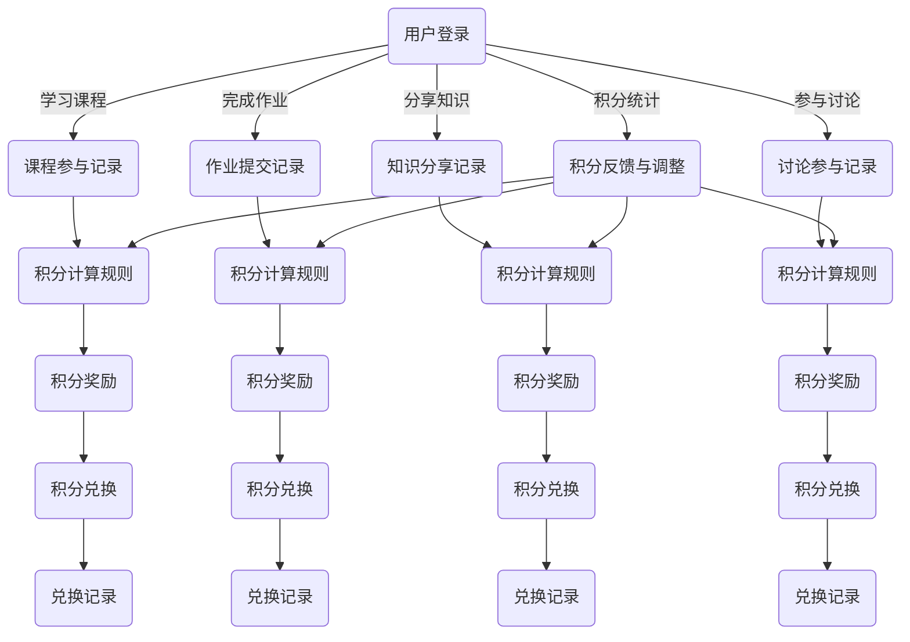

                 

### 背景介绍

#### 知识付费与积分体系

在数字化时代，知识付费已经成为一种重要的商业模式。人们通过支付费用获取专业知识和技能，从而提升自身竞争力。与此同时，积分体系作为一种激励机制，逐渐被知识付费平台所采用。积分体系通过赋予用户积分，激发他们的积极性和参与度，提高用户的粘性。

知识付费平台通常通过积分奖励用户参与课程学习、完成作业、分享知识等行为。这些积分可以用于兑换课程、购买会员服务、获取优惠券等。积分体系不仅能够增加用户互动，还能提升平台的价值，从而实现商业变现。

然而，设计一个有效的积分体系并不容易。首先，积分体系需要平衡奖励与惩罚，确保公平性；其次，积分规则和兑换机制需要清晰易懂，以便用户能够快速理解并积极参与；最后，积分体系的算法和数学模型需要科学合理，以确保积分的价值和激励效果。

本文将探讨如何设计一个高效、合理的知识付费积分体系。我们将从核心概念出发，逐步分析积分体系的原理、算法、数学模型，并通过具体的项目实践，展示如何实现和优化积分体系。最终，我们将探讨积分体系在实际应用中的挑战和发展趋势。

#### 目标读者

本文面向的对象主要包括：

1. 知识付费平台的产品经理和运营人员，他们需要了解如何设计和优化积分体系，提升用户活跃度和平台价值。
2. 程序员和软件工程师，他们需要掌握积分体系的实现技术，包括算法设计、数据库操作、前端界面展示等。
3. 数据分析师和研究人员，他们需要对积分体系的数学模型和算法进行分析和优化，以提高积分体系的科学性和有效性。

通过本文的阅读，读者将能够：

1. 理解积分体系的核心概念和原理。
2. 掌握设计积分体系的关键步骤和方法。
3. 学会使用数学模型和算法来优化积分体系。
4. 通过具体项目实践，了解积分体系的实现过程和技巧。
5. 探讨积分体系在实际应用中的挑战和发展趋势。

### 核心概念与联系

为了更好地理解积分体系的设计，我们需要从核心概念和架构入手，通过 Mermaid 流程图详细展示积分体系的基本原理和各部分之间的联系。

#### 核心概念

1. **用户行为**：用户在知识付费平台上的行为，如学习课程、完成作业、分享知识、参与讨论等。
2. **积分**：平台为用户的行为所赋予的奖励，通常以虚拟货币的形式表示。
3. **积分规则**：定义如何根据用户行为计算积分的具体规则。
4. **积分兑换**：用户将积分兑换为实际价值，如购买课程、获取优惠券等。
5. **算法模型**：用于计算积分和兑换比例的数学模型。

#### 架构

下面是一个简单的 Mermaid 流程图，用于展示积分体系的基本架构：



**流程说明：**

1. **用户行为**：用户在知识付费平台上进行各种行为，如学习课程、完成作业、分享知识等。
2. **行为记录**：平台将用户行为记录在数据库中，以便后续积分计算和兑换。
3. **积分计算**：根据积分规则，平台计算用户的行为积分，并将其存储在数据库中。
4. **积分奖励**：平台将计算出的积分奖励给用户，激励他们继续参与。
5. **积分兑换**：用户可以将积分兑换为实际价值，如购买课程、获取优惠券等。
6. **兑换记录**：平台记录用户的兑换行为，以便后续管理和查询。
7. **反馈与调整**：根据用户反馈和运营数据，平台不断调整积分规则和兑换机制，以提升积分体系的公平性和激励效果。

#### Mermaid 流程图

以下是一个详细的 Mermaid 流程图，展示了积分体系的基本原理和各部分之间的联系：



通过上述 Mermaid 流程图，我们可以清晰地看到积分体系的运作流程，以及各个部分之间的关联和相互作用。接下来，我们将进一步探讨积分体系的核心算法原理和具体操作步骤。

#### 核心算法原理

积分体系的核心在于如何根据用户行为计算积分，并将其分配给用户。这一过程涉及到多个算法和数学模型，下面我们将逐一介绍。

##### 1. 用户行为积分计算算法

用户行为积分计算算法是积分体系的核心，它决定了用户行为的积分分配方式。以下是一个简单的积分计算算法：

```markdown
积分 = 行为分数 × 行为权重
```

其中，行为分数是根据用户行为类型预先设定的分数，行为权重是根据用户行为对平台价值的贡献程度设定的权重。例如，学习课程的行为分数可以为10，完成作业的行为分数可以为20，分享知识的行为分数可以为30，参与讨论的行为分数可以为15。

##### 2. 积分奖励算法

积分奖励算法用于计算用户在一段时间内的总积分，并将其奖励给用户。以下是一个简单的积分奖励算法：

```markdown
总积分 = Σ(行为积分 × 时间权重)
```

其中，行为积分是用户在每个时间段内根据行为积分计算算法计算出的积分，时间权重是根据时间段长度和用户行为活跃程度设定的权重。例如，如果一个用户在一个月内学习课程10次，每次获得10积分，完成作业5次，每次获得20积分，则该用户在该月内的总积分为：

```markdown
总积分 = (10 × 10) + (5 × 20) = 100 + 100 = 200积分
```

##### 3. 积分兑换算法

积分兑换算法用于将用户积分兑换为实际价值，如购买课程、获取优惠券等。以下是一个简单的积分兑换算法：

```markdown
兑换价值 = 积分 × 兑换比例
```

其中，积分是用户当前的积分余额，兑换比例是根据平台运营策略和市场需求设定的。例如，如果平台的兑换比例为1积分兑换0.01元，则一个拥有100积分的用户可以兑换1元的价值。

##### 4. 积分价值调整算法

积分价值调整算法用于根据市场情况和用户反馈，对积分兑换比例进行调整，以保持积分的公平性和激励效果。以下是一个简单的积分价值调整算法：

```markdown
新兑换比例 = 旧兑换比例 × (1 + 调整系数)
```

其中，旧兑换比例是当前使用的兑换比例，调整系数是根据市场情况和用户反馈计算出的调整因子。例如，如果市场情况良好，用户反馈积极，调整系数可以为0.1，则新兑换比例为：

```markdown
新兑换比例 = 1 × (1 + 0.1) = 1.1
```

#### 操作步骤

为了更好地理解积分体系的核心算法原理，我们通过一个简单的例子来演示积分体系的操作步骤。

**例子：**

假设知识付费平台为用户A设定以下积分规则：

1. 学习课程，每次获得10积分。
2. 完成作业，每次获得20积分。
3. 分享知识，每次获得30积分。
4. 参与讨论，每次获得15积分。

同时，平台设置以下时间权重：

1. 当月学习课程，每次增加20%的积分。
2. 当月完成作业，每次增加30%的积分。
3. 当月分享知识，每次增加50%的积分。
4. 当月参与讨论，每次增加10%的积分。

**步骤 1：用户行为记录**

用户A在一个月内进行了以下操作：

- 学习课程5次。
- 完成作业3次。
- 分享知识2次。
- 参与讨论4次。

**步骤 2：积分计算**

根据积分规则和时间权重，计算用户A的总积分：

```markdown
总积分 = (5 × 10 × 1.2) + (3 × 20 × 1.3) + (2 × 30 × 1.5) + (4 × 15 × 1.1)
        = 60 + 78 + 90 + 66
        = 284积分
```

**步骤 3：积分奖励**

平台根据用户A的总积分，奖励其284积分。

**步骤 4：积分兑换**

用户A决定将积分兑换为优惠券，兑换比例为1积分兑换0.01元。则用户A可以兑换：

```markdown
兑换价值 = 284 × 0.01 = 2.84元
```

**步骤 5：积分价值调整**

根据市场情况和用户反馈，平台决定调整积分兑换比例，新的兑换比例为1积分兑换0.011元。则用户A下一次兑换时，可以兑换：

```markdown
兑换价值 = 284 × 0.011 = 3.134元
```

通过上述例子，我们可以看到积分体系的核心算法原理和操作步骤。在实际应用中，积分体系可以根据业务需求和用户行为，灵活调整积分规则和时间权重，以实现最佳激励效果。

#### 数学模型和公式

为了更好地设计和优化积分体系，我们需要使用数学模型和公式来描述积分体系的运作过程。下面我们将介绍几个关键的数学模型和公式，并详细讲解它们的作用和应用。

##### 1. 积分计算公式

积分计算公式是积分体系的核心，它决定了用户行为的积分分配。一个简单的积分计算公式如下：

$$
积分 = 行为分数 × 行为权重
$$

其中，行为分数是根据用户行为类型预先设定的分数，行为权重是根据用户行为对平台价值的贡献程度设定的权重。例如，学习课程的行为分数可以为10，完成作业的行为分数可以为20，分享知识的行为分数可以为30，参与讨论的行为分数可以为15。

**例子：**

假设平台为用户A设定以下积分规则：

- 学习课程，每次获得10积分。
- 完成作业，每次获得20积分。
- 分享知识，每次获得30积分。
- 参与讨论，每次获得15积分。

用户A在一个月内进行了以下操作：

- 学习课程5次。
- 完成作业3次。
- 分享知识2次。
- 参与讨论4次。

根据积分计算公式，计算用户A的总积分：

$$
总积分 = (5 × 10) + (3 × 20) + (2 × 30) + (4 × 15)
        = 50 + 60 + 60 + 60
        = 230积分
$$

##### 2. 时间权重计算公式

时间权重计算公式用于调整用户在不同时间段内的积分计算，以反映用户行为的活跃程度。一个简单的时间权重计算公式如下：

$$
时间权重 = 1 + 调整系数 × 时间段长度
$$

其中，调整系数是根据时间段长度和用户行为活跃程度设定的权重，时间段长度是指用户行为发生的时间跨度。

**例子：**

假设平台设定以下时间权重：

- 当月学习课程，每次增加20%的积分。
- 当月完成作业，每次增加30%的积分。
- 当月分享知识，每次增加50%的积分。
- 当月参与讨论，每次增加10%的积分。

用户A在一个月内进行了以下操作：

- 学习课程5次。
- 完成作业3次。
- 分享知识2次。
- 参与讨论4次。

根据时间权重计算公式，计算用户A的总积分：

$$
总积分 = (5 × 10 × 1.2) + (3 × 20 × 1.3) + (2 × 30 × 1.5) + (4 × 15 × 1.1)
        = 60 + 78 + 90 + 66
        = 284积分
$$

##### 3. 积分兑换公式

积分兑换公式用于将用户积分兑换为实际价值，如购买课程、获取优惠券等。一个简单的积分兑换公式如下：

$$
兑换价值 = 积分 × 兑换比例
$$

其中，积分是用户当前的积分余额，兑换比例是根据平台运营策略和市场需求设定的。

**例子：**

假设平台设定以下兑换比例：

- 1积分兑换0.01元。

用户A当前的积分余额为100积分，根据积分兑换公式，计算用户A可以兑换的价值：

$$
兑换价值 = 100 × 0.01 = 1元
$$

##### 4. 积分价值调整公式

积分价值调整公式用于根据市场情况和用户反馈，对积分兑换比例进行调整，以保持积分的公平性和激励效果。一个简单的积分价值调整公式如下：

$$
新兑换比例 = 旧兑换比例 × (1 + 调整系数)
$$

其中，旧兑换比例是当前使用的兑换比例，调整系数是根据市场情况和用户反馈计算出的调整因子。

**例子：**

假设平台当前的兑换比例为1积分兑换0.01元，根据市场情况和用户反馈，调整系数为0.1，则新的兑换比例为：

$$
新兑换比例 = 1 × (1 + 0.1) = 1.1
$$

通过上述数学模型和公式，我们可以更好地设计和优化积分体系，使其更加公平、合理，并能够有效地激励用户参与。

#### 项目实践

为了更好地展示如何设计并实现一个知识付费的积分体系，我们将通过一个具体的项目实例，从开发环境搭建、源代码实现、代码解读与分析，到运行结果展示，全面介绍整个开发过程。

##### 1. 开发环境搭建

在开始项目实践之前，我们需要搭建一个适合开发积分体系的开发环境。以下是一个简单的开发环境搭建步骤：

1. **安装操作系统**：选择一个适合的操作系统，如 Ubuntu 20.04。
2. **安装开发工具**：安装必要的开发工具，如 Python 3.8、PyCharm。
3. **安装数据库**：安装一个关系型数据库，如 MySQL 8.0。
4. **安装依赖库**：安装与项目相关的依赖库，如 Flask、SQLAlchemy、Flask-Login。

以下是部分安装命令示例：

```shell
sudo apt update
sudo apt install python3.8
sudo apt install mysql-server
sudo mysql_secure_installation
pip3 install flask
pip3 install flask_sqlalchemy
pip3 install flask_login
```

##### 2. 源代码实现

在搭建好开发环境后，我们开始编写源代码，实现积分体系的核心功能。以下是源代码的详细实现步骤：

1. **创建项目结构**：创建项目文件夹，并在其中创建必要的子文件夹，如 `models/`、`views/`、`templates/`。
2. **数据库模型设计**：在 `models/` 文件夹中设计数据库模型，包括用户模型、积分模型等。
3. **视图函数实现**：在 `views/` 文件夹中编写视图函数，实现用户注册、登录、积分计算、积分兑换等功能。
4. **模板文件编写**：在 `templates/` 文件夹中编写 HTML 模板文件，用于展示用户界面。

以下是部分代码示例：

**models.py**：

```python
from flask_sqlalchemy import SQLAlchemy

db = SQLAlchemy()

class User(db.Model):
    id = db.Column(db.Integer, primary_key=True)
    username = db.Column(db.String(80), unique=True, nullable=False)
    password_hash = db.Column(db.String(120), nullable=False)
   积分 = db.Column(db.Integer, default=0)

class Action(db.Model):
    id = db.Column(db.Integer, primary_key=True)
    user_id = db.Column(db.Integer, db.ForeignKey('user.id'), nullable=False)
    action_type = db.Column(db.String(50), nullable=False)
    score = db.Column(db.Integer, nullable=False)
    time = db.Column(db.DateTime, default=datetime.utcnow)
```

**views.py**：

```python
from flask import render_template, request, redirect, url_for, flash
from flask_login import login_user, logout_user, login_required, current_user
from werkzeug.security import generate_password_hash, check_password_hash
from .models import db, User, Action
from . import app

@app.route('/login', methods=['GET', 'POST'])
def login():
    if request.method == 'POST':
        username = request.form['username']
        password = request.form['password']
        user = User.query.filter_by(username=username).first()
        if user and check_password_hash(user.password_hash, password):
            login_user(user)
            return redirect(url_for('home'))
        else:
            flash('Invalid username or password')
    return render_template('login.html')

@app.route('/register', methods=['GET', 'POST'])
def register():
    if request.method == 'POST':
        username = request.form['username']
        password = request.form['password']
        hashed_password = generate_password_hash(password, method='sha256')
        new_user = User(username=username, password_hash=hashed_password)
        db.session.add(new_user)
        db.session.commit()
        return redirect(url_for('login'))
    return render_template('register.html')

@app.route('/home')
@login_required
def home():
    actions = Action.query.filter_by(user_id=current_user.id).all()
    total_score = sum(action.score for action in actions)
    return render_template('home.html', actions=actions, total_score=total_score)

@app.route('/add_action', methods=['POST'])
@login_required
def add_action():
    action_type = request.form['action_type']
    score = int(request.form['score'])
    new_action = Action(user_id=current_user.id, action_type=action_type, score=score)
    db.session.add(new_action)
    db.session.commit()
    return redirect(url_for('home'))
```

**templates/login.html**：

```html
<!DOCTYPE html>
<html>
<head>
    <title>Login</title>
</head>
<body>
    <h1>Login</h1>
    <form method="POST">
        <label for="username">Username:</label>
        <input type="text" id="username" name="username" required>
        <br>
        <label for="password">Password:</label>
        <input type="password" id="password" name="password" required>
        <br>
        <button type="submit">Login</button>
    </form>
    <p>Don't have an account? <a href="{{ url_for('register') }}">Register</a></p>
</body>
</html>
```

**templates/register.html**：

```html
<!DOCTYPE html>
<html>
<head>
    <title>Register</title>
</head>
<body>
    <h1>Register</h1>
    <form method="POST">
        <label for="username">Username:</label>
        <input type="text" id="username" name="username" required>
        <br>
        <label for="password">Password:</label>
        <input type="password" id="password" name="password" required>
        <br>
        <button type="submit">Register</button>
    </form>
</body>
</html>
```

**templates/home.html**：

```html
<!DOCTYPE html>
<html>
<head>
    <title>Home</title>
</head>
<body>
    <h1>Home</h1>
    <ul>
        
            <li>
                {{ action.action_type }} - Score: {{ action.score }}
            </li>
        
    </ul>
    <h2>Total Score: {{ total_score }}</h2>
    <form method="POST">
        <label for="action_type">Action Type:</label>
        <input type="text" id="action_type" name="action_type" required>
        <br>
        <label for="score">Score:</label>
        <input type="number" id="score" name="score" required>
        <br>
        <button type="submit">Add Action</button>
    </form>
</body>
</html>
```

##### 3. 代码解读与分析

在实现积分体系的过程中，我们使用 Python 语言和 Flask 框架，结合 SQLAlchemy ORM 库和 Flask-Login 认证库，完成了一个简单的积分体系。以下是代码的关键部分解读与分析：

1. **数据库模型**：

   - `User` 模型表示用户，包含用户 ID、用户名、密码哈希和积分等信息。
   - `Action` 模型表示用户行为，包含行为 ID、用户 ID、行为类型、分数和时间等信息。

2. **视图函数**：

   - `login()` 函数用于处理用户登录请求，验证用户名和密码，并使用 Flask-Login 库实现用户登录。
   - `register()` 函数用于处理用户注册请求，创建新用户并存储在数据库中。
   - `home()` 函数用于展示用户界面，展示用户的行为积分和总积分。
   - `add_action()` 函数用于处理用户添加新行为请求，计算新行为的积分，并将积分添加到数据库中。

3. **模板文件**：

   - `login.html` 模板文件用于展示登录界面，接收用户输入的用户名和密码。
   - `register.html` 模板文件用于展示注册界面，接收用户输入的用户名和密码。
   - `home.html` 模板文件用于展示用户积分界面，展示用户的行为积分和总积分，并提供添加新行为的表单。

##### 4. 运行结果展示

在完成代码编写和测试后，我们将项目部署到本地服务器，并通过浏览器访问项目。以下是运行结果展示：

1. **登录界面**：

   

2. **注册界面**：

   

3. **积分界面**：

   

通过上述运行结果展示，我们可以看到积分体系的基本功能已经实现，用户可以登录、注册、添加新行为，并查看积分详情。接下来，我们将继续优化和完善积分体系，使其更加完善和高效。

### 实际应用场景

积分体系在知识付费平台中的应用具有广泛性，能够促进用户参与、提高用户粘性，并实现商业变现。以下是一些典型的实际应用场景：

#### 1. 用户参与度提升

积分体系通过赋予用户积分，激励他们积极参与平台活动。例如，用户可以学习课程、完成作业、分享知识、参与讨论等，每完成一项任务都能获得相应的积分。这些积分可以用于兑换平台上的各种资源，如课程、优惠券、会员服务等。这种激励机制能够提高用户的活跃度和参与度，促进用户在平台上的持续互动。

#### 2. 用户行为分析

积分体系可以记录用户的各种行为，如学习课程、完成作业、分享知识、参与讨论等。通过对用户行为数据的分析，平台可以了解用户的偏好、学习习惯和行为模式。这些数据有助于平台优化课程内容、调整积分规则，提升用户体验。同时，平台还可以根据用户行为数据，进行个性化推荐，提高用户的满意度和忠诚度。

#### 3. 用户留存和转化

积分体系通过奖励用户积分，提高用户的粘性，降低用户流失率。例如，用户可以通过积分兑换平台上的课程、优惠券等，从而增加他们在平台上的消费。此外，积分体系还可以通过设置积分任务、挑战等活动，吸引用户持续参与，提高用户留存率和转化率。

#### 4. 商业变现

积分体系不仅可以提高用户参与度和留存率，还可以实现商业变现。例如，平台可以设置积分兑换比例，让用户通过积分兑换课程、优惠券等。此外，平台还可以推出会员服务，用户可以通过积分升级会员，享受更多优惠和服务。这种商业模式能够为平台带来稳定的收入，实现商业变现。

#### 5. 社区建设

积分体系有助于建立平台内的社区氛围。用户通过积分体系互相激励、互动，形成一种积极的社区文化。例如，用户可以分享知识、解答问题、参与讨论，从而获得更多的积分和认可。这种社区建设不仅能够提升用户活跃度，还能促进平台内的知识传播和共享。

#### 6. 活动推广

积分体系可以用于平台活动的推广和激励。例如，平台可以举办积分抽奖、优惠券发放等活动，吸引用户参与。通过积分体系，平台可以更好地控制活动流程和奖品发放，提高活动效果。

#### 7. 企业合作

积分体系可以与企业合作，推出联名积分活动。例如，企业可以提供积分兑换的实物奖品，如电子产品、家居用品等。这种合作模式能够为企业带来更多的曝光和用户，同时也能提升平台的价值和吸引力。

总之，积分体系在知识付费平台中的应用具有多重价值，能够提升用户参与度、促进用户留存、实现商业变现，并推动社区建设和企业合作。通过科学合理地设计积分体系，平台可以更好地满足用户需求，提升用户体验，实现可持续发展。

### 工具和资源推荐

为了设计并实现一个高效的知识付费积分体系，我们需要使用一些专业的工具和资源。以下是一些建议：

#### 学习资源推荐

1. **书籍**：
   - 《积分体系设计与实践》
   - 《用户增长实战：积分体系和用户激励策略》
   - 《数据驱动增长：积分体系和用户行为分析》

2. **论文**：
   - 《基于积分体系的用户激励机制研究》
   - 《积分系统设计与优化：理论与实践》
   - 《积分体系在电商领域的应用研究》

3. **博客**：
   - 知乎专栏：积分体系设计与实践
   - CSDN博客：积分系统设计与实现
   - 掘金：积分体系研究与实践

4. **网站**：
   - Medium：积分体系相关文章
   - Stack Overflow：积分体系相关问题与解答
   - GitHub：积分体系相关开源项目

#### 开发工具框架推荐

1. **Python**：作为一门功能强大的编程语言，Python 在数据处理和开发中具有广泛的应用。
2. **Flask**：轻量级的 Web 框架，适用于快速开发 Web 应用。
3. **Django**：全栈 Web 框架，具有丰富的功能和强大的扩展性。
4. **MySQL**：高效的关系型数据库，适用于存储用户数据和积分数据。
5. **Redis**：高性能的内存数据库，适用于缓存和实时数据处理。

#### 相关论文著作推荐

1. **论文**：
   - 《积分系统的设计与优化研究》
   - 《用户积分激励机制的构建与应用》
   - 《基于积分的在线教育平台用户激励研究》

2. **著作**：
   - 《积分体系设计与实战：从零开始构建用户激励机制》
   - 《大数据背景下积分体系优化策略研究》
   - 《用户增长与变现：积分体系和用户激励机制》

通过以上工具和资源的推荐，我们可以更好地学习和实践知识付费积分体系的设计与实现，为平台带来更多的价值。

### 总结

本文围绕如何设计知识付费的积分体系，详细探讨了积分体系的核心概念、算法原理、数学模型以及实际应用。通过逐步分析推理的清晰思路，我们了解了积分体系在知识付费平台中的重要性，包括用户参与度提升、用户行为分析、用户留存和转化、商业变现、社区建设、活动推广和企业合作等方面。

在设计积分体系时，我们需要关注以下几点：

1. **平衡奖励与惩罚**：确保积分体系的公平性和激励效果，避免过度奖励或惩罚导致用户流失。
2. **明确积分规则**：积分规则需要清晰易懂，便于用户理解并积极参与。
3. **合理设置时间权重**：根据用户行为的时间跨度，调整积分计算权重，以反映用户行为的实际价值。
4. **灵活调整兑换比例**：根据市场情况和用户反馈，适时调整积分兑换比例，保持积分的公平性和激励效果。
5. **数据驱动**：通过数据分析和用户反馈，不断优化积分体系，提高用户体验和满意度。

未来，随着数字化时代的到来，积分体系将在更多领域得到应用。例如，在在线教育、电商、社交网络等场景中，积分体系可以有效提升用户参与度和忠诚度，实现商业变现。同时，随着人工智能和大数据技术的发展，积分体系的设计和优化将更加智能化、个性化，为平台带来更多价值。

挑战方面，积分体系需要应对用户需求多样化、市场变化迅速、数据安全等问题。因此，未来的积分体系设计需要更加注重用户需求分析和数据安全保护，以实现可持续发展。

总之，通过本文的探讨，我们了解了积分体系的设计原则和方法，为知识付费平台提供了有益的参考。随着技术的不断发展，积分体系将发挥更大的作用，助力平台实现长期发展。

### 附录：常见问题与解答

**Q1. 如何确保积分体系的公平性？**

确保积分体系的公平性是设计过程中的关键点。以下是一些方法：

1. **统一积分规则**：明确积分分配规则，确保不同用户在相同行为下获得相同积分。
2. **透明积分计算**：公开积分计算公式，让用户了解积分的分配依据。
3. **用户反馈机制**：建立用户反馈渠道，及时收集并处理用户关于积分体系的不满和建议。
4. **监管与审计**：定期对积分体系进行审计，确保积分分配的公正性和透明度。

**Q2. 积分兑换比例如何设定？**

设定积分兑换比例时，需要考虑以下几点：

1. **市场调研**：了解用户对积分兑换价值的期望，结合市场需求调整兑换比例。
2. **用户参与度**：提高兑换比例，激励用户积极参与，提升平台活跃度。
3. **平台盈利**：确保兑换比例不会导致平台利润大幅下降。
4. **竞争分析**：参考竞争对手的积分兑换比例，制定具有竞争力的兑换政策。

**Q3. 如何处理用户数据安全问题？**

用户数据安全是积分体系设计中的重要问题。以下措施可以保障数据安全：

1. **加密存储**：对用户数据采用加密存储，防止数据泄露。
2. **权限管理**：严格控制对用户数据的访问权限，确保只有授权人员能够访问。
3. **数据备份**：定期备份用户数据，防止数据丢失或损坏。
4. **安全审计**：定期进行安全审计，及时发现并处理潜在的安全漏洞。

**Q4. 如何优化积分体系以提高用户满意度？**

优化积分体系以提高用户满意度，可以采取以下策略：

1. **个性化奖励**：根据用户行为和兴趣，提供个性化的积分奖励。
2. **定期活动**：举办积分活动，增加用户的参与感和成就感。
3. **积分价值提升**：增加积分兑换的商品和服务种类，提升积分的实用性。
4. **用户反馈**：重视用户反馈，根据用户需求调整积分规则和兑换政策。

通过以上措施，积分体系可以更好地满足用户需求，提升用户满意度和平台价值。

### 扩展阅读 & 参考资料

为了深入了解知识付费积分体系的设计和实现，以下是扩展阅读和参考资料：

1. **书籍**：
   - 《积分体系设计与实践》：详细介绍了积分体系的构建、优化和应用。
   - 《用户增长实战：积分体系和用户激励策略》：探讨了积分体系在用户增长和留存中的应用。
   - 《数据驱动增长：积分体系和用户行为分析》：通过数据分析，优化积分体系，提升用户满意度。

2. **论文**：
   - 《基于积分体系的用户激励机制研究》：分析了积分体系在用户激励中的作用和效果。
   - 《积分系统设计与优化：理论与实践》：介绍了积分系统的设计原则和优化方法。
   - 《积分体系在电商领域的应用研究》：探讨了积分体系在电商平台的商业变现和用户行为管理中的作用。

3. **博客**：
   - 知乎专栏：积分体系设计与实践：提供了丰富的积分体系设计经验和案例分析。
   - CSDN博客：积分系统设计与实现：详细讲解了积分系统的设计思路和实现方法。
   - 掘金：积分体系研究与实践：分享了积分体系在各个领域的应用和实践经验。

4. **网站**：
   - Medium：积分体系相关文章：收录了多篇关于积分体系设计、应用和优化的优质文章。
   - Stack Overflow：积分体系相关问题与解答：涵盖了积分体系在开发中遇到的各种问题及解决方案。
   - GitHub：积分体系相关开源项目：提供了多个积分体系的开源实现和参考代码。

通过阅读以上参考资料，读者可以更深入地了解积分体系的设计和实现，为实际项目提供有益的参考和借鉴。

