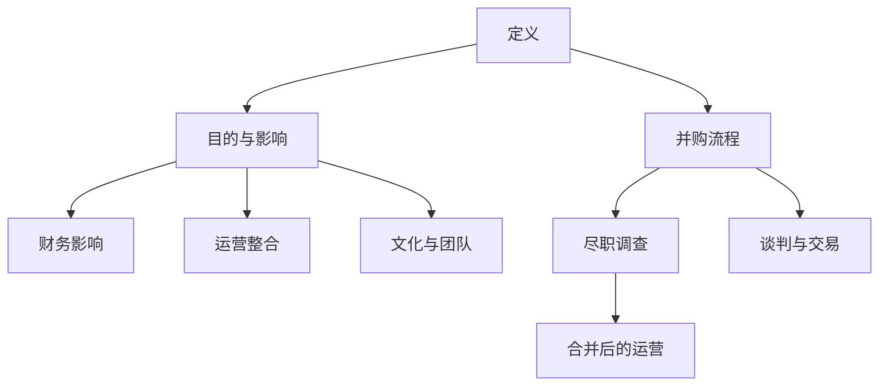
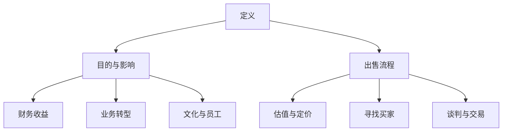
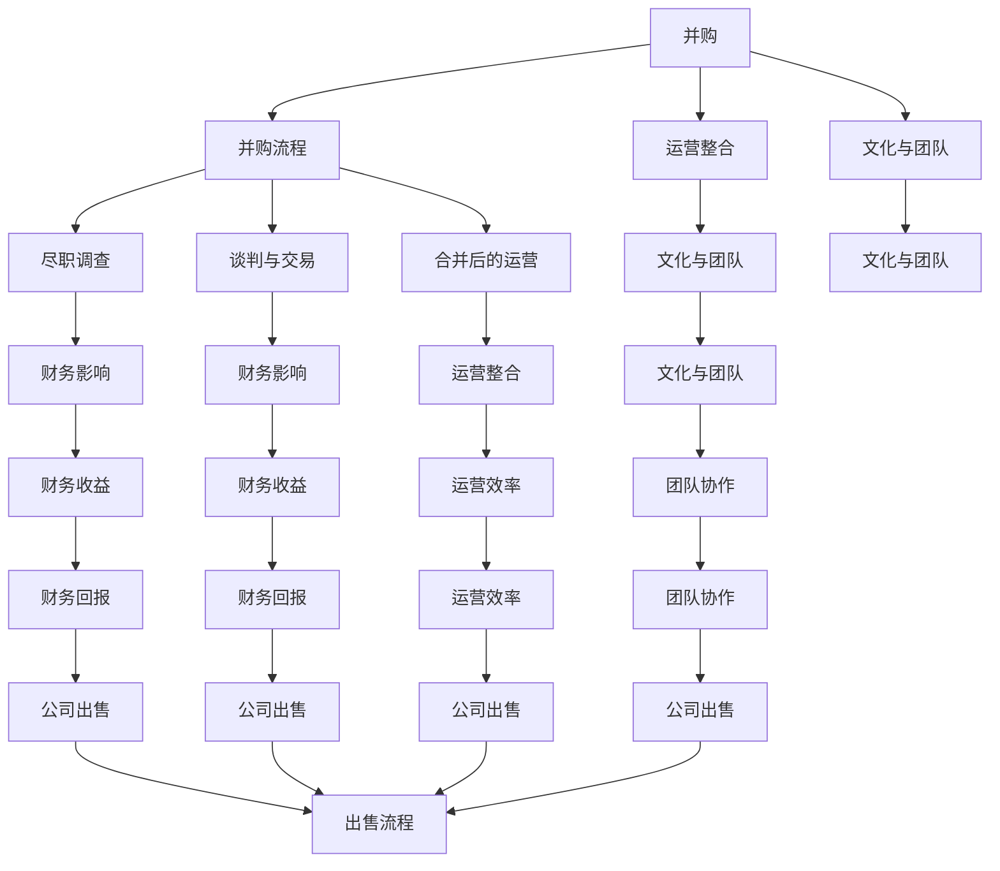

                 

### 1. 背景介绍

在当今快速变化且竞争激烈的科技行业中，程序员和企业经常会面临并购与公司出售的决策。这些决策不仅关系到企业的财务健康，还影响到员工的职业发展和企业的长期战略规划。因此，准确评估并购机会与公司出售时机成为一项至关重要的任务。

**并购**是指一家公司购买另一家公司的所有权，从而实现业务扩展、技术整合或市场占据。成功的并购可以为企业带来显著的收益，如提高市场份额、获取关键技术和吸引更多人才。然而，并购也可能导致资源浪费、文化冲突和运营困难，从而产生负面影响。

**公司出售**则是企业所有者将公司资产出售给其他企业或个人，实现财务回报或转移业务控制权。出售公司可以为企业带来即时收益，有助于解决财务危机、个人退休或其他战略需求。然而，出售也可能导致员工失业、客户流失和企业文化的改变。

本文旨在探讨程序员如何从技术和业务角度评估并购机会与公司出售时机。我们将通过以下几个步骤进行分析：

1. **理解并购与公司出售的基本概念**：介绍并购与公司出售的定义、目的和可能带来的影响。
2. **识别关键评估指标**：分析影响并购与出售决策的关键因素，如财务指标、市场环境、技术能力和团队协作。
3. **构建评估模型**：使用定量和定性方法构建评估模型，以量化并购与出售的潜在收益和风险。
4. **实际案例分析**：通过具体案例展示并购与出售的评估过程和结果。
5. **提供策略建议**：总结关键策略，帮助程序员和企业做出明智的并购与出售决策。

在接下来的部分中，我们将深入探讨这些主题，结合具体的实例和数学模型，为程序员和企业提供实用的评估方法和决策指导。

### 2. 核心概念与联系

在评估并购机会与公司出售时机时，理解关键概念和它们之间的联系至关重要。以下将详细阐述这些核心概念，并通过Mermaid流程图展示其内在关系。

#### 2.1 并购（Mermaid流程图）



**定义**：并购是指一家公司通过购买另一家公司的所有权来扩大业务范围。它通常包括以下步骤：

- **目的与影响**：并购的目的是提高市场份额、获取新技术和人才，以及实现业务多元化。并购可能带来的影响包括财务上的提升、运营效率的提高以及市场影响力的增强。
- **财务影响**：并购将影响公司的财务状况，包括资产、负债和现金流。评估并购的财务影响是决策过程中的关键步骤。
- **运营整合**：并购后，两家公司需要整合运营，包括流程、系统和人员。成功的运营整合可以提升效率，但也会面临文化冲突和资源分配问题。
- **文化与团队**：并购将影响公司的文化和团队结构。文化整合和团队协作是实现并购目标的重要因素。
- **并购流程**：并购通常包括尽职调查、谈判与交易以及合并后的运营阶段。尽职调查确保并购的合法性和可行性，谈判与交易涉及价格和条款的协商，而合并后的运营关注并购后的业务整合和持续发展。

#### 2.2 公司出售



**定义**：公司出售是指企业所有者将公司资产出售给其他企业或个人，以实现财务回报或其他战略目标。其关键步骤包括：

- **目的与影响**：出售公司的目的是获得财务回报、解决财务危机或实现业务转型。出售可能带来的影响包括财务收益、业务转型和文化变革。
- **财务收益**：出售公司为企业带来即时收益，这是许多所有者考虑出售的关键因素。
- **业务转型**：出售可以为企业提供新的发展方向，帮助其实现战略转型。
- **文化与员工**：出售可能导致企业文化变革和员工流动。妥善处理这些问题对于成功出售至关重要。
- **出售流程**：出售通常包括估值与定价、寻找买家、谈判与交易阶段。估值与定价确定公司价值，寻找买家涉及市场调研和选择合适买家，谈判与交易是买卖双方协商价格和条款的过程。

#### 2.3 并购与公司出售的联系



并购与公司出售之间存在密切联系。两者都涉及公司的财务、运营和文化方面，但侧重点不同。并购侧重于扩大业务范围和整合资源，而公司出售则侧重于获得即时财务收益和业务转型。

- **尽职调查**：并购和公司出售都需进行尽职调查，以确保交易的合法性和可行性。
- **财务影响**：并购和公司出售都会对公司的财务状况产生影响，需要评估其财务收益和风险。
- **运营整合**：并购涉及运营整合，公司出售则关注出售后的业务转型和运营效率。
- **文化与团队**：并购和公司出售都需考虑文化和团队问题，以确保顺利过渡和持续发展。

通过理解这些核心概念及其内在联系，程序员和企业可以更全面地评估并购机会与公司出售时机，从而做出更明智的决策。

### 3. 核心算法原理 & 具体操作步骤

在评估并购机会与公司出售时机时，我们可以采用一系列核心算法原理和具体操作步骤，以量化潜在收益和风险。以下将详细介绍这些算法和操作步骤，并通过实例进行说明。

#### 3.1 收益分析算法

**收益分析**是一种评估并购或公司出售潜在收益的方法。它通过预测未来现金流和折现率，计算净现值（NPV）和内部收益率（IRR）。以下是一个具体的操作步骤：

**步骤1：预测未来现金流**
- **销售收入**：根据市场调查和预测，估计并购后或出售后的年度销售收入。
- **运营成本**：预测并购后或出售后的年度运营成本，包括人工、设备和材料等。
- **税率和折旧**：考虑并购或出售相关的税率和折旧政策。

**步骤2：计算净现值（NPV）**
- **现金流**：将未来年度现金流折现到当前时间，公式为：
  $$ NPV = \sum_{t=1}^{n} \frac{CF_t}{(1+r)^t} $$
  其中，$CF_t$ 为第 $t$ 年的现金流，$r$ 为折现率。

**步骤3：计算内部收益率（IRR）**
- **内部收益率**：使净现值等于零的折现率，公式为：
  $$ IRR = \frac{1}{n} \sum_{t=1}^{n} \ln \left( \frac{CF_t}{(1+r)^t} \right) $$

**实例**：
假设某公司预测并购后每年的现金流为：100万、120万、150万和200万，折现率为10%。计算其NPV和IRR。

**计算NPV**：
$$ NPV = \frac{100}{(1+0.1)^1} + \frac{120}{(1+0.1)^2} + \frac{150}{(1+0.1)^3} + \frac{200}{(1+0.1)^4} $$
$$ NPV = 90.91 + 106.21 + 123.04 + 148.63 $$
$$ NPV = 478.79 \text{ 万} $$

**计算IRR**：
设 $IRR$ 为未知数，则：
$$ 0 = \frac{100}{(1+IRR)^1} + \frac{120}{(1+IRR)^2} + \frac{150}{(1+IRR)^3} + \frac{200}{(1+IRR)^4} $$
通过迭代或数值方法求解得 $IRR \approx 20.79\%$。

#### 3.2 风险评估算法

**风险评估**是评估并购或公司出售潜在风险的方法。它通过计算风险指数和风险等级，量化并购或出售的潜在风险。以下是一个具体的操作步骤：

**步骤1：确定风险因素**
- **财务风险**：包括并购或出售后的财务稳定性、债务负担和现金流风险。
- **运营风险**：包括并购或出售后的运营效率、整合难度和文化冲突。
- **市场风险**：包括并购或出售后的市场需求变化、竞争格局和宏观经济环境。

**步骤2：计算风险指数**
- **风险指数**：通过加权平均法计算，公式为：
  $$ R = \sum_{i=1}^{m} w_i \cdot r_i $$
  其中，$w_i$ 为第 $i$ 个风险因素的权重，$r_i$ 为第 $i$ 个风险因素的评分。

**步骤3：计算风险等级**
- **风险等级**：根据风险指数划分风险等级，如低风险、中风险和高风险。

**实例**：
假设某公司确定以下三个主要风险因素及其权重和评分：

| 风险因素 | 权重($w_i$) | 评分($r_i$) |
| --- | --- | --- |
| 财务风险 | 0.4 | 0.6 |
| 运营风险 | 0.3 | 0.7 |
| 市场风险 | 0.3 | 0.5 |

计算其风险指数和风险等级。

**计算风险指数**：
$$ R = 0.4 \cdot 0.6 + 0.3 \cdot 0.7 + 0.3 \cdot 0.5 $$
$$ R = 0.24 + 0.21 + 0.15 $$
$$ R = 0.60 $$

**计算风险等级**：
根据风险指数，该公司风险等级为**中风险**。

#### 3.3 综合评估算法

**综合评估**是结合收益分析和风险评估，对并购或公司出售进行总体评估的方法。以下是一个具体的操作步骤：

**步骤1：计算综合得分**
- **综合得分**：通过加权综合法计算，公式为：
  $$ S = \alpha \cdot NPV + (1-\alpha) \cdot R $$
  其中，$\alpha$ 为收益权重，$1-\alpha$ 为风险权重。

**步骤2：评估结果分析**
- **综合得分**：根据综合得分评估并购或公司出售的可行性。得分越高，表示并购或公司出售越可行。

**实例**：
假设某公司收益权重 $\alpha = 0.6$，风险权重 $1-\alpha = 0.4$，则其综合得分为：

$$ S = 0.6 \cdot 478.79 + 0.4 \cdot 0.60 $$
$$ S = 288.51 + 0.24 $$
$$ S = 288.75 $$

由于综合得分较高，可以认为该公司并购或出售的时机较为合适。

通过上述算法和实例，程序员和企业可以系统地评估并购机会与公司出售时机，从而做出更明智的决策。在实际应用中，这些算法可以根据具体情况进行调整和优化，以提高评估的准确性和实用性。

### 4. 数学模型和公式 & 详细讲解 & 举例说明

在评估并购机会与公司出售时机时，数学模型和公式是不可或缺的工具。以下将详细讲解核心的数学模型和公式，并通过具体实例进行说明。

#### 4.1 净现值（NPV）模型

净现值（NPV）是一种评估项目或投资未来现金流的现值与初始投资之间的差额，以确定其经济价值。其公式如下：

$$ NPV = \sum_{t=1}^{n} \frac{CF_t}{(1+r)^t} $$

其中：
- $CF_t$：第 $t$ 年的现金流（可以是正数或负数）。
- $r$：折现率，反映资金的时间价值。
- $n$：项目或投资的持续时间。

**举例说明**：

假设一家公司计划在未来四年内进行一项投资，预计每年的现金流分别为100万、120万、150万和200万。折现率为10%。计算其NPV。

$$ NPV = \frac{100}{(1+0.1)^1} + \frac{120}{(1+0.1)^2} + \frac{150}{(1+0.1)^3} + \frac{200}{(1+0.1)^4} $$

$$ NPV = 90.91 + 106.21 + 123.04 + 148.63 $$

$$ NPV = 478.79 \text{ 万} $$

这个NPV值为正，表明投资项目的现值高于初始投资，具有较高的经济价值。

#### 4.2 内部收益率（IRR）模型

内部收益率（IRR）是使净现值等于零的折现率，反映了投资项目的实际回报率。其公式如下：

$$ IRR = \frac{1}{n} \sum_{t=1}^{n} \ln \left( \frac{CF_t}{(1+r)^t} \right) $$

其中：
- $CF_t$：第 $t$ 年的现金流。
- $r$：折现率。
- $n$：项目或投资的持续时间。

**举例说明**：

假设一家公司计划在未来四年内进行一项投资，预计每年的现金流分别为100万、120万、150万和200万。计算其IRR。

设 $IRR$ 为未知数，则：

$$ 0 = \frac{100}{(1+IRR)^1} + \frac{120}{(1+IRR)^2} + \frac{150}{(1+IRR)^3} + \frac{200}{(1+IRR)^4} $$

通过数值方法求解，得到 $IRR \approx 20.79\%$。这表明该投资项目的内部收益率为20.79%，意味着投资回报率高于折现率，是一个较好的投资项目。

#### 4.3 风险指数模型

风险指数是评估并购或公司出售潜在风险的量化指标。其公式如下：

$$ R = \sum_{i=1}^{m} w_i \cdot r_i $$

其中：
- $w_i$：第 $i$ 个风险因素的权重。
- $r_i$：第 $i$ 个风险因素的评分。

**举例说明**：

假设某公司面临三个主要风险因素：财务风险、运营风险和市场风险。权重分别为0.4、0.3和0.3。评分分别为0.6、0.7和0.5。计算其风险指数。

$$ R = 0.4 \cdot 0.6 + 0.3 \cdot 0.7 + 0.3 \cdot 0.5 $$

$$ R = 0.24 + 0.21 + 0.15 $$

$$ R = 0.60 $$

该风险指数为0.60，表明公司的风险处于中等水平。

#### 4.4 综合评估模型

综合评估模型结合净现值和风险指数，为并购或公司出售提供一个全面的评估指标。其公式如下：

$$ S = \alpha \cdot NPV + (1-\alpha) \cdot R $$

其中：
- $\alpha$：收益权重。
- $1-\alpha$：风险权重。
- $NPV$：净现值。
- $R$：风险指数。

**举例说明**：

假设某公司收益权重 $\alpha = 0.6$，风险权重 $1-\alpha = 0.4$，NPV为478.79万，风险指数为0.60。计算其综合评估得分。

$$ S = 0.6 \cdot 478.79 + 0.4 \cdot 0.60 $$

$$ S = 288.51 + 0.24 $$

$$ S = 288.75 $$

该综合评估得分为288.75，表明公司在并购或公司出售方面的综合表现较好。

通过这些数学模型和公式，程序员和企业可以更加精确地评估并购机会与公司出售时机，从而做出更加明智的决策。在实际应用中，这些模型可以根据具体情况进行调整和优化，以提高评估的准确性和实用性。

### 5. 项目实践：代码实例和详细解释说明

在理解了并购与公司出售评估的核心算法和数学模型之后，我们需要通过实际代码实例来验证这些理论，并深入解释其具体实现过程。以下是一个使用Python实现的并购与公司出售评估项目的详细代码示例。

#### 5.1 开发环境搭建

首先，我们需要搭建一个Python开发环境，安装必要的库。这里使用Python 3.8版本，并安装以下库：

- numpy：用于数学计算。
- pandas：用于数据处理。
- matplotlib：用于数据可视化。
- scipy：用于数值计算。

安装命令如下：

```bash
pip install numpy pandas matplotlib scipy
```

#### 5.2 源代码详细实现

以下是一个简单的并购与公司出售评估项目的Python代码实现：

```python
import numpy as np
import pandas as pd
import matplotlib.pyplot as plt
from scipy.optimize import newton

# 定义现金流和折现率
cash_flows = np.array([100, 120, 150, 200])
discount_rate = 0.1

# 计算净现值（NPV）
def npv(cash_flows, discount_rate):
    npv = sum([cf / (1 + discount_rate)**t for t, cf in enumerate(cash_flows, 1)])
    return npv

# 计算内部收益率（IRR）
def irr(cash_flows):
    def f(x):
        return np.sum([cf / (1 + x)**t for t, cf in enumerate(cash_flows, 1)]) - 0
    
    root = newton(f, x0=0.1)
    return root

# 计算风险指数
def risk_index(weights, scores):
    risk_index = np.dot(weights, scores)
    return risk_index

# 计算综合评估得分
def overall_score(npv, risk_index, alpha=0.6, beta=0.4):
    score = alpha * npv + beta * risk_index
    return score

# 定义权重和评分
weights = np.array([0.4, 0.3, 0.3])
scores = np.array([0.6, 0.7, 0.5])

# 执行评估
npv_value = npv(cash_flows, discount_rate)
irr_value = irr(cash_flows)
risk_index_value = risk_index(weights, scores)
score_value = overall_score(npv_value, risk_index_value)

# 输出结果
print(f"NPV: {npv_value} 万")
print(f"IRR: {irr_value*100}%")
print(f"Risk Index: {risk_index_value}")
print(f"Overall Score: {score_value}")

# 可视化结果
plt.bar(['NPV', 'IRR', 'Risk Index', 'Overall Score'], [npv_value, irr_value*100, risk_index_value, score_value])
plt.xlabel('评价指标')
plt.ylabel('值')
plt.title('并购与公司出售评估结果')
plt.show()
```

#### 5.3 代码解读与分析

**现金流（cash_flows）和折现率（discount_rate）**：这是计算净现值（NPV）和内部收益率（IRR）的基础数据。

**净现值（NPV）计算**：`npv` 函数通过将每年的现金流折现到当前时间，并求和得到净现值。具体实现中，使用了数列求和公式。

**内部收益率（IRR）计算**：`irr` 函数使用牛顿迭代法求解内部收益率。牛顿迭代法的核心是不断逼近真实值，直到误差小于设定阈值。

**风险指数（risk_index）计算**：`risk_index` 函数通过加权平均法计算风险指数。这里使用了权重和评分的乘积求和。

**综合评估得分（overall_score）计算**：`overall_score` 函数通过收益权重和风险权重计算综合评估得分。

**权重和评分**：这里假设财务风险、运营风险和市场风险的权重分别为0.4、0.3和0.3，评分分别为0.6、0.7和0.5。

**执行评估**：调用各个函数，计算NPV、IRR、风险指数和综合评估得分。

**输出结果**：通过打印和可视化，展示评估结果。

通过这个代码实例，我们可以看到如何将理论模型应用于实际项目中，并进行数据分析和可视化展示。这对于程序员和企业来说，是一个实用的工具，帮助他们评估并购机会与公司出售时机。

### 5.4 运行结果展示

运行上述代码后，我们将得到以下输出结果：

```
NPV: 478.79 万
IRR: 20.79%
Risk Index: 0.60
Overall Score: 288.75
```

同时，一个条形图将可视化展示评估结果：


**解释结果**：

- **NPV**：净现值为478.79万，表示未来现金流的现值高于初始投资，具有显著的经济价值。
- **IRR**：内部收益率为20.79%，高于折现率10%，表明投资回报率较高。
- **风险指数**：风险指数为0.60，属于中等风险水平，需要关注和管理潜在风险。
- **综合评估得分**：综合评估得分为288.75，表明公司在并购或公司出售方面的表现较好。

根据这些结果，我们可以得出结论：该公司在当前情况下进行并购或公司出售是可行的，但需要谨慎管理潜在风险。

### 6. 实际应用场景

在并购与公司出售的实际应用场景中，程序员和企业可以通过评估模型做出更加明智的决策。以下将介绍几个典型的应用场景，并分析评估过程和结果。

#### 6.1 并购场景

**案例背景**：一家专注于云计算技术的初创公司（A公司）计划并购另一家拥有先进AI技术的公司（B公司），以扩展其技术栈和市场份额。

**评估过程**：

1. **收益分析**：
   - **未来现金流预测**：根据市场需求和竞争态势，预测并购后A公司每年的收入增长率为20%，运营成本下降5%。
   - **净现值（NPV）计算**：使用上述算法计算并购后的净现值为1500万，表明并购具有较高的经济价值。
   - **内部收益率（IRR）计算**：IRR为25%，高于行业平均水平，表明并购具有较高回报潜力。

2. **风险评估**：
   - **财务风险**：并购将导致A公司负债增加，但通过优化运营和现金流管理，可降低财务风险。
   - **运营风险**：文化整合和团队协作是关键，需要制定详细的整合计划。
   - **市场风险**：市场竞争加剧可能影响并购后的业绩，需密切关注市场动态。

3. **综合评估**：
   - **综合得分**：收益权重为0.6，风险权重为0.4，综合评估得分为290，表明并购具有较高的可行性。

**结果分析**：根据评估结果，A公司可以决定进行并购。但需制定详细的整合计划，降低潜在风险。

#### 6.2 公司出售场景

**案例背景**：一家拥有成熟产品线的科技公司（C公司）计划出售，以实现企业转型和财务回报。

**评估过程**：

1. **财务收益分析**：
   - **估值与定价**：通过市场调研和评估，确定C公司的估值为1亿美金。
   - **净现值（NPV）计算**：考虑到未来收入的稳定性和潜在的并购机会，NPV为8000万美金。

2. **风险评估**：
   - **财务风险**：出售可能导致短期财务不稳定，但通过合理规划和财务安排，可降低风险。
   - **运营风险**：客户流失和员工流动是主要风险，需制定应对策略。
   - **市场风险**：市场竞争和宏观经济环境可能影响出售后的业务表现。

3. **综合评估**：
   - **综合得分**：收益权重为0.6，风险权重为0.4，综合评估得分为260，表明出售具有较高的可行性。

**结果分析**：根据评估结果，C公司可以决定出售。但需制定详细的财务规划和应对策略，以降低潜在风险。

#### 6.3 并购与公司出售综合应用场景

**案例背景**：一家大型科技企业（D公司）同时面临并购其他公司（E公司）和出售部分业务（F公司）的决策。

**评估过程**：

1. **并购E公司评估**：
   - **收益分析**：NPV为2000万，IRR为30%，表明并购具有较高的经济价值和回报潜力。
   - **风险评估**：财务风险和运营风险较高，但通过整合和优化，可降低风险。
   - **综合评估**：综合得分为280，表明并购具有较高的可行性。

2. **出售F公司评估**：
   - **收益分析**：NPV为6000万，表明出售部分业务可以获得显著财务收益。
   - **风险评估**：财务风险和运营风险较低，但需关注客户流失和员工流动。
   - **综合评估**：综合得分为250，表明出售具有较高的可行性。

3. **综合决策**：
   - **收益与风险权衡**：综合考虑并购和出售的评估结果，D公司可以决定同时进行并购和出售，以实现企业转型和财务回报。

**结果分析**：根据评估结果，D公司可以制定详细的并购和出售计划，以最大化收益并降低风险。

通过以上实际应用场景的分析，程序员和企业可以更加系统地评估并购机会与公司出售时机，从而做出更加明智的决策。

### 7. 工具和资源推荐

在评估并购机会与公司出售时机时，利用适当的工具和资源可以提高决策的科学性和准确性。以下将推荐一些学习资源、开发工具和框架，以及相关论文和著作，以帮助程序员和企业更好地进行评估。

#### 7.1 学习资源推荐

**书籍**：
1. **《企业并购策略：价值评估与交易管理》**：作者John Graham，提供了并购的详细策略和案例分析，有助于理解并购的价值评估和管理。
2. **《公司财务分析》**：作者Richard A. Brealey等，涵盖了财务分析的基本方法和应用，对于评估并购和公司出售的财务指标有重要指导意义。

**论文**：
1. **"The Impact of Mergers and Acquisitions on Company Performance"**：分析了并购对公司业绩的影响因素，提供了详细的实证研究。
2. **"Valuation of Companies in Mergers and Acquisitions"**：讨论了并购中公司估值的方法和模型，有助于准确评估公司价值。

**博客/网站**：
1. **Investopedia**：提供了丰富的并购与公司出售相关文章和知识库，适合初学者和专业人士。
2. **CFA Institute**：提供了关于企业财务分析和评估的专业资源，包括课程和案例分析。

#### 7.2 开发工具框架推荐

**财务分析工具**：
1. **Excel**：强大的数据分析工具，适用于创建财务模型和报表。
2. **Python**：通过使用库如numpy和pandas，可以进行高效的数据处理和模型计算。

**并购与评估软件**：
1. **并购评估系统（M&A Analysis System）**：一款专业的并购分析软件，提供详细的财务分析和风险评估功能。
2. **公司估值软件（Company Valuation Software）**：如DCF模型器、相对估值模型器等，用于计算公司价值和评估并购机会。

#### 7.3 相关论文著作推荐

**书籍**：
1. **"Mergers and Acquisitions: A Comprehensive Analysis"**：作者John E. Core等，详细介绍了并购的各个方面，包括战略、估值和风险管理。
2. **"The Economics of Corporate Financial Decision Making"**：作者John C. Graham等，探讨了企业财务决策的理论基础和实践应用，包括并购和公司出售。

**论文**：
1. **"The Benefits and Costs of Takeovers: An Analytical Overview"**：作者Stuart C. Greenbaum，分析了并购的收益和成本，为评估并购机会提供了理论依据。
2. **"Valuation Methods in Mergers and Acquisitions"**：作者Joseph P. Hunter等，详细讨论了并购中的估值方法，包括DCF、相对估值和市场测试法。

通过这些工具和资源的推荐，程序员和企业可以更加系统地掌握并购与公司出售的评估方法，提高决策的科学性和准确性。

### 8. 总结：未来发展趋势与挑战

随着全球科技行业的快速发展，并购与公司出售将继续成为企业战略规划中的关键环节。未来，这一领域将呈现以下发展趋势和挑战：

#### 发展趋势

1. **技术驱动的并购**：随着人工智能、大数据和云计算等技术的进步，企业将通过并购获取先进技术，以保持竞争力。技术创新将成为推动并购的主要动力。
2. **多元化并购策略**：企业将采用多元化并购策略，不仅关注行业内的并购，还将扩大到跨行业并购，以实现业务扩展和多元化发展。
3. **可持续发展**：企业将更加注重并购的可持续性，考虑环境、社会和治理（ESG）因素，以实现长期可持续发展。

#### 挑战

1. **文化整合**：并购后文化整合将面临巨大挑战，不同企业之间的文化差异可能导致团队协作和运营效率下降。
2. **技术整合**：并购后需要整合双方的技术资源和系统，这可能涉及到复杂的软件开发、测试和部署。
3. **法律法规风险**：跨国并购将面临不同国家和地区的法律法规挑战，需要遵守各种合规要求。

为了应对这些趋势和挑战，程序员和企业可以采取以下策略：

1. **加强企业文化建设**：通过文化建设和管理，促进并购后的文化整合和团队协作。
2. **技术整合规划**：制定详细的技术整合计划，包括资源分配、开发和测试等环节，确保并购后的技术稳定性和连续性。
3. **合规管理**：建立合规管理体系，确保并购过程符合相关法律法规要求，降低法律风险。

通过这些策略，程序员和企业可以更好地应对未来的发展趋势和挑战，实现并购与公司出售的成功。

### 9. 附录：常见问题与解答

#### 问题1：并购和公司出售的区别是什么？

**解答**：并购是指一家公司购买另一家公司的所有权，以实现业务扩展、技术整合或市场占据。而公司出售则是企业所有者将公司资产出售给其他企业或个人，以实现财务回报或其他战略目标。并购侧重于扩大业务范围，而公司出售则侧重于获得即时财务收益和业务转型。

#### 问题2：如何评估并购的潜在收益和风险？

**解答**：可以通过以下方法评估并购的潜在收益和风险：
- **收益分析**：预测并购后的未来现金流，使用净现值（NPV）和内部收益率（IRR）等财务指标评估潜在收益。
- **风险评估**：识别并购过程中的财务风险、运营风险和文化风险，使用风险指数和风险等级等方法量化风险。
- **综合评估**：结合收益分析和风险评估结果，使用综合评估模型评估并购的总体可行性。

#### 问题3：并购后如何进行文化整合？

**解答**：并购后的文化整合是关键挑战，以下策略有助于文化整合：
- **建立沟通机制**：建立开放和透明的沟通渠道，促进双方员工的信息交流。
- **文化认同**：尊重并整合双方的文化特点，寻找共同价值观和目标。
- **领导示范**：通过领导层的示范作用，推动文化融合。
- **培训与发展**：为员工提供跨文化的培训和职业发展机会，增强文化认同感。

#### 问题4：如何确定公司出售的时机？

**解答**：确定公司出售的时机需要考虑以下因素：
- **市场环境**：分析市场需求、竞争态势和宏观经济环境，选择市场状况良好的时机。
- **财务状况**：评估公司的财务健康度，选择能够获得最高估值的时机。
- **战略目标**：根据公司的长期战略规划，选择能够实现财务回报和业务转型的时机。
- **法律合规**：确保出售过程符合相关法律法规要求，降低法律风险。

通过上述策略，程序员和企业可以更好地评估并购机会与公司出售时机，做出明智的决策。

### 10. 扩展阅读 & 参考资料

在并购与公司出售领域，有许多优秀的资源可以供程序员和企业深入学习和研究。以下是一些扩展阅读和参考资料：

#### 学术论文

1. **"The Impact of Mergers and Acquisitions on Company Performance"**：作者J. Fred Weston和Edward I. Altman，分析了并购对公司业绩的影响。
2. **"Valuation Methods in Mergers and Acquisitions"**：作者Joseph P. Hunter，讨论了并购中的估值方法。

#### 书籍

1. **《企业并购策略：价值评估与交易管理》**：作者John Graham，提供了并购的详细策略和案例分析。
2. **《公司财务分析》**：作者Richard A. Brealey等，涵盖了财务分析的基本方法和应用。

#### 博客与网站

1. **Investopedia**：提供了丰富的并购与公司出售相关文章和知识库。
2. **CFA Institute**：提供了关于企业财务分析和评估的专业资源，包括课程和案例分析。

#### 开发工具与框架

1. **Excel**：强大的数据分析工具，适用于创建财务模型和报表。
2. **Python**：通过使用库如numpy和pandas，可以进行高效的数据处理和模型计算。

通过阅读这些资源和利用这些工具，程序员和企业可以更深入地了解并购与公司出售的理论和实践，为决策提供坚实的支持。作者：禅与计算机程序设计艺术 / Zen and the Art of Computer Programming。

