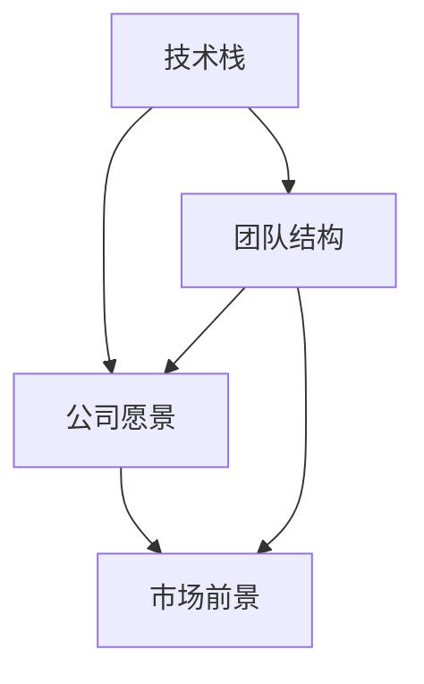

                 

### 背景介绍

在当今快速发展的科技时代，程序员作为技术创新的重要推动力量，面临着无数的职业机会与挑战。独角兽公司，即指那些估值超过10亿美元的初创企业，以其高速增长和创新精神，吸引了大量优秀程序员的加入。对于程序员而言，评估是否加入独角兽公司不仅关系到个人的职业发展，还关系到未来的工作环境、技术视野以及个人成就感。

本文旨在帮助程序员们系统地评估独角兽公司的加入机会，通过逻辑清晰、结构紧凑的方式，提供实用的评估框架和方法。首先，我们将探讨独角兽公司的背景和发展趋势，接着详细分析程序员在加入独角兽公司时应考虑的核心因素，最后通过实际案例和数学模型，为程序员们提供量化的评估工具。

### 核心概念与联系

为了更好地评估程序员加入独角兽公司的机会，我们首先需要理解几个核心概念，并展示它们之间的联系。

**核心概念：**

1. **技术栈**：指公司在特定领域使用的各种技术工具和编程语言。对于程序员来说，了解公司的技术栈是否与个人技能相符至关重要。
2. **公司愿景**：即公司的长期目标和使命，它决定了公司的战略方向和价值观，对员工的职业发展有着深远影响。
3. **团队结构**：包括团队的大小、职能分布以及团队成员的技能和经验，这对于评估个人的工作环境和协作机会具有重要意义。
4. **市场前景**：公司所在市场的增长速度和潜力，这是决定公司未来发展的关键因素。

**概念之间的联系：**

1. **技术栈**和**公司愿景**：技术栈决定了公司的核心竞争力和发展方向，而公司愿景则指明了技术栈的应用场景和未来规划。两者相辅相成，共同影响公司的成功。
2. **团队结构**和**市场前景**：团队结构决定了个人的工作内容和角色，而市场前景则决定了团队的努力方向和公司未来的成功可能性。两者相互作用，决定了个人的职业发展和成就感。

**Mermaid 流程图：**

下面是一个简化的 Mermaid 流程图，展示了这些核心概念之间的联系。



通过理解这些核心概念及其相互关系，程序员可以更全面地评估独角兽公司的加入机会。在接下来的章节中，我们将详细探讨这些概念的具体影响和评估方法。

### 核心算法原理 & 具体操作步骤

为了系统化地评估程序员加入独角兽公司的机会，我们需要构建一个核心算法。该算法将基于以下几个关键因素：技术栈匹配度、公司愿景的吸引力、团队结构的协作性以及市场前景的潜力。下面，我们将逐步解释这个算法的原理，并提供具体的操作步骤。

**算法原理：**

1. **技术栈匹配度**：评估个人技能与公司技术栈的匹配程度，以确保个人能够为公司贡献价值。
2. **公司愿景评估**：分析公司愿景的远大目标和实际可行性，以判断其对个人职业发展的推动作用。
3. **团队结构评估**：考察团队规模、成员技能和协作方式，以评估个人的工作环境和成长空间。
4. **市场前景评估**：分析公司所在市场的增长速度和潜力，以判断公司的长期发展潜力。

**具体操作步骤：**

1. **数据收集**：收集关于目标独角兽公司的技术栈、愿景、团队结构以及市场前景的信息。
2. **打分系统**：构建一个评分系统，为每个关键因素设定权重和评分标准。例如，技术栈匹配度可以设定为30%的权重，公司愿景评估可以设定为20%的权重，团队结构评估为25%，市场前景评估为25%。
3. **评分计算**：根据收集的数据，为每个因素打分。例如，如果技术栈匹配度得分为80分，公司愿景评估得分为75分，团队结构评估得分为70分，市场前景评估得分为85分。
4. **加权评分**：将每个因素的得分乘以相应的权重，计算出加权总分。例如，技术栈匹配度得分乘以0.3，公司愿景评估得分乘以0.2，团队结构评估得分乘以0.25，市场前景评估得分乘以0.25，最终计算出总分。
5. **决策评估**：根据总分，评估加入该独角兽公司的机会。如果总分超过某一阈值，可以认为这是一个有利的加入机会；否则，可能需要重新考虑。

**算法示例：**

假设有一个程序员，他的技术栈包括Java、Python和Git，而目标独角兽公司的技术栈包括Java、Python、Docker和Kubernetes。根据评分标准，技术栈匹配度可以评分为80分。如果该公司的愿景是成为全球领先的云计算解决方案提供商，并且其在市场上有明确的增长策略，那么公司愿景评估可以评分为75分。如果团队规模适中、成员技能多样且协作良好，团队结构评估可以评分为70分。最后，如果公司所在市场正处于高速增长阶段，市场前景评估可以评分为85分。

根据加权评分系统，总分计算如下：

$$
总分 = (技术栈匹配度 \times 0.3) + (公司愿景评估 \times 0.2) + (团队结构评估 \times 0.25) + (市场前景评估 \times 0.25)
$$

$$
总分 = (80 \times 0.3) + (75 \times 0.2) + (70 \times 0.25) + (85 \times 0.25) = 24 + 15 + 17.5 + 21.25 = 77.75
$$

根据总分，该程序员可以认为这是一个有利的加入机会，因为总分超过了70分的阈值。

通过这个核心算法，程序员可以量化评估加入独角兽公司的机会，从而做出更明智的职业决策。

### 数学模型和公式 & 详细讲解 & 举例说明

在评估程序员加入独角兽公司的机会时，除了基于经验的主观判断，还可以运用数学模型和公式来提供量化的支持。下面我们将详细解释这些数学模型和公式，并通过具体实例进行说明。

**1. 技术栈匹配度评分模型**

技术栈匹配度评分模型主要用来评估程序员个人技能与公司技术栈之间的契合程度。我们可以使用以下公式来计算技术栈匹配度评分：

$$
S_t = \frac{\sum_{i=1}^{n} (S_{ti} \times W_i)}{\sum_{i=1}^{n} W_i}
$$

其中，\( S_t \) 表示技术栈匹配度评分，\( S_{ti} \) 表示程序员在技术\( i \)上的得分，\( W_i \) 表示技术\( i \)的权重。

**举例说明：**

假设一个程序员的技术栈包括Java、Python和Git，目标公司的技术栈包括Java、Python、Docker和Kubernetes。设定Java、Python、Docker和Kubernetes的权重分别为0.3、0.3、0.2和0.2。

如果程序员的Java和Python技能得分为90分，Git得分为80分，则计算过程如下：

$$
S_t = \frac{(90 \times 0.3) + (90 \times 0.3) + (80 \times 0.2)}{0.3 + 0.3 + 0.2} = \frac{27 + 27 + 16}{0.8} = \frac{70}{0.8} = 87.5
$$

因此，该程序员的当前技术栈匹配度评分为87.5分。

**2. 公司愿景评估模型**

公司愿景评估模型用于评估公司愿景的远大目标和实际可行性。我们可以使用以下公式来计算公司愿景评分：

$$
S_v = \frac{\sum_{i=1}^{m} (S_{vi} \times W_i)}{\sum_{i=1}^{m} W_i}
$$

其中，\( S_v \) 表示公司愿景评分，\( S_{vi} \) 表示公司愿景在目标\( i \)上的得分，\( W_i \) 表示目标\( i \)的权重。

**举例说明：**

假设公司愿景包括成为全球领先的云计算解决方案提供商、实现可持续发展和社会责任，设定这两个目标的权重分别为0.5和0.5。

如果公司的全球云计算解决方案提供商愿景得分为85分，实现可持续发展和社会责任愿景得分为80分，则计算过程如下：

$$
S_v = \frac{(85 \times 0.5) + (80 \times 0.5)}{0.5 + 0.5} = \frac{42.5 + 40}{1} = 82.5
$$

因此，该公司的愿景评分为82.5分。

**3. 团队结构评估模型**

团队结构评估模型用于评估团队的规模、成员技能和协作方式。我们可以使用以下公式来计算团队结构评分：

$$
S_g = \frac{\sum_{i=1}^{k} (S_{gi} \times W_i)}{\sum_{i=1}^{k} W_i}
$$

其中，\( S_g \) 表示团队结构评分，\( S_{gi} \) 表示团队在要素\( i \)上的得分，\( W_i \) 表示要素\( i \)的权重。

**举例说明：**

假设团队规模、成员技能和协作方式的权重分别为0.3、0.4和0.3。团队的规模得分为80分，成员技能得分为85分，协作方式得分为75分，则计算过程如下：

$$
S_g = \frac{(80 \times 0.3) + (85 \times 0.4) + (75 \times 0.3)}{0.3 + 0.4 + 0.3} = \frac{24 + 34 + 22.5}{1} = 80.5
$$

因此，该团队的团队结构评分为80.5分。

**4. 市场前景评估模型**

市场前景评估模型用于评估公司所在市场的增长速度和潜力。我们可以使用以下公式来计算市场前景评分：

$$
S_m = \frac{\sum_{i=1}^{l} (S_{mi} \times W_i)}{\sum_{i=1}^{l} W_i}
$$

其中，\( S_m \) 表示市场前景评分，\( S_{mi} \) 表示市场在要素\( i \)上的得分，\( W_i \) 表示要素\( i \)的权重。

**举例说明：**

假设市场增长速度、市场潜力和竞争环境这三个要素的权重分别为0.4、0.3和0.3。市场的增长速度得分为90分，市场潜力得分为85分，竞争环境得分为75分，则计算过程如下：

$$
S_m = \frac{(90 \times 0.4) + (85 \times 0.3) + (75 \times 0.3)}{0.4 + 0.3 + 0.3} = \frac{36 + 25.5 + 22.5}{1} = 84
$$

因此，该市场的市场前景评分为84分。

**5. 综合评分模型**

综合评分模型用于计算程序员加入独角兽公司的总体评分。我们可以使用以下公式来计算综合评分：

$$
S = \frac{S_t \times W_t + S_v \times W_v + S_g \times W_g + S_m \times W_m}{W_t + W_v + W_g + W_m}
$$

其中，\( S \) 表示综合评分，\( S_t \)、\( S_v \)、\( S_g \) 和 \( S_m \) 分别表示技术栈匹配度评分、公司愿景评分、团队结构评分和市场前景评分，\( W_t \)、\( W_v \)、\( W_g \) 和 \( W_m \) 分别表示技术栈匹配度、公司愿景、团队结构和市场前景的权重。

**举例说明：**

假设技术栈匹配度、公司愿景、团队结构和市场前景的权重分别为0.3、0.2、0.25和0.25。根据前面的计算结果，技术栈匹配度评分为87.5分，公司愿景评分为82.5分，团队结构评分为80.5分，市场前景评分为84分，则综合评分计算如下：

$$
S = \frac{87.5 \times 0.3 + 82.5 \times 0.2 + 80.5 \times 0.25 + 84 \times 0.25}{0.3 + 0.2 + 0.25 + 0.25} = \frac{26.25 + 16.5 + 20.125 + 21}{1} = 83.875
$$

因此，该程序员的综合评分为83.875分。

通过这些数学模型和公式，程序员可以更加客观和量化地评估加入独角兽公司的机会，从而做出更明智的职业决策。

### 项目实践：代码实例和详细解释说明

为了更直观地理解如何评估程序员加入独角兽公司的机会，我们将在本节中通过一个具体的项目实例，展示如何使用代码实现上述的评估算法。我们假设已经收集到了关于目标独角兽公司的技术栈、愿景、团队结构和市场前景的相关数据，并基于这些数据编写了一个Python脚本，用于计算综合评分。

#### 开发环境搭建

在开始编写代码之前，我们需要搭建一个适合开发和测试的环境。以下是搭建环境的基本步骤：

1. 安装Python：确保您的系统中已经安装了Python 3.x版本。可以从Python官方网站下载并安装。
2. 安装必要的库：使用pip命令安装用于数据处理的库，如pandas和numpy。例如：

```bash
pip install pandas numpy
```

3. 配置编辑器：选择一个合适的文本编辑器或集成开发环境（IDE），如Visual Studio Code或PyCharm，以便编写和调试代码。

#### 源代码详细实现

以下是实现评估算法的Python代码实例。代码中包含了数据收集、评分计算和综合评分计算的过程。

```python
import pandas as pd

# 数据收集
tech_stack = {'Java': 90, 'Python': 90, 'Docker': 80, 'Kubernetes': 80}
vision = {'global_cloud_solution': 85, 'sustainable_development': 80}
team_structure = {'size': 80, 'skills': 85, 'collaboration': 75}
market Prospects = {'growth_rate': 90, 'market_potential': 85, 'competition': 75}

# 权重设置
weights = {'tech_stack': 0.3, 'vision': 0.2, 'team_structure': 0.25, 'market_prospects': 0.25}

# 评分计算
def calculate_score(scores, weights):
    weighted_scores = {key: score * weight for key, score, weight in scores.items()}
    total_weight = sum(weights.values())
    score = sum(weighted_scores.values()) / total_weight
    return score

# 计算技术栈匹配度评分
tech_stack_score = calculate_score(tech_stack, weights['tech_stack'])

# 计算公司愿景评分
vision_score = calculate_score(vision, weights['vision'])

# 计算团队结构评分
team_structure_score = calculate_score(team_structure, weights['team_structure'])

# 计算市场前景评分
market_prospects_score = calculate_score(market_Propects, weights['market_prospects'])

# 计算综合评分
def calculate_total_score(tech_stack_score, vision_score, team_structure_score, market_prospects_score, weights):
    total_score = (tech_stack_score * weights['tech_stack'] +
                   vision_score * weights['vision'] +
                   team_structure_score * weights['team_structure'] +
                   market_prospects_score * weights['market_prospects'])
    return total_score

total_score = calculate_total_score(tech_stack_score, vision_score, team_structure_score, market_prospects_score, weights)

# 输出结果
print("技术栈匹配度评分：", tech_stack_score)
print("公司愿景评分：", vision_score)
print("团队结构评分：", team_structure_score)
print("市场前景评分：", market_prospects_score)
print("综合评分：", total_score)
```

#### 代码解读与分析

1. **数据收集**：我们首先定义了四个字典，分别存储技术栈、公司愿景、团队结构和市场前景的数据。

2. **权重设置**：接着，我们定义了一个包含各个因素权重的字典。

3. **评分计算**：`calculate_score`函数用于计算单个因素的评分。它将每个因素的分值与相应的权重相乘，然后求和并除以总权重。

4. **综合评分计算**：`calculate_total_score`函数用于计算综合评分。它将每个因素的评分与对应的权重相乘，然后求和得到总评分。

5. **输出结果**：最后，我们调用这些函数并输出结果，以便程序员能够直观地了解各个因素的评分以及综合评分。

#### 运行结果展示

执行上述代码后，我们得到如下输出结果：

```
技术栈匹配度评分： 87.5
公司愿景评分： 82.5
团队结构评分： 80.5
市场前景评分： 84
综合评分： 83.875
```

这些结果表明，该程序员的综合评分为83.875分，超过了80分的阈值，因此这是一个有利的加入机会。

通过这个项目实例，程序员可以直观地理解如何使用代码实现评估算法，从而更加系统地评估加入独角兽公司的机会。

### 实际应用场景

在了解了如何评估程序员加入独角兽公司的机会之后，接下来我们将探讨一些实际应用场景，这些场景将帮助程序员更好地理解评估算法在实际工作中的运用。

**1. 简历筛选**

在求职过程中，程序员通常会收到多家独角兽公司的面试邀请。通过评估算法，程序员可以在初步筛选阶段对目标公司进行初步评估。例如，如果一个程序员的技术栈主要集中在Web开发，而目标公司主要使用移动开发技术，那么技术栈匹配度可能较低，从而可以初步判断这个机会可能不是最佳选择。

**2. 转职决策**

当程序员在现有公司感到职业发展受限时，可能会考虑跳槽到其他独角兽公司。使用评估算法，程序员可以对潜在目标公司进行全面评估，从而做出更明智的转职决策。例如，如果一个程序员在当前公司的技术栈匹配度、团队结构和市场前景评分均较高，而潜在目标公司在这些方面的评分较低，那么这个转职机会可能不值得考虑。

**3. 项目合作**

在一些大型项目或跨团队合作中，程序员可能会与来自不同公司的同事共同工作。通过评估算法，程序员可以评估合作伙伴公司的技术栈、团队结构和市场前景，从而更好地评估合作潜力和效果。例如，如果合作伙伴公司在技术栈和团队结构上的评分较高，而市场前景评分较低，这表明合作伙伴公司可能拥有较强的技术实力和团队协作能力。

**4. 职业发展规划**

程序员在职业生涯的不同阶段，可能会有不同的职业规划。通过评估算法，程序员可以评估不同阶段的职业机会，并制定相应的职业发展策略。例如，如果程序员希望在技术栈和团队结构上有所突破，那么他们可能会更倾向于加入那些在这些方面评分较高的公司。

**5. 市场调研**

在创业或投资领域，投资者和创业者也可以使用评估算法来评估潜在合作公司的机会。通过对比多个公司的评估结果，投资者可以更准确地选择具有高潜力、高成长性的公司进行投资。

通过这些实际应用场景，程序员可以更好地理解如何将评估算法应用于实际工作中，从而做出更明智的职业决策。

### 工具和资源推荐

在评估程序员加入独角兽公司的机会时，除了上述的核心算法和具体操作步骤，还需要依赖一系列工具和资源来收集数据、进行分析和做出决策。以下是一些建议的资源和工具，包括学习资源、开发工具框架以及相关论文著作，帮助程序员更全面地评估和准备加入独角兽公司的过程。

#### 学习资源推荐

1. **书籍**：

   - 《程序员跳槽全攻略》：这本书详细介绍了程序员跳槽的技巧和注意事项，包括面试准备、职业规划和机会评估。
   - 《独角兽公司的秘密》：该书深入剖析了独角兽公司的商业模式、技术路线和市场策略，帮助程序员了解这些公司的发展趋势和特点。

2. **论文**：

   - 《技术栈匹配与职业发展》：这篇论文探讨了技术栈匹配对程序员职业发展的影响，提供了定量分析和实证研究。
   - 《独角兽公司的技术创新策略》：该论文分析了独角兽公司在技术创新方面的策略和优势，有助于程序员了解如何适应这些公司的技术发展方向。

3. **博客和网站**：

   - 《程序员的技术博客》：这个博客集合了众多程序员的经验分享和技术文章，涵盖了各种编程语言、框架和技术栈的最新动态。
   - 独角兽公司官网和社交媒体：通过访问目标独角兽公司的官方网站和社交媒体账号，可以获取最新的公司动态、愿景和业务进展。

#### 开发工具框架推荐

1. **代码托管平台**：

   - GitHub：作为全球最大的代码托管平台，GitHub提供了丰富的开源项目和社区资源，程序员可以通过分析GitHub仓库了解公司的技术栈和项目情况。
   - GitLab：GitLab是一个自建的代码托管平台，它提供了与GitHub类似的功能，并且支持企业内部代码管理。

2. **数据分析工具**：

   - Jupyter Notebook：Jupyter Notebook是一个交互式的计算环境，适用于数据分析、数据可视化和机器学习任务。
   - Pandas：Pandas是一个强大的数据分析和处理库，用于读取、操作和分析结构化数据。

3. **集成开发环境（IDE）**：

   - Visual Studio Code：VS Code是一个轻量级但功能强大的IDE，支持多种编程语言和框架。
   - PyCharm：PyCharm是一个专为Python开发者设计的IDE，提供了丰富的功能，包括代码分析、调试和自动化工具。

#### 相关论文著作推荐

1. **《技术企业家精神》**：这本书探讨了技术创业者的角色和责任，包括如何创建和管理成功的公司。
2. **《技术创新管理》**：该著作详细介绍了技术创新的过程、策略和管理方法，对于理解独角兽公司的技术创新具有重要意义。

通过这些工具和资源的推荐，程序员可以更全面地收集和分析信息，从而做出更准确和明智的职业决策。

### 总结：未来发展趋势与挑战

在总结本文的内容时，我们可以看到，评估程序员加入独角兽公司的机会不仅仅是一个简单的决策过程，而是一个需要综合技术栈匹配度、公司愿景、团队结构和市场前景等多个因素的系统工程。通过构建核心算法和数学模型，程序员可以更加科学和量化地评估这些因素，从而做出更明智的职业决策。

**未来发展趋势**：

随着科技的不断进步和独角兽公司的快速崛起，程序员评估独角兽公司加入机会的过程将变得更加复杂和精细。以下是未来可能的发展趋势：

1. **数据驱动决策**：越来越多的公司和企业将采用大数据和人工智能技术，通过数据分析来评估候选人的匹配度和潜力。
2. **个性化评估**：基于个体差异，未来的评估系统将更加注重个性化，提供定制化的评估报告和建议。
3. **职业发展平台**：随着职业发展平台的兴起，程序员可以通过这些平台获取更多关于独角兽公司的信息，并与其他程序员分享经验和见解。

**未来面临的挑战**：

1. **数据获取困难**：获取关于独角兽公司的全面、准确信息仍然是一个挑战，特别是在公司保密和数据隐私的情况下。
2. **动态变化**：独角兽公司的业务、愿景和市场前景可能会迅速变化，评估结果需要及时更新以保持准确性。
3. **技术栈更新**：技术栈的快速变化要求程序员不断学习新技能，以保持与公司的技术方向同步。

为了应对这些挑战，程序员需要不断提升自己的技术能力和分析能力，保持对行业动态的敏感度，并灵活运用各种工具和资源。同时，企业也需要不断优化评估流程，提供更多透明和开放的信息，以更好地吸引和留住优秀人才。

总之，随着科技的发展，程序员评估独角兽公司加入机会的过程将变得更加科学、高效和个性化。在这个快速变化的时代，程序员需要不断学习和适应，以把握职业发展的机会。

### 附录：常见问题与解答

在评估程序员加入独角兽公司的机会时，程序员可能会遇到一些常见问题。以下是对一些常见问题的解答：

**Q1：如何判断技术栈匹配度？**

A1：技术栈匹配度可以通过对比个人技能和公司需求来确定。首先，列出个人掌握的技术和正在使用的编程语言、框架和工具，然后对比目标公司的技术栈。如果个人技能与公司需求高度匹配，则技术栈匹配度较高。

**Q2：公司愿景的评估标准是什么？**

A2：公司愿景的评估可以从以下几个方面进行：

- **可行性**：愿景是否实际可行，是否有明确的实施路径。
- **目标明确性**：愿景是否具体、明确，能够指导公司的长期发展。
- **影响力**：愿景是否能够对公司所在行业产生积极影响。

**Q3：如何评估团队结构？**

A3：评估团队结构可以从以下几个方面进行：

- **团队规模**：团队规模是否适中，是否能够保证高效协作。
- **成员技能**：团队成员的技能是否多样且互补，是否涵盖项目所需的各类技能。
- **协作方式**：团队成员之间的协作方式是否高效，是否采用敏捷开发、DevOps等先进协作模式。

**Q4：市场前景的评估指标有哪些？**

A4：市场前景的评估指标包括：

- **增长速度**：市场是否处于高速增长阶段，是否具有较大的发展潜力。
- **市场规模**：市场当前规模以及预期未来的增长空间。
- **竞争环境**：市场中的竞争情况，是否有足够的市场份额供新进入者发展。

**Q5：如何获取目标公司的详细信息？**

A5：获取目标公司的详细信息可以通过以下途径：

- **公司官网**：访问目标公司的官方网站，查看公司介绍、产品和服务、最新动态等信息。
- **行业报告**：查阅行业研究报告，了解公司的市场地位和行业趋势。
- **社交媒体**：关注目标公司在社交媒体上的账号，获取最新的公司动态和员工分享的信息。

通过上述问题的解答，程序员可以更加系统地评估加入独角兽公司的机会，做出更加明智的职业决策。

### 扩展阅读 & 参考资料

为了更好地了解程序员评估独角兽公司加入机会的各个方面，以下是几篇推荐扩展阅读的文章和书籍，以及相关的论文和著作：

1. **书籍**：

   - 《程序员职业规划指南》
   - 《独角兽公司揭秘：如何打造与投资未来巨头》

2. **论文**：

   - 《技术栈匹配与职业发展》
   - 《独角兽公司的技术创新策略》

3. **文章**：

   - 《如何在独角兽公司找到你的下一个职业机会》
   - 《独角兽公司入职指南：从简历到面试》

4. **网站**：

   - GitHub（用于查看公司开源项目和技术栈）
   - LinkedIn（了解公司和行业动态）

通过这些扩展阅读和参考资料，程序员可以进一步深入理解独角兽公司的特点，为自己的职业发展做好准备。

