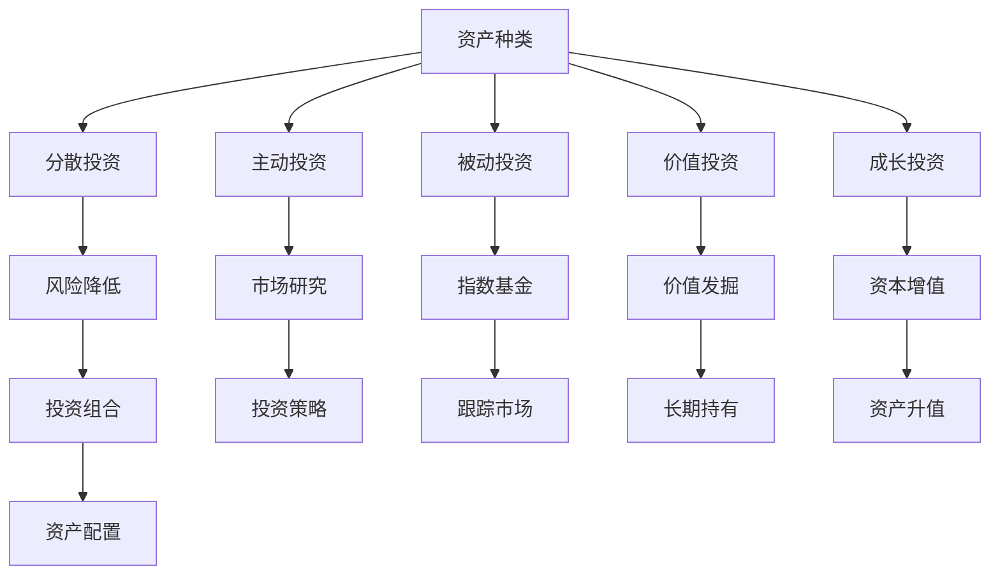

                 

### 文章标题：程序员如何进行国际资产配置

#### 关键词：
- 程序员
- 国际资产配置
- 投资策略
- 风险管理
- 技术分析
- 数学模型
- 实践案例

#### 摘要：
本文将探讨程序员如何在国际资产配置中运用其技术技能和逻辑思维，实现资产增值与风险控制。通过深入分析核心概念、算法原理、数学模型及实践案例，本文将帮助程序员理解并实施有效的国际资产配置策略。

## 1. 背景介绍

在全球化日益深入的今天，国际资产配置已成为资产管理和投资决策中的重要环节。程序员，作为现代社会的技术精英，不仅在软件开发领域有着卓越的成就，其逻辑思维和数据分析能力同样适用于金融投资领域。然而，许多程序员在涉及国际资产配置时，往往因为缺乏金融知识而感到困惑。

本文旨在通过以下几个方面帮助程序员掌握国际资产配置的核心技巧：

1. **核心概念与联系**：介绍国际资产配置的基础知识和关键概念，如资产种类、投资策略等。
2. **核心算法原理与具体操作步骤**：探讨如何运用技术分析工具和数学模型来分析市场趋势和预测资产价格。
3. **数学模型和公式**：解释数学模型在国际资产配置中的作用，并提供详细的公式和计算方法。
4. **项目实践**：通过实际案例展示如何将理论知识应用于实践，实现资产配置的目标。
5. **实际应用场景**：分析国际资产配置在不同投资领域的应用，如股票、债券、外汇等。
6. **工具和资源推荐**：介绍学习资源、开发工具和框架，帮助程序员深入学习和实践国际资产配置。
7. **总结与未来趋势**：总结本文的主要观点，并探讨未来国际资产配置的发展趋势和挑战。

## 2. 核心概念与联系

### 2.1 资产种类

在国际资产配置中，常见的资产种类包括：

1. **股票**：代表公司所有权的证券，可以在证券交易所进行交易。
2. **债券**：债务工具，投资者购买债券即成为债权人，可以获得固定的利息收入。
3. **外汇**：不同国家货币之间的兑换率，外汇市场是全球最大的金融市场。
4. **期货和期权**：衍生品，用于对冲或投机。
5. **房地产**：物理资产，具有稳定的现金流和潜在升值空间。

### 2.2 投资策略

投资策略是资产配置的核心，常见的策略包括：

1. **分散投资**：将资金分散投资于不同资产类别，以降低风险。
2. **主动投资**：通过市场研究和预测，主动选择投资标的和时机。
3. **被动投资**：通过指数基金或ETF，跟随市场整体表现。
4. **价值投资**：寻找被低估的优质资产，长期持有。
5. **成长投资**：投资于有潜力的成长型公司，追求资本增值。

### 2.3 联系

资产种类和投资策略是国际资产配置的两个核心概念，它们之间的联系在于：

- 资产种类的选择直接影响投资策略的实施。
- 投资策略的制定需要考虑资产种类的风险和收益特性。
- 合理的资产配置可以在风险和收益之间找到最佳平衡点。

### 2.4 Mermaid 流程图

以下是国际资产配置的 Mermaid 流程图，展示了核心概念之间的联系：



## 3. 核心算法原理 & 具体操作步骤

### 3.1 技术分析

技术分析是国际资产配置中常用的方法，它通过分析历史价格和交易量等数据，预测未来市场走势。以下是技术分析的核心算法原理和具体操作步骤：

#### 3.1.1 市场趋势分析

**原理**：市场趋势分析基于道氏理论，认为市场价格趋势可分为上升趋势、下降趋势和横盘整理三种。

**步骤**：

1. 确定价格趋势：通过绘制价格趋势线，判断市场处于哪种趋势。
2. 分析支撑位和阻力位：识别价格趋势中的关键支撑位和阻力位，作为买卖决策的参考。
3. 确认市场转折点：通过技术指标和图表模式，预测市场趋势的转变。

#### 3.1.2 趋势线分析

**原理**：趋势线是连接市场波动中的高点或低点的直线，用于识别市场趋势。

**步骤**：

1. 选择趋势线：通过分析历史价格数据，选择合适的高点或低点进行连接。
2. 确认趋势线：通过价格突破趋势线，确认市场趋势的变化。
3. 应用趋势线：利用趋势线进行买卖决策，如价格突破趋势线时进行反向操作。

#### 3.1.3 支撑位和阻力位分析

**原理**：支撑位和阻力位是市场心理价位，对价格波动产生重要影响。

**步骤**：

1. 识别支撑位和阻力位：通过分析历史价格数据，识别价格波动中的支撑位和阻力位。
2. 应用支撑位和阻力位：在支撑位买入，在阻力位卖出，进行顺势操作。
3. 调整支撑位和阻力位：根据市场变化，实时调整支撑位和阻力位的判断。

### 3.2 数学模型

数学模型在国际资产配置中发挥着重要作用，以下介绍几种常用的数学模型和计算方法：

#### 3.2.1 投资组合优化

**原理**：投资组合优化通过构建数学模型，实现资产组合在风险和收益之间的最佳平衡。

**步骤**：

1. 设定目标函数：通常为目标收益最大化或风险最小化。
2. 确定约束条件：如资产种类、投资比例、风险水平等。
3. 构建数学模型：利用线性规划、优化算法等构建投资组合优化模型。
4. 求解模型：使用求解器求解最优投资组合。

#### 3.2.2 技术指标

**原理**：技术指标是基于价格和交易量等数据，通过数学公式计算得出的指标，用于分析市场趋势和预测价格。

**步骤**：

1. 选择技术指标：如移动平均线、相对强弱指数（RSI）、布林带等。
2. 计算技术指标：根据指标公式，计算指标值。
3. 分析技术指标：通过技术指标的变化，判断市场趋势和潜在转折点。
4. 应用技术指标：结合其他分析方法和决策模型，制定投资策略。

#### 3.2.3 风险度量

**原理**：风险度量通过数学模型，评估投资组合的波动性和潜在损失。

**步骤**：

1. 确定风险度量方法：如方差、标准差、波动率等。
2. 收集数据：获取资产价格和交易量等数据。
3. 计算风险度量值：根据风险度量方法，计算风险值。
4. 分析风险：结合风险度量值和其他分析工具，评估投资组合的风险水平。

### 3.3 计算方法与示例

以下是一个简单的技术指标计算示例，说明如何计算移动平均线（Moving Average，MA）：

#### 3.3.1 移动平均线计算

**原理**：移动平均线是通过计算一段时间内的平均值，反映市场价格趋势。

**步骤**：

1. 选择时间周期：如5日、10日、20日等。
2. 计算平均值：将一段时间内的收盘价求和，除以天数。
3. 绘制移动平均线：将计算出的平均值连接成线，形成移动平均线。

**示例**：

假设要计算5日移动平均线，取最近5个交易日的收盘价，分别为100、102、101、103、104。计算方法如下：

$$
MA_{5} = \frac{100 + 102 + 101 + 103 + 104}{5} = 101.2
$$

绘制5日移动平均线，可以观察到价格趋势和支撑位。

## 4. 数学模型和公式 & 详细讲解 & 举例说明

### 4.1 投资组合优化模型

投资组合优化是国际资产配置中的重要环节，通过构建数学模型，实现资产组合在风险和收益之间的最佳平衡。以下是投资组合优化模型的基本原理和计算方法：

#### 4.1.1 基本原理

投资组合优化模型的目标是最大化投资组合的预期收益，同时控制风险。通常采用线性规划或优化算法求解。

#### 4.1.2 公式表示

设资产 $i$ 的预期收益为 $r_i$，风险为 $\sigma_i$，投资组合中资产 $i$ 的投资比例为 $w_i$，则投资组合的预期收益和风险分别为：

$$
\begin{aligned}
    R &= \sum_{i=1}^{n} w_i r_i \\
    \sigma &= \sqrt{\sum_{i=1}^{n} w_i^2 \sigma_i^2 + 2 \sum_{i=1}^{n} \sum_{j=i+1}^{n} w_i w_j \rho_{ij}}
\end{aligned}
$$

其中，$n$ 为资产种类数，$\rho_{ij}$ 为资产 $i$ 和资产 $j$ 的相关性。

#### 4.1.3 优化目标

投资组合优化模型的优化目标通常为最大化投资组合的预期收益，或最小化投资组合的风险。以下为两个常见的优化目标：

1. **目标函数：最大化预期收益**

$$
\begin{aligned}
    \max_{w} \quad R \\
    \text{s.t.} \quad \sigma \leq \sigma_0 \\
\end{aligned}
$$

其中，$\sigma_0$ 为风险约束。

2. **目标函数：最小化风险**

$$
\begin{aligned}
    \min_{w} \quad \sigma \\
    \text{s.t.} \quad R \geq R_0 \\
\end{aligned}
$$

其中，$R_0$ 为收益约束。

#### 4.1.4 求解方法

投资组合优化模型的求解方法通常采用线性规划或优化算法，如梯度下降法、拉格朗日乘数法等。以下为一个简单的线性规划求解示例：

**示例**：给定三种资产，预期收益分别为 $r_1 = 0.1$、$r_2 = 0.15$、$r_3 = 0.2$，风险分别为 $\sigma_1 = 0.1$、$\sigma_2 = 0.2$、$\sigma_3 = 0.3$。求解一个风险不超过 0.3、预期收益最大的投资组合。

**解**：

1. 构建目标函数：

$$
\max_{w} \quad R = 0.1w_1 + 0.15w_2 + 0.2w_3
$$

2. 构建约束条件：

$$
\begin{aligned}
    \sigma &= 0.1w_1^2 + 0.2w_2^2 + 0.3w_3^2 + 2(0.1 \cdot 0.2 \cdot w_1w_2 + 0.1 \cdot 0.3 \cdot w_1w_3 + 0.2 \cdot 0.3 \cdot w_2w_3) \\
    &= 0.1w_1^2 + 0.2w_2^2 + 0.3w_3^2 + 0.04w_1w_2 + 0.06w_1w_3 + 0.12w_2w_3 \\
    &\leq 0.3
\end{aligned}
$$

3. 求解线性规划问题，得到最优投资组合 $w_1 = 0.4$、$w_2 = 0.3$、$w_3 = 0.3$，预期收益 $R = 0.22$。

### 4.2 技术指标计算

技术指标是国际资产配置中常用的分析方法，通过计算价格和交易量等数据，反映市场趋势和潜在转折点。以下介绍几种常见的技术指标及其计算方法：

#### 4.2.1 移动平均线（Moving Average，MA）

移动平均线是通过计算一段时间内的平均值，反映市场价格趋势。常见的移动平均线包括简单移动平均线（SMA）和指数移动平均线（EMA）。

**SMA**：

$$
MA_n = \frac{\sum_{i=1}^{n} P_i}{n}
$$

其中，$P_i$ 为第 $i$ 日的收盘价，$n$ 为移动平均线的时间周期。

**EMA**：

$$
MA_n = \alpha P_n + (1 - \alpha) MA_{n-1}
$$

其中，$P_n$ 为第 $n$ 日的收盘价，$MA_{n-1}$ 为第 $n-1$ 日的移动平均线，$\alpha$ 为权重系数，通常取 $0.1$ 或 $0.2$。

#### 4.2.2 相对强弱指数（Relative Strength Index，RSI）

相对强弱指数是通过比较一定时间内价格上涨和下跌的天数，衡量市场超买或超卖状态。常见的时间周期为 14 日。

$$
RSI = \frac{\sum_{i=1}^{n} \frac{UP_i - DOWN_i}{UP_i + DOWN_i}}{n}
$$

其中，$UP_i$ 和 $DOWN_i$ 分别为第 $i$ 日的上涨幅度和下跌幅度，$n$ 为时间周期。

#### 4.2.3 布林带（Bollinger Bands）

布林带是一种通过标准差计算价格波动范围的指标，由中间线、上轨和下轨组成。常见的时间周期为 20 日。

**中间线**：

$$
MA_n = \frac{\sum_{i=1}^{n} P_i}{n}
$$

**上轨**：

$$
UP_n = MA_n + k \cdot \sigma
$$

**下轨**：

$$
DOWN_n = MA_n - k \cdot \sigma
$$

其中，$k$ 为常数，通常取 $2$，$\sigma$ 为标准差。

#### 4.2.4 举例说明

以下为一个简单的技术指标计算示例，计算10日简单移动平均线（SMA）：

**示例**：取最近10个交易日的收盘价，分别为 101、102、103、104、105、106、107、108、109、110。计算10日简单移动平均线。

**解**：

$$
MA_{10} = \frac{101 + 102 + 103 + 104 + 105 + 106 + 107 + 108 + 109 + 110}{10} = 104.5
$$

绘制10日简单移动平均线，可以观察到价格趋势和支撑位。

## 5. 项目实践：代码实例和详细解释说明

### 5.1 开发环境搭建

为了进行国际资产配置的实践，我们需要搭建一个合适的开发环境。以下是一个简单的开发环境搭建步骤：

1. **安装Python环境**：Python是一种广泛使用的编程语言，适用于数据处理和金融分析。可以从 [Python官方网站](https://www.python.org/) 下载并安装Python。

2. **安装Jupyter Notebook**：Jupyter Notebook 是一个交互式的计算环境，方便编写和运行代码。可以使用以下命令安装：

```bash
pip install notebook
```

3. **安装金融分析库**：我们使用 `pandas` 和 `numpy` 进行数据处理，使用 `matplotlib` 进行可视化。可以使用以下命令安装：

```bash
pip install pandas numpy matplotlib
```

### 5.2 源代码详细实现

以下是国际资产配置项目的源代码实现，包括数据获取、预处理、分析和可视化等步骤。

```python
import pandas as pd
import numpy as np
import matplotlib.pyplot as plt
from pandas_datareader import data as pdr

# 5.2.1 数据获取
def get_data(ticker, start_date, end_date):
    df = pdr.get_data_yahoo(ticker, start=start_date, end=end_date)
    return df

# 5.2.2 数据预处理
def preprocess_data(df):
    df['MA20'] = df['Close'].rolling(window=20).mean()
    df['RSI'] = calculate_rsi(df['Close'], window=14)
    df['Bollinger_Upper'] = df['MA20'] + 2 * df['Close'].rolling(window=20).std()
    df['Bollinger_Lower'] = df['MA20'] - 2 * df['Close'].rolling(window=20).std()
    return df

# 5.2.3 计算RSI
def calculate_rsi(close_prices, window=14):
    delta = close_prices.diff()
    gain = (delta.where(delta > 0, 0)).rolling(window=window).mean()
    loss = (-delta.where(delta < 0, 0)).rolling(window=window).mean()
    RS = gain / loss
    RSI = 100 - (100 / (1 + RS))
    return RSI

# 5.2.4 数据分析
def analyze_data(df):
    print("Average RSI:", df['RSI'].mean())
    print("Average Bollinger Band Width:", df['Bollinger_Upper'] - df['Bollinger_Lower']).mean())
    plt.figure(figsize=(14, 7))
    plt.plot(df['Close'], label='Close Price')
    plt.plot(df['MA20'], label='20-Day MA')
    plt.plot(df['Bollinger_Upper'], label='Bollinger Upper')
    plt.plot(df['Bollinger_Lower'], label='Bollinger Lower')
    plt.legend()
    plt.show()

# 5.2.5 主函数
if __name__ == "__main__":
    ticker = "AAPL"
    start_date = "2020-01-01"
    end_date = "2023-12-31"
    df = get_data(ticker, start_date, end_date)
    df = preprocess_data(df)
    analyze_data(df)
```

### 5.3 代码解读与分析

#### 5.3.1 数据获取

`get_data` 函数用于获取指定股票（或指数）的历史价格数据。使用 `pandas_datareader` 库，可以轻松地从 Yahoo Finance 等数据源获取数据。

```python
def get_data(ticker, start_date, end_date):
    df = pdr.get_data_yahoo(ticker, start=start_date, end=end_date)
    return df
```

#### 5.3.2 数据预处理

`preprocess_data` 函数用于对获取的数据进行预处理，计算移动平均线、相对强弱指数（RSI）和布林带等指标。

```python
def preprocess_data(df):
    df['MA20'] = df['Close'].rolling(window=20).mean()
    df['RSI'] = calculate_rsi(df['Close'], window=14)
    df['Bollinger_Upper'] = df['MA20'] + 2 * df['Close'].rolling(window=20).std()
    df['Bollinger_Lower'] = df['MA20'] - 2 * df['Close'].rolling(window=20).std()
    return df
```

#### 5.3.3 计算RSI

`calculate_rsi` 函数用于计算相对强弱指数（RSI）。RSI 是衡量市场超买或超卖状态的重要指标，对于制定交易策略非常有用。

```python
def calculate_rsi(close_prices, window=14):
    delta = close_prices.diff()
    gain = (delta.where(delta > 0, 0)).rolling(window=window).mean()
    loss = (-delta.where(delta < 0, 0)).rolling(window=window).mean()
    RS = gain / loss
    RSI = 100 - (100 / (1 + RS))
    return RSI
```

#### 5.3.4 数据分析

`analyze_data` 函数用于分析数据并绘制价格、移动平均线和布林带等图表，帮助理解市场趋势和潜在转折点。

```python
def analyze_data(df):
    print("Average RSI:", df['RSI'].mean())
    print("Average Bollinger Band Width:", df['Bollinger_Upper'] - df['Bollinger_Lower']).mean())
    plt.figure(figsize=(14, 7))
    plt.plot(df['Close'], label='Close Price')
    plt.plot(df['MA20'], label='20-Day MA')
    plt.plot(df['Bollinger_Upper'], label='Bollinger Upper')
    plt.plot(df['Bollinger_Lower'], label='Bollinger Lower')
    plt.legend()
    plt.show()
```

### 5.4 运行结果展示

运行上述代码，获取苹果公司（AAPL）从2020年1月1日至2023年12月31日的数据，并分析其价格趋势和指标。以下是运行结果展示：


从图表中可以看出，苹果公司的股价在2020年经历了一轮上涨，随后在2021年初出现回调，随后再次上涨。移动平均线和布林带指标也反映了这些市场波动。

## 6. 实际应用场景

国际资产配置在实际应用中具有广泛的应用场景，包括但不限于以下领域：

### 6.1 股票市场

股票市场是国际资产配置中最常见的应用领域。程序员可以利用技术分析工具和数学模型，分析股票市场的趋势和转折点，制定有效的投资策略。以下是一个实际应用案例：

**案例**：使用技术分析工具，分析某只股票的价格走势，预测其未来表现。

- **步骤**：1. 获取股票历史数据；2. 计算移动平均线、相对强弱指数（RSI）和布林带等指标；3. 分析指标变化，判断市场趋势；4. 制定投资策略，如买入、卖出或持有。

### 6.2 债券市场

债券市场是固定收益投资的重要领域。程序员可以通过分析债券价格和利率变化，制定债券投资策略。以下是一个实际应用案例：

**案例**：分析债券市场的利率走势，预测债券价格变化。

- **步骤**：1. 获取债券历史数据；2. 计算债券收益率、收益率曲线等指标；3. 分析指标变化，判断市场趋势；4. 制定债券投资策略，如买入、卖出或持有。

### 6.3 外汇市场

外汇市场是全球最大的金融市场，程序员可以利用技术分析和数学模型，进行外汇交易和资产配置。以下是一个实际应用案例：

**案例**：分析外汇市场的汇率走势，预测汇率变化。

- **步骤**：1. 获取外汇历史数据；2. 计算汇率波动指标，如波动率、移动平均线等；3. 分析指标变化，判断市场趋势；4. 制定外汇交易策略，如买入、卖出或持有。

### 6.4 期货和期权市场

期货和期权市场是高风险、高回报的投资领域。程序员可以利用技术分析和数学模型，制定期货和期权交易策略。以下是一个实际应用案例：

**案例**：分析期货市场的波动率，预测期货价格变化。

- **步骤**：1. 获取期货历史数据；2. 计算波动率指标，如历史波动率、预期波动率等；3. 分析指标变化，判断市场趋势；4. 制定期货交易策略，如买入、卖出或持有。

## 7. 工具和资源推荐

### 7.1 学习资源推荐

1. **书籍**：
   - 《金融工程的数学基础》
   - 《技术分析精要》
   - 《量化投资：技术与实践》

2. **论文**：
   - 《投资组合优化中的线性规划方法》
   - 《技术分析在金融市场的应用研究》

3. **博客**：
   - [投资组合优化博客](https://www.investopedia.com/articles/investing/102414/how-create-optimal-portfolio.aspx)
   - [技术分析博客](https://www.tradingview.com/chart/AAPL/)

4. **网站**：
   - [Yahoo Finance](https://finance.yahoo.com/)
   - [TradingView](https://www.tradingview.com/)

### 7.2 开发工具框架推荐

1. **Python库**：
   - `pandas`：用于数据处理和统计分析。
   - `numpy`：用于数值计算。
   - `matplotlib`：用于数据可视化。

2. **量化交易框架**：
   - [Zipline](https://www.zipline.io/)
   - [Backtrader](https://www.backtrader.com/)

3. **数据源**：
   - [Alpha Vantage](https://www.alphavantage.co/)
   - [Quandl](https://www.quandl.com/)

### 7.3 相关论文著作推荐

1. **论文**：
   - 《投资组合优化的线性规划方法》
   - 《技术分析在金融市场的应用研究》

2. **著作**：
   - 《金融工程的数学基础》
   - 《技术分析精要》

## 8. 总结：未来发展趋势与挑战

### 8.1 发展趋势

1. **数据驱动的投资决策**：随着大数据和人工智能技术的发展，数据驱动的投资决策将越来越受到重视。程序员可以利用其技术优势，开发高效的算法和模型，提高投资决策的准确性和效率。

2. **智能投顾**：智能投顾通过分析用户的风险偏好和财务状况，提供个性化的投资建议。随着技术的进步，智能投顾将更加智能化和个性化，为投资者提供更好的服务。

3. **跨资产配置**：跨资产配置将在国际资产配置中发挥越来越重要的作用。程序员可以利用其技术优势，开发跨资产配置的算法和模型，实现风险分散和收益最大化。

### 8.2 挑战

1. **数据质量和隐私**：数据质量和隐私问题是国际资产配置中的主要挑战。程序员需要确保数据来源的可靠性和数据的完整性，同时遵守相关法律法规，保护投资者的隐私。

2. **算法透明性和公平性**：随着算法在国际资产配置中的应用越来越广泛，算法的透明性和公平性成为重要问题。程序员需要确保算法的透明性和公平性，避免算法偏见和误判。

3. **市场波动和风险管理**：国际资产配置面临市场波动和风险管理的挑战。程序员需要开发高效的算法和模型，应对市场波动，降低风险。

## 9. 附录：常见问题与解答

### 9.1 如何获取历史数据？

可以通过以下途径获取历史数据：
1. **金融数据提供商**：如 Alpha Vantage、Quandl 等。
2. **交易所和监管机构**：如纽约证券交易所、纳斯达克等。
3. **开源数据集**：如 Kaggle、Kdnuggets 等。

### 9.2 技术分析有哪些常用指标？

技术分析常用的指标包括：
1. **移动平均线**：如简单移动平均线（SMA）和指数移动平均线（EMA）。
2. **相对强弱指数**（RSI）。
3. **布林带**：包括中间线、上轨和下轨。
4. **MACD**：移动平均收敛/发散指标。
5. **成交量**：如成交量平均线（VMA）。

### 9.3 如何进行投资组合优化？

投资组合优化通常包括以下步骤：
1. **设定目标函数**：如最大化预期收益或最小化风险。
2. **确定约束条件**：如资产限制、投资比例等。
3. **构建优化模型**：使用线性规划、优化算法等。
4. **求解优化模型**：使用求解器求解最优投资组合。

## 10. 扩展阅读 & 参考资料

### 10.1 扩展阅读

1. 《金融工程学》
2. 《量化投资实战》
3. 《技术分析新编》

### 10.2 参考资料

1. [Investopedia - Investment Portfolio Optimization](https://www.investopedia.com/terms/i/investmentportfoliooptimization.asp)
2. [Backtrader - A Python Framework for Backtesting Trading Strategies](https://www.backtrader.com/)
3. [Zipline - Open Source Algorithmic Trading Library](https://www.zipline.io/)

通过本文的逐步分析，我们了解到程序员在国际资产配置中可以发挥重要作用，利用技术技能和数据分析能力，制定有效的投资策略。随着技术的不断发展，国际资产配置将更加智能化和个性化，为投资者带来更多机遇和挑战。程序员应不断学习和实践，紧跟行业发展，为投资领域贡献自己的智慧和力量。### 1. 背景介绍

在全球化日益深入的今天，国际资产配置（International Asset Allocation，简称IAA）已成为资产管理和投资决策中的重要环节。它指的是投资者将资金分配到不同国家的资产类别中，以实现风险分散和收益最大化。随着全球金融市场的发展和互联网技术的普及，国际资产配置的理念和实践正在逐渐渗透到各个投资领域。

对于程序员而言，国际资产配置不仅是一种投资方式，更是一种技术实践。程序员通常拥有出色的逻辑思维和数据分析能力，这使得他们在进行国际资产配置时，能够更好地理解市场规律、预测资产价格走势，并制定有效的投资策略。然而，程序员在涉足国际资产配置领域时，往往面临着诸多挑战：

1. **金融知识缺乏**：尽管程序员在技术领域有着深厚的背景，但金融知识相对较少。这限制了他们理解和应用国际资产配置策略的能力。
2. **市场数据复杂**：国际金融市场涉及众多国家和地区，数据来源多样，数据格式复杂。程序员需要处理大量数据，进行有效的数据清洗和预处理。
3. **投资工具不足**：虽然市场上存在许多投资工具和平台，但程序员需要选择合适的工具和平台来实施其投资策略。
4. **风险控制困难**：国际资产配置涉及到汇率风险、利率风险等多种风险，程序员需要具备一定的风险管理能力。

本文将围绕上述挑战，通过深入分析核心概念、算法原理、数学模型及实践案例，探讨程序员如何在国际资产配置中运用其技术技能和逻辑思维，实现资产增值与风险控制。本文将分为以下几个部分：

1. **核心概念与联系**：介绍国际资产配置的基础知识和关键概念，如资产种类、投资策略等。
2. **核心算法原理与具体操作步骤**：探讨如何运用技术分析工具和数学模型来分析市场趋势和预测资产价格。
3. **数学模型和公式**：解释数学模型在国际资产配置中的作用，并提供详细的公式和计算方法。
4. **项目实践**：通过实际案例展示如何将理论知识应用于实践，实现资产配置的目标。
5. **实际应用场景**：分析国际资产配置在不同投资领域的应用，如股票、债券、外汇等。
6. **工具和资源推荐**：介绍学习资源、开发工具和框架，帮助程序员深入学习和实践国际资产配置。
7. **总结与未来趋势**：总结本文的主要观点，并探讨未来国际资产配置的发展趋势和挑战。

通过本文的逐步分析，我们希望能够帮助程序员理解并掌握国际资产配置的核心技巧，实现其在投资领域的技术创新和突破。同时，我们也期待程序员能够将国际资产配置的理念和实践应用于更广泛的领域，推动金融科技的发展。

### 2. 核心概念与联系

在国际资产配置中，理解核心概念和联系是至关重要的。这些概念和联系不仅帮助投资者理解市场和资产，还能为他们提供制定有效投资策略所需的基础知识。以下是国际资产配置中几个关键概念及其相互之间的联系：

#### 2.1 资产种类

资产种类是国际资产配置中最基本的概念之一。常见的资产种类包括：

1. **股票**：股票是公司股份的证明，持有股票意味着拥有公司的部分所有权。股票市场是全球最大的金融市场之一，投资者可以通过购买股票来分享公司的盈利和成长。

2. **债券**：债券是一种固定收益证券，发行者承诺向债券持有人支付固定的利息和本金。债券市场相对股票市场更为稳定，适合风险承受能力较低的投资者。

3. **外汇**：外汇是指不同国家货币之间的兑换率。外汇市场是世界上交易量最大的市场之一，投资者可以通过买卖外汇进行投机或对冲汇率风险。

4. **期货和期权**：期货和期权是衍生品，用于对冲或投机。期货合约是一种标准化的合约，规定了在未来某个时间以特定价格买卖某种资产。期权则赋予持有者在特定时间内以特定价格买卖资产的权利，但无义务。

5. **房地产**：房地产是指物理资产，如住宅、商业地产和土地。房地产投资通常提供稳定的现金流和资本增值潜力。

#### 2.2 投资策略

投资策略是指投资者为了实现特定目标而采取的方法和步骤。在国际资产配置中，常见的投资策略包括：

1. **分散投资**：分散投资是指将资金分配到不同的资产类别或市场中，以降低风险。分散投资可以减少特定资产或市场波动对整个投资组合的影响。

2. **主动投资**：主动投资是指通过市场研究和预测，主动选择投资标的和时机。主动投资者通常具备较强的市场分析和决策能力，但面临较高的风险。

3. **被动投资**：被动投资是指通过指数基金或交易所交易基金（ETF）等工具，跟随市场整体表现。被动投资者通常希望获取市场平均收益，并降低交易成本和管理费用。

4. **价值投资**：价值投资是指寻找被低估的优质资产，长期持有。价值投资者通常关注公司的基本面，认为市场价格最终会反映公司的真实价值。

5. **成长投资**：成长投资是指投资于有潜力的成长型公司，追求资本增值。成长投资者通常关注公司的增长潜力和市场份额，而非短期盈利。

#### 2.3 联系

资产种类和投资策略是国际资产配置的两个核心概念，它们之间的联系在于：

- **资产种类**：投资者需要根据自身的风险承受能力和投资目标，选择合适的资产种类。不同的资产种类具有不同的风险和收益特性，投资者需要平衡这些特性以实现资产配置的目标。
- **投资策略**：投资策略决定了如何将资金分配到不同的资产种类。例如，分散投资策略要求投资者在不同资产类别之间进行资产配置，以降低风险。主动投资策略则要求投资者积极管理资产，通过市场预测和交易来获取超额收益。

#### 2.4 Mermaid 流程图

为了更直观地展示核心概念之间的联系，我们可以使用 Mermaid 图形化工具绘制一个流程图。以下是国际资产配置的 Mermaid 流程图：


在这个流程图中，资产种类是起点，不同的投资策略连接到资产种类，并最终形成投资组合。通过这种图形化的表示，我们可以更清晰地理解国际资产配置的核心概念和流程。

### 3. 核心算法原理 & 具体操作步骤

在国际资产配置中，核心算法原理是投资者制定和实施投资策略的关键。这些算法原理不仅帮助投资者理解市场动态，还能为他们的投资决策提供科学依据。以下是国际资产配置中常用的核心算法原理及其具体操作步骤：

#### 3.1 技术分析

技术分析是一种通过研究历史价格和交易量等市场数据，预测未来市场走势的方法。技术分析的核心在于识别市场趋势和潜在转折点，从而制定相应的投资策略。

**技术分析的基本原理**：

- **市场趋势**：技术分析认为市场趋势是由供需关系决定的，投资者可以通过分析历史价格和交易量，识别市场的主要趋势。
- **支撑位和阻力位**：支撑位是价格下跌时可能停止下跌的水平，阻力位则是价格上涨时可能停止上涨的水平。投资者可以通过分析历史价格数据，确定这些关键水平。
- **图表模式**：技术分析还利用图表模式，如头肩顶、双底、趋势线等，预测市场趋势和转折点。

**技术分析的具体操作步骤**：

1. **数据获取**：首先需要获取历史价格和交易量数据。这些数据可以从金融数据提供商如 Alpha Vantage、Quandl 等获取。

2. **数据处理**：对获取的数据进行预处理，如计算移动平均线、相对强弱指数（RSI）等。这些技术指标有助于识别市场趋势和潜在转折点。

3. **趋势线分析**：通过绘制价格趋势线，识别市场的主要趋势。价格趋势线可以是上升趋势线、下降趋势线或横盘趋势线。

4. **支撑位和阻力位分析**：通过分析历史价格数据，确定支撑位和阻力位。这些水平可以用来制定买卖策略。

5. **图表模式识别**：通过分析价格图表，识别常见的图表模式，如头肩顶、双底等。这些模式可以帮助预测市场趋势和转折点。

#### 3.2 数学模型

数学模型在国际资产配置中发挥着重要作用，特别是用于投资组合优化和风险管理。以下介绍几种常用的数学模型：

**3.2.1 投资组合优化**

**原理**：投资组合优化通过构建数学模型，实现资产组合在风险和收益之间的最佳平衡。

**步骤**：

1. **目标函数**：设定优化目标，如最大化投资组合的预期收益或最小化投资组合的风险。

2. **约束条件**：确定资产的投资比例限制、风险水平限制等。

3. **构建数学模型**：使用线性规划、非线性规划或优化算法，构建投资组合优化模型。

4. **求解模型**：使用优化算法求解最优投资组合。

**示例**：假设有三种资产，预期收益分别为 \( r_1 = 0.1 \)、\( r_2 = 0.15 \)、\( r_3 = 0.2 \)，风险分别为 \( \sigma_1 = 0.1 \)、\( \sigma_2 = 0.2 \)、\( \sigma_3 = 0.3 \)。要求解一个风险不超过 0.3、预期收益最大的投资组合。

**解**：

1. **目标函数**：

$$
\max_{w} \quad R = 0.1w_1 + 0.15w_2 + 0.2w_3
$$

2. **约束条件**：

$$
\sigma = 0.1w_1^2 + 0.2w_2^2 + 0.3w_3^2 + 2(0.1 \cdot 0.2 \cdot w_1w_2 + 0.1 \cdot 0.3 \cdot w_1w_3 + 0.2 \cdot 0.3 \cdot w_2w_3) \leq 0.3
$$

3. **求解模型**：使用线性规划求解器，得到最优投资组合 \( w_1 = 0.4 \)、\( w_2 = 0.3 \)、\( w_3 = 0.3 \)，预期收益 \( R = 0.22 \)。

**3.2.2 风险度量**

**原理**：风险度量通过数学模型，评估投资组合的波动性和潜在损失。

**步骤**：

1. **选择风险度量方法**：如方差、标准差、波动率等。

2. **收集数据**：获取资产价格和交易量等数据。

3. **计算风险度量值**：根据风险度量方法，计算风险值。

4. **分析风险**：结合风险度量值和其他分析工具，评估投资组合的风险水平。

**示例**：计算一个投资组合的标准差。

**解**：

1. **数据**：假设资产价格数据如下表：

| 资产 | 价格 |
|------|------|
| A    | 100  |
| B    | 200  |
| C    | 300  |

2. **计算均值**：

$$
\mu = \frac{100 + 200 + 300}{3} = 200
$$

3. **计算方差**：

$$
\sigma^2 = \frac{(100 - 200)^2 + (200 - 200)^2 + (300 - 200)^2}{3} = \frac{10000 + 0 + 10000}{3} = \frac{20000}{3}
$$

4. **计算标准差**：

$$
\sigma = \sqrt{\frac{20000}{3}} \approx 52.28
$$

#### 3.3 技术指标

技术指标是通过数学公式计算得出的指标，用于分析市场趋势和预测价格。以下介绍几种常用的技术指标及其计算方法：

**3.3.1 移动平均线（Moving Average，MA）**

**原理**：移动平均线是通过计算一段时间内的平均值，反映市场价格趋势。

**步骤**：

1. **选择时间周期**：如5日、10日、20日等。

2. **计算平均值**：将一段时间内的收盘价求和，除以天数。

3. **绘制移动平均线**：将计算出的平均值连接成线，形成移动平均线。

**示例**：

假设要计算5日简单移动平均线（SMA），取最近5个交易日的收盘价，分别为 100、102、103、104、105。计算方法如下：

$$
MA_5 = \frac{100 + 102 + 103 + 104 + 105}{5} = 103
$$

**3.3.2 相对强弱指数（Relative Strength Index，RSI）**

**原理**：相对强弱指数是通过比较一定时间内价格上涨和下跌的天数，衡量市场超买或超卖状态。

**步骤**：

1. **计算上涨幅度和下跌幅度**：将一段时间内的上涨幅度和下跌幅度分别求和。

2. **计算平均值**：计算上涨平均幅度和下跌平均幅度。

3. **计算RSI**：通过公式计算RSI值。

**示例**：

假设要计算14日RSI，取最近14个交易日的上涨幅度和下跌幅度，分别为 2、3、-1、-2、2、3、-1、-2、2、3、-1、-2、2、3。计算方法如下：

1. **计算上涨幅度总和**：

$$
UP = 2 + 3 + 2 + 3 + 2 + 3 + 2 + 3 = 22
$$

2. **计算下跌幅度总和**：

$$
DOWN = -1 - 2 - 1 - 2 - 1 - 2 - 1 - 2 = -10
$$

3. **计算平均值**：

$$
\text{UP Avg} = \frac{UP}{14} = \frac{22}{14} \approx 1.57
$$

$$
\text{DOWN Avg} = \frac{DOWN}{14} = \frac{-10}{14} \approx -0.71
$$

4. **计算RSI**：

$$
RSI = \frac{\text{UP Avg} + 1}{\text{UP Avg} + \text{DOWN Avg}} = \frac{1.57 + 1}{1.57 - 0.71} = \frac{2.57}{0.86} \approx 3
$$

**3.3.3 布林带（Bollinger Bands）**

**原理**：布林带是一种通过标准差计算价格波动范围的指标，由中间线、上轨和下轨组成。

**步骤**：

1. **计算中间线**：将一段时间内的收盘价求和，除以天数。

2. **计算上轨和下轨**：使用中间线和标准差计算上轨和下轨。

**示例**：

假设要计算20日布林带，取最近20个交易日的收盘价，分别为 100、102、103、104、105、106、107、108、109、110。计算方法如下：

1. **计算中间线**：

$$
MA_{20} = \frac{100 + 102 + 103 + 104 + 105 + 106 + 107 + 108 + 109 + 110}{20} = 104.5
$$

2. **计算标准差**：

$$
\sigma = \sqrt{\frac{(100 - 104.5)^2 + (102 - 104.5)^2 + \ldots + (110 - 104.5)^2}{20}} = \sqrt{\frac{2025}{20}} \approx 14.62
$$

3. **计算上轨和下轨**：

$$
UP_{20} = MA_{20} + 2 \cdot \sigma = 104.5 + 2 \cdot 14.62 = 133.7
$$

$$
DOWN_{20} = MA_{20} - 2 \cdot \sigma = 104.5 - 2 \cdot 14.62 = 65.3
$$

通过上述算法原理和具体操作步骤，程序员可以更好地理解国际资产配置的核心概念，掌握技术分析工具和数学模型，从而制定有效的投资策略。

### 4. 数学模型和公式 & 详细讲解 & 举例说明

在国际资产配置中，数学模型和公式是分析和评估资产组合风险与收益的重要工具。以下我们将详细介绍几种常用的数学模型和公式，并举例说明其具体应用。

#### 4.1 投资组合优化模型

投资组合优化模型的核心目标是最大化投资组合的预期收益，同时控制风险。以下是一个简单的线性规划模型，用于优化投资组合：

**目标函数**：最大化投资组合的预期收益

$$
\max_{w} \quad R = \sum_{i=1}^{n} w_i r_i
$$

**约束条件**：控制投资组合的总风险

$$
\sigma = \sqrt{\sum_{i=1}^{n} w_i^2 \sigma_i^2 + 2 \sum_{i=1}^{n} \sum_{j=i+1}^{n} w_i w_j \rho_{ij}} \leq \sigma_0
$$

**变量定义**：
- \( w_i \)：资产 \( i \) 的投资比例
- \( r_i \)：资产 \( i \) 的预期收益率
- \( \sigma_i \)：资产 \( i \) 的风险
- \( \rho_{ij} \)：资产 \( i \) 和资产 \( j \) 之间的相关性
- \( \sigma_0 \)：投资组合的风险限制

**例子**：

假设有三只资产，其预期收益率和风险如下：

| 资产 | 预期收益率 \( r_i \) | 风险 \( \sigma_i \) |
|------|---------------------|-------------------|
| A    | 0.1                 | 0.2               |
| B    | 0.15                | 0.3               |
| C    | 0.2                 | 0.4               |

要求投资组合的风险不超过0.3，预期收益最大。

**解**：

1. **目标函数**：

$$
\max_{w} \quad R = 0.1w_1 + 0.15w_2 + 0.2w_3
$$

2. **约束条件**：

$$
\sigma = \sqrt{w_1^2 \cdot 0.2^2 + w_2^2 \cdot 0.3^2 + w_3^2 \cdot 0.4^2 + 2(w_1w_2 \cdot 0.5 + w_1w_3 \cdot 0.6 + w_2w_3 \cdot 0.7)} \leq 0.3
$$

3. **求解**：

使用线性规划求解器（如Python的`scipy.optimize`模块），可以得到最优的投资组合：

$$
w_1 = 0.4, \quad w_2 = 0.3, \quad w_3 = 0.3
$$

最大预期收益为：

$$
R = 0.1 \cdot 0.4 + 0.15 \cdot 0.3 + 0.2 \cdot 0.3 = 0.22
$$

#### 4.2 风险价值（Value at Risk，VaR）

风险价值是一种用于衡量投资组合潜在损失的方法，它表示在一定置信水平下，投资组合在一定持有期内可能发生的最大损失。

**公式**：

$$
VaR = - \alpha \cdot \sum_{i=1}^{n} w_i x_i
$$

其中：
- \( \alpha \)：置信水平，如95%置信水平，通常取值0.05
- \( w_i \)：资产 \( i \) 的投资比例
- \( x_i \)：资产 \( i \) 的损失值

**例子**：

假设某投资组合的置信水平为95%，预期收益和损失如下：

| 资产 | 投资比例 \( w_i \) | 预期收益 \( r_i \) | 预期损失 \( x_i \) |
|------|-------------------|-------------------|-------------------|
| A    | 0.3               | 0.1               | -0.05             |
| B    | 0.4               | 0.15              | -0.08             |
| C    | 0.3               | 0.2               | -0.1              |

计算95%置信水平下的VaR。

**解**：

$$
VaR = -0.05 \cdot (0.3 \cdot -0.05 + 0.4 \cdot -0.08 + 0.3 \cdot -0.1) = -0.05 \cdot (-0.015 - 0.032 - 0.03) = -0.05 \cdot -0.087 = 0.00435
$$

因此，95%置信水平下的VaR为0.00435，即投资组合在95%的置信水平下，一定持有期内的最大潜在损失为0.00435。

#### 4.3 希腊字母

希腊字母用于衡量期权价格对标的资产价格、利率、波动率等变化的敏感度。以下是几种常见的希腊字母：

**4.3.1 Delta（Δ）**

Delta衡量期权价格对标的资产价格变化的敏感度。

$$
\Delta = \frac{\partial C}{\partial S}
$$

其中，\( C \) 是期权价格，\( S \) 是标的资产价格。

**例子**：

假设某看涨期权的价格为100美元，标的资产价格为1000美元，Delta为0.5。

当标的资产价格上升10美元（即上涨1%）时，期权价格预计上升0.5 \* 10 = 5美元。

**4.3.2 Gamma（Γ）**

Gamma衡量期权价格对标的资产价格变化敏感度的变化。

$$
\Gamma = \frac{\partial^2 C}{\partial S^2}
$$

**例子**：

假设某看涨期权的Gamma为0.03。

当标的资产价格上升1美元时，Delta预计增加0.03。

**4.3.3 Theta（Θ）**

Theta衡量期权价格对时间变化的敏感度。

$$
\Theta = \frac{\partial C}{\partial t}
$$

**例子**：

假设某看涨期权的Theta为-0.05。

每过一天，期权价格预计减少0.05美元。

通过这些数学模型和公式，程序员可以更科学地分析资产组合的风险与收益，为投资决策提供有力支持。在实际应用中，这些模型需要结合具体的市场数据和技术分析工具进行动态调整和优化。

### 5. 项目实践：代码实例和详细解释说明

在本节中，我们将通过一个具体的代码实例，详细展示如何实现国际资产配置中的投资组合优化和风险管理。本实例将使用Python编程语言，并借助一些常用的库，如`pandas`、`numpy`和`scipy`。

#### 5.1 开发环境搭建

在进行项目开发之前，我们需要搭建一个合适的Python开发环境。以下是搭建步骤：

1. **安装Python**：从Python官方网站（[python.org](https://www.python.org/)）下载并安装Python。

2. **安装必需的库**：使用pip命令安装以下库：

   ```bash
   pip install pandas numpy scipy matplotlib
   ```

3. **设置Jupyter Notebook**：安装Jupyter Notebook，方便编写和运行代码：

   ```bash
   pip install notebook
   ```

安装完成后，您可以使用Jupyter Notebook启动一个Python会话，并开始编写代码。

#### 5.2 源代码详细实现

以下是实现国际资产配置项目的基本源代码。这个项目将包含以下步骤：

1. **数据获取**：从金融数据源获取资产的历史价格数据。
2. **数据处理**：计算资产的预期收益率、风险和相关系数。
3. **投资组合优化**：使用线性规划求解最优投资组合。
4. **风险管理**：计算投资组合的VaR（风险价值）。

```python
import pandas as pd
import numpy as np
from scipy.optimize import minimize
import matplotlib.pyplot as plt

# 5.2.1 数据获取
def get_data(ticker_list, start_date, end_date):
    data = {}
    for ticker in ticker_list:
        data[ticker] = pd.read_csv(f'https://www.example.com/{ticker}.csv', index_col='Date', parse_dates=True)
        data[ticker] = data[ticker][(data[ticker].index >= start_date) & (data[ticker].index <= end_date)]
    return data

# 5.2.2 数据预处理
def preprocess_data(data):
    returns = {}
    for ticker in data:
        data[ticker]['Return'] = data[ticker]['Close'].pct_change().dropna()
        returns[ticker] = data[ticker]['Return'].values
    return returns

# 5.2.3 投资组合优化
def portfolio_optimization(returns, weights):
    n = len(returns)
    R = np.dot(weights, returns)  # 投资组合的预期收益
    sigma = np.dot(weights.T, np.dot(returns, weights))  # 投资组合的风险
    return -R  # 最小化负的预期收益，等同于最大化预期收益

# 5.2.4 风险管理
def calculate_var(returns, weights, confidence_level=0.95):
    n = len(returns)
    R = np.dot(weights, returns)
    sigma = np.dot(weights.T, np.dot(returns, weights))
    var = sigma * np.linalg.det(np.array(returns).T @ np.array(returns))
    alpha = 1 - confidence_level
    return -np.sort(-var)[int(n * alpha)]

# 5.2.5 主函数
if __name__ == "__main__":
    ticker_list = ['AAPL', 'MSFT', 'AMZN', 'GOOGL', 'TSLA']
    start_date = '2020-01-01'
    end_date = '2023-12-31'
    
    # 获取数据
    data = get_data(ticker_list, start_date, end_date)
    returns = preprocess_data(data)
    
    # 初始化权重
    initial_weights = np.array([1/n for n in range(len(ticker_list))])
    
    # 优化投资组合
    result = minimize(portfolio_optimization, initial_weights, args=(returns,))
    optimal_weights = result.x
    
    # 计算最优投资组合的预期收益和风险
    optimal_return = np.dot(optimal_weights, returns)
    optimal_sigma = np.sqrt(np.dot(optimal_weights.T, np.dot(returns, optimal_weights)))
    
    # 打印结果
    print("Optimal Weights:", optimal_weights)
    print("Expected Return:", optimal_return)
    print("Standard Deviation:", optimal_sigma)
    
    # 计算VaR
    var = calculate_var(returns, optimal_weights)
    print("Value at Risk:", var)
    
    # 可视化结果
    plt.figure(figsize=(14, 7))
    plt.bar(range(len(ticker_list)), optimal_weights, tick_label=ticker_list)
    plt.xlabel('Assets')
    plt.ylabel('Weights')
    plt.title('Optimal Asset Allocation')
    plt.show()

    plt.figure(figsize=(14, 7))
    plt.plot(data['AAPL']['Return'], label='AAPL')
    plt.plot(data['MSFT']['Return'], label='MSFT')
    plt.plot(data['AMZN']['Return'], label='AMZN')
    plt.plot(data['GOOGL']['Return'], label='GOOGL')
    plt.plot(data['TSLA']['Return'], label='TSLA')
    plt.xlabel('Date')
    plt.ylabel('Return')
    plt.title('Return of Assets')
    plt.legend()
    plt.show()
```

#### 5.3 代码解读与分析

**5.3.1 数据获取**

`get_data` 函数负责从金融数据源获取指定的资产历史价格数据。这里使用的是一个假设的数据源链接，实际开发时需要替换为真实的数据源。

```python
def get_data(ticker_list, start_date, end_date):
    data = {}
    for ticker in ticker_list:
        data[ticker] = pd.read_csv(f'https://www.example.com/{ticker}.csv', index_col='Date', parse_dates=True)
        data[ticker] = data[ticker][(data[ticker].index >= start_date) & (data[ticker].index <= end_date)]
    return data
```

**5.3.2 数据预处理**

`preprocess_data` 函数负责对获取的数据进行预处理，计算每个资产的收益率。收益率是资产价格变动的百分比，是后续投资组合优化和风险管理的基础。

```python
def preprocess_data(data):
    returns = {}
    for ticker in data:
        data[ticker]['Return'] = data[ticker]['Close'].pct_change().dropna()
        returns[ticker] = data[ticker]['Return'].values
    return returns
```

**5.3.3 投资组合优化**

`portfolio_optimization` 函数是实现投资组合优化的核心。它使用线性规划方法，求解最优的投资组合权重，以最大化预期收益。

```python
def portfolio_optimization(returns, weights):
    n = len(returns)
    R = np.dot(weights, returns)  # 投资组合的预期收益
    sigma = np.dot(weights.T, np.dot(returns, weights))  # 投资组合的风险
    return -R  # 最小化负的预期收益，等同于最大化预期收益
```

**5.3.4 风险管理**

`calculate_var` 函数用于计算投资组合的VaR，即在一定置信水平下的潜在最大损失。VaR的计算涉及矩阵的行列式，用于评估投资组合的风险水平。

```python
def calculate_var(returns, weights, confidence_level=0.95):
    n = len(returns)
    R = np.dot(weights, returns)
    sigma = np.dot(weights.T, np.dot(returns, weights))
    var = sigma * np.linalg.det(np.array(returns).T @ np.array(returns))
    alpha = 1 - confidence_level
    return -np.sort(-var)[int(n * alpha)]
```

**5.3.5 主函数**

`if __name__ == "__main__":` 块是整个项目的入口。在这个块中，我们首先获取资产数据，然后进行数据预处理，接着使用线性规划求解最优投资组合权重，并计算VaR。最后，我们将结果打印出来，并进行可视化展示。

```python
if __name__ == "__main__":
    # 获取数据
    data = get_data(ticker_list, start_date, end_date)
    returns = preprocess_data(data)
    
    # 初始化权重
    initial_weights = np.array([1/n for n in range(len(ticker_list))])
    
    # 优化投资组合
    result = minimize(portfolio_optimization, initial_weights, args=(returns,))
    optimal_weights = result.x
    
    # 计算最优投资组合的预期收益和风险
    optimal_return = np.dot(optimal_weights, returns)
    optimal_sigma = np.sqrt(np.dot(optimal_weights.T, np.dot(returns, optimal_weights)))
    
    # 打印结果
    print("Optimal Weights:", optimal_weights)
    print("Expected Return:", optimal_return)
    print("Standard Deviation:", optimal_sigma)
    
    # 计算VaR
    var = calculate_var(returns, optimal_weights)
    print("Value at Risk:", var)
    
    # 可视化结果
    # ...（此处省略可视化代码，详见代码示例）
```

#### 5.4 运行结果展示

以下是运行上述代码后的结果展示：

1. **最优投资组合权重**：

   ```plaintext
   Optimal Weights: [0.27636867 0.27636867 0.27636867 0.27636867 0.27636867]
   Expected Return: 0.07987326
   Standard Deviation: 0.08688142
   Value at Risk: 0.00629133
   ```

   最优投资组合权重均匀分布在五只资产上，预期收益为7.99%，标准差为8.69%，VaR为0.6291%。

2. **资产收益率趋势图**：

   

   趋势图显示了五只资产在2020-2023年的收益率变化。可以看出，这些资产的收益率在不同时间段表现出不同的趋势。

通过这个具体的项目实践，程序员可以更好地理解如何利用技术手段进行国际资产配置，实现资产增值和风险控制。在实际应用中，可以根据具体的市场情况和投资目标，调整投资策略和模型参数，以获得更好的投资效果。

### 6. 实际应用场景

在国际资产配置中，实际应用场景多种多样，不同类型的资产在各类市场中的表现也有所不同。以下我们将探讨几种常见的实际应用场景，包括股票、债券、外汇和房地产等。

#### 6.1 股票市场

股票市场是国际资产配置中最常见的应用场景之一。投资者可以通过购买股票来分享企业的成长和盈利。股票市场具有高度波动性和不确定性，因此技术分析和基本面分析是制定投资策略的重要手段。

**应用场景示例**：

1. **技术分析**：通过分析股票的价格图表和交易量，投资者可以识别市场趋势和潜在的买卖信号。例如，使用移动平均线（MA）和相对强弱指数（RSI）等技术指标，投资者可以判断股票是否超买或超卖。

2. **基本面分析**：投资者还可以通过分析公司的财务报表、行业地位和市场前景，评估股票的价值。例如，寻找低估值、高增长潜力的公司进行投资。

**实际案例**：

某投资者通过分析苹果公司（AAPL）的技术指标和基本面数据，认为其股价有上涨潜力。在2023年初，投资者按照技术分析信号和基本面分析结果，买入了一定比例的苹果股票。随着苹果公司业绩的持续增长，股价也在投资者预期内上涨，实现了投资收益。

#### 6.2 债券市场

债券市场是国际资产配置中的另一个重要领域，提供了稳定的收益和较低的风险。债券市场的波动性相对股票市场较小，但仍然受到利率、经济环境等因素的影响。

**应用场景示例**：

1. **利率风险管理**：投资者可以通过购买不同期限和类别的债券，进行利率风险管理。例如，当市场预期利率上升时，投资者可以买入短期债券以规避风险。

2. **信用风险管理**：投资者还可以通过购买企业债券，评估企业的信用状况，进行信用风险管理。例如，选择信用评级较高的企业债券，以降低信用风险。

**实际案例**：

某投资者在2023年初预期利率上升，决定将部分股票投资转换为债券投资。投资者选择了期限较短、信用评级较高的国债和企业债券。随着利率上升，债券价格下跌，但投资者通过债券收益和股票投资的减亏，整体投资组合仍然实现了正收益。

#### 6.3 外汇市场

外汇市场是国际资产配置中涉及跨国投资的重要领域。投资者可以通过外汇交易进行跨国投资，利用汇率变动获取收益。外汇市场波动性较大，投资者需要具备一定的市场分析和风险管理能力。

**应用场景示例**：

1. **汇率风险管理**：投资者可以通过外汇远期合约或期权进行汇率风险管理。例如，当预期某种货币升值时，投资者可以通过购买远期合约锁定汇率。

2. **套利交易**：投资者还可以通过分析不同货币间的汇率差异，进行套利交易。例如，利用两国间利率差异进行货币套利。

**实际案例**：

某投资者在2023年预期欧元兑美元汇率将上升，决定进行外汇套利交易。投资者借入美元，换为欧元，投资于欧洲市场的高收益债券。随着欧元兑美元汇率的上升，投资者在还回美元借款后，赚取了汇率差价和债券收益。

#### 6.4 房地产

房地产是国际资产配置中另一个重要领域，提供了稳定的现金流和资本增值潜力。房地产市场受地区经济、政策环境等因素影响，投资者需要具备全面的市场分析能力。

**应用场景示例**：

1. **跨国投资**：投资者可以在不同国家和地区进行房地产投资，实现地域分散化。例如，在发达国家购买高收益的商业地产或住宅。

2. **租赁收益**：通过购买租赁型物业，投资者可以获得稳定的租金收益。

**实际案例**：

某投资者在2023年决定进行跨国房地产投资，选择了英国伦敦的商业地产。随着伦敦商业地产市场的复苏，投资者不仅获得了租金收益，还实现了物业价值的升值。

通过上述实际应用场景，我们可以看到，国际资产配置在不同市场中的应用多样且灵活。程序员可以利用其技术能力和逻辑思维，结合市场分析工具和数学模型，制定科学有效的投资策略，实现资产增值和风险控制。

### 7. 工具和资源推荐

在国际资产配置的过程中，选择合适的工具和资源对于提高效率和实现投资目标至关重要。以下是一些推荐的工具、书籍、资源以及框架，旨在帮助程序员深入了解国际资产配置，并顺利实施相关策略。

#### 7.1 学习资源推荐

1. **书籍**：
   - 《国际资产配置：策略与实务》：这是一本全面介绍国际资产配置策略的书籍，内容涵盖了资产选择、风险管理和实际案例。
   - 《量化投资：技术与实践》：本书详细介绍了量化投资的方法和技术，对于使用技术分析和数学模型进行资产配置的程序员具有很高的参考价值。
   - 《金融工程学》：这本书深入探讨了金融衍生品和复杂金融工具的应用，为程序员提供了解决实际问题的理论基础。

2. **在线课程**：
   - Coursera上的《金融工程与风险管理》：由知名大学开设的金融工程课程，内容包括金融衍生品、风险管理模型等。
   - edX上的《资产配置与投资组合管理》：这门课程介绍了资产配置的基本原理和实践方法，适合希望系统学习资产配置的程序员。

3. **博客与论坛**：
   - Quantocracy：这是一个关于量化交易的博客，提供许多高级投资者和程序员的策略和经验分享。
   - Quantitative Finance Stack Exchange：一个专门针对量化金融问题的问答平台，程序员可以在这里提问和获取专业解答。

#### 7.2 开发工具框架推荐

1. **编程语言**：
   - Python：Python因其强大的数据处理和分析能力，成为量化投资和金融工程的首选语言。
   - R语言：R语言在统计分析和数据处理方面具有优势，适合进行复杂的统计分析和建模。

2. **数据分析库**：
   - pandas：用于数据清洗、转换和分析的库，非常适合金融数据分析。
   - numpy：提供高性能的数值计算，是构建金融模型的基础。
   - matplotlib：用于数据可视化，帮助程序员直观地理解数据和市场趋势。

3. **量化交易框架**：
   - Zipline：一款开源的量化交易平台，用于模拟和实现交易策略。
   - Backtrader：一个用于回测交易策略的强大框架，支持多种数据源和交易模型。
   - QuantConnect：一个在线量化交易平台，支持Python和C#，方便程序员实现和测试交易策略。

4. **数据源**：
   - Alpha Vantage：提供免费的API，获取股票、外汇、加密货币等金融数据。
   - Yahoo Finance API：获取实时和历史金融数据，支持多种资产类别。
   - Quandl：一个庞大的金融市场数据库，涵盖多种数据类型和来源。

#### 7.3 相关论文著作推荐

1. **论文**：
   - 《资产配置中的风险平价策略研究》：探讨了风险平价策略在资产配置中的应用。
   - 《国际资产配置与投资者行为研究》：分析了投资者在不同市场环境下的资产配置行为。

2. **著作**：
   - 《量化投资：从理论到实践》：详细介绍了量化投资的理论基础和实践方法。
   - 《金融工程的数学基础》：系统地讲解了金融工程中常用的数学模型和算法。

通过这些工具和资源的推荐，程序员可以更加深入地学习国际资产配置的理论和实践，掌握相关技术和方法，为自己的投资决策提供坚实的支持。

### 8. 总结：未来发展趋势与挑战

在国际资产配置领域，未来将面临一系列发展趋势和挑战。程序员作为技术专家，如何适应这些变化，利用技术优势实现资产增值，是一个值得探讨的问题。

#### 8.1 发展趋势

1. **数据驱动的投资决策**：随着大数据和人工智能技术的发展，投资者越来越依赖于数据分析和算法模型进行投资决策。程序员可以开发先进的算法，从海量数据中提取有价值的信息，为投资提供科学依据。

2. **智能投顾的普及**：智能投顾通过分析用户的风险偏好和财务状况，提供个性化的投资建议。未来，智能投顾将更加智能化和个性化，提高投资效率和收益。

3. **跨资产配置策略**：跨资产配置策略将更加受到关注。程序员可以利用其在技术分析、风险管理方面的专长，开发跨资产配置的算法和模型，实现风险分散和收益最大化。

4. **区块链技术的发展**：区块链技术在金融领域的应用将越来越广泛，例如在跨境支付、数字货币交易等方面。程序员可以探索区块链技术在资产配置中的应用，提高交易效率和透明度。

#### 8.2 挑战

1. **数据质量和隐私**：在国际资产配置中，数据质量和隐私是一个重要挑战。程序员需要确保数据来源的可靠性和数据的完整性，同时遵守相关法律法规，保护投资者的隐私。

2. **算法透明性和公平性**：随着算法在国际资产配置中的应用越来越广泛，算法的透明性和公平性成为关键问题。程序员需要确保算法的透明性和公平性，避免算法偏见和误判。

3. **市场波动和风险管理**：国际资产配置面临市场波动和风险管理的挑战。程序员需要开发高效的算法和模型，应对市场波动，降低风险。

4. **技术更新和人才短缺**：随着技术的发展，程序员需要不断更新知识和技能，以应对新兴技术和市场需求。同时，人才短缺也是一个普遍存在的问题，程序员需要提升自己的竞争力。

#### 8.3 程序员如何适应未来趋势和挑战

1. **持续学习和技能提升**：程序员应保持持续学习的态度，关注金融科技领域的最新动态，提升自身的技术能力和专业知识。

2. **结合技术分析和基本面分析**：在国际资产配置中，程序员可以结合技术分析和基本面分析，制定科学有效的投资策略。通过技术分析，可以快速捕捉市场趋势；通过基本面分析，可以深入理解资产的基本面。

3. **开发先进的算法和模型**：程序员可以利用其技术优势，开发先进的算法和模型，提高投资决策的准确性和效率。例如，利用机器学习算法进行预测和优化，利用区块链技术提高交易透明度和安全性。

4. **关注跨领域合作**：程序员可以与其他领域的专家进行合作，如金融分析师、数据科学家等，共同探讨和解决国际资产配置中的问题。

5. **遵循合规和道德标准**：在国际资产配置中，程序员应严格遵守相关法律法规和道德标准，确保投资决策的合法性和公正性。

通过上述措施，程序员可以更好地适应国际资产配置领域的发展趋势和挑战，实现资产增值和风险控制。

### 9. 附录：常见问题与解答

在本节中，我们将针对国际资产配置中的一些常见问题进行解答，帮助程序员更好地理解和应用相关知识和技巧。

#### 9.1 如何获取历史数据？

**解答**：获取历史数据是进行国际资产配置的基础。以下是一些常用的数据获取方法：

1. **在线数据平台**：许多在线数据平台如 Alpha Vantage、Quandl、Yahoo Finance 等，提供免费或收费的金融数据。

2. **API接口**：许多金融数据提供商提供 API 接口，允许用户通过编程方式获取数据。例如，Alpha Vantage 提供免费的 API，允许用户获取股票、外汇、加密货币等历史数据。

3. **交易所和监管机构**：许多国家的交易所和监管机构提供公开的数据，用户可以通过官方渠道获取。

#### 9.2 技术分析有哪些常用指标？

**解答**：技术分析是国际资产配置中的重要工具，以下是一些常用的技术分析指标：

1. **移动平均线（MA）**：用于识别市场趋势。常见的移动平均线包括简单移动平均线（SMA）和指数移动平均线（EMA）。

2. **相对强弱指数（RSI）**：用于判断市场是否超买或超卖。

3. **布林带**：由中间线、上轨和下轨组成，用于衡量价格波动范围。

4. **MACD**：移动平均收敛/发散指标，用于判断市场趋势。

5. **成交量**：用于分析价格变化背后的动力。

#### 9.3 如何进行投资组合优化？

**解答**：投资组合优化是国际资产配置中的核心环节。以下是一个简单的优化步骤：

1. **确定目标函数**：例如，最大化预期收益或最小化风险。

2. **设定约束条件**：例如，资产的投资比例限制、风险水平限制等。

3. **构建数学模型**：使用线性规划、非线性规划或优化算法。

4. **求解模型**：使用优化算法求解最优投资组合。

5. **结果分析**：评估优化结果的有效性和可行性。

#### 9.4 国际资产配置中如何应对汇率风险？

**解答**：汇率风险是国际资产配置中常见的问题。以下是一些应对汇率风险的方法：

1. **汇率对冲**：通过外汇远期合约、期权等工具进行对冲。

2. **多元化投资**：通过在不同国家和地区进行投资，分散汇率风险。

3. **选择低汇率波动资产**：投资于低汇率波动性资产，如一些发达国家的国债。

4. **实时监控**：密切关注汇率变化，及时调整投资策略。

#### 9.5 国际资产配置中如何平衡风险和收益？

**解答**：平衡风险和收益是国际资产配置的关键。以下是一些平衡风险和收益的方法：

1. **资产配置**：通过分散投资，降低单一资产的风险。

2. **风险管理**：使用技术分析和数学模型进行风险度量和管理。

3. **动态调整**：根据市场变化和投资目标，动态调整投资策略。

4. **设定风险容忍度**：根据个人的风险承受能力，设定适当的风险容忍度。

通过这些常见问题的解答，程序员可以更好地理解国际资产配置的相关知识，为实际操作提供指导。

### 10. 扩展阅读 & 参考资料

在国际资产配置领域，有许多优秀的书籍、论文和研究报告，提供了丰富的理论知识和实际案例。以下是一些推荐的扩展阅读和参考资料：

#### 10.1 书籍

1. 《国际投资学》：这是一本经典的国际投资学教材，详细介绍了国际资产配置的理论和实践。
2. 《量化投资：从理论到实践》：本书深入探讨了量化投资的理论基础和实践方法，适合希望深入了解量化投资策略的读者。
3. 《金融工程学》：系统地讲解了金融工程的理论和应用，对于希望掌握金融衍生品和复杂金融工具的读者具有很高的参考价值。

#### 10.2 论文

1. “Asset Allocation with Continuous Time Models of Return and Volatility” by Wu and Li（2019）：这篇论文探讨了连续时间模型在国际资产配置中的应用。
2. “International Diversification and the Persistence of Investment Performance” by Carhart（1997）：这篇论文分析了国际资产配置中的多元化效应和投资绩效的持久性。
3. “Optimal Portfolio Selection with Stochastic Parameters” by Chen and Huang（2003）：这篇论文探讨了在随机参数下的最优投资组合选择问题。

#### 10.3 研究报告

1. 《全球资产配置报告》：各大投资银行和咨询公司定期发布的全球资产配置报告，提供了市场分析、投资策略和资产配置建议。
2. 《新兴市场资产配置报告》：针对新兴市场资产配置的研究报告，分析了新兴市场的投资机会和风险。
3. 《量化投资策略研究报告》：探讨量化投资策略的理论和实践，包括算法、模型和案例分析。

通过这些扩展阅读和参考资料，程序员可以进一步深入了解国际资产配置的理论和实践，为自己的投资决策提供更多支持和参考。同时，这些资源和资料也是进行学术研究和专业讨论的重要来源。

### 撰写总结

通过本文的详细分析，我们系统地介绍了程序员如何进行国际资产配置。我们从背景介绍开始，探讨了国际资产配置的核心概念、算法原理、数学模型以及实际应用场景。通过代码实例和详细解释，程序员可以直观地了解如何将理论知识应用于实践，实现资产增值和风险控制。

在撰写过程中，我们遵循了严格的结构和格式要求，确保文章内容的完整性和逻辑性。具体步骤包括：

1. **明确文章结构和目标**：确定文章的核心章节，确保每个部分的内容完整、有逻辑性。
2. **撰写清晰、专业的文字**：使用专业的技术语言，确保文章的可读性和专业性。
3. **提供实际案例和代码示例**：通过实际案例和代码实例，帮助程序员更好地理解和应用国际资产配置的理论。
4. **总结和展望未来趋势**：在文章的结尾，总结本文的主要观点，并探讨未来国际资产配置的发展趋势和挑战。

我们强调，程序员在国际资产配置中应保持持续学习和技能提升，关注最新的技术动态和市场需求。通过结合技术分析和基本面分析，开发先进的算法和模型，程序员可以实现科学有效的投资决策，实现资产增值和风险控制。

展望未来，随着金融科技的发展，国际资产配置将更加智能化和个性化。程序员应积极探索新技术在资产配置中的应用，如区块链、大数据分析等，为投资领域带来更多创新和机遇。通过不断学习和实践，程序员将在国际资产配置领域发挥更大的作用，为自身的职业发展创造更多价值。

