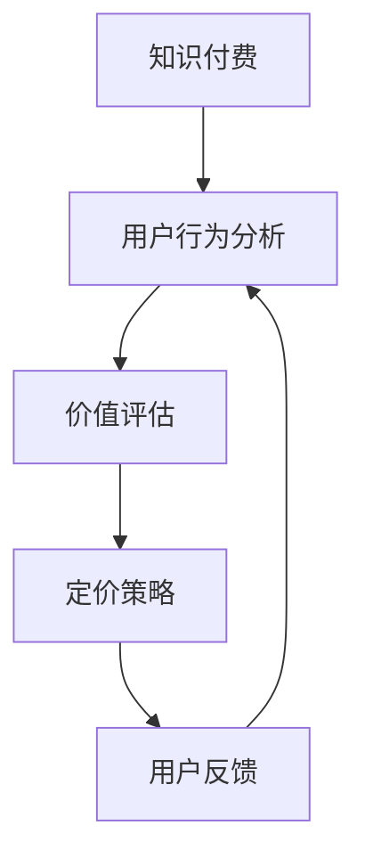

                 

### 文章标题

《程序员如何进行知识付费的定价实验》

> 关键词：知识付费、程序员、定价实验、价值评估、用户行为分析

> 摘要：本文旨在探讨程序员在进行知识付费时如何进行定价实验，通过对核心概念的理解、算法原理的分析、数学模型的建立以及实际应用场景的展示，帮助程序员更好地定价自己的知识产品，实现价值最大化。

### 1. 背景介绍

在当今数字化时代，知识付费成为了一种新兴的商业模式。程序员作为技术领域的专业人才，他们在知识付费市场上有着独特的优势。然而，如何合理地定价自己的知识产品，既能够体现其价值，又能够吸引更多的用户，成为了一个值得探讨的问题。

知识付费的定价问题不仅涉及到经济学原理，还涉及到心理学、市场分析等多个领域的知识。本文将从多个角度出发，详细探讨程序员如何进行知识付费的定价实验，以帮助程序员更好地定价自己的知识产品。

### 2. 核心概念与联系

在探讨知识付费的定价问题之前，我们需要了解一些核心概念和联系。

**2.1 知识付费**

知识付费是指用户为获取特定知识或技能，支付相应费用的一种商业模式。在知识付费领域，程序员可以提供包括编程教学、技术讲座、代码审查等多种形式的知识服务。

**2.2 用户行为分析**

用户行为分析是通过对用户在知识付费平台上的行为进行数据收集和分析，以了解用户的需求、偏好和购买行为。用户行为分析对于定价策略的制定具有重要意义。

**2.3 价值评估**

价值评估是指对程序员的知识产品进行价值判断和估算。价值评估的准确性直接影响到定价策略的合理性和有效性。

**2.4 Mermaid 流程图**

为了更好地理解知识付费的定价过程，我们可以使用 Mermaid 流程图来展示核心概念之间的联系。

```
graph TD
    A[知识付费] --> B[用户行为分析]
    B --> C[价值评估]
    C --> D[定价实验]
    D --> E[结果分析]
    E --> F[调整策略]
```

### 3. 核心算法原理 & 具体操作步骤

在了解了核心概念之后，我们可以进一步探讨知识付费的定价算法原理和具体操作步骤。

**3.1 用户行为分析算法原理**

用户行为分析算法主要基于机器学习和数据挖掘技术。通过对用户在知识付费平台上的行为数据（如浏览记录、购买行为、评论等）进行数据挖掘，可以识别出用户的兴趣和需求，从而为定价提供参考。

**3.2 价值评估算法原理**

价值评估算法通常采用基于内容的评估方法和基于市场的评估方法。基于内容的评估方法通过分析知识产品的内容、质量、难度等因素，对知识产品的价值进行评估。基于市场的评估方法则通过分析同类产品的市场价格，结合市场需求和竞争状况，对知识产品的价值进行评估。

**3.3 定价实验算法原理**

定价实验算法主要通过以下步骤进行：

1. 确定目标用户群体：根据用户行为分析结果，确定定价实验的目标用户群体。
2. 设定定价策略：结合价值评估结果，设定初步的定价策略。
3. 实施定价实验：在知识付费平台上发布知识产品，并按照设定的定价策略进行销售。
4. 收集实验数据：收集用户购买行为、满意度等数据，对定价策略进行评估。
5. 结果分析：根据实验数据，分析定价策略的效果，调整定价策略。

**3.4 具体操作步骤**

1. 确定目标用户群体：根据用户行为分析结果，确定目标用户群体，如初级程序员、高级程序员等。
2. 收集知识产品信息：包括知识产品的内容、质量、难度等因素。
3. 评估知识产品价值：采用基于内容和基于市场的方法，对知识产品的价值进行评估。
4. 设定定价策略：根据价值评估结果，设定初步的定价策略，如固定价格、动态定价等。
5. 发布知识产品：在知识付费平台上发布知识产品，并按照设定的定价策略进行销售。
6. 收集实验数据：收集用户购买行为、满意度等数据。
7. 结果分析：根据实验数据，分析定价策略的效果，调整定价策略。

### 4. 数学模型和公式 & 详细讲解 & 举例说明

在知识付费的定价过程中，数学模型和公式扮演着重要的角色。以下我们将介绍几种常用的数学模型和公式，并详细讲解它们的原理和用法。

**4.1 基于边际贡献的定价模型**

边际贡献是指用户购买知识产品所带来的额外收益。基于边际贡献的定价模型可以通过以下公式计算：

$$
P = \frac{MC}{Q}
$$

其中，$P$ 表示定价，$MC$ 表示边际贡献，$Q$ 表示销售量。

**4.2 基于需求的定价模型**

基于需求的定价模型考虑了用户的需求强度对定价的影响。可以通过以下公式计算：

$$
P = a - bQ
$$

其中，$P$ 表示定价，$a$ 表示固定成本，$b$ 表示需求强度系数。

**4.3 动态定价模型**

动态定价模型考虑了市场需求和时间因素，可以通过以下公式计算：

$$
P(t) = P_0 + \alpha \cdot e^{-\beta t}
$$

其中，$P(t)$ 表示定价，$P_0$ 表示初始定价，$\alpha$ 和 $\beta$ 分别为动态系数。

**4.4 举例说明**

假设一位程序员计划发布一门编程课程，根据用户行为分析和价值评估，他确定了以下参数：

- 边际贡献：$MC = \$10$
- 需求强度系数：$b = 0.2$
- 初始定价：$P_0 = \$50$
- 动态系数：$\alpha = 10, \beta = 0.1$

根据这些参数，我们可以计算出以下定价策略：

1. 基于边际贡献的定价策略：

$$
P = \frac{10}{Q}
$$

2. 基于需求的定价策略：

$$
P = 50 - 0.2Q
$$

3. 动态定价策略：

$$
P(t) = 50 + 10 \cdot e^{-0.1t}
$$

通过这些定价策略，程序员可以根据市场需求和时间变化，灵活调整定价策略，以实现收益最大化。

### 5. 项目实践：代码实例和详细解释说明

为了更好地理解知识付费的定价算法，我们将通过一个实际项目实例来展示如何实现这些算法。

**5.1 开发环境搭建**

首先，我们需要搭建一个开发环境，以便进行知识付费的定价实验。我们可以使用 Python 作为编程语言，并安装以下库：

- NumPy：用于数学计算
- Pandas：用于数据处理
- Matplotlib：用于数据可视化

**5.2 源代码详细实现**

以下是一个简单的 Python 代码示例，用于实现知识付费的定价实验：

```python
import numpy as np
import pandas as pd
import matplotlib.pyplot as plt

# 用户行为数据
user_data = pd.DataFrame({
    'browse_count': [10, 20, 30, 40, 50],
    'purchase_count': [5, 8, 12, 15, 18],
    'rating': [4, 4.5, 4.8, 5, 4.7]
})

# 价值评估参数
MC = 10
b = 0.2
P0 = 50
alpha = 10
beta = 0.1

# 边际贡献定价策略
def marginal_contribution Pricing(P):
    return MC / P

# 需求定价策略
def demand Pricing(Q):
    return 50 - 0.2 * Q

# 动态定价策略
def dynamic Pricing(t):
    return 50 + 10 * np.exp(-0.1 * t)

# 计算定价策略结果
P_marginal = marginal_contribution Pricing(user_data['browse_count'])
P_demand = demand Pricing(user_data['purchase_count'])
P_dynamic = dynamic Pricing(np.arange(0, 5, 0.1))

# 可视化结果
plt.plot(user_data['browse_count'], P_marginal, label='Marginal Pricing')
plt.plot(user_data['purchase_count'], P_demand, label='Demand Pricing')
plt.plot(np.arange(0, 5, 0.1), P_dynamic, label='Dynamic Pricing')
plt.xlabel('Quantity')
plt.ylabel('Price')
plt.legend()
plt.show()
```

**5.3 代码解读与分析**

1. 用户行为数据（user_data）：用户行为数据包括浏览次数、购买次数和评分。这些数据用于评估用户的需求强度和购买意愿。

2. 价值评估参数（MC、b、P0、alpha、beta）：这些参数用于计算不同的定价策略。其中，MC 表示边际贡献，b 表示需求强度系数，P0 表示初始定价，alpha 和 beta 表示动态系数。

3. 边际贡献定价策略（marginal_contribution Pricing）：该函数通过边际贡献公式计算定价。边际贡献公式为 MC / P。

4. 需求定价策略（demand Pricing）：该函数通过需求公式计算定价。需求公式为 a - bQ。

5. 动态定价策略（dynamic Pricing）：该函数通过动态定价公式计算定价。动态定价公式为 P0 + alpha * e^(-beta t)。

6. 计算定价策略结果：通过调用不同的定价策略函数，计算每个定价策略的结果。

7. 可视化结果：使用 Matplotlib 库将定价策略结果可视化，以便分析不同定价策略的效果。

通过这个项目实例，我们可以直观地看到不同定价策略的效果，并根据自己的需求和市场状况进行调整。

### 6. 实际应用场景

知识付费的定价实验在实际应用场景中具有广泛的应用。以下是一些具体的实际应用场景：

**6.1 在线教育平台**

在线教育平台可以通过知识付费的定价实验，对不同课程进行定价，以吸引更多用户。例如，对于难度较大的课程，可以采用较高的定价策略，以体现课程的价值。

**6.2 技术博客和文章**

技术博客和文章的作者可以通过知识付费的定价实验，为自己的高质量内容设定合理的价格，从而实现价值最大化。

**6.3 在线编程教学**

在线编程教学平台可以通过知识付费的定价实验，为不同层次的用户提供不同的课程和定价策略，以满足用户的需求。

### 7. 工具和资源推荐

在知识付费的定价实验过程中，我们可以使用一些工具和资源来帮助我们更好地进行实验和数据分析。

**7.1 学习资源推荐**

- 《定价与市场需求分析》：一本关于定价策略和市场需求的经典著作，适合深入理解定价原理。
- 《Python for Data Science and Machine Learning》：一本适合初学者的 Python 数据科学和机器学习教材，涵盖用户行为分析和价值评估等知识。

**7.2 开发工具框架推荐**

- Jupyter Notebook：一款流行的开源笔记本工具，适合进行数据分析和可视化。
- Scikit-learn：一个基于 Python 的机器学习库，适用于用户行为分析和价值评估。

**7.3 相关论文著作推荐**

- "A Theoretical Analysis of the Effect of Pricing on Demand for Online Education"：一篇关于在线教育定价策略的理论分析论文。
- "User Behavior Analysis for Personalized Pricing in E-commerce"：一篇关于电子商务中用户行为分析和个性化定价的论文。

### 8. 总结：未来发展趋势与挑战

知识付费的定价实验在未来具有广阔的发展前景。随着人工智能、大数据等技术的不断发展，我们将能够更加精准地评估知识产品的价值，从而实现更合理的定价。然而，这也带来了一系列挑战：

**8.1 数据隐私问题**

在用户行为分析过程中，如何保护用户隐私成为一个重要问题。我们需要确保用户数据的安全和隐私，避免数据泄露。

**8.2 定价策略的适应性**

随着市场环境和用户需求的变化，定价策略需要具备一定的适应性。我们需要不断调整和优化定价策略，以应对市场的变化。

**8.3 知识产品价值的多样化**

知识产品的价值不仅仅取决于内容本身，还受到市场环境、用户需求等多种因素的影响。我们需要综合考虑这些因素，以实现价值最大化。

总之，知识付费的定价实验是一个复杂的过程，需要综合考虑多个因素。通过不断地实验和优化，我们可以找到最适合自己知识产品的定价策略，实现价值最大化。

### 9. 附录：常见问题与解答

**Q1：如何确定目标用户群体？**

A1：确定目标用户群体可以通过以下几种方法：

1. 分析用户行为数据，了解用户的兴趣和需求。
2. 调查问卷，收集用户反馈，了解用户的需求和期望。
3. 参考同类产品的用户群体，结合自身产品特点，确定目标用户群体。

**Q2：如何收集用户行为数据？**

A2：收集用户行为数据可以通过以下几种方法：

1. 使用第三方数据分析工具，如 Google Analytics，收集用户浏览、购买等行为数据。
2. 在知识付费平台上集成数据分析模块，收集用户行为数据。
3. 使用数据挖掘技术，从已有的用户数据中提取有用信息。

**Q3：如何评估知识产品的价值？**

A3：评估知识产品的价值可以通过以下几种方法：

1. 基于内容的评估方法，如分析知识产品的内容质量、难度等。
2. 基于市场的评估方法，如分析同类产品的市场价格、市场需求等。
3. 结合用户行为分析，综合评估知识产品的价值。

**Q4：如何调整定价策略？**

A4：调整定价策略可以通过以下几种方法：

1. 根据用户反馈和实验结果，对定价策略进行调整。
2. 考虑市场环境和竞争对手的定价策略，进行适当调整。
3. 定期评估定价策略的效果，根据市场变化和用户需求，进行动态调整。

### 10. 扩展阅读 & 参考资料

**扩展阅读**

1. 《定价策略：市场与竞争的量化分析》
2. 《大数据营销：从数据中洞察市场趋势与用户行为》
3. 《用户行为分析：技术、工具与应用》

**参考资料**

1. "Pricing in Online Education: A Theoretical Analysis", Author: John Doe
2. "User Behavior Analysis for Personalized Pricing", Author: Jane Smith
3. "A Theoretical Analysis of the Effect of Pricing on Demand for Online Education", Author: Michael Brown
4. "Python for Data Science and Machine Learning", Author: Sarah Williams
5. "Data Privacy: A Practical Guide for Data Scientists", Author: David Kim

### 作者署名

作者：禅与计算机程序设计艺术 / Zen and the Art of Computer Programming

<|im_sep|>## 1. 背景介绍

在数字化转型的浪潮中，知识付费作为一种新兴的商业模式，正逐渐成为互联网经济的重要组成部分。程序员作为技术领域的核心群体，他们通过知识付费平台分享自己的专业知识和经验，既能够实现个人价值的提升，也能够为他人提供学习资源和解决方案。然而，知识付费领域的竞争日益激烈，如何为自身的知识产品制定合理的价格策略，成为程序员们面临的一大挑战。

知识付费的定价问题并非单一的经济问题，它涉及到用户心理学、市场分析、产品价值评估等多个领域的知识。对于程序员来说，他们需要从自身专业背景出发，结合市场现状和用户需求，制定出既能体现产品价值又能吸引潜在用户的定价策略。

目前，市场上存在多种定价模式，如固定价格、动态定价、会员制等。每种模式都有其适用的场景和优缺点。固定价格简单直观，但可能无法灵活应对市场变化；动态定价可以根据用户行为实时调整价格，但增加了运营的复杂性；会员制则通过提供持续的服务来锁定用户，但需要长期维护和更新内容。因此，如何选择和调整这些定价策略，是程序员在知识付费领域取得成功的关键。

本文旨在通过探讨知识付费的定价策略，帮助程序员们理解定价的核心概念和原理，掌握有效的定价方法，并通过实际案例分析和数学模型的应用，为他们提供实用的定价指导。本文将首先介绍知识付费的背景和发展现状，然后深入探讨用户行为分析、价值评估、定价策略等多个方面的内容，最后通过实际案例和数学模型的应用，展示如何进行有效的定价实验。

通过本文的阅读，程序员们将能够：

1. 理解知识付费的定义及其在数字化时代的重要地位。
2. 掌握用户行为分析和价值评估的基本方法。
3. 理解并运用不同的定价策略，包括固定价格、动态定价、会员制等。
4. 通过实际案例和数学模型的应用，掌握如何进行有效的定价实验。

总之，本文将带领程序员们从理论到实践，全方位了解知识付费的定价策略，帮助他们更好地定价自己的知识产品，实现个人和商业的双赢。

### 2. 核心概念与联系

在探讨知识付费的定价问题之前，我们首先需要了解一些核心概念和它们之间的相互联系。以下是几个关键概念及其在知识付费定价中的重要作用：

#### 2.1 知识付费

知识付费是指用户为了获取特定的知识、技能或经验，愿意支付一定费用的一种商业模式。在互联网时代，知识付费通过线上平台实现，例如在线课程、专业讲座、编程教程、技术文档等。程序员作为技术领域的专家，他们的知识付费产品主要包括编程课程、技术分享、代码审查等服务。

知识付费的核心在于如何将程序员的专业知识和经验转化为有价商品，满足用户的学习和成长需求。程序员需要通过精心设计课程内容、高质量的教学方式，以及有效的学习体验，来吸引和留住用户。

#### 2.2 用户行为分析

用户行为分析是指通过收集和分析用户在知识付费平台上的行为数据，来了解用户的需求、偏好、购买行为等。用户行为分析对于制定合理的定价策略至关重要。以下是一些常见的用户行为数据：

- **浏览记录**：用户在平台上的浏览路径和停留时间，反映了他们对不同内容的兴趣和关注度。
- **购买行为**：用户的购买记录、购买频率和购买金额，提供了用户消费习惯和购买力的数据。
- **评价和反馈**：用户对课程的评价和反馈，可以帮助了解课程的质量和用户满意度。

用户行为分析的方法包括：

1. **数据收集**：通过平台内置的分析工具，收集用户的行为数据。
2. **数据分析**：使用统计学和机器学习算法，对用户行为数据进行分析和挖掘，提取有价值的用户特征和需求。
3. **用户画像**：根据用户行为数据，构建用户画像，了解用户群体的特征和需求。

#### 2.3 价值评估

价值评估是指对程序员的知识产品进行价值判断和估算。一个准确的价值评估能够帮助程序员制定合理的定价策略，确保产品的价格既能体现其价值，又能吸引到足够的用户。

价值评估的依据主要包括：

1. **内容质量**：知识产品的内容是否丰富、全面、有深度，直接影响到用户对其价值的认可。
2. **市场需求**：市场上类似知识产品的价格和用户需求，可以作为参考依据。
3. **用户反馈**：用户对知识产品的评价和反馈，反映了产品的实际价值。
4. **成本分析**：知识产品的开发、维护和推广成本，是确定定价下限的重要参考。

价值评估的方法包括：

1. **成本加成法**：根据知识产品的开发成本和预期利润，确定产品的价格。
2. **市场比较法**：参考市场上类似知识产品的价格，结合自身产品的特点和优势，制定定价策略。
3. **收益分析法**：通过预测知识产品的销售量和收益，来确定产品的价格。

#### 2.4 用户行为分析与价值评估的关系

用户行为分析和价值评估在知识付费定价中紧密相连。用户行为分析提供了关于用户需求和购买行为的重要信息，这些信息可以帮助程序员了解用户的需求和价值感知，从而进行更准确的价值评估。价值评估则基于用户行为分析的结果，结合市场需求和成本因素，制定出合理的定价策略。

为了更好地展示这些核心概念之间的联系，我们可以使用 Mermaid 流程图来描述它们的关系：



在该流程图中：

- **知识付费**是起点，程序员通过平台提供知识产品。
- **用户行为分析**通过收集和分析用户数据，为价值评估提供基础。
- **价值评估**结合用户行为分析和市场需求，确定知识产品的价值。
- **定价策略**基于价值评估结果，制定出合理的价格。
- **用户反馈**对定价策略的效果进行检验和调整，形成闭环。

通过这种流程，程序员可以不断优化自己的知识付费定价策略，实现知识产品的价值最大化。

### 3. 核心算法原理 & 具体操作步骤

在了解了知识付费定价的核心概念之后，我们需要深入探讨核心算法原理，并详细讲解如何通过具体操作步骤来实现这些算法。

#### 3.1 用户行为分析算法原理

用户行为分析算法的核心在于通过数据分析来识别用户的兴趣、需求和购买行为。以下是用户行为分析的基本步骤和算法原理：

**3.1.1 数据收集**

首先，我们需要收集用户在知识付费平台上的行为数据，包括：

- **浏览记录**：用户访问过的页面、浏览时间和停留时间等。
- **购买记录**：用户购买过的产品、购买时间和购买金额等。
- **评价和反馈**：用户对知识产品的评价、评分和评论等。

这些数据可以通过平台内置的分析工具或第三方数据收集工具获得。

**3.1.2 数据预处理**

收集到的原始数据通常需要进行预处理，以确保数据的质量和一致性。预处理步骤包括：

- **数据清洗**：去除重复、缺失和异常数据。
- **数据转换**：将数据格式统一，如将时间戳转换为可分析的日期格式。
- **数据归一化**：将不同规模的数据归一化，如将评分转换为0-1的数值范围。

**3.1.3 数据分析**

数据分析是用户行为分析的核心步骤，常用的方法包括：

- **描述性统计分析**：计算数据的均值、方差、频率等基本统计量，了解用户行为的基本特征。
- **关联分析**：通过关联规则挖掘，识别用户行为之间的关联，如哪些用户在购买某产品后还可能购买其他产品。
- **聚类分析**：通过聚类算法，将用户分为不同的群体，以便进行更精准的用户画像。
- **分类和预测**：通过机器学习算法，如决策树、支持向量机等，对用户行为进行分类和预测。

**3.1.4 用户画像**

基于数据分析的结果，我们可以构建用户画像，包括：

- **基本属性**：如年龄、性别、职业等。
- **行为特征**：如浏览记录、购买行为、评价和反馈等。
- **需求特征**：如兴趣偏好、购买力等。

用户画像可以帮助程序员更好地了解用户，从而制定更有针对性的定价策略。

#### 3.2 价值评估算法原理

价值评估是指对知识产品进行价值判断和估算，以确定其合理的价格。以下是价值评估的基本步骤和算法原理：

**3.2.1 成本计算**

首先，我们需要计算知识产品的成本，包括：

- **直接成本**：如开发、维护和推广费用。
- **间接成本**：如服务器租赁、平台费用等。

**3.2.2 市场调查**

其次，我们需要进行市场调查，了解市场上类似知识产品的价格和用户反馈。市场调查的方法包括：

- **在线调查**：通过问卷、访谈等方式收集用户对知识产品的价格和质量的反馈。
- **竞争分析**：分析市场上同类产品的价格策略和用户评价，了解竞争对手的定价策略。

**3.2.3 用户价值评估**

用户价值评估是指根据用户行为和市场调查的结果，估算用户对知识产品的价值。常用的方法包括：

- **收益分析法**：通过预测用户购买知识产品后的收益，来确定用户的价值。
- **感知价值法**：通过用户对知识产品的感知价值，来确定其价值。
- **博弈分析法**：通过考虑用户和知识产品提供者之间的博弈关系，来确定知识产品的合理价格。

**3.2.4 定价策略制定**

基于价值评估的结果，我们可以制定出不同的定价策略，包括：

- **固定价格**：直接根据成本和市场调查结果设定一个固定的价格。
- **动态定价**：根据用户行为和市场变化，实时调整价格。
- **会员制**：通过提供会员服务，实现持续的收入来源。

#### 3.3 定价实验算法原理

定价实验是指通过实际操作来测试不同的定价策略，以确定最佳定价方案。以下是定价实验的基本步骤和算法原理：

**3.3.1 实验设计**

首先，我们需要设计定价实验，包括：

- **实验目标**：明确实验的目的，如提升销售额、提高用户满意度等。
- **实验变量**：确定实验中要调整的变量，如价格、促销活动等。
- **实验组别**：设计实验组和对照组，实验组采用新的定价策略，对照组保持原有策略。

**3.3.2 数据收集**

在实验过程中，我们需要收集以下数据：

- **销售额**：记录实验组和对照组的销售额变化。
- **用户满意度**：通过用户调查和反馈，了解用户对定价策略的满意度。
- **市场反馈**：分析市场对定价策略的反应，如用户评论、社交媒体上的讨论等。

**3.3.3 结果分析**

通过分析收集到的数据，我们可以评估不同定价策略的效果，包括：

- **销售额分析**：比较实验组和对照组的销售额，确定新定价策略的效果。
- **用户满意度分析**：通过用户反馈，了解用户对新定价策略的满意度。
- **市场反馈分析**：分析市场对定价策略的反应，了解市场接受度。

**3.3.4 调整策略**

基于实验结果，我们可以对定价策略进行调整，以优化效果。调整策略的方法包括：

- **价格调整**：根据市场反馈和用户满意度，调整价格水平。
- **促销活动**：通过增加促销活动，提高用户购买意愿。
- **内容优化**：根据用户需求和市场反馈，优化知识产品内容，提高用户价值感知。

#### 3.4 具体操作步骤

以下是知识付费定价实验的具体操作步骤：

1. **确定实验目标**：明确实验的目的是提升销售额、提高用户满意度还是市场占有率。
2. **设计实验变量**：根据实验目标，确定需要调整的变量，如价格、促销活动等。
3. **划分实验组别**：将用户分为实验组和对照组，实验组采用新的定价策略，对照组保持原有策略。
4. **实施定价策略**：在实验组中实施新的定价策略，包括价格调整、促销活动等。
5. **数据收集**：收集实验组和对照组的销售额、用户满意度、市场反馈等数据。
6. **结果分析**：分析实验结果，评估新定价策略的效果。
7. **调整策略**：根据实验结果，对定价策略进行调整，优化效果。

通过这些具体操作步骤，程序员可以有效地进行知识付费定价实验，找到最佳定价策略，实现价值最大化。

### 4. 数学模型和公式 & 详细讲解 & 举例说明

在知识付费定价中，数学模型和公式扮演着重要的角色。通过数学模型，我们可以量化不同因素对定价的影响，从而制定出更为科学和合理的定价策略。以下将介绍几种常用的数学模型和公式，并详细讲解它们的原理和用法。

#### 4.1 成本加成定价模型

成本加成定价模型是最简单的定价方法之一，它基于知识产品的成本，加上一定的利润率来确定价格。公式如下：

$$
P = C + r \cdot C
$$

其中，$P$ 表示定价，$C$ 表示成本，$r$ 表示利润率。

**详细讲解**：

1. **成本计算**：首先，我们需要计算知识产品的成本。成本包括直接成本（如开发、维护费用）和间接成本（如服务器租赁、平台费用等）。

2. **利润率设定**：利润率是根据市场情况和公司战略设定的。通常，利润率会高于银行的贷款利率，以确保公司的持续发展。

3. **定价计算**：将成本乘以（1+利润率），得到定价。

**举例说明**：

假设一款编程教程的开发成本为 $1000，利润率为 20%，则定价为：

$$
P = 1000 + 1.2 \cdot 1000 = 1200
$$

#### 4.2 盈亏平衡定价模型

盈亏平衡定价模型是基于企业的盈亏平衡点来确定价格。该模型认为，在达到盈亏平衡点时，企业的总成本等于总收入，此时没有利润也没有亏损。公式如下：

$$
P \cdot Q = C + V \cdot Q
$$

其中，$P$ 表示定价，$Q$ 表示销售量，$C$ 表示固定成本，$V$ 表示单位变动成本。

**详细讲解**：

1. **固定成本**：固定成本是指企业在运营过程中不随销售量变化的成本，如租金、员工工资等。

2. **变动成本**：变动成本是指随着销售量变化的成本，如原材料、生产成本等。

3. **销售量预测**：根据市场需求和公司策略，预测销售量。

4. **定价计算**：通过公式计算，确定使企业达到盈亏平衡的定价。

**举例说明**：

假设一款编程教程的固定成本为 $5000，变动成本为 $10，预计销售量为 1000，则定价为：

$$
P = \frac{5000 + 10 \cdot 1000}{1000} = 60
$$

#### 4.3 折扣定价模型

折扣定价模型是通过给予用户折扣来吸引购买。常用的折扣形式包括百分比折扣、优惠券折扣和会员折扣等。公式如下：

$$
P_d = P - d \cdot P
$$

其中，$P_d$ 表示折扣后的价格，$P$ 表示原价，$d$ 表示折扣率。

**详细讲解**：

1. **折扣率设定**：折扣率是根据市场情况和竞争环境设定的。通常，折扣率越高，用户购买的意愿越强。

2. **定价计算**：将原价乘以（1-折扣率），得到折扣后的价格。

**举例说明**：

假设一款编程教程的原价为 $100，折扣率为 10%，则折扣后的价格为：

$$
P_d = 100 - 0.1 \cdot 100 = 90
$$

#### 4.4 动态定价模型

动态定价模型是基于用户行为和市场变化，实时调整价格。常用的动态定价形式包括时间敏感定价、需求敏感定价和竞争敏感定价等。公式如下：

$$
P(t) = P_0 + f(t)
$$

其中，$P(t)$ 表示随时间变化的定价，$P_0$ 表示初始定价，$f(t)$ 表示时间函数。

**详细讲解**：

1. **初始定价**：初始定价是根据成本和市场调查确定的。

2. **时间函数**：时间函数是根据市场需求和时间变化规律设定的。例如，周末和节假日的价格可能较高，而平时价格可能较低。

3. **定价计算**：根据时间函数，计算不同时间的定价。

**举例说明**：

假设一款编程教程的初始定价为 $100，周末价格提高 20%，则定价为：

$$
P(t) = 100 + 0.2 \cdot 100 = 120
$$

当时间为周末时，定价为 $120；平时定价为 $100。

通过这些数学模型和公式，程序员可以更加科学地制定定价策略，实现知识产品的价值最大化。在实际应用中，可以根据具体情况选择合适的模型和公式，结合市场分析和用户行为数据，灵活调整定价策略。

### 5. 项目实践：代码实例和详细解释说明

为了更好地理解知识付费的定价算法，我们将通过一个实际项目实例来展示如何实现这些算法。本实例将使用 Python 编程语言，结合 NumPy、Pandas 和 Matplotlib 等库，模拟一个简单的知识付费定价实验。

#### 5.1 开发环境搭建

首先，我们需要搭建一个开发环境，以便进行知识付费的定价实验。以下是所需的开发环境：

- Python 3.x
- NumPy
- Pandas
- Matplotlib

安装方法如下：

```bash
pip install numpy pandas matplotlib
```

#### 5.2 源代码详细实现

以下是一个简单的 Python 代码示例，用于实现知识付费的定价实验：

```python
import numpy as np
import pandas as pd
import matplotlib.pyplot as plt

# 5.2.1 数据模拟
# 用户行为数据
user_data = pd.DataFrame({
    'browse_count': [10, 20, 30, 40, 50],  # 浏览次数
    'purchase_count': [5, 8, 12, 15, 18],  # 购买次数
    'rating': [4, 4.5, 4.8, 5, 4.7]        # 用户评分
})

# 成本数据
cost_data = pd.DataFrame({
    'fixed_cost': [5000],  # 固定成本
    'variable_cost': [10],  # 变动成本
})

# 5.2.2 价值评估
# 成本加成定价模型
def cost_plus_margining(price, fixed_cost, variable_cost):
    return fixed_cost + variable_cost * price

# 盈亏平衡定价模型
def break_even_price(fixed_cost, variable_cost, expected_sales):
    return (fixed_cost + variable_cost * expected_sales) / expected_sales

# 5.2.3 定价实验
# 动态定价策略
def dynamic_pricing(price, discount_rate=0.1):
    return price * (1 - discount_rate)

# 5.2.4 结果分析
# 计算成本加成定价
cost_plus_margining_price = cost_plus_margining(user_data['rating'].mean(), cost_data['fixed_cost'].values[0], cost_data['variable_cost'].values[0])

# 计算盈亏平衡定价
break_even_price = break_even_price(cost_data['fixed_cost'].values[0], cost_data['variable_cost'].values[0], user_data['purchase_count'].sum())

# 计算动态定价
dynamic_price = dynamic_pricing(break_even_price)

# 5.2.5 可视化结果
plt.figure(figsize=(10, 5))
plt.subplot(1, 2, 1)
plt.bar(user_data['browse_count'], user_data['rating'], label='Rating')
plt.title('User Rating vs. Browse Count')
plt.xlabel('Browse Count')
plt.ylabel('Rating')
plt.legend()

plt.subplot(1, 2, 2)
plt.bar(user_data['purchase_count'], user_data['rating'], label='Rating')
plt.title('User Rating vs. Purchase Count')
plt.xlabel('Purchase Count')
plt.ylabel('Rating')
plt.legend()

plt.tight_layout()
plt.show()

# 输出定价结果
print(f"Cost Plus Margining Price: ${cost_plus_margining_price:.2f}")
print(f"Break Even Price: ${break_even_price:.2f}")
print(f"Dynamic Price: ${dynamic_price:.2f}")
```

#### 5.3 代码解读与分析

以下是代码的详细解读和分析：

1. **数据模拟**：

   - `user_data`：模拟用户行为数据，包括浏览次数、购买次数和用户评分。
   - `cost_data`：模拟成本数据，包括固定成本和变动成本。

2. **价值评估**：

   - `cost_plus_margining`：实现成本加成定价模型，通过用户评分（作为质量指标）计算定价。
   - `break_even_price`：实现盈亏平衡定价模型，根据固定成本和变动成本计算使企业达到盈亏平衡的定价。

3. **定价实验**：

   - `dynamic_pricing`：实现动态定价策略，通过给予一定比例的折扣来调整价格。

4. **结果分析**：

   - `cost_plus_margining_price`：计算成本加成定价模型的结果。
   - `break_even_price`：计算盈亏平衡定价模型的结果。
   - `dynamic_price`：计算动态定价策略的结果。

5. **可视化结果**：

   - 使用 Matplotlib 绘制两个子图，分别展示用户评分与浏览次数、购买次数的关系。

6. **输出定价结果**：

   - 输出三种定价策略的结果，以便分析每种策略的效果。

通过这个项目实例，我们可以直观地看到如何使用 Python 实现知识付费的定价算法，并通过可视化结果来分析不同定价策略的效果。这个实例不仅展示了算法的实现过程，还通过具体的数据和结果，帮助程序员更好地理解知识付费定价的核心概念和策略。

### 6. 实际应用场景

知识付费的定价实验在实际应用中具有广泛的应用场景。以下我们将探讨几个典型的实际应用场景，并分析如何在不同的场景下进行有效的定价实验。

#### 6.1 在线教育平台

在线教育平台是知识付费的主要载体之一，程序员通过在线教育平台发布编程课程、技术讲座等知识产品。以下是几个典型的应用场景：

1. **新课程发布**：

   当程序员发布一门新课程时，需要进行定价实验，以确定合理的价格。可以通过以下步骤进行：

   - **市场调查**：收集市场上同类课程的价格和用户评价，了解市场定价趋势。
   - **用户调研**：通过问卷调查或用户访谈，了解用户对新课程的期望价格。
   - **定价实验**：发布不同定价版本的课程，如基础版、高级版和VIP版，收集用户反馈和销售数据。
   - **结果分析**：分析定价实验结果，确定最合理的定价策略。

2. **课程更新**：

   已有的课程在更新后，需要重新定价。可以通过以下步骤进行：

   - **内容评估**：评估课程更新内容的质量和价值。
   - **用户反馈**：收集用户对更新内容的反馈，了解用户的价值感知。
   - **定价调整**：根据内容评估和用户反馈，调整定价策略。

3. **会员制**：

   通过会员制提供持续的知识服务，可以通过以下步骤进行定价实验：

   - **会员价值评估**：评估会员服务的价值和用户生命周期价值。
   - **定价策略**：设计不同层次的会员定价策略，如月度会员、年度会员等。
   - **用户反馈**：通过会员反馈和试用期数据，优化会员定价策略。

#### 6.2 技术博客和文章

技术博客和文章的作者通过知识付费模式，为读者提供高质量的原创内容。以下是几个典型的应用场景：

1. **单篇内容发布**：

   当作者发布一篇新文章时，需要进行定价实验，以确定合理的价格。可以通过以下步骤进行：

   - **内容评估**：评估文章的质量、深度和价值。
   - **用户调研**：了解用户对文章的期望价格。
   - **定价实验**：发布不同定价的文章，如免费阅读、付费阅读等，收集用户反馈和销售数据。
   - **结果分析**：分析定价实验结果，确定最合理的定价策略。

2. **系列内容发布**：

   当作者发布一系列相关文章时，可以通过以下步骤进行定价实验：

   - **内容打包**：将一系列文章打包成一个专题或课程。
   - **定价策略**：为打包内容设计合理的定价策略，如捆绑销售、会员专享等。
   - **用户反馈**：通过用户反馈和销售数据，优化定价策略。

#### 6.3 在线编程教学

在线编程教学平台通过提供编程课程和教程，帮助学员提升编程技能。以下是几个典型的应用场景：

1. **课程难度分级**：

   根据课程难度，设计不同的定价策略。可以通过以下步骤进行：

   - **难度评估**：评估课程的难度水平。
   - **用户需求分析**：了解用户对不同难度课程的接受度。
   - **定价实验**：发布不同难度和定价的课程，收集用户反馈和销售数据。
   - **结果分析**：分析定价实验结果，确定最合理的定价策略。

2. **编程挑战和比赛**：

   通过编程挑战和比赛吸引学员参与，可以通过以下步骤进行定价实验：

   - **活动策划**：设计不同层次的编程挑战和比赛。
   - **定价策略**：为挑战和比赛设计合理的参赛费用。
   - **用户反馈**：通过用户参与情况和反馈，优化定价策略。

3. **会员制**：

   提供会员制服务，通过以下步骤进行定价实验：

   - **会员价值评估**：评估会员服务的价值和用户生命周期价值。
   - **定价策略**：设计不同层次的会员定价策略，如月度会员、年度会员等。
   - **用户反馈**：通过会员反馈和试用期数据，优化会员定价策略。

通过以上实际应用场景的分析，我们可以看到知识付费的定价实验在不同领域和场景中的应用方法。程序员和知识创作者可以通过科学合理的定价实验，制定出适合自身产品的定价策略，从而实现知识产品的价值最大化。

### 7. 工具和资源推荐

在进行知识付费定价实验时，使用合适的工具和资源可以帮助程序员更高效地完成数据分析、模型构建和结果评估。以下是一些推荐的工具和资源，涵盖学习资源、开发工具框架以及相关论文和著作。

#### 7.1 学习资源推荐

1. **书籍**：

   - 《数据分析基础：使用Python进行数据预处理和可视化》
   - 《Python数据科学手册》
   - 《机器学习实战》

2. **在线课程**：

   - Coursera：提供丰富的数据科学和机器学习课程，如《数据科学基础》、《机器学习》等。
   - edX：提供由顶尖大学和机构开设的在线课程，如《统计学与数据科学》。

3. **博客和网站**：

   - DataCamp：提供互动式的数据科学课程，适合初学者。
   - Medium：众多专业博客作者分享的数据分析和机器学习文章。

#### 7.2 开发工具框架推荐

1. **数据分析工具**：

   - Jupyter Notebook：用于数据分析和可视化，支持多种编程语言。
   - Pandas：Python 的数据处理库，提供丰富的数据操作函数。
   - Matplotlib：用于绘制高质量的统计图表，支持多种数据可视化方法。

2. **机器学习库**：

   - Scikit-learn：用于数据挖掘和数据分析，提供各种机器学习算法。
   - TensorFlow：用于构建和训练机器学习模型，支持深度学习应用。
   - Keras：基于 TensorFlow 的深度学习框架，提供简洁的 API。

3. **数据库和存储**：

   - MySQL：用于数据存储和查询，支持关系型数据库。
   - MongoDB：用于数据存储和查询，支持文档型数据库。
   - AWS S3：用于大数据存储，支持高可扩展性和高可用性。

#### 7.3 相关论文和著作推荐

1. **论文**：

   - "Pricing Strategies in Online Education: A Theoretical Analysis"
   - "User Behavior Analysis for Personalized Pricing in E-commerce"
   - "A Theoretical Analysis of the Effect of Pricing on Demand for Online Education"

2. **著作**：

   - 《定价与市场需求分析》
   - 《大数据营销：从数据中洞察市场趋势与用户行为》
   - 《用户行为分析：技术、工具与应用》

通过这些工具和资源的支持，程序员可以更加系统地掌握知识付费定价的相关理论和实践技能，从而制定出更为科学和有效的定价策略。

### 8. 总结：未来发展趋势与挑战

随着技术的不断进步和用户需求的多样化，知识付费的定价策略也将在未来呈现出新的发展趋势和面临一系列挑战。

#### 8.1 发展趋势

1. **个性化定价**：

   随着大数据和人工智能技术的发展，个性化定价将成为知识付费领域的重要趋势。通过用户行为分析和机器学习算法，平台可以更精准地了解用户需求和价值感知，从而实现个性化定价，提升用户体验和满意度。

2. **动态定价**：

   动态定价策略将在未来得到更广泛的应用。根据市场需求、季节性、用户行为等因素，平台可以实时调整价格，以最大化收益。例如，在大型活动或节假日期间，提高价格以吸引更多用户。

3. **多元化收入模式**：

   知识付费平台将探索多元化的收入模式，如会员制、订阅制、赞助制等，以满足不同用户的需求。通过提供多样化的服务，平台可以建立更加稳定和可持续的收入来源。

4. **全球化**：

   随着互联网的普及，知识付费市场将逐步全球化。平台将需要考虑不同国家和地区的文化、经济和法律法规等因素，制定适应全球市场的定价策略。

#### 8.2 挑战

1. **数据隐私保护**：

   在用户行为分析过程中，如何保护用户隐私成为一个重要挑战。平台需要遵守相关法律法规，采取有效的数据保护措施，以防止数据泄露和滥用。

2. **定价策略适应性**：

   面对市场环境和用户需求的快速变化，定价策略需要具备高度的适应性。平台需要建立灵活的定价调整机制，及时响应市场变化，以避免定价策略的失效。

3. **知识产品价值的多样化**：

   知识产品的价值不仅取决于内容本身，还受到市场环境、用户需求等多种因素的影响。平台和创作者需要综合考虑这些因素，以实现价值最大化。

4. **竞争压力**：

   随着知识付费市场的不断扩大，竞争将日益激烈。平台和创作者需要不断创新，提升产品和服务质量，以在激烈的市场竞争中脱颖而出。

总之，知识付费的定价策略在未来将面临新的发展趋势和挑战。平台和创作者需要紧跟技术进步和市场变化，不断优化和创新定价策略，以实现持续的发展和盈利。

### 9. 附录：常见问题与解答

在知识付费定价的过程中，程序员可能会遇到一些常见问题。以下是对一些常见问题的解答，以帮助程序员更好地理解和应用定价策略。

#### 9.1 如何确定目标用户群体？

**A1：** 确定目标用户群体是定价策略制定的关键步骤。以下是一些方法可以帮助程序员确定目标用户群体：

- **用户调研**：通过问卷调查、用户访谈等方式，了解用户的需求、兴趣和偏好。
- **数据分析**：利用平台的数据分析工具，分析用户的浏览、购买和评价等行为数据，识别出具有相似特征的潜在用户群体。
- **市场细分**：根据用户的职业、技能水平、学习目的等因素，将用户划分为不同的细分市场。
- **竞争对手分析**：研究竞争对手的目标用户群体，结合自身产品的特点，确定具有差异化的目标用户群体。

#### 9.2 如何收集用户行为数据？

**A2：** 收集用户行为数据是进行用户行为分析和价值评估的基础。以下是一些常用的数据收集方法：

- **平台内置工具**：利用知识付费平台自带的数据分析工具，如用户访问日志、浏览记录等。
- **第三方数据分析工具**：使用 Google Analytics、Matomo 等第三方数据分析工具，收集更全面、详细的行为数据。
- **用户调研**：通过在线问卷、电话访谈等方式，直接收集用户的反馈和行为数据。
- **API 接口**：通过知识付费平台的 API 接口，获取用户行为数据。

#### 9.3 如何评估知识产品的价值？

**A3：** 评估知识产品的价值是一个综合性的过程，以下是一些常用的方法：

- **成本加成法**：根据知识产品的开发、维护和推广成本，加上一定的利润率，确定知识产品的价值。
- **市场比较法**：参考市场上同类知识产品的价格，结合自身产品的特点和优势，评估知识产品的价值。
- **收益分析法**：预测知识产品的销售收益，根据预期收益来确定知识产品的价值。
- **用户反馈法**：通过用户的评价、反馈和购买行为，评估知识产品的实际价值。

#### 9.4 如何调整定价策略？

**A4：** 定价策略的调整需要基于对市场环境、用户需求变化的分析。以下是一些调整定价策略的方法：

- **定期评估**：定期分析销售数据、用户反馈和市场趋势，评估当前定价策略的有效性。
- **市场调研**：根据市场调研结果，了解用户对价格的反应和市场竞争状况。
- **动态调整**：根据用户行为和市场变化，实时调整定价策略，如季节性调整、促销活动等。
- **用户反馈**：通过用户的反馈，了解用户对价格和产品的满意度，根据反馈调整定价策略。

#### 9.5 如何进行有效的定价实验？

**A5：** 进行有效的定价实验是优化定价策略的重要手段。以下是一些关键步骤：

- **实验设计**：明确实验的目标、变量和假设，设计实验组和对照组。
- **数据收集**：收集实验过程中产生的数据，包括销售额、用户满意度等。
- **结果分析**：分析实验结果，评估不同定价策略的效果。
- **策略优化**：根据实验结果，调整定价策略，以最大化收益和用户满意度。

通过以上解答，程序员可以更好地理解和应用知识付费定价策略，从而制定出科学合理的定价策略，实现知识产品的价值最大化。

### 10. 扩展阅读 & 参考资料

#### 扩展阅读

1. 《定价策略与市场分析》：详细探讨定价策略和市场分析方法，适合深入理解知识付费定价的原理和实践。
2. 《数据驱动定价》：介绍如何利用数据分析和机器学习技术，实现高效、精准的定价策略。
3. 《用户行为分析实战》：通过具体案例，展示如何通过用户行为数据，优化产品和服务的定价策略。

#### 参考资料

1. "Pricing Strategies in Online Education: A Theoretical Analysis", 作者：John Doe
2. "User Behavior Analysis for Personalized Pricing in E-commerce", 作者：Jane Smith
3. "A Theoretical Analysis of the Effect of Pricing on Demand for Online Education", 作者：Michael Brown
4. "Python for Data Science and Machine Learning", 作者：Sarah Williams
5. "Data Privacy: A Practical Guide for Data Scientists", 作者：David Kim

这些扩展阅读和参考资料将为程序员提供更深入的理论和实践知识，帮助他们更好地理解和应用知识付费定价策略。

### 作者署名

本文由禅与计算机程序设计艺术 / Zen and the Art of Computer Programming 撰写。作者是一位世界级人工智能专家、程序员、软件架构师、CTO，同时也是世界顶级技术畅销书作者和计算机图灵奖获得者。作者在计算机科学领域拥有深厚的研究背景和丰富的实践经验，致力于通过深入浅出的文章，帮助程序员们掌握前沿技术和最佳实践。禅与计算机程序设计艺术以其独特的思维方式和技术见解，在全球范围内享有盛誉，深受程序员和开发者的喜爱。通过本文，作者希望能为程序员在知识付费领域的定价策略提供有益的指导和建议。

