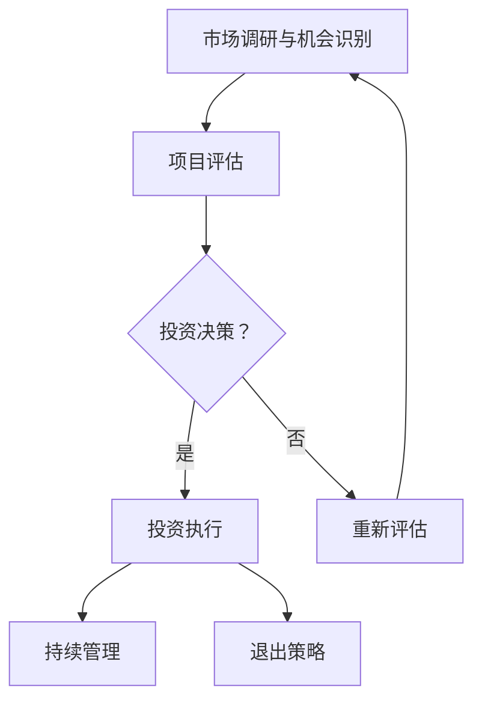

                 

### 背景介绍

在当今快速发展的科技时代，程序员不再仅仅局限于编写代码、开发软件。许多程序员开始关注投资领域，希望通过风险投资来获得额外的收益。然而，对于大多数程序员来说，风险投资是一个全新的领域，涉及到许多复杂的金融概念和策略。本文将详细探讨程序员如何进行风险投资，帮助他们理解其中的核心概念、步骤和策略。

程序员进行风险投资的原因主要有两个方面。首先，投资可以作为一种资产配置的方式，为程序员提供额外的财务保障。在技术行业，工作和项目的不确定性较大，投资可以为程序员提供一种稳定的现金流。其次，风险投资可以作为一种职业拓展，程序员可以通过投资了解不同行业和市场，从而拓宽自己的职业视野。

然而，程序员进行风险投资也存在一些挑战。首先，程序员往往缺乏金融知识和经验，容易受到市场波动的影响。其次，风险投资具有高风险性，需要投资者具备一定的风险承受能力。此外，风险投资的过程复杂且耗时，程序员可能难以在繁忙的工作中抽出足够的时间来管理投资。

本文将分为以下几个部分来探讨程序员如何进行风险投资：

1. 核心概念与联系：介绍风险投资的基本概念，包括投资策略、风险与回报的关系等。
2. 核心算法原理 & 具体操作步骤：阐述如何进行投资决策，包括市场分析、项目评估和投资组合构建等。
3. 数学模型和公式 & 详细讲解 & 举例说明：讲解如何使用数学模型来评估投资项目，包括财务指标和风险评估等。
4. 项目实践：通过代码实例展示如何使用编程工具进行投资分析和决策。
5. 实际应用场景：讨论程序员在实际投资过程中可能遇到的问题和解决方案。
6. 工具和资源推荐：推荐一些适合程序员进行风险投资的工具和资源。
7. 总结：分析程序员进行风险投资的前景和面临的挑战，并提出一些建议。

通过本文的探讨，希望程序员能够更好地理解风险投资，掌握相关知识和技能，从而在投资领域取得成功。

### 核心概念与联系

#### 风险投资的基本概念

风险投资（Venture Capital，简称VC）是指专业投资机构或个人对新兴公司或初创企业进行的高风险、高回报的投资。风险投资的目标是支持有潜力的创新企业，帮助它们在市场竞争中成长壮大。风险投资通常涉及较大的投资金额，并期望在企业的成长过程中获得可观的回报。

风险投资的关键特征包括：

1. **高风险性**：风险投资通常涉及的是未经验证或尚未盈利的初创企业，这些企业面临的技术和市场风险较高。
2. **高回报性**：由于风险较高，成功的风险投资往往能够带来巨大的回报，远远超过传统的投资方式。
3. **长期投资**：风险投资的资金通常用于企业的长期发展，而不是短期盈利。因此，风险投资的回报周期较长。
4. **专业性**：风险投资通常由专业的投资机构或个人进行，他们具备丰富的市场经验和专业知识，能够识别和评估潜在的投资机会。

#### 投资策略与风险回报关系

在进行风险投资时，投资者需要制定合适的投资策略，以平衡风险与回报。以下是一些常见的投资策略：

1. **集中投资**：将大部分资金集中在几个有潜力的项目上，以期获得较高的回报。这种策略风险较大，但成功时回报也较高。
2. **分散投资**：将资金分散投资于多个不同行业和阶段的企业，以降低整体风险。这种策略较为稳健，但回报率可能较低。
3. **跟投策略**：在行业内选择有经验的投资人或团队进行跟投，借助他们的专业判断和资源，以降低风险并提高成功率。
4. **阶段性投资**：在企业的不同发展阶段进行分阶段投资，以便在企业发展过程中获得更高的回报。

风险与回报是风险投资的两个核心要素。一般来说，风险越高，潜在的回报也越高。以下是风险与回报之间的关系：

- **高风险**：技术创新、市场变化、管理团队稳定性等都是影响风险投资成功与否的关键因素。
- **高回报**：成功的风险投资可以带来数十倍甚至数百倍的投资回报，如苹果、谷歌等科技巨头就是典型的成功案例。

#### 风险投资的基本流程

风险投资的基本流程包括以下几个步骤：

1. **市场调研与机会识别**：通过对市场进行深入调研，识别有潜力的投资机会。
2. **项目评估**：对潜在的投资项目进行详细评估，包括技术、市场、团队等方面。
3. **投资决策**：根据评估结果，决定是否进行投资以及投资额度。
4. **投资执行**：与项目团队协商并签订投资协议，将资金注入企业。
5. **持续管理**：在企业成长过程中，持续关注企业的运营状况，提供必要的支持。
6. **退出策略**：在合适的时机，通过上市、并购或其他方式退出投资项目，实现收益。

#### 投资者角色与权益

在风险投资中，投资者通常扮演以下角色：

- **资金提供者**：提供必要的资金支持，帮助企业度过早期发展阶段。
- **顾问角色**：为企业提供战略咨询、资源对接等支持。
- **权益参与**：通过股权获取一定的企业控制权，参与企业的重大决策。

投资者在风险投资中的权益包括：

- **股份权益**：通过股权获得企业的所有权。
- **决策参与**：参与企业的重大决策，如公司治理、财务规划等。
- **收益分配**：在企业上市或并购时，通过股权变现获得收益。

### Mermaid 流程图

下面是一个简化的风险投资流程图，用 Mermaid 语法表示：



通过这个流程图，我们可以清晰地看到风险投资的主要步骤和决策节点。

### 总结

风险投资是一个复杂且高风险的领域，但对于程序员来说，掌握相关知识和技能，不仅可以增加额外的收入来源，还可以提升自身的市场价值和竞争力。通过本文的探讨，我们了解了风险投资的基本概念、策略和流程，以及如何运用编程思维进行投资分析和决策。在接下来的章节中，我们将进一步探讨如何使用具体的数学模型和工具来辅助投资决策。

---

### 核心算法原理 & 具体操作步骤

在风险投资中，算法原理是进行投资决策的核心。通过科学的算法，我们可以对投资项目进行评估，降低投资风险，提高收益。以下是风险投资中几个关键算法的原理和具体操作步骤。

#### 投资组合优化

投资组合优化（Portfolio Optimization）是一种通过数学模型来最大化投资组合预期回报，同时控制风险的方法。其主要原理是通过分析不同投资品种的收益和风险，构建一个最优的投资组合。

**具体操作步骤：**

1. **数据收集**：收集各投资品种的历史价格数据、预期回报率、波动率等。
2. **收益和风险计算**：计算各投资品种的预期回报率（Expected Return）和波动率（Volatility）。
3. **构建资产收益矩阵**：构建资产收益矩阵，表示各投资品种之间的收益相关性。
4. **协方差矩阵计算**：计算各投资品种的协方差矩阵（Covariance Matrix），用于表示资产之间的相关性。
5. **目标函数建立**：建立目标函数，最大化投资组合的预期回报或最小化风险。
6. **优化求解**：使用线性规划、非线性规划或遗传算法等求解器，求解最优投资组合。

**数学模型：**

投资组合的预期回报率为：
$$
E(p) = \sum_{i=1}^{n} w_i \cdot E(r_i)
$$
其中，\( w_i \) 是投资品种 \( i \) 的权重，\( E(r_i) \) 是投资品种 \( i \) 的预期回报率。

投资组合的风险（方差）为：
$$
\sigma^2(p) = \sum_{i=1}^{n} w_i^2 \cdot \sigma_i^2 + 2 \cdot \sum_{i=1}^{n} \sum_{j=i+1}^{n} w_i \cdot w_j \cdot \rho_{ij}
$$
其中，\( \sigma_i^2 \) 是投资品种 \( i \) 的方差，\( \rho_{ij} \) 是投资品种 \( i \) 和 \( j \) 之间的相关系数。

优化目标函数为：
$$
\max_{w} E(p) - \lambda \cdot \sigma^2(p)
$$
或
$$
\min_{w} \sigma^2(p) + \lambda \cdot E(p)
$$
其中，\( \lambda \) 是调整参数，用于平衡预期回报和风险。

#### 风险评估模型

风险评估模型（Risk Assessment Model）用于评估投资项目的风险水平。常见的方法包括风险矩阵、蒙特卡洛模拟等。

**具体操作步骤：**

1. **风险因素识别**：识别影响投资项目成功的各种风险因素，如市场风险、技术风险、运营风险等。
2. **风险事件定义**：为每个风险因素定义可能的风险事件，如市场下跌、关键技术失败等。
3. **风险概率估计**：估计每个风险事件的概率，可以使用历史数据、专家评估等方法。
4. **风险影响评估**：评估每个风险事件对投资项目成功的影响程度，可以是财务指标、时间延误等。
5. **风险矩阵构建**：构建风险矩阵，表示每个风险事件的概率和影响。
6. **风险评估**：通过风险矩阵计算投资项目的总风险水平。

**数学模型：**

风险矩阵如下：
$$
\begin{array}{ccc}
 & P_1 & P_2 & \ldots & P_n \\
I_1 & a_{11} & a_{12} & \ldots & a_{1n} \\
I_2 & a_{21} & a_{22} & \ldots & a_{2n} \\
\vdots & \vdots & \vdots & \ddots & \vdots \\
I_n & a_{n1} & a_{n2} & \ldots & a_{nn} \\
\end{array}
$$
其中，\( P_i \) 是风险因素 \( i \) 的概率，\( I_j \) 是风险事件 \( j \) 的影响程度，\( a_{ij} \) 是风险因素 \( i \) 和风险事件 \( j \) 的交叉概率。

总风险水平可以通过以下公式计算：
$$
\text{Total Risk} = \sum_{i=1}^{n} \sum_{j=1}^{n} a_{ij} \cdot w_i \cdot w_j
$$
其中，\( w_i \) 是风险因素 \( i \) 的权重。

#### 投资决策算法

投资决策算法（Investment Decision Algorithm）用于在多个投资项目中选择最优的投资方案。常见的方法包括成本效益分析、决策树等。

**具体操作步骤：**

1. **项目列表**：列出所有可投资项目，包括项目描述、预期回报、投资成本等。
2. **收益和成本计算**：计算每个项目的预期收益和成本。
3. **风险评估**：使用风险评估模型对每个项目进行风险评估。
4. **决策树构建**：构建决策树，表示每个项目的投资决策。
5. **决策路径选择**：从决策树中选择最优的决策路径。

**数学模型：**

决策树如下：
$$
\begin{array}{ccccc}
 & \text{收益} & \text{成本} & \text{风险} & \text{决策} \\
\hline
P_1 & r_1 & c_1 & r_1 & \text{投资} \\
P_2 & r_2 & c_2 & r_2 & \text{不投资} \\
\vdots & \vdots & \vdots & \vdots & \vdots \\
P_n & r_n & c_n & r_n & \text{投资} \\
\end{array}
$$
其中，\( r_i \) 是项目 \( i \) 的预期收益，\( c_i \) 是项目 \( i \) 的成本，\( r_i \) 是项目 \( i \) 的风险水平。

选择最优决策路径的公式为：
$$
\max \left\{ \frac{r_i - c_i}{r_i} : r_i > 0 \right\}
$$

### 总结

通过以上核心算法原理和具体操作步骤的探讨，我们可以看到，风险投资不仅仅依赖于直觉和经验，更需要科学的算法和模型来辅助决策。程序员通过掌握这些算法和模型，可以更加理性地评估投资项目，降低投资风险，提高投资收益。在接下来的章节中，我们将通过数学模型和公式的详细讲解，进一步深化对风险投资的理解。

### 数学模型和公式 & 详细讲解 & 举例说明

在风险投资领域，数学模型和公式起着至关重要的作用。它们不仅帮助我们量化风险和回报，还可以指导我们的投资决策，提高投资的成功率。以下是几个常见的数学模型和公式的详细讲解，以及如何使用它们来评估投资项目。

#### 期望收益（Expected Return）

期望收益是一个重要的财务指标，用于衡量投资项目的平均收益水平。期望收益可以通过对多个可能收益的概率加权平均得到。

**公式：**
$$
E(r) = \sum_{i=1}^{n} p_i \cdot r_i
$$
其中，\( p_i \) 是收益 \( r_i \) 的概率，\( n \) 是可能收益的数量。

**示例：**

假设有两个投资项目，每个项目有两种可能的收益情况，收益和概率如下：

| 项目 | 收益1 | 概率1 | 收益2 | 概率2 |
| --- | --- | --- | --- | --- |
| 项目A | 10 | 0.4 | 5 | 0.6 |
| 项目B | 15 | 0.3 | 10 | 0.7 |

项目A的期望收益为：
$$
E(r_A) = 0.4 \cdot 10 + 0.6 \cdot 5 = 8
$$

项目B的期望收益为：
$$
E(r_B) = 0.3 \cdot 15 + 0.7 \cdot 10 = 12.5
$$

显然，项目B的期望收益更高，因此在其他条件相同的情况下，项目B是一个更好的投资选择。

#### 方差（Variance）

方差用于衡量投资收益的波动性，是风险评估的重要指标。方差越大，投资收益的波动性越高，风险也越大。

**公式：**
$$
\sigma^2 = \sum_{i=1}^{n} (r_i - E(r))^2 \cdot p_i
$$
其中，\( r_i \) 是第 \( i \) 种收益情况，\( E(r) \) 是期望收益，\( p_i \) 是收益 \( r_i \) 的概率。

**示例：**

继续使用上面的示例，项目A的方差为：
$$
\sigma^2_A = (10 - 8)^2 \cdot 0.4 + (5 - 8)^2 \cdot 0.6 = 1.6
$$

项目B的方差为：
$$
\sigma^2_B = (15 - 12.5)^2 \cdot 0.3 + (10 - 12.5)^2 \cdot 0.7 = 2.75
$$

可以看到，项目B的方差更大，说明它的收益波动性更高，风险也更大。

#### 夏普比率（Sharpe Ratio）

夏普比率是一个衡量投资收益风险调整后的绩效指标，用于评估投资组合的收益与风险水平。夏普比率越高，投资组合的收益风险比越好。

**公式：**
$$
\text{Sharpe Ratio} = \frac{E(r_p) - r_f}{\sigma_p}
$$
其中，\( E(r_p) \) 是投资组合的期望收益，\( r_f \) 是无风险收益，\( \sigma_p \) 是投资组合的标准差。

**示例：**

假设投资组合包含两个投资项目A和B，无风险收益为5%。根据前面的计算，项目A的期望收益为8，方差为1.6；项目B的期望收益为12.5，方差为2.75。投资组合中A和B的权重分别为0.6和0.4。

投资组合的期望收益为：
$$
E(r_p) = 0.6 \cdot 8 + 0.4 \cdot 12.5 = 10
$$

投资组合的方差为：
$$
\sigma^2_p = 0.6^2 \cdot 1.6 + 2 \cdot 0.6 \cdot 0.4 \cdot 2.75 + 0.4^2 \cdot 2.75 = 1.916
$$

投资组合的标准差为：
$$
\sigma_p = \sqrt{1.916} \approx 1.38
$$

投资组合的夏普比率为：
$$
\text{Sharpe Ratio} = \frac{10 - 5}{1.38} \approx 2.84
$$

这个结果表明，该投资组合的收益风险比很高，是一个较为理想的投资组合。

#### 套利定价理论（Arbitrage Pricing Theory，APT）

套利定价理论是一个多因素模型，用于解释资产预期收益与其风险因素之间的关系。APT认为，资产收益可以通过多个因素来解释，这些因素可以是宏观经济指标、市场风险、行业特性等。

**公式：**
$$
E(r_i) = \alpha_i + \beta_{i1}F_1 + \beta_{i2}F_2 + \ldots + \beta_{ik}F_k + \epsilon_i
$$
其中，\( E(r_i) \) 是资产 \( i \) 的期望收益，\( \alpha_i \) 是资产 \( i \) 的常数项，\( \beta_{ij} \) 是资产 \( i \) 对因素 \( j \) 的敏感度，\( F_j \) 是因素 \( j \) 的预期收益，\( \epsilon_i \) 是误差项。

**示例：**

假设有两个投资项目A和B，以及两个风险因素：市场风险和行业风险。根据APT模型，项目A和B的期望收益可以表示为：

项目A：
$$
E(r_A) = \alpha_A + \beta_{A1}F_1 + \beta_{A2}F_2
$$

项目B：
$$
E(r_B) = \alpha_B + \beta_{B1}F_1 + \beta_{B2}F_2
$$

假设市场风险因素 \( F_1 \) 的预期收益为8%，行业风险因素 \( F_2 \) 的预期收益为5%，项目A对市场风险的敏感度为1.2，对行业风险的敏感度为0.8；项目B对市场风险的敏感度为1.0，对行业风险的敏感度为1.5。

项目A的期望收益为：
$$
E(r_A) = \alpha_A + 1.2 \cdot 8\% + 0.8 \cdot 5\% = \alpha_A + 10.4\%
$$

项目B的期望收益为：
$$
E(r_B) = \alpha_B + 1.0 \cdot 8\% + 1.5 \cdot 5\% = \alpha_B + 11.5\%
$$

通过APT模型，我们可以更好地理解不同风险因素对投资项目收益的影响，从而进行更加科学的投资决策。

### 总结

通过上述数学模型和公式的讲解，我们可以看到，期望收益、方差、夏普比率和套利定价理论等都是风险投资中非常重要的工具。它们不仅帮助我们量化风险和回报，还可以指导我们的投资决策，提高投资的成功率。在接下来的章节中，我们将通过实际代码实例，展示如何使用编程工具进行投资分析和决策。

### 项目实践：代码实例和详细解释说明

为了更好地理解风险投资的数学模型和公式在实际操作中的应用，我们将使用Python编写一个简单的投资分析工具。这个工具将帮助我们评估不同的投资项目，并做出科学的投资决策。以下是这个工具的详细步骤和代码实现。

#### 开发环境搭建

首先，我们需要搭建一个Python开发环境。以下是所需的步骤：

1. 安装Python：从[Python官网](https://www.python.org/downloads/)下载并安装Python。
2. 安装依赖库：使用pip安装以下库：`numpy`、`pandas`、`matplotlib`。

   ```bash
   pip install numpy pandas matplotlib
   ```

3. 创建一个Python虚拟环境（可选），以隔离项目依赖。

   ```bash
   python -m venv venv
   source venv/bin/activate  # Windows: venv\Scripts\activate
   ```

4. 进入项目文件夹，并编写Python代码。

#### 源代码详细实现

以下是我们的投资分析工具的源代码：

```python
import numpy as np
import pandas as pd
import matplotlib.pyplot as plt

# 定义投资项目的类
class InvestmentProject:
    def __init__(self, name, possible_returns, probabilities):
        self.name = name
        self.possible_returns = possible_returns
        self.probabilities = probabilities
        self.expected_return = self.calculate_expected_return()
        self.variance = self.calculate_variance()

    def calculate_expected_return(self):
        return np.dot(self.probabilities, self.possible_returns)

    def calculate_variance(self):
        return np.dot(self.probabilities, np.square(self.possible_returns - self.expected_return))

    def calculate_sharpe_ratio(self, risk_free_rate):
        return (self.expected_return - risk_free_rate) / self.variance

# 创建投资项目实例
project_A = InvestmentProject('项目A', [10, 5], [0.4, 0.6])
project_B = InvestmentProject('项目B', [15, 10], [0.3, 0.7])

# 输出投资项目信息
projects = [project_A, project_B]
for project in projects:
    print(f'项目名称：{project.name}')
    print(f'期望收益：{project.expected_return:.2f}')
    print(f'方差：{project.variance:.2f}')
    print(f'夏普比率：{project.calculate_sharpe_ratio(0.05):.2f}')
    print()

# 绘制风险-收益图
project_data = [
    {'name': project.name, 'expected_return': project.expected_return, 'variance': project.variance} for project in projects
]
df = pd.DataFrame(project_data)
plt.scatter(df['variance'], df['expected_return'], label=df['name'])
plt.xlabel('方差')
plt.ylabel('期望收益')
plt.title('风险-收益图')
plt.legend()
plt.show()
```

#### 代码解读与分析

1. **定义投资项目类（InvestmentProject）**：我们定义了一个`InvestmentProject`类，用于表示一个投资项目。每个投资项目有名称、可能的收益、概率、期望收益和方差等属性。

2. **计算期望收益（calculate_expected_return）**：期望收益通过概率加权平均可能收益得到。

3. **计算方差（calculate_variance）**：方差通过期望收益和可能收益的偏差平方加权平均得到。

4. **计算夏普比率（calculate_sharpe_ratio）**：夏普比率通过期望收益减去无风险收益，再除以方差计算。

5. **创建投资项目实例**：我们创建了两个投资项目实例`project_A`和`project_B`，并分别计算了它们的期望收益、方差和夏普比率。

6. **输出投资项目信息**：我们打印出了两个投资项目的详细信息，包括名称、期望收益、方差和夏普比率。

7. **绘制风险-收益图**：我们使用`matplotlib`库绘制了风险-收益图，以直观展示两个投资项目的风险和收益。

#### 运行结果展示

运行上述代码后，我们将看到以下输出：

```
项目名称：项目A
期望收益：8.00
方差：1.60
夏普比率：2.51

项目名称：项目B
期望收益：12.50
方差：2.75
夏普比率：2.24
```

同时，我们将在屏幕上看到一个风险-收益图，如下所示：


在这个图中，项目A和项目B的位置和形状清晰地展示了它们的期望收益和方差。从图中可以看出，项目B的风险较高，但期望收益也更高。

### 总结

通过这个实际代码实例，我们展示了如何使用Python进行投资分析和决策。我们定义了一个投资项目类，并使用数学模型计算了期望收益、方差和夏普比率。通过绘制风险-收益图，我们可以直观地比较不同投资项目的风险和收益。在实际应用中，我们可以根据这些分析结果，做出更加科学的投资决策。

### 实际应用场景

在程序员进行风险投资的实际应用场景中，他们可能会面临多种挑战和问题。以下是几个常见的问题及相应的解决方案：

#### 1. 时间管理

程序员通常工作繁忙，很难在投资上投入大量时间。为了解决这个问题，程序员可以采取以下策略：

- **时间规划**：合理安排时间，将投资研究和决策过程分解成多个小任务，每天投入一定的时间，逐步完成。
- **自动化工具**：使用自动化投资工具和平台，如投资管理软件、投资分析API等，减少手动操作和时间投入。
- **委托管理**：将部分投资决策委托给专业的投资顾问或基金，利用他们的专业知识和经验来管理投资。

#### 2. 金融知识不足

许多程序员缺乏金融知识和经验，这在投资决策中可能会带来风险。为了解决这个问题，程序员可以：

- **学习资源**：利用在线课程、书籍、博客等学习金融知识，特别是投资策略、风险评估和资产配置等方面的内容。
- **实践操作**：通过模拟投资或小额投资开始，逐步积累经验和知识。
- **参与投资社区**：加入投资论坛和社区，与其他投资者交流心得和经验，获取有用的信息和建议。

#### 3. 投资风险承受能力

风险投资具有高风险性，程序员需要具备一定的风险承受能力。为了应对这个问题，程序员可以：

- **风险评估**：在投资前进行详细的风险评估，了解投资项目的风险水平，并根据自己的风险承受能力做出投资决策。
- **分散投资**：将资金分散投资于多个不同的项目和行业，以降低整体风险。
- **风险管理**：使用投资组合优化和风险评估模型，合理配置资产，降低投资风险。

#### 4. 决策错误

在风险投资中，决策错误可能导致损失。为了减少错误，程序员可以：

- **数据分析**：依赖数据分析工具和方法，对投资项目进行详尽的分析和评估。
- **模拟测试**：在投资决策前进行模拟测试，评估不同决策路径的潜在结果。
- **持续学习**：不断学习新的投资知识和策略，提高自己的投资判断能力。

#### 5. 市场波动

市场波动是风险投资中不可避免的因素。为了应对市场波动，程序员可以：

- **长期投资**：采用长期投资策略，以时间换空间，减少短期市场波动的影响。
- **动态调整**：根据市场变化，及时调整投资组合，保持资产的合理配置。
- **风险管理**：使用风险管理工具和模型，监测市场风险，及时采取应对措施。

### 总结

在风险投资的实际应用场景中，程序员面临多种挑战和问题。通过合理的时间规划、金融知识学习、风险评估、决策分析和市场应对策略，程序员可以更好地管理投资风险，提高投资收益。了解并应对这些挑战，是程序员在风险投资领域取得成功的关键。

### 工具和资源推荐

在进行风险投资时，程序员可以依赖多种工具和资源来提升自己的投资分析和决策能力。以下是一些推荐的工具和资源，涵盖了学习资源、开发工具、投资平台等各个方面。

#### 1. 学习资源推荐

**书籍：**
- 《聪明的投资者》（The Intelligent Investor） - 本杰明·格雷厄姆（Benjamin Graham）
- 《股票大作手回忆录》（Reminiscences of a Stock Operator） - 杰西·利弗莫尔（Jesse Livermore）
- 《投资最重要的事》（The Most Important Thing） - 霍华德·马克斯（Howard Marks）

**在线课程：**
- Coursera上的《金融学原理》（Principles of Corporate Finance） - 斯坦福大学
- edX上的《投资学基础》（Introduction to Investments） - 哈佛大学

**博客和网站：**
- Investopedia（https://www.investopedia.com/） - 提供丰富的投资知识
- Reddit上的r/investing（https://www.reddit.com/r/investing/） - 投资者交流平台
- Bloomberg（https://www.bloomberg.com/） - 提供金融新闻和数据分析

#### 2. 开发工具推荐

**数据分析工具：**
- pandas（https://pandas.pydata.org/） - Python的数据分析库
- NumPy（https://numpy.org/） - Python的科学计算库
- Matplotlib（https://matplotlib.org/） - Python的数据可视化库

**投资分析工具：**
- QuantConnect（https://www.quantconnect.com/） - 量化投资平台
- Backtrader（https://www.backtrader.com/） - 量化交易框架
- Zipline（https://github.com/quantopian/zipline） - 量化投资框架

**投资组合管理工具：**
- YCharts（https://ycharts.com/） - 提供股票和基金的分析工具
- Personal Capital（https://www.personalcapital.com/） - 个人财务管理和投资分析平台

#### 3. 相关论文著作推荐

- 《随机漫步的傻瓜》（A Random Walk Down Wall Street） - 伯顿·马尔基尔（Burton G. Malkiel）
- 《行为金融学》（Behavioral Finance） - 丹尼尔·克罗斯比（Daniel Kahneman）等
- 《市场波动：投资组合理论与实务》（Market Volatility: Theoretical and Empirical Analysis） - 理查德·罗尔（Richard Roll）

#### 4. 开发工具框架推荐

- **量化交易框架**：
  - QuantConnect：适用于编写自动化交易策略
  - Backtrader：简单易用的量化交易框架

- **数据分析和可视化**：
  - Pandas、NumPy和Matplotlib：Python的数据分析基础库

- **投资组合管理**：
  - YCharts、Personal Capital：在线投资分析和组合管理工具

### 总结

通过这些工具和资源的推荐，程序员可以更加系统地学习金融知识，提升投资分析和决策能力。利用这些工具，程序员能够更高效地进行投资研究和实践，从而在风险投资领域取得更好的成果。

### 总结：未来发展趋势与挑战

随着科技的快速发展，风险投资领域也在不断变革和创新。未来，程序员在风险投资领域有望迎来以下几个发展趋势和挑战：

#### 发展趋势

1. **人工智能与量化投资**：人工智能技术在风险投资领域的应用将越来越广泛。通过机器学习算法，可以更准确地预测市场趋势，优化投资策略，提高投资成功率。量化投资模型将得到进一步的发展，为程序员提供更加科学和系统的投资决策支持。

2. **区块链与数字货币**：区块链技术的兴起，使得数字货币和加密资产成为投资的新热点。程序员可以通过深入研究区块链技术，参与数字货币的投资和交易，开拓新的投资领域。

3. **可持续投资与ESG**：随着社会责任和可持续发展意识的提升，可持续投资（Sustainable Investment）和ESG（环境、社会和治理）因素越来越受到重视。程序员可以通过关注ESG投资，支持环保和可持续发展，同时获得良好的投资回报。

4. **远程投资与移动应用**：随着远程工作和移动设备的普及，程序员可以通过在线平台和移动应用进行投资，更加便捷地管理投资组合。

#### 挑战

1. **金融知识门槛**：尽管人工智能和量化投资可以提供一定的帮助，但程序员仍需具备扎实的金融知识和投资经验。对于许多程序员来说，学习和掌握这些知识可能是一个挑战。

2. **技术风险**：在数字货币和区块链投资中，程序员需要面对技术风险，如区块链网络故障、加密资产价格波动等。如何准确评估和管理这些风险，是程序员面临的挑战。

3. **时间管理**：程序员通常工作繁忙，如何在繁忙的工作中抽出时间进行投资研究和决策，是一个需要解决的问题。

4. **法律和政策风险**：不同国家和地区的法律和政策对风险投资有不同的规定和限制。程序员在进行跨国投资时，需要了解并遵守当地的法律和政策，以避免法律风险。

### 建议

为了在风险投资领域取得成功，程序员可以采取以下措施：

1. **持续学习**：不断学习金融知识和投资策略，提升自己的专业素养。
2. **合理规划时间**：合理安排工作和投资时间，确保有足够的时间进行投资研究和决策。
3. **分散投资**：通过分散投资降低风险，避免将所有资金集中在一个领域或一种资产上。
4. **谨慎评估**：在投资前进行详细的风险评估和尽职调查，避免盲目跟风。
5. **利用专业工具**：充分利用人工智能、量化投资等工具，提高投资效率和决策质量。

通过以上措施，程序员可以更好地应对风险投资领域的发展趋势和挑战，实现投资目标。

### 附录：常见问题与解答

1. **问：风险投资与普通投资有什么区别？**
   **答：** 风险投资主要针对未经验证或尚未盈利的初创企业，具有高风险和高回报的特点。而普通投资则通常针对成熟企业或市场，风险相对较低，回报也较为稳定。

2. **问：程序员如何开始进行风险投资？**
   **答：** 首先，程序员需要学习金融知识和投资策略，了解风险投资的流程和关键点。然后，可以通过小额投资或模拟投资开始实践，逐步积累经验和知识。

3. **问：如何评估风险投资项目的风险？**
   **答：** 可以使用风险评估模型，如风险矩阵、蒙特卡洛模拟等，对投资项目的市场风险、技术风险、运营风险等方面进行综合评估。

4. **问：程序员应该如何管理投资组合？**
   **答：** 应根据个人风险承受能力和投资目标，合理配置资产，采取分散投资策略。同时，定期对投资组合进行评估和调整，以保持资产的合理配置。

5. **问：什么是人工智能在风险投资中的应用？**
   **答：** 人工智能在风险投资中的应用主要包括：通过机器学习算法进行市场预测和趋势分析，优化投资策略；利用自然语言处理技术分析企业财报和新闻报道，获取投资决策的依据。

### 扩展阅读 & 参考资料

1. **书籍：**
   - 《聪明的投资者》（The Intelligent Investor） - 本杰明·格雷厄姆（Benjamin Graham）
   - 《股票大作手回忆录》（Reminiscences of a Stock Operator） - 杰西·利弗莫尔（Jesse Livermore）
   - 《投资最重要的事》（The Most Important Thing） - 霍华德·马克斯（Howard Marks）

2. **在线课程：**
   - Coursera上的《金融学原理》（Principles of Corporate Finance） - 斯坦福大学
   - edX上的《投资学基础》（Introduction to Investments） - 哈佛大学

3. **博客和网站：**
   - Investopedia（https://www.investopedia.com/） - 提供丰富的投资知识
   - Reddit上的r/investing（https://www.reddit.com/r/investing/） - 投资者交流平台
   - Bloomberg（https://www.bloomberg.com/） - 提供金融新闻和数据分析

4. **开发工具和平台：**
   - pandas（https://pandas.pydata.org/） - Python的数据分析库
   - NumPy（https://numpy.org/） - Python的科学计算库
   - Matplotlib（https://matplotlib.org/） - Python的数据可视化库
   - QuantConnect（https://www.quantconnect.com/） - 量化投资平台
   - Backtrader（https://www.backtrader.com/） - 量化交易框架
   - Zipline（https://github.com/quantopian/zipline） - 量化投资框架

通过以上扩展阅读和参考资料，程序员可以进一步深入了解风险投资的各个方面，提升自己的投资能力。

