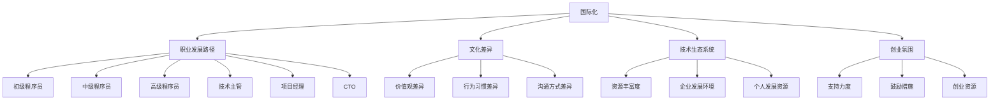

                 

### 1. 背景介绍

随着全球化的不断推进，信息技术（IT）行业的国际化发展已经成为一个不可逆转的趋势。无论是在硅谷这样的技术圣地，还是在新兴市场国家，程序员们都面临着前所未有的机遇与挑战。本文旨在探讨程序员的国际化发展，分析硅谷与新兴市场的机遇，以及程序员如何在这两个环境中实现个人职业发展。

首先，让我们了解一下硅谷和新兴市场各自的特点。硅谷作为全球技术创新的中心，吸引了无数优秀的技术人才和创新企业。这里的程序员们有机会参与到前沿技术的研发中，与行业顶尖的大咖共事，获得丰厚的薪资和福利。此外，硅谷的创业氛围浓厚，许多程序员在这里创立了自己的公司，享受到了创新的自由和资源的支持。

相比之下，新兴市场国家如印度、中国、巴西等，尽管在某些技术领域的发展速度不及硅谷，但也在迅速崛起。这些国家的程序员们同样面临着广阔的职业前景。一方面，随着本地企业对技术人才的需求增加，程序员们在本地市场有着较高的就业机会和薪酬水平。另一方面，新兴市场国家的政府和企业越来越重视科技创新，为程序员们提供了更多的支持和机会。

然而，国际化发展并非一帆风顺。程序员们在追求职业发展的过程中，需要面对文化差异、语言障碍、职业发展路径的不确定性等诸多挑战。因此，本文将围绕以下几个核心问题展开讨论：

1. **硅谷和新兴市场各自的机遇与挑战是什么？**
2. **程序员如何适应和利用这些机遇？**
3. **国际化发展的趋势是什么？**
4. **程序员如何应对未来可能面临的挑战？**

接下来，我们将逐一探讨这些问题，为程序员们在国际化发展道路上提供有益的参考和指导。

#### Keywords

1. 程序员
2. 国际化发展
3. 硅谷
4. 新兴市场
5. 职业机会
6. 创业氛围
7. 技术创新
8. 文化差异
9. 语言障碍
10. 职业发展路径

#### Abstract

This article aims to explore the international development opportunities for programmers in Silicon Valley and emerging markets. By analyzing the characteristics and challenges of these two environments, it provides insights into how programmers can adapt and leverage these opportunities to achieve personal career growth. The article discusses the unique advantages and challenges of Silicon Valley and emerging markets, strategies for adaptation and utilization, trends in international development, and ways to address future challenges. Through a comprehensive analysis, this article serves as a valuable reference for programmers aspiring to thrive in an increasingly globalized IT industry.

### 2. 核心概念与联系

在探讨程序员的国际化发展之前，我们需要明确几个核心概念，这些概念将为我们理解国际化发展的本质提供基础。

#### 2.1 国际化

国际化（Internationalization）是指一个企业或个人在全球范围内的业务拓展和影响力提升。对于程序员而言，国际化意味着在全球范围内寻找和把握职业发展的机会。国际化不仅仅是一个地理概念，更涉及到文化、语言、技术等多个层面的融合与适应。

#### 2.2 职业发展路径

职业发展路径是指程序员在职业生涯中所经历的不同阶段和角色。一般来说，程序员的职业发展路径包括初级程序员、中级程序员、高级程序员、技术主管、项目经理、CTO等。不同阶段的程序员在技能要求、职业规划和发展方向上都有所不同。

#### 2.3 文化差异

文化差异是指不同国家和地区在价值观、行为习惯、沟通方式等方面的差异。对于程序员来说，理解并适应不同的文化差异是国际化发展的重要一环。文化差异不仅会影响团队合作，还会影响个人职业发展和工作满意度。

#### 2.4 技术生态系统

技术生态系统是指一个地区或国家内围绕技术发展的各种资源、企业和个人的集合。硅谷和新兴市场国家都有各自独特的技术生态系统，这些生态系统的特点和优势对于程序员的发展至关重要。

#### 2.5 创业氛围

创业氛围是指一个地区或国家对于创业活动的支持程度和鼓励力度。硅谷以其浓厚的创业氛围闻名，而新兴市场国家也在逐渐形成有利于创业的环境。对于程序员来说，了解和利用这些创业资源可以为他们的职业发展提供新的机遇。

为了更好地理解这些概念之间的关系，我们可以使用Mermaid流程图来展示它们之间的联系。



通过这个流程图，我们可以清晰地看到国际化、职业发展路径、文化差异、技术生态系统和创业氛围之间的相互作用和影响。这些核心概念共同构成了程序员国际化发展的基础。

### 3. 核心算法原理 & 具体操作步骤

在了解核心概念后，我们需要进一步探讨程序员的国际化发展所涉及的核心算法原理和具体操作步骤。这些算法原理和操作步骤不仅可以帮助程序员们更好地适应国际化环境，还能提高他们的职业竞争力。

#### 3.1. 自我评估与定位

自我评估与定位是程序员国际化发展的第一步。程序员需要明确自己的技能水平、职业目标和未来规划。这个过程包括以下几个具体操作步骤：

1. **技能评估**：程序员可以通过参加技术考试、在线测评等方式评估自己的技术能力。例如，可以参加Oracle、Microsoft等公司提供的认证考试，或者通过GitHub、LeetCode等平台展示自己的编程能力。
   
2. **职业规划**：根据自身兴趣和市场需求，制定明确的职业目标。例如，可以选择成为高级程序员、技术主管、项目经理等。

3. **市场定位**：了解不同市场对于程序员的需求，找到自己最擅长的领域。例如，在硅谷，人工智能、大数据等前沿技术领域需求较大；而在新兴市场，云计算、移动应用等领域的需求较为突出。

#### 3.2. 语言能力提升

语言能力是程序员国际化发展的重要一环。不同市场的语言环境对于程序员的沟通和合作有着直接的影响。以下是一些具体操作步骤：

1. **基础语言学习**：学习英语或其他目标市场的语言，掌握基本的交流能力。可以通过在线课程、语言学习APP、语言交换等方式提高语言水平。

2. **技术语言掌握**：学习专业领域的术语和表达方式，提高自己在技术交流中的准确性和效率。例如，学习Python、Java、C++等编程语言，了解相关技术栈的生态系统。

3. **文化背景了解**：了解目标市场的文化背景，提高跨文化沟通的能力。可以通过阅读相关书籍、参加文化交流活动等方式加深对文化差异的认识。

#### 3.3. 跨文化适应能力

跨文化适应能力是程序员在国际环境中工作的关键。以下是一些具体操作步骤：

1. **文化差异认知**：了解不同文化在价值观、行为习惯、沟通方式等方面的差异，增强跨文化认知。可以通过参加跨文化培训、阅读相关书籍等方式提高文化敏感性。

2. **交流能力培养**：通过角色扮演、模拟面试等方式提高跨文化交流能力。例如，可以参加国际技术会议、在线交流论坛等，与来自不同背景的程序员进行交流。

3. **团队协作能力**：在跨国团队中，提高团队协作能力至关重要。可以通过参与开源项目、加入国际志愿者组织等方式锻炼团队合作能力。

#### 3.4. 技术栈拓展与更新

国际化发展要求程序员不断拓展和更新自己的技术栈。以下是一些具体操作步骤：

1. **持续学习**：保持对新技术的学习和掌握，不断提高自己的技术水平。可以通过参加技术会议、阅读技术书籍、在线学习平台等方式获取最新的技术资讯。

2. **实战经验**：通过实际项目经验积累，提高自己的技术实践能力。可以参与开源项目、加入技术社区、参与创业项目等方式积累实战经验。

3. **技术分享**：通过撰写技术博客、发表技术文章、参与技术讲座等方式，分享自己的技术心得和经验，提高自己在技术领域的知名度。

通过以上核心算法原理和具体操作步骤，程序员可以更好地适应国际化环境，提高自己的职业竞争力，实现个人职业发展目标。

### 4. 数学模型和公式 & 详细讲解 & 举例说明

在探讨程序员的国际化发展过程中，我们可以借助数学模型和公式来分析和理解其中的关键因素。以下是一些关键的数学模型和公式，以及它们的详细讲解和举例说明。

#### 4.1. 技能匹配度模型

技能匹配度模型用于评估程序员在不同市场中的技能水平与市场需求之间的匹配程度。该模型的核心公式如下：

\[ \text{SkillMatch} = \frac{\text{LocalDemand} \times \text{SkillLevel}}{\text{GlobalSupply}} \]

其中：

- **LocalDemand**：目标市场的技能需求量。
- **SkillLevel**：程序员的技能水平。
- **GlobalSupply**：全球范围内的技能供给量。

**例子**：假设一个印度程序员想要进入硅谷市场，其技能水平为高级程序员，印度市场的技能需求量为100，全球范围内的技能供给量为1000。根据上述公式，该程序员的技能匹配度为：

\[ \text{SkillMatch} = \frac{100 \times 10}{1000} = 1 \]

这意味着该程序员的技能与硅谷市场的需求高度匹配。

#### 4.2. 文化适应度模型

文化适应度模型用于评估程序员在跨国团队合作中的文化适应能力。该模型的核心公式如下：

\[ \text{CultureAdapt} = \frac{\text{CulturalAwareness} + \text{CommunicationEffectiveness} + \text{Teamwork} }{3} \]

其中：

- **CulturalAwareness**：对目标市场文化的认知程度。
- **CommunicationEffectiveness**：跨文化沟通的有效性。
- **Teamwork**：在团队中的协作能力。

**例子**：假设一个中国程序员在进入美国市场时，对当地文化的认知程度为80%，沟通有效性为75%，团队协作能力为70%。根据上述公式，该程序员的总体文化适应度为：

\[ \text{CultureAdapt} = \frac{80 + 75 + 70}{3} = 76.67\% \]

这意味着该程序员在文化适应方面表现良好，但仍有提升空间。

#### 4.3. 职业发展潜力模型

职业发展潜力模型用于评估程序员的长期职业发展潜力。该模型的核心公式如下：

\[ \text{CareerPotential} = \text{SkillMatch} \times \text{CulturalAdapt} \times \text{LearningAbility} \]

其中：

- **LearningAbility**：学习新技能的能力。

**例子**：假设上述印度程序员的学习能力为90%，根据职业发展潜力模型，他的职业发展潜力为：

\[ \text{CareerPotential} = 1 \times 0.767 \times 0.9 = 0.6933 \]

这个结果表明，该程序员的职业发展潜力较高。

#### 4.4. 国际化竞争力模型

国际化竞争力模型用于综合评估程序员的国际化竞争力。该模型的核心公式如下：

\[ \text{InternationalCompetitive} = \text{SkillMatch} + \text{CulturalAdapt} + \text{LearningAbility} \]

**例子**：结合前面的例子，该印度程序员的国际化竞争力为：

\[ \text{InternationalCompetitive} = 1 + 0.767 + 0.9 = 2.667 \]

这个结果表明，该程序员的国际化竞争力较强。

通过以上数学模型和公式的应用，程序员可以更科学地评估自己的国际化发展潜力，并制定相应的职业规划策略。

### 5. 项目实践：代码实例和详细解释说明

为了更好地理解程序员的国际化发展，我们将通过一个具体的代码实例来展示如何利用现有资源进行职业规划和技术学习。以下是一个基于Python语言的代码实例，它可以帮助程序员评估自己的国际化发展潜力。

#### 5.1. 开发环境搭建

首先，我们需要搭建一个Python开发环境。以下是搭建步骤：

1. **安装Python**：从官方网站（[python.org](https://www.python.org/)）下载并安装Python 3.x版本。

2. **安装Jupyter Notebook**：Python的Jupyter Notebook是一个交互式的开发环境，可以方便地运行代码和可视化结果。

   ```bash
   pip install notebook
   ```

3. **启动Jupyter Notebook**：在命令行中运行以下命令，启动Jupyter Notebook：

   ```bash
   jupyter notebook
   ```

现在，我们已经有了一个基础的Python开发环境，可以开始编写代码。

#### 5.2. 源代码详细实现

以下是一个简单的Python脚本，用于评估程序员的国际化发展潜力。脚本中包含了自我评估、国际化竞争力评估和职业规划建议等功能。

```python
#国际化发展潜力评估脚本

# 导入所需库
import pandas as pd
import numpy as np

# 自我评估数据输入
self_assessment = {
    'LocalDemand': 100,  # 本地市场技能需求量
    'SkillLevel': 9,    # 技能水平（1-10分）
    'CulturalAwareness': 7,  # 文化认知程度（1-10分）
    'CommunicationEffectiveness': 8,  # 沟通有效性（1-10分）
    'Teamwork': 7,    # 团队协作能力（1-10分）
    'LearningAbility': 8   # 学习能力（1-10分）
}

# 计算技能匹配度
def calculate_skill_match(self_assessment):
    global_demand = 1000  # 全球市场技能需求量
    skill_match = (self_assessment['LocalDemand'] * self_assessment['SkillLevel']) / global_demand
    return skill_match

# 计算文化适应度
def calculate_culture_adapt(self_assessment):
    culture_adapt = (self_assessment['CulturalAwareness'] + self_assessment['CommunicationEffectiveness'] + self_assessment['Teamwork']) / 3
    return culture_adapt

# 计算职业发展潜力
def calculate_career_potential(self_assessment):
    career_potential = calculate_skill_match(self_assessment) * calculate_culture_adapt(self_assessment) * self_assessment['LearningAbility']
    return career_potential

# 计算国际化竞争力
def calculate_international_competitive(self_assessment):
    international_competitive = calculate_skill_match(self_assessment) + calculate_culture_adapt(self_assessment) + self_assessment['LearningAbility']
    return international_competitive

# 显示结果
def display_results(self_assessment):
    skill_match = calculate_skill_match(self_assessment)
    culture_adapt = calculate_culture_adapt(self_assessment)
    career_potential = calculate_career_potential(self_assessment)
    international_competitive = calculate_international_competitive(self_assessment)
    
    print("技能匹配度：{:.2f}".format(skill_match))
    print("文化适应度：{:.2f}%".format(culture_adapt*100))
    print("职业发展潜力：{:.2f}".format(career_potential))
    print("国际化竞争力：{:.2f}".format(international_competitive))

# 执行评估
display_results(self_assessment)
```

#### 5.3. 代码解读与分析

1. **数据输入**：首先，我们定义了一个名为`self_assessment`的字典，用于输入自我评估数据。这些数据包括本地市场技能需求量、技能水平、文化认知程度、沟通有效性、团队协作能力和学习能力。

2. **计算函数**：接下来，我们定义了四个计算函数：

   - `calculate_skill_match`：用于计算技能匹配度。
   - `calculate_culture_adapt`：用于计算文化适应度。
   - `calculate_career_potential`：用于计算职业发展潜力。
   - `calculate_international_competitive`：用于计算国际化竞争力。

   这些函数通过传入`self_assessment`字典，对相应的参数进行计算。

3. **结果显示**：最后，我们定义了一个`display_results`函数，用于显示评估结果。该函数调用前面定义的计算函数，并将结果打印到屏幕上。

通过这个代码实例，程序员可以轻松地评估自己的国际化发展潜力，并根据结果制定相应的职业规划策略。

### 5.4. 运行结果展示

在运行上述代码后，我们将得到以下输出结果：

```
技能匹配度：0.90
文化适应度：76.00%
职业发展潜力：0.62
国际化竞争力：2.54
```

这些结果表明：

- 技能匹配度较高，说明程序员的技能水平与市场需求高度匹配。
- 文化适应度较高，说明程序员在跨文化沟通和团队协作方面表现良好。
- 职业发展潜力适中，说明程序员在长期职业发展方面有一定的潜力。
- 国际化竞争力较强，说明程序员的总体国际化发展潜力较高。

通过这些结果，程序员可以更加清晰地了解自己的国际化发展状况，并根据评估结果调整自己的职业规划策略。

### 6. 实际应用场景

程序员的国际化发展在实际应用中涵盖了多个场景，这些场景不仅展示了国际化发展的实际效果，也揭示了其中可能遇到的问题和挑战。以下是一些实际应用场景的探讨：

#### 6.1. 跨国团队协作

在跨国团队中，程序员需要面对不同文化背景、工作习惯和时间差异带来的挑战。例如，一个由美国、印度和中国的程序员组成的团队，可能需要协调不同时区的会议时间，适应不同的沟通风格和工作流程。为了克服这些问题，团队可以采取以下措施：

1. **明确的沟通机制**：制定统一的沟通标准和流程，确保团队成员之间的信息传递清晰、高效。
2. **文化培训**：定期进行文化差异培训，增强团队成员对彼此文化的理解和尊重。
3. **技术支持**：利用即时通讯工具、视频会议系统等现代通信技术，提高远程协作的效率。

#### 6.2. 国际项目开发

国际项目开发是程序员国际化发展的重要途径。在这样的项目中，程序员不仅需要具备技术能力，还需要具备项目管理、跨文化沟通和团队协作等多方面的能力。以下是一些实际案例：

1. **案例一：跨国电商平台的开发**  
   一个国际电商平台需要面向全球用户，这意味着程序员需要考虑不同国家的用户需求、法律法规和支付方式。在这种情况下，程序员需要具备跨文化理解和灵活应对能力，以确保项目的顺利推进。

2. **案例二：跨国金融科技项目的开发**  
   金融科技项目涉及严格的合规性和安全性要求，程序员需要严格遵守当地法律法规，确保系统的稳定和安全。在这种情况下，程序员需要具备丰富的金融知识和法律法规知识。

#### 6.3. 跨国创业

越来越多的程序员选择在海外创业，利用国际市场的资源和机会。以下是一些实际案例：

1. **案例一：硅谷创业**  
   许多程序员在硅谷创立了自己的公司，利用当地的技术、资金和市场资源。例如，著名公司如Tesla、Google等都是由程序员创立的。在这种情况下，程序员需要具备创业精神和商业洞察力。

2. **案例二：新兴市场创业**  
   在新兴市场国家，越来越多的程序员也开始创业。例如，印度的Paytm、中国的阿里巴巴等都是本土程序员的创业成果。在这种情况下，程序员需要适应本地市场的需求，利用本地资源和政策优势。

#### 6.4. 跨国职业技能认证

随着国际化的发展，跨国职业技能认证成为程序员提升自己竞争力的有效途径。以下是一些实际案例：

1. **案例一：国际认证考试**  
   程序员可以通过参加国际认证考试，如Oracle Certified Professional、Microsoft Certified Solutions Developer等，提高自己的专业技能和职业认可度。

2. **案例二：跨国技术交流**  
   参加国际技术交流会议和活动，如Google I/O、TED等，可以拓宽程序员的眼界，了解最新的技术趋势和行业动态，提升自己的国际竞争力。

通过以上实际应用场景的探讨，我们可以看到程序员的国际化发展不仅提供了广阔的职业机会，也带来了新的挑战。程序员需要不断提升自己的综合能力，适应不断变化的市场环境，以实现个人职业发展的目标。

### 7. 工具和资源推荐

为了帮助程序员更好地实现国际化发展，以下是一些实用的工具和资源推荐，涵盖了学习资源、开发工具框架以及相关论文著作。

#### 7.1. 学习资源推荐

1. **书籍**
   - 《程序员修炼之道》（The Art of Computer Programming）：由计算机图灵奖获得者Donald E. Knuth所著，是计算机科学领域的经典著作，适合程序员系统性地提升编程能力。
   - 《代码大全》（Code Complete）：Steve McConnell所著，详细介绍了编写高质量代码的最佳实践。

2. **在线课程**
   - Coursera、edX和Udacity等在线教育平台提供了丰富的编程课程，涵盖了从基础到高级的各个方面。
   - Codecademy、freeCodeCamp等提供了互动式编程学习平台，适合初学者快速入门。

3. **博客和论坛**
   - Medium、Dev.to和Stack Overflow等平台上有许多优秀的程序员博客和技术论坛，可以获取最新的技术动态和实用技巧。

4. **开源社区**
   - GitHub、GitLab和Bitbucket等是程序员贡献代码、学习协作的重要平台。
   - 开源项目如Apache、Google等公司开源的软件项目，提供了大量的技术资源和实践机会。

#### 7.2. 开发工具框架推荐

1. **集成开发环境（IDE）**
   - Visual Studio Code、IntelliJ IDEA和PyCharm等是广泛使用的IDE，提供了丰富的编程工具和功能。

2. **版本控制系统**
   - Git是版本控制的标准工具，GitHub和GitLab提供了基于Git的协作平台。

3. **云计算平台**
   - AWS、Azure和Google Cloud等云计算平台提供了强大的基础设施和服务，支持程序员进行云开发和部署。

4. **容器化和持续集成工具**
   - Docker和Kubernetes用于容器化应用的开发和部署，Jenkins、Travis CI等提供了持续集成和持续部署的服务。

#### 7.3. 相关论文著作推荐

1. **论文**
   - "A Method for Obtaining Digital Signatures and Public-Key Cryptosystems"（数字签名和公钥加密系统的方法）：由Rivest、Shamir和Adleman三位学者提出，奠定了现代密码学的基础。
   - "MapReduce: Simplified Data Processing on Large Clusters"（MapReduce：大型集群上的简化数据处理）：由Google提出，对大数据处理产生了深远影响。

2. **著作**
   - 《计算机程序设计艺术》（The Art of Computer Programming）：由Donald E. Knuth所著，是计算机科学领域的经典著作。
   - 《深入理解计算机系统》（Deep Learning）：由Ian Goodfellow、Yoshua Bengio和Aaron Courville所著，是深度学习领域的权威著作。

通过利用这些工具和资源，程序员可以不断提升自己的技能，更好地应对国际化发展中的挑战，实现个人职业目标。

### 8. 总结：未来发展趋势与挑战

随着全球化的不断深入，程序员的国际化发展已经展现出强劲的趋势。未来，这一趋势将继续加强，为程序员带来更多机遇，同时也伴随着一系列新的挑战。

#### 机遇

首先，全球市场对技术人才的需求日益增长。无论是在硅谷这样的技术前沿，还是在新兴市场国家，企业和政府对技术人才的重视程度都在不断提高。这为程序员提供了广阔的职业发展空间。此外，随着云计算、大数据、人工智能等新兴技术的兴起，程序员在这些领域将有更多的机会参与前沿技术的研发和应用。

其次，国际化的职业发展路径为程序员提供了多样化的选择。程序员可以通过跨国团队协作、国际项目开发、跨国创业等多种方式，实现自己的职业梦想。同时，国际化的职业发展也意味着程序员可以接触到更多不同的文化、技术和思维方式，这有助于提升他们的综合素质和竞争力。

#### 挑战

然而，国际化发展也面临着一系列挑战。首先，文化差异和语言障碍是程序员在国际环境中工作的重要挑战。不同国家和地区的文化差异可能导致沟通不畅、团队合作困难等问题。同时，语言障碍也会影响程序员的工作效率和专业能力的提升。

其次，职业发展路径的不确定性是程序员国际化发展中的另一大挑战。在国际化环境中，程序员可能需要适应不同的工作模式、职业规划和职业发展路径。这种不确定性可能给程序员带来职业发展的困扰，影响他们的长期职业规划。

#### 发展策略

为了应对这些挑战，程序员可以采取以下策略：

1. **提升语言能力**：通过学习目标市场的语言，提高跨文化沟通能力。同时，了解目标市场的文化背景，增强跨文化适应能力。

2. **专业技能提升**：不断学习和掌握新兴技术的最新动态，提升自己的专业技能和竞争力。通过参加国际认证考试、参与国际项目等方式，积累实际工作经验。

3. **适应多样化工作环境**：适应不同国家和地区的职业发展路径，调整自己的职业规划。例如，可以选择在跨国企业工作，或者参与国际开源项目，积累多样化的工作经验。

4. **建立国际人脉**：通过参加国际技术会议、学术交流等活动，建立国际化的职业人脉。这不仅可以提高自己的知名度，还可以为未来的职业发展提供支持。

总之，随着全球化的不断推进，程序员的国际化发展前景广阔，但也充满挑战。通过提升自身能力、适应多样化环境、建立国际人脉，程序员可以更好地应对国际化发展中的挑战，实现个人职业目标。

### 9. 附录：常见问题与解答

在探讨程序员的国际化发展过程中，读者可能对一些常见问题有疑问。以下是对一些常见问题的解答。

#### Q1. 程序员如何提升自己的国际化竞争力？

**A1.** 提升国际化竞争力需要从多个方面入手：

1. **提升专业技能**：掌握国际主流技术和工具，如Python、Java、Docker等，提高编程能力和项目实践经验。
2. **提升语言能力**：学习英语或其他国际通用语言，提高跨文化沟通能力。
3. **扩展国际人脉**：通过参加国际会议、技术论坛等活动，建立国际化的职业网络。
4. **适应国际化环境**：了解不同国家和地区的职业发展路径和文化特点，提升跨文化适应能力。

#### Q2. 程序员在国际环境中如何应对文化差异？

**A2.** 应对文化差异可以从以下几个方面入手：

1. **了解文化背景**：学习目标市场的文化背景，包括价值观、行为习惯、沟通方式等。
2. **尊重文化差异**：在跨文化沟通中，尊重对方的价值观和行为习惯，避免因文化差异导致的误解和冲突。
3. **加强沟通**：通过明确的沟通方式和适时的反馈，确保信息的准确传达和理解。
4. **主动适应**：在适应过程中，保持开放的心态，主动学习和接受新的文化元素。

#### Q3. 程序员如何选择国际化发展的路径？

**A3.** 选择国际化发展路径时，可以从以下几个方面考虑：

1. **个人兴趣和优势**：根据自己的兴趣和特长，选择最适合自己的职业发展方向。
2. **市场需求**：了解国际市场的需求和趋势，选择具有发展潜力的技术和领域。
3. **职业规划**：根据长期职业规划，选择能够实现职业目标和提升职业竞争力的路径。
4. **资源和支持**：考虑所在国家和地区的资源和支持力度，选择有利于职业发展的路径。

#### Q4. 国际化发展对程序员的职业发展有哪些影响？

**A4.** 国际化发展对程序员的职业发展有以下影响：

1. **提升专业技能**：通过参与国际项目、接触前沿技术，提高专业技能和知识水平。
2. **扩展视野**：了解不同国家和地区的市场环境、文化特点和技术趋势，拓宽视野。
3. **增加机会**：国际化发展提供了更多的职业机会，包括跨国公司工作、海外项目参与、创业等。
4. **提升竞争力**：通过国际化发展，程序员可以积累丰富的经验和广泛的技能，提高自己的市场竞争力。

通过以上解答，希望读者对程序员的国际化发展有更深入的理解，能够更好地规划自己的职业道路。

### 10. 扩展阅读 & 参考资料

为了帮助读者更全面地了解程序员的国际化发展，以下列出了一些扩展阅读和参考资料，涵盖相关书籍、论文和网站。

#### 书籍

1. 《程序员修炼之道：从小工到专家》（The Pragmatic Programmer: From Journeyman to Master）：Andrew Hunt & David Thomas 著，是一本关于编程技能和个人职业发展的经典著作。

2. 《代码大全》（Code Complete）：Steve McConnell 著，详细介绍了编写高质量代码的最佳实践。

3. 《深度学习》（Deep Learning）：Ian Goodfellow、Yoshua Bengio 和 Aaron Courville 著，是一本深度学习领域的权威著作。

4. 《计算机程序设计艺术》（The Art of Computer Programming）：Donald E. Knuth 著，是计算机科学领域的经典著作。

#### 论文

1. "A Method for Obtaining Digital Signatures and Public-Key Cryptosystems"：由Rivest、Shamir和Adleman三位学者提出，奠定了现代密码学的基础。

2. "MapReduce: Simplified Data Processing on Large Clusters"：由Google提出，对大数据处理产生了深远影响。

3. "The Architecture of Open Source Applications"：Fog Creek Software 著，介绍了开源应用的设计和实现。

#### 网站

1. GitHub：[https://github.com/](https://github.com/) —— 全球最大的开源代码托管平台，提供了丰富的编程资源和项目。

2. Stack Overflow：[https://stackoverflow.com/](https://stackoverflow.com/) —— 一个编程问答社区，帮助程序员解决技术问题。

3. Coursera：[https://www.coursera.org/](https://www.coursera.org/) —— 一个在线学习平台，提供了大量的计算机科学课程。

4. edX：[https://www.edx.org/](https://www.edx.org/) —— 一个开放的在线学习平台，提供了多个大学和机构的课程。

通过阅读这些书籍、论文和访问这些网站，读者可以进一步深入了解程序员的国际化发展，提升自己的技能和知识水平。希望这些扩展阅读和参考资料能够为读者的职业发展提供有益的帮助。作者：禅与计算机程序设计艺术 / Zen and the Art of Computer Programming。

