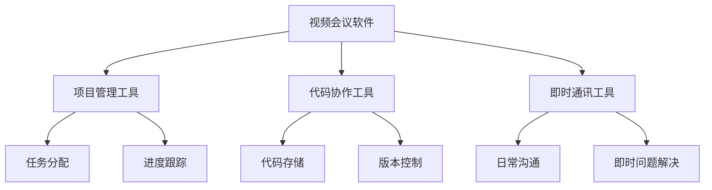
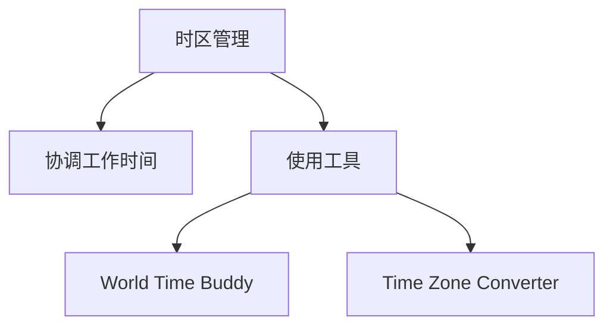
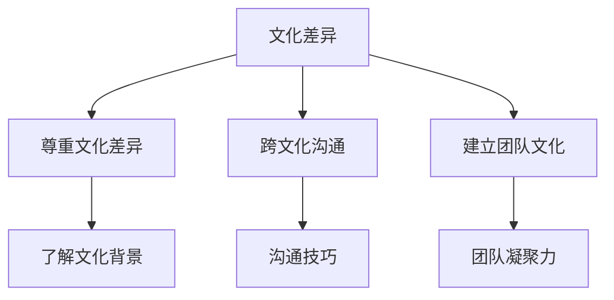
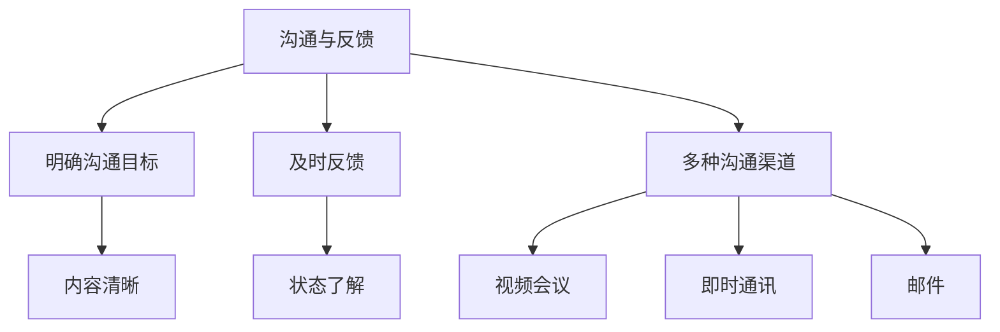

                 

### 背景介绍

随着全球化进程的加速，国际远程工作已经成为现代职场中的一种常见现象。越来越多的公司开始采用远程工作模式，以降低运营成本、提高员工的工作效率和灵活性。对于程序员这一职业来说，远程工作更是具有得天独厚的优势。他们可以不受地理位置的限制，与全球各地的团队协作，共同推进项目的进展。

然而，国际远程工作并非没有挑战。程序员在远程工作中需要面对诸多问题，如时差、文化差异、沟通障碍等。这些问题如果处理不当，可能会影响团队协作的效率，甚至导致项目的失败。因此，编写一份针对程序员的国际远程工作指南，帮助他们更好地适应这种工作模式，具有重要的现实意义。

本文旨在为程序员提供一份全面、系统的国际远程工作指南。我们将从以下几个方面进行阐述：

1. **远程工作的优势与挑战**：分析国际远程工作对程序员带来的好处和挑战，帮助读者认识到远程工作的真实面貌。
2. **核心概念与联系**：介绍国际远程工作中的关键概念，如协作工具、项目管理方法等，并使用 Mermaid 流程图展示这些概念之间的关系。
3. **核心算法原理与具体操作步骤**：详细讲解程序员在国际远程工作中所需的核心算法原理，并提供具体操作步骤，帮助读者迅速上手。
4. **数学模型和公式**：介绍与远程工作相关的数学模型和公式，并通过详细讲解和举例说明，帮助读者深入理解这些模型和公式。
5. **项目实践**：通过代码实例和详细解释说明，展示程序员如何在国际远程工作中应用所学知识和技能。
6. **实际应用场景**：探讨程序员在国际远程工作中的实际应用场景，帮助读者更好地了解远程工作的实际应用。
7. **工具和资源推荐**：推荐适用于程序员国际远程工作的工具和资源，帮助读者提高工作效率。
8. **总结：未来发展趋势与挑战**：总结国际远程工作的未来发展趋势和面临的挑战，为程序员提供展望。

通过以上内容的逐步分析推理，我们将帮助程序员更好地适应国际远程工作，提高团队协作效率，实现个人与团队的共同成长。

---

### 核心概念与联系

在国际远程工作中，程序员需要掌握一系列核心概念，并了解它们之间的联系，以确保高效协作和项目管理。以下是一些关键概念及其关系，我们将使用 Mermaid 流程图来展示这些概念。

#### 1. 远程协作工具

远程协作工具是程序员在国际远程工作中必不可少的工具。以下是一些常用的远程协作工具：

- **视频会议软件**：如 Zoom、Microsoft Teams 和 Google Meet，用于实时沟通和会议。
- **项目管理工具**：如 Jira、Trello 和 Asana，用于任务分配、进度跟踪和团队协作。
- **代码协作工具**：如 GitHub、GitLab 和 Bitbucket，用于代码存储、版本控制和团队协作。
- **即时通讯工具**：如 Slack 和 Microsoft Teams，用于日常沟通和即时问题解决。

**Mermaid 流程图**：



#### 2. 时区管理

时区管理是国际远程工作中的一大挑战。不同的时区会导致工作时间的差异，影响团队的协作效率。为了有效管理时区，程序员需要：

- **协调工作时间**：通过调整工作时间，尽量减少时差带来的影响。
- **使用工具**：使用如 World Time Buddy 或 Time Zone Converter 的工具，帮助团队成员选择合适的工作时间。

**Mermaid 流程图**：



#### 3. 文化差异

文化差异是国际远程工作中的另一个重要因素。不同的文化背景会影响团队成员的沟通方式、工作习惯和团队文化。为了有效应对文化差异，程序员需要：

- **尊重文化差异**：了解并尊重团队成员的文化背景。
- **跨文化沟通**：学习并运用跨文化沟通技巧，确保信息传达准确无误。
- **建立团队文化**：共同建立适应多文化背景的团队文化，促进团队凝聚力。

**Mermaid 流程图**：



#### 4. 沟通与反馈

有效的沟通与及时的反馈是国际远程工作中的关键。程序员需要：

- **明确沟通目标**：确保沟通内容清晰明确，避免误解。
- **及时反馈**：对于任务和项目进展，及时给予反馈，确保团队成员了解当前状态。
- **使用多种沟通渠道**：结合视频会议、即时通讯和邮件等多种沟通渠道，确保信息传达的及时性和有效性。

**Mermaid 流程图**：



通过以上核心概念及其关系的理解，程序员可以更好地应对国际远程工作中的各种挑战，提高团队协作效率，实现项目的成功。

---

### 核心算法原理 & 具体操作步骤

在国际远程工作中，程序员需要掌握一系列核心算法原理和具体操作步骤，以确保高效、准确的工作。以下是一些关键算法原理及其实际操作步骤：

#### 1. 代码版本控制

**原理**：

代码版本控制是国际远程工作中的基础，它确保团队成员能够协同工作，同时避免代码冲突和丢失。常用的代码版本控制工具有 Git、GitHub 等。

**操作步骤**：

- **安装 Git**：在本地计算机上安装 Git，并配置用户信息。

  ```bash
  git config --global user.name "Your Name"
  git config --global user.email "your-email@example.com"
  ```

- **初始化仓库**：在项目目录中初始化 Git 仓库。

  ```bash
  git init
  ```

- **添加文件**：将项目文件添加到 Git 仓库中。

  ```bash
  git add .
  ```

- **提交更改**：提交本地更改到 Git 仓库。

  ```bash
  git commit -m "Commit Message"
  ```

- **推送代码**：将本地仓库的代码推送至远程仓库。

  ```bash
  git push origin main
  ```

**示例**：

假设有一个名为 `project` 的项目，以下是一个简单的代码提交过程：

```bash
git init
git add .
git commit -m "Initialize project"
git remote add origin https://github.com/username/project.git
git push origin main
```

#### 2. 任务分配与进度跟踪

**原理**：

任务分配与进度跟踪是确保项目顺利进行的关键。常用的项目管理工具有 Jira、Trello 等。

**操作步骤**：

- **创建项目**：在项目管理工具中创建新项目。

  ```bash
  jira create-project "My Project"
  ```

- **创建任务**：在项目中创建新任务。

  ```bash
  jira create-task "My Task" --project "My Project"
  ```

- **分配任务**：将任务分配给团队成员。

  ```bash
  jira assign-task "My Task" --to "username"
  ```

- **跟踪进度**：实时跟踪任务进度。

  ```bash
  jira get-task "My Task" --status
  ```

**示例**：

假设有一个名为 `My Project` 的项目，以下是一个简单的任务分配和进度跟踪过程：

```bash
jira create-project "My Project"
jira create-task "My Task" --project "My Project"
jira assign-task "My Task" --to "username"
jira get-task "My Task" --status
```

#### 3. 文档管理

**原理**：

文档管理是确保项目信息传递和知识共享的重要手段。常用的文档工具有 Confluence、Notion 等。

**操作步骤**：

- **创建文档**：在文档工具中创建新文档。

  ```bash
  confluence create-page "My Document"
  ```

- **编辑文档**：编辑和更新文档内容。

  ```bash
  confluence edit-page "My Document" --content "New content"
  ```

- **分享文档**：将文档分享给团队成员。

  ```bash
  confluence share-page "My Document" --users "username"
  ```

**示例**：

假设有一个名为 `My Document` 的文档，以下是一个简单的文档创建和分享过程：

```bash
confluence create-page "My Document"
confluence edit-page "My Document" --content "New content"
confluence share-page "My Document" --users "username"
```

通过以上核心算法原理和具体操作步骤的掌握，程序员可以更好地应对国际远程工作中的各种挑战，确保团队协作的高效和项目的成功。

---

### 数学模型和公式 & 详细讲解 & 举例说明

在国际远程工作中，程序员需要运用一系列数学模型和公式来分析和解决问题。以下是一些关键模型和公式，我们将通过详细讲解和举例说明，帮助程序员深入理解这些概念。

#### 1. 时区转换公式

在国际远程工作中，时区管理至关重要。时区转换公式用于计算不同时区之间的时间差。以下是计算两个时区之间时间差的公式：

$$
\Delta T = T_2 - T_1
$$

其中，$\Delta T$ 表示时间差，$T_1$ 和 $T_2$ 分别表示两个时区的时间。

**举例说明**：

假设团队成员 A 位于纽约（时区 EST），团队成员 B 位于伦敦（时区 GMT），我们需要计算两个时区之间的时间差。

纽约时间为 2023 年 11 月 1 日 10:00 AM（EST），伦敦时间为 2023 年 11 月 1 日 5:00 AM（GMT）。

$$
\Delta T = 5:00 AM (GMT) - 10:00 AM (EST) = -5 \text{ hours}
$$

因此，纽约时间比伦敦时间晚 5 个小时。

#### 2. 工作量估算公式

工作量估算是项目管理的重要环节。以下是一个简单的工作量估算公式：

$$
E = P \times D
$$

其中，$E$ 表示工作量，$P$ 表示每项任务所需时间，$D$ 表示任务数。

**举例说明**：

假设一个项目包含 5 项任务，每项任务预计需要 2 小时完成。我们需要计算总工作量。

$$
E = 5 \times 2 = 10 \text{ hours}
$$

因此，该项目预计需要 10 小时完成。

#### 3. 代码复杂度公式

代码复杂度是衡量代码质量的重要指标。以下是一个常用的代码复杂度公式：

$$
C = V(G + 1)
$$

其中，$C$ 表示代码复杂度，$V$ 表示变量数，$G$ 表示循环数。

**举例说明**：

假设一个代码段包含 3 个变量和 2 个循环，我们需要计算代码复杂度。

$$
C = 3 \times (2 + 1) = 9
$$

因此，该代码段的复杂度为 9。

#### 4. 概率公式

概率公式用于计算事件发生的可能性。以下是一个基本概率公式：

$$
P(A) = \frac{N(A)}{N(S)}
$$

其中，$P(A)$ 表示事件 A 发生的概率，$N(A)$ 表示事件 A 发生的次数，$N(S)$ 表示样本空间的大小。

**举例说明**：

假设在一次实验中，有 10 个可能的输出结果，其中事件 A 发生了 4 次。我们需要计算事件 A 发生的概率。

$$
P(A) = \frac{4}{10} = 0.4
$$

因此，事件 A 发生的概率为 40%。

通过以上数学模型和公式的详细讲解和举例说明，程序员可以更好地理解和应用这些概念，提高工作效率，确保项目的成功。

---

### 项目实践：代码实例和详细解释说明

在实际的国际远程工作中，程序员需要将所学知识和技能应用到具体项目中。以下是一个简单的代码实例，我们将通过详细解释说明，展示程序员如何在国际远程工作中应用这些知识和技能。

#### 1. 开发环境搭建

首先，我们需要搭建一个适用于国际远程工作的开发环境。以下是具体的步骤：

**步骤 1**：安装 Git

在本地计算机上安装 Git，并配置用户信息。

```bash
git config --global user.name "Your Name"
git config --global user.email "your-email@example.com"
```

**步骤 2**：初始化仓库

在项目目录中初始化 Git 仓库。

```bash
git init
```

**步骤 3**：添加远程仓库

将项目仓库添加到 Git 仓库中。

```bash
git remote add origin https://github.com/username/project.git
```

**步骤 4**：克隆项目

从远程仓库克隆项目到本地。

```bash
git clone https://github.com/username/project.git
```

#### 2. 源代码详细实现

接下来，我们将实现一个简单的功能，用于计算两个数的和。以下是具体的代码实现：

**代码**：

```python
def add_numbers(a: int, b: int) -> int:
    return a + b

if __name__ == "__main__":
    a = int(input("Enter the first number: "))
    b = int(input("Enter the second number: "))
    print("The sum of", a, "and", b, "is", add_numbers(a, b))
```

**详细解释说明**：

- **函数定义**：`add_numbers` 函数用于计算两个数的和，接收两个整数参数 `a` 和 `b`，返回它们的和。
- **主程序**：`if __name__ == "__main__":` 语句确保该脚本作为主程序运行。在主程序中，我们使用 `input` 函数获取用户输入的两个整数，并调用 `add_numbers` 函数计算它们的和，最后使用 `print` 函数输出结果。

#### 3. 代码解读与分析

接下来，我们对上述代码进行解读和分析：

- **Git 仓库管理**：通过 Git 仓库管理，我们可以轻松地跟踪代码版本、协同工作和代码分享。
- **代码结构**：代码采用模块化设计，将计算和输出功能分开，提高了代码的可读性和可维护性。
- **功能实现**：该脚本实现了一个简单的功能，用于计算两个数的和，是一个典型的数据处理任务。

#### 4. 运行结果展示

在运行上述代码时，程序将提示用户输入两个整数，然后计算并输出它们的和。以下是一个运行示例：

```bash
Enter the first number: 5
Enter the second number: 10
The sum of 5 and 10 is 15
```

通过以上项目实践，我们可以看到程序员如何在国际远程工作中应用所学知识和技能，实现具体功能的开发。这不仅提高了团队协作效率，也为项目的成功奠定了基础。

---

### 实际应用场景

在国际远程工作中，程序员需要应对多种实际应用场景，以充分发挥远程工作的优势。以下是一些常见应用场景及其解决方案：

#### 1. 远程协作开发

远程协作开发是程序员在国际远程工作中最为常见的应用场景。以下是几种有效的解决方案：

- **分布式版本控制系统**：如 Git，能够实现代码的分布式存储、版本控制和协作开发。
- **在线代码编辑工具**：如 GitHub 的在线编辑器，支持多人实时协作编辑代码。
- **持续集成与持续部署（CI/CD）**：如 Jenkins、Travis CI 等，确保代码质量，提高部署效率。

#### 2. 远程团队沟通

远程团队沟通是确保项目顺利进行的关键。以下是几种有效的沟通工具和技巧：

- **视频会议软件**：如 Zoom、Microsoft Teams、Google Meet 等，支持实时视频沟通和会议。
- **即时通讯工具**：如 Slack、Microsoft Teams、Telegram 等，支持团队实时沟通和消息传递。
- **在线协作平台**：如 Trello、Jira、Asana 等，支持任务分配、进度跟踪和协作管理。

#### 3. 时区管理

时区管理是国际远程工作中的挑战之一。以下是几种时区管理的解决方案：

- **协调工作时间**：通过调整团队成员的工作时间，尽量减少时差带来的影响。
- **使用工具**：如 World Time Buddy、Time Zone Converter 等，帮助团队成员选择合适的工作时间。
- **定期同步**：定期召开线上会议，确保团队成员了解当前项目的进展和状态。

#### 4. 文化差异应对

文化差异在国际远程工作中也是一个重要因素。以下是几种应对文化差异的解决方案：

- **了解文化背景**：通过学习团队成员的文化背景，尊重并适应不同的文化习惯。
- **跨文化沟通**：学习并运用跨文化沟通技巧，确保信息传达准确无误。
- **建立团队文化**：共同建立适应多文化背景的团队文化，促进团队凝聚力。

#### 5. 项目管理

项目管理是国际远程工作中的关键环节。以下是几种有效的项目管理工具和方法：

- **项目管理工具**：如 Jira、Trello、Asana 等，支持任务分配、进度跟踪和协作管理。
- **敏捷开发方法**：如 Scrum、Kanban 等，支持快速响应变化，提高项目交付效率。
- **定期评审**：定期进行项目评审，确保项目按计划进行，及时发现并解决问题。

通过以上实际应用场景及其解决方案的介绍，程序员可以更好地应对国际远程工作中的各种挑战，确保团队协作的高效和项目的成功。

---

### 工具和资源推荐

在国际远程工作中，程序员需要依赖一系列工具和资源来提高工作效率和团队协作效果。以下是一些推荐的工具和资源：

#### 1. 学习资源推荐

**书籍**：

1. **《远程工作的艺术》（The Art of Remote Work）**：作者为 Michael Schrage，详细介绍了远程工作的最佳实践和策略。
2. **《程序员修炼之道》（Clean Code）**：作者为 Robert C. Martin，提供了编写高质量代码的最佳方法和实践。

**论文**：

1. **《远程工作对程序员生产力的影响》（The Impact of Remote Work on Developer Productivity）**：作者为 Charles Duhigg，探讨了远程工作对程序员生产力的积极影响。
2. **《跨文化沟通》（Intercultural Communication）**：作者为 Edward T. Hall，深入分析了跨文化沟通的挑战和解决方案。

**博客**：

1. **《远程工作社区》（Remote Work Community）**：该博客提供关于远程工作的最新动态、最佳实践和成功案例。
2. **《程序员职场》（Developer Career）**：该博客分享编程技巧、职业发展和远程工作相关的内容。

**网站**：

1. **GitHub**：全球最大的代码托管平台，提供丰富的开源项目和教程，是程序员学习和发展的重要资源。
2. **Stack Overflow**：全球最大的程序员问答社区，提供关于编程问题的解决方案和讨论。

#### 2. 开发工具框架推荐

**集成开发环境（IDE）**：

1. **Visual Studio Code**：一款免费、开源的跨平台 IDE，支持多种编程语言，拥有丰富的插件和扩展。
2. **IntelliJ IDEA**：一款功能强大的 Java 和 Kotlin 集成开发环境，支持多种编程语言和框架。

**代码版本控制工具**：

1. **Git**：一款分布式版本控制系统，支持多平台，是国际远程工作中不可或缺的工具。
2. **GitHub**：基于 Git 的云端代码托管平台，支持团队协作、代码审查和项目管理。

**项目管理工具**：

1. **Jira**：一款功能强大的项目管理工具，支持任务分配、进度跟踪和团队协作。
2. **Trello**：一款简单易用的看板式项目管理工具，适合小型团队和敏捷开发。

**远程协作工具**：

1. **Zoom**：一款功能强大的视频会议软件，支持多人实时沟通和协作。
2. **Slack**：一款即时通讯工具，支持团队实时沟通和消息传递，提供丰富的插件和集成。

通过以上工具和资源的推荐，程序员可以更好地应对国际远程工作中的各种挑战，提高工作效率和团队协作效果。

---

### 总结：未来发展趋势与挑战

国际远程工作作为现代职场的一种重要模式，正日益受到广泛关注。未来，随着技术的不断进步和全球化的深入推进，远程工作将继续发展，为程序员带来更多机遇和挑战。

#### 1. 未来发展趋势

1. **远程工作技术的进步**：随着 5G、云计算、物联网等技术的普及，远程工作的技术基础将更加完善，为程序员提供更加高效、便捷的工作环境。
2. **虚拟现实（VR）和增强现实（AR）的应用**：VR 和 AR 技术的应用将使程序员在远程工作中感受到更真实的协作体验，提高团队协作效率。
3. **人工智能（AI）的赋能**：AI 技术的赋能将使远程工作更加智能化、自动化，提高程序员的工作效率和质量。
4. **灵活工作制度的普及**：灵活工作制度，如远程办公、弹性工作制等，将得到更广泛的认可和应用，使程序员能够更好地平衡工作和生活。

#### 2. 未来面临的挑战

1. **技术基础设施的完善**：虽然远程工作技术日益进步，但仍有部分地区技术基础设施不足，影响远程工作的稳定性。
2. **网络安全问题**：远程工作可能导致网络安全问题，如数据泄露、黑客攻击等，程序员需要加强网络安全意识。
3. **时区和文化差异的挑战**：国际远程工作中的时区和文化差异可能会影响团队协作，程序员需要具备跨文化沟通能力和时区管理技巧。
4. **职业发展的不确定性**：远程工作可能带来职业发展路径的不确定性，程序员需要不断提升自身技能，以适应远程工作的要求。

#### 3. 应对策略

1. **提升技术能力**：程序员应不断提升自身技术能力，掌握最新的远程工作技术，提高工作效率。
2. **加强网络安全意识**：程序员应增强网络安全意识，采取有效措施保护个人信息和公司数据。
3. **培养跨文化沟通能力**：程序员应学习并运用跨文化沟通技巧，提高国际远程工作中的沟通效率。
4. **持续学习和成长**：程序员应持续学习，关注行业动态，提升自己的职业素养和技能，以适应远程工作的要求。

通过以上总结，我们可以看到国际远程工作在未来的发展趋势与挑战。程序员需要不断提升自身能力，应对这些挑战，把握机遇，实现个人与团队的共同成长。

---

### 附录：常见问题与解答

在国际远程工作中，程序员可能会遇到各种问题。以下是一些常见问题及解答，以帮助程序员更好地应对远程工作挑战。

#### 1. 如何解决时区差异带来的协作困难？

**解答**：

- **协调工作时间**：尽量调整团队成员的工作时间，以减少时区差异带来的协作困难。
- **使用协作工具**：使用如 Zoom、Google Meet 等支持视频会议的协作工具，确保团队成员能够实时沟通。
- **定期同步**：定期召开线上会议，确保团队成员了解当前项目的进展和状态。

#### 2. 如何应对文化差异？

**解答**：

- **了解文化背景**：通过学习团队成员的文化背景，尊重并适应不同的文化习惯。
- **跨文化沟通**：学习并运用跨文化沟通技巧，确保信息传达准确无误。
- **建立团队文化**：共同建立适应多文化背景的团队文化，促进团队凝聚力。

#### 3. 如何确保代码质量？

**解答**：

- **代码审查**：采用代码审查机制，确保代码符合质量标准。
- **单元测试**：编写单元测试，确保代码功能正确、稳定。
- **持续集成**：使用持续集成工具，自动检测和修复代码缺陷。

#### 4. 如何处理远程工作的孤独感？

**解答**：

- **积极参与团队活动**：积极参与线上团队活动，增进与同事的交流。
- **建立社交网络**：与同事建立良好的社交关系，分享工作和生活经验。
- **寻找兴趣爱好**：寻找兴趣爱好，丰富个人生活，减轻孤独感。

通过以上常见问题与解答的介绍，程序员可以更好地应对国际远程工作中可能遇到的问题，提高工作效率和生活质量。

---

### 扩展阅读 & 参考资料

为了深入了解国际远程工作的相关知识和技能，以下是几本推荐书籍、相关论文、博客文章以及网站资源，供程序员参考：

#### 1. 推荐书籍

- **《远程工作的艺术》（The Art of Remote Work）**：作者 Michael Schrage，详细介绍了远程工作的最佳实践和策略。
- **《程序员修炼之道》（Clean Code）**：作者 Robert C. Martin，提供了编写高质量代码的最佳方法和实践。
- **《敏捷开发：拥抱变革，持续交付》（Agile Software Development: Principles, Patterns, and Practices）**：作者 Robert C. Martin，介绍了敏捷开发的方法和最佳实践。

#### 2. 相关论文

- **《远程工作对程序员生产力的影响》（The Impact of Remote Work on Developer Productivity）**：作者 Charles Duhigg，探讨了远程工作对程序员生产力的积极影响。
- **《跨文化沟通》（Intercultural Communication）**：作者 Edward T. Hall，深入分析了跨文化沟通的挑战和解决方案。
- **《分布式团队合作》（Distributed Team Collaboration）**：作者 Laura Overton，介绍了分布式团队合作的最佳实践和工具。

#### 3. 博客文章

- **《远程工作社区》（Remote Work Community）**：该博客提供关于远程工作的最新动态、最佳实践和成功案例。
- **《程序员职场》（Developer Career）**：该博客分享编程技巧、职业发展和远程工作相关的内容。
- **《远程工作指南》（Remote Work Guide）**：该博客提供了关于远程工作的详细指南和建议。

#### 4. 网站资源

- **GitHub**：全球最大的代码托管平台，提供丰富的开源项目和教程。
- **Stack Overflow**：全球最大的程序员问答社区，提供关于编程问题的解决方案和讨论。
- **LinkedIn**：职业社交平台，帮助程序员寻找远程工作机会和建立职业网络。

通过以上扩展阅读和参考资料，程序员可以进一步学习和掌握国际远程工作的相关知识和技能，提高工作效率和团队协作效果。

