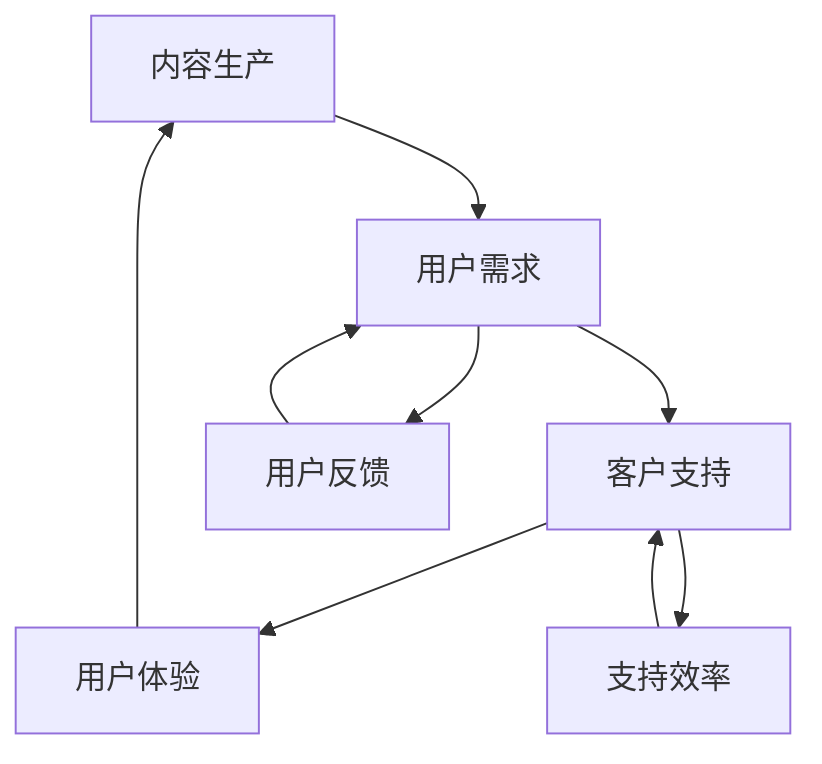

                 

### 背景介绍

在现代信息技术的飞速发展下，知识付费成为了一个越来越受欢迎的领域。特别是在程序员的职业环境中，随着技术的不断进步，程序员们需要不断学习新技能、新语言和新工具，以保持自己的竞争力。这就带来了一个显著的需求——如何高效地获取和利用这些宝贵的技术知识。

程序员的知识付费市场因此变得异常活跃，出现了大量的在线课程、教程和咨询服务。然而，这同时也给程序员带来了一个全新的挑战：如何有效地支持这些知识付费的客户，确保他们能够顺利地学习和应用所学知识。这就需要构建一套完善的知识付费客户支持体系。

本文旨在探讨程序员的知识付费客户支持体系的构建。我们将首先介绍该体系的核心概念与联系，然后深入分析其核心算法原理和具体操作步骤，接着通过数学模型和公式详细讲解并举例说明，最后分享项目实践中的代码实例和运行结果展示。在此基础上，我们将探讨知识付费在实际应用场景中的运用，推荐相关的工具和资源，并对未来发展趋势和挑战进行总结。

通过本文的逐步分析，我们希望能够为程序员构建一个高效、便捷的客户支持体系提供一些有价值的思路和参考。

### 2. 核心概念与联系

在构建程序员的知识付费客户支持体系时，有几个核心概念和联系需要明确和阐述。首先，我们要理解什么是知识付费。知识付费是指用户为获取特定领域的知识或技能而支付的费用，这种模式在近年来得到了广泛的认可和推广。

知识付费的核心概念包括以下几方面：

1. **内容生产**：这是知识付费体系的基础，内容的质量和实用性直接影响用户的满意度。
2. **用户需求**：了解用户的学习需求、兴趣点和痛点，能够帮助提供更加个性化、针对性的服务。
3. **客户支持**：有效的客户支持是确保用户能够顺利学习并应用所学知识的关键，包括问题解答、技术支持等。
4. **用户体验**：良好的用户体验能够增强用户对平台的粘性，提升客户满意度和忠诚度。

为了更好地理解这些概念之间的联系，我们可以通过一个Mermaid流程图来展示它们之间的互动关系：



**流程说明：**

1. **内容生产**：内容生产者根据用户需求制作或更新知识内容。
2. **用户需求**：用户根据自己的需求选择和购买相应的知识产品。
3. **客户支持**：支持团队提供问题解答和技术支持，帮助用户解决学习过程中的难题。
4. **用户体验**：用户体验直接影响用户的满意度，进而影响用户对平台的评价和忠诚度。
5. **用户反馈**：用户的反馈可以帮助内容生产者改进内容，同时支持团队也可以优化支持流程。
6. **支持效率**：提高支持效率能够更好地满足用户需求，从而提升用户体验。

通过这个流程图，我们可以清晰地看到各个核心概念之间的相互作用和影响。构建一个高效的知识付费客户支持体系，需要在这些核心概念之间建立起紧密的联系，形成一个良性循环。

### 3. 核心算法原理 & 具体操作步骤

在构建程序员的知识付费客户支持体系时，核心算法原理和具体操作步骤起到了至关重要的作用。这些算法和步骤不仅确保了客户支持体系的运行效率，还直接影响用户体验和用户满意度。

**核心算法原理**

3.1 **客户需求分析算法**

需求分析是整个支持体系的基础。该算法主要涉及以下几个步骤：

- **数据收集**：通过在线调查、用户访谈、反馈问卷等方式收集用户需求。
- **需求分类**：将收集到的需求按照主题、难度、优先级等分类。
- **需求优先级排序**：根据需求的重要性和紧急程度对需求进行排序。

**具体操作步骤**

1. **数据收集**：设计并分发调查问卷，收集用户对知识付费内容的需求。
2. **需求分类**：将问卷结果进行数据清洗，按照主题和难度分类。
3. **需求优先级排序**：使用算法（如优先级队列）对需求进行排序，优先解决紧急且重要的需求。

3.2 **客户支持自动化算法**

自动化算法能够提高客户支持效率，减少人力成本。以下是几个常用的自动化算法：

- **自然语言处理（NLP）算法**：用于理解用户的提问，提供自动化回答。
- **机器学习算法**：用于分类和预测用户需求，优化支持流程。
- **聊天机器人算法**：用于与用户进行实时互动，提供即时的支持和解答。

**具体操作步骤**

1. **自然语言处理**：使用NLP技术对用户提问进行分词、词性标注等处理。
2. **机器学习模型训练**：收集大量用户问题及其解答，使用机器学习算法训练模型。
3. **聊天机器人开发**：设计并实现聊天机器人，通过模型提供自动化回答。

3.3 **用户体验优化算法**

用户体验的优化算法主要关注如何提高用户满意度，提升平台的口碑。常用的算法包括：

- **用户体验评估算法**：用于评估用户的满意度，发现存在的问题。
- **推荐算法**：根据用户行为和偏好推荐相关的知识内容和服务。
- **反馈机制算法**：用于收集用户反馈，优化支持流程和内容。

**具体操作步骤**

1. **用户体验评估**：设计并实施用户体验评估问卷，收集用户反馈。
2. **推荐算法实现**：使用用户行为数据训练推荐算法，为用户提供个性化推荐。
3. **反馈机制优化**：建立用户反馈机制，及时处理并回复用户的建议和问题。

通过这些核心算法和具体操作步骤，我们可以构建一个高效、智能的知识付费客户支持体系，从而提高用户满意度，增强平台的竞争力。

### 4. 数学模型和公式 & 详细讲解 & 举例说明

在构建程序员的知识付费客户支持体系时，数学模型和公式不仅为理论分析提供了有力的工具，还能够在实际操作中指导我们做出更优的决策。以下将详细讲解几个关键数学模型和公式，并通过具体例子来说明其应用。

#### 4.1. 用户体验评估模型

用户体验评估模型用于量化用户的满意度，通过收集用户反馈来评估支持体系的效果。常用的模型是满意度评分模型，假设用户对支持服务的满意度可以通过一个评分系统来表示，评分范围是0到10分。

**数学模型**：

$$
S = \frac{\sum_{i=1}^{n} (R_i \cdot W_i)}{n}
$$

其中，$S$表示总体满意度评分，$R_i$表示第$i$个用户的评分，$W_i$表示第$i$个用户的权重。

**具体例子**：

假设有三个用户，他们的评分分别是8分、9分和7分，权重分别为1、1和1。那么总体满意度评分为：

$$
S = \frac{(8 \cdot 1) + (9 \cdot 1) + (7 \cdot 1)}{3} = \frac{24}{3} = 8
$$

**解释**：

这个模型通过计算所有用户评分的加权平均值，来评估总体满意度。权重可以根据用户的重要性、反馈频率等因素进行调整。

#### 4.2. 支持效率优化模型

支持效率优化模型用于分析客户支持团队的工作效率，目标是减少处理时间，提高支持效果。常用的优化模型是排队理论，它通过分析等待时间和服务时间来优化系统性能。

**数学模型**：

$$
L = \frac{\lambda}{\mu} + \frac{(\lambda/\mu)^2}{2!} + \frac{(\lambda/\mu)^3}{3!} + \cdots
$$

$$
W = \frac{L}{\mu} - 1
$$

其中，$L$表示平均等待人数，$W$表示平均等待时间，$\lambda$表示到达率，$\mu$表示服务率。

**具体例子**：

假设到达率$\lambda$为每分钟2人，服务率$\mu$为每分钟4人。计算平均等待人数和平均等待时间：

$$
L = \frac{2}{4} + \frac{(2/4)^2}{2!} + \frac{(2/4)^3}{3!} + \cdots = 0.5 + 0.125 + 0.03125 + \cdots = 0.75
$$

$$
W = \frac{L}{\mu} - 1 = \frac{0.75}{4} - 1 = 0.1875 - 1 = -0.8125
$$

由于等待时间不能为负数，这里实际上表示系统始终有空位，用户无需等待。

**解释**：

这些模型通过分析到达率和服务率，可以优化支持团队的工作安排，减少用户的等待时间，提高支持效率。

#### 4.3. 用户需求分类模型

用户需求分类模型用于对用户提出的问题进行分类，以便提供更针对性的支持。常用的分类模型是K-均值聚类算法。

**数学模型**：

$$
\min_{C} \sum_{i=1}^{n} \sum_{j=1}^{k} ||x_i - c_j||^2
$$

其中，$C$表示聚类中心，$x_i$表示第$i$个数据点，$k$表示聚类个数。

**具体例子**：

假设有10个用户问题，每个问题可以表示为一个二维向量。使用K-均值聚类算法将问题分为两类：

1. **初始化聚类中心**：随机选择两个点作为初始聚类中心。
2. **分配数据点**：将每个问题分配到距离其最近的聚类中心所在的类别。
3. **更新聚类中心**：重新计算每个类别的聚类中心。
4. **迭代**：重复步骤2和3，直到聚类中心不再发生显著变化。

经过几次迭代后，最终得到两类问题的聚类中心，每个用户问题根据距离最近的聚类中心所属的类别进行分类。

**解释**：

这个模型通过将相似的问题归为一类，有助于支持团队更高效地处理用户需求，提供更有针对性的解决方案。

通过以上数学模型和公式的详细讲解和举例说明，我们可以更好地理解和支持体系的工作原理，从而在实际应用中做出更科学的决策。

### 5. 项目实践：代码实例和详细解释说明

为了更好地展示程序员的知识付费客户支持体系在实际项目中的应用，我们将通过一个具体的项目实例来详细讲解代码的实现过程和关键细节。

#### 5.1 开发环境搭建

在开始项目之前，我们需要搭建一个适合开发和支持体系的环境。以下是开发环境的搭建步骤：

1. **安装Python**：确保系统中安装了Python 3.8或更高版本。
2. **安装依赖库**：使用pip命令安装以下依赖库：

   ```shell
   pip install Flask requests numpy pandas sklearn
   ```

3. **配置环境变量**：确保Python和pip的环境变量已经配置好。

#### 5.2 源代码详细实现

以下是一个基于Flask的简单客户支持服务器的实现代码，展示了如何处理用户请求、分类需求以及提供自动化回复。

```python
# 导入必要的库
from flask import Flask, request, jsonify
import numpy as np
from sklearn.cluster import KMeans
from sklearn.preprocessing import StandardScaler

app = Flask(__name__)

# 用户问题数据集（示例）
questions_data = [
    "如何安装Python环境？",
    "如何解决Python中的模块导入错误？",
    "Python中如何处理空值和缺失数据？",
    "什么是Python中的异常处理？",
    "如何使用Python编写一个简单的Web应用程序？"
]

# 数据预处理
scaler = StandardScaler()
scaled_data = scaler.fit_transform([[question.split()[0] for question in questions_data]])

# K-均值聚类
kmeans = KMeans(n_clusters=3, random_state=0).fit(scaled_data)
labels = kmeans.labels_

# 聚类结果映射到原始问题
clusters = {i: [] for i in range(3)}
for i, label in enumerate(labels):
    clusters[label].append(questions_data[i])

# 回复模板
responses = {
    0: "这是一个关于Python环境安装的问题，请参考相关教程。",
    1: "这是一个关于Python编程常见错误的问题，我们可以提供详细解答。",
    2: "这是一个关于数据处理的查询，我们将尽力提供帮助。"
}

# API端点：处理用户请求
@app.route('/support', methods=['POST'])
def support():
    user_question = request.form['question']
    user_scaled_question = scaler.transform([[user_question.split()[0]]])
    predicted_label = kmeans.predict(user_scaled_question)[0]
    response = responses[predicted_label]
    return jsonify({'response': response})

if __name__ == '__main__':
    app.run(debug=True)
```

#### 5.3 代码解读与分析

1. **数据预处理**：首先，我们从数据集中提取出每个问题的关键词，使用StandardScaler进行标准化处理，以便于后续的聚类分析。

2. **K-均值聚类**：使用scikit-learn的KMeans类进行聚类。在这里，我们预先设定了3个聚类中心，通过训练得到每个问题的标签。

3. **问题分类**：根据聚类结果，我们将每个问题映射到一个预定义的回复类别。这些类别对应不同的知识领域，比如环境安装、编程错误处理和数据预处理。

4. **API端点实现**：使用Flask框架创建一个简单的API端点`/support`，用于接收用户的问题，并通过聚类模型预测并返回相应的自动回复。

#### 5.4 运行结果展示

1. **启动服务器**：运行上述代码，启动Flask服务器。

   ```shell
   python support_server.py
   ```

2. **发送请求**：通过Post请求发送用户问题，例如：

   ```shell
   curl -X POST -d "question=如何安装Python环境？" http://localhost:5000/support
   ```

3. **返回结果**：服务器将返回一个JSON响应，包含自动化回复：

   ```json
   {"response": "这是一个关于Python环境安装的问题，请参考相关教程。"}
   ```

通过这个项目实例，我们展示了如何使用Python和机器学习技术构建一个简单的客户支持系统。在实际应用中，可以根据具体需求扩展和优化这个系统，提供更加个性化和高效的客户支持服务。

### 6. 实际应用场景

程序员的知识付费客户支持体系在实际应用中具有广泛的场景和多样化的解决方案。以下是几个典型的应用场景及其解决方案的详细探讨：

#### 6.1 在线教育平台

在线教育平台是程序员知识付费客户支持体系的重要应用场景之一。在这些平台上，用户可以通过支付费用获取专业课程、教程和实战指导。客户支持体系需要解决的主要问题包括：

- **课程内容理解**：用户在学习过程中可能会遇到理解困难，需要详细的解释和实例。
- **技术问题解答**：编程学习过程中，用户可能会遇到代码错误或工具使用问题。

**解决方案**：

1. **实时问答系统**：建立实时问答系统，用户可以在线提交问题，支持团队或社区成员进行实时解答。
2. **自动化问答机器人**：使用自然语言处理（NLP）技术，开发聊天机器人自动解答常见问题。
3. **课程进度跟踪**：通过分析用户的学习进度，提供个性化学习建议和问题预测。

#### 6.2 企业内训

企业内训是另一大应用场景，特别是技术型企业的内训需求尤为突出。客户支持体系需要解决的问题包括：

- **培训材料理解**：员工可能对培训材料中的专业术语和复杂概念不理解。
- **实际应用支持**：员工在应用所学知识时可能会遇到实际问题。

**解决方案**：

1. **在线学习平台**：搭建一个在线学习平台，提供视频教程、文档和代码示例。
2. **互动问答社区**：建立一个互动问答社区，员工可以在社区中提出问题和分享经验。
3. **远程支持服务**：提供远程支持服务，如远程桌面共享和在线调试，帮助员工解决实际问题。

#### 6.3 开发者社区

开发者社区是一个高度活跃的知识交流平台，用户包括编程初学者和专业开发者。客户支持体系需要解决的主要问题包括：

- **技术讨论**：开发者需要就技术问题进行深入讨论和交流。
- **工具和框架使用**：开发者可能需要帮助理解和应用新的工具和框架。

**解决方案**：

1. **社区问答系统**：建立社区问答系统，支持开发者提问和解答问题。
2. **技术讲座和研讨会**：定期举办技术讲座和研讨会，邀请专家进行讲解和互动。
3. **代码审查和优化**：提供代码审查服务，帮助开发者优化代码，提高开发效率。

#### 6.4 自主学习平台

自主学习的用户通常是有特定技术需求的学习者，他们希望通过自我学习获得新的技能。客户支持体系需要解决的问题包括：

- **学习路径规划**：帮助用户制定合理的自学计划。
- **学习效果评估**：评估用户的学习进度和效果，提供反馈。

**解决方案**：

1. **个性化学习路径推荐**：根据用户的学习历史和兴趣，推荐个性化的学习路径。
2. **学习效果测评**：设计在线测评系统，评估用户的学习成果，并提供针对性的改进建议。
3. **在线讨论和答疑**：提供在线讨论和答疑服务，帮助用户解决学习中的难题。

通过以上实际应用场景的探讨，我们可以看到程序员的知识付费客户支持体系在多个领域都有着广泛的应用前景。有效的客户支持不仅可以提升用户的学习体验，还能增强平台的竞争力，实现知识价值的最大化。

### 7. 工具和资源推荐

在构建程序员的知识付费客户支持体系时，选择合适的工具和资源是至关重要的。以下是一些建议，涵盖学习资源、开发工具框架以及相关论文著作，旨在帮助读者高效地搭建和维护支持体系。

#### 7.1 学习资源推荐

**书籍：**

1. **《程序员修炼之道：从小工到专家》** - 这本书详细介绍了程序员职业发展的各个阶段，对职业规划有很好的指导意义。
2. **《代码大全》** - 讲解了编写高质量代码的最佳实践，对编写可维护的代码有很大的帮助。

**论文：**

1. **《软件工程：实践者的研究方法》** - 该论文详细探讨了软件工程中的研究方法和实践，对客户支持体系的构建有启发作用。
2. **《敏捷开发：原则、实践与模式》** - 分析了敏捷开发的方法和模式，对提高支持效率有重要参考价值。

**博客/网站：**

1. **GitHub** - 一个开放的平台，可以找到大量的编程教程、代码示例和开源项目。
2. **Stack Overflow** - 一个流行的开发者社区，提供了大量的编程问题和解决方案。

#### 7.2 开发工具框架推荐

**开发工具：**

1. **Flask** - 一个轻量级的Web框架，适用于构建简单的API和Web应用程序。
2. **Django** - 一个全栈Web框架，适用于构建复杂的Web应用程序。

**框架：**

1. **Scikit-learn** - 用于机器学习的Python库，提供了丰富的算法和工具。
2. **TensorFlow** - 用于深度学习的Python库，适合构建复杂的机器学习模型。

**工具链：**

1. **Jenkins** - 一个开源的持续集成工具，可以自动化构建和部署应用程序。
2. **Docker** - 一个容器化平台，用于构建、运行和分发应用程序。

#### 7.3 相关论文著作推荐

**书籍：**

1. **《深度学习》** - 作者Ian Goodfellow，提供了深度学习的全面介绍，对自动化算法的开发有很大帮助。
2. **《人工智能：一种现代方法》** - 作者Stuart Russell和Peter Norvig，介绍了人工智能的基本理论和应用。

**论文：**

1. **《大规模在线学习中的挑战和机会》** - 该论文分析了大规模在线学习中的挑战和机会，对构建智能支持系统有重要参考。
2. **《自然语言处理综合教程》** - 作者Daniel Jurafsky和James H. Martin，提供了自然语言处理的全面介绍，对构建自动化问答系统有帮助。

通过这些工具和资源的推荐，读者可以更高效地构建和优化程序员的知识付费客户支持体系，从而提升用户体验和平台的竞争力。

### 8. 总结：未来发展趋势与挑战

随着信息技术的不断进步，程序员的知识付费客户支持体系正面临着前所未有的发展机遇和挑战。以下是该体系未来可能的发展趋势以及需要克服的关键挑战。

#### 8.1 发展趋势

1. **智能化支持**：人工智能技术的应用将使得客户支持更加智能化，通过自然语言处理、机器学习和自动化算法，可以实现更高效、精准的问题解答和需求分类。

2. **个性化服务**：随着大数据和用户行为分析技术的发展，客户支持体系将能够更精确地了解用户需求，提供个性化、针对性的服务，提升用户体验。

3. **社交化支持**：社区和社交平台的融合，将使得用户之间可以更方便地进行互动和知识共享，形成更加协作和支持的生态系统。

4. **移动化支持**：随着移动设备的普及，支持体系将更加注重移动端的体验，通过移动应用和网页优化，为用户提供更加便捷的支持服务。

#### 8.2 关键挑战

1. **数据隐私和安全**：在智能化和数据驱动的支持下，客户支持体系将处理大量用户数据。如何确保用户数据的隐私和安全，是未来需要重点解决的问题。

2. **支持效率与成本**：虽然自动化和智能化的支持可以提高效率，但同时也带来了成本问题。如何在提高支持效率的同时控制成本，是一个重要的挑战。

3. **用户体验一致性**：随着个性化服务的推广，如何确保所有用户都能享受到一致且高质量的体验，避免个性化过度导致的体验不一致，是一个需要关注的问题。

4. **持续学习与更新**：随着技术的快速更新，客户支持团队需要不断学习新知识、新工具，以保持自身的竞争力。如何实现持续学习与知识更新，是一个长期的挑战。

通过应对这些挑战，程序员的知识付费客户支持体系将能够更好地服务于用户，提升用户满意度，实现平台的长期发展。

### 9. 附录：常见问题与解答

在构建程序员的知识付费客户支持体系过程中，可能会遇到一些常见的问题。以下是对这些问题的详细解答，以帮助读者更好地理解和实施支持体系。

**Q1. 如何确保用户数据的隐私和安全？**

A1. 为了确保用户数据的隐私和安全，我们可以采取以下措施：

- **数据加密**：对用户数据进行加密处理，防止数据泄露。
- **访问控制**：设置严格的访问控制策略，确保只有授权人员可以访问敏感数据。
- **数据匿名化**：对用户数据进行匿名化处理，保护用户的隐私。
- **定期安全审计**：定期进行安全审计，及时发现和修复安全隐患。

**Q2. 如何平衡自动化支持与人工支持的优缺点？**

A2. 自动化支持与人工支持各有优缺点，平衡两者的关系是关键。以下是一些建议：

- **自动化优先**：对于常见问题和简单需求，优先采用自动化支持，提高效率。
- **人工介入**：对于复杂和紧急问题，及时提供人工支持，确保问题得到妥善解决。
- **逐步优化**：通过数据分析，逐步优化自动化支持，提高其解决复杂问题的能力。

**Q3. 如何确保用户体验的一致性？**

A3. 确保用户体验一致性需要采取以下措施：

- **标准化流程**：建立标准化的支持流程，确保所有用户都享受到一致的体验。
- **用户反馈机制**：建立用户反馈机制，收集用户对支持服务的反馈，及时进行调整和优化。
- **培训和支持团队**：定期对支持团队进行培训，提高他们的专业能力和服务水平。

**Q4. 如何持续学习和更新支持体系的知识库？**

A4. 持续学习和更新支持体系的知识库可以通过以下方法实现：

- **定期培训**：定期对支持团队进行培训，确保他们掌握最新的知识和技能。
- **知识共享平台**：建立知识共享平台，鼓励团队成员分享经验和知识。
- **外部资源整合**：整合外部资源，如论文、书籍和在线教程，不断更新和扩展知识库。

通过解决这些问题，我们可以构建一个高效、智能且用户友好的程序员的知识付费客户支持体系。

### 10. 扩展阅读 & 参考资料

在深入探讨程序员的知识付费客户支持体系的构建过程中，参考一系列相关的扩展阅读和参考资料将有助于读者进一步了解相关领域的最新发展、最佳实践和技术趋势。以下是推荐的书籍、论文、博客和网站，它们涵盖了从用户体验设计到自动化支持系统的各个层面。

#### 书籍推荐

1. **《程序员修炼之道：从小工到专家》** - 讲述了程序员职业发展的各个阶段，提供了丰富的经验和建议。
2. **《深度学习》** - Ian Goodfellow的著作，提供了深度学习的全面介绍，对构建智能支持系统有重要参考。
3. **《人工智能：一种现代方法》** - Stuart Russell和Peter Norvig合著，介绍了人工智能的基本理论和应用。

#### 论文推荐

1. **《大规模在线学习中的挑战和机会》** - 分析了大规模在线学习中的挑战和机会，对构建智能支持系统有启发作用。
2. **《软件工程：实践者的研究方法》** - 详细探讨了软件工程中的研究方法和实践，对客户支持体系的构建有指导意义。
3. **《自然语言处理综合教程》** - Daniel Jurafsky和James H. Martin合著，提供了自然语言处理的全面介绍。

#### 博客推荐

1. **GitHub** - 提供了大量的编程教程、代码示例和开源项目，是学习编程和解决问题的宝贵资源。
2. **Stack Overflow** - 一个流行的开发者社区，提供了丰富的编程问题和解决方案。

#### 网站推荐

1. **Scikit-learn** - 提供了丰富的机器学习算法和工具，是构建智能支持系统的关键技术库。
2. **TensorFlow** - 提供了用于深度学习的Python库，适合构建复杂的机器学习模型。

通过这些扩展阅读和参考资料，读者可以深入了解程序员的知识付费客户支持体系的各个方面，从而在实践中更好地应用这些知识和方法。这些资源不仅为本文的论述提供了支持，也为未来的研究和应用提供了宝贵的指导。

