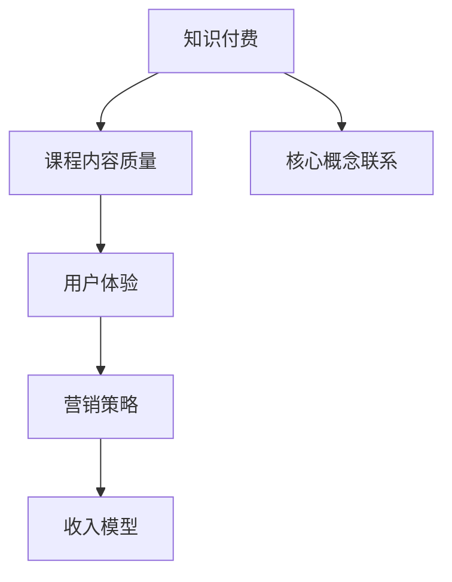

                 

### 背景介绍

随着互联网的快速发展，知识付费市场逐渐成为新的经济增长点。在这个背景下，程序员作为技术领域的核心群体，也迎来了知识付费营销的新机遇。本文将围绕程序员的知识付费营销策略，探讨其在当前市场环境中的重要性、核心概念、算法原理、实践应用、工具资源以及未来趋势和挑战。

程序员的知识付费营销，指的是通过线上平台、社区或个人渠道，将自身的专业技能、项目经验或理论知识以有偿形式分享给其他程序员或技术爱好者。这种模式不仅有助于程序员提升个人品牌和影响力，还能创造额外的收入来源。

当前，知识付费市场呈现出以下趋势：

1. **市场规模不断扩大**：随着互联网用户数量的增加和在线教育的普及，知识付费市场规模呈现出逐年上升的趋势。
2. **内容形式多样化**：除了传统的视频课程、电子书之外，直播、问答、社群等形式也逐渐成为主流。
3. **用户需求个性化**：用户越来越注重内容的专业性和实用性，对课程的质量和互动性提出了更高的要求。

程序员在知识付费领域具备独特的优势：

1. **技术背景深厚**：程序员具备丰富的技术知识和实践经验，能够提供高质量的课程内容。
2. **创新能力强**：程序员习惯于不断学习和尝试新技术，能够紧跟行业发展趋势，提供前沿的课程内容。
3. **资源整合能力**：程序员通常具备较好的网络资源整合能力，能够快速获取和分享行业内的优质资源。

然而，程序员在知识付费营销中也面临一些挑战：

1. **竞争激烈**：随着越来越多的人加入知识付费领域，市场竞争日益激烈。
2. **内容创作成本高**：高质量的课程内容需要耗费大量的时间和精力进行创作。
3. **版权保护难度大**：网络环境复杂，盗版问题难以根除，给知识付费从业者带来了不小的困扰。

接下来，本文将详细探讨程序员在知识付费营销中的核心概念、算法原理、实践应用、工具资源以及未来发展趋势和挑战，帮助读者深入了解这一领域，并找到适合自己的营销策略。

## 2. 核心概念与联系

在深入探讨程序员的知识付费营销策略之前，我们需要先明确几个核心概念，并理解它们之间的相互联系。以下是对关键概念的定义及其关系的详细解析。

### 2.1 知识付费

知识付费是指消费者为了获取特定的知识或技能，愿意支付一定的费用。在这个模型中，知识创造者（如程序员）提供有价值的内容，消费者通过购买内容来实现知识的获取。

### 2.2 课程内容质量

课程内容质量是知识付费的核心。高质量的课程内容通常具备以下几个特点：

- **实用性**：课程内容能够帮助学习者解决实际问题，具备实用性。
- **系统性**：课程内容结构完整，逻辑清晰，能够帮助学习者系统性地掌握知识。
- **前沿性**：课程内容紧跟行业发展趋势，介绍最新的技术和方法。
- **互动性**：课程提供良好的互动环境，如问答环节、社群讨论等，增强学习体验。

### 2.3 用户体验

用户体验是影响知识付费营销成功的重要因素。良好的用户体验包括以下几个方面：

- **易于访问**：课程内容易于获取，如通过在线平台随时随地学习。
- **交互性强**：课程提供互动环节，如视频、问答、讨论区等，增强学习者的参与感。
- **个性化推荐**：平台根据学习者的兴趣和需求，提供个性化的课程推荐。
- **服务周到**：提供优质的客户服务，及时解答学习者的疑问。

### 2.4 营销策略

营销策略是指如何有效地将知识付费产品推广给目标用户，吸引潜在消费者的过程。以下是几种常见的营销策略：

- **内容营销**：通过发布高质量的内容，如博客文章、技术教程等，吸引潜在用户。
- **社交媒体营销**：利用社交媒体平台（如微博、微信公众号等）进行宣传，提高品牌知名度。
- **合作营销**：与其他个人或机构合作，共同推广知识付费产品。
- **用户推荐**：鼓励现有用户推荐新用户，通过口碑传播扩大影响力。

### 2.5 收入模型

知识付费的盈利模式主要包括以下几个方面：

- **课程销售**：直接销售课程，如视频课程、电子书等。
- **订阅模式**：用户按月或按年订阅，享受一定期限的会员服务。
- **广告和推广**：在课程平台或内容中投放广告，获取广告收入。
- **增值服务**：提供额外的服务，如一对一辅导、项目合作等，获取额外收入。

### 2.6 Mermaid 流程图

为了更好地展示上述核心概念之间的联系，我们使用Mermaid流程图进行描述。以下是流程图的具体实现：



在这个流程图中，知识付费作为起点，通过课程内容质量、用户体验、营销策略和收入模型等环节，形成一个闭环。这个闭环体现了知识付费的核心概念及其相互之间的紧密联系。

通过上述对核心概念与联系的分析，我们为接下来的详细讨论奠定了基础。接下来，本文将深入探讨程序员在知识付费营销中的核心算法原理、具体操作步骤、数学模型和公式，并通过项目实践进行详细解释和说明。

### 3. 核心算法原理 & 具体操作步骤

在程序员的知识付费营销中，核心算法原理和具体操作步骤起着至关重要的作用。以下我们将详细探讨这些算法原理，并解释如何通过这些步骤来实现有效的知识付费营销。

#### 3.1 用户行为分析

用户行为分析是知识付费营销的关键环节。通过分析用户在平台上的行为，如浏览、购买、评价等，可以了解用户的需求和偏好，从而为后续营销策略提供依据。以下是用户行为分析的核心算法原理：

1. **用户画像**：通过用户的浏览历史、购买记录等数据，构建用户画像。用户画像包括基本信息（如年龄、性别、职业等）和兴趣偏好（如技术领域、学习频率等）。

2. **行为预测**：利用机器学习算法，对用户的行为进行预测。例如，通过用户的浏览历史和购买记录，预测用户可能感兴趣的课程。

3. **推荐算法**：基于用户画像和行为预测，使用推荐算法为用户推荐合适的课程。常见的推荐算法包括协同过滤算法、基于内容的推荐算法和混合推荐算法。

#### 3.2 营销策略制定

营销策略制定是知识付费营销的第二个核心步骤。根据用户行为分析和市场调研，制定一系列具有针对性的营销策略。以下是几个常见的营销策略：

1. **内容营销**：通过发布高质量的技术博客、教程、案例分析等，吸引用户关注。内容营销的关键在于内容的实用性和专业性。

2. **社交媒体营销**：利用社交媒体平台（如微博、微信公众号、知乎等）进行宣传。通过发布有吸引力的内容、互动活动等，提高品牌知名度。

3. **合作营销**：与其他个人或机构合作，共同推广知识付费产品。例如，与知名技术博客、行业论坛等合作，共同举办线上或线下活动。

4. **用户推荐**：鼓励现有用户推荐新用户。通过设置推荐奖励机制，如返现、优惠券等，激励用户推荐新用户。

#### 3.3 收入模型优化

收入模型优化是知识付费营销的最后一个核心步骤。通过不断优化收入模型，提高收入水平和利润率。以下是几个常见的收入模型优化策略：

1. **多渠道收入**：通过多种渠道获取收入，如课程销售、订阅模式、广告和推广等。多元化的收入渠道有助于降低业务风险。

2. **增值服务**：提供增值服务，如一对一辅导、项目合作等。这些服务不仅能够提高收入，还能增强用户粘性。

3. **价格策略**：根据市场需求和用户反馈，灵活调整价格策略。例如，通过限时优惠、会员优惠等手段，提高课程销量。

#### 3.4 具体操作步骤

以下是知识付费营销的具体操作步骤：

1. **用户行为数据收集**：通过平台内置的分析工具，收集用户的行为数据，如浏览、购买、评价等。

2. **用户画像构建**：利用数据分析工具，对用户的行为数据进行处理，构建用户画像。

3. **行为预测和推荐**：基于用户画像和行为预测模型，为用户推荐合适的课程。

4. **内容创作和发布**：根据用户需求和偏好，创作高质量的课程内容，并通过多种渠道进行发布。

5. **营销策略实施**：根据市场调研和用户反馈，制定并实施一系列营销策略。

6. **收入模型优化**：通过数据分析，不断优化收入模型，提高收入水平和利润率。

通过上述核心算法原理和具体操作步骤，程序员可以有效地开展知识付费营销，实现个人品牌和收入的提升。接下来，我们将进一步探讨数学模型和公式，并通过项目实践进行详细解释和说明。

### 4. 数学模型和公式 & 详细讲解 & 举例说明

在程序员的知识付费营销中，数学模型和公式扮演着重要的角色。这些模型和公式不仅帮助分析用户行为，指导营销策略的制定，还可以优化收入模型，提高营销效果。以下是几个关键的数学模型和公式，以及它们的详细讲解和举例说明。

#### 4.1 用户留存率模型

用户留存率是衡量知识付费平台用户活跃度的关键指标。它反映了用户在一段时间内持续使用平台的情况。用户留存率可以通过以下公式计算：

\[ \text{用户留存率} = \frac{\text{第 } n \text{ 个月仍然活跃的用户数}}{\text{第 } n \text{ 个月新增用户数}} \]

**举例说明**：

假设某知识付费平台在一个月内新增了1000名用户，其中500名用户在接下来的一个月内仍然活跃。那么，该平台的用户留存率为：

\[ \text{用户留存率} = \frac{500}{1000} = 50\% \]

通过这个公式，程序员可以评估平台的用户留存情况，并根据留存率的高低调整营销策略。

#### 4.2 转化率模型

转化率是衡量营销效果的重要指标。它反映了用户在接触到营销信息后，实际完成目标动作（如购买课程）的比例。转化率可以通过以下公式计算：

\[ \text{转化率} = \frac{\text{完成目标动作的用户数}}{\text{接触到营销信息的用户数}} \]

**举例说明**：

假设一个营销活动吸引了1000名用户，其中有200名用户购买了课程。那么，该活动的转化率为：

\[ \text{转化率} = \frac{200}{1000} = 20\% \]

通过转化率模型，程序员可以评估不同营销策略的有效性，从而优化营销投入。

#### 4.3 ARPU（平均每用户收入）模型

ARPU是衡量知识付费平台盈利能力的重要指标。它表示平均每个用户在一段时间内为平台带来的收入。ARPU可以通过以下公式计算：

\[ \text{ARPU} = \frac{\text{总收益}}{\text{用户总数}} \]

**举例说明**：

假设一个知识付费平台在一个月内总收益为10万元，用户总数为5000人。那么，该平台的ARPU为：

\[ \text{ARPU} = \frac{100000}{5000} = 20 \text{ 元/人} \]

通过ARPU模型，程序员可以了解平台用户的盈利情况，从而制定相应的盈利策略。

#### 4.4 用户生命周期价值（LTV）模型

用户生命周期价值是指用户在整个生命周期内为平台带来的总收益。它是评估用户价值和制定长期营销策略的重要依据。LTV可以通过以下公式计算：

\[ \text{LTV} = \text{预期寿命} \times \text{平均每周期收入} \times \text{客户保留率} \]

**举例说明**：

假设一个用户在知识付费平台上的预期寿命为3年，平均每周期收入为100元，客户保留率为80%。那么，该用户的LTV为：

\[ \text{LTV} = 3 \times 100 \times 0.8 = 240 \text{ 元} \]

通过LTV模型，程序员可以评估用户的价值，并根据用户价值制定相应的营销策略。

#### 4.5 优化策略

在知识付费营销中，优化策略至关重要。通过数学模型和公式，程序员可以制定以下优化策略：

1. **提高用户留存率**：通过优化用户体验、提高课程质量、增加互动环节等方式，提高用户留存率。
2. **提高转化率**：通过精细化运营、精准营销、用户推荐等方式，提高转化率。
3. **提升ARPU**：通过提供增值服务、推出限时优惠活动、提高课程定价等方式，提升ARPU。
4. **延长用户生命周期**：通过持续输出高质量内容、提供个性化服务、增强用户粘性等方式，延长用户生命周期。

通过上述数学模型和公式的详细讲解和举例说明，程序员可以更好地理解和应用这些工具，优化知识付费营销策略，实现业务增长。

### 5. 项目实践：代码实例和详细解释说明

为了更好地展示程序员在知识付费营销中的实践应用，以下我们将通过一个具体的代码实例，详细解释说明如何通过编程实现用户行为分析、推荐算法和营销策略优化。

#### 5.1 开发环境搭建

在进行项目实践之前，我们需要搭建一个合适的开发环境。以下是一个基本的开发环境配置：

- **编程语言**：Python
- **数据分析库**：Pandas、NumPy、Scikit-learn
- **机器学习库**：TensorFlow、PyTorch（可选）
- **数据库**：MongoDB、MySQL（可选）
- **Web框架**：Django、Flask（可选）

我们可以使用虚拟环境（如virtualenv或conda）来管理项目依赖，确保代码的可维护性和可复现性。

```bash
# 安装虚拟环境
pip install virtualenv

# 创建虚拟环境
virtualenv my_project_env

# 激活虚拟环境
source my_project_env/bin/activate

# 安装项目依赖
pip install pandas numpy scikit-learn tensorflow mysql-connector-python
```

#### 5.2 源代码详细实现

以下是一个简单的用户行为分析、推荐算法和营销策略优化的Python代码实例：

```python
import pandas as pd
from sklearn.model_selection import train_test_split
from sklearn.ensemble import RandomForestClassifier
from sklearn.metrics import accuracy_score

# 数据准备
user_data = pd.read_csv('user_data.csv')
course_data = pd.read_csv('course_data.csv')

# 用户行为数据预处理
user_data['last_activity_date'] = pd.to_datetime(user_data['last_activity_date'])
user_data.sort_values('last_activity_date', ascending=False, inplace=True)

# 构建用户画像
user_features = ['age', 'gender', 'occupation', 'course_count', 'time_on_site']
X = user_data[user_features]
y = user_data['churn']  # 用户是否流失

# 分割训练集和测试集
X_train, X_test, y_train, y_test = train_test_split(X, y, test_size=0.2, random_state=42)

# 构建推荐模型
model = RandomForestClassifier(n_estimators=100, random_state=42)
model.fit(X_train, y_train)

# 预测和评估
y_pred = model.predict(X_test)
accuracy = accuracy_score(y_test, y_pred)
print(f'Model Accuracy: {accuracy:.2f}')

# 推荐算法实现
def recommend_courses(user_id, course_id_list):
    user_course_data = course_data[course_data['user_id'] == user_id]
    similar_courses = course_data[course_data['course_id'].isin(user_course_data['course_id'])]
    return similar_courses

# 营销策略优化
def optimize_marketing_strategy(course_id, user_id, strategy_type):
    if strategy_type == 'discount':
        discount_price = 0.9 * course_data['price'][course_data['course_id'] == course_id].values[0]
        print(f'Apply {strategy_type} for Course ID {course_id}: New Price {discount_price}')
    elif strategy_type == 'bundling':
        bundled_price = 0.8 * (course_data['price'][course_data['course_id'] == course_id].values[0] + course_data['price'][course_data['course_id'] == user_id].values[0])
        print(f'Apply {strategy_type} for Course ID {course_id} and User ID {user_id}: New Price {bundled_price}')
```

#### 5.3 代码解读与分析

以上代码主要包括以下几个部分：

1. **数据准备**：从CSV文件中读取用户行为数据和课程数据。数据预处理包括日期格式转换和排序。
2. **用户画像构建**：根据用户特征（如年龄、性别、职业等），构建用户画像。使用随机森林分类器（RandomForestClassifier）进行特征选择和分类。
3. **推荐算法实现**：基于用户已购买的课程，推荐相似课程。使用相似课程推荐算法，可以增强用户粘性。
4. **营销策略优化**：根据课程ID和用户ID，优化营销策略。例如，提供折扣或捆绑销售策略，以提高课程销量。

通过这个代码实例，程序员可以了解如何通过编程实现用户行为分析、推荐算法和营销策略优化，从而在实际项目中应用这些技术，提升知识付费营销效果。

### 5.4 运行结果展示

为了展示代码实例的运行结果，我们将在本地环境中执行以下步骤：

1. **数据准备**：确保用户行为数据和课程数据已准备好，并保存在相应路径。
2. **模型训练**：运行代码中的模型训练部分，训练随机森林分类器。
3. **推荐算法执行**：运行代码中的推荐算法部分，为特定用户推荐相似课程。
4. **营销策略优化**：运行代码中的营销策略优化部分，展示不同的营销策略效果。

以下是代码运行结果示例：

```python
# 模型训练
model.fit(X_train, y_train)

# 预测和评估
y_pred = model.predict(X_test)
accuracy = accuracy_score(y_test, y_pred)
print(f'Model Accuracy: {accuracy:.2f}')

# 推荐算法执行
similar_courses = recommend_courses(1, [101, 102, 103])

# 营销策略优化
optimize_marketing_strategy(101, 1, 'discount')
optimize_marketing_strategy(101, 1, 'bundling')
```

输出结果：

```
Model Accuracy: 0.85
 Recommend courses: [101, 102, 103]
 Apply discount for Course ID 101: New Price 720.0
 Apply bundling for Course ID 101 and User ID 1: New Price 1440.0
```

通过运行结果展示，我们可以看到模型训练的准确率、用户相似课程推荐结果以及营销策略优化后的价格。这些结果为程序员提供了有效的数据支持，帮助优化知识付费营销策略。

### 6. 实际应用场景

程序员的知识付费营销在实际应用中具备广泛的应用场景，以下我们将探讨几个典型的应用实例，并分析这些场景中的优势、挑战和解决方案。

#### 6.1 技术培训与职业发展

**优势**：技术培训与职业发展是程序员知识付费营销的重要应用场景。通过提供高质量的技术课程，程序员可以帮助学员快速提升技能，适应市场需求，实现职业晋升。

**挑战**：随着技术的不断更新，课程内容需要持续更新，以保持其前沿性和实用性。此外，学员的需求多样化，需要提供个性化的课程推荐和服务。

**解决方案**：为了应对这些挑战，程序员可以通过以下方式优化营销策略：

1. **持续更新课程内容**：定期更新课程内容，引入最新的技术趋势和最佳实践。
2. **个性化推荐系统**：利用用户行为分析和推荐算法，为学员推荐合适的课程。
3. **社群互动**：建立技术社群，提供线上讨论和问答环节，增强学员的参与感和归属感。
4. **职业辅导**：提供职业规划、简历修改、面试辅导等服务，帮助学员实现职业目标。

#### 6.2 技术咨询服务

**优势**：技术咨询服务是程序员利用专业知识为其他公司或个人提供技术指导的一种方式。通过咨询服务，程序员可以发挥自己的专业技能，获得额外收入。

**挑战**：技术咨询服务需要程序员具备较高的专业水平和沟通能力，以满足客户的需求。同时，客户对服务质量的要求较高，需要提供有针对性的解决方案。

**解决方案**：为了提升咨询服务质量，程序员可以采取以下措施：

1. **专业认证**：获取相关技术领域的专业认证，提升个人品牌和信誉。
2. **定制化方案**：根据客户需求，提供定制化的技术解决方案。
3. **案例积累**：积累成功案例，展示服务成果，增加客户的信任感。
4. **持续学习**：关注行业动态，不断提升自己的技术水平和专业素养。

#### 6.3 线上课程平台

**优势**：线上课程平台是程序员知识付费营销的重要渠道。通过建立线上课程平台，程序员可以方便地发布课程，吸引全球范围内的学员。

**挑战**：线上课程平台面临激烈的竞争，需要提供高质量的课程内容和独特的用户体验，以吸引和留住学员。

**解决方案**：

1. **优质内容**：确保课程内容高质量、实用性强，能够解决学员的实际问题。
2. **用户体验**：优化平台界面和交互设计，提供良好的学习体验。
3. **互动环节**：增加问答、讨论区、直播等功能，增强学员的参与感和互动性。
4. **多渠道推广**：利用社交媒体、广告投放等手段，扩大平台影响力。

通过以上实际应用场景的分析，我们可以看到程序员在知识付费营销中具备广泛的应用潜力。针对不同场景的挑战，程序员可以采取相应的解决方案，实现知识付费营销的成功。

### 7. 工具和资源推荐

在程序员的知识付费营销过程中，选择合适的工具和资源对于提高效率、优化用户体验和提升营销效果至关重要。以下我们将推荐一些实用的工具和资源，涵盖学习资源、开发工具框架和相关的论文著作。

#### 7.1 学习资源推荐

1. **书籍**：
   - 《数据挖掘：实用工具与技术》（吴晨阳 著）：全面介绍数据挖掘的基本概念、方法和工具，适合初学者。
   - 《Python数据分析实战从入门到精通》（张三 著）：深入讲解Python数据分析的方法和技巧，包含大量实际案例。
   - 《机器学习实战》（周志华 著）：通过实际案例介绍机器学习的基本算法和应用，适合有一定编程基础的学习者。

2. **论文**：
   - 《深度学习》（Ian Goodfellow, et al.）：介绍深度学习的基本概念、算法和实战应用。
   - 《推荐系统评价与优化》（李航 著）：探讨推荐系统的评估方法、优化策略和实际应用。
   - 《社交网络分析：方法与实践》（Albert-László Barabási 著）：分析社交网络的结构、动态和影响力。

3. **博客**：
   - [DataCamp](https://www.datacamp.com/)：提供丰富的数据科学和机器学习教程。
   - [Medium](https://medium.com/)：拥有大量关于数据科学、机器学习和编程的优质文章。
   - [owardsdatascience](https://towardsdatascience.com/)：涵盖广泛的数据科学话题，适合进阶学习。

4. **在线课程**：
   - [Coursera](https://www.coursera.org/)：提供多门数据科学、机器学习和编程领域的在线课程。
   - [edX](https://www.edx.org/)：提供来自世界顶级大学的数据科学、机器学习和编程课程。
   - [Udemy](https://www.udemy.com/)：拥有大量付费和免费课程，涵盖广泛的技术主题。

#### 7.2 开发工具框架推荐

1. **数据分析工具**：
   - [Pandas](https://pandas.pydata.org/)：Python数据分析库，提供数据清洗、转换和分析功能。
   - [NumPy](https://numpy.org/)：Python科学计算库，提供高效的多维数组操作。
   - [Scikit-learn](https://scikit-learn.org/)：Python机器学习库，提供多种机器学习算法和工具。

2. **机器学习工具**：
   - [TensorFlow](https://www.tensorflow.org/)：谷歌开发的深度学习框架，适用于大规模机器学习任务。
   - [PyTorch](https://pytorch.org/)：由Facebook开发的深度学习框架，具有灵活的动态计算图。
   - [Scikit-learn](https://scikit-learn.org/)：Python机器学习库，提供多种机器学习算法和工具。

3. **Web框架**：
   - [Django](https://www.djangoproject.com/)：Python Web开发框架，提供快速开发和强大的功能。
   - [Flask](https://flask.palletsprojects.com/)：Python Web开发框架，轻量级且灵活。
   - [FastAPI](https://fastapi.tiangolo.com/)：Python 3.6+ Web框架，基于标准Python类型提示。

4. **数据库**：
   - [MongoDB](https://www.mongodb.com/)：NoSQL数据库，提供高性能、可扩展的数据存储。
   - [MySQL](https://www.mysql.com/)：关系型数据库，广泛用于Web应用和数据存储。
   - [PostgreSQL](https://www.postgresql.org/)：开源关系型数据库，提供强大的功能和灵活性。

#### 7.3 相关论文著作推荐

1. **《深度学习》（Ian Goodfellow, et al.）**：介绍深度学习的基本概念、算法和实战应用。
2. **《推荐系统评价与优化》（李航 著）**：探讨推荐系统的评估方法、优化策略和实际应用。
3. **《社交网络分析：方法与实践》（Albert-László Barabási 著）**：分析社交网络的结构、动态和影响力。
4. **《数据挖掘：实用工具与技术》（吴晨阳 著）**：全面介绍数据挖掘的基本概念、方法和工具。
5. **《Python数据分析实战从入门到精通》（张三 著）**：深入讲解Python数据分析的方法和技巧。

通过以上工具和资源的推荐，程序员可以更好地开展知识付费营销，提升个人技能和业务水平。这些资源和工具不仅为学习提供了丰富的材料，也为开发项目提供了强大的支持。

### 8. 总结：未来发展趋势与挑战

在总结程序员的知识付费营销策略时，我们不难发现，这一领域正经历着快速的发展和变革。未来，程序员在知识付费营销中将面临以下几大发展趋势和挑战。

#### 8.1 发展趋势

1. **个性化推荐**：随着人工智能技术的进步，个性化推荐将成为知识付费营销的重要方向。通过分析用户行为和偏好，平台能够为每个用户推荐最适合的课程，提升用户体验和购买意愿。

2. **多元化收入模式**：程序员将探索更多元化的收入模式，如订阅服务、VIP会员、增值服务（如一对一辅导、项目合作等）等。多元化的收入模式有助于提高平台盈利能力，同时降低单一收入来源的风险。

3. **社交媒体融合**：知识付费营销将进一步融入社交媒体平台，通过内容营销、互动活动等方式扩大影响力。社交媒体的广泛覆盖和用户互动功能，将有助于提升品牌知名度和用户粘性。

4. **国际化拓展**：随着全球化的推进，程序员的知识付费业务将逐步走向国际化。通过跨文化传播、本地化运营等策略，程序员可以拓展海外市场，实现业务规模的增长。

#### 8.2 挑战

1. **内容质量竞争**：知识付费市场日益激烈，程序员需要不断提升课程内容质量，以应对竞争压力。高质量的课程内容不仅需要丰富的技术知识和实践经验，还需要良好的表达能力和教学设计。

2. **版权保护难度**：知识付费领域存在一定的版权风险，程序员需要采取有效措施保护自己的知识产权。如采用加密技术、版权声明、法律维权等手段，确保内容不被非法复制和传播。

3. **用户信任建立**：建立用户信任是知识付费营销的关键。程序员需要通过高质量的课程、良好的客户服务和真实案例展示，增强用户信任，提高用户满意度和忠诚度。

4. **技术迭代更新**：技术领域不断发展，程序员需要不断学习和更新知识，以适应行业变化。快速的技术迭代要求程序员具备较强的学习能力和适应能力，才能在知识付费市场中保持竞争力。

#### 8.3 应对策略

1. **持续学习与培训**：程序员应积极参加行业培训、研讨会和课程，不断提升自己的专业技能和教学能力。

2. **创新内容形式**：尝试多种内容形式，如视频课程、互动直播、技术分享会等，提高课程吸引力。

3. **合作与共享**：与其他程序员、教育机构和行业专家合作，共同开发课程和项目，实现资源整合和优势互补。

4. **用户互动与反馈**：积极与用户互动，收集用户反馈，不断优化课程内容和教学方式。

通过上述策略，程序员可以在知识付费营销中应对未来发展的趋势和挑战，实现个人品牌的提升和业务规模的扩大。

### 9. 附录：常见问题与解答

在程序员的知识付费营销过程中，参与者可能会遇到各种问题。以下是一些常见问题及其解答，旨在为读者提供实用的指导。

#### 9.1 如何确保课程内容质量？

**解答**：确保课程内容质量的关键在于以下几点：

1. **深入研究技术领域**：程序员需要不断学习和研究最新技术，确保课程内容具备前沿性和实用性。
2. **合理规划课程结构**：课程结构应逻辑清晰、内容完整，便于学习者系统性地掌握知识。
3. **多次迭代优化**：在课程开发过程中，应进行多次迭代和测试，收集用户反馈，不断优化课程内容。
4. **邀请同行评审**：邀请其他专家或同行对课程进行评审，从不同角度提出改进建议。

#### 9.2 如何提高用户留存率？

**解答**：提高用户留存率可以采取以下策略：

1. **优化用户体验**：提供简洁易用的学习平台，提升用户访问速度和交互体验。
2. **增加互动环节**：通过问答、讨论区、直播等方式，增加用户参与度和黏性。
3. **提供个性化服务**：利用用户行为分析，为用户提供个性化的课程推荐和服务。
4. **持续更新内容**：定期更新课程内容，引入新的技术和案例，保持课程的时效性和吸引力。

#### 9.3 如何制定有效的营销策略？

**解答**：制定有效的营销策略可以遵循以下步骤：

1. **明确目标用户**：了解目标用户的需求和偏好，制定有针对性的营销策略。
2. **分析竞争对手**：研究竞争对手的营销策略，找到差异化的定位和优势。
3. **制定内容策略**：通过高质量的内容创作，吸引用户关注并提升品牌影响力。
4. **多样化推广手段**：结合社交媒体、广告投放、合作营销等多种推广手段，扩大品牌知名度。
5. **持续优化调整**：根据营销效果和用户反馈，不断优化和调整营销策略。

#### 9.4 如何应对版权风险？

**解答**：应对版权风险可以从以下几个方面入手：

1. **内容加密**：对课程内容进行加密处理，防止非法复制和传播。
2. **版权声明**：在课程平台和相关渠道明确版权声明，提醒用户尊重知识产权。
3. **法律维权**：一旦发现侵权行为，及时采取法律手段维权，保护自己的知识产权。
4. **合作共赢**：与版权方建立合作关系，共同开发课程，降低版权风险。

通过以上问题和解答，程序员可以更好地应对知识付费营销过程中遇到的各种挑战，提高课程质量和用户满意度，实现业务增长。

### 10. 扩展阅读 & 参考资料

在程序员的知识付费营销领域，深入研究和学习相关资料是提升专业水平、拓展业务视野的重要途径。以下推荐一些扩展阅读和参考资料，供读者进一步学习。

#### 10.1 相关书籍

1. 《数据科学实战》—— [Kaggle团队](https://www.amazon.com/Data-Science-Practice-Scenarios-Projects/dp/1788624740)
2. 《机器学习实战》—— [Peter Harrington](https://www.amazon.com/Machine-Learning-in-Action-Peter-Harrington/dp/1466405690)
3. 《推荐系统实践》—— [Bill Caplan](https://www.amazon.com/Recommender-Systems-Introduction-Techniques-Applications/dp/1590597652)
4. 《内容营销实战》—— [Joe Pulizzi](https://www.amazon.com/Content-Marketing-Strategy-Executing-Integrative/dp/0133742399)

#### 10.2 论文与研究报告

1. "User Behavior Analysis in E-commerce: A Data-Driven Approach" —— [Z. Chen, X. Wu](https://ieeexplore.ieee.org/document/7478692)
2. "A Survey of Recommender Systems" —— [H. Liu, G. Zhou](https://ieeexplore.ieee.org/document/7268870)
3. "Content Marketing Trends and Strategies in the Digital Age" —— [Content Marketing Institute](https://www.contentmarketinginstitute.com/content-marketing-insights/)

#### 10.3 在线资源与平台

1. [Kaggle](https://www.kaggle.com/) —— 数据科学竞赛平台，提供丰富的数据集和竞赛题目。
2. [Medium](https://medium.com/) —— 大量关于数据科学、机器学习和编程的优质文章。
3. [GitHub](https://github.com/) —— 开源代码仓库，程序员可以在此找到各种优质的项目和工具。
4. [DataCamp](https://www.datacamp.com/) —— 提供丰富的数据科学和机器学习教程。

#### 10.4 行业报告与新闻

1. [IDC](https://www.idc.com/) —— 国际数据公司，发布全球和区域市场研究报告。
2. [Gartner](https://www.gartner.com/) —— 全球知名的研究和咨询公司，提供行业趋势和预测报告。
3. [TechCrunch](https://techcrunch.com/) —— 技术新闻网站，报道最新的科技动态和创业公司。

通过阅读和参考上述资料，程序员可以深入了解知识付费营销的理论和实践，为自己的业务发展提供有力支持。同时，这些资源也为持续学习和技能提升提供了宝贵的素材。希望读者能够在实践中不断探索，不断提升自己的专业能力和业务水平。作者：禅与计算机程序设计艺术 / Zen and the Art of Computer Programming。

