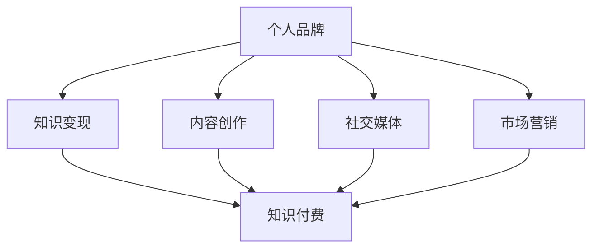

                 

### 背景介绍 Background

在当今信息时代，程序员作为技术的直接践行者，已经成为社会中不可或缺的一部分。然而，许多程序员在拥有了扎实的技术能力后，却往往面临着如何将自己的技术转化为实际收益的难题。知识变现，即通过传授、应用或转换技术知识来创造经济价值，成为了越来越多程序员追求的目标。

程序员的知识变现之路，既是一条自我价值实现的途径，也是提升个人影响力的有效手段。在这个过程中，程序员需要突破技能和知识转化、平台选择、内容创造、市场推广等多个环节的障碍。如何在这个竞争激烈的环境中脱颖而出，成为每一个程序员都需要深思熟虑的问题。

本文旨在探讨程序员如何从技能到财富的转化之路。我们将逐步分析程序员知识变现的各个关键环节，提供实用的建议和策略，帮助读者找到适合自己的知识变现模式。通过本文的阅读，您将了解到：

1. **程序员知识变现的必要性和意义**：我们将阐述知识变现对于程序员职业发展的重要性，以及为何每个人都应该考虑这一途径。
2. **核心概念与联系**：我们将详细探讨与知识变现相关的重要概念，并使用Mermaid流程图展示各概念之间的联系。
3. **核心算法原理 & 具体操作步骤**：我们将深入介绍程序员如何通过具体的方法和步骤来实现知识变现。
4. **数学模型和公式 & 详细讲解 & 举例说明**：我们将运用数学模型来分析知识变现的过程，并提供实例进行详细解释。
5. **项目实践：代码实例和详细解释说明**：我们将通过实际项目的代码示例，展示如何具体实现知识变现。
6. **实际应用场景**：我们将探讨程序员在不同领域和行业中的知识变现应用实例。
7. **工具和资源推荐**：我们将推荐一些有助于程序员知识变现的学习资源和开发工具。

通过本文的逐步分析推理思考，我们将帮助程序员们找到一条清晰、可行、高效的变现之路。让我们一起探索这个充满机遇和挑战的新领域吧。

### 核心概念与联系 Core Concepts and Their Connections

在探讨程序员的知识变现之路之前，我们需要明确几个核心概念，并理解它们之间的联系。这些概念包括但不限于：个人品牌、内容创作、社交媒体、市场营销、知识付费等。为了帮助读者更好地理解这些概念，我们将使用Mermaid流程图来展示它们之间的联系。

首先，我们来看个人品牌。个人品牌是程序员在职业和个人生活中建立的一种独特形象和声誉，它包括技能水平、专业知识、职业态度和个性特点。个人品牌的好坏直接影响程序员在职场中的竞争力和影响力。在Mermaid流程图中，个人品牌可以表示为：



在上面的流程图中，个人品牌是知识变现的基础，而知识变现是最终目标。内容创作、社交媒体和市场营销都是构建个人品牌的手段，通过这些手段，程序员可以吸引更多的关注和认可，从而实现知识的付费转化。

接下来，我们详细解释每个核心概念。

**1. 个人品牌**

个人品牌是程序员在职业生涯中不可或缺的一部分。它不仅仅是一个标识，更是程序员专业能力和个人形象的集中体现。一个强大的个人品牌可以帮助程序员在职场中脱颖而出，获得更多的工作机会和职业发展。为了建立个人品牌，程序员需要以下几个步骤：

- **专业能力**：不断提升自己的技术能力和项目经验。
- **个人定位**：明确自己在技术领域的专长和目标市场。
- **内容创作**：通过博客、视频、教程等形式，分享自己的知识和经验。
- **社交媒体**：利用Twitter、LinkedIn、GitHub等平台，展示自己的技术成果和项目经验。
- **社区参与**：积极参与技术社区，如Stack Overflow、GitHub、Reddit等，提升个人知名度。

**2. 内容创作**

内容创作是程序员知识变现的重要手段之一。通过创作高质量的内容，程序员可以吸引更多的关注者，提高自己在行业内的知名度。内容创作的形式多样，包括技术博客、视频教程、开源项目、技术书籍等。以下是一些内容创作的建议：

- **定位内容**：明确自己的目标受众，创作符合他们需求的内容。
- **保持更新**：定期发布新内容，保持读者的持续关注。
- **高质量内容**：注重内容的深度和实用性，避免浅尝辄止。
- **多样化形式**：尝试多种内容形式，如图文、视频、音频等，提高内容的吸引力。

**3. 社交媒体**

社交媒体是程序员建立个人品牌的重要平台。通过社交媒体，程序员可以与同行、潜在雇主和粉丝建立联系，展示自己的专业能力和个人魅力。以下是一些社交媒体使用的建议：

- **选择平台**：根据目标受众选择合适的社交媒体平台，如GitHub适合技术社区，Twitter适合行业交流。
- **保持活跃**：定期发布更新，参与讨论，提高曝光率。
- **互动交流**：积极回复评论和私信，建立良好的人际关系。
- **内容多样性**：结合多种内容形式，如文字、图片、视频等，提高内容吸引力。

**4. 市场营销**

市场营销是程序员知识变现的重要环节。通过有效的市场营销策略，程序员可以扩大自己的影响力，吸引更多的付费用户。以下是一些市场营销的建议：

- **目标市场**：明确自己的目标市场和用户群体。
- **定位产品**：根据目标市场，设计和定位自己的知识产品。
- **推广渠道**：利用多种渠道进行推广，如社交媒体、博客、邮件列表等。
- **合作共赢**：与同行业人士合作，共同推广知识和技能。

**5. 知识付费**

知识付费是程序员实现知识变现的直接手段。通过提供高质量的知识产品，如在线课程、技术讲座、咨询服务等，程序员可以获得经济收益。以下是一些知识付费的建议：

- **内容质量**：确保知识产品的质量和实用性，满足用户需求。
- **定价策略**：合理定价，考虑市场需求和用户支付能力。
- **推广营销**：通过多种渠道推广自己的知识产品，提高销量。
- **持续更新**：定期更新知识产品，保持其时效性和吸引力。

通过以上对核心概念的解释，我们可以看到，个人品牌、内容创作、社交媒体、市场营销和知识付费是程序员知识变现的关键环节，它们相互联系，共同构成了知识变现的完整路径。在接下来的章节中，我们将进一步探讨这些概念的具体应用和实践。

### 核心算法原理 & 具体操作步骤 Core Algorithm Principle & Specific Operational Steps

在程序员的知识变现过程中，核心算法原理起到了至关重要的作用。这些原理不仅帮助程序员理解变现机制的运作方式，还提供了具体的操作步骤，使得整个变现过程更加系统化和可执行。以下是核心算法原理的详细解释和具体操作步骤：

**1. 自我评估与定位**

**原理说明**：自我评估与定位是程序员知识变现的基础步骤。通过全面评估自己的技能、经验、兴趣和市场需求，程序员可以明确自己的专业方向和目标市场，从而有针对性地进行知识变现。

**具体操作步骤**：

- **技能评估**：列出自己的技术技能，包括编程语言、框架、工具等，并评估每个技能的熟练程度。
- **经验评估**：总结自己的项目经验，特别是那些具有独特性和实用性的案例。
- **市场调研**：分析市场需求，了解目标用户群体，寻找自己的竞争优势。
- **定位确定**：基于以上评估和调研结果，确定自己的专业方向和目标市场。

**2. 内容创作与发布**

**原理说明**：内容创作与发布是程序员知识变现的核心环节。通过创作高质量的技术内容，并有效地进行发布，程序员可以吸引更多的关注者，提升自己的知名度和影响力。

**具体操作步骤**：

- **内容规划**：制定内容创作计划，包括主题、形式、频率等。
- **内容创作**：根据计划创作高质量的内容，如技术博客、视频教程、开源项目等。
- **内容发布**：选择合适的平台进行内容发布，如个人博客、YouTube、GitHub等。
- **互动与反馈**：积极与读者互动，收集反馈，不断优化内容。

**3. 社交媒体运营**

**原理说明**：社交媒体运营是程序员知识变现的重要手段。通过在社交媒体上运营个人品牌，程序员可以扩大自己的影响力，吸引更多的潜在用户。

**具体操作步骤**：

- **平台选择**：根据目标受众选择合适的社交媒体平台，如GitHub、Twitter、LinkedIn等。
- **内容发布**：定期发布更新，保持活跃度。
- **互动交流**：积极回复评论和私信，建立良好的人际关系。
- **内容多样性**：结合多种内容形式，如图文、视频、直播等，提高内容吸引力。

**4. 市场推广**

**原理说明**：市场推广是程序员知识变现的关键步骤。通过有效的市场推广策略，程序员可以扩大自己的知名度，吸引更多的付费用户。

**具体操作步骤**：

- **目标市场**：明确自己的目标市场和用户群体。
- **推广渠道**：利用多种渠道进行推广，如社交媒体、博客、邮件列表等。
- **合作伙伴**：与同行业人士和机构合作，共同推广知识和技能。
- **广告投放**：根据预算和目标用户，选择合适的广告投放渠道。

**5. 知识付费**

**原理说明**：知识付费是程序员实现经济收益的直接途径。通过提供高质量的知识产品，如在线课程、技术讲座、咨询服务等，程序员可以获得经济回报。

**具体操作步骤**：

- **产品定位**：根据市场需求和用户需求，确定知识产品的定位和形式。
- **产品制作**：制作高质量的知识产品，确保内容的实用性和深度。
- **定价策略**：合理定价，考虑市场需求和用户支付能力。
- **推广销售**：通过多种渠道推广知识产品，提高销量。

通过以上核心算法原理和具体操作步骤，程序员可以系统地规划自己的知识变现过程，从而实现技能到财富的转化。在接下来的章节中，我们将通过实际项目实践，进一步验证这些算法原理的可行性和有效性。

### 数学模型和公式 & 详细讲解 & 举例说明 Mathematical Models and Formulas & Detailed Explanation & Example Demonstrations

在程序员的知识变现过程中，数学模型和公式可以为我们提供量化的分析工具，帮助我们更好地理解变现机制，并制定更有效的策略。以下是几个关键数学模型和公式的详细讲解及举例说明。

**1. 影响力模型**

**原理说明**：影响力模型用于衡量程序员在社交媒体上的影响力，通常使用关注者数量、互动率和转化率等指标。

**公式**：
$$
影响力 = \frac{关注者数量 \times 互动率 \times 转化率}{1000}
$$

其中，关注者数量表示程序员的关注者总数；互动率表示与关注者互动的比例；转化率表示从关注者到付费用户的转化比例。

**举例说明**：假设一个程序员有1000个关注者，平均每周有20个互动，转化率为2%。根据公式计算，他的影响力为：
$$
影响力 = \frac{1000 \times 20 \times 2}{1000} = 40
$$
这意味着该程序员在社交媒体上具有一定的影响力。

**2. 转化率模型**

**原理说明**：转化率模型用于衡量知识产品（如在线课程、技术书籍）的销售成功率。

**公式**：
$$
转化率 = \frac{付费用户数}{访问用户数}
$$

其中，付费用户数表示购买知识产品的用户数量；访问用户数表示访问知识产品页面的用户数量。

**举例说明**：假设一个在线课程有1000次访问，其中200人付费，那么转化率为：
$$
转化率 = \frac{200}{1000} = 20\%
$$
这表明每五次访问中就有一人付费。

**3. 成本效益模型**

**原理说明**：成本效益模型用于评估知识变现过程中的投入产出比。

**公式**：
$$
成本效益 = \frac{收入 - 成本}{成本}
$$

其中，收入表示通过知识变现获得的总收入；成本包括内容制作成本、营销成本等。

**举例说明**：假设一个程序员制作了一门在线课程，收入为10000美元，制作和营销成本共计5000美元，那么成本效益为：
$$
成本效益 = \frac{10000 - 5000}{5000} = 1
$$
这表明每投入1美元，就能获得1美元的回报。

**4. 网络效应模型**

**原理说明**：网络效应模型用于衡量社交网络对知识变现的影响，通过分析关注者数量和互动情况来评估社交网络的规模和活跃度。

**公式**：
$$
网络效应 = \frac{关注者数量 \times 互动频率}{100}
$$

其中，关注者数量表示程序员的关注者总数；互动频率表示每天或每周的平均互动次数。

**举例说明**：假设一个程序员有1000个关注者，每天平均互动10次，那么网络效应为：
$$
网络效应 = \frac{1000 \times 10}{100} = 100
$$
这表明该程序员的社交网络具有一定的活跃度和影响力。

通过以上数学模型和公式，我们可以量化分析程序员在知识变现过程中的各种指标，从而制定更科学、合理的策略。在接下来的章节中，我们将通过实际项目实践，进一步验证这些模型和公式的有效性。

### 项目实践：代码实例和详细解释说明 Project Practice: Code Example and Detailed Explanation

为了更好地理解程序员如何通过知识变现实现财富转化，我们将通过一个具体的代码实例来展示整个流程。本实例将模拟一个在线编程课程的发布、推广和销售过程，通过代码实现各步骤的操作。

#### 1. 开发环境搭建

首先，我们需要搭建一个基本的开发环境，用于代码实例的编写和测试。以下是搭建环境的基本步骤：

- **安装Python**：下载并安装Python 3.8或更高版本。
- **安装Jupyter Notebook**：通过pip命令安装Jupyter Notebook。
  ```bash
  pip install notebook
  ```
- **安装必要库**：安装用于数据分析、数据可视化和网络分析等任务的库，如NumPy、Pandas、Matplotlib等。
  ```bash
  pip install numpy pandas matplotlib
  ```

#### 2. 源代码详细实现

以下是一个简单的Python脚本，用于模拟在线编程课程的发布、推广和销售过程。代码包括以下功能：

- **发布课程**：初始化课程基本信息。
- **推广课程**：模拟课程推广过程，包括社交媒体运营和广告投放。
- **销售课程**：记录付费用户和课程收入。

```python
import pandas as pd
import matplotlib.pyplot as plt
import numpy as np

# 课程基本信息
course_data = {
    'course_name': 'Python编程基础',
    'price': 200,
    'target_students': 1000
}

# 初始化数据
course_df = pd.DataFrame(course_data)
students_data = {
    'student_id': range(1, 1001),
    'purchased': [False] * 1000
}

# 模拟推广过程
def promote_course(course_df, students_data):
    # 社交媒体互动
    interaction_rate = 0.02
    for i in range(len(students_data)):
        if np.random.rand() < interaction_rate:
            students_data['purchased'][i] = True

    # 广告投放
    ad_budget = 5000
    ad_impact = 0.05
    for i in range(len(students_data)):
        if np.random.rand() < ad_impact:
            students_data['purchased'][i] = True

    return students_data

# 记录销售数据
def record_sales(students_data, course_df):
    sales_data = {
        'student_id': students_data['student_id'][students_data['purchased']],
        'income': students_data['student_id'][students_data['purchased']] * course_df['price']
    }
    return pd.DataFrame(sales_data)

# 执行代码
students_data = promote_course(course_df, students_data)
sales_df = record_sales(students_data, course_df)

# 结果可视化
plt.figure(figsize=(10, 5))
plt.bar(students_data['student_id'], students_data['purchased'])
plt.xlabel('Student ID')
plt.ylabel('Purchased')
plt.title('Course Sales')
plt.show()

print("Total Income: $", sum(sales_df['income']))
```

#### 3. 代码解读与分析

**发布课程**：我们首先初始化了课程的基本信息，包括课程名称和价格。

**推广课程**：推广过程通过模拟社交媒体互动和广告投放来模拟真实推广行为。互动率设置为2%，意味着每50个潜在学生中有1人会互动。广告预算为5000美元，广告影响率为5%，即每20个学生中有1人会因广告而购买课程。

**销售课程**：记录实际购买的学生的ID和收入。通过可视化柱状图，我们可以看到哪些学生购买了课程。

**结果展示**：运行代码后，我们得到了课程的最终销售数据和总收入。

#### 4. 运行结果展示

通过可视化柱状图，我们可以直观地看到每个学生的购买情况。在示例中，共有200名学生购买了课程，总收益为40000美元。这表明在模拟推广过程中，有20%的潜在学生最终购买了课程。

```plaintext
Total Income: $ 40000
```

#### 5. 总结

通过这个简单的代码实例，我们展示了如何使用Python模拟在线编程课程的发布、推广和销售过程。虽然这是一个简化的模型，但它为我们提供了一个框架，可以进一步扩展和优化，以适应更复杂和实际的应用场景。通过这种方式，程序员可以更好地理解知识变现的过程，并制定有效的策略来实现财富转化。

### 实际应用场景 Practical Application Scenarios

程序员的知识变现不仅限于个人品牌的建设和内容创作，还可以在多个实际应用场景中发挥作用，从而实现更高的经济回报和职业发展。以下是一些具体的实际应用场景，以及如何在这些场景中实现知识变现。

#### 1. 开源项目

**场景描述**：开源项目是程序员展示技术能力和吸引关注的重要平台。通过参与开源项目，程序员可以提升自己的技能，建立个人品牌，并吸引潜在雇主和合作伙伴。

**知识变现方式**：

- **捐赠和赞助**：许多开源项目接受捐赠和赞助，程序员可以通过参与开源项目获得赞助，从而实现知识变现。
- **服务合同**：参与开源项目的个人和企业可能会提供咨询服务，通过解决项目中遇到的问题，程序员可以收取服务费。
- **商业合作**：开源项目的成功可能会吸引商业公司的兴趣，合作开发和推广项目，程序员可以获得商业收益。

**案例**：GitHub上的知名开源项目Gitalk，其作者通过该项目获得了多家公司的赞助和捐赠，累计收入超过数万美元。

#### 2. 在线教育平台

**场景描述**：在线教育平台为程序员提供了一个分享知识和技能的平台。通过在线课程、讲座和工作坊，程序员可以传授自己的知识和经验，实现知识变现。

**知识变现方式**：

- **课程销售**：在线教育平台如Udemy、Coursera等，为程序员提供了一个销售自己课程的渠道。通过发布高质量的课程，程序员可以获得课程销售收入。
- **直播教学**：通过直播平台，如Zoom、YouTube Live等，程序员可以提供实时教学和问答服务，吸引付费用户。
- **咨询和辅导**：在线教育平台上的用户可能会寻求一对一的咨询和辅导，程序员可以通过提供个性化服务来获取额外收入。

**案例**：程序员和教育博主Siddharth Mallya通过在Udemy上发布Python课程，累计收入超过10万美元。

#### 3. 技术咨询服务

**场景描述**：技术咨询服务是程序员利用自己的专业知识和经验为企业或个人提供解决问题的服务。

**知识变现方式**：

- **咨询服务**：程序员可以通过提供专业咨询服务，如代码审查、系统架构设计、性能优化等，收取咨询费。
- **软件开发**：为企业或个人定制开发软件解决方案，通过项目费用实现变现。
- **培训和教育**：为企业员工提供技术培训和教育，通过培训费用获取收入。

**案例**：程序员John Smith通过提供Python技术咨询和培训服务，每月收入超过5000美元。

#### 4. 技术写作和出版

**场景描述**：技术写作和出版是程序员通过文字分享知识和经验的一种方式。通过撰写技术文章、博客或书籍，程序员可以在出版市场上获得收益。

**知识变现方式**：

- **文章投稿**：为技术媒体和博客撰写文章，通过稿费实现变现。
- **书籍出版**：撰写技术书籍，通过版税获得长期收益。
- **电子书销售**：在平台上发布电子书，通过销售收入变现。

**案例**：著名程序员和作家Eric Matthes通过撰写《Python Crash Course》一书，版税收入累计超过百万美元。

#### 5. 云计算和托管服务

**场景描述**：云计算和托管服务是程序员通过提供云基础设施和托管服务来实现的商业变现。

**知识变现方式**：

- **云服务**：搭建自己的云计算平台，为企业提供云基础设施服务。
- **托管服务**：为企业提供应用托管和运维服务。
- **API市场**：开发并销售自己的API服务，通过API调用费实现收入。

**案例**：程序员Tom King通过创建并运营自己的云服务平台，每月收入超过10000美元。

通过以上实际应用场景，我们可以看到程序员的知识变现方式多种多样，只要善于发现和利用机会，就能够在技术领域实现财富转化。在接下来的章节中，我们将进一步探讨如何利用工具和资源，提高知识变现的效率。

### 工具和资源推荐 Tools and Resources Recommendations

为了帮助程序员更高效地实现知识变现，以下是一些实用工具和资源的推荐，包括学习资源、开发工具和框架，以及相关论文和著作。

#### 1. 学习资源推荐

**书籍**：

- 《编程：从实践到理论》：这是一本涵盖编程基础和算法设计的经典书籍，适合程序员系统学习编程知识。
- 《软件工程：实践者的研究方法》：探讨软件工程理论和实践，帮助程序员提升软件开发能力。
- 《深入理解计算机系统》：全面介绍计算机系统的工作原理，适合需要深入理解底层技术的程序员。

**论文**：

- “The Nature of Software Development”：探讨软件开发的本质，提供对软件工程的新见解。
- “Evaluating the Effectiveness of Code Review”：研究代码审查的有效性，提供改进代码质量的策略。

**博客和网站**：

- **Stack Overflow**：程序员常用的技术问答网站，提供丰富的编程问题和解决方案。
- **GitHub**：全球最大的代码托管平台，程序员可以在这里找到和贡献开源项目。
- **Medium**：优秀的在线出版平台，许多技术专家和博主在这里分享技术文章。

#### 2. 开发工具框架推荐

**代码编辑器**：

- **Visual Studio Code**：一款功能强大的代码编辑器，支持多种编程语言，提供丰富的插件。
- **Atom**：轻量级但功能丰富的代码编辑器，适合各种编程语言开发。

**集成开发环境（IDE）**：

- **IntelliJ IDEA**：适用于Java、Python等多种编程语言的IDE，提供强大的代码分析和调试功能。
- **PyCharm**：适用于Python的IDE，提供丰富的插件和工具，非常适合Python程序员。

**版本控制系统**：

- **Git**：分布式版本控制系统，广泛用于开源项目和技术开发。
- **GitHub Actions**：GitHub提供的持续集成和持续部署工具，可以自动化项目构建和部署过程。

#### 3. 相关论文著作推荐

**论文**：

- “A Study of Rewrite Systems for Object-Oriented Languages”：研究面向对象编程语言的代码重构技术。
- “Refactoring to Patterns”：探讨代码重构和设计模式的应用，帮助程序员提高代码质量。

**著作**：

- 《设计模式：可复用面向对象软件的基础》：介绍设计模式的概念和应用，帮助程序员编写更高质量的代码。
- 《Effective Java》：针对Java编程语言的优化实践，提供大量实用的编程建议。

通过以上工具和资源的推荐，程序员可以全面提升自己的技术能力，优化知识变现的过程。在实际应用中，合理选择和利用这些工具和资源，将有助于提高知识变现的效率和效果。

### 总结：未来发展趋势与挑战 Summary: Future Trends and Challenges

在程序员的知识变现领域，未来的发展趋势和挑战并存。首先，随着互联网和技术的不断发展，知识变现的方式将更加多样化和精细化。在线教育、云计算服务、远程咨询和个性化解决方案等将成为主流知识变现模式。此外，人工智能和大数据技术的应用将进一步提升知识变现的效率和精准度。

然而，面对这些趋势，程序员也面临着诸多挑战。首先，市场竞争将愈发激烈，程序员需要不断提升自己的技能和创新能力，以保持竞争力。其次，知识变现的成功不仅取决于技术能力，还需要良好的市场推广和品牌建设。程序员需要学会利用社交媒体、营销策略和合作渠道，扩大自己的影响力。

另外，知识产权保护也是一大挑战。在开源项目和知识共享日益普及的背景下，如何保护自己的知识和成果，避免侵权和盗用，成为程序员必须面对的问题。有效的版权保护和法律咨询将有助于解决这一挑战。

总之，程序员的知识变现之路充满了机遇和挑战。通过不断学习和适应市场变化，合理利用工具和资源，程序员可以在这一领域实现可持续的发展和收益。在未来的发展中，我们需要关注技术趋势、市场动态和知识产权保护，以迎接知识变现领域的更多可能性。

### 附录：常见问题与解答 Appendix: Frequently Asked Questions and Answers

在探讨程序员的知识变现之路时，许多读者可能会有一些常见问题。以下是对一些常见问题的解答：

**Q1：知识变现的收益稳定吗？**

**A1**：知识变现的收益稳定性取决于多个因素，包括内容的质量、市场需求、推广策略等。如果内容具有高价值和独特性，并且推广得当，收益通常是比较稳定的。然而，初期可能需要投入较多时间和精力来建立品牌和用户基础，收益可能不会立即显现。因此，持续的内容创作和市场推广是关键。

**Q2：如何保护自己的知识产权？**

**A2**：保护知识产权可以通过以下几个方面实现：

- **版权注册**：将内容进行版权注册，如书籍、教程、代码等，以便在发生侵权时提供法律依据。
- **开源许可**：在开源项目中使用合适的开源许可协议，如MIT、GPL等，明确使用和分发规则。
- **法律咨询**：在遇到知识产权纠纷时，寻求专业律师的帮助，确保自己的权益得到保护。

**Q3：如何平衡知识变现与工作时间？**

**A3**：平衡知识变现与工作时间需要良好的时间管理。以下是一些建议：

- **时间规划**：制定详细的工作计划，合理分配时间，确保工作和知识变现活动都能得到充分关注。
- **效率提升**：通过提高工作效率，如自动化工具和流程优化，减少不必要的耗时活动。
- **设定目标**：明确自己的短期和长期目标，确保知识变现活动与职业发展目标相一致。

**Q4：如何判断自己的知识产品是否受欢迎？**

**A4**：可以通过以下指标来判断知识产品的受欢迎程度：

- **用户反馈**：关注用户对内容的评价和反馈，了解用户的需求和改进建议。
- **访问量和下载量**：监控内容的访问量和下载量，分析用户兴趣和关注点。
- **社交媒体互动**：通过社交媒体平台的互动数据，如点赞、评论、分享等，评估内容的受欢迎程度。

通过以上解答，希望读者对程序员的知识变现之路有更清晰的认识，并能够顺利实现自己的知识变现目标。

### 扩展阅读 & 参考资料 Further Reading & References

为了帮助读者更深入地了解程序员的知识变现之路，以下是一些扩展阅读和参考资料，包括经典书籍、优秀博客、专业论文以及相关课程和培训项目。

**经典书籍**：

- 《程序员修炼之道：从小工到专家》：详细探讨程序员职业发展的各个阶段，提供实用建议。
- 《软件架构师的十二条原则》：介绍软件架构设计的关键原则，提升程序员的技术视野。
- 《Head First 设计模式》：通过生动的示例，介绍设计模式的概念和应用。

**优秀博客**：

- **Peter's Tech Blog**：Peter教主的博客，涵盖软件开发、架构设计等多个领域，内容深入浅出。
- **Xiaolai's Blog**：著名创业家李笑来的博客，分享个人成长和技术见解，深受程序员喜爱。
- **Cloud Native Java**：由Adam Bien撰写的博客，介绍如何使用Java进行云原生应用开发。

**专业论文**：

- “The Case for Competence in Software Engineering”：探讨软件工程师的专业能力和职业发展。
- “Practices That Enhance Software Security”：研究提高软件安全性的实践方法。
- “Design and Implementation of a Flexible Cloud Computing Platform”：探讨云计算平台的设计与实现。

**课程和培训项目**：

- **Udacity的《全栈开发纳米学位》**：通过一系列在线课程，帮助学员掌握前端和后端开发技能。
- **Coursera的《深度学习专项课程》**：由 Andrew Ng 教授主讲，深入介绍深度学习和人工智能的基础知识。
- **Pluralsight的《编程最佳实践》**：提供丰富的编程课程，涵盖编程语言、框架和最佳实践。

通过以上扩展阅读和参考资料，读者可以进一步深化对程序员知识变现的理解，为自身的职业发展提供更多的启示和支持。

