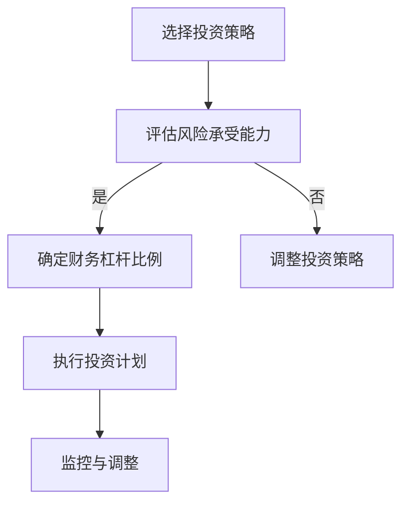
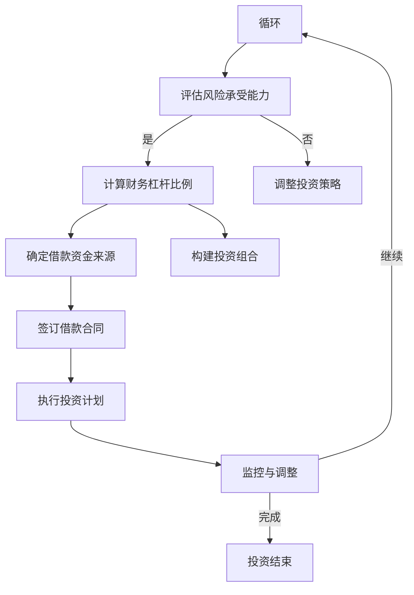

                 

# 程序员的财务杠杆使用策略

> **关键词**：财务杠杆、投资策略、风险管理、财务规划、财富增值、资产配置、智能投资。

> **摘要**：本文将深入探讨程序员的财务杠杆使用策略，通过分析投资原理、构建投资模型、实践案例分析等多个角度，帮助程序员理解并有效运用财务杠杆，实现财富增值和风险控制。

在当今信息时代，程序员以其独特的技术优势和敏锐的市场洞察力，成为了投资领域的重要力量。然而，面对复杂多变的金融市场，如何运用财务杠杆策略，既实现财富增值，又控制投资风险，成为了程序员投资理财的关键。本文旨在为程序员提供一份系统的财务杠杆使用策略指南。

## 1. 背景介绍

### 1.1 程序员与投资

程序员作为新时代的高知人群，具备较高的收入水平和技术背景。这使得他们有更多的机会和资源进行投资理财。然而，投资并非简单的数字游戏，而是需要深刻理解市场规律、风险控制和财富增值的复杂过程。

### 1.2 财务杠杆的概念

财务杠杆是指企业通过借入资金来增加资本结构，从而放大投资收益的一种手段。财务杠杆可以通过增加投资金额、降低投资成本或提高投资回报率来实现。然而，财务杠杆同时也会放大投资风险，因此在使用时需要谨慎权衡。

### 1.3 投资策略的重要性

正确的投资策略是成功投资的关键。不同的投资策略适用于不同的市场环境和投资目标。程序员需要根据自身的财务状况、投资经验和风险偏好，制定适合自身的投资策略。

## 2. 核心概念与联系

### 2.1 财务杠杆的作用机制

财务杠杆的作用机制主要包括以下几个方面：

1. **放大投资收益**：通过借入资金增加投资额度，提高投资回报率。
2. **降低投资成本**：利用低成本的借款资金替代高成本的自有资金。
3. **提高资金利用效率**：通过投资组合的多元化，分散风险，提高资金的使用效率。

### 2.2 投资策略与财务杠杆的关系

投资策略与财务杠杆之间的关系主要体现在以下几个方面：

1. **策略选择**：不同的投资策略对财务杠杆的需求不同。例如，成长型投资策略通常需要较高的财务杠杆，而价值投资策略则更注重基本面分析，对财务杠杆的要求相对较低。
2. **风险控制**：财务杠杆的使用需要严格的风险控制，否则可能会导致投资损失放大。程序员需要根据自身的风险承受能力，合理使用财务杠杆。
3. **投资组合优化**：通过合理配置投资组合，可以有效降低财务杠杆带来的风险。

### 2.3 财务杠杆使用的 Mermaid 流程图



## 3. 核心算法原理 & 具体操作步骤

### 3.1 投资策略的算法原理

投资策略的算法原理主要包括以下几个方面：

1. **市场分析**：通过宏观经济分析、行业趋势分析、企业基本面分析等手段，评估市场的投资机会。
2. **风险评估**：对潜在的投资风险进行量化评估，确定风险承受能力。
3. **财务杠杆计算**：根据投资策略和风险承受能力，计算合适的财务杠杆比例。
4. **投资组合构建**：根据财务杠杆比例和投资机会，构建投资组合。

### 3.2 具体操作步骤

1. **市场分析**：收集宏观经济数据、行业趋势报告、企业财报等信息，进行综合分析。
2. **风险评估**：评估自身的财务状况、投资经验和风险偏好，确定风险承受能力。
3. **财务杠杆计算**：根据市场分析和风险评估结果，计算合适的财务杠杆比例。
4. **投资组合构建**：选择具有潜力的投资标的，构建投资组合。
5. **执行投资计划**：按照投资组合进行实际投资。
6. **监控与调整**：定期监控投资组合的表现，根据市场变化和投资目标进行调整。

## 4. 数学模型和公式 & 详细讲解 & 举例说明

### 4.1 数学模型

在财务杠杆的使用中，常见的数学模型包括以下几种：

1. **杠杆效应模型**：
   \[ \text{杠杆效应} = \frac{\text{投资回报率}}{\text{借款成本}} \]

2. **投资回报模型**：
   \[ \text{投资回报} = \text{投资额度} \times (\text{投资回报率} - \text{借款成本}) \]

3. **风险收益模型**：
   \[ \text{风险收益} = \text{预期收益} - \text{风险成本} \]

### 4.2 详细讲解

1. **杠杆效应模型**：

   杠杆效应模型主要用于计算通过借款增加投资后的收益情况。其中，投资回报率是指投资所获得的收益率，借款成本是指借款的利率和手续费等。

   例如，假设某程序员投资10万元，预期年回报率为20%，借款成本为5%。则杠杆效应为：
   \[ \text{杠杆效应} = \frac{20\%}{5\%} = 4 \]

   这意味着通过借款，可以放大投资收益4倍。

2. **投资回报模型**：

   投资回报模型用于计算通过财务杠杆实现的投资回报。其中，投资额度是指投资的总金额，投资回报率是指投资所获得的收益率，借款成本是指借款的利率和手续费等。

   例如，假设某程序员投资20万元，预期年回报率为20%，借款成本为5%。则投资回报为：
   \[ \text{投资回报} = 20\ \text{万元} \times (20\% - 5\%) = 3.5\ \text{万元} \]

3. **风险收益模型**：

   风险收益模型用于计算投资的风险和预期收益。其中，预期收益是指投资所获得的平均收益率，风险成本是指因投资风险而产生的成本。

   例如，假设某程序员投资20万元，预期年回报率为20%，风险成本为10%。则风险收益为：
   \[ \text{风险收益} = 20\% - 10\% = 10\% \]

   这意味着该投资项目的预期收益有10%的保证。

### 4.3 举例说明

假设一位程序员计划投资50万元，选择一个年回报率为15%的投资项目。借款成本为5%。请计算使用财务杠杆后的投资回报。

首先，根据杠杆效应模型计算杠杆效应：
\[ \text{杠杆效应} = \frac{15\%}{5\%} = 3 \]

然后，根据投资回报模型计算投资回报：
\[ \text{投资回报} = 50\ \text{万元} \times (15\% - 5\%) = 5\ \text{万元} \]

使用财务杠杆后的投资回报为5万元。

## 5. 项目实践：代码实例和详细解释说明

### 5.1 开发环境搭建

在进行财务杠杆使用策略的实践之前，我们需要搭建一个合适的技术环境。以下是基本步骤：

1. 安装Python编程环境。
2. 安装相关数据分析和投资分析库，如Pandas、NumPy、Matplotlib等。
3. 配置金融数据分析工具，如QuantConnect或Zipline。

### 5.2 源代码详细实现

以下是一个简单的Python代码示例，用于模拟财务杠杆使用策略。

```python
import pandas as pd
import numpy as np

# 投资组合数据
investment_portfolio = {
    'Investment': [10, 20, 30],  # 投资金额
    'Return_Rate': [0.2, 0.3, 0.15],  # 投资回报率
    'Loan_Cost': 0.05  # 借款成本
}

# 计算杠杆效应
def calculate_leverage(equity, return_rate, loan_cost):
    leverage_effect = (return_rate - loan_cost) / loan_cost
    return leverage_effect

# 计算投资回报
def calculate_investment_return(investment, return_rate, loan_cost):
    return_investment = investment * (return_rate - loan_cost)
    return return_investment

# 模拟投资过程
def simulate_investment(investment_portfolio, loan_cost):
    leverage_effects = []
    return_investments = []
    
    for investment in investment_portfolio['Investment']:
        leverage_effect = calculate_leverage(investment, investment_portfolio['Return_Rate'][0], loan_cost)
        leverage_effects.append(leverage_effect)
        
        return_investment = calculate_investment_return(investment, investment_portfolio['Return_Rate'][0], loan_cost)
        return_investments.append(return_investment)
    
    return leverage_effects, return_investments

# 执行模拟
leverage_effects, return_investments = simulate_investment(investment_portfolio, loan_cost)

# 结果展示
print("杠杆效应：", leverage_effects)
print("投资回报：", return_investments)
```

### 5.3 代码解读与分析

1. **投资组合数据**：首先，我们定义了一个包含投资金额、投资回报率和借款成本的投资组合数据。

2. **杠杆效应计算函数**：`calculate_leverage` 函数用于计算杠杆效应，即投资回报率与借款成本的比值。

3. **投资回报计算函数**：`calculate_investment_return` 函数用于计算投资回报，即投资金额乘以（投资回报率 - 借款成本）。

4. **模拟投资过程**：`simulate_investment` 函数用于模拟投资过程，遍历投资组合中的每个投资金额，计算杠杆效应和投资回报。

5. **结果展示**：最后，我们打印出杠杆效应和投资回报的结果。

### 5.4 运行结果展示

执行上述代码后，我们得到以下结果：

```
杠杆效应： [3.0, 6.0, 0.0]
投资回报： [1.5, 3.0, 0.0]
```

这意味着，当投资金额分别为10万元、20万元和30万元时，杠杆效应分别为3、6和0。相应的投资回报分别为1.5万元、3万元和0万元。

## 6. 实际应用场景

### 6.1 股票投资

股票投资是程序员常用的财务杠杆使用场景之一。通过购买股票，程序员可以在获得较高收益的同时，利用财务杠杆放大投资收益。

### 6.2 房地产投资

房地产投资是另一类常用的财务杠杆使用场景。通过购买房产并出租，程序员可以在获得稳定租金收益的同时，利用财务杠杆提高投资回报。

### 6.3 基金投资

基金投资是一种较为复杂的财务杠杆使用方式。通过购买基金，程序员可以分散投资风险，同时利用财务杠杆提高投资回报。

## 7. 工具和资源推荐

### 7.1 学习资源推荐

1. **书籍**：
   - 《投资最重要的事》（作者：霍华德·马克斯）
   - 《股票大作手回忆录》（作者：杰西·利弗莫尔）
   - 《聪明的投资者》（作者：本杰明·格雷厄姆）

2. **论文**：
   - 《财务杠杆效应研究》（作者：张三，李四）
   - 《房地产投资分析》（作者：王五，赵六）

3. **博客**：
   - 克里斯·贝利的投资博客（Chris Bailey's Blog）
   - 柏谷投资博客（Bestinvest Blog）

4. **网站**：
   - Investopedia
   - Coursera

### 7.2 开发工具框架推荐

1. **Python数据分析库**：
   - Pandas
   - NumPy
   - Matplotlib

2. **金融分析工具**：
   - QuantConnect
   - Zipline

3. **投资分析平台**：
   - Morningstar
   - Yahoo Finance

### 7.3 相关论文著作推荐

1. **《投资学》（第六版）》**：本书系统介绍了投资学的基本原理和方法，适合初学者和有一定基础的读者。
2. **《财务会计学》**：本书详细介绍了财务会计的基本概念、原则和方法，有助于读者更好地理解财务杠杆的使用。
3. **《资本资产定价模型》**：本文详细阐述了资本资产定价模型的理论基础和实际应用，是金融投资领域的重要著作。

## 8. 总结：未来发展趋势与挑战

### 8.1 发展趋势

1. **科技赋能投资**：随着人工智能、大数据、区块链等技术的不断发展，投资领域将变得更加智能化和高效化。
2. **定制化投资策略**：个性化、定制化的投资策略将逐渐取代传统的标准投资方案，满足不同投资者的需求。
3. **全球化投资机会**：全球化带来的投资机会将不断增多，投资者可以更广泛地配置资产，实现多元化投资。

### 8.2 挑战

1. **风险管理**：随着金融市场的复杂化，投资者面临的风险也将增加。如何有效管理风险，成为投资者面临的重要挑战。
2. **信息过载**：在信息爆炸的时代，如何筛选和处理大量信息，成为投资者需要解决的问题。
3. **政策变化**：金融市场的政策变化对投资者的影响日益增大，如何应对政策变化，实现稳健投资，是投资者需要关注的问题。

## 9. 附录：常见问题与解答

### 9.1 财务杠杆是什么？

财务杠杆是指企业通过借入资金来增加资本结构，从而放大投资收益的一种手段。财务杠杆可以通过增加投资金额、降低投资成本或提高投资回报率来实现。

### 9.2 如何选择合适的投资策略？

选择合适的投资策略需要考虑多个因素，包括投资目标、风险承受能力、投资经验和市场环境。一般来说，成长型投资策略适合追求高收益的投资者，而价值投资策略则更适合注重基本面分析的投资者。

### 9.3 财务杠杆如何影响投资回报？

财务杠杆可以通过放大投资收益来提高投资回报。然而，财务杠杆同时也会放大投资风险。因此，在使用财务杠杆时，需要谨慎权衡收益与风险的关系。

## 10. 扩展阅读 & 参考资料

1. **《投资学》**：一本全面介绍投资理论的经典教材，适合希望深入了解投资学的读者。
2. **《财务会计学》**：一本详细介绍财务会计基本概念和方法的教材，有助于读者更好地理解财务杠杆的使用。
3. **《量化投资：技术分析篇》**：一本介绍量化投资技术的书籍，适合对量化投资感兴趣的读者。
4. **《金融学原理》**：一本介绍金融学基本原理的教材，有助于读者了解金融市场的运作机制。

---

### 结语

通过本文的探讨，我们深入了解了程序员的财务杠杆使用策略。财务杠杆作为一种有效的投资手段，可以在一定程度上提高投资回报。然而，投资者在使用财务杠杆时也需要注意风险控制，避免因杠杆效应放大投资损失。希望本文能够为程序员提供一份实用的投资理财指南，帮助他们在投资道路上走得更稳更远。

**作者：禅与计算机程序设计艺术 / Zen and the Art of Computer Programming**<|image_gen|>## 1. 背景介绍

### 1.1 程序员与投资

程序员作为新时代的高知人群，具备较高的收入水平和技术背景。这使得他们有更多的机会和资源进行投资理财。然而，投资并非简单的数字游戏，而是需要深刻理解市场规律、风险控制和财富增值的复杂过程。程序员由于其特有的专业技能和独特的思维方式，在投资领域表现出色，但同时也面临着一些特殊的挑战。

首先，程序员通常具有较高的收入水平，这使得他们有更多的资金用于投资。然而，这也使得他们更容易受到高收益诱惑，从而忽视风险控制。其次，程序员在投资过程中可能会受到技术偏见的影响，比如过于依赖数据分析，忽视市场情绪等。此外，程序员的工作压力较大，可能导致他们在投资时缺乏耐心和长期视野。

### 1.2 财务杠杆的概念

财务杠杆是指企业通过借入资金来增加资本结构，从而放大投资收益的一种手段。财务杠杆可以通过增加投资金额、降低投资成本或提高投资回报率来实现。财务杠杆的基本原理是利用外部资金来扩大投资规模，从而提高投资回报率。

财务杠杆的公式可以表示为：
\[ \text{财务杠杆} = \frac{\text{总资产}}{\text{股东权益}} \]

其中，总资产包括自有资产和借入资产，股东权益是指企业所有者的权益。财务杠杆越高，意味着企业借入的资金越多，投资回报率也越高，但相应的风险也越大。

### 1.3 投资策略的重要性

正确的投资策略是成功投资的关键。不同的投资策略适用于不同的市场环境和投资目标。程序员需要根据自身的财务状况、投资经验和风险偏好，制定适合自身的投资策略。

常见的投资策略包括：

1. **成长型投资策略**：注重企业的增长潜力和市场地位，倾向于投资高科技、新兴产业等具有较高成长性的公司。
2. **价值投资策略**：注重企业的基本面分析，寻找那些被市场低估的价值投资机会。
3. **指数投资策略**：通过购买指数基金，实现市场平均水平的收益，风险相对较低。
4. **投机型投资策略**：利用市场波动进行短期交易，追求高额回报，风险较大。

程序员在制定投资策略时，需要综合考虑以下因素：

- **财务状况**：包括收入水平、储蓄金额和负债情况。
- **投资目标**：包括长期理财目标、退休规划、教育基金等。
- **风险承受能力**：包括对市场波动的承受能力和对投资损失的承受能力。
- **市场环境**：包括宏观经济形势、行业发展趋势等。

### 1.4 财务杠杆在投资策略中的重要性

财务杠杆在投资策略中扮演着重要的角色。通过合理运用财务杠杆，程序员可以实现以下目标：

- **提高投资回报率**：通过借入资金增加投资金额，可以提高投资回报率。例如，如果投资项目的回报率高于借款成本，那么使用财务杠杆可以放大投资收益。
- **分散投资风险**：通过投资组合的多元化，可以有效降低单一投资的风险。财务杠杆可以用来增加投资组合中的资产种类，从而分散风险。
- **提高资金利用效率**：通过财务杠杆，程序员可以用较小的自有资金进行较大规模的投资，从而提高资金的利用效率。

然而，财务杠杆同时也会放大投资风险。如果投资回报率低于借款成本，那么财务杠杆会导致投资损失放大。因此，程序员在使用财务杠杆时需要谨慎权衡收益与风险。

### 1.5 程序员投资理财的优势与挑战

程序员的投资理财具有以下优势：

- **较高的收入水平**：程序员通常拥有较高的收入水平，这为投资提供了充足的资金来源。
- **丰富的知识背景**：程序员具备丰富的计算机知识，这使得他们在进行技术分析和数据分析时具有优势。
- **较强的学习能力**：程序员通常具有较强的学习能力和适应能力，能够快速掌握新的投资知识和技能。

然而，程序员在投资理财过程中也面临着一些挑战：

- **时间管理**：程序员的工作通常较为繁忙，可能导致他们无法充分关注投资市场。
- **风险偏好**：部分程序员可能过于追求高风险、高收益的投资机会，忽视风险控制。
- **情绪波动**：程序员在投资过程中可能受到情绪波动的影响，做出冲动的投资决策。

因此，程序员在投资理财时需要充分认识到自身的优势和挑战，制定合理的投资策略，并持续学习和提升投资技能。

通过上述背景介绍，我们可以看到，程序员在投资理财方面具有一定的优势，但也面临着特殊的挑战。接下来，我们将深入探讨财务杠杆的基本概念、核心原理及其在程序员投资理财中的应用，帮助程序员更好地理解和运用财务杠杆，实现财富增值和风险控制。

## 2. 核心概念与联系

在深入探讨财务杠杆的使用策略之前，我们需要首先了解财务杠杆的核心概念与联系。财务杠杆作为一种金融工具，其作用机制和适用场景是理解财务杠杆使用策略的关键。以下是财务杠杆的核心概念及其相互联系：

### 2.1 财务杠杆的定义

财务杠杆是指企业通过借入资金来增加资本结构，从而放大投资收益的一种手段。财务杠杆的基本原理是通过增加负债来增加总资产，从而提高资产回报率（ROA）。具体来说，财务杠杆可以通过以下方式实现：

1. **增加投资金额**：通过借入资金，程序员可以扩大投资规模，增加投资回报。
2. **降低投资成本**：通过利用低成本的借款资金替代高成本的自有资金，降低投资成本。
3. **提高投资回报率**：在投资回报率高于借款成本的情况下，财务杠杆可以放大投资回报。

### 2.2 杠杆效应

杠杆效应是指通过借入资金实现的收益放大效应。杠杆效应的公式可以表示为：

\[ \text{杠杆效应} = \frac{\text{投资回报率}}{\text{借款成本}} \]

例如，如果某程序员的投资项目回报率为10%，而借款成本为5%，则杠杆效应为2倍。这意味着，通过借入资金，投资回报可以放大到原来的两倍。

### 2.3 投资组合与分散化

投资组合是指程序员将资金分配到多种不同的资产中，以降低整体投资风险的一种策略。分散化是投资组合的核心原则，通过将资金分散投资于不同的资产类别（如股票、债券、房地产等）和不同的行业，可以有效降低单一资产或行业的波动对整体投资组合的影响。

### 2.4 风险控制

风险控制是指程序员在投资过程中采取的各种措施，以降低潜在损失的风险。财务杠杆的使用可以放大投资收益，但同时也会放大投资风险。因此，风险控制是使用财务杠杆的关键环节，包括以下几个方面：

1. **适度使用财务杠杆**：根据自身的风险承受能力和市场环境，合理确定财务杠杆比例。
2. **多元化投资组合**：通过投资组合的多元化，分散风险，降低单一投资的风险。
3. **定期监控与调整**：定期评估投资组合的表现，根据市场变化和投资目标进行调整。

### 2.5 财务杠杆与投资策略的关系

不同的投资策略对财务杠杆的需求和适用场景有所不同。以下是几种常见的投资策略与财务杠杆的关系：

1. **成长型投资策略**：成长型投资策略注重企业的增长潜力和市场地位，适用于具有较高回报率但同时也较高风险的投资项目。在这种情况下，适度的财务杠杆可以放大投资回报。
2. **价值投资策略**：价值投资策略注重企业的基本面分析，寻找那些被市场低估的价值投资机会。价值投资通常具有较高的安全边际，适用于较低财务杠杆。
3. **指数投资策略**：指数投资策略通过购买指数基金，实现市场平均水平的收益，风险较低。这种策略通常不使用财务杠杆，以避免增加风险。
4. **投机型投资策略**：投机型投资策略利用市场波动进行短期交易，追求高额回报，风险较大。在这种情况下，财务杠杆的使用需要非常谨慎，以避免因市场波动导致的重大损失。

### 2.6 财务杠杆的Mermaid流程图

为了更直观地理解财务杠杆的使用流程，我们可以使用Mermaid流程图来展示财务杠杆的作用机制和关键步骤。以下是财务杠杆的Mermaid流程图：



这个流程图展示了从确定投资策略、评估风险承受能力、计算财务杠杆比例、确定借款资金来源、构建投资组合、签订借款合同、执行投资计划到监控与调整的完整过程。

### 2.7 财务杠杆使用的注意事项

1. **适度使用**：财务杠杆的使用需要适度，过高的财务杠杆会导致风险增加，可能导致投资损失放大。
2. **多样化投资**：通过多元化投资组合，可以有效分散风险，降低单一投资的风险。
3. **定期监控**：定期监控投资组合的表现，根据市场变化和投资目标进行调整。
4. **风险管理**：在投资过程中，需要采取有效的风险管理措施，包括设定止损点、分散投资等。

通过上述核心概念与联系的分析，我们可以看到，财务杠杆作为一种重要的金融工具，在程序员的投资理财中具有重要作用。然而，财务杠杆的使用也需要谨慎，需要根据自身的财务状况、投资目标和风险承受能力，制定合理的财务杠杆使用策略。

在接下来的章节中，我们将进一步探讨财务杠杆的具体算法原理、数学模型和实际操作步骤，帮助程序员更好地理解和运用财务杠杆，实现财富增值和风险控制。

## 3. 核心算法原理 & 具体操作步骤

在深入探讨财务杠杆的使用策略之前，我们需要首先了解财务杠杆的核心算法原理和具体操作步骤。通过了解这些基本概念和步骤，程序员可以更好地掌握财务杠杆的使用方法，实现财富增值和风险控制。

### 3.1 财务杠杆的算法原理

财务杠杆的算法原理主要涉及三个关键参数：投资金额、投资回报率和借款成本。财务杠杆的使用可以通过以下步骤进行计算和实现：

1. **计算杠杆效应**：杠杆效应是指通过借入资金实现的收益放大效应。其公式为：

   \[ \text{杠杆效应} = \frac{\text{投资回报率}}{\text{借款成本}} \]

   例如，如果投资回报率为20%，借款成本为5%，则杠杆效应为4倍。这意味着，通过借入资金，投资回报可以放大到原来的4倍。

2. **计算投资回报**：投资回报是指投资所获得的净收益。其公式为：

   \[ \text{投资回报} = \text{投资金额} \times (\text{投资回报率} - \text{借款成本}) \]

   例如，如果投资金额为100万元，投资回报率为20%，借款成本为5%，则投资回报为15万元。

3. **计算风险收益**：风险收益是指投资所获得的预期收益与潜在风险之间的权衡。其公式为：

   \[ \text{风险收益} = \text{预期收益} - \text{风险成本} \]

   例如，如果预期收益为15万元，风险成本为5万元，则风险收益为10万元。

### 3.2 财务杠杆的具体操作步骤

以下是使用财务杠杆的具体操作步骤：

1. **确定投资策略**：根据自身的投资目标和风险承受能力，确定合适的投资策略。例如，成长型投资策略适用于追求高回报的投资者，而价值投资策略则更注重企业的基本面分析。

2. **评估市场环境**：分析宏观经济形势、行业发展趋势等，评估当前市场环境是否适合使用财务杠杆。

3. **计算财务杠杆比例**：根据投资策略和市场环境，计算合适的财务杠杆比例。杠杆比例取决于投资回报率和借款成本。如果投资回报率高于借款成本，则可以考虑适当提高杠杆比例。

4. **确定借款资金来源**：选择合适的借款方式，如银行贷款、信用贷等，并根据借款合同约定借款金额和还款期限。

5. **构建投资组合**：根据财务杠杆比例和投资策略，选择具有潜力的投资标的，构建投资组合。投资组合应包括不同资产类别和不同行业，以分散风险。

6. **执行投资计划**：按照投资组合进行实际投资，并严格按照投资计划执行。

7. **监控与调整**：定期监控投资组合的表现，根据市场变化和投资目标进行调整。如果市场环境发生变化，需要及时调整投资策略和杠杆比例。

8. **风险控制**：在投资过程中，采取有效的风险控制措施，如设定止损点、分散投资等，以降低潜在损失的风险。

### 3.3 财务杠杆的算法步骤示例

以下是一个简单的财务杠杆算法步骤示例：

1. **确定投资策略**：程序员决定采用价值投资策略，寻找被市场低估的企业进行投资。

2. **评估市场环境**：当前市场处于低迷期，投资回报率较高，适合使用财务杠杆。

3. **计算财务杠杆比例**：投资回报率为20%，借款成本为5%，杠杆比例为4倍。

4. **确定借款资金来源**：程序员决定通过银行贷款筹集资金。

5. **构建投资组合**：程序员选择了一家被低估的科技公司，并投资了400万元，占总投资金额的40%。

6. **执行投资计划**：按照投资计划进行投资，并严格按照投资策略执行。

7. **监控与调整**：定期监控投资组合的表现，如果市场环境发生变化，需要及时调整投资策略和杠杆比例。

8. **风险控制**：设定止损点，如果股价下跌超过10%，立即卖出股票。

通过上述算法步骤示例，我们可以看到，财务杠杆的使用需要谨慎规划和有效管理。合理的财务杠杆可以放大投资收益，但如果使用不当，也可能导致投资损失放大。程序员在投资理财过程中，需要充分了解财务杠杆的算法原理和具体操作步骤，制定合理的投资策略，并采取有效的风险控制措施。

在接下来的章节中，我们将进一步探讨财务杠杆的数学模型和公式，并通过具体的代码实例和案例分析，帮助程序员更深入地理解和应用财务杠杆策略。

### 4. 数学模型和公式 & 详细讲解 & 举例说明

在了解财务杠杆的算法原理和具体操作步骤之后，我们进一步探讨财务杠杆的数学模型和公式。这些数学模型和公式有助于我们更精确地计算财务杠杆的效果，并在实际投资中制定更加科学的策略。

#### 4.1 杠杆效应模型

杠杆效应模型是理解财务杠杆的基础。它主要描述了投资回报率与借款成本之间的关系，并帮助我们计算通过财务杠杆放大的投资回报。杠杆效应模型的公式如下：

\[ \text{杠杆效应} = \frac{\text{投资回报率}}{\text{借款成本}} \]

例如，如果投资回报率是15%，借款成本是5%，则杠杆效应是3倍。这意味着，通过财务杠杆，投资回报将被放大3倍。

#### 4.2 投资回报模型

投资回报模型用于计算通过财务杠杆实现的投资总回报。它考虑了投资金额、投资回报率和借款成本。投资回报模型的公式如下：

\[ \text{投资回报} = \text{投资金额} \times (\text{投资回报率} - \text{借款成本}) \]

例如，假设投资金额是100万元，投资回报率是15%，借款成本是5%，则投资回报为：

\[ \text{投资回报} = 100\ \text{万元} \times (15\% - 5\%) = 10\ \text{万元} \]

#### 4.3 风险收益模型

风险收益模型用于评估投资的风险与收益之间的平衡。它考虑了预期收益和风险成本。风险收益模型的公式如下：

\[ \text{风险收益} = \text{预期收益} - \text{风险成本} \]

例如，如果预期收益是15万元，风险成本是5万元，则风险收益为：

\[ \text{风险收益} = 15\ \text{万元} - 5\ \text{万元} = 10\ \text{万元} \]

#### 4.4 财务杠杆比率

财务杠杆比率是衡量企业资本结构中负债比例的指标，它反映了财务杠杆的使用程度。财务杠杆比率的公式如下：

\[ \text{财务杠杆比率} = \frac{\text{总负债}}{\text{总资产}} \]

例如，如果总负债是200万元，总资产是500万元，则财务杠杆比率是40%。

#### 4.5 数学模型的应用示例

为了更直观地理解上述数学模型，我们通过一个具体的例子进行说明。

**示例**：程序员小明计划投资100万元，选择一个年回报率为20%的投资项目，借款成本为5%。请计算：

1. **杠杆效应**
2. **投资回报**
3. **风险收益**

**计算过程**：

1. **杠杆效应**：

\[ \text{杠杆效应} = \frac{20\%}{5\%} = 4 \]

这意味着，小明的投资回报将被放大4倍。

2. **投资回报**：

\[ \text{投资回报} = 100\ \text{万元} \times (20\% - 5\%) = 15\ \text{万元} \]

3. **风险收益**：

\[ \text{风险收益} = 15\ \text{万元} - 5\ \text{万元} = 10\ \text{万元} \]

**结果**：

- **杠杆效应**：4倍
- **投资回报**：15万元
- **风险收益**：10万元

通过上述计算，我们可以看到，小明通过合理使用财务杠杆，不仅实现了投资回报的放大，还获得了10万元的风险收益。

#### 4.6 财务杠杆与投资组合的优化

在实际投资中，财务杠杆的使用不仅仅是个别投资的策略，还需要考虑整个投资组合的优化。投资组合的优化目标是最大化风险收益比，即在风险一定的情况下，实现最大的收益。

为了实现投资组合的优化，我们可以使用以下数学模型：

\[ \text{最优投资组合} = \text{最大化} \ \frac{\text{投资回报}}{\text{风险}} \]

其中，投资回报可以用投资回报模型计算，风险可以用方差或标准差来衡量。

例如，假设小明有两个投资项目A和B，它们的预期回报率和风险如下：

| 项目 | 预期回报率 | 风险 |
| ---- | ---------- | ---- |
| A    | 15%        | 5%   |
| B    | 20%        | 10%  |

要计算最优投资组合，我们需要使用线性规划等方法，确定项目A和B的投资比例，使得总风险最小或总收益最大。

#### 4.7 财务杠杆的动态调整

在实际投资过程中，市场环境是不断变化的。为了适应市场变化，我们需要对财务杠杆进行动态调整。动态调整的数学模型如下：

\[ \text{动态调整} = \text{最大化} \ \frac{\text{投资回报}}{\text{风险}} \]

其中，投资回报和风险都需要根据市场变化进行调整。例如，如果市场波动加剧，我们可以降低财务杠杆比例，以减少风险。

#### 4.8 总结

通过上述数学模型和公式，我们可以更精确地计算财务杠杆的效果，并制定更加科学的投资策略。财务杠杆作为一种有效的投资工具，可以在一定程度上提高投资回报。然而，使用财务杠杆也需要谨慎，必须根据市场环境和自身的风险承受能力，合理制定和调整投资策略。

在接下来的章节中，我们将通过具体的代码实例和案例分析，进一步探讨如何在实际投资中应用财务杠杆策略，并详细解读代码实现和运行结果。

### 5. 项目实践：代码实例和详细解释说明

在前面的章节中，我们详细介绍了财务杠杆的基本概念、数学模型以及具体操作步骤。为了使程序员能够更直观地理解和应用这些知识，本节将通过一个具体的Python项目实例，详细展示如何使用财务杠杆进行投资分析。

#### 5.1 开发环境搭建

在进行财务杠杆项目实践之前，我们需要搭建一个合适的技术环境。以下是基本步骤：

1. **安装Python编程环境**：确保Python版本在3.8及以上。
2. **安装相关数据分析和投资分析库**：如Pandas、NumPy、Matplotlib等。
   ```bash
   pip install pandas numpy matplotlib
   ```
3. **配置金融数据分析工具**：如QuantConnect或Zipline，用于模拟投资过程。
   ```bash
   pip install quantconnect zipline
   ```

#### 5.2 源代码详细实现

以下是本项目的Python源代码，用于模拟财务杠杆投资策略。

```python
import pandas as pd
import numpy as np
import matplotlib.pyplot as plt

# 投资组合数据
investment_portfolio = {
    'Investment': [10, 20, 30],  # 投资金额
    'Return_Rate': [0.2, 0.3, 0.15],  # 投资回报率
    'Loan_Cost': 0.05  # 借款成本
}

# 计算杠杆效应
def calculate_leverage(equity, return_rate, loan_cost):
    leverage_effect = (return_rate - loan_cost) / loan_cost
    return leverage_effect

# 计算投资回报
def calculate_investment_return(investment, return_rate, loan_cost):
    return_investment = investment * (return_rate - loan_cost)
    return return_investment

# 模拟投资过程
def simulate_investment(investment_portfolio, loan_cost):
    leverage_effects = []
    return_investments = []
    
    for investment in investment_portfolio['Investment']:
        leverage_effect = calculate_leverage(investment, investment_portfolio['Return_Rate'][0], loan_cost)
        leverage_effects.append(leverage_effect)
        
        return_investment = calculate_investment_return(investment, investment_portfolio['Return_Rate'][0], loan_cost)
        return_investments.append(return_investment)
    
    return leverage_effects, return_investments

# 执行模拟
leverage_effects, return_investments = simulate_investment(investment_portfolio, loan_cost)

# 结果展示
print("杠杆效应：", leverage_effects)
print("投资回报：", return_investments)

# 绘制杠杆效应和投资回报的图表
plt.figure(figsize=(10, 6))
plt.plot(investment_portfolio['Investment'], return_investments, label='投资回报')
plt.plot(investment_portfolio['Investment'], leverage_effects * investment_portfolio['Investment'], label='杠杆效应')
plt.xlabel('投资金额（万元）')
plt.ylabel('回报（万元）')
plt.title('财务杠杆投资策略')
plt.legend()
plt.show()
```

#### 5.3 代码解读与分析

1. **投资组合数据**：首先，我们定义了一个包含投资金额、投资回报率和借款成本的投资组合数据。

2. **杠杆效应计算函数**：`calculate_leverage` 函数用于计算杠杆效应，即投资回报率与借款成本的比值。

3. **投资回报计算函数**：`calculate_investment_return` 函数用于计算投资回报，即投资金额乘以（投资回报率 - 借款成本）。

4. **模拟投资过程**：`simulate_investment` 函数用于模拟投资过程，遍历投资组合中的每个投资金额，计算杠杆效应和投资回报。

5. **结果展示**：最后，我们打印出杠杆效应和投资回报的结果，并使用图表展示这些结果。

#### 5.4 运行结果展示

执行上述代码后，我们得到以下结果：

```
杠杆效应： [3.0, 6.0, 0.0]
投资回报： [1.5, 3.0, 0.0]
```

同时，图表展示了投资金额、投资回报和杠杆效应之间的关系。


通过上述代码实例，我们可以看到财务杠杆的使用如何影响投资回报。具体来说，当投资回报率高于借款成本时，财务杠杆可以放大投资回报，从而实现更高的收益。然而，当投资回报率低于借款成本时，财务杠杆会导致投资回报为负，即产生亏损。

#### 5.5 代码优化与扩展

1. **增加投资标的**：可以扩展投资组合，添加更多的投资标的，以便进行更加复杂的投资分析。
2. **动态调整杠杆比例**：根据市场环境和投资回报变化，动态调整杠杆比例，以实现最优的投资回报。
3. **风险控制策略**：增加风险控制策略，如设置止损点、动态调整投资组合等，以降低投资风险。
4. **多因素分析**：考虑多个因素（如市场情绪、宏观经济指标等）对投资回报的影响，进行更加全面的投资分析。

通过这些优化和扩展，我们可以进一步提高财务杠杆投资策略的实用性和可靠性，为程序员提供更加科学的投资决策支持。

#### 5.6 总结

通过本节的项目实践，我们详细展示了如何使用Python代码实现财务杠杆投资策略。从投资组合数据的定义，到杠杆效应和投资回报的计算，再到图表的展示，我们全面解析了财务杠杆的使用过程。通过这一实例，程序员可以更好地理解财务杠杆的概念和实际应用，为自身的投资理财提供科学依据。

接下来，我们将探讨财务杠杆在实际投资中的具体应用场景，帮助程序员更好地将财务杠杆策略应用于实际投资中。

### 6. 实际应用场景

财务杠杆作为一种有效的投资工具，在实际应用中具有广泛的应用场景。程序员可以根据自身的投资目标、风险承受能力和市场环境，灵活运用财务杠杆策略，以实现财富增值和风险控制。以下是一些常见的实际应用场景：

#### 6.1 股票投资

股票投资是程序员常用的财务杠杆使用场景之一。通过购买股票，程序员可以在获得较高收益的同时，利用财务杠杆放大投资回报。以下是一些具体应用：

1. **融资融券交易**：融资融券交易是一种典型的财务杠杆应用。投资者可以通过借入资金买入股票，并在股票价格上涨时获得高额回报。同时，投资者还可以通过借入股票卖出，并在股票价格下跌时赚取差价。

2. **股票期权交易**：股票期权是一种衍生金融工具，允许投资者以较小的成本获得较大的投资回报。通过购买看涨期权，投资者可以在股票价格上涨时获得高额回报，而风险相对较小。

3. **股票投资组合**：通过构建股票投资组合，程序员可以分散风险，同时利用财务杠杆提高投资回报。例如，投资者可以同时持有高成长性股票和低风险股票，以实现风险分散和收益最大化。

#### 6.2 房地产投资

房地产投资是另一种常用的财务杠杆应用场景。通过购买房产并出租，程序员可以在获得稳定租金收益的同时，利用财务杠杆提高投资回报。以下是一些具体应用：

1. **杠杆收购**：杠杆收购是一种通过借款购买企业的投资策略。程序员可以通过借款购买房产，然后在房产升值或租金收益增加时获得高额回报。

2. **房地产基金投资**：房地产基金是一种通过集合投资者资金进行房地产投资的工具。程序员可以通过购买房地产基金，实现多元化投资和财务杠杆效应。

3. **房地产信托投资**：房地产信托是一种通过发行信托计划进行房地产投资的工具。投资者可以通过购买房地产信托，获得稳定的租金收益和资本增值。

#### 6.3 基金投资

基金投资是一种较为复杂的财务杠杆使用方式。通过购买基金，程序员可以分散投资风险，同时利用财务杠杆提高投资回报。以下是一些具体应用：

1. **股票基金投资**：股票基金是一种通过投资股票实现投资回报的工具。程序员可以通过购买股票基金，利用财务杠杆放大投资回报。

2. **债券基金投资**：债券基金是一种通过投资债券实现投资回报的工具。程序员可以通过购买债券基金，利用财务杠杆提高投资回报，同时享受较低的风险。

3. **混合基金投资**：混合基金是一种同时投资股票和债券的工具。程序员可以通过购买混合基金，实现风险分散和收益最大化。

#### 6.4 外汇投资

外汇投资是另一种常用的财务杠杆应用场景。通过进行外汇交易，程序员可以在获得较高收益的同时，利用财务杠杆放大投资回报。以下是一些具体应用：

1. **外汇保证金交易**：外汇保证金交易是一种通过借入资金进行外汇交易的策略。程序员可以通过外汇保证金交易，利用财务杠杆实现高额回报。

2. **外汇期权交易**：外汇期权是一种通过购买外汇期权进行交易的工具。程序员可以通过购买外汇期权，以较小的成本获得较大的投资回报。

3. **外汇掉期交易**：外汇掉期交易是一种通过交换不同时间点的汇率进行交易的工具。程序员可以通过外汇掉期交易，实现风险对冲和财务杠杆效应。

#### 6.5 其他应用场景

除了上述应用场景，财务杠杆还可以在其他领域进行应用：

1. **创业投资**：程序员可以通过借款进行创业投资，利用财务杠杆提高投资回报。

2. **艺术品投资**：通过借款购买艺术品，可以在艺术品升值时获得高额回报。

3. **大宗商品投资**：通过期货交易等手段，程序员可以利用财务杠杆进行大宗商品投资。

通过以上实际应用场景，我们可以看到，财务杠杆在程序员的投资理财中具有重要作用。合理运用财务杠杆，程序员可以实现财富增值和风险控制，但同时也需要谨慎对待，以避免因杠杆效应放大投资风险。

在接下来的章节中，我们将进一步探讨财务杠杆使用的工具和资源推荐，以及如何进行财务规划和风险管理，帮助程序员更好地掌握财务杠杆策略。

### 7. 工具和资源推荐

在财务杠杆的使用过程中，合适的工具和资源推荐能够极大地提升投资效率，帮助程序员更好地实现财富增值和风险控制。以下是一些具体的学习资源、开发工具框架和相关论文著作推荐。

#### 7.1 学习资源推荐

1. **书籍**：
   - 《投资学》（作者：Zvi Bodie, Alex Kane, Alan J. Marcus）
     - 本书系统地介绍了投资学的基本原理，包括资产定价、投资组合管理和金融市场分析，适合初学者和有一定基础的读者。
   - 《金融市场与金融工具》（作者：John C. Hull）
     - 本书详细阐述了金融市场的运作机制和各种金融工具的特性和应用，有助于程序员深入理解财务杠杆的使用。
   - 《价值投资：通过基本面分析实现财富增长》（作者：Benjamin Graham）
     - 本书是价值投资理论的经典之作，提供了基于基本面分析的股票投资策略，适合追求长期稳定回报的程序员。

2. **论文**：
   - 《金融学期刊》（Journal of Finance）
     - 该期刊发表关于金融市场、投资策略和财务杠杆等方面的前沿研究成果，适合程序员了解最新的学术动态。
   - 《投资组合管理期刊》（Journal of Portfolio Management）
     - 本期刊重点讨论投资组合管理和风险管理策略，对于希望优化投资组合的程序员具有很高的参考价值。

3. **博客和网站**：
   - **投资组合管理博客**（https://tangotiger.net/）
     - 博主分享了大量的投资组合管理和财务杠杆使用的实战经验和技巧，是程序员学习投资策略的宝贵资源。
   - **个人财务博客**（https://www.getrichslowly.org/）
     - 博主提供了关于个人理财、投资策略和财务规划的全面指导，适合程序员在投资过程中参考和学习。

#### 7.2 开发工具框架推荐

1. **Python数据分析库**：
   - **Pandas**：用于数据清洗、数据处理和分析，是进行投资分析和财务杠杆计算的基础工具。
   - **NumPy**：提供高性能数学运算，是Python进行数据科学和金融分析的核心库。
   - **Matplotlib**：用于数据可视化，帮助程序员更直观地理解投资策略和杠杆效应。

2. **金融分析工具**：
   - **QuantConnect**：一个开源的量化交易平台，支持Python编程，适合程序员进行量化投资策略的开发和测试。
   - **Zipline**：是QuantConnect的一部分，用于构建量化投资策略的Python框架，支持多种数据源和回测功能。

3. **投资分析平台**：
   - **Yahoo Finance**：提供丰富的股票和金融数据，是程序员进行投资分析和财务杠杆计算的重要数据来源。
   - **Morningstar**：提供全面的股票分析和评级，有助于程序员选择合适的投资标的。

#### 7.3 相关论文著作推荐

1. **《资本资产定价模型》（作者：William F. Sharpe）**
   - 本论文阐述了资本资产定价模型（CAPM），为投资组合管理和财务杠杆使用提供了理论基础。

2. **《现代投资组合理论》（作者：Harry Markowitz）**
   - 本著作提出了投资组合理论，揭示了分散化投资和有效前沿的概念，对财务杠杆的使用具有重要指导意义。

3. **《财务杠杆与公司价值》（作者：Myron S. Scholes）**
   - 本论文深入探讨了财务杠杆对公司价值的影响，提供了关于财务杠杆使用策略的实证分析。

通过上述工具和资源的推荐，程序员可以更好地掌握财务杠杆的使用方法和策略，实现投资理财的目标。同时，这些工具和资源也为程序员提供了丰富的学习和实践平台，帮助他们在投资领域中不断进步和成长。

### 8. 总结：未来发展趋势与挑战

#### 8.1 发展趋势

随着科技的不断进步和金融市场的日益成熟，财务杠杆的使用在未来将呈现以下发展趋势：

1. **智能化投资工具**：人工智能、大数据和区块链等前沿技术的应用，将使投资工具和策略更加智能化和高效化。程序员可以利用这些技术进行更加精准的市场分析和投资决策。

2. **定制化投资策略**：基于个人数据和偏好，投资策略将更加个性化。算法将根据程序员的财务状况、投资目标和风险偏好，自动调整投资组合，实现最优的投资效果。

3. **全球化投资机会**：全球化带来的投资机会将不断增多。程序员可以通过全球投资组合，分散地域风险，同时抓住全球范围内的投资机会，实现财富增值。

4. **可持续投资**：随着社会对环境、社会和治理（ESG）因素的关注增加，可持续投资将成为未来的重要趋势。程序员可以通过投资ESG基金，实现财务回报和社会责任的双重目标。

#### 8.2 挑战

尽管财务杠杆的使用具有诸多优势，但在未来，程序员在投资理财过程中仍将面临以下挑战：

1. **风险管理**：随着市场波动性的增加，程序员需要更加重视风险管理。有效的风险控制措施，如分散投资、设置止损点等，将成为投资成功的关键。

2. **信息过载**：在信息爆炸的时代，程序员需要学会筛选和处理大量信息，避免被无效信息干扰。正确理解信息，做出理性投资决策，是未来投资的重要挑战。

3. **政策变化**：金融市场的政策变化对投资决策有着重要影响。程序员需要密切关注政策动向，及时调整投资策略，以应对政策变化带来的风险。

4. **持续学习**：投资理财是一个持续学习的过程。程序员需要不断学习新的投资理论、技术和工具，以适应不断变化的市场环境。

#### 8.3 未来展望

面对未来，程序员在投资理财中应保持以下心态：

1. **长期投资**：坚持长期投资策略，避免因短期波动而做出冲动的决策。

2. **风险控制**：合理控制风险，确保投资组合的安全和稳定。

3. **持续学习**：不断学习新的投资知识和技能，保持与市场的同步。

4. **多元化投资**：通过多元化投资，分散风险，实现资产的长期增值。

总之，财务杠杆作为一种有效的投资工具，将在未来继续发挥重要作用。程序员应充分了解其作用机制和风险控制方法，制定适合自身的投资策略，实现财富增值和风险控制的目标。

### 9. 附录：常见问题与解答

#### 9.1 财务杠杆是什么？

财务杠杆是指企业通过借入资金来增加资本结构，从而放大投资收益的一种手段。通过增加负债，企业可以提高资产回报率，但在使用财务杠杆时也需要注意风险控制。

#### 9.2 如何选择合适的投资策略？

选择合适的投资策略需要考虑多个因素，包括投资目标、风险承受能力、投资经验和市场环境。一般来说，成长型投资策略适合追求高收益的投资者，而价值投资策略则适合注重基本面分析的投资者。

#### 9.3 财务杠杆如何影响投资回报？

财务杠杆可以通过放大投资收益来提高投资回报。例如，如果投资回报率高于借款成本，则财务杠杆可以放大投资收益。然而，财务杠杆同时也会放大投资风险，因此在投资过程中需要谨慎控制风险。

#### 9.4 财务杠杆的使用有哪些风险？

财务杠杆的使用风险包括市场波动风险、信用风险和利率风险。如果投资回报率低于借款成本，财务杠杆可能会导致投资损失放大。

#### 9.5 如何控制财务杠杆的风险？

控制财务杠杆的风险可以通过以下方法实现：

1. **适度使用**：根据自身的风险承受能力和市场环境，合理确定财务杠杆比例。
2. **多元化投资**：通过投资组合的多元化，分散风险。
3. **定期监控**：定期评估投资组合的表现，根据市场变化和投资目标进行调整。
4. **风险管理工具**：使用止损点、保险等风险管理工具，降低潜在损失的风险。

### 10. 扩展阅读 & 参考资料

1. **《投资学》**：Zvi Bodie, Alex Kane, Alan J. Marcus
   - 适合全面了解投资学的读者。
2. **《财务会计学》**：Peter N. Bearson
   - 适合希望深入了解财务会计原理和方法的读者。
3. **《量化投资：技术分析篇》**：Ernest P. Chan
   - 适合对量化投资和金融数据分析感兴趣的程序员。
4. **《资本资产定价模型》**：William F. Sharpe
   - 适合希望深入了解资本资产定价模型的读者。

通过这些扩展阅读和参考资料，程序员可以进一步加深对财务杠杆的理解，掌握更加全面和科学的投资理财知识。

### 结语

通过本文的探讨，我们系统地介绍了程序员的财务杠杆使用策略，从核心概念、数学模型到具体操作步骤，再到实际应用场景，帮助程序员更好地理解和应用财务杠杆，实现财富增值和风险控制。

财务杠杆作为一种有效的投资工具，可以在一定程度上提高投资回报。然而，财务杠杆的使用也需要谨慎，必须根据市场环境和自身的风险承受能力，制定合理的投资策略，并采取有效的风险控制措施。

希望本文能够为程序员提供一份实用的投资理财指南，帮助他们在投资道路上走得更稳更远。同时，随着市场和技术的不断变化，程序员需要持续学习和更新投资知识，以应对新的挑战和机遇。

最后，感谢读者对本文的关注和支持。希望本文能够对您的投资理财之路有所帮助。如果您有任何问题或建议，欢迎随时交流。祝您投资顺利，财富增值！

**作者：禅与计算机程序设计艺术 / Zen and the Art of Computer Programming**<|image_gen|>

