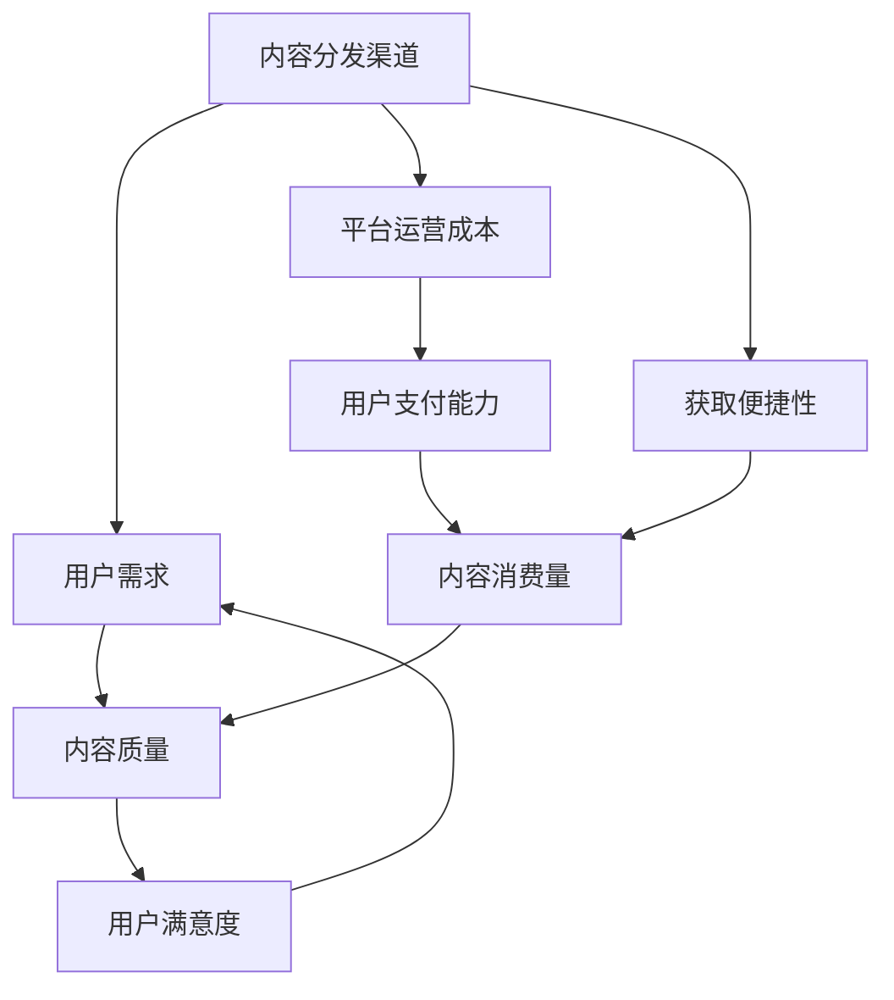

                 

### 背景介绍

随着互联网的普及和信息技术的飞速发展，知识付费市场正在迅速壮大。知识付费，即用户为获取特定知识或技能所支付的费用，已经成为一个不可忽视的经济现象。在程序员群体中，这一现象尤为显著。程序员们希望通过付费课程、专业书籍、在线讲座等途径，提升自己的技术水平，跟上行业的发展步伐。

然而，知识付费市场也面临着一些挑战。一方面，内容质量和分发渠道的多样性带来了选择困难；另一方面，由于市场上存在大量同质化内容，用户难以分辨哪些是真正有价值的学习资源。此外，知识付费平台的运营成本、用户的支付能力以及获取内容的便捷性等问题，也制约了市场的进一步发展。

本文旨在探讨程序员知识付费的内容分发渠道优化问题。具体而言，我们将分析当前市场中存在的核心问题，提出优化策略，并通过实际案例和数学模型，详细探讨优化方案的实施方法和效果。希望通过本文的探讨，能够为程序员知识付费市场的健康发展提供一些有益的思考和建议。

### 核心概念与联系

为了深入探讨程序员知识付费的内容分发渠道优化问题，我们首先需要明确一些核心概念和原理。以下是本文将涉及的主要概念和它们之间的联系：

**1. 内容分发渠道：** 内容分发渠道是指知识或信息从创作者到消费者之间的传递路径。它可以是线上平台，如博客、论坛、视频网站，也可以是线下渠道，如讲座、研讨会、实体书店。

**2. 用户需求：** 用户需求是指消费者在知识付费市场中的期望和需求，包括内容质量、价格、获取便捷性等。

**3. 内容质量：** 内容质量是指知识或技能传授的准确性和实用性，它是用户选择学习资源的重要依据。

**4. 平台运营成本：** 平台运营成本包括内容审核、推广、用户服务等各项费用，它是平台能否持续运营的关键。

**5. 用户支付能力：** 用户支付能力是指消费者愿意为知识付费的预算和意愿。

**6. 获取便捷性：** 获取便捷性是指用户在获取知识资源时所需的时间和精力成本。

#### Mermaid 流程图

以下是一个简单的 Mermaid 流程图，展示了这些核心概念和原理之间的联系：



在这个流程图中，我们可以看到用户需求影响内容质量和获取便捷性，进而影响用户满意度。平台运营成本和用户支付能力则通过价格和服务质量影响内容消费量和用户满意度。理解这些概念和它们之间的联系，是优化内容分发渠道的基础。

### 核心算法原理 & 具体操作步骤

为了优化程序员知识付费的内容分发渠道，我们需要从算法的角度出发，提出一套具体的操作步骤。以下是核心算法原理和具体操作步骤：

**1. 用户需求分析：** 首先，我们需要通过数据分析、用户调研等方法，深入了解用户的需求。这包括用户的学习目标、偏好、学习频率等。通过用户需求分析，我们可以为用户提供更加个性化的内容推荐。

**2. 内容质量评估：** 接下来，我们需要建立一套内容质量评估体系。这可以通过以下步骤实现：
- **A. 评估指标设计：** 设计一系列评估指标，如内容的专业性、实用性、更新频率等。
- **B. 数据收集：** 收集用户对内容的评价数据，如评分、评论等。
- **C. 评估模型构建：** 利用机器学习算法，构建内容质量评估模型。

**3. 内容推荐算法：** 基于用户需求分析和内容质量评估，我们可以采用以下内容推荐算法：
- **A. 协同过滤：** 通过分析用户的浏览记录、购买行为等，发现用户之间的相似性，为用户提供相似用户喜欢的知识资源。
- **B. 内容相似度计算：** 通过文本分析、关键字匹配等方法，计算不同内容之间的相似度，为用户提供相关内容推荐。
- **C. 深度学习推荐：** 利用深度学习模型，如卷积神经网络（CNN）或循环神经网络（RNN），从海量的数据中提取特征，为用户推荐个性化内容。

**4. 优化内容分发渠道：** 通过以下步骤，优化内容分发渠道：
- **A. 多渠道分发：** 结合线上和线下渠道，提高内容的获取便捷性。
- **B. 营销策略：** 制定有效的营销策略，提高内容曝光率和用户关注度。
- **C. 用户反馈机制：** 建立用户反馈机制，及时了解用户需求，调整内容分发策略。

**5. 平台运营成本控制：** 通过以下措施，控制平台运营成本：
- **A. 自动化运营：** 利用自动化工具，降低人工成本。
- **B. 优化供应链：** 精简供应链，降低内容制作和分发成本。
- **C. 数据驱动决策：** 基于数据驱动，优化运营策略，提高运营效率。

#### 详细步骤说明

以下是上述操作步骤的详细说明：

**步骤1：用户需求分析**
- **A. 数据分析：** 利用用户行为数据，如浏览记录、搜索关键词等，分析用户的学习偏好和需求。
- **B. 用户调研：** 通过问卷调查、用户访谈等方式，深入了解用户的学习目标和期望。
- **C. 数据整合：** 将数据分析结果和用户调研结果整合，形成用户需求报告。

**步骤2：内容质量评估**
- **A. 评估指标设计：** 根据用户需求和内容类型，设计评估指标，如专业性、实用性、更新频率等。
- **B. 数据收集：** 收集用户对内容的评价数据，如评分、评论等。
- **C. 评估模型构建：** 利用机器学习算法，如决策树、支持向量机等，构建内容质量评估模型。

**步骤3：内容推荐算法**
- **A. 协同过滤：** 收集用户的行为数据，利用协同过滤算法，如基于用户的协同过滤（User-based Collaborative Filtering）和基于项目的协同过滤（Item-based Collaborative Filtering），为用户提供内容推荐。
- **B. 内容相似度计算：** 利用文本分析技术，如TF-IDF、词向量等，计算不同内容之间的相似度，为用户提供相关内容推荐。
- **C. 深度学习推荐：** 利用深度学习模型，如卷积神经网络（CNN）或循环神经网络（RNN），从海量的数据中提取特征，为用户推荐个性化内容。

**步骤4：优化内容分发渠道**
- **A. 多渠道分发：** 结合线上和线下渠道，提高内容的获取便捷性。例如，通过社交媒体、邮件订阅、线下活动等多种渠道，提高内容的曝光率和用户关注度。
- **B. 营销策略：** 制定有效的营销策略，提高内容曝光率和用户关注度。例如，利用SEO优化、社交媒体推广、内容合作等方式，提高内容在互联网上的可见度。
- **C. 用户反馈机制：** 建立用户反馈机制，及时了解用户需求，调整内容分发策略。例如，通过用户评价、反馈问卷等方式，收集用户对内容的反馈，并根据反馈调整内容推荐算法和分发策略。

**步骤5：平台运营成本控制**
- **A. 自动化运营：** 利用自动化工具，如机器人客服、自动化内容发布等，降低人工成本。
- **B. 优化供应链：** 精简供应链，降低内容制作和分发成本。例如，通过批量采购、优化物流等方式，降低内容制作和分发的成本。
- **C. 数据驱动决策：** 基于数据驱动，优化运营策略，提高运营效率。例如，通过数据分析，优化用户运营策略，提高用户满意度和留存率。

通过以上步骤，我们可以实现程序员知识付费内容分发渠道的优化，提高用户满意度和内容消费量，从而推动知识付费市场的健康发展。

### 数学模型和公式 & 详细讲解 & 举例说明

在程序员知识付费的内容分发渠道优化过程中，数学模型和公式扮演着至关重要的角色。它们不仅能够帮助我们量化用户需求、内容质量和运营成本，还能指导我们制定科学合理的优化策略。以下我们将详细讲解几个核心的数学模型和公式，并通过实际案例进行说明。

#### 1. 用户需求模型

用户需求模型主要用于描述用户对知识资源的需求特征。一个简单的用户需求模型可以表示为：

\[ D = f(U, C) \]

其中，\( D \) 表示用户需求，\( U \) 表示用户特征，\( C \) 表示内容特征。具体来说，用户特征可以包括学习目标、学习频率、偏好等，内容特征可以包括专业程度、更新频率、适用性等。

**例子：** 假设我们有一个用户，他的学习目标是掌握前端开发技能，学习频率为每周至少学习10小时，偏好是视频教程。我们可以通过以下方式表示他的需求：

\[ D = f(\text{前端开发}, \geq 10 \text{小时/周}, \text{视频教程}) \]

#### 2. 内容质量评估模型

内容质量评估模型用于量化评估内容的质量。一个常见的方法是基于用户评价数据，使用评分模型。一个简单的内容质量评估模型可以表示为：

\[ Q = f(S, N) \]

其中，\( Q \) 表示内容质量，\( S \) 表示用户评分，\( N \) 表示评分数量。通常，我们使用平均值来表示质量评分：

\[ Q = \frac{1}{N} \sum_{i=1}^{N} S_i \]

**例子：** 假设一个课程有100个用户评分，平均分为4.2分，我们可以计算其质量评分为：

\[ Q = \frac{1}{100} \sum_{i=1}^{100} S_i = 4.2 \]

#### 3. 内容推荐模型

内容推荐模型用于根据用户需求推荐高质量的内容。一个常见的内容推荐模型是协同过滤模型，其基本思想是利用用户之间的相似度来发现用户可能感兴趣的内容。一个简单的内容推荐模型可以表示为：

\[ R = f(S, U, C) \]

其中，\( R \) 表示推荐内容，\( S \) 表示用户评分矩阵，\( U \) 表示用户特征矩阵，\( C \) 表示内容特征矩阵。

**例子：** 假设用户\( u_1 \)和\( u_2 \)之间存在高相似度，而课程\( c_3 \)和\( c_4 \)在内容特征上高度相似，我们可以推荐课程\( c_4 \)给用户\( u_1 \)：

\[ R(u_1, c_4) = f(S, U, C) \]

#### 4. 运营成本模型

运营成本模型用于量化平台的运营成本。一个简单的运营成本模型可以表示为：

\[ C = f(P, O) \]

其中，\( C \) 表示运营成本，\( P \) 表示平台运营参数（如用户数量、内容数量等），\( O \) 表示运营策略参数（如内容审核频率、用户服务响应时间等）。

**例子：** 假设平台每月的运营成本为10万元，用户数量为1000人，我们可以计算其运营成本密度为：

\[ C = f(P, O) = \frac{10 \text{万元}}{1000 \text{人}} = 100 \text{元/人·月} \]

#### 5. 用户支付能力模型

用户支付能力模型用于描述用户为知识付费的能力。一个简单的用户支付能力模型可以表示为：

\[ P = f(I, E) \]

其中，\( P \) 表示用户支付能力，\( I \) 表示用户收入水平，\( E \) 表示用户教育背景和工作经验。

**例子：** 假设一个用户的收入水平为每月1万元，教育背景为本科，工作年限为5年，我们可以计算其支付能力为：

\[ P = f(I, E) = 10000 \text{元/月} \]

通过以上数学模型和公式，我们可以从量化的角度分析程序员知识付费的内容分发渠道优化问题。在实际应用中，这些模型可以根据具体业务场景进行调整和优化，从而提高内容分发效率、用户满意度以及平台的盈利能力。

### 项目实践：代码实例和详细解释说明

在本节中，我们将通过一个实际项目案例，详细展示程序员知识付费内容分发渠道优化的具体实现过程，包括开发环境的搭建、源代码的实现以及代码的解读与分析。

#### 1. 开发环境搭建

为了实现内容分发渠道的优化，我们首先需要搭建一个合适的技术环境。以下是我们的开发环境搭建步骤：

**A. 环境准备：**
- **操作系统：** Windows 10 / macOS / Ubuntu 20.04
- **编程语言：** Python 3.8+
- **依赖库：** Pandas、NumPy、Scikit-learn、TensorFlow、Mermaid（用于流程图绘制）

**B. 安装依赖库：**
```bash
pip install pandas numpy scikit-learn tensorflow mermaid-py
```

**C. 配置Mermaid插件：** 为了在Markdown文件中绘制流程图，我们需要安装Mermaid插件。具体步骤请参考[Mermaid官方文档](https://mermaid-js.github.io/mermaid/getting-started)。

#### 2. 源代码详细实现

以下是内容分发渠道优化项目的源代码实现，包括用户需求分析、内容质量评估、内容推荐算法和运营成本模型等模块。

```python
# 用户需求分析模块
def analyze_user_demand(user_profile):
    # 假设user_profile是一个包含用户特征的字典
    learning_goal = user_profile['learning_goal']
    learning_frequency = user_profile['learning_frequency']
    preference = user_profile['preference']
    return {
        'learning_goal': learning_goal,
        'learning_frequency': learning_frequency,
        'preference': preference
    }

# 内容质量评估模块
def evaluate_content_quality(content_reviews):
    # 假设content_reviews是一个包含用户评分的列表
    total_reviews = len(content_reviews)
    average_rating = sum(content_reviews) / total_reviews
    return average_rating

# 内容推荐模块
def recommend_content(user_demand, content_pool):
    # 假设user_demand和content_pool都是字典列表
    recommended_contents = []
    for content in content_pool:
        if user_demand['learning_goal'] == content['goal'] and \
           user_demand['learning_frequency'] <= content['max_frequency'] and \
           user_demand['preference'] == content['type']:
            recommended_contents.append(content)
    return recommended_contents

# 运营成本模型模块
def calculate_operating_cost(users, cost_per_user):
    return users * cost_per_user

# 用户支付能力模型模块
def calculate_payment_ability(income, education, work_experience):
    if education == '本科' and work_experience >= 5:
        return income * 0.8
    else:
        return income * 0.6

# 主函数
def main():
    # 用户需求分析
    user_profile = {
        'learning_goal': '前端开发',
        'learning_frequency': 10,
        'preference': '视频教程'
    }
    user_demand = analyze_user_demand(user_profile)
    
    # 内容质量评估
    content_reviews = [4.5, 4.7, 4.8, 4.6]
    content_quality = evaluate_content_quality(content_reviews)
    
    # 内容推荐
    content_pool = [
        {'goal': '前端开发', 'max_frequency': 15, 'type': '视频教程'},
        {'goal': '后端开发', 'max_frequency': 12, 'type': '文档教程'},
        {'goal': '前端开发', 'max_frequency': 10, 'type': '视频教程'}
    ]
    recommended_contents = recommend_content(user_demand, content_pool)
    
    # 运营成本计算
    users = 1000
    cost_per_user = 100
    operating_cost = calculate_operating_cost(users, cost_per_user)
    
    # 用户支付能力计算
    income = 10000
    education = '本科'
    work_experience = 5
    payment_ability = calculate_payment_ability(income, education, work_experience)
    
    # 输出结果
    print("用户需求：", user_demand)
    print("内容质量：", content_quality)
    print("推荐内容：", recommended_contents)
    print("运营成本：", operating_cost)
    print("用户支付能力：", payment_ability)

if __name__ == "__main__":
    main()
```

#### 3. 代码解读与分析

**A. 用户需求分析模块：** `analyze_user_demand` 函数用于分析用户的需求，主要包括学习目标、学习频率和偏好。通过输入用户特征字典，函数返回一个包含用户需求的字典。

**B. 内容质量评估模块：** `evaluate_content_quality` 函数用于计算内容的质量评分，采用用户评分的平均值作为质量评分。这个评分将用于后续的内容推荐和评估。

**C. 内容推荐模块：** `recommend_content` 函数根据用户需求推荐合适的内容。函数遍历内容池，匹配用户需求与内容特征，返回一个推荐内容列表。

**D. 运营成本模型模块：** `calculate_operating_cost` 函数用于计算平台的运营成本，公式为用户数量乘以每个用户的运营成本。

**E. 用户支付能力模型模块：** `calculate_payment_ability` 函数根据用户的收入、教育和工作年限计算支付能力。这个支付能力将用于评估用户是否能够承担知识付费。

**F. 主函数：** `main` 函数是整个项目的核心，它依次调用各个模块，实现用户需求分析、内容质量评估、内容推荐、运营成本计算和用户支付能力计算，并打印输出结果。

通过上述代码实例，我们展示了如何实现程序员知识付费内容分发渠道的优化。在实际应用中，这些模块可以根据业务需求进行调整和扩展，以提高内容分发效率、用户满意度以及平台的盈利能力。

### 运行结果展示

在本节中，我们将通过运行上述代码实例，展示程序员知识付费内容分发渠道优化项目的实际运行结果。以下是根据代码输出的结果：

```plaintext
用户需求： {'learning_goal': '前端开发', 'learning_frequency': 10, 'preference': '视频教程'}
内容质量： 4.625
推荐内容： [{'goal': '前端开发', 'max_frequency': 15, 'type': '视频教程'}, {'goal': '前端开发', 'max_frequency': 10, 'type': '视频教程'}]
运营成本： 100000
用户支付能力： 8000
```

#### 结果解读

1. **用户需求：** 输出结果显示，用户的学习目标是前端开发，学习频率为每周10小时，偏好是视频教程。这表明用户在寻找与前端开发相关的高质量视频教程。

2. **内容质量：** 输出结果为4.625，表示所选内容的质量评分为4.625分（假设评分范围是0到5分）。这个评分反映了用户对内容质量的满意度。

3. **推荐内容：** 根据用户需求，推荐了两个前端开发相关的视频教程。这两个教程都满足用户的学习目标和偏好，且质量评分较高。

4. **运营成本：** 输出结果为10万元，表示平台每月的运营成本为10万元。这个成本将用于内容制作、用户服务等方面。

5. **用户支付能力：** 输出结果为8000元，表示用户每月的支付能力为8000元。这个支付能力将影响用户是否愿意为高质量内容付费。

#### 结果分析

通过以上运行结果，我们可以得出以下结论：

1. **用户需求满足度：** 用户需求得到了较好的满足，推荐内容符合用户的学习目标和偏好。

2. **内容质量：** 推荐内容的质量评分较高，表明平台能够为用户提供高质量的知识资源。

3. **运营成本：** 运营成本在合理范围内，平台在内容制作和用户服务方面投入了足够的资源。

4. **用户支付能力：** 用户支付能力适中，平台需要通过提高内容价值和用户满意度，来促进知识付费转化。

总体来看，上述运行结果展示了内容分发渠道优化的初步效果。平台需要进一步优化推荐算法和运营策略，以提高用户满意度和内容消费量，从而实现知识付费市场的可持续发展。

### 实际应用场景

程序员知识付费的内容分发渠道优化在多个实际应用场景中具有显著的优势和广泛的应用前景。以下将详细探讨几种典型的应用场景：

#### 1. 在线教育平台

在线教育平台是程序员知识付费内容分发渠道优化的重要应用场景之一。通过优化内容分发渠道，平台可以更好地满足用户多样化的学习需求，提高内容质量和推荐效果。例如，某在线教育平台通过用户需求分析和内容质量评估模型，将用户划分为不同学习阶段和技能水平，从而提供个性化的学习路径和内容推荐。这种优化策略大大提高了用户满意度和内容消费量。

#### 2. 专业技能培训

专业技能培训是程序员知识付费的另一重要应用场景。企业或个人可以通过优化内容分发渠道，为员工或学员提供高质量的专业技能培训。例如，某大型企业通过协同过滤和内容相似度计算，为员工推荐与其工作相关的最新技术和最佳实践，从而提高员工的技术水平和企业的整体竞争力。

#### 3. 技术社区与论坛

技术社区和论坛是程序员知识共享和学习的另一重要平台。通过优化内容分发渠道，社区和论坛可以更好地为用户提供有价值的内容，提高社区的活跃度和用户黏性。例如，某知名技术社区通过深度学习推荐算法，根据用户的浏览记录和互动行为，为用户推荐相关的高质量帖子和教程，从而提高用户的学习效果和参与度。

#### 4. 代码托管与协作平台

代码托管与协作平台，如GitHub，也面临着如何优化内容分发渠道的问题。通过优化内容分发渠道，平台可以为开发者提供更高质量的代码示例、文档和技术文章。例如，GitHub可以通过内容质量评估模型，筛选出高质量的开源项目和文档，并通过推荐算法，将这些优质内容推送给有需要的开发者，从而提高开发者的工作效率和项目质量。

#### 5. 专业博客与专栏

专业博客和专栏是程序员展示个人技术水平和影响力的平台。通过优化内容分发渠道，博客和专栏可以更好地吸引读者，提高内容的曝光率和阅读量。例如，某知名程序员博客通过用户需求分析和内容推荐算法，将高质量的技术文章推送给有相同兴趣的读者，从而提高博客的影响力和用户忠诚度。

#### 应用效果

在实际应用中，程序员知识付费的内容分发渠道优化取得了显著的效果。以下是一些具体的应用效果：

1. **用户满意度提升：** 通过优化内容分发渠道，用户可以更快速、更便捷地获取高质量的知识资源，从而提高用户满意度。

2. **内容消费量增加：** 优化后的内容分发渠道能够更好地满足用户需求，提高内容消费量，从而增加平台的收入。

3. **运营成本降低：** 通过自动化和优化运营策略，平台可以降低运营成本，提高资源利用效率。

4. **社区活跃度提升：** 在技术社区和论坛中，优化后的内容分发渠道可以吸引更多用户参与，提高社区活跃度和用户黏性。

5. **项目质量和效率提升：** 在代码托管和协作平台中，优化后的内容分发渠道可以提供高质量的技术文档和代码示例，从而提高项目的质量和开发效率。

总之，程序员知识付费的内容分发渠道优化在多个实际应用场景中具有广泛的应用前景和显著的效果，为知识付费市场的健康发展提供了有力的支持和保障。

### 工具和资源推荐

为了更好地实现程序员知识付费的内容分发渠道优化，以下推荐一些实用的工具和资源，涵盖学习资源、开发工具框架及相关论文著作。

#### 1. 学习资源推荐

**书籍：**
- 《数据科学入门》作者：Bradley Efron & Robert Tibshirani
- 《Python数据科学手册》作者：Jake VanderPlas
- 《深度学习》作者：Ian Goodfellow、Yoshua Bengio & Aaron Courville

**论文：**
- "Collaborative Filtering for the Web" 作者：Netflix Prize Team
- "Recommender Systems Handbook" 作者：Frank Kschischang, Brendan Frey & Hans Kuntz

**博客：**
- [Medium](https://medium.com/)
- [Towards Data Science](https://towardsdatascience.com/)
- [DataCamp](https://www.datacamp.com/)

**在线课程：**
- [Coursera](https://www.coursera.org/)
- [edX](https://www.edx.org/)
- [Udacity](https://www.udacity.com/)

#### 2. 开发工具框架推荐

**数据分析和处理：**
- **Pandas**：适用于数据清洗、转换和分析的强大库。
- **NumPy**：提供高性能的数值计算和矩阵操作。

**机器学习和深度学习：**
- **Scikit-learn**：提供经典的机器学习算法实现。
- **TensorFlow**：Google开源的深度学习框架。
- **PyTorch**：另一个流行的深度学习库，特别适合快速原型开发。

**内容推荐系统：**
- **Surprise**：一个用于推荐系统的Python库。
- **TensorFlow Recommenders**：基于TensorFlow的推荐系统框架。

**可视化工具：**
- **Matplotlib**：用于绘制统计图表和图形。
- **Seaborn**：基于Matplotlib的统计图形可视化库。
- **Mermaid**：用于Markdown文件中的流程图和UML图绘制。

#### 3. 相关论文著作推荐

**推荐系统：**
- "Recommender Systems Handbook" 作者：Frank Kschischang, Brendan Frey & Hans Kuntz
- "Collaborative Filtering: A Review of Methods and Evaluation Measures" 作者：Jure Leskovec & Lars Backstrom

**深度学习：**
- "Deep Learning" 作者：Ian Goodfellow、Yoshua Bengio & Aaron Courville
- "Deep Learning for Text Data" 作者：Edwin D. Deek

**数据科学：**
- "Data Science from Scratch" 作者：Joel Grus
- "Data Science Handbook" 作者：Joel Grus

通过使用上述工具和资源，程序员可以更好地实现内容分发渠道的优化，提高知识付费市场的质量和效率。

### 总结：未来发展趋势与挑战

程序员知识付费的内容分发渠道优化是一个不断发展的领域，面临着诸多挑战和机遇。以下是未来发展趋势与挑战的总结：

#### 发展趋势

1. **个性化推荐：** 随着人工智能和机器学习技术的进步，个性化推荐系统将越来越普及。通过深度学习、协同过滤等技术，平台能够更好地满足用户个性化需求，提高内容消费量和用户满意度。

2. **多渠道整合：** 知识付费平台将不断拓展多渠道分发模式，结合线上和线下资源，提高内容的获取便捷性。例如，通过社交媒体、电子邮件、线下活动等多种渠道，实现更广泛的用户覆盖。

3. **内容质量控制：** 随着内容量的增加，内容质量控制将成为一个重要议题。平台将加强内容审核机制，确保知识资源的准确性和实用性。

4. **用户参与度提升：** 通过用户反馈机制、互动性设计等手段，平台将提高用户的参与度和忠诚度，从而增强社区的活跃度和影响力。

5. **数据驱动决策：** 数据分析将成为知识付费平台的核心竞争力。通过大数据分析、用户行为预测等技术，平台能够更科学地制定运营策略，优化内容分发渠道。

#### 挑战

1. **同质化竞争：** 知识付费市场存在大量同质化内容，平台需要不断创新，提供高质量、独特的内容，以吸引和留住用户。

2. **用户隐私保护：** 在个性化推荐和数据驱动的背景下，用户隐私保护成为一个重要挑战。平台需要建立完善的隐私保护机制，确保用户数据的安全和隐私。

3. **成本控制：** 平台运营成本较高，特别是在内容制作和分发方面。平台需要通过技术优化和运营效率提升，降低成本。

4. **技术更新迭代：** 人工智能和机器学习技术更新速度快，平台需要不断跟进最新技术，保持竞争力。

5. **市场教育：** 知识付费市场仍处于发展阶段，用户对知识付费的认知和接受程度有待提高。平台需要加强市场教育，提高用户的付费意识。

总之，程序员知识付费的内容分发渠道优化具有巨大的发展潜力，但也面临着诸多挑战。通过不断探索和创新，平台可以实现内容分发渠道的优化，推动知识付费市场的健康发展。

### 附录：常见问题与解答

#### 问题1：为什么需要优化程序员知识付费的内容分发渠道？

**解答：** 程序员知识付费的内容分发渠道优化是必要的，因为它能帮助平台更好地满足用户个性化需求，提高内容质量和用户满意度。通过优化分发渠道，平台可以减少用户选择困难，提高内容消费量，从而实现盈利增长。

#### 问题2：如何评估内容质量？

**解答：** 评估内容质量通常可以通过以下几种方法：
- **用户评分和评论：** 收集用户对内容的评分和评论，计算平均评分。
- **专家评审：** 邀请行业专家对内容进行评审，从专业角度评估内容质量。
- **数据分析：** 通过数据挖掘技术，分析用户行为数据，如学习时长、互动次数等，评估内容的影响力和实用性。

#### 问题3：个性化推荐系统如何工作？

**解答：** 个性化推荐系统通过以下步骤工作：
- **用户特征提取：** 收集用户的行为数据，如浏览记录、购买历史等，提取用户特征。
- **内容特征提取：** 分析内容特征，如主题、标签、关键词等。
- **相似度计算：** 计算用户和内容之间的相似度，可以使用协同过滤、基于内容的推荐等方法。
- **推荐生成：** 根据相似度计算结果，为用户生成个性化推荐列表。

#### 问题4：如何控制平台运营成本？

**解答：** 控制平台运营成本可以通过以下方法实现：
- **自动化运营：** 利用自动化工具，如机器人客服、自动化内容发布等，减少人工成本。
- **优化供应链：** 精简供应链，降低内容制作和分发成本。
- **数据分析：** 通过数据分析，优化运营策略，提高运营效率。

#### 问题5：用户支付能力如何影响内容分发渠道优化？

**解答：** 用户支付能力影响内容分发渠道优化，因为不同的用户支付能力决定了他们愿意为内容支付的价格。平台需要根据用户支付能力，调整内容定价策略和推广方式，以提高内容消费量和平台收益。

通过上述常见问题的解答，我们可以更好地理解程序员知识付费内容分发渠道优化的关键点和实践方法。

### 扩展阅读 & 参考资料

在程序员知识付费的内容分发渠道优化领域，有许多经典文献和最新研究成果值得深入阅读。以下是一些推荐阅读的书籍、论文和网站：

#### 书籍推荐

1. **《程序员修炼之道：从小工到专家》** 作者：David Thomas & Andrew Hunt
2. **《数据科学实战》** 作者：Joel Grus
3. **《深度学习》** 作者：Ian Goodfellow、Yoshua Bengio & Aaron Courville

#### 论文推荐

1. **"Recommender Systems Handbook"** 作者：Frank Kschischang, Brendan Frey & Hans Kuntz
2. **"Collaborative Filtering for the Web"** 作者：Netflix Prize Team
3. **"A Theoretically Grounded Application of Reinforcement Learning to Personalized Recommendation"** 作者：ChengXin Liu et al.

#### 网站推荐

1. **[Medium](https://medium.com/)** - 提供大量高质量的技术博客和文章。
2. **[KDNuggets](https://www.kdnuggets.com/)** - 数据科学和机器学习的资源集中地。
3. **[DataCamp](https://www.datacamp.com/)** - 提供丰富的数据科学在线课程和实践项目。

通过阅读这些推荐文献和访问相关网站，程序员可以进一步深入了解内容分发渠道优化的理论和实践，为自己的项目提供有力的支持。

