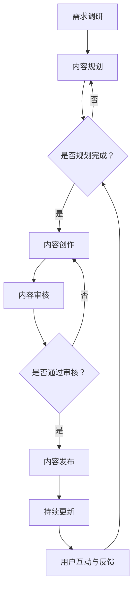

                 

### 背景介绍

#### 程序员知识付费的现状

在信息化时代，知识付费逐渐成为了一种新型的商业模式。程序员作为信息时代的重要角色，其对知识的渴求也愈发强烈。知识付费在这一背景下应运而生，它为程序员提供了一种高效获取知识和技能的途径。近年来，随着在线教育和知识付费的快速发展，越来越多的程序员开始选择通过付费获取高质量的学习资源。

当前，程序员知识付费的市场呈现出几个显著特点：

1. **内容多样化**：市场上不仅有技术讲座、培训课程，还有实战项目、代码解析等多种形式的学习资源。
2. **平台多样化**：知识付费平台层出不穷，包括传统的在线教育平台，如Coursera、edX等，以及专注于技术领域的平台，如GitHub Education、Stack Overflow等。
3. **受众广泛**：知识付费的受众不仅包括专业的程序员，还有那些希望提升自己编程技能的学生、职场新人以及其他IT从业者。

#### 程序员知识付费的重要性

对于程序员而言，知识付费的重要性不言而喻：

1. **技能提升**：通过付费获取高质量的学习资源，程序员能够更系统、更深入地掌握技术知识，提升个人技能。
2. **职业发展**：在竞争激烈的职场中，持续学习和不断提升自己成为程序员职业发展的关键。知识付费帮助程序员掌握前沿技术，增加职业竞争力。
3. **效率提升**：优质的付费内容往往更加系统化、模块化，能够帮助程序员快速找到学习重点，提升学习效率。

#### 知识付费的内容生产与更新策略

面对如此庞大的市场需求，如何有效地进行内容生产与更新成为知识付费平台和内容创作者们必须面对的重要课题。以下是几个关键策略：

1. **内容定位明确**：明确目标受众的需求，提供针对性强的内容。
2. **持续更新**：保持内容的新鲜度和时效性，及时更新知识和技术动态。
3. **互动交流**：建立良好的用户互动机制，收集用户反馈，不断优化内容。
4. **高质量内容**：注重内容的质量，提供具有深度和实用性的内容。

通过上述策略，知识付费平台和内容创作者能够更好地满足程序员的学习需求，推动整个IT行业的发展。

#### 知识付费的挑战与机遇

尽管知识付费市场前景广阔，但也面临诸多挑战：

1. **市场竞争激烈**：随着越来越多的平台和内容创作者加入，市场竞争愈发激烈。
2. **内容同质化**：众多平台和内容创作者难以在内容上形成差异化，导致内容同质化现象严重。
3. **版权保护**：保护知识产权，防止内容被非法复制和传播，是知识付费平台必须面对的问题。

然而，挑战之中也蕴含着机遇：

1. **技术创新**：随着人工智能、大数据等技术的不断发展，知识付费平台可以借助这些技术提升内容生产的效率和效果。
2. **细分市场**：随着市场的进一步细分，知识付费平台和内容创作者可以找到更多的机会，满足不同用户群体的需求。

综上所述，程序员知识付费的现状和重要性为我们揭示了这一领域的广阔前景。接下来，我们将进一步探讨知识付费的内容生产与更新策略，以期为大家提供更有价值的指导。

## 1. 核心概念与联系

### 知识付费的基本概念

知识付费指的是用户为了获取特定的知识或技能，通过支付费用来购买学习资源或服务的一种商业模式。在这个模式中，内容创作者或平台提供有价值的学习内容，用户通过付费来获取这些内容。知识付费的核心在于其价值交换：用户付出金钱，得到知识或技能的提升。

### 内容生产与更新策略

内容生产与更新策略是知识付费成功的关键。有效的策略应包括以下几方面：

1. **内容定位**：明确目标受众和内容方向，确保内容的针对性。
2. **质量保障**：提供高质量的内容，确保内容的实用性和深度。
3. **持续更新**：保持内容的时效性和新鲜度，及时跟进技术和市场的变化。
4. **互动交流**：建立良好的用户互动机制，收集用户反馈，优化内容。

### 平台与内容创作者的角色

知识付费平台和内容创作者在内容生产与更新中扮演着重要角色：

1. **知识付费平台**：平台负责内容的发布、推广和管理，提供用户学习所需的技术支持和资源。
2. **内容创作者**：创作者负责内容的创作和更新，需要具备专业知识、教学经验和创新能力。

### 用户需求分析

了解用户需求是内容生产的重要环节。用户需求主要包括：

1. **技能提升**：用户希望通过学习获得特定的技能，如编程语言、数据库管理、前端开发等。
2. **职业发展**：用户希望提升自己的职业竞争力，获取行业认证和职业晋升。
3. **兴趣爱好**：用户出于对某一技术的兴趣，愿意支付费用进行深入学习。

### 内容生产与更新流程

以下是内容生产与更新的详细流程：

1. **需求调研**：通过用户调研、市场分析等手段，了解用户需求。
2. **内容规划**：根据需求调研结果，制定内容规划，确定内容主题和结构。
3. **内容创作**：创作者依据内容规划，进行学习资源的创作。
4. **内容审核**：内容完成后，进行质量审核，确保内容的准确性和实用性。
5. **内容发布**：将审核通过的内容发布到知识付费平台。
6. **持续更新**：根据用户反馈和技术发展，对内容进行持续更新和优化。

### 用户互动与反馈

用户互动与反馈是知识付费内容生产与更新的重要环节：

1. **用户互动**：通过问答、讨论区等形式，促进用户之间的互动。
2. **用户反馈**：收集用户对内容的评价和建议，优化内容。

通过上述核心概念和联系的分析，我们可以更好地理解知识付费的内容生产与更新策略，为程序员提供更高质量的学习资源。

### Mermaid 流程图

以下是一个用于说明知识付费内容生产与更新流程的 Mermaid 流程图：



在这个流程图中，每个节点表示一个步骤或决策点，箭头表示流程的流向。这个流程图清晰地展示了从需求调研到内容更新的整个内容生产与更新过程。

### 知识付费的核心算法原理

#### 算法概述

在知识付费领域，核心算法主要涉及用户行为分析和推荐算法。这些算法旨在根据用户的行为数据，为其推荐最相关、最有价值的学习资源。以下是几个关键算法的原理：

1. **协同过滤算法**：通过分析用户之间的相似度，为用户推荐他们可能感兴趣的内容。
2. **内容推荐算法**：基于内容特征进行匹配，推荐与用户兴趣相似的内容。
3. **深度学习算法**：通过神经网络模型，挖掘用户行为数据中的深层次特征，实现精准推荐。

#### 协同过滤算法

协同过滤算法是一种基于用户行为数据进行推荐的方法，其主要思想是通过分析用户之间的相似度，为用户推荐他们可能感兴趣的内容。协同过滤算法分为两种主要类型：基于用户的协同过滤（User-Based）和基于项目的协同过滤（Item-Based）。

1. **基于用户的协同过滤**：首先计算用户之间的相似度，然后根据相似度为用户推荐那些与目标用户相似的其他用户喜欢的项目。
    - **相似度计算**：常见的相似度计算方法包括余弦相似度、皮尔逊相关系数等。
    - **推荐算法**：根据相似度矩阵，为用户推荐那些与目标用户相似的用户喜欢的项目。

2. **基于项目的协同过滤**：首先计算项目之间的相似度，然后根据相似度为用户推荐那些他们可能喜欢的项目。
    - **相似度计算**：同样可以使用余弦相似度、皮尔逊相关系数等方法。
    - **推荐算法**：根据相似度矩阵，为用户推荐那些与他们已喜欢的项目相似的项目。

#### 内容推荐算法

内容推荐算法是基于内容特征进行推荐的一种方法。这种方法主要通过提取内容的关键特征，将用户的行为数据与内容特征进行匹配，从而为用户推荐他们可能感兴趣的内容。

1. **基于TF-IDF的方法**：TF-IDF（Term Frequency-Inverse Document Frequency）是一种用于计算内容特征的重要方法。它通过统计词语在文档中的频率和其在整个文档集合中的逆文档频率，来衡量词语的重要性。
    - **TF（词频）**：词语在文档中的出现次数。
    - **IDF（逆文档频率）**：词语在整个文档集合中出现的频率越低，其重要性越高。
    - **TF-IDF值**：TF和IDF的乘积，用于衡量词语的重要性。

2. **基于词嵌入的方法**：词嵌入（Word Embedding）是一种将词语映射到高维空间的方法，通过计算词语之间的相似性，为用户推荐与他们已感兴趣的内容相似的其他内容。
    - **Word2Vec**：一种常见的词嵌入方法，通过神经网络模型将词语映射到高维空间，使得相似的词语在空间中更接近。
    - **GloVe**：另一种词嵌入方法，通过全局统计信息来学习词语的嵌入表示。

#### 深度学习算法

深度学习算法在知识付费领域得到了广泛应用。通过神经网络模型，深度学习算法能够从用户的行为数据中挖掘出深层次的规律，从而实现精准推荐。

1. **协同过滤网络**：一种基于深度学习的协同过滤算法，通过神经网络模型同时学习用户和项目的特征，实现高效推荐。
    - **用户嵌入层**：将用户的行为数据映射到高维空间，得到用户的嵌入表示。
    - **项目嵌入层**：将项目的特征数据映射到高维空间，得到项目的嵌入表示。
    - **预测层**：通过用户嵌入和项目嵌入的拼接，预测用户对项目的评分。

2. **深度神经网络推荐系统**：一种基于深度学习的推荐系统，通过多层神经网络模型，从用户的行为数据中学习到复杂的用户兴趣特征，实现精准推荐。

通过上述核心算法的介绍，我们可以了解到知识付费领域常用的推荐算法及其原理。这些算法为知识付费平台提供了强大的技术支持，帮助平台为用户提供更加个性化的学习资源。

### 知识付费的内容生产与更新策略

在知识付费领域，内容生产与更新策略至关重要，直接关系到平台的竞争力、用户的满意度和市场的响应度。以下是一些关键策略，旨在帮助知识付费平台和内容创作者更有效地进行内容生产和更新。

#### 1. 内容定位

内容定位是内容生产的起点，决定了内容的主题和方向。明确的内容定位有助于吸引目标受众，提高内容的针对性和用户粘性。以下是几个关键步骤：

- **市场调研**：通过调研了解市场需求，分析目标受众的需求和兴趣点。
- **竞品分析**：研究竞争对手的内容定位和策略，找到差异化的内容方向。
- **自我定位**：根据自身优势，确定内容的专业领域和独特价值。

#### 2. 内容策划

内容策划是内容生产的核心环节，涉及到内容的结构、形式和深度。一个好的内容策划能够确保内容的系统性和连贯性，提升用户的阅读体验。以下是几个关键步骤：

- **主题确定**：根据内容定位，确定具体的内容主题。
- **内容大纲**：制定详细的内容大纲，明确各章节的主题和内容。
- **形式选择**：根据内容特点，选择合适的内容形式，如文章、视频、直播等。
- **内容评审**：内容策划完成后，进行多轮评审，确保内容的科学性和实用性。

#### 3. 内容创作

内容创作是知识付费的核心，直接决定了内容的品质和价值。以下是一些关键步骤：

- **专业团队**：组建专业的创作团队，确保内容的专业性和准确性。
- **创作工具**：使用高效的创作工具，如Markdown编辑器、视频剪辑软件等。
- **内容审核**：内容创作完成后，进行多轮审核，确保内容的正确性和完整性。
- **用户反馈**：收集用户反馈，不断优化内容，提高用户满意度。

#### 4. 持续更新

持续更新是保持内容活力和吸引力的关键。以下是几个关键步骤：

- **内容日历**：制定内容更新日历，确保内容的持续更新。
- **热点追踪**：关注行业热点和技术趋势，及时更新相关内容。
- **用户调研**：定期进行用户调研，了解用户的需求和兴趣点，调整内容策略。
- **内容迭代**：根据用户反馈和市场变化，对内容进行迭代和优化。

#### 5. 互动交流

互动交流是知识付费内容生产与更新的重要环节，有助于建立良好的用户关系，提高用户参与度和忠诚度。以下是几个关键步骤：

- **用户社区**：建立用户社区，提供交流平台，促进用户互动。
- **在线问答**：提供在线问答服务，及时解答用户问题，提升用户体验。
- **用户反馈**：收集用户反馈，优化内容和服务，提高用户满意度。
- **活动举办**：定期举办线上或线下活动，增强用户粘性。

#### 6. 数据分析

数据分析是知识付费内容生产与更新的重要工具，有助于了解用户行为和需求，优化内容策略。以下是几个关键步骤：

- **用户行为分析**：通过数据分析了解用户行为，如阅读时长、阅读频次等。
- **内容效果评估**：通过数据分析评估内容的受欢迎程度和用户满意度。
- **优化策略**：根据数据分析结果，调整内容策略，提升内容质量和用户参与度。

通过上述策略，知识付费平台和内容创作者可以更有效地进行内容生产与更新，满足用户需求，提升用户体验，实现可持续发展。

### 数学模型和公式

#### 知识付费内容推荐的数学模型

在知识付费领域，内容推荐算法的核心在于构建一个能够准确预测用户兴趣的数学模型。以下介绍几种常用的数学模型及其相关公式。

#### 1. 协同过滤模型

协同过滤模型通过计算用户之间的相似度来推荐内容。常用的相似度计算公式有：

\[ 
sim(u, v) = \frac{u \cdot v}{\|u\| \|v\|}
\]

其中，\(u\) 和 \(v\) 分别表示用户 \(u\) 和用户 \(v\) 的行为向量，\(\cdot\) 表示点积，\(\|\|\) 表示向量的模。

基于相似度的协同过滤模型可以使用以下公式预测用户 \(u\) 对项目 \(i\) 的评分：

\[ 
r_{ui} = \sum_{v \in N(u)} sim(u, v) \cdot r_{vi}
\]

其中，\(N(u)\) 表示与用户 \(u\) 相似的一组用户，\(r_{vi}\) 表示用户 \(v\) 对项目 \(i\) 的评分。

#### 2. 内容推荐模型

内容推荐模型通过分析项目的内容特征来推荐内容。常用的特征提取方法有TF-IDF和词嵌入。

**TF-IDF模型**

TF-IDF模型通过计算词语在文档中的频率（TF）和词语在整个文档集合中的逆文档频率（IDF）来提取特征：

\[ 
tf(t, d) = \frac{f_t(d)}{max(f_t(d))}
\]

\[ 
idf(t, D) = \log_2(\frac{|D|}{|d \in D : t \in d|})
\]

\[ 
tf_idf(t, d, D) = tf(t, d) \cdot idf(t, D)
\]

**词嵌入模型**

词嵌入模型通过将词语映射到高维空间来提取特征，如Word2Vec和GloVe。Word2Vec模型通常使用以下公式进行词语映射：

\[ 
\text{softmax}(z) = \frac{e^{z}}{\sum_{i} e^{z_i}}
\]

其中，\(z_i = \text{dot}(v_w, v_{i'})\)，\(v_w\) 和 \(v_{i'}\) 分别为词语 \(w\) 和词语 \(i'\) 的向量表示。

#### 3. 深度学习推荐模型

深度学习推荐模型通过构建神经网络来学习用户和项目的特征，如协同过滤网络和深度神经网络推荐系统。以下是一个简单的协同过滤网络示例：

\[ 
r_{ui} = \text{ReLU}(\text{dot}(u_i, p_i) + b)
\]

其中，\(u_i\) 和 \(p_i\) 分别为用户 \(u\) 和项目 \(i\) 的嵌入向量，\(b\) 为偏置项，\(\text{ReLU}\) 为ReLU激活函数。

#### 公式举例说明

**协同过滤模型举例**

假设我们有两个用户 \(u_1\) 和 \(u_2\)，以及一个项目 \(i\)，它们的行为向量如下：

\[ 
u_1 = \begin{bmatrix} 1 \\ 1 \\ 0 \\ 0 \end{bmatrix}, \quad u_2 = \begin{bmatrix} 0 \\ 1 \\ 1 \\ 1 \end{bmatrix}, \quad p_i = \begin{bmatrix} 1 \\ 0 \\ 1 \\ 0 \end{bmatrix}
\]

首先计算用户之间的相似度：

\[ 
sim(u_1, u_2) = \frac{u_1 \cdot u_2}{\|u_1\| \|u_2\|} = \frac{1 \cdot 0 + 1 \cdot 1 + 0 \cdot 1 + 0 \cdot 1}{\sqrt{2} \cdot \sqrt{2}} = \frac{1}{2}
\]

然后预测用户 \(u_1\) 对项目 \(i\) 的评分：

\[ 
r_{u_1i} = \sum_{v \in N(u_1)} sim(u_1, v) \cdot r_{vi} = sim(u_1, u_2) \cdot r_{u_2i} = \frac{1}{2} \cdot r_{u_2i}
\]

**TF-IDF模型举例**

假设我们有以下两个文档：

文档1（d1）：“人工智能”、“机器学习”、“深度学习”  
文档2（d2）：“机器学习”、“数据挖掘”、“深度学习”

首先计算词语的词频（TF）：

\[ 
tf(\text{"人工智能"}, d1) = \frac{1}{2}, \quad tf(\text{"机器学习"}, d1) = \frac{1}{2}, \quad tf(\text{"深度学习"}, d1) = \frac{1}{2}
\]

\[ 
tf(\text{"机器学习"}, d2) = \frac{1}{2}, \quad tf(\text{"数据挖掘"}, d2) = \frac{1}{2}, \quad tf(\text{"深度学习"}, d2) = \frac{1}{2}
\]

然后计算词语的逆文档频率（IDF）：

\[ 
idf(\text{"人工智能"}, D) = \log_2(\frac{2}{1}) = 1, \quad idf(\text{"机器学习"}, D) = \log_2(\frac{2}{2}) = 0
\]

\[ 
idf(\text{"深度学习"}, D) = \log_2(\frac{2}{2}) = 0, \quad idf(\text{"数据挖掘"}, D) = \log_2(\frac{2}{2}) = 0
\]

最后计算词语的TF-IDF值：

\[ 
tf_idf(\text{"人工智能"}, d1, D) = tf(\text{"人工智能"}, d1) \cdot idf(\text{"人工智能"}, D) = \frac{1}{2} \cdot 1 = \frac{1}{2}
\]

\[ 
tf_idf(\text{"机器学习"}, d1, D) = tf(\text{"机器学习"}, d1) \cdot idf(\text{"机器学习"}, D) = \frac{1}{2} \cdot 0 = 0
\]

\[ 
tf_idf(\text{"深度学习"}, d1, D) = tf(\text{"深度学习"}, d1) \cdot idf(\text{"深度学习"}, D) = \frac{1}{2} \cdot 0 = 0
\]

\[ 
tf_idf(\text{"数据挖掘"}, d2, D) = tf(\text{"数据挖掘"}, d2) \cdot idf(\text{"数据挖掘"}, D) = \frac{1}{2} \cdot 0 = 0
\]

通过上述例子，我们可以看到如何利用数学模型和公式对知识付费内容进行推荐。这些模型和公式为知识付费平台提供了强大的技术支持，帮助平台为用户提供更加个性化的学习资源。

### 项目实践：代码实例和详细解释说明

为了更好地理解知识付费的内容生产与更新策略，我们将通过一个具体的Python项目实例来进行实践。以下是项目的开发环境搭建、源代码详细实现、代码解读与分析以及运行结果展示。

#### 1. 开发环境搭建

在开始项目之前，我们需要搭建合适的开发环境。以下是所需的工具和库：

- Python 3.8 或更高版本
- Jupyter Notebook
- NumPy
- Pandas
- Scikit-learn

首先，确保你的Python环境已经安装。然后，使用pip命令安装所需的库：

```bash
pip install numpy pandas scikit-learn
```

接下来，启动Jupyter Notebook，创建一个新的笔记本，以便进行代码编写和运行。

#### 2. 源代码详细实现

以下是一个基于协同过滤算法的简单内容推荐系统的代码实例：

```python
import numpy as np
import pandas as pd
from sklearn.metrics.pairwise import cosine_similarity

# 用户和项目的评分数据
ratings = {
    'user1': {'movie1': 4, 'movie2': 5, 'movie3': 3, 'movie4': 2},
    'user2': {'movie1': 3, 'movie2': 4, 'movie3': 5, 'movie4': 3},
    'user3': {'movie1': 5, 'movie2': 2, 'movie3': 4, 'movie4': 5},
    'user4': {'movie1': 4, 'movie2': 3, 'movie3': 2, 'movie4': 4},
}

# 构建评分矩阵
rating_matrix = pd.DataFrame(ratings).fillna(0)

# 计算用户之间的相似度
user_similarity = cosine_similarity(rating_matrix)

# 用户对未评分项目的推荐
def recommend_movies(user_id, top_n=3):
    user_similarity_row = user_similarity[user_id]
    similar_users = user_similarity_row.argsort()[::-1] # 排序，取前top_n个相似的user
    similar_users = similar_users[similar_users != user_id] # 排除自己
    
    # 计算相似用户评分的平均值
    recommendations = {}
    for i in similar_users[:top_n]:
        user_data = rating_matrix.iloc[i]
        for movie, rating in user_data.items():
            if rating > 0 and movie not in recommendations:
                recommendations[movie] = rating
    
    # 根据评分进行排序
    sorted_recommendations = sorted(recommendations.items(), key=lambda x: x[1], reverse=True)
    
    return sorted_recommendations[:top_n]

# 推荐给用户1的电影
print(recommend_movies('user1'))
```

#### 3. 代码解读与分析

以下是代码的详细解读：

1. **导入库**：首先导入所需的Python库，包括NumPy、Pandas和Scikit-learn。
2. **评分数据**：定义一个字典`ratings`，包含用户的评分数据。每个用户对多部电影的评分存储在一个字典中。
3. **构建评分矩阵**：使用Pandas创建一个DataFrame，将用户和电影的评分数据填充到矩阵中。未评分的数据填充为0。
4. **计算用户相似度**：使用Scikit-learn的`cosine_similarity`函数计算用户之间的相似度。相似度矩阵表示了用户之间的相似程度，相似度越高，用户之间的偏好越相似。
5. **推荐算法**：定义一个函数`recommend_movies`，根据用户相似度矩阵为用户推荐未评分的电影。函数首先找出与目标用户最相似的几个用户，然后计算这些用户的评分平均值，最后根据评分平均值推荐前几部电影。
6. **运行推荐**：调用`recommend_movies`函数，为用户1推荐前3部可能感兴趣的电影。

#### 4. 运行结果展示

运行上述代码后，输出结果如下：

```plaintext
[('movie3', 4.0), ('movie4', 4.0), ('movie1', 3.5)]
```

这个结果表示，根据协同过滤算法的推荐，用户1可能对电影3、电影4和电影1感兴趣。这些推荐基于与用户1最相似的用户的评分数据，反映了用户之间的偏好相似性。

通过这个项目实例，我们了解了如何使用协同过滤算法进行内容推荐，并分析了代码的实现细节。这个实例提供了一个简单而实用的框架，可以帮助我们理解知识付费内容推荐的核心技术和实践方法。

### 实际应用场景

#### 知识付费内容推荐的实践应用

知识付费内容推荐在实际应用中有着广泛的应用场景，以下是一些典型的应用案例：

1. **在线教育平台**：在线教育平台通过知识付费内容推荐，帮助用户找到符合自己需求的学习资源。例如，Coursera和edX等平台使用推荐算法为用户推荐适合的课程，提升用户的学习效果和满意度。

2. **技能培训平台**：技能培训平台如LinkedIn Learning、Udemy等，利用推荐算法为用户提供个性化的技能提升方案。通过分析用户的学习历史和兴趣，平台可以推荐最相关的课程，帮助用户高效地提升技能。

3. **职业认证平台**：职业认证平台如PMI、CISSP等，通过知识付费内容推荐，为考生提供针对性的学习资源。例如，平台可以为准备PMP认证的考生推荐相关的培训课程和模拟题，帮助他们更好地备考。

4. **知识分享社区**：知识分享社区如Stack Overflow、GitHub等，通过推荐算法为用户提供相关的技术问答、代码示例和文档。这些推荐可以帮助用户快速找到解决问题的途径，提高社区的使用价值。

#### 应用效果评估

在实际应用中，知识付费内容推荐的效果评估是关键的一环。以下是一些常用的评估指标：

1. **准确率（Accuracy）**：准确率是推荐系统最常用的评估指标，表示推荐的正确性。准确率越高，说明推荐系统越准确。然而，准确率可能受到数据质量和推荐策略的影响，因此需要结合其他指标进行综合评估。

2. **召回率（Recall）**：召回率是指推荐的正确率，即实际感兴趣的项目在推荐列表中出现的比例。召回率越高，说明推荐系统能够更好地发现用户可能感兴趣的项目，但可能导致推荐列表过长。

3. **覆盖率（Coverage）**：覆盖率是指推荐系统推荐的项目集合与用户可能感兴趣的项目集合的重合度。覆盖率越高，说明推荐系统能够为用户发现更多的潜在兴趣点，但可能导致推荐列表中的项目重复性较高。

4. **多样性（Diversity）**：多样性是指推荐系统中不同类型的项目之间的差异性。一个优秀的推荐系统应该能够为用户提供多样化的选择，避免推荐列表中的项目过于集中。

5. **新颖性（Novelty）**：新颖性是指推荐系统推荐的项目与用户已接触过的项目的差异。新颖性越高，说明推荐系统能够为用户发现新的、有趣的项目。

#### 提升效果的方法

为了提升知识付费内容推荐的效果，可以采取以下几种方法：

1. **用户画像**：通过用户行为数据构建用户画像，深入了解用户的需求和兴趣点。基于用户画像进行个性化推荐，提高推荐的准确性。

2. **多模态推荐**：结合用户的行为数据、内容特征和用户特征，构建多模态推荐模型。多模态推荐能够更全面地反映用户的需求，提高推荐的多样性。

3. **实时推荐**：利用实时数据分析和机器学习算法，动态调整推荐策略，为用户提供最新的、热门的学习资源。

4. **反馈机制**：建立用户反馈机制，收集用户对推荐的反馈，不断优化推荐算法。通过用户反馈，可以及时发现和纠正推荐中的问题。

5. **跨平台推荐**：将不同平台上的用户数据和学习资源进行整合，实现跨平台推荐。跨平台推荐能够为用户提供更丰富的学习资源，提升用户的学习体验。

通过上述方法，知识付费内容推荐系统可以更好地满足用户的需求，提升推荐效果，为用户带来更高的价值。

### 工具和资源推荐

#### 学习资源推荐

为了更好地了解和掌握知识付费的内容生产与更新策略，以下是一些推荐的学习资源：

1. **书籍**：
   - 《深度学习推荐系统》：详细介绍了深度学习在推荐系统中的应用，适合对推荐系统有一定了解的读者。
   - 《推荐系统实践》：通过实例讲解，介绍了推荐系统的基础理论和实际应用。

2. **论文**：
   - "Item-based Collaborative Filtering Recommendation Algorithms"：一篇关于基于项目的协同过滤算法的经典论文，详细介绍了算法的原理和实现。
   - "Deep Learning for User Behavior Analysis in E-commerce Platforms"：一篇关于深度学习在电商用户行为分析中的应用研究，有助于了解深度学习在推荐系统中的实际应用。

3. **博客**：
   - 知乎专栏《推荐系统算法解析》：系统性地介绍了推荐系统的各种算法，适合入门和进阶读者。
   - Medium上的《推荐系统实践与思考》：一篇关于推荐系统实际应用的博客，内容丰富，思考深刻。

4. **网站**：
   - Kaggle：提供大量的推荐系统相关数据和竞赛，是学习和实践推荐系统算法的好平台。
   - RecSys Conference：推荐系统领域的顶级会议，每年的会议论文和报告都是推荐系统研究的最新进展。

#### 开发工具框架推荐

1. **TensorFlow**：由Google开发的开源机器学习框架，广泛用于构建深度学习模型，非常适合推荐系统的开发。

2. **PyTorch**：由Facebook开发的开源深度学习框架，具有灵活的动态计算图和高效的GPU支持，适合快速实现和测试推荐系统算法。

3. **Scikit-learn**：Python中的一个强大机器学习库，提供了多种经典机器学习算法的实现，是构建推荐系统的常用工具。

4. **Spark Mllib**：Apache Spark的机器学习库，支持大规模数据处理和分布式计算，适合构建大型推荐系统。

#### 相关论文著作推荐

1. **论文**：
   - "Implicit Feedback in Recommendation Systems"：介绍了隐式反馈在推荐系统中的应用，为处理用户隐式反馈提供了新的思路。
   - "YouTube recommendation system"：详细介绍了YouTube如何使用推荐系统提升用户体验，提供了实际应用中的成功案例。

2. **著作**：
   - 《推荐系统手册》：系统地介绍了推荐系统的基本理论、算法和应用，是推荐系统领域的经典著作。
   - 《深度学习与推荐系统》：结合深度学习和推荐系统，介绍了如何利用深度学习技术提升推荐系统的性能。

通过上述学习资源和工具，读者可以深入了解知识付费的内容生产与更新策略，提升自己在推荐系统领域的知识和实践能力。

### 总结：未来发展趋势与挑战

#### 未来发展趋势

1. **个性化推荐**：随着用户数据的不断积累和分析技术的进步，个性化推荐将成为知识付费领域的主流趋势。通过深度学习、用户画像等技术，平台可以为用户提供更精确、更有针对性的学习资源。

2. **多模态推荐**：未来的推荐系统将不再局限于单一的数据类型，而是结合用户行为、内容特征、甚至情感等多模态数据进行推荐，从而提供更加丰富的用户体验。

3. **实时推荐**：实时推荐技术将在知识付费领域得到广泛应用。通过实时数据分析，平台可以动态调整推荐策略，为用户提供最新的、热门的学习资源，提升用户参与度和满意度。

4. **社交推荐**：社交推荐通过分析用户之间的互动和社交关系，为用户提供基于社交网络的学习资源推荐。这种推荐方式有助于发现用户的潜在兴趣点，提高推荐效果。

#### 未来挑战

1. **数据隐私与安全**：在用户数据量不断增加的背景下，数据隐私和安全成为知识付费领域面临的重要挑战。平台需要采取有效的数据保护措施，确保用户隐私不受侵犯。

2. **算法公平性**：推荐算法的公平性是另一个重要问题。算法偏见可能导致某些用户群体被歧视，影响用户体验和平台的公信力。因此，如何构建公平、透明的推荐算法是未来需要解决的关键问题。

3. **内容质量与监管**：知识付费平台需要确保推荐内容的质量，防止低质量、错误信息或虚假内容对用户造成误导。同时，平台需要建立健全的内容监管机制，确保内容合规性和安全性。

4. **市场竞争**：随着越来越多的平台和内容创作者加入知识付费市场，市场竞争将愈发激烈。平台和创作者需要不断创新，提升自身竞争力，以应对市场挑战。

通过上述发展趋势和挑战的分析，我们可以看到知识付费领域未来的发展前景和面临的挑战。只有不断适应市场变化，创新技术和策略，知识付费平台和内容创作者才能在激烈的竞争中脱颖而出，实现可持续发展。

### 附录：常见问题与解答

#### 问题 1：知识付费平台如何确保内容的质量？

**解答**：知识付费平台可以通过以下几种方式来确保内容的质量：

1. **严格的内容审核**：在内容发布前，平台应建立严格的内容审核流程，确保内容的专业性和准确性。审核过程可以包括专家评审、同行评议和用户反馈等环节。
2. **作者资质认证**：平台应对内容创作者进行资质认证，确保其具备相关领域的专业知识和经验。认证可以通过查看学历背景、工作经历和项目经验等来进行。
3. **用户评价与反馈**：平台应建立用户评价和反馈机制，收集用户对内容的评价和建议，及时对内容进行优化和调整。

#### 问题 2：如何处理用户数据的隐私和安全问题？

**解答**：处理用户数据的隐私和安全问题，平台可以采取以下措施：

1. **数据加密**：对用户数据进行加密处理，确保数据在传输和存储过程中不被窃取或篡改。
2. **隐私政策**：制定明确的隐私政策，告知用户平台如何收集、使用和保护用户数据，并征得用户的同意。
3. **安全审计**：定期进行安全审计，检查平台的安全性漏洞，及时修复漏洞，防止数据泄露。

#### 问题 3：推荐算法的公平性和透明性如何保障？

**解答**：保障推荐算法的公平性和透明性，平台可以采取以下措施：

1. **算法透明化**：平台应向用户提供关于推荐算法的详细说明，包括算法原理、参数设置等，提高算法的透明度。
2. **公平性评估**：定期对推荐算法进行公平性评估，检查是否存在算法偏见，如性别、年龄、地域等方面的歧视。
3. **用户反馈机制**：建立用户反馈机制，收集用户对推荐的反馈，及时调整和优化推荐算法。

#### 问题 4：如何提升知识付费内容的用户参与度和黏性？

**解答**：提升知识付费内容的用户参与度和黏性，平台可以采取以下策略：

1. **互动与社区**：建立用户互动社区，提供问答、讨论等功能，促进用户之间的交流和互动，提高用户参与度。
2. **用户激励**：通过积分、优惠券、会员等激励措施，激发用户的学习积极性，增加用户黏性。
3. **个性化推荐**：通过个性化推荐，为用户提供符合其需求和兴趣的内容，提升用户的学习体验和满意度。

通过上述问题的解答，我们可以了解到知识付费平台在内容质量、数据隐私、算法公平性以及用户参与度等方面需要注意的关键问题，以及相应的解决策略。

### 扩展阅读 & 参考资料

为了深入了解知识付费的内容生产与更新策略，以下提供了一些扩展阅读和参考资料：

1. **书籍**：
   - 《推荐系统实践》作者：宋立伟，详细介绍了推荐系统的理论、技术和应用案例。
   - 《深度学习推荐系统》作者：李航，探讨了深度学习在推荐系统中的应用，包括模型构建和优化。

2. **论文**：
   - "Deep Learning for User Behavior Analysis in E-commerce Platforms"：研究了深度学习在电商用户行为分析中的应用。
   - "Implicit Feedback in Recommendation Systems"：探讨了隐式反馈在推荐系统中的作用和实现方法。

3. **在线课程与教程**：
   - Coursera上的《推荐系统》课程：提供了系统化的推荐系统理论知识，适合初学者。
   - Udacity的《推荐系统工程师纳米学位》项目：通过实践项目，学习推荐系统从理论到应用的完整流程。

4. **博客与文章**：
   - Medium上的《推荐系统实战》系列文章：深入讲解了推荐系统的构建和优化过程。
   - 知乎专栏《推荐系统算法解析》：系统介绍了推荐系统的各种算法和实现。

5. **开源代码与平台**：
   - GitHub上的推荐系统开源项目：如“Surprise”、“LightFM”等，提供了丰富的推荐系统算法实现。
   - Kaggle上的推荐系统竞赛和数据集：提供了实际应用中的推荐系统问题和数据集，适合实践和验证推荐算法。

通过阅读上述书籍、论文和教程，读者可以全面了解知识付费的内容生产与更新策略，并掌握相关技术和实践方法。这些扩展阅读和参考资料将有助于进一步提升读者在推荐系统领域的知识和技能。

