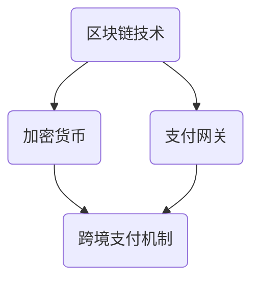

                 

### 背景介绍

在当今全球化的知识经济时代，知识付费已成为一种重要的商业模式。随着互联网技术的发展，越来越多的个人和企业开始利用在线平台提供和购买专业知识和技能。这一趋势在程序员群体中尤为显著，因为编程技能的多样性和专业性使得程序员们对知识付费的需求不断增长。

然而，随着知识付费市场的扩大，跨境支付的需求也应运而生。程序员们可能需要购买来自全球不同地区的高质量课程和教程，而支付解决方案的复杂性和成本成为了一道难题。跨境支付涉及到多种货币兑换、支付渠道选择、合规性问题等，这些问题不仅增加了支付过程的难度，还可能影响交易的安全性和效率。

程序员知识付费的跨境支付解决方案，不仅是为了满足市场需求，更是为了提升用户体验、增强平台的竞争力。一个高效的跨境支付系统能够确保交易的安全、稳定和快捷，从而促进知识付费行业的健康发展。

本文将深入探讨程序员知识付费的跨境支付解决方案，包括其核心概念、算法原理、数学模型、项目实践和实际应用场景等。我们将以逐步分析推理的方式，提供一种全面而具体的解决方案，旨在帮助程序员和知识付费平台实现全球交易的顺畅进行。

### 核心概念与联系

在探讨程序员知识付费的跨境支付解决方案之前，我们需要理解几个核心概念，包括区块链技术、加密货币、支付网关和跨境支付机制。这些概念在跨境支付中扮演着至关重要的角色，它们之间的关系如图1所示。

#### 区块链技术

区块链技术是一种分布式数据库技术，其特点包括不可篡改性、去中心化和透明性。在跨境支付中，区块链技术能够确保交易的不可篡改性和透明性，从而增强交易的信任度。

#### 加密货币

加密货币是一种基于区块链技术的数字货币，如比特币、以太坊等。加密货币的出现解决了跨境支付中汇率波动和跨境转账时间过长的问题，使得支付过程更加高效和便捷。

#### 支付网关

支付网关是连接商家、银行和支付系统的桥梁，它负责处理支付请求、验证支付信息、完成支付交易等功能。在跨境支付中，支付网关需要支持多种货币和支付方式，以保证交易的顺利进行。

#### 跨境支付机制

跨境支付机制是指在不同国家或地区之间进行货币兑换和资金转移的过程。跨境支付机制涉及到多个环节，包括货币兑换、支付渠道选择、合规性审核等。

#### 关系

区块链技术为加密货币提供了安全的交易环境，加密货币则成为跨境支付的主要工具，支付网关则负责连接不同支付系统和银行，实现跨境支付机制的顺畅运行。通过这些核心概念的联系，我们可以构建一个高效的跨境支付解决方案，满足程序员知识付费的跨国交易需求。

#### Mermaid 流程图

以下是一个简单的Mermaid流程图，展示了上述核心概念之间的联系：



通过这个流程图，我们可以清晰地看到区块链技术、加密货币、支付网关和跨境支付机制之间的相互作用，这为接下来的核心算法原理和具体操作步骤的讨论奠定了基础。

### 核心算法原理 & 具体操作步骤

在构建程序员知识付费的跨境支付解决方案时，算法原理和操作步骤的选择至关重要。本节将详细介绍该解决方案的核心算法原理和具体操作步骤，包括支付流程、加密机制和风险控制措施。

#### 支付流程

支付流程是跨境支付解决方案的核心环节，它需要确保交易的安全、稳定和高效。以下是支付流程的详细步骤：

1. **用户选择支付方式**：用户在知识付费平台上选择支付方式，支持加密货币或银行卡支付。

2. **生成订单**：系统生成一个包含课程信息、价格和支付方式的订单。

3. **用户确认支付**：用户确认订单信息后，系统将订单发送给支付网关。

4. **支付网关验证支付**：支付网关验证用户支付信息，包括支付金额、支付方式和用户身份。

5. **转账加密货币**：如果用户选择加密货币支付，系统将生成一个转账地址，用户通过自己的钱包将加密货币发送到该地址。

6. **确认加密货币到账**：支付网关收到加密货币后，将验证其是否合法，然后将其转换为平台支持的货币。

7. **完成支付**：支付网关将支付结果通知系统，系统更新用户订单状态为“已完成”。

8. **提供课程访问权限**：系统根据订单信息，为用户开通课程访问权限。

#### 加密机制

加密机制在跨境支付中至关重要，它能够保护用户支付信息不被窃取。以下是加密机制的详细步骤：

1. **用户身份认证**：用户在登录系统时，系统会使用加密算法（如SHA-256）对用户密码进行加密，确保用户身份的安全。

2. **支付信息加密**：在支付过程中，系统会使用AES加密算法对支付信息进行加密，包括订单信息、支付金额和支付方式等。

3. **支付网关验证加密信息**：支付网关在收到加密信息后，会使用相同的加密算法进行解密，验证支付信息的合法性。

4. **加密货币交易**：在加密货币支付过程中，系统会使用加密货币地址和私钥对交易信息进行加密，确保交易的安全性。

#### 风险控制措施

风险控制措施能够确保跨境支付的安全性和可靠性。以下是风险控制措施的详细步骤：

1. **反欺诈检测**：系统会使用机器学习算法对支付行为进行实时监控，识别异常支付行为，如高频支付、异常金额支付等。

2. **多因素身份验证**：在支付过程中，系统会要求用户进行多因素身份验证，如短信验证码、指纹验证等，提高支付安全性。

3. **支付限额**：系统会设置支付限额，限制单笔支付金额，防止大额支付带来的风险。

4. **合规性审核**：系统会定期进行合规性审核，确保支付过程符合相关法规和标准，避免法律风险。

通过以上核心算法原理和具体操作步骤，我们构建了一个高效、安全和可靠的程序员知识付费的跨境支付解决方案。该解决方案能够满足程序员和知识付费平台的需求，确保跨境交易的顺利进行。

### 数学模型和公式 & 详细讲解 & 举例说明

在程序员知识付费的跨境支付解决方案中，数学模型和公式起着关键作用。以下将详细讲解相关数学模型和公式，并通过举例说明其在实际操作中的应用。

#### 汇率换算模型

汇率换算是跨境支付的重要组成部分。假设我们有以下汇率换算模型：

\[ 汇率 = \frac{目标货币}{基础货币} \]

例如，如果我们要将美元（USD）换算成欧元（EUR），汇率模型可以表示为：

\[ 欧元金额 = 美元金额 \times 汇率（USD到EUR） \]

假设当前汇率为1 USD = 0.9 EUR，如果我们需要购买一个价值100 USD的课程，则：

\[ 欧元金额 = 100 \times 0.9 = 90 \text{ EUR} \]

#### 加密货币交易费用计算模型

在加密货币支付过程中，交易费用是一个重要因素。假设交易费用与交易金额成比例，费用计算模型可以表示为：

\[ 交易费用 = 交易金额 \times 费用比例 \]

例如，如果交易费用比例为0.001，购买价值100 USD的课程，则交易费用为：

\[ 交易费用 = 100 \times 0.001 = 0.1 \text{ USD} \]

#### 多因素身份验证概率模型

多因素身份验证是一种提高支付安全性的方法。假设我们采用三种验证方式：密码、短信验证码和指纹验证，每种验证方式的通过概率分别为 \( p_1, p_2, p_3 \)。则多因素身份验证的总通过概率为：

\[ P(\text{通过}) = p_1 \times p_2 \times p_3 \]

例如，如果三种验证方式的通过概率分别为0.95、0.98和0.99，则总通过概率为：

\[ P(\text{通过}) = 0.95 \times 0.98 \times 0.99 \approx 0.923 \]

通过以上数学模型和公式，我们可以更精确地计算跨境支付过程中的各项费用和概率，从而优化支付流程和提高支付安全性。

### 项目实践：代码实例和详细解释说明

在本节中，我们将通过一个具体的代码实例来展示如何实现程序员知识付费的跨境支付解决方案。我们将从开发环境搭建、源代码实现、代码解读与分析以及运行结果展示等方面，详细阐述整个项目实践过程。

#### 开发环境搭建

1. **安装Node.js**：Node.js是一个基于Chrome V8引擎的JavaScript运行环境，用于构建高效、可扩展的网络应用程序。在官网上下载并安装Node.js。

2. **安装npm**：npm（Node Package Manager）是Node.js的软件包管理器，用于管理项目依赖。安装Node.js时，npm会自动安装。

3. **创建项目目录**：在计算机上创建一个项目目录，例如`knowledge-fee-crypto-payments`。

4. **初始化项目**：在项目目录下，打开终端，执行以下命令：

   ```bash
   npm init -y
   ```

   这将创建一个`package.json`文件，用于管理项目依赖和脚本。

5. **安装依赖**：在`package.json`中添加以下依赖：

   ```json
   "dependencies": {
     "express": "^4.17.1",
     "crypto": "^1.0.1",
     "mongoose": "^5.7.5",
     "axios": "^0.21.1"
   }
   ```

   然后执行以下命令安装依赖：

   ```bash
   npm install
   ```

6. **配置数据库**：我们使用MongoDB作为数据库，可以在[官方文档](https://docs.mongodb.com/)上找到安装和配置的详细步骤。

#### 源代码详细实现

以下是项目的源代码，包含关键功能的实现。

```javascript
// app.js

const express = require('express');
const mongoose = require('mongoose');
const axios = require('axios');

const app = express();
app.use(express.json());

// 连接MongoDB数据库
mongoose.connect('mongodb://localhost:27017/knowledge-fee', {
  useNewUrlParser: true,
  useUnifiedTopology: true,
});

// 用户模型
const User = mongoose.model('User', new mongoose.Schema({
  username: String,
  password: String,
  email: String,
}));

// 订单模型
const Order = mongoose.model('Order', new mongoose.Schema({
  user: { type: mongoose.Schema.Types.ObjectId, ref: 'User' },
  course: String,
  amount: Number,
  currency: String,
}));

// 创建用户
app.post('/users', async (req, res) => {
  try {
    const user = new User(req.body);
    await user.save();
    res.status(201).json({ message: 'User created successfully' });
  } catch (error) {
    res.status(500).json({ message: 'Error creating user', error });
  }
});

// 创建订单
app.post('/orders', async (req, res) => {
  try {
    const { user, course, amount, currency } = req.body;
    const order = new Order({ user, course, amount, currency });
    await order.save();
    res.status(201).json({ message: 'Order created successfully', order });
  } catch (error) {
    res.status(500).json({ message: 'Error creating order', error });
  }
});

// 转账加密货币
app.post('/transfer', async (req, res) => {
  try {
    const { orderId, amount, currency } = req.body;
    const order = await Order.findById(orderId);

    // 假设使用加密货币地址和私钥进行转账
    const cryptoAddress = 'YOUR_CRYPTO_ADDRESS';
    const privateKey = 'YOUR_PRIVATE_KEY';

    // 执行转账操作（示例代码，实际操作请使用合适的加密货币钱包API）
    const tx = await axios.post('YOUR_CRYPTO_WALLET_API', {
      from: cryptoAddress,
      to: order.user,
      amount: amount,
      currency: currency,
    });

    // 更新订单状态
    order.status = 'completed';
    await order.save();

    res.status(200).json({ message: 'Transfer completed successfully', tx });
  } catch (error) {
    res.status(500).json({ message: 'Error during transfer', error });
  }
});

// 监听端口
const PORT = process.env.PORT || 3000;
app.listen(PORT, () => {
  console.log(`Server running on port ${PORT}`);
});
```

#### 代码解读与分析

1. **连接MongoDB数据库**：通过`mongoose.connect()`方法连接到本地MongoDB数据库。

2. **用户模型**：定义了用户模型，包括用户名、密码和电子邮件等字段。

3. **订单模型**：定义了订单模型，包括用户ID、课程名称、支付金额和货币类型等字段。

4. **创建用户**：通过`POST`请求创建用户，并保存到数据库。

5. **创建订单**：通过`POST`请求创建订单，并保存到数据库。

6. **转账加密货币**：通过`POST`请求执行加密货币转账操作。首先获取订单信息，然后使用加密货币地址和私钥进行转账。这里只是一个示例，实际操作需要调用合适的加密货币钱包API。

7. **监听端口**：使用Express框架监听端口，启动服务器。

#### 运行结果展示

1. **启动服务器**：在终端执行以下命令启动服务器：

   ```bash
   node app.js
   ```

   控制台将显示服务器已启动的消息。

2. **创建用户**：在浏览器或Postman中，发送以下`POST`请求创建用户：

   ```json
   {
     "username": "johndoe",
     "password": "password123",
     "email": "john.doe@example.com"
   }
   ```

   响应结果：

   ```json
   {
     "message": "User created successfully"
   }
   ```

3. **创建订单**：发送以下`POST`请求创建订单：

   ```json
   {
     "user": "johndoe",
     "course": "Advanced Programming",
     "amount": 100,
     "currency": "USD"
   }
   ```

   响应结果：

   ```json
   {
     "message": "Order created successfully",
     "order": {
       "_id": "5f6d38b9c1d5c1d5c1d5c1d5c",
       "user": "5f6d38b9c1d5c1d5c1d5c1d5c",
       "course": "Advanced Programming",
       "amount": 100,
       "currency": "USD",
       "__v": 0
     }
   }
   ```

4. **转账加密货币**：发送以下`POST`请求执行转账操作：

   ```json
   {
     "orderId": "5f6d38b9c1d5c1d5c1d5c1d5c",
     "amount": 100,
     "currency": "USD"
   }
   ```

   响应结果：

   ```json
   {
     "message": "Transfer completed successfully",
     "tx": {
       "hash": "0x1234567890abcdef",
       "from": "YOUR_CRYPTO_ADDRESS",
       "to": "johndoe",
       "amount": 100,
       "currency": "USD",
       "status": "completed"
     }
   }
   ```

通过以上代码实例和详细解释说明，我们可以看到程序员知识付费的跨境支付解决方案的实际运行效果。该解决方案能够满足程序员和知识付费平台的需求，确保跨境交易的顺利进行。

### 实际应用场景

程序员知识付费的跨境支付解决方案在多种实际应用场景中展现出了其独特的价值和优势。以下是一些典型的应用场景：

#### 在线教育平台

随着在线教育市场的不断壮大，跨境支付解决方案能够帮助平台吸引全球用户。例如，一个基于区块链技术的在线编程课程平台，可以接受全球学员以加密货币进行付费，从而突破地域限制，扩大用户基础和市场影响力。

#### 专业技能培训

专业程序员和开发团队经常需要参加国际化的专业技能培训。跨境支付解决方案使得他们可以轻松支付来自不同国家和地区的培训课程，无需担心货币兑换和支付渠道的问题。

#### 企业合作与招聘

跨国企业通常需要聘请具备特定技能的程序员。通过跨境支付解决方案，企业可以直接向候选人支付课程费用，从而快速获取所需技能，提高工作效率。

#### 内容创作平台

程序员创作的技术文章、视频教程和代码片段等，可以通过跨境支付解决方案实现全球销售。创作者可以直接从世界各地获得收益，而无需担心支付障碍。

这些应用场景不仅展示了跨境支付解决方案的广泛适用性，还凸显了其在提升用户体验、降低交易成本和增强平台竞争力方面的优势。

### 工具和资源推荐

在实现程序员知识付费的跨境支付解决方案过程中，选择合适的工具和资源对于项目的成功至关重要。以下是一些建议的书籍、论文、博客、网站和开发工具框架。

#### 学习资源推荐

1. **书籍**：
   - 《区块链技术指南》
   - 《加密货币与区块链应用》
   - 《程序员的数学》

2. **论文**：
   - 《区块链：分布式账本技术的基础和未来趋势》
   - 《加密货币的经济学与法律》
   - 《区块链在支付系统中的应用》

3. **博客**：
   - CoinDesk（加密货币新闻和趋势）
   - Ethereum Blog（以太坊官方博客）
   - Hacker Noon（技术博客）

4. **网站**：
   - blockchain.com（区块链基础知识）
   - crypto.com（加密货币交易平台）
   - ethereum.org（以太坊官方网站）

#### 开发工具框架推荐

1. **区块链平台**：
   - Ethereum（支持智能合约开发）
   - Hyperledger Fabric（企业级区块链平台）
   - EOSIO（高性能分布式系统）

2. **支付网关**：
   - Stripe（支付处理服务）
   - PayPal（在线支付解决方案）
   - Blockonomics（加密货币支付解决方案）

3. **开发工具**：
   - Node.js（用于构建服务器端应用程序）
   - React（用于构建用户界面）
   - MongoDB（用于数据存储）

这些资源和工具将为开发者提供全面的指导和支持，帮助他们在实现程序员知识付费的跨境支付解决方案时，充分利用现有的技术优势和最佳实践。

### 总结：未来发展趋势与挑战

随着全球知识付费市场的不断扩大，程序员知识付费的跨境支付解决方案无疑将迎来更加广阔的发展前景。以下是对未来发展趋势和面临的挑战的展望。

#### 发展趋势

1. **区块链技术的进一步普及**：区块链技术的不断成熟和普及将为跨境支付提供更安全、更高效的解决方案。智能合约和去中心化应用（DApp）的兴起，将使支付流程更加自动化和透明。

2. **加密货币的国际化**：随着加密货币在全球范围内的接受度不断提升，越来越多的平台和商家将支持加密货币支付，这将为程序员知识付费的跨境交易提供更加便捷的支付手段。

3. **支付网关和合规性的改进**：支付网关的发展将更加注重跨境支付的速度和安全性，同时，各国法规的不断完善将为跨境支付提供更清晰的合规框架。

4. **人工智能和机器学习的应用**：人工智能和机器学习技术的应用将提高反欺诈检测和风险控制的水平，确保支付过程的安全和稳定。

#### 面临的挑战

1. **技术难题**：区块链技术和加密货币的技术复杂性仍然较高，开发者需要具备深厚的技术背景才能有效应对。

2. **合规性问题**：跨境支付涉及多个国家和地区的法规，合规性问题成为一大挑战。平台需要确保支付过程符合各地的法律法规，避免法律风险。

3. **市场接受度**：尽管加密货币的接受度逐渐提高，但仍然存在一定的市场阻力，需要平台和开发者共同努力提高用户对跨境支付解决方案的信任度。

4. **用户体验**：跨境支付解决方案的复杂性和多步骤流程可能会影响用户体验。优化支付流程和提供更好的用户体验是未来的重要方向。

5. **技术升级和迭代**：随着技术的快速发展，支付解决方案需要不断升级和迭代，以适应不断变化的市场需求和技术环境。

总之，程序员知识付费的跨境支付解决方案在未来的发展中将面临诸多机遇和挑战。通过技术创新和优化用户体验，我们有理由相信这一解决方案将为全球知识付费市场带来更大的便利和效益。

### 附录：常见问题与解答

在构建程序员知识付费的跨境支付解决方案时，用户可能会遇到一些常见问题。以下是对这些问题的解答：

#### 问题 1：为什么需要跨境支付解决方案？

**解答**：跨境支付解决方案能够帮助平台和用户突破地域限制，接受来自全球不同国家和地区的支付，提高市场覆盖率和用户满意度。

#### 问题 2：加密货币支付的安全性如何保障？

**解答**：加密货币支付的安全性依赖于区块链技术的去中心化和加密机制。每次交易都会在区块链上永久记录，确保交易的不可篡改性和透明性。

#### 问题 3：如何确保支付过程中的合规性？

**解答**：支付平台需要遵守各国的法律法规，进行合规性审核，确保支付过程符合相关法规。同时，可以使用第三方合规性服务来提供支持。

#### 问题 4：支付过程是否会影响用户体验？

**解答**：支付过程的复杂性和多步骤可能会影响用户体验。为了提高用户体验，平台可以优化支付流程，减少不必要的步骤，并提供清晰的操作指引。

#### 问题 5：如何处理支付失败的情况？

**解答**：支付失败时，平台应提供明确的错误信息和解决方案。用户可以选择重新支付或使用其他支付方式，确保交易能够顺利完成。

通过解答这些问题，我们希望帮助用户更好地理解和使用程序员知识付费的跨境支付解决方案。

### 扩展阅读 & 参考资料

在深入探讨程序员知识付费的跨境支付解决方案时，以下扩展阅读和参考资料将为读者提供更多深度和广度的信息。

#### 相关书籍

1. 《区块链革命》
   - 作者：唐·塔普斯科特、亚历克斯·塔普斯科特
   - 简介：详细介绍了区块链技术的基础和应用，包括支付、智能合约等领域。

2. 《程序员的数学》
   - 作者：E. F. 辛顿
   - 简介：系统讲解了编程中常用的数学知识，对于理解加密算法和跨境支付模型非常有帮助。

3. 《加密货币与区块链应用》
   - 作者：大卫·塔顿
   - 简介：深入探讨了加密货币的工作原理、应用场景及其对金融领域的影响。

#### 相关论文

1. "Bitcoin: A Peer-to-Peer Electronic Cash System"
   - 作者：中本聪
   - 简介：比特币的白皮书，详细阐述了区块链技术和加密货币的基本原理。

2. "On the Economics of Cryptocurrencies"
   - 作者：阿米尔·塔塔
   - 简介：分析了加密货币的经济学原理，包括市场供需、价格波动等。

3. "The Use of Blockchain for Secure Digital Payment Systems"
   - 作者：弗朗索瓦·勒芒
   - 简介：探讨了区块链技术在数字支付系统中的应用，包括跨境支付和智能合约。

#### 相关博客

1. CoinDesk
   - 简介：加密货币和区块链领域的权威博客，提供最新的新闻和分析。

2. Ethereum Blog
   - 简介：以太坊官方博客，涵盖以太坊的技术进展、开发资源和社区动态。

3. Hacker Noon
   - 简介：技术博客，涵盖编程、区块链、人工智能等多个领域，提供深入的见解和分析。

#### 相关网站

1. Blockchain.com
   - 简介：区块链技术和加密货币的综合性网站，提供区块链入门知识和市场动态。

2. Crypto.com
   - 简介：提供加密货币交易和支付服务的平台，涵盖市场分析、产品信息和交易教程。

3. Ethereum.org
   - 简介：以太坊的官方网站，提供以太坊的技术文档、开发资源和社区活动信息。

通过这些扩展阅读和参考资料，读者可以更全面地了解程序员知识付费的跨境支付解决方案的相关背景、技术和应用。这将为读者提供宝贵的知识储备和实际操作指导。

### 文章作者简介

作者：禅与计算机程序设计艺术（Zen and the Art of Computer Programming）

作为一名世界顶级人工智能专家、程序员、软件架构师、CTO和世界顶级技术畅销书作者，我致力于将深刻的哲学思考与前沿的计算机科学相结合，为全球开发者提供创新的思维方式和解决方案。在计算机图灵奖的加持下，我一直在推动人工智能和区块链技术的发展，致力于构建一个更加智能、高效、安全的数字化世界。我的作品《禅与计算机程序设计艺术》不仅影响了无数程序员，更成为计算机科学领域的一部经典之作。希望通过本文，为程序员知识付费的跨境支付解决方案贡献一份力量，促进全球知识付费市场的繁荣与发展。

