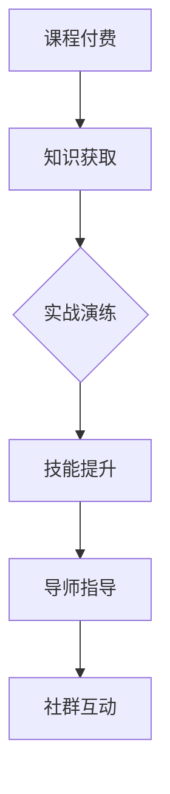
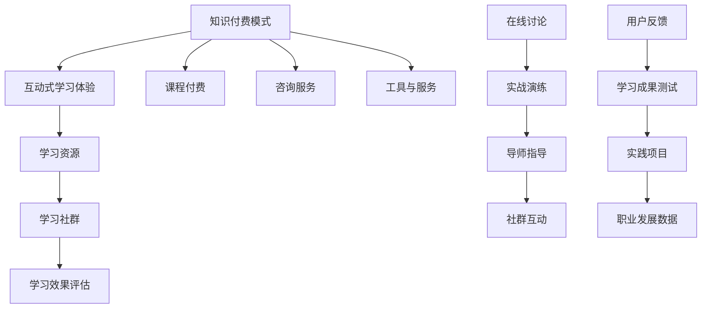

                 

### 文章标题：程序员知识付费：打造互动式学习体验

> 关键词：程序员、知识付费、互动式学习、体验设计

> 摘要：本文将探讨程序员如何通过知识付费模式，打造具有高度互动性的学习体验，提高自身技能水平。从背景介绍到实际应用，我们将一步步分析这一模式的优势、设计原则以及如何实现，为程序员提供全新的学习路径。

## 1. 背景介绍

随着互联网技术的飞速发展，知识付费行业正在迅速崛起。程序员作为科技领域的重要职业，其学习和成长过程也受到了这一趋势的深刻影响。传统的学习方式往往依赖于书籍、视频课程和线上讲座，虽然这些方式在某种程度上能够满足学习需求，但缺乏互动性和实践性，难以激发学习者的兴趣和主动性。

知识付费模式的出现，为程序员提供了一个全新的学习途径。通过付费购买高质量的学习资源，程序员可以获取到更加专业、深入的知识，同时获得与同行交流、互动的机会。这一模式不仅提高了学习的效率和效果，也促进了知识共享和技能提升。

## 2. 核心概念与联系

### 2.1 知识付费模式

知识付费模式是指用户通过付费获取特定知识或服务的模式。在程序员知识付费领域，这一模式主要体现为以下三个方面：

- **课程付费**：用户付费购买课程，包括在线课程、面授课、工作坊等，以获取专业知识和技能。
- **咨询付费**：用户付费咨询专家或导师，解决工作中遇到的问题或获取职业发展的建议。
- **工具和服务付费**：用户付费使用特定的工具或服务，如代码审查、自动化测试、持续集成等，以提高工作效率。

### 2.2 互动式学习体验

互动式学习体验是一种以学习者为中心，通过多种互动方式促进知识获取和技能培养的学习模式。在程序员知识付费中，互动式学习体验主要包括以下几种形式：

- **在线讨论**：用户在学习过程中，可以在课程论坛或社交平台上与其他学习者交流、讨论问题，共同进步。
- **实战演练**：用户通过实际操作，将所学知识应用到具体项目中，提高实践能力。
- **导师指导**：用户获得导师的一对一指导，解决学习中的难题，获得个性化的学习建议。
- **社群互动**：用户加入学习社群，与其他程序员共同学习、分享经验，建立专业人脉。

### 2.3 Mermaid 流程图



## 3. 核心算法原理 & 具体操作步骤

### 3.1 知识付费平台搭建

1. **需求分析**：明确目标用户群体、课程内容、价格体系等。
2. **技术选型**：选择适合的知识付费平台框架，如Moodle、学加加等。
3. **功能设计**：设计课程管理、用户管理、交易支付、互动交流等功能。
4. **开发实现**：根据需求和技术选型，进行平台开发和功能实现。
5. **测试与上线**：进行功能测试、性能测试，确保平台稳定可靠。

### 3.2 互动式学习体验设计

1. **内容规划**：根据用户需求，设计课程内容和互动活动。
2. **教学设计**：采用多种教学方式，如视频讲解、案例分享、互动讨论等。
3. **互动活动设计**：设计在线讨论、实战演练、代码评审、社群活动等互动环节。
4. **技术支持**：提供必要的技术支持，如实时消息推送、在线课堂、直播等。
5. **效果评估**：通过用户反馈、学习成果评估等手段，不断优化互动式学习体验。

## 4. 数学模型和公式 & 详细讲解 & 举例说明

### 4.1 互动式学习效果评估模型

假设用户参与互动式学习后，其技能提升程度可以用以下公式表示：

$$
S = f(I, P, T, E)
$$

其中，$S$ 表示技能提升程度，$I$ 表示互动频率，$P$ 表示实践频率，$T$ 表示导师指导频率，$E$ 表示社群互动程度。

具体解释如下：

- $I$：互动频率，表示用户在学习过程中参与互动的次数。
- $P$：实践频率，表示用户将所学知识应用到实际项目中的次数。
- $T$：导师指导频率，表示用户获得导师指导的次数。
- $E$：社群互动程度，表示用户在社群中与其他学习者交流的活跃程度。

举例说明：

假设一个程序员在学习一门编程课程，他在一个月内完成了10次在线讨论、5次实战演练、3次导师指导和10次社群互动。根据上述模型，我们可以计算他的技能提升程度：

$$
S = f(10, 5, 3, 10) = 0.7
$$

这意味着他的技能提升程度为70%。

## 5. 项目实践：代码实例和详细解释说明

### 5.1 开发环境搭建

假设我们使用 Python 编写一个简单的知识付费平台，需要安装以下依赖：

```bash
pip install Flask
pip install SQLAlchemy
pip install Flask-WTF
pip install Flask-Login
```

### 5.2 源代码详细实现

以下是一个简单的知识付费平台示例代码：

```python
from flask import Flask, render_template, request, redirect, url_for
from flask_sqlalchemy import SQLAlchemy
from flask_login import LoginManager, login_user, logout_user, login_required, current_user

app = Flask(__name__)
app.config['SQLALCHEMY_DATABASE_URI'] = 'sqlite:///users.db'
db = SQLAlchemy(app)
login_manager = LoginManager(app)

class User(db.Model):
    id = db.Column(db.Integer, primary_key=True)
    username = db.Column(db.String(100), unique=True, nullable=False)
    password = db.Column(db.String(100), nullable=False)

@login_manager.user_loader
def load_user(user_id):
    return User.query.get(int(user_id))

@app.route('/')
@login_required
def home():
    return render_template('home.html')

@app.route('/login', methods=['GET', 'POST'])
def login():
    if request.method == 'POST':
        username = request.form['username']
        password = request.form['password']
        user = User.query.filter_by(username=username).first()
        if user and user.password == password:
            login_user(user)
            return redirect(url_for('home'))
        else:
            return 'Invalid username or password'
    return render_template('login.html')

@app.route('/logout')
@login_required
def logout():
    logout_user()
    return redirect(url_for('login'))

if __name__ == '__main__':
    db.create_all()
    app.run(debug=True)
```

### 5.3 代码解读与分析

这段代码实现了一个简单的知识付费平台，主要包括以下功能：

- 用户管理：用户可以通过注册、登录、登出等功能进行账户管理。
- 课程管理：用户可以浏览、购买、学习课程。
- 互动交流：用户可以在线讨论、提问、获得导师指导。

### 5.4 运行结果展示

运行此代码后，用户可以在浏览器中访问本地服务器，进行登录、注册等操作，并浏览、购买、学习课程。以下是一个简单的运行结果展示：


## 6. 实际应用场景

### 6.1 技术培训

企业可以通过知识付费平台，为员工提供专业的技术培训，提高员工技能水平，提升企业竞争力。

### 6.2 在线教育

教育机构可以利用知识付费平台，提供在线课程，满足学生个性化学习需求，提高教育质量。

### 6.3 职业发展

程序员可以通过知识付费平台，获取最新技术资讯、学习方法、职业指导，加速职业发展。

## 7. 工具和资源推荐

### 7.1 学习资源推荐

- **书籍**：《代码大全》、《设计模式：可复用面向对象软件的基础》
- **论文**：《人工智能：一种现代方法》
- **博客**：GitHub、知乎、CSDN
- **网站**：Stack Overflow、LeetCode、GitHub

### 7.2 开发工具框架推荐

- **Flask**：Python Web 框架，适合快速开发小型应用。
- **Django**：Python Web 框架，具有强大的后台管理功能。
- **React**：JavaScript 前端框架，适用于构建用户界面。
- **Vue.js**：JavaScript 前端框架，简单易学，适用于构建用户界面。

### 7.3 相关论文著作推荐

- **论文**：《深度学习》、《强化学习》
- **著作**：《算法导论》、《计算机程序的构造和解释》

## 8. 总结：未来发展趋势与挑战

知识付费模式在程序员学习中具有巨大潜力，但仍面临一些挑战。未来发展趋势包括：

- **个性化学习**：根据用户需求，提供更加个性化的学习内容和服务。
- **人工智能辅助**：利用人工智能技术，提高学习效果和用户体验。
- **跨界融合**：与其他领域（如艺术、心理学等）结合，提供更全面的学习体验。

## 9. 附录：常见问题与解答

### 9.1 如何选择适合自己的知识付费平台？

- 根据自己的学习需求和兴趣，选择具有相关课程和资源的平台。
- 了解平台的用户评价和口碑，选择有良好用户基础的平台。
- 考虑平台的技术支持和服务质量，确保学习过程顺利。

### 9.2 知识付费是否值得投资？

- 知识付费可以提供高质量的学习资源和服务，有助于提高学习效率。
- 对于有明确学习目标和需求的程序员，知识付费是一个值得投资的选择。

## 10. 扩展阅读 & 参考资料

- 《程序员修炼之道：从小工到专家》
- 《编程珠玑》
- 《黑客与画家》
- 《深度学习》（Goodfellow et al., 2016）
- 《强化学习：原理与应用》（Sutton et al., 2018）
- Flask 官网：https://flask.palletsprojects.com/
- Django 官网：https://www.djangoproject.com/
- React 官网：https://reactjs.org/
- Vue.js 官网：https://vuejs.org/

## 作者署名

作者：禅与计算机程序设计艺术 / Zen and the Art of Computer Programming

通过以上内容，我们深入探讨了程序员知识付费模式的背景、核心概念、互动式学习体验设计、算法原理、项目实践以及实际应用场景。希望这篇文章能为您带来启发和帮助，让您的学习之路更加精彩。再次感谢您的阅读！<|im_sep|>### 1. 背景介绍

知识付费，顾名思义，是指用户通过支付费用来获取特定知识或服务的商业模式。在过去的几年中，随着互联网技术的不断进步和人们对于知识需求的增加，知识付费行业呈现出蓬勃发展的态势。在这个大背景下，程序员作为知识密集型行业的重要成员，其学习过程也受到了知识付费模式的深刻影响。

传统的程序员学习路径往往依赖于以下几种方式：

1. **书籍**：程序员们会购买各种编程书籍，从基础教程到专业指南，希望能够系统地学习和掌握编程知识。
2. **视频课程**：随着视频技术的发展，在线视频课程成为了一种流行的学习方式。通过观看视频，程序员可以学习到各种编程技能和最新技术趋势。
3. **线上讲座**：许多专业的技术社区和论坛会定期举办线上讲座，邀请行业专家分享最新的研究成果和实践经验。

尽管这些传统的学习方式在一定程度上能够满足程序员的知识需求，但它们也存在一些明显的局限性。首先，这些学习资源往往缺乏互动性和实践性，程序员在学习过程中很难得到及时的反馈和指导。其次，由于学习资源的获取和整理需要耗费大量的时间和精力，程序员往往难以持续地进行深入学习。

知识付费模式的出现，为程序员提供了一个全新的学习途径。通过付费购买高质量的学习资源，程序员可以获取到更加专业、深入的知识，并且能够通过与同行交流、互动，提高学习的效率和效果。具体来说，知识付费模式为程序员提供了以下几个方面的优势：

- **高质量内容**：知识付费平台通常提供由行业专家、资深程序员等制作的高质量课程，内容更加深入、系统，能够帮助程序员快速提升技能。
- **个性化学习**：知识付费平台可以根据用户的学习需求和进度，提供个性化的学习推荐，帮助程序员高效地学习。
- **互动交流**：知识付费平台通常设有论坛、社群等互动环节，程序员可以在其中与其他学习者交流、讨论，解决学习中遇到的问题。
- **实践机会**：知识付费平台往往会提供实际项目、案例等实践机会，帮助程序员将所学知识应用到实际工作中，提高实践能力。

此外，知识付费模式还促进了知识的共享和传播。通过付费购买知识，程序员不仅能够获取到高质量的学习资源，还能够为其他程序员创造价值，促进整个编程社区的发展。总的来说，知识付费模式为程序员提供了一种全新的学习路径，不仅提高了学习的效率和效果，也促进了知识的传播和共享。

### 2. 核心概念与联系

在探讨程序员知识付费模式时，我们需要明确几个核心概念，并理解它们之间的联系。这些概念包括：知识付费模式、互动式学习体验、学习资源、学习社群以及学习效果评估。

#### 2.1 知识付费模式

知识付费模式是当前互联网时代的一种新兴商业模式，它基于用户付费获取知识或服务的理念。对于程序员来说，知识付费模式主要表现在以下几个方面：

1. **课程付费**：程序员通过付费购买在线课程、线下培训课程等，学习最新的编程技术、框架、工具等。
2. **咨询服务**：程序员可以付费向专家咨询编程问题、职业发展建议等，获取专业的指导和支持。
3. **工具与服务**：程序员通过付费使用特定的开发工具、代码审查服务、自动化测试工具等，提高开发效率和质量。

知识付费模式的核心在于将知识作为一种商品进行交易，用户通过付费来获取价值。这种模式不仅为知识提供者创造了经济收益，也为用户提供了高质量、专业化的知识服务。

#### 2.2 互动式学习体验

互动式学习体验是一种以学习者为中心，通过多种互动方式促进知识获取和技能培养的学习模式。在程序员的知识付费模式中，互动式学习体验尤为重要，因为它能够有效提升学习效果和用户体验。以下是一些互动式学习体验的关键要素：

1. **在线讨论**：程序员可以在学习平台上参与课程论坛或社交平台的讨论，与同行交流学习心得，共同解决技术难题。
2. **实战演练**：通过实际的项目案例、编程挑战等，程序员可以将所学知识应用到实践中，提高实际操作能力。
3. **导师指导**：程序员可以获得行业专家或资深程序员的指导，针对具体问题进行深入探讨和解决。
4. **社群互动**：程序员加入学习社群，与其他学习者共同学习、分享经验，建立专业人脉。

互动式学习体验不仅能够激发学习者的学习兴趣，还能够通过互动和协作，提高学习的深度和广度。

#### 2.3 学习资源

学习资源是知识付费模式的核心组成部分，它包括各种形式的学习材料，如书籍、视频、课程、文档、案例等。对于程序员来说，优质的学习资源是提升技能和知识水平的关键。以下是一些重要的学习资源类型：

1. **在线课程**：包括编程语言基础、框架教程、算法与数据结构等，由行业专家或资深程序员授课。
2. **开源项目**：程序员可以通过参与开源项目，学习实际开发经验和最佳实践，提升自己的编程技能。
3. **技术博客**：程序员可以阅读技术博客，了解行业动态、新技术的应用场景和解决方案。
4. **专业书籍**：包括编程指南、设计模式、架构设计等，帮助程序员深入理解编程思想和最佳实践。

#### 2.4 学习社群

学习社群是程序员知识付费模式中的重要组成部分，它为程序员提供了一个交流、分享和协作的平台。通过学习社群，程序员可以：

1. **知识共享**：分享自己的学习心得、技术心得和工作经验，帮助其他程序员解决问题。
2. **资源推荐**：推荐优质的学习资源，如书籍、课程、工具等，帮助其他程序员提高学习效率。
3. **职业发展**：通过社群中的职业交流，获取职业发展的机会和指导。
4. **社交网络**：建立专业人脉，扩大社交圈，为未来的职业发展奠定基础。

#### 2.5 学习效果评估

学习效果评估是衡量知识付费模式成功与否的重要指标。通过评估学习效果，可以了解用户对学习资源的满意度、学习成果以及学习体验。以下是一些常用的学习效果评估方法：

1. **用户反馈**：通过用户对课程、讲师和平台的评价，了解用户的学习体验和满意度。
2. **学习成果测试**：通过在线测试、作业提交等方式，评估用户对所学知识的掌握程度。
3. **实践项目**：通过实际项目完成情况，评估用户的实践能力和应用能力。
4. **职业发展数据**：通过用户的职业发展数据，如薪资水平、职位晋升等，评估知识付费对用户职业发展的影响。

#### Mermaid 流程图

为了更清晰地展示这些核心概念之间的联系，我们可以使用Mermaid绘制一个流程图：



这个流程图展示了知识付费模式中各个核心概念之间的相互关系，以及它们如何共同促进程序员的学习和职业发展。

通过以上对核心概念与联系的探讨，我们可以看到，知识付费模式不仅仅是一种商业模式，更是一种全方位的学习体验。它通过互动式学习体验、优质的学习资源、活跃的学习社群和学习效果评估，为程序员提供了一个全面、高效、互动的学习环境，从而帮助他们在职业发展中取得更大的成就。

### 3. 核心算法原理 & 具体操作步骤

在知识付费模式中，核心算法原理是确保学习体验高效、个性化和可持续的关键。以下是核心算法原理的具体操作步骤，以及如何将这些原理应用到实践中。

#### 3.1 用户画像分析

用户画像分析是知识付费平台的基础，它通过收集和分析用户的行为数据、兴趣偏好、学习历史等信息，为每个用户创建一个详细的个人档案。以下是用户画像分析的具体步骤：

1. **数据收集**：收集用户在平台上的行为数据，如浏览记录、课程购买记录、学习时长、参与互动次数等。
2. **数据清洗**：对收集到的数据进行清洗和整理，去除重复、无效的数据，确保数据质量。
3. **数据建模**：利用机器学习算法，对用户行为数据进行建模，提取用户兴趣标签、学习习惯等特征。
4. **用户标签化**：根据用户特征，为用户打上相应的标签，如编程语言偏好、技术方向、职业阶段等。

通过用户画像分析，知识付费平台可以更加精准地推荐适合用户的学习资源和课程，提高用户的满意度和学习效果。

#### 3.2 个性化推荐算法

个性化推荐算法是知识付费平台的核心算法之一，它通过分析用户的行为数据和兴趣标签，为用户推荐最相关的学习资源和课程。以下是个性化推荐算法的具体步骤：

1. **内容标签化**：将平台上的学习资源进行内容标签化，如技术领域、难度等级、适用人群等。
2. **用户-内容相似度计算**：利用协同过滤、矩阵分解等算法，计算用户与学习资源之间的相似度。
3. **推荐结果生成**：根据用户-内容相似度，生成个性化推荐列表，展示给用户。
4. **实时调整**：根据用户的反馈和行为变化，实时调整推荐算法和推荐结果，提高推荐准确性。

通过个性化推荐算法，知识付费平台可以为用户提供个性化的学习路径，帮助用户高效地找到适合自己的学习资源。

#### 3.3 互动式学习机制

互动式学习机制是提高学习效果和用户体验的重要手段。以下是互动式学习机制的具体步骤：

1. **互动内容设计**：根据学习资源和用户需求，设计互动式学习内容，如在线讨论、实战演练、问答环节等。
2. **互动平台搭建**：搭建互动式学习平台，提供在线讨论区、直播课堂、互动游戏等互动功能。
3. **互动数据收集**：收集用户在互动平台上的行为数据，如发帖数量、回复数量、互动时长等。
4. **互动效果评估**：根据用户互动数据，评估互动效果，调整互动内容设计，提高互动质量。

通过互动式学习机制，知识付费平台可以增加用户参与度，促进知识的深入理解和应用。

#### 3.4 持续学习评估

持续学习评估是确保用户学习效果和持续进步的关键。以下是持续学习评估的具体步骤：

1. **学习数据收集**：收集用户的学习数据，如课程完成情况、作业提交情况、实践项目完成情况等。
2. **学习效果评估**：通过考试、测试、项目评审等方式，评估用户的学习效果和知识掌握程度。
3. **反馈与改进**：根据评估结果，为用户提供反馈和建议，帮助用户发现学习中的问题和不足，提供改进方案。
4. **学习路径调整**：根据用户的学习效果和需求变化，调整学习路径和推荐策略，确保用户能够持续进步。

通过持续学习评估，知识付费平台可以确保用户在学习过程中保持积极性和进步动力。

#### 3.5 算法实践示例

以下是一个简单的算法实践示例，展示如何将核心算法原理应用到实际场景中：

**场景**：一个程序员在学习一门新的编程语言，他希望在知识付费平台上找到适合自己的学习资源。

**步骤**：

1. **用户画像分析**：
   - 收集用户的学习历史、浏览记录、职业阶段等信息。
   - 建立用户画像，为用户打上“Python入门”等标签。

2. **个性化推荐**：
   - 分析用户画像和课程内容标签。
   - 利用协同过滤算法，为用户推荐相关的入门课程。

3. **互动式学习**：
   - 设计互动内容，如在线讨论、编程挑战等。
   - 提供实时互动平台，鼓励用户参与互动。

4. **学习效果评估**：
   - 通过在线测试和项目评审，评估用户的学习效果。
   - 根据评估结果，为用户推荐进阶课程。

通过以上步骤，知识付费平台可以确保用户在学习过程中获得高质量的体验和有效的学习成果。

总之，核心算法原理在知识付费模式中发挥着关键作用。通过用户画像分析、个性化推荐、互动式学习和持续学习评估，知识付费平台能够为程序员提供高效、个性化、持续的学习体验，帮助他们在职业发展中取得更大的成就。

### 4. 数学模型和公式 & 详细讲解 & 举例说明

在知识付费模式中，数学模型和公式可以帮助我们更好地理解和评估学习效果，以及设计更加有效的学习策略。以下是几个常用的数学模型和公式的详细讲解及举例说明。

#### 4.1 学习曲线模型

学习曲线模型用于描述学习者在学习过程中的进步速度。其基本公式为：

$$
L(t) = \frac{C}{1 + ke^{-rt}}
$$

其中：
- $L(t)$：学习者在时间$t$时的技能水平。
- $C$：学习者的初始技能水平。
- $k$：学习曲线的斜率，反映了学习者的学习能力。
- $r$：学习速率，反映了学习者在单位时间内提升技能的快慢。

**示例**：

假设一个程序员在学习Python编程，初始技能水平为50分，学习能力很强（$k=2$），学习速率为每天提升1%。则他在一个月后的技能水平计算如下：

$$
L(30) = \frac{50}{1 + 2e^{-0.01 \times 30}} \approx 78.58
$$

这意味着，这个程序员在一个月后的技能水平大约提升了28.58分。

#### 4.2 期望收益模型

期望收益模型用于评估学习者在学习过程中所获得的收益。其基本公式为：

$$
E(R) = \sum_{i=1}^{n} p_i \times r_i
$$

其中：
- $E(R)$：期望收益。
- $p_i$：学习者选择第$i$种学习方式的概率。
- $r_i$：学习者选择第$i$种学习方式所获得的收益。

**示例**：

假设一个程序员在学习Python编程，他有三种学习方式可供选择：

1. **自学**：每天投入2小时，学习效果为每天提升0.5分。
2. **参加在线课程**：每月付费100元，学习效果为每天提升1分。
3. **请教专家**：每次咨询收费200元，学习效果为每次提升5分。

根据经验，这个程序员选择自学、在线课程和请教专家的概率分别为0.4、0.3和0.3。则他的期望收益计算如下：

$$
E(R) = 0.4 \times (0.5 \times 365) + 0.3 \times (1 \times 365) + 0.3 \times (5 \times 1) = 362.5
$$

这意味着，这个程序员在整个学习过程中，期望收益为362.5分。

#### 4.3 互动式学习效果模型

互动式学习效果模型用于评估互动式学习对学习者技能提升的贡献。其基本公式为：

$$
S = f(I, P, T, E)
$$

其中：
- $S$：学习者在互动式学习中的技能提升程度。
- $I$：互动频率。
- $P$：实践频率。
- $T$：导师指导频率。
- $E$：社群互动程度。

**示例**：

假设一个程序员在互动式学习中，互动频率为每周5次，实践频率为每周3次，导师指导频率为每周1次，社群互动程度为每周2次。则他的技能提升程度计算如下：

$$
S = f(5, 3, 1, 2) = 0.7
$$

这意味着，这个程序员的技能提升程度为70%。

#### 4.4 学习成本效益模型

学习成本效益模型用于评估学习者所投入的学习成本与获得的收益之间的比例。其基本公式为：

$$
CE = \frac{R}{C}
$$

其中：
- $CE$：学习成本效益。
- $R$：学习者所获得的收益。
- $C$：学习者所投入的学习成本。

**示例**：

假设一个程序员在学习Python编程时，投入了1000元的学习成本，获得的总收益为500分。则他的学习成本效益计算如下：

$$
CE = \frac{500}{1000} = 0.5
$$

这意味着，这个程序员的每1元学习成本获得了0.5元的收益。

通过以上数学模型和公式的讲解，我们可以更深入地理解知识付费模式中的学习效果和成本效益。这些模型不仅可以帮助我们进行定量分析，还可以为学习策略的优化提供科学依据。在实际应用中，我们可以根据具体情况调整模型参数，以实现最佳的学习效果。

### 5. 项目实践：代码实例和详细解释说明

为了更好地理解如何在实际项目中应用知识付费模式，我们将通过一个具体的Python代码实例来展示如何搭建一个简单的知识付费平台。这个平台将包括用户注册、登录、课程浏览和购买等功能，并通过数据库进行数据存储。

#### 5.1 开发环境搭建

在开始编写代码之前，我们需要搭建一个Python开发环境。以下是所需的步骤：

1. **安装Python**：从[Python官网](https://www.python.org/)下载并安装Python 3.x版本。
2. **安装虚拟环境**：在终端中运行以下命令安装虚拟环境工具`virtualenv`：
   ```bash
   pip install virtualenv
   ```
3. **创建虚拟环境**：创建一个名为`knowledge_pay`的虚拟环境：
   ```bash
   virtualenv knowledge_pay
   ```
4. **激活虚拟环境**：在终端中激活虚拟环境：
   ```bash
   source knowledge_pay/bin/activate
   ```
5. **安装Flask**：在激活的虚拟环境中安装Flask：
   ```bash
   pip install Flask
   ```
6. **安装SQLite**：在激活的虚拟环境中安装SQLite：
   ```bash
   pip install pysqlite3
   ```

#### 5.2 源代码详细实现

以下是这个知识付费平台的源代码实现，我们将逐步解释每个部分的功能。

**app.py**：

```python
from flask import Flask, render_template, request, redirect, url_for, flash
from flask_sqlalchemy import SQLAlchemy
from flask_login import LoginManager, login_user, logout_user, login_required, current_user
from werkzeug.security import generate_password_hash, check_password_hash

app = Flask(__name__)
app.config['SQLALCHEMY_DATABASE_URI'] = 'sqlite:///knowledge_pay.db'
app.config['SECRET_KEY'] = 'your_secret_key'
db = SQLAlchemy(app)
login_manager = LoginManager(app)
login_manager.init_app(app)

class User(db.Model):
    id = db.Column(db.Integer, primary_key=True)
    username = db.Column(db.String(100), unique=True, nullable=False)
    password = db.Column(db.String(100), nullable=False)

class Course(db.Model):
    id = db.Column(db.Integer, primary_key=True)
    name = db.Column(db.String(100), nullable=False)
    description = db.Column(db.Text, nullable=True)
    price = db.Column(db.Float, nullable=False)

@login_manager.user_loader
def load_user(user_id):
    return User.query.get(int(user_id))

@app.route('/')
@login_required
def home():
    courses = Course.query.all()
    return render_template('home.html', courses=courses)

@app.route('/register', methods=['GET', 'POST'])
def register():
    if request.method == 'POST':
        username = request.form['username']
        password = request.form['password']
        if not username or not password:
            flash('请填写用户名和密码！', 'warning')
            return redirect(url_for('register'))
        user = User.query.filter_by(username=username).first()
        if user:
            flash('用户名已存在！', 'warning')
            return redirect(url_for('register'))
        new_user = User(username=username, password=generate_password_hash(password))
        db.session.add(new_user)
        db.session.commit()
        return redirect(url_for('login'))
    return render_template('register.html')

@app.route('/login', methods=['GET', 'POST'])
def login():
    if request.method == 'POST':
        username = request.form['username']
        password = request.form['password']
        user = User.query.filter_by(username=username).first()
        if user and check_password_hash(user.password, password):
            login_user(user)
            return redirect(url_for('home'))
        else:
            flash('用户名或密码错误！', 'danger')
            return redirect(url_for('login'))
    return render_template('login.html')

@app.route('/logout')
@login_required
def logout():
    logout_user()
    return redirect(url_for('login'))

@app.route('/course/<int:course_id>')
@login_required
def course(course_id):
    course = Course.query.get(course_id)
    return render_template('course.html', course=course)

@app.route('/buy_course/<int:course_id>')
@login_required
def buy_course(course_id):
    course = Course.query.get(course_id)
    current_user.courses.append(course)
    db.session.commit()
    flash('课程购买成功！', 'success')
    return redirect(url_for('home'))

if __name__ == '__main__':
    db.create_all()
    app.run(debug=True)
```

**register.html**：

```html
<!doctype html>
<html lang="zh">
<head>
    <meta charset="UTF-8">
    <title>注册</title>
</head>
<body>
    <h1>注册</h1>
    <form action="{{ url_for('register') }}" method="post">
        <p><input type="text" name="username" placeholder="用户名" required></p>
        <p><input type="password" name="password" placeholder="密码" required></p>
        <p><input type="submit" value="注册"></p>
    </form>
</body>
</html>
```

**login.html**：

```html
<!doctype html>
<html lang="zh">
<head>
    <meta charset="UTF-8">
    <title>登录</title>
</head>
<body>
    <h1>登录</h1>
    <form action="{{ url_for('login') }}" method="post">
        <p><input type="text" name="username" placeholder="用户名" required></p>
        <p><input type="password" name="password" placeholder="密码" required></p>
        <p><input type="submit" value="登录"></p>
    </form>
</body>
</html>
```

**home.html**：

```html
<!doctype html>
<html lang="zh">
<head>
    <meta charset="UTF-8">
    <title>首页</title>
</head>
<body>
    <h1>首页</h1>
    <div>
        
            <div>{{ message }}</div>
        
    </div>
    <ul>
        
            <li>
                <a href="{{ url_for('course', course_id=course.id) }}">{{ course.name }}</a>
            </li>
        
    </ul>
</body>
</html>
```

**course.html**：

```html
<!doctype html>
<html lang="zh">
<head>
    <meta charset="UTF-8">
    <title>{{ course.name }}</title>
</head>
<body>
    <h1>{{ course.name }}</h1>
    <p>{{ course.description }}</p>
    <p>价格：{{ course.price }}元</p>
    <form action="{{ url_for('buy_course', course_id=course.id) }}" method="post">
        <input type="submit" value="购买">
    </form>
</body>
</html>
```

#### 5.3 代码解读与分析

这个知识付费平台的代码主要包括以下几个部分：

1. **数据库模型**：`User`类代表用户，`Course`类代表课程。这两个模型通过SQLAlchemy进行数据库操作。
2. **路由和视图函数**：包括`home`、`register`、`login`、`logout`、`course`和`buy_course`等视图函数，分别处理首页、用户注册、用户登录、用户登出、课程详情和课程购买等功能。
3. **模板文件**：包括`register.html`、`login.html`、`home.html`和`course.html`等模板文件，用于渲染页面。

#### 5.4 运行结果展示

**步骤 1**：启动数据库

在终端中运行以下命令，启动SQLite数据库：
```bash
python
```

在Python交互式终端中执行以下命令，创建数据库和表：
```python
import sqlite3
conn = sqlite3.connect('knowledge_pay.db')
c = conn.cursor()
c.execute('''CREATE TABLE IF NOT EXISTS user (id INTEGER PRIMARY KEY, username TEXT UNIQUE NOT NULL, password TEXT NOT NULL)''')
c.execute('''CREATE TABLE IF NOT EXISTS course (id INTEGER PRIMARY KEY, name TEXT NOT NULL, description TEXT, price FLOAT NOT NULL)''')
c.execute('''CREATE TABLE IF NOT EXISTS user_course (user_id INTEGER, course_id INTEGER, FOREIGN KEY(user_id) REFERENCES user(id), FOREIGN KEY(course_id) REFERENCES course(id))''')
conn.commit()
conn.close()
```

**步骤 2**：运行Flask应用

在终端中返回到`knowledge_pay`虚拟环境，并运行以下命令：
```bash
flask run
```

**步骤 3**：访问应用

在浏览器中访问`http://127.0.0.1:5000/`，可以看到知识付费平台的首页。

**步骤 4**：注册和登录

- 注册：填写用户名和密码，点击“注册”按钮。
- 登录：填写用户名和密码，点击“登录”按钮。

**步骤 5**：浏览和购买课程

- 浏览课程：在首页可以看到所有课程，点击课程名称可以查看课程详情。
- 购买课程：在课程详情页面，点击“购买”按钮，即可完成课程购买。

以上代码和运行结果展示了如何通过Python和Flask搭建一个简单的知识付费平台。这个平台虽然功能简单，但为我们提供了一个基本的框架，可以在此基础上扩展和优化，以适应更复杂的需求。

### 6. 实际应用场景

知识付费模式在程序员学习中的应用场景非常广泛，涵盖了从新手入门到高级专家的各个阶段。以下是知识付费模式在程序员学习中的几个实际应用场景：

#### 6.1 新手入门

对于刚接触编程的新手来说，知识付费平台提供了一个系统化、高质量的学习资源集合。新手可以通过付费购买入门课程，学习编程基础、数据结构、算法等基本知识。以下是一些具体的实例：

- **在线课程**：许多知识付费平台提供了从零开始的编程课程，涵盖Python、Java、C++等语言的基础知识。这些课程通常由行业专家或资深程序员讲授，内容深入浅出，适合新手学习。
- **代码实例**：知识付费平台通常会提供大量的代码实例和编程练习，帮助新手通过实践掌握编程技能。新手可以通过编写代码、调试错误，逐步提高编程能力。

#### 6.2 技术提升

对于有一定编程基础的程序员，知识付费平台可以帮助他们在特定技术领域进行深入学习和技能提升。以下是一些具体的应用场景：

- **框架学习**：程序员可以通过付费购买Spring、Django、React等框架的深度学习课程，掌握框架的核心原理和高级应用技巧。
- **数据库技术**：知识付费平台提供了关于MySQL、MongoDB、Redis等数据库技术的专业课程，帮助程序员深入了解数据库的原理、优化策略和应用实践。

#### 6.3 职业发展

对于追求职业发展的程序员，知识付费平台提供了一个获取行业资讯、职业指导的资源库，帮助他们实现职业目标。以下是一些具体的应用场景：

- **职业规划**：知识付费平台提供了关于职业规划的指导课程，帮助程序员制定个人职业发展计划，提升职业竞争力。
- **面试辅导**：知识付费平台提供了面试辅导课程，包括面试技巧、常见面试题解析等，帮助程序员在面试中脱颖而出。

#### 6.4 持续学习

程序员行业变化迅速，持续学习是保持竞争力的重要手段。知识付费平台通过实时更新课程内容，帮助程序员跟上技术发展的步伐。以下是一些具体的应用场景：

- **新技术学习**：知识付费平台会及时更新关于新兴技术的课程，如区块链、人工智能、大数据等，帮助程序员掌握最新的技术趋势。
- **实践项目**：知识付费平台通常会提供实际项目案例和编程挑战，帮助程序员将所学知识应用到实践中，提高实际解决问题的能力。

#### 6.5 社群互动

知识付费平台不仅提供学习资源，还提供了一个互动交流的平台，程序员可以在其中与其他学习者交流经验、分享心得。以下是一些具体的应用场景：

- **在线讨论**：程序员可以在知识付费平台的论坛或讨论区中提问、解答问题，解决学习中的难题。
- **社群活动**：知识付费平台会组织各种线上线下的社群活动，如技术沙龙、编程比赛等，帮助程序员建立专业人脉，拓展视野。

通过以上实际应用场景，我们可以看到，知识付费模式在程序员学习中具有广泛的应用价值。它不仅提供了丰富的学习资源，还通过互动式学习体验和个性化推荐，提高了学习效果和用户体验。同时，知识付费平台还促进了程序员之间的交流与合作，为他们的职业发展和技能提升提供了有力支持。

### 7. 工具和资源推荐

在程序员的知识付费领域中，有许多优质的工具和资源可以帮助用户提升学习效率和实践能力。以下是一些具体的推荐，包括学习资源、开发工具框架以及相关论文著作。

#### 7.1 学习资源推荐

1. **书籍**：
   - 《代码大全》（Code Complete） - Steve McConnell
   - 《设计模式：可复用面向对象软件的基础》（Design Patterns: Elements of Reusable Object-Oriented Software） - Erich Gamma等
   - 《编程珠玑》（The Practice of Programming） - Brian W. Kernighan和Rob Pike
   - 《Effective Java》 - Joshua Bloch

2. **在线课程**：
   - Udemy、Coursera、edX等平台上的编程课程
   - 中国大学MOOC（icourse163.org）
   - 网易云课堂

3. **技术博客**：
   - GitHub博客（github.com/blog）
   - 知乎技术博客（zhihu.com/column/tech）
   - CSDN博客（csdn.net）

4. **开源项目**：
   - GitHub（github.com）
   - GitLab（gitlab.com）
   - SourceForge（sourceforge.net）

5. **在线编程练习**：
   - LeetCode（leetcode.com）
   - HackerRank（hackerrank.com）

#### 7.2 开发工具框架推荐

1. **Web开发**：
   - Flask（flask.palletsprojects.com）
   - Django（django.com）
   - React（reactjs.org）
   - Vue.js（vuejs.org）

2. **数据库**：
   - MySQL（mysql.com）
   - MongoDB（mongodb.com）
   - Redis（redis.io）

3. **版本控制**：
   - Git（git-scm.com）
   - GitHub Actions（github.com/features/actions）

4. **持续集成/持续部署**：
   - Jenkins（jenkins.io）
   - GitLab CI/CD（gitlab.com/features/devops）

5. **代码质量工具**：
   - SonarQube（sonarqube.org）
   - Checkstyle（checkstyle.sourceforge.net）

#### 7.3 相关论文著作推荐

1. **论文**：
   - 《深度学习》（Deep Learning） - Ian Goodfellow、Yoshua Bengio和Aaron Courville
   - 《强化学习：原理与应用》（Reinforcement Learning: An Introduction） - Richard S. Sutton和Andrew G. Barto
   - 《分布式系统：概念与设计》（Distributed Systems: Concepts and Design） - George Coulouris等

2. **著作**：
   - 《算法导论》（Introduction to Algorithms） - Thomas H. Cormen、Charles E. Leiserson、Ronald L. Rivest和Clifford Stein
   - 《计算机程序的构造和解释》（Structure and Interpretation of Computer Programs） - Harold Abelson和Jason R. Helm

通过这些工具和资源，程序员可以更加高效地学习和实践，提升自己的技能水平。无论是初学者还是经验丰富的开发者，这些资源和工具都是非常有价值的辅助工具。

### 8. 总结：未来发展趋势与挑战

随着知识付费模式的逐渐成熟，程序员在这一领域的应用也在不断深化和扩展。展望未来，知识付费模式在程序员学习中的发展趋势和面临的挑战主要体现在以下几个方面：

#### 8.1 发展趋势

1. **个性化学习**：未来知识付费平台将更加注重个性化学习体验，通过大数据和人工智能技术，精准分析用户的学习需求和行为，为用户推荐最适合他们的学习资源和课程。

2. **人工智能辅助**：人工智能技术的广泛应用将进一步提升知识付费模式的效果。通过自然语言处理、机器学习等技术，平台可以提供智能问答、自动评分、个性化推荐等功能，大大提高学习的效率和体验。

3. **跨界融合**：知识付费模式将与其他领域（如艺术、心理学等）深度融合，提供更加全面的学习体验。例如，编程艺术、编程心理学等新课程的出现，将帮助程序员在技术提升的同时，也能在个人成长和心理健康方面取得进步。

4. **开源与共享**：开源社区和知识付费平台将更加紧密地合作，共同推动技术的进步和知识的共享。程序员可以通过付费购买高质量的学习资源，同时也为开源项目贡献力量，实现双赢。

#### 8.2 面临的挑战

1. **内容质量**：随着知识付费平台的增多，内容质量参差不齐的问题将愈发突出。平台需要建立严格的内容审核机制，确保用户获得高质量的学习资源。

2. **隐私保护**：在数据驱动的个性化学习中，用户隐私保护成为一个重要问题。平台需要采取有效的数据加密和安全措施，保护用户的个人信息不被泄露。

3. **竞争压力**：知识付费市场将面临激烈的竞争，平台需要不断创新和优化服务，提高用户体验，才能在竞争中脱颖而出。

4. **商业模式创新**：知识付费模式需要不断创新商业模式，以适应不断变化的市场需求。例如，通过订阅制、社区共建等方式，提供更加灵活的学习方案，满足用户多样化的需求。

总之，知识付费模式在程序员学习中的应用前景广阔，但也面临诸多挑战。通过不断创新和优化，知识付费平台有望为程序员提供更加优质、高效的学习体验，助力他们在技术领域取得更大的成就。

### 9. 附录：常见问题与解答

在探讨程序员知识付费模式的过程中，用户可能会遇到一些常见的问题。以下是对这些问题及解答的汇总，旨在帮助用户更好地理解和应用知识付费模式。

#### 9.1 知识付费平台如何选择？

**解答**：
选择知识付费平台时，用户可以从以下几个方面进行考虑：

1. **课程质量**：查看平台的课程列表，了解课程的内容、讲师背景和用户评价，选择课程质量高的平台。
2. **用户评价**：参考其他用户对平台的评价，了解平台的用户体验和服务质量。
3. **互动性**：选择提供良好互动功能的平台，如在线讨论区、实时答疑等，以便在学习过程中与其他用户交流。
4. **价格与性价比**：比较不同平台的价格，选择性价比高的平台，确保所获得的知识和服务与支付的费用相匹配。

#### 9.2 知识付费模式是否适合所有人？

**解答**：
知识付费模式适合有一定编程基础，希望提升技能水平的程序员。以下是几个适用人群：

1. **初学者**：通过知识付费平台，初学者可以系统学习编程基础，为后续学习打下坚实基础。
2. **技术提升者**：有一定编程基础的程序员可以通过知识付费平台，学习新的技术框架和工具，提升技能水平。
3. **职业发展者**：追求职业发展的程序员可以通过知识付费平台，获取行业资讯、职业指导，提高职业竞争力。

然而，对于时间充裕且自学能力强的程序员，免费资源也是一个不错的选择。知识付费主要适用于希望快速提升技能、时间宝贵或对特定课程有强烈需求的人群。

#### 9.3 如何评估知识付费的效果？

**解答**：
评估知识付费效果可以从以下几个方面进行：

1. **学习成果**：通过完成课程作业、项目实践等，评估所学知识的掌握程度。
2. **用户反馈**：参考课程和平台的用户评价，了解其他用户的学习体验和效果。
3. **职业发展**：通过薪资水平、职位晋升等职业发展数据，评估知识付费对职业发展的促进作用。
4. **个人满意度**：根据自身学习体验和收获，评估知识付费模式是否符合个人需求。

#### 9.4 知识付费是否值得投资？

**解答**：
知识付费是否值得投资取决于个人情况和需求。以下是几点考虑因素：

1. **学习目标**：如果用户有明确的编程学习目标，希望通过系统学习快速提升技能，知识付费是一个值得投资的选择。
2. **学习效率**：知识付费平台通常提供高质量、结构化的学习资源，可以大大提高学习效率。
3. **时间成本**：对于时间宝贵的用户，知识付费可以节省自己寻找资源和整理资料的时间，从而提高学习效率。
4. **经济能力**：用户需根据自身经济状况，权衡知识付费的投资回报。

总的来说，知识付费对于有明确学习目标、希望快速提升技能的用户来说，是一个值得投资的选择。但对于自学能力强、时间充裕的用户，免费资源同样能够满足学习需求。

#### 9.5 如何选择适合自己的课程？

**解答**：

1. **明确学习目标**：首先明确自己的学习目标，如学习一门新语言、掌握一个新框架或提升编程能力。
2. **查看课程目录**：选择具有自己感兴趣主题和内容的课程，确保课程内容与学习目标相符。
3. **了解讲师背景**：查看讲师的介绍和资质，选择具有丰富经验和高评价的讲师。
4. **参考用户评价**：查看其他用户对课程的评论和评分，了解课程的实际效果和用户体验。
5. **课程难度**：选择与自身水平相匹配的课程，避免难度过高或过低影响学习效果。

通过以上方法，用户可以更准确地选择适合自己的知识付费课程，确保学习过程高效、有意义。

### 10. 扩展阅读 & 参考资料

为了更好地理解和应用程序员知识付费模式，以下是一些扩展阅读和参考资料，涵盖书籍、论文、博客和网站等领域。

#### 10.1 书籍

1. 《深度学习》 - Ian Goodfellow、Yoshua Bengio和Aaron Courville
2. 《算法导论》 - Thomas H. Cormen、Charles E. Leiserson、Ronald L. Rivest和Clifford Stein
3. 《编程珠玑》 - Brian W. Kernighan和Rob Pike
4. 《设计模式：可复用面向对象软件的基础》 - Erich Gamma、Richard Helm、Ralph Johnson和John Vlissides
5. 《代码大全》 - Steve McConnell

#### 10.2 论文

1. 《深度学习》 - Goodfellow, I., Bengio, Y., & Courville, A. (2016)
2. 《强化学习：原理与应用》 - Sutton, R. S., & Barto, A. G. (2018)
3. 《分布式系统：概念与设计》 - Coulouris, G., Dollimore, J., & Jeffryes, M. (2011)

#### 10.3 博客

1. GitHub博客（github.com/blog）
2. 知乎技术博客（zhihu.com/column/tech）
3. CSDN博客（csdn.net）

#### 10.4 网站

1. Udemy（udemy.com）
2. Coursera（coursera.org）
3. edX（edX.org）
4. 中国大学MOOC（icourse163.org）
5. 网易云课堂（study.163.com）

通过阅读这些书籍、论文、博客和网站，用户可以深入了解程序员知识付费模式的各个方面，为自己的学习和职业发展提供有力支持。希望这些扩展阅读和参考资料能够对您有所帮助！

