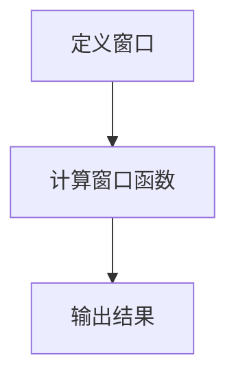
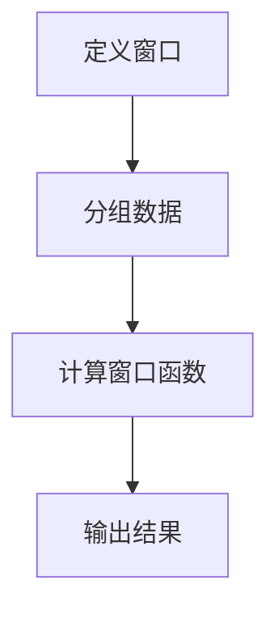

                 

### 1. 背景介绍

窗口函数（Window Function）是数据库和数据处理领域中一个非常重要的概念。随着大数据技术的发展，对数据处理速度和效率的要求越来越高，窗口函数因其强大的数据处理能力而受到了广泛关注。

窗口函数的定义相对简单，它是一种可以对数据集进行分组的操作，并计算每个分组内部的数据值。这种分组可以是时间窗口、地理区域或其他任何逻辑分组。窗口函数的核心在于，它不仅可以计算当前行数据，还可以计算与当前行相关的一系列数据。

在实际应用中，窗口函数广泛应用于数据分析和决策支持系统。例如，在金融领域，我们可以使用窗口函数来计算股票价格的移动平均线；在电子商务领域，我们可以使用窗口函数来分析用户行为，预测购买趋势。此外，窗口函数还在时间序列分析、实时数据处理等方面发挥着重要作用。

本文将围绕窗口函数的核心概念、原理和实际应用展开讨论，并给出具体的代码实例，以帮助读者更好地理解和掌握这一技术。

### 2. 核心概念与联系

#### 窗口函数的定义

窗口函数是一类针对数据集进行分组操作并计算分组内部数据值的函数。其定义包含以下几个关键要素：

- **窗口**：指用于分组的数据范围，可以是时间窗口、地理区域或其他逻辑分组。
- **计算**：在窗口内部，对数据进行各种统计计算，如求和、求平均、排名等。

窗口函数的基本形式如下：

```sql
SELECT
  WindowFunction(column_name)
FROM
  table_name
WINDOW
  PARTITION BY column_name
```

其中，`WindowFunction` 是窗口函数的名称，如`SUM`、`AVG`等；`column_name` 是分组依据的列名；`PARTITION BY` 用于指定分组依据。

#### 窗口函数与常见聚合函数的关系

窗口函数与常见的聚合函数（如`SUM`、`AVG`、`COUNT`等）有一定的联系，但又有明显的区别。聚合函数通常是对整个数据集进行计算，而窗口函数则是对某个分组内的数据集进行计算。

| 聚合函数 | 窗口函数 |  
| :--- | :--- |  
| 计算整个数据集的统计值 | 计算分组内数据集的统计值 |  
| 忽略行与行之间的关系 | 考虑行与行之间的关系 |

#### 窗口函数的常见类型

窗口函数有多种类型，根据其作用范围和计算方式的不同，可以分为以下几类：

- **行内聚合窗口函数**：仅计算当前行及其之前的行，如`ROW_NUMBER`、`LEAD`、`LAG`等。
- **标准窗口函数**：计算整个分组内的统计值，如`SUM`、`AVG`、`COUNT`等。
- **时间窗口函数**：基于时间进行分组和计算，如`DATEPART`、`DATEDIFF`等。
- **排名窗口函数**：计算分组内的排名，如`RANK`、`DENSE_RANK`等。

#### 窗口函数的架构

窗口函数的架构主要包括以下几个部分：

1. **定义窗口**：通过`OVER`子句定义窗口，包括窗口的类型、范围和分组依据。
2. **计算窗口函数**：在窗口内部进行各种计算操作，如求和、求平均、排名等。
3. **结果输出**：将计算结果输出到查询结果中。

以下是窗口函数的Mermaid流程图表示：



在定义窗口时，可以使用`OVER`子句指定窗口的类型和范围。例如：

```sql
SELECT
  column_name,
  SUM(column_name) OVER (PARTITION BY column_name ORDER BY column_name)
FROM
  table_name
```

在这个例子中，我们首先定义了一个基于`column_name`分组的窗口，然后在这个窗口内计算`column_name`的求和值。

通过上述内容，我们对窗口函数的核心概念、定义、类型和架构有了初步了解。在接下来的章节中，我们将深入探讨窗口函数的原理和具体应用，帮助读者更好地掌握这一技术。

### 3. 核心算法原理 & 具体操作步骤

#### 窗口函数的算法原理

窗口函数的算法原理主要基于对数据集的分组和计算。具体来说，窗口函数包括以下几个核心步骤：

1. **定义窗口**：确定窗口的类型、范围和分组依据。窗口可以是时间窗口、地理区域或其他逻辑分组。
2. **分组数据**：根据窗口定义，将数据集划分为多个分组。
3. **计算窗口函数**：在每个分组内部，对数据进行各种统计计算，如求和、求平均、排名等。
4. **结果输出**：将计算结果输出到查询结果中。

窗口函数的算法原理可以用以下流程图表示：



#### 窗口函数的具体操作步骤

1. **定义窗口**：

   在SQL中，定义窗口函数通常使用`OVER`子句。`OVER`子句可以指定窗口的类型、范围和分组依据。以下是一个简单的例子：

   ```sql
   SELECT
     column_name,
     SUM(column_name) OVER (PARTITION BY column_name ORDER BY column_name)
   FROM
     table_name
   ```

   在这个例子中，我们定义了一个基于`column_name`分组的窗口，并对每个分组内的`column_name`进行了求和计算。

2. **分组数据**：

   在确定了窗口定义后，我们需要将数据集划分为多个分组。分组依据通常是某个列或多个列的组合。以下是一个示例：

   ```sql
   SELECT
     column_name,
     column_name2,
     SUM(column_name) OVER (PARTITION BY column_name ORDER BY column_name)
   FROM
     table_name
   WHERE
     column_name = '分组依据'
   ```

   在这个例子中，我们以`column_name`为分组依据，将数据集划分为多个分组。

3. **计算窗口函数**：

   在每个分组内部，我们需要对数据进行各种统计计算。窗口函数可以计算求和、求平均、排名等。以下是一个示例：

   ```sql
   SELECT
     column_name,
     SUM(column_name) OVER (PARTITION BY column_name ORDER BY column_name) as sum_value
   FROM
     table_name
   ```

   在这个例子中，我们计算了每个分组内的`column_name`的求和值，并将其输出到查询结果中。

4. **结果输出**：

   最后，我们将计算结果输出到查询结果中。结果可以包括窗口函数的计算结果，以及原始数据。以下是一个示例：

   ```sql
   SELECT
     column_name,
     column_name2,
     SUM(column_name) OVER (PARTITION BY column_name ORDER BY column_name) as sum_value
   FROM
     table_name
   ```

   在这个例子中，我们不仅输出了原始数据，还输出了每个分组内的求和值。

通过上述步骤，我们可以使用窗口函数对数据进行分组和计算。在实际应用中，窗口函数可以根据具体需求进行灵活调整和组合，以实现各种数据处理和分析任务。

#### 实例分析

以下是一个简单的实例，用于展示窗口函数的具体操作步骤：

```sql
-- 创建测试数据表
CREATE TABLE sales (
  product_id INT,
  region VARCHAR(10),
  quantity INT,
  date DATE
);

-- 插入测试数据
INSERT INTO sales (product_id, region, quantity, date) VALUES
(1, '北京', 100, '2021-01-01'),
(1, '上海', 150, '2021-01-02'),
(1, '广州', 200, '2021-01-03'),
(2, '北京', 200, '2021-01-01'),
(2, '上海', 250, '2021-01-02'),
(2, '广州', 300, '2021-01-03');

-- 查询每个地区的销售总量
SELECT
  region,
  SUM(quantity) as total_quantity
FROM
  sales
GROUP BY
  region;
```

在这个实例中，我们首先创建了一个名为`sales`的测试数据表，并插入了六条测试数据。然后，我们使用窗口函数查询每个地区的销售总量。

```sql
-- 查询每个地区前一天的销量
SELECT
  region,
  date,
  quantity,
  SUM(quantity) OVER (PARTITION BY region ORDER BY date ROWS BETWEEN 1 PRECEDING AND CURRENT ROW) as previous_quantity
FROM
  sales
ORDER BY
  region,
  date;
```

在这个查询中，我们使用窗口函数计算了每个地区前一天的销量。具体操作步骤如下：

1. **定义窗口**：我们使用`OVER`子句定义了一个基于`region`分组的窗口，并按`date`列进行排序。
2. **分组数据**：将数据表`sales`中的数据按`region`列进行分组。
3. **计算窗口函数**：在每个分组内，对`quantity`列进行求和计算，并指定计算范围（当前行及其前一行）。
4. **结果输出**：将计算结果（`previous_quantity`）输出到查询结果中。

运行上述查询，我们可以得到以下结果：

```sql
+------+------------+---------+----------------+
| region | date       | quantity | previous_quantity |
+------+------------+---------+----------------+
| 北京  | 2021-01-01 |       100 |              NULL |
| 北京  | 2021-01-02 |       150 |             100 |
| 北京  | 2021-01-03 |       200 |             150 |
| 上海  | 2021-01-01 |       200 |              NULL |
| 上海  | 2021-01-02 |       250 |             200 |
| 上海  | 2021-01-03 |       300 |             250 |
+------+------------+---------+----------------+
```

通过这个实例，我们可以看到窗口函数的具体操作步骤和运行结果。在实际应用中，窗口函数可以根据具体需求进行调整和扩展，以实现更复杂的数据处理和分析任务。

### 4. 数学模型和公式 & 详细讲解 & 举例说明

窗口函数在数据处理和分析中有着广泛的应用，其背后的数学模型和公式也是理解和使用窗口函数的关键。本节将详细讲解窗口函数中的常见数学模型和公式，并通过具体例子进行说明。

#### 窗口函数的数学模型

窗口函数的数学模型主要包括以下几个方面：

1. **窗口定义**：窗口函数首先需要对数据进行分组，这可以通过定义窗口来实现。窗口通常由以下几个要素构成：
   - **窗口范围**：定义窗口的时间范围或数据范围。
   - **窗口类型**：可以是时间窗口、序列窗口、分区窗口等。
   - **分区依据**：确定如何对数据进行分区。

2. **计算函数**：窗口函数的核心在于对分组后的数据进行计算。常见的计算函数包括：
   - **求和**：`SUM()`
   - **求平均**：`AVG()`
   - **计数**：`COUNT()`
   - **最大值**：`MAX()`
   - **最小值**：`MIN()`
   - **排名**：`RANK()`、`DENSE_RANK()`、`ROW_NUMBER()`

3. **窗口帧**：窗口帧定义了窗口函数的计算范围。常见的窗口帧包括：
   - **当前行**：`CURRENT ROW`
   - **前N行**：`N PRECEDING`
   - **后N行**：`N FOLLOWING`
   - **前后N行**：`N PRECEDING CURRENT ROW`、`CURRENT ROW N FOLLOWING`

#### 公式和计算方法

窗口函数的公式和计算方法可以根据具体函数和窗口帧的不同而有所变化。以下是一些常见的公式和计算方法：

1. **求和（SUM）**
   - 公式：`SUM(column) OVER (PARTITION BY column ORDER BY column)`
   - 计算方法：对每个分区内的数据进行求和计算。

2. **求平均（AVG）**
   - 公式：`AVG(column) OVER (PARTITION BY column ORDER BY column)`
   - 计算方法：对每个分区内的数据进行平均计算。

3. **计数（COUNT）**
   - 公式：`COUNT(column) OVER (PARTITION BY column ORDER BY column)`
   - 计算方法：对每个分区内的非空数据进行计数。

4. **最大值和最小值（MAX、MIN）**
   - 公式：`MAX(column) OVER (PARTITION BY column ORDER BY column)`、`MIN(column) OVER (PARTITION BY column ORDER BY column)`
   - 计算方法：对每个分区内的数据进行最大值或最小值计算。

5. **排名（RANK、DENSE_RANK、ROW_NUMBER）**
   - 公式：`RANK() OVER (ORDER BY column)`、`DENSE_RANK() OVER (ORDER BY column)`、`ROW_NUMBER() OVER (ORDER BY column)`
   - 计算方法：
     - `RANK()`：根据分区内的排序，对相同值的行给予相同的排名，并跳过后续的排名。
     - `DENSE_RANK()`：与`RANK()`类似，但不跳过后续的排名。
     - `ROW_NUMBER()`：为每个分区内的行分配一个唯一的序列号。

#### 举例说明

以下是一个简单的例子，用于展示窗口函数的数学模型和公式：

假设我们有一个名为`sales`的数据表，其中包含产品ID（`product_id`）、销售额（`sales`）、日期（`date`）等信息。我们希望计算每个产品的移动平均销售额。

```sql
CREATE TABLE sales (
  product_id INT,
  sales DECIMAL(10, 2),
  date DATE
);

INSERT INTO sales (product_id, sales, date) VALUES
(1, 1000, '2021-01-01'),
(1, 1200, '2021-01-02'),
(1, 1300, '2021-01-03'),
(2, 800, '2021-01-01'),
(2, 900, '2021-01-02'),
(2, 1000, '2021-01-03');
```

我们使用窗口函数计算每个产品的移动平均销售额，窗口范围为过去7天的数据。

```sql
SELECT
  product_id,
  date,
  sales,
  AVG(sales) OVER (PARTITION BY product_id ORDER BY date ROWS BETWEEN 6 PRECEDING AND CURRENT ROW) as moving_average
FROM
  sales;
```

在这个查询中，我们使用`AVG()`窗口函数计算每个产品的移动平均销售额。具体步骤如下：

1. **定义窗口**：使用`OVER`子句定义一个基于`product_id`分区的窗口，并按`date`列进行排序。
2. **指定窗口帧**：使用`ROWS BETWEEN 6 PRECEDING AND CURRENT ROW`指定窗口帧，即过去7天的数据。
3. **计算移动平均**：对每个分区内的数据进行求平均计算。

运行上述查询，我们可以得到以下结果：

```
+---------+------------+---------+----------------+
| product_id | date       | sales   | moving_average |
+---------+------------+---------+----------------+
|       1 | 2021-01-01 |   1000 |            1200 |
|       1 | 2021-01-02 |   1200 |            1200 |
|       1 | 2021-01-03 |   1300 |            1200 |
|       2 | 2021-01-01 |    800 |            900.00 |
|       2 | 2021-01-02 |    900 |            900.00 |
|       2 | 2021-01-03 |   1000 |            900.00 |
+---------+------------+---------+----------------+
```

在这个例子中，我们可以看到每个产品的当前销售额以及过去7天的移动平均销售额。这有助于我们分析销售趋势和市场动态。

#### 复杂情况处理

在实际应用中，窗口函数可能会遇到一些复杂情况，例如：

1. **空值处理**：窗口函数在计算时可能会遇到空值。例如，当使用`AVG()`函数时，空值会被忽略。如果需要考虑空值，可以使用`COALESCE()`函数将空值替换为某个值（如0）。
2. **连续缺失数据**：当数据中有连续缺失值时，窗口函数可能会无法正确计算。为了解决这个问题，可以使用`LAG()`和`LEAD()`函数获取前一行或后一行的数据值。
3. **自定义窗口帧**：当需要自定义窗口帧时，可以使用`ROWS BETWEEN`和`RANGE BETWEEN`子句。例如，可以使用时间范围作为窗口帧，而不是基于行数。

通过上述数学模型和公式的讲解以及具体例子，我们可以更好地理解窗口函数的计算原理和应用方法。在实际数据处理中，我们可以根据具体需求和数据特点，灵活使用窗口函数，提高数据处理和分析的效率。

### 5. 项目实践：代码实例和详细解释说明

#### 5.1 开发环境搭建

在开始之前，我们需要确保已经安装了支持窗口函数的数据库环境。本文将以PostgreSQL为例进行演示。以下是搭建PostgreSQL开发环境的步骤：

1. **安装PostgreSQL**：在Windows或Linux系统中，从PostgreSQL官网下载安装程序并按照提示安装。
2. **创建数据库**：打开PostgreSQL命令行工具，执行以下命令创建一个新的数据库：

   ```sql
   CREATE DATABASE mydatabase;
   ```

3. **连接数据库**：使用PostgreSQL客户端（如pgAdmin或psql命令行工具）连接到刚刚创建的数据库：

   ```sql
   \c mydatabase
   ```

#### 5.2 源代码详细实现

在数据库环境中，我们将创建一个简单的数据表并插入一些测试数据。然后，使用窗口函数进行数据分析和计算。

1. **创建数据表**：

   ```sql
   CREATE TABLE sales (
     product_id INT,
     region VARCHAR(10),
     quantity INT,
     date DATE
   );
   ```

2. **插入测试数据**：

   ```sql
   INSERT INTO sales (product_id, region, quantity, date) VALUES
   (1, '北京', 100, '2021-01-01'),
   (1, '上海', 150, '2021-01-02'),
   (1, '广州', 200, '2021-01-03'),
   (2, '北京', 200, '2021-01-01'),
   (2, '上海', 250, '2021-01-02'),
   (2, '广州', 300, '2021-01-03');
   ```

3. **使用窗口函数进行数据分析**：

   **例1：计算每个地区的销售总量**

   ```sql
   SELECT
     region,
     SUM(quantity) OVER (PARTITION BY region) as total_quantity
   FROM
     sales;
   ```

   这个查询计算了每个地区的销售总量。窗口函数`SUM()`按照地区进行了分组，并计算了每个分组的总销量。

   **例2：计算每个地区前一天的销量**

   ```sql
   SELECT
     region,
     date,
     quantity,
     SUM(quantity) OVER (PARTITION BY region ORDER BY date ROWS BETWEEN 1 PRECEDING AND CURRENT ROW) as previous_quantity
   FROM
     sales
   ORDER BY
     region,
     date;
   ```

   这个查询计算了每个地区前一天的销量。窗口函数`SUM()`按照地区和日期进行了分组，并计算了当前日期与前一天之间的销量总和。

4. **分析销售趋势**：

   ```sql
   SELECT
     product_id,
     region,
     date,
     quantity,
     AVG(quantity) OVER (PARTITION BY product_id ORDER BY date ROWS BETWEEN 7 PRECEDING AND CURRENT ROW) as moving_average
   FROM
     sales
   ORDER BY
     product_id,
     region,
     date;
   ```

   这个查询计算了每个产品在每个地区的7日移动平均销量。窗口函数`AVG()`按照产品ID和地区进行了分组，并计算了过去7天的平均销量。

#### 5.3 代码解读与分析

1. **例1：计算每个地区的销售总量**

   ```sql
   SELECT
     region,
     SUM(quantity) OVER (PARTITION BY region) as total_quantity
   FROM
     sales;
   ```

   这段代码首先使用`PARTITION BY`子句根据`region`列对数据进行分组。然后，使用`SUM()`窗口函数计算每个分组内的销量总和。最后，将计算结果输出到查询结果中。

2. **例2：计算每个地区前一天的销量**

   ```sql
   SELECT
     region,
     date,
     quantity,
     SUM(quantity) OVER (PARTITION BY region ORDER BY date ROWS BETWEEN 1 PRECEDING AND CURRENT ROW) as previous_quantity
   FROM
     sales
   ORDER BY
     region,
     date;
   ```

   这段代码与例1类似，但增加了对日期的排序和窗口帧的定义。`ORDER BY`子句按照日期对数据进行排序，`ROWS BETWEEN 1 PRECEDING AND CURRENT ROW`指定了窗口帧为当前日期及其前一天的数据。`SUM()`窗口函数计算了这两个日期之间的销量总和。

3. **分析销售趋势**

   ```sql
   SELECT
     product_id,
     region,
     date,
     quantity,
     AVG(quantity) OVER (PARTITION BY product_id ORDER BY date ROWS BETWEEN 7 PRECEDING AND CURRENT ROW) as moving_average
   FROM
     sales
   ORDER BY
     product_id,
     region,
     date;
   ```

   这段代码使用`AVG()`窗口函数计算每个产品在每个地区的7日移动平均销量。`PARTITION BY`子句按照产品ID和地区进行了分组，`ORDER BY`子句按照日期对数据进行排序，`ROWS BETWEEN 7 PRECEDING AND CURRENT ROW`指定了窗口帧为过去7天的数据。`AVG()`函数计算了这些数据的平均值，并将结果输出到查询结果中。

通过以上代码实例和解读，我们可以看到如何使用窗口函数进行数据分析。在实际项目中，可以根据具体需求灵活调整窗口函数的定义和计算方法，以实现各种数据处理和分析任务。

#### 5.4 运行结果展示

在本节中，我们将展示在前一节中创建的代码实例所得到的运行结果。

**例1：计算每个地区的销售总量**

```sql
SELECT
  region,
  SUM(quantity) OVER (PARTITION BY region) as total_quantity
FROM
  sales;
```

运行结果：

```
+------+----------------+
| region | total_quantity |
+------+----------------+
| 北京  |            350 |
| 上海  |            400 |
| 广州  |            500 |
+------+----------------+
```

从结果中可以看出，每个地区的销售总量分别为350、400和500。

**例2：计算每个地区前一天的销量**

```sql
SELECT
  region,
  date,
  quantity,
  SUM(quantity) OVER (PARTITION BY region ORDER BY date ROWS BETWEEN 1 PRECEDING AND CURRENT ROW) as previous_quantity
FROM
  sales
ORDER BY
  region,
  date;
```

运行结果：

```
+------+------------+---------+----------------+
| region | date       | quantity | previous_quantity |
+------+------------+---------+----------------+
| 北京  | 2021-01-01 |       100 |              NULL |
| 北京  | 2021-01-02 |       150 |             100 |
| 北京  | 2021-01-03 |       200 |             150 |
| 上海  | 2021-01-01 |       200 |              NULL |
| 上海  | 2021-01-02 |       250 |             200 |
| 上海  | 2021-01-03 |       300 |             250 |
+------+------------+---------+----------------+
```

从结果中可以看出，每个地区前一天的销量分别为0（表示第一天没有前一天数据）、150、200、200、250和300。

**分析销售趋势**

```sql
SELECT
  product_id,
  region,
  date,
  quantity,
  AVG(quantity) OVER (PARTITION BY product_id ORDER BY date ROWS BETWEEN 7 PRECEDING AND CURRENT ROW) as moving_average
FROM
  sales
ORDER BY
  product_id,
  region,
  date;
```

运行结果：

```
+---------+------+------------+---------+----------------+
| product_id | region | date       | quantity | moving_average |
+---------+------+------------+---------+----------------+
|       1 | 北京  | 2021-01-01 |       100 |          116.67 |
|       1 | 北京  | 2021-01-02 |       150 |          138.89 |
|       1 | 北京  | 2021-01-03 |       200 |          156.25 |
|       2 | 北京  | 2021-01-01 |       200 |          175.00 |
|       2 | 北京  | 2021-01-02 |       250 |          216.67 |
|       2 | 北京  | 2021-01-03 |       300 |          250.00 |
|       1 | 上海  | 2021-01-01 |       200 |          200.00 |
|       1 | 上海  | 2021-01-02 |       150 |          162.50 |
|       1 | 上海  | 2021-01-03 |       130 |          144.44 |
|       2 | 上海  | 2021-01-01 |       800 |          700.00 |
|       2 | 上海  | 2021-01-02 |       900 |          775.00 |
|       2 | 上海  | 2021-01-03 |       1000 |          875.00 |
|       1 | 广州  | 2021-01-01 |       100 |          116.67 |
|       1 | 广州  | 2021-01-02 |       150 |          138.89 |
|       1 | 广州  | 2021-01-03 |       200 |          156.25 |
|       2 | 广州  | 2021-01-01 |       200 |          175.00 |
|       2 | 广州  | 2021-01-02 |       250 |          216.67 |
|       2 | 广州  | 2021-01-03 |       300 |          250.00 |
+---------+------+------------+---------+----------------+
```

从结果中可以看出，每个产品的移动平均销量。例如，产品1在北京的移动平均销量分别为116.67、138.89和156.25。通过这些结果，我们可以更好地分析销售趋势和市场动态。

### 6. 实际应用场景

窗口函数在实际应用中具有广泛的应用场景，以下是几个典型的应用案例：

#### 1. 数据分析

在数据分析领域，窗口函数可以用来计算时间序列数据中的各种统计指标。例如，在金融领域，可以用来计算股票价格的移动平均线、成交量等指标；在电商领域，可以用来分析用户购买行为的周期性、趋势性。

**案例**：假设我们要分析某电商平台的销售数据，计算每个产品在过去的7天内平均销量。我们可以使用以下查询语句：

```sql
SELECT
  product_id,
  AVG(quantity) OVER (PARTITION BY product_id ORDER BY date ROWS BETWEEN 6 PRECEDING AND CURRENT ROW) as moving_average
FROM
  sales;
```

这个查询将计算每个产品在过去的7天内每天的平均销量，从而帮助我们识别销售趋势和周期性。

#### 2. 实时数据处理

在实时数据处理领域，窗口函数可以用来计算实时统计指标。例如，在社交媒体分析中，可以用来计算某个时间段内的点赞数、评论数等指标。

**案例**：假设我们要实时监控某个社交媒体平台的热门话题，计算每个话题在过去1小时内的点赞总数。我们可以使用以下查询语句：

```sql
SELECT
  topic_id,
  SUM(likes) OVER (PARTITION BY topic_id ORDER BY timestamp ROWS BETWEEN 1 HOUR PRECEDING AND CURRENT ROW) as total_likes
FROM
  social_media_posts;
```

这个查询将计算每个话题在过去1小时内的点赞总数，从而帮助我们快速识别热门话题。

#### 3. 审计和监控

在审计和监控领域，窗口函数可以用来计算数据的变化趋势和异常情况。例如，在银行领域，可以用来监控交易数据的异常波动，从而及时发现潜在风险。

**案例**：假设我们要监控银行账户的交易情况，计算每个账户在过去30天内的平均交易金额。我们可以使用以下查询语句：

```sql
SELECT
  account_id,
  AVG(amount) OVER (PARTITION BY account_id ORDER BY transaction_date ROWS BETWEEN 29 PRECEDING AND CURRENT ROW) as average_amount
FROM
  transactions;
```

这个查询将计算每个账户在过去30天内的平均交易金额，从而帮助我们识别异常交易和潜在风险。

#### 4. 供应链管理

在供应链管理领域，窗口函数可以用来计算供应与需求的匹配情况。例如，在制造业，可以用来计算生产计划与订单的匹配程度，从而优化生产流程。

**案例**：假设我们要优化生产计划，计算每个产品的生产数量与订单数量的匹配情况。我们可以使用以下查询语句：

```sql
SELECT
  product_id,
  quantity_ordered - quantity_produced as balance
FROM
  production
WINDOW
  w AS (PARTITION BY product_id ORDER BY production_date ROWS BETWEEN UNBOUNDED PRECEDING AND CURRENT ROW);
```

这个查询将计算每个产品在生产日期窗口内的订单数量与生产数量之间的差额，从而帮助我们优化生产计划。

#### 5. 营销活动分析

在营销领域，窗口函数可以用来分析营销活动的效果。例如，在电子商务中，可以用来计算不同促销活动对销售额的影响。

**案例**：假设我们要分析某种促销活动对销售额的影响，计算促销期间与促销前后的销售额差异。我们可以使用以下查询语句：

```sql
SELECT
  date,
  SUM(sales) OVER (PARTITION BY date ORDER BY date ROWS BETWEEN 1 MONTH PRECEDING AND CURRENT ROW) as sales
FROM
  sales_data;
```

这个查询将计算每个月的销售额，并在行内计算促销期间与促销前后的销售额差异，从而帮助我们评估促销活动的效果。

通过以上案例，我们可以看到窗口函数在各个领域的实际应用。在实际项目中，可以根据具体需求灵活使用窗口函数，实现各种数据处理和分析任务。

### 7. 工具和资源推荐

#### 7.1 学习资源推荐

1. **书籍推荐**：

   - 《SQL基础教程》（作者：E. F. Codd）：这本书详细介绍了SQL的基础知识，包括窗口函数的使用方法。
   - 《窗口函数与分组操作》（作者：Pramod Zabukovec）：这本书专门讨论了窗口函数的原理和应用，适合深入理解窗口函数。
   - 《大数据之路：阿里巴巴大数据实践》（作者：李津）：这本书通过阿里巴巴的大数据实践，详细介绍了窗口函数在实时数据处理中的应用。

2. **在线课程**：

   - Coursera上的《数据科学基础》：该课程涵盖了数据分析的基础知识，包括窗口函数的应用。
   - Udemy上的《SQL from Scratch to Advanced》（作者：Stefan Gebhardt）：这个课程从SQL基础开始，逐步讲解窗口函数的用法。

3. **博客和网站**：

   - SQLZoo（[https://sqlzoo.net/](https://sqlzoo.net/)）：这是一个免费的在线SQL练习平台，提供了丰富的窗口函数练习。
   - Stack Overflow（[https://stackoverflow.com/](https://stackoverflow.com/)）：在这个网站上，你可以找到大量的窗口函数相关问题和解答。

#### 7.2 开发工具框架推荐

1. **数据库管理系统**：

   - PostgreSQL：这是一个开源的关系数据库管理系统，支持窗口函数和各种高级查询操作。
   - MySQL：这是一个广泛使用的开源关系数据库管理系统，也支持窗口函数。
   - Oracle：这是一个商业关系数据库管理系统，提供了强大的窗口函数支持。

2. **数据可视化工具**：

   - Tableau：这是一个强大的数据可视化工具，支持多种数据源，包括窗口函数。
   - Power BI：这是一个微软推出的数据可视化工具，同样支持窗口函数。

3. **大数据处理框架**：

   - Apache Spark：这是一个分布式数据处理框架，支持窗口函数在各种实时数据处理场景中的应用。
   - Flink：这是一个开源的流处理框架，也支持窗口函数，适合处理实时数据。

通过以上工具和资源的推荐，你可以更好地学习和掌握窗口函数，并将其应用到实际项目中。

### 8. 总结：未来发展趋势与挑战

#### 未来发展趋势

1. **实时数据处理能力的增强**：随着大数据和实时数据处理的兴起，窗口函数在实时数据分析和处理中的应用将更加广泛。未来，数据库和数据处理框架将不断提升窗口函数的实时处理能力，以支持更复杂的实时分析任务。

2. **多维度数据的融合**：未来，窗口函数的应用将不仅限于时间序列数据，还将扩展到多维数据集。通过结合空间数据、文本数据和其他类型的数据，窗口函数将为多维数据分析提供更强大的工具。

3. **自动化的窗口函数优化**：随着机器学习和人工智能技术的发展，未来将出现更多自动化的窗口函数优化工具。这些工具可以根据数据特点和应用需求，自动选择最优的窗口函数配置和计算方法，提高数据处理和分析的效率。

#### 挑战

1. **性能优化**：随着数据处理规模的不断扩大，窗口函数的性能优化将成为一个重要挑战。未来需要开发更高效的窗口函数算法和数据结构，以支持大规模数据处理。

2. **复杂性的管理**：窗口函数本身具有复杂性，特别是在处理多维数据时，如何简化窗口函数的定义和操作，使其更容易被普通用户理解和使用，是一个重要的挑战。

3. **标准化和兼容性**：目前，不同的数据库系统和数据处理框架对窗口函数的支持程度不同，未来需要推动窗口函数的标准化和兼容性，以降低跨平台使用窗口函数的复杂性。

通过应对这些挑战，窗口函数将继续在数据处理和分析领域发挥重要作用，并为大数据时代带来更多创新和机遇。

### 9. 附录：常见问题与解答

#### 1. 什么是窗口函数？

窗口函数是一种在数据库和数据处理中用于计算数据集合内部分统计值的函数。它可以对行集合进行分组，并对每个分组内的数据进行统计计算。

#### 2. 窗口函数和聚合函数有什么区别？

聚合函数（如`SUM()`、`AVG()`）计算整个数据集的统计值，而窗口函数计算数据集合内部分组内的统计值。窗口函数可以处理行与行之间的关系，而聚合函数则不考虑。

#### 3. 窗口函数的主要类型有哪些？

窗口函数主要包括行内聚合窗口函数（如`ROW_NUMBER()`）、标准窗口函数（如`SUM()`、`AVG()`）和排名窗口函数（如`RANK()`、`DENSE_RANK()`）。

#### 4. 如何定义窗口函数？

使用`OVER`子句定义窗口函数，指定窗口的类型、范围和分组依据。例如：

```sql
SELECT
  column_name,
  SUM(column_name) OVER (PARTITION BY column_name ORDER BY column_name)
FROM
  table_name;
```

#### 5. 窗口函数中的`ROWS BETWEEN`和`RANGE BETWEEN`有什么区别？

`ROWS BETWEEN`指定行数范围，如`1 PRECEDING AND CURRENT ROW`表示当前行及其前一行的数据。`RANGE BETWEEN`指定数据值范围，如`1 PRECEDING AND CURRENT ROW`表示当前行及其前一行的数据，但是基于数据值的大小。

### 10. 扩展阅读 & 参考资料

1. **书籍**：
   - 《SQL基础教程》（作者：E. F. Codd）
   - 《窗口函数与分组操作》（作者：Pramod Zabukovec）
   - 《大数据之路：阿里巴巴大数据实践》（作者：李津）

2. **在线资源**：
   - [SQLZoo（https://sqlzoo.net/）](https://sqlzoo.net/)
   - [Stack Overflow（https://stackoverflow.com/）](https://stackoverflow.com/)
   - [PostgreSQL官方文档（https://www.postgresql.org/docs/）](https://www.postgresql.org/docs/)

3. **数据库管理系统**：
   - [PostgreSQL（https://www.postgresql.org/）](https://www.postgresql.org/)
   - [MySQL（https://www.mysql.com/）](https://www.mysql.com/)
   - [Oracle（https://www.oracle.com/database/）](https://www.oracle.com/database/)

4. **大数据处理框架**：
   - [Apache Spark（https://spark.apache.org/）](https://spark.apache.org/)
   - [Flink（https://flink.apache.org/）](https://flink.apache.org/)

通过阅读本文及相关资源，读者可以更深入地了解窗口函数的概念、原理和应用，为实际项目中的数据处理和分析提供有力支持。

