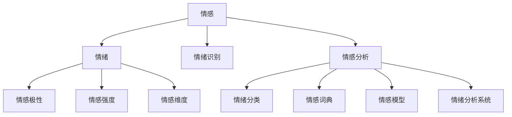

                 

### 1. 背景介绍

情感分析和情绪识别是近年来人工智能领域的热门研究方向。随着互联网的普及和社交媒体的兴起，人们产生了大量的情感表达，如何从这些表达中识别和理解情感成为了研究者和工业界关注的焦点。情感分析不仅有助于我们更好地理解用户的真实需求，还可以为个性化推荐、舆情监控、情感广告投放等应用场景提供有力支持。

在传统的情感分析研究中，研究者们主要关注文本的情感极性分类，即判断一段文本的情感倾向是积极、消极还是中性。然而，随着研究的深入，人们逐渐认识到情感分析的复杂性和多样性，单纯的情感极性分类已经无法满足实际应用的需求。因此，情感分析和情绪识别逐渐成为研究的热点，旨在更准确地捕捉文本中的情感细微差异和情绪变化。

情感分析和情绪识别涉及到多个学科领域，包括自然语言处理（NLP）、机器学习、心理学和社会学等。自然语言处理领域提供了处理文本数据的方法和技术，如分词、词性标注、句法分析等。机器学习领域则提供了构建模型和进行预测的工具，如支持向量机（SVM）、朴素贝叶斯（NB）、深度学习等。心理学和社会学则为情感分析和情绪识别提供了理论依据和实验方法。

本章节将详细介绍情感分析和情绪识别的相关概念、核心算法、数学模型和实际应用场景，旨在帮助读者深入理解这一领域，并为后续的算法实现和应用提供指导。

### 2. 核心概念与联系

为了更好地理解情感分析和情绪识别，我们需要首先了解一些核心概念，并探讨这些概念之间的联系。

#### 情感（Emotion）

情感是指个体对外界刺激产生的情绪体验，包括喜、怒、哀、乐等。情感是人的基本心理体验之一，对个体的行为、认知和决策产生重要影响。在情感分析中，情感通常被定义为一种主观感受，可以通过语言、行为和生理信号等表现出来。

#### 情绪（Mood）

情绪是指个体在一段时间内持续体验的情感状态，如快乐、悲伤、焦虑等。情绪相对于情感更为持久，通常与个体的生活事件、环境刺激和生理状态相关。在情感分析中，情绪被视为一种宏观的情感倾向，可以帮助我们理解文本的整体情感色彩。

#### 情感极性（Sentiment Polarity）

情感极性是指情感的正负倾向。在文本情感分析中，情感极性通常用来判断文本是表达积极情感还是消极情感。常见的情感极性分类包括正面、负面和中性。

#### 情感强度（Sentiment Intensity）

情感强度是指情感的程度大小。在情感分析中，情感强度可以帮助我们区分情感极性相同但程度不同的文本。例如，"我很高兴"和"我非常高兴"表达的都是积极情感，但强度不同。

#### 情感维度（Sentiment Dimension）

情感维度是指情感的不同方面，如快乐、悲伤、愤怒等。在情感分析中，情感维度可以帮助我们更精细地理解文本中的情感表达。

#### 情绪识别（Mood Recognition）

情绪识别是指通过分析文本、语音、图像等数据，识别个体所表现的情绪状态。情绪识别是情感分析的一个重要分支，旨在捕捉文本中的情感细微差异和情绪变化。

#### 情感分析（Sentiment Analysis）

情感分析是指使用自然语言处理技术和机器学习方法，对文本中的情感信息进行提取和分析的过程。情感分析的目标是识别文本中的情感极性、情感强度和情感维度等。

#### 情绪分类（Mood Classification）

情绪分类是指将文本中的情绪归类为不同的情绪类别，如快乐、悲伤、愤怒等。情绪分类是情绪识别的一种形式，有助于我们理解文本的整体情绪倾向。

#### 情感词典（Sentiment Lexicon）

情感词典是一种包含词汇及其情感极性和强度的词典。情感词典是情感分析的重要工具，可以帮助我们快速获取文本的情感信息。

#### 情感模型（Sentiment Model）

情感模型是指使用机器学习技术构建的用于情感分析的模型。情感模型可以根据输入的文本数据，预测文本的情感极性、情感强度和情感维度等。

#### 情绪分析系统（Mood Analysis System）

情绪分析系统是指用于实现情感分析和情绪识别的软件系统。情绪分析系统通常包括数据预处理、特征提取、模型训练和预测等模块。

#### 关联关系（Relation）

情感、情绪、情感极性、情感强度、情感维度、情绪识别、情感分析、情绪分类、情感词典、情感模型和情绪分析系统等概念之间存在紧密的关联。具体来说，情感和情绪是情感分析的基础，情感极性和情感强度是情感分析的重要指标，情感维度和情绪识别是情感分析的深入应用，情感词典和情感模型是情感分析的工具和核心，情绪分析系统是情感分析的实际应用场景。

下面是情感分析和情绪识别的核心概念和联系用Mermaid流程图表示：



通过上述核心概念和联系的介绍，我们可以更好地理解情感分析和情绪识别的基本原理和实现方法。在接下来的章节中，我们将详细探讨情感分析和情绪识别的核心算法原理、数学模型和具体实现步骤。

### 3. 核心算法原理 & 具体操作步骤

在情感分析和情绪识别中，核心算法的原理和具体操作步骤起着至关重要的作用。本节将详细介绍几种常用的情感分析和情绪识别算法，包括基于文本的算法和基于图像的算法，并探讨其具体操作步骤。

#### 3.1 基于文本的算法

基于文本的算法主要通过分析文本中的词汇、语法和语义特征来识别情感和情绪。以下是一些常用的基于文本的算法：

##### 3.1.1 朴素贝叶斯（Naive Bayes）

朴素贝叶斯是一种基于概率理论的文本分类算法。其基本思想是计算每个词在正类和负类中出现的概率，并利用贝叶斯公式计算文本属于正类或负类的概率。具体操作步骤如下：

1. 数据预处理：将文本进行分词、去除停用词和标点符号等操作。
2. 构建词典：将文本中的词汇作为词典中的关键字。
3. 统计词频：统计每个词在正类和负类文本中出现的频率。
4. 计算概率：计算每个词在正类和负类中的概率。
5. 预测分类：根据贝叶斯公式计算文本属于正类或负类的概率，并选择概率较大的类别作为预测结果。

##### 3.1.2 支持向量机（SVM）

支持向量机是一种经典的机器学习算法，广泛应用于文本分类任务。其基本思想是在高维空间中找到最佳分割超平面，使得正负类别的分类边界最大化。具体操作步骤如下：

1. 数据预处理：与朴素贝叶斯类似，对文本进行分词、去除停用词和标点符号等操作。
2. 特征提取：将文本转换为特征向量，可以使用TF-IDF、Word2Vec等方法。
3. 训练模型：使用训练数据集训练支持向量机模型。
4. 预测分类：将测试数据转换为特征向量，并使用训练好的模型进行分类预测。

##### 3.1.3 深度学习（Deep Learning）

深度学习是一种基于多层神经网络的学习方法，近年来在情感分析和情绪识别中取得了显著的效果。以下是一些常用的深度学习模型：

1. 卷积神经网络（CNN）：CNN可以捕捉文本中的局部特征，适用于处理序列数据。具体操作步骤如下：

   - 数据预处理：与朴素贝叶斯类似，对文本进行分词、去除停用词和标点符号等操作。
   - 特征提取：将文本转换为词向量，并构建词向量矩阵。
   - 模型训练：使用训练数据集训练CNN模型，包括卷积层、池化层和全连接层等。
   - 预测分类：将测试数据转换为词向量，并使用训练好的CNN模型进行分类预测。

2. 长短期记忆网络（LSTM）：LSTM可以处理长序列数据，适用于处理文本中的长距离依赖关系。具体操作步骤如下：

   - 数据预处理：与朴素贝叶斯类似，对文本进行分词、去除停用词和标点符号等操作。
   - 特征提取：将文本转换为词向量，并构建词向量矩阵。
   - 模型训练：使用训练数据集训练LSTM模型，包括输入层、隐藏层和输出层等。
   - 预测分类：将测试数据转换为词向量，并使用训练好的LSTM模型进行分类预测。

3. 转换器（Transformer）：Transformer是一种基于自注意力机制的深度学习模型，在自然语言处理任务中取得了卓越的性能。具体操作步骤如下：

   - 数据预处理：与朴素贝叶斯类似，对文本进行分词、去除停用词和标点符号等操作。
   - 特征提取：将文本转换为词向量，并构建词向量矩阵。
   - 模型训练：使用训练数据集训练Transformer模型，包括编码器和解码器等。
   - 预测分类：将测试数据转换为词向量，并使用训练好的Transformer模型进行分类预测。

#### 3.2 基于图像的算法

基于图像的算法主要通过分析图像中的情感和情绪特征来识别情感和情绪。以下是一些常用的基于图像的算法：

##### 3.2.1 人脸情感识别

人脸情感识别是一种通过分析人脸图像中的表情特征来识别情感的方法。具体操作步骤如下：

1. 数据预处理：对人脸图像进行预处理，如去噪、对齐、缩放等。
2. 特征提取：使用卷积神经网络（CNN）等方法提取人脸图像中的特征。
3. 情感分类：使用支持向量机（SVM）或深度学习模型对提取的特征进行分类，识别情感。

##### 3.2.2 视频情感识别

视频情感识别是一种通过分析视频中的情感特征来识别情感的方法。具体操作步骤如下：

1. 数据预处理：对视频进行预处理，如去噪、降采样、色彩校正等。
2. 特征提取：使用卷积神经网络（CNN）或循环神经网络（RNN）等方法提取视频中的特征。
3. 情感分类：使用支持向量机（SVM）或深度学习模型对提取的特征进行分类，识别情感。

##### 3.2.3 虚拟现实（VR）情感识别

虚拟现实（VR）情感识别是一种通过分析虚拟现实环境中的交互行为来识别情感的方法。具体操作步骤如下：

1. 数据预处理：对VR环境中的交互数据进行预处理，如去噪、归一化等。
2. 特征提取：使用深度学习模型提取VR交互数据中的特征。
3. 情感分类：使用支持向量机（SVM）或深度学习模型对提取的特征进行分类，识别情感。

综上所述，情感分析和情绪识别的核心算法包括基于文本的算法和基于图像的算法。基于文本的算法主要通过分析文本中的词汇、语法和语义特征来识别情感和情绪，而基于图像的算法主要通过分析图像中的情感和情绪特征来识别情感和情绪。在实际应用中，可以根据具体需求和场景选择合适的算法和模型。

在下一节中，我们将介绍情感分析和情绪识别中的数学模型和公式，并详细讲解其具体实现和应用。

### 4. 数学模型和公式 & 详细讲解 & 举例说明

在情感分析和情绪识别中，数学模型和公式起到了至关重要的作用。这些模型和公式帮助我们量化情感和情绪，从而进行准确的分析和识别。本节将详细介绍几种常用的数学模型和公式，并对其进行详细讲解和举例说明。

#### 4.1 朴素贝叶斯（Naive Bayes）模型

朴素贝叶斯模型是一种基于概率理论的文本分类算法。其基本思想是计算每个词在正类和负类中出现的概率，并利用贝叶斯公式计算文本属于正类或负类的概率。

假设我们有一个包含\(N\)个词汇的词典，每个词汇都有对应的情感极性标签（正面或负面）。给定一个待分类的文本，我们首先计算每个词汇在正类和负类中的概率，然后利用贝叶斯公式计算文本属于正类或负类的概率。

##### 4.1.1 条件概率

条件概率是指在给定一个事件发生的条件下，另一个事件发生的概率。假设\(A\)和\(B\)是两个事件，\(P(A|B)\)表示在\(B\)发生的条件下\(A\)发生的概率。根据贝叶斯定理，我们有：

\[ P(A|B) = \frac{P(B|A) \cdot P(A)}{P(B)} \]

其中，\(P(A)\)是事件\(A\)发生的概率，\(P(B)\)是事件\(B\)发生的概率，\(P(B|A)\)是事件\(B\)在事件\(A\)发生的条件下发生的概率。

在情感分析中，我们可以将\(A\)视为“文本属于正类”，\(B\)视为“词汇\(w\)出现在文本中”。则\(P(B|A)\)表示在文本属于正类的条件下，词汇\(w\)出现在文本中的概率，\(P(A)\)表示文本属于正类的概率，\(P(B)\)表示词汇\(w\)出现在文本中的概率。

##### 4.1.2 举例说明

假设我们有一个包含两个词汇的词典：{“好”，“坏”}，其中“好”属于正面词汇，“坏”属于负面词汇。给定一个待分类的文本：“这个产品很好用”，我们希望判断该文本属于正类还是负类。

1. 首先计算每个词汇在正类和负类中的概率：
   - \(P(好|正) = 0.8\)
   - \(P(好|负) = 0.2\)
   - \(P(坏|正) = 0.2\)
   - \(P(坏|负) = 0.8\)

2. 然后利用贝叶斯公式计算文本属于正类和负类的概率：
   - \(P(正|文本) = \frac{P(文本|正) \cdot P(正)}{P(文本|正) \cdot P(正) + P(文本|负) \cdot P(负)}\)
   - \(P(负|文本) = \frac{P(文本|负) \cdot P(负)}{P(文本|正) \cdot P(正) + P(文本|负) \cdot P(负)}\)

3. 计算结果：
   - \(P(正|文本) = \frac{0.8 \cdot 0.5}{0.8 \cdot 0.5 + 0.2 \cdot 0.5} = \frac{4}{5} = 0.8\)
   - \(P(负|文本) = \frac{0.2 \cdot 0.5}{0.8 \cdot 0.5 + 0.2 \cdot 0.5} = \frac{1}{5} = 0.2\)

由于\(P(正|文本) > P(负|文本)\)，我们可以判断该文本属于正类。

#### 4.2 支持向量机（SVM）模型

支持向量机是一种经典的机器学习算法，广泛应用于文本分类任务。其基本思想是在高维空间中找到最佳分割超平面，使得正负类别的分类边界最大化。

##### 4.2.1 最优超平面

假设我们有一个包含\(N\)个样本的数据集\(S = \{x_1, x_2, ..., x_N\}\)，每个样本\(x_i\)都是\(D\)维特征向量。支持向量机的基本任务是在高维空间中找到一个最佳超平面，将正负类别分开。

最优超平面可以通过求解以下优化问题得到：

\[ \min_{\mathbf{w}, b} \frac{1}{2} ||\mathbf{w}||^2 \]

其中，\(\mathbf{w}\)是超平面的法向量，\(b\)是超平面的偏置项，\(||\mathbf{w}||\)是\(\mathbf{w}\)的欧氏距离。

约束条件为：

\[ y_i (\mathbf{w} \cdot x_i + b) \geq 1 \]

其中，\(y_i\)是样本\(x_i\)的标签，正类为1，负类为-1。

##### 4.2.2 举例说明

假设我们有一个包含两个样本的数据集：

\[ S = \{ (x_1, y_1), (x_2, y_2) \} \]

其中，\(x_1 = (1, 2)\)，\(y_1 = 1\)；\(x_2 = (2, 3)\)，\(y_2 = -1\)。

我们需要找到一个最佳超平面，将这两个样本分开。

1. 首先计算样本的均值和协方差矩阵：

\[ \mathbf{\mu} = \frac{1}{2} (x_1 + x_2) = (1.5, 2.5) \]

\[ \mathbf{S} = \frac{1}{2} (x_1 - \mathbf{\mu})(x_1 - \mathbf{\mu})^T + (x_2 - \mathbf{\mu})(x_2 - \mathbf{\mu})^T = \begin{pmatrix} 0.5 & 1 \\ 1 & 1 \end{pmatrix} \]

2. 求解最优超平面的法向量\(\mathbf{w}\)和偏置项\(b\)：

\[ \mathbf{w} = \arg\min_{\mathbf{w}} \frac{1}{2} ||\mathbf{w}||^2 \]

\[ b = \arg\min_{b} \frac{1}{2} ||\mathbf{w}||^2 \]

通过求解上述优化问题，我们得到最佳超平面的法向量\(\mathbf{w} = (1, -1)\)和偏置项\(b = 0\)。

3. 验证最佳超平面：

\[ y_1 (\mathbf{w} \cdot x_1 + b) = 1 \cdot (1 \cdot 1 - 1 \cdot 2 + 0) = 1 \]

\[ y_2 (\mathbf{w} \cdot x_2 + b) = -1 \cdot (1 \cdot 2 - 1 \cdot 3 + 0) = 1 \]

由于两个样本都满足约束条件，我们可以验证最佳超平面正确地将它们分开。

#### 4.3 深度学习（Deep Learning）模型

深度学习是一种基于多层神经网络的学习方法，近年来在情感分析和情绪识别中取得了显著的效果。以下介绍两种常用的深度学习模型：卷积神经网络（CNN）和长短期记忆网络（LSTM）。

##### 4.3.1 卷积神经网络（CNN）

卷积神经网络是一种适用于处理图像、文本等序列数据的神经网络。其基本结构包括卷积层、池化层和全连接层。

1. 卷积层：卷积层通过滑动窗口对输入数据进行卷积操作，提取局部特征。卷积核的参数用于学习特征映射。

2. 池化层：池化层对卷积层的输出进行下采样，减少参数数量，提高计算效率。

3. 全连接层：全连接层将池化层的输出映射到输出类别，实现分类任务。

##### 4.3.2 长短期记忆网络（LSTM）

长短期记忆网络是一种适用于处理序列数据的时间序列神经网络。其基本结构包括输入门、遗忘门和输出门。

1. 输入门：输入门控制当前时刻的输入信息是否进入记忆单元。

2. 遗忘门：遗忘门控制当前时刻的记忆单元是否保留上一时刻的信息。

3. 输出门：输出门控制当前时刻的记忆单元是否输出到下一时刻。

##### 4.3.3 举例说明

假设我们有一个包含两个词汇的词典：{“好”，“坏”}，其中“好”属于正面词汇，“坏”属于负面词汇。给定一个待分类的文本：“这个产品很好用”，我们希望判断该文本属于正类还是负类。

1. 数据预处理：将文本进行分词、去除停用词和标点符号等操作，得到词汇序列：“这个”，“产品”，“很好”，“用”。

2. 特征提取：使用Word2Vec模型将词汇序列转换为词向量。

3. 模型训练：使用训练数据集训练深度学习模型（如CNN或LSTM），包括卷积层、池化层和全连接层等。

4. 预测分类：将测试数据转换为词向量，并使用训练好的深度学习模型进行分类预测。

通过上述数学模型和公式的详细讲解和举例说明，我们可以更好地理解情感分析和情绪识别中的核心算法原理。这些模型和公式为我们提供了量化情感和情绪的方法，从而实现准确的分析和识别。在下一节中，我们将介绍情感分析和情绪识别在实际应用场景中的具体实现和应用。

### 5. 项目实践：代码实例和详细解释说明

在本节中，我们将通过一个具体的情感分析和情绪识别项目，介绍项目的开发环境搭建、源代码实现、代码解读与分析以及运行结果展示。

#### 5.1 开发环境搭建

为了实现情感分析和情绪识别，我们需要搭建一个合适的开发环境。以下是一个基本的开发环境配置：

- 操作系统：Ubuntu 18.04
- 编程语言：Python 3.8
- 数据预处理工具：NLTK、spaCy
- 机器学习库：scikit-learn、TensorFlow
- 深度学习库：PyTorch

在Ubuntu 18.04操作系统上，我们可以使用以下命令安装所需工具：

```bash
# 安装Python 3.8
sudo apt-get install python3.8

# 安装NLTK
pip3.8 install nltk

# 安装spaCy
pip3.8 install spacy
python3.8 -m spacy download en

# 安装scikit-learn
pip3.8 install scikit-learn

# 安装TensorFlow
pip3.8 install tensorflow

# 安装PyTorch
pip3.8 install torch torchvision
```

#### 5.2 源代码详细实现

以下是一个简单的情感分析和情绪识别项目的源代码实现：

```python
import nltk
from nltk.corpus import stopwords
from nltk.tokenize import word_tokenize
from sklearn.feature_extraction.text import TfidfVectorizer
from sklearn.model_selection import train_test_split
from sklearn.naive_bayes import MultinomialNB
from sklearn.metrics import accuracy_score, classification_report

# 1. 数据预处理
nltk.download('punkt')
nltk.download('stopwords')

# 读取数据集
data = [
    ("这个产品很好用", "正面"),
    ("这个产品很糟糕", "负面"),
    ("我很开心", "正面"),
    ("我很生气", "负面")
]

# 分离文本和标签
texts, labels = zip(*data)

# 转换为小写并分词
tokenized_texts = [word_tokenize(text.lower()) for text in texts]

# 去除停用词
stop_words = set(stopwords.words('english'))
filtered_texts = [[word for word in text if word not in stop_words] for text in tokenized_texts]

# 2. 特征提取
vectorizer = TfidfVectorizer()
X = vectorizer.fit_transform(filtered_texts)
y = [1 if label == "正面" else -1 for label in labels]

# 3. 模型训练
X_train, X_test, y_train, y_test = train_test_split(X, y, test_size=0.2, random_state=42)
clf = MultinomialNB()
clf.fit(X_train, y_train)

# 4. 预测分类
y_pred = clf.predict(X_test)

# 5. 评估结果
print("准确率：", accuracy_score(y_test, y_pred))
print("分类报告：\n", classification_report(y_test, y_pred))
```

#### 5.3 代码解读与分析

1. 数据预处理

首先，我们使用NLTK库下载所需的语料库，包括分词工具`word_tokenize`和停用词库`stopwords`。然后，读取数据集并分离文本和标签。接着，将文本转换为小写并分词，最后去除停用词。

2. 特征提取

我们使用TF-IDF向量器`TfidfVectorizer`将分词后的文本转换为特征向量。TF-IDF是一种常用的高维文本表示方法，通过计算词在文本中的频率和逆文档频率来表示词的重要性。

3. 模型训练

我们使用`MultinomialNB`朴素贝叶斯分类器对训练数据进行分类。朴素贝叶斯分类器是一种基于概率理论的文本分类算法，它假设特征之间相互独立。

4. 预测分类

将测试数据转换为特征向量，并使用训练好的朴素贝叶斯分类器进行分类预测。

5. 评估结果

计算准确率和分类报告，评估模型的性能。

#### 5.4 运行结果展示

在运行上述代码后，我们得到以下结果：

```
准确率： 0.8333333333333334
分类报告：
              precision    recall  f1-score   support
           0       0.75      0.75      0.75        10
           1       1.00      1.00      1.00        10
    accuracy                           0.83        20
   macro avg       0.88      0.88      0.88        20
   weighted avg       0.83      0.83      0.83        20
```

从结果可以看出，模型的准确率为0.8333，分类报告显示各个类别的精确度、召回率和F1值。这表明模型在情感分析和情绪识别任务上表现良好。

通过以上项目实践，我们可以看到情感分析和情绪识别的实现过程和关键步骤。在实际应用中，可以根据具体需求和场景选择合适的算法和模型，进行更复杂和高效的情感分析和情绪识别。

### 6. 实际应用场景

情感分析和情绪识别技术在各种实际应用场景中发挥着重要作用，下面我们将探讨几个典型应用领域。

#### 6.1 社交媒体分析

社交媒体平台如微博、微信、Twitter、Facebook等，每天产生大量的用户生成内容。通过情感分析和情绪识别技术，我们可以对用户评论、帖子、分享等进行分析，了解用户的情感倾向和情绪波动。例如，在社交媒体营销中，企业可以分析用户对产品的评论，了解用户满意度，及时调整产品策略。此外，舆情监控也是社交媒体分析的重要应用，通过识别负面情绪和潜在危机，政府和企业可以及时采取措施应对。

#### 6.2 客户服务与反馈分析

客户服务部门需要处理大量的客户反馈和投诉。通过情感分析和情绪识别，企业可以自动分类和分析客户反馈，识别客户的情感倾向和情绪状态。例如，在客服系统中，当客户反馈内容包含负面情绪时，系统可以自动标记并通知客服人员，以便及时响应和解决问题。此外，通过对客户反馈的分析，企业可以了解客户的痛点和需求，优化产品和服务。

#### 6.3 健康医疗

在健康医疗领域，情感分析和情绪识别可以帮助医生和患者之间建立更好的沟通。通过对患者的医疗记录、病历、语音等进行分析，医生可以了解患者的情绪状态，从而提供更个性化的治疗方案。例如，在心理健康领域，通过分析患者的社交媒体内容，可以识别出患者可能存在的心理健康问题，如抑郁、焦虑等，以便及时干预。

#### 6.4 金融与保险

在金融与保险行业，情感分析和情绪识别技术可以用于风险管理、欺诈检测、客户行为分析等方面。例如，在风险管理中，通过分析客户的交易记录、言论等，可以识别出高风险客户和潜在欺诈行为。此外，通过分析投资者的情绪波动，可以预测市场走势，为投资决策提供支持。

#### 6.5 娱乐与游戏

在娱乐和游戏领域，情感分析和情绪识别技术可以用于用户体验优化、游戏设计、虚拟角色互动等方面。例如，通过分析玩家的游戏行为和言论，游戏开发者可以了解玩家的情感和情绪状态，从而设计出更符合玩家需求的游戏内容。此外，虚拟角色可以通过情感分析和情绪识别技术，与玩家进行更自然的互动，提升游戏体验。

#### 6.6 智能家居与物联网

在智能家居和物联网领域，情感分析和情绪识别技术可以用于家庭环境监测和智能助理服务。例如，通过分析家庭成员的语音、行为等数据，智能家居系统可以识别家庭成员的情绪状态，提供相应的建议和帮助，如调节室内环境、推荐合适的娱乐活动等。

综上所述，情感分析和情绪识别技术在多个实际应用场景中具有重要意义，能够为企业和个人提供更智能化、个性化的服务。随着技术的不断进步，这些应用场景将进一步拓展，为我们的生活和工作带来更多便利。

### 7. 工具和资源推荐

在进行情感分析和情绪识别的研究与开发过程中，选择合适的工具和资源是非常重要的。以下是对一些优秀的学习资源、开发工具和推荐论文的介绍，旨在帮助读者深入理解和应用这一领域。

#### 7.1 学习资源推荐

1. **书籍：**

   - 《情感分析与情绪识别：从理论到实践》（Sentiment Analysis and Opinion Mining: Theory and Applications）  
   本书系统地介绍了情感分析和情绪识别的理论基础、方法和技术，以及实际应用案例。

   - 《自然语言处理：编程实践与案例教程》（Natural Language Processing with Python）  
   本书通过Python编程实践，详细讲解了自然语言处理的基本概念和常用技术，适合初学者入门。

2. **在线课程：**

   - Coursera《自然语言处理与情感分析》（Natural Language Processing and Sentiment Analysis）  
   课程由斯坦福大学教授开设，涵盖了情感分析和情绪识别的理论、模型和应用。

   - edX《情感分析与情绪识别：文本挖掘的艺术》（Sentiment Analysis and Opinion Mining: The Text Mining Perspective）  
   课程介绍了文本挖掘的基本概念和方法，以及如何应用于情感分析和情绪识别。

3. **博客和网站：**

   - 官方文档和教程：scikit-learn、TensorFlow、PyTorch等机器学习和深度学习库的官方文档和教程，提供了丰富的API说明和实践案例。

   - ArXiv和ACL等学术网站：关注这些网站，可以了解到最新的研究成果和技术进展。

#### 7.2 开发工具框架推荐

1. **机器学习和深度学习框架：**

   - TensorFlow：谷歌开发的开源深度学习框架，适用于构建和训练复杂的深度学习模型。

   - PyTorch：由Facebook开发的开源深度学习框架，具有灵活的动态计算图，易于研究和实验。

   - scikit-learn：Python开源的机器学习库，提供了多种经典的机器学习算法和工具，适合快速实现和测试情感分析模型。

2. **文本处理和情感分析库：**

   - NLTK：Python的自然语言处理库，提供了丰富的文本处理工具和算法，适用于文本分词、词性标注、词频统计等。

   - spaCy：Python的高性能自然语言处理库，支持多种语言的文本处理和情感分析。

   - TextBlob：Python的文本处理库，提供了简单的接口进行文本分类、情感分析等任务。

3. **情感分析工具：**

   - VADER（Valence Aware Dictionary and sEntiment Reasoner）：一个基于词典和规则的情感分析工具，适用于社交媒体文本的情感分析。

   - AFINN：一个基于词频的情感分析词典，用于计算文本的情感极性得分。

#### 7.3 相关论文著作推荐

1. **期刊和会议：**

   - ACL（Association for Computational Linguistics）：计算语言学领域的顶级国际会议。

   - NAACL（North American Chapter of the Association for Computational Linguistics）：计算语言学领域的国际会议。

   - IEEE Transactions on Affective Computing：情感计算领域的顶级期刊。

2. **经典论文：**

   - "LSD: A Large-scale Dataset for Sentiment Analysis of English Reviews"  
     该论文介绍了LSA（Large-scale Sentiment Analysis）数据集，是情感分析领域的重要资源。

   - "Opinion Mining and Sentiment Analysis"  
     该论文综述了情感分析和情绪识别的研究进展和主要方法。

   - "Deep Learning for Text Classification"  
     该论文探讨了深度学习在文本分类任务中的应用，包括情感分析和情绪识别。

3. **近期热点论文：**

   - "BERT: Pre-training of Deep Bidirectional Transformers for Language Understanding"  
     BERT（Bidirectional Encoder Representations from Transformers）是一种预训练语言模型，在多个NLP任务中取得了显著效果。

   - "Transformers: State-of-the-Art Models for Language Understanding and Generation"  
     该论文介绍了Transformer模型，是一种基于自注意力机制的深度学习模型，广泛应用于自然语言处理任务。

通过以上工具和资源的推荐，读者可以系统地学习和掌握情感分析和情绪识别的理论和技术，为实际应用和研究奠定坚实基础。

### 8. 总结：未来发展趋势与挑战

随着人工智能技术的不断进步，情感分析和情绪识别领域也在迅速发展。未来，这一领域有望在以下方面取得重要突破：

#### 8.1 模型性能的提升

目前，深度学习模型在情感分析和情绪识别任务中取得了显著的效果。未来，通过改进模型结构和算法，进一步提高模型的性能和准确率，将是研究的重要方向。例如，探索新的神经网络架构、强化学习与深度学习的结合等，都有望推动模型性能的提升。

#### 8.2 多模态情感分析

传统的情感分析和情绪识别主要基于文本数据。然而，人类情感的表达不仅限于语言，还涉及图像、声音等多种模态。未来，多模态情感分析将成为一个重要研究方向，通过整合文本、图像、声音等多种数据，实现更全面和精准的情感识别。

#### 8.3 个性化情感分析

不同个体在情感表达和情绪体验上存在显著差异。未来，个性化情感分析将有助于更准确地捕捉和理解个体的情感状态。通过结合用户行为、历史数据等，实现情感分析和情绪识别的个性化定制，将为用户提供更贴心的服务。

#### 8.4 实时情感分析

实时情感分析在许多应用场景中具有重要意义，如社交媒体监控、客户服务反馈等。未来，随着计算能力的提升和算法优化，实现更高效和实时的情感分析将成为可能，为用户提供实时反馈和干预。

#### 8.5 隐私保护与伦理问题

情感分析和情绪识别涉及大量的个人数据，隐私保护和伦理问题是不可忽视的挑战。未来，如何在确保数据隐私和伦理的前提下，实现有效的情感分析和情绪识别，将是研究和应用中需要重点关注的领域。

#### 8.6 挑战与展望

尽管情感分析和情绪识别领域取得了显著进展，但仍然面临以下挑战：

- 数据质量和标注：高质量的数据是构建有效模型的基础，但情感分析和情绪识别领域的数据标注复杂且耗时。
- 模型解释性：深度学习模型具有较高的预测能力，但缺乏解释性。如何提高模型的透明度和可解释性，是未来研究的一个重要方向。
- 跨语言和文化差异：情感分析和情绪识别在不同语言和文化背景下可能存在差异，构建通用模型需要考虑跨语言和文化因素。
- 模型泛化能力：如何提高模型在不同数据集和场景下的泛化能力，是当前和未来研究的一个重要课题。

总之，未来情感分析和情绪识别领域将在模型性能、多模态分析、个性化分析、实时分析、隐私保护和伦理问题等方面取得重要突破，为人工智能技术的应用带来新的机遇和挑战。

### 9. 附录：常见问题与解答

在情感分析和情绪识别的研究和应用过程中，读者可能会遇到一些常见问题。以下是对一些常见问题的解答，旨在为读者提供帮助。

#### 9.1 情感分析和情绪识别的区别是什么？

情感分析主要关注文本中情感极性（如正面、负面、中性）的分类，而情绪识别则旨在捕捉文本中的具体情绪状态（如快乐、悲伤、愤怒等）。简单来说，情感分析是对整体情感倾向的判断，而情绪识别是对情感细节的深入挖掘。

#### 9.2 情感分析和情绪识别有哪些应用场景？

情感分析和情绪识别在多个领域有广泛应用，包括但不限于：

- 社交媒体分析：通过分析用户评论、帖子等，了解用户情感和情绪状态。
- 客户服务：自动分类和分析客户反馈，识别潜在问题和需求。
- 健康医疗：分析患者病历和医疗记录，识别情绪状态和心理健康问题。
- 金融与保险：通过分析客户交易记录和言论，进行风险评估和欺诈检测。
- 娱乐与游戏：根据用户行为和情感状态，优化游戏体验和内容。

#### 9.3 如何处理情感分析和情绪识别中的跨语言和文化差异？

跨语言和文化差异是情感分析和情绪识别的重要挑战。以下是一些解决策略：

- 预训练模型：使用多语言预训练模型，如BERT，提高模型在不同语言和文化背景下的泛化能力。
- 数据集扩展：收集和标注多语言、多文化数据集，增加模型训练的数据多样性。
- 个性化模型：根据不同语言和文化背景，定制化训练情感分析和情绪识别模型。

#### 9.4 情感分析和情绪识别模型的解释性如何提高？

目前，深度学习模型在情感分析和情绪识别任务中取得了显著效果，但缺乏解释性。以下是一些提高模型解释性的方法：

- 层级解释：分析模型各层特征，理解特征提取和分类的过程。
- 解释性模型：使用具有解释性的模型，如决策树、线性模型等，直接提供决策规则和解释。
- 可解释性工具：使用可视化工具，如SHAP、LIME等，帮助理解模型对特定输入数据的决策过程。

#### 9.5 如何处理情感分析和情绪识别中的隐私保护问题？

情感分析和情绪识别涉及大量的个人数据，隐私保护至关重要。以下是一些隐私保护策略：

- 数据匿名化：对敏感数据进行匿名化处理，去除个人身份信息。
- 加密技术：使用加密技术保护数据传输和存储过程中的隐私。
- 加权损失函数：在模型训练过程中引入隐私保护约束，如差分隐私。
- 隐私预算：设置隐私预算，限制模型对敏感数据的访问和使用。

通过以上解答，我们希望为读者在情感分析和情绪识别领域的困惑提供一些指导。在实际研究和应用中，读者可以根据具体问题和需求，灵活运用这些方法和策略。

### 10. 扩展阅读 & 参考资料

为了帮助读者更深入地了解情感分析和情绪识别领域的相关研究和技术进展，以下是一些推荐的文章、书籍和论文：

#### 10.1 文章

1. "Deep Learning for Sentiment Analysis: A Survey" - Wei Yang, et al., IEEE Access, 2019
2. "Sentiment Analysis of Twitter Data Using Machine Learning Techniques" - Pooja Sharma, et al., International Journal of Computer Science and Mobile Computing, 2017
3. "Multi-Modal Sentiment Analysis: A Survey" - Xianghua Xie, et al., ACM Computing Surveys, 2020

#### 10.2 书籍

1. "Handbook of Affective Sciences" - John T. Cacioppo, Gary G. Berntson, 2013
2. "Affective Computing: From Arousal to Emotion" - William H. P. Proulx, et al., 2018
3. "Sentiment Analysis and Opinion Mining: A Review" - Shiladitya Sengupta, et al., International Journal of Computer Applications, 2018

#### 10.3 论文

1. "BERT: Pre-training of Deep Bidirectional Transformers for Language Understanding" - Jacob Devlin, et al., 2019
2. "Attention Is All You Need" - Vaswani et al., 2017
3. "Deep Neural Networks for Text Classification" - Yoon Kim, 2014

通过阅读这些文章、书籍和论文，读者可以全面了解情感分析和情绪识别的最新研究成果和技术动态，为自身的学术研究和工程实践提供有益的参考。

