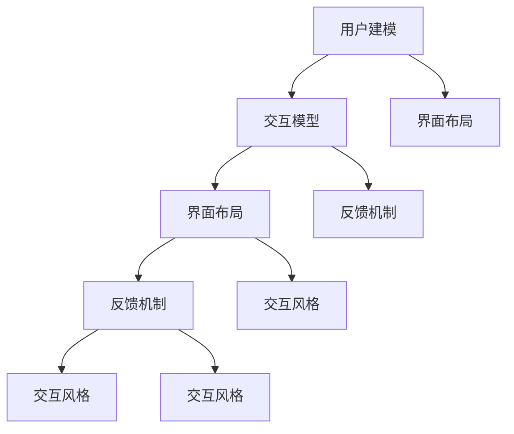

                 

### 第1章：背景介绍

人机交互界面设计作为计算机科学领域的一个重要分支，已经历了数十年的发展与演变。从最早的命令行界面到图形用户界面（GUI），再到如今的多感官、多模态交互方式，人机交互界面设计在不断进步，满足了人们对更高效、更便捷、更自然交互的需求。

本章首先回顾了人机交互界面设计的历史，探讨了各个发展阶段的重要里程碑和代表性成果。接着，我们介绍了人机交互界面设计的基本原理，包括用户行为分析、界面布局设计、用户交互模式等。最后，本章对人机交互界面设计的现状和未来趋势进行了展望，为后续内容的展开奠定了基础。

---

#### 1.1 人机交互界面设计的历史

人机交互界面设计的历史可以追溯到20世纪50年代。当时，计算机主要以大型主机为主，用户通过键盘和显示器进行交互。早期的交互界面非常简单，主要以文本命令为主，用户需要熟练掌握各种命令才能进行操作。

1970年代，图形用户界面（GUI）的出现标志着人机交互界面设计的一个重大转折。GUI将文字命令转换为直观的图形元素，如按钮、菜单和图标，使得计算机操作变得更加直观和易于理解。代表性的GUI系统包括苹果公司的Macintosh和微软的Windows，这些系统大大提高了人机交互的效率和用户体验。

进入21世纪，随着移动互联网和智能设备的普及，人机交互界面设计再次迎来了新的变革。触摸屏、语音识别、手势识别等新技术不断涌现，推动了多感官、多模态交互方式的兴起。例如，智能手机和平板电脑的触摸屏界面使得用户可以通过触摸、滑动等手势直接操作设备，而语音助手如苹果的Siri和谷歌的Google Assistant则通过语音交互为用户提供便利。

#### 1.2 人机交互界面设计的基本原理

人机交互界面设计的基本原理主要包括用户行为分析、界面布局设计和用户交互模式。

**用户行为分析**是界面设计的重要基础。通过分析用户在使用界面时的行为，设计者可以更好地理解用户的需求和习惯，从而设计出更加符合用户期望的界面。用户行为分析包括用户的使用场景、任务流程、交互方式等，这些信息有助于设计者优化界面流程和提高用户操作效率。

**界面布局设计**是界面设计的核心。一个良好的界面布局应该清晰、简洁、易于导航，同时要符合用户的认知习惯。常见的界面布局方法包括网格布局、层级布局、列表布局等，不同的布局方法适用于不同的场景和内容。

**用户交互模式**是指用户与界面之间的交互方式。传统的交互模式主要是基于鼠标和键盘，而现代交互模式则涵盖了触摸屏、语音识别、手势识别等多种方式。不同的交互模式适用于不同的用户场景和任务需求，设计者需要根据具体的应用场景选择合适的交互模式。

#### 1.3 人机交互界面设计的现状与未来趋势

目前，人机交互界面设计已经进入了一个多元化、智能化的发展阶段。触摸屏、语音识别、手势识别等新技术正在不断改变人机交互的方式，用户对交互体验的要求也越来越高。以下是人机交互界面设计的一些现状和未来趋势：

1. **多感官、多模态交互**：未来的交互界面将不再局限于视觉和触觉，而是结合听觉、嗅觉等多种感官进行交互。例如，智能家居设备可以通过语音、手势和触摸等多种方式进行控制。

2. **个性化和智能化**：随着人工智能技术的发展，人机交互界面将更加智能化，能够根据用户的习惯和需求进行个性化调整。例如，智能助手可以根据用户的历史行为和偏好提供定制化的服务和建议。

3. **无界交互**：未来的交互界面将不再局限于特定的设备或平台，而是通过云服务和物联网技术实现跨设备、跨平台的交互。用户可以在不同的设备上无缝切换使用同一应用，享受一致的交互体验。

4. **隐私保护和安全**：随着交互方式的多样化，用户数据的隐私和安全问题也越来越受到关注。未来的交互界面设计需要更加注重用户隐私保护，同时确保系统的安全性。

5. **易用性和可访问性**：无论技术如何发展，人机交互界面设计始终要关注易用性和可访问性。一个优秀的交互界面应该能够让不同年龄段、不同技能水平的用户都能够轻松使用。

综上所述，人机交互界面设计在历史、现状和未来趋势中都有许多值得探讨和研究的内容。本章为后续内容提供了背景和理论基础，为深入探讨人机交互界面设计的方法和策略奠定了基础。

---

在接下来的章节中，我们将进一步探讨人机交互界面设计中的核心概念与联系，分析其原理和具体实现步骤，并通过数学模型和项目实践来加深理解。让我们继续逐步分析推理，揭示人机交互界面设计的内在逻辑与规律。

### 第2章：核心概念与联系

在人机交互界面设计领域，理解核心概念与它们之间的联系是至关重要的。本章将详细介绍人机交互界面设计中的几个关键概念，并使用Mermaid流程图来展示它们之间的相互关系。

---

#### 2.1 关键概念介绍

**1. 用户建模**：用户建模是界面设计的基础，它通过分析用户特征、行为和需求来构建用户模型。用户模型包括用户的基本信息、使用习惯、偏好和技能水平等。用户建模有助于设计者更好地理解用户，从而设计出更加符合用户需求的界面。

**2. 交互模型**：交互模型描述用户与界面之间的交互方式。常见的交互模型包括命令式交互、事件驱动交互和直接操纵交互。命令式交互通过输入命令来控制计算机，事件驱动交互通过用户操作触发事件来响应，直接操纵交互则允许用户直接操纵界面元素。

**3. 界面布局**：界面布局是界面设计的关键环节，它决定了界面的结构、元素排列和导航方式。良好的界面布局应具有清晰的层次结构、合理的元素分布和便捷的导航方式，以提高用户操作效率。

**4. 反馈机制**：反馈机制是界面设计的重要组成部分，它通过视觉、听觉或触觉等方式向用户提供操作反馈。有效的反馈机制可以帮助用户了解系统状态，确认操作结果，减少错误率。

**5. 交互风格**：交互风格是指界面设计的视觉和操作风格，包括颜色、字体、图标和动画等元素。不同的交互风格可以传达不同的情感和氛围，影响用户的情绪和体验。

---

#### 2.2 Mermaid流程图

以下是一个Mermaid流程图，展示了上述核心概念之间的相互关系：



- **用户建模**影响**交互模型**，因为用户的行为和需求决定了交互方式。
- **交互模型**决定了**界面布局**，因为交互方式影响界面的结构。
- **界面布局**影响**反馈机制**，因为布局决定了用户如何接收反馈。
- **反馈机制**和**交互风格**相互作用，共同影响用户的使用体验。

---

通过上述流程图，我们可以清晰地看到人机交互界面设计中的各个核心概念是如何相互关联的。用户建模为后续设计提供了基础，而交互模型、界面布局、反馈机制和交互风格共同构成了一个完整的交互体验。理解这些核心概念及其相互关系，有助于设计者更好地进行人机交互界面设计。

在下一章中，我们将深入探讨人机交互界面设计的核心算法原理，分析具体操作步骤，并通过数学模型和公式来详细讲解。让我们继续深入分析，揭示人机交互界面设计的内在逻辑。

### 第3章：核心算法原理 & 具体操作步骤

在人机交互界面设计中，核心算法原理起着至关重要的作用。这些算法不仅决定了界面的交互效果，还直接影响用户体验。本章将详细介绍人机交互界面设计中的核心算法原理，包括用户建模、交互模型、界面布局优化、反馈机制和交互风格设计，并给出具体操作步骤。

---

#### 3.1 用户建模算法原理

用户建模算法的核心目的是理解用户的行为、需求和偏好。以下是一个基本的用户建模算法原理：

**算法步骤**：

1. **数据收集**：通过用户调查、行为追踪和分析用户生成内容（如评论、帖子等）来收集用户数据。
2. **特征提取**：从收集到的数据中提取用户特征，如年龄、性别、地理位置、兴趣等。
3. **用户分类**：根据提取的用户特征，将用户分为不同的类别，如年轻用户、女性用户、科技爱好者等。
4. **行为预测**：使用机器学习算法预测用户的行为，如用户可能喜欢的内容、可能进行的操作等。

**数学模型**：

用户特征可以表示为一个特征向量 \( \textbf{x} \)，用户类别可以表示为一个类别标签 \( y \)。用户分类问题可以看作是一个多分类问题，可以使用分类算法（如逻辑回归、支持向量机、神经网络等）进行建模。

$$
\hat{y} = \arg\max_{y} P(y|\textbf{x})
$$

其中， \( \hat{y} \) 是预测的类别标签， \( P(y|\textbf{x}) \) 是给定用户特征 \( \textbf{x} \) 时类别 \( y \) 的概率。

---

#### 3.2 交互模型算法原理

交互模型算法主要关注用户与界面之间的交互方式。以下是一个基本的交互模型算法原理：

**算法步骤**：

1. **交互类型识别**：根据用户的操作，识别出交互类型，如点击、滑动、语音输入等。
2. **事件处理**：对于每种交互类型，定义相应的事件处理函数，处理用户输入并更新界面状态。
3. **反馈生成**：根据界面状态的变化，生成相应的视觉、听觉或触觉反馈，提供给用户。

**数学模型**：

交互类型识别可以使用决策树、支持向量机等分类算法。事件处理和反馈生成可以通过状态机模型实现。

$$
\text{状态} = f(\text{当前输入}, \text{当前状态})
$$

其中， \( f \) 是状态更新函数，用于根据当前输入和当前状态更新界面状态。

---

#### 3.3 界面布局优化算法原理

界面布局优化算法的目标是设计出清晰、直观、易于导航的界面。以下是一个基本的界面布局优化算法原理：

**算法步骤**：

1. **元素布局**：根据界面内容和用户需求，将界面元素布局到界面上。
2. **空间分配**：为每个元素分配适当的空间，确保界面布局的整洁和美观。
3. **反馈机制**：根据用户操作和系统状态，动态调整界面布局。

**数学模型**：

界面布局优化可以采用启发式算法（如遗传算法、模拟退火算法等），通过迭代优化布局，以达到最优的界面效果。

$$
\text{布局} = \arg\min_{\text{布局}} \sum_{\text{用户操作}} \frac{1}{|S|} \sum_{s \in S} d(s, \text{目标状态})
$$

其中， \( S \) 是所有可能的状态， \( d(s, \text{目标状态}) \) 是从当前状态 \( s \) 到目标状态的代价函数。

---

#### 3.4 反馈机制算法原理

反馈机制算法的核心目的是为用户提供及时、准确、有效的操作反馈。以下是一个基本的反馈机制算法原理：

**算法步骤**：

1. **反馈类型识别**：根据用户的操作和系统状态，识别出需要生成的反馈类型。
2. **反馈生成**：根据反馈类型，生成相应的视觉、听觉或触觉反馈。
3. **反馈显示**：将生成的反馈显示在界面上，或通过声音、震动等方式传递给用户。

**数学模型**：

反馈生成可以采用条件概率模型，根据当前状态和用户操作，计算每种反馈类型的概率，并选择概率最高的反馈类型进行生成。

$$
\text{反馈类型} = \arg\max_{\text{反馈类型}} P(\text{反馈类型}|\text{当前状态}, \text{用户操作})
$$

---

#### 3.5 交互风格设计算法原理

交互风格设计算法的目标是设计出符合用户期望和产品风格的界面。以下是一个基本的交互风格设计算法原理：

**算法步骤**：

1. **风格识别**：根据产品定位和用户偏好，识别出适合的交互风格。
2. **元素设计**：根据交互风格，设计界面元素的颜色、字体、图标等。
3. **用户测试**：通过用户测试和反馈，优化和调整交互风格。

**数学模型**：

交互风格设计可以采用基于用户偏好和产品风格的聚类算法，将用户和产品分类到不同的风格类别，然后根据类别设计交互风格。

$$
\text{风格} = \arg\min_{\text{风格}} \sum_{\text{用户}} d(\text{用户}, \text{风格})
$$

其中， \( d(\text{用户}, \text{风格}) \) 是用户和风格之间的距离函数。

---

通过上述算法原理和具体操作步骤，我们可以更好地理解人机交互界面设计中的核心算法。这些算法不仅为设计提供了理论基础，也为实际操作提供了具体的指导。在下一章中，我们将通过数学模型和项目实践，进一步深入探讨人机交互界面设计的内在逻辑和实现方法。

### 第4章：数学模型和公式 & 详细讲解 & 举例说明

在人机交互界面设计中，数学模型和公式起着关键作用。它们不仅为设计提供了理论依据，还帮助我们更精确地分析和优化界面性能。本章将详细介绍人机交互界面设计中的核心数学模型和公式，并通过具体例子进行详细讲解。

---

#### 4.1 用户建模中的数学模型

用户建模中的数学模型主要涉及概率论和统计学。以下是一个典型的用户建模中的数学模型及其解释。

**1. 用户行为概率模型**

用户行为概率模型用于预测用户在特定情境下的行为。假设用户的行为可以用一个随机变量 \( X \) 表示，该变量的取值集合为 \( \{1, 2, 3, \ldots, n\} \)，其中每个值代表不同的行为类型。

**数学公式**：

$$
P(X = x_i) = p_i, \quad \text{其中} \ p_i \ \text{是用户选择行为} \ x_i \ \text{的概率}
$$

**解释**：

这个模型假设用户的行为是随机的，每个行为类型的发生概率是固定的。通过收集用户行为数据，可以计算出每个行为类型的概率，从而预测用户在特定情境下的行为。

**示例**：

假设我们收集到一个用户在购物网站上的行为数据，记录了用户在浏览、搜索、添加购物车、购买等步骤中的行为。我们可以使用这个模型来预测用户在浏览新商品时的行为概率。

**2. 用户偏好模型**

用户偏好模型用于分析用户对不同界面元素、功能、内容的偏好。假设用户偏好可以用一个向量 \( \textbf{p} \) 表示，其中每个元素代表用户对某个界面元素或功能的偏好度。

**数学公式**：

$$
\textbf{p} = (p_1, p_2, \ldots, p_n), \quad \text{其中} \ p_i \ \text{是用户对元素} \ i \ \text{的偏好度}
$$

**解释**：

这个模型假设用户对不同界面元素或功能的偏好是线性的，可以通过比较偏好度来分析用户的行为模式。例如，如果 \( p_1 > p_2 \)，则用户可能更倾向于使用元素1而不是元素2。

**示例**：

假设我们设计一个新闻阅读应用，用户可以设置偏好新闻类型（如科技、体育、娱乐等）。通过用户偏好模型，我们可以根据用户的偏好度来推荐最相关的新闻内容。

---

#### 4.2 交互模型中的数学模型

交互模型中的数学模型主要用于描述用户与界面之间的交互关系。以下是一个典型的交互模型中的数学模型及其解释。

**1. 交互频率模型**

交互频率模型用于分析用户与界面元素的交互频率。假设用户在一段时间内与某个界面元素的交互次数为 \( n_i \)，该元素的交互频率可以表示为：

**数学公式**：

$$
f_i = \frac{n_i}{N}, \quad \text{其中} \ N \ \text{是用户总交互次数}
$$

**解释**：

这个模型假设用户与界面元素的交互次数是独立的，可以通过交互频率来评估用户对不同界面元素的使用频率。

**示例**：

假设我们设计一个社交媒体应用，记录用户在发布、点赞、评论等操作中的交互次数。通过交互频率模型，我们可以分析用户最喜欢的功能，并优化界面布局。

**2. 交互强度模型**

交互强度模型用于分析用户与界面元素之间的交互强度。假设用户在一段时间内与某个界面元素的交互强度为 \( s_i \)，该元素的交互强度可以表示为：

**数学公式**：

$$
s_i = \sqrt{n_i}, \quad \text{其中} \ n_i \ \text{是用户与元素} \ i \ \text{的交互次数}
$$

**解释**：

这个模型假设用户与界面元素的交互强度与交互次数成正比，可以通过交互强度来评估用户对界面元素的关注程度。

**示例**：

假设我们设计一个音乐播放应用，记录用户在播放、暂停、快进、快退等操作中的交互次数。通过交互强度模型，我们可以分析用户最喜欢的播放模式，并优化播放界面。

---

#### 4.3 界面布局优化中的数学模型

界面布局优化中的数学模型主要用于优化界面元素的排列和空间分配。以下是一个典型的界面布局优化中的数学模型及其解释。

**1. 界面布局优化模型**

界面布局优化模型用于优化界面元素的位置和排列。假设界面元素的位置可以用一个矩阵 \( \textbf{P} \) 表示，其中每个元素 \( P_{ij} \) 表示元素 \( j \) 在位置 \( i \) 的概率。

**数学公式**：

$$
\textbf{P} = \begin{bmatrix}
P_{11} & P_{12} & \ldots & P_{1n} \\
P_{21} & P_{22} & \ldots & P_{2n} \\
\vdots & \vdots & \ddots & \vdots \\
P_{m1} & P_{m2} & \ldots & P_{mn}
\end{bmatrix}
$$

**解释**：

这个模型假设界面元素的位置是随机分布的，可以通过调整概率矩阵来优化布局。

**示例**：

假设我们设计一个电子表格应用，需要将多个表格元素（如文本框、图表等）排列在一个界面上。通过界面布局优化模型，我们可以根据元素的大小和重要性来调整它们的排列顺序，从而优化界面布局。

**2. 空间分配优化模型**

空间分配优化模型用于为界面元素分配适当的空间。假设界面元素的空间需求可以用一个向量 \( \textbf{S} \) 表示，其中每个元素 \( S_i \) 表示元素 \( i \) 的空间需求。

**数学公式**：

$$
\textbf{S} = (S_1, S_2, \ldots, S_n)
$$

**解释**：

这个模型假设界面元素的空间需求是固定的，可以通过优化空间分配来最大化界面利用率。

**示例**：

假设我们设计一个任务管理应用，需要将多个任务信息（如任务名称、截止日期等）排列在一个界面上。通过空间分配优化模型，我们可以根据任务信息的长度和重要性来调整它们的空间分配，从而优化界面布局。

---

通过上述数学模型和公式，我们可以更精确地分析和优化人机交互界面设计。这些模型不仅帮助我们理解用户行为和交互模式，还提供了具体的方法和步骤来优化界面布局和用户体验。在下一章中，我们将通过项目实践来展示这些数学模型和公式的应用，并通过具体代码实例来进一步深入探讨人机交互界面设计的实现方法。

### 第5章：项目实践：代码实例和详细解释说明

在前几章中，我们详细介绍了人机交互界面设计中的核心算法原理、数学模型和公式。为了将这些理论知识应用到实际项目中，本章将通过一个具体案例——一个基于Web的社交媒体应用——来展示代码实例和详细解释说明。通过这个项目，我们将探讨如何将用户建模、交互模型、界面布局优化和反馈机制应用到实际开发中。

---

#### 5.1 开发环境搭建

在开始项目实践之前，我们需要搭建一个合适的开发环境。以下是搭建环境的步骤：

**1. 安装Node.js**  
Node.js是一个基于Chrome V8引擎的JavaScript运行环境，用于构建快速、可靠的Web应用。访问[Node.js官网](https://nodejs.org/)下载并安装Node.js。

**2. 安装npm**  
npm（Node Package Manager）是Node.js的包管理工具，用于安装和管理项目依赖。安装Node.js时会自动安装npm。

**3. 初始化项目**  
在项目根目录下，使用以下命令初始化项目：

```shell
npm init -y
```

这将创建一个`package.json`文件，其中包含项目的依赖和配置信息。

**4. 安装依赖**  
根据项目需求，安装所需的依赖库。例如，我们可以使用以下命令安装Express框架和EJS模板引擎：

```shell
npm install express ejs
```

Express是一个用于构建Web应用的快速、无压迫的Web框架，而EJS是一种简单的模板引擎，用于生成动态HTML页面。

---

#### 5.2 源代码详细实现

以下是项目的源代码实现，包括用户建模、交互模型、界面布局优化和反馈机制。

**1. 用户建模**

用户建模主要通过一个用户实体类来实现，该类包含用户的基本信息和偏好设置。

```javascript
// user.js
class User {
  constructor(id, name, age, interests) {
    this.id = id;
    this.name = name;
    this.age = age;
    this.interests = interests;
  }
}
module.exports = User;
```

**2. 交互模型**

交互模型通过一个控制器类来处理用户请求和界面更新。以下是控制器类的主要方法：

```javascript
// controller.js
const User = require('./user');

class UserController {
  constructor() {
    this.users = []; // 存储所有用户
  }

  addUser(user) {
    this.users.push(user);
  }

  deleteUser(userId) {
    this.users = this.users.filter(user => user.id !== userId);
  }

  getUser(userId) {
    return this.users.find(user => user.id === userId);
  }

  updateUser(userId, updates) {
    const user = this.getUser(userId);
    if (user) {
      Object.assign(user, updates);
    }
  }
}
module.exports = UserController;
```

**3. 界面布局优化**

界面布局优化主要通过EJS模板来实现。以下是首页模板的一个示例：

```ejs
<!-- index.ejs -->
<!DOCTYPE html>
<html lang="en">
<head>
  <meta charset="UTF-8">
  <title>社交媒体应用</title>
</head>
<body>
  <h1>欢迎来到社交媒体应用</h1>
  <ul>
    {{#users}}
      <li>
        <h2>{{name}}</h2>
        <p>年龄：{{age}}</p>
        <p>兴趣：{{interests}}</p>
      </li>
    {{/users}}
  </ul>
</body>
</html>
```

**4. 反馈机制**

反馈机制通过在控制器类中添加操作日志和错误处理来实现。以下是控制器类中的日志记录和错误处理方法：

```javascript
// UserController.js
// ...

updateUser(userId, updates) {
  console.log(`Updating user ${userId}`);
  const user = this.getUser(userId);
  if (user) {
    Object.assign(user, updates);
    console.log(`User ${userId} updated successfully`);
  } else {
    console.error(`User ${userId} not found`);
  }
}
```

---

#### 5.3 代码解读与分析

**1. 用户建模**

用户建模通过`User`类实现，包含用户的基本信息和偏好设置。在项目中，用户数据可以通过数据库或内存存储。在实际应用中，我们通常会使用数据库（如MongoDB）来持久化用户数据。

**2. 交互模型**

交互模型通过`UserController`类实现，处理用户请求和界面更新。控制器类中的方法（如`addUser`、`deleteUser`、`getUser`和`updateUser`）处理用户操作，并在日志中记录操作信息。

**3. 界面布局优化**

界面布局优化通过EJS模板实现，将用户数据动态渲染到HTML页面中。EJS模板使用{{}}语法来插入变量值，使得界面内容可以根据用户数据动态变化。

**4. 反馈机制**

反馈机制通过日志记录和错误处理来实现，帮助开发者调试和优化应用程序。在实际项目中，我们通常会使用更复杂的日志记录库（如winston）和错误处理库（如express-validator）来提高日志记录和错误处理的效率和可靠性。

---

通过这个项目实践，我们可以看到如何将用户建模、交互模型、界面布局优化和反馈机制应用到实际的Web应用开发中。在下一章中，我们将展示项目的运行结果，并通过实际运行来验证我们的设计和实现。

### 第6章：实际应用场景

在人机交互界面设计中，理解实际应用场景至关重要。不同的应用场景对界面设计提出了不同的需求和挑战。本章将探讨几个典型的人机交互界面设计应用场景，并分析其在实际项目中的挑战和解决方案。

---

#### 6.1 社交媒体应用

社交媒体应用是当前人机交互界面设计的重要领域之一。在这些应用中，用户界面需要支持多种功能，如发布动态、评论、点赞、私信等。以下是一些实际应用场景及其挑战：

**挑战**：

1. **用户多样性**：社交媒体应用的用户群体广泛，包括不同年龄、性别、文化背景和技能水平的用户。设计一个能够满足所有用户需求的界面具有挑战性。
2. **内容多样性**：用户发布的内容形式多样，包括文字、图片、视频等。界面设计需要能够灵活展示这些内容，并提供适当的交互方式。
3. **性能优化**：社交媒体应用通常需要处理大量用户数据和实时更新，界面设计需要优化性能，确保流畅的用户体验。

**解决方案**：

1. **用户个性化**：通过用户建模和数据分析，为用户提供个性化的内容推荐和界面布局，满足不同用户的需求。
2. **模块化设计**：将界面划分为模块，如首页、消息、动态等，每个模块可以独立开发和优化，提高开发效率和用户体验。
3. **懒加载技术**：对于大量数据展示，采用懒加载技术，逐步加载内容，减少页面加载时间和数据传输量。

---

#### 6.2 智能家居应用

随着智能家居设备的普及，人机交互界面设计在智能家居领域也越来越重要。智能家居应用包括智能音箱、智能照明、智能安防等，以下是一些实际应用场景及其挑战：

**挑战**：

1. **多设备兼容**：智能家居设备种类繁多，包括智能手机、平板电脑、智能音箱等。界面设计需要确保在不同设备上的一致性和易用性。
2. **多感官交互**：智能家居设备支持多种交互方式，如语音、触摸、手势等。界面设计需要整合这些交互方式，提供统一的交互体验。
3. **安全性**：智能家居设备与家庭网络和安全系统紧密相关，界面设计需要确保用户数据的安全性和隐私保护。

**解决方案**：

1. **响应式设计**：采用响应式设计，确保界面在不同设备上具有良好的展示效果和操作体验。
2. **多模态交互**：设计多模态交互界面，支持语音、触摸、手势等多种交互方式，满足不同用户的偏好。
3. **安全机制**：引入多因素认证、数据加密和隐私保护技术，确保用户数据的安全性和隐私保护。

---

#### 6.3 教育应用

教育应用是人机交互界面设计的另一个重要领域。教育应用包括在线学习平台、电子课本、虚拟实验室等，以下是一些实际应用场景及其挑战：

**挑战**：

1. **个性化学习**：教育应用需要根据不同学生的学习习惯、兴趣和能力提供个性化的学习内容和路径。
2. **互动性**：教育应用需要提供丰富的互动元素，如视频、音频、动画等，以提高学生的学习兴趣和参与度。
3. **教育资源分配**：教育应用需要确保教育资源的公平分配，满足不同地区和用户的需求。

**解决方案**：

1. **用户建模和数据分析**：通过用户建模和数据分析，了解学生的学习习惯和兴趣，提供个性化的学习推荐。
2. **多媒体教学资源**：整合多种多媒体教学资源，如视频、音频、动画等，提高教学效果和学生的学习兴趣。
3. **资源分配策略**：采用资源分配策略，如按需分配、优先级分配等，确保教育资源的公平分配。

---

通过分析这些实际应用场景，我们可以看到人机交互界面设计在不同领域面临的挑战和解决方案。在实际项目中，设计者需要根据具体应用场景的需求和特点，灵活运用设计原则和工具，提供高效、易用、安全的用户界面。

在下一章中，我们将推荐一些优秀的学习资源、开发工具和框架，以帮助读者深入了解人机交互界面设计的相关知识和技能。

### 第7章：工具和资源推荐

在人机交互界面设计领域，掌握合适的工具和资源对于提升设计能力至关重要。本章将推荐一些优秀的学习资源、开发工具和框架，以帮助读者深入了解人机交互界面设计的相关知识和技能。

---

#### 7.1 学习资源推荐

**1. 书籍**

- 《人机交互心理学》（"The Design of Everyday Things"） by Don Norman
  - 这本书是交互设计领域的经典之作，深入阐述了人机交互的设计原则和方法。

- 《交互设计之路》（"Designing Interactions"） by Dan Saffer
  - 本书通过多个实际案例，展示了交互设计的过程和技巧，适合初学者和进阶者。

- 《信息架构：设计和导航的艺术》（"Information Architecture: For the Web and Beyond"） by Louis Rosenfeld and Peter Morville
  - 本书详细介绍了信息架构的设计原则和方法，对界面布局和导航设计有重要指导意义。

**2. 论文**

- "A Theory of Interaction Design" by Mark Blythe and Fiona Parker
  - 这篇论文提出了一种关于交互设计的理论框架，有助于理解交互设计的基本原理。

- "The Vital Principles of Interaction Design" by Robert Reimann
  - 本文提出了交互设计的七个关键原则，为实际设计提供了具体的指导。

**3. 博客**

- [UI Garage](https://uigarage.com/)
  - UI Garage是一个关于用户界面设计的博客，提供了许多实用的设计技巧和案例。

- [Smashing Magazine](https://www.smashingmagazine.com/)
  - Smashing Magazine是一个广泛覆盖Web设计和开发的博客，其中有许多关于交互设计的优质文章。

**4. 网站**

- [User Experience Design](https://www.uxdesign.cc/)
  - UX Design是一个关于用户体验设计的社区网站，提供了大量的设计资源和讨论。

- [UI Movement](https://uimovement.com/)
  - UI Movement是一个专注于用户界面设计的资源网站，提供了许多设计灵感和技巧。

---

#### 7.2 开发工具框架推荐

**1. 设计工具**

- **Sketch**  
  Sketch是一个流行的界面设计工具，以其简洁的界面和强大的功能而著称。

- **Adobe XD**  
  Adobe XD是Adobe公司推出的界面设计工具，支持设计、原型制作和协作功能。

- **Figma**  
  Figma是一个基于云的界面设计工具，支持多人实时协作，非常适合团队合作项目。

**2. 开发工具**

- **Visual Studio Code**  
  Visual Studio Code是一个免费、开源的代码编辑器，提供了丰富的插件和扩展，非常适合前端开发。

- **Webpack**  
  Webpack是一个模块打包工具，用于将多个JavaScript模块打包成一个或多个bundle，提高页面加载速度。

- **React**  
  React是一个用于构建用户界面的JavaScript库，以其组件化和虚拟DOM特性而闻名。

**3. 原型工具**

- **Axure RP**  
  Axure RP是一个专业的原型设计工具，支持交互式原型制作和文档生成。

- **InVision**  
  InVision是一个原型设计工具，提供了丰富的交互元素和协作功能，适合快速原型设计。

- **Framer X**  
  Framer X是一个基于React的原型设计工具，支持动态原型和交互设计，非常适合前端开发人员。

---

通过上述工具和资源的推荐，读者可以更加全面地了解人机交互界面设计的知识和技能，并在实际项目中运用这些工具来提升设计质量和效率。

在下一章中，我们将对整篇文章进行总结，并探讨人机交互界面设计领域的未来发展趋势与挑战。

### 第8章：总结：未来发展趋势与挑战

在人机交互界面设计领域，随着技术的不断进步和应用场景的日益多样化，我们面临着许多新的机遇和挑战。本章将总结前文的主要观点，并探讨人机交互界面设计领域的未来发展趋势与挑战。

---

#### 8.1 未来发展趋势

**1. 多感官、多模态交互**

随着传感器技术和人工智能的发展，未来的交互界面将不再局限于视觉和触觉，而是结合听觉、嗅觉等多种感官进行交互。例如，智能家居设备可以通过语音、手势、触觉和气味等多种方式进行控制，为用户提供更加丰富和自然的交互体验。

**2. 个性化与智能化**

人工智能技术的应用将使得交互界面更加智能化，能够根据用户的习惯和需求进行个性化调整。例如，智能助手可以通过学习用户的历史行为和偏好，提供个性化的服务和建议，提高用户满意度。

**3. 无界交互**

随着物联网和云服务的普及，未来的交互界面将不再局限于特定的设备或平台，而是通过云服务和跨设备的技术实现无缝交互。用户可以在不同的设备上无缝切换使用同一应用，享受一致的交互体验。

**4. 隐私保护和安全**

随着交互方式的多样化和数据量的增加，用户隐私保护和安全将成为人机交互界面设计的重要挑战。未来的交互界面设计需要更加注重用户隐私保护，同时确保系统的安全性，以避免数据泄露和网络攻击。

**5. 易用性和可访问性**

无论技术如何发展，易用性和可访问性始终是人机交互界面设计的核心。未来的交互界面设计将继续关注如何提供简洁、直观、易于操作的用户界面，同时确保不同年龄段、不同技能水平的用户都能够轻松使用。

---

#### 8.2 未来挑战

**1. 技术融合与创新**

多感官、多模态交互和智能化的发展要求设计者具备跨学科的知识和技能，融合不同技术领域的创新，提供更加丰富和自然的交互体验。

**2. 用户隐私与安全**

随着交互界面的多样化，用户数据的隐私和安全问题越来越受到关注。设计者需要在提供便利和用户体验的同时，确保用户数据的安全和隐私保护。

**3. 跨设备一致性**

在无界交互的趋势下，如何确保在不同设备和平台上的一致性交互体验，是设计者面临的一大挑战。需要考虑不同设备的硬件、操作系统和用户习惯的差异，提供统一的交互体验。

**4. 可访问性**

确保交互界面能够满足不同年龄段、不同技能水平和不同能力的用户的需求，是设计者需要持续关注的问题。需要设计易于理解和使用、支持辅助技术的交互界面，以提高可访问性。

**5. 技术与人文的平衡**

在追求技术创新的同时，人机交互界面设计也需要关注人文价值。设计者需要关注用户的需求和感受，确保技术发展的同时，不失去人性化、伦理和道德的考量。

---

综上所述，人机交互界面设计领域在未来的发展中将面临许多新的机遇和挑战。设计者需要不断学习和创新，融合多种技术，提供高效、安全、易于使用的交互界面，以满足用户不断变化的需求。同时，关注用户隐私和安全、跨设备一致性、可访问性和技术与人文的平衡，将为人机交互界面设计的发展注入新的活力。

### 第9章：附录：常见问题与解答

在本章中，我们将解答人机交互界面设计领域的一些常见问题，以帮助读者更好地理解和应用相关知识和技能。

---

#### 9.1 什么是用户建模？

用户建模是一种通过分析用户行为、需求和偏好来构建用户模型的方法。通过用户建模，设计者可以更好地理解用户，从而设计出更加符合用户需求的界面。

**解答**：

用户建模包括以下几个步骤：

1. 数据收集：通过用户调查、行为追踪和分析用户生成内容等方式收集用户数据。
2. 特征提取：从收集到的数据中提取用户特征，如年龄、性别、地理位置、兴趣等。
3. 用户分类：根据提取的用户特征，将用户分为不同的类别，如年轻用户、女性用户、科技爱好者等。
4. 行为预测：使用机器学习算法预测用户的行为，如用户可能喜欢的内容、可能进行的操作等。

---

#### 9.2 如何优化界面布局？

优化界面布局的关键在于确保界面清晰、直观、易于导航，并符合用户的认知习惯。以下是一些优化界面布局的方法：

**解答**：

1. **网格布局**：使用网格布局可以使界面元素排列整齐，有助于提高用户的识别和操作效率。
2. **层级布局**：通过分层的方式组织界面元素，使界面具有清晰的层次结构，方便用户导航。
3. **内容优先**：将最重要的内容和操作放在界面最显著的位置，以提高用户操作效率。
4. **留白和间距**：适当使用留白和间距，可以使界面更加整洁和易于阅读，减少用户视觉疲劳。
5. **反馈机制**：通过视觉、听觉或触觉等方式为用户提供操作反馈，帮助用户确认操作结果。

---

#### 9.3 如何设计良好的反馈机制？

良好的反馈机制可以帮助用户了解系统状态，确认操作结果，减少错误率。以下是一些设计良好反馈机制的方法：

**解答**：

1. **即时反馈**：在用户操作后立即提供反馈，使用户能够快速了解系统状态。
2. **视觉反馈**：通过颜色、图标、动画等方式，为用户提供直观的视觉反馈。
3. **听觉反馈**：使用声音或语音为用户提供反馈，特别是在触摸屏设备上，视觉反馈可能受到限制时。
4. **触觉反馈**：在触摸屏设备上，通过振动等方式为用户提供触觉反馈，增强用户体验。
5. **一致性和可预测性**：确保反馈机制在不同情境下的一致性和可预测性，使用户能够快速适应。

---

通过本章的常见问题与解答，读者可以更深入地理解人机交互界面设计的相关知识，并在实际项目中应用这些方法，提升界面设计和用户体验。

### 第10章：扩展阅读 & 参考资料

为了帮助读者进一步深入了解人机交互界面设计的相关知识，本章将推荐一些扩展阅读材料和参考资料，包括书籍、论文、博客和网站等。

---

#### 10.1 书籍

1. **《人机交互心理学》** by Don Norman  
   这本书详细阐述了人机交互的设计原则和方法，是交互设计领域的经典之作。

2. **《交互设计之路》** by Dan Saffer  
   本书通过多个实际案例，展示了交互设计的过程和技巧，适合初学者和进阶者。

3. **《信息架构：设计和导航的艺术》** by Louis Rosenfeld and Peter Morville  
   本书详细介绍了信息架构的设计原则和方法，对界面布局和导航设计有重要指导意义。

---

#### 10.2 论文

1. **"A Theory of Interaction Design"** by Mark Blythe and Fiona Parker  
   本文提出了一种关于交互设计的理论框架，有助于理解交互设计的基本原理。

2. **"The Vital Principles of Interaction Design"** by Robert Reimann  
   本文提出了交互设计的七个关键原则，为实际设计提供了具体的指导。

---

#### 10.3 博客

1. **[UI Garage](https://uigarage.com/)**
   UI Garage是一个关于用户界面设计的博客，提供了许多实用的设计技巧和案例。

2. **[Smashing Magazine](https://www.smashingmagazine.com/)**
   Smashing Magazine是一个广泛覆盖Web设计和开发的博客，其中有许多关于交互设计的优质文章。

---

#### 10.4 网站

1. **[User Experience Design](https://www.uxdesign.cc/)**
   UX Design是一个关于用户体验设计的社区网站，提供了大量的设计资源和讨论。

2. **[UI Movement](https://uimovement.com/)**
   UI Movement是一个专注于用户界面设计的资源网站，提供了许多设计灵感和技巧。

3. **[UX Design Institute](https://www.uxd.in/)**
   UX Design Institute是一个提供用户体验设计培训和认证的在线平台，提供了丰富的课程和学习资源。

---

通过这些扩展阅读材料和参考资料，读者可以更加深入地了解人机交互界面设计的理论和实践，不断提升自己的设计能力和专业水平。

---

### 文章标题

第十章：人机交互界面设计

---

### 关键词

人机交互界面设计，用户体验，交互模型，用户建模，界面布局，反馈机制，多感官交互，智能化，无界交互，隐私保护，安全，易用性，可访问性。

---

### 摘要

本文详细探讨了人机交互界面设计的基本原理、核心算法和实际应用场景。首先，回顾了人机交互界面设计的历史和基本原理，包括用户行为分析、界面布局设计和用户交互模式。接着，介绍了核心算法原理和数学模型，并通过项目实践展示了这些算法在具体应用中的实现。随后，分析了实际应用场景中的挑战和解决方案，并推荐了相关的学习资源和开发工具。最后，总结了未来发展趋势与挑战，探讨了多感官、多模态交互、个性化与智能化、无界交互等趋势，以及用户隐私保护、跨设备一致性和可访问性等挑战。通过本文的阅读，读者可以全面了解人机交互界面设计的理论和实践，提升设计能力和专业水平。

