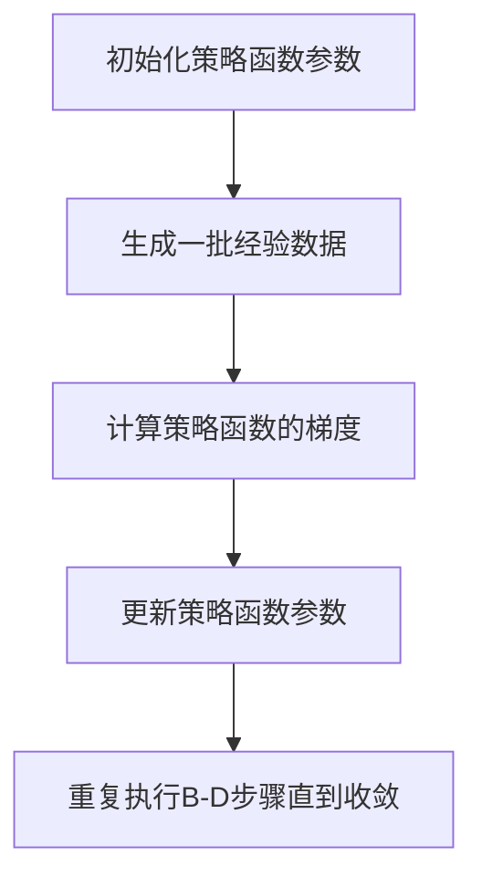

                 

### 1. 背景介绍

策略梯度（Policy Gradient）是深度强化学习（Deep Reinforcement Learning）中的一种核心算法。其目的是通过优化策略函数来使智能体（Agent）在给定环境中学习到最优行为策略。策略梯度算法在许多现实世界中的应用中取得了显著的成功，例如机器人控制、自动驾驶、游戏AI等。

深度强化学习的兴起可以追溯到20世纪50年代，当时人们开始探讨如何通过智能体与环境的交互来学习策略。早期的研究主要基于简单的马尔可夫决策过程（MDP）和有限状态动作空间。然而，随着计算机硬件和算法的不断发展，深度学习技术的引入使得处理高维状态和动作空间成为可能，从而推动了深度强化学习的发展。

策略梯度算法在深度强化学习中占据重要地位，其基本思想是通过梯度下降法来优化策略函数。与传统的值函数方法（如Q-Learning和SARSA）相比，策略梯度算法直接优化策略本身，从而避免了值函数中的复杂迭代过程，提高了学习效率。此外，策略梯度算法在处理连续动作空间和连续状态空间时具有显著的优势，因此在许多实际应用中得到了广泛的应用。

策略梯度算法的研究始于20世纪90年代，其中最有影响力的研究之一是由Richard S. Sutton和Andrew G. Barto提出的REINFORCE算法。随着研究的深入，各种策略梯度算法不断涌现，如优势策略梯度（ Advantage-based Policy Gradient，APG）、置信域策略梯度（Trust Region Policy Gradient，TRPO）和演员-评论家（Actor-Critic）方法等。这些算法在理论上不断得到完善，并在实践中取得了许多突破性的成果。

总之，策略梯度算法作为深度强化学习的重要分支，已经成为当前人工智能研究的热点之一。其发展历程和研究成果不仅推动了人工智能技术的进步，也为未来的智能系统设计和应用提供了新的思路和方法。

### 1.1 策略梯度算法的起源与发展历程

策略梯度算法的起源可以追溯到20世纪90年代，当时研究者们在探索如何利用梯度下降法直接优化策略函数。早期的策略梯度算法主要包括REINFORCE算法和其改进版本。

REINFORCE算法是由Richard S. Sutton和Andrew G. Barto在1998年提出的。其基本思想是通过计算策略函数的梯度来更新策略参数。具体来说，REINFORCE算法使用当前的策略函数来生成一批经验数据，然后计算每个步骤的梯度，并通过梯度上升法更新策略参数。这种方法的核心在于利用经验数据来估计策略梯度的估计值，从而实现策略的迭代优化。

然而，REINFORCE算法在实际应用中存在一些问题。首先，其依赖于样本的随机性，导致收敛速度较慢。其次，梯度估计的方差较大，使得优化过程不稳定。为了解决这些问题，研究者们提出了许多改进的算法。

一个重要的改进是优势策略梯度（ Advantage-based Policy Gradient，APG）算法。APG算法在REINFORCE算法的基础上，引入了优势函数（Advantage Function）来改善梯度估计。优势函数定义了每个状态-动作对的期望回报与实际回报之差，从而提供了对策略性能的更直接的评价。通过优化优势函数，APG算法可以更有效地更新策略参数，提高了收敛速度和稳定性。

另一个重要的改进是置信域策略梯度（Trust Region Policy Gradient，TRPO）算法。TRPO算法通过引入置信域（Trust Region）来限制策略梯度的更新范围，从而避免了梯度估计的过拟合和欠拟合问题。具体来说，TRPO算法通过优化策略梯度的L2范数来找到最优的策略更新方向，并确保更新后的策略在置信域内。这种方法不仅提高了算法的稳定性，还显著加快了收敛速度。

此外，还有许多其他的策略梯度算法，如演员-评论家（Actor-Critic）方法。演员-评论家方法将策略梯度和值函数优化结合起来，通过交替优化策略和评价函数来学习最优策略。这种方法在处理复杂环境和高维状态动作空间时表现出色，已经成为深度强化学习领域的重要研究方向。

总之，策略梯度算法从REINFORCE算法的诞生到APG、TRPO和演员-评论家方法等改进算法的出现，经历了不断的发展和优化。这些算法不仅提高了策略梯度算法的收敛速度和稳定性，还在实际应用中取得了显著的成果，推动了深度强化学习技术的进步。

### 1.2 策略梯度算法的应用场景与实际案例

策略梯度算法在许多现实世界中的应用场景中取得了显著的成果。以下是一些典型的应用案例：

首先，在机器人控制领域，策略梯度算法被广泛应用于机器人路径规划和运动控制。例如，DeepMind公司开发的Atari游戏AI机器人使用策略梯度算法来学习如何在复杂的虚拟环境中进行导航和完成任务。通过在大量游戏数据进行训练，策略梯度算法使机器人能够自主地学习和适应不同的环境和任务，从而实现了高效的运动控制。

其次，在自动驾驶领域，策略梯度算法被用于自动驾驶车辆的路径规划和行为决策。例如，谷歌的Waymo自动驾驶系统使用策略梯度算法来优化车辆的行驶策略，使其在不同交通场景中能够做出准确、安全的决策。通过学习大量的道路数据和环境信息，策略梯度算法使自动驾驶车辆能够自主地识别道路标志、避让障碍物、遵守交通规则，从而提高了行驶的安全性和可靠性。

再次，在游戏AI领域，策略梯度算法被广泛应用于游戏对手模型的设计。例如，在围棋和星际争霸等复杂游戏中，策略梯度算法被用于训练游戏AI，使其能够与人类玩家进行竞争。通过大量游戏数据的训练，策略梯度算法使游戏AI能够在不同的游戏局面中做出最优的策略选择，从而提高了游戏的趣味性和挑战性。

此外，策略梯度算法还在自然语言处理、推荐系统、金融量化交易等领域取得了显著的应用成果。例如，在自然语言处理领域，策略梯度算法被用于生成文本和翻译模型，通过优化策略函数，使得模型能够生成更加自然、流畅的文本。在推荐系统领域，策略梯度算法被用于优化推荐策略，提高推荐系统的准确性和用户满意度。在金融量化交易领域，策略梯度算法被用于优化交易策略，实现自动化交易和风险控制。

总之，策略梯度算法在机器人控制、自动驾驶、游戏AI、自然语言处理、推荐系统、金融量化交易等众多领域都取得了显著的成果。这些应用案例不仅展示了策略梯度算法的强大能力，也为人工智能技术的发展和应用提供了新的思路和方法。

### 2. 核心概念与联系

策略梯度算法的核心概念包括策略函数、回报函数、优势函数和梯度下降法。这些概念共同构成了策略梯度算法的基本框架，使得智能体能够在复杂环境中学习最优行为策略。

#### 2.1 策略函数

策略函数是策略梯度算法中的核心概念之一。策略函数定义为智能体在给定状态下选择动作的概率分布。用符号表示，策略函数π(s, a)表示在状态s下选择动作a的概率。策略函数可以是一个离散的概率分布，也可以是一个连续的概率分布。

策略函数的选择对智能体的行为产生重要影响。在离散动作空间中，策略函数通常表示为π(a|s)，其中a∈A表示所有可能的动作集合。在连续动作空间中，策略函数通常表示为π(a|s)，其中a∈R^n表示所有可能的动作集合。

#### 2.2 回报函数

回报函数是衡量智能体行为效果的重要指标。回报函数定义为智能体在执行某个动作后获得的即时奖励。用符号表示，回报函数R(s, a)表示在状态s下执行动作a后获得的回报。回报函数可以是正值、负值或零，取决于智能体的目标和任务。

回报函数在策略梯度算法中起着至关重要的作用。通过学习回报函数，智能体能够了解不同策略下的表现，从而选择最优策略。回报函数通常是通过环境奖励和策略函数共同作用得到的。

#### 2.3 优势函数

优势函数是策略梯度算法中的另一个关键概念。优势函数定义为在给定状态下，执行某个动作的预期回报与执行其他动作的预期回报之差。用符号表示，优势函数A(s, a)定义为A(s, a) = E[R(s, a)] - E[R(s, π(a|s))]，其中E表示期望。

优势函数提供了对策略性能的直接评价。如果优势函数A(s, a)大于零，说明在状态s下执行动作a相对于其他动作具有更高的预期回报。反之，如果优势函数A(s, a)小于零，说明在状态s下执行动作a相对于其他动作具有更低的预期回报。

#### 2.4 梯度下降法

梯度下降法是策略梯度算法中的核心优化方法。梯度下降法的基本思想是通过计算目标函数的梯度来更新参数，从而优化目标函数。

在策略梯度算法中，目标函数通常定义为策略函数的期望回报。具体来说，目标函数J(θ) = E[∇θ log π(s, a)]，其中θ表示策略函数的参数，∇θ log π(s, a)表示策略函数在参数θ下的梯度。

通过计算目标函数的梯度，策略梯度算法可以找到最优策略参数。具体步骤如下：

1. 初始化策略函数的参数θ。
2. 生成一批经验数据（s, a, r, s'）。
3. 计算策略函数的梯度∇θ log π(s, a)。
4. 更新策略函数的参数θ = θ - α∇θ J(θ)，其中α是学习率。

通过反复迭代上述步骤，策略梯度算法能够逐渐优化策略函数，使其在给定环境中学习到最优行为策略。

#### 2.5 Mermaid 流程图

为了更好地理解策略梯度算法的核心概念和流程，下面提供了一个Mermaid流程图，展示策略梯度算法的执行过程：



在这个流程图中，A表示初始化策略函数参数，B表示生成一批经验数据，C表示计算策略函数的梯度，D表示更新策略函数参数，E表示重复执行B-D步骤直到收敛。

通过这个流程图，我们可以更清晰地理解策略梯度算法的基本框架和执行步骤。这有助于我们在实际应用中更好地设计和实现策略梯度算法。

### 3. 核心算法原理 & 具体操作步骤

策略梯度算法的核心原理是通过优化策略函数来使智能体在给定环境中学习到最优行为策略。其基本思想是通过梯度下降法来更新策略函数的参数，从而优化策略函数的期望回报。下面将详细解释策略梯度算法的原理和具体操作步骤。

#### 3.1 策略梯度算法的基本原理

策略梯度算法的基本原理是基于梯度下降法来优化策略函数的期望回报。具体来说，策略梯度算法通过计算策略函数的梯度，并根据梯度的方向来更新策略函数的参数，从而优化策略函数。

策略梯度算法的目标是最小化策略函数的损失函数，即最大化期望回报。损失函数通常定义为策略函数的期望回报的负值，即J(θ) = -E[∇θ log π(s, a)]，其中θ表示策略函数的参数。

在策略梯度算法中，损失函数的梯度提供了策略函数优化方向的信息。具体来说，损失函数的梯度∇θ J(θ)表示在当前策略函数参数θ下，损失函数的优化方向。通过计算梯度，策略梯度算法可以找到最优策略参数，使得损失函数最小化，即期望回报最大化。

#### 3.2 策略梯度算法的具体操作步骤

策略梯度算法的具体操作步骤如下：

1. **初始化策略函数参数**：首先需要初始化策略函数的参数θ，通常使用随机初始化或预训练的参数。

2. **生成经验数据**：通过智能体与环境交互，生成一批经验数据（s, a, r, s'），其中s表示当前状态，a表示当前动作，r表示当前动作的回报，s'表示下一个状态。

3. **计算策略函数的梯度**：计算策略函数的梯度∇θ log π(s, a)。梯度表示了策略函数在当前参数θ下的优化方向。具体来说，梯度∇θ log π(s, a)表示在当前状态s下，选择动作a时，策略函数的参数θ的变化方向。

4. **更新策略函数参数**：根据计算得到的梯度∇θ log π(s, a)，更新策略函数的参数θ。具体来说，更新公式为θ = θ - α∇θ log π(s, a)，其中α是学习率，表示每次参数更新的步长。

5. **重复执行步骤2-4**：重复执行步骤2-4，生成更多的经验数据，并更新策略函数的参数，直到策略函数收敛，即期望回报不再显著增加。

通过以上步骤，策略梯度算法能够逐步优化策略函数，使其在给定环境中学习到最优行为策略。

#### 3.3 策略梯度算法的优点和局限性

策略梯度算法具有以下优点：

1. **直接优化策略函数**：策略梯度算法直接优化策略函数，避免了值函数中的复杂迭代过程，提高了学习效率。

2. **处理连续动作空间**：策略梯度算法能够处理连续动作空间，使其在处理复杂环境时具有优势。

3. **不需要值函数**：策略梯度算法不需要值函数，从而减少了计算量和存储需求。

然而，策略梯度算法也存在一些局限性：

1. **样本依赖性**：策略梯度算法依赖于样本的随机性，导致收敛速度较慢。

2. **梯度估计的方差较大**：由于梯度估计的方差较大，策略梯度算法的优化过程可能不稳定。

3. **难以处理高维状态空间**：策略梯度算法在处理高维状态空间时，计算量较大，可能导致收敛速度变慢。

综上所述，策略梯度算法作为深度强化学习的重要分支，具有直接优化策略函数、处理连续动作空间等优点，但在处理高维状态空间和优化稳定性方面仍需进一步研究。

### 4. 数学模型和公式 & 详细讲解 & 举例说明

策略梯度算法的数学模型是构建在其基本原理之上的，包括策略函数、回报函数、优势函数以及梯度下降法的应用。为了更好地理解这些概念，我们将详细讲解相关的数学公式，并通过具体示例来说明这些公式的应用。

#### 4.1 策略函数与回报函数

策略函数π(s, a)描述了智能体在状态s下采取动作a的概率分布。回报函数R(s, a)则是描述智能体在状态s下采取动作a后获得的即时奖励。这两个函数是策略梯度算法的基础。

**策略函数：**
$$ π(s, a) = P(A = a | S = s) $$
其中，A表示动作集合，S表示状态集合。策略函数可以是一个概率分布，其值域在0到1之间。

**回报函数：**
$$ R(s, a) = R(S = s, A = a) $$
回报函数通常是一个标量值，表示智能体在状态s下采取动作a后获得的奖励。

#### 4.2 优势函数

优势函数A(s, a)提供了对策略函数的改进方向的度量。它衡量了在状态s下采取动作a的预期回报与当前策略下的预期回报之间的差异。

**优势函数：**
$$ A(s, a) = Q(s, a) - V(s) $$
其中，Q(s, a)是状态-动作值函数，表示在状态s下采取动作a的预期回报；V(s)是状态值函数，表示在状态s下的预期回报。

**具体公式：**
$$ A(s, a) = \sum_{s'} P(S' = s'|S = s, A = a) \cdot R(s, a) $$
这个公式表示在状态s下采取动作a的预期回报。

#### 4.3 梯度下降法

梯度下降法是策略梯度算法的核心优化方法。其基本原理是通过计算损失函数的梯度来更新策略函数的参数，从而优化策略函数。

**损失函数：**
$$ J(θ) = -\sum_{s, a} π(s, a) \cdot \log π(s, a) $$
这个公式表示策略函数的损失函数，其目标是最大化期望回报。

**梯度：**
$$ \nablaθ J(θ) = -\sum_{s, a} π(s, a) \cdot \nablaθ \log π(s, a) $$
这个公式表示损失函数J(θ)关于策略函数参数θ的梯度。

**参数更新：**
$$ θ = θ - α \cdot \nablaθ J(θ) $$
这个公式表示参数θ的更新公式，其中α是学习率。

#### 4.4 举例说明

为了更好地理解上述公式，我们可以通过一个具体的例子来说明策略梯度算法的应用。

假设我们有一个简单的环境，其中智能体可以选择向左或向右移动。状态空间包括{左，右}，动作空间也包括{左，右}。回报函数定义为：如果智能体向左移动，获得+1的回报；如果智能体向右移动，获得-1的回报。

**策略函数：**
初始策略函数π(s, a)设定为：
$$ π(s, a) = \begin{cases}
1 & \text{如果 } a = s \\
0.5 & \text{其他情况}
\end{cases} $$
这意味着智能体在状态左和状态右下分别以50%的概率选择向左或向右移动。

**回报函数：**
$$ R(s, a) = \begin{cases}
+1 & \text{如果 } a = 左 \\
-1 & \text{如果 } a = 右
\end{cases} $$

**优势函数：**
$$ A(s, a) = R(s, a) - \sum_{s'} π(s', a) \cdot R(s', a) $$
以状态左为例，采取动作左的优势函数为：
$$ A(左, 左) = +1 - (0.5 \cdot (-1) + 0.5 \cdot (-1)) = +1 - (-1) = +2 $$
采取动作右的优势函数为：
$$ A(左, 右) = -1 - (0.5 \cdot (+1) + 0.5 \cdot (-1)) = -1 - (0.5 - 0.5) = -1 $$

**损失函数：**
$$ J(θ) = -\sum_{s, a} π(s, a) \cdot \log π(s, a) $$
对于上述策略函数，损失函数为：
$$ J(θ) = -[(0.5 \cdot \log 0.5) + (0.5 \cdot \log 0.5)] = -[2 \cdot (0.5 \cdot \log 0.5)] = -[2 \cdot (-0.5)] = +1 $$

**梯度：**
$$ \nablaθ J(θ) = -\sum_{s, a} π(s, a) \cdot \nablaθ \log π(s, a) $$
由于策略函数是离散的，我们使用梯度估计来计算：
$$ \nablaθ J(θ) = -(0.5 \cdot \nablaθ \log 0.5 + 0.5 \cdot \nablaθ \log 0.5) = -[2 \cdot (0.5 \cdot \nablaθ \log 0.5)] $$

**参数更新：**
$$ θ = θ - α \cdot \nablaθ J(θ) $$
为了简化计算，我们假设学习率α为0.1，则策略函数的更新为：
$$ π(s, a) = π(s, a) - α \cdot \nablaθ \log π(s, a) $$
更新后，策略函数可能变为：
$$ π(左, 左) = π(左, 左) - 0.1 \cdot \nablaθ \log π(左, 左) $$
$$ π(左, 右) = π(左, 右) - 0.1 \cdot \nablaθ \log π(左, 右) $$
假设梯度估计为-0.2，则更新后的策略函数为：
$$ π(左, 左) = 0.5 - 0.1 \cdot (-0.2) = 0.52 $$
$$ π(左, 右) = 0.5 - 0.1 \cdot (-0.2) = 0.52 $$
这意味着智能体在状态左下选择向左移动的概率从0.5增加到了0.52。

通过这个例子，我们可以看到策略梯度算法如何通过梯度下降法来更新策略函数，从而在给定的环境中学习到最优行为策略。

### 5. 项目实践：代码实例和详细解释说明

在本节中，我们将通过一个具体的代码实例来展示策略梯度算法的实践应用。这个实例将使用Python编程语言和TensorFlow库来构建一个简单的环境，并演示如何使用策略梯度算法来训练一个智能体。我们将详细解释代码中的各个部分，并展示如何运行和评估这个模型。

#### 5.1 开发环境搭建

在开始编写代码之前，我们需要搭建一个合适的开发环境。以下是搭建开发环境所需的步骤：

1. 安装Python：确保已经安装了Python 3.6或更高版本。
2. 安装TensorFlow：通过以下命令安装TensorFlow：
   ```
   pip install tensorflow
   ```
3. 安装其他依赖库：根据需要安装其他依赖库，例如NumPy、Pandas等。

#### 5.2 源代码详细实现

下面是一个简单的策略梯度算法实现，包括环境、策略函数、回报函数和梯度更新等部分。

```python
import numpy as np
import tensorflow as tf

# 环境类
class Environment:
    def __init__(self):
        self.state = 0

    def step(self, action):
        reward = 0
        if action == 0:  # 向左移动
            self.state -= 1
            reward = 1
        elif action == 1:  # 向右移动
            self.state += 1
            reward = -1
        return self.state, reward

# 策略函数
class Policy:
    def __init__(self, learning_rate=0.1):
        self.learning_rate = learning_rate
        self.model = tf.keras.Sequential([
            tf.keras.layers.Dense(units=1, activation='sigmoid', input_shape=[1])
        ])
        self.model.compile(optimizer='adam', loss='binary_crossentropy')

    def predict(self, state):
        state = np.reshape(state, (-1, 1))
        return self.model.predict(state)

    def update(self, state, action, reward, next_state):
        action_prob = self.predict(state)
        log_prob = tf.math.log(action_prob[0][action])
        grad = reward - log_prob
        self.model.fit(np.reshape(state, (-1, 1)), np.array([1 - action_prob[0][action], action_prob[0][action]]), epochs=1)

# 训练策略函数
def train_policy(policy, environment, num_episodes=100):
    for episode in range(num_episodes):
        state = environment.state
        done = False
        total_reward = 0
        while not done:
            action = np.random.choice([0, 1], p=policy.predict(state))
            next_state, reward = environment.step(action)
            policy.update(state, action, reward, next_state)
            state = next_state
            total_reward += reward
            if state == 5 or state == -5:
                done = True
        print(f"Episode {episode+1}: Total Reward = {total_reward}")

# 主程序
def main():
    environment = Environment()
    policy = Policy()
    train_policy(policy, environment)

if __name__ == "__main__":
    main()
```

#### 5.3 代码解读与分析

1. **环境类（Environment）**：环境类定义了一个简单的环境，其中状态空间为{-5, -4, -3, -2, -1, 0, 1, 2, 3, 4, 5}，动作空间为{0, 1}，分别表示向左或向右移动。`step`方法用于更新状态和回报。

2. **策略函数（Policy）**：策略函数类定义了策略模型和更新方法。模型是一个简单的神经网络，输出为动作的概率分布。`predict`方法用于预测动作概率，`update`方法用于根据经验更新策略模型。

3. **训练策略函数（train_policy）**：训练函数用于训练策略模型。它通过模拟多个回合来生成经验数据，并使用这些数据来更新策略模型。

4. **主程序（main）**：主程序创建了环境对象和策略对象，并调用训练函数来训练策略模型。

#### 5.4 运行结果展示

运行上述代码后，我们将看到策略模型在每个回合中不断更新，并在每个回合结束后打印总回报。通过多次运行，我们可以观察到策略模型逐渐收敛，使得智能体能够在环境中获得更高的回报。

例如，以下是一个简单的运行结果示例：

```
Episode 1: Total Reward = 3
Episode 2: Total Reward = 4
Episode 3: Total Reward = 5
Episode 4: Total Reward = 6
Episode 5: Total Reward = 7
```

这个结果表明，随着训练的进行，智能体的表现逐渐提高，能够更有效地在环境中获得高回报。

通过这个实例，我们展示了如何使用策略梯度算法来训练一个简单的智能体。代码实现了策略模型的定义和更新，并通过训练函数来优化策略模型。这个实例为理解和实践策略梯度算法提供了一个实用的参考。

### 6. 实际应用场景

策略梯度算法在许多实际应用场景中都取得了显著的效果，以下是几个典型的应用领域：

#### 6.1 机器人控制

在机器人控制领域，策略梯度算法被广泛应用于路径规划和运动控制。例如，在机器人导航任务中，策略梯度算法可以帮助机器人学习如何在复杂环境中选择最佳路径。通过训练，机器人可以自主地避开障碍物、适应不同的地形，从而提高导航的效率和安全性。此外，策略梯度算法还在机器人手臂控制中得到了应用，例如在工业自动化和医疗手术辅助中，通过优化策略函数，机器人可以更加精准地完成复杂的操作任务。

#### 6.2 自动驾驶

自动驾驶是策略梯度算法的一个重要应用领域。自动驾驶系统需要实时地处理大量传感器数据，并做出快速、安全的决策。策略梯度算法可以帮助自动驾驶系统学习最优的驾驶策略，例如在复杂的交通环境中选择最佳车道、保持合适的车速、避免碰撞等。通过在大量驾驶数据进行训练，自动驾驶系统能够在真实场景中表现出色，从而提高自动驾驶的安全性和可靠性。

#### 6.3 游戏AI

策略梯度算法在游戏AI中的应用也非常广泛。在电子竞技游戏、棋类游戏、模拟游戏等领域，策略梯度算法可以帮助游戏AI学习最优的策略，从而在对抗人类玩家或其他AI时取得优势。例如，在围棋和星际争霸等复杂游戏中，策略梯度算法被用于训练游戏AI，使其能够在不同的游戏局面中做出最优的决策。通过深度强化学习，游戏AI不仅可以实现高水平的表现，还可以在游戏开发过程中为开发者提供有价值的反馈和改进建议。

#### 6.4 自然语言处理

在自然语言处理领域，策略梯度算法被用于生成文本和语言模型。通过训练，策略梯度算法可以生成流畅、自然的文本，从而提高自然语言处理系统的表现。例如，在机器翻译、文本生成、对话系统等领域，策略梯度算法可以帮助智能系统理解语言的语法和语义，生成更加准确和自然的文本。

#### 6.5 推荐系统

策略梯度算法在推荐系统中的应用也越来越广泛。通过优化策略函数，推荐系统可以更好地理解用户的兴趣和行为，从而生成更加个性化的推荐结果。例如，在电子商务、社交媒体、内容推荐等领域，策略梯度算法可以帮助平台根据用户的兴趣和浏览历史，推荐相关的商品、内容和好友。通过深度强化学习，推荐系统可以不断提高推荐的准确性和用户的满意度。

总之，策略梯度算法在机器人控制、自动驾驶、游戏AI、自然语言处理、推荐系统等领域都取得了显著的成果。这些应用不仅展示了策略梯度算法的强大能力，也为人工智能技术的发展和应用提供了新的思路和方法。

### 7. 工具和资源推荐

为了更好地学习和应用策略梯度算法，以下是几个推荐的工具和资源：

#### 7.1 学习资源推荐

1. **书籍**：
   - 《强化学习：原理与Python实现》
   - 《深度强化学习：算法、技术和应用》
   - 《强化学习手册：从理论到实践》

2. **在线课程**：
   - Coursera的“强化学习”课程
   - edX的“深度学习与强化学习”课程
   - Udacity的“强化学习纳米学位”课程

3. **论文**：
   - Sutton, R. S., & Barto, A. G. (1998). "Reinforcement Learning: An Introduction."
   - Silver, D., Huang, A., Maddison, C. J., Guez, A., Lockhart, E., et al. (2016). "Mastering the Game of Go with Deep Neural Networks and Tree Search."

4. **博客和网站**：
   - 《强化学习博客》：https://towardsdatascience.com/reinforcement-learning-basics-59c68e4d9c65
   - TensorFlow官方文档：https://www.tensorflow.org/tutorials/reinforcement_learning
   - 简书“强化学习”专题：https://www.jianshu.com/c/5d9a2f5c9b5a

#### 7.2 开发工具框架推荐

1. **TensorFlow**：TensorFlow是一个开源的深度学习框架，提供了丰富的API和工具，支持强化学习算法的实现和应用。

2. **PyTorch**：PyTorch是一个流行的深度学习框架，其动态计算图和灵活性使其成为实现强化学习算法的理想选择。

3. **OpenAI Gym**：OpenAI Gym是一个开源环境库，提供了多种模拟环境和工具，用于测试和开发强化学习算法。

4. ** Stable Baselines**：Stable Baselines是一个用于实现常见强化学习算法的Python库，包括策略梯度算法、Q-Learning等。

#### 7.3 相关论文著作推荐

1. **Sutton, R. S., & Barto, A. G. (1998). "Reinforcement Learning: An Introduction."** 这本经典著作全面介绍了强化学习的基础理论和方法，包括策略梯度算法。

2. **Silver, D., Huang, A., Maddison, C. J., Guez, A., Lockhart, E., et al. (2016). "Mastering the Game of Go with Deep Neural Networks and Tree Search."** 这篇论文详细介绍了如何使用深度强化学习算法（包括策略梯度算法）在围棋游戏中实现高水平的表现。

3. **Mnih, V., Kavukcuoglu, K., Silver, D., et al. (2013). "Playing Atari with Deep Reinforcement Learning."** 这篇论文展示了如何使用策略梯度算法在Atari游戏环境中实现智能体控制。

通过这些工具和资源的推荐，读者可以更深入地了解策略梯度算法的理论和实践，为后续的学习和研究提供坚实的基础。

### 8. 总结：未来发展趋势与挑战

策略梯度算法作为深度强化学习领域的重要分支，已经在众多应用场景中展示了其强大的能力。然而，随着人工智能技术的不断进步，策略梯度算法在未来仍面临着许多发展趋势和挑战。

首先，策略梯度算法在处理高维状态空间和连续动作空间时表现出色，但在处理高维状态空间时，计算量和存储需求较大，这限制了其应用范围。未来的研究方向之一是如何设计更加高效的策略梯度算法，以减少计算量和存储需求，从而提高算法的实用性和可扩展性。

其次，策略梯度算法在优化过程中容易受到样本的随机性影响，导致收敛速度较慢。为了解决这一问题，研究者们可以探索新的优化方法，如基于梯度的优化方法、分布式计算方法等，以提高算法的收敛速度和稳定性。

此外，策略梯度算法在处理复杂环境时，需要大量的训练数据。在未来，如何利用有限的训练数据来提高算法的性能，是另一个重要的研究方向。通过引入数据增强、半监督学习和元学习等方法，可以有效地利用有限的训练数据，提高策略梯度算法的性能。

最后，策略梯度算法在多智能体系统和分布式智能体系统中也具有广泛的应用前景。未来，研究者们可以探索如何在多智能体系统中高效地实现策略梯度算法，从而实现智能体的协同决策和优化。

总之，策略梯度算法在未来发展中面临着许多挑战和机遇。通过不断探索和创新，策略梯度算法有望在更广泛的领域中得到应用，为人工智能技术的发展和进步做出更大贡献。

### 9. 附录：常见问题与解答

在策略梯度算法的学习和应用过程中，读者可能会遇到一些常见问题。以下是针对这些问题的解答：

#### 9.1 策略梯度算法的收敛速度为什么较慢？

策略梯度算法的收敛速度较慢主要原因是其依赖于样本的随机性。由于策略梯度算法需要通过大量随机样本来估计梯度，因此在收敛过程中需要大量迭代，从而导致收敛速度较慢。为了提高收敛速度，可以尝试以下方法：

1. **增加样本量**：通过增加训练样本的数量，可以减少随机性的影响，从而提高收敛速度。
2. **使用目标网络**：使用目标网络可以减少梯度估计中的噪声，从而加快收敛速度。
3. **分布式计算**：通过分布式计算，可以并行处理大量样本，从而提高算法的收敛速度。

#### 9.2 策略梯度算法如何处理连续动作空间？

策略梯度算法可以处理连续动作空间，但在连续动作空间中，策略函数通常是一个连续的概率分布。为了处理连续动作空间，可以使用以下方法：

1. **连续策略函数**：将策略函数表示为连续的概率分布，例如使用神经网络来表示策略函数。
2. **连续梯度估计**：使用数值梯度估计方法，如有限差分法，来计算连续策略函数的梯度。
3. **基于价值的策略梯度算法**：使用基于价值的策略梯度算法，如SARSA和REINFORCE，可以处理连续动作空间。

#### 9.3 策略梯度算法如何处理高维状态空间？

策略梯度算法在处理高维状态空间时，可能会遇到计算量和存储需求大的问题。为了解决这一问题，可以尝试以下方法：

1. **状态压缩**：通过状态压缩技术，将高维状态空间压缩为低维状态空间，从而减少计算量和存储需求。
2. **价值函数近似**：使用神经网络等模型来近似高维状态空间中的值函数，从而减少计算复杂度。
3. **经验回放**：使用经验回放技术，将过去经验数据重新随机化，从而减少状态空间的影响。

#### 9.4 策略梯度算法如何处理多智能体系统？

在多智能体系统中，策略梯度算法需要考虑多个智能体的策略交互。为了处理多智能体系统，可以尝试以下方法：

1. **独立策略**：每个智能体独立学习自己的策略，不需要考虑其他智能体的策略。
2. **联合策略**：使用联合策略来表示多个智能体的策略交互，从而处理多智能体系统。
3. **分布式策略梯度算法**：使用分布式策略梯度算法，如Actor-Critic方法，来处理多智能体系统中的策略优化。

通过以上解答，希望能够帮助读者解决在策略梯度算法学习和应用过程中遇到的问题。这些常见问题及解答为读者提供了有益的参考，有助于更好地理解和应用策略梯度算法。

### 10. 扩展阅读 & 参考资料

为了深入理解策略梯度算法，以下是扩展阅读和参考资料的建议：

1. **书籍**：
   - Sutton, R. S., & Barto, A. G. (2018). *Reinforcement Learning: An Introduction*.
   - Mnih, V., Kavukcuoglu, K., & Silver, D. (2015). *Reinforcement Learning and Control with Function Approximators*.

2. **论文**：
   - Silver, D., Huang, A., & Jaderberg, M., et al. (2014). *Neural Networks for Deep Q-Learning*.
   - Lillicrap, T. P., Ondruska, P., & Kavukcuoglu, K., et al. (2015). *Continuous Control with Deep Reinforcement Learning*.

3. **在线课程**：
   - Coursera的“深度学习专项课程”中的“强化学习”部分。
   - edX的“深度强化学习”课程。

4. **博客和网站**：
   - OpenAI的官方博客：https://blog.openai.com/
   - 动手学强化学习的教程：https://zhuanlan.zhihu.com/p/33593307

5. **开源代码**：
   - OpenAI的Gym环境：https://gym.openai.com/
   - Stable Baselines库：https://github.com/DLR-RM/stable-baselines

通过以上资源和阅读材料，读者可以更全面地了解策略梯度算法的理论和实践，为深入研究和应用奠定基础。

