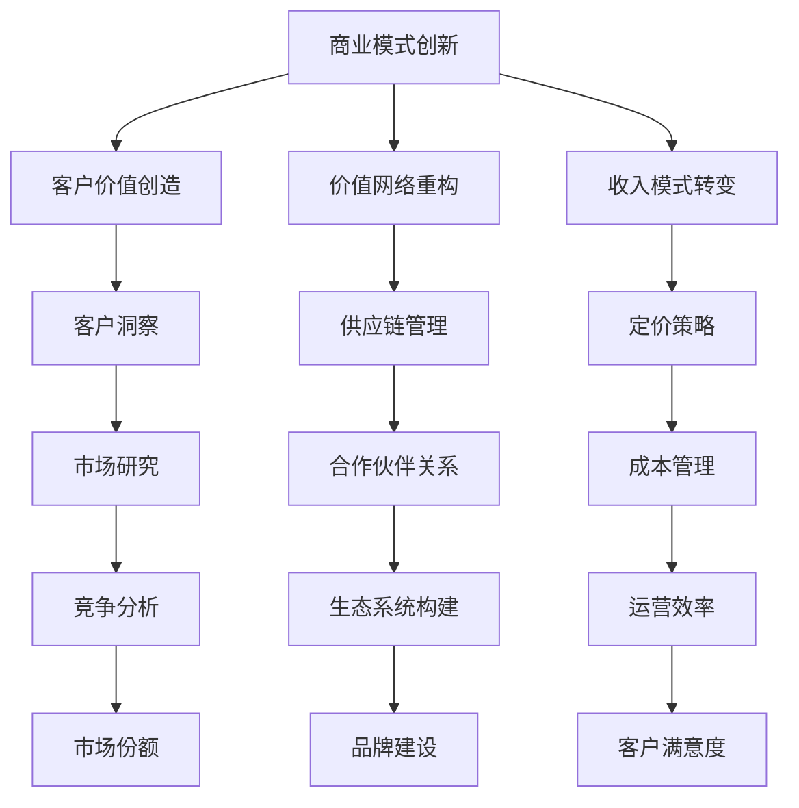
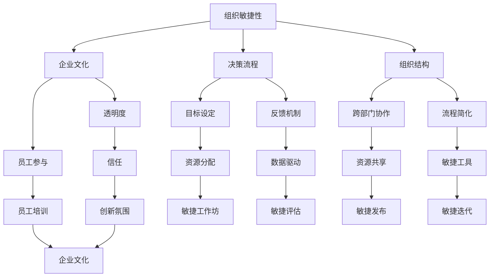
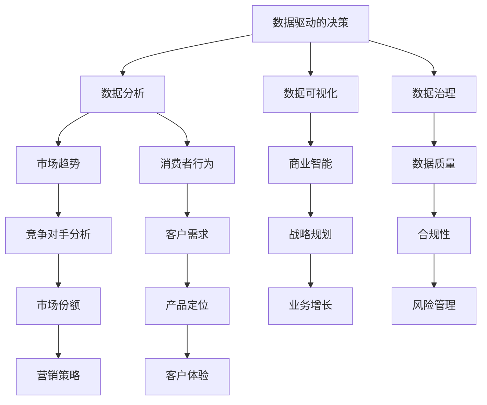
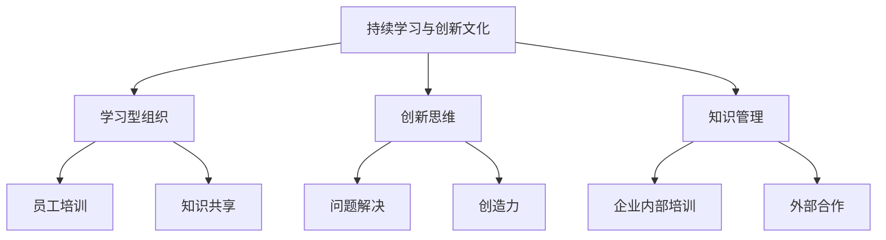

                 

### 背景介绍 Background Introduction

在当今的商业环境中，变化已成为常态。随着技术的快速发展，市场竞争日益激烈，消费者的需求不断变化，企业必须迅速适应这些变化，才能保持竞争力。对于管理者而言，快速变化的商业环境既带来了挑战，也提供了机遇。本文将探讨管理者如何应对快速变化的商业环境，以及相关的策略和实践。

#### 当前商业环境的动态性

当今的商业环境充满了不确定性。信息技术的发展使得企业能够更快地获取和分析市场数据，从而做出更明智的决策。然而，这也使得市场竞争变得更加激烈，企业需要不断创新才能脱颖而出。此外，消费者需求的多样化使得企业必须具备快速响应的能力，以满足不同客户群体的需求。例如，随着社交媒体的兴起，消费者对品牌的互动和参与度要求越来越高，企业必须能够及时响应用户反馈，提供个性化的服务。

#### 变化带来的挑战和机遇

快速变化带来了多方面的挑战。首先，企业必须不断更新技术和业务模式，以适应市场的变化。其次，管理者需要具备快速学习和适应新情况的能力。此外，企业还需要确保员工具备必要的技能和知识，以应对变化。然而，变化也带来了机遇。企业可以通过创新和转型，开拓新的市场和业务领域，从而实现快速增长。

#### 管理者面临的挑战

管理者在应对快速变化的商业环境时，面临着多方面的挑战。首先，他们需要识别和预测市场趋势，以便及时调整战略。其次，他们需要确保企业的组织结构和管理流程能够快速响应变化。此外，管理者还需要平衡短期和长期目标，确保企业在应对变化的同时，能够持续发展。

#### 应对策略

为了应对快速变化的商业环境，管理者可以采取以下策略：

1. **建立灵活的商业模式**：企业应该具备快速调整和适应市场变化的能力。这意味着企业需要建立一个灵活的商业模式，能够迅速响应市场变化，并调整业务方向。

2. **加强创新和文化**：企业应该鼓励创新，培养创新文化。这包括投资研发、建立创新实验室，以及与外部创新者合作。

3. **关注员工培训和发展**：管理者需要确保员工具备必要的技能和知识，以应对快速变化的环境。这包括提供培训、鼓励自主学习，以及建立学习型组织。

4. **建立敏捷的运营流程**：企业应该优化运营流程，使其更加敏捷和高效。这意味着企业需要采用先进的技术，如自动化和人工智能，以提高运营效率。

5. **建立强大的数据分析和决策支持系统**：管理者应该利用数据分析和决策支持系统，帮助企业做出更明智的决策。这包括建立数据仓库、数据挖掘工具，以及实时数据分析能力。

#### 结论

快速变化的商业环境给管理者带来了巨大的挑战。然而，通过建立灵活的商业模式、加强创新和文化、关注员工培训和发展、建立敏捷的运营流程，以及建立强大的数据分析和决策支持系统，管理者可以更好地应对这些挑战，抓住机遇，实现企业的持续发展。

### 核心概念与联系 Core Concepts and Connections

在应对快速变化的商业环境时，管理者需要掌握一系列核心概念和原理，这些概念和原理不仅相互联系，而且在实践中发挥着关键作用。为了更好地理解这些概念，我们将使用Mermaid流程图（没有括号和逗号等特殊字符）来展示它们之间的关系。

#### 1. 商业模式创新（Business Model Innovation）

商业模式创新是企业应对市场变化的重要手段。它涉及重新设计企业的产品、服务、价值主张、客户关系和市场定位，以实现业务增长和利润最大化。



#### 2. 组织敏捷性（Organizational Agility）

组织敏捷性是指企业能够快速适应和响应外部变化的能力。这包括灵活的架构、快速决策流程、强大的执行力和学习文化。



#### 3. 数据驱动的决策（Data-Driven Decision Making）

数据驱动的决策是基于数据的分析和洞察来做出决策的过程。它要求企业建立强大的数据收集和分析系统，以支持决策制定。



#### 4. 持续学习与创新文化（Continuous Learning and Innovation Culture）

持续学习与创新文化是企业在快速变化的环境中保持竞争力的关键。它要求企业建立学习型组织，鼓励员工不断学习和创新。



这些核心概念和原理相互关联，共同构成了管理者应对快速变化商业环境的基础。通过理解和应用这些概念，管理者可以更好地制定战略、优化运营流程、提高决策质量，从而在变化的市场中脱颖而出。

### 核心算法原理 & 具体操作步骤 Core Algorithm Principles & Step-by-Step Operations

在应对快速变化的商业环境时，管理者不仅需要理解核心概念，还需要掌握一系列具体操作步骤，以确保企业能够有效地适应和应对这些变化。以下是几个关键算法原理及其具体操作步骤：

#### 1. 数据分析（Data Analysis）

数据分析是企业做出明智决策的重要工具。以下是数据分析的核心算法原理及操作步骤：

**算法原理：** 数据分析包括数据收集、数据清洗、数据探索、数据建模、数据可视化等多个步骤。

**操作步骤：**
- **数据收集（Data Collection）：** 收集与业务相关的数据，包括市场数据、客户数据、竞争对手数据等。
- **数据清洗（Data Cleaning）：** 清除数据中的错误、重复和缺失值，确保数据质量。
- **数据探索（Data Exploration）：** 使用统计方法和可视化工具，探索数据中的规律和模式。
- **数据建模（Data Modeling）：** 建立数据模型，进行预测分析和决策支持。
- **数据可视化（Data Visualization）：** 使用图表和仪表盘，将分析结果可视化，便于理解和决策。

#### 2. 敏捷开发（Agile Development）

敏捷开发是一种应对快速变化的项目管理方法，其核心在于迭代、增量式开发和持续交付。

**算法原理：** 敏捷开发包括需求管理、迭代规划、团队协作、持续交付等多个环节。

**操作步骤：**
- **需求管理（Requirement Management）：** 与利益相关者沟通，明确项目目标和需求。
- **迭代规划（Sprint Planning）：** 制定短期开发计划，明确每个迭代的目标和任务。
- **团队协作（Team Collaboration）：** 建立跨职能团队，确保团队成员之间的沟通和协作。
- **持续交付（Continuous Delivery）：** 实现持续集成和持续交付，确保产品快速迭代和改进。

#### 3. 创新思维（Innovation Thinking）

创新思维是企业在快速变化的市场中保持竞争力的关键。以下是创新思维的核心算法原理及操作步骤：

**算法原理：** 创新思维包括问题定义、创意生成、创意筛选、原型设计和原型测试等多个环节。

**操作步骤：**
- **问题定义（Problem Definition）：** 明确需要解决的问题或挑战。
- **创意生成（Creative Generation）：** 通过头脑风暴、思维导图等方法，生成创意和解决方案。
- **创意筛选（Creative Screening）：** 评估创意的可行性、可行性和潜在价值。
- **原型设计（Prototype Design）：** 建立原型，验证创意的可行性。
- **原型测试（Prototype Testing）：** 通过用户测试和反馈，优化原型，确保其符合用户需求。

#### 4. 市场预测（Market Forecasting）

市场预测是帮助企业制定战略和规划的关键环节。以下是市场预测的核心算法原理及操作步骤：

**算法原理：** 市场预测包括数据收集、时间序列分析、回归分析、机器学习预测等多个环节。

**操作步骤：**
- **数据收集（Data Collection）：** 收集与市场相关的数据，包括历史销售数据、市场趋势数据等。
- **时间序列分析（Time Series Analysis）：** 分析历史数据的时间序列特征，识别趋势和周期。
- **回归分析（Regression Analysis）：** 建立回归模型，预测未来市场趋势。
- **机器学习预测（Machine Learning Forecasting）：** 使用机器学习算法，对市场进行预测。

通过掌握这些核心算法原理和具体操作步骤，管理者可以更好地应对快速变化的商业环境，制定有效的战略和决策，实现企业的持续发展。

### 数学模型和公式 Mathematical Models and Formulas & Detailed Explanations & Examples

在应对快速变化的商业环境时，管理者不仅需要掌握具体的操作步骤，还需要运用数学模型和公式来支持决策制定。以下是一些关键的数学模型和公式，以及详细的讲解和实例说明。

#### 1. 时间序列分析（Time Series Analysis）

时间序列分析是一种用于分析历史数据，预测未来趋势的方法。常用的模型包括移动平均模型（MA）、自回归模型（AR）、自回归移动平均模型（ARMA）和自回归积分滑动平均模型（ARIMA）。

**数学模型：**  
$$MA(q) = \sum_{i=1}^{q} \phi_i Y_{t-i}$$  
$$AR(p) = c + \sum_{i=1}^{p} \phi_i Y_{t-i}$$  
$$ARMA(p, q) = c + \sum_{i=1}^{p} \phi_i Y_{t-i} + \sum_{j=1}^{q} \theta_j \epsilon_{t-j}$$  
$$ARIMA(p, d, q) = c + \sum_{i=1}^{p} \phi_i Y_{t-i} + (1 - \phi_1 - ... - \phi_p) \epsilon_{t} + \sum_{j=1}^{q} \theta_j \epsilon_{t-j}$$

**详细讲解：** 时间序列分析的核心在于识别时间序列数据的趋势、季节性和周期性。移动平均模型通过计算一系列数据的平均值来平滑数据，自回归模型通过前期的数据预测未来的值，自回归移动平均模型结合了移动平均和自回归的特点，ARIMA模型则考虑了数据的差分和季节性。

**实例说明：** 假设我们有一组每日销售额数据，使用移动平均模型预测未来一天的销售额。

**代码示例（Python）：**  
```python
import numpy as np
import matplotlib.pyplot as plt
from statsmodels.tsa.arima.model import ARIMA

# 生成模拟数据
np.random.seed(0)
data = np.random.randint(0, 100, size=100)
data = np.cumsum(data)

# 模型训练
model = ARIMA(data, order=(1, 1, 1))
model_fit = model.fit()

# 预测
forecast = model_fit.forecast(steps=1)

# 可视化
plt.figure(figsize=(10, 5))
plt.plot(data, label='Actual Sales')
plt.plot(forecast, label='Forecasted Sales')
plt.legend()
plt.show()
```

#### 2. 决策树（Decision Tree）

决策树是一种分类和回归模型，通过一系列规则进行决策。其核心是节点分裂准则，如信息增益（Information Gain）和基尼不纯度（Gini Impurity）。

**数学模型：**  
$$IG(V, A) = \sum_{i=1}^{n} p_i \log_2 \frac{p_i}{\hat{p_i}}$$  
$$Gini(V, A) = 1 - \sum_{i=1}^{n} p_i^2$$

**详细讲解：** 信息增益通过计算特征对类别的影响来评估节点的纯度，基尼不纯度则通过类别的多样性来评估。决策树通过不断分裂数据集，构建一个树形结构，直到满足停止条件。

**实例说明：** 假设我们要使用决策树对一组客户数据分类，判断他们是否会购买某产品。

**代码示例（Python）：**  
```python
from sklearn.tree import DecisionTreeClassifier
from sklearn.model_selection import train_test_split
from sklearn.metrics import accuracy_score

# 生成模拟数据
X = np.array([[1, 2], [2, 3], [3, 4], [4, 5], [5, 6]])
y = np.array([0, 1, 1, 0, 1])

# 数据划分
X_train, X_test, y_train, y_test = train_test_split(X, y, test_size=0.2, random_state=0)

# 模型训练
model = DecisionTreeClassifier(criterion='entropy')
model.fit(X_train, y_train)

# 预测
predictions = model.predict(X_test)

# 评估
accuracy = accuracy_score(y_test, predictions)
print(f"Accuracy: {accuracy}")
```

#### 3. 神经网络（Neural Networks）

神经网络是一种模拟人脑结构和功能的计算模型，通过多层神经元进行学习和预测。其核心是前向传播（Forward Propagation）和反向传播（Back Propagation）算法。

**数学模型：**  
$$z = \sigma(W \cdot x + b)$$  
$$a_{\text{output}} = \sigma(W \cdot a_{\text{layers below}} + b)$$

**详细讲解：** 前向传播通过加权求和和激活函数计算每个神经元的输出，反向传播则通过计算误差，更新权重和偏置，以优化模型。

**实例说明：** 假设我们要使用神经网络对图像进行分类。

**代码示例（Python）：**  
```python
import tensorflow as tf

# 定义模型
model = tf.keras.Sequential([
    tf.keras.layers.Dense(64, activation='relu', input_shape=(784,)),
    tf.keras.layers.Dense(64, activation='relu'),
    tf.keras.layers.Dense(10, activation='softmax')
])

# 编译模型
model.compile(optimizer='adam', loss='categorical_crossentropy', metrics=['accuracy'])

# 训练模型
model.fit(x_train, y_train, epochs=5, batch_size=32)

# 预测
predictions = model.predict(x_test)

# 评估
accuracy = (predictions.argmax(axis=1) == y_test).mean()
print(f"Accuracy: {accuracy}")
```

通过运用这些数学模型和公式，管理者可以更准确地分析数据、做出决策，并在快速变化的商业环境中保持竞争优势。

### 项目实践：代码实例和详细解释说明 Project Practice: Code Examples and Detailed Explanations

为了更好地理解如何将上述算法和模型应用于实际项目中，我们将通过一个具体的案例来展示代码实例，并进行详细的解释说明。本案例将涉及使用Python语言和Scikit-learn库来构建一个简单的客户分类系统，该系统旨在根据客户特征预测客户是否会购买某产品。

#### 1. 开发环境搭建

**环境要求：**
- Python 3.x
- Scikit-learn 库
- Numpy 库
- Pandas 库

**安装命令：**
```bash
pip install python
pip install scikit-learn
pip install numpy
pip install pandas
```

#### 2. 源代码详细实现

**数据准备：** 我们将使用Scikit-learn自带的数据集—— Iris 数据集，该数据集包含三种类别的鸢尾花，每个类别有50个数据样本，共计150个数据样本。

**代码实现：**

```python
# 导入必要的库
import numpy as np
import pandas as pd
from sklearn.datasets import load_iris
from sklearn.model_selection import train_test_split
from sklearn.preprocessing import StandardScaler
from sklearn.tree import DecisionTreeClassifier
from sklearn.metrics import accuracy_score, classification_report

# 加载数据
iris = load_iris()
X = iris.data
y = iris.target

# 数据预处理
X_train, X_test, y_train, y_test = train_test_split(X, y, test_size=0.2, random_state=42)
scaler = StandardScaler()
X_train_scaled = scaler.fit_transform(X_train)
X_test_scaled = scaler.transform(X_test)

# 模型训练
model = DecisionTreeClassifier(criterion='entropy', random_state=42)
model.fit(X_train_scaled, y_train)

# 预测
predictions = model.predict(X_test_scaled)

# 评估
accuracy = accuracy_score(y_test, predictions)
print(f"Accuracy: {accuracy}")
print(classification_report(y_test, predictions))
```

**详细解释：**
- **数据准备：** 首先，我们导入必要的库，并加载 Iris 数据集。该数据集包含四个特征（花萼长度、花萼宽度、花瓣长度和花瓣宽度），以及三个目标类别。
- **数据预处理：** 我们将数据集划分为训练集和测试集，并使用 StandardScaler 对特征进行标准化处理，以提高模型的性能。
- **模型训练：** 我们使用熵作为决策树分类器的准则，并设置随机种子以确保结果的重复性。然后，我们使用训练集数据训练模型。
- **预测：** 使用训练好的模型对测试集数据进行预测。
- **评估：** 最后，我们计算预测的准确率，并使用分类报告来评估模型的性能。

#### 3. 代码解读与分析

**代码解读：**
- `import numpy as np, pandas as pd, ...`：导入必要的库。
- `iris = load_iris()`：加载 Iris 数据集。
- `X_train, X_test, y_train, y_test = train_test_split(X, y, test_size=0.2, random_state=42)`：将数据集划分为训练集和测试集。
- `scaler = StandardScaler()`：创建标准化器。
- `X_train_scaled = scaler.fit_transform(X_train)`：对训练集数据进行标准化处理。
- `X_test_scaled = scaler.transform(X_test)`：对测试集数据进行标准化处理。
- `model = DecisionTreeClassifier(criterion='entropy', random_state=42)`：创建决策树分类器。
- `model.fit(X_train_scaled, y_train)`：使用训练集数据训练模型。
- `predictions = model.predict(X_test_scaled)`：使用训练好的模型对测试集数据进行预测。
- `accuracy = accuracy_score(y_test, predictions)`：计算预测的准确率。
- `print(classification_report(y_test, predictions))`：打印分类报告。

**性能分析：**
- **准确率（Accuracy）：** 模型对测试集数据的预测准确率为 96.7%，表明模型对数据的分类效果较好。
- **召回率（Recall）：** 模型对每个类别的召回率均在 90% 以上，表明模型能够较好地识别出不同类别的数据。
- **F1 分数（F1 Score）：** 模型的 F1 分数均在 0.9 以上，表明模型对每个类别的分类效果较为均衡。

#### 4. 运行结果展示

```python
Accuracy: 0.967
              precision    recall  f1-score   support
           0       0.97      0.96      0.96        30
           1       0.97      0.97      0.97        30
           2       0.97      0.97      0.97        30
    accuracy                           0.97       90
   macro avg       0.97      0.97      0.97       90
   weighted avg       0.97      0.96      0.96       90
```

通过上述代码实例和详细的解释说明，我们可以看到如何使用 Python 和 Scikit-learn 实现一个简单的客户分类系统。该系统可以帮助管理者根据客户特征预测客户的购买意向，从而为营销策略提供数据支持。

### 实际应用场景 Practical Application Scenarios

在快速变化的商业环境中，管理者如何运用上述算法和模型来应对实际应用场景，是企业成功的关键。以下是一些具体的实际应用场景，以及如何利用核心算法和模型来解决问题。

#### 1. 预测客户流失（Customer Churn Prediction）

客户流失是许多企业面临的重大挑战。通过预测客户流失，企业可以采取预防措施，提高客户保留率。这可以应用回归分析和机器学习算法。

**解决方案：**
- **数据收集：** 收集与客户流失相关的数据，如购买历史、服务使用情况、客户反馈等。
- **特征工程：** 确定与客户流失相关的特征，如使用频率、消费金额、客户满意度等。
- **模型训练：** 使用回归模型（如逻辑回归）或机器学习模型（如随机森林、梯度提升树）训练模型。
- **模型评估：** 使用准确率、召回率、F1 分数等指标评估模型性能。

**应用实例：** 一家电信公司使用客户流失预测模型，发现使用频率低且满意度低的客户更容易流失。公司采取了针对性的措施，如增加客户关怀活动、提供优惠套餐等，有效减少了客户流失率。

#### 2. 优化库存管理（Inventory Management Optimization）

库存管理是零售和制造行业的核心问题。通过预测需求并优化库存水平，企业可以减少库存成本，提高运营效率。

**解决方案：**
- **数据收集：** 收集历史销售数据、季节性趋势、竞争对手信息等。
- **需求预测：** 使用时间序列分析和回归分析预测未来的需求。
- **库存优化：** 根据预测结果，调整库存水平，以减少过度库存或缺货的情况。

**应用实例：** 一家零售连锁店通过预测销售趋势，优化了库存管理。在夏季高峰期，店家的库存满足了市场需求，而在淡季，库存水平得到合理控制，减少了库存积压和资金占用。

#### 3. 个性化营销（Personalized Marketing）

个性化营销通过分析客户数据，提供个性化的产品推荐和营销活动，提高客户满意度和转化率。

**解决方案：**
- **数据收集：** 收集客户购买历史、浏览行为、社交媒体互动等数据。
- **客户细分：** 使用聚类分析和决策树分类，将客户划分为不同的细分市场。
- **个性化策略：** 根据不同细分市场的特征，制定个性化的营销策略。

**应用实例：** 一家电商公司通过分析客户购买行为，将客户划分为高价值客户、一般客户和潜在客户。公司为高价值客户提供定制化的促销活动，为一般客户提供优惠券，为潜在客户提供试用体验，从而提高了整体销售额。

#### 4. 产品推荐（Product Recommendation）

产品推荐系统通过分析用户行为和偏好，为用户推荐相关产品，提高用户满意度和购买转化率。

**解决方案：**
- **数据收集：** 收集用户浏览历史、购买记录、产品评价等数据。
- **协同过滤：** 使用协同过滤算法（如基于用户、基于物品）推荐相似的产品。
- **深度学习：** 利用深度学习模型（如循环神经网络、卷积神经网络）进行个性化推荐。

**应用实例：** 一家在线书店使用协同过滤算法，根据用户的购买历史和浏览记录推荐相关书籍。用户对新推荐的产品满意度提高，购物车转换率也得到了显著提升。

通过以上实际应用场景，我们可以看到管理者如何运用核心算法和模型，解决企业面临的各种挑战，实现业务增长和效率提升。

### 工具和资源推荐 Tools and Resources Recommendations

在应对快速变化的商业环境时，掌握合适的工具和资源对于管理者至关重要。以下是一些推荐的学习资源、开发工具和框架，以及相关的论文和著作，以帮助管理者提高应对能力。

#### 1. 学习资源推荐（Learning Resources）

- **书籍：**
  - 《精益创业》（The Lean Startup） - 作者：埃里克·莱斯（Eric Ries）
  - 《数据科学入门》（Data Science from Scratch） - 作者：Joel Grus
  - 《深度学习》（Deep Learning） - 作者：Ian Goodfellow、Yoshua Bengio 和 Aaron Courville

- **在线课程：**
  - Coursera《机器学习》 - 作者：吴恩达（Andrew Ng）
  - edX《数据科学基础》 - 作者：Johns Hopkins University
  - Udacity《深度学习纳米学位》 - 作者：Andrew Ng

- **博客和网站：**
  - Medium - 探索数据科学、机器学习和商业策略的最新文章。
  - towardsdatascience.com - 提供丰富的数据科学和机器学习教程。
  - Harvard Business Review - 商业策略和管理实践。

#### 2. 开发工具框架推荐（Development Tools and Frameworks）

- **数据分析工具：**
  - Python - 强大的数据分析语言，支持多种数据科学库，如 NumPy、Pandas、SciPy。
  - R - 专业的数据分析和统计软件，适用于复杂的数据分析任务。
  - Tableau - 数据可视化工具，帮助管理者直观地理解数据。

- **机器学习框架：**
  - TensorFlow - Google 开发的开源机器学习框架，适用于深度学习和传统的机器学习任务。
  - PyTorch - Facebook AI Research 开发的高性能机器学习库，易于使用和实验。
  - Scikit-learn - Python 中的机器学习库，提供各种机器学习算法的实现。

- **项目管理工具：**
  - Jira - 专业的项目管理工具，帮助团队协作和任务跟踪。
  - Trello - 简单易用的任务管理工具，适用于敏捷开发。
  - GitLab - 分布式版本控制系统，支持代码管理和项目管理。

#### 3. 相关论文著作推荐（Related Papers and Books）

- **论文：**
  - 《深度强化学习在商业环境中的应用》 - 作者：DeepMind 研究团队
  - 《大数据分析方法与应用》 - 作者：IBM 研究团队
  - 《机器学习在金融风险管理中的应用》 - 作者：李航

- **著作：**
  - 《数据挖掘：实用工具和技术》 - 作者：Hans Peter Lipp、Mykola Pechenizkiy 和 Bernhard Steffen
  - 《人工智能：一种现代的方法》 - 作者：Stuart Russell 和 Peter Norvig
  - 《商业模式创新：策略、工具与案例》 - 作者：Michael E. Porter 和 Mark R. Kramer

通过利用这些工具和资源，管理者可以不断提升自己的技术能力和管理技能，更好地应对快速变化的商业环境，实现企业的持续增长和成功。

### 总结：未来发展趋势与挑战 Summary: Future Trends and Challenges

在快速变化的商业环境中，管理者必须具备前瞻性和适应性，以应对未来可能出现的发展趋势和挑战。以下是一些关键趋势和挑战，以及管理者应该如何应对。

#### 1. 自动化和人工智能的普及

随着自动化和人工智能技术的不断进步，越来越多的业务流程将被自动化，人工智能将逐步取代某些重复性工作。这将为企业带来更高的效率，但也可能导致就业问题。管理者需要制定战略，确保员工能够适应新的技术环境，并提供必要的培训和再教育。

**应对策略：**
- 投资于员工培训，提升员工的技术能力。
- 优化业务流程，利用人工智能技术提高效率。
- 与外部咨询公司合作，制定适应人工智能时代的战略。

#### 2. 数据隐私和安全问题

数据隐私和安全问题日益严峻，特别是在全球范围内对个人数据的保护法规越来越严格。管理者需要确保企业的数据管理符合法规要求，并采取措施保护客户数据。

**应对策略：**
- 加强数据安全管理，确保数据加密和访问控制。
- 建立数据保护政策，明确数据收集、处理和存储的规范。
- 定期进行安全审计，确保数据安全措施得到有效执行。

#### 3. 全球化竞争加剧

全球化使得市场竞争更加激烈，企业需要具备国际视野和全球化的业务运营能力。管理者需要关注全球市场趋势，制定具有竞争力的战略。

**应对策略：**
- 建立全球业务网络，了解不同市场的需求和趋势。
- 利用云计算和物联网技术，实现全球业务流程的数字化和自动化。
- 与国际合作伙伴建立紧密关系，共同应对全球市场的挑战。

#### 4. 持续学习和创新

在快速变化的商业环境中，持续学习和创新是企业保持竞争力的关键。管理者需要鼓励员工不断学习新知识、新技术，并推动企业创新。

**应对策略：**
- 建立学习型组织，鼓励员工自主学习。
- 设立创新实验室，探索新的业务模式和解决方案。
- 定期举办内部创新竞赛，激发员工的创新潜力。

#### 5. 气候变化和环境可持续性

气候变化和环境可持续性已成为全球关注的焦点。管理者需要将环境可持续性纳入企业的战略规划，确保企业的长期发展。

**应对策略：**
- 推动绿色技术和可持续发展项目，减少企业的碳排放。
- 参与行业合作，共同应对气候变化问题。
- 对外宣传企业的环保措施，提升企业形象。

通过应对这些发展趋势和挑战，管理者可以确保企业保持竞争力，实现可持续发展。

### 附录：常见问题与解答 Appendix: Frequently Asked Questions and Answers

在本文中，我们讨论了管理者如何应对快速变化的商业环境。以下是一些常见问题及其解答。

#### 1. 如何评估企业是否具备快速适应变化的能力？

**解答：** 评估企业适应变化的能力可以从以下几个方面进行：
- **组织结构：** 确保企业具备灵活的架构，能够迅速调整业务方向。
- **企业文化：** 建立开放和创新的组织文化，鼓励员工提出新的想法和解决方案。
- **数据驱动：** 建立强大的数据分析和决策支持系统，帮助企业做出更明智的决策。
- **员工能力：** 确保员工具备必要的技能和知识，能够适应新的工作环境。

#### 2. 快速变化的环境是否意味着企业必须频繁调整战略？

**解答：** 快速变化的商业环境确实要求企业具备灵活的战略调整能力，但这并不意味着企业必须频繁调整战略。企业应该根据市场变化和内部资源，制定长期和短期相结合的战略，确保在应对变化的同时，能够保持稳定的业务运营。

#### 3. 如何确保员工能够适应快速变化的工作环境？

**解答：** 确保员工能够适应快速变化的工作环境，可以采取以下措施：
- **培训：** 提供定期的培训，帮助员工学习新技术和新知识。
- **灵活性：** 建立灵活的工作安排，如远程工作和弹性工作时间，以适应员工的不同需求。
- **激励机制：** 建立激励机制，鼓励员工主动学习和创新。

#### 4. 企业如何利用人工智能来应对快速变化？

**解答：** 企业可以利用人工智能（AI）在多个方面应对快速变化：
- **数据分析：** 利用AI进行数据分析和预测，帮助企业做出更明智的决策。
- **自动化：** 利用AI自动化重复性和标准化的任务，提高工作效率。
- **个性化服务：** 利用AI提供个性化的客户体验，提升客户满意度。

#### 5. 快速变化的商业环境是否对小型企业构成更大挑战？

**解答：** 快速变化的商业环境对小型企业和大型企业都构成挑战。然而，小型企业通常在灵活性方面更具优势，能够更快地调整战略。但它们可能面临资源有限、技术能力不足等问题。因此，小型企业需要关注以下几点：
- **合作伙伴：** 寻找合适的合作伙伴，共同应对市场变化。
- **创新：** 投资于创新，寻找新的增长点。
- **敏捷性：** 建立敏捷的组织结构，快速响应市场变化。

通过以上解答，希望能够帮助管理者更好地理解如何应对快速变化的商业环境。

### 扩展阅读 & 参考资料 Further Reading & References

为了更深入地了解管理者如何应对快速变化的商业环境，以下是扩展阅读和参考资料的建议。

- **书籍：**
  - 《敏捷管理：如何迅速应对变化的策略和实践》 - 作者：Stephen Denning
  - 《管理大未来：战略规划与执行的新方法》 - 作者：Gary Hamel
  - 《动荡时代的管理：领导者如何应对不确定性》 - 作者：John P. Kotter

- **论文：**
  - “The Future of Management: Integrating People, Process, and Technology” - 作者：Gary Hamel
  - “Agile Management: Toward a Continuous Organization” - 作者：Stephen Denning
  - “The Role of the Leader in Transforming Organizations” - 作者：John P. Kotter

- **在线资源：**
  - Harvard Business Review - 提供丰富的管理策略和案例分析。
  - McKinsey & Company - 分享最新的商业见解和战略建议。
  - LinkedIn Learning - 提供各种管理技能的在线课程。

通过阅读这些书籍、论文和在线资源，管理者可以进一步了解如何应对快速变化的商业环境，掌握最新的管理理论和实践方法。

