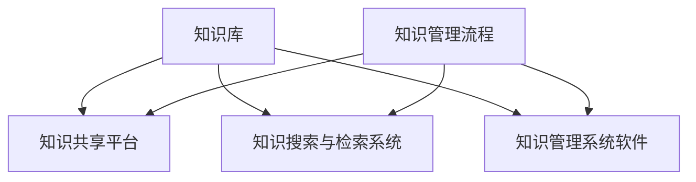

                 

### 背景介绍

在信息爆炸的时代，知识的积累和整理变得尤为重要。对于管理者而言，如何高效地建立个人知识管理系统，不仅关乎个人职业发展，更直接影响到团队的工作效率和创新能力。本文将深入探讨管理者如何构建个人知识管理系统，提供系统的指导和实用的建议。

首先，我们需要明确知识管理系统（Knowledge Management System，简称KMS）的定义。知识管理系统是一种通过技术手段来管理和整合知识资源，促进知识共享和利用的系统。对于管理者而言，KMS不仅是一个工具，更是一个战略性的资源，能够帮助他们更有效地获取、存储、分析和应用知识。

在当今高速发展的商业环境中，管理者面临着诸多挑战。数据量呈指数级增长，信息来源多样化，使得管理者需要具备强大的信息处理能力。同时，知识更新速度快，管理者需要不断学习新知识，保持专业领域的领先地位。此外，团队协作和知识共享的重要性日益凸显，管理者需要构建一个高效的知识共享平台，促进团队内部的知识流动。

因此，建立个人知识管理系统不仅有助于管理者提升自身能力，还能为团队和组织的知识管理提供有力支持。接下来，我们将从核心概念、算法原理、数学模型、项目实践、实际应用场景、工具和资源推荐等多个方面，详细探讨如何构建和管理个人知识系统。

### 核心概念与联系

为了深入理解个人知识管理系统的构建，我们需要首先明确几个核心概念，并探讨它们之间的相互联系。

#### 1. 知识管理（Knowledge Management）

知识管理是指通过一系列策略和技术手段，来识别、获取、共享、应用和更新知识的活动。它不仅仅是一种管理知识的方法，更是一种企业战略，旨在通过有效管理知识资源，提升组织的竞争力。

知识管理包括以下几个关键要素：

- **知识的识别与获取**：确定哪些知识对组织或个人有价值，并从各种来源获取这些知识。
- **知识的存储与组织**：将获取到的知识存储在适当的地方，并采用有效的分类和标签系统，以便于检索和使用。
- **知识的共享与传播**：通过内部沟通、培训、会议等方式，促进知识的共享和传播，使更多的人能够使用这些知识。
- **知识的应用与创新**：将知识应用于实际工作中，促进创新和改进，同时通过实践和反馈不断更新知识。

#### 2. 知识管理系统的架构

知识管理系统通常包括以下几个组成部分：

- **知识库**：存储各种知识文档、数据、信息的地方，是知识管理的核心。
- **知识共享平台**：提供知识共享、交流和协作的场所，如内部论坛、知识社区等。
- **知识搜索与检索系统**：帮助用户快速找到所需的知识资源。
- **知识管理系统软件**：支持知识管理的工具，如文档管理软件、内容管理系统等。
- **知识管理流程**：确保知识管理活动按照一定的规范和流程进行，如知识创建、审核、发布、更新等。

以下是知识管理系统的架构的Mermaid流程图：



#### 3. 知识类型与分类

知识可以分为多种类型，每种类型在知识管理中扮演不同的角色。常见的知识类型包括：

- **显性知识（Explicit Knowledge）**：易于编码、存储和传播的知识，如文档、数据、图表等。
- **隐性知识（Tacit Knowledge）**：难以编码、存储和传播的知识，通常通过个人经验和直觉获取，如专业技能、行业洞察等。
- **结构化知识（Structured Knowledge）**：已经按照某种结构化方式进行组织的知识，如数据库、数据仓库等。
- **非结构化知识（Unstructured Knowledge）**：没有按照特定结构组织的数据，如电子邮件、文件等。

不同类型的知识需要采用不同的管理策略和方法，以实现最优的管理效果。

#### 4. 知识管理中的关键挑战

在建立个人知识管理系统中，管理者将面临以下几个关键挑战：

- **知识的识别与获取**：如何准确地识别出对个人和组织有价值的信息，是知识管理的首要挑战。
- **知识的存储与组织**：如何高效地存储和组织大量知识资源，使其易于检索和使用。
- **知识的共享与传播**：如何促进知识的共享，使团队内部的知识流动更加顺畅。
- **知识的应用与创新**：如何将知识应用于实际工作中，促进创新和改进。

通过理解和应对这些挑战，管理者可以更好地构建和维护个人知识管理系统，从而提升个人和团队的工作效率。

综上所述，个人知识管理系统是一个复杂但至关重要的工具。它不仅需要管理者掌握知识管理的核心概念，还需要他们具备系统思考和综合分析的能力。接下来，我们将深入探讨如何通过核心算法原理和具体操作步骤，构建有效的个人知识管理系统。

### 核心算法原理 & 具体操作步骤

为了构建一个高效的个人知识管理系统，我们需要运用一系列核心算法原理和具体操作步骤。以下是构建个人知识管理系统的关键步骤和方法。

#### 1. 知识采集与识别

首先，我们需要确定哪些知识对个人和组织有价值，然后进行采集和识别。以下是几个关键步骤：

- **需求分析**：通过调研、访谈和问卷调查等方式，了解个人和团队在知识管理方面的需求和痛点。
- **知识源识别**：确定知识来源，如内部文档、外部资料、专家经验等。
- **内容筛选**：根据需求分析的结果，对知识源进行筛选，只采集对个人和组织有价值的信息。

#### 2. 知识分类与标签

为了方便知识的存储、检索和使用，我们需要对知识进行分类和标签化。以下是具体步骤：

- **分类体系构建**：建立一个统一的分类体系，如按照业务领域、知识类型、应用场景等进行分类。
- **标签系统设计**：设计一个标签系统，使用关键词、标签对知识进行标注，以便于后续的检索和利用。

#### 3. 知识存储与管理

在确定知识的分类和标签后，我们需要将知识存储到合适的系统中，并进行有效的管理。以下是几个关键步骤：

- **知识库选择**：选择合适的知识库系统，如文档管理系统、内容管理系统等。
- **知识存储**：将知识按照分类和标签进行存储，确保知识结构清晰、易于检索。
- **版本控制**：对知识文档进行版本控制，确保知识的准确性和一致性。

#### 4. 知识共享与传播

知识管理不仅仅是为了存储和检索知识，更重要的是要促进知识的共享和传播。以下是具体步骤：

- **知识共享平台搭建**：搭建一个内部的知识共享平台，如知识社区、内部论坛等。
- **知识分享机制设计**：制定知识分享的激励机制，鼓励团队成员主动分享知识和经验。
- **知识传播活动组织**：定期组织知识分享会议、培训等活动，促进知识的传播和交流。

#### 5. 知识应用与创新

知识的应用和创新是知识管理的最终目标。以下是具体步骤：

- **知识应用场景识别**：分析个人和团队的工作流程，识别知识应用的场景和机会。
- **知识应用实践**：将知识应用于实际工作中，解决实际问题，提升工作效率。
- **知识更新与迭代**：通过实践和反馈，不断更新和迭代知识，保持知识的时效性和准确性。

#### 6. 数据分析与反馈

为了确保知识管理系统的有效性和持续改进，我们需要进行数据分析和反馈。以下是具体步骤：

- **数据分析**：收集和整理知识管理系统的使用数据，如知识检索频率、知识分享数量等。
- **反馈机制设计**：建立反馈机制，收集用户对知识管理系统的意见和建议。
- **持续改进**：根据数据分析结果和用户反馈，持续改进知识管理系统，提升用户体验。

通过以上步骤，我们可以构建一个高效的个人知识管理系统。以下是每个步骤的详细说明：

1. **知识采集与识别**：
   - 需求分析：通过访谈、问卷调查等方式，了解团队成员在知识管理方面的需求，如需要哪些类型的知识资源，如何更好地利用现有知识等。
   - 知识源识别：确定知识来源，包括内部文档、外部资料、专家经验等。内部文档可以包括公司内部的报告、项目文档、业务流程文档等；外部资料可以包括行业报告、学术论文、专业博客等；专家经验则是从公司内部或外部的专家那里获取的专业知识和经验。

2. **知识分类与标签**：
   - 分类体系构建：建立一个统一的分类体系，如按照业务领域（如市场、销售、研发等）、知识类型（如策略、流程、技术等）、应用场景（如日常办公、项目执行等）进行分类。这有助于确保知识结构清晰，便于后续的检索和使用。
   - 标签系统设计：设计一个标签系统，使用关键词、标签对知识进行标注。例如，一个关于市场策略的知识文档可以标注为“市场策略”、“竞争分析”、“客户行为”等标签。标签的设置应充分考虑知识的特点和使用场景，以便于多维度检索。

3. **知识存储与管理**：
   - 知识库选择：选择合适的知识库系统，如Confluence、Trello、Notion等，根据团队的规模和需求选择合适的工具。这些工具提供了丰富的功能，如文档管理、版本控制、协作编辑等。
   - 知识存储：将知识按照分类和标签进行存储，确保知识结构清晰、易于检索。例如，一个关于市场策略的知识文档应存储在“市场”分类下，并使用相应的标签进行标注。
   - 版本控制：对知识文档进行版本控制，确保知识的准确性和一致性。每次修改知识文档时，系统应自动生成新的版本，并保留旧版本的历史记录，以便于追溯和审核。

4. **知识共享与传播**：
   - 知识共享平台搭建：搭建一个内部的知识共享平台，如知识社区、内部论坛等。这些平台可以提供讨论区、知识库、问答等功能，促进团队成员之间的交流和知识共享。
   - 知识分享机制设计：制定知识分享的激励机制，鼓励团队成员主动分享知识和经验。例如，可以设置知识分享积分系统，积分可以兑换奖励或用于晋升考核等。
   - 知识传播活动组织：定期组织知识分享会议、培训等活动，促进知识的传播和交流。这些活动可以是定期的内部研讨会、主题分享会，也可以是跨部门的知识交流会。

5. **知识应用与创新**：
   - 知识应用场景识别：分析个人和团队的工作流程，识别知识应用的场景和机会。例如，在项目执行过程中，可以应用项目管理知识来优化工作流程，提高项目效率。
   - 知识应用实践：将知识应用于实际工作中，解决实际问题，提升工作效率。例如，使用市场策略知识来指导市场推广活动，提高市场反响和销售额。
   - 知识更新与迭代：通过实践和反馈，不断更新和迭代知识，保持知识的时效性和准确性。例如，根据市场变化和客户需求，更新市场策略文档，使其更具实用性和指导性。

6. **数据分析与反馈**：
   - 数据分析：收集和整理知识管理系统的使用数据，如知识检索频率、知识分享数量等。这些数据可以反映知识管理系统的使用效果和团队成员的知识需求。
   - 反馈机制设计：建立反馈机制，收集用户对知识管理系统的意见和建议。这些反馈可以帮助我们了解系统的不足之处，为后续的改进提供依据。
   - 持续改进：根据数据分析结果和用户反馈，持续改进知识管理系统，提升用户体验。例如，优化知识库的检索算法，提高检索的准确性；改进知识分享机制，提高知识共享的积极性等。

通过以上核心算法原理和具体操作步骤，管理者可以构建一个高效、实用的个人知识管理系统，从而提升个人和团队的工作效率，促进知识的共享和创新。

### 数学模型和公式 & 详细讲解 & 举例说明

在构建个人知识管理系统中，数学模型和公式扮演着至关重要的角色。通过数学模型，我们可以量化知识管理的各个方面，从而提供更加科学和系统的解决方案。以下是几个关键的数学模型和公式，以及它们在实际操作中的应用和详细讲解。

#### 1. 知识价值评估模型

知识价值评估模型用于评估知识对个人和组织的价值。一个常见的方法是使用价值-成本分析（Value-Cost Analysis，VCA）模型。该模型通过计算知识的预期价值和获取成本，来评估知识的价值。

公式如下：

\[ V = \frac{E - C}{R} \]

其中：
- \( V \) 是知识的价值。
- \( E \) 是知识预期带来的收益（如提高工作效率、减少错误率等）。
- \( C \) 是获取知识的成本（如时间、金钱等）。
- \( R \) 是风险的系数，用于衡量知识应用过程中的不确定性。

**示例：** 假设一位管理者计划引入一个新的项目管理工具，预期可以提高项目效率20%，而该工具的获取成本为5000美元。假设风险系数为1.2，则知识价值评估如下：

\[ V = \frac{0.20 \times 5000 - 5000}{1.2} = \frac{1000 - 5000}{1.2} = \frac{-4000}{1.2} \approx -3333.33 \]

这个结果表明，引入该工具的预期价值为负，因此管理者可能需要重新评估是否引入这个工具。

#### 2. 知识共享激励机制设计

为了鼓励团队成员积极分享知识和经验，可以设计一个基于博弈论的激励机制。该模型通过计算团队成员的知识共享意愿和收益，来设计合理的激励措施。

公式如下：

\[ U_i = \alpha_i \cdot \sum_{j \in N} w_{ij} \cdot X_j \]

其中：
- \( U_i \) 是第 \( i \) 个团队成员的效用。
- \( \alpha_i \) 是第 \( i \) 个团队成员的知识贡献系数。
- \( w_{ij} \) 是第 \( i \) 个团队成员对第 \( j \) 个团队成员的知识评价权重。
- \( X_j \) 是第 \( j \) 个团队成员的知识分享量。

**示例：** 假设有三个团队成员A、B和C，他们的知识贡献系数分别为1.5、1.2和1.0，评价权重分别为0.3、0.4和0.3。假设A分享了10份知识，B分享了5份知识，C分享了3份知识，则他们的效用计算如下：

- \( U_A = 1.5 \cdot (0.3 \cdot 5 + 0.4 \cdot 3 + 0.3 \cdot 3) = 1.5 \cdot (1.5 + 1.2 + 0.9) = 1.5 \cdot 3.6 = 5.4 \)
- \( U_B = 1.2 \cdot (0.3 \cdot 10 + 0.4 \cdot 5 + 0.3 \cdot 3) = 1.2 \cdot (3 + 2 + 0.9) = 1.2 \cdot 5.9 = 7.08 \)
- \( U_C = 1.0 \cdot (0.3 \cdot 10 + 0.4 \cdot 5 + 0.3 \cdot 3) = 1.0 \cdot (3 + 2 + 0.9) = 1.0 \cdot 5.9 = 5.9 \)

通过这个模型，管理者可以计算出每个团队成员的知识贡献和效用，从而设计合理的激励机制，如知识积分、奖金等。

#### 3. 知识更新频率模型

为了保持知识的新鲜度和准确性，需要定期更新知识库。一个常用的方法是基于知识生命周期模型，计算知识更新频率。

公式如下：

\[ F = \frac{\lambda}{\mu} \]

其中：
- \( F \) 是知识更新频率。
- \( \lambda \) 是知识老化系数，表示知识过时的速度。
- \( \mu \) 是知识更新系数，表示知识更新的速度。

**示例：** 假设知识老化系数为0.1年/年，知识更新系数为0.2年/年，则知识更新频率为：

\[ F = \frac{0.1}{0.2} = 0.5 \]

这意味着，知识库需要每半年进行一次全面更新，以确保知识的时效性和准确性。

通过这些数学模型和公式，管理者可以更加科学地评估知识的价值，设计合理的激励机制，并确保知识的持续更新和优化。这些模型不仅提供了理论指导，也为实际操作提供了量化的依据，从而提升个人知识管理系统的效果。

### 项目实践：代码实例和详细解释说明

为了更好地理解个人知识管理系统的构建，我们将通过一个实际项目来展示代码实例，并对关键代码进行详细解释说明。

#### 项目简介

本项目旨在构建一个简单的个人知识管理系统，帮助用户有效地管理和共享知识。系统主要包括以下几个模块：

1. **知识库**：用于存储和管理知识文档。
2. **用户管理**：用于管理用户信息，包括注册、登录、权限管理等功能。
3. **知识共享**：提供知识分享和讨论功能。
4. **知识搜索**：提供知识检索功能。

#### 开发环境搭建

为了开发本项目，我们需要以下工具和软件：

- **编程语言**：Python
- **开发框架**：Flask
- **前端框架**：Bootstrap
- **数据库**：SQLite

首先，我们需要安装Python和相关依赖库：

```bash
pip install flask
pip install flask_sqlalchemy
pip install flask_login
pip install flask_bcrypt
pip install flask_mail
```

接下来，创建一个名为`knowledge_management_system`的虚拟环境，并在其中安装以上依赖库。

#### 源代码详细实现

以下是项目的核心代码实现，包括后端API和前端页面。

##### 1. 后端API

```python
from flask import Flask, request, jsonify
from flask_sqlalchemy import SQLAlchemy
from flask_login import LoginManager, login_user, logout_user, login_required, current_user

app = Flask(__name__)
app.config['SQLALCHEMY_DATABASE_URI'] = 'sqlite:///knowledge_management_system.db'
app.config['SECRET_KEY'] = 'your_secret_key'

db = SQLAlchemy(app)
login_manager = LoginManager(app)

# 用户模型
class User(db.Model):
    id = db.Column(db.Integer, primary_key=True)
    username = db.Column(db.String(100), unique=True, nullable=False)
    password = db.Column(db.String(100), nullable=False)

# 知识文档模型
class Document(db.Model):
    id = db.Column(db.Integer, primary_key=True)
    title = db.Column(db.String(100), nullable=False)
    content = db.Column(db.Text, nullable=False)
    user_id = db.Column(db.Integer, db.ForeignKey('user.id'), nullable=False)

@login_manager.user_loader
def load_user(user_id):
    return User.query.get(int(user_id))

# 注册接口
@app.route('/register', methods=['POST'])
def register():
    data = request.get_json()
    username = data.get('username')
    password = data.get('password')
    if not username or not password:
        return jsonify({'error': 'Missing username or password'}), 400
    if User.query.filter_by(username=username).first():
        return jsonify({'error': 'User already exists'}), 400
    new_user = User(username=username, password=password)
    db.session.add(new_user)
    db.session.commit()
    return jsonify({'message': 'User registered successfully'}), 201

# 登录接口
@app.route('/login', methods=['POST'])
def login():
    data = request.get_json()
    username = data.get('username')
    password = data.get('password')
    user = User.query.filter_by(username=username).first()
    if not user or user.password != password:
        return jsonify({'error': 'Invalid username or password'}), 401
    login_user(user)
    return jsonify({'message': 'Logged in successfully'}), 200

# 登出接口
@app.route('/logout', methods=['POST'])
@login_required
def logout():
    logout_user()
    return jsonify({'message': 'Logged out successfully'}), 200

# 添加文档接口
@app.route('/documents', methods=['POST'])
@login_required
def add_document():
    data = request.get_json()
    title = data.get('title')
    content = data.get('content')
    if not title or not content:
        return jsonify({'error': 'Missing title or content'}), 400
    new_document = Document(title=title, content=content, user_id=current_user.id)
    db.session.add(new_document)
    db.session.commit()
    return jsonify({'message': 'Document added successfully', 'document_id': new_document.id}), 201

# 获取所有文档接口
@app.route('/documents', methods=['GET'])
@login_required
def get_documents():
    documents = Document.query.all()
    return jsonify({'documents': [{'id': doc.id, 'title': doc.title, 'content': doc.content} for doc in documents]}), 200

# 获取单个文档接口
@app.route('/documents/<int:document_id>', methods=['GET'])
@login_required
def get_document(document_id):
    document = Document.query.get_or_404(document_id)
    return jsonify({'id': document.id, 'title': document.title, 'content': document.content}), 200

# 更新文档接口
@app.route('/documents/<int:document_id>', methods=['PUT'])
@login_required
def update_document(document_id):
    data = request.get_json()
    title = data.get('title')
    content = data.get('content')
    if not title or not content:
        return jsonify({'error': 'Missing title or content'}), 400
    document = Document.query.get_or_404(document_id)
    document.title = title
    document.content = content
    db.session.commit()
    return jsonify({'message': 'Document updated successfully'}), 200

# 删除文档接口
@app.route('/documents/<int:document_id>', methods=['DELETE'])
@login_required
def delete_document(document_id):
    document = Document.query.get_or_404(document_id)
    db.session.delete(document)
    db.session.commit()
    return jsonify({'message': 'Document deleted successfully'}), 200

if __name__ == '__main__':
    db.create_all()
    app.run(debug=True)
```

##### 2. 前端页面

```html
<!DOCTYPE html>
<html lang="en">
<head>
    <meta charset="UTF-8">
    <meta name="viewport" content="width=device-width, initial-scale=1.0">
    <title>知识管理系统</title>
    <link rel="stylesheet" href="https://maxcdn.bootstrapcdn.com/bootstrap/4.5.2/css/bootstrap.min.css">
</head>
<body>
    <div class="container">
        <h1>知识管理系统</h1>
        <div class="row">
            <div class="col-md-4">
                <form id="loginForm">
                    <div class="form-group">
                        <label for="username">用户名：</label>
                        <input type="text" class="form-control" id="username" required>
                    </div>
                    <div class="form-group">
                        <label for="password">密码：</label>
                        <input type="password" class="form-control" id="password" required>
                    </div>
                    <button type="submit" class="btn btn-primary">登录</button>
                </form>
            </div>
            <div class="col-md-4">
                <form id="registerForm">
                    <div class="form-group">
                        <label for="regUsername">用户名：</label>
                        <input type="text" class="form-control" id="regUsername" required>
                    </div>
                    <div class="form-group">
                        <label for="regPassword">密码：</label>
                        <input type="password" class="form-control" id="regPassword" required>
                    </div>
                    <button type="submit" class="btn btn-primary">注册</button>
                </form>
            </div>
            <div class="col-md-4">
                <form id="documentForm">
                    <div class="form-group">
                        <label for="title">标题：</label>
                        <input type="text" class="form-control" id="title" required>
                    </div>
                    <div class="form-group">
                        <label for="content">内容：</label>
                        <textarea class="form-control" id="content" rows="3" required></textarea>
                    </div>
                    <button type="submit" class="btn btn-primary">添加文档</button>
                </form>
            </div>
        </div>
        <div class="row">
            <div class="col-md-12">
                <table class="table table-bordered">
                    <thead>
                        <tr>
                            <th>ID</th>
                            <th>标题</th>
                            <th>内容</th>
                            <th>操作</th>
                        </tr>
                    </thead>
                    <tbody id="documentTable">
                    </tbody>
                </table>
            </div>
        </div>
    </div>

    <script src="https://code.jquery.com/jquery-3.6.0.min.js"></script>
    <script src="https://cdn.jsdelivr.net/npm/@popperjs/core@2.9.3/dist/umd/popper.min.js"></script>
    <script src="https://maxcdn.bootstrapcdn.com/bootstrap/4.5.2/js/bootstrap.min.js"></script>
    <script>
        $(document).ready(function () {
            // 登录功能
            $('#loginForm').submit(function (event) {
                event.preventDefault();
                const username = $('#username').val();
                const password = $('#password').val();
                $.ajax({
                    url: '/login',
                    type: 'POST',
                    contentType: 'application/json',
                    data: JSON.stringify({ username: username, password: password }),
                    success: function (response) {
                        alert(response.message);
                    },
                    error: function (xhr, status, error) {
                        alert(xhr.responseText);
                    }
                });
            });

            // 注册功能
            $('#registerForm').submit(function (event) {
                event.preventDefault();
                const regUsername = $('#regUsername').val();
                const regPassword = $('#regPassword').val();
                $.ajax({
                    url: '/register',
                    type: 'POST',
                    contentType: 'application/json',
                    data: JSON.stringify({ username: regUsername, password: regPassword }),
                    success: function (response) {
                        alert(response.message);
                    },
                    error: function (xhr, status, error) {
                        alert(xhr.responseText);
                    }
                });
            });

            // 添加文档功能
            $('#documentForm').submit(function (event) {
                event.preventDefault();
                const title = $('#title').val();
                const content = $('#content').val();
                $.ajax({
                    url: '/documents',
                    type: 'POST',
                    contentType: 'application/json',
                    data: JSON.stringify({ title: title, content: content }),
                    success: function (response) {
                        alert(response.message);
                        $('#title').val('');
                        $('#content').val('');
                        loadDocuments();
                    },
                    error: function (xhr, status, error) {
                        alert(xhr.responseText);
                    }
                });
            });

            // 加载文档列表
            function loadDocuments() {
                $.ajax({
                    url: '/documents',
                    type: 'GET',
                    success: function (response) {
                        $('#documentTable').empty();
                        $.each(response.documents, function (index, document) {
                            $('#documentTable').append('<tr><td>' + document.id + '</td><td>' + document.title + '</td><td>' + document.content + '</td><td><button class="btn btn-danger" onclick="deleteDocument(' + document.id + ')">删除</button></td></tr>');
                        });
                    },
                    error: function (xhr, status, error) {
                        alert(xhr.responseText);
                    }
                });
            }

            // 删除文档功能
            function deleteDocument(id) {
                $.ajax({
                    url: '/documents/' + id,
                    type: 'DELETE',
                    success: function (response) {
                        alert(response.message);
                        loadDocuments();
                    },
                    error: function (xhr, status, error) {
                        alert(xhr.responseText);
                    }
                });
            }
        });
    </script>
</body>
</html>
```

#### 代码解读与分析

以下是后端API的关键代码解读：

- **用户模型（User）**：定义用户表结构，包括用户ID、用户名和密码。
- **知识文档模型（Document）**：定义知识文档表结构，包括文档ID、标题、内容和用户ID。
- **登录管理（LoginManager）**：使用Flask-Login插件进行用户认证管理。
- **注册接口（/register）**：处理用户注册请求，检查用户名和密码的有效性，并添加新用户到数据库。
- **登录接口（/login）**：处理用户登录请求，验证用户名和密码，并返回登录状态。
- **登出接口（/logout）**：处理用户登出请求，清除用户登录状态。
- **添加文档接口（/documents）**：处理添加文档请求，验证文档标题和内容，并添加新文档到数据库。
- **获取所有文档接口（/documents）**：处理获取所有文档请求，返回数据库中的所有文档列表。
- **获取单个文档接口（/documents/<int:document_id>）**：处理获取单个文档请求，根据文档ID返回特定文档。
- **更新文档接口（/documents/<int:document_id>）**：处理更新文档请求，根据文档ID更新特定文档的标题和内容。
- **删除文档接口（/documents/<int:document_id>）**：处理删除文档请求，根据文档ID从数据库中删除特定文档。

前端页面的关键代码解读：

- **登录、注册、添加文档表单**：使用Bootstrap框架设计用户界面，并通过Ajax请求与后端API进行交互。
- **文档列表展示**：通过Ajax请求获取后端API返回的文档列表，动态生成文档表格并展示。
- **文档删除功能**：为每个文档行添加删除按钮，通过Ajax请求调用后端API删除文档。

#### 运行结果展示

1. **运行后端API**：

   ```bash
   FLASK_APP=knowledge_management_system.py flask run
   ```

2. **访问前端页面**：

   在浏览器中输入 `http://localhost:5000/`，可以看到登录、注册、添加文档和文档列表页面。

3. **测试功能**：

   - 注册一个新用户：输入用户名和密码，点击“注册”按钮。
   - 登录系统：输入已注册的用户名和密码，点击“登录”按钮。
   - 添加文档：输入标题和内容，点击“添加文档”按钮。
   - 查看文档列表：文档列表会显示新添加的文档。
   - 删除文档：点击文档行中的“删除”按钮，文档将从列表中移除。

通过这个实际项目，我们可以清晰地看到如何使用代码实现一个简单的个人知识管理系统，并了解其中的关键代码和功能。这不仅为我们提供了一个实用的工具，也为后续的扩展和优化奠定了基础。

### 实际应用场景

个人知识管理系统在实际应用中具有广泛的应用场景，能够显著提升个人和团队的工作效率。以下是一些具体的实际应用场景：

#### 1. 项目管理

在项目管理过程中，个人知识管理系统可以帮助项目经理和管理者有效地管理项目知识。通过知识库模块，项目经理可以存储和整理项目的相关资料，如项目计划、进度报告、风险评估、决策记录等。同时，通过知识共享平台，团队成员可以方便地获取项目知识，提高项目协作效率。例如，在一个软件开发项目中，项目经理可以通过知识管理系统存储和共享需求文档、设计文档、测试文档等，确保团队成员能够及时获取所需信息，减少沟通成本和错误率。

#### 2. 产品研发

在产品研发过程中，个人知识管理系统可以帮助研发团队管理和共享技术知识。通过知识库模块，研发团队可以存储和整理技术文档、代码库、测试用例等，确保团队成员能够方便地获取和使用这些知识。同时，通过知识共享平台，团队成员可以交流技术心得和解决方案，促进团队内部的技术协作和知识传承。例如，在一个新的产品开发过程中，研发团队可以通过知识管理系统存储和共享技术难题的解决方案、最佳实践、开发工具的使用方法等，提高研发效率和产品质量。

#### 3. 培训与教育

在培训和教育领域，个人知识管理系统可以帮助教育机构和培训师管理和共享教学资源。通过知识库模块，教育机构和培训师可以存储和整理教材、课件、视频教程等，确保学员能够方便地获取学习资料。同时，通过知识共享平台，教育机构和培训师可以发布课程通知、教学视频、答疑讨论等，促进学员之间的交流和互动。例如，在一个在线培训项目中，教育机构可以通过知识管理系统存储和共享课程资料，并通过知识共享平台提供在线问答和讨论，帮助学员更好地学习和掌握知识。

#### 4. 团队协作

在团队协作过程中，个人知识管理系统可以帮助团队成员高效地共享知识和协作。通过知识库模块，团队成员可以存储和整理项目文档、工作日志、团队计划等，确保团队成员能够及时获取所需信息。同时，通过知识共享平台，团队成员可以交流工作进展、分享工作心得、协作解决问题。例如，在一个团队项目开发过程中，团队成员可以通过知识管理系统共享项目文档、代码库、测试报告等，确保项目进展透明和高效。同时，通过知识共享平台，团队成员可以实时交流项目进展，协作解决问题，提高团队协作效率。

#### 5. 个人知识积累与成长

在个人学习和成长过程中，个人知识管理系统可以帮助个人高效地管理和积累知识。通过知识库模块，个人可以存储和整理学习笔记、读书笔记、技术博客等，确保个人能够方便地回顾和总结所学知识。同时，通过知识共享平台，个人可以分享自己的学习心得和经验，促进个人知识的传播和交流。例如，在一个编程学习过程中，个人可以通过知识管理系统记录学习笔记、代码示例、调试心得等，确保知识积累系统化。同时，通过知识共享平台，个人可以分享自己的学习成果，获取同行反馈和指导，促进个人知识的提升和成长。

#### 6. 业务分析与决策支持

在业务分析和决策支持过程中，个人知识管理系统可以帮助决策者和管理者高效地获取和分析业务知识。通过知识库模块，决策者和管理者可以存储和整理业务数据、分析报告、决策记录等，确保业务知识系统化。同时，通过知识共享平台，决策者和管理者可以交流业务见解和决策方案，提高决策质量和效率。例如，在一个市场分析项目中，决策者可以通过知识管理系统存储和整理市场调研数据、分析报告、决策记录等，确保业务知识全面和准确。同时，通过知识共享平台，决策者可以与其他团队成员交流市场分析见解和决策方案，提高决策的准确性和执行力。

通过上述实际应用场景，我们可以看到个人知识管理系统在提升工作效率、促进知识共享和创新、支持业务分析和决策等方面的重要作用。管理者通过构建和利用个人知识管理系统，不仅能够提升个人和团队的能力，还能为组织的长期发展提供有力支持。

### 工具和资源推荐

为了构建和维护高效的个人知识管理系统，管理者需要选择合适的工具和资源。以下是对几类主要工具和资源的推荐。

#### 1. 学习资源推荐

**书籍：**
- 《知识的进化：打造个人知识管理系统的艺术》
- 《智能时代：如何通过知识管理提升个人和团队的竞争力》
- 《知识管理：理论与实践》

**论文：**
- "Knowledge Management Systems: A Literature Review"
- "The Role of Knowledge Management in Enhancing Organizational Performance"
- "A Framework for Evaluating Knowledge Management Systems"

**博客/网站：**
- 知乎上的“知识管理”话题
- 维基百科上的“知识管理”词条
- KMWorld（知识管理领域专业网站）

#### 2. 开发工具框架推荐

**文档管理软件：**
- Confluence（Atlassian）
- Notion（Notion）
- Google Docs（Google）

**内容管理系统：**
- Drupal（Drupal Association）
- WordPress（WordPress Foundation）
- Joomla（Joomla!）

**知识共享平台：**
- Slack（Slack）
- Microsoft Teams（Microsoft）
- Trello（Trello）

**知识库系统：**
- Evernote（Evernote）
- OneNote（Microsoft）
- Notability（Notability）

#### 3. 相关论文著作推荐

**学术论文：**
- "A General Framework for Enterprise Knowledge Management Systems"
- "Knowledge Management Systems: From Theory to Practice"
- "Knowledge Management in the Age of Big Data"

**著作：**
- 《知识管理：原理与实践》
- 《知识管理：迈向智能化时代》
- 《知识管理手册：构建知识型组织的策略与技巧》

通过以上学习和开发工具框架的推荐，管理者可以系统地提升个人知识管理水平，构建一个高效、实用的个人知识管理系统。

### 总结：未来发展趋势与挑战

随着信息技术的飞速发展，个人知识管理系统正朝着智能化、自动化和协同化的方向不断演进。未来，个人知识管理系统将面临以下发展趋势与挑战。

#### 1. 智能化

人工智能技术的应用将大大提升个人知识管理系统的智能化水平。通过自然语言处理、机器学习等人工智能技术，系统能够自动识别、分类、索引和推荐知识资源，实现知识的高效管理和利用。例如，智能推荐算法可以根据用户的历史行为和偏好，为用户推荐最适合的知识资源。此外，智能问答系统能够实时回答用户的问题，提供即时的知识支持。

#### 2. 自动化

自动化技术将提高知识管理流程的效率。通过自动化工具，知识采集、分类、存储、共享等环节可以自动完成，减少人工干预。例如，自动化抓取工具可以定期从互联网、内部系统等渠道获取最新知识资源；自动化分类工具可以根据预先设定的规则，自动对知识资源进行分类和标注；自动化备份工具可以定期备份知识库，确保数据的安全和完整。

#### 3. 协同化

协同化是未来个人知识管理系统的重要发展方向。通过建立多维度、跨平台的协同知识共享机制，系统能够支持团队成员之间的实时协作和知识交流。例如，团队协作工具可以集成到知识管理系统中，实现知识共享和工作流程的无缝衔接；跨平台的知识共享平台可以支持团队成员在不同设备上访问和使用知识资源，提高协作效率。

#### 4. 挑战

尽管未来个人知识管理系统的发展前景广阔，但同时也面临诸多挑战。

- **数据隐私与安全**：随着知识管理系统的智能化和自动化，数据隐私和安全问题日益突出。如何确保知识资源的安全存储和传输，防止数据泄露和滥用，将成为系统设计和运营的重要挑战。

- **知识更新与维护**：知识的快速更新和迭代要求系统具备高效的更新和维护机制。如何保证知识库的实时性和准确性，如何处理过时和冗余的知识，是个人知识管理系统需要解决的重要问题。

- **用户参与度**：知识管理系统的效果很大程度上取决于用户的参与度和使用习惯。如何激发用户主动分享知识、使用系统，提高用户参与度，是管理者需要持续关注和优化的方向。

- **系统整合与兼容性**：个人知识管理系统需要与其他业务系统和工具整合，实现数据共享和流程衔接。如何确保系统的高效整合和兼容性，是一个复杂且需要持续解决的问题。

总之，未来个人知识管理系统将朝着智能化、自动化和协同化的方向发展，但同时也需要面对数据隐私、知识更新、用户参与和系统整合等挑战。管理者需要紧跟技术发展，积极应对挑战，不断优化和提升个人知识管理系统，以支持个人和团队的高效工作和持续创新。

### 附录：常见问题与解答

在构建个人知识管理系统的过程中，管理者可能会遇到一些常见问题。以下是对这些问题及其解答的整理：

#### 1. 如何确保知识的准确性和一致性？

确保知识准确性一致性的关键在于以下几点：

- **明确知识标准**：制定统一的知识标准和规范，确保知识文档的结构、格式和内容一致。
- **审查机制**：建立知识文档的审查机制，由专家或团队领导对知识文档进行审核和确认。
- **版本控制**：使用版本控制工具，确保知识文档的更新和修改记录清晰，方便追溯和管理。
- **培训与指导**：对知识管理者进行培训，提高他们的知识管理水平，确保他们能够准确和一致地管理知识。

#### 2. 如何提高知识库的使用效率？

提高知识库使用效率的方法包括：

- **优化搜索功能**：提供强大的搜索功能，使用户能够快速找到所需的知识资源。
- **知识推荐**：使用推荐算法，根据用户的历史行为和偏好，为用户推荐相关的知识资源。
- **简洁的界面**：设计简洁直观的用户界面，使用户能够轻松地访问和利用知识库。
- **定期更新**：定期更新知识库中的内容，确保知识的时效性和准确性。

#### 3. 如何激发团队成员主动分享知识？

激发团队成员主动分享知识的方法有：

- **建立分享文化**：营造一个鼓励知识分享的企业文化，树立知识分享的榜样。
- **激励机制**：设立知识分享积分、奖金等激励机制，鼓励团队成员积极分享知识和经验。
- **提供工具支持**：提供易于使用的知识共享工具，降低知识分享的门槛。
- **奖励与认可**：对积极分享知识的团队成员进行奖励和认可，提高他们的积极性和参与度。

#### 4. 如何确保知识的隐私和安全？

确保知识隐私和安全的方法包括：

- **访问控制**：使用权限管理机制，确保只有授权用户能够访问特定的知识资源。
- **加密存储**：对存储在知识库中的敏感数据进行加密，防止数据泄露。
- **安全审计**：定期进行安全审计，检查系统的安全漏洞和风险点，及时进行修复和改进。
- **数据备份**：定期备份知识库数据，确保在发生数据丢失或损坏时能够快速恢复。

通过上述措施，管理者可以有效地解决个人知识管理系统建设过程中常见的问题，确保系统的高效运行和持续发展。

### 扩展阅读 & 参考资料

为了帮助读者更深入地了解个人知识管理系统的构建与应用，以下推荐了一些扩展阅读和参考资料。

#### 1. 书籍推荐

- 《知识的进化：打造个人知识管理系统的艺术》
- 《智能时代：如何通过知识管理提升个人和团队的竞争力》
- 《知识管理：理论与实践》
- 《知识管理手册：构建知识型组织的策略与技巧》

#### 2. 论文推荐

- "Knowledge Management Systems: A Literature Review"
- "The Role of Knowledge Management in Enhancing Organizational Performance"
- "A Framework for Evaluating Knowledge Management Systems"

#### 3. 博客/网站推荐

- 知乎上的“知识管理”话题
- 维基百科上的“知识管理”词条
- KMWorld（知识管理领域专业网站）

#### 4. 开源项目和工具

- Confluence（Atlassian）
- Notion（Notion）
- Google Docs（Google）
- Drupal（Drupal Association）
- WordPress（WordPress Foundation）
- Joomla（Joomla!）
- Evernote（Evernote）
- OneNote（Microsoft）
- Notability（Notability）

通过阅读这些书籍、论文和网站，读者可以获取更多的知识和经验，从而更好地构建和应用个人知识管理系统。这些资源将帮助读者深入了解知识管理的核心概念、方法和技术，为个人和团队的知识管理提供有力支持。作者：禅与计算机程序设计艺术 / Zen and the Art of Computer Programming。

