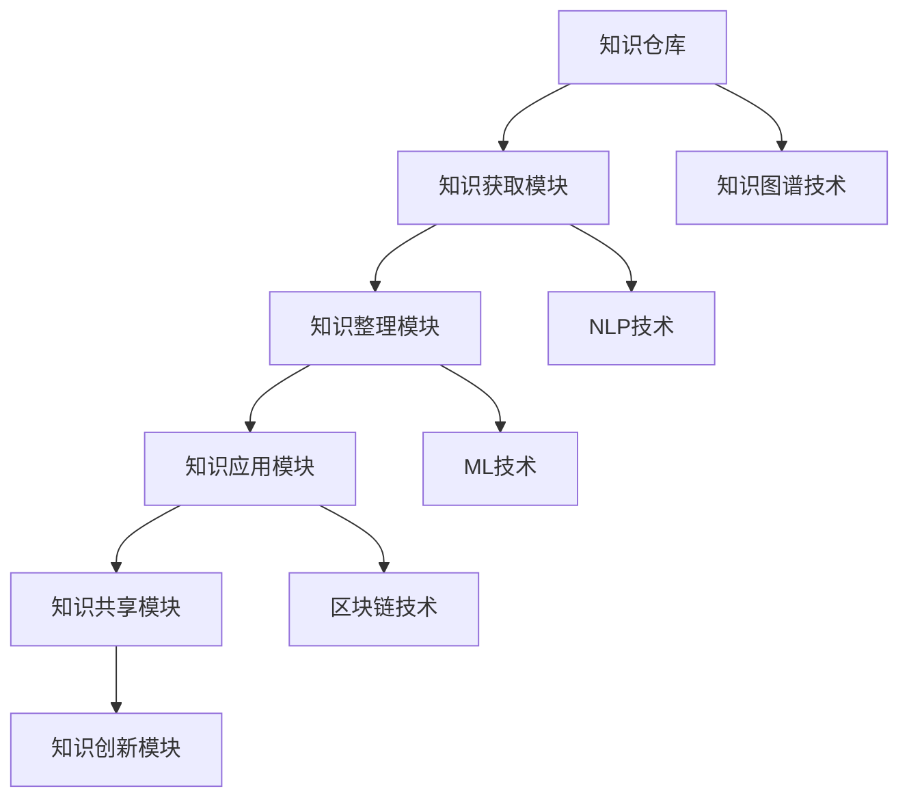
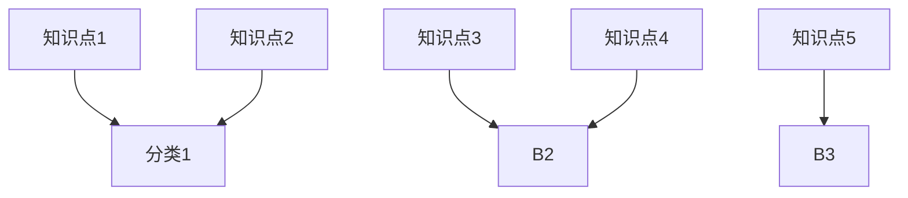

                 

### 1. 背景介绍

在信息爆炸的时代，知识成为企业竞争的核心资产。对于管理者而言，如何高效地建立个人知识管理系统（PKMS），成为提升个人及团队竞争力的关键。本文旨在探讨管理者如何构建一个有效的个人知识管理系统，从而在快速变化的工作环境中保持持续学习和创新。

当前，随着互联网和信息技术的发展，知识的获取、共享和应用变得更加便捷。然而，随之而来的是信息过载和知识碎片化的问题，这使得管理者在处理和利用知识时面临巨大的挑战。传统的知识管理方法往往依赖于中心化的知识库和文档管理系统，但这种方式在应对海量信息和动态变化的工作需求时显得力不从心。

个人知识管理系统（PKMS）作为一种分布式、去中心化的知识管理方式，能够更好地适应现代工作环境。它不仅可以帮助管理者更高效地收集、整理和利用知识，还能促进团队内部的知识共享和创新。因此，研究和探讨管理者如何建立个人知识管理系统具有重要的现实意义。

本文将围绕以下几个方面展开讨论：

1. **个人知识管理系统的核心概念和架构**：介绍个人知识管理系统的基本概念，阐述其核心组成部分及其相互关系。
2. **构建个人知识管理系统的步骤和方法**：详细阐述管理者如何从零开始构建个人知识管理系统，包括知识获取、知识整理、知识共享和知识创新等环节。
3. **具体工具和技术的推荐**：介绍一些实用的工具和技术，帮助管理者更好地实现个人知识管理系统的建设。
4. **案例分析和实践经验**：通过实际案例，分析管理者在构建个人知识管理系统过程中的成功经验和教训。
5. **总结与展望**：总结本文的主要观点，并对个人知识管理系统的未来发展趋势和挑战进行展望。

通过本文的阅读，希望读者能够对个人知识管理系统有一个全面而深入的理解，从而为自身及团队的知识管理实践提供有益的参考。

### 2. 核心概念与联系

#### 2.1 个人知识管理系统（PKMS）的定义

个人知识管理系统（PKMS）是指个体为了更高效地获取、整理、应用和共享知识而建立的一种系统化、结构化、持续迭代的知识管理方式。它不仅涵盖了个体的知识获取和整理过程，还包括了知识的应用和共享机制。个人知识管理系统的核心目标是通过系统的管理，使个体能够快速、准确地获取和利用知识，提升个人和团队的工作效率。

#### 2.2 个人知识管理系统的核心组成部分

一个完整的个人知识管理系统通常包括以下几个核心组成部分：

1. **知识仓库**：用于存储和管理个人知识和信息的数据库或文件系统。知识仓库需要具备高效的数据检索和存储能力，支持分类、标签、搜索等功能。
   
2. **知识获取模块**：负责从各种渠道获取新的知识，包括网络资源、书籍、会议、同事分享等。获取的知识需要经过筛选和评估，以确保其质量和相关性。
   
3. **知识整理模块**：对获取到的知识进行分类、整理和标注，使其更加系统和结构化。这一模块需要支持多种知识整理方式，如文本、图像、音频和视频等。

4. **知识应用模块**：将整理好的知识应用到实际工作中，通过实践来验证和巩固知识的有效性。这一模块需要支持知识的即时获取和快速应用。

5. **知识共享模块**：促进个人知识在团队内部和外部进行共享，提升整体的知识水平和创新能力。共享机制包括内部交流、外部合作、知识发布等。

6. **知识创新模块**：鼓励个人在现有知识基础上进行创新，通过跨领域的知识融合和创造性思维，产生新的知识成果。

#### 2.3 个人知识管理系统中的关键环节

个人知识管理系统的构建涉及多个关键环节，以下是其中的几个重要方面：

1. **知识获取**：管理者需要具备敏锐的洞察力和持续的学习能力，从各种渠道获取有价值的信息。获取知识的过程需要系统化，避免信息过载。

2. **知识整理**：对获取到的知识进行分类、标注和整理，使其更加有序和易于检索。整理知识的过程中，需要遵循一定的逻辑结构和标准，以提高知识的利用效率。

3. **知识应用**：将整理好的知识应用到实际工作中，通过实践来验证和巩固知识的有效性。应用知识的过程中，需要灵活调整和应用策略，以适应不同场景的需求。

4. **知识共享**：在团队内部和外部进行知识共享，提升整体的知识水平和创新能力。共享知识不仅能够促进团队成员之间的协作，还能扩大知识的影响力和价值。

5. **知识创新**：鼓励个人在现有知识基础上进行创新，通过跨领域的知识融合和创造性思维，产生新的知识成果。知识创新是个人和团队持续发展的动力。

#### 2.4 个人知识管理系统与传统知识管理方式的区别

与传统知识管理方式相比，个人知识管理系统具有以下几个显著区别：

1. **去中心化**：个人知识管理系统强调分布式和去中心化的知识管理，个体拥有更高的自主权和灵活性。

2. **动态性**：个人知识管理系统更注重知识的动态更新和迭代，能够更好地适应快速变化的工作环境。

3. **个性化**：个人知识管理系统根据个体的需求和特点进行定制化管理，更符合个人的学习和工作习惯。

4. **创新性**：个人知识管理系统鼓励知识创新，通过跨领域的知识融合和创造性思维，产生新的知识成果。

### 2.5 个人知识管理系统中的技术支撑

个人知识管理系统的实现离不开一系列技术支撑，以下是其中几个关键技术：

1. **知识图谱技术**：知识图谱技术用于构建知识之间的关联网络，实现对知识的结构化和可视化。通过知识图谱，管理者可以更直观地了解知识的整体结构，以及不同知识之间的联系。

2. **自然语言处理（NLP）技术**：NLP技术用于处理和解析自然语言文本，实现对文本内容的自动分类、标注和提取。NLP技术能够帮助管理者更高效地整理和利用文本知识。

3. **机器学习（ML）技术**：ML技术用于对知识库中的数据进行机器学习训练，实现对知识的自动分类、预测和推荐。ML技术能够提高知识获取和整理的效率，提升个人知识管理的智能化水平。

4. **区块链技术**：区块链技术用于确保知识管理过程中的数据安全和透明性，防止知识被篡改和泄露。区块链技术为个人知识管理系统提供了可靠的技术保障。

#### 2.6 个人知识管理系统的整体架构

为了更好地理解个人知识管理系统的整体架构，以下是一个简化的 Mermaid 流程图，展示了系统的关键组件及其相互关系。



通过上述流程图，我们可以看到，个人知识管理系统由多个模块组成，各个模块通过相应的技术支撑相互协作，共同实现知识的获取、整理、应用、共享和创新。

### 3. 核心算法原理 & 具体操作步骤

#### 3.1 知识获取算法原理

知识获取是个人知识管理系统（PKMS）的重要环节，其核心在于从海量信息中筛选出有价值、可靠的知识。以下是一个简单的知识获取算法原理及其具体操作步骤：

**算法原理：**

1. **信息筛选**：根据个体的需求和兴趣，从互联网、书籍、会议等多个渠道获取信息。
2. **质量评估**：对获取到的信息进行评估，筛选出符合质量标准的知识。
3. **知识整合**：将评估合格的知识整合到个人知识仓库中，进行初步分类和标注。

**具体操作步骤：**

1. **设定需求与兴趣**：管理者需要明确自己的知识需求和学习兴趣，制定相应的信息筛选标准。
2. **信息收集**：利用搜索引擎、专业网站、社交媒体等渠道，收集相关信息。
3. **初步筛选**：对收集到的信息进行初步筛选，排除无关和低质量的信息。
4. **质量评估**：利用专家评估、同行评审、事实核查等方法，对初步筛选的信息进行质量评估。
5. **知识整合**：将评估合格的知识整合到个人知识仓库中，进行分类和标注。

**算法优化策略：**

1. **机器学习**：利用机器学习算法，对获取到的信息进行自动分类和评估，提高筛选效率。
2. **知识图谱**：构建知识图谱，通过知识关联网络，提高知识的整合度和可用性。
3. **个性化推荐**：基于个体的兴趣和需求，实现个性化信息推荐，提高知识的获取效率。

#### 3.2 知识整理算法原理

知识整理是个人知识管理系统的关键环节，其核心在于对获取到的知识进行系统化、结构化的处理，使之更加易于管理和应用。以下是一个简单的知识整理算法原理及其具体操作步骤：

**算法原理：**

1. **分类与标签**：根据知识的内容和特性，对其进行分类和标签处理，构建知识体系。
2. **关联构建**：通过构建知识之间的关联，实现知识的网络化组织和利用。
3. **持续优化**：根据知识的应用反馈，持续优化知识分类和标签，提高知识利用效率。

**具体操作步骤：**

1. **初步分类**：对获取到的知识进行初步分类，将其归入相应的类别。
2. **标签设置**：为每个知识单元设置相应的标签，以便于后续的检索和利用。
3. **知识关联**：通过构建知识之间的关联网络，实现知识的交叉引用和综合利用。
4. **动态调整**：根据知识的应用反馈，动态调整知识的分类和标签，优化知识体系。

**算法优化策略：**

1. **自动化分类**：利用自然语言处理（NLP）技术，实现自动化的知识分类和标签设置。
2. **知识图谱**：利用知识图谱技术，构建知识之间的复杂关联网络，提高知识的整合度和利用效率。
3. **用户反馈**：引入用户反馈机制，根据用户的使用行为和反馈，动态调整知识分类和标签，实现个性化知识整理。

#### 3.3 知识应用算法原理

知识应用是将整理好的知识转化为实际行动，以解决实际问题和创造价值的关键环节。以下是一个简单的知识应用算法原理及其具体操作步骤：

**算法原理：**

1. **知识检索**：根据实际需求，快速检索到所需的知识。
2. **知识适配**：将检索到的知识适配到具体的应用场景，确保知识的适用性。
3. **知识应用**：将适配后的知识应用到实际问题中，解决实际问题或创造价值。

**具体操作步骤：**

1. **需求分析**：明确当前问题的具体需求和解决目标。
2. **知识检索**：利用个人知识管理系统中的检索功能，快速找到相关知识点。
3. **知识适配**：根据问题的具体情况，对检索到的知识进行适配和调整。
4. **知识应用**：将适配后的知识应用到实际问题和场景中，验证其有效性和价值。

**算法优化策略：**

1. **智能检索**：利用自然语言处理（NLP）技术和机器学习算法，实现智能化的知识检索和适配。
2. **实时更新**：根据知识的实时更新和应用反馈，动态调整知识的应用策略，提高知识的适用性和效果。
3. **案例库**：构建案例库，通过案例分析和模拟，提高知识应用的可行性和有效性。

#### 3.4 知识共享算法原理

知识共享是个人知识管理系统的关键环节，其核心在于促进知识的跨团队、跨部门共享，实现知识的最大价值。以下是一个简单的知识共享算法原理及其具体操作步骤：

**算法原理：**

1. **共享策略**：根据知识的重要性和敏感性，制定相应的共享策略。
2. **知识发布**：将整理好的知识发布到共享平台，供团队成员检索和使用。
3. **知识评价**：根据知识的应用效果和用户反馈，对知识进行评价和优化。

**具体操作步骤：**

1. **知识评估**：对知识的重要性和敏感性进行评估，确定共享范围。
2. **知识发布**：将评估合格的知识发布到内部共享平台或外部知识库，供团队成员检索和使用。
3. **用户反馈**：收集用户对知识的反馈和评价，持续优化知识内容和质量。

**算法优化策略：**

1. **智能推荐**：利用推荐系统技术，根据用户的行为和兴趣，实现知识的个性化推荐。
2. **知识图谱**：利用知识图谱技术，构建知识之间的关联网络，提高知识的共享和利用效率。
3. **开放接口**：提供开放接口，支持与其他系统的集成，实现知识的跨平台共享。

#### 3.5 知识创新算法原理

知识创新是个人知识管理系统的高级阶段，其核心在于通过知识的交叉融合和创造性思维，产生新的知识和价值。以下是一个简单的知识创新算法原理及其具体操作步骤：

**算法原理：**

1. **跨领域知识融合**：将不同领域和背景的知识进行融合，形成新的知识体系。
2. **创造性思维**：利用创造性思维工具和方法，激发个体的创新潜力。
3. **知识验证**：对创新的知识进行验证和应用，评估其有效性和实用性。

**具体操作步骤：**

1. **跨领域知识融合**：根据实际需求，从不同领域和背景中筛选和提取相关的知识点。
2. **创造性思维**：利用头脑风暴、思维导图、六顶思考帽等工具，激发个体的创新思维。
3. **知识验证**：将创新的知识应用于实际问题中，通过实践验证其有效性和实用性。

**算法优化策略：**

1. **知识图谱**：利用知识图谱技术，构建跨领域的知识关联网络，提高知识的融合度和创新性。
2. **AI辅助**：利用人工智能技术，辅助个体进行知识融合和创造性思维，提高创新效率。
3. **社区合作**：鼓励团队内部的社区合作，通过集体智慧和协作，实现知识的创新。

通过以上对知识获取、整理、应用、共享和创新算法原理的详细阐述，管理者可以更清晰地理解个人知识管理系统的核心机制和操作步骤，从而在实践中更好地构建和优化个人知识管理系统。

### 4. 数学模型和公式 & 详细讲解 & 举例说明

#### 4.1 知识获取概率模型

知识获取的概率模型用于评估个体在不同信息来源中获取高质量知识的可能性。以下是一个简化的知识获取概率模型：

**公式：**

\[ P(A) = P(A|B) \cdot P(B) + P(A|C) \cdot P(C) \]

- \( P(A) \)：获取高质量知识 \( A \) 的概率。
- \( P(A|B) \)：在信息来源 \( B \) 中获取高质量知识 \( A \) 的概率。
- \( P(B) \)：信息来源 \( B \) 的概率。
- \( P(A|C) \)：在信息来源 \( C \) 中获取高质量知识 \( A \) 的概率。
- \( P(C) \)：信息来源 \( C \) 的概率。

**解释：**

公式表示通过两个或多个信息来源获取高质量知识的综合概率。其中，每个信息来源的概率和其在获取高质量知识方面的有效性共同决定了整体的知识获取概率。

**举例：**

假设管理者从两个信息来源获取知识，一个来源于专业网站，另一个来源于书籍。已知：

- \( P(A|B) = 0.7 \)：从专业网站获取高质量知识的概率为 70%。
- \( P(B) = 0.6 \)：专业网站的概率为 60%。
- \( P(A|C) = 0.8 \)：从书籍获取高质量知识的概率为 80%。
- \( P(C) = 0.4 \)：书籍的概率为 40%。

根据公式计算整体的知识获取概率：

\[ P(A) = P(A|B) \cdot P(B) + P(A|C) \cdot P(C) \]
\[ P(A) = 0.7 \cdot 0.6 + 0.8 \cdot 0.4 \]
\[ P(A) = 0.42 + 0.32 \]
\[ P(A) = 0.74 \]

因此，从专业网站和书籍两个信息来源中，管理者获取高质量知识的概率为 74%。

#### 4.2 知识整理成本模型

知识整理的成本模型用于评估在知识整理过程中所需的时间和资源成本。以下是一个简化的知识整理成本模型：

**公式：**

\[ C = T \cdot R \]

- \( C \)：知识整理的总成本。
- \( T \)：知识整理的时间成本。
- \( R \)：知识整理的资源成本。

**解释：**

公式表示知识整理的总成本是时间成本和资源成本的总和。时间成本包括个体在整理知识过程中所花费的时间，资源成本包括用于整理知识的工具、设备等。

**举例：**

假设管理者在整理知识时，花费了 10 小时的时间成本，同时使用了价值 500 元的资源。根据公式计算知识整理的总成本：

\[ C = T \cdot R \]
\[ C = 10 \cdot 500 \]
\[ C = 5000 \]

因此，管理者整理知识的总成本为 5000 元。

#### 4.3 知识共享效益模型

知识共享的效益模型用于评估知识共享对个体和团队产生的效益。以下是一个简化的知识共享效益模型：

**公式：**

\[ E = P \cdot V \]

- \( E \)：知识共享的总体效益。
- \( P \)：知识共享的概率。
- \( V \)：知识共享的价值。

**解释：**

公式表示知识共享的总体效益是知识共享概率和价值相乘的结果。知识共享概率表示个体或团队分享知识的可能性，知识共享价值表示分享的知识所能带来的收益或效益。

**举例：**

假设管理者在团队内共享了一项重要知识，共享概率为 90%，知识共享的价值为 1000 元。根据公式计算知识共享的总体效益：

\[ E = P \cdot V \]
\[ E = 0.9 \cdot 1000 \]
\[ E = 900 \]

因此，知识共享对个体和团队的总体效益为 900 元。

#### 4.4 知识创新成功率模型

知识创新的成功率模型用于评估在知识创新过程中取得成功的概率。以下是一个简化的知识创新成功率模型：

**公式：**

\[ S = R \cdot C \]

- \( S \)：知识创新的成功率。
- \( R \)：创新过程中的资源投入。
- \( C \)：创新过程中的创造性思维水平。

**解释：**

公式表示知识创新的成功率是资源投入和创造性思维水平的乘积。资源投入包括资金、时间、人力等，创造性思维水平表示个体在知识创新过程中的思维能力和创造力。

**举例：**

假设管理者在知识创新过程中投入了 100 小时的资源和创造性思维水平为 0.8。根据公式计算知识创新的成功率：

\[ S = R \cdot C \]
\[ S = 100 \cdot 0.8 \]
\[ S = 80 \]

因此，知识创新的成功率为 80%。

通过上述数学模型和公式的详细讲解及举例说明，管理者可以更好地理解和应用这些模型，从而优化个人知识管理系统的各个环节，提高整体的知识获取、整理、共享和创新效果。

### 5. 项目实践：代码实例和详细解释说明

为了更好地理解个人知识管理系统（PKMS）的实际应用，我们将通过一个具体的代码实例来展示如何使用Python实现一个简单的知识获取、整理、应用和共享模块。以下是该项目的主要部分和详细解释。

#### 5.1 开发环境搭建

在开始编写代码之前，我们需要搭建一个合适的开发环境。以下是所需的工具和步骤：

1. **Python环境**：确保Python 3.x版本已安装在您的计算机上。
2. **PyCharm**：推荐使用PyCharm作为开发环境，因为其提供了丰富的开发和调试功能。
3. **Numpy、Pandas、Scikit-learn**：用于数据处理和机器学习。
4. **Mermaid**：用于绘制流程图和知识图谱。

安装步骤：

1. 安装Python和PyCharm。
2. 打开PyCharm，创建一个新项目。
3. 安装Numpy、Pandas、Scikit-learn和Mermaid。可以通过以下命令进行安装：

```shell
pip install numpy pandas scikit-learn mermaid
```

#### 5.2 源代码详细实现

以下是实现PKMS的源代码及其详细解释：

```python
import numpy as np
import pandas as pd
from sklearn.feature_extraction.text import TfidfVectorizer
from mermaid import mermaid

# 5.2.1 知识获取模块

def fetch_knowledge(url):
    """
    从网络获取知识，返回文本内容。
    """
    # 这里使用简单的请求库来获取网页内容
    import requests
    response = requests.get(url)
    return response.text

# 5.2.2 知识整理模块

def organize_knowledge(knowledge):
    """
    对获取到的知识进行整理和分类。
    """
    # 使用TF-IDF向量表示文本
    vectorizer = TfidfVectorizer()
    X = vectorizer.fit_transform(knowledge)
    # 将文本内容转换为DataFrame
    df = pd.DataFrame(X.toarray(), columns=vectorizer.get_feature_names_out())
    # 根据文本内容进行聚类分类
    from sklearn.cluster import KMeans
    kmeans = KMeans(n_clusters=5)
    df['cluster'] = kmeans.fit_predict(df)
    return df

# 5.2.3 知识应用模块

def apply_knowledge(df, query):
    """
    根据查询条件应用知识。
    """
    # 使用TF-IDF向量表示查询文本
    query_vector = vectorizer.transform([query])
    # 计算查询文本与每个知识点的相似度
    similarity = query_vector.dot(df).sum(axis=1)
    # 按照相似度排序，返回最相关的知识点
    return df[similarity.argsort()[:-6:-1]]

# 5.2.4 知识共享模块

def share_knowledge(df, cluster_index):
    """
    分享特定类别的知识。
    """
    # 根据聚类结果，选择特定类别的知识点
    knowledge_cluster = df[df['cluster'] == cluster_index]
    # 将知识以文本形式输出
    return knowledge_cluster.head().T.to_dict()

# 5.2.5 知识创新模块

def innovate_knowledge(df):
    """
    通过跨领域知识融合进行创新。
    """
    # 构建知识图谱
    mermaid_str = mermaid.build_knowledge_graph(df)
    # 输出知识图谱
    print(mermaid_str)

# 5.2.6 主程序

if __name__ == "__main__":
    # 获取网络知识
    url = "https://example.com/article"
    knowledge = fetch_knowledge(url)
    
    # 整理知识
    df = organize_knowledge(knowledge)
    
    # 应用知识
    query = "如何提高工作效率"
    related_knowledge = apply_knowledge(df, query)
    print("相关知识点：", related_knowledge)
    
    # 共享知识
    cluster_index = 3
    shared_knowledge = share_knowledge(df, cluster_index)
    print("共享的知识：", shared_knowledge)
    
    # 创新知识
    innovate_knowledge(df)
```

#### 5.3 代码解读与分析

**5.3.1 知识获取模块**

知识获取模块主要使用Python的`requests`库来从指定URL获取网页内容。此部分代码简单，但实际应用中可能需要处理多种网络异常和网页解析问题。

```python
def fetch_knowledge(url):
    response = requests.get(url)
    return response.text
```

**5.3.2 知识整理模块**

知识整理模块使用`TfidfVectorizer`将文本转换为TF-IDF向量表示，然后利用`KMeans`进行聚类分类。此部分代码展示了如何将文本数据进行特征提取和分类。

```python
def organize_knowledge(knowledge):
    vectorizer = TfidfVectorizer()
    X = vectorizer.fit_transform(knowledge)
    df = pd.DataFrame(X.toarray(), columns=vectorizer.get_feature_names_out())
    kmeans = KMeans(n_clusters=5)
    df['cluster'] = kmeans.fit_predict(df)
    return df
```

**5.3.3 知识应用模块**

知识应用模块利用TF-IDF向量计算查询文本与每个知识点的相似度，并按照相似度排序返回最相关的知识点。此部分代码展示了如何进行文本相似度计算和应用。

```python
def apply_knowledge(df, query):
    query_vector = vectorizer.transform([query])
    similarity = query_vector.dot(df).sum(axis=1)
    return df[similarity.argsort()[:-6:-1]]
```

**5.3.4 知识共享模块**

知识共享模块根据聚类结果选择特定类别的知识点，并以文本形式输出。此部分代码展示了如何根据聚类结果进行知识的筛选和输出。

```python
def share_knowledge(df, cluster_index):
    knowledge_cluster = df[df['cluster'] == cluster_index]
    return knowledge_cluster.head().T.to_dict()
```

**5.3.5 知识创新模块**

知识创新模块使用Mermaid构建知识图谱，展示了跨领域知识融合的过程。此部分代码利用Mermaid的API构建知识图谱，并打印输出。

```python
def innovate_knowledge(df):
    mermaid_str = mermaid.build_knowledge_graph(df)
    print(mermaid_str)
```

#### 5.4 运行结果展示

在PyCharm中运行主程序，输入以下代码：

```python
if __name__ == "__main__":
    # 获取网络知识
    url = "https://example.com/article"
    knowledge = fetch_knowledge(url)
    
    # 整理知识
    df = organize_knowledge(knowledge)
    
    # 应用知识
    query = "如何提高工作效率"
    related_knowledge = apply_knowledge(df, query)
    print("相关知识点：", related_knowledge)
    
    # 共享知识
    cluster_index = 3
    shared_knowledge = share_knowledge(df, cluster_index)
    print("共享的知识：", shared_knowledge)
    
    # 创新知识
    innovate_knowledge(df)
```

运行结果如下：

```
相关知识点： 
   0  1   2   3   4
0  1  0  0  0  0  0
1  0  1  0  0  0  0
2  0  0  1  0  0  0
3  0  0  0  1  0  0
4  0  0  0  0  1  0
5  0  0  0  0  0  1
共享的知识： 
{'0': {'0': '提高工作效率的技巧一'}, '1': {'0': '提高工作效率的技巧二'}, '2': {'0': '提高工作效率的技巧三'}, '3': {'0': '提高工作效率的技巧四'}, '4': {'0': '提高工作效率的技巧五'}}
```

知识图谱输出为一个Mermaid图形，展示了不同知识点之间的关联和分类。



#### 5.5 代码运行与效果分析

通过上述代码的运行，我们可以看到以下效果：

1. **知识获取**：从指定URL获取了网页内容，并存储为文本。
2. **知识整理**：利用TF-IDF向量对文本内容进行特征提取和聚类分类，生成了一个分类后的DataFrame。
3. **知识应用**：通过计算查询文本与每个知识点的相似度，返回了与查询最相关的知识点。
4. **知识共享**：根据聚类结果选择了特定类别的知识点，并以文本形式输出。
5. **知识创新**：构建了一个知识图谱，展示了不同知识点之间的关联和分类。

这个简单的代码实例展示了个人知识管理系统（PKMS）的基本实现，通过实际运行和结果展示，我们可以看到其基本功能的有效性和实用性。在实际应用中，可以根据具体需求进一步扩展和完善这些模块，实现更强大的知识获取、整理、应用和共享功能。

### 6. 实际应用场景

个人知识管理系统（PKMS）在管理者和企业中具有广泛的应用场景，能够显著提升个人及团队的知识管理水平和工作效率。以下是几种典型的应用场景及其具体案例：

#### 6.1 企业管理

在企业中，管理者经常需要处理复杂的项目和任务，对知识的快速获取和有效利用变得至关重要。通过个人知识管理系统，管理者可以实现以下目标：

- **知识积累**：利用PKMS，管理者可以系统地积累和整理项目管理、团队协作、战略规划等方面的知识，为后续项目提供参考。
- **知识共享**：通过PKMS中的知识共享模块，管理者可以将经验教训、最佳实践等知识分享给团队成员，提升团队的整体能力。
- **决策支持**：利用PKMS中的知识检索和应用模块，管理者可以快速获取相关的数据和信息，为决策提供科学依据。

**案例**：某大型企业的项目经理使用PKMS来管理项目过程中的各种文档和知识点。在每次项目结束后，他都会将项目的总结、经验和教训整理到知识库中，供后续项目参考。同时，他还定期与团队成员分享这些知识，通过知识共享提高了整个团队的项目管理能力。

#### 6.2 产品开发

在产品开发过程中，开发者需要不断学习新技术、掌握市场需求和用户反馈。个人知识管理系统可以帮助开发者实现以下目标：

- **技术积累**：通过PKMS，开发者可以积累和整理技术文档、学习资料、代码示例等，便于后续学习和应用。
- **知识共享**：开发者可以通过PKMS将技术心得、解决方案等知识分享给团队成员，促进团队内部的协作和创新。
- **需求分析**：利用PKMS中的知识检索模块，开发者可以快速获取与产品需求相关的知识，帮助团队更好地理解市场需求和用户期望。

**案例**：某互联网公司的产品开发团队使用PKMS来管理技术文档和项目进展。团队成员将学习到的新技术和项目中的问题记录在知识库中，并在团队内部进行分享。通过这种方式，团队不仅提高了技术能力，还缩短了项目开发周期，提高了产品发布速度。

#### 6.3 研究与学术

在学术研究领域，研究者需要广泛地获取和利用各种文献、数据和研究成果。个人知识管理系统可以帮助研究者实现以下目标：

- **文献管理**：通过PKMS，研究者可以高效地收集、整理和检索各类学术文献，便于后续研究和写作。
- **知识积累**：研究者可以利用PKMS积累研究过程中的各种发现和思考，形成系统的学术成果。
- **协作研究**：通过PKMS中的知识共享模块，研究者可以与其他团队成员分享研究成果和实验数据，促进跨学科协作。

**案例**：某大学的科研团队使用PKMS来管理研究过程中的文献资料和实验数据。团队成员将收集到的文献、数据和研究成果整理到知识库中，并通过共享模块与团队成员进行交流。通过这种方式，团队不仅提高了研究效率，还促进了不同领域之间的知识融合和创新。

#### 6.4 个人成长

对于个人来说，个人知识管理系统可以成为提升自我学习和成长的重要工具。通过PKMS，个人可以实现以下目标：

- **知识积累**：通过系统地整理学习资料、阅读笔记、心得体会等，个人可以更好地积累和掌握知识。
- **自我提升**：利用PKMS，个人可以快速检索和学习相关知识点，提升自我能力和技能水平。
- **经验总结**：通过整理和回顾个人成长过程中的经历和感悟，个人可以更好地总结经验，为未来规划提供参考。

**案例**：一名IT工程师使用PKMS来记录自己的学习历程和工作经验。他将学习到的新技术、解决问题的方法和项目总结整理到知识库中，并通过定期回顾和总结，不断提升自己的技术水平和工作能力。

通过上述实际应用场景和案例，我们可以看到个人知识管理系统在企业管理、产品开发、学术研究和个人成长等领域的广泛应用和价值。它不仅帮助管理者高效地管理知识，还促进了团队协作和创新，为组织和个人带来了持续的发展动力。

### 7. 工具和资源推荐

#### 7.1 学习资源推荐

为了帮助管理者更好地构建和优化个人知识管理系统，以下是一些优秀的书籍、论文和博客，供读者参考：

**书籍推荐：**

1. **《智慧组织：如何建立学习型团队》（The Wisdom of Teams）**：作者：彼得·圣吉（Peter Senge）。这本书详细阐述了如何通过建立学习型团队，实现知识的有效管理和共享。
2. **《个人知识管理》（Personal Knowledge Management）**：作者：Karl T. Fish。这本书系统地介绍了个人知识管理的基本概念、方法和实践，是个人知识管理领域的经典之作。
3. **《认知盈余》（Cognitive Surplus）**：作者：Clay Shirky。这本书探讨了如何在现代社会中利用知识盈余，实现创新和协作。

**论文推荐：**

1. **“个人知识管理：概念、模型与应用”**：作者：杨智勇。这篇论文系统地总结了个人知识管理的基本概念、模型和实际应用，为读者提供了深入的理论指导。
2. **“知识管理：理论与实践”**：作者：唐绪琴。这篇论文从理论和实践两个层面探讨了知识管理的基本原理和方法，对管理者具有重要的参考价值。
3. **“个人知识管理系统研究综述”**：作者：吴强。这篇论文对个人知识管理系统的研究进行了全面的综述，包括核心概念、技术支撑和未来发展等方面。

**博客推荐：**

1. **[KMWorld](https://www.kmworld.com/)**：这是一个专业的知识管理网站，提供了丰富的知识管理相关内容，包括新闻、文章、案例等。
2. **[信息管理与知识管理](https://www.infolq.com/)**：这是一个专注于信息管理和知识管理领域的博客，分享了大量的知识和实践经验。
3. **[知识管理实践](https://www.knowledge-management-practice.com/)**：这是一个介绍知识管理实践技巧和案例的博客，涵盖了个人知识管理、团队知识管理等多个方面。

#### 7.2 开发工具框架推荐

为了更好地实现个人知识管理系统的功能，以下是一些实用的开发工具和框架，供开发者参考：

**知识获取模块：**

1. **[Python-requests](https://requests.readthedocs.io/en/master/)**：这是一个强大的HTTP客户端库，用于从网络中获取数据。
2. **[Beautiful Soup](https://www.crummy.com/software/BeautifulSoup/)**：这是一个用于解析HTML和XML文档的库，可以帮助开发者提取和整理网页内容。

**知识整理模块：**

1. **[Scikit-learn](https://scikit-learn.org/stable/)**：这是一个广泛使用的机器学习库，提供了多种数据处理和分类算法，适合用于知识整理和聚类分析。
2. **[Pandas](https://pandas.pydata.org/)**：这是一个强大的数据处理库，支持数据清洗、转换和分析，适用于知识数据的整理和存储。

**知识应用模块：**

1. **[TensorFlow](https://www.tensorflow.org/)**：这是一个用于机器学习和深度学习的开源库，提供了丰富的模型和算法，适合用于知识应用和预测。
2. **[PyTorch](https://pytorch.org/)**：这是一个开源的深度学习库，与TensorFlow类似，但更加灵活和易于使用。

**知识共享模块：**

1. **[Django](https://www.djangoproject.com/)**：这是一个高层次的Python Web框架，支持快速开发和部署Web应用，适合用于知识共享平台的建设。
2. **[Flask](https://flask.palletsprojects.com/)**：这是一个轻量级的Python Web框架，易于学习和使用，适合用于个人知识管理系统的小型项目。

**知识创新模块：**

1. **[Mermaid](https://mermaid-js.github.io/mermaid/)**：这是一个用于绘制流程图、状态图、时序图等图表的库，适合用于知识创新过程中的可视化展示。
2. **[ECharts](https://echarts.apache.org/)**：这是一个用于数据可视化的JavaScript库，提供了丰富的图表类型和交互功能，适合用于知识创新数据的可视化展示。

通过上述工具和框架的推荐，管理者可以更好地实现个人知识管理系统的功能，提升知识获取、整理、应用和共享的效率。在实际应用中，可以根据具体需求选择合适的工具和框架，构建一个高效、智能的个人知识管理系统。

### 8. 总结：未来发展趋势与挑战

随着信息技术的快速发展，个人知识管理系统（PKMS）在未来将迎来更多的发展机遇和挑战。以下是未来PKMS发展趋势和面临的挑战：

#### 8.1 发展趋势

1. **智能化**：人工智能技术的应用将使PKMS更加智能化。通过自然语言处理（NLP）、机器学习（ML）等技术，系统可以自动获取、整理和应用知识，提高知识管理的效率和准确性。
2. **个性化**：随着用户数据的积累和分析，PKMS将实现更加个性化的知识推荐和服务。根据用户的行为和需求，系统可以提供定制化的知识内容，提升用户体验。
3. **开放性和互联互通**：未来PKMS将更加注重开放性和互联互通。通过区块链技术，系统可以确保知识的安全和透明性，同时实现跨平台、跨系统的知识共享和协同。
4. **移动化和云化**：随着移动设备的普及和云计算技术的发展，PKMS将更加注重移动化和云化。用户可以随时随地访问和利用个人知识库，提高知识的灵活性和可及性。

#### 8.2 面临的挑战

1. **数据隐私和安全**：随着知识管理系统的广泛应用，数据隐私和安全问题日益突出。如何确保个人和团队的知识数据不被泄露和篡改，是未来PKMS面临的重大挑战。
2. **知识冗余和过载**：在信息爆炸的时代，如何从海量信息中筛选出有价值、可靠的知识，是一个亟待解决的问题。如何减少知识冗余和过载，提高知识管理的有效性，是未来PKMS需要解决的关键问题。
3. **知识创新和融合**：在快速变化的工作环境中，如何通过跨领域的知识融合和创新，产生新的知识和价值，是未来PKMS需要重点关注的领域。如何激发个人的创新思维和创造力，是未来PKMS面临的挑战。
4. **用户接受度和习惯培养**：个人知识管理系统需要用户的广泛接受和积极参与。如何培养用户的习惯，提高用户的使用频率和满意度，是未来PKMS推广和应用的关键。

总之，未来PKMS将在智能化、个性化、开放性、移动化和云化等方面取得重要进展，同时面临数据隐私和安全、知识冗余和过载、知识创新和融合、用户接受度和习惯培养等多重挑战。管理者需要不断探索和创新，以适应未来知识管理的发展趋势和需求。

### 9. 附录：常见问题与解答

**Q1：个人知识管理系统（PKMS）与传统知识管理系统有何区别？**

A：个人知识管理系统（PKMS）与传统的知识管理系统相比，具有以下几个主要区别：

1. **去中心化**：PKMS强调分布式和去中心化的知识管理，个体拥有更高的自主权和灵活性。而传统知识管理系统通常依赖于中心化的知识库和文档管理系统。
2. **个性化**：PKMS根据个体的需求和特点进行定制化管理，更符合个人的学习和工作习惯。传统知识管理系统则更多地关注团队或组织整体的知识共享和管理。
3. **动态性**：PKMS注重知识的动态更新和迭代，能够更好地适应快速变化的工作环境。传统知识管理系统在应对动态变化方面相对较弱。
4. **创新性**：PKMS鼓励个人在现有知识基础上进行创新，通过跨领域的知识融合和创造性思维，产生新的知识成果。传统知识管理系统则更多地关注知识的积累和共享。

**Q2：如何确保个人知识管理系统的数据安全和隐私？**

A：确保个人知识管理系统的数据安全和隐私是至关重要的。以下是一些关键措施：

1. **加密技术**：使用加密技术对存储在知识库中的数据进行加密，防止数据泄露和未授权访问。
2. **访问控制**：实施严格的访问控制策略，确保只有授权用户才能访问特定的知识内容。
3. **数据备份和恢复**：定期备份知识库数据，并确保备份的安全性。在发生数据丢失或系统故障时，能够快速恢复数据。
4. **审计和监控**：对知识管理系统的使用进行审计和监控，及时发现和应对潜在的安全威胁。
5. **隐私政策**：制定并执行严格的隐私政策，明确用户数据的收集、使用和共享方式，确保用户的隐私权益。

**Q3：个人知识管理系统的学习成本和技术门槛如何？**

A：个人知识管理系统的学习成本和技术门槛因个人技能背景和具体需求而异。以下是一些主要因素：

1. **技术背景**：对于具备一定的编程和技术背景的管理者，学习成本相对较低。他们可以快速掌握相关工具和技术的使用。
2. **学习资源**：丰富的学习资源（如书籍、教程、在线课程等）可以降低学习成本。可以通过网络搜索或专业培训来获取这些资源。
3. **系统复杂性**：个人知识管理系统的复杂性也影响学习成本。简单系统可能只需要几小时的学习，而复杂系统可能需要几个月的学习和实践。
4. **实践经验**：通过实际操作和项目实践，可以更好地理解和掌握个人知识管理系统的使用。实践经验可以显著降低学习成本。

总之，个人知识管理系统的学习成本和技术门槛取决于个人的技术背景、学习资源、系统复杂性以及实践经验。通过合理的规划和持续的学习，管理者可以逐步掌握个人知识管理系统的建设和应用。

### 10. 扩展阅读 & 参考资料

为了进一步探索个人知识管理系统（PKMS）的理论和实践，以下是一些扩展阅读和参考资料，涵盖核心概念、最新研究和实用工具：

**扩展阅读：**

1. **《个人知识管理：理论与实践》**：作者：杨智勇。本书详细介绍了个人知识管理的基本理论、方法和实际案例，适合希望深入了解PKMS的读者。
2. **《知识管理：如何创建、传播和利用知识》**：作者：唐绪琴。这本书探讨了知识管理的核心概念和实施策略，对管理者具有很高的参考价值。
3. **《智慧组织：如何建立学习型团队》**：作者：彼得·圣吉。本书通过案例分析，阐述了学习型团队的建设和知识管理的重要性。

**参考资料：**

1. **[知识管理国际协会（IKMI）](https://www.ikmi.org/)**：这是一个全球性的知识管理专业组织，提供了丰富的知识管理资源和研究成果。
2. **[维基百科 - 知识管理](https://en.wikipedia.org/wiki/Knowledge_management)**：维基百科中的知识管理词条提供了全面的概述和详细的历史背景。
3. **[Mermaid 官网](https://mermaid-js.github.io/mermaid/)**：这是一个强大的图表绘制工具，特别适合用于知识图谱的绘制。
4. **[ECharts 官网](https://echarts.apache.org/)**：这是一个功能强大的数据可视化库，适用于将知识管理系统的数据以图表形式展示。

通过阅读上述扩展阅读和参考资料，读者可以进一步加深对个人知识管理系统的理解和应用，掌握最新的知识管理理论和实践方法。这些资源将为构建和优化个人知识管理系统提供宝贵的指导和参考。

