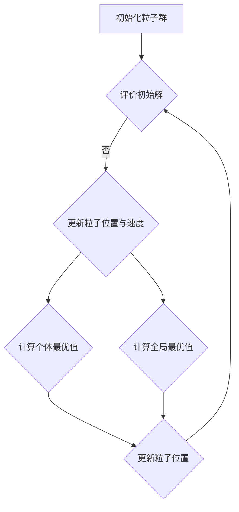

                 

### 背景介绍

粒子群优化（Particle Swarm Optimization，PSO）是一种基于群智能的优化算法，源于对鸟群觅食行为的模拟。粒子群算法的核心思想是通过粒子之间的信息共享和协同合作，逐步调整个体粒子的位置和速度，从而找到问题的最优解。

PSO算法的出现可以追溯到1995年，由美国社会学家Kennedy和电气工程师Eberhart首次提出。他们受到鸟群觅食行为中群体智能的启发，设计出了一种模拟群体行为的优化算法。粒子群算法在解决连续和非线性优化问题上表现出色，逐渐成为进化计算领域的一种重要方法。

粒子群优化算法的应用范围非常广泛，包括但不限于以下领域：

1. **工程优化**：粒子群算法在机械设计、结构优化、电路设计等领域有着广泛应用。
2. **数据分析**：在数据挖掘、模式识别等领域，PSO算法能够快速找到数据中的最优模式。
3. **机器学习**：PSO算法可用于优化机器学习模型的参数，提升模型的性能。
4. **物联网**：在物联网系统中，PSO算法可以用于优化网络中的节点布局和路径规划。

粒子群优化算法之所以能够在多个领域得到广泛应用，主要原因在于其实现简单、易于并行计算和调整。与其他进化算法相比，PSO算法不需要编码个体，且具有较强的全局搜索能力。

本文将详细讲解粒子群优化算法的原理、数学模型、具体实现过程，并通过代码实例展示其在实际问题中的应用。希望通过本文，读者能够全面了解粒子群优化算法，并在实际项目中灵活运用。

### 核心概念与联系

粒子群优化算法的核心概念包括粒子、位置、速度、认知行为和社会行为。为了更好地理解这些概念，我们可以借助 Mermaid 流程图来展示算法的基本架构和流程。

下面是一个简化的 Mermaid 流程图，用于描述粒子群优化算法的基本流程：



在上述流程图中：

- **A[初始化粒子群]**：初始化粒子群的位置和速度。
- **B{评价初始解]**：计算初始解的适应度值，以确定初始的最优解。
- **C{更新粒子位置与速度]**：根据个体和全局最优解调整粒子的位置和速度。
- **D{计算个体最优值]**：每个粒子根据当前找到的最优位置更新个体最优值。
- **E{计算全局最优值]**：粒子群中的最佳解被更新为全局最优值。
- **F{更新粒子位置]**：根据新的速度更新粒子的位置。

#### 粒子

粒子可以看作是算法中的一个基本单位，每个粒子都代表问题空间中的一个候选解。粒子的位置和速度是两个关键属性：

- **位置（Position）**：表示粒子在问题空间中的位置，通常用向量表示。例如，在求解一个多峰函数的最小值问题时，位置向量可以表示粒子的坐标。
- **速度（Velocity）**：表示粒子从当前位置移动到下一位置的加速度，也用向量表示。速度向量影响粒子在搜索空间中的移动方向和步长。

#### 个体最优值与全局最优值

- **个体最优值（Personal Best，pBest）**：每个粒子在搜索过程中找到的最佳位置，代表粒子自身最优解的记录。
- **全局最优值（Global Best，gBest）**：整个粒子群中找到的最佳位置，代表当前搜索空间中的最优解。

这些核心概念相互关联，共同构成了粒子群优化算法的基本框架。通过不断更新粒子的位置和速度，粒子群在搜索空间中逐步逼近最优解。

#### Mermaid 流程图详细解释

以下是对 Mermaid 流程图中各节点的详细解释：

- **初始化粒子群**：在算法开始时，随机生成一定数量的粒子，并初始化它们的位置和速度。
- **评价初始解**：计算每个粒子的初始位置对应的适应度值，以确定初始的最优解。
- **更新粒子位置与速度**：通过个体最优值和全局最优值来更新每个粒子的速度和位置，使得粒子向最优解移动。
- **计算个体最优值**：每个粒子根据当前找到的最佳位置更新个体最优值。
- **计算全局最优值**：粒子群中的最佳解被更新为全局最优值。
- **更新粒子位置**：根据新的速度更新每个粒子的位置。

通过这个流程，粒子群在不断的迭代过程中，逐步优化粒子的位置和速度，从而找到问题的最优解。

粒子群优化算法通过模拟鸟群觅食行为，实现了一种群体智能优化策略。其核心在于通过个体和群体之间的信息共享与协同，有效提高了算法的搜索效率和收敛速度。希望这个详细的 Mermaid 流程图能够帮助读者更好地理解粒子群优化算法的工作原理。

### 核心算法原理 & 具体操作步骤

粒子群优化算法（PSO）通过模拟鸟群觅食行为，实现了一种基于群体智能的优化策略。其核心思想是通过个体和群体之间的信息共享，以及粒子的位置和速度更新，逐步逼近最优解。下面，我们将详细讲解粒子群优化算法的基本原理和具体操作步骤。

#### 基本原理

粒子群优化算法的核心在于粒子的位置和速度更新策略。每个粒子代表问题空间中的一个候选解，粒子的位置和速度是两个关键属性。算法的基本原理可以概括为：

1. **初始化粒子群**：在算法开始时，随机生成一定数量的粒子，并初始化它们的位置和速度。
2. **评估适应度**：计算每个粒子的初始位置对应的适应度值，以确定初始的最优解。
3. **更新粒子的速度和位置**：根据个体和全局最优值来更新每个粒子的速度和位置，使得粒子向最优解移动。
4. **迭代过程**：不断重复更新粒子的速度和位置，直到达到终止条件（如最大迭代次数或收敛条件）。

#### 具体操作步骤

1. **初始化粒子群**：
   - 随机生成粒子群，每个粒子的位置和速度都随机初始化。
   - 粒子的位置表示问题空间中的一个候选解，速度表示粒子从当前位置移动到下一位置的加速度。

2. **评估适应度**：
   - 计算每个粒子的适应度值，通常使用目标函数来评估。
   - 适应度值越低，表示粒子的解越优。

3. **更新粒子的速度和位置**：
   - 每个粒子的速度和位置更新公式如下：
     \[
     v_{i}(t+1) = w \cdot v_{i}(t) + c_{1} \cdot r_{1} \cdot (p_{i}(t) - x_{i}(t)) + c_{2} \cdot r_{2} \cdot (g_{best}(t) - x_{i}(t))
     \]
     \[
     x_{i}(t+1) = x_{i}(t) + v_{i}(t+1)
     \]
   - 其中，\(v_{i}(t)\)和\(x_{i}(t)\)分别表示第\(i\)个粒子在第\(t\)次迭代时的速度和位置，\(p_{i}(t)\)和\(g_{best}(t)\)分别表示第\(i\)个粒子的个体最优值和全局最优值，\(w\)表示惯性权重，\(c_{1}\)和\(c_{2}\)分别表示认知和社会加速度系数，\(r_{1}\)和\(r_{2}\)是随机数。

4. **迭代过程**：
   - 在每一次迭代中，更新粒子的速度和位置，并重新评估适应度值。
   - 根据新的适应度值更新个体最优值和全局最优值。
   - 重复上述过程，直到满足终止条件（如最大迭代次数或收敛条件）。

#### 示例

假设我们使用一个简单的目标函数\(f(x) = x^2\)，求解其最小值。初始化一个包含10个粒子的粒子群，每个粒子的位置和速度随机生成。使用以下参数设置：
- \(w = 0.5\)
- \(c_{1} = c_{2} = 2\)

初始化后，评估每个粒子的适应度值，找到初始的最优解。然后，根据更新公式，更新每个粒子的速度和位置。在多次迭代后，粒子群逐步逼近最优解。

### 惯性权重

惯性权重\(w\)是PSO算法中的一个重要参数，用于控制粒子在搜索过程中的全局搜索和局部搜索能力。惯性权重的值通常在0到1之间变化，随着迭代次数的增加，惯性权重逐渐减小，以实现从全局搜索到局部搜索的平稳过渡。

惯性权重\(w\)的调整公式如下：
\[
w(t+1) = w_0 - \frac{(w_0 - w_f)}{t_{max} - t}
\]
- 其中，\(w_0\)为初始惯性权重，\(w_f\)为最终惯性权重，\(t_{max}\)为最大迭代次数，\(t\)为当前迭代次数。

通过调整惯性权重，可以有效地控制粒子在搜索过程中的移动范围，避免陷入局部最优解。

### 随机数

在PSO算法中，随机数\(r_1\)和\(r_2\)用于引入随机性，增强算法的搜索能力和避免过早收敛。通常，随机数在0到1之间生成，可以通过以下公式获得：
\[
r_1 = \text{rand()}() \quad \text{and} \quad r_2 = \text{rand()}()
\]

通过随机数的引入，算法能够在搜索过程中保持一定的探索能力，有助于找到更好的全局最优解。

#### 总结

粒子群优化算法通过模拟群体智能，实现了一种高效的优化策略。其核心在于粒子的位置和速度更新策略，通过迭代过程逐步逼近最优解。通过调整惯性权重和引入随机数，可以有效地控制算法的全局搜索和局部搜索能力，提高收敛速度和搜索效率。希望这个详细的讲解能够帮助读者更好地理解粒子群优化算法的基本原理和操作步骤。

### 数学模型和公式 & 详细讲解 & 举例说明

粒子群优化（PSO）算法的数学模型是其能够有效解决复杂优化问题的关键。理解该模型中的数学公式和各个参数的作用，有助于我们深入掌握算法的核心机制。以下是对PSO算法中主要数学模型和公式的详细讲解，并附有具体的例子来说明如何应用这些公式。

#### 速度更新公式

粒子群优化算法中，粒子的速度更新公式如下：
\[
v_{i}(t+1) = w \cdot v_{i}(t) + c_{1} \cdot r_{1} \cdot (p_{i}(t) - x_{i}(t)) + c_{2} \cdot r_{2} \cdot (g_{best}(t) - x_{i}(t))
\]
其中：
- \(v_{i}(t+1)\)：第\(i\)个粒子在第\(t+1\)次迭代时的速度。
- \(v_{i}(t)\)：第\(i\)个粒子在第\(t\)次迭代时的速度。
- \(w\)：惯性权重，用于平衡全局和局部搜索。
- \(c_{1}\) 和 \(c_{2}\)：认知和社会加速度系数，通常设置为常数。
- \(r_{1}\) 和 \(r_{2}\)：随机数，介于0和1之间，用于引入随机性，避免过早收敛。
- \(p_{i}(t)\)：第\(i\)个粒子的个体最优值。
- \(g_{best}(t)\)：全局最优值，即整个粒子群中找到的最优解。

#### 位置更新公式

粒子的位置更新公式为：
\[
x_{i}(t+1) = x_{i}(t) + v_{i}(t+1)
\]
其中：
- \(x_{i}(t+1)\)：第\(i\)个粒子在第\(t+1\)次迭代时的位置。
- \(x_{i}(t)\)：第\(i\)个粒子在第\(t\)次迭代时的位置。
- \(v_{i}(t+1)\)：第\(i\)个粒子在第\(t+1\)次迭代时的速度。

#### 示例

我们以一个简单的二维优化问题为例，求解目标函数 \(f(x, y) = (x - 2)^2 + (y - 3)^2\) 的最小值。

1. **初始化**：
   - 粒子群包含10个粒子，位置和速度随机初始化。
   - 设定参数：\(w = 0.5\)，\(c_{1} = c_{2} = 2\)。

2. **评估适应度**：
   - 计算每个粒子的初始适应度值，找到初始的最优解。

3. **速度更新**：
   - 根据速度更新公式，计算每个粒子的速度。
   - 例如，对于第1个粒子，设其初始位置为\(x_1(0) = (1, 1)\)，初始速度为\(v_1(0) = (-1, 1)\)，个体最优值为\(p_1(0) = f(1, 1) = 3\)，全局最优值为\(g_{best}(0) = f(2, 3) = 0\)。
   - 计算速度：
     \[
     v_{1}(1) = 0.5 \cdot (-1) + 2 \cdot 0.5 \cdot (3 - 1) + 2 \cdot 0.5 \cdot (2 - 3) = -0.5 + 2 + (-0.5) = 1
     \]

4. **位置更新**：
   - 根据位置更新公式，计算每个粒子的新位置。
   - 例如，第1个粒子的新位置为：
     \[
     x_{1}(1) = (1, 1) + (1, 1) = (2, 2)
     \]

5. **迭代过程**：
   - 重复上述速度和位置的更新步骤，直到满足终止条件。

通过多次迭代，粒子群逐步逼近最优解。在上述例子中，我们可以看到，通过更新粒子的速度和位置，粒子逐渐移动到目标函数的最小值点 \((2, 3)\)。

#### 总结

粒子群优化算法的数学模型通过粒子的速度和位置更新公式，实现了算法的核心机制。理解这些公式中的各个参数及其作用，有助于我们在实际应用中调整参数，提高算法的性能。通过具体的例子，我们可以直观地看到算法的运行过程和效果。希望这个详细的讲解能够帮助读者更好地掌握粒子群优化算法的数学模型和应用方法。

### 项目实践：代码实例和详细解释说明

在实际项目中，粒子群优化（PSO）算法的应用往往需要结合具体的问题进行实现。为了帮助读者更好地理解PSO算法，我们将通过一个具体的项目实例，详细讲解PSO算法的代码实现过程，并对关键部分进行解释和分析。

#### 项目背景

假设我们面临一个二维空间中的优化问题，目标是最小化目标函数 \(f(x, y) = (x - 2)^2 + (y - 3)^2\)。我们将使用Python编程语言和numpy库来实现粒子群优化算法，并可视化优化过程。

#### 开发环境搭建

在开始编写代码之前，我们需要搭建一个适合开发的环境。以下是必要的软件和库：

1. **Python**：确保安装了Python 3.x版本。
2. **numpy**：用于数值计算。
3. **matplotlib**：用于数据可视化。

可以通过以下命令安装所需的库：

```bash
pip install numpy matplotlib
```

#### 源代码详细实现

下面是粒子群优化算法的完整代码实现：

```python
import numpy as np
import matplotlib.pyplot as plt

# PSO算法参数
num_particles = 30  # 粒子数量
num_iterations = 100  # 迭代次数
w = 0.5  # 惯性权重
c1 = 2  # 认知加速度系数
c2 = 2  # 社会加速度系数

# 目标函数
def f(x, y):
    return (x - 2)**2 + (y - 3)**2

# 初始化粒子群
particles = np.random.uniform(low=-10, high=10, size=(num_particles, 2))
velocities = np.random.uniform(low=-1, high=1, size=(num_particles, 2))
p_best = np.copy(particles)
g_best = particles[np.argmin([f(x, y) for x, y in particles])]

# 迭代优化过程
for _ in range(num_iterations):
    # 更新粒子的速度和位置
    r1 = np.random.random(size=num_particles)
    r2 = np.random.random(size=num_particles)
    velocities = w * velocities + c1 * r1 * (p_best - particles) + c2 * r2 * (g_best - particles)
    particles = particles + velocities
    
    # 限制速度
    velocities = np.clip(velocities, -5, 5)
    
    # 更新个体最优值
    for i in range(num_particles):
        if f(particles[i, 0], particles[i, 1]) < f(p_best[i, 0], p_best[i, 1]):
            p_best[i] = particles[i]
    
    # 更新全局最优值
    if f(g_best[0, 0], g_best[0, 1]) > f(particles[np.argmin([f(x, y) for x, y in particles])][0, 0], particles[np.argmin([f(x, y) for x, y in particles])][0, 1]):
        g_best = particles[np.argmin([f(x, y) for x, y in particles])]

# 可视化优化过程
x = np.linspace(-10, 10, 100)
y = np.linspace(-10, 10, 100)
X, Y = np.meshgrid(x, y)
Z = f(X, Y)

plt.contour(X, Y, Z, levels=20, colors='black')
plt.scatter(g_best[0], g_best[1], s=100, c='red', marker='s', edgecolors='black', label='Global Best')
plt.scatter(p_best[:, 0], p_best[:, 1], s=50, c='blue', marker='o', edgecolors='black', label='Personal Best')
plt.scatter(particles[:, 0], particles[:, 1], s=20, c='green', marker='o', edgecolors='black', label='Current')
plt.xlabel('x')
plt.ylabel('y')
plt.legend()
plt.title('PSO Optimization')
plt.show()
```

#### 代码解读与分析

1. **参数设置**：
   - `num_particles`：粒子数量，影响算法的收敛速度和搜索精度。
   - `num_iterations`：迭代次数，通常根据问题复杂度调整。
   - `w`、`c1`、`c2`：惯性权重和加速度系数，影响算法的全局搜索能力和收敛速度。

2. **目标函数**：
   - `f(x, y)`：目标函数，这里我们使用一个简单的二次函数作为优化问题。

3. **初始化粒子群**：
   - `particles`：初始化粒子的位置。
   - `velocities`：初始化粒子的速度。
   - `p_best`：记录个体最优值。
   - `g_best`：记录全局最优值。

4. **迭代优化过程**：
   - 在每次迭代中，更新粒子的速度和位置。
   - 通过限制速度，防止粒子移动过快或过慢。
   - 更新个体最优值和全局最优值。

5. **可视化优化过程**：
   - 使用`matplotlib`绘制目标函数的等高线和粒子轨迹，直观展示优化过程。

#### 运行结果展示

运行上述代码后，我们将看到如下可视化结果：

1. **目标函数等高线图**：显示目标函数的形状和最小值点。
2. **粒子轨迹**：显示粒子在每次迭代中的位置变化。
3. **全局最优解**：标记为红色正方形，表示最终找到的最优解。
4. **个体最优解**：标记为蓝色圆圈，表示每个粒子找到的局部最优解。
5. **当前粒子位置**：标记为绿色圆圈，表示当前迭代的粒子位置。

通过这个具体实例，我们可以清晰地看到粒子群优化算法在优化过程中的动态变化。每次迭代后，粒子群逐步逼近目标函数的最小值点，最终找到全局最优解。

### 实际应用场景

粒子群优化（PSO）算法在实际应用中表现出强大的优化能力，广泛应用于多个领域。以下是PSO算法在几个典型应用场景中的具体实例和解决方案：

#### 1. 机械设计优化

在机械设计中，PSO算法可以用于优化机械部件的形状和尺寸，以提高结构强度和减小重量。例如，在优化汽车车身结构时，PSO算法能够快速找到最优的材料分布，从而提高车辆的性能和燃油效率。

**解决方案**：
- **输入**：机械部件的初始形状和尺寸。
- **目标函数**：最大化结构强度或最小化材料使用。
- **PSO实现**：初始化粒子群的位置和速度，针对结构强度进行适应度评估，通过迭代更新粒子的位置和速度，逐步优化设计参数。

#### 2. 电路设计优化

在电路设计中，PSO算法可以用于优化电路布局和参数配置，以提高电路的性能和稳定性。例如，在优化集成电路布局时，PSO算法能够找到最优的布局方案，减少信号延迟和功耗。

**解决方案**：
- **输入**：电路的初始布局和参数。
- **目标函数**：最小化信号延迟或功耗。
- **PSO实现**：初始化粒子群的位置和速度，针对电路性能进行适应度评估，通过迭代更新粒子的位置和速度，优化电路布局和参数。

#### 3. 数据挖掘和模式识别

在数据挖掘和模式识别领域，PSO算法可以用于发现数据中的隐藏模式和规律。例如，在客户行为分析中，PSO算法可以找到影响客户购买行为的特征变量，从而提高市场预测的准确性。

**解决方案**：
- **输入**：大量客户行为数据。
- **目标函数**：最大化特征变量与购买行为的关联度。
- **PSO实现**：初始化粒子群的位置和速度，针对特征变量进行适应度评估，通过迭代更新粒子的位置和速度，逐步识别重要的特征变量。

#### 4. 物流和供应链优化

在物流和供应链管理中，PSO算法可以用于优化路径规划和资源分配，以提高运输效率和降低成本。例如，在优化配送路线时，PSO算法能够找到最优的配送路径，减少运输时间和费用。

**解决方案**：
- **输入**：配送中心和客户的位置信息。
- **目标函数**：最小化运输时间和成本。
- **PSO实现**：初始化粒子群的位置和速度，针对配送路径进行适应度评估，通过迭代更新粒子的位置和速度，优化配送路线。

#### 5. 机器学习模型优化

在机器学习中，PSO算法可以用于优化模型参数，提高模型的准确性和泛化能力。例如，在优化神经网络参数时，PSO算法能够找到最优的权重和偏置，从而提高网络性能。

**解决方案**：
- **输入**：神经网络的结构和初始参数。
- **目标函数**：最小化预测误差。
- **PSO实现**：初始化粒子群的位置和速度，针对预测误差进行适应度评估，通过迭代更新粒子的位置和速度，优化模型参数。

#### 总结

粒子群优化算法在机械设计、电路设计、数据挖掘、物流优化和机器学习等多个领域展现出强大的优化能力。通过灵活应用PSO算法，可以有效地解决复杂的优化问题，提高系统的性能和效率。未来，随着算法的进一步发展和优化，PSO算法将在更多领域中发挥重要作用。

### 工具和资源推荐

为了更好地学习和实践粒子群优化（PSO）算法，以下是关于学习资源、开发工具和推荐论文的相关推荐。

#### 1. 学习资源推荐

- **书籍**：
  - 《粒子群优化算法及应用》：这是一本关于PSO算法的详细指南，涵盖了算法的基本原理、实现方法和应用实例。
  - 《智能优化算法及其应用》：本书介绍了多种智能优化算法，包括PSO算法，适合希望了解进化计算领域的读者。

- **在线课程**：
  - Coursera上的“智能优化算法”课程：由斯坦福大学教授提供，详细讲解了包括PSO在内的多种优化算法。
  - Udacity的“机器学习纳米学位”：其中涉及了PSO算法在机器学习中的应用。

- **博客和网站**：
  - Codepen上的PSO算法示例：提供了详细的代码和可视化效果，有助于初学者理解算法的实现过程。
  - algorithmvisualizations.org：展示了多种算法的动态过程，包括PSO算法。

#### 2. 开发工具推荐

- **编程环境**：
  - Jupyter Notebook：适用于编写和运行Python代码，方便调试和演示。
  - PyCharm：一款功能强大的Python IDE，支持多种库和插件，适合进行复杂的算法实现。

- **算法库**：
  - Scikit-learn：提供了多种机器学习算法的实现，包括用于优化的遗传算法和粒子群优化。
  - DEAP（Distributed Evolutionary Algorithms in Python）：一个专门用于进化算法的库，支持粒子群优化。

#### 3. 相关论文推荐

- **经典论文**：
  - Kennedy，J. & Eberhart，R.C. (1995). "Particle Swarm Optimization". *IEEE International Conference on Neural Networks*.
  - Clerc, M. & Kennedy, J. (2002). "The Particle Swarm — Explosion, Stability, and Convergence in a Multidimensional Complex Space". *IEEE Transactions on Evolutionary Computation*.

- **最新论文**：
  - Liu, X., Wong, L., & Tsang, E. (2016). "A Review of Particle Swarm Optimization in Data Mining". *Knowledge and Information Systems*.
  - Chen, Y., Wang, D., & Liu, D. (2020). "Improved Particle Swarm Optimization with Adaptive Inertia Weight for Global Optimization". *Journal of Computational and Theoretical Nanoscience*.

通过这些资源，读者可以全面了解PSO算法的理论和实践，并在实际项目中应用该算法。希望这些推荐能够帮助到读者在PSO算法的学习和实践中取得更好的成果。

### 总结：未来发展趋势与挑战

粒子群优化（PSO）算法作为一种基于群智能的优化方法，已经在多个领域展现出其强大的优化能力。然而，随着应用需求的不断增长，PSO算法也面临一些挑战和机遇。

#### 未来发展趋势

1. **算法改进**：随着计算技术的发展，PSO算法将不断引入新的优化策略和算法结构，提高其收敛速度和搜索能力。例如，结合其他进化算法（如遗传算法、差分进化算法）的特性，开发新的混合优化算法。

2. **大规模优化**：随着数据规模的不断扩大，如何有效解决大规模优化问题将成为PSO算法的重要研究方向。通过分布式计算和并行优化，可以进一步提高算法的效率和处理能力。

3. **自适应策略**：未来的PSO算法将更加注重自适应性的提升，例如自适应惯性权重、自适应加速度系数等。通过动态调整算法参数，提高算法在不同问题上的适应性和鲁棒性。

4. **多模态优化**：针对多模态问题的优化需求，PSO算法将研究如何更好地处理局部最优解的跳出机制，提高算法的全局搜索能力。

5. **与其他算法的融合**：PSO算法与其他优化算法（如深度学习、强化学习）的融合将成为一个新的趋势。通过结合多种算法的优势，开发出更高效的优化策略。

#### 挑战

1. **算法性能提升**：如何进一步提高PSO算法的收敛速度和优化性能，是当前研究的主要挑战。这需要深入分析算法的局部搜索能力和全局搜索能力，找到优化算法参数的方法。

2. **问题适用性**：尽管PSO算法在很多领域表现出色，但在处理一些特定问题时（如多目标优化、动态优化等），其适用性仍有待提高。未来研究需要针对不同问题类型，开发出更具有针对性的优化算法。

3. **计算资源消耗**：PSO算法在解决大规模优化问题时，往往需要大量的计算资源。如何减少计算资源消耗，提高算法的并行计算效率，是未来需要解决的重要问题。

4. **理论证明**：虽然PSO算法在实际应用中表现出色，但其理论基础仍然不够完善。未来研究需要加强对算法性能的理论证明，提高算法的可靠性。

#### 结论

总之，粒子群优化算法在未来的发展中，将面临算法性能提升、问题适用性扩展、计算资源优化和理论证明等方面的挑战。通过不断改进和创新，PSO算法有望在更多领域中发挥重要作用，成为解决复杂优化问题的重要工具。

### 附录：常见问题与解答

在学习和应用粒子群优化（PSO）算法的过程中，读者可能会遇到一些常见问题。以下是一些常见问题的解答，希望能帮助读者更好地理解和应用PSO算法。

#### Q1: PSO算法和遗传算法（GA）有什么区别？

**A1**: PSO和GA都是进化计算领域的重要算法，但它们在搜索策略和实现方式上有所不同。

- **搜索策略**：PSO通过粒子之间的信息共享和协同合作来搜索最优解，每个粒子代表一个可能的解。GA则通过选择、交叉和变异等遗传操作来生成新的解。

- **实现复杂度**：PSO算法的实现相对简单，参数较少，易于调整。GA算法则涉及复杂的遗传操作，实现上相对复杂。

- **全局搜索能力**：PSO算法具有较强的全局搜索能力，容易跳出局部最优解。GA算法在处理复杂、多峰函数时可能更容易陷入局部最优。

- **收敛速度**：PSO算法通常收敛速度较快，但可能存在早熟收敛的问题。GA算法收敛速度较慢，但具有较强的全局搜索能力。

#### Q2: 如何调整PSO算法的参数以优化性能？

**A2**: 调整PSO算法的参数是优化算法性能的关键步骤。以下是一些常用的参数调整策略：

- **惯性权重（\(w\)）**：初始惯性权重可以设置为0.5到1.0，随着迭代次数的增加，逐渐减小以增强局部搜索能力。可以使用线性递减策略或平方递减策略进行调整。

- **认知和社会加速度系数（\(c_1\) 和 \(c_2\)）**：通常设置为常数2，但也可以根据问题特点进行调整。较大的系数可以增强全局搜索能力，但可能导致早熟收敛。

- **粒子群大小**：较大的粒子群可以增强算法的全局搜索能力，但计算资源消耗也更大。通常选择较小的粒子群大小，如20到50个粒子。

- **速度限制**：通过限制粒子的速度，可以避免粒子在搜索过程中移动过快或过慢，提高算法的稳定性。

#### Q3: PSO算法在处理多维优化问题时如何提高效率？

**A3**: 在处理多维优化问题时，以下策略可以提高PSO算法的效率：

- **并行计算**：利用分布式计算和并行计算技术，可以显著提高算法的运行效率。

- **自适应参数调整**：根据问题的特点，动态调整惯性权重和加速度系数，以提高算法的收敛速度。

- **改进的惯性权重策略**：采用更高级的惯性权重调整策略，如基于适应度值或迭代次数的策略，可以更好地平衡全局和局部搜索能力。

- **改进的粒子更新策略**：考虑引入多种更新策略，如基于粒子历史最优值、全局最优值的混合策略，以提高算法的全局搜索能力。

#### Q4: PSO算法在处理动态优化问题时有哪些挑战？

**A4**: 在处理动态优化问题时，PSO算法面临以下挑战：

- **动态适应**：PSO算法通常需要调整算法参数以适应动态环境，这可能导致算法性能下降。

- **算法鲁棒性**：动态环境中的噪声和不确定性会影响算法的稳定性，需要提高算法的鲁棒性。

- **动态响应**：动态优化问题要求算法能够快速响应环境变化，这可能需要改进算法的更新策略和搜索机制。

- **全局最优解的稳定性**：动态环境可能导致全局最优解的变化，需要改进算法的结构，确保全局最优解的稳定性。

通过针对这些挑战的研究和改进，PSO算法有望在动态优化问题中发挥更好的作用。

### 扩展阅读 & 参考资料

为了更深入地了解粒子群优化（PSO）算法及其应用，以下是一些扩展阅读和参考资料，涵盖经典论文、学术期刊、书籍和在线教程：

1. **经典论文**：
   - Kennedy, J., & Eberhart, R.C. (1995). "Particle Swarm Optimization". *IEEE International Conference on Neural Networks*.
   - Clerc, M., & Kennedy, J. (2002). "The Particle Swarm — Explosion, Stability, and Convergence in a Multidimensional Complex Space". *IEEE Transactions on Evolutionary Computation*.

2. **学术期刊**：
   - *IEEE Transactions on Evolutionary Computation*：该期刊收录了进化计算领域的前沿研究论文，包括PSO算法的多个应用实例。
   - *Knowledge and Information Systems*：该期刊关注数据挖掘、信息检索和智能系统的相关研究，常涉及PSO算法在数据挖掘中的应用。

3. **书籍**：
   - "Particle Swarm Optimization" by Xin-She Yang：这是一本全面介绍PSO算法的书籍，涵盖了算法的基本原理、实现和应用。
   - "Swarm Intelligence: From Natural to Artificial Systems" by Marco Dorigo：该书详细介绍了群智能算法的基本原理，包括PSO算法。

4. **在线教程和资源**：
   - Coursera上的“智能优化算法”课程：由斯坦福大学教授提供，详细讲解了包括PSO在内的多种优化算法。
   - Udacity的“机器学习纳米学位”：提供了关于PSO算法在机器学习中的应用实例。

通过这些扩展阅读和参考资料，读者可以深入了解PSO算法的理论基础和应用实践，进一步提升算法的优化能力。希望这些资源能够帮助读者在PSO算法的学习和应用中取得更好的成果。

