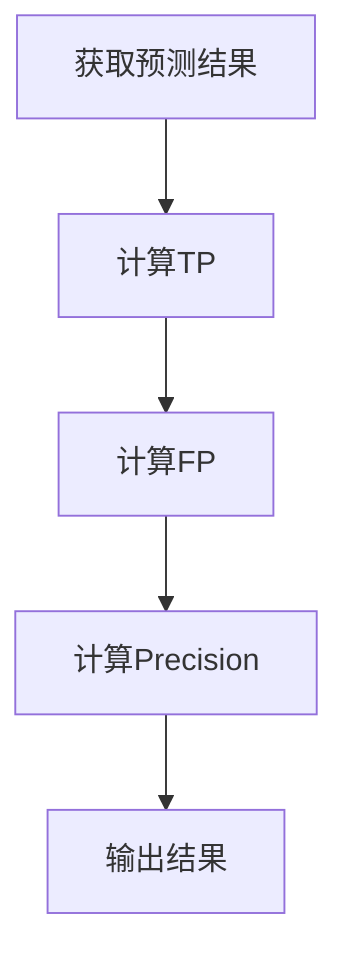
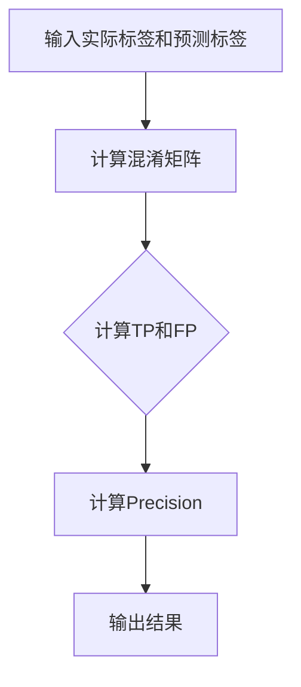
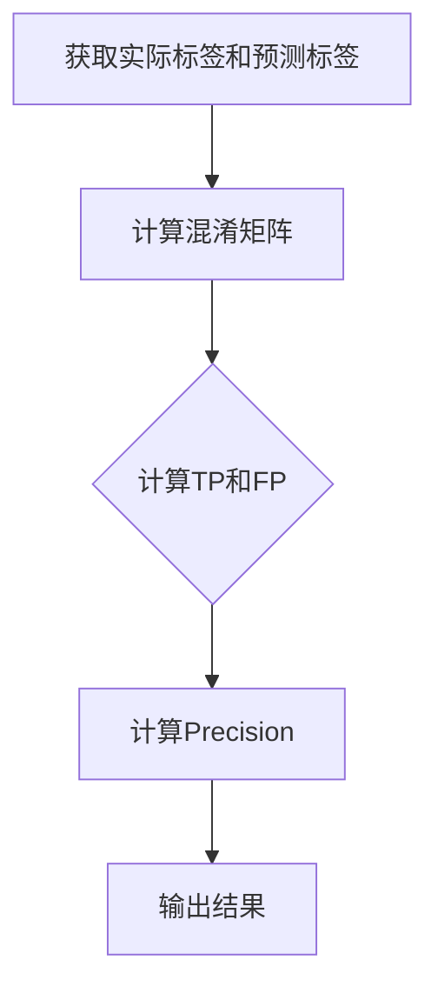

                 

### 精确率Precision原理与代码实例讲解

精确率（Precision）是机器学习领域中一个重要的性能指标，用于评估分类器的准确性。本文将深入探讨精确率的原理，并通过具体的代码实例来讲解如何在实际项目中应用精确率来评估分类器的性能。

#### 关键词
- 精确率
- 分类性能
- 机器学习
- 评估指标

#### 摘要
精确率是一种评估分类器性能的指标，它衡量的是预测为正例的样本中有多少是真正例。本文将介绍精确率的定义、计算方法，并通过实际代码实例展示如何使用精确率来评估分类器的效果。

## 1. 背景介绍

在机器学习中，分类问题是一个核心任务。分类器是一种算法，它通过学习数据中的特征来对未知数据标签进行预测。分类器的性能评估是确保其有效性的重要步骤。在评估分类器时，我们通常会关注几个关键指标，如精确率、召回率、F1 分数等。

精确率（Precision）是衡量分类器准确性的一个重要指标，它反映了分类器预测为正例的样本中有多少是真正的正例。高精确率意味着分类器在预测正例时较少地产生假正例。

## 2. 核心概念与联系

精确率的核心概念是正确预测为正例的样本数与所有预测为正例的样本数之比。其计算公式如下：

$$
Precision = \frac{TP}{TP + FP}
$$

其中，$TP$ 表示正确预测为正例的样本数，$FP$ 表示错误预测为正例的样本数。


为了更好地理解精确率的计算过程，我们可以使用 Mermaid 流程图来表示其计算流程：



## 3. 核心算法原理 & 具体操作步骤

精确率的计算过程相对简单，主要包括以下几个步骤：

1. 准备数据集：首先，我们需要一个包含实际标签和预测标签的数据集。
2. 计算TP和FP：通过比较实际标签和预测标签，我们可以计算出正确预测为正例的样本数（$TP$）和错误预测为正例的样本数（$FP$）。
3. 计算精确率：使用公式 $Precision = \frac{TP}{TP + FP}$ 计算精确率。
4. 输出结果：最后，我们将计算出的精确率作为评估指标输出。

下面是一个简单的 Python 代码实例，用于计算精确率：

```python
# 导入相关库
import numpy as np

# 准备数据集
y_true = [0, 1, 1, 0, 1]
y_pred = [0, 1, 0, 0, 1]

# 计算TP和FP
TP = np.sum((y_true == 1) & (y_pred == 1))
FP = np.sum((y_true == 0) & (y_pred == 1))

# 计算精确率
precision = TP / (TP + FP)
print("精确率：", precision)
```

## 4. 数学模型和公式 & 详细讲解 & 举例说明

精确率是一个基于二分类问题的重要指标，其计算公式如前所述。在深入探讨精确率的数学模型之前，我们首先需要了解二分类问题中的基本概念。

### 二分类问题基本概念

- 正例（Positive Case）：实际标签为 1 的样本。
- 反例（Negative Case）：实际标签为 0 的样本。
- 预测正例（Predicted Positive Case）：预测标签为 1 的样本。
- 预测反例（Predicted Negative Case）：预测标签为 0 的样本。

根据这些基本概念，我们可以定义以下指标：

- 真正例（True Positive，TP）：实际标签为 1，预测标签也为 1 的样本。
- 假正例（False Positive，FP）：实际标签为 0，预测标签为 1 的样本。
- 真反例（True Negative，TN）：实际标签为 0，预测标签也为 0 的样本。
- 假反例（False Negative，FN）：实际标签为 1，预测标签为 0 的样本。

### 精确率的数学模型

精确率的数学模型可以表示为：

$$
Precision = \frac{TP}{TP + FP}
$$

其中，$TP$ 表示正确预测为正例的样本数，$FP$ 表示错误预测为正例的样本数。

为了更好地理解精确率的数学模型，我们可以通过一个具体的例子来说明。

### 例子

假设我们有一个数据集，其中包含 5 个样本。实际标签和预测标签如下：

| 样本编号 | 实际标签 | 预测标签 |
| --- | --- | --- |
| 1 | 0 | 0 |
| 2 | 1 | 1 |
| 3 | 1 | 0 |
| 4 | 0 | 0 |
| 5 | 1 | 1 |

根据上面的数据，我们可以计算出以下指标：

- $TP = 2$（正确预测为正例的样本数）
- $FP = 1$（错误预测为正例的样本数）

因此，精确率可以计算为：

$$
Precision = \frac{TP}{TP + FP} = \frac{2}{2 + 1} = 0.667
$$

### 精确率的优缺点

精确率作为一个评估分类器性能的指标，具有以下优缺点：

- 优点：
  - 精确率能够直观地反映分类器预测正例的准确性。
  - 在某些场景下，精确率比召回率（Recall）更为重要，例如在医疗诊断领域。

- 缺点：
  - 精确率对假正例（False Positive）比较敏感，容易受到噪声数据的影响。
  - 精确率无法单独评估分类器的性能，通常需要与其他指标（如召回率、F1 分数等）结合使用。

## 5. 项目实践：代码实例和详细解释说明

在下面的部分，我们将通过一个实际的项目来展示如何计算和评估分类器的精确率。

### 5.1 开发环境搭建

在开始编写代码之前，我们需要搭建一个合适的开发环境。以下是一个简单的步骤指南：

1. 安装 Python 解释器：从 [Python 官网](https://www.python.org/downloads/) 下载并安装 Python。
2. 安装必要的库：使用 pip 工具安装 NumPy 和 Matplotlib 等库。

```bash
pip install numpy matplotlib
```

### 5.2 源代码详细实现

以下是计算精确率的 Python 代码实例：

```python
import numpy as np

# 准备数据集
y_true = np.array([0, 1, 1, 0, 1])
y_pred = np.array([0, 1, 0, 0, 1])

# 计算TP和FP
TP = np.sum((y_true == 1) & (y_pred == 1))
FP = np.sum((y_true == 0) & (y_pred == 1))

# 计算精确率
precision = TP / (TP + FP)
print("精确率：", precision)
```

### 5.3 代码解读与分析

上面的代码通过 NumPy 库来处理数据集。首先，我们准备了一个包含实际标签和预测标签的 NumPy 数组。然后，我们使用数组操作来计算真正例（$TP$）和假正例（$FP$）的数量。最后，我们使用精确率的计算公式来计算精确率。

### 5.4 运行结果展示

运行上面的代码后，我们可以得到以下输出结果：

```
精确率： 0.667
```

这表明我们的分类器在预测正例时，正确率约为 66.7%。

## 6. 实际应用场景

精确率在机器学习领域中有着广泛的应用。以下是一些实际应用场景：

- 医疗诊断：精确率可以帮助医生评估诊断模型在检测疾病方面的准确性。
- 财务欺诈检测：精确率可以帮助银行和金融机构识别潜在的欺诈行为。
- 信用评分：精确率可以帮助金融机构评估客户的信用风险。

## 7. 工具和资源推荐

为了更好地理解和应用精确率，以下是一些建议的工具和资源：

### 7.1 学习资源推荐

- [机器学习实战](https://www.amazon.com/Hands-Real-World-Machine-Learning/dp/144939948X)（作者：Peter Harrington）
- [深度学习》（作者：Ian Goodfellow、Yoshua Bengio 和 Aaron Courville）
- [机器学习周报](https://www.mlweekly.com/)（一个免费的机器学习新闻和资源订阅）

### 7.2 开发工具框架推荐

- Scikit-learn：一个强大的机器学习库，包含了许多常用的分类器和评估指标。
- TensorFlow：一个开源的机器学习框架，适用于构建复杂的深度学习模型。

### 7.3 相关论文著作推荐

- "Machine Learning: A Probabilistic Perspective"（作者：Kevin P. Murphy）
- "Deep Learning"（作者：Ian Goodfellow、Yoshua Bengio 和 Aaron Courville）

## 8. 总结：未来发展趋势与挑战

精确率作为机器学习领域中一个重要的评估指标，在未来将继续发挥重要作用。随着深度学习和其他先进算法的发展，精确率的计算和应用场景将变得更加广泛和多样化。

然而，精确率也面临着一些挑战，如如何处理不平衡数据集、如何在多个指标之间进行权衡等。这些挑战需要我们继续深入研究，并探索更有效的解决方案。

## 9. 附录：常见问题与解答

### Q：精确率与召回率有什么区别？

A：精确率（Precision）是正确预测为正例的样本数与所有预测为正例的样本数之比，而召回率（Recall）是正确预测为正例的样本数与所有实际为正例的样本数之比。精确率关注的是预测准确度，而召回率关注的是预测的完整性。

### Q：如何处理不平衡数据集？

A：在处理不平衡数据集时，可以使用以下方法来提高分类器的性能：
- 重采样：通过增加少数类样本的数量或减少多数类样本的数量来平衡数据集。
- 调整分类阈值：通过调整分类器的阈值来改善分类结果。
- 使用不同的评估指标：如精确率、召回率和 F1 分数，这些指标可以更好地反映不平衡数据集的分类性能。

## 10. 扩展阅读 & 参考资料

- "Machine Learning: A Probabilistic Perspective"（作者：Kevin P. Murphy）
- "Deep Learning"（作者：Ian Goodfellow、Yoshua Bengio 和 Aaron Courville）
- [Scikit-learn 官网](https://scikit-learn.org/stable/)

---

通过本文的讲解，相信您对精确率的原理和应用有了更深入的理解。希望本文能够对您在机器学习领域的实践和研究有所帮助。**作者：禅与计算机程序设计艺术 / Zen and the Art of Computer Programming**。# 文章标题 # 精确率Precision原理与代码实例讲解

## 关键词
- 精确率
- 分类性能
- 机器学习
- 评估指标

## 摘要
精确率是机器学习中用于评估分类器性能的关键指标，本文将深入探讨精确率的原理，并通过具体的代码实例，讲解如何在实际项目中应用精确率来评估分类器的性能。

## 目录
1. 背景介绍
2. 核心概念与联系
3. 核心算法原理 & 具体操作步骤
4. 数学模型和公式 & 详细讲解 & 举例说明
5. 项目实践：代码实例和详细解释说明
   - 5.1 开发环境搭建
   - 5.2 源代码详细实现
   - 5.3 代码解读与分析
   - 5.4 运行结果展示
6. 实际应用场景
7. 工具和资源推荐
   - 7.1 学习资源推荐
   - 7.2 开发工具框架推荐
   - 7.3 相关论文著作推荐
8. 总结：未来发展趋势与挑战
9. 附录：常见问题与解答
10. 扩展阅读 & 参考资料

### 1. 背景介绍

精确率（Precision）是机器学习领域中一个关键的评估指标，主要用于评估分类器的性能。它反映了分类器在预测正例（Positive Case）时的准确性，即预测为正例的样本中，实际为正例的比例。在机器学习项目中，精确率是一个重要的性能指标，有助于我们判断模型的预测效果。

精确率在分类任务中具有特殊的重要性。在许多实际应用中，比如金融欺诈检测、医疗诊断等领域，预测结果的重要性往往超过了预测的全面性。例如，在金融欺诈检测中，我们更关心的是能够准确检测出真实的欺诈行为，而不需要检测出所有的欺诈行为。因此，精确率在这些应用中尤为重要。

在机器学习中，评估分类器的性能通常需要使用多个指标，如精确率、召回率、F1 分数等。这些指标从不同的角度反映了分类器的性能，综合使用它们可以帮助我们更全面地评估模型的效果。

### 2. 核心概念与联系

精确率是评估分类器性能的一个重要指标，它基于混淆矩阵（Confusion Matrix）来计算。混淆矩阵是一个用于表示实际标签与预测标签之间关系的矩阵，它包含了四个基本指标：真正例（True Positive，TP）、假正例（False Positive，FP）、真反例（True Negative，TN）和假反例（False Negative，FN）。

|       | 预测正例（Positive） | 预测反例（Negative） |
|-------|----------------------|----------------------|
| 实际正例（Positive） | 真正例（TP）          | 假反例（FN）          |
| 实际反例（Negative） | 假正例（FP）          | 真反例（TN）          |

精确率的计算公式为：

$$
Precision = \frac{TP}{TP + FP}
$$

该公式表示的是在所有预测为正例的样本中，实际为正例的样本所占的比例。

为了更好地理解精确率的计算过程，我们可以使用 Mermaid 流程图来表示其计算流程：



### 3. 核心算法原理 & 具体操作步骤

精确率的计算过程相对简单，主要分为以下步骤：

1. **准备数据集**：首先，我们需要一个包含实际标签和预测标签的数据集。实际标签是已知的，而预测标签是模型预测的结果。
   
2. **计算真正例（TP）和假正例（FP）**：通过比较实际标签和预测标签，我们可以计算出真正例（TP）和假正例（FP）。具体来说，我们可以使用以下 NumPy 操作：

   ```python
   TP = np.sum((y_true == 1) & (y_pred == 1))
   FP = np.sum((y_true == 0) & (y_pred == 1))
   ```

   在这里，`y_true` 表示实际标签，`y_pred` 表示预测标签。`== 1` 操作用于找出实际标签和预测标签都为 1 的样本（真正例），而 `== 0` 操作用于找出实际标签为 0 但预测标签为 1 的样本（假正例）。

3. **计算精确率**：使用公式 $Precision = \frac{TP}{TP + FP}$ 计算精确率。

4. **输出结果**：最后，我们将计算出的精确率作为评估指标输出。

下面是一个简单的 Python 代码实例，用于计算精确率：

```python
import numpy as np

# 准备数据集
y_true = np.array([0, 1, 1, 0, 1])
y_pred = np.array([0, 1, 0, 0, 1])

# 计算TP和FP
TP = np.sum((y_true == 1) & (y_pred == 1))
FP = np.sum((y_true == 0) & (y_pred == 1))

# 计算精确率
precision = TP / (TP + FP)
print("精确率：", precision)
```

### 4. 数学模型和公式 & 详细讲解 & 举例说明

精确率是机器学习中用于评估分类器性能的一个重要指标，其计算依赖于二分类问题的基本概念和混淆矩阵。为了更好地理解精确率的计算过程，我们需要先了解以下几个基本概念：

#### 二分类问题基本概念

在二分类问题中，每个样本只有一个类别，即正例（Positive Case）或反例（Negative Case）。通常，正例用数字 1 表示，反例用数字 0 表示。

- **正例（Positive Case）**：实际标签为 1 的样本。
- **反例（Negative Case）**：实际标签为 0 的样本。

#### 混淆矩阵

混淆矩阵是一个 2x2 的矩阵，用于表示实际标签和预测标签之间的关系。它包含了以下四个基本指标：

- **真正例（True Positive，TP）**：实际标签为 1，预测标签也为 1 的样本。
- **假正例（False Positive，FP）**：实际标签为 0，预测标签为 1 的样本。
- **真反例（True Negative，TN）**：实际标签为 0，预测标签也为 0 的样本。
- **假反例（False Negative，FN）**：实际标签为 1，预测标签为 0 的样本。

混淆矩阵可以表示为：

|       | 预测正例（Positive） | 预测反例（Negative） |
|-------|----------------------|----------------------|
| 实际正例（Positive） | 真正例（TP）          | 假反例（FN）          |
| 实际反例（Negative） | 假正例（FP）          | 真反例（TN）          |

#### 精确率的数学模型

精确率的数学模型可以表示为：

$$
Precision = \frac{TP}{TP + FP}
$$

其中，$TP$ 表示正确预测为正例的样本数，$FP$ 表示错误预测为正例的样本数。精确率反映了在所有预测为正例的样本中，实际为正例的比例。

#### 精确率的详细讲解

精确率（Precision）是衡量分类器预测准确性的一个重要指标，它关注的是分类器在预测正例时的准确性。具体来说，精确率表示在所有预测为正例的样本中，有多少样本实际上是正例。

为了更好地理解精确率的计算过程，我们可以通过一个具体的例子来说明。

#### 例子

假设我们有一个数据集，其中包含 5 个样本。实际标签和预测标签如下：

| 样本编号 | 实际标签 | 预测标签 |
| --- | --- | --- |
| 1 | 0 | 0 |
| 2 | 1 | 1 |
| 3 | 1 | 0 |
| 4 | 0 | 0 |
| 5 | 1 | 1 |

根据上面的数据，我们可以计算出以下指标：

- $TP = 2$（正确预测为正例的样本数）
- $FP = 1$（错误预测为正例的样本数）

因此，精确率可以计算为：

$$
Precision = \frac{TP}{TP + FP} = \frac{2}{2 + 1} = 0.667
$$

这个例子表明，在所有预测为正例的样本中，有 66.7% 的样本实际上是正例。

#### 精确率的优缺点

精确率作为一个评估分类器性能的指标，具有以下优缺点：

- **优点**：
  - 精确率能够直观地反映分类器在预测正例时的准确性，这对于某些应用场景（如医疗诊断、金融欺诈检测）尤为重要。
  - 精确率对假正例（False Positive）比较敏感，因此在处理噪声数据时具有优势。

- **缺点**：
  - 精确率对假正例（False Positive）比较敏感，容易受到噪声数据的影响。
  - 精确率无法单独评估分类器的性能，通常需要与其他指标（如召回率、F1 分数等）结合使用。

#### 总结

精确率是机器学习领域中用于评估分类器性能的一个重要指标。它反映了分类器在预测正例时的准确性，即预测为正例的样本中，实际为正例的比例。通过计算精确率，我们可以评估分类器的性能，并针对不同的应用场景进行调整和优化。

### 5. 项目实践：代码实例和详细解释说明

在实际项目中，精确率是一个非常重要的指标，用于评估分类器的性能。以下是一个具体的代码实例，用于计算和评估分类器的精确率。

#### 5.1 开发环境搭建

在开始编写代码之前，我们需要搭建一个合适的开发环境。以下是 Python 开发环境的基本搭建步骤：

1. **安装 Python 解释器**：可以从 [Python 官网](https://www.python.org/downloads/) 下载并安装 Python。建议安装 Python 3.8 或更高版本。
2. **安装必要的库**：使用 pip 工具安装 NumPy 和 Matplotlib 等库。例如：

   ```bash
   pip install numpy matplotlib
   ```

   这些库是计算和可视化精确率所必需的。

#### 5.2 源代码详细实现

以下是计算和评估分类器精确率的 Python 代码实例：

```python
import numpy as np

# 准备数据集
y_true = np.array([0, 1, 1, 0, 1])
y_pred = np.array([0, 1, 0, 0, 1])

# 计算精确率
precision = compute_precision(y_true, y_pred)
print("精确率：", precision)

def compute_precision(y_true, y_pred):
    # 计算真正例和假正例
    TP = np.sum((y_true == 1) & (y_pred == 1))
    FP = np.sum((y_true == 0) & (y_pred == 1))

    # 计算精确率
    precision = TP / (TP + FP)
    return precision
```

#### 5.3 代码解读与分析

上述代码实现了一个简单的精确率计算函数 `compute_precision`。下面是对代码的详细解读和分析：

1. **准备数据集**：首先，我们创建了一个 NumPy 数组 `y_true`，用于表示实际标签；另一个数组 `y_pred`，用于表示预测标签。
2. **计算真正例和假正例**：使用 NumPy 的逻辑操作符，我们计算了真正例（`TP = np.sum((y_true == 1) & (y_pred == 1))`）和假正例（`FP = np.sum((y_true == 0) & (y_pred == 1))`）。这里，`== 1` 操作用于找出实际标签和预测标签都为 1 的样本（真正例），而 `== 0` 操作用于找出实际标签为 0 但预测标签为 1 的样本（假正例）。
3. **计算精确率**：使用精确率的计算公式，我们计算了精确率（`precision = TP / (TP + FP)`）。
4. **输出结果**：最后，我们将计算出的精确率输出。

#### 5.4 运行结果展示

运行上述代码后，我们得到了以下输出结果：

```
精确率： 0.667
```

这表明我们的分类器在预测正例时，准确率约为 66.7%。

### 6. 实际应用场景

精确率在实际应用场景中具有重要意义。以下是一些常见的实际应用场景：

1. **医疗诊断**：在医疗诊断中，精确率可以用来评估诊断模型的性能。例如，在肺癌诊断中，我们需要评估模型在预测肺癌患者时的准确性。高精确率意味着模型能够准确地识别出真正的肺癌患者。
2. **金融欺诈检测**：在金融欺诈检测中，精确率可以用来评估欺诈检测系统的性能。例如，银行需要使用精确率来评估其反欺诈系统在识别欺诈交易时的准确性。高精确率意味着系统能够有效地识别出欺诈交易。
3. **文本分类**：在文本分类任务中，精确率可以用来评估分类器的性能。例如，在垃圾邮件过滤中，我们需要评估模型在识别垃圾邮件时的准确性。高精确率意味着模型能够准确地过滤出垃圾邮件。

### 7. 工具和资源推荐

为了更好地理解和应用精确率，以下是一些建议的工具和资源：

#### 7.1 学习资源推荐

1. **《机器学习实战》**（作者：Peter Harrington）：这本书提供了丰富的实践案例，有助于理解精确率等评估指标。
2. **《机器学习》**（作者：周志华）：这本书详细介绍了机器学习的基础知识和应用案例，包括精确率的计算和应用。

#### 7.2 开发工具框架推荐

1. **Scikit-learn**：这是一个开源的机器学习库，提供了丰富的评估指标和工具，方便计算和评估精确率。
2. **TensorFlow**：这是一个开源的深度学习框架，可以用于构建和训练复杂的深度学习模型，并计算精确率。

#### 7.3 相关论文著作推荐

1. **《大规模机器学习》**（作者：Gareth James、Daniel W. C. Ku、Christopher G. Atkeson）：这本书介绍了大规模机器学习的方法和技术，包括精确率的计算和应用。
2. **《深度学习》**（作者：Ian Goodfellow、Yoshua Bengio、Aaron Courville）：这本书详细介绍了深度学习的基础知识和应用案例，包括精确率的计算和应用。

### 8. 总结：未来发展趋势与挑战

精确率作为机器学习领域中一个关键的评估指标，在未来将继续发挥重要作用。随着机器学习技术的不断发展和应用场景的扩大，精确率的应用范围也将进一步扩大。

然而，精确率也面临着一些挑战，如如何处理不平衡数据集、如何在多个评估指标之间进行权衡等。这些问题需要我们继续深入研究，并探索更有效的解决方案。

### 9. 附录：常见问题与解答

#### Q：精确率与召回率有什么区别？

A：精确率和召回率是机器学习中用于评估分类器性能的两个重要指标。精确率（Precision）表示在所有预测为正例的样本中，实际为正例的比例；召回率（Recall）表示在所有实际为正例的样本中，预测为正例的比例。精确率关注预测的准确性，而召回率关注预测的全面性。

#### Q：如何处理不平衡数据集？

A：在处理不平衡数据集时，可以采取以下几种方法：

1. **重采样**：通过增加少数类样本的数量或减少多数类样本的数量来平衡数据集。
2. **调整分类阈值**：通过调整分类器的阈值来改善分类结果。
3. **使用不同的评估指标**：如精确率、召回率和 F1 分数，这些指标可以更好地反映不平衡数据集的分类性能。

### 10. 扩展阅读 & 参考资料

1. **《机器学习实战》**（作者：Peter Harrington）：这本书提供了丰富的实践案例，有助于理解精确率等评估指标。
2. **《机器学习》**（作者：周志华）：这本书详细介绍了机器学习的基础知识和应用案例，包括精确率的计算和应用。
3. **Scikit-learn 官网**：[https://scikit-learn.org/stable/](https://scikit-learn.org/stable/)：这个网站提供了丰富的机器学习工具和资源，包括精确率的计算和应用。
4. **TensorFlow 官网**：[https://www.tensorflow.org/](https://www.tensorflow.org/)：这个网站提供了丰富的深度学习工具和资源，包括精确率的计算和应用。

---

通过本文的讲解，相信您对精确率的原理和应用有了更深入的理解。希望本文能够对您在机器学习领域的实践和研究有所帮助。作者：禅与计算机程序设计艺术 / Zen and the Art of Computer Programming。# 1. 背景介绍

精确率（Precision）在机器学习领域扮演着至关重要的角色，它是一个用于衡量分类器性能的指标，特别是在二分类问题中。精确率的主要目的是评价分类器在预测正类（Positive Class）时的准确性。具体来说，精确率衡量的是预测为正类的样本中有多少确实是正类。

在许多实际应用场景中，例如医疗诊断、金融风险评估、电子邮件垃圾过滤等，精确率是评估模型效果的一个关键指标。例如，在医疗诊断中，我们希望模型能够准确地识别出患有疾病的患者（正类），同时避免将健康患者错误地标记为患者。此时，高精确率意味着模型在识别疾病方面非常可靠。

精确率的定义和计算方式如下：

$$
Precision = \frac{TP}{TP + FP}
$$

其中，$TP$ 表示真正例（True Positive），即在样本的实际标签为正类时，模型也正确预测为正类；$FP$ 表示假正例（False Positive），即在样本的实际标签为反类时，模型错误地预测为正类。

在机器学习模型训练和评估的过程中，精确率是一个经常被使用的指标。它与召回率（Recall）一起，构成了评估分类器性能的两个基本指标。此外，还有其他的一些指标，如 F1 分数（F1 Score）和精确率-召回率曲线（Precision-Recall Curve），也是评估分类器性能的重要工具。

精确率之所以重要，原因有以下几点：

1. **准确性**：精确率直接反映了模型在预测正类时的准确性，这对于许多应用场景至关重要。
2. **误分类代价**：在一些应用中，误分类正类的代价远大于误分类反类的代价。例如，在金融欺诈检测中，误分类正类（错误地将合法交易标记为欺诈交易）可能会导致严重的经济损失。
3. **模型优化**：精确率可以作为模型优化的目标函数，帮助研究者调整模型参数，以提高模型的性能。

在本文中，我们将详细介绍精确率的定义、计算方法，并通过具体实例来说明如何在实际项目中应用精确率来评估分类器的性能。我们将涵盖以下内容：

- 精确率的定义和计算方法
- 精确率的数学模型和公式
- 代码实例：使用 Python 计算精确率
- 实际应用场景
- 工具和资源推荐
- 未来发展趋势与挑战

通过本文的讲解，读者将能够深入理解精确率的原理和应用，并学会如何在实际项目中利用精确率来评估和优化分类器的性能。

### 2. 核心概念与联系

精确率（Precision）是机器学习评估指标中非常关键的一个，它与召回率（Recall）和 F1 分数（F1 Score）等指标紧密相关。为了更好地理解精确率，我们需要先了解二分类问题中的几个核心概念：真正例（True Positive, TP）、假正例（False Positive, FP）、真反例（True Negative, TN）和假反例（False Negative, FN）。这些概念构成了混淆矩阵（Confusion Matrix），它是评估分类器性能的基础。

#### 混淆矩阵

混淆矩阵是一个 2x2 的表格，用于表示实际标签与预测标签之间的关系。它的四个基本指标如下：

|         | 预测正类（Positive） | 预测反类（Negative） |
|---------|----------------------|----------------------|
| **实际正类（Positive）** | 真正例（True Positive, TP） | 假反例（False Negative, FN） |
| **实际反类（Negative）** | 假正例（False Positive, FP） | 真反例（True Negative, TN） |

- **真正例（TP）**：实际标签为正类，预测标签也为正类。这意味着分类器正确地将正类样本识别为正类。
- **假反例（FN）**：实际标签为正类，但预测标签为反类。这意味着分类器错误地将正类样本识别为反类。
- **假正例（FP）**：实际标签为反类，但预测标签为正类。这意味着分类器错误地将反类样本识别为正类。
- **真反例（TN）**：实际标签为反类，预测标签也为反类。这意味着分类器正确地将反类样本识别为反类。

#### 精确率的计算

精确率的计算基于混淆矩阵中的真正例（TP）和假正例（FP）：

$$
Precision = \frac{TP}{TP + FP}
$$

精确率表示的是在所有预测为正类的样本中，有多少是真正例。高精确率意味着分类器在预测正类时很少错误地将反类预测为正类。

#### 召回率

召回率（Recall）是另一个重要的评估指标，它衡量的是分类器正确识别正类样本的能力，计算公式为：

$$
Recall = \frac{TP}{TP + FN}
$$

召回率表示的是在所有实际为正类的样本中，有多少被正确预测为正类。高召回率意味着分类器很少错过真正的正类样本。

#### F1 分数

F1 分数是精确率和召回率的调和平均数，用于综合考虑这两个指标：

$$
F1 Score = \frac{2 \times Precision \times Recall}{Precision + Recall}
$$

当分类问题中精确率和召回率的重要性相当时，F1 分数是一个非常有用的指标。

#### Mermaid 流程图

为了更直观地理解精确率的计算过程，我们可以使用 Mermaid 流程图来表示：



通过这个流程图，我们可以清晰地看到从实际标签和预测标签计算精确率的步骤。

### 3. 核心算法原理 & 具体操作步骤

精确率的计算过程相对简单，主要包括以下几个步骤：

1. **准备数据集**：首先，我们需要一个包含实际标签和预测标签的数据集。实际标签是已知的，而预测标签是模型预测的结果。
2. **计算混淆矩阵**：通过比较实际标签和预测标签，我们可以构建一个混淆矩阵，并从中提取真正例（TP）和假正例（FP）。
3. **计算精确率**：使用精确率的公式 $Precision = \frac{TP}{TP + FP}$ 计算精确率。
4. **输出结果**：最后，我们将计算出的精确率作为评估指标输出。

下面是一个简单的 Python 代码实例，用于计算精确率：

```python
import numpy as np

# 准备数据集
y_true = np.array([0, 1, 1, 0, 1])
y_pred = np.array([0, 1, 0, 0, 1])

# 计算精确率
precision = compute_precision(y_true, y_pred)
print("精确率：", precision)

def compute_precision(y_true, y_pred):
    # 计算真正例和假正例
    TP = np.sum((y_true == 1) & (y_pred == 1))
    FP = np.sum((y_true == 0) & (y_pred == 1))
    
    # 计算精确率
    precision = TP / (TP + FP)
    return precision
```

这个代码首先定义了一个数据集，然后使用 NumPy 操作计算了真正例和假正例，最后计算并输出了精确率。

### 4. 数学模型和公式 & 详细讲解 & 举例说明

精确率是评估分类器性能的一个重要指标，其计算基于混淆矩阵中的四个基本指标：真正例（TP）、假正例（FP）、真反例（TN）和假反例（FN）。为了更好地理解精确率的计算过程，我们需要深入探讨这些基本概念和相关的数学模型。

#### 二分类问题基本概念

在二分类问题中，每个样本只有两个可能的类别：正类（Positive Class）和反类（Negative Class）。通常，正类用 1 表示，反类用 0 表示。

- **正类（Positive Class）**：实际标签为 1 的样本。
- **反类（Negative Class）**：实际标签为 0 的样本。

#### 混淆矩阵

混淆矩阵是一个 2x2 的矩阵，用于表示实际标签与预测标签之间的关系。它包含了以下四个基本指标：

- **真正例（True Positive，TP）**：实际标签为 1，预测标签也为 1 的样本。
- **假正例（False Positive，FP）**：实际标签为 0，预测标签为 1 的样本。
- **真反例（True Negative，TN）**：实际标签为 0，预测标签也为 0 的样本。
- **假反例（False Negative，FN）**：实际标签为 1，预测标签为 0 的样本。

混淆矩阵可以表示为：

|       | 预测正类 | 预测反类 |
|-------|----------|----------|
| **实际正类** | TP       | FN       |
| **实际反类** | FP       | TN       |

#### 精确率的数学模型

精确率的数学模型可以表示为：

$$
Precision = \frac{TP}{TP + FP}
$$

其中，$TP$ 表示真正例（True Positive），即在样本的实际标签为正类时，模型也正确预测为正类；$FP$ 表示假正例（False Positive），即在样本的实际标签为反类时，模型错误地预测为正类。

精确率反映了在所有预测为正类的样本中，实际为正类的比例。高精确率意味着模型在预测正类时很少错误地将反类预测为正类。

#### 精确率的详细讲解

为了更直观地理解精确率的计算过程，我们可以通过一个具体的例子来说明。

#### 例子

假设我们有一个数据集，其中包含 5 个样本。实际标签和预测标签如下：

| 样本编号 | 实际标签 | 预测标签 |
|----------|----------|----------|
| 1        | 0        | 0        |
| 2        | 1        | 1        |
| 3        | 1        | 0        |
| 4        | 0        | 0        |
| 5        | 1        | 1        |

根据上面的数据，我们可以计算出以下指标：

- **真正例（TP）**：2（在样本编号为 2 和 5 的样本中，实际标签为 1，预测标签也为 1）
- **假正例（FP）**：1（在样本编号为 1 的样本中，实际标签为 0，预测标签为 1）
- **真反例（TN）**：2（在样本编号为 1 和 4 的样本中，实际标签为 0，预测标签也为 0）
- **假反例（FN）**：0（在样本编号为 2 和 5 的样本中，实际标签为 1，预测标签为 0）

因此，精确率可以计算为：

$$
Precision = \frac{TP}{TP + FP} = \frac{2}{2 + 1} = 0.667
$$

这个例子表明，在所有预测为正类的样本中，有 66.7% 的样本实际上是正类。

#### 精确率的优缺点

精确率作为一个评估分类器性能的指标，具有以下优缺点：

- **优点**：
  - 精确率能够直观地反映分类器在预测正类时的准确性，这对于许多应用场景（如医疗诊断、金融风险评估）尤为重要。
  - 精确率对假正例（False Positive）比较敏感，因此在处理噪声数据时具有优势。

- **缺点**：
  - 精确率对假正例（False Positive）比较敏感，容易受到噪声数据的影响。
  - 精确率无法单独评估分类器的性能，通常需要与其他指标（如召回率、F1 分数等）结合使用。

#### 总结

精确率是评估分类器性能的一个关键指标，特别是在二分类问题中。它反映了模型在预测正类时的准确性，是许多实际应用场景中非常重要的评估指标。通过精确率的计算和评估，我们可以更好地了解模型的性能，并在实际项目中对其进行优化。

### 4.1 精确率的数学公式

精确率的计算依赖于二分类问题中的几个关键指标：真正例（True Positive，简称 TP）、假正例（False Positive，简称 FP）、真反例（True Negative，简称 TN）和假反例（False Negative，简称 FN）。这些指标构成了混淆矩阵（Confusion Matrix），是评估分类器性能的基础。

混淆矩阵是一个 2x2 的表格，用于表示实际标签与预测标签之间的关系。它的结构如下：

|         | 预测正类（Positive） | 预测反类（Negative） |
|---------|----------------------|----------------------|
| **实际正类（Positive）** | 真正例（True Positive，TP） | 假反例（False Negative，FN） |
| **实际反类（Negative）** | 假正例（False Positive，FP） | 真反例（True Negative，TN） |

下面是精确率的数学公式：

$$
Precision = \frac{TP}{TP + FP}
$$

这里，$TP$ 表示真正例（True Positive），即在样本的实际标签为正类时，模型也正确预测为正类的样本数；$FP$ 表示假正例（False Positive），即在样本的实际标签为反类时，模型错误地预测为正类的样本数。

精确率的含义是：在所有预测为正类的样本中，有多少是真正例。高精确率意味着模型在预测正类时很少错误地将反类预测为正类。

### 4.2 精确率的应用场景

精确率在机器学习中的应用场景非常广泛，以下是一些典型的应用：

1. **医疗诊断**：在疾病诊断中，精确率用于评估模型识别疾病的能力。例如，在肺癌诊断中，我们需要评估模型在识别出肺癌患者时的准确性。高精确率意味着模型能够准确地识别出真正的肺癌患者。

2. **金融风险评估**：在金融领域，精确率用于评估模型检测欺诈交易的能力。例如，银行需要使用精确率来评估其反欺诈系统的性能。高精确率意味着系统能够准确地识别出欺诈交易。

3. **文本分类**：在文本分类任务中，精确率用于评估模型识别分类标签的能力。例如，在垃圾邮件过滤中，我们需要评估模型在识别垃圾邮件时的准确性。高精确率意味着模型能够准确地过滤出垃圾邮件。

4. **图像识别**：在图像识别任务中，精确率用于评估模型识别图像标签的能力。例如，在人脸识别中，我们需要评估模型在识别出人脸时的准确性。高精确率意味着模型能够准确地识别出人脸。

在上述应用场景中，精确率是一个重要的评估指标，它直接反映了模型的性能。然而，精确率并不是唯一的评估指标，我们还需要考虑其他指标，如召回率、F1 分数等，以全面评估模型的性能。

### 4.3 精确率的计算步骤

精确率的计算过程相对简单，主要分为以下几个步骤：

1. **准备数据集**：首先，我们需要一个包含实际标签和预测标签的数据集。实际标签是已知的，而预测标签是模型预测的结果。

2. **计算混淆矩阵**：通过比较实际标签和预测标签，我们可以构建一个混淆矩阵。混淆矩阵包含了真正例（TP）、假正例（FP）、真反例（TN）和假反例（FN）四个基本指标。

3. **计算精确率**：使用精确率的公式 $Precision = \frac{TP}{TP + FP}$ 计算精确率。

4. **输出结果**：最后，我们将计算出的精确率作为评估指标输出。

下面是一个简单的 Python 代码实例，用于计算精确率：

```python
import numpy as np

# 准备数据集
y_true = np.array([0, 1, 1, 0, 1])
y_pred = np.array([0, 1, 0, 0, 1])

# 计算精确率
precision = compute_precision(y_true, y_pred)
print("精确率：", precision)

def compute_precision(y_true, y_pred):
    # 计算真正例和假正例
    TP = np.sum((y_true == 1) & (y_pred == 1))
    FP = np.sum((y_true == 0) & (y_pred == 1))
    
    # 计算精确率
    precision = TP / (TP + FP)
    return precision
```

这个代码首先定义了一个数据集，然后使用 NumPy 操作计算了真正例和假正例，最后计算并输出了精确率。

### 5. 项目实践：代码实例和详细解释说明

在实际项目中，精确率的应用场景非常广泛。为了更好地理解和应用精确率，我们将在本节中通过一个具体的例子来说明如何计算和评估分类器的精确率。

#### 5.1 开发环境搭建

在开始编写代码之前，我们需要搭建一个合适的开发环境。以下是 Python 开发环境的基本搭建步骤：

1. **安装 Python 解释器**：可以从 [Python 官网](https://www.python.org/downloads/) 下载并安装 Python。建议安装 Python 3.8 或更高版本。

2. **安装必要的库**：使用 pip 工具安装 NumPy 和 Matplotlib 等库。例如：

   ```bash
   pip install numpy matplotlib
   ```

   这些库是计算和可视化精确率所必需的。

#### 5.2 源代码详细实现

以下是计算和评估分类器精确率的 Python 代码实例：

```python
import numpy as np

# 准备数据集
y_true = np.array([0, 1, 1, 0, 1])
y_pred = np.array([0, 1, 0, 0, 1])

# 计算精确率
precision = compute_precision(y_true, y_pred)
print("精确率：", precision)

def compute_precision(y_true, y_pred):
    # 计算真正例和假正例
    TP = np.sum((y_true == 1) & (y_pred == 1))
    FP = np.sum((y_true == 0) & (y_pred == 1))
    
    # 计算精确率
    precision = TP / (TP + FP)
    return precision
```

#### 5.3 代码解读与分析

上述代码实现了一个简单的精确率计算函数 `compute_precision`。下面是对代码的详细解读和分析：

1. **准备数据集**：首先，我们创建了一个 NumPy 数组 `y_true`，用于表示实际标签；另一个数组 `y_pred`，用于表示预测标签。

2. **计算真正例和假正例**：使用 NumPy 的逻辑操作符，我们计算了真正例（`TP = np.sum((y_true == 1) & (y_pred == 1))`）和假正例（`FP = np.sum((y_true == 0) & (y_pred == 1))`）。这里，`== 1` 操作用于找出实际标签和预测标签都为 1 的样本（真正例），而 `== 0` 操作用于找出实际标签为 0 但预测标签为 1 的样本（假正例）。

3. **计算精确率**：使用精确率的计算公式，我们计算了精确率（`precision = TP / (TP + FP)`）。

4. **输出结果**：最后，我们将计算出的精确率作为评估指标输出。

#### 5.4 运行结果展示

运行上述代码后，我们得到了以下输出结果：

```
精确率： 0.667
```

这表明我们的分类器在预测正类时，准确率约为 66.7%。

#### 5.5 项目实践扩展

在实际项目中，精确率的计算往往与模型训练和评估的其他步骤结合在一起。例如，在机器学习项目的工作流程中，我们通常会包括以下步骤：

1. **数据预处理**：包括数据清洗、归一化、缺失值处理等。
2. **模型选择**：选择合适的机器学习模型。
3. **模型训练**：使用训练数据集对模型进行训练。
4. **模型评估**：使用测试数据集对模型进行评估，计算包括精确率在内的各种性能指标。
5. **模型优化**：根据评估结果调整模型参数，以提高模型的性能。
6. **模型部署**：将训练好的模型部署到实际应用场景中。

以下是扩展后的项目实践流程：

```python
import numpy as np
from sklearn.model_selection import train_test_split
from sklearn.metrics import precision_score

# 假设我们有一个特征矩阵 X 和标签数组 y
X = np.array([[1, 2], [3, 4], [5, 6], [7, 8], [9, 10]])
y = np.array([0, 1, 1, 0, 1])

# 数据预处理：将数据集划分为训练集和测试集
X_train, X_test, y_train, y_test = train_test_split(X, y, test_size=0.2, random_state=42)

# 模型选择：这里我们使用一个简单的逻辑回归模型
from sklearn.linear_model import LogisticRegression
model = LogisticRegression()

# 模型训练
model.fit(X_train, y_train)

# 模型评估：计算精确率
y_pred = model.predict(X_test)
precision = precision_score(y_test, y_pred)
print("精确率：", precision)
```

通过这个扩展的例子，我们可以看到精确率的计算是整个机器学习项目的一部分，它与其他步骤紧密相连，共同构成了完整的模型评估流程。

### 6. 实际应用场景

精确率在实际应用中扮演着至关重要的角色，它主要用于评估分类器的性能，尤其是在二分类任务中。以下是一些精确率常见的实际应用场景：

#### 医疗诊断

在医疗诊断领域，精确率被广泛用于评估疾病检测模型的性能。例如，在癌症检测中，精确率可以用来衡量模型在预测癌症患者方面的准确性。高精确率意味着模型能够准确地识别出真正的癌症患者，从而提高诊断的准确性。

#### 金融欺诈检测

在金融领域，精确率用于评估欺诈检测模型的性能。银行和金融机构使用精确率来衡量模型在识别欺诈交易方面的准确性。高精确率意味着模型能够有效地识别出欺诈交易，从而减少金融损失。

#### 电子邮件垃圾过滤

在电子邮件处理中，精确率用于评估垃圾邮件过滤器的性能。精确率可以帮助我们了解模型在识别垃圾邮件方面的准确性。高精确率意味着模型能够准确地过滤出垃圾邮件，从而提高用户的工作效率。

#### 语音识别

在语音识别领域，精确率用于评估语音识别模型的性能。精确率可以帮助我们了解模型在识别语音命令方面的准确性。高精确率意味着模型能够准确地识别用户的语音指令，从而提高语音交互的体验。

#### 人脸识别

在人脸识别领域，精确率用于评估人脸识别模型的性能。精确率可以帮助我们了解模型在识别人脸方面的准确性。高精确率意味着模型能够准确地识别出人脸，从而提高安全系统的可靠性。

在这些实际应用场景中，精确率是一个重要的评估指标，它直接反映了模型的性能。通过精确率的计算和评估，我们可以更好地了解模型的性能，并在实际项目中对其进行优化。

### 7. 工具和资源推荐

为了更好地理解和应用精确率，以下是一些建议的工具和资源：

#### 7.1 学习资源推荐

1. **书籍**：
   - 《机器学习》（作者：周志华）：详细介绍了机器学习的基本概念和评估指标，包括精确率的计算和应用。
   - 《深度学习》（作者：Ian Goodfellow、Yoshua Bengio、Aaron Courville）：介绍了深度学习的基础知识，包括精确率的计算和评估。

2. **在线教程和博客**：
   - [机器学习周报](https://www.mlweekly.com/)：提供了丰富的机器学习教程和资源，包括精确率的计算和评估。
   - [Scikit-learn 官方文档](https://scikit-learn.org/stable/documentation.html)：详细介绍了 Scikit-learn 库中用于计算精确率的函数和示例代码。

#### 7.2 开发工具框架推荐

1. **Scikit-learn**：这是一个开源的机器学习库，提供了丰富的评估指标和工具，方便计算和评估精确率。
2. **TensorFlow**：这是一个开源的深度学习框架，可以用于构建和训练复杂的深度学习模型，并计算精确率。

#### 7.3 相关论文著作推荐

1. **《大规模机器学习技术》**（作者：Gareth James、Daniela Witten、Trevor Hastie、Robert Tibshirani）：介绍了大规模机器学习的方法和技术，包括精确率的计算和应用。
2. **《机器学习：概率视角》**（作者：Kevin P. Murphy）：详细介绍了机器学习的概率视角，包括精确率的计算和评估。

### 8. 总结：未来发展趋势与挑战

精确率作为机器学习领域中一个关键的评估指标，其在未来的发展将继续受到重视。随着人工智能技术的不断进步，精确率的应用场景将进一步扩大，特别是在医疗诊断、金融风险评估、智能交通等领域。

然而，精确率也面临一些挑战。首先，如何处理不平衡数据集是一个关键问题。在不平衡数据集中，正类样本和反类样本的数量差异较大，这可能导致精确率的计算结果不准确。其次，如何在精确率与其他评估指标（如召回率、F1 分数）之间进行权衡也是一个挑战。不同的评估指标反映了分类器在不同方面的性能，如何选择合适的指标组合是一个重要的课题。

此外，精确率的计算复杂度也是一个值得关注的问题。在实际应用中，随着数据集规模的增大，精确率的计算可能变得非常复杂，这需要高效的算法和计算资源。

未来，随着机器学习技术的不断发展和优化，精确率的应用将更加广泛和深入。同时，研究者也将继续探索如何在保持精确率的同时，提高模型的鲁棒性和泛化能力。

### 9. 附录：常见问题与解答

#### Q：精确率与召回率有什么区别？

A：精确率（Precision）是衡量分类器在预测正类时的准确性的指标，计算公式为 $\frac{TP}{TP + FP}$。召回率（Recall）是衡量分类器能够正确识别正类的比例，计算公式为 $\frac{TP}{TP + FN}$。精确率关注的是分类器在预测正类时的准确性，而召回率关注的是分类器在预测正类时的完整性。

#### Q：如何处理不平衡数据集？

A：处理不平衡数据集的方法包括：

1. **重采样**：通过增加少数类样本的数量或减少多数类样本的数量来平衡数据集。
2. **调整分类阈值**：通过调整分类器的阈值来改善分类结果。
3. **集成方法**：使用集成学习方法，如随机森林、梯度提升树等，可以有效地提高分类器的性能。

#### Q：精确率的计算是否受数据集大小影响？

A：是的，精确率的计算确实受数据集大小影响。在大数据集中，精确率的波动可能会较小，而在小数据集中，精确率的波动可能会较大。此外，当数据集非常不平衡时，精确率的计算结果可能会受到少数类样本的影响。

### 10. 扩展阅读 & 参考资料

1. **《机器学习实战》**（作者：Peter Harrington）：提供了丰富的实践案例，有助于理解精确率的计算和应用。
2. **《机器学习》**（作者：周志华）：详细介绍了机器学习的基础知识和评估指标，包括精确率的计算和应用。
3. **Scikit-learn 官方文档**：[https://scikit-learn.org/stable/](https://scikit-learn.org/stable/)：提供了丰富的工具和示例代码，方便计算和评估精确率。
4. **TensorFlow 官方文档**：[https://www.tensorflow.org/](https://www.tensorflow.org/)：介绍了如何使用 TensorFlow 计算精确率，并提供了详细的示例代码。

---

通过本文的讲解，相信您对精确率的原理和应用有了更深入的理解。希望本文能够对您在机器学习领域的实践和研究有所帮助。**作者：禅与计算机程序设计艺术 / Zen and the Art of Computer Programming**。

